# BaseCTF2024Web-你听不到我的声音-命令执行无输出绕过 - P1 - 武汉网络安全CTF培训 - BV1sM4JeWEtZ

大家好，我是安阳。本视频为2024年贝aseCTF高校联合新生赛赛题详解视频。大家可以扫描右侧的二维码，免费领取工具资料，或者报名CTF培训班。今天讲的赛题为外物执行漏洞之无回险输出绕过。

题目的名字呢叫你听不到我的声音。这道题目呢是命令执行漏洞，然后呢，是因为呢考的是无回选输出。也就是说这个命令执行呢是没有回旋输出的。如何绕过它，我们看一下这道题目。

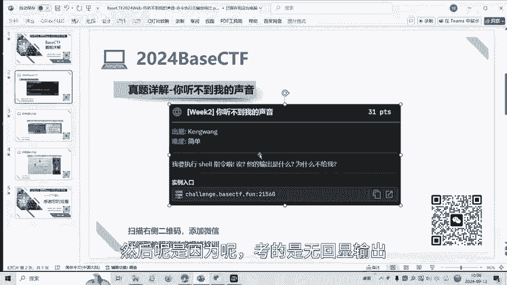

调用的是希尔ESEC函数。

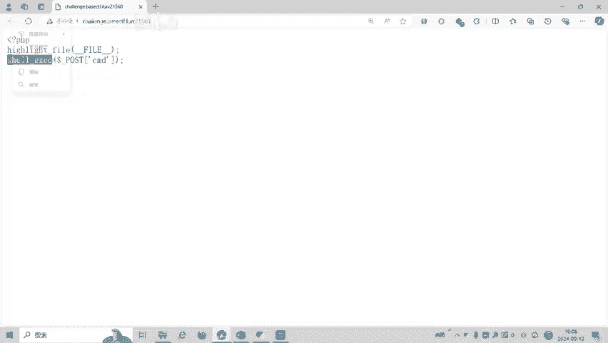

那么ESEC函数。有什么特点呢？我们可以看一下。

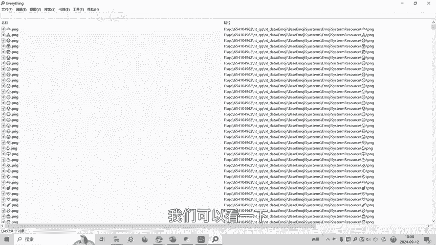

看一下我们的教程笔记。

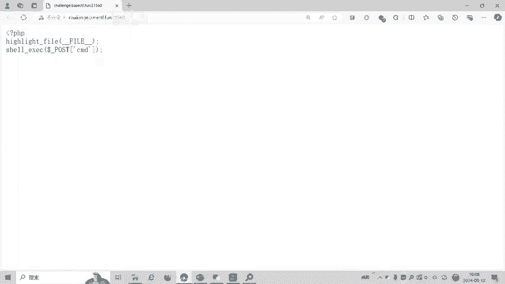

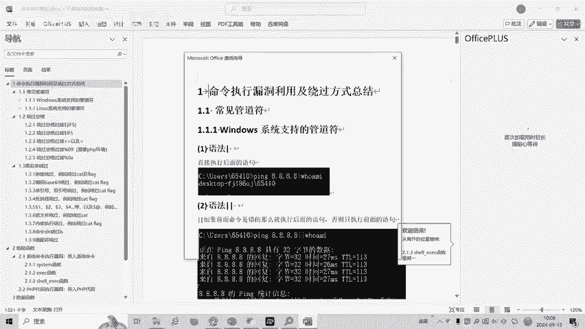

ESE函数呢，它是将命密的输出呢啊作为字符串返回，但是呢不打印到标准输出里面，它会执行一个命令。如果你想输出这个命令的执行结果会加个一个函数，撇G里面要加一个函数。然后依al下一个DC货脉。

这个时候才会将这个国文I执行的命令结果呢在网页里面进行一个回选。一般我们做命令执行题目的话呢，我们可能会直接。直接输出结果啊，但这道题目不是。不是这些输入结果。一般我们是用黑b，然后呢网页加进来。

然后po传参pos传单传的是什么呢？CMB那么就CMD等于L就输出当前目录下。这文件内容而且没有输出，因为什么呢？下ECEC它是没有异构函数，没有输出的话呢，它是不打应到输入标准。遇到这个题目怎么办呢？

我们可以用大于号，大于号是什么意思？利用大于号是成立项。定量输出。比如说大于化呢是将输出结果输入到一个，比如说out。点究是一的。那我们再执行一下。这个时候呢执行完之后呢。

就会在我们的网页里面生成一个output顶贴第一。因为有大于号码除现向输出。对不对？就是生成的个文件，也就是说当前的网站目录下有这个ATTM呀，有PP，还有生成的auPT对不对？我们再看一下。

这里面没有负这个那我们。输出跟目录呢点一下执行。我们再看一下linux跟目录有没有什么东西，发现linux跟目录下有带。那么这个时候我们就要查看登录的下载应该应该结果呢。

通过大于号重新要输出输出到output里电信。这个时候就看到了结果，这道题目考的其实就是CESEC的无回线输出怎么绕过，可以通过linux的大于号进行一个绕过。我们可以百度学习一下linux的。

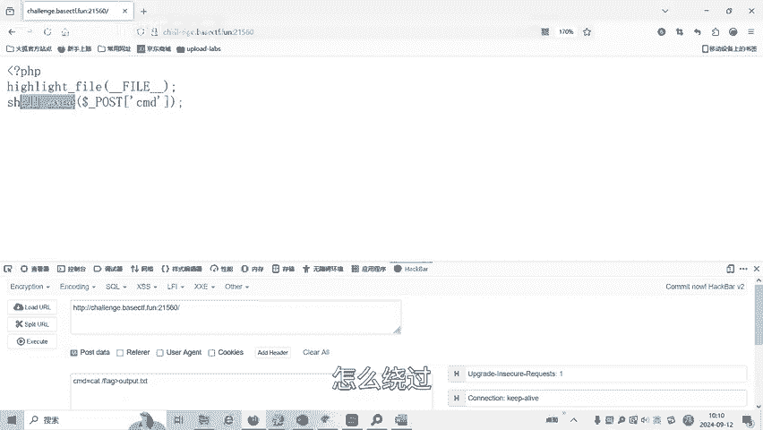

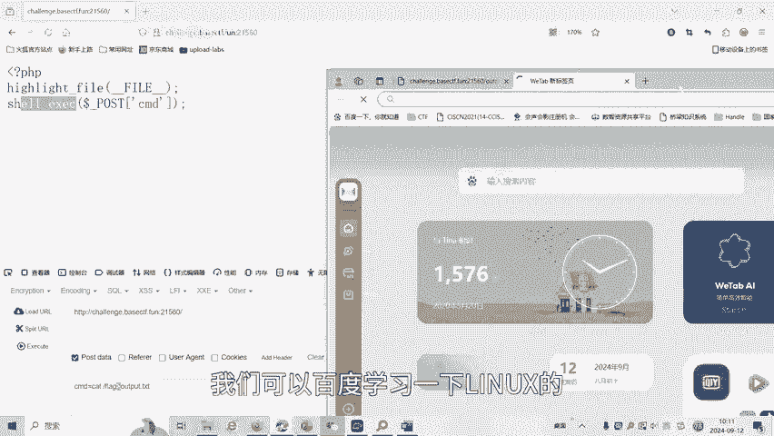

带一会绕过。同一下。你看亲爱的GP已经告诉我们答案了。输出重定向操作谱大于号，用名将一个命令的输出内容，就是执行的结果，输出的内容呢重定向到一个文件中，或者将一个文件内容覆盖在另外一个文件中。

有command啊，就是命令大于快点贴贴，就会将com的输出重定向到快点贴片里去。如果文件不存在，就创建它。如果文件只已存在则覆盖它。

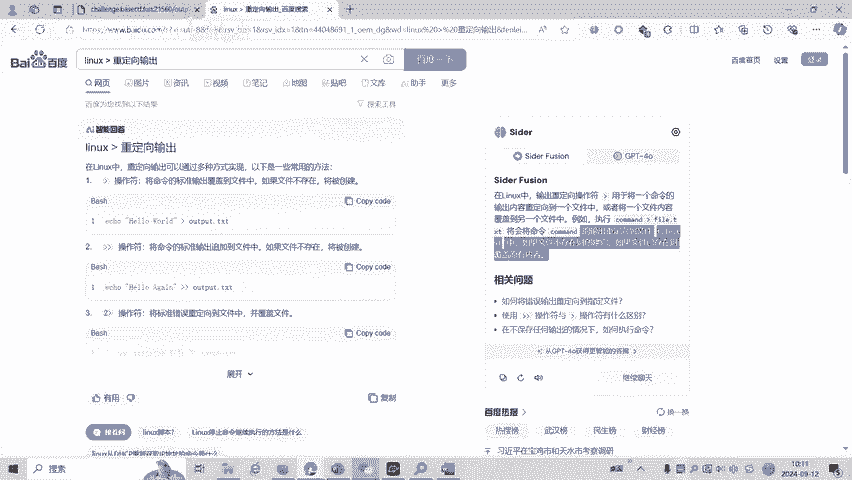

好了。

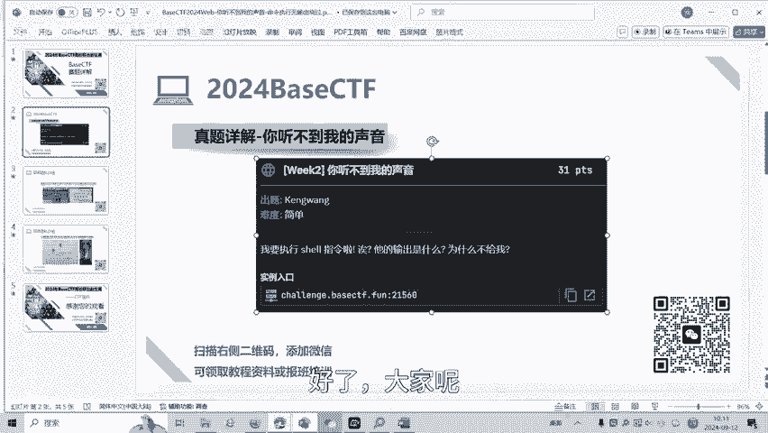

大家呢如果有兴趣进一步深入学习CTF，可以呢扫描视频中的二维码，免费领取工具资料，或者呢报班学习。

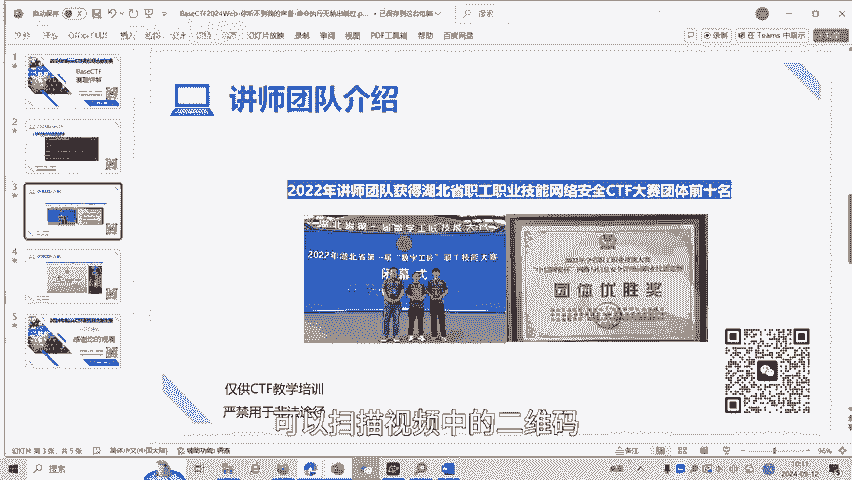

报班了之后呢，我们这里就会有很多的课件。

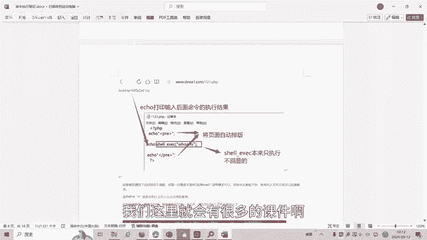

比赛的知识点，比赛技巧以及比赛的脚本。传授给大家。我们的教师团队呢均来自CTF省赛、市赛前十0名的选手。通过顶尖战队的手把手指导呢，大家学完之后，即可达到设在设赛的鹅战水平。好了。

今天的贝斯CTF赛题详解到此结束，感谢大家的观看。🎼Yeah。🎼，🎼The。🎼The。