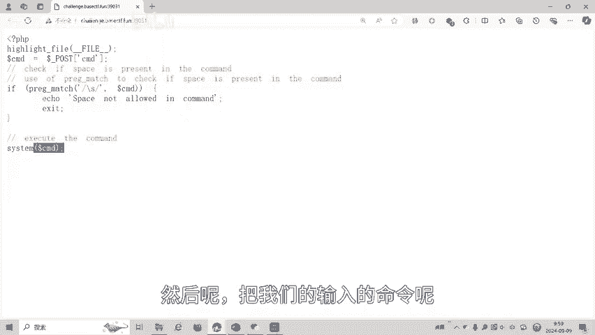
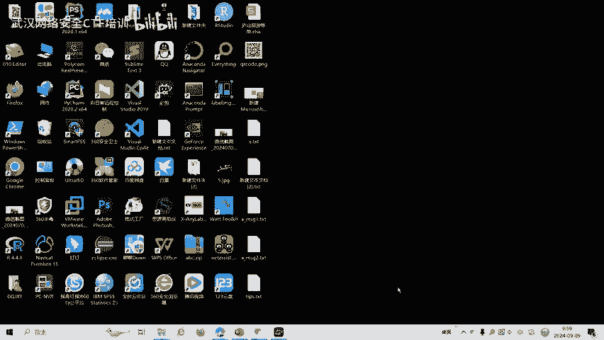
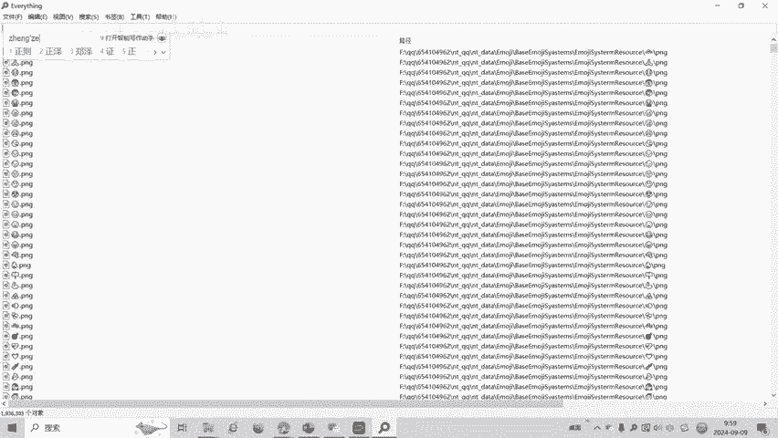
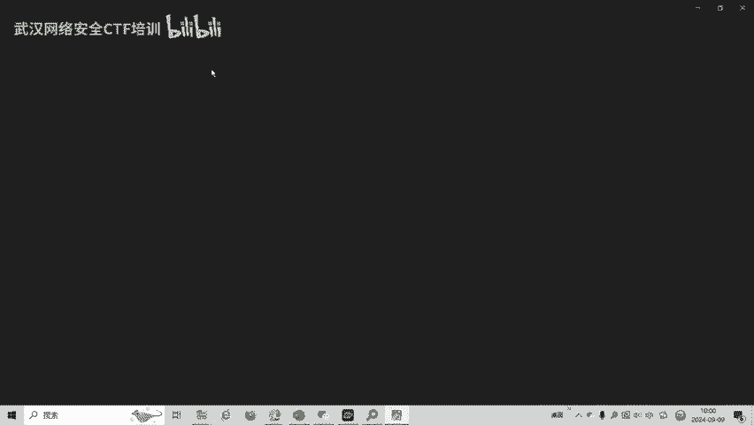

# BaseCTF2024Web-命令执行-空格绕过 - P1 - 武汉网络安全CTF培训 - BV1K2pLeTEgG

大家好，我是阿阳。本视频为2024年贝aseCTF高校联合新生赛赛题详解视频。大家可以扫描右边的二维码，免费领取工具资料或者报名CTF培训班。今天讲的赛题为外部命令执行。只有空格绕过的题目。

如何绕过命令执行里面的空格万？我们看一下这道题目。题目要求我们pos传参，传CMDCMD的值呢传给了CMD变量。然后呢，我们这里有一个。真的表示杠S。然后呢，如果这个命令里面。有杠S。

那么呢就会报错空格不允访问，否则的话就会执行系统命令这些s函数。然后呢把我们的输入的命令呢执行。

那么首先看一下杠S是什么。

匹配任何的空白字付，包括空格。这就是杠S。空格、制表服、换验符等等。这些呢都是杠S。我们尝试一下。必须和我关掉。开个伴板来。bos穿餐穿CMD。等于。我们上人爱。说是当前无了。那么如果IS。

输是根目录呢？这时候就会出现了spaceload allowed in command。那么再看一下命令执行。他的绕果方法。空格固地方的变下。空合过滤可以用这个多纳符，然后呢画括号IF进行一个空格照过。

我们可以看到cat。空格bag我们就是直接输入这个。好，我们试一下。空格，我们这里用多少伏。华国大。です。好。哎，发现输出了根录下的文件，那么再输出根录下的flag。cat。全品。查看有没有下来。

这道题的答案呢就出来了。大家呢如果有兴趣进一步深入学习CTF，可以扫描视频中的二维码，免费领取工具资料或者报名CTF培训班。我们的教师团队均来自CTF省赛世赛前十名选手，通过顶尖战队的手把手指导。

大家学完之后，即可达到省赛世赛的夺奖水平。

好了，今天的贝CDF赛季详解到此结束，感谢大家的观看。Yeah。🎼Yeah。🎼あ。🎼。