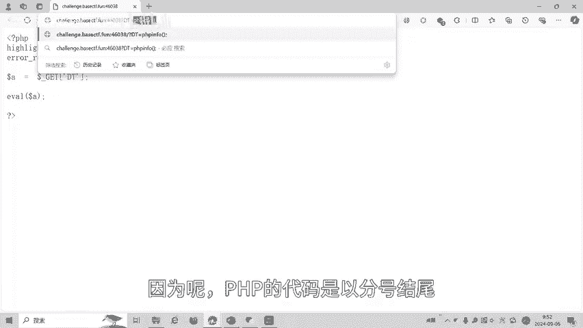
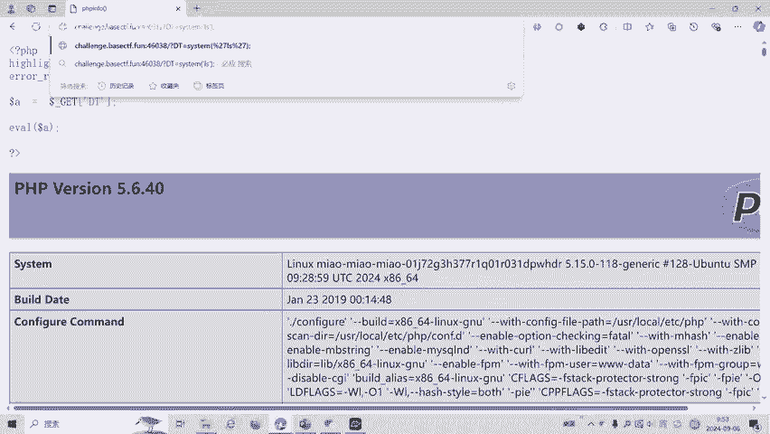
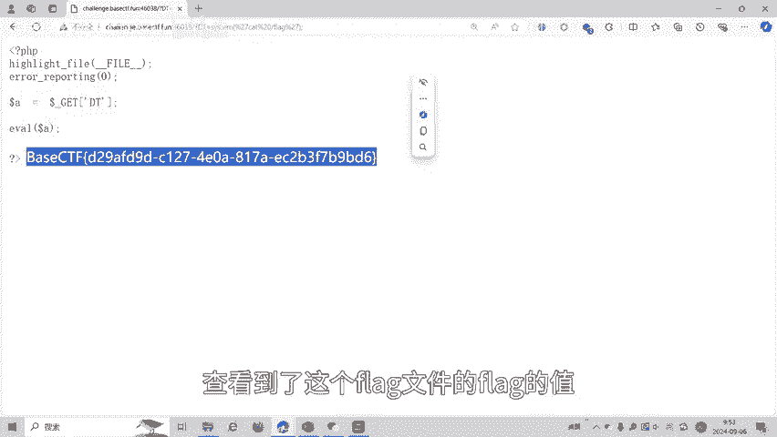
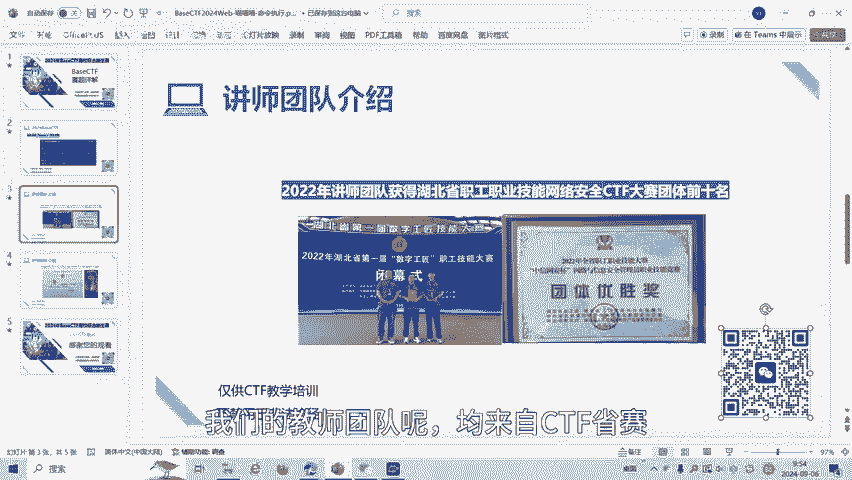

# BaseCTF2024Web-喵喵喵-命令执行 - P1 - 武汉网络安全CTF培训 - BV1nKHUeSEEw

大家好，我是阿阳。本视频为2024年贝斯CTF高校联合新生赛赛题详解视频。大家可以扫描二维码，免费领取工具资料或者报名CTF培训班。今天讲的赛题为命令执行。那也不听我。这是被CTF的一道外部题。

小明在学习PHP的过程中，发现原来PHP也可以执行系统命令。

于是开始疯狂的学习。我们可以看到这道题目的。原代码是get传参传DT这个参数，然后再把DT参数的参数值的赋值给变量A。一函数呢PAAP的一函数呢是把字符串当做代码来执行。

也就是把A这个变量的里面的字符串当做代码来执行。A呢就是我们定一传传三传进来的值。那么呢。这个代码呢就是把用户的get传参当做代码来执行。各个船舱呢我们是问号，然后呢，船舱的变量名为DT。等于。

传单值我们试一下能不能执行PA equal函数THP。IF。马黑。因为呢PHP的代码呢是以冒号结合，所以这里也分号结合。所以这里呢一定要加上分号，然后呢回撤。

我们发现它执行的PAP函数。那我们PAP呢还有一个C次函数，那我们在C函执行一下C次函函数。です。Y S D。我们查看一下当前目录下有没有flag。

我们发现当前目录下并没有flag。那我看一下根目录下，一般的flag在根录下或者当前目录。搁录录下有一个flag文件，让我们查看一下这个flag文件的值。用ca命令。

minim式的看的命令来查看根录录下的对。えち？没着。这个我打错了，这应该。我们可以看到这个时候呢就查到了。查看到了这个flag文件的flag的值。

大家呢如果有兴趣进一步深入学习CDF呢可以扫描视频中右侧的二维码。免费拟职工具资料，或者呢报名我们的CTF评班。我们的教师团队呢均来自CTF神赛设赛前十名选手。通过顶尖战队的手画手指导，大家学完之后。

即可达到神赛设赛的夺项水平。

好了，今天的杯子CDF赛定讲解到此结束，感谢大家的观看。