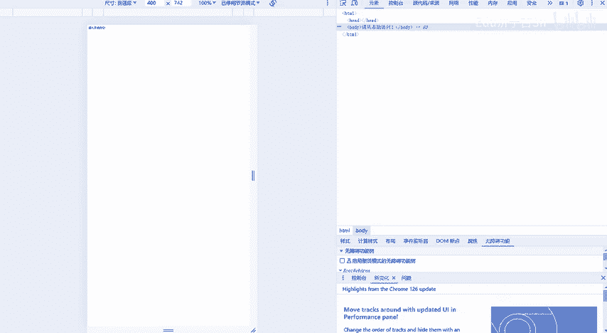
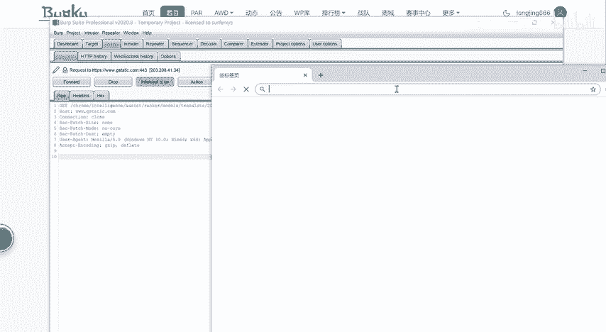
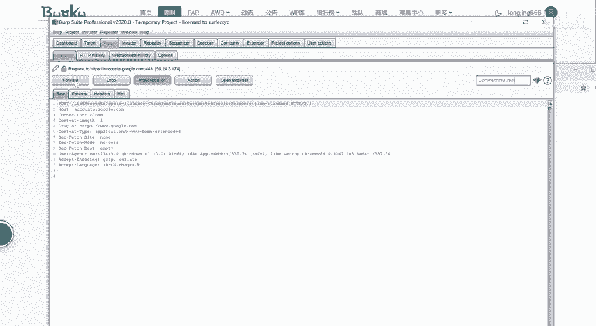
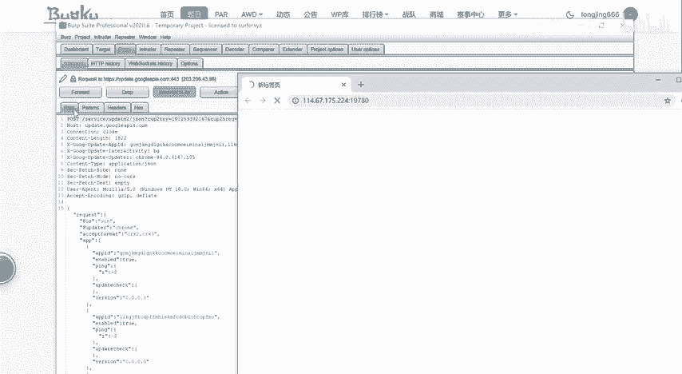
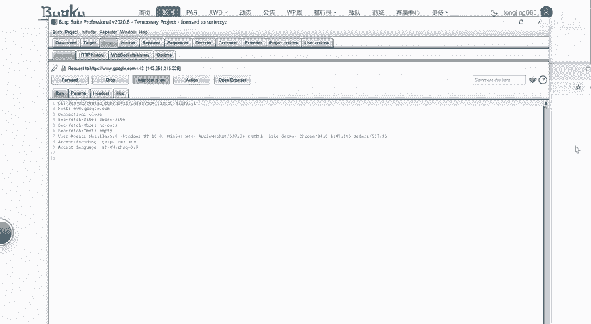
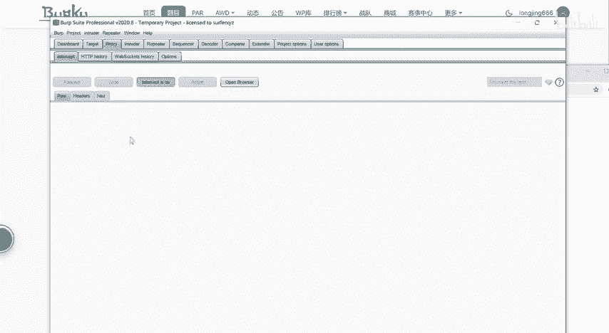
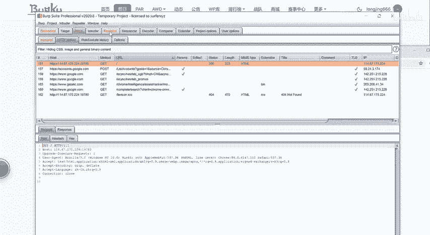
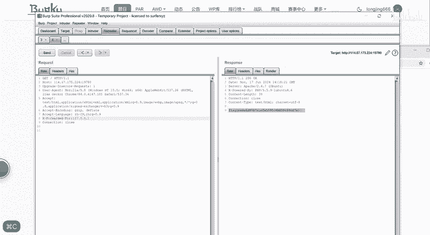

# BugKu-Web-程序员本地网站 - P1 - Edu济宁古Sir - BV1PVgEeVEiv

hello，大家好，欢迎来到八哥库。请从本地访问。

请从本地访问。然后你检查一下。什么都没有，看来考察了你是插for的。

然后那就得抓包。

用BRP。用它内置的这个浏览器。

先打开抓一下。

O。

OK然后。找到你刚才的。😔，这个网址。给他repeat。

然后渗他一下。什么都没有，所以说你在这里。😔，数一个叉杠。Forward。港。F or。冒号127。0。0。再删了一遍。O。flag拿到了。

测试一下。已提交过啊，刚才提交过了，恭喜大家找到了这个flag。

