# B站最全网络安全教程，整整1300集，全程干货无废话，别再盲目自学了，看完学不会我退出网安圈！（web安全｜渗透测试｜内网渗透｜CTF） - P100：99. 第四十九天：Mssql数据库提权2.mp4 - 网络安全官方教程 - BV15u4y137cQ

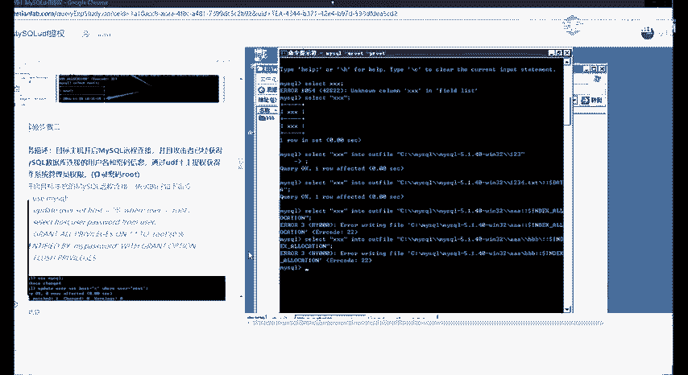

有啊。Okay。嗯。🤧嗯。嗯，好，我们继续啊。呃，刚刚的话给大家就是实际的讲解了，就已经操作了。我们要通过这样子的ADS浏览去创建这样子的一个目录，对吧？然呃下面的话就是。我们的一个第二步。

第二步的话它就是第一种场景，就我们的一个目标主机开启了这样子一个mysql的一个远程连接。然后我们通过相应的一个方法得到了它的一个数据库用户名密码，对吧？

然后我们可以通过UDF的一个手工提群来去获得操作系统管理员的一个权限嗯。🤧好，呃在这边的话，实验这边的话是有。有两个主机对吧？这个立的话就是我们的一个就是我们攻击的一个主机，就我们的一个靶机。

然后这边的一个che的话就是我们的一个呃攻击的一个机器。就我们实际操作的话是在这个机上面去操作。然后我们来去攻击这一个远程的这一个主机是吧？然后呃在这边的话就是实验的话，这里给了。就比较人性化。

这边给了就是呃如何去开启目标主页的一个mysql远程连接。就是说这一个场景的话，它的一个前提的话就是目标主机它开启了一个远mysql的一个远程连接。

也就是说我们能够去远程的去呃登录这样子的一个mysql数据库，然后的话进入到他一个数据库去做这样子的一些操作，对吧？啊，呃在这边的话就是开启他的一个隐形的一个方法是这样子。

然后呃首先的话就是柚子这样的一个my设数据库。就是进入到这样一个mysql的一个系系统数据库当中，然后com这来去更新这样子的一个优则的一个数据。然，其实我们可以通过进来查看一下selectctor。

比如说host。没有走。他说了。For process。从这个。是要。从这个优质表当中，我们查看一下就是。他的一个信息啊，就是主机信下，有用户名密码的一个信息。我们可以通过这个语标来去查看的，对吧？

然后在这边的话就是呃我们要去更新他的这样的一个信息。因为他这边的一个host就表示他的一个数据库的话，它只允许就是说它只允许在本地。

也就是通过loc host的一个方法来去用root方式来去登录这个数据库。所以的话我们想要去远程的去登录的话，我们就需要把这一个host的把它做一个更改。I更改了一个方法，就是upd。

就是呃up date就是。20等于。等于这样子的一个百分号。这百分号的话就表示就是呃任何的一个这样子的一个主机啊，它都能够去通过这样子的一个root的一个用户。

以及其以及他的一个密码来去登录我的这样子的一个数据库。🤧然后这边影响了一行，对吧？然后我们再去查看的话，你会发现这边housest就改成了2，对吧？然后我们更改之后的话。

这个时候的话我们就能够去做一个这样子一个登录了。然后在这边还要还需要去给一个这样子的一个权限，给给权限的话，就是给这样子的一个就是。呃，给来自root的用root用户。

就是来自任何主机的这样子一个root用户呃的一个账号来去登录这样子的一个数据库。うん。😊，我这边的整贴一下吧。就不保存。就不少打了，因为有点长啊，这边。如说我这边的话就用。

这边他就是表示你要去设置一个密码。就我这边话就是围绕咱就。哦。继行。执行执行之后的话。然后的话刷新一下权限。就fresh privileges，也就是刷新权限。

就是我们的一个在数据库表当中去做了这样子的一些操作的话，我们需要去通过这个来去刷新它的一个权限。因为我们这边的话通过grant来去呃更改了它的一个权限嘛。

对吧所以的话我们在这边需要通过就是通过这个语句立即的去刷新它的一个权限。然后的话就是能够去立即生效。呃呃，然后在这边的话。

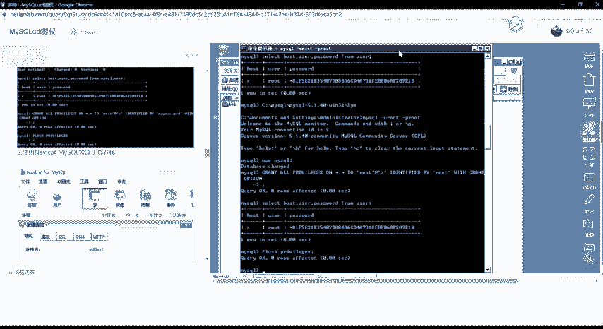

我们切换到这个攻击机上面，就其实这个的话就是才是我们实际要去。

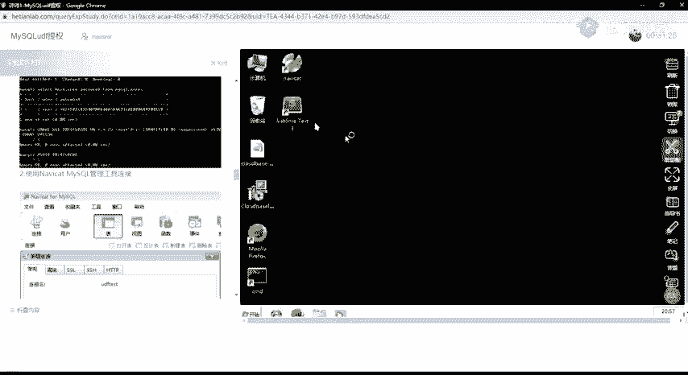

操作的一个机器，就前面这边的话就是实验指导书，这边是告诉你。我们要去在我们那一个目标器上面去，通过这样的一个方法能够去开启这样的这个远程攻交。然后呃这边的话我们通过访问那个。访问这一个网子对吧？

我们这一个网址，然后的话下载我们所需要的这样子的一个工具啊以及代码。然后就是在这边，我这边把它。可到。真咩。解押。解了之后的话，在这边有这样子的这个NVca这样子的一个数据库的一个连接工具啊。

我们可以通过这一个工具来去连接我们的这样子的一个远程的一个数据库。然后呃我们这边连接名的话，就比如说。佢哋一份啊。好，嗯。主机名的话就是这边的这个呃立可的这个主机啊，就是这边IP的话就是这个。1。

101对吧？然后呃密码的话是note note也是我们已知的对吧？就我们要去连接这样的一个数据化，我们就需要知道他的一个呃账号密码嘛，对吧？好，我们尝试连接，在这的话可以看到这边的话已经连接成功了。

对吧？我们能够去访问到他的这样子的一些数据，连接到他的一个数据库。啊，呃大家自己在做的时候，可以就是你可以先在这边一先尝试去。去连接一下。Yeah。因为呃你前面的话没有去配置这样子的一个权限的话。

你是不能够去远程的去连接的，需要去配置这样子的一个允许它的一个远程连接之后，你才能够通过这样子一个方法去远程的连接这样一个micsl的一个呃服务器。对吧啊呃。连接连接服务器之后的话，我们在这边的话。

就我们可以直接去操作它一个数据表，对吧？然后在这的话我们可以通过这样子的一个。方法就是新建查询。呃，在这边啊就是你连接之后，这一个这个工具大家应该进行常用吧。就我们点这边查询对吧？

查询这边我们新建一个查询。🤧新建一个查询之后的话，在这边话，我们就可以去呃输入我们的这样子的一个查询的一个语句。像比如说。Leting from。Yeah。🤧呃，这没有表。Mhm。比如说我修这被啊吧。

我在这边的话就能够去。呃，执行。我们的这样子的一个mycyclcle的一个查询的一个语句，对吧？然后大家要注意的话，在这边的话，因为你是在这一个t表下面去查询的。所以的话你当前的一个操作的话。

是在这个表下面。然后如果说你在这边，比如说你mycycl这一个表下面，对吧？你去新建一个查询的话，你就在mymycyclcle表下面。然后这边的话我们可以通过。The対我。来去查看。

就是在这个数据库当中的所有的一个表。是吧。我。然后呃前面的这两个表的话，就是mycycl的一个系统表。然后在这边的话，我们就以这一个t的表。在这个表当中去创建这样子的一个临时表。

然后呃我们通过这样子的一个语句。我们首先的话我们当前呢是在这样子的一个t的一个数据库当中，对吧？然后我们可以通过c来去创建这样子的一个table。创建一个tables，然后table的一个名字的话。

我就跟他这边的一样，以及这边的一个表的一个类型。甜皮。🤧就不了等会就是不会那么难区分了。Yeah。🤧然后在这边的话就是创建了这个表下面的话，创建了这样子的一个字段，就是这1个UDF的这一个字段。好。

我们来运行一下来。然后我。哎，我错了。这个差。啊，不是table是create table。Yeah。然后执行之后的话，在这边的话就。Okay。可以看到这边他没有没有包错的话。

就说明我们这边语句的话之行成功了。然后我们这边可以。嗯，没有。通过。S tables。你去查看一下，可以看到这地的话就进进入了建立了这样子的一个tampUDF的这一个表，对吧？嗯。

可以看到在这边的话就建立了这样子的一个tampUDF的一个表是吧？然后我们可以通过。S。带薪放这样子的一个。Temper。在这个表当中去查询啊，然后查询的话。

在这边你可以看到有这样子1个UDF的一个字段，对吧？但是在这个字段下面的话，因为我们没有插入数据，所以的话它这边是空啊，就是浪，对吧？说明的话我们这边创建了这个表的话已经创建成功了。

就创建了这样的一个临时表。这个临时表的话，就是用于我们写入我们的啊这边的一个deL的一个数据。那么下面的话就是我们需要去将我们这边的一个。一定有文件的一个二进制的一个数据插入到这个表当中。然。

呃在这边的话，这个DL的话已经这边已经给出来了，就是在。He。这里这个的话给了这样子一个文档，对吧？这个文档的话就是我们这1个UDFDL的一个数据啊，它这个话是1个16进制的一个数据。

就是他把我们的一个这样子的一个调文件，一个二进制的一个。文件把它给转成了16进制，就是转成16进制的这样子一个格式，对吧？因为呃转成1六进制的话，这样子的一个是我们能够去。这样子的一串代码，对吧？

是我们能够去直接的去呃查看到的。不然的话你平常比如说你要去打开一个像这种可执行文件，对吧？对吧？二进制的这种文件的话，你打开的话，它是一个乱码的对吧？然，在这边的话。我们复制这一个这一串代码。

然后我们通过这样子的一个方法把它给插入进去，就是通过inset。这样子的一个语句。inset进去的话就是插入数据嘛，就是像我们这边的这个表当中去插入我们的一个数据口道。嗯。下边一句。

查不到这个tKDF的这个表当中。对吧。然后值的话呃。值的话为这边这边要注意的话，这边comment的话就是把我们这边的这一个镜子把它做一个转化。

就把它转换转换成原来的这样子的一个二进制的这样子的一个数据啊。小明。嗯，是有啊。外。用这一个空外的一个函数来做一个转换。然后转换的话，前面这一部分呢就是我们刚刚所复制的那个实刻定制的一个代码。

然后这地话。是。🤧看就是我们要去转换的一个类型。然后这边的话把我们这边复制的这一创代码。呢种。没。怎么快练行啊。我听个。OkayYeah。这是。嗯。哇。嗯。这个。这边不能他不能乱，哎。

怎么不能用快捷键呢，刚刚还可以用啊。

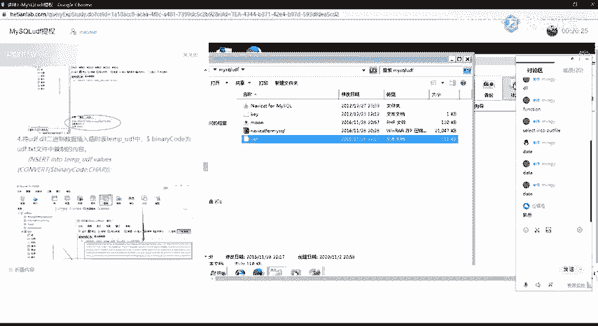

Car。哦系。

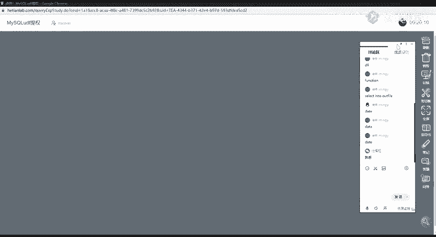

Okay。Yeah。怎么全学？Okay。嗯。我这的话呃。Yeah。复制这边所有的一个数据，把它给扩ll到这边了。呢个。暂贴。呃，粘贴过来粘贴过来之后的话，就是这样子的一个语句啊。

就比较长很长的这样子的一个语句。然后它的一个作用的话，就是把这边的这一个数据，它会把它转成一个呃恰的一个格式，然后的话存存到这边了。啊，我们运行运行之后的话，在这边发现就受影响的是一行。

就是你看到这样子的一个结果，就说明我们这边的一个语句的话，它执行执行成功了也是没有错误的。多带理。Okay。我不。呃，是。对。然后关注了。Yeah。気持ちいい？T。那我刚刚没写错吧。嗯。嗯。🤧Yeah。

Oh。然后呃在这边的话，我们可以通过查询它里面的一个内容啊，可以看到在这边的话，我们的一个内容其实已经写进去了，写入到了这样子的一个。呃。

对吧这边的话就是这边的话其实就是啊我们正常的在比如说在我们window系统上面去打开这样的这个d文件的话，是会显示这样子的一个乱码，对吧？也，可以发现在这边它是一个D的一个文件。

然后显示这样子的一个结果的话，就说明我们这边的话呃是把我的一个内容已经写进去了，对吧？然后写进去之后的话，下一步就是我们需要去把它导出来。导出来的话，在这边就用到这一个d file，引出d file。

Yeah。那个我这边的话直接复制粘贴吧。有点长就不打了。是那呃。就是这样子的一个语句啊，就是从就slectUDF嘛，又从我们这边的一个t输入库程中，对吧？就是把UDF这一个字段当中的一个内容。

对吧从这一个表当中查询出来，查询出来的话，导出导出到这样子的一个目录下面，保存为这样子1个UDF点DL的一个文件。好，呃，在这边的话我们来执行一下。执行之后的话，发现执行成功了啊吧？执行成功之后的话。

我们在这边的话，因为我担心是在公积金，对吧？我们可以就切换到我们的这个码机上面去查看一下，对吧？去验证一下。当然这边话只是为了验证。我们可以在这个ligo下面pagging。

因为发现他在这边就多了这样子的一个d的一个文件，对吧？比如说我们用即术门打开，你会发现它就是这种乱码的对吧？其实就是刚刚我们的这样子的一个内容啊，已经写入到这个文件当中，对吧？

那么我们的一个D文件已经成功的就是上传到了我们的一个目标的一个指定目录下面去了，对吧？那么下一步的话就是我们要去利用它的这个D文件来去创建我们自己的一个啊定义的，就是用户自定义的这样子的一个函数。

然后这里的这个自定义的函数的话，就呃创建在1个CMDC尔的一个函数。它的一个作用的话就是用来可以去调用我们的一个系统的一个命。是吧。

它的个语句的话就是像这样的就是create function创建这样子的一个函数，这样子的一个函数。它那个函数名话叫CMD线。然后的话后面的话就是他去调用这样子的一个呃调文件的一个语法呀。

就是通过这样子的一个方法。啊，我们执行执行之后的话，发现呃没有报错，对吧？就说明我们的一个命令化执行成功了。执行成功之后的话，我们在这边的话，我们就可以去呃利用它来去进行一个执行系统的一个命令。

比如说我们可以通过。s上低票。来去执行，比如说。🤧我这边执行1个IP封闭的。啊。运行运行之后的话，在这边是它的一个结果，它的一个结果虽然是显示这样子，但其实它的一个内容的话呃。

是能够我们可以通过这样子一个方法能够去查看。这边右键右键这一个另存报号befi。然后把它保存到我们的一个本地的一个计算机上面去。比如说我。应该3。Yeah。123。保存成这样子的一个验3的一个文件。

那我们在这边打开打开之后的话，在这边的话就是它的一个执行的一个结果啊。

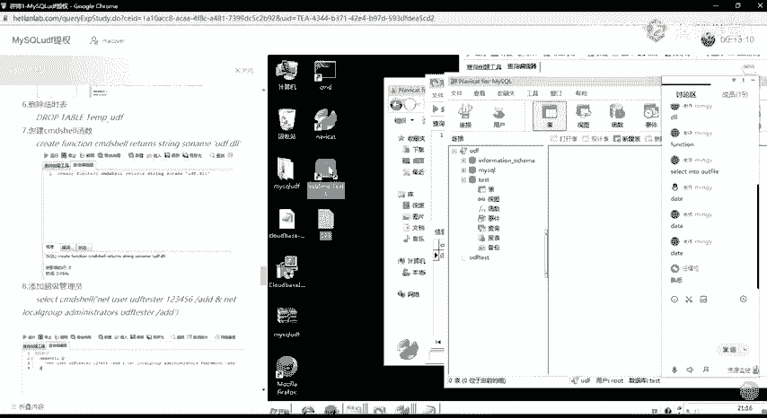

我们可以看到这边的话就只他之前IPconfi之后的话，他这个内容就是这里的这一部分，他那个机器的1个IP是这个对吧。

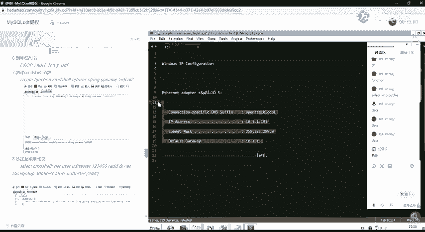

以及我们还可以去执行其他的系统的一个命。

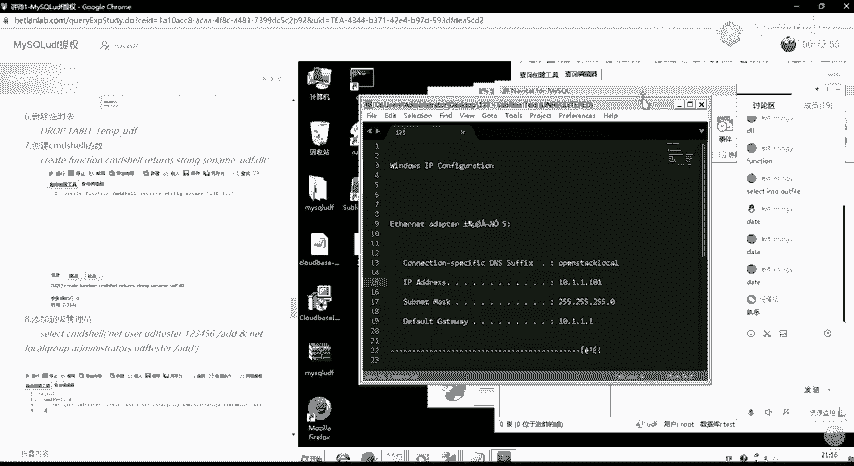

系吧。对吧。比如说呃。141的对啊。我们运行。好想你。

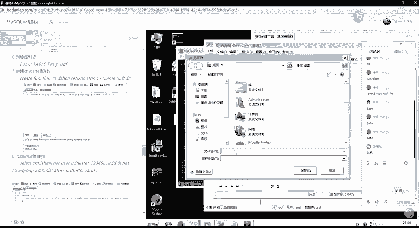

好好。啊。对吧这个话就是我这边执前net优者之后的一个，然后这边的话是乱码的话，就是它是中文的嘛，它编码的一个格式的一个问题。这边的话其实无所谓的对吧？我们只需要这一些内容就OK了。

这边的话就是它的一个呃目标机上面它的一个用户名。对吧也就是我们现在话就能够去执行我们的一个系统的一个命令。

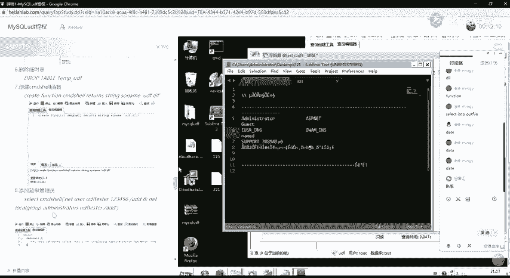

二。我们。查看我。

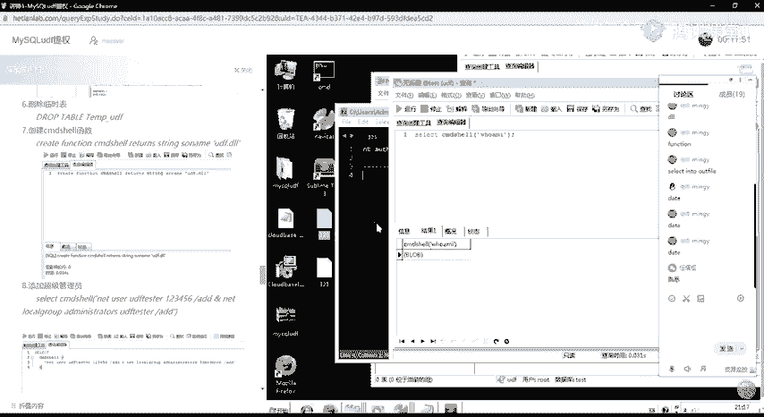

查看我当前的一个权限。然后在这边的话，我们可以看到直接就得到了他的一个最什的一个权限。然后呃就是等于就是我当前我去执行这种命令的话，我是一个s的一个群序去执行的。

所以的话我这边的话得到的是它的一个最高的一个权限。

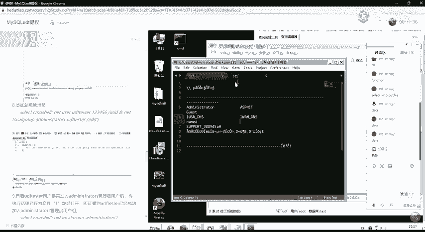

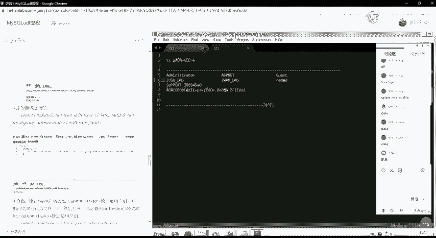

啊，然后但是现在的话我这边话是只能通过这边的一个mycycl的一个命令去执行，对吧？那么我们想要去进入到它的一个系统，对吧？那么我可以通过这样子的一个命令的一个执行来去添加一个系统的一个管理员账号。

对吧？然后的话我直接再通过远程的一个登录，登通过这一个管理员账号来登录到我的一个目标的一个机器，对吧？

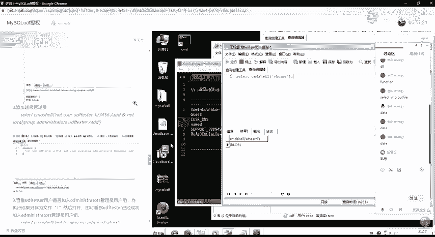

然后这边的话我就不再演示了，就是添加如何去添加这样子的这个用户。这个的话应该是大家应该都比较熟了。啊。Yeah。呃，这边的话就是第一个场景。然后第二个场景的话就是在已经获得web share权限。

然后的话我们的一个测试人员可以上传这种PH脚本，但是的话我们无法去执行这样子的一个操作系统的一个命令。然后的话呃同样的我们可以利用这1个UDF提取。

将我们的一个web share的一个权限提升到管理员权限。而其在这边的话就是他呃这边是介绍这一个脚本，就通过这个脚本的话，这个脚本上已经就是把我们前面的这个优点很齐全的这样子一个步骤。

已经就是把它集成到这个脚本上去了。对吧然后我们得到了一个will share，我们可以通过呃上传这样的一个PHP的一个脚本，然后的话来去进行一个这样的一个呃提全啊。当后呃上一步的话，其实就是说。

我这一个场景的话是有假设对吧？是有假设它得到了一个vition啊，但是如果你没有得到一个vition，你只知道它的一个mysql的一个呃数据库，对吧？就比如说你在内网，你通过呃某一个机器。

你得到了其他的机器的一个mysl数据库的一个这样的一个用户名密码的一个信息，对吧？然后的话你能够去远程连接到它，那么你就可以去尝试用这样子的一个连接上去之后的话。

尝试用这样的1个UDF提全的一个方法来去进行一个权限的一个提升。然后在这块就是你得到外部需，然后你就是其实就是我刚刚说所说的一个场景嘛，是吧？你可以去上传上传我们的一个这样子的一个脚本。

但是的话你去执行呃系统的一个命令的话，它是受限的。所以的话就其实你得到这个需要，你不能够去执行命令的话，那么你这个需要的话相当于是就没有什么太大作用的对吧？你只能够去上传文件，下载文件啊。

那么在这边的话，我们就可以通过商传这样的一个文件。上传上传到我们的一个目标机上面去。然后的话它这边的一个脚本的话，它的一个作用就是运用这个UDF提全的一个方法。

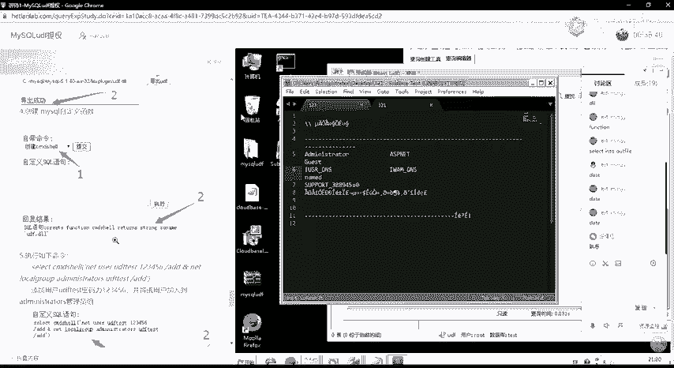

呃，具体的一个。操作的话就是。呃，我们这边的话。呃。我们这边的话就是实验机的话，已经把这一个脚本已经就是。上传到了这个。目标机上面去了，就是他这边的话没有模拟说没有去模拟，没有去模拟。

就是我们得了外部C。然后的话把它上传到这个上面啊，就省去了中间中间的这一步。然后我们直接从就是我们上传到这一个上传了这个脚本之后，对吧？我们怎么去利用它。

然后在这的话我们同样的需要去知道它的一个数据库的一个账号密码。然我们。提交。提交之后的话，在这边我们就呃已经登录上了我们的一个目标的一个机器，对吧？然后登录的是呃这样这样子的一个test的一个数据库。

然呃在这边的话呃这边的这个东西的话，我们可以在这边去上传文件。就是有这个脚本的话，我们可以在这边去上传文件，上传到直接的一个目录下面去。然后呃还有的话就是呃这边的话是它的一个wordb的一个目录。

然后在这边下面这个的话就是我们的一个mycycl的一个安装目录。呃，它这边已经就是已经填好了这边的一个就是目录下面呃，这1个UDF点DL的一个呃路径啊，然后我们只需要顶顶击这一个导出UDF。

它就会导出到我们的这一个目录下面。那为其实前面的话我们已经就是有导出了这个有点毁凝标。所以的话它这边说已经存在了，对吧？这边的话是正常的。然后导出之后的话，我们在这边我们就可以去呃创建s姆地希尔。

以及添加管超级管理员中用户对，反谈希尔等等的这样的一个操作。我们这边的话就以这一个创建s姆地希尔为例。呃，因为前面同样的也已经创建了，对吧？所以的话他这边话报了这样子的，就是说。

这一个项B的一个函数已经存在了。好，这句的话我们就直接通过s来去调用这样子的一个方选来去执行。我们的一个系统的一个命令。对吧比如说Iapp可工地。嗯，我们执行执行之后的话。

它的一个结果的话就显示到了这边。对。以及。たま。Yeah。对吧这边的话就是显示它的一个结果。这是这个脚本的一个使用啊。呃，这边的话应该就呃原理的话就是我们前面讲的这这两这这边的这个操作。

只是它这个脚本的话已经集成了。然后其实你可以打开它的这个脚本查看。

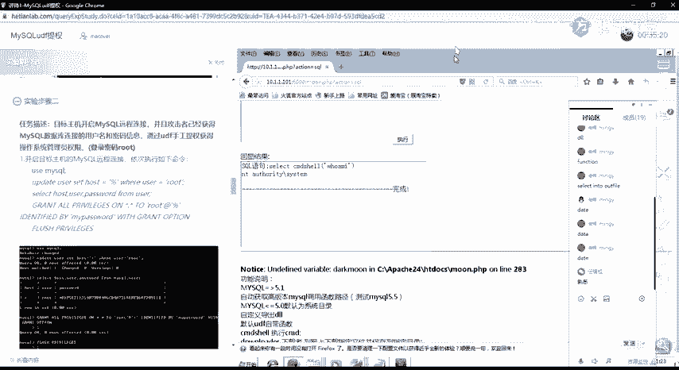

它里面的一个内容就是这个。对吧就这这面的一个内容，它的一个内容话比较多。然后呃其实。他的一个。嗯。对，其实呃我们刚刚不是有一个导出UDF的那个。操作嘛，其实他的这个文件里面的话。

他就已经把那个UDF的一个内容已经就是写到了这个文件当中嗯。Okay。啊，这个话我就不找了，因为你可以往这边拉有好多，因为它那个呃优联文件的那个字符串的话比较长啊。

大家可以去看一下，去找一下。然后这个脚本话其实就是集成了我们刚刚那个操作，原因的话都是一样的。啊，你只只要知道怎么去用就OK了。呃，这边的话就是这个mycycl的1个UDF提全的一个实验。

以及详细的一个步骤。有大家有没有什么疑问？可以现在提。嗯。大家有问题吗？有问题的扣一，没问题的扣2。

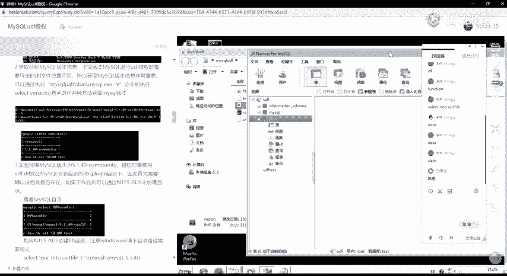

就一位同学吗？两位。

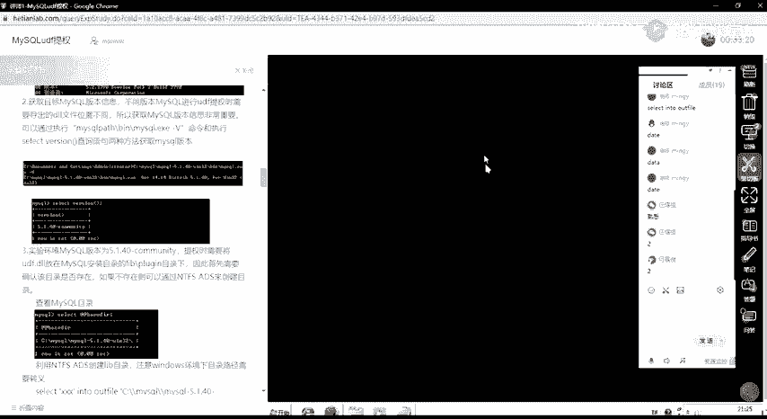

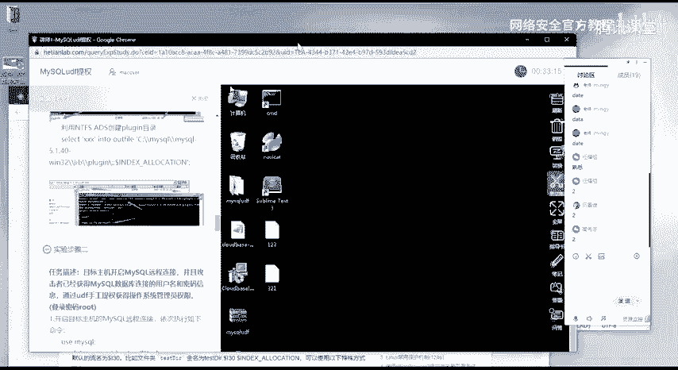

三位同学，其他的呢？

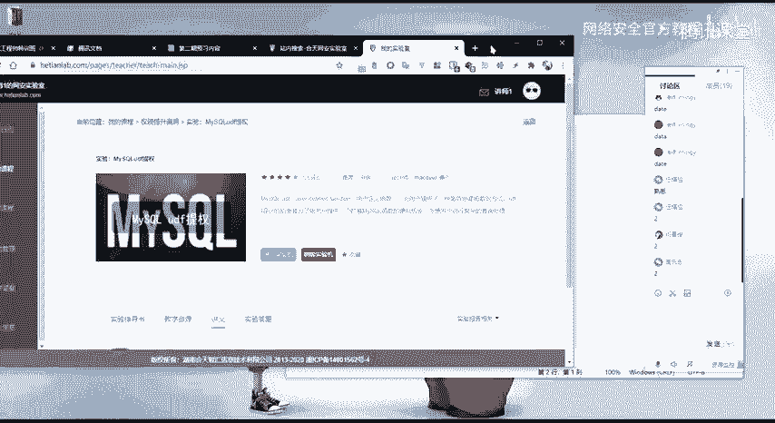

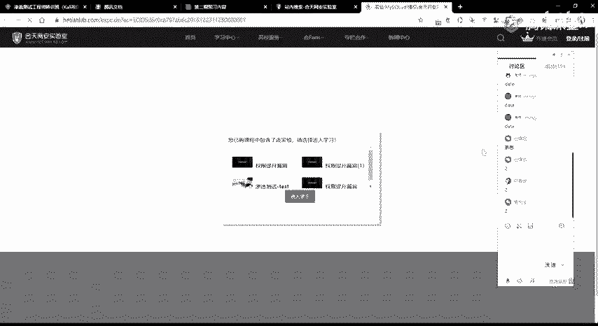

Yeah。其他同学有问题吗？这有18个人，怎么怎么就三个同学回我呢？

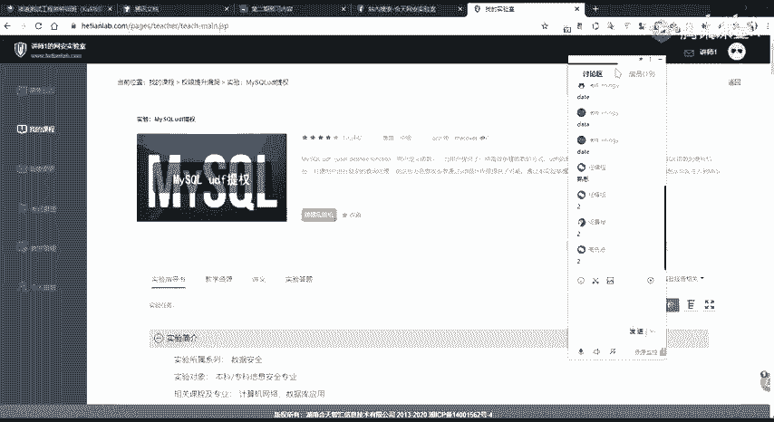

Okay。Yeah。行吧，大家不是很喜欢不是很喜欢跟我互动了，我发现。

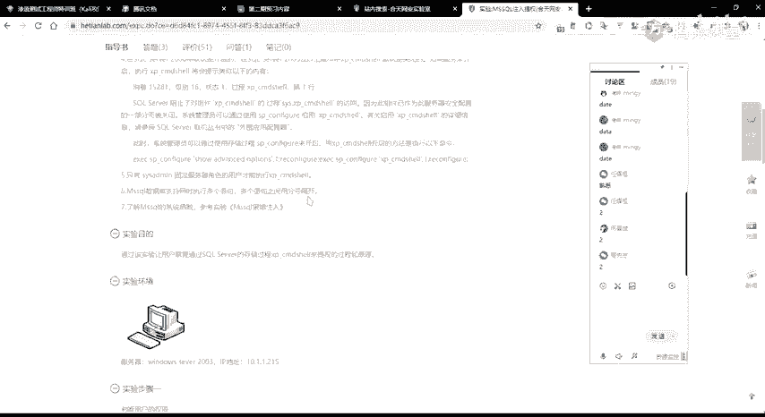

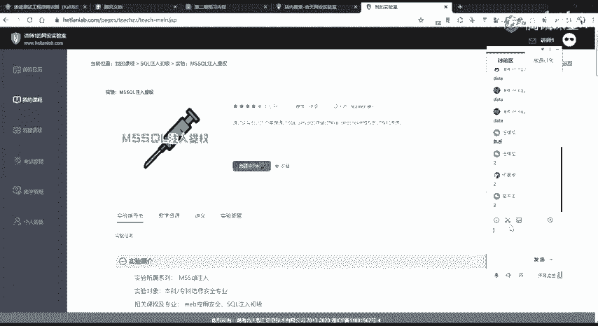

那应该应该我就默认大家没有什么问题，好吧。

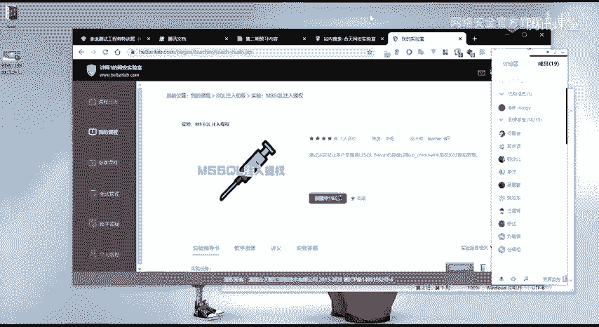

啊，我们继续我们的一个内容。上面前面的话就是给大家介绍了就是mycycl提全的这样子的两个情景下面的一个详细的一个方法。我这边PPT的一个内容的话，就是呃给大家介绍了这样子的一个过程，对吧？

就梳理了这样子的过程，详细的一个内容的话，大家去看那个实验室，对吧？好吧。然，呃下面的话就是介绍一下这个sax server的一个提全。

就sex server的话跟mys同样的是我们经常去使用到的这样子的两两种数据库，对吧？然呃my circle的话它是在windows以机呃linux上面都能够去使用的。而serv server的话。

它是windows windowsdow serverwindow服务器上面的就是。就是专用的这样子的一个数据库的这样子的一个数据库。然后的话呃讲这个servserv我的一个提全的话。

我们首先要去了解一下这样子的一个XPCMD share的这个呃。这个扩展存储过程，就是你可以把它理解成一个这样子的一个组件啊。就是这这一个这一个组件的话。

它可以就是按系统管理员以操作系统命令含解释器的一个方式执行给电的一个命令字符串，然后它并以文本行的一个方式返回任何的一个输出。就这句话怎么理解呢？

就是说我们就是我们的一个系统管理员可以用这一个呃扩展存储过程来去执行我们给定的一个命令。然后给定的这个命令的话，它会是在它的一个就是操作系统上面去进行一个解释执行。

也就是能够在系统上面在我们的一个目标系统上面去执行我们给进的一个命令。然后的话它会友好的返回输出给我们。啊呃。在这边的话就是由于这个XPCM机需要，它的呃还它可以去执行任何的这种操作系统的一个命令。

所以的话呃。它是有一定它是有很大的一个危害的。就是如果说我们的一个sel的一个管理员账号，就是SA嘛。如果他我们获得了他的一个管理员账号，我们连接到这一个数据库之后的话。

我们就可以利用这一个叉BCMDC。来去执行操作系统的一个命令，来得到操作系统的一个权限。所以的话针对这个XBCMDCL的话呃。在这边后面的话，他会有就是。有这样子的一个限制。

就是在saxel两0当中的话，它默认是开启的。但是2005以上的这种版本的话，它的这个是默认是关闭的。就是呃就是新版本的saxserv的话，它是呃这个XPCM机器它是默认关闭的。

所以的话我我们无法去直接的去使用它。就呃如果我们执行就是如果说这一个。主件它关闭的话，我们执行就通过这个XPCMD线去执行命令的话，它会有报这样的一个错误。这个话就是让大家了解一下，就如果你。呃。

发现报了这样这样子一个操。那么就表示这边的一个XGCMD share的话，它是没有开启的。他呃。这边的话就是如何去利用这个叉PCMD share尔的一个语法，就是通过这样子的一个方法。

就EXEC执行这样子的一个呃叉PCMD的一个需要的一个扩展过程。然后后面的话接我们的一个要去执行的一个命令的一个字符串，就多s命令吧。啊，前面的话有介绍，就是说在新版的这种s server。

它是默认关闭的对吧？那么它默认关闭，我们是不是就不能用了呢？就是不是的，就是呃它虽然阻止了对这一个XPC必逐渐的呃这样子的一个访问。但是的话我们呃可以通过这样子的一个方法SP confi来去启用它。

当当然的话在这边的话要注意就是。是只有系统管理员，他才能够去通过这一个方法来去启用它。所以的话就我们要去进行这样子一个提全的一个前提条件是你要有你要去得到了这样子的一个呃。管理员的一个账号的一个权限。

或者说你能够去以这样子的一个管理员的一个权限来去执行这样子的一个命令。这边的话大家要去注意要注意的一个点。然后呃如何去启用这样子的一1个XPCMD选呢，就是通过这样子的一个方法。呃。

就是使用这1个SP的一个confi来去首先的话启用这一个。然后的话呃录空fi的话就是我们这边启用了这一个呃设置唯一的话就是表示启用。启用之后的话，它会去重新配置。

也就是就跟我们前面刷新我们的一个配置一样的嘛，对吧？然后的话再他再去启用这样一个叉BCMD的一个需要。然后的话刷新配置之后的话，我们这边的话就启用了。

然后我们就能够去去调用它来去执行我们的一个系统的一个命令。好，呃，关于这一个s赛我的一个提群的话，在这边通过这一个实验。

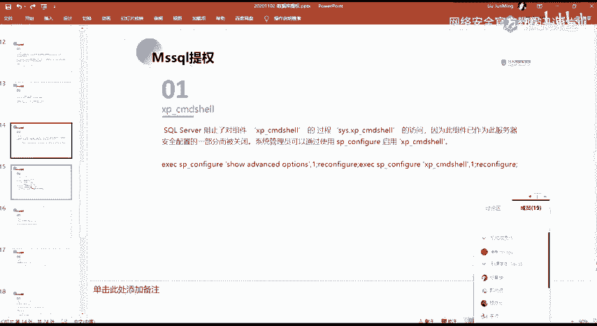

这一个sex server就是M micro sex server的这样子的一个注入提权。

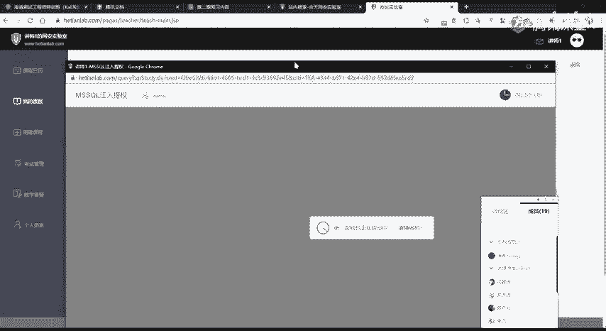

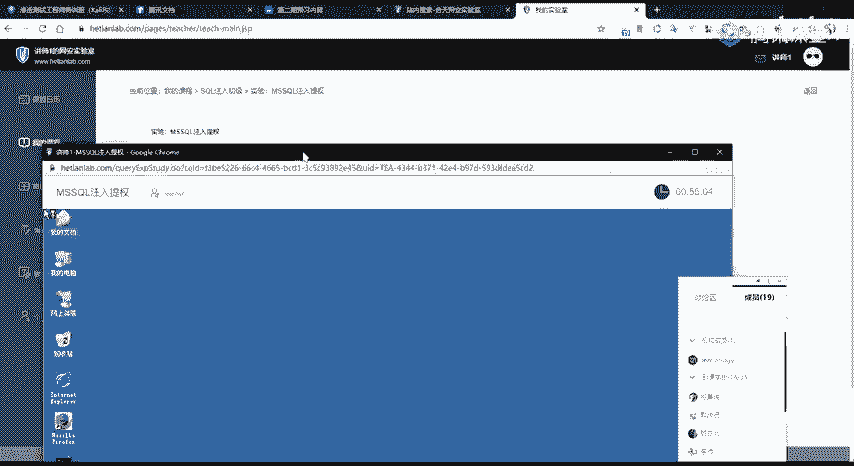

的就是通过这一个实验。然后这一个实验的话呃，指导书的话同样的也很详细啊，就是详细的介绍了它的一个过程。就呃在这边的话，这一个实验的话，它是首先它是通过一个注入点。就通过一个s server的一个注入点。

然后这一个注入点的话，我们因为我们知道我们的一个circle注入的一个利用方法的话，就是呃或者说它的一个漏洞的话，就是我们可以去呃注入我们自己的一个circle的一个语句。

然后的话把它带入到呃目标机器目标的一个cirl的一个服务器上面去执行，对吧？所以说在这边的话，我们找到这样子的一个circle注入点。

那么它可以去就是执行我们这边注入的额外的这样子的一个恶意的一个circle语句，对吧？然后的话代入到它的一个cirle服务器上面去执行。执行之后的话来返回相应的一个结果就是。Yeah。🤧Okay。

然后首先的话就是就是呃有这样子的一个注入点。就是这边的这一个实验，就他这边已经。

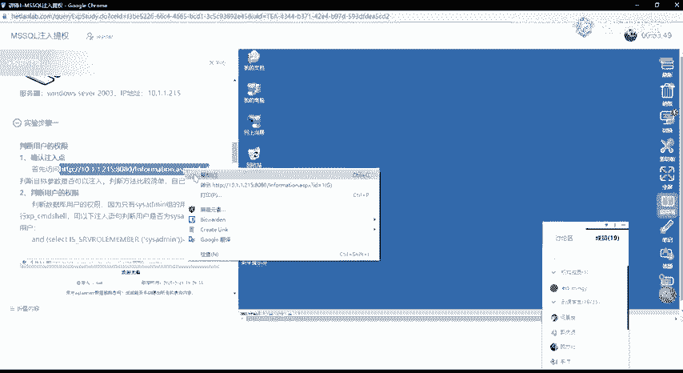

呃，提前给了这样子的一个注入点，就我们利用这个注入点来去进行一个这样子的一个提群。🤧访问访问之后的话，就是这样子的一个相当简单的一个页面，就是呃。就是呃欢迎光临，就是抱抱，对吧？

然后呃他的1个UR的话就是像这样子。然后通过他的1个URR这边，其实我们就能够就是大家对社购入入比较熟悉的话就是。看他的这样子的一个参数，我们就能够去基本的去判断，对吧？对一般的话s狗入入的这种点的话。

它是会就是有对应的这样子的一个参数，对吧？然后这个参数的话，它是从数据库当中去获取数据的。就是说它有与数据库去做这样子的一个数据交互，那么我在这边的话就能够去利用它。

就如果说它存在这样子的一个s狗注入漏洞的话，我们可以利用它的这一个参数来去注入我们自己的一个sle的一个语句，对吧？然后这个的话就是它ID等于一对吧？那么我们尝试一下ID等于2ID等于2的话。

它这边没有数据，对吧？三。是。都是没有数据，那说明的话他这边只有一有数据啊，是吧？或者说它是没有这样子的那个ID值是吧？那么呃测试是口注入的一个点的话，就我们常用的一个方就是加一个单引号，对吧？

就是加一个打引号。原本的话正常的是这样子一个页面，我们这边加一个大元号，它这边的话就有了这样子的一个报错。然后有这样子的一个报错的话，我们也能够去有一个基本的一个判断，判断它存在这样子的。

就它很很有可能存在这样子的一个收口度的一个漏洞。就为什么他我们通过这样子的一个单引号能够去做这样的一个判断呢？就是呃大家如果对ciircle语句比较了解的话，就是我们的这样子的一个。

这样子的一个页面对吧？这个页面我们像这个页面传递的这样子1个ID等于一的一个参数，对吧？然后这个参数的话，它其实会传递到我们的一个circle数据库。呃，传递到。🤧就是。就是这有一个页面它能够去处理。

就是说它能够去处理这样子，我们传递的这这样子的一个呃ID值，对吧？然后它处理这一个ID值的话，它会把我们的一个cirl的一个语句，它会传到我们的一个circleci的一个服务器上面去执询，对吧？

执行之后的话，它会查询这样子一个结果，然后反馈给我们。那么其实我们通过这样子一个页面，我们也能够去基本的就是。能够去呃。猜测它的一个后台的就是基本的这种circle语句的一个结构，对吧？

那比如说在这边的话，我们可以就是假设它是呃这样子的一个circle的一个语句，对吧？比如说。

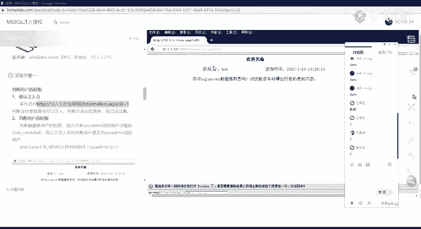

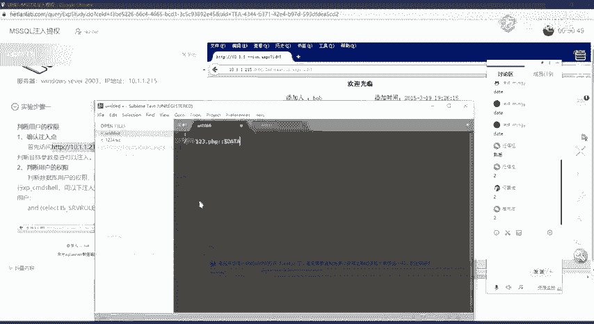

比如说我这边select呃name对吧？就是这边显示它的一个name值嘛，或者说还有一的话就是time。当话这边我这边是假设。就是讲因为我们从这个页面的一个数据嘛，对吧？就是。

🤧波不还有这一个这边的这一个时间。

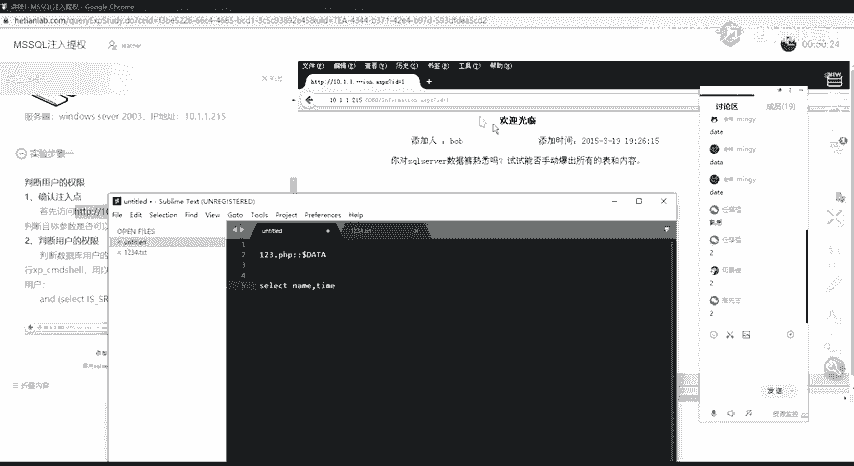

然后其他的这一个这一个的话，它它都是固定的一个值嘛，对吧？比如说我这边啊对吧？它都是不变的。并的话就是它这边后面的这个数据。那么我们是不是可以大胆猜测一下它的一个小口语句。

就是ss name或者说time，对吧？就是大概的一个意思嘛，对吧？然后是from这样子的一个。

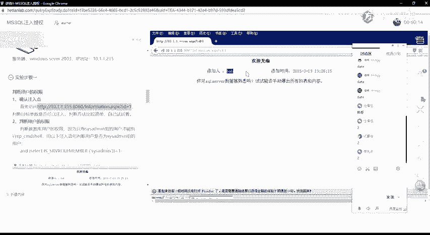

呃，优的表当中是吧？然后wellID等于多啊。就。管ID等于多少？就是这个优则表当中的话，呃，我们假设它就就我们从这边的话能够去确定它呃大概有这样子的三个字段，对吧？

就IDID字段name字段time字段对吧？其他的话我们也不知道，对吧？就我们也不用管，我们就假设它的一个scle语句，我们猜测它是这样子的对吧？那么它的一个语句的话就是当ID等于一的时候。

他会去这个优质表当中，或者说某个表当他去查询它的一个名字以及时间，对吧？那么我们在这边的话，我们如何去注入我们的一个语句呢啊。

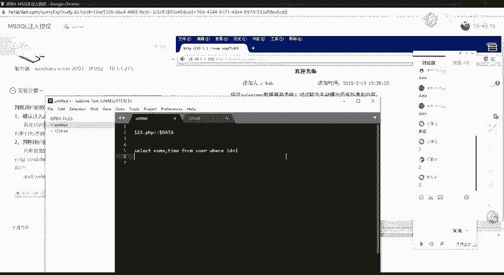

首先在这边的话我们需要去判断一下，就是说我们常见的这种搜狗的一个注，对？它有像这种字符型啊数字型，对吧？我们的一个呃方。我们需要去判断它的一个这种类型的。就我们从这边也能够去从这这边的话。

也能够去基本判断它应该是一个数字型。那么我们首先在这边呃出了一个单引号，对吧？单引号之后的话，它报错。

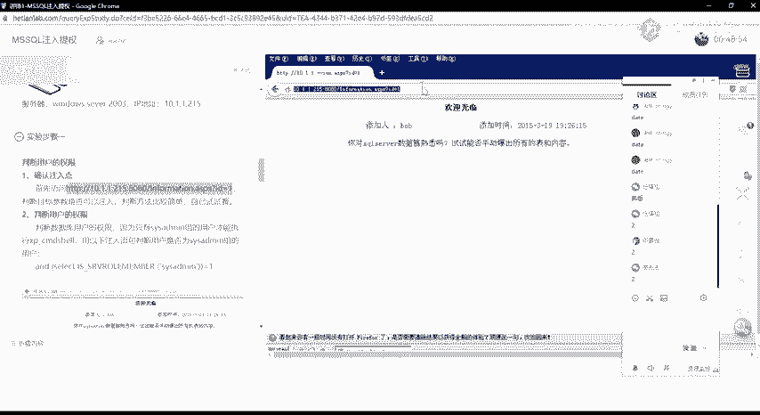

报错的话，他这边是表示呃。这午饭后的一个引号不完整，就是我们这边引号是多的对。那么我们把这边ID等于一单以后，我们把它带入到我这边的这一个s口语具。没想在。对吧ID等于一这样子的一个数据。

那么他实际他如果他没有对我这边做一个过滤，对吧？没有对我这边的ID只做一个过滤，他会把我这边的一个这个语句把它带入到呃搜狗数据库当中去查询。然后他查询的话。

他查询这边一单引号这一个值就是在数据库当中是不可能存在这样子的一个单引号的一个值的。所以的话那么他肯定查找不到这个值，所以的话他就会有报错。

但然的话呃，如果说就是你加一个单引号，对吧？你没有报错，那么可能是就是说它有对我们这边的一个传递的这一个参数有做相应的一个过滤。然后在这的话他有这种报错，对吧？

那么说明他有把我这边的一个单引号的这个字符代入到了数据库当中去查询，因为他找不到这样的一个数据嘛，所以的话他会报错嘛，对吧？好，呃大家还有可能说就是有可能是字符型的对吧？那字符型的话，我们来测试一下。

对吧？就字符型的话，我们知道它的1个ID值的话，它会被这样子的一个单引号做一个包裹，对吧？所以的话我们在这边的话，其实我们在这边加一个单引号。好，我们在后面加一个这样子的一个杠杠。

刚刚空格刚刚空格的话就是在my circle下面的这样子的一个注释符啊，就是它可以忽略后面的这样子的一个字符。就是实际的话，就比如说如果说他的1个ID是像这样子的一个。字符行对，它会有这样子一个单引号。

它的一个数据的话，它会传到这边来。那么我这边ID等于一，它传到这边来，对吧？就是这样子的一个语句。那么我这边加一个单引号的话。他就是成了这样子，对吧？等于的话就是他这边他他他。

查询的一个值的话就是ID等于一的这一部分。但是在这边的话，它多了一个单引号，对吧？所以的话他去查找这一个，所以呢这边的话他会有报错。他说后面的这一个引号不完整呃，其实实际的一个语句是这样子的。对。

点点干嗯。啊，如果说就是它是一个字符型的话，对吧？那么我这边给点杠后面杠杠空格，后面的话，它会把这边注释掉，对吧？也就是实际的一个语句，它其实是这样子的，也就是它这边ID等于一的话，它有这一个值。

那么它它这边话就不会有这种报错啊，然后他这边报错说字符串后面的一个引号不完整，也就是我这边加了这样子的一个引号，对吧？就是加了这一个引号之后，他说后面没有一个引号，因为他没有闭合这边的这个引号。

所以的话他说这边不完整对吧？也就是说他其实是这样子的一个。这样子的一个这样子的一个语句啊，对吧？然后我们也可以通过像比如说通过and这样子的一个语句嘛，来去判断你的。通过这样子的一个方法，对吧？

如果说它是一个字符形的话，我们在这边的话通过闭合它的这样子的一个就通过闭合它的这样子的一个单引号啊来去判断。就比如说他是自服性。他这样子的话，我们。嗯。等于一是这样子那个吗？那么我们团。

传进去的一个数值的话，就是这一部分，对吧？是这一部分。那么我们在这边的话，如果说它是一个字符型，那么我这边传的这个数据话，我通过单引号做了一个闭合，对吧？就是这一部分这一部分的话。

ID等于一一的话是有值的，那那么它会返回返回值，对吧？因为N的一等于一这边的话，它肯定是相等的，也就是为帧然N的的的话是。很多的话就是两两就是前面的这一部分为帧，以及后面的这一幅为帧，它才会就是为帧。

对吧？也就是它不会报错。

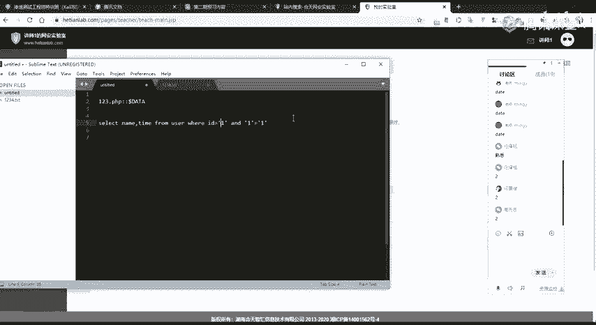

Yeah。

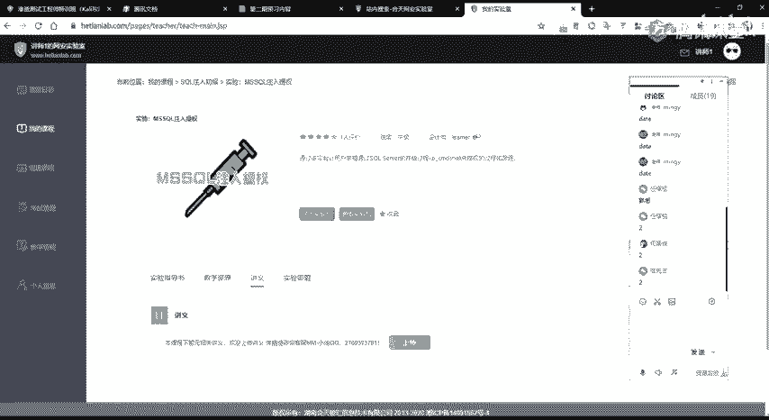

然后这边的话啊草远了，给给大家讲。小时候猪路去了。呃，就是。就其实也是就就是可能有些同学不知道，但但是的话蛇口著入的话，应该这个的话应该大家都是很熟悉的。我这边话就是正好到这边我就介绍一下。

因为呃呃前面其实前面课程的话应该也要讲对吧？讲适活书。所以原因的话都是差不多的，就。吓啊。其他的不说了，就是。我这边的话就是我判断了他这边存在是存在这样子的一个收口住，对吧？那么我在这边的话。

我们就可以去插入我们想要的这样子的一个。呃，cile的一个语句啊去做一个查询，对吧？然后在这边的话我们要去进行一个这样子的一个提权的话，我们首先需要去判断用户的一个权限。

就是因为只有这样子的一个CSSYSI的命主的一个用户，他才能够去执行这个Xc去选。就是在这个组的一个用户的话，他是一个就是数据库的一个管理员。然后的话我们可以通过这样子的一个语句来去判断。嗯。诶。僕ら。

啊，我们我们这边执行执行之后的话，你会发现啊它这边是没有没有变化的对吧？没有变化的话，那么就说明我们这边的这一个语句它是执行正确的也。也就是说也就是说我们这边的这一个slect呃，椅子呃就是这个。

So member。然后的话判断当前的这一个就是当前的呃用户他是不是在这1个SYSI的面的这个组啊，他的这个circle语句它是执行了，而且他的一个执行的话是正确的。就执行正确是什么意思呢？

就是我当前的这一个呃当前的这一个数据库的一个用户，它是属于这个SYS它的面的这个组的。所以的话我这边的话它是没有报错的，用为ID等于一它是为真的对吧？然后N的的话就是两针才为针嘛，这边为一。

它是就是这边为针，然后这边后面的话它同样的也为针，所以的话我们。这边的话是能够正常的去得到结果的。然后我们这边可以就是。呃，随便改一个对吧？然后我们执行执行之后的话，你会发现他这边没有结果。

因为我们这边的话这边写错了，对吧？它它不是就单前用户，它不是这1个SYSDMIN这一个组对吧？而是ad命这一个组。是吧。说明的话我们这边的话执行的一个结果，它是呃正确的。也就是当前的一个用户。

他是一个管理员的一个用户啊。然后的话我们还需要去判断数据库当中它是否存在这样子的一个叉BCM机器。呃。好，我们先。讲实验的时候，我们先看一下我PPT的里面的一个内容。就是呃这边的话也列了就是。

常见的就是sixserv注入的一个系统的一个函数啊，像UZ user name，就是获取当前的一个用户。然后呃DB name就当前数据库的一个名字，然后后生name啊，然后我要选数据库的一个版本。

等等以及这一个判断用户是否属于管理员。呃，这边话都是就是它的一个一些系统的一个函数啊，就是它已经内置了，我们可以直接通过select来去查询去使用，是吧？然呃然后的话就是判断用户的一个权限。

就通过这样子的一个语句。好，下一步的话就是判断是否存在这样的一个XB项T须。就是呃判断这个数据库当中它是否存在叉BCMDCR就是呃这边的一个叉BCMD share呃，要注意啊。

就是我们前面的话是呃我们前面的话是有说就是说这个叉BCMDC，它默认它是关闭的对吧？但是的话它关闭的话是说明它有存在这一个叉BCMD share，而只是被关闭了，对吧？但是的话如果你的这个数据库当中。

它没有这样子一个叉BCMDC的这个组件的话，那么我们肯定是应用不了的对吧？我们因为它没有我们怎么去尝试开启的了。所以的话我们可以在这边可以通过这样子的一个方法去做一个判断。

就是它会在这样子的一个系统的一个数据库当中去查找查找它的一个类型是这个，然后名字是这个XPCM机线。如果有的话，就说明它是存在这样子的一个组件的。然后存在这个组件的话。

我们就可以利用这个组件去执行命令的。如果说执行命令的时候报错了，就报我们前面的这边所说的这个错误。那么就说明我的这个叉项目就 share它是没有开启的对吧？那么没有开启的话。

我们就可以尝试使用这1个SP空fi来去开启的。然后的话。来去呃利用它来执行我们的一个系统的一个命令，就大体的一个思路就是这样子。然后具体的话。呃，在这边的话。我们来。到实堰这边来看一下。呃。

判断它是否存在这个组件。呃，我这边的话因为。呃，时间关系以及就是这个的话比较长啊。我这的话我就不敲了呃，敲的话。挑的话是可以挑，但是比较浪费时间啊。就呃当然大家的话就是不赶时间的话，不赶时间的话。

我建议大家还是自己手动的去敲一下，就是你敲的话。其实长也不是很长，是吧？Yeah。然后这这的话我们执行执行之后的话，发现没有没有没有报错，对吧，或者说没有就是它有内容返回。

也就是说我们这边执行的这个语句的话，它是就是它已经执行了。然后的话它是执行正确了。就表明的话我这边的呃这一个serv server的这个服务器的话，它是呃有存在这样子的一个叉BCMD这个组件的。

然后的话呃我们确定了它存在这一个组件存在，对吧？那么我们还需要去确定它是否启用。确定它是否启用的话，我们可以直接就就直接去执行这样子的一个语句。对吧就是利用这个X来去执行语句嘛。如果说它不存在，对吧？

那么它就会报错。如果说它存在的话，那么它就会执行我们的一个语句，不会报错，对吧？Yeah。嗯。就这样，然后这边的话执行的一个语句话就是就用我们前面的去调用这个XTCM share的一个语法。

就EXEC加这样子的一个然后的话去呃执行这样子的一个let user name password。哎这一个有句话就是添加这样子的一个内部用户密码它是password，对吧？谈呢。Yeah。

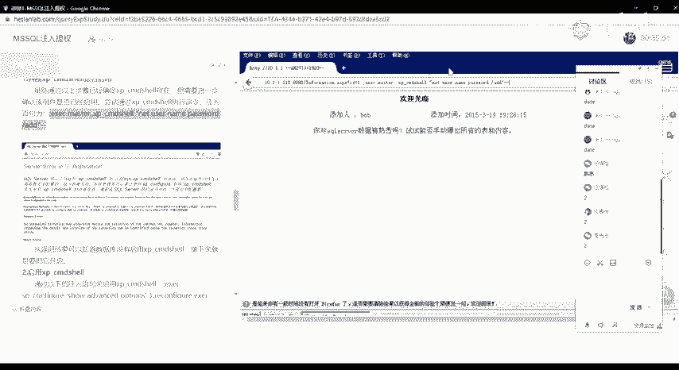

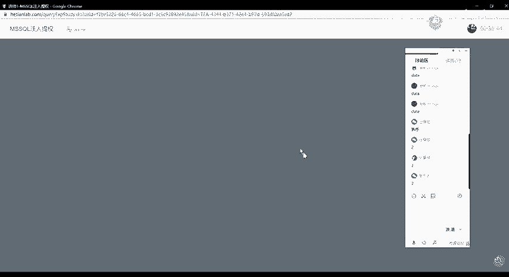

这边的话是呃刚刚的话是卡的。然后这边的话我们执行执行之后的话。可以发现这边的话，他报错了，就是有报错对吧？然后其实这边呢一个报错的话就已经写出来了。

对吧他说这边s server他阻止了对这一个组件的一个这样子的一个访问，就是用这个呃过程来去执行我们的一个系统命令嘛，他阻止了。好看。呃，就是这一个组件，它是呃作为了一服务器安全配置的一个的一部分。

所以的话他这边的话是把这个XPCD的一个组件关闭了，对吧？那么关闭之后的话，我们无法去直接的一个使用。但是的话它关闭了我们，因为我们前面的话已经判断了我当前的一个数据库的一个权限的话。

是一个呃管理员的一个权限，对吧？也就是说就是说呃什么意思呢？就是说我这边虽然没有去得到这1个SA，或者说得到他的一个管理员用户的一个呃密码，对吧？但是的话我当前的话，我当前的一个数据库。

它是一个管理员的一个数据库的一个用户。那么我当前我这边通过srl注入的一个通过cirl注入的一个攻击，对吧？我这边插入的注入的这样子的一个cirl的一个语句，它同样的是一个完原的一个用户去执行的。

这里大家能理解吧？所以的话我这边其实是一个管理员的一个权限。那么我这边管理员的一个权限的话，我就可以通过这边所说的。呃。通过这边所说的。

通过SP config来去启用这边的呃1个XPCMD渲要的一个组件。然后呃方法的话就是我这边复制一下。就是呃这样子的一个语句啊。执行呃，执行之后的话，它没有没有，就是就是有内容的。

就说明我这我们这边的话这个语句已经执行成功了，对吧？执行成功之后的话，我们再来尝试。调用这一个叉线继续。诶。来去执行一下这边的一个命令。执行的话还是执行了刚刚的这一个添加一个内幕用户的一个M。

然后我们回车回车执行之后的话。他这边也没有，就是没有问题，对吧？就说明我们的一个语句执行成功了。然后在这里的话我们验证一下，因为当前的这个机这个服务的话，它是就只在当前的这个板机上面。

就是它不是因为就你在当前的这个机器上面去操作的嘛，就你的一个s server的一个服务器，同样的也是在这个机器啊。它是部署在这个机器上面的也就是我这边通过sexel去执行的一个系统命令。

也就也是在当前的这个主机上面啊。因为啊这边的话是一个实验的一个环境，是这样。好，我们这边通过那些U子来去查看一下，在这边可以看到就多了这样子一个内幕的一个用户。啊，我们可以。换一个。呃，电读院3对吧。

这边呢。

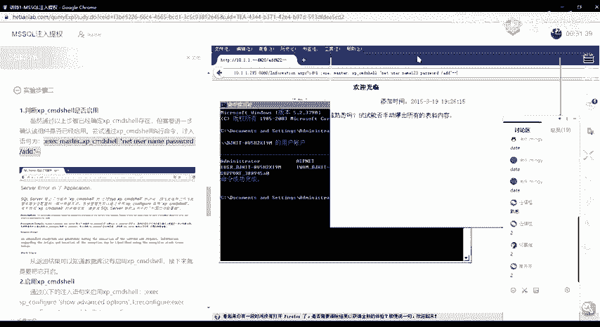

这边的话呃添加一个name1样3的这样子一个用户对吧？然后在这边它是没有这样子的一个用户的，对吧？我们在这边。

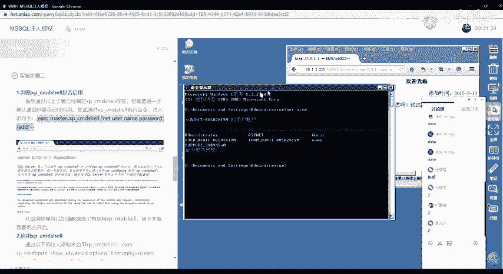

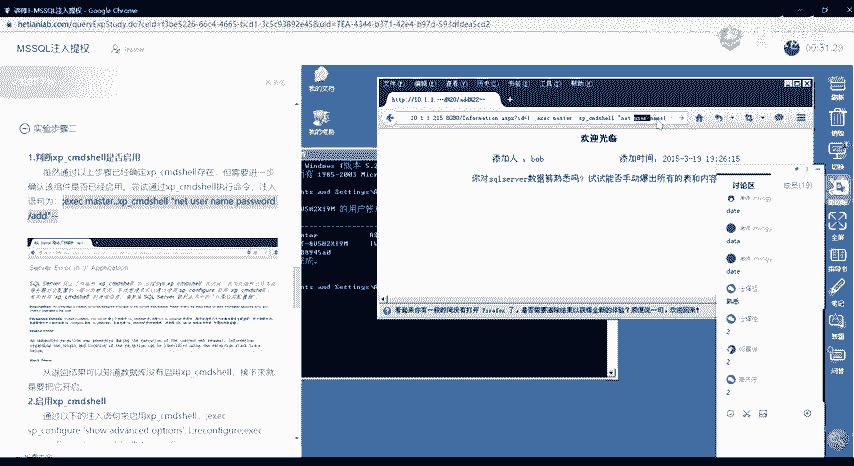

咨询一下。出现之后的话，我们再来查看一下。你会发现的话，在这边已经添加了一个内比13的一个用户啊。也就是说我这边的话通过通过他的这样子的一个注入点，然后的话呃调用这个XDCMD share尔的这个组件。

成功的执行了一个系统的一个命令。

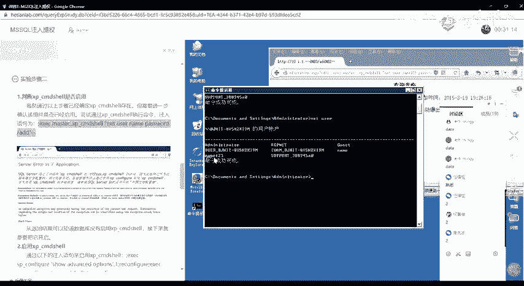

那么现在的话我们就你你就能够去调用这一个组件来去执行我们想要的一个系统运的，对吧？那么提全的一个思路的话就是呃那我们现在能够能够执行命令了嘛，对吧？那么我们。就能够去添加这样子的一个管理员用户，对吧？

然后的话把它添加到管理员组，也就是能够去得到他的一个管理员的一个用户嘛。那么自然呢就得到了他的一个管理员用户的一个权限。然后呃这边添加用户的话，就添加到管理员组这边的话，我就不操作了，对吧？

然后这边添加用户的话是没有问题的。然后呃第七个的话，这边的话就是介绍一下这个就是SP的这个OA createate。就是说在XB摄M机需要被删除，或者说出错的一个情况下。

可以充分利用这一个来训练一个提选。而是我们前面。就如果说这个XVCMD需要这个组件，它呃没有了对吧？然后的话或者说我们出错了。也就是我们就是无法去使用这个组件来去执行系统命令的时候。

我们可以尝试使用这个。使用这一个来去呃来去进行一个提全。在这边的话就是这样子的一个步骤。然后具体的关于这个的话，大家可以去看一下这篇文章。这边的话他呃介绍了很多的这样的一个方法。

就我们可以通过这样子的一个呃配置来去打开对应的一个组件。然后然后的话再利用这样子一个组件，就是利用的一个方法，就是像这样子像呃。他这边可以。嗯，加用户对吧？然后的话粘贴进的一个替换。还有闯码。

还有斜步脚本等等的一个方法。我们可以使用这一个组件来去达到呃目的。嗯。Yeah。🤧就。就比如说这样子，比如通过这通过执行这样子的一个命令。就如果说这一个组件我们开启了之后的。

我们可以通过呃这个组件来去执行命令。然后之前的一个命令的话，就是像这样子。就其实就是在这边啊执行通过CMD来执行一个换卖，然后的话把它输出到我们的指定的一个文件当中。然后在这边要注意的话。

就是你用这个组件，你去执行页练的话，它是没有输出的。也就是你看不到它的一个输出。所以的话我们需要去通过这样子的一个重定向的一个方法，就是输出到我们的一个文件当中。然后的话因为我们就。嗯。对。

就需要通过这样子一个方法来去呃从电向到指定的一个文件那种，然后的话才才能够去查看。呃，以上的话就是我们本节课的一个内容。呃，第三部分的这个posts group cycle的话，这一个的话。呃。

课程安排里面话是有说要讲。然后其实我这边的话呃。就是有这样子的一个比较，就是已经很详细的介绍了这一个呃pers cycle的这样子一个提权。就是我们利用它的这个posts cycle的一个呃数据库。

然后的话呃。用它来去写一个。呃。写1个SO的这样子的一个文件。就是说在lininux里面的话，我们就是要去调用它的，就是要去调用系统的这样子的1个SO的这一个文件。然后其实类似于我们的一个就是。

我们的1个my的1个UDF的一个提群啊，但是的话它这边的话是利用它的一个数据库的一个特性来去写入到我们的一个目标机上面去。然后的话再把它组合成一个呃文件。

然后再利用这个文件来去创建我们的一个可执行的一个呃就是执行命令的这样子的一个函数啊。然后的话再利用这个呃创建这样子的一个。

对象，然后利用这个对象来去呃执行我们的一个系统的一个命令。

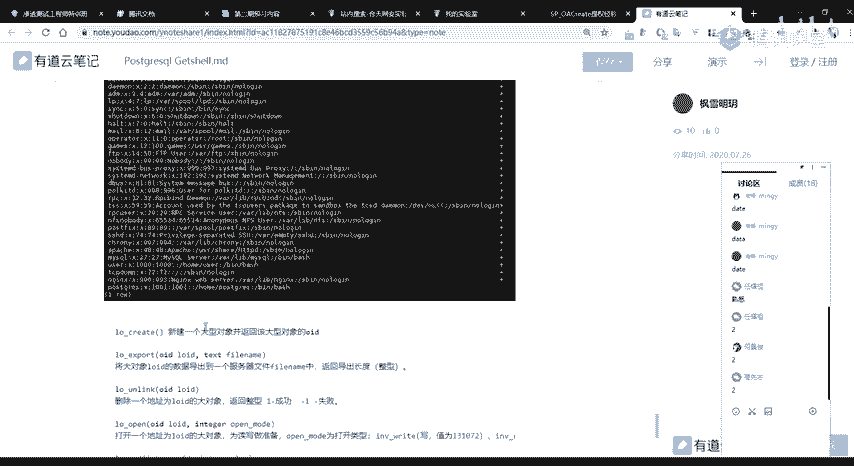

像比如说在这里就我这边。

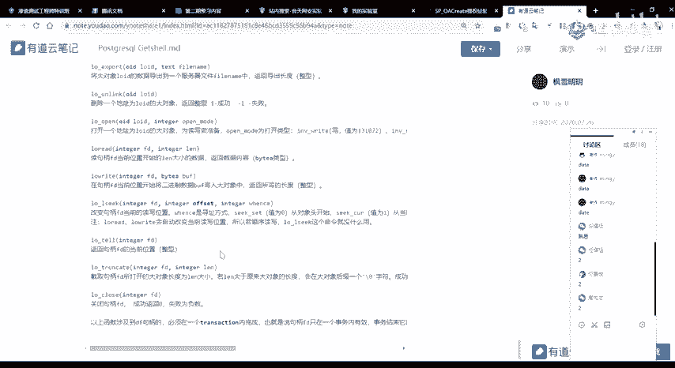

这篇笔记的话应该是写的很详细的。然后下节课的话再给大家去介绍这一个吧。因为一节课的话讲不了这么多。

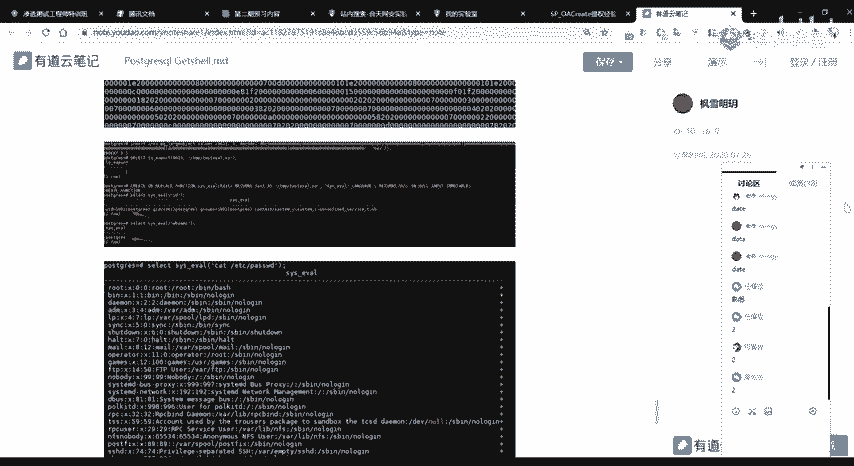

好呃。大家先去看吧，然后下节课的时候的话，上课之前的话，我再问大家，就是看大家有没有必要去给大家讲一下这个。好吧。啊呃，大家对今天课程的一个内容有没有什么疑问？有问题的扣一，没问题的扣2。

大家都能能能跟得上我吧，能能听得懂吧？Oh。其他同学呢。怎么。每次都是这这这这这三位同学。还有这四位。那其他其他同学是不是在挂机呀？对。没没没有在我没有在听我讲吧。😊。

就大家就大家觉得我这样子去这样子去给他家讲课。然后的话呃。大家能能不能能不能接受？如果不能接受的话。你可以提出来。所以你觉得你觉得就是要怎样子那个你才能够去比较好的一个接受，对吧？

我这边的话可以就是根据大家的一个需求做相应的一个调整。好吧。行吧，大家还是。大家还是不喜欢跟我互动了，已经很细了。OK okK那那就好呃。能主要的还是要大家能听懂啊。Yeah。

那那应该是没有什么其他问题啊，应该就大家不回来的话，我就默认默认大家都。都都都能听懂啊。然后呃。然后的话呃。Yeah。然后的话我这边就是哎这边就是中间讲课的话，有这种咳嗽的这种声音就是。大家可能就是。

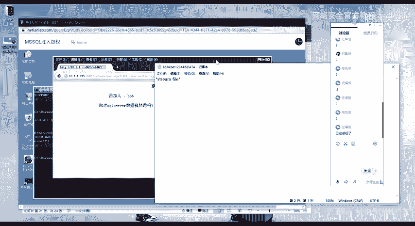

希望大家能够。

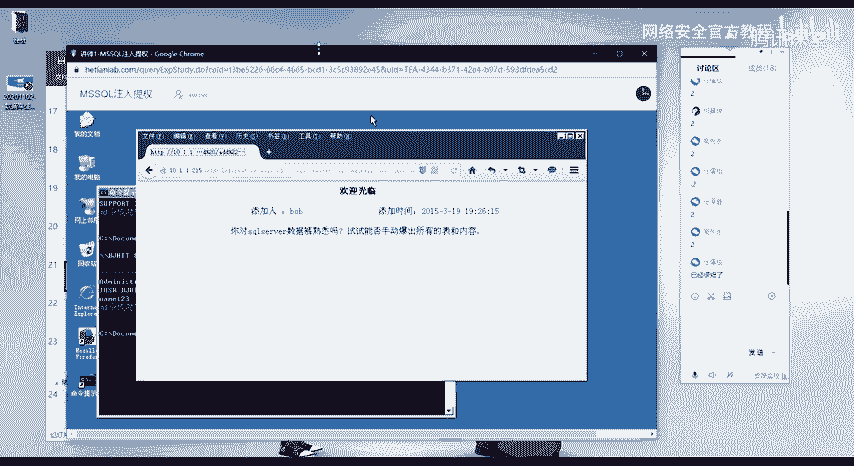

Yeah。希望大家能够不要不要介意啊，好吧，就我这边实在有点控制不了，就是。哎。讲课。讲的喉咙有点难受。然后的话加加上咳嗽的话，就是一说话的话，就是给大家讲的时候的话就有点咳。好吧，就希望大家不要介意。

就是忽略我的咳嗽声好吧，就大家听我就是讲的一个内容，然后的话中间就是就可能最近讲课的话都会有这样子的一个情况就是。就说声抱歉吧，好吧。好，没有其他没有其他的一个问。没有。没有其他的一个问题的话。

那么我们本节的话就呃到这边就结束了。哦，这边PPT忘记给大家。啊呃，下课。大家。

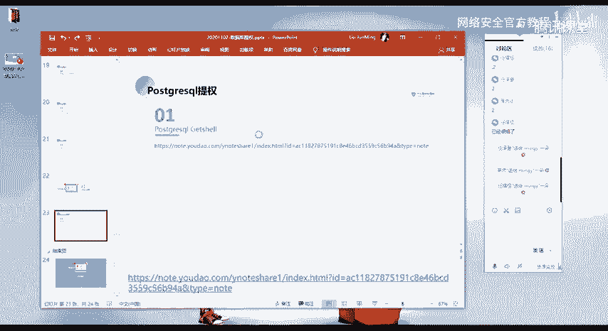