# B站最全网络安全教程，整整1300集，全程干货无废话，别再盲目自学了，看完学不会我退出网安圈！（web安全｜渗透测试｜内网渗透｜CTF） - P12：10.命令执行.mp4 - 网络安全官方教程 - BV15u4y137cQ

🎼Yeah。🎼我说好。😔，🎼能看见幸。😔，🎼那天。🎼你说没有再见，就没有送。😔，🎼给得多。🎼可最后。😔，🎼是你就。🎼的脱。🎼了手。😔，🎼一次又一次选择。😔，🎼回到。😔，🎼记得这一分钟。😔，🎼撕心裂肺。

🎼对你说再见和斟着。😔，🎼我是不说是。🎼爱他眼。🎼会不洒脱。😔，🎼谢谢你这么多。🎼变的细心守。😊，🎼我给的。🎼我真的。🎼你真的爱过，就已足够。😔，🎼The。🎼Yeah。🎼，🎼回忆的写。🎼拉长了。🎼期限。

🎼昨天争吵的。🎼今天又不。🎼惯的重演。🎼到最后。🎼此生辗转。🎼难免。🎼一次又一次会头。🎼以前。🎼你要去。🎼可以分钟。🎼撕心裂肺。🎼你说再见和沉重。🎼往事不说是。🎼爱不在。🎼谢谢。🎼一场。🎼变的细细收藏。

😊，🎼我。🎼你的。🎼我只。🎼爱过。🎼你真的。🎼出。🎼你说话。🎼是。🎼还爱着，谁又不。い。🎼Don。🎼你说。😔，🎼，🎼き。🎼路边的茶楼人影错落，街上传来两三上吆喝。😡，🎼人间摇山醒目拍桌，各位看官。

你细听繁说，这江山风云岁月山河。😊，🎼刀光千影，没了多少时间传说，且看他口若悬刻，衣上有风尘，却原来是一位江湖说书人。🎼那天山女子不守枯城，也只是为了曾经的那一锅脸。🎼昆仑痴2意情难分。

谁曾想这一曲再不相逢？🎼这江山风雨岁月山河，侠骨头上醉了多少时间看坷，本就是浮萍游何，漂泊本无根。萍水相逢，浪迹天涯君莫。😊，🎼江山如画，各走一程，也古尽了人间的多少苍生。那美女多娇爱看英雄。

刀尽了江湖的血域腥风。😊，🎼几经风霜，天涯游色，一梦荒粱。😊，🎼难魂之意。🎼一场。🎼谈笑一段，半生书狂。🎼不像一人。🎼嫉度。🎼痴人侠女，奈何情多。😊，🎼酒江随马。😊，🎼一颗。🎼爱一不限。🎼哎呀。🎼てな。

🎼赶快呀。🎼理讲了吗？🎼这号卖吗？🎼我跟你说啊，在后不卖。🎼再说的看短，莫想太多，书中不失是时间错。🎼个人心中他自有评说，听完这段你一笑而过。😊，🎼已经。🎼这一梦黄年本之一呀荒。😊。

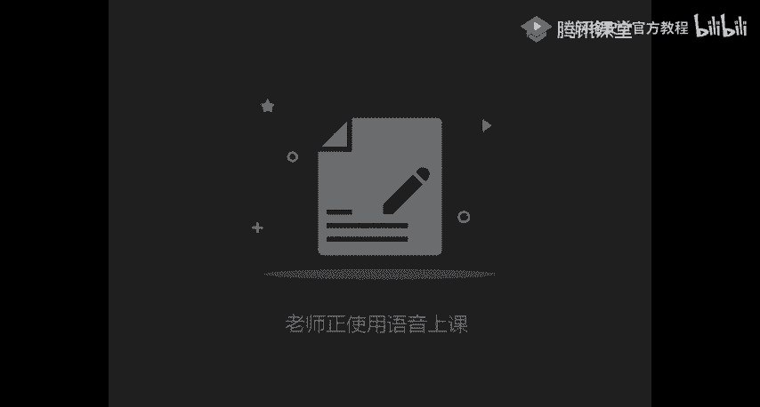

🎼谈笑一段，半生出狂。🎼江山风月岁。

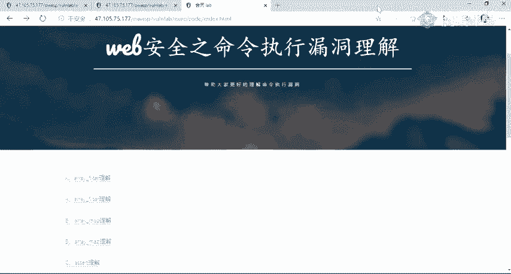

🎼あパパ。🎼啦啦啦啦爬浪。🎼う。🎼，🎼う。🎼我这样。

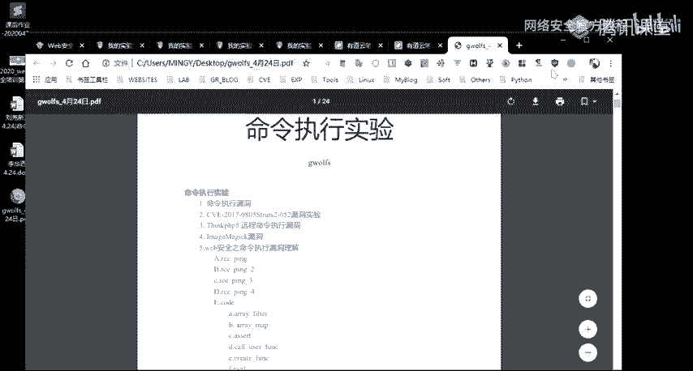

🎼啦らら。🎼うったら？🎼Yeah。🎼欢暖。🎼不。🎼风轻轻，我听见你声音。😊，🎼你对着我。🎼叮咛。🎼要注意自己的心情。😊，🎼雨轻轻，我听见你声音，你拿着伞。😊，🎼靠近。🎼为我遮着风挡着雨。🎼一点点想哭泣。

一点点想着你，你的爱很珍惜。😊，🎼我总依赖着你的记忆。😊，🎼い？🎼你就像风。😊，🎼再说。🎼顺着我。🎼分想。🎼你就像海中。🎼对着我成长。🎼我明白你。🎼回一旦。🎼热的对话。🎼爱情其实没有办。🎼不会感动。

🎼不说话。😔。

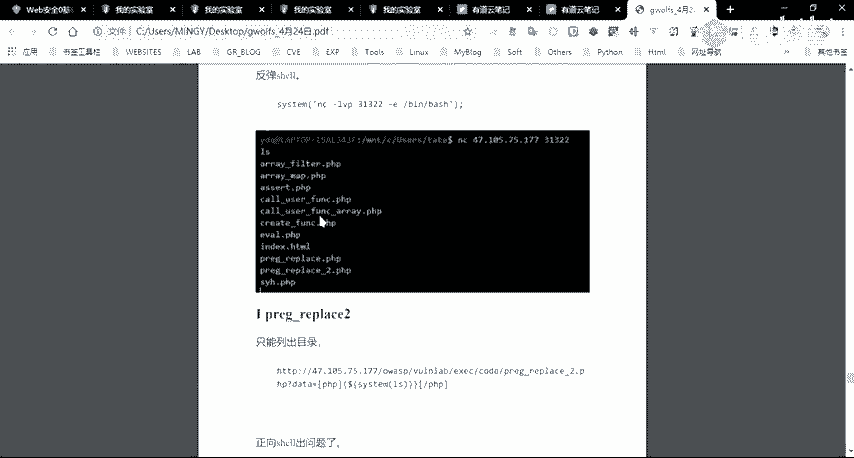

🎼，🎼，う。🎼，🎼雨倾轻，我听见你声音，你拿着伞。😊。

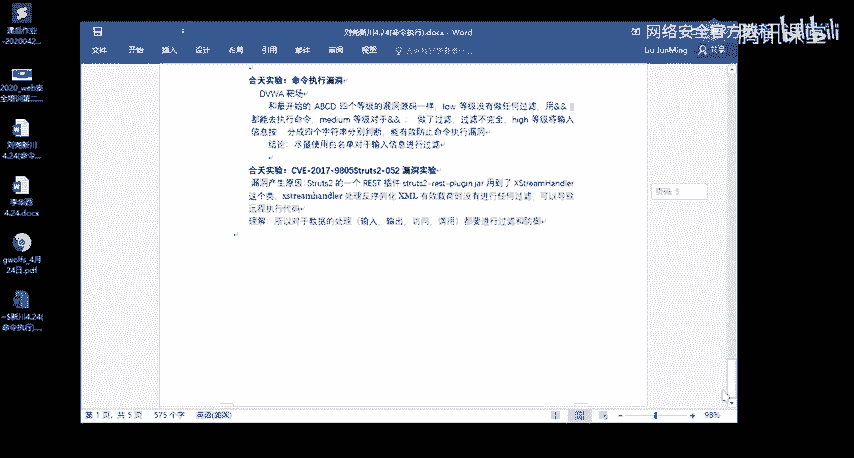

🎼靠近。🎼为我遮着风，挡着雨，一点点想哭泣，一点点想着你，你的爱恨。😊，嗯。Okay。嗯。Yeah。呃，大家晚上好。然后本节课的话呃，我是这样计划的，就是说我们本节课的话本来是一个那个。课程考核嘛。

就说对于我我上次布置的一个作业的一个课程考核。然后的话本节课的话，我计划就是因为就是布置给大家的的一个任务的话，就是那些实验嘛，就是那几个实验。然，其实这几个实验的话。这几个实验的话。

大家对照着这个指导书来去进行一个操作的话，应该是没有问题的。然后这一个的话其实就是我呃。昨天已经讲过的这一个这几个。🤧嗯。😊，这几个RC干片的一个代码，然后的话其它的一个原理其实是一样的。

然后我是把它呃就是。

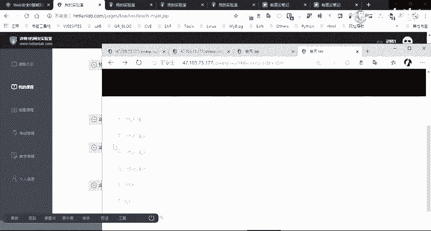

把它写到了这里。

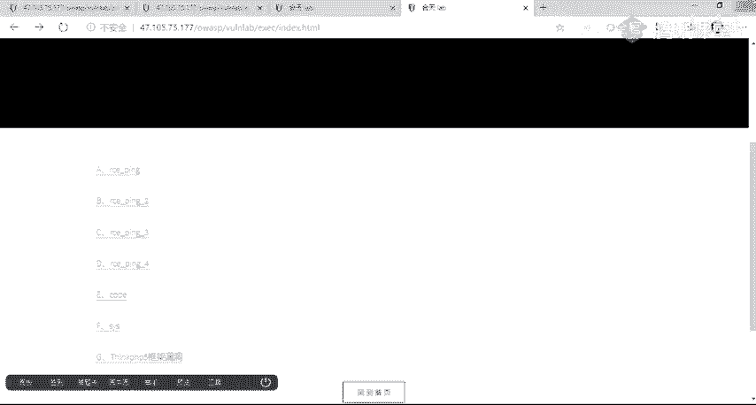

🤧嗯。😊，这个的话应该大家都没有问题，应该对吧？

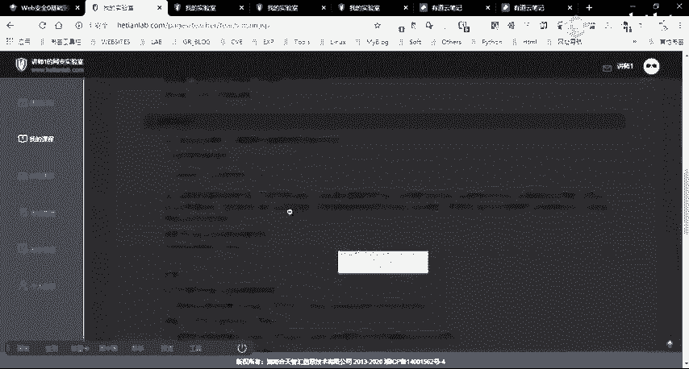

就呃跟我昨天讲的话是一样的。然后的话这里的话呃。呃，唯一的一个不同的一点的话就是它这里有一些扩展，对吧？就是说还有哪一些其他的一些呃黑漏的对吧？这些的昨昨天的话我也有涉及。

然后的话就是嗯我们比如说我们的这里的过滤了这种。过滤了这种呃分号结尾的这种。呃，字符我们怎么通过呃我们怎么通过命令执行来写我们的一个一句话，对吧？这个时间的话，大家应该没有什么问题吧。

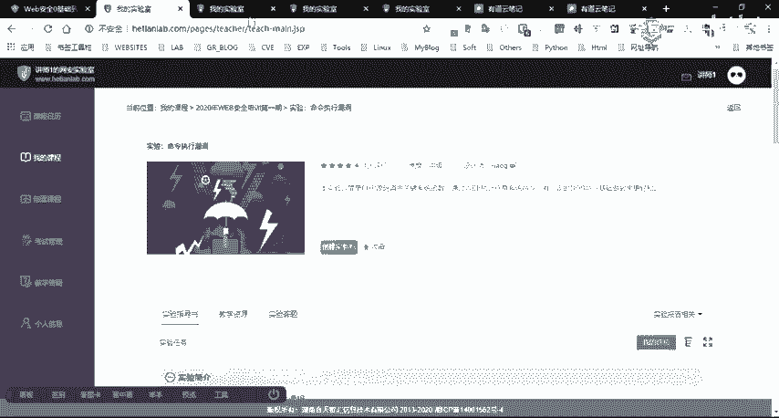

啊，有有有问题的吗？啊，有问题的扣一，没问题的扣2。Yeah。作业太多了吗？你不是都我我看你的话写的都写完了呀。

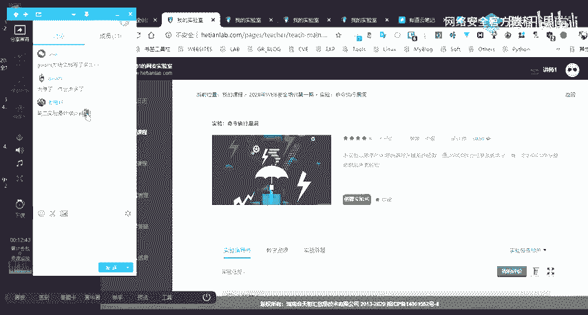

你的这个文档的话写的呃，我觉得话我觉得话写的很标准啊，就。

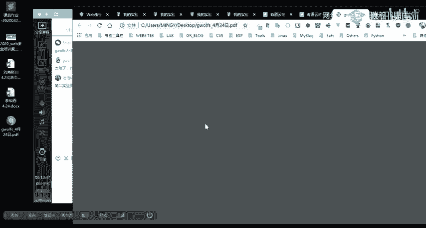

就啊我。我不知道就是大家有没有自己去做啊，就是我这边的话收到由班主任那边给过来的作业的话就3个。

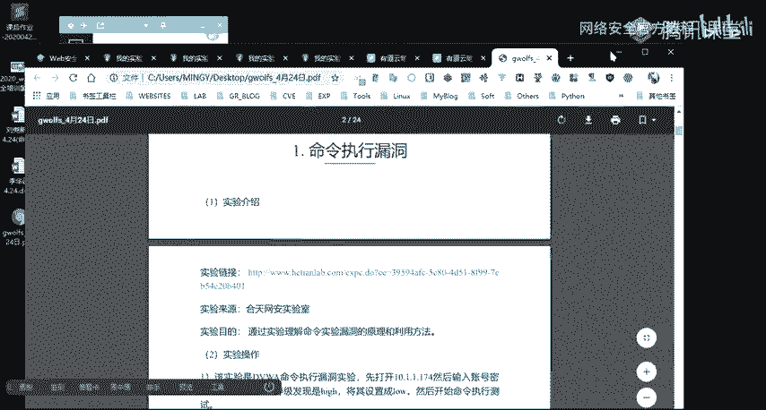

🤧う。就大家大家做完的话，还是你把那一个过程给记录一下了，记录一下嘛，对吧？然后你做这个实验的时候，你。里面涉及到的一些知识点，你就做笔记嘛，把笔记做下来做下来，然后。做下来之后的话，你可以呃。

就是把它给分享给别人，对吧？然后的话下次你可以做一个备忘嘛。🤧K。嗯。第二个实验怎么拿需要？🤧K。

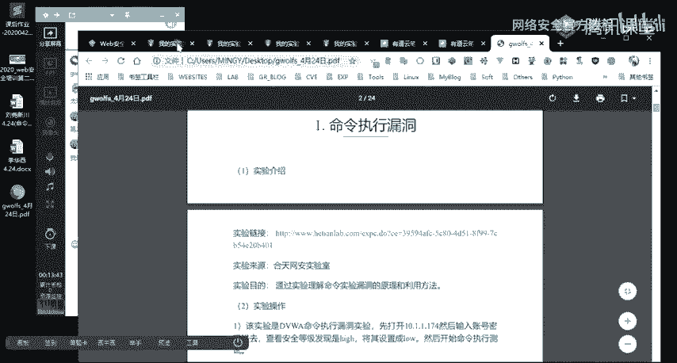

是这一个吗？呃，这个structure to的这一个实验，大家有没有什么问题呢？

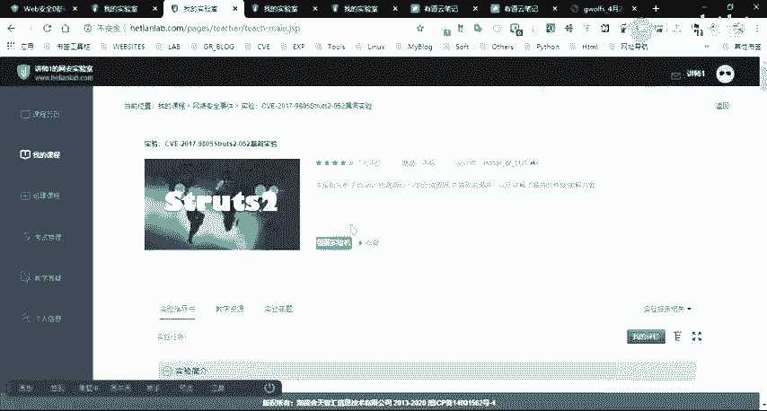

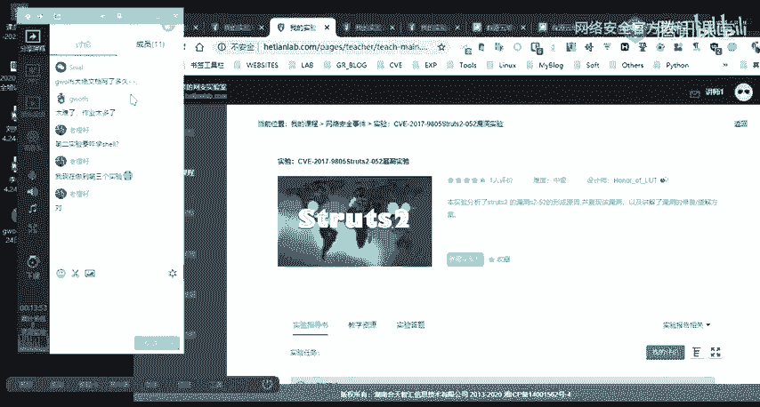

🤧K。就是怎么拿需要是吗？🤧Okay。怎么拿需要的话呃。好，今天的话就是呃这个时间的话，今天白天是有同学提出了一个问题，对吧？就是你再去打开这个URL的时候会有问题。

然后这里的话是因为呃你是照着这里去敲的对吧？就是这里的话指导说的话，它后面多了一个干，多了多了一个干的话，它访问的话就是这这里的这一个目录，对吧？这个目录下面，然后你访问的话是能够访问到这个页面的。

但是你去呃点这个Eit的话，它就会呃多了这样子的一个目录，就是说它你点击这个E，它本来是去访问到这个or的这个目录下面的一个文件，🤧啊。然后的话，你这里呃。🤧直接直接敲直接去访问这样子的一个呃链接。

也就是这一个目录的话，你再去呃点这个一点头话就会呃报错。因为没有这样子的一个目录下有这样子的一个文件。好，get share的话，这个呃实验机里面的话有给这样子的一个呃POC吧。🤧K。

然后这个的话其实就是呃把我们的这个POC发过去，发包发过去就可以了呀。然后这里的话呃就是这个POC的话，它是一个java的一个就JSP的一个。java的一个脚本。

然后的话里面的话其实大家不懂java没关系啊，然后的话你是要注意里面的一个pay漏的，就是里面。呃，它是有一个执行命令的一个语句。我这样的话先创建一个吧。

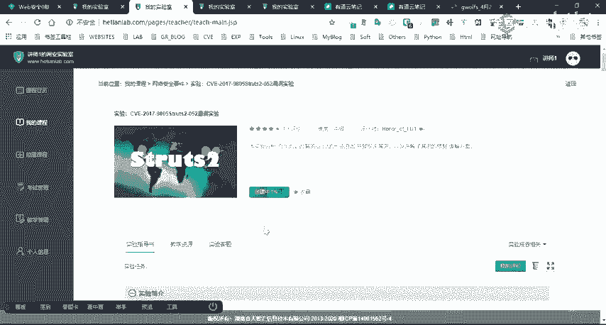

呃。或者要不。POC呃现在现在大家看不懂呃，没关系啊。就是说你现在因为大家都刚开始接触这一块的话，你现在看不懂这个POC是正常的。然后你在后面的话，你理解过来了，理解就是你自己去深入的去理解了之后的话。

然后的话你懂这些代码的话，你就会很好理解了。H。🤧。对，这里这里嘛这里的话就是呃会弹出一个计算器出来嘛。然后你在这里的话，你可以写你其他的一些命令啊。

就比如说你CMD调用CMD来执行1个呃IP configurefi啊等等的这种。然后因为这里弹个一个弹出一个计算器的话，就呃你能够直接的能够看得到嘛，直接的能够看得到它是呃执行成功了嘛。🤧嗯。😊。

🤧Okay。看。

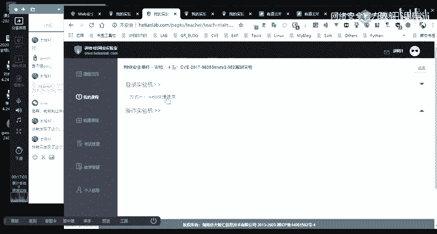

Okay。🤧Okay。

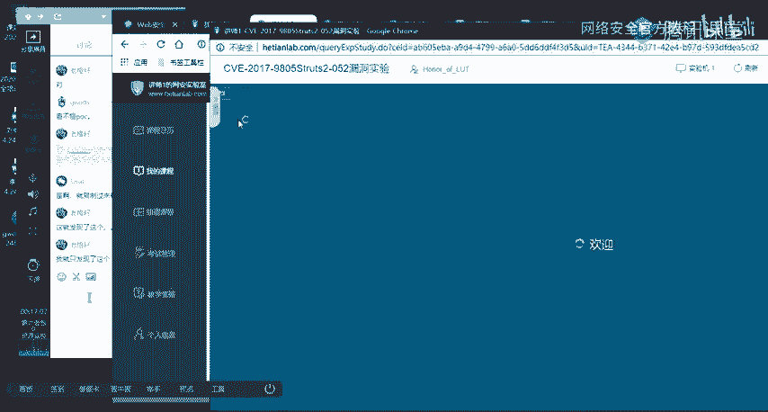

呃。然后这个实验这个实验有有没有谁想呃，就是自愿自愿过来讲一下，就是说你是怎么去进行一个操作的。Good。🤧Okay。有有谁想分享一下自己做这个实验的一个过程吗？Okay。

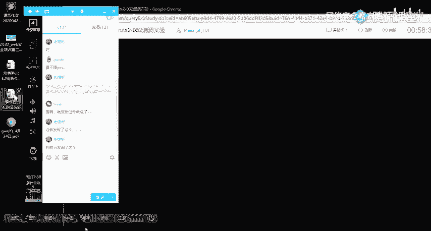

Okay。Okay。

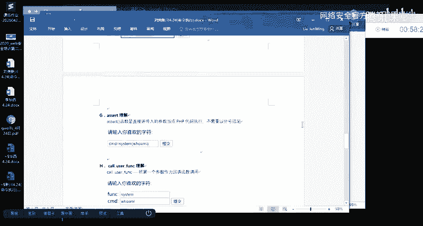

呃，这里给给过来的作业的话，就呃。就一位同学做了呀。🤧Com。

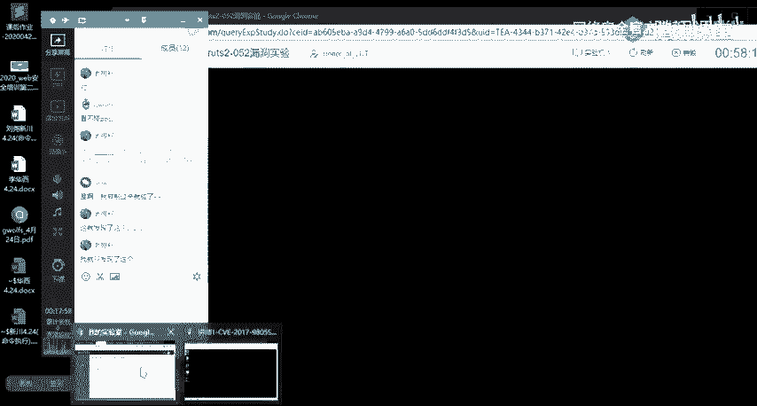

🤧K。这位同学，你呃。想讲讲解一下吗？就是说你是怎么去呃操作的。就其实这个我我们看一下他的一个过程吧，好吧。呃，其实就大家跟着指导书做的话，应该是没有太大的一个问题啊。然后前面这里话我们就呃。我看了。

然后它的一个部署就是我们这个环境里面的话，就是呃有这样子的一个部署环境的一个环节。就是我们在就是在我们去。做外表安全，或者说去做这种外表的一个研究的时候，这种呃漏洞环境的一个搭建其实是一个基本功啊。

就是呃如果说你碰到一个新漏洞，或者说就是这一个漏洞，对吧？你想去自己做一个复线。你要你要复线的话，你就需要去搭建环境。搭建环境的话，这一个呃过程当中的话，其实你可能会发现很多的一些问题。

然后的话需要你自己去做一个解决。然后这里的话就是前面的话就是先部署环境嘛，对吧？然后部署环境的话就是。

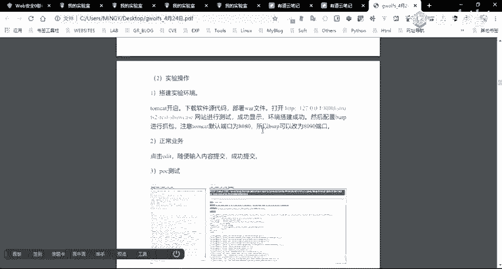

嗯。

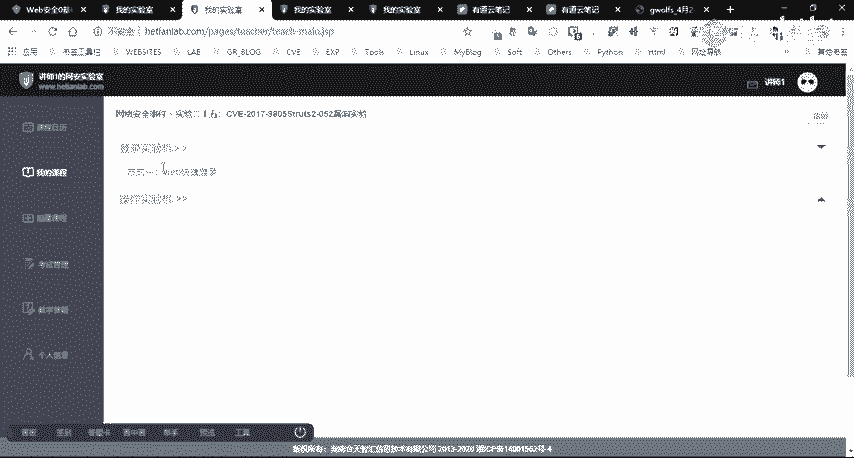

指导书这里的话有一个下载链接嘛，这个下载链接的话就是这一个漏洞的一个握包。就部署这一个环境所需要用到的一个卧包，然后你只需要打开这一个呃tomca，就这一个叉 map。的一个环境。Come。

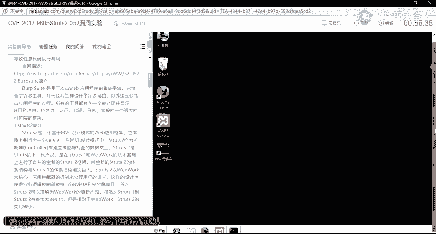

啊，我们就能够去进行一个访问。Okay。然后注意的话，tomca默认的一个端口是8080的一个端口，要加这一个端口，然后你才能够去访问到。对，这这里的话就是tomca的一个默认的一个页面。

然后这个时候的话我们我们需要把我们的一个卧包给它部署进去。嗯。😊，🤧Okay。然后我们部署这个wordb的话，要放到这个tom catt的一个web跟目录。

然后tom catt的一个 webb跟目录的话就是在呃。在这里然后的话有一个webAPPS这个的话是homeca的一个默认的一个web跟目录。是这样子的然的话我们只需要在只需要在。

这里把我们的一个卧包给丢进去。丢进丢进去之后的话。🤧And。我这里还没下载啊。He。嗯。Okay。Okay。我先下载一下这个压缩包。然后的话给他解压出来。截出来的话呃，解压出来之后的话。

就会有这样子的一个文件夹，对吧？然后我们只需要把这里面的APPS这里面的这两个末包。然后把它丢到这里来，丢到这里来的话呃，这两个word包的话，其实就是这个structure to的呃两个文件。

就这一个框架的一个文件。然后的话呃。可以看到我们只把它放进去的话，它会呃默认的就是这里的一个ttomca服务。呃，就是把它放到跟目录的话，他会把我们的这两个这两个沃包把它给解压。解压出来之后的话。

就是这样子的呃两个文件夹，对吧？然后的话我们要访问的话就是。加我们的这样子的一个文件名就OK了。Okay。那我们我们其实直接就这样子访问，对吧？就直接访问这一个文件夹，它会到这样子的一个页面。

然后这里指导书的话，它是呃。把它呃就是。后面的话会有加这样子的一个or，对吧？然后大家的一个问题就是呃你是直接就是照着指导书去进行一个。啊。ors去进行一个抄写的对吧？

然后你这样子访问它其实也是能够去访问到这样子的一个页面。但是的话你去点这个edit，你可以看到这里的一个链接，对吧？我这里点一下点一下这个一点的话，它其实是会访问到这样子的一个or目录。啊。

然后你这里包这样子的一个问题的话，就是你找不到这样子的一个路径，没有这样子的一个路径。因为这里的话是错了的。啊，其实我们只需要把这里的一个。干就是那个表示这or是这个目录的这个干给去掉。

的话就能够去正常的去做一个呃访问。对吧。Yeah。然后的话呃。一品。😔，我们先打开BP。K。然后这里的话其实有给了你这样子的1个POC，对吧？就这样子的。然后这里的话其实就是一个玩我们的这里的呃。

我们抓包其实也是抓这样子的一个包嘛。然后的话我们其实就是往我们的这样的子的一个页面发送这样子的一个呃java的一个代码。然后主要的话其实就是执行命令的话。哦。食晚茶。😔，嗯。嗯。Okay。嗯。

怎么找不到呢？🤧Okay。呃，就是这里嘛它执行了一个命令，对吧？com command。哎呦，这里不好看了。嗯。没有其他东机器。Yeah。🤧K。🤧Okay。Com。Okay。🤧。Okay。哦，这太小了。

看不清，就其实就是我们的这里的就执行的一个命令，对吧？然后我们要写的一个命令的话，就是这里就呃调用我们的1个CLC的一个命令。然后你执行之后的话，它就会在这里弹弹弹出一个计算器。

这里的话就说明你的这样子的一个命令的话是执行成功了的。呃。明天。啊，这里的话其实我们也可以做一个根啊，我先。发一下。我先抓个包。而且就。可以看到我这里执行之后的话，它就弹出了这样子的一个计算器，对吧？

这里的话就说明我们的一个命令的话，执行成功了嘛。然，这里的话其实我们可以呃。做一个更改。Yeah。嗯。睡觉了。😔，嗯。咨行什么呢？Not hard。Yeah。不。然后我们再去进行一个发包。ok。

这里的话先把它关掉吧，然后我再去进行一个发包，对吧？发包之后的话，它这里的话就弹出了这样子的一个记事本。

就说明它我们可以通过在这里修改我们的一个命令来执行我们的一个就是呃我们在windows上面的一个系统的一个命令。这里的话就是这样子的一个。呃，命令执行的一个实验。然后大家看不懂这样子1个POC的话。

没关系啊，大家先知道这样子的一个漏洞。然后的话我们怎么去进行一个利用。对，实呃，实验的话对啊，就是按照指按照指导书做就行了。但是的话你做的话还是。呃。你做的话，还是因为你这些东西你没有接触过嘛。

而且你之后的话也可能会碰到，就是说你做的时候建议的话，大家呃做一个笔记吧。🤧K。s two的话呃。对，在内网当中的话，呃，在外网也有的。🤧K。内网的话呃内网的话一般的都比较多。

就是说str的这种框架的话。因为呃然后的话在内网的话，其实很多的这样子的一些服务的话，它的一些漏洞都呃因为在内网的话不比在外网内网里面的话，因为呃你只是内部的一些人员人员。如果说你进进入到内网的话。

内网的一些很多的一些漏洞，说不定他没有做一个及时的一个修复的话，能够直接去进行一个利用的。Com。这个时间的话呃，还有什么问题吗？应该没有问题了吧。

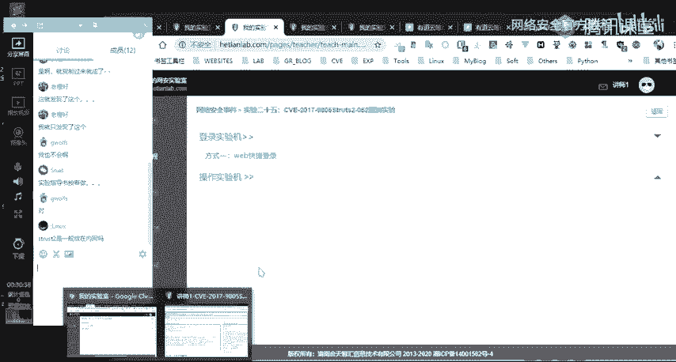

啊呃。这位同学。我觉得写的很好，就是啊你就这样子的一个就是你做完这一这样子的一个实验，这个的话就是你的一个笔记嘛，对吧？就你做完之后。🤧K。🤧Okay。

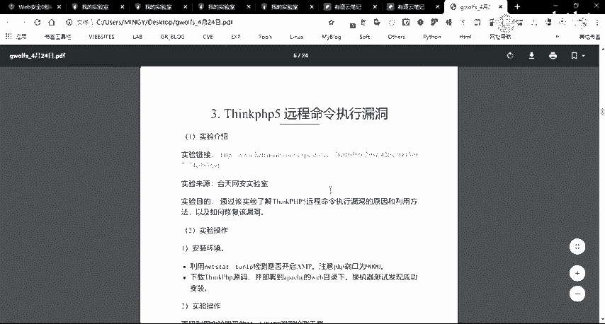

这个实验的话应该没有问题啊。嗯，呃后面的时间还要呃。

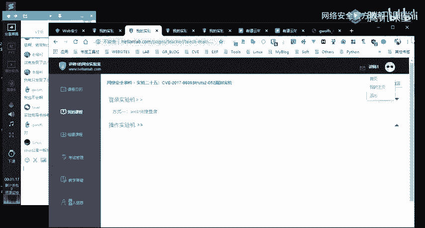

这个实验没有问题。

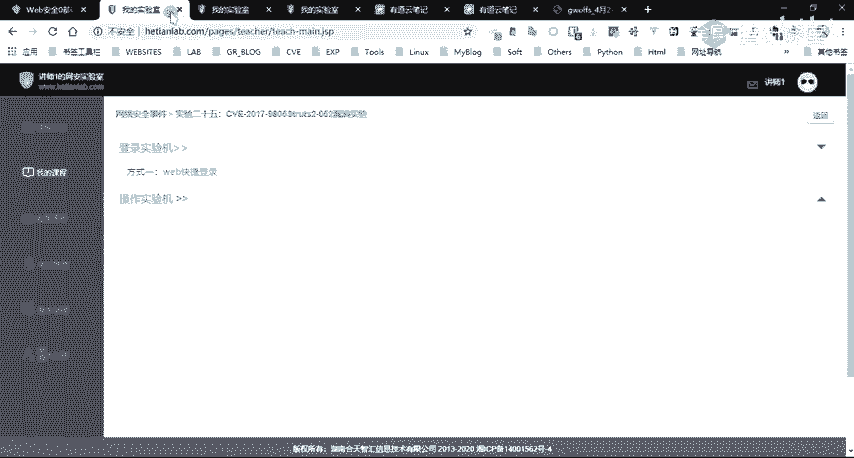

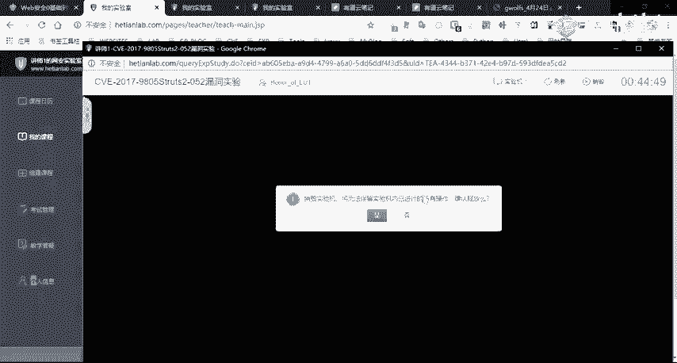

呃，然后的话后面还有两个实验，呃，这一个实验的话。我就不讲了吧，大家照着做吧。然后这里的话。这个的话就是这一个imagine magic这样子的。一个组件。就说这个的话它是在处理图像。

就是呃在处理图像的一个库。然后这个imagine magic的话，它是呃存在这样子的一个命令执前的一个漏洞。然后的话呃其实我们。就是说如果说你有碰到这样子的一个imagage这个这样子的一个漏洞的话。

然后正好就是说你的就是说你得到了这样子的一个shall，对吧？你得到了这样子的一个hell。然后你通过PH in查看它它的一个图像处理库呃，有这样子的一个组件。

然后这个组件的话正好是漏洞的一个版本的话啊，而且它的就是说执行命令的时候有。啊，有一些限制。然后的话就是说你不能够你不能够去调用我们的，比如说system的这种函数去执行我们的一个系统命令，对吧？

那么你可以尝试去使用这样子的一个这样子的一个imagine magic的一个漏洞。因为这个漏洞的话，它是呃在它的这个组件存在这样子一个命令执行漏洞。所以说我们可以通过他的这样子的一个命令执行漏洞来。

得到一个像。啊，步骤的话呃我就不讲了吧。然后这里的话我说一下这一个生个PP啊。的一个远程命令执行漏洞。这个漏洞的话呃。就是刚出的时候呃，是比较火的，而且它的一个就是它的一个影响的话是很大的。

因为你直接可以通过构造这样子的一个很简单的一个配load来去执行我们的一个。呃，执行一个命令远程的一个命令执行。然后的话还能够通过。🤧命令执行写hell来得到web服务器的一个呃web share。

然后这里的话呃这个实验的话是1个深个PPHPV5。1的一个版本。然后的话还有还有一个的话就是V5。0的一个版本也是。

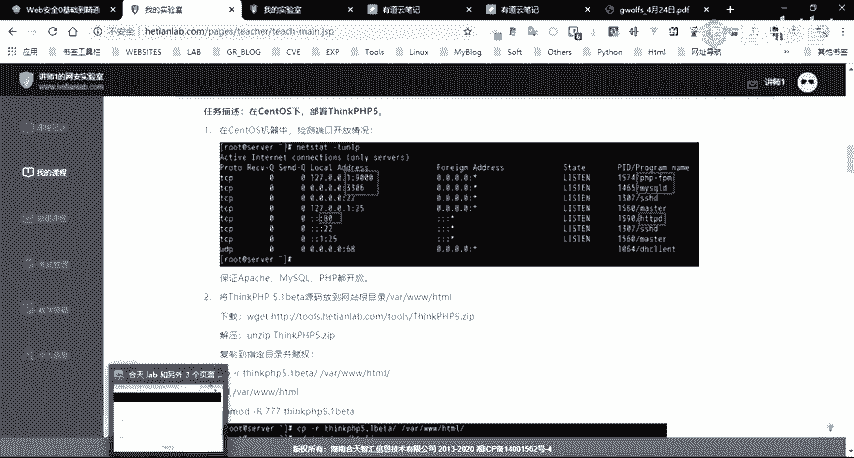

同样的存在这样子的一个漏洞的。

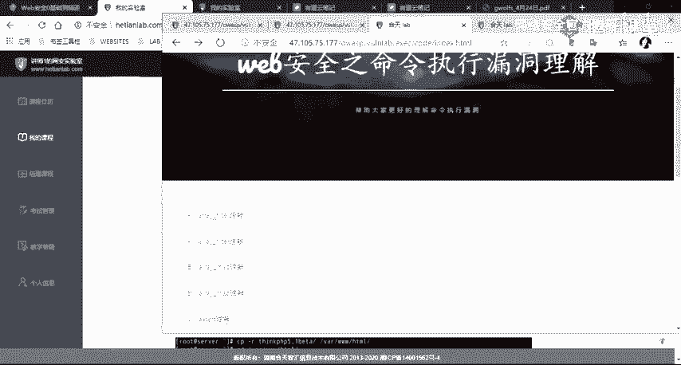

🤧Yeah。然后这里的话5。0的一个版本的话，我是把它放到我一个呃我们的这个把机服务器上面去了。大家可以呃以这一个作为一个靶机去进行一个操作。呃。然后的话实验的话，大家照着做就好可以了。

然后我这的话就以这一个靶机。做一个就是操作的一个演示嘛。Okay。然后关于这一个漏洞的一个原理的话，因为涉及到PHP代码的话。

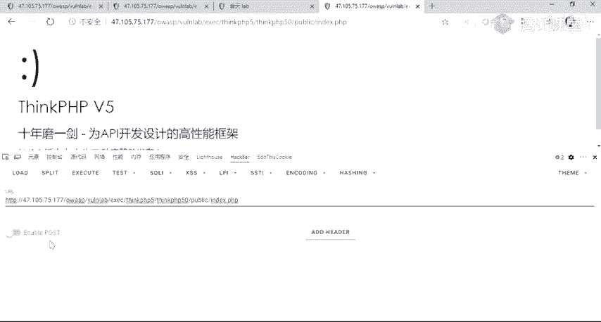

呃，这里的话我不去对他做一个讲解。就只是呃告诉大家这个漏洞，然后它是怎么去进行一个利用的。然后有怎么样有怎么有哪些利用的一些方法，然后怎么去进行一个测试。呃。Yeah。And。嗯。Good。

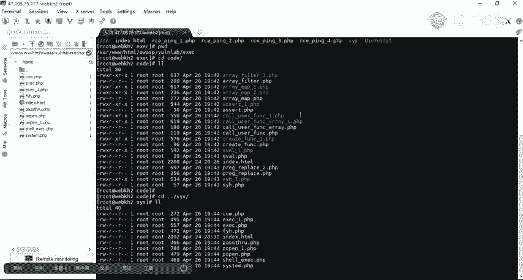

Yeah。Okay。看。Okay。Okay。Okay。Okay。嗯。电脑有点卡哦。因，今天忘记带我电脑的充电器了，所以的话用的是电源的就。比较卡。🤧嗯。啊，这里的话呃我这里的话有这样子的一些文件。啊。

然后大家对这一个。如果说对他的一个原理，就是想去做一个了解的话，我这边的话有有这样子的几个。啊。几篇文档大家可以去进行一个呃研究。

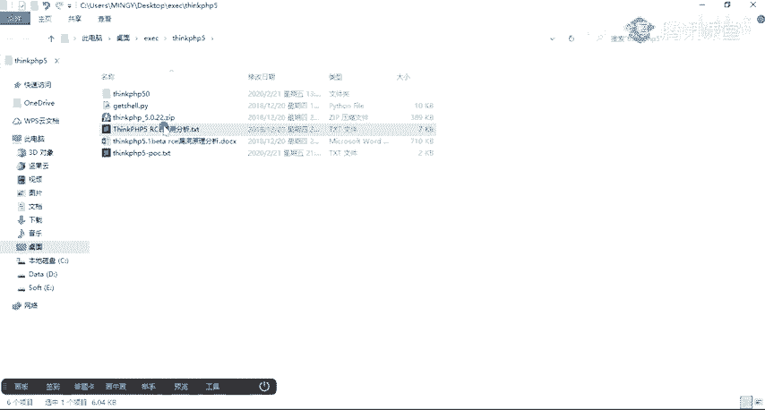

Com。

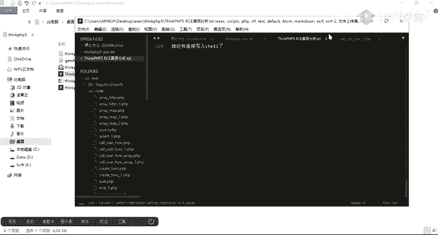

然后的话这里的话我们主要是就是我们看一下它的一些POC。

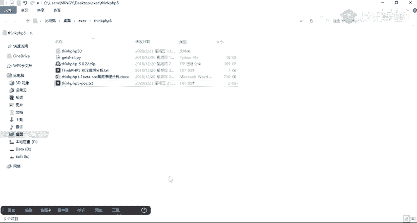

嗯。🤧Yeah。然后我这里的话是1个5。0的一个版本，对吧？我们。用现成的1个POC来去进行一个测试。

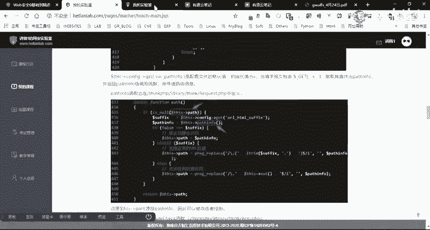

我们只需要在后面接这样子的一串。然后的话我们其实可以看到它这里执行的一个命令就是这一个外卖，对吧？然后我这里来进行一个执行。对吧可以看到他这里的话是呃阿帕奇阿帕奇的一个用户。

然后我们这里呃关于前面他这里这样子去进行一个构造的一个原理的话，我这里不说然后。呃，我这里也不去给大家做一个介绍，因为介绍的话可能大家不是很明白，就是呃大家先知道这样子的一个东西，对吧？

然后我们来来看这里它的一个配load的，后面这里的一个构造，对吧？然后我们其实可以看到这里的话是有一个functionction，这个functionction值的话就是这里的一个对吧？

这一个函数这个函数我们应该熟悉吧。这个函数的话其实就是我们这里有讲到的。🤧这一个。call use function area这样子的一个函数，对吧？然后呃我们看一下这样子的一个函数啊。

就是说这一个函数的话，它是会把我们的第一个参数作为一个回调函数来调用。然后的话把我们的。这里这里传入的一个参数。作为我们这里的一个回调函数的一个参数传入。

就是意思就是把我们这里传的一个参数呃给这呃给我们的这里传入的一个呃函数来进行一个处理。那，其实我们看一下这页这样子的一个例子，这个例子的话就是呃我们这里呃这里的话我是写死了的。

就是在这里的话是1个第一版本的。然后我这里一个靶场，我这里一个靶场的话就是。哪一个呢？就是这个这个的话就是一个就是我里面已经写死了嘛。然后我这里的话是呃写了就是把我们的一个函数。

以及我们的要执行的一个命令，把它给分开，由我们自己去定义去进行一个传输。大家可以去，大家应该都有做。然后这里的话就是我们把我们这里传入的这样子的一个。参数。

对吧我们通过pos的方式传对这样子的一个参传给这一个变量，然后把这个变量的话付呃给了这这个er数组的第一个呃。Yeah。🤧K。第一个第一个值。

然后的话把这里的这个数组里面的参数把给了这样子的一个Ss的一个函数去进行一个处理。然后其实我们只要传的我们是1个PHP的一个代码，对吧？

然后的话我们的1个PHP代码就会给我们的这里的1个Set函数去进行一个解析。然后的话就能够去构造这样子的一个命令执行。哦，我们再来回看一下这里的1个POC。第二个高站。🤧其实我们可以发现。

他这里跟我们前面说到的一个命令执行的一个啊构造其实是一样的对吧？可以看到我这里的话先传这样子的一个呃call you the function error这样子的一个函数，对吧？

然后的话再传一个呃这一个传给这一个数组vari这一个数组。然后它的第一个呃值的话是一个sstem，对吧？然后第二个的话就是一个互卖。然后其实。我们从这里的话就能够看出来，其实这里我们给的这里的两个参数。

它会给我们的这里的这一个函数去进行一个呃处理。然后处理的话可以看到它就相当于是我们这里的一个这样子去进行一个传舱，我们传一个stem，对吧？然后再传一个。然后我们再呃。就是这一个。啊，去进啊。

不是这一个。你啊。🤧这这一个。😊，换卖对吧？然后我们去进行一个提交，提交之后的话就执执行了我们的一个呃换卖的一个命令，对吧？然后其实在这里的话，跟我们这里的话，一个例子是类似的。

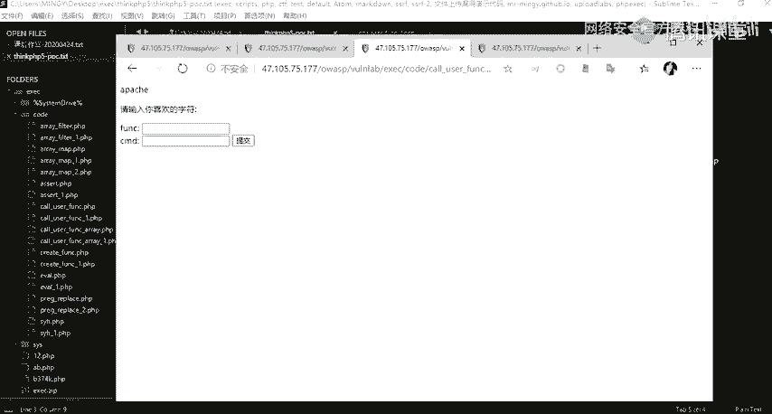

🤧Yeah。哎，拿出来。对吧我们同样的是构造了呃通过利用它的这这样子的一个漏洞，然后的话构造这样子的一个呃命令执行的一个函数。然后给这一个命令执行的一个函数传我们的呃。

传我们的就是执行的一个命令的一个代码，传给这一个函数。然后的话来构造这样子的一个命令执行的1个POC。这样的话大家呃应该能理解吧，对吧？就说前面的话其实呃也有给大家介绍这样的一些函数。嗯。😊。

然后这这个的话其实就是呃把我们的这里的这一个命令执行的一个函数做了一个呃实际的一个利用，来构造这样子的一个命令执行的1个POC。所以说呃就前面大家不要觉得前面讲的是一些行数，可能不是很好理解。然后的话。

🤧。就是我们首先要去了解这样有这样子的一些能够去啊进行一个命令执行的一个构造的一些函数，对吧？然后的话我们之后的话再碰到这样子的一些。要你去进行一个就是进行一个命令执行的一个构造的时候。

你就能你就知道怎么去进行一个使用了。然后的话怎么去进行给给我们的这样的子的一个函数去进行一个参数的一个传递，参数的传递来进行一个命令执行。然后其实后面的话也都是类似的。

然后我们这里的话就是床舱的不一样是吧？可以看到这里的话是1个PP。然后然后的话就是前面的话就是执行命令嘛，后面的话就是一个写 sharell嘛。写需ll的话，这里同样的也是使用的这样子的一个函数。

然后这里的一个呃还有一个问题呢呃，这里的一个不同点的话就是这一个fireput contains这样子的一个函数。这个函数的话就是我们的呃我们看一下，它是一个用来写文件的一个函数。

就说把我们的一个字符串写入一个文件，就是使用这样子的一个fireput content的一个函数。然后我们知道他的一个意思的话，那么我们就能够比较好理解到这样子的1个POC对吧？就它的一个意思的话。

就是通过这个fire put content的一个函数来呃写入到呃就是把我们这里的一个代码，写入到这样子的一个需要点PHP的一个文件，对吧？然后这里的话其实就是一个PHP的一个代码嘛。

然后的话再给这一个函数去进行一个解析嘛。🤧。然后的话就能够执行我们这这里的一个命令嘛。然后我们来可以来测测试一下。来进行一个需有的一个写入。这样的话我们呃直接把它粘过来贴过来。

然后我们这里直接啊密码的话是CCCC来进行一个执行。执行之后的话，可以看到它这里的话仿回这样子的一个。值的话就说明我们这里执行已经成功了。然后我们来验证一下，看是否。啊，需ll已经写不进去了。

我们写入的一个需有的一个名称的话，就是需要点PHP对吧？我们来访问，访问发现的话它是能够。啊，就是没有任何的一个报错或者回险的话，就说明我们这样子的一个需要师已经写助成功了。然后我们来测试一下。

密码是CCCC。我们执行1个PP for。执行可以看到的话是我们的一个小是已经成功的写入了。然后呃。然后还有一点的话，我再强调一下，就是我再强调一下就是。啊，一直也有同学就是有这样子的一个疑问。

就是你们的这里的。你这里传递的1个PHP的一个代码，一定要是以一个分号结尾的。就是以一个就是说这一个函数，它是去执行我们的1个PHP代码，对吧？去解析我们的一个传入的1个PHP代码。

那么你就需要一个分号去进行进行一个结尾。然后的话就是还有一个呃另外一个例子的话，它的一个不同点就是。这一个。Ha sense。这个Set。这个设置的话，我们其实前面。也一直。有介绍就是说这个的话。

它是把我们它会把我们的一个呃就是传递的一个字符串，这里是一个字符串，而不是说1个PHP代码，就是说它是可以不用以一个分号去进行一个结尾的。然后的话我们这里传入的一个是一个字符串。

比如说我们就传1个PHP。对吧。这样子，然后不以分号结尾，我们去进行一个提交是能够执行的。然后你这里加一个分号，它同样的是把你当成一个字符串。然后的话它执行的话也是能够去执行我们的1个PHP代码的。

因为它这里的话是它这个函数，它要把我们传递的这一个字符串作为1个PHP代码去进行一个执行。这样的话大家要去啊做一下区分啊。然后的话还有就是执行这种系统命令的时候，系统命令的话。

你是调用了一个系统的一个函数，对吧？然后的话也是说没有说有这样子的一个分号，因为分号的话是PHP代码的一个结尾。就是说表示你的这1个PHP代码是啊啊完成了，就是说写完了。🤧Yeah。Okay。呃。

然后的话其他的一些的话都是类似的这样子的。嗯，然后的话就是两个版本不同的话，就是它就是它的一个构造的在前面的构造的这些地方，它是不一样的。🤧Okay。Okay。呃，大家。这里的话大家能明能理解吗？

就是说应该。啊，能听得懂吗？呃，升个PHP5去做做一个探测的话，你就这。你用云石也可以，还有其他有一些。按这指纹的一些到U去进行一个。And。不好意思啊，就是你用圆心，你也可以去进行一个探测嘛。

你还有其他的一些可以探测网站指纹信息的一些网站一些工具什么的。Can。

然，然后这里的话因为是一个像这种测试的，就其实你像这种胜个PP的话，它其实呃从它的一些页面，它的一些访问的一些有链接什么的，也能够有一个有一个基本的一个判断的。

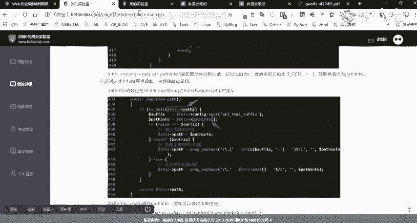

那比如说这种public，对吧？🤧Okay。然后这这里一个测试页面的话。但是没有做其他的一个开发，所以的话能够直接看得到这样子的一个测试页面。它只是一个就是PHP的一个框架。

然后的话有很多的一些基于这1个PHP3个PHP框架啊，对开发的这样子的一些呃网站，它都是会存在这样子的一个漏洞的。🤧。看。Okay。🤧Okay。指纹探测呃。我这里。呃，大家有没有什么？还有还有疑问吗？

我刚刚的一个就是讲解应该能能明白吧，只是呃就是它的一个漏洞的具体的一个原理的话，我我这里没有讲，没有给大家做一个讲解。因为可能现在大家讲这一个大家也不是不会很很很很很明白，而且讲了可能还会更加糊涂。

所以说这里的话，我不讲前面的他的一个漏洞的一个构造，就是说怎么去通过这样子的，就是说通过这样子的一个构造来。进行一个命令执行。

然后我这里的话是把我结合我们之前的一个呃能够去进行一个命令执行的这样子的一个函数。然后的话它是怎么去构造的对吧？通它是利用我们的这样调用我们的这样子的一个能够去执行命令的这样子的一个函数。然后的话。

来执行我们的一个命令。觉得。后面的这一节它是这样子去进行一个构造的，它的一个原理。🤧K。🤧Yeah。Com。Okay。🤧Yeah。呃，大家有有问题吗？有问题的扣一，没问题的扣2。😊，Yeah。看。

Okay。系。Okay。有有问题吗？你是有问题还是没没问题啊？看。🤧Okay。嗯。

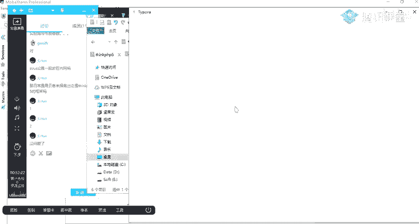

Okay。🤧Okay。指纹识别的话，我这里。给给一些网站吧，然后就这个其实用这个what web这个的话也能够识别很多的一这样子的一些指纹啊。当然的话呃这个的话是就是对国外的一些网站的话。

它的一个这种呃。

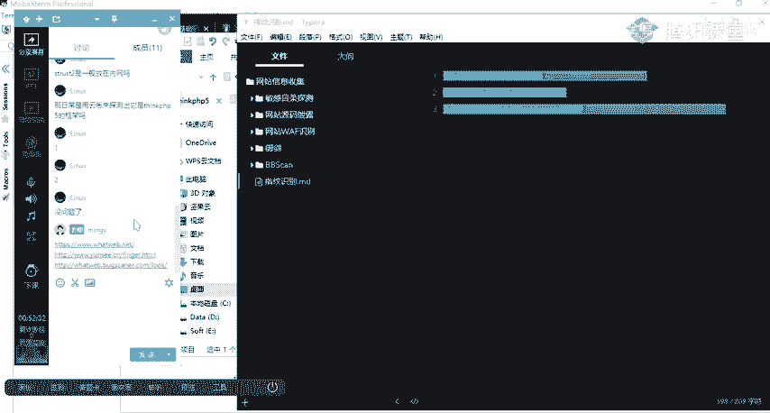

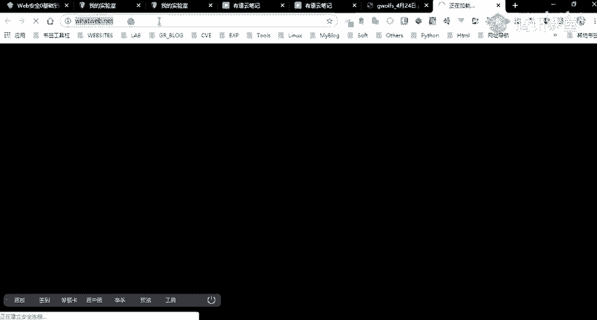

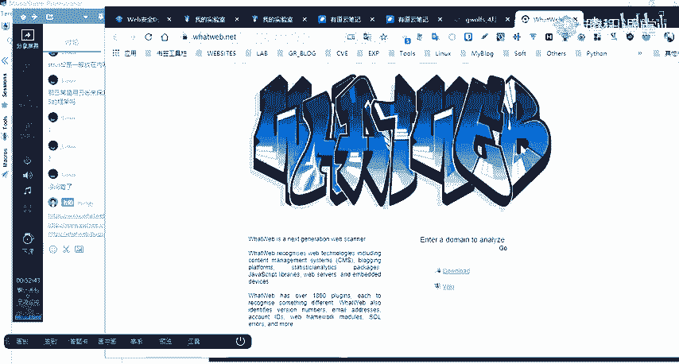

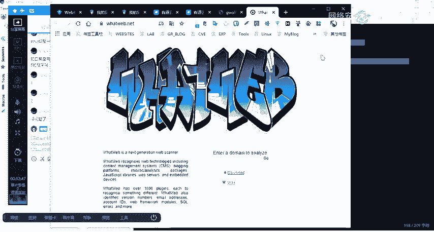

比如说这种CMS的这种指纹信息化识别会比较准准确。当然国可能国内的话。

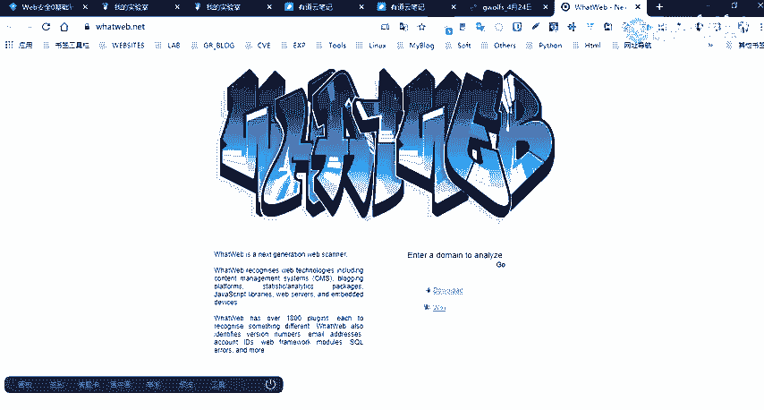

准确率的话不是会不会很高啊。当然话他同样的能够去进行呃就是你网站信息的一些收集。

🤧Yeah。Com。

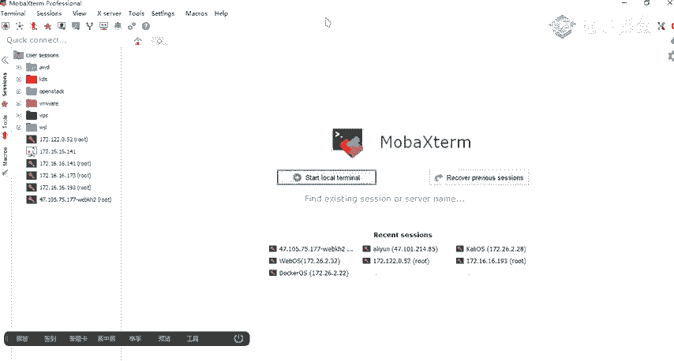

呃，大家没有问题的话，那么呃。看一下还有。还有什么。哎。给大家讲解了。呃。这样的话呃，我们把这些实验的话都大概都过了一遍，然后的话。对命令执行的这些题目的话，如果大家还不理解的话。嗯。

大家再去做一做做一下，然后的话。

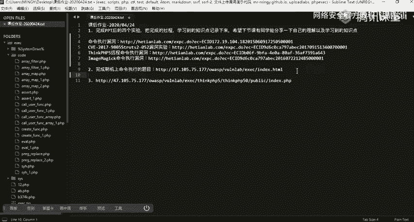

大家自己详细的一些东西的话，大家去百度吧啊。

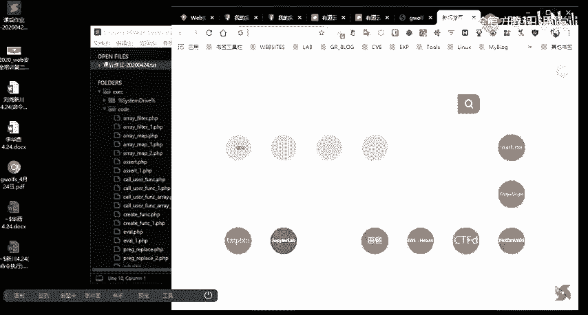

就自己去查找资料，然后的话把这些东西呃把它给理解理解理解透。嗯。😊，好呃。哦，我看了一下这位同学，他的就是他的一个文档，我觉得。他这点的话呃挺好的，就是可以看到他这里的话就是在做这些命令执行的时候。

对吧？他不是他我看到他有一个就是说他的一个目的就是用这个命令执行，对吧？然后去写shall，对吧？这个的话大家大家不要。就是大家发散一下思维，就不不要说就是只是去进行一个执行一个命令，对吧？

我们上节课也其实也讲了，就是我们通过执行命令能够去。呃，写shall其实最终目的嘛，最终目的的话就是利用它的一个命令执行漏洞来得到我们得到它的一个shall。然后的话再去进行其他的一些啊测试，对吧？

就这里的话大家一定要自己去多动手去操作一下。比如说你这样子的一个ele去写hell，对吧？然后的话你呃你可能中间会有一些问题什么的对吧？🤧Okay。这些东西的话呃。

大家只有在自己自己去进行一个操作过之后的话，你才会呃能够去比较好的记住，或者说比较好的理解。然后的话还有执行命令，对吧？通过NCNC这个工具，它的一个使用的话，我不是呃也发了一个文档嘛，对吧？

那个文档的话应该写的很详细了。我这边话。Okay。就这一个文档就这一个工具。这工具的话，我们在自己做这种啊就是反谈歇尔的一个测试的时候，会经常会用到。然后的话这句话我应该写的很详细了。

它的一些功能什么的，进行一个反ci尔进行一个正向的一个连接，对吧？然后这里要注意一点的话，就是你这里的一个正向连接。你要弹尔的话。你必须这个NC要支持这样子的一个杠一的一个参数。

你才能够呃返回这样子的一个需要。

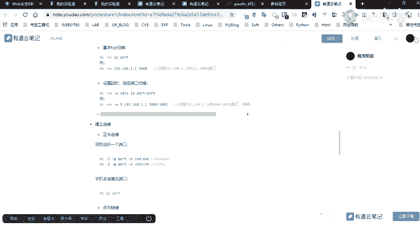

🤧K。Good。

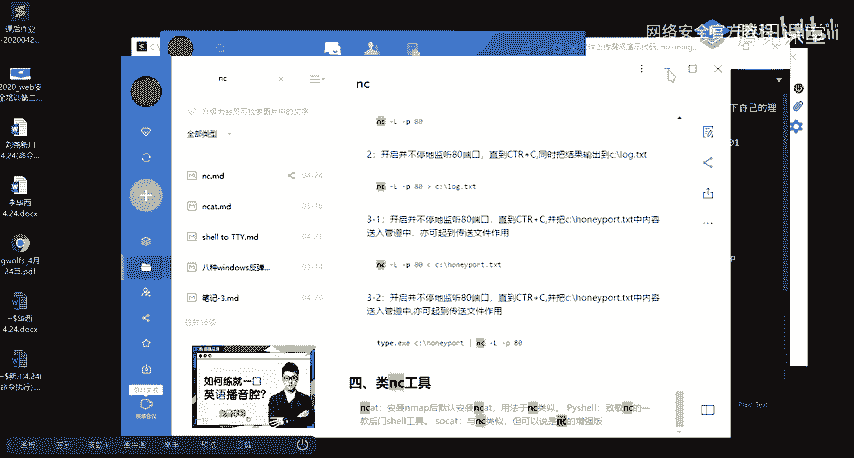

呃。

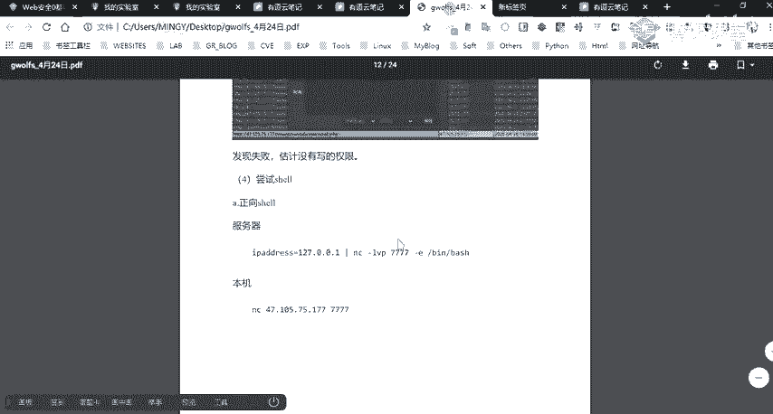

看。然后的话呃。系。哦，还有一个还有一个我还有一个地方，我在上课的时候，我忘记讲了。

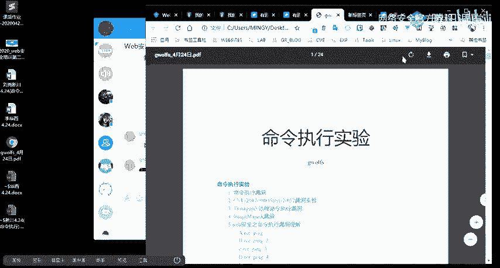

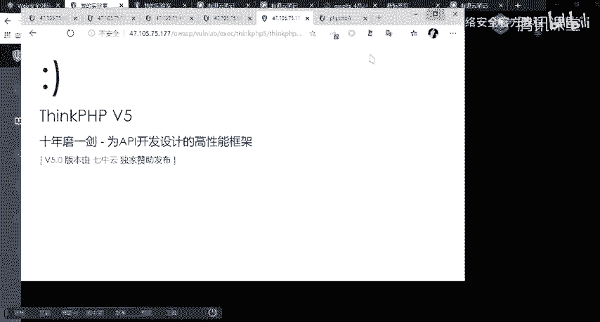

就有一个有一个那个。Yeah。Com。Okay。🤧就这1个PIEG的一个repa刚。

呃，这一个的话。呃，上节课我忘记给大家说了，就是。这里的这一个对吧？我们前面的话给大家就是介绍了这1个PGreplace嘛。然后的话我们可以通过这样子的一个方式来构造我们这样子的就是一个一句话嘛，对吧？

H。😊，然后的话这一个的话我们嗯。呃。这年的话。跟上面一个的话，我做了一个改变，就是有一个更改的一个地方。然后的话我们来看一下吧。就从代码来看一下，就是它的一个不同的一个地方的话，就在于就是。诶。

我们先从头来看一下，首先的话就是通过get方式来获得这样子的一个date，对吧？呃，获得从呃date。参数传递过来的一个值，然后给它这一个date变量，然后给这个dta变量的话就是放到了这里。

放到这里的话，就是我们要去进行一个匹配的一个值，对吧？然后这里代码的话是写的是一个啊就是匹配所有嘛，然后它同样呢是一个杠一的一个参数。然后我们用我们上面的这种方式，比如说我要。

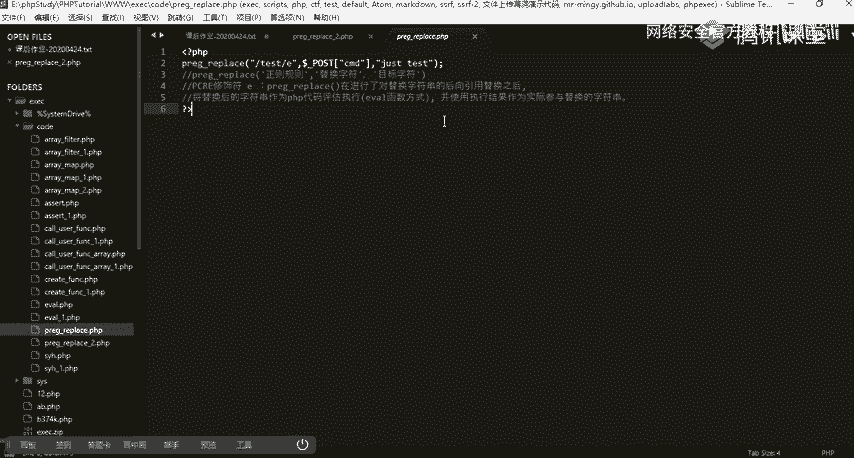

我要让他去执行，对吧？因为他有概念的一个参数。如果我们这里去传我们的1个HB的一个代码的话，它是能够去进行一个解析执行的对吧？

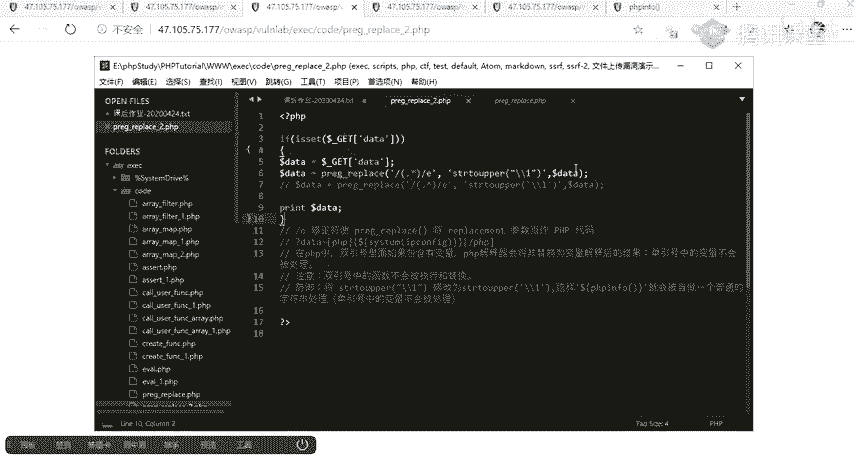

Yeah。🤧P。Okay。Okay。Okay。🤧Yeah。在的等你看。🤧Yeah。比如说我传1个PHin对吧？然后我们可以看到的话，它在这里的话。他把我们呃可以看到这里的话。

是输出了1个PHP four，然后它是一个大写的。然的话他没有执行我们这里的一个KP for的一个命令，对吧？哦呃。

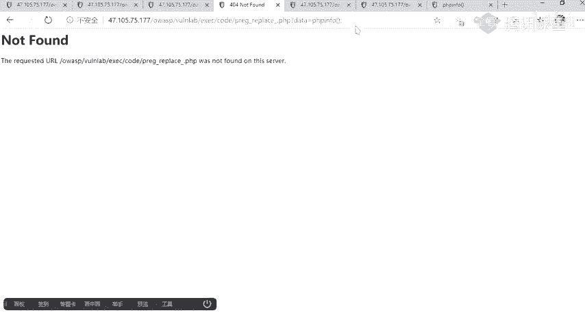

Okay。Yeah。

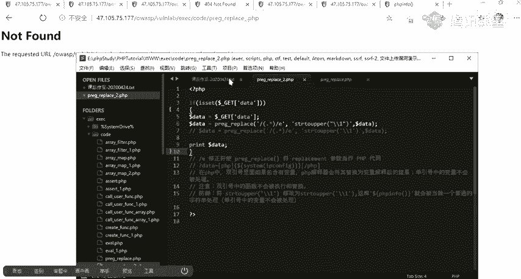

Okay。Okay。诶。😊，没有啊。😔，干看。我们。😊，之前的这个。Com。来去进行一个执行，可以看到这样的话是能够。正常的执行我们的1个PHP代码的。然后在这里的话。

他把我们的1个PHP的一个本来要执行的一个代码它做了一个呃。大写的一个转换，就把一个小写把它给转成了一个大写。然我们来回看一下代码。

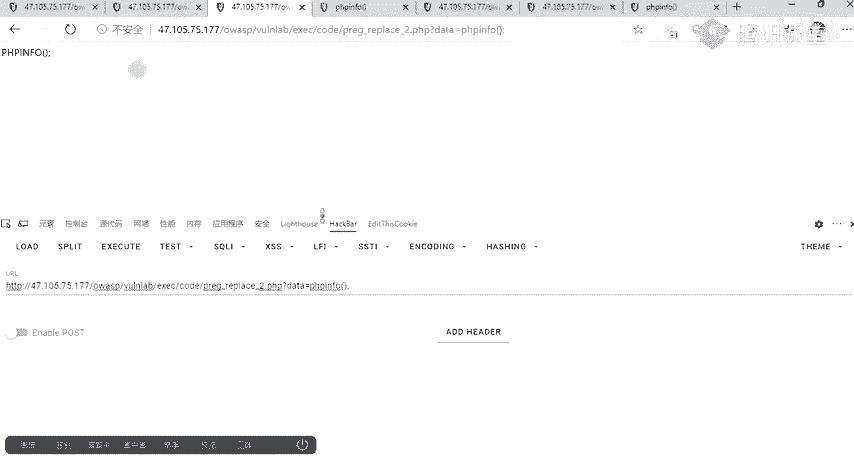

它这个不同的话，其实就是在这里这里的话它的一个它这里有一个代码就是。把我们的一个传传入进去的这一这一个值，把它做了这样子的一个处理。

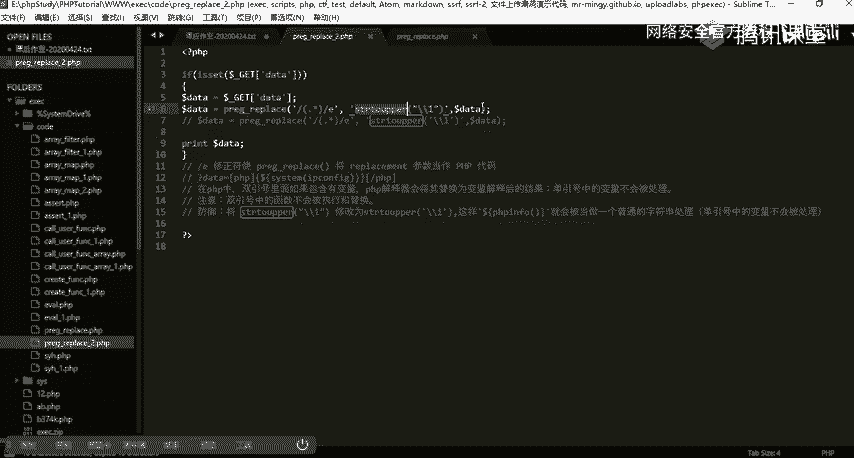

这个处理的话就是把我们的一个函数，把它呃把我们传递的一个字符字符串把它转化为一个大写。

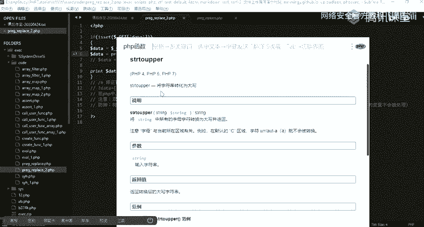

然，转化为大写的话，它就。没他没有去进行一个执行PHP的一个代码。然后这里的话。要去绕过。而去绕过他的这样子的一个呃这种方式的话，我们就通过我们前面的这样子的一个。Okay。就是双引号。

就双引号里面如果包含有变量的话，它的1个PHP解释器，它会将其就是替换为一个变量解释后的一个结果。就是说意思的话就是说在商双引号里面如果是含有变量的话，那么它会呃首先它会PHP解释器。

它会解析我们呃这个变量里面的一个PHP代码，对吧？解析之后的一个结果，它就会呃把它就是解析之后的一个结果，就是我们这里的一个呃。这一个双引双引号里面的这一个变量的一个结果。然后的话单引号的话。

它是不会做一个处理的。所以说我们这里的话，因为我们传入的一个值，对吧？传入一个值，它会给这一个呃函数做一个大写的一个处理。然后如果我们是用这样子的一个双引号去进行一个传递。P。

然后的话传递的话是一个这种变量的一个形式。那么它首先会去。就是处理我们这里的一个呃PHP的一个代码，然后解释这1个PHP代码之后的话。呃，就是能够正常的执行我们的一个传入的这样子的一个代码。

我们可以来看一下。🤧Okay。🤧Yeah。🤧Okay。

黑黑乐的话就是像这样子。我们去进一个呃。诶。啊，这里这里是在另里手的话，不是IP config。呃， if不看这个。然，我们去进一个执行。然后可以看到的话，他这里的话是执行了。

那首先把我们的1个PHP代码，对吧？就做了一个呃解释执行。执行之后的话，就是它的一个结果就是输出来。然后这就是呃。这里的一个传入的一个变量的这种。就是绕过他的这种写的方式。

我们可以通过这样子的一个形式来去进行一个呃命令执行。

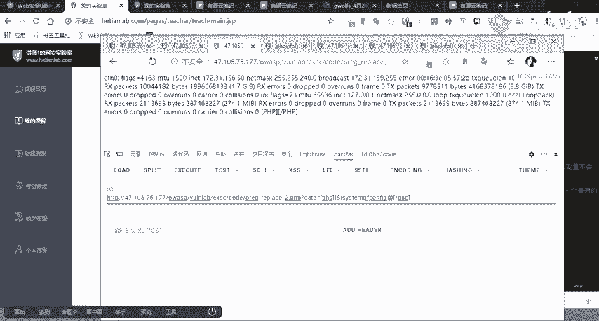

然后这里的话。啊，上节课是忘了讲了，就是讲完这个之后的话，没有呃，就是上节课不是有一个那个双引号吗？双引号的这样子的一个题目就是像这样子的对吧？然后我们在双引号里面的这一个代码的话。

它会直接去进行一个解析执行的。

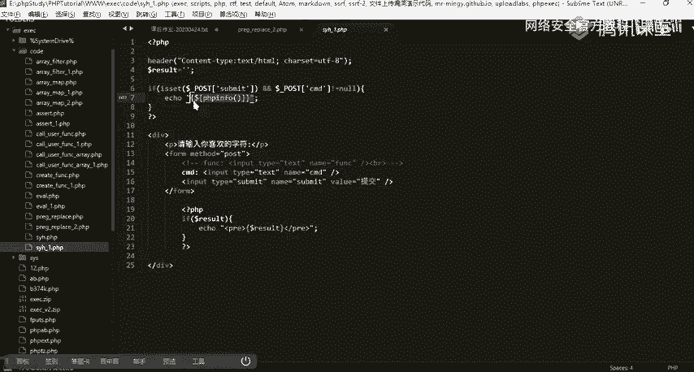

🤧。Okay。呃。然后的话呃大家。啊，有有没有什么疑问呢？怎么进我分享的一个文档？🤧Okay。Yeah。呃。我不是发在群里了吗？那个分享的这个这些文档。然后你不是直呃不是直接就可以访问到吗？

我这话是写在有道园有道园笔记里面的。

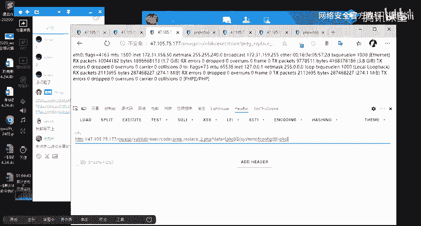

就我是通过有道语分享出来的呃。

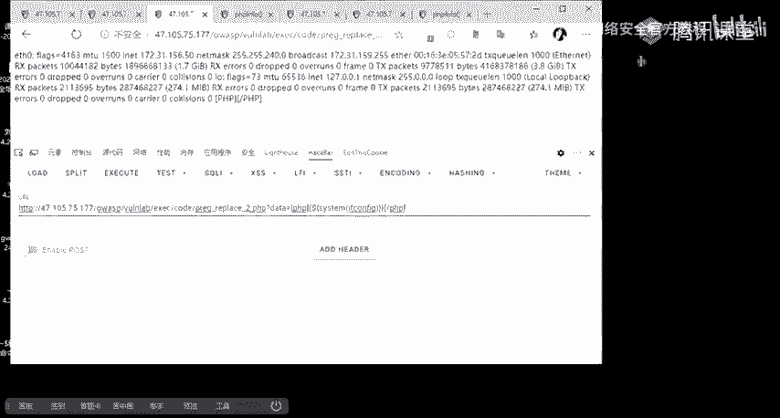

啊。然后你就是呃我把这几个链接我再发一遍吧，我发群里。K。你直接通过访问这些链接，就能够访问到我的。我分享的这这些笔记啊。🤧K。我再发一遍，然后然后你这里可以保存啊，就是保存保存到你自己的一个笔记嘛。

然后你不想用这一个有道园的话，你可以下载下来嘛。然后这个的话是一个mark洞的mark洞的一个格式，你呃。你用s line啊这种可以打开，然后你可以用那种，就如果你知道怎么写m克洞的话。

你可以下一个mac洞的一个编辑器，对吧？然后用那个打开。啊其实呃你你们自己做一个笔记的时候，也就我反正做笔记的话，我是习惯用。习惯用马克东哦。嗯，就是用像这样子的一。因为呃自己做的笔记的话。

你肯定看起来要好看嘛。因为你不是说做完之后就不用了，你做完之后下次也要看，对吧？你这美观一点的话，呃，看起来舒服一点嘛。🤧Good。Oh。你这里写不上是说呃这个3个PP你写不进去吗？

是你是说这一个3个PPHP你写不进去吗？啊， payload的错来了。然后呃这里的话其实。哦，我这个有发给你们吗？其实我在这个网站上面。啊，我课后的话，我再发给你嘛。

然后这里的话是有一个啊我PPT里面其实也给了，就是有这样子的一个get share的一个脚本嘛，对吧？它是用python写的。其实其实你看一下它里面的一个代码的话，其实。也不是很难啊。

就是就是主要的话就是在这里。在这里这里他可以看到他这里的话有这样子的一些POC对吧？这些POC的话其实就是我们呃。就我这里的。诶。就这些这些测试的一些POC对吧？然后的话他直接把它放到这里来。

放到这里的话，然后通过pathon去啊请求指定的这你给定的这一个UL对吧？然后的话把这样子的1个POC把它给啊放进去，就就是把它给拼接。拼接之后的话去访问嘛。然后访问之后的话，看它的一个回醒。

看是否能够呃访是否有能够访问成功。然后的话不是有一个就是输出一个就测试1个POC哪个POC可以用吗？它就是这样子的一个呃形式。然后的话还有就是他可以这里可以get share嘛。

get share的话其实就是通过写嘛，通过写1个PHP的一个呃。通过这种可以去写呃。就写我们的一个一句话，对吧？然后的话连接连接之后的话。

它这里的话是通过代码来展示的这样子的一个get share的一个界面嘛。其它那个原理的话，就是这些POPOC嘛。就大家如果自己也知道了，然后如果你懂派审的这种的话，你自己也可以去写这种测试的一些脚本的。

这也不是说很复杂。🤧嗯。😊，2。Okay。然后的话呃大家。呃，有问题的扣一，没问题的扣2。然后的话呃。再给大家一分钟的时间。进行一个提问吧。🤧K。Okay。Okay。Okay。NC。Okay。看一下。

看。嗯。🤧，Okay。嗯。Com。Yeah。Good。Good。Yeah。Yeah。时间鱼片。🤧Yeah。Yeah。嗯。🤧K。

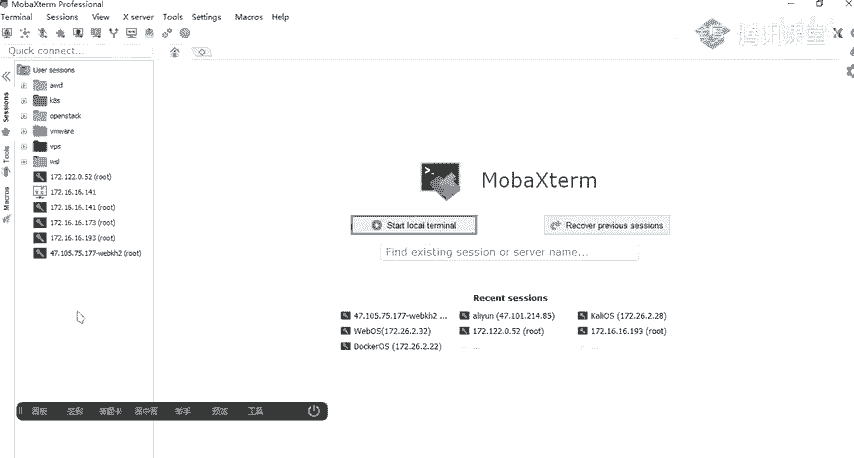

Okay。看看。

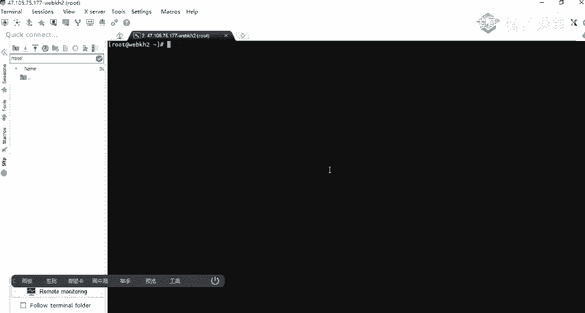

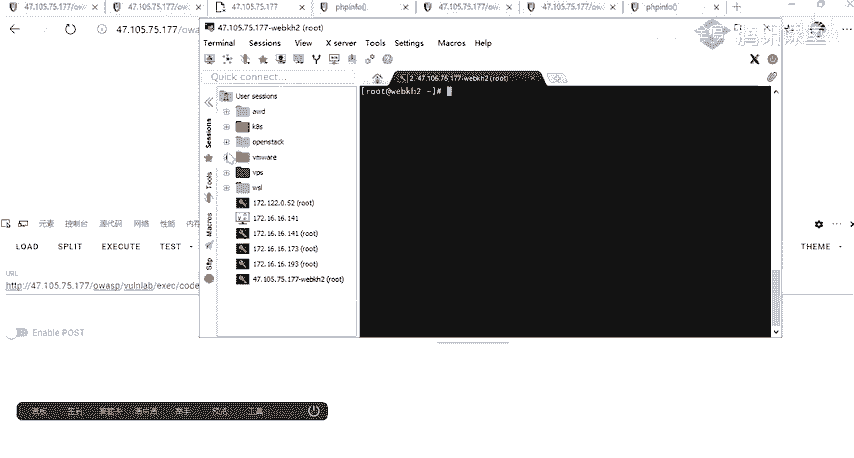

Go。这里的话我也没我我没这样子去尝试过啊。Okay。Okay。

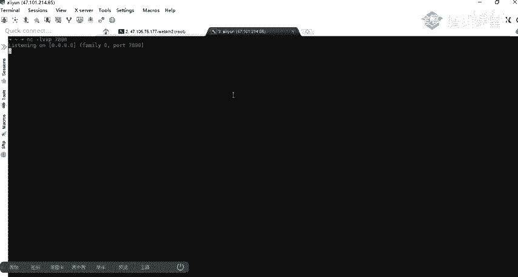

Yeah。

So。

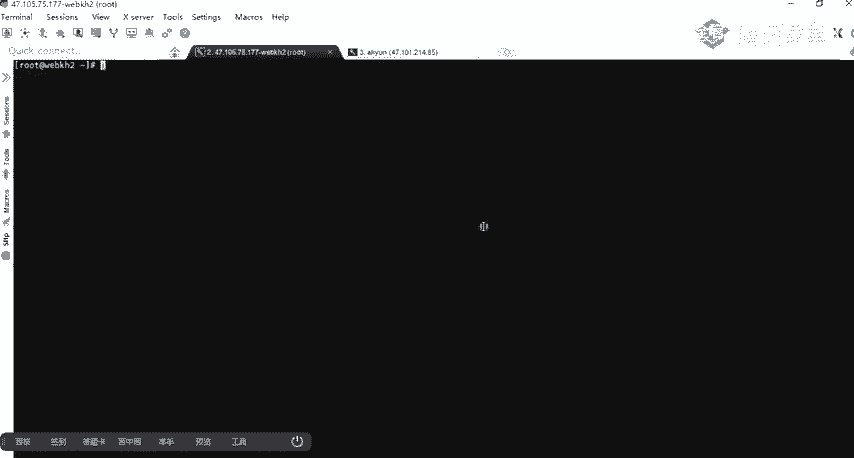

。

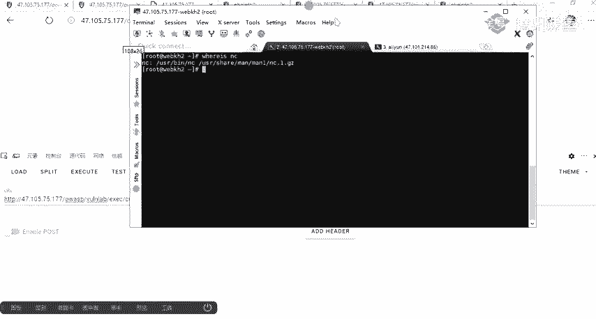

Yeah。不行啊，不能这样子去进行一个。不能这样子去进行一个命令的一个执行。这样的话我也没我没这样子去尝试过呀。呃，我课后再去我课后去研究一下吧。

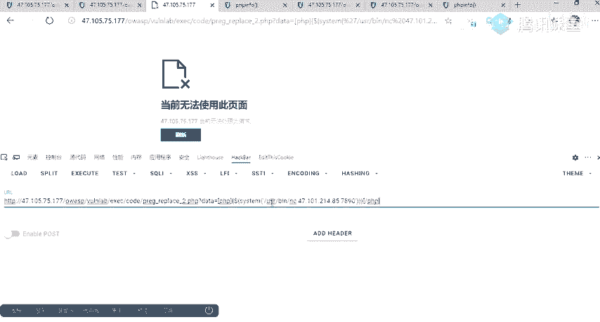

Okay。

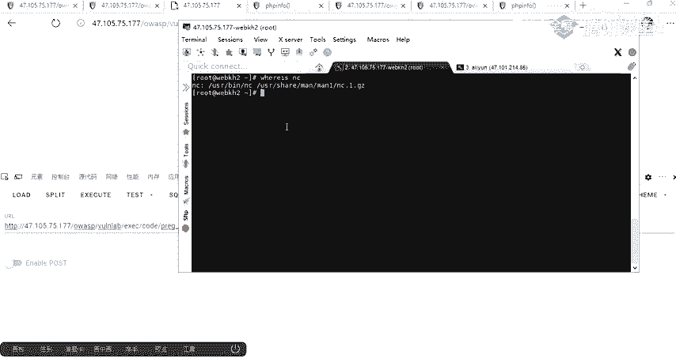

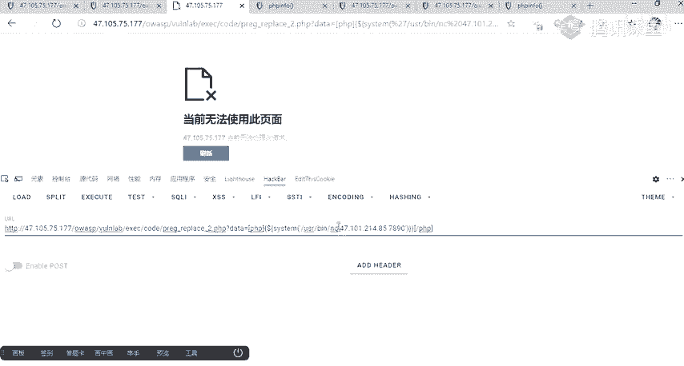

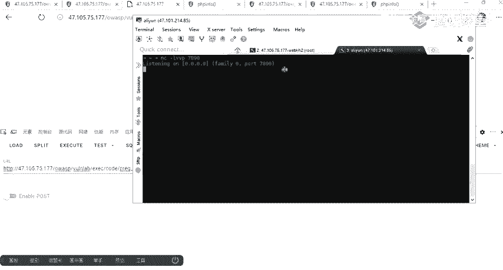

你你个做啥呀？😔。

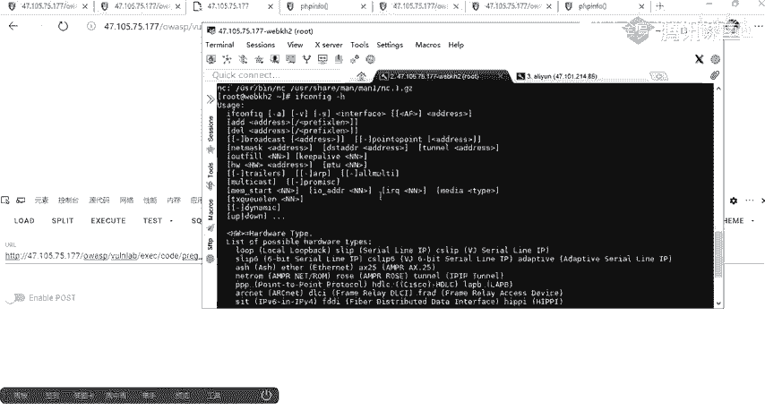

嗯。Yeah。哦。

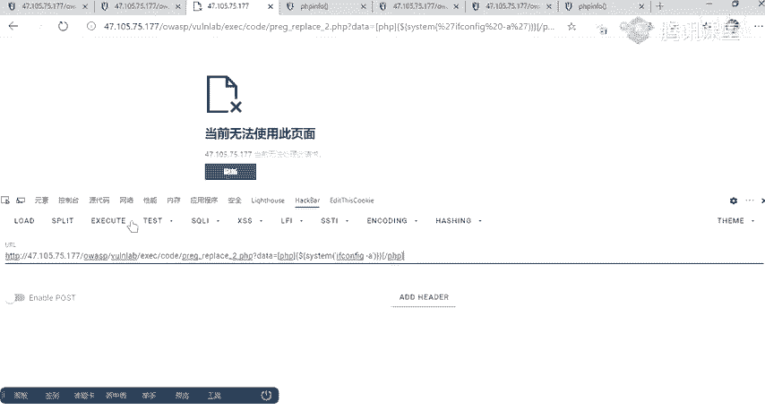

不行，不能这样子不能这样子去执行。

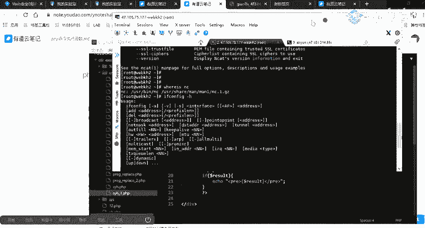

他这的话只能执行这里的一个。单个的 meaning。Congo。呃，这个的话我课后我去研究一下，如果呃有结果的话，我再我再跟你们说吧。还还有其他问题吗？这个的话呃，我课后我去尝试一下，因为我没我没有去。

我也没去尝试过这样子。🤧嗯。有问题的扣一，没问题的扣2。如果没问题的话，那么我们。呃，本节课的一个内容的话就到这里结束了。好，没问题是吧？😊，啊，那么。那我们下课吧。好吧。

然后呃命令执行的一个课程内容的话就就到那这里结束了。🤧H。😊。

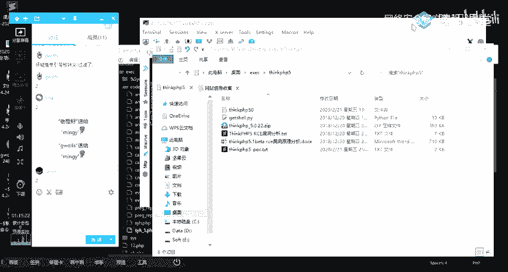

大家早点休息。