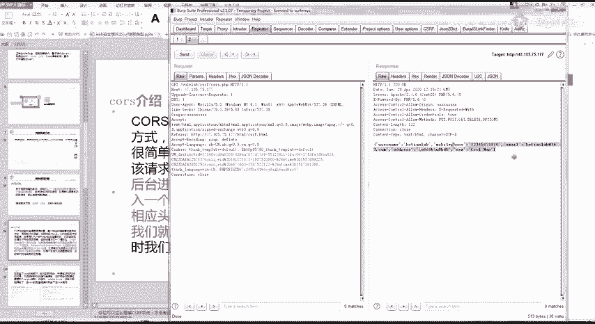
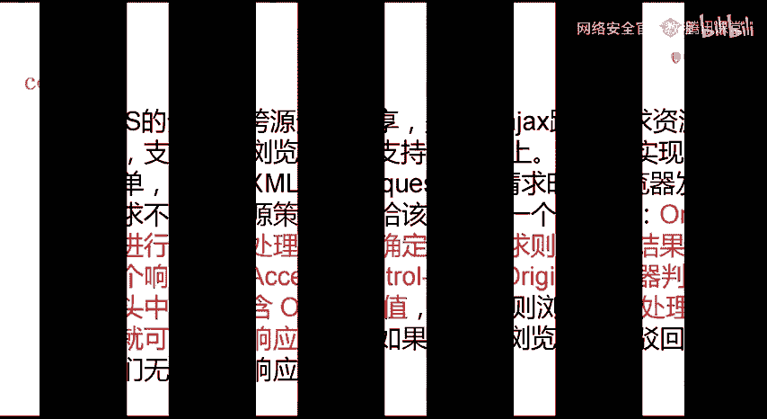
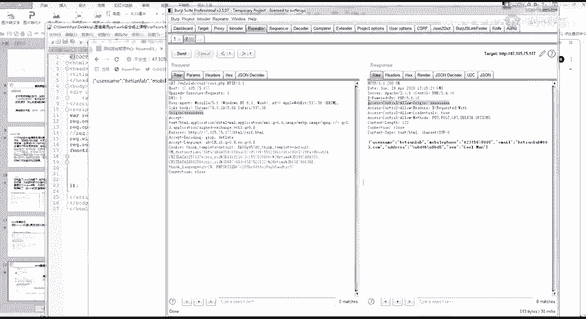
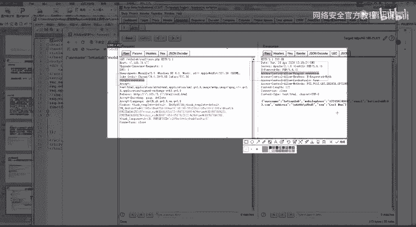
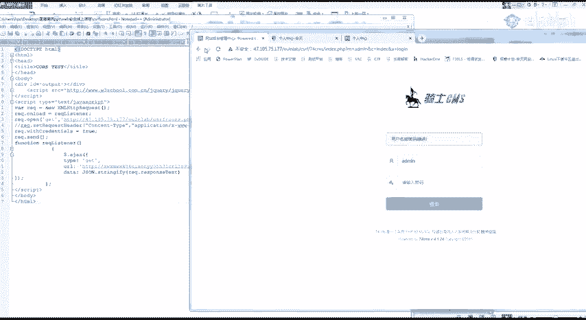
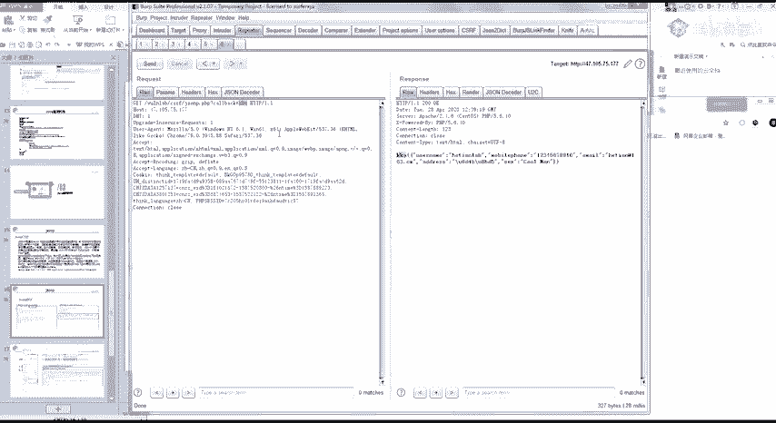
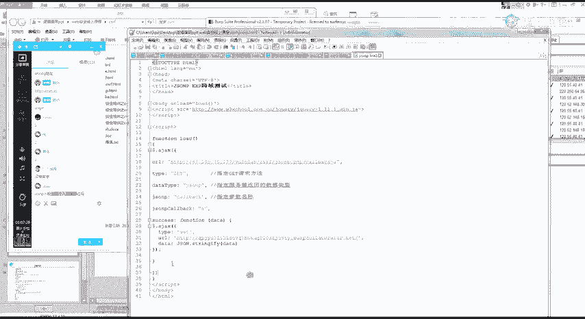
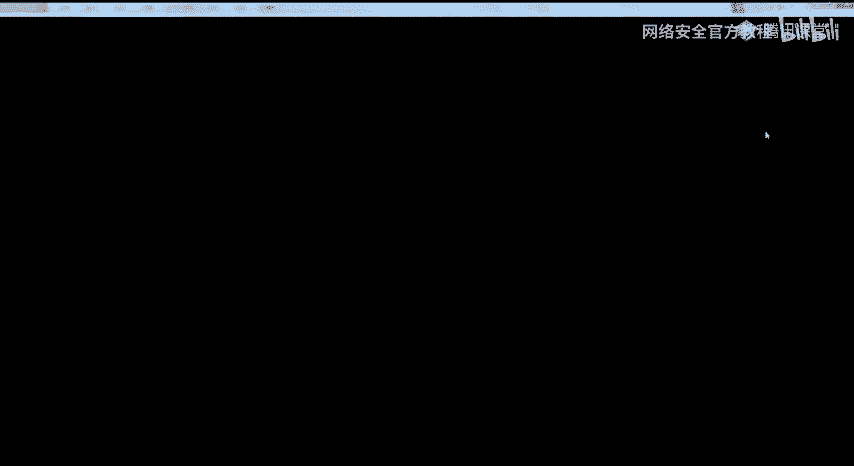
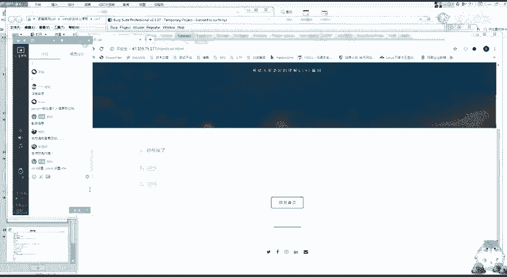

# B站最全网络安全教程，整整1300集，全程干货无废话，别再盲目自学了，看完学不会我退出网安圈！（web安全｜渗透测试｜内网渗透｜CTF） - P14：12.csrf实战.mp4 - 网络安全官方教程 - BV15u4y137cQ

🎼Different。🎼自己。🎼的去问。🎼Different。🎼没道现我眼泪。😊，🎼Be love love。🎼They say， oh my god I see the way you shine。

🎼Take your hand， Maggie and place them both in my。You know to stop me that I was passing by。

🎼How to see if theres just one more。🎼お。🎼face baby， Why don't to go。It's getting raining。

 Maybe we could stick fun。🎼Let在的。🎼F feel your up不再 stay the night。😊，🎼to bit talk when we get lazy。

 I'll take you to the car。🎼就蛋 go home我 baby up。😊，🎼Da。To stay them。🎼Baby。🎼Baby。🎼Ba没。🎼Ba。🎼花度。🎼喂你喂你喂个。😊。

🎼Ba upぴ up。🎼，🎼Just。🎼，🎼The。🎼嘟嘟。🎼大分。🎼，🎼北京。🎼Ba没。🎼D起。🎼，🎼，🎼Go to think on。🎼把这个。🎼Yeah呀。🎼么尼怎么尼。🎼全那苏 this。

🎼C other放 some big。 Tea other放 some peace。🎼一路。🎼也ど。🎼大家。🎼如果你佛散吹来。🎼Be the say。 We can。🎼the same。🎼你我去抓。

🎼No， we go up in planes。 So we go up and。🎼是。🎼Baby， whenma go for the phone and need the flap alone。

 Take me home。 Take me home。🎼Baby onema go for the boy。 Then bomb myself girl。 Take me home。

 Take me home。🎼F than我。🎼I won't make it out。🎼We won't make it。🎼Darling， don't forget some。

🎼When那 say longer个山 when那啷个sh。🎼Yeah。We。🎼We have。🎼的飞。🎼But is wrong。🎼会不美。🎼There's no place。 I' ever be。

🎼Ex。🎼あ。🎼We you。🤧哼哼。好，哎呀。还有3分钟。Yeah。嗯。Yeah。Okay。Yeah。一马。好我也换了，然后看一下。嗯。看一下这位。开了6个人嘛。好，在上课之前呢，我们看一下作业啊。

作业的话大部分人都交了。然后呢，有。少部分的呢。有少部分的同学呢就是去。找了这一个。Jen。嗯。😊，作业。Yeah。啊。来看一下啊。首先昨天的一个作业情况是。Okay。哪里去了？

这里第一个呢DVWA的最低级CSIF。交给我的呢基本上都是完成了。因为就很简单嘛，然后必须抓一下。必须抓个包，然后改一下就行了。然后第二个呢。第二个，遇到jaen格式的CSF怎么办？

这里呢有2到3位同学做了。呃，其中给我作业里面啊，就是有位同学是研究了那一个研究哪个问题吧。我待会儿待会儿把这个作业给你们讲一遍。就是待会儿下完课到小课的时候给你们讲。至于第三个呢。

就是叫你们对我进行一个射工。就是。对我进行一个施工。然后呢，大概交的现在有。首先这是第一位调的同学的。然后大家可以看一下啊，它这个其实叫的很诡异。他这个作业呢？他交的是1个STML的一个作业。对。

他交的是这样的一个作业啊，然后呢，他是通过班主任发给我的。因为我们每天是要查看你们的作业的，然后他就画了1个CMML的。然后你可以看这里呢就是1个DVWA的一个修改的一个作业啊。

然后我们简单看一下网页源码呀。可以看到在这个位置呢。在这个位置。他这里呢就插入了我们的一个。添加后台的一个账号密码。当然他这几天就错了呀，不过这种形式呢也是可以的。也就是说通过班主任，通过班主任。

因为我是比较信任班主任的，他发给我的文件，我一般直接点开。然后呢，这里呢就得到了1个CFF1个调射工。然后第二个同学呢，这个呢罗志祥的是谁？有点意思吧。😊，最近。啊，罗罗志祥这个东西还是比较。或的。

对吧。然后我们再来看一下它的一个代码。这里呢。这里呢当然也是有问题的，知道吧？因为你可以看到。他是给我的，就是一般来说，如果我比较八卦八卦，我会点。但是呢他这里的这1个URL链接。是有一点问题了。

是没有弄好的。所以我刚刚打开。就是有用一些啊比较。比较吸引人的一个标题，来打开。然后看一下这位同学的。呃，不是。这里。你的吸你华系的问题，这里呢。应该我记得是跟你们讲过的。

你这应该就是呃用BP扣的一个它这个链接呢是没有错的。但是呢这一个提交的一个按钮，因为你如果要欺骗人的话。你如果要欺欺骗人的话，你需要把这里的一个按钮进行一个自动化的一个提交，而不是让我自己点。

这样你才能骗到人。然后呢，刚刚我看了一下啊。What。呃，李思伟同学的一个。这个。这位同学呢就是上之前啊在字节挖了几个CF的这个同学。然后他就说在SRB上发现一个存储的叉SS给我看。

这样也是一种施工的一个手段。然后其他几位同学的话可以自己尝试一下啊，就是觉得自己能想到什么样的骚操作。能想到什么样子的操操作，就给我进行一个演示。就是来四公路，最己上稍微给点提示。你比如说。

我是不是会有邮箱？然后给我发邮给我发邮件。然后呃是不是可以就进行一个问问题，或者是。呃，就类似这种交作业吧，反正就是看你们怎能够想到什么办法，对我进行一个欺骗。然后在实战的时候。

记住CSIF它除了这些操作之外。他这个CSF呢是可以进行一个get share的。啊明天的话再讲考核的时候，我会给你们讲。然后讲一些关于施工方面的一些比较有意思的一些东西。好，开始一个今天的一个课程。

是讲CSF的一个读取漏洞。我们昨天的时候我就提过了一个。CSIF的一个读取漏洞。CSF的一个读取漏洞呢主要是在这一个JMP跟CORL这上面。这个fs的这个跨域劫词的话就很老了呀，很老的东西了。呃。

基本上是遇不到，但是稍微有一点。稍微有一些，这里呢我就没有就不会给你们具体讲了，就稍微提一下稍微提一下。然后看一下我们今天的一个学习内容。8。等一下啊，有点失灵了。今天的一个学习呢就是。

学习jasonP跟COIS的一个利用，然后还有一个。怎么寻找这两个漏洞，因为其实也是比较简单的。但是它的一个利用的话，我给你们模板的话，你们照着模板改就可以了。如果想自己写的话就。还是稍微一点点麻烦。

你们需要熟悉GS跟阿克斯。我们来看一下CRRS的一个介绍。在讲之前呢。给你们讲一个同源策略。重新策略的话应该是。应该我记得之前上课是跟你们讲过的吧，是有跟你们讲过的。他的一个意思呢就是不同原的一个脚本。

在没有明确授权的情况下，不能够读取对方的资源。所以呢你可以看。我这一个A网站下的JS版本。来读取这一个B网站里面的文件数据，它是会被拒绝的。然后让它限制了从同一个原加载的文档或者脚本如何。

来自于另一个圆之间进行交互。这里呢就是一个浏览器的一个安全策略。同源策略。然后我们再来看一下。这里呢是我写的一个简单的一个测试。这里呢就是我想用我的这一个。本地来读取我和田nber的一个信息。

可以发现他这里是拒绝的。这里呢是因为一个同源策略的一个阻止。但是呢。你要想。我们从一个域名的网页去请求另一个域名的网页时。他自己呢是没办法成功的，但是呢呃应该你要。记住一些点，就是。

在某些业务的一个情况下，就是因为现在是前后端分离嘛。他那一个接口可能就是另外的一个域名，大家为了方便。就会想要跨越获取一个资源。然后呢，跨域它的一个解决方案，他就提了三点出来。啊。

这个post message用的很少呀，而且也不常见了。现在用的最多的呢还是1个jasonP跟1个CRS。也就是说我原来的这两个这两个东西是用来解决同源跨啊，就是一个跨域的一个问题。

但是呢因为他们的一个配置不当，可以被我们进行一个利用而造成的一个漏洞。然后我们呢先看1个CRS。什么是CORS？啊，你看这么他这么密密麻麻的呢，其实关键呢。关键在这里。

它就是会在我们的一个请求包里面加入一个请求头，请求头的一个字符是这个样子的。然后呢，他会根据这个请求头来判断。哪些地方是可以跨越的，哪些地方是不可以跨越？可以看它的一个处理过程。

就是我先加一个请求头过去。然后后台就会经过一系列处理，然后确定接收请求。就是如果我可以确定它可以跨越，就是这个请求头是对的，它就会在这个响应包里面加入这一个字段。然后浏览器判断对应头里面是否包含这一个。

然后有的话，浏览器就会处理响应，然后我们就可以拿到这个响应的数据。如果不包含，就会直接驳回。这时候我们无法拿到响应数据。这张是什么意思呢？啊，我给大家看一个例子。给大家看一个例子。

这里呢要用到BP进行一个抓包查看。对。啊，我们可以看到BP里面呢，它是会有一些jason的一个数据的。然后你可以在这里看到我们的一个请求头。我这外面有点吵呀，我关一下窗，等一下。可以看到呢。

这里就有一个请求头的一个数据。也就是说刚刚我们这里的一个字段CIS。一个字段。然后他这个字段的一个。他这个字段的意思就是什么了？就是如果我加入这个响应头之后，然后我。嗯，不能这样说，就简单说的话就是。

他这一个就是为了解决一个快域的问题，就是我和天的话可能会从其他地方需要快域得到一些东西。当然这里的话不明显啊，我用巴场给你们讲。靶场的话，我是弄了1个CRS的一个靶场。用这一串数据给你们看。啊。

可以在这里在这里你可以看到。就是我这个位置呢设置了1个CRS。然后呢，我这边请求头序是没有的。然后我在这里加入一个醒求头。这是我们刚刚的1个CIS的一个字段。改为AA。可以看到。

他这里的一个请求头会随着我的这一个产生变化。然后我们再来看和天的。你可以看和天的。核心的这一边呢，它是没有设置这个。哦。他是没有是这个字段的。也就是说啊，我何天没有设置1个CORS。

虽然有有我这个请求图啊，但是我没有设置CORRS。也就是我这一个网站的所有我网站的这个jaen的一个数据不允许。其他。网站的就是其他网站来加载我这里面的一个数据，不允许其他网站加载我们的数据。

但是我这个靶场这里呢有这一个请求头。并且呢它这一个洗绣头会根据我这个。请求包里面的字段发生一个变化。也就是说，我这一个网站是允许。其他网站来读取我们的这个数据的。

No。

这样你就要想到一个点了。你可以看。它的一个漏洞的成因就是在配置了COOS的一个前提下。No。然后你登录网站A，并且跨域访问网站B的时候，浏览器就会判断你的操作是跨域。如果这个时候你加了一个。这样的字段。

然后浏览器。里面有这里的一个字段。就我刚刚发给你们的这个字段，它这个浏览器就会判断。哎，你设置了1个CIS，我允许你跨越。当然你们可能不理解这个跨域有什么意思，或者这个CORS有什么意思。

然后给你们看一下啊。因为它是属于一个读取类的CO呃CSIF。然后它的一个寻找呢，就是根据这个字段来的。那他有什么用呢？是不是我们注意的它有什么用？首先你要记住它是一个读取类型的CORS。CSF对不起。

读取类型的。F。啊，我们的操作类型的CSF是不是发一个网址？发一个网址给那个。发一个网网址给我们的一个受害者吧。发发一个网址给受害者，受害者点击之后会执行他一个操作，就是执行他不想做的一些操作。

这是你设定好的。然后。他这个读取类型的呢就是。我发一个链接给你，我就可以读取到你当前页面的一个数据。或者是说我设置的那个接口的一个数据。所以呢我们自里呢要做的一个就是。构造代码，然后发给受害者。

然后就获取一个结果。这里呢给你们看个例子，好吧，举个实际的例子。不对。通过例子来看的话，可能就会好理解了。啊，我看一下啊。首先我们的这个网站。啊，就是假设呀假设这是我登录了之后。

我这个网站有CR的一个漏洞。这个靶场肯定是有的嘛。你看它COS是怎么判断呢？就是我加这样的一个头，然后它这边的两个字段。

어 돼。然后这两个字段会发生变化。

那就判断他有个CFF。那么当它存在CSRF的时候。我们看一下，首先看一下我的一个操作。Yeah。这是我这个代码。也就是说呢我这一个页面还是同样的，我把我这个页面发给别人。自己往模自己模拟打开啊。

然后我加载了这样的一个页面。可以看到。我这边呢就通过我的1个DSmon哥。读取到了这个页面的一个信息。虽然你简单理解就是我给你发送1个STML的一个代码。然后我就可以读取你当前页面的一个信息。

你当前接口的这个接口是我自己随便设置的。这个CSF漏洞可以理解吗？理解的话扣个一。只有一位同学理解吗？呃，那我重新讲一遍，好吧，就是。你们先听我的呀，先听我的。你们。操作类型的CSF首先是这样。

操作类型的CSF是我发一个网址给你，你会执行一个操作，对吧？给你发个视贴嘛，你会执行个操作。这个你是懂的。然后我读取类型呢就是我给你发1个STML，我可以获取到你这个页面的一个信息。こ。呃，我用个更。

更通俗一点的吧，更通俗一点的嗯，就是。如果你这个网站里面存在1个CSR啊，存在1个CORS的漏洞。那我就可以。获取你这个用户，就是你点击了你登录的这个人的用户的一个任意的一个信息。

他的一个攻击场景是这样的。哦，我还是用一个用京东或者什么当类的。当然京东以前是有COS的呀。后面都被别人教了，然后修复了。因你可能从我们的这个靶场里面看不出来。我这起来只是举个例子举个例子啊。Yeah。

首先我们来看一下我们的一个敏感信息啊。收货地址好吧。嗯。还只是当假设，好吧。假设这是我们的一个收货地址。然后你可以看到京东呢是有1个CRF的一个位置。对。不是他改了，另一个就是他登录了。

然后我就可以看到。啊，假设我这里存在个CRS的一个漏洞，好吧，假设我这里存在个CRS的一个漏洞。然后呢，这边是我的一个敏感信息。然后我这个信息。就是每个人的一个。收货地址信息。

如果我存在CICOOSRS的漏洞。那我就可以通过这一个通过我给他发1个STM的源码，给他发1个STMI的一个代码，获取到他这个人的收货地址信息。这就叫读取类型的COS。能理解吗？理解的话，你再扣个一。

简单来说，就是我给你发1个ST美L，我就可以获取到你当前网站的一个个人信息。哎呀，我再用通俗易懂来吧。有。呃，还是用靶场来说，因为你如果理解COS的话，加审批后面也好理解了。

我先给你们讲这个COS先讲通。首先。你要看我们的一个操作返回。我的操作返回是不是返回了这一条信息？对不对？我的一个个人操作就是我访问的这个接口。获得的是一个个人的一个信息。

然后如果我存在CORS的一个漏洞。我就可以有。我就可以得到你的一个这个操作返回的一个信息。也就是说这一条我当前操作返回了什么样的信息，我都可以达到。这样能听懂吗？能听懂你再扣个一，好吧。这样都听不懂啊？

嗯。😊，Yeah。你们先把我前面的都去掉，你就简单来说就是。如果存在CORS漏洞的话，我就可以。得到你这个包返回的一个信息。因为我这个包可能里面会有一些敏感迹象啊，不管是什么样的信象啊。嗯。😊，找一个。

我找个敏感一点的。我找个敏感一点的，就是你们可能还不理解危害或者什么东西。好，你首先来看了。他这个位置呢没办法获取到的，是因为他这里有一个东西限制死了。这个没办法弄。他不是根据cookie来的。嗯。

等一下啊。他这个居然是根据cookie来判到的。那我这不就获取到别人的敏感信息了吗？好，我们来我们来进行一个实际的一个操作呀。你首先来看。我这里呢是不是有一个敏感的信息，这里面我有我的手机号。

有我的一个姓名，还有的一个地址，是不是有一个敏感的信息？对不对？然后。Oh。我这里呢存在1个CRS的一个漏洞。懂吧？存在个COS的漏洞。那我就可以通过我这一个漏洞获取到你这个返回的信息。

就是获取到你的这个信息。这个返回包里面的信息可以获取得到。所以说为什么叫读取的CFF就是我给你发一个包，然后你就会把这个包里面的信息返回给我，然后就读取到里面的内容。这样讲可以吗？By了。终于懂了吧。

好。那我们来看一下啊，我们的一个操作过程。首先我是过造的一个代码，代码的话我会发给你们，现在就发吧，免得待会儿我忘了。또。あ。こ。我们首先构造一个代码，然后看一下代码是怎么写的呀。呃，不不看那个了。

看我这上面看。看一下我们的代码是怎么写的。

首先我们的一个代码是。首先我们的一个获取信息的接口是这个47。105。这个接口可以看到这里，这个get呢就是获取到了这个接口。当然它有也有一个post类型的呀。post类型的话，你们自己去研究一下吧。

其实也很简单。待会儿上完课给你们讲吧。你可以看这里呢就是我们的一个接口。首先是请求这个接口。然后你在这个位置把这个URL改为自己的DNS弄DNS弄地址。STML代码，你说这里吗？

这一段是通过加载这一个叫什么？吸取了加子阿亚克斯的一个东西。你固定好就可以了。这一串代码是不太一样的。这一双也是必须要的呀，这是加载这里面的1个GS。加载这个GS后面的它有这个功能用。Okay。

然后这里呢。然后他自己的URL就是自己的DNS弄个地址。DNS弄个地址，大家理解知道是什么意思吧，就是。啊，我比如说这里是。呃，BP自带的1个DNS风格，我这里对要进行一下访问。我这里访问一下。然后呢。

我这边就会有一个记载，这所以有一个记录。然后我的1个IP。都在上面。就是他会记录我们的一个访问的一个请求，访问访问的一个请求。我们再来看一下这个代码。首先这1个IQ。这里呢是访问我们的这个地址。

访问我们的这个地址。然后访问地址之后，它就有一个返回，知道吧？有一个返回就是在这个位置。然后我下面的代码就是。请求这一个地址。然后它的一个请求头就是我们这里的一个返回的一个包。

然后我们的DNSlog上面。就会有一个这样子的一个请求。简单的来说，它就是发起了一个这样的一个请求。它最条的作用就是发起一个这样的一个请求。他对我们的地址发起一个这样的一个请求。

所以呢我的DNSlog上面就可以接收到这个信息。也就是说我可以获取到别人的一个读取的一个位置。这段代码应该很简单吧。能懂吧？或者你不懂的，你就自己自己照着我的模板改都可以。这一段是读取的地址。

这一段是你自己的DNSlog格地址。如果没有DNSlog的去这个网站。在群里面发了。BYE自己去申请1个DNSmon地址。自己去申请一个知道创宇的。那CRS的漏洞是不就这样应用完了？

然后它的寻找我也跟你们说了，就是很简单，看这两个参数就可以了。就是你在它的这个请求头里面加一个挖机的一个参数。加在里面。然后呢，我这里输AAA这两个会相对应。这两个会相对应。那我就可以了。只要我相对应。

好，然后再来看第二个直审批。如果还不会的，待会儿自己做一下实验就可以了。因为COS很少会有我讲这么详细的呀。自己我当时我自己看文章也是看了挺久。可能会有点难理解。这个真审批呢？看一下啊。

前面这段你都可以不看。我们就来看最关键的一个东西。就举个例子。这一个叉SS经常用的1个SCIPD这个标签应该还记得吧。我这个标签呢在加载其他的GS的时候。是可以这样进行一个加载的。

这个就是你们把拆s的一根。QOC肯定应该还是记得的。因为你这里呢是1个GS的一个数据啊，获取到的数据会作为GS来执行。但是就是如果我访问的这个链接啊，访问的这个链接是一个jaen格式的。

如果你直接作为JS运行的话，是会报错的。然后为了解决这样的一个问题呢。别人就发明了一个回调的一个函数。就是coll back。简单的来说就是。我要获取GS的话，就是我要运行这个GS的话。

我后面就有一个coll back或者是其他的有些可能改名了呀，最多的就是这个co back很多地方都有。呃，然后我们来看一下，还是同样的，看我们的一个靶场。可以看到了。

这里呢有一个jasonP的一个巴叉。再审批。我们看一下包。我这个jasonP呢，它不会加载一个东西啊，然后我加一个coll back等于A。就是我在后面加一个co back等于A。

你可以看到它这里呢是会发生一个变化的。我随便加它这个coll back是跟我这个发生会发生变化的。所以你简单的判断就是我这一个ja审批，如果存在ja审批。就是我改这个que back的值。

它就会发生一个变化。你就记住这个点，就是我改这我改这里的值，它这里会发生一个对应的一个变化，它就存在一个阶很低的一个漏洞。

那我这个jasonP是怎么操作的呢？同样的它也是一个读取类型的COS，只是它这个代码的构造有点稍微有点不一样了。一而已。哦，同样的，我把代码发给你们。他两个的一个构造呀。其实是类似的。

你简单的理解就是我如果存在jasonP跟COOS漏洞，那我就有一个读取类型的CSF。那我的一个构造是什么样的？啊，还是同样的，用我们的一个靶场来操作。这是靶场的1个URL。然后我get类型加载，然后呢。

它返回的类型是一个加载P。它的说名是call back。然后coll back的名字，我这里是A，我就改为A。然后这里同样的是我的1个DNSlog的一个地址。我这里要用BP的就可以了。看一下啊。

这里是12啊。我这。存一下。然后同样的在我的充电器上面打开。可以看到。我的一个DNlog。是不是就把我们的一个数据读取到了？就是把我们摘粉批。将审批的这一段数据给都取到了。

是不是跟那个COS基本上是一样的，只是两种的一个表现形式不一样而已。GR是在这个地方摘个。URIGIN的一个字段。然后这个jasonP是修改这个co back这两个位置。这个读取漏动能理解吗？

能理解的话扣个一。一个都没理解啊。那今天是我的失败了。对。呃。我把整个全盘来全盘来回一下，好吧，全盘来回顾一下。你听我讲关键啊听我讲关键。首先我们一步一步来。首先第一个浏览器的一个同源策略。

因为浏览器的一个同源策略的一个的一个作用啊。就是我这个阿贾克斯，我就没办法。跨域读取。别人得一个信息，也就是说这条信息。啊，我选一个核心的一个地址给你看。选择和田的一个接口。这里还有吗？哦。Okay。

Oh。然后。找个核心的get请求这个办法吧。Oh。全部。破4就破4吧。浏览器的这个同源策略的一个办法就是我如果我没有设置。就是我如果没有这个跨域，没有设置这个CY，那我是没有办法获取到这个数据的。

这难是因为我之前输入啊。好，您可以看他根本就没有返回过来。然后我们F12看一下啊。可以看到。他这一个请求。是一个红色的f的。这量就是因为浏览器的一个同源策略的一个问题。就是我没办法跨越加载这个请求。

然后呢，你要想就是我们在一些大公司里面。他比如说我有很多网站，我都要调用一个数据。那我肯定是需要跨域的，对不对？就是我要从另外一个域名里面去请求另外一个域名的资源。那这里呢浏览器就提供了三种办法给你。

第一种是斋粉批，第二种是CORS。因为要跨域，没办法。然后我这个CRS它是可以自己设置的。懂吧。就是有这样的一个头。刮尖的一个头。我设置了这样的一个头。然后我的返回包里面。有这样一条信息。

那我就可以进行一个跨域。然后能跨越的话，我就可以读取它的一个信息。到这里的话，应该能理解了吧。这个CIS就是因为跨越。然后它配置不当是什么啊，是什么情况呢？我们来看它配置不当的一种情况。

配置不当的情况就是我所有的域名我都可以读取到，就是所有的域名都可以进行一个跨越，读取到你这个资源。他一个正常的一个请求。应该是这样的，我们用QQ的1个COS来看。首先我们来看。QQ的它的一个跨域。

它这两个链接也是对应的。但是我把它修改掉。你可以看到。他自里呢就不会进行一个读取了。然后我把COSS删掉，也没有。就是说呢我跨域可以选择我只只允许我哪一个域名进行一个跨越，懂吧？

这个域名是可以自己在服务器那边设置的。如果我这个CIS，我这个服务器那边没有设置。就是只允许这些域名读取。那我就会存在1个COS就是配置不当，配置不当就是允许所有的网站。所有的网站。

都可以读取你这里面的一个内容。好，然后第二个直接审批。我刚刚说了，他这个跨域同样的音乐同源策略的问题，我这个再审批。也是一个跨域解决的一个办法。在取决于你这个网站它是用的哪两种办法。

就是我可能用的CRS来解决的跨跨越，有可能用的jasonP来解决的跨域就是有两种办法。然后我们给一个jasonP，它的一个漏洞就是。我只要设置了JSNP，我都可以进行一个跨域。然后他的判断办法就是。

修改这个coll back的一个值。修改这个括back值。然后他只要设置了直接审批，我们都可以跨域进行一个读取。也就是说同样的，我发1个STM的一个源码给你。我就可以跨越读取到你的这一些敏感的信息。

那他是怎么解决的呢？啊，我是在讲CSF的时候，我是给你们讲过一个reform。讲过一个reford字段，ja审批的防御也是通过这个reward字段来防御的。你们把这个捋一下，自己捋一下。懂的话扣个一。

不懂的话，你就直接打过，在线给你们解答。不。没啥实感。JS审P一般也是个人信息那边吗？不不不。就是J审批。完全就是看数据包。懂吧，完全就是看数据包。啊，我举个简单的例子。我们来看一下。

比如说你打开还是用京东吧，因为我京东登录了。你可以看到这是我京东的一个网站。你可以看到它是不是有很多jaen的一个数据。对吧。然后我们找一下有没有什么coll back的一个数据。嗯。啊。

比如说我随便点开一个底下的一个。我这里直接搜索。Go back。你来看吧。我这call back是不是京东这些网很多大网站都有这个，它是用来加载数据的。然后我随便修改。那我这里就有AA。

然后我把report删掉。你看它还是存在。好吧，那这里呢它就存在个J审P的一个漏洞。看到没有？它自己就存在一个加层配的漏洞。但是啊但是你要想，因为只有敏感数据才有危害啊，只有敏感数据才有危害。同样的。

我用这个网站进行演示，好吧，我用这个网站进行演示。啊，我们的一个。没错吧，是这个地址。我就把这个地址改一下，然后coll back，这还是coll back，改为123。然后我就访问一下。예。

那个是来看一下啊。啊，京东它的有一个。读取了呀这。看一下他的一个请求啊。Get。一。再测一下啊。putll back等于。Oh。어。ど。他这没加载，是因为re的原因吗？你可以看自己加载了。

但是他这个re付没有就是。没有做我这个请求，没有请求到我的这个地址上面来。呃，还有一个这样的原因啊，可能有一个这样的一个原因。我把它放在网站上面试一下啊。PC data。啊，我换个。啊。换个UIL。

get类型。接审批。Call back。讲道理应该是会加载的呀。我看一下这个请求包呀。还是没有加载过去，这是为什么？1234。等一下。可能是哪个位置出问题了嘛？我用我这个再测一下啊。

我这个阿宰克斯这里呢有一个东西写错了呀。可以看到他这里呢直接加载就失败了。他就直接加载就失败了。呃，我看一下他失败的一个原因啊。搜voBP。这哪里会失败呀？讲到一下这个摘审批就是完全的看再审批。呃。

待会儿我再看一下啊，上小课的时候给你们看一下。这个就很尴尬的。他这莫名其妙就失败了。

几分钟前还可以。

よくなる。嗯，好。Yeah。Yeah。然后呢，我们要找的就是类似刚刚的1个CIS，还有1个jasonP。就是要找一个敏感信息。记住啊，FIC抽中只有敏感信息，这种读取类型的CFF它才会收。

包括操作类型的，你只有敏感操作才会说。之前有歌有些比较有意思的就是叫什么？啊，一些叫什么奇葩动。一些奇葩动就是那种。那种是什么去啊，CFF修改性别或者CFF读取啊，读取性别等这种就没有什么用。啊。

如果没啥体验的话，我待会儿。就现在吧，我现在先把这边的一个课下了，然后我群里开个小课，之前说了嘛，今天直播挖一下那1个CF的一个漏洞。给你们体验一下。然后今天的个课后作业呢，就是你们去。

做一下我的这两个巴场。这个CSF就很奇怪，刚刚一秒钟之前还可以做。然后莫名其妙我这一个S审批就不能用了。就是这两个实验，jaB跟COOS。啊，你。防御的话很好搞呀。QR。必须设置re。先看群体小客好吧。

看群体小客，你就是通过实例来看就知道了。啊，这里呢我就先下课了，我们在群里面见。

