# B站最全网络安全教程，整整1300集，全程干货无废话，别再盲目自学了，看完学不会我退出网安圈！（web安全｜渗透测试｜内网渗透｜CTF） - P18：16.逻辑漏洞挖掘.mp4 - 网络安全官方教程 - BV15u4y137cQ

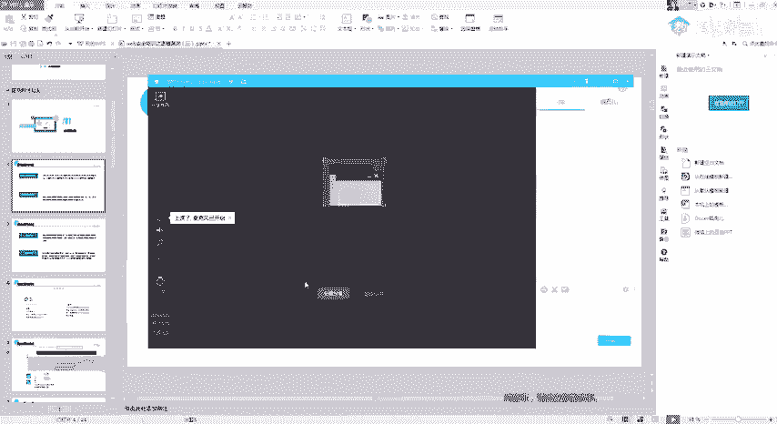

嗯。😊，🎼，🎼，🎼。🎼，🎼，🎼。

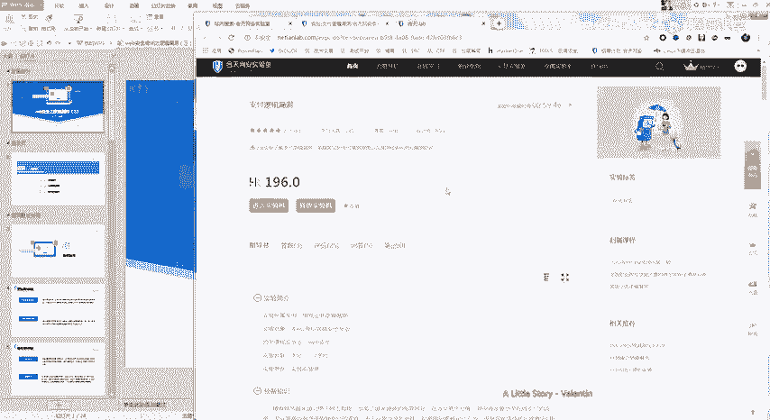

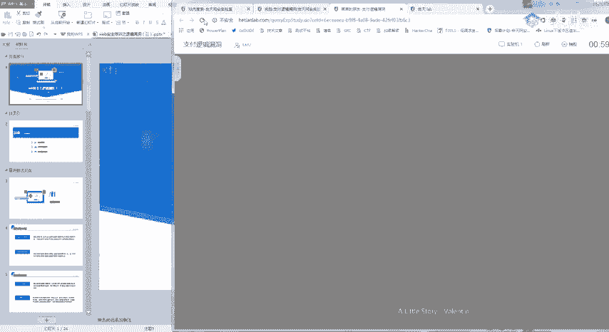

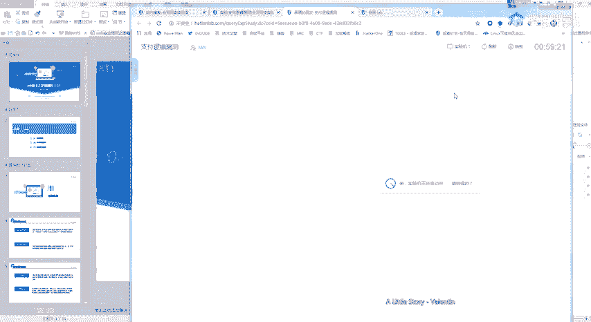

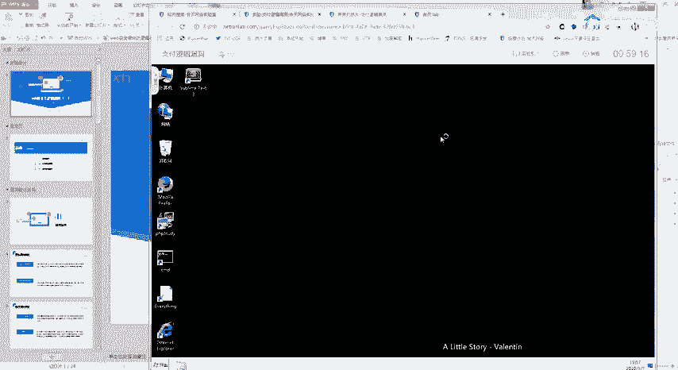

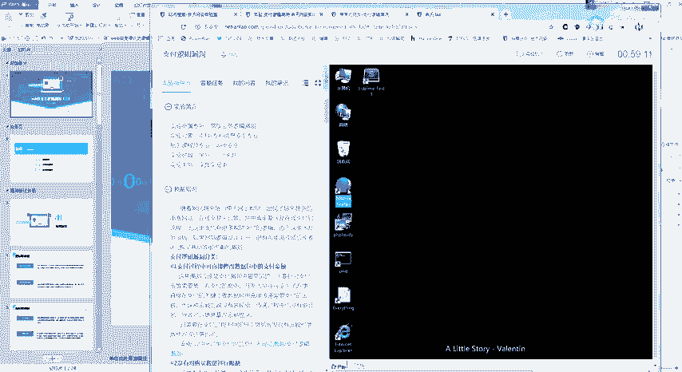

🎼，🎼，🎼The。🎼，🎼，嗯。You know。流包很严重嘛。好，开始今天的一个课程，逻辑漏洞的第三部分。模具漏洞的话，大家应该学了前面两部分，应该可以知道。是一类比较简单的一个漏洞啊。

今天呢要给大家讲的就是一个逻辑漏洞的一些比较常见的一些漏洞吧。比如说一个月权。还有个支付宝记漏洞，还有一个条件提升，这三类呢，我觉得应该是在。SRC中出现的是比较多的三类，前面两类出现的比较多。

第三类的话有时候有时没有。今天的话主要是要教你们怎么去寻找这个逻辑漏洞。然后。叫什么呃。反正。这种漏洞特别好挖呀。首先来看一下今天讲的第一个漏洞是一个月拳漏洞。他越旋动动呢又叫横向。啊。

又分为一个横向的一个月权，跟一个纵向的一个月圈。其实您简单的理解就是一个正常用户A可以操作另外一个用户B才能做的事情。大家能理解什么意思吧？就是。啊，我举个简单例子，比如说我用户A。啊。

我用户A只能修改我自己的信息，对不对？用户A。然后我用户。但是呢。嗯，但是呢呃比如说我抓个包。拉一个简单的一个例子。我抓一个包。没。嗯。

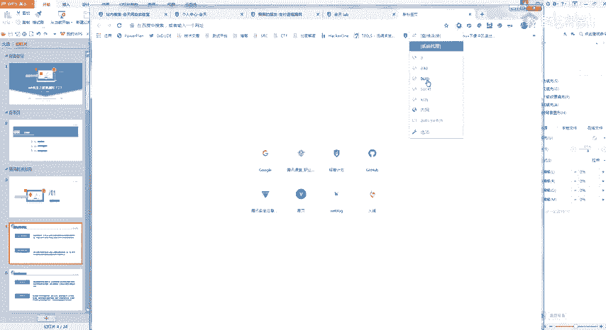

嗯。随便。哎为我BP没有开。

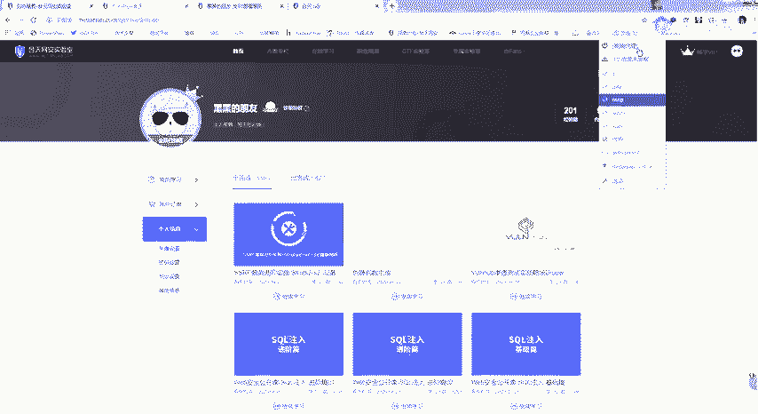

啊，就这样举例吧啊，你比如说我在修改一个用户A的时候。对吧我修改用户A的信息。那他是根据什么东西来判断我这个当前用户是用户A呢？那他有没有可能。第一个是根据cookie，就是你当前登录的。

cookie来判断对吧？第二个它有可能会有一些比如说一个user呀。user等于多少呀？user IDDuser IDD等于多少？对不对？如果用cookie来判断的。

只用cookie判断是不是就是存在1个CFIF。但是如果是第二种，他通过这种usC IDD来判断它如果没有他如果没有做好一个限制的话，我是不是这个UC IDD是可以任意的进行一个修改的。

包括查看个人的信息也是。虽然这就是一个简单的一个月圈漏洞。我用户A可以操作另外一个用户B才能做的一个事情。然后呢，它还有一个叫纵向月权，横向月权跟纵向月权的一个区别就是。

比如说横向月权就是我用户A可以操作用户B，就是正常用户啊两个相同等级之间的人。这要一个。横向纵向呢就是纵视上跟下嘛，就是我一个普通用户可以操作管理员的一个用户。然后我们看一下漏洞它产生的一个原因。

其实也都很简单，就是因为。呃，对客户的对客户端的一个请求数据过分的相信而遗漏了一个权限的一个判断。这里呢我们从实例里面看就很简单了。这里是平行月圈跟这一个垂直月圈。大家可以看一下一个重点。

就是在观察请求参数的时候。记住。灭开漏洞没有其他技巧，就是修改里面就是修改参数里面的一个值。我应应该说月权这个漏洞是所有FRC。包括所有的网站里面。除了入口令之外，出现的是最多的一个情况，漏洞越权。

一定要记住，虐拳真的是出现的最多的。锤逐越权的话，这里也不详细讲了。你简单的就是认为我一个普通的用户。一个普通用户可以操作管理员才能做的一个事情。这里呢主要是要教你们一个漏洞的一个利用跟一个寻找吧。

其实我觉得逻辑漏洞啊。最重要的是这一点，思路一定要清晰，你要明白每个参数的一个作用。然后，他这一个漏洞呢也特别特别简单吧，就是抓包改ID。

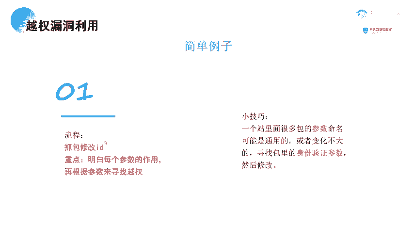

呃，这里本来有一个简单的一个考核的，是这个think shop的一个简单漏洞。

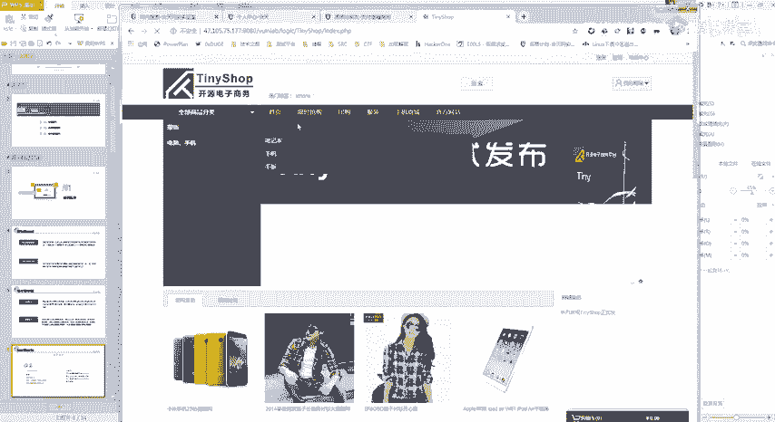

这里呢就会存在一个越权的一啊存在一个越权的一个漏洞给大家看一下。

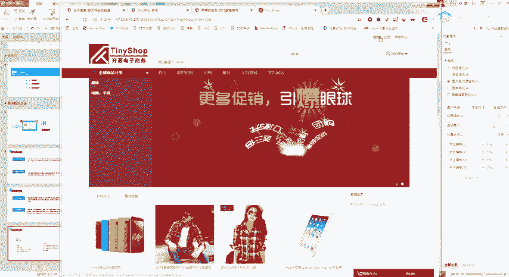

首先我随便注册一个账号，好吧。啊。这里呢我随便注册一个账号。然后呢，这里会有个用户中心。这里啊大家思考一下大家思考一下。啊，它这个地方有可能出现月旋漏洞的是哪一个点？最有可能出现的。是哪些点？

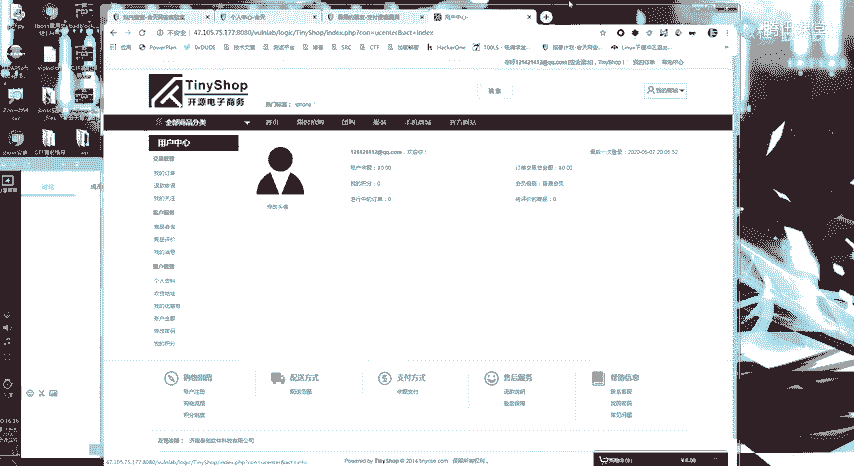

然后你们把自己思考的。写在个上面。呃，CSF也可以个人资料。对一个。然后呢。地址。嗯。密码。密码的话就不叫越权了。因为密码你看这里有一个旧密码的新密码。正常来说也是呃这里我告诉你们一个思路啊，就是。咩。

😊，如果你遇到的是1个SRC的每一个功能，你都给我去看。啊，它这个地方呢是一个地址的位置，有一个月圈的一个功能。然后大家要记住啊，在漏洞挖掘的时候，这种查看别人地址的一查看别人地址这种敏感信息的。

涉及敏感信息的越权特别值钱。它的一个危害跟一个射手猪的危害是差不多的，因为都是要数据嘛。

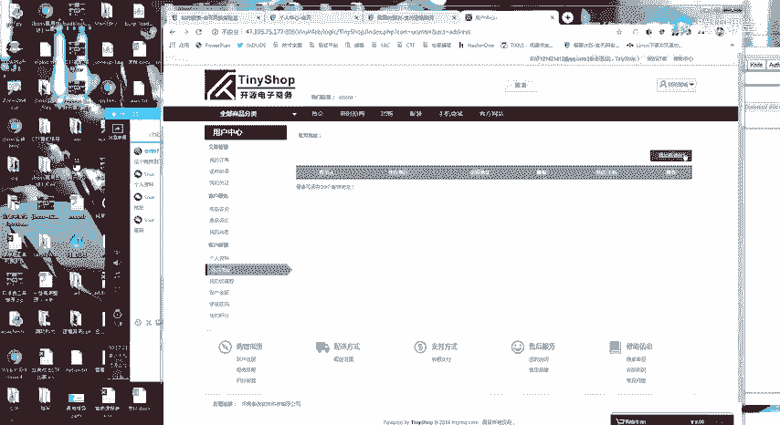

这里直接给大家进行一个演示。啊，你比如说我智态。

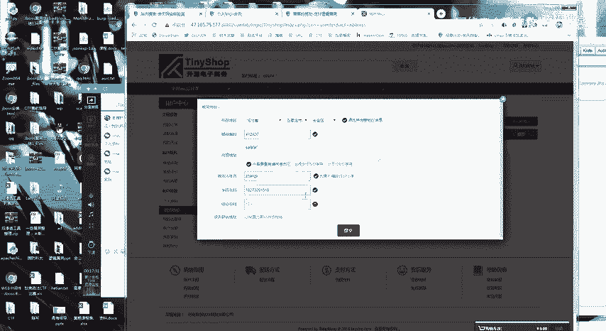

正常情况下来说呃，我这里是添加了一个数据包，对不对？就是。刚刚可能点了两下呀。

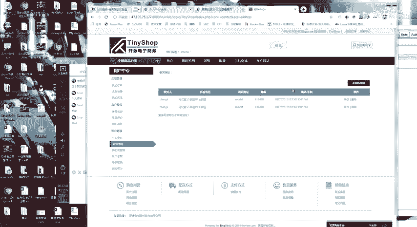

添加了一个。地址，然后我们点击一下修改。可以看到这个地方。这里呢有一个。地址的一个位置，你看这是地址的一个值。对吧。这个就是一个壁址的一个请求，一每个人的一个地址。我点击修改的时候会弹出来码。

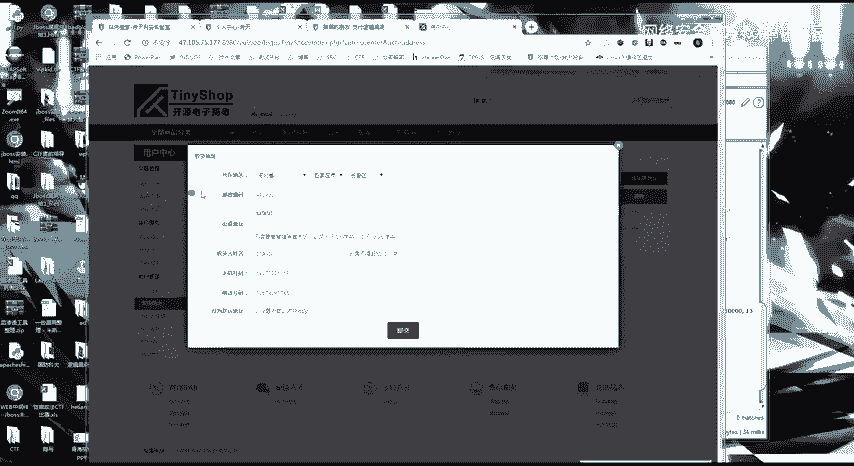

然后呢，你可以看到这个请求这里。乐行动就这么简单，这里1个ID是9，对吧？那我把它ID随便改一下。比如说我改个一改个2，你可以看到这改个一。唉，他发生了一个变化，再改一下，改个2。又发生了一个变化。

这里呢就是一个简单的一个月拳。是不是很简单，我改ID就可以了，抓不改吧。뭐。一定要记住一个思路啊，就是所有的漏洞啊，不是所有的功能点都有可能出现越权。所有的功能点。所以它的一个简单的一个流程就是抓包。

然后修改里面的一个参数。然后呢，这里呢我还同样的用网现实举个例子，其实昨天跟你们讲了。啊，我们首先来看一下啊。和天晚安实验室。它这里的一个添加实验。它这里是不是有1个EC，就是我们没有添加实验的时候。

它是1个EC等于ECID什么什么东西。这里的一个参数。然后呢，再来看一下添加完之后。它变成了1个C一等于多少多少多少。那他你想一下，那他和天网安选驶是不是就是通过这个CE来判断你到底有没有购买这个实验。

对不对？那这个C就是对应到每一个人。啊，我这个人。因为每个人的C是不一样的。你可以看到。从这个评论里面就可以看到这个CID每个人的CID是不一样的。也就是说每个人的1个CID。就是对应的这个实验。

那你想一下，我们利用这个CID可以进行一个什么样的一个阅权。就是从这个功能点来进行一个判断。Are you。因为逻辑漏洞的话是要非常熟悉业务的。啊，首先我这里给你们列了一个例子呢，就是我自己的一个思路。

你们可以看一下。和天晚安实验室，它的一个。功能就是。创建啊它的一个功能就是一个创建实验嘛，对吧？创建实验，然后销毁实验。创建试验机，然后销毁试验机。然后评论啊、答题呀、问答呀。是几种。

还有一个指导书呀这种。所以我们的思路就一定要清晰啊，就是。我一个月权漏洞，它的一个影响是什么呢？它都是根据业务来的，你这个业务可以做什么，我就有可能可以做什么。他是关于业务的。

所有的逻辑内都是关于业务的呀。就是你玩逻辑的中候，一定要熟悉业务，就是知道我这个东西可以干嘛。呃，然后其实偷偷跟你们说，就是我以前的话。这里面的6个漏这里面的6个逻辑漏洞。

我在晚上实验室基本上是挖了一半的。当然后面都修复了呀。以前以前的话都是可以啊白嫖时间了什么东西的。然后再看一下几个案例，月行动洞的一个案例。你可以看到它这里呢就是登录下单，然后抓这个订单的一个包。

就是订单里面有一个adID就是对应的一个地址，然后修改这个ID，它就可以阅选。就特别简单。然后实操的话，这是一个课后作业啊，就是完实验是的一个全新绕骨漏洞。是不是逻辑漏洞就很简单。白嫖是最终目的。看。

具体怎么白嫖的，还是不能跟你们说。然后再来看第二个呀。越权月权真的就很简单，抓包改包支付额辑这种也是一样的。首先看一下啊，支付逻辑，它的一个原因就是这一段都是白扯呀，这段就不看了。他的一个原因就是。啊。

在对这个金额。叫什么去了？呃，他这里面呢。简单来说就是它后端没有对这个请求包进行一个验证，就是它请求包里面的参数是不是正确的。所以呢这个漏洞也特别特别简单了，就是抓包改包。然后我给大家举一个例子啊。

就是你们在买东西的时候，这几个东西肯定是要的对吧？一个购买的一个数量，一个购买的一个价格，一个购买的一个商品，商品是对应的ID嘛，对吧？然后还有一个支付的状态，就是你有没有付钱支付成功或者支付失败。

然后优惠券。对不对？然后这里呢有一个最特殊的就是测试数据包。待会呢可以给大家一的进行一个解释。呃，首先我们开始来看了。他这一个修改购买数量是怎么回事啊？就是我们在买的时候，你是不是只能一件或者多件。

对不对？一件两件或者三件4件这种。但是你有没有想过我这一个一件，我是不是可以改为-1？改为负一。这里呢呃用网实验室的一个漏洞给你们给你们来看一下。

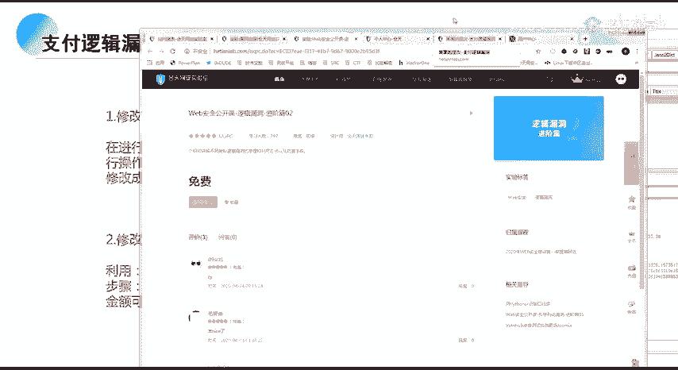

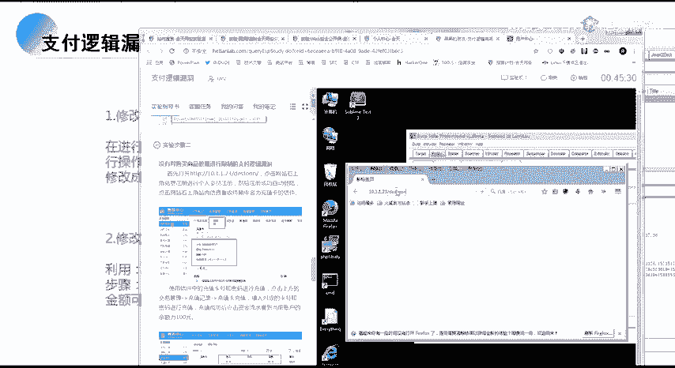

No。啊，首先我看一下这个啊。他这里是进行一个简单的一个注册先。冇麻烦。会员名。可动不美。The。A。他这里为什么不能选呢？看一下啊。好。成功了啊，我们看一下，它这里是叫什么？它这里是一个。

充钱的一个操作呀，它在这个位置。他这个好麻烦啊，我觉得。充值卡。然后卡密是多少去了？可以看一下，它这里呢就是在这个团购的一个位置啊。因为点进来之后有一些，比如说呃什么。团购呀咋的。随便点一下。

随便点一个吧。然后呢，这里有一个购买。然后我们想一下一个正常的一个购买流程。购买流程嗯，我这里呢给他抓个包。

你想一下一个物品，它的一个购买对应的几个参数。第一个是不是价格，第二个是不是凭这个购买的一个数量？对不对？这是。这个是叫什么去了？叫最基础的两个参数吧。看一下它这有一个价格，一个数量。

这里比如说我随便输个，我在这里输个负一。喂。点击一下提交。然后我们看一下这里面啊。我这里的一个负一呢，它是没有起作用的，这里数量还是一。但是我们的数据包里面，你可以看到这也是我们的一个数据包。

这也是我的一个电话，然后这里有它的一个数量。我把这个数量改为负1。再看一下。请填一写手机号码。尴尬。这里改为一个负一。然后我们看我们去看一下我们的一个订单。这里呢我改为了一个负一，你可以看。

数量零已付款。然后我们看一下资金流水。刚刚我们的负一变成了100，就是本来是66嘛，然后我点成-一，那我就变成了一个加钱。66乘-1等于呃相当于是多66块嘛。对，大部分都很简单，主要还是要熟悉业务。

所以说。逻辑漏洞都是。

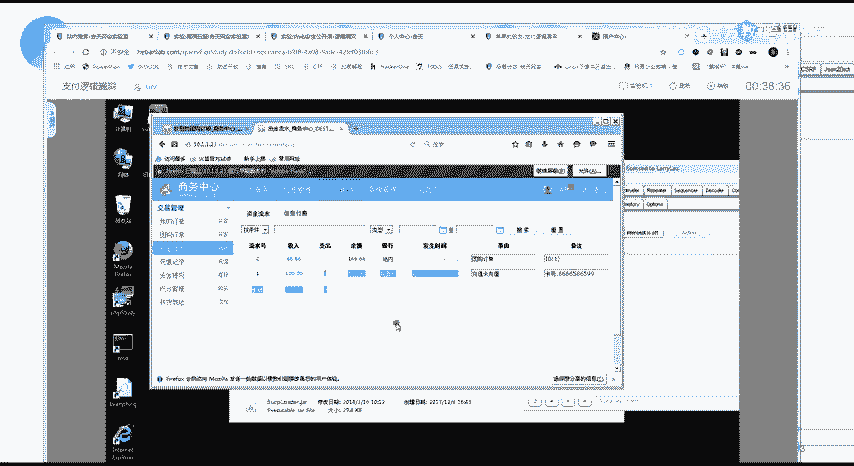

叫什么贵抓包改包，你就能挖。但是重要的是，你要有这个思路，就是我知道哪个地方我要去抓包改包，我要改什么东西。这也就是一个修改数量。然后第二个就是进行一个修改价格。修改价格也很简单啊。

就是刚刚我的一个抓包，我刚刚抓个包，因为里面会有一个价格嘛。对吧。然后这里也也有一个例子。

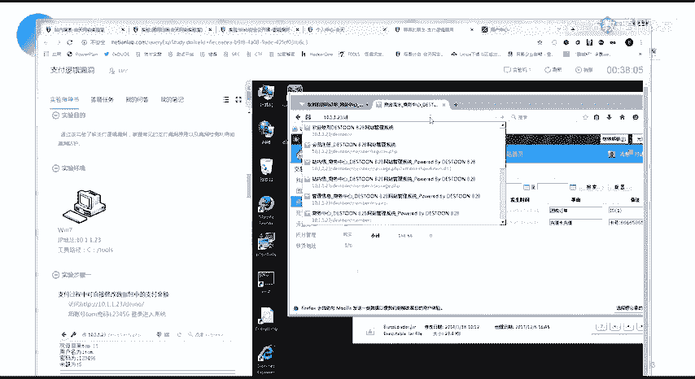

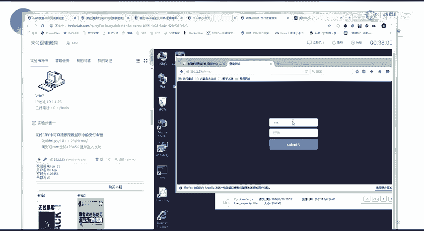

这里有一个简单的一个例子，这里你可以看我这里有5块钱，然后呢，我这里买一本书是10块钱一本。同样的，我就自己抓个包。我这里买的时候。我们一个包里面的一个参数，这里是一个。10块这里一个数量，好吧。

那我就改为1个0。01。然后再看一下。就是我把刚刚的这个价格改为1个0。01。可以看到。

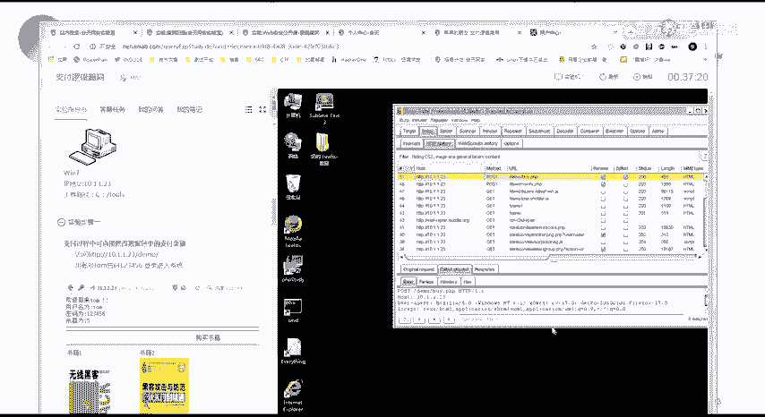

本来是10块，我把它这个价格改一下。然后你看购买成功。然后就用一分钱买了一个数据。另外跟你们说啊，这种东西是很常见的呀。

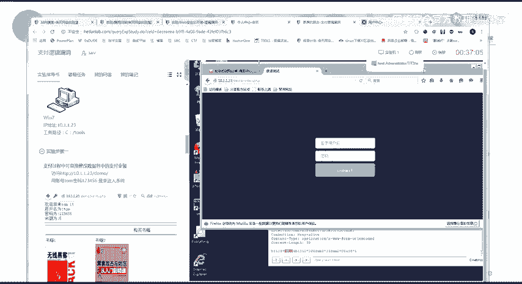

说个比较搞笑的事情，以前用过一分钱买了几十吨钢材。当然他后面没发货啊，后面没发货。😊，哈。然后你要记住啊，除了我们刚刚的一个订购确认信息，就是我们刚刚的一个确认订单。这三个步骤，你每一个订购。

然后确认订单，然后付款。这每个步骤中它都可以尝试进行一个修改。What。所以逻辑漏洞还是一个业务方面的一个问题。你们可以看一些比较正常的一个1块钱买宝马呀。然后1块钱买无人机呀，大家。

给大家说个更有意思的一个事情啊，就是以前乌云好像有用5块钱买了一辆特拉斯特斯拉的，然后好像那边还发货了，就是为了表示感谢，然后还把那个特拉斯给送给他了。😊，就几块钱买的。然后一个修改ID。修改ID的话。

就是比如说你在选订单的时候嘛，它会有1个ID，然后对应的多少钱。呃，然后呢我自己呢我我选择一个价格少的，就是比如说我这个价格它有验证码，价格是1块钱的一个个东西。然后我把它的ID改一下。然后就改了。

Yeah。修改订单状态也是基本上都是一样的呀。就是你支付没有支付的状态跟实际支付的状态。是不太一样的。就是我昨天说的类似修改返回包。我先抓一个修啊支付成功的一个返回包。然后呢。

我就把这个支付成功的这个返回包的东西丢到那个未没支付成功的那个上面去。嗯。然后另外呢要注意一点，这个东西啊就是。

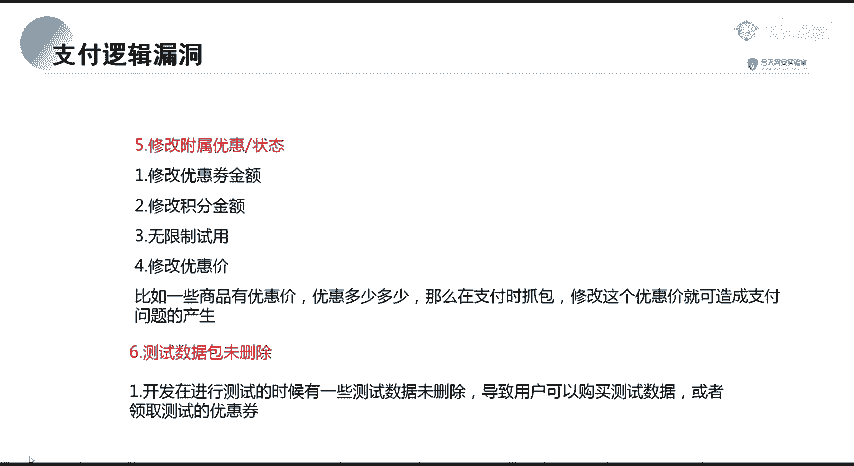

优惠券。优惠券的话应该是逻辑漏洞里面出现问题最多的地方了。优惠券。优惠券。因为他比如说这个优惠券，它可能固定了一个金额。然后固定的一个数量，优惠券上面就是我可以，比如说我只是5块钱，然后我修改成99。

改成100。他可能都没有验证。然后给大家说个比较意思的，就是手机上手机上那一种领取优惠的呀。啊，你比如说某些游戏里面呢嗯腾讯的。腾讯的那个。王者某耀不就会有一些优惠券嘛。然后以前的话是刷那个包。

然后修改优惠券的一个数量是可以进行一下，是可以进行一个无限制的刷的。然后这个积分金额也是一样的。然后还有一个无限制的使用。就是我优惠券会对应一个状态码。这是可能会有一个。别个码吧，对应的一个码。

就比如说我的腾讯腾讯个档案好吧。

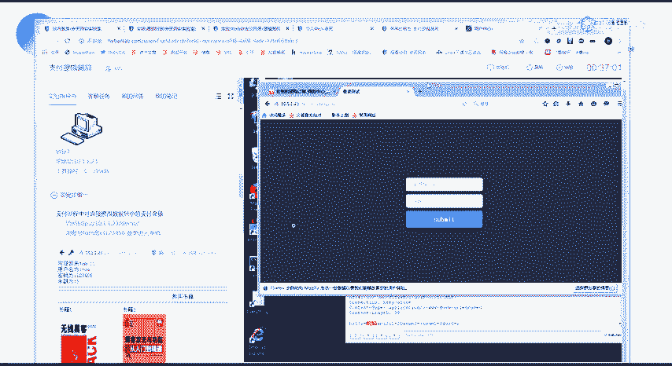

我腾讯课堂。

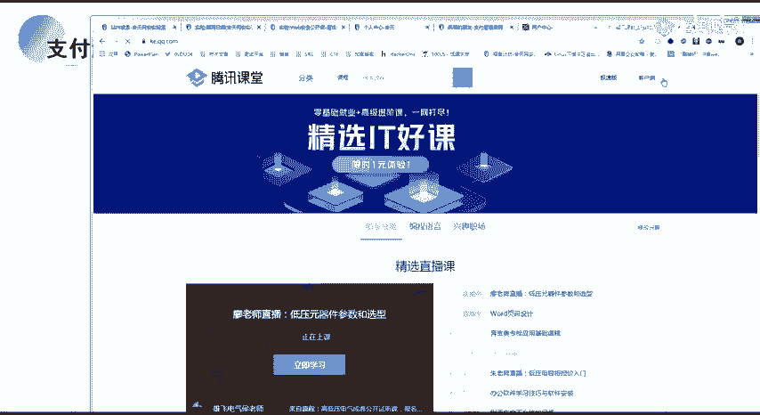

我腾讯课堂的一个优惠券。唉，我没兑优惠券。那我去发一个优惠券啊，我发一个优惠券。

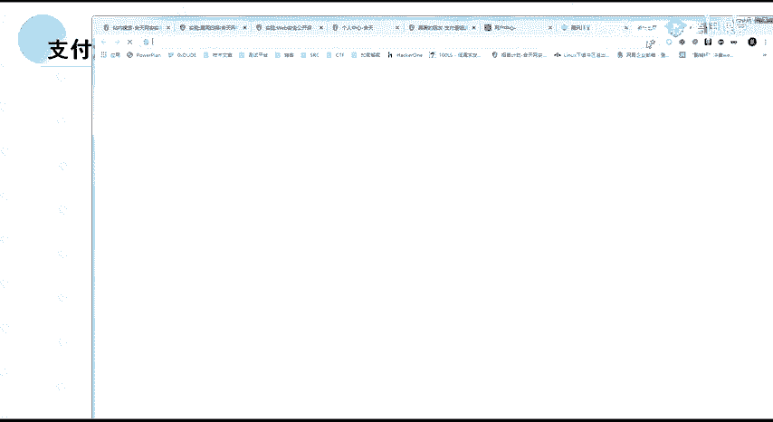

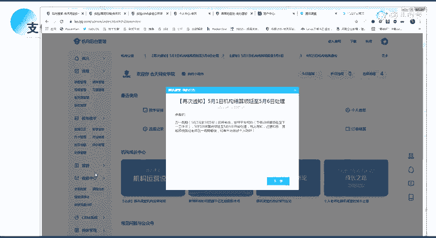

其实偷偷告诉你们，腾讯课堂的话，我是之前挖了很多很多很多漏洞的。啊，比如说我随便选择一门课程，然后1块钱一张。私密发布吧。可以看一下他这张优惠券呢。它是有一个对应的1个ID的，在这个位置。

就是我领取的时候，我会有1个ID。然后呢，我去付款的时候，我还会验证这个ID。但是呢我这个ID它可以无限制使用。大家懂什么意思吧？就是我买了一次之后，这个ID还没有生效，还没有失效，可以无限智能使用。

这就是一个优惠券的一个位置。大家都是为什么支付逻辑的这种就是为了一个字。对，两个字，白嫖。对吧。所以这些位置都是都是很有可能的呀。然后第六个叫测试数据包未删除，是叫什么意思呢？给大家举个例子啊。

就是我遇到过的。呃，我当当时是一个这样的一个情况，我们在购买商品，对不对？还是同样的，就类类似于我这个腾讯课堂。比如说我买课。

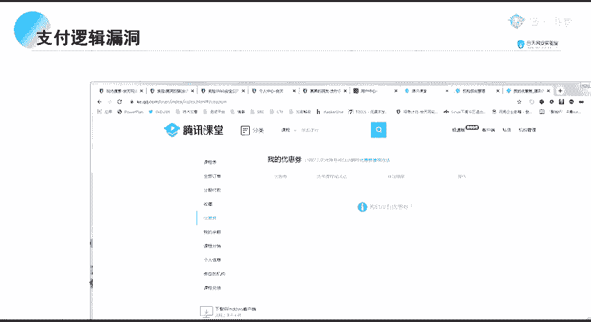

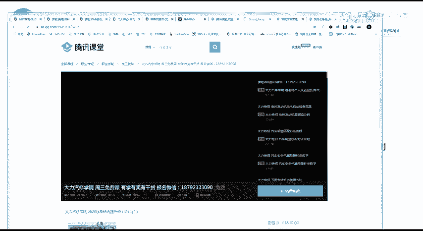

对吧。我买车这里的话就会有一个早月户型了。我这里要买课。看一下。领券后购买。不领了，我是缺这100块钱的人吗？反正我也不买。哎。我们看一下这里它这里呢一个报名付款。

它是不是会有一个对应的这个user的1个ID就是这个课程的1个ID你可以看。465686465686。那你想一下这个ID它有没有可能开发在测试的时候，它这里会有一些测试的一些课程呢？或者商城里面。

比如说有些特色的课程啊，比如说一毛钱一毛钱买什么苹果手机呀什么东西的一堆。那我是不是可以去。就是这个创建订单的这个包。嗯，原告创建。刚刚那个包丢哪里去了？再抓一个嘛。就是我们刚刚的这一个包。对吧。

这个ID我是不是。就可以放到这个BP里面对它进行一个便利。就是进行个爆破。看能不能找到一些测试的一个数据包。我记得当时我挖VIPK的话，是挖到了很多那种白嫖的包呀。就是0元0元送什么0元送什么。

0元送什么一堆，因为0元的话，它会自动的一个成交，根本就不需要付钱，或者有些很少的钱买很价格很高的一些东西啊。这就是一个测试数据包位删除。其他的话比如说呃一个什么修改支付接口呀，当然这种很少很少见啊。

现在的支付接口基本都是支付宝微信了，然后那两个东西是的话就基本上不要想了。我觉得最多的呢还是用的这个。重复支付，还有一个。最大额的一个就是你当输入你的这个支付啊，之付的价格达到一个最大的一个数量的时候。

它可能会存在一个溢出，直接变为0。另外一个条件竞争的一个漏洞，其实也是我待会要讲的就是。条件竞争嗯。下一个就是讲了他。全讯竞争啊，几分钟之后再跟你讲，刚好也在这里了。然后呢，这里呢是一个案例。

这叫大米CMS的一个支付宝漏洞。也是。也是给你们做了一个靶场啊。就是还是这个。

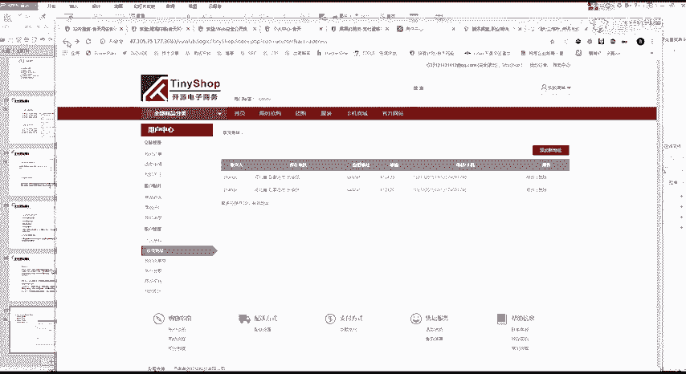

还是这个之前发给你们的一个靶卡，这里有一个大米CMS。

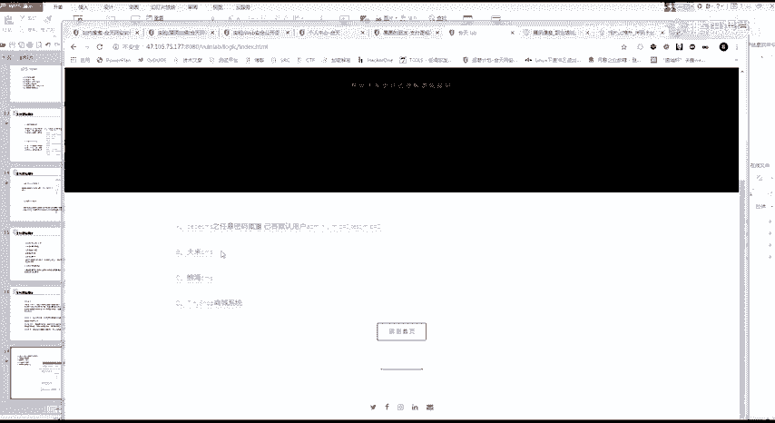

我们看一下它的一个简单的一个过程。他自己呢就是注册一个账号码，然后购买产品。然后在这个位置呢，就是支付的时候就进行了一个抓包。随便点击一个产品，然后支付的时候装包。然后。他就得到了一个这样的一个宝马。

基本上你正常来说啊，就是我不需要了解他的逻辑，我都可能可以猜得到呀。我这个ID肯定就是我这个产品的一个数量，对吧？然后我这里呢就是在它的价格6000，这里呢就是产品的数量。

那他这个漏洞呢就是在这个位置修改它这个产品的一个数量，把一改为-一。然后就会发现莫名其妙就赚了6000块。很有很多很多这样的案例啊。很多很多，你们随便往上一搜都有。

另外想做的还是之前给你们做预习的一个支付逻辑漏洞。能不能白嫖，就看你们能不能挖得到了。好，然后来到今天的最后一个知识点，叫条件竞争漏洞。前面的一个逻辑漏洞啊，一个支付逻辑的话叠加。

叠迦也有叠迦也有可能就是。之前说了嘛，我这个ID是可以修改数量的。你比如说我用我价格不能改，对吧？我比如说我1块钱，我1块钱能买999件1万件。也就是刚刚的这个修改数量嘛。一样的。

我只是在那里改为了一个负一而已，你可以尝试修改更多的。然后开始今天的一个调经竞争漏洞，因为都我觉得逻辑漏洞都特别特别简单了，你们。你们需要的是思路，知道吧？需要的是思路，而不是死金背。

就是我我可能啊我这个地方可能会出现一个漏洞，就是你知道哪个位置可能会出现漏洞。实际场景的话还是得自己去抓包，然后看。讲一下条件这种漏洞。

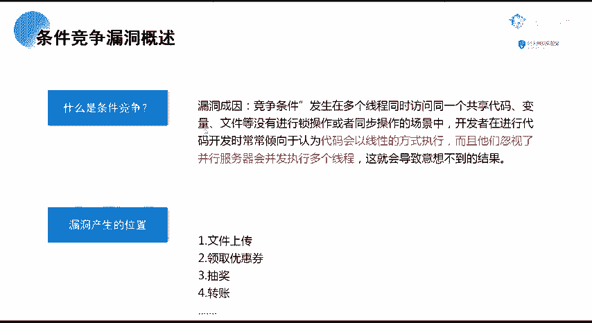

什么是条件竞行漏洞啊？他就是在多个线程同时访问同一个共享代码的时候。它这个变量文件没有进行锁操作。呃，简单的理解呢就是它有这么一串了，你简单的理解就是。我同时发送多个请求包。嗯。

就是我同时发送多个请求包。

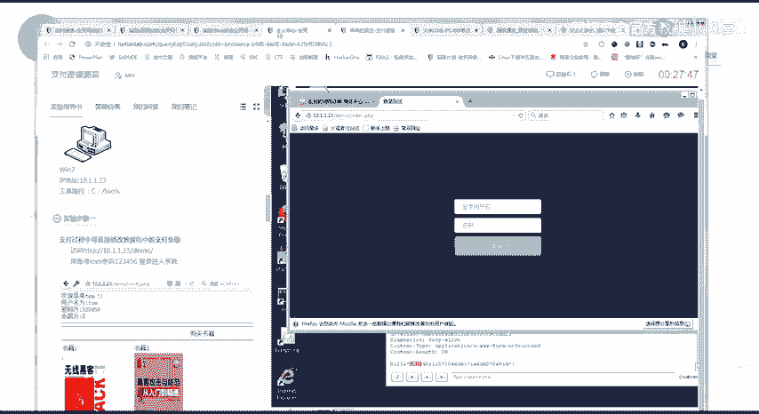

给你们做一下简单的演示。啊，你比如说我这里一个修改地址的一个信息，对吧？我这里修改地址。哦。改一个一。그래。修改信息。是不是我就发了一个请求包，对吧？我修改了一个信息，发了一个请求包。

但是呢BP有个爆破模块，大家知道吧？是可以进行一个多线程的一个发布BP的爆破模块。那我呢我比如说我这里我随便选一个啊无关紧要的一个数值。然后在这个地方随便改一个1到999改为一。然后我开始包破。

是不是他可能同时会发送好几个包？就是我你看999个宝。多久啊，一分钟不到放完了。就是有可能存在这样的情况啊。我同时发送多个请求包。然后呢，它这一个代码呢就会有一个意想不到的一个结果。

就例如一个我首先一个领取优惠券。然后抽奖。这两个人应该是出现的最多的呀，领取优惠券，然后抽奖。你想一下，原来我的点击一次是只领取一个优惠券。但是如果我同时发送100个包呢。

它有没有可能100个包里面可以乘它四五个五六个。那我是不是就有血赚？不。同样的给你们讲个简单的案例的话，就是不知你们玩不玩了，那个叫什么和平精英吧，司机手机手手游的司机里面就会有经常一些什么领金币啊。

那什么东西。那你呢以前也是出过一个条件竞增的洞的，就是我同时同时点击这个领取，可以同时领很多金币。但是现在还有没有我就不知道了。然后抽奖也是同样的道理。我本来只有一次机会，但是我同时发送有可能有很多次。

转账同样的都是一样的。

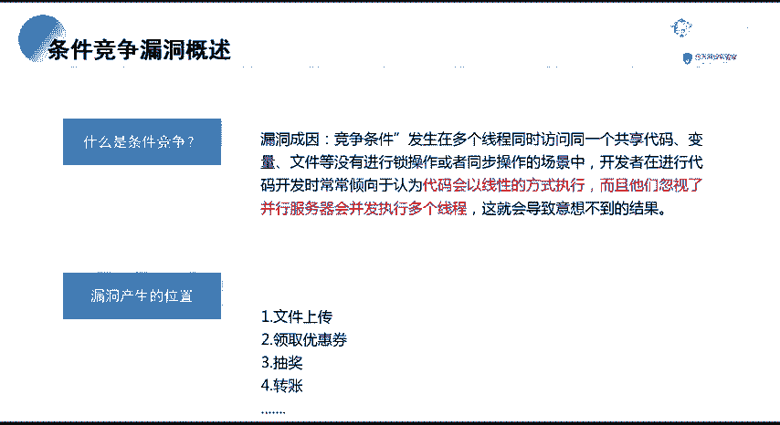

然后这个条件竞争的一个文件上传了。

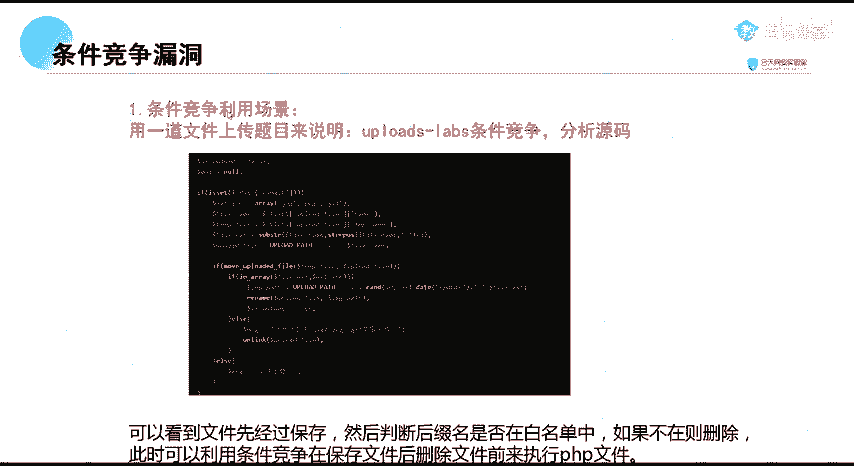

这里的一个文件上传的一个场景的话是特别特别。叫什么呢？特别特别难遇到的一个场景啊。因为与其他的东西不太一样，所以特别列出来呃讲一下。

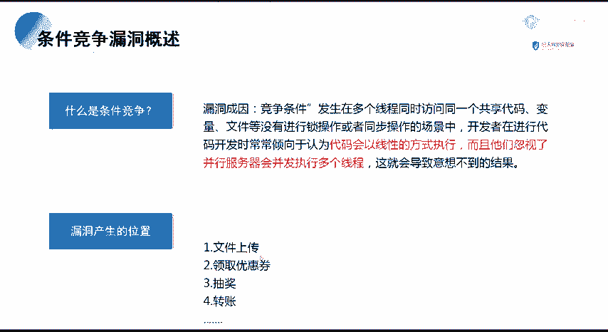

它这里的一个源码呢，就是你减它的一个源码呢就是。おこら？我上传一个文件，大家知道吧？我传一个文件，把它传到服务器上面。然后呢，他后面就写判断。我这个服务器的一个后缀。服气的个后缀。

是不是这个只有GBG或者PNGGIF这个类型的？如果不是，我就把这个文件删除掉。你先理一下逻辑啊，就是我先传到服务器上，然后我这个程序再判断。我这个文件的后缀是不是这样的？如果不如果不是。

我就把它删除掉。那它中间是不是就会有一个空档期，有一个空余的一个时间，就是我传上去留在服务器，然后我文件还要再进行判断一次。那我这个判断的时候是不是就是一个。空的一个时间。你们在讲文件上传的时候。

应该是讲过这个例子的。他这个所以他这个条件竞中的。利用就是我利用这个空档的乐器，我无限制的一个发包，就是我一直发一个相同的一个文件名，它总有三不及的一个情况下。这是他可能删的没那么快。

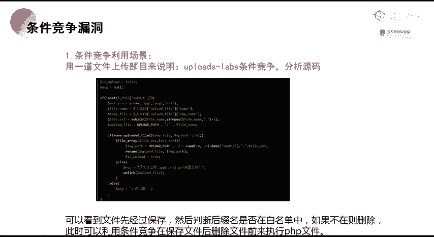

可以看一下这里的一个案例。就是我不动的发这个上传的文件的一个包，然后我再不断的访问这个文件。他就总有一两个可以访问得到。当然我觉得没什么讲的呀。给你们看一个我在乌云找的一个案例。

这也是一个领红包的一个案例。新人免费领一次红包，然后抓。他用这个FD呢FD的话也是抓包的一个工具啊，看你们个人我是比较喜欢用BP，所以跟你们讲的是BP。他就抓自一个免费领红包的一个包。

然后同时发出去就可以领很很多红包。跟领优惠券是一样的一个道理啊，可以看到本来只有20块钱。然后就领了25个红包，再能做一个的。所以呢就很简单，抓个包，然后不限发就可以了。今天的话三个知识点的话就讲完了。

就这么快。企业有些不是新呃，有些不是新疆文件。对，所以我说了嘛，这一个场景是可遇不可求。但是呢你要知道呀，总有一些程序员的老回路比较。比较奇葩。你们应该也遇到过吧。你要你要想一下。

当你们学的漏洞里面是不是特别是逻辑漏洞这一块，总有一些比较奇葩的。比如说他的验证码在前台就回显了，对不对？我。现在的一个基本上文件上传判断都是啊先判断的，你这个基本上低于白名单了吧。白名单当然也有呀。

大家一定要记住啊，漏洞的话。漏洞的话都是因为程序员不专业写的呀。那你们再来回想一下我今天讲的一个。第一个就是一个月拳。再来回顾一下简单的。一个月权。越权就是让你们抓包，然后明白每个参数的作用。

然后就去改这个参数里面的值。어。然后。再回到一个逻辑内容，支付逻辑也是同样的，就是我们在支付的时候给他抓一个包，然后修改它这个相关的一个支付的一个参数。相关的一个支付的一个参数。简单来说就抓包改吧。

抓包改吧。条件竞争就是把一个操作只有只能有一次性操作的一个东西。同时给他发很多次，就是叫条件竞争。那今天有没有什么要问的？应该还比较简单吧。

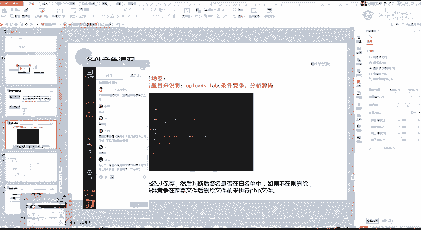

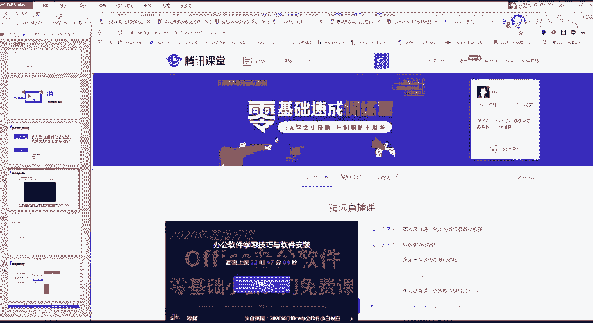

喂。呃，如果没有什么要问的那基本上我就。下课了，然后我会发一点点案例给你们。琼海CMS百度没有看到。啊，这个的话。

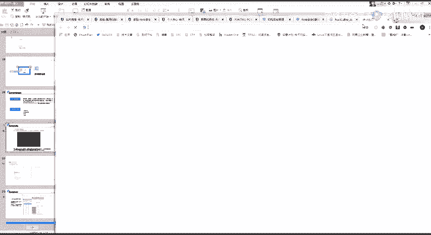

这个的话明天的话我会给你们一一的讲这3个CMS的一个操作。

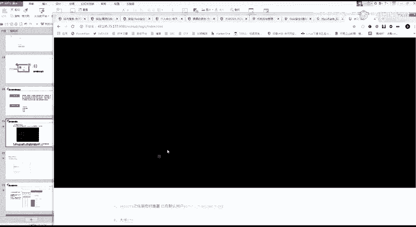

然后还会讲一点点逻辑论的一个案例就是。

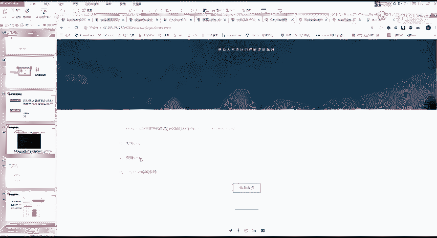

因为实操嘛，就那么简单。这几个就相当于是你们的一个课后作业的一个考核。熊海CMS的话呃叫什么呢？我觉得学安全里面很重要的一个点就是。会搜索功能吧，我举个简单的例子啊。

你比如说我这个熊海CMS漏洞我吃不到，对不对？那我搜一个逻辑漏洞。然后你可以看到。这里是不是有个后台登录绕过的一个漏洞？这不就出来了吗？这里面。然后比如说还有这些注入呀，什么一大堆漏洞吧，一大堆。

然后呃后台登录，如果他这个你看不了，那我再搜一下呗，看有没有。类似的。你看。这里有漏洞复线，大家一定要记住啊，搜索搜索的话是一个叫什么，也是一个你们的一个能力吧，不管是学什么。

爆破出来的后台账号密码也可以啊。账号密码我都不知道是怎么设的。另外另外那个同事设的注入出来了也可以。它这里的话是有一个后台登录的一个绕过漏洞。嗯。所以你们自己是不是就觉得有思路啊，就是。我遇到一个网站。

就是你们你们我这个是不是根本就没有跟你们讲过。我一个具体的个漏洞是什么？你们就当它是一个网站进行一个渗透就可以了呀。你们就是现实里面的一个渗透就是这样的，我就给你一个网站，然后你自己去看我应该怎么做。

然后你们呃其实可以自己去找一些小型的一些GMSS什么自己试一下啊。然后还有没有什么其他的一个问题？

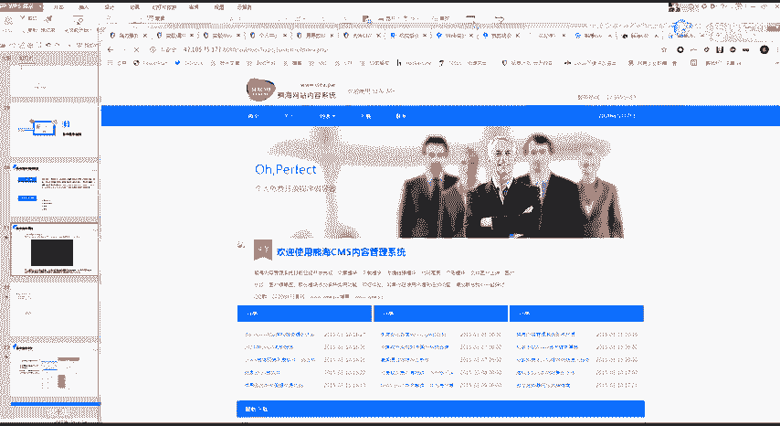

最后一分钟啊，没有人提，我就下课了。뭐래。注入嗯也可以。好。那我今天的一个课程就在这下课了，大家一定要记住，逻辑漏洞真的是最容易最容易挖的。因为这个东西他扫描器扫不出来，你得一直抓不改吧。好了。

你要下了，拜拜。😔。