# B站最全网络安全教程，整整1300集，全程干货无废话，别再盲目自学了，看完学不会我退出网安圈！（web安全｜渗透测试｜内网渗透｜CTF） - P24：22.SSRF简介.mp4 - 网络安全官方教程 - BV15u4y137cQ

不了。🎼你的下来的情。😔，🎼，🎼But I feel like I'm done。🎼Still， no matter where I go。🎼At the end of every road。

🎼有个 to me。😔，🎼You are good to me。🎼I know it's easier to run。🎼After everything I've done。🎼有个甜 me。😔。

🎼You are歌 to me。🎼Yeah。🎼我为歌词。は。🎼的歌词。🎼。🎼你是。🎼已经被得点前。🎼あ。🎼Buthy don't just going there。🎼Now。

 Im pull for my soul。🎼And I'm so scared of growing on。🎼给我歌聪明。🎼有。🎼是你。🎼And I'm so you letting。

🎼But I don't wanna be。🎼个姊美。🎼有。🎼To me。🎼有明的。🎼未来。🎼しか。🎼这个。🎼Now， my teeth is。🎼Yeah。🎼You。🎼月子里。🎼一路。

🎼And now I'm closing every door。🎼Cause I'm sick of one and more。😔，🎼You a歌姊 me。😔，🎼You are good to me。

😔，🎼眼泪。🎼Swear on different than before。🎼I我还 you anymore more。🎼Ca you are good to me。🎼Hello， darkness。

 my old friend。I've come to talk with you again。🎼Because the visions arely creeping。

🎼Lifted sheets where I was sleeping。🎼And the fish。🎼That was plenty。🎼干么对。🎼Still really。

🎼Within the shade。🎼The science。🎼Unless the stream在外的 know。😔，🎼Narrow streets of cobblestone。🎼你撒黑了我飞。

🎼tree。Yeah。🎼The my call。🎼值得可能。🎼When my eyes were stabbed by the。🎼舍得。🎼split the night。

🎼And touch the sun。🎼The science。🎼And。🎼내。🎼10000 people， maybe more。🎼People talking with。

Sp people hearing without。🎼Pleasely。🎼People不 writing so。

🎼The在。🎼我谁是谁？Yeah。🎼No one day disturb the sad。🎼Oh silence。🎼F said I， You do not know。

Sounds like a cancer grows。🎼In my words that I know。🎼爱记 you。🎼Take my arms and I。🎼已经爸妈我。😔，🎼like shine。

🎼Jobs。Yeah。🎼原爱口真能话。😔，🎼Of science。🎼比不把人飞。😔，To the neon God like made。And the sign flashed out， it's w。

🎼In the words that it was for me and the science said the words of the prophets already。🎼那社会我。

🎼天ina明后。🎼And whisperhied in the sun。🎼Of silence。Oh。🎼有什么。🎼见证是探。🎼出去。🎼我不。🎼彼此说好了。🎼就横只开。🎼即将和神的。😊，🎼我不自。

🎼你说来锋最处抱拳，未必在。😊，🎼痛我的爱情，草明来过谁与你。😊，🎼太知己，更是会是你清下。😊，🎼禁止于。🎼会有呼吸，你道你做些序去。😊，🎼You go hands make my money。

🎼给我一点充满的自信。🎼至少现实迎来。🎼来把你 say。🎼的心里。大家晚上好。🤧嗯。大家能听得到我的声音吗？能听清楚我声音的在公屏上面扣个一吧。Yeah。嗯。Yeah。声音的话应该也清楚吧。嗯，好的。

那么呃。我们正式开始我们今天的一个课程内容。我们今天的话主要讲的一个课程内容的话是这一个服务端的一个请求伪造，也就是这1个SSRF。他的一个呃是这样的一个英文的一个呃景仅写缩写。

有s side request。walky就是服务端的。一个请求的伪造。这样子的一个攻击。啊，首先的话我们先来了解一下它的一个漏洞，它是什么样子的一个漏洞，它有什么作用。首先我们先来看一下。

先来了解一下什么是SSF，也就是这一个服务端的一个请求伪造。就大家其实可能看到这1个SSF的话，可能会想起来就是前面呃前面老师所讲到的1个CSRF对吧？他们两个的话其实挺像的。🤧K。😊。

这样的话他们呃他们是有本质上的一个区别的。在等会的话会给大家做一个呃。讲解。而这个SSF的话，它是攻击者构造的这种链攻击链接传给服务端执行，然后造成的一个漏洞。一般的话是用来进行一个外网的一个探测。

还有的话是攻击内网的一个服务。那我们来看一下这个图，这个图的话呃比较好的解释了呃，这个SSF它这样子的一个漏洞，它的一个利用，以及它呃它能够做到的一些事情。就说其实这样的一个一句话能够概括这一个漏洞。

它的一个作用，就穿越穿越网络防火墙的一个通行证。就说我们呃应该大家都有了解到，就是说一般的这种呃网站，对吧？或者说呃你一个公司，一个企业的一个网站。它呃你是能够去从外网访问到对吧？

然后的话你能够访问到这个网站，但是你不能访问到这个公司它的一些内网的一些啊东西。因为它是有防火墙。🤧K。啊，我们其实可以看到这个SSF的话就是呃利用。诶。这样子的1个SSF漏洞的话。

我们可以呃通过一些通过服务器。来去访问。或者说去攻击内网的一个服务。🤧嗯。然后为什么他能够做到这样子的一个呃功能呢？🤧K。我们可以来。看一下这一个漏洞，它的一个形成的一个原因。

大多的话它是由于服务端提供了从其他服务器应用获取数据的一个功能。然后的话它没有对目标的一个地址做严格的过滤与限制。所以的话我们来呃理解一下这一个从其他服务器应用获取数据这样子的一个功能。

这功能的话其实呃我们也是经常能够去见到，也也能够去使用到。就说呃。比如说我们的一个服务器。呃。比如说我的呃我们的这样子的一个网站，对吧？我这里的一个网站。我访问我访问之后的话。

我的比如说我这里的这一些图片，对吧？这图片的话在这里的话是放在呃我们的这一个服务器上面嘛。如果说如果说你的这样子的一个图片，它是啊托管在其他的一些服务器上面。啊，他不是跟你的一个网站服务器。

在一个服务器。所以的话他需要通过这种呃链接对吧？通过一个链接的一个方式来去远程的去加载另外一个服务器上面，或者说图片服务器上面的这种资源。

然后的话如果说他没有对呃这里的就说请求这一个图片资源的这一个呃链接。这种目标做一个限制以及过滤的话，就会导致这样子的1个SSF的一个漏洞。我们可以利用呃我们可以利用我这里的这一个网站服务器。

然后的话来去呃攻击利用其他的。呃，去访问其他的一个资源。然后这里的一个呃。这你的一个目标的一个地址的话，我们可以。去使用到内网的一个地址。如果说他呃能够去允许去访问到内网的一些资源的话。好的话。

这样子的一个过滤与限制，就是说它没有对我们的这样子的一个呃请求的这种资源，就是说请求其他服务器的这种资源啊，这样这样子的一个链接，或者说这样子的一个UL做一个呃限制。

它限制的话呃呃在后面的一个漏洞的一个修复，会有讲到，就是说呃比如说我们要限制它不能够去访问到内网的一些IP对吧？因为它它呃，因为它这一个服务器，它去获取到的那些资源的话。

它可能是存在内网的一个服务器上面的。所以说如果你要去获取到内网服务器的一个资源，你需要去通过这样子的一个链接，对吧？通过这样子的1个IP。然后的话你没有对这样子的1个IP做这样子的一个限制。

就是说呃因为你一个内网，你有其他的一些IP嘛，对吧？然后的话我们可以伪造这样子的一个就是伪造这样子的一个请求的一个目标，由我们的这一个就是含有漏洞的这个服务器。

向我们指定的这一个目标发送这样子的一个请求。比如说访问内网的一些IP的一些呃端口以及服务。然后的话最常见的一个例子就是攻击者攻击者它会传入一个这种未经验证的1个UL。

然后的话后端代码它直接去请求这样子的1个UL，然后的话会造成这样子的1个SSF漏洞。🤧嗯。就说呃我们的这里的1个UL的话，是攻击者能够去可控的对吧？然后的话这一个呃UL可控的话。并并没有对他做一些过滤。

以及限制。所以的话我们呃能够去进行一个利用，然后的话会导致这样子的一个漏洞。🤧う。然后的话就是我们来呃区分一下SSR与CSR的一个区别。就说CSF我们其实上呃之前的课程的话讲到了。

就是说它是一个跨张的一个请求伪造，对吧？close side request。Forgery。然后他在这种夸张的一个请求伪造的话，它一个发生的条件是就说当我们用户在比如说一个A网站，对吧？

你登录之后有这样子的一个登录的一个状态。然后的话。攻击者。呃，就是呃发送像这样子的一个用户，发送呃一个恶意的一个网站。这个网站呢就比如说一个2意的一个链接，对吧？然后他访问这样子一跟链接的话。

就访问到了我们的这样子的一个2还有恶E代码的一个网站B。然后这个网站B的话，能够去劫持用户的一个浏览器。然后的话以用户的一个登录的一个状态或者是身份来发送啊，就是不是本人用。

就是不是用户本人操作的一个请求。是。就说嗯。嗯。😊，然后的话CSF的话，它是服务端没有对用户提交的一个数据进行一个这种随机值的一个校验，对吧？就是说他没有呃校验你的这样子的一个数据的一个来源。

他的话没有对我们的1个HTP的一个请求包。就是常见的这种refi子弹是吧？来进行一个校验。然后的话，攻击者可以利用这样子的1个CSF来利用用户的1个cookie信息来去呃进行一个伪造用户的一个请求来发送到指定的一个服务器。

然后的话SSF的话，它是服务器对用户提供的一个可控UL过于信任。就说呃SSF它是。呃，利用的就是。呃，用户就是利用的是服务器对用户提供的一1个UIL就是。过于信任。然后的话CSF它是呃。呃。是什么来着？

突然忘记了。而是对用户的这个这样子的一个请求是过于信任，他没有验证用户的一个就是一个呃身份。就说没有对用户提交的一个数据进行一个验证，然后对他的一个这种请求的话过于信任。所以的话会导致这样子的一个漏洞。

然后呃S23F他没有对攻击者提供的这种UIL进行一个呃限制，以及检测它的是否是一个呃正常，或者说是否是没有恶意的一个呃请求。然的话我们可以用SSF来呃以这种含有这个SF，含有这种SSF漏洞的一个服务器。

以它作为一个跳板来攻击内网或者说其他的一个服务器。🤧嗯。哼。RSS5它攻击的一个危害。就危害的话就是我们可以通过呃。获取web应用可达服务服务器的一个banner信息。然的话收集内网服务的一个指纹信息。

以及内部网络，还有端口的一个信息。因为如果它存在这样子的1个SSF漏洞的话，对吧？我们可以通过呃这样子的一个服务器来去呃访问它能够去访问到的这种呃服务器的这种资源，就包括说内网的一些资源。

好的话我们可以通过一些呃UL的一些协议来去对内网的一些啊IP以及端口以及服务的一个信息做一些收集。呃，这个的话在后面会有介绍的。第个的话就是呃攻击运行在内网的一个系统或应用程序。

然后对含有漏洞的这种内内网服务的话，实施攻击获取获取web需。这个的话其实呃比较好理解，就是说我们。呃，其实在内网的一些服务的话，它不像在外网的话，有很严格的一些限制。呃，在内网的话呃。

你的一一些就是一些安全的一个力度。其实是啊相比于在外网的一些应用的话是不足的。就是说它会存在这样子的一些啊，比如说未授权的这种。内网的一些服务，对吧？他没有做一些呃。测试。

然后的话我们就可以利用这样子的1个SSF攻击去访问到内网的这种还有漏洞的一些服务。然的话我们能够去通过呃SSF向这种内网服务发送我们的这种呃payload来攻击它，来获取到它的一个web share。

所以说的话我们如果说你能够整好能够去。啊，正好去利用到这样子的一个漏洞来攻击到了内网的一个服务的话，我们可以直接啊就是绕过防火墙，对吧？直接穿透防火墙来进入到目标的一个内网。

第三个的话就是通过这种UL项来读取内部的一个资源。或者让服务的一些执行相应的一个些攻击动作。然后呃。像比如说在内网的话，有就是说内网的话。

有像这种我们之前有说到的就是命令执行的这种str to的这种命令执行，对吧？还有的话就是呃之后会有讲到的一个readis的一个未授权。就说我们可以通过呃，因为在内网里面的话。

这种缓存对服务器的话一般都使用这种readd嘛。然后的话它有存在有大量的这种readius。然后的话他的一个授权的话，他没有做这样子的一个严格的一个进群。所以的话我们能够去。

通过他的一个未授权的一个访问来get share。就包括说呃像我们的一个像我们的一个网站目录，写我们的一个hell，以及通过电视任务来谈一个b需回来。等等。在后面的话会有介绍的。

那那前面介绍了就是说这1个SSF漏洞它的一些呃就基本的一些原理。然后的话它形成了一个原因，以及CSF它的一个区别。下面的话我们来就是了解一下，就是说这样子的1个SFF漏洞，它存在于哪些场景。

也就是说我们能在哪一些地方，哪一些功能点上面去查找到这样子的一些去寻找到这这种SSF的一个漏洞。就说这样子的一个漏洞场景。首先第一个的话就是从我们的一些web功能点去寻找。

首先第一个的话就通过我们的一个web的这种UR地址的一个分享网页的一个内容，这样子的一个功能。🤧嗯。然后这种功能的话就是呃其实我们。在就是访问这种网站，对吧？访问网站的话。

它有就是说你发你查看他的这这样子的一篇文章。这篇文章的话有这种分享到微博啊、空间等等的这样的一些信息。啊，不是这样子的一个功能，对吧？然后他的这这样子的一些分享功能的话。

然后他会就是说通过呃你改变的这个就是网站，对吧？然后他会呃通过目标地址获取到你给定的这个网站，它的一些title啊，还有就说一些图片。等等的一些内容。然后的话如果你没有对你的这样子的一些。

就是说通过指定的这种。呃，链接给电的这种资源你面有对它做一些限制过滤的话，就可能会存在这样子的1个SSF漏洞。啊，比如说在这里的话呃。我这里的话是呃就随便。找了一个那个free buff的。

就说经常去看他的一些文章嘛，它底下的话就有这种啊分享分享到微博、空间等等的这样这样子一个功能，对吧？然后。然后它的一个请求包的话，其实就是像这样子的一个请求包。就说你分享过去之后的话。

比如说我分享到微博，对吧？分享到微博之后，它后面的话就是会携带这样子的1个UR的一个参数。这个参数的话呃还有其他的一些参数。比如说title啊，还有呃这样子的一个PIC就图片的一个链接等等啊。

URL的话就是你这篇文章的一个地址，对吧？tle的话就是在这里呃，比如说这个。这篇文章的一个呃就是标题就在这里，对吧？然后还有的话就是一个图片，图片的话就是说它会获取到你呃，就是你分享过来的那一个网站。

它的这样子的一个图片的。一个呃资源。然后它的一个资源的话就是体现在这样子的一个要链接上面。就是说这一个图片的一个链接。啊，在这里的话，你可以把它的这样子的1个PPIC的这个图片链接，对吧？

把它改成为呃我自己的这样子的一种图片。或说指定的一个。呃，指定的一个图片的一个资源。然的话我去进行一个发包的话，是能够去获取到我自己服务器上面的这种图片资源。然的话你也可以说去啊尝试，就是说。

去尝试去进行一个访问它的一个内网的1个IP对吧？就说呃大家对内网IP有概念吗？就是说内网的1个IP的话，它是有这样子的一些网段的。呃。Yeah。常见的一个内网IP段，像比如说我们的1个192。168。

对吧？还有的话172。16，还有10，它是有ABC3类的。🤧。就说常见的这种内网的，比如说我们在这里。

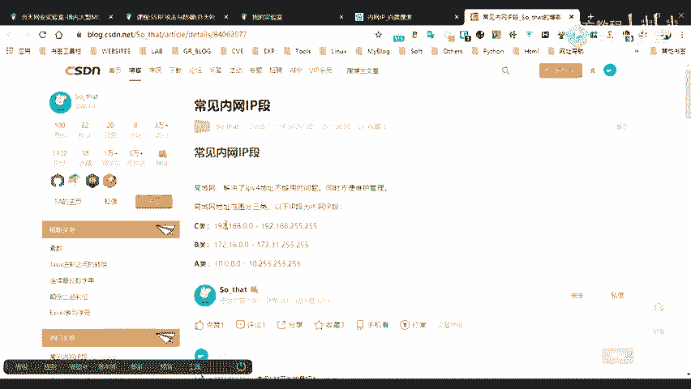

查看自己的1个IP地址。所以一般的话呃一般的话都是呃192。168开头的这种，对吧？这种的话就是一个内网的一个地址。

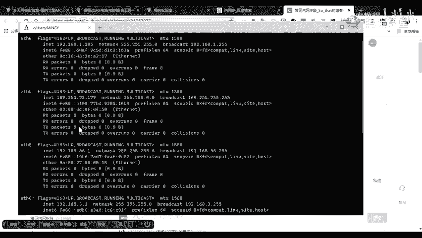

然后的话还有就是172。16这样子的一个网段。是。这的话提一下，可能有些人不是很分的清楚。好的话在这里的话，我们其实可以去尝试去尝试修改我们的这样子的一个资源，修改为1个内网的1个IP地址，对吧？

如果说它这里存在这样子一个漏洞。他就会去请求我们这里给定的这样子的1个IP地址。给店的这个IP地址的话，呃，就是我们呃自己去进行一个构造的。当然的话前提你是呃就是不知道它的一些内网的一些资源的。

所以说这里的话如果它存在这样子的一个漏洞，我们可以通过去进行一个爆破，就爆破它它的一个内网的1个IPIP段。哦，我们通过他的一个就是说他会去请求我们这里给进的一个内网的1个IP资源，对吧？

如果说存在这样子的1个IP。然后指定的这样子的一个资源的话，就说明呃它存在这样子的一个漏洞，能够去访问到内网的一个指定的1个IP。然后的话我们可以通过这样子的一个漏洞来去爆破它的一个内网的一些IP段。

然后这里的话呃。我这里试了，就是说他去请他呃我这里改成我自己服务器的1个IP地址，对吧？就是一个图片，然后的话进行一个发送的话，可以看到在这里的话，他会去请求到我在这里的一个服务器。

这里的一个呃Q啊code点PNG的这样子的一个资源，对吧？然后可以看到它是从这从这样子的一个链接过来的，就是我这里的呃发送过来的这个包这个链接过来的。当然的话这里的话他是呃就是。啊。

以这样子的一个例子来给大家做做一个解释讲解。就说他会去对我们这里给定的这样子的一个链接去进行一个请求，然后获取到啊指定的一个服务器的一个资源，然后加载到这里来，对吧？那么我们就可以去。

伪造伪造他这种请求的一个地址，伪造成其他的一些资源的一个地址。🤧嗯。那这里的话，大家其实呃。

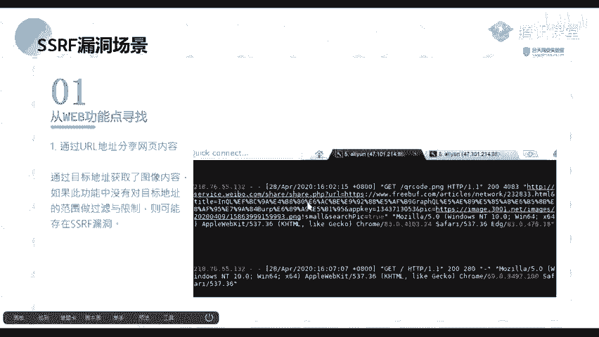

这样的话大家。看一下。这个的话是我挺早之前。就随便找了一篇文章。然后这里的话不是有个这样子的一个功能嘛，对吧？就分享到一个。微博。

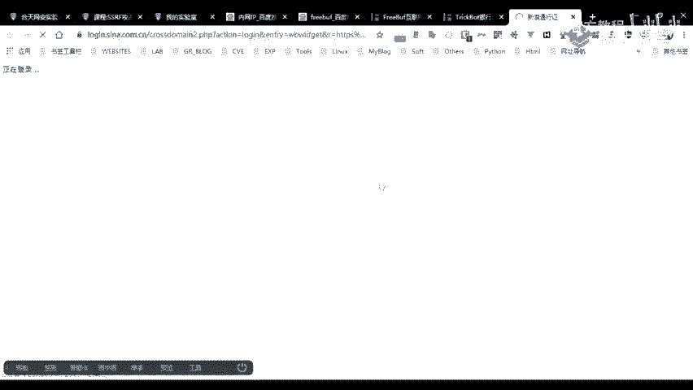

然后一般的这种分享的这种的话，对吧？

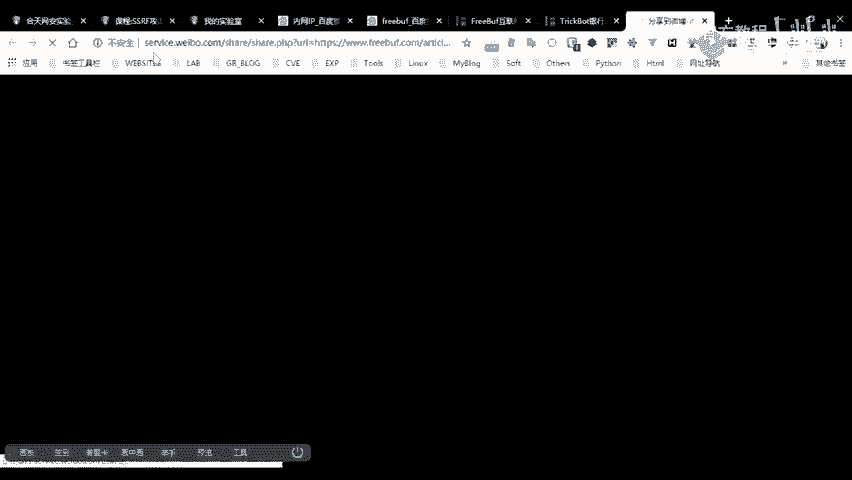

可以看到在这里的话，它会有这样子的一个图片。而这个图片的一个地址。Yeah。看。就是这样子的一个地址。那我们其实可以通过抓包。

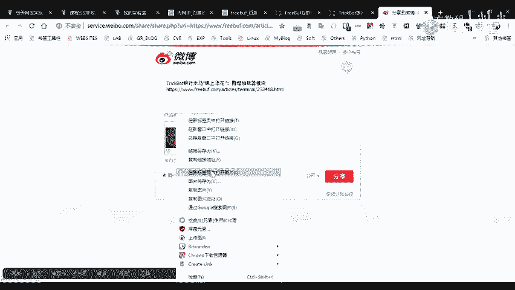

然后抓包的话能够抓取到这样子的一个。

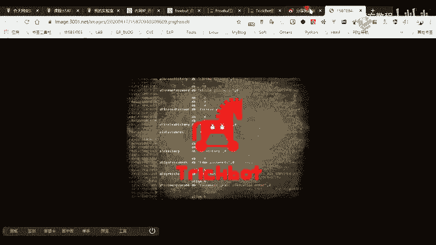

🤧K。抓取到这样子的一个请求。就它里面的话就携带了这样子的一些内容。然后这些内容的话，它是从指定的一个呃链接上面去获取来的。当然的话这里的话它是大家可以去尝试一下，这样的话是呃。

他没有没有这样子的1个SSF漏洞啊，我只是以这一个为例子讲解一下就是。抛砖引玉，介绍一下这一个从一这种12的地址分享。这种网页内容啊后它其实这里的话，它其实是有请求我这里的一个服务器的1个IP地址的。

当然的话也可以去请求其他的一个外网的一个服务器的一些资源，对吧？🤧但是的话对于内网的一些呃资源的话，呃，大家可以去进行一个尝试。就如果去进一个爆破的话呃。就比较麻烦。

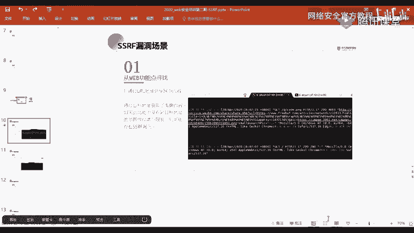

那我们呃。再看一下第二个。第二个的话就是一个在线翻译，就是说呃。我们常我们常见的像那种百度翻译，对吧？还有有道啊等等这样这样的一些翻译。它其实有这样子的一些功能。

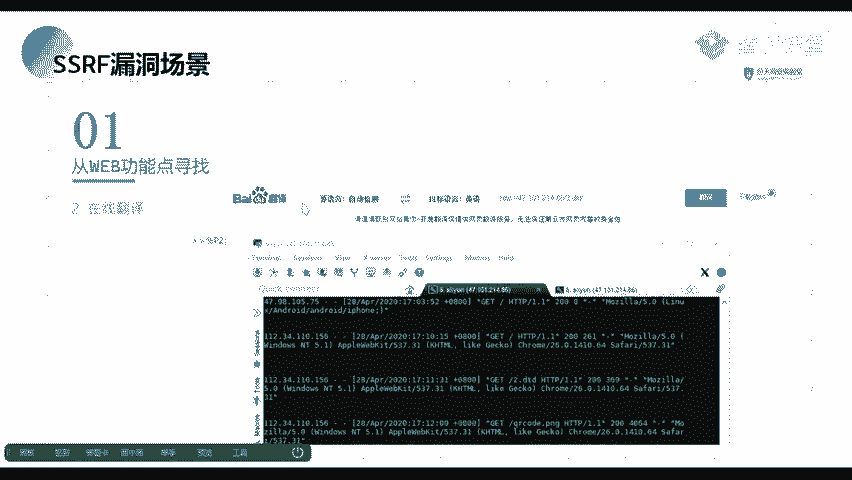

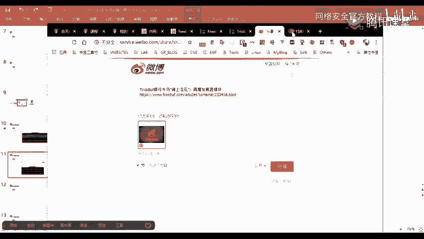

Okay。Ca。看。

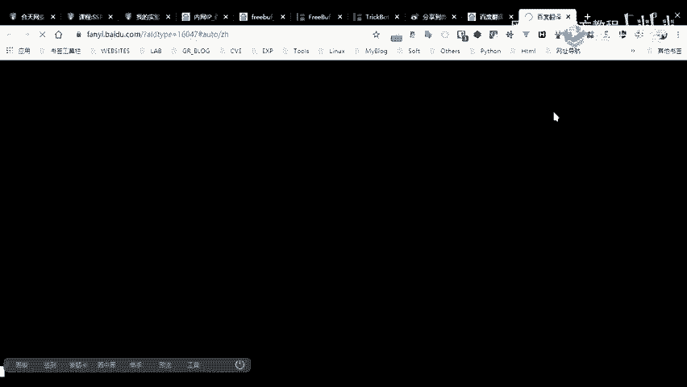

对吧就这是一个百度翻译，对吧？它你可以看到它这里可以输入文字网址。还有图片文档等等，对吧？他这里可以允许你输入网址。Okay。🤧看。啊，这里网址的话，我们呃。🤧随便找一个。Yeah。Okay。Okay。

え？😊，P。No。看。妈妈。嗯。就说这里的一个百度翻译的话，它可以去翻译呃。就说你指定的这样子的一个网站，我换一个网站。找个英文网站。嗯。K。看。看。🤧Okay。

然后可以看到我这里的话输入这样子的1个UL地址，对吧？输入这样子的一个网址，然后它这里有这样子的一个功能，就是能够把我这里输入的一个指定的一个啊URL。的一个内容把它翻译成一个中文，对吧？啊。

其实在其实在这这样子的这样子的一些功能的话，它的一个原理其实就是他会去首先他会请求你给定的这样子的一个。嗯，沙包吧。Good。我们可以查看一下他的一个请求包。就呃可以看到在这里的话。

它是我们这里输入的一个网址，对吧？然后他会以这样子的个get请求去查询，就是这样子的一个网址。我们这里输入的一个网址。那他查询之后的话，他会返回这样子的一个呃内容。呃。然后他返问这一个内容的话。

它是呃要返回你这这样子的一个指定的这这一个网站，对吧？那么它首先就需要去请求这样子的一个网站的一个这种网页的一个资源，对吧？然后的话它再去用它的一个翻译的一个服务，对它进行去进行一个翻译。

所以说在这里的话呃，它也会有存在这样子的一些SSF漏洞，它你没有对这样子的一个呃这种你这里输入的这种链接这种UL地址做一个过滤的话，就会存在这样子的一个漏洞。

就比如说你这里可以尝试使用一个内网的一个IP对吧？然后这里是如果说他这里的一个服务器，它允许呃，它有允许去访问到内网的一些IP的一些资源的话，那么它会存在这样子的一个漏洞。这样的话你需要去就输入到呃。

你要确定你能够你要能够知道它内网的一些IP的一些网段。然后的话你再去啊对这些网段去进行一个呃测试。因为我们知道就是内网的一个网站的话，有很多的，就刚刚有看到。Yeah。他的一个他的一个这种呃。

他的这样子的一种IP的一个数量的话是很大的。然的话在这里其实呃你们也可以去尝试去啊。去尝试输入你自己的一个呃地址，对吧？输入你自己的你服务器的一个呃页面。然后的话你去进行一个呃翻译。翻译之后的话。

它会有这样子的一个请求。就这个请求的话，它是从呃这个呃百度翻译的这样子的一个呃服务器的去进行一个发送的。然后的话它会请求到你这里给定的这样子的一个呃链接。然后他获取到我这里的一个资资源内容之后的话。

再去进行一个翻译。你看到有这样子的一些呃这里啊这样子的一个请求。啊，第三个的话就是通过呃1地址加载与下载图片。就这个的话其实跟前面也是类似的。就是说在这种就是通过要地址去进行呃加载这种资源的话。

就呃很有可能会存在这样子的一个漏洞。它没有对这样子的一些呃有严格的一个限制。然后还有就是图片的一个文章收藏的一个功能。就是说你去啊收藏这样子的一个文章。对，比如说你去呃收藏到啊印象笔记，对吧？

然后你去收藏那个印象笔记的话，它会呃你们有用过的话，他会把就是他会把你给指定的这种文章的一个内容，然后他会把它给保存到你那个印象笔记的里面啊印象笔记里面去。

然后他其实就是把你给定的这一个呃UR地址里面的这种文本的一些内容，对吧？然后把它给放到了那你那个印象笔记的一个呃内容里面去了。所以说的话它中间就有这种去像指定的。

你给变这种UID址去进行一个请求里面的一些呃title，还有文本内容。然后的话再显示出来。啊，第二个的话就是从UR的一些关键字去进行一个寻找。像比如说这种小啊，还有像这种UL对吧？

因为呃像这样子的一些关键字，后面的话，它呃通常会去接这种啊链接，就说去接呃常见的这种请求资源的这样子的一些啊链接。就是说通过这样子的一些参数，当然的话还有其他的一些就是呃看实际的一个啊功能点。

的一个不同。🤧嗯。啊，最后的话对前面做一个总结，就是说这种SS不漏洞它常见的这种场景的话，首先第一个就是能够对外发起这样子的一个网络请求的这种地方，比如说我们啊啊这种下载图片，对吧？

还有就是呃获取指定服务器的一些图片的一些内容，对吧？那这种地方的话就很有可能存在这样子的一个漏洞。第二个的话就是从远程服务器请求资援。就是说从我们的一个啊指定的这种啊服务器。去请求这种文本的一个内容。

还有像这种图片资源是很常见的。那我们去去寻找这样子一个漏洞。大家就呃注意去观察这样子的一些。啊，功能点。嗯。Yeah。第三个的话就是呃漏洞的一个利用。就说我们怎么去利用这样子的一些漏洞。

然后在这里的话呃，首先的话带大家一起了解一下，就是说这样子的一些协议，一些业外的标的一个协议。🤧就是我们在常呃经常会去使用到这，就说在SSF漏洞里面的话，经常会去使用到去验证的这样子的一些协议。

首先第一个的话就是这个dic的一个协议。🤧嗯。这digt协议的话就是一个置顶服务器协议。其实从这面意思的话也能够知道。就呃我们在SSF当中的话。

可以去使用到这样子的一个dt协议来获取我们的一个目标服务器上面。端口。运行的一个服务版本的等等的这种banner的一些信息。好，我们看一下这样子的一个例子，一个的话就是一个本地利用。🤧哼。啊。

这里的话使用的是1个CLAL的这样子的一个命令。就是说这个命这1个CRL的话，它其实是一个命令行的一个工具。它的一个作用的话就是用于发出这种网络请求获取数据。

就是就是说你在命令行上面的一个啊可以达到像浏览器的这样子的一个功能。就是说去啊访问去请求你给定的这样子的一个啊链接啊，然后的话再获取你给定链接的一个这种数据资源。

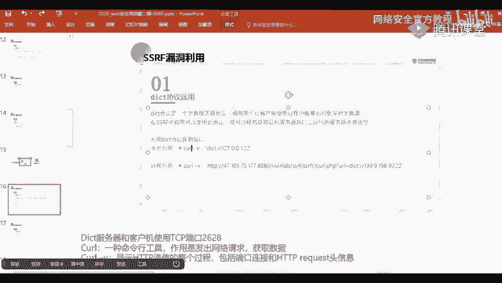

这个的话是呃经常去使用到的这样子的一个命令。

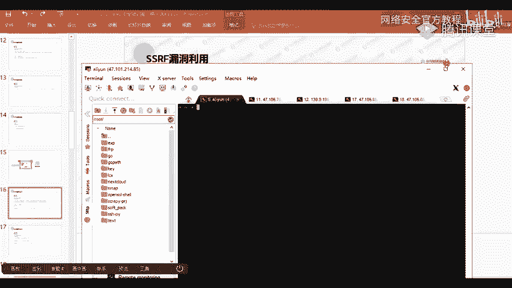

🤧Yeah。

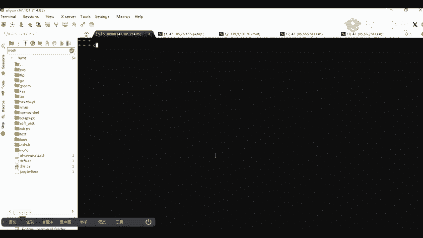

🤧Okay。Yeah。别 know。

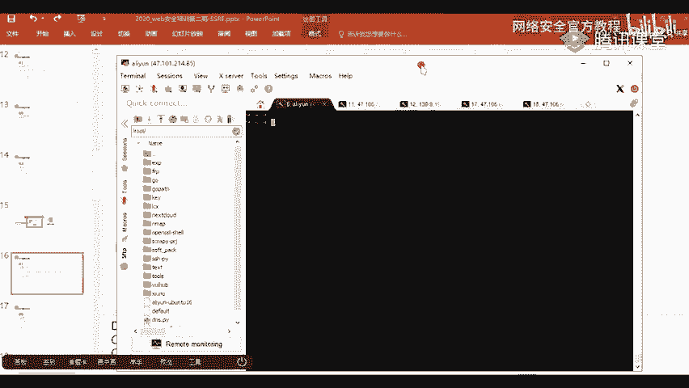

就CR这一个面的话是呃一般的话都是呃默认都有的。然后这里的话有一个杠V的一个参数，就是显示我们的一个就是我们的一个呃。对指定资源的一个请求的一个详细的一个过程以及信息。🤧Okay。🤧K。Okay。

这的话我使用这一个dig协议来去呃。访问我本地的而去探测我本地的。比如说呃一个。3306的一个端口，就是说我们的一个数据库的一个端口，对吧？然后我们这里去进行一个访问。啊，打错了。进行一个访问。

访问之后的话可以看到上面这里的话就是呃我们的这样子的一个请求的一个过程。就说他会去请求这样子的一个啊啊链接，对吧？然，去请求我们的这里给你的这1个IP地址的这1个3306的1个端口。

然后在这里的话可以看到它这里返回了。这样这样子一创信息。这样的一个字符串，这个字符串呢话，我们其实可以看到这里有一个merrydB对吧？乌班图啊。

1604这里的话其实就是显示了当前的这个数据库的一个版本的一些信息，它是1个5。5。5呃啊，不是，它是一个merrryDB的一个呃10。0的一个版本。然后的话当前的一个系统的话是一个乌班图16。04。

们。可以看一下。看。对。可以看到我当前的这样子的一个呃数据库是一个merryDB1个10。0的一个版本，对吧？🤧K。K。嗯。嗯。可能。然后我当前的一个系统版本的话是物班图的1个1604的一个版本。啊。

其实我们。可以看到我们通过这样子的一个d协议的话，能够获取到就是说指定的1个IP地址，指定的一个端口上面的一个服务的一个版本的一些信息，对吧？那么我们可以尝试一下使用呃，就是访问其他的一些端口。

比如说嗯。8080的一个端口。没有吧。看。🤧K。Look。诶好。这里打错了DICTdicctor。嗯哦在这里。可以看到的话，我这里访问呃我本地的1个24680的这样子的一个端口。

然后的话可以看到它这里返回了这样子的一个信息是1个SHH2。0，对吧？哦，我这里的话是使用的这一个端口，是1个SS取的一个服务的一个端口。所以说我这里去进行一个探测。指定的一个端口。

然后他给我返回了一个这个端口上面所运行的一个服务的一些信息。

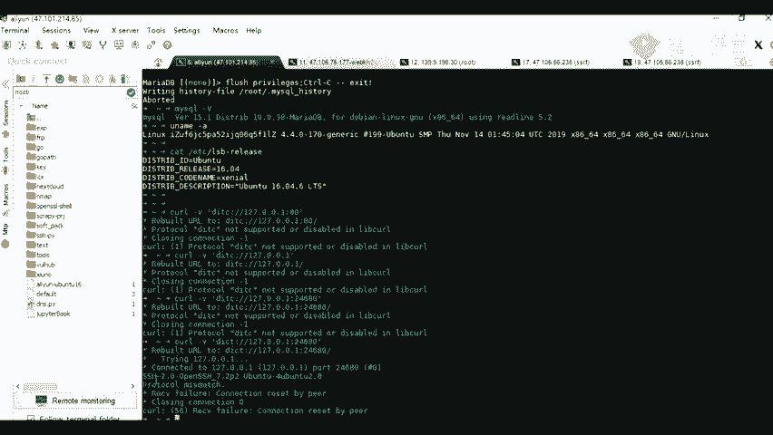

这就是一个这个dic协议去探测呃，指定IP端口的一个。这种banner信息的一个啊功能。然后的话在应用到我们的1个SSF里面的话，就是说我们就是说下面的一个远程的一个利用。

就说我们前面知道就是说如果说它存在这样子的1个SSF漏洞的话，我们可以通过就是说他请求的这种资源的一个链接地址，它是可控的。那么我们可以去进行一个伪造，伪造成我这里指定的这种啊一伪造成我这里的。

比如说这一个dicctor。啊，指定的这1个IP是这一个。对1个222端口，对吧？啊，然后的话。我去进行一个发送发送我的这样子的一个请求。然后我们这里的这一个呃服务器。这个这个服务器的话。

它就会去啊以这一个dic协议去啊请求指定的这1个IP的22号端口。然的话它就会返回这个指定的22号端口。如果说它存在这样子的一个端口，就说这个端口是开放的。

那么它就会返回这一个端口上面的这种啊服务器的一个版本的一个信息。

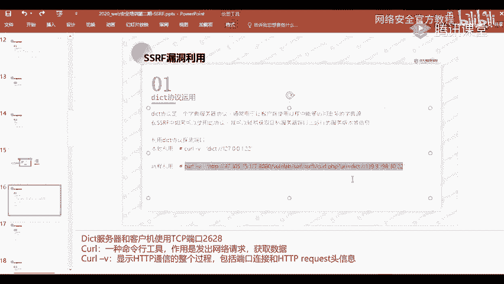

🤧去。Yeah。嗯。😊。

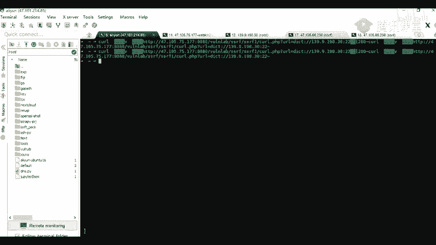

🤧K。

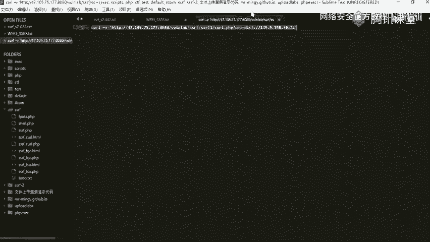

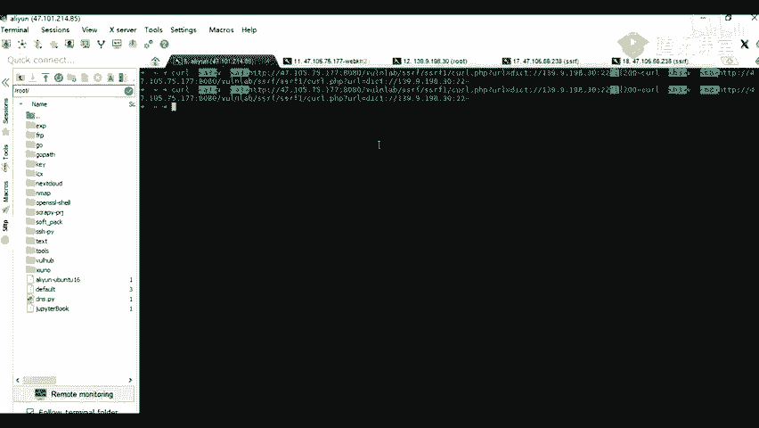

Okay。

这么卡呢。Okay。

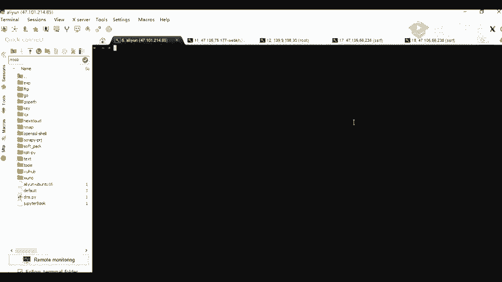

Okay。

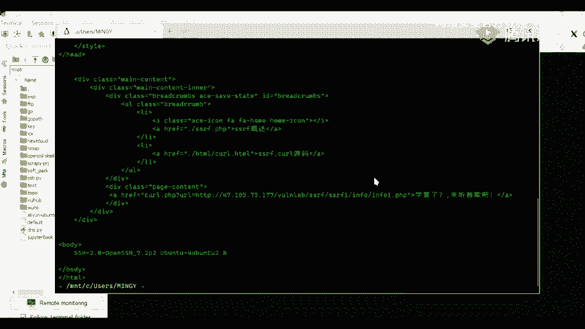

然后我这里的话访问了是呃。

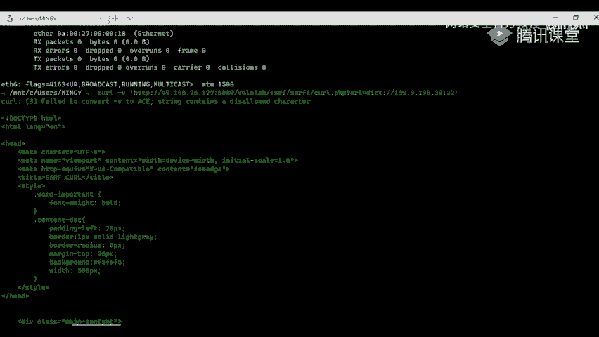

我这边的话是访问的这样子的一个网站，就是说这个网站对吧？它存在这样子的1个SSSSF的一个漏洞。然后的话我在这里的话，我去呃。发送这样子的一个请求，我这里修改它的一个呃。请求的一个地址。喂，我这里。

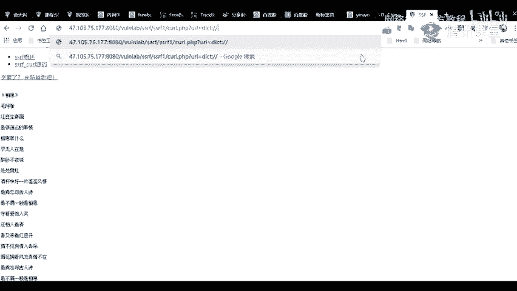

而我这里的这一个。dick协议的这样子的一个地址。然后的话我去进行一个请求的话，可以看到可以在这里看到能够探测到啊指定的这个远程服务器，它的呃端口的这种banner的一个信息。

就说它的一个版本的一个信息，以及它服务器的一个信息。然后还有其他的一些端口，在这里的话，我就不一一的去尝试了。

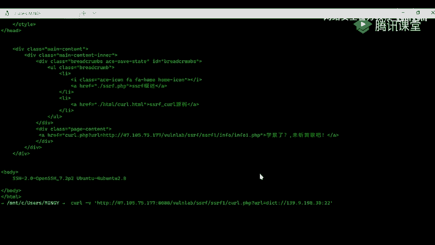

这就是一个呃dt协议的一个使用。啊，第二个的话就是一个firere协议。fi协议的话，其实前面也给大家已经有介绍了，就是说它是主要就是用于文件系统中的一个内容的一个获取读取。

就是说访问我们的一个文件系统当中的一个文件的一个内容。啊，这里的话其实就是呃。就是利用到这样子的一个fi协议去读取我们的文件系统中的一个内容。这样的话我也。还是以这一个为例子。比如说。

我这里想要去读取到指定系统中的1个ETC下面的一个password的一个内容。那么我们可以使用到这样子的一个fire尔协议去进行一个读取。然后的话因为它这里存在这样子的一个漏洞。

这样这样子的1个SS漏洞，对吧？它会去请求我们这里给一定的这样子的一个呃这样子的一个链接。然后的话他会请求我这里给定的以这一个fi协议的一个链接，然后的话获取给定的这一个呃链接的一个内容。

然后的话再返回给我们。可以看到在这里的话是能够获取到它的一个啊password的一个内容。这就是一个fi协议。然的话第三个的话就是这一个go for协议。就勾 for协议的话呃。

在后面的话去进行一个漏洞的一个利用的话，会经常会去使用到。就说像比如说这种radius的一个未授权。🤧嗯。😊，然后的话勾火的话，它是一个就是万金油的一个协议，它什么都能够去进行一个就是什么都能干。

就他能够去发送到去，就是说在后面去进行一个漏洞呃应用的时候，我们就会去使用到这样子一个勾火协议，来像指定的这种在内网的一个服务。比如说reius的一个未授权，我们需要向他发送我们的一个payload。

然后的话发送给瑞去进行一个执行。就会去使用到这样子勾法协议。然，这里的话我们可以看一下。

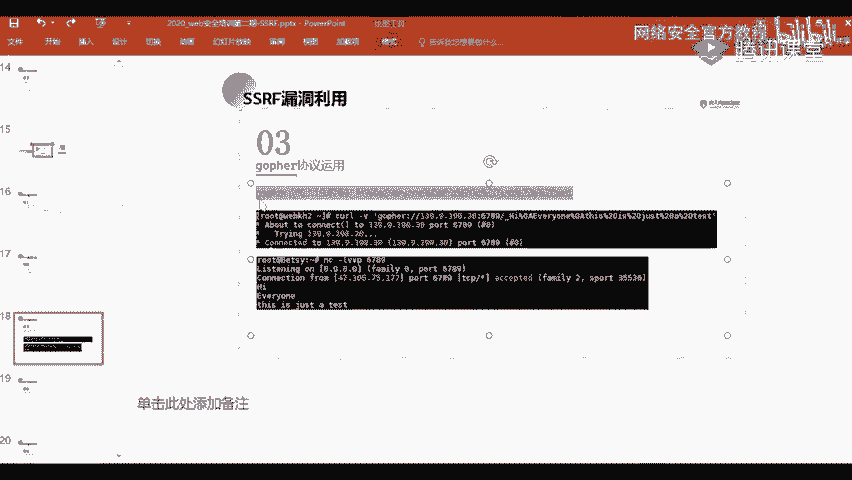

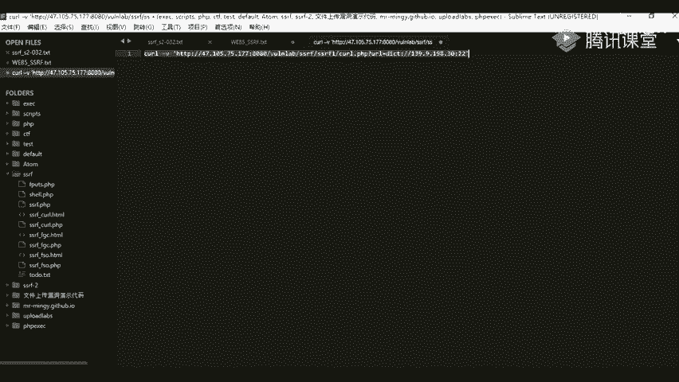

比如说我在这里。好卡呀。😔。

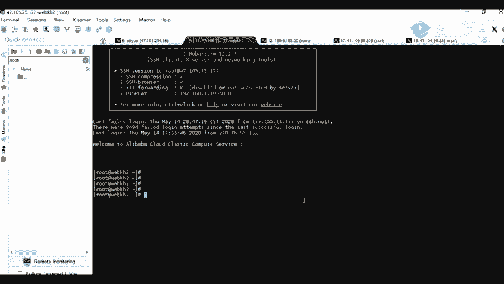

Yeah。🤧Yeah。

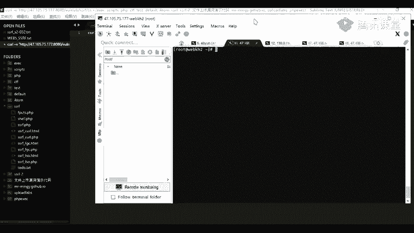

🤧K。比如说这里我使用1个CRL来去啊就发送这样子一个请求。这个请求的话是呃利用go for协议。然后的话他请求的一个地址的话是我这里的一个服务器的一个地址，对吧？请求的一个端口的话是呃6789。

然后后面这里接的话，就是我们利用这一个goer协议去传传递的这样子的一个内容。然后这里的话是一个hi everyone。this just test对吧？然后中间这里的一个0%A，还有20%的话。

就0%A的话就是一个空格嘛，对吧？呃啊，不对，0%A是一个换行，20%是一个空格。就它是一个幼儿的一个兵码。啊，我在这里的话，我去进行一个呃，首先我需要在这里啊。

因为这边的话它没有开放这一个这样子的一个端口。所以的话你直接去进行一个访问的话，它肯定是不会有信息的。我在这里的话使用一个。你。我在这里使用NC来今天这样子的一个。呃，6789的一个端口。

然后的话我再使用这一个go for协议去进行一个。访问或者说去发送我这里的一个内容。啊，其实我们在这里的话可以看到在这里的话，接收到了从这里的一个服务器上面所发送过来的一个内容。

这个内容的话就是像这样子的一个hi everyone，这是一只just test这样子的一个内容。

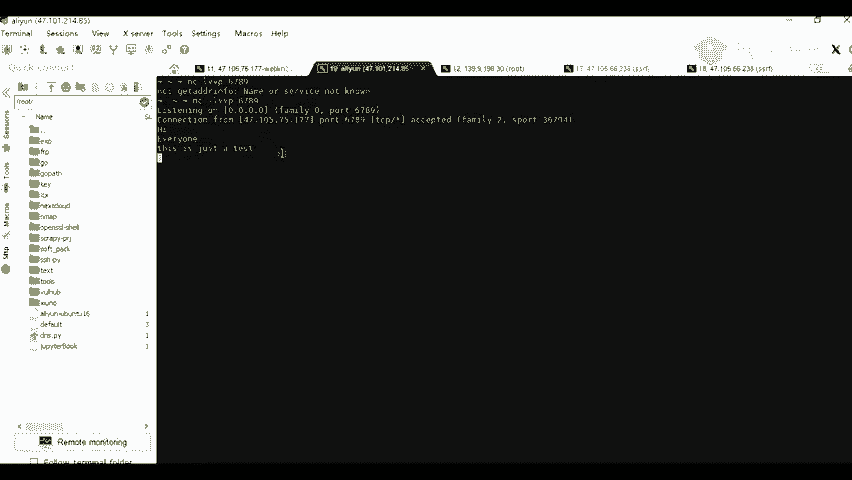

这个是呃篝法协议。

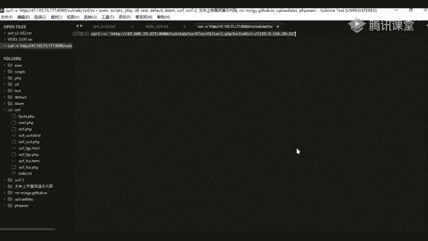

然后第四个的话就是SSF inPHP。在这里在这里的话，我们主要的话就是给大家介绍，就是说在PHP当中。所导致的这样子的一个就说呃导致就存在这样子的1个SSF漏洞的这样子的一些原因。

然的话是有什有什么样子的一些呃功能，或者说PHP当中的一些函数。使用不当，然后导致了这样子的1个SSF的一个漏洞。首先的话呃我们可以看这里的话，我列举了三个，就是说这里的这三个函数，如果说使用不当的话。

而，十分的容易导致存在这样子一个漏洞。首先第一个的话就是这个CRLEXEC。然后第二个的话就是这一个forget contains。第三个是这个F shock open。

下面的话我们一一一的对它做一个介绍。所以第一个的话就是。这个CRLXEC就是我们从这一个函数，它的一个啊就是名字的话也能够知道它是使用的这种CRL的一个方式来去呃请求我们指定的一个资源。

然后这一个函数它的一个作用的话，就是我们从前端传过来的这种URL，对吧？它会被后台。如果是如果他后台使用的是这样子的一个函数的话，它传到传递到这一个函数的话，它就会对指定的这1个UL去进行一个请求。

然后的话把请求的一个结果又返回给前端，也就是返回给我们的一个啊浏览器的一个页面，对吧。好的话呃我们是。他的这样子的一个协议，我们如何去进行一个。啊，就是有啊。就说如果说它是它的一个后端。

它是使用到这样子的一个啊函数。然后的话它没有啊正正确的一个进进行的一就是没有正确的使用这样子的一个函数的话，我们能够通过什么样子的一些方法来去进行一个攻击以及利用。

那这里的话就需要使用到我们前面有说到这种。呃，dctor这种协议。啊，同样的我们在这里的话是使用这一个dic协议来对我们的一个内网的内外网的一些端口进行一个探测，探测它的一些版本信息等等。啊。

在在这里的话，我也。这个文艺。好，这个。这个的话就是那一个把件，我忘了说了。就那个把击这个SSof的一个漏洞理解，对吧？然后这里的话呃已经给了有这样子的5个呃题目。然后第一个这个CLL的理解的话。

它就是使用使用到的这样子的一个啊CLLEXEC的这样子的一个函数。🤧K。啊，其实呃这样的话我有给了这样子的一个，就是大概写了这样子的一个简单的一个界面。呃这里的话给了这样子的一个源码。

就是说这个题目的一个源码。就在这里的话主要的话就是这个是要EXEC的一个函数。然呃前面的话就是。就通过这个UR的一个呃参数，对吧？获取啊，用户传递的这种链接，然后传递过来之后的话。

就用这样1个CLEXEC去进行一个请求。然后请求之后的话，它会把请求到的一个内容，然后进行一个输出，就是echo就输出到我们的一个页面。嗯。然后在这里的话。呃，在这里的话要提一点的，就是CL的话。

它不仅仅就是支持这种HDP，还有HHTPS的一个协议。就我们前面利用这1个CL去访问指定的一个word的一个页面，对吧？啊，他其实还支持其他的这样子的一些协议。🤧嗯。😊，这这里的话呃。

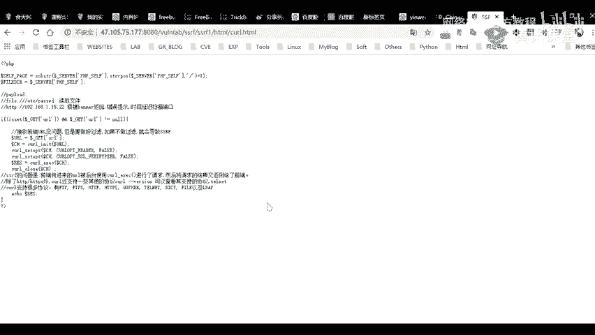

我们可以使用这一个。需要。杠一吧。CL杠大V这样子的一个参数来查看到，就说这个CL这一个工具的话，它能够就是支持有这样子的一个协议。有这么多的一些协议，像比如说dic啊，fi啊。

IFTBFTBY就是文件传输嘛。还有我们的高仿啊HPSHPS。以及常见的像这种POP3就邮件服务的，还有呃。三ber。呃，以及tnet等等的这种协议。

我们都能够使用这样子那个CR来去利用这些协议来发送我们想要的一些请求。

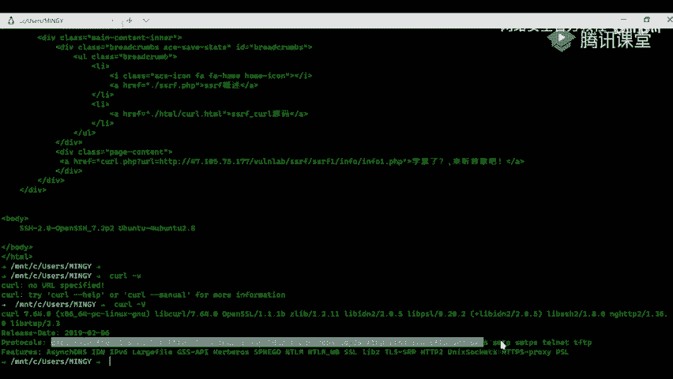

那后这里的话我们看一下这一个。🤧Good。呃，这个概述的话，我这里就是。呃，以文字的一个形式对SS5做了一个题本的一个介绍吧。那我们先看一下第一个题目。

这个题目的话我们可以看到就是我这里访问访问之后的话，它返回了这样子的一个内容，对吧？访回了这样子一个内容。然后的话我们其实从页面的话，从页面上的话没有发现什么特殊的一些地方。然后我们主要的话看这里。

就看它的一个链接。我们前面有说到，就是说呃他有这样子的一些就是关键字，对吧？我们常见的一些关键字，比如说UIL，还有其他的一些啊，就说后面接后面接我们呃的一个链接的这种关键字。而。

这种关键字后面的话通常的话会接这样子的一个呃令IP啊UL而这个U地址的话，就是他要去请求的这样子的一个UI地址。而，在这里的话，他是请求到了这样子的一个资源，对吧？我们可以直接去进行一个访问。

对吧他它的一个资源内容的话就是这样子的一个歌词歌词的一个内容，对吧？那么在这里的话，我们就可以去进行1个SS漏洞的一个呃测试。啊，测试的话，我们首先就要啊。

想到就说我们要测试它的什么意什么什么样的一些内容来去对它进行一个印证。首先第一个，比如说我们。请求一个其他的一个啊，在这里的话可以看到它是能够请求到其他的一个资源的对吧？啊啊，没有。

他是同它是在同一个服务器上面的对吧？是在这里的话，我去尝试去请求一下其他服务器上面的一个资源。说呃。🤧哼。啊，就我就访请求呃这一个这1个IP地址上面的一个啊资源。然后我去进行一个。啊，访问访问之后的话。

可以看到它在这里的话显示了这样子的一个内容。而这个内容它是从哪里来的呢？我们来访问一下这样子的一个。地址这个地址的话可以看到它的一个网页的一个内容的话，就是这个内容。那么我们从这里的话能够分析出。

就是说他在这里的话，它有这样子的一个功能，就是他会可以去请求你这里给定的这1个UL地址。然后的话。呃，把这个要要地址的一个网页的一个内容，文本内容。或者说他其他的一些内容把它给获取，就把它给请求过来。

请求过来的话，再输出到我这里的一个页面上面来。然的话我再尝试一下。啊。内网的1个IP地址对吧？比如说呃127。0。001，这个的话其实也不能说是一个内网的一个地址。就说一个呃这是一个回还地址嘛。

就是说呃访问这一个的话，就相当于访问的是你本地的一个资源嘛。然后在这里的话，我去进行一个访问我这里本地的这种呃内网的1个IP地址，对吧？然后可以看到在这里的话，它访回了这样子的。一些内容这些内容的话。

🤧其实就是。つに。这里的我这里的这个服务器上服务器，我这里访问之后，这里的一个内容，对吧？那么说明的话，它在这里的话是存在1个SSF漏洞的，而且。他没有对我们这里传递的这个呃链接。

这种啊内网的1个IP地址，还有外网的这种链接地址，没有做任何的一个检测以及过滤。然的话我们就可以利用这样子的一个功能来进行一些就是你原本访问不到的这样子的一些内容的一个请求。🤧H。🤧Yeah。啊。

这里的话我们验证的话，它是能够去访问到它内网的一些IP的对吧？然后的话们。想要去进行一个呃端口的一个探测，就是说探测我们的一个呃指定的一个服务啊，不是就探测我这里的一个服务器里面它的一啊一些IP。

或者说一些端口然后探测探测1个内网的1个IP的话，因为这里的话其实可以看到它是能够访问到内网的1个IP地址的一个资源的对吧？那么我们可以尝试一下其他的一些IP地址。If所。看你。像这样子那种IP地址。

对吧？🤧啊。H。啊，在这里的话可以看到。呃，这里一直是在转的，说明的话他这里的话是没有这样子的一个呃。说明呢它是没有这样子的一个呃呃，就是存在这样子的1个IP上面有啊。一个web的一个服务的这种资源的。

因为我这里的话是一个。

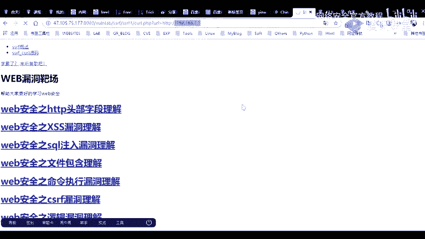

うん。😊。

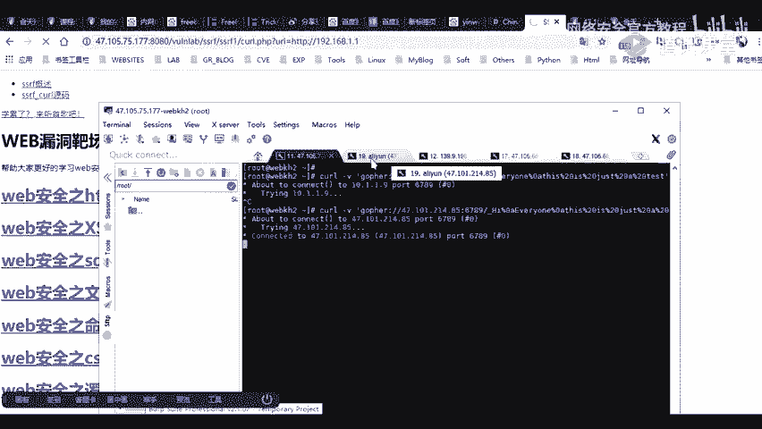

这个。这的话是一个阿里云的一个机器。就S50。对。他这里的话就呃有这样子的一些内网的一些IP，但是的话它是没有其他的一些资源的。就没有其他的一些服务的。然后像正常的正常的这种。服务器对吧。

比如说你是你的这一个服务器，它是一个外网的一个服务器。然后的话这个服务器正好是能够去访问到内网的。那么我们就可以利用这一个服务器去访问到指定的这一个内网的这样的一些资源。比如说比如说在这里的话。

一个内网的1个IP是这个对吧？那么我们可以尝试去访问这1个172这个网段，其他的这样的一些IP它是否啊有存活。如果存活的话，这一个存活的这1个IP它开放了哪些端口，然后这些端口它有什么样的一个服务。

对吧？

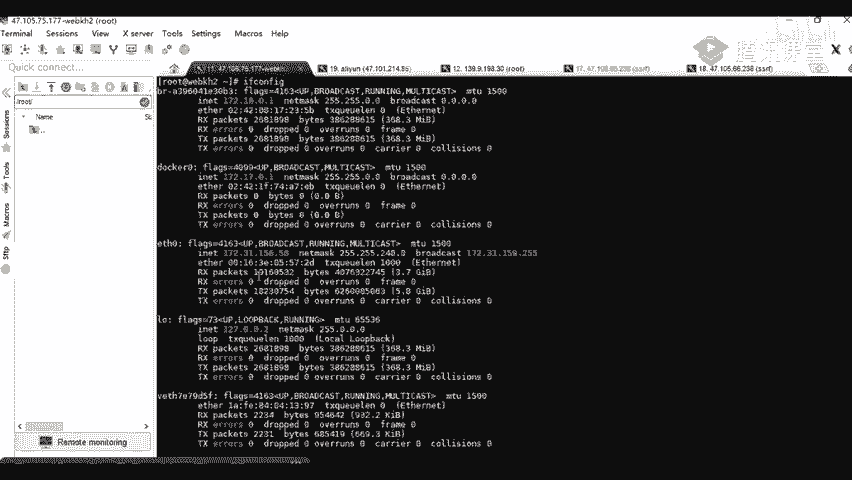

然后的话说到探测端口的话，在这里的话，我们就需要去使用到这个dic协议。我们在这里我们可以尝试去呃用这一个d协议。🤧来探测一下，比如说。呃，它的1个808年的一个端口，对吧？也，其实也就是这一个。

也就是这个服务器呃，这里的一个。啊，web页面的一个呃端口。然后的话在这里我们其实访问之后可以看到。🤧他返回了这样子的一个内容，就说HTB404。然后的话就是可以看到他在这里的话返回了你这一个服务器。

🤧。所使用到的一个呃阿帕奇的一个版本。嗯嗯嗯。以及呃你的1个PHP的一个版本等等的这样子的一些信息。然后说明的话，它这啊虽然它这里显示的是一个bad request，对吧？但是的话其实可以看到。

可以知道他这里的话是能够去进行一个访问的。啊我们呃可以尝试其他的一个端口，对吧？如果说它没有这样子的一个端口的话，它是什么都没有显示的。然后的话还有呃22233这样子的一个。呃，他的一个版本。

以及他的一个服务。嗯。还有像比如说3306。对吧这样子那其实在这里如果说他能够去进行一个探测的话，我们不可能说这样子一个一个去试了，对吧？就是一个1个IP的去尝试。

这个时候的话我们其实可以去使用去使用我们的1个BP对吧？就是说我们可以直接使用1个BP来，就是对我们这里指定的这一个啊端口的一个数据去进行一个爆破。🤧嗯。😊，比如说。うん。🤢，🤧蠢。🤧K。

他的一个请求的话就是呃这样子的一个请求，对吧？然后的话它的一个回形的话是在这里。然后如果说就说他这里是有这样子的一个服务开放的，所以的话他会有这样子的一个回响。就是说有这样子的一个内容显示出来。

如果说他没有这样子的一个。看。他呃没有存在这样子的一个端口，对吧？我们去进行一个访问的话，它其实是没有啊其他的一些内容的。它的一个字节是1600，对吧？我们访问一下3306，可以看到的话。

它的一个字节数的话是1724。然后的话我们可以把它发送到我们的一个。包括模块嘛，对吧？来对我们的。Yeah。这里指定的这一个呃IP去进行一个包破。ふ。这里的一个爆破的话呃，我们首先要知道。

就是说呃我们的1个IP端口的话，它是呃最大是1个65536。就说它的一个呃IP的一个端口数的话是从1到65536。然后这里的话这样的话我们选择一个numbers， numbersumb的话就是数字嘛。

然后的话我们从一。到6536对吧？然的话呃近近距的话就是一嘛，就是123456。总共的话是有。65536这样子的数据。然的话我们可以去进行一个啊爆破去访问。

然后其实然后可以看到在这里的话已经有了一个8联端口，对吧？我们看一下它的一个返回的一个信息。返回的一个信息的话是这样子，说明的话它的一个8联端口它其实是存在的。然后它是一个呃阿帕奇的一个服务。

然后还有就是22端口，对吧？然后以及呃。这1个3306。看。Yes。当然的话，我这里的话就不一一个一个去跑了，因为有点多。这话就是介绍一下就是思路。然后这里的话是一个dit协议的一个使用。

然后第二个的话就是我可以去进行一个尝试，去读取读取我服务器上面的一个文本内容。那么我想实现这一个的话，我们就去需要去使用到这样子的一个fire协议。这个fire协议的话。

比如说我们这里的话已经知道它是一个lininux服务器，对吧？我可以啊就是用常见的这种啊文件。比如说ETC password，有常见的这种文件，就每个系统，每个linux系统都有的这种文件。

然后去进行一个尝试访问。访问之后的话，我们来就是观察它的一个响应，它是否有返回你指定的这样子的一个文件的一个内容。然后这里的话是返回了就可以。就正常的返回到了我们这里访问的这一个文件的一个内容。うん。

😊，🤧。呃，这里的话就是一个呃dict协议。就对我们的一个端口的一个服务去进行一个探测。然后第二个的话就是一个呃敏感文件的这种读取，就是fi协议。就是呃在命令史里在命令史里面的话，就命令系统里面。

都全啊都有的这样这样子的一种文件，就是说ETC password呀这种文件。然后windows的话就是我们可以使用这种啊windows下面有一有一个这种wind点II的这样一个文件。

就是系统的一个文件啊，就啊所有的这种windows系统都有。都会啊都会有这样子的一个文件。我们可以去访问一下，他其实就是这样子的一个内容嗯。🤧嗯。哦，我们可以通过这样子的就是。啊。

常见的这种文件来去进行一个验证。就验证它是否能够去使用这种fire协议去进行一个文件的一个读取。啊，第二个的话就是这个fire get content的这种这样子的一个函数。这个函数的话。

它同样的能够去进行一个就是给我们对我们给定的这种链接去进行一个请求。然后在这里的话，它与前面不同的一个地方的话，就是它支持这样这样子的1个PHP的一个伪协议。🤧嗯。

我们可以通过这1个PHP的一个伪协议来去进行一个呃就是这一个服务器它的一个源码的一个读取。うん。😊，嗯。🤧嗯。对。🤧嗯。🤧这里话我。😊，🤧是。不好意思，喉咙堵了。Yeah。

这样的话我我以这一个呃题目作为一个例子。我们呃直接先看源码吧，就是它的一个源码的话，其实跟前面也是类似的，就通过这个fi协议。啊吧通过这一个file参数去啊获取指定的一个资源，对吧？

然后的话给这一个fi get content的这一个函数去进行一个处理。那这个这个文件的话，它把这一个函数的话，它的一个作用就是将你给定的这一个文件读入一个字符串。然后在这里的话。

它会呃用ele把它进行一个输出。哦，我们可以看一下，就是。这个题目。我们可以看到我这里的话啊，访问之后的话可以看到同样的是。在他的1个UR地址里面有这样子的一个内容。有这样子的一个链接，对吧？

而我们访问一下它的一个内容的话，其实就是这样子的一个一张图片，对吧？而这张图片的话，它是。八诶。🤧嗯。这张图片的话，它是在这里的话，它是通过那个finarget content这一个函数进行一个获取的。

然后呃这里的话跟前面的话其实都是呃一样的，就是进行一个进行一个测试嘛。测试的话像啊啊外网的一些服务，对吧？外网的一些HTP服务，还有内网的一些HTP服务等等这样子的一个一些资源去进行一个测试。

对吧这样的话我就不重复了。然后在这里的话，主要就是介绍这一个这一个方案啊，这个PHP伪协议。也就是这个就PHP feltread这样子的一个呃。协议。这个协议的话呃其实呃大家别看着就是很复杂的一个样子。

其实就。啊，挺好挺好记的，也挺好理解的。主要的话就记这里。就这一个convent base64in code。然后resource resource后面的话就是接我们的一个就是资源嘛。

就是我们这里要读取的，就是说读取的这样的一个文件。然后的话给这一个base64incor这一个函数去进一个处理。然后这一个函数的话，它就是把我们这里的一个啊给变的这一个啊文件。

把它的一个内容做一个base64的一个兵码。然后把它编码之后的话，再进行一个再用这个PP尾协议去读取。读取出来，然后它的一个效果的话就是像这样子。诶。我们在这里的话呃使用这样子的一个伪协议。

然后的话我们读取这里的就是这里的1个FGC的一个内容，对吧？我们回车回车之后的话，可以看到它在这里的话，它显示了这样子的一个内容。这个内容的话，它其实就是一个bs64的一个兵码的一个啊字符串。呃。

我们可以对它做一个解码。🤧。Yeah。Yeah。🤧嗯。解码之后的话，它的一个内容就是这里。我们其实可以看到的话，这里的话就是当前这里的这一个页面，它的一个云代码啊，它的一个代码的话。

其实它的一个云代码的话，不是说我们在这里的。啊，我们这里右键查看网页云代码的一个。🤧代码。就是说我们在这里右键查看网页云代码的话是啊啊就是服务端它的比如说我们的1个PHP脚本。

它呃把我们的一个内容进行一个处理。处理之后的话再返回给我们前端的一个内容，是这样子的一个内容。对吧然后在这里在这里我们读取到的这样子的一个内容的话，它的一个云代码是就是说这个页面的一个完整的一个云代码。

就包括了我们的这种PHP的一个代码。我们其实可以。发现就是说因为你是这样子的一个PHP文件。如果说你的一个服务器支持这样样的1个PHP文件解析的话，如果说你这一个文件它存在1个PHP代码。

它就会把这一个文件里面的PHP代码做一个解析，对吧？然后的话再把它解析之后的一个内容输出来。🤧嗯。啊大家可能这里会问，为什么就是说为什么不直接通过fi协议去进行一个读取呢？😡。

就说直接我这里直接读取这一个指定的一个文件内容不行吗？诶。2。🤧那我直接我直接通过这样子的一个方式去进一个。🤧读取他这一个文件。呃。这的话我。

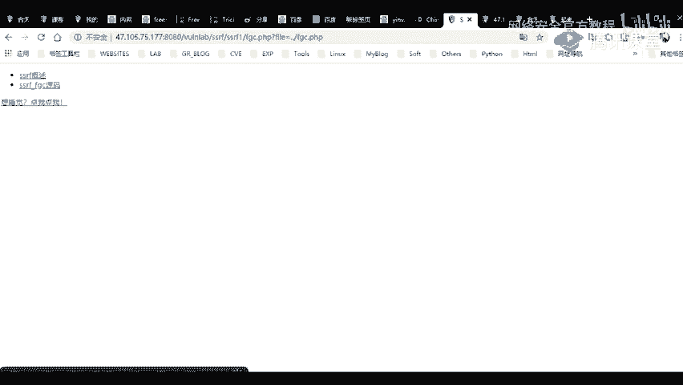

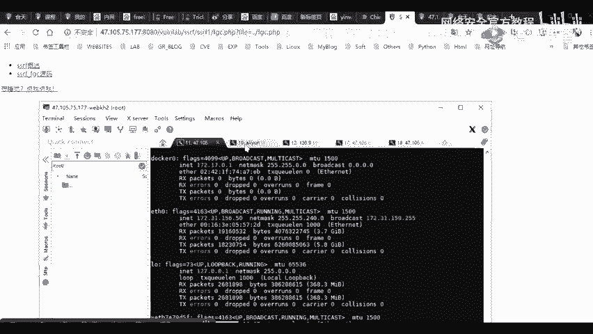

Okay。Okay。看。Good。Okay。Ca。

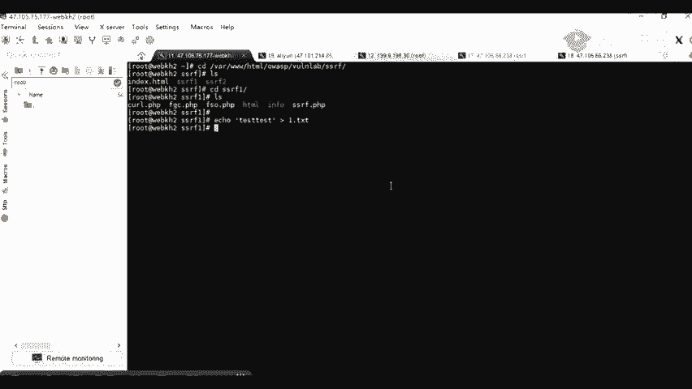

我这里的话直接去进行一个文件的一个读取。哦，不是。That's fine。可以看到我在这里的话，我直接啊就是说在这里我直接传一个文件名，对吧？就说读取当前这一个目录下面的这一个一点text文件，对吧？

而，不是一样的，可以进行一个输出吗？对吧？然后他这里的话一定要大家一定要注意的一点，就是我在这里的话，我是啊。这样子的一个tax的一个后缀。就是说他这里呃读取的一个文件，是这种texax的这种文本文件。

然后对于这种文件的话，它会直接把里面的一个内容进行一个输出，对吧？但是的话对于这种。啊。我这里换一个文件。C1L点片区。对于这种PP的一个文件去进行一个呃直接的去进行一个获取的话，可以看到。

在这里它返回了这样子一个内容，对吧？这个内容的话，其实就是我们前面直接去访问这样子的1个CR点PHP的一个内容，对吧？它其实没有返回说没有说返回这个PHP文件里面的一个啊代码，而是返回了。

而是返回了就是啊把这一个PHP文件作为做了一个解析之后，它的一个内容给返回出来了。所以说我们想要获取到你指定的这一个文件，它的一个啊云代码的话。

你就需要去使用到这样子的1个PHP的一个伪协议来去进行一个读取。而它读取的话就是把它的一个指定的一个文件里面的一个呃内容做一个bs64的一个编码。然后的话再进行一个输出。这样子的话。

他就不会说把里面的这1个PHP文件里面的一个内容啊当成一个呃就是进行一个解析，然后进行一个输出。Yeah。🤧Yeah。这的话是一个firear gett contains。以及这个片区委协议的一个介绍。

🤧K。然后第三个的话就是这个F so open。而，这个F说高本的话，它的一个意思就是打开一个网络连接或者是一个这种unux的一个套接字连接。它其实就是一个打开一个这种s的一的一个连接。

然后它的一个函这个函数的话，它就是它呃能够对指定的这种IP地址去进行一个访问以及请求呃，IP还有域名。然后的话把他会把请求到的这样这样的一个内容，然后进行一个返回输出。看一下。🤧。啊。

可以看到我在这里的话呃就。😊，访问之后的话，它的一个链接是访问的这个3W点百度点com对吧？然后它返回了这样子的一个就是啊返回了这样子的一个呃百度点com的一个首页这样子的一个页面。

就说他把这一个百度点com的这一个首页的一个内容进行了一个请求。请求之后的话，获取获取之啊，请求获取下来之后的话。输出到了这样子的一个页面。然后在这里的话可以看到这里的话是他的啊一个请求的一些啊。内容。

就说他的一个请求的一个响应。然后的话。这一个函数的话，还有就是对呃指店的1个IP地址。的一个内容去进行一个访问。你看到这里的话，它呃就是它的一个内容的话是在这里。

还有就是他的一些ban的信息都给你进行了一个返回，这就是这一个函数。

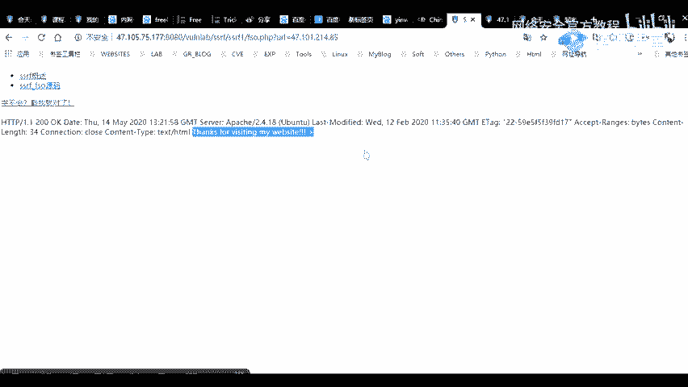

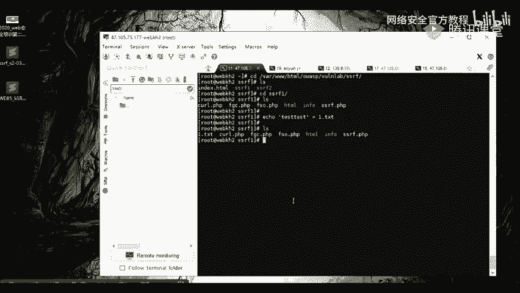

然后注意的话，这里是就是说s的话，它是只针对于说是这种IP地址。进行一个访问请求。你比你如果是说像这种一个啊就是UL的话。期点。这种U地址的话，它是无法去进行一个呃解析以及处理的。

他只只能是对这种呃就是啊我们的一个域名。

以及我们的1个IP地址。才能够去进行一个请求。

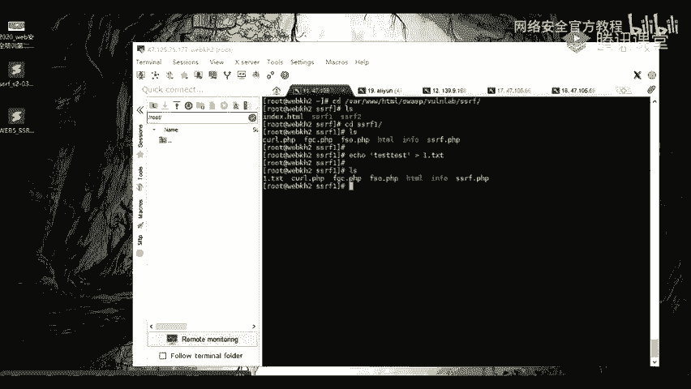

🤧。然后第四个的话就是呃前面其实我们了解就是我们通过前面的这一些例子的话，有发现一点，就是说他的这种呃他的这种请求访问之后的话，他都会有这样子的一个回响，对吧？

就是说比如说我这里请求这样子的指定的一个内容，它会呃回醒出这样子的一个资源的一个内容。对吧然的话有存在这样子的一些情况，就是说你访问请求之后的一个资源，它不会说在这样子的一个页面上面去进行一个显示。

但是的话它实际是啊实际的话是有对这样子的一个链接去进行一个请求的。是的话，它没有返回到我们的一个前端。然后在这里的话。就呃要说到这个SSF它的一个呃没有回显的这种呃盲SSF。而针对这种MSle的话。

我们怎么去对它进行一个测试呢？就是说前面我们。我们进行一个测试的话，比如说我们通过啊访问指定的这种啊一个外部的一个。🤧访问外部的一个。这种链接对吧？访问外部的这种链接，然后的话。

我们怎么知道他访问成功呢？因为他这里的话有就是有回写，对吧？就显示了就是啊给定了这一个链接的一个内容，我们才知道他啊。行就是请求成功了，就是说有对指店的这一个呃链接去进行一个请求。

如果说他没有这样子的一个返回的话，那么我们怎么去进行一个判断呢？在这里的话介绍两种啊，介绍两个方法。第一个的话就是HTP的一个带外通道。这里要介绍的话，就是这个BP的这个co back。诶。

🤧cocopo这一个client就是在这里这里有1个BP。然后这个。那这样的话，他这1个BP的话，它有提供有这样子的一个服务。就是说我点在你的一个copy to。就复制到我们的一个紧贴板。

呃，然后我们粘贴出来看一下。

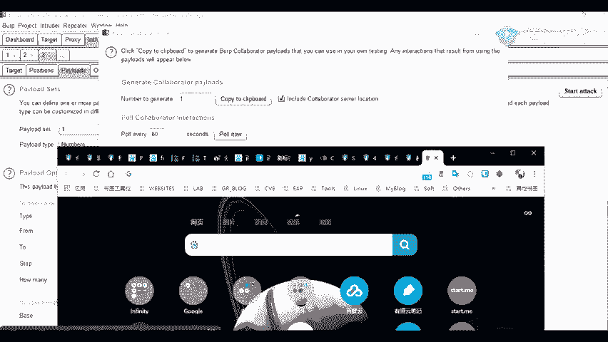

Yeah。粘贴出来之后的话，它其实就是像这样子的一个呃链接一个地址。啊这个地址的话，它其实呃是BP官方的一个这样子的一个地址。🤧。诶。😊，🤧啊，这这个的话它有什么作用呢？我们在这里我们去进行一个访问。

访问之后的话，它会有有给了这样子的一个支符串，对吧？这里我们不管。

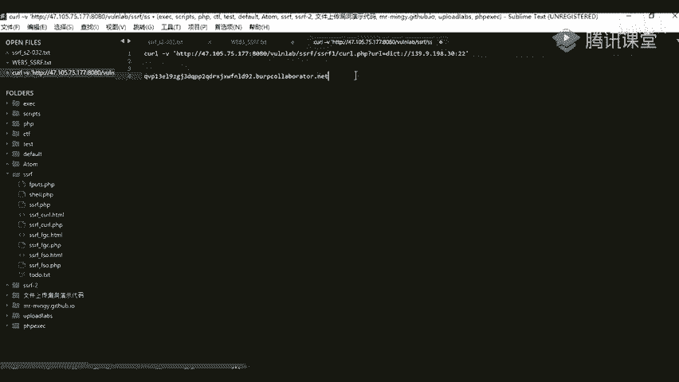

う。Okay。然，我们可以看到。就是过了一会儿之后的话，他在这里的话有。显示这样子的一些内容。那这里的一些内容的话，其实就是我在这里访问之后。所做的一些请求它的一个处理。

首先我们可以看到第一个第一个的话是1个DS的一个请求，对吧？他的这样的一个意思的话，就是说我们在这里访问对吧？我们这里访问这个链接之后的话，它首先进行了1个DNS的一个解析。

就就是说把我们这里指定的这个域名进了一个进行了1个DNS的解析，对吧？解析之后的话啊，就是说它解析成1个IP地址，就是说从我们的1个DNS服务器上面啊解析为一个对应的1个IP地址，然的话。

然后的话再去请求这样子的一个呃IP地址。然后我们在这里的话是发送了这样子的1个HTP的一个请求，对吧？然后在这里的话都有记录我们这样子的一个请求的一些啊过程。所以说在这里的话。

我们同样的可以就是说在进行1个SS3伏，它没有回显的时候，我们可以利用它的这样子一个功能来去对它进行一个判断。就是说判断它是否有对我们这里给定的这1个UR地址。啊，进行了一个请求以及解析。对吧。啊。

第二个的话就是这个DSlog。电视log的话，就是这里网上有这样子的一一些平台。啊其实同样的就是利用的这样子的一个。啊，DS的一个解析。就是说呃。大家要呃了解的一个就是说。我们。

访问我们这里正常的去访问这样子的一个网站，对吧？比如说访问一个百度。访问这样子的一个百度。他是这样子，他有这样子的一个过程。就是说你在这里浏览器访问了这个百度之后的话。

它是会首先在你本机在你本机的1个DNS，也就是那1个hos那1个hos文件里面。啊，你电脑电脑里面上都有这样子的一个host文件嘛，对吧？就是说他会在这一个文件里面去查找你这里的一个域名。

它是否有这样子的1个IP的一个记录。如果有的话，它就会呃解析到它会去访问到指定的这样子的1个IP地址。然后的话把指定的1个IP地址的一个内容获取获取下来，对吧？如果说没有的话。

他就会去像啊公共的这种DNS的一个服务器去进行一个解析。因为DNS服务器上面的话，它就是记录的啊域名以及IP的一个对应的一个表嘛，对吧？它其实就是这样子的一个呃关系啊关系表就是对应的一个表。

就域名跟IP的一个对应表。那我们再去公共的这种DNS，就是这个DNS服务器的这种表当中去查找到指定的1个IP地址。然后然后的话再去请求这1个IP地址。Okay。Yeah。然后他就是有这样子的过程。

然后在这里的话，我们。就可以去使用到这样子的1个DNS的1个log。因为我们首先会去。像我们指定的这样子的一个。啊。呃，就是指定的这一个啊域名对吧？做1个DNS的一个解析。对吧这个DNS解析的话。

它就会有这样子的一个记录。

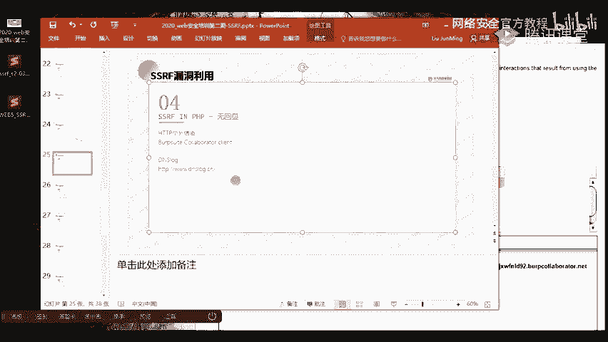

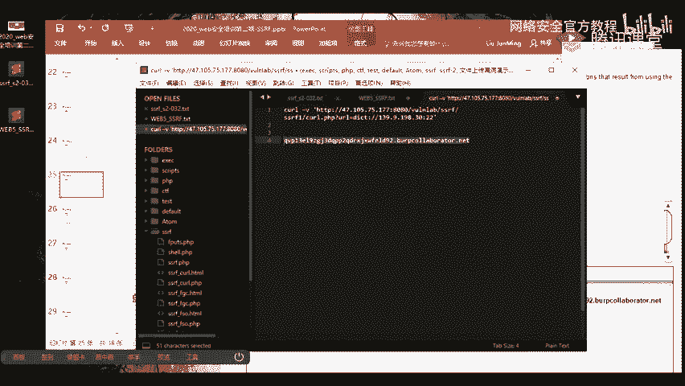

🤧は。所以话我们get一个sdom，就是这样子的一个。啊，玉明。对吧然后的话我们。嗯，对他做一个请求。在这里的话。就那个。

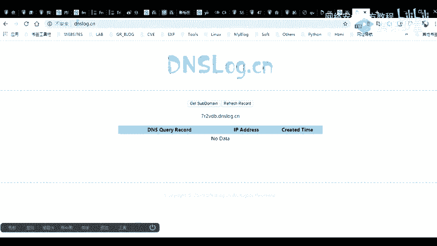

8金的。这里就这里把机的话是有这个无块钱的1个SSF。

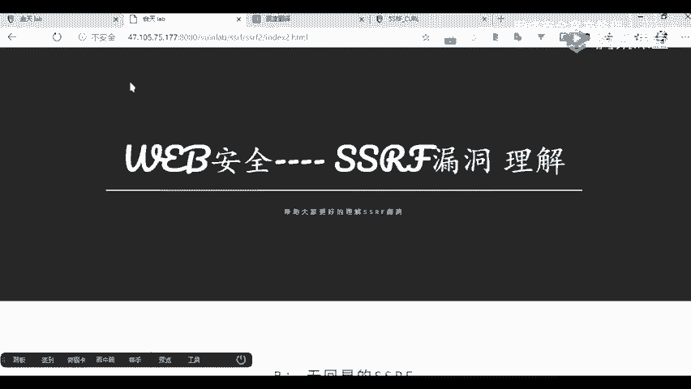

🤧我们在这里的话。😊，可以去。嗯。请求我们这里啊，首先的话先正常的一个来吧，来一个正常的。百度点com对吧？我们。

执行之后的话。啊，我这里忘记改了。我这的话是把代码做了一个。改动。就。让他有了回血。就其实我在这的话就是加了这一个。Ele output就是把我们这里CLEXEC获取到的一个内容的话。

用ele把它输出来。然后我这里把它去掉的话，它就它虽然有请求了这样子的一个啊UL，对吧？然后的话同样的有内容。有内容获取获取了它的一个内容。但是的话。我们没有使用ele去把它输出。

也就是说它没有这样子的一个回醒这样子的一个输出。

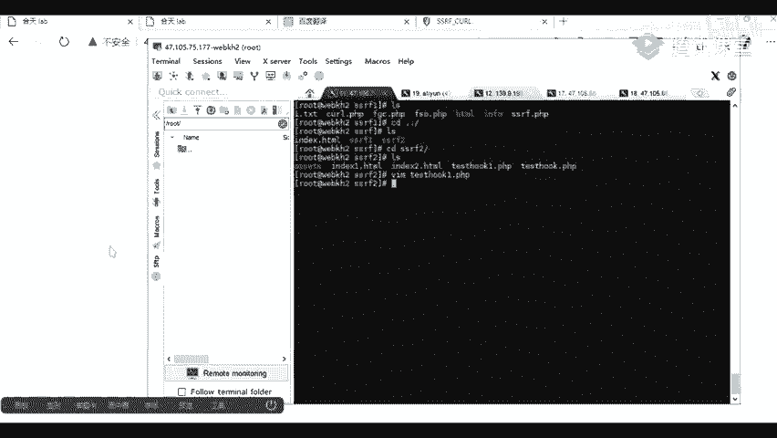

啊，我们再t了一下，可以看到这里的话是已经没有内容了。🤧啊，在这里的话，我们怎么去进行一个判断它是否对我们这里给定的这一个呃地址进行了一个请求以及解析呢？

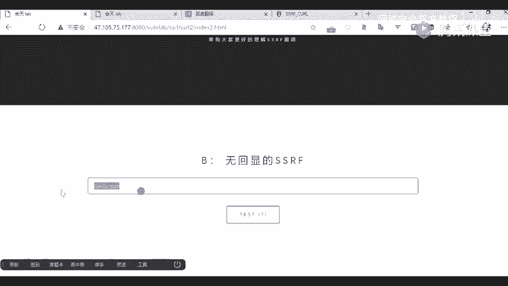

啊，门诊。我们可以使用这一个。电log。我们。你。🤧Okay。然后去进行一个尝试。t使了之后的话，我们回来去看一下，刷新一下。刷新之后的话，可以看到在这的话有了这样子的一些请求的一个记录，对吧？

我们可以在后面再加一点。看。Okay。加一点内容。Goodello。我们去进行一个测试。这置时候的话刷新刷新之后的话可以看到在这里的话就返回了这样子的一个内容。Yeah。啊。

我们可以通过这里来去进行一个判断，判断我们在这里的话给定的这一个呃啊域名这样子的一个地址的话啊，服务端它是对他做了一个正常的一个请求。虽然的话，他这里的话是没有任何的一个内容，就是回旋的。这就是呃。

介绍两种就是如何去测试这种没有回形的这种SSF的一些方法。🤧Yeah。🤧あだ。然，本节课的话呃。这样的话我看了一下时间的话，又稍微有点晚了。这样的话剩下的一个内容的话，我们下节课再讲吧。

剩下的内容的话其实没有多少了。就是对我们的1个SSF它的一些限制，如何去进行一个绕？我们有什么样的一些知识以及方法来去绕过服务端。对这样子的一些啊，就是说对这1个SS3不漏洞。

他请求的这种啊地址啊以及链接，它的一些性质。针对这一些性质，我们可以采用什么样的一些方法去进行一个绕过。这样的话我们下节课再给大家做一个介绍。然后这节课的话就到这里了。呃，就下课之前的话。下课之前的话。

我在这里的话呃就是。布置三个课后作业，就说这三个实验。这三个实验的话，我们下节课会给大家去进行一个讲解。🤧哼。然后这里的话呃。大家先去做一下。然后等会的话，我会把这一个三个实验的话链接发到群里吧。

然后最后的话。呃，大家有什么？啊，问题吗？这这节课的话呃主要的话就是介绍了一些就是理论吧，就基础的一些理论吧。Okay。然后下节课的话下节课的话主要的话就是操作，就是我们如何利用这样子的1个SSF漏洞。

然后的话呃利用我们的这样子的一个一些UI的一些协议来去进行一个呃内网服务的一些攻击利用。比如说readius，还有呃strike to等等。这样子的一些漏洞。大家有疑问吗？就是说对于课程的一个内容的。

疑问。🤧K。呃，这些课话主要的话就是介绍了SSF漏洞。就是他是什么样子。对吧然后的话这个漏洞的话，它有什么样的一些场景？就是说我们可以通过什么样的一些功能功能点，就去查找什么样的一个功能。

能够查找到这样子的个SSF漏洞。对啊。🤧嗯。😊，然后的话就是呃在SSF漏洞它的一个利用以及测试的时候，我们会去使用到的这样子的子的几个协议。就fire协议勾 for协议。其实呃还有的话。

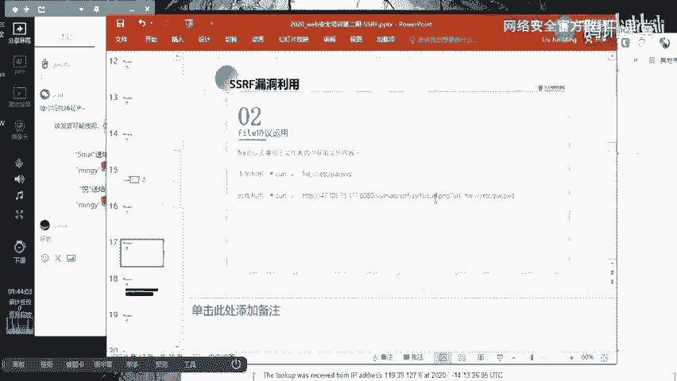

就说大家如果发现了有这样子的1个SS漏洞的话，对吧？首先第一个的话就是你去测试一下。

他的。他支持的这种122的这种协议。

比如比如说在这里，如果说他是。

我操。如果说他是使用的这种UEXEC的这样种函数，对吧？去进行一个请求的那么你可以去尝试它是否有支持这样子的一些U饵的协议。然后的话如果说他支持这样子的一些幼儿的协议的话。

那么我们就可以去尝试使用这样子的一些协议。对指定的这样子的一些服务去进行一个攻击利用。

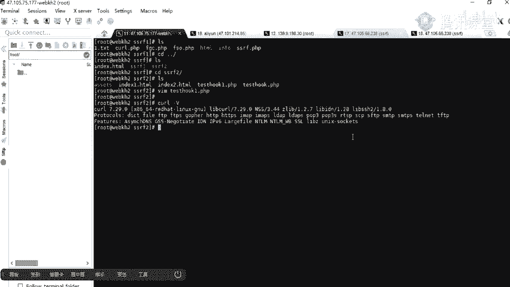

嗯。然我看大家都没有什么问题啊。😡，那么我们本节课的话就到这里结束了。

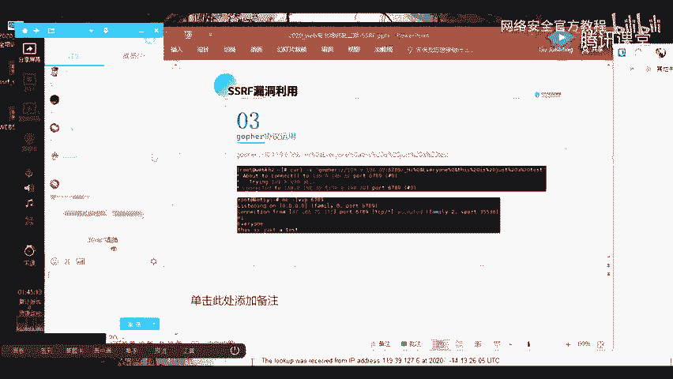

我们下节课再见。