# B站最全网络安全教程，整整1300集，全程干货无废话，别再盲目自学了，看完学不会我退出网安圈！（web安全｜渗透测试｜内网渗透｜CTF） - P25：23.SSRF利用与修改.mp4 - 网络安全官方教程 - BV15u4y137cQ

🎼1984年。🎼窗子还没收割完。🎼女儿躺在我怀里。🎼谁的那？🎼今晚的露天，电影没时现。🎼还是开。🎼妻子提醒我。🎼手手放起。🎼明天为。🎼不指凌之间。🎼一切。🎼眼前。🎼孩子哭了一整天。🎼遥之夭。

🎼蓝色的地开。🎼的声音。🎼从往昔。🎼一。🎼在石道面上。🎼き？🎼自己。🎼要去。🎼只是我。🎼不知日就一。🎼就是他的青春留下。🎼丢下来的。🎼几十年后。🎼我看觉泪流。🎼不是。🎼可我的父亲已经。🎼像一个你。

🎼Yeah。🎼一小首思念。🎼庄家早已。🎼一首割完。🎼我的老母亲失眠。🎼人间。🎼又差什么？🎼也好近来。🎼笑脸。🎼可是他最近。🎼受累一。🎼想一想未来。🎼造成了一醉。🎼就之前。🎼那时的鱼儿一经会灭。😊。

🎼今夜。🎼有个爱。🎼人要去看。🎼回家。🎼可笑的这些我却不。🎼一眼。🎼只是。🎼我昔日。🎼只是太。🎼留下。🎼我不。🎼，🎼我的呼心已经。😊，🎼我一直。就保持。🎼曙光之。🎼生命的故事。😔，🎼就是。Yeah。

辈子。🎼う。🎼，🎼变成自典。🎼爱是溃于却来一路面。🎼点燃最后。🎼反正习惯了还。😔，🎼需要时间，胜利却胜不过。😔。

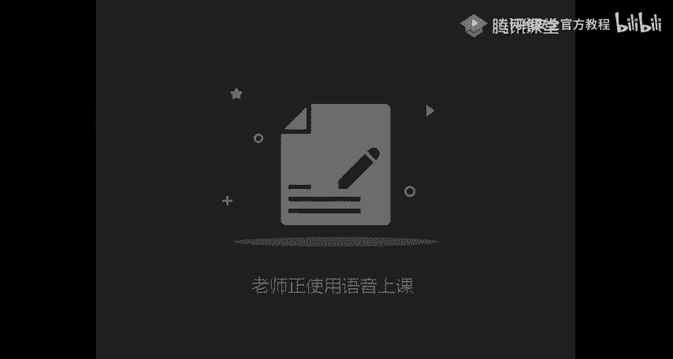

🎼玩笑开阔了一点。😔，🎼剩下半生一切。😔，🎼变成乐趣还是最后一点。😔，🎼不知只为眼前的。😔，🎼口气。🎼再给我思念。😔，🎼一定比现在更加优秀。😔，🎼一定不。🎼在你此刻。🎼别了你眼旁观的敷衍。🎼请给我三。

🎼一定比现在更加值。🎼会再怀。🎼何是。🎼，🎼，🎼Yeah。🎼Yeah。🎼无法呈现。🎼曾经骄傲的那些瞬间。😔，🎼没了坚定的双眼。😔，🎼慢慢撕开了城圈。

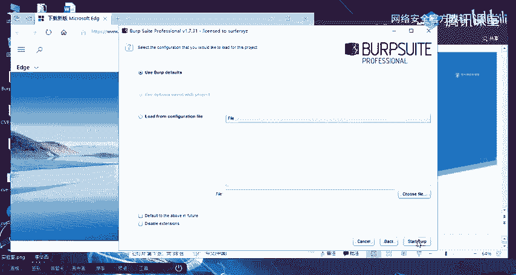

🎼，🎼害怕改变。🎼不敢跳出自己画的圈。🎼少轻轻的。🎼很前。🎼爱心还存在。🎼没有时间再。🎼自己是。🎼用力去打破现实的。🎼这些。🎼再眼。🎼一定比现在更加优秀益。😊，🎼一定不会再一次。😊。

🎼别冷冷眼旁遁的敷衍。🎼给我在。🎼比现在更加坚。😊，いいで？🎼不会在患得患失中。😊，🎼再给我三年。🎼一定比现在更加珍惜一点。😔，🎼一定不会冷落。你爱我是。😔，🎼每去心。🎼光在。🎼你现在的。🎼的去。

🎼在家。🎼勇着。🎼Yeah。🎼闭上双眼。🎼醒来又会是新的一天。😔，🎼哪怕是万丈深渊。🎼也要给自己想念。😔，Yeah。🎼うん。Yeah。🎼哈哈。う。大家晚上好。然后同样的先测试一下我这个麦克风的一个声音。

大家应该都能听得清楚吧。都能都能听清楚是吧？好的，那么我们呃开始我们今天的一个课程内容。呃，在讲我们今天课程内容之前的话，我们先呃。啊，一起来回顾一下我们上节课的一个内容。

我们上节课的话是介绍了SSF这个漏洞，它的一个形成的一个原因，以及介绍了。它的一个作用以及什么是1个SSF就是这个服务端的一个请求伪造。大家要记住，它是一个呃能够去穿越网络防火墙的一个通行证。

我们可以利用这样子的一个一个SSF的一个漏洞来去呃攻击我们原本是无法去访问到的这种内网的一个服务。像包括readdius啊，我们这节课会去讲到的，以及还有其他的一些呃web的一些应用。

这些应用的话啊通常会存在于一个内网当中。因为在内网当中的话，我们是无法去直接的去访问到它的一个服务的对吧？因，包括有防火墙，以及有NAT的这种网络地址转换，我们是无法去直接访问的。

然的话如果他的这种呃一个企业或者说一个公司，他的这种外部的这种网站服务器。对吧或者说他的一些啊。提供的这种web应用的一些功能点，它存在这样子的1个SSF漏洞。

那么我们就可以利用它这样子的一个漏洞来去攻击它的呃一些内网。的一些服务。那这个SSF5它漏洞它形成的原因就是它没有对我们的这种啊就是服务端提供的从其他服务器应用获取数据的一个功能。

没有对它做一个过滤以及限制。然的话SSF5它的危害的话就是呃我们可以通过它去攻击内网的服务嘛。然后的话通过一些要要的一些协议来去探测内网的一些信息，包括它的内网服务的一些端口啊。

以及它的一些版本信息等等。然的话能够呃就是对针对于在内网当中的这样的一些含有漏洞的这种服务，进行一个攻击，来获取内网服务的一个web share来直接进入它的一个内网去进行一个攻击利用。

然后第三个的话就是通过一些ER的一些协议，能够去读取内部的一些资源。然后的话执行相应的一些攻击动作。比如说这节课会去讲到的一个。啊。

攻击内网的一个未授权的一个readdius以及攻击内网的这种str这种啊能够去进行一个远程命令执行的这种漏洞。う。然后的话就是介绍了如何去进行1个SS5漏洞的一个寻找。

也就是说这种漏洞这个SS漏洞它存在的一些场景。就是通过一些web的一些功能点。就是这些web功能点的话，有比如说一个通过这种UI的地址的一个分享啊，网页的一个内容，对吧？

他会去请求去请求远程的这种啊服务器的一些内容。如果说他没有对这里的这个。去其他服务器获取资源的这种呃功能去进行一个限制的话，那么我们可以去尝试啊请求内网的这样的一些资源。那他就是这种在线翻译的这种站点。

当样的话呃，像一般的这种比较大的这种呃翻译。比如说百度有道这种翻译的话，它是没有说存在这样子的一个ro洞。它性质的话是啊十分的严格的。然后的话就是通过要地址加载下载图片。这个的话是我们经常会去啊看到的。

也也是会经常去碰到的这样的一些功能点。这的话我们可以针对的针对性的去对它做一个测试。那么就是啊一些我们去查找这样子的一个漏洞的时候，我们可以通过这样的一个UL它的一些关键字。因为我们再去查看请求包当中。

对吧？它会有很多的这样的一些参数。这参数的话，我们可以就是啊有针对性的去查找这样子的一些关键字。这些关键字的话，它它的一个功能，就是去获取远去请求远程服务器的这种资源的一个功能点，对吧？

那么它就可能会存在这样子的1个SSF的一个漏洞。那最个后的话就是一个总结。总结的话其实就两点。就是能够对外发起网络请求的一个地方。然后第二个的话就是从远程服务器去请求资源。

然后然后的话我们有介绍了就是SS5漏洞它的一个利用。呃利用的话主要的话就是我们碰到这样子的一个漏洞的时候，我们通过什么样子的一些这样的一些协议来去进行一个测试。

比如说第一个就是这个dicctordic的话，我们可以用用它来去探测。啊。去探测目标服务器上的一个端口，以及它。它的一个端口的一个存活，以及它端口上面所运行的一个服务的一个版本等等的这样的一些信息。🤧。

然后第二个的话就是这一个fire尔协议。fi尔协议的话主要就是用于文件系统的一个啊就是获取文件系统当中文件的一个内容。🤧K。然，第三个就是这个go for协议。

goer协议也是我们常去使用到去进行一个啊攻击内网服务，就是攻击内网当中含有漏洞的这种服务啊，用用它来去发送我们的这样子的一个攻击的一个payload来去啊攻击内网服务的一些漏洞。

然后接下来的话有介绍就是说在SS3啊，不在THP当中的话，有这样子的一些函数。能够导致这样子的1个SSF漏洞。就说我们再进行一些这样子的一个呃功能点的一个测试，或者说是一个白盒的一个测试。

对它的一个代码去进行一个审计的话，我们啊可以着重的去关注这样子的一些函数。嗯第一个的话就是这个CLXEC它的这个函数，它这个功能的话就是去啊。请求我们传我们传过去的1个UL。

然后的话把这一个呃UL的一个请求的一个内容，把它给返回。返回到我们的一个前端页面。然后的话我们可以啊针对这样子的一个函数的话，能够去使用这种dicter，还有fi协议去进行一个文件的一个读取。

还有端口的一个探测。然后的话就是这个fi协议的话，呃，就是注意一下，就是在windows已经定时系统里面的话，就是我们呃都会有的这样子的两个文，就两个文件。

我们可以用这样这样子的就是存在的两个文件来去进行一个测试。如果说你能够去读取到这样子的两个文件内容的话，那么说明你能够去使用这样子的一个fi协议。来去读取啊系统当中的一些敏感的一些文件。

这个的话就是这个呃forget content这个函数，这个函数的话主要就是用于文件的一个内容读取。就说它的一个功这个函数，它的一个功能的话就是用于文件的一个读取。

它也是呃同样的可以去进行一个就是对我们啊提供的这种URL去进行一个请求，把它请求的一个内容返回给我们的一个页面。然的话这里的这一个函数的话，它的一个。

特别的一个地方的话就是我们可以使用这样子的1个PHP伪协议来去读取这一个网站里面的啊这一个网站里面的一个云代码。🤧K。然后这这这这PP伪协议的话，其实在我们的这种CTF题目当中。

这种外题目当中的话是很常见的。然的话还有就是像SSF这种啊攻击radius啊这种啊这种形式的一些题目也是存在的。好，第三个话就是这个Fs建立这种socks的一个网络连接。

主要的话是去对我们给给出来的这种IP以及域名去进行一个请求。然后的话前面的话主要就是呃介绍了就是说呃常见的这种有回显的。就说它有呃我们可以通过这样子的一些协议来去啊去进行一个测试。

测试它是否支持这样的一个协议。主要的话就是通过查看页面上面啊，它使用这样的一个协议。比如说读取文件的一个内容，对吧？然后的话它会在页面上有这样子的一个显示。

这个的话就是有回显的一个就是basical的1个SSF。然后还有的话一种情况的话，就是说服务端它不会对你给定的这个UR啊，它请求之后的一个内容给你呈现到一个前端的一个页面。

所以的话它是啊我们无法去通过啊在前端的一个页面上面去查找反馈的一个内容来去印证是否存在这样的这样子的一个漏洞的。所以说我们可以通过这样子的两种方法。第一个的话就是这种HTP的一个带外通道。

主要的话就是BP里面的话，它有这样子的一个自带的一个功能。那样的话你也可以使用你自己的一个公网的一个服务器，对吧？你可以通过今天你的一个官网服务器的一个呃web日志来去。

查看他是否有就是请求就是远程去请求我们的服务器上面的一个资源。然后的话就是这种DNSlog。这样子的一个平台，就通过呃DS的一个日志来去进行一个判断。啊，下面的话就是呃我们上节课。

没有去啊没有来得及讲的一个内容。进这里的话我们继续。嗯，首先的话就是这个SSF漏洞，它利用的一个性质绕果。就说我们如果查找到这样子的1个SSF漏洞，对吧？它不可能是说呃就是。他可能会对我们访问的。

或者说给定的这种UL有相应的一些性制。然的话这一些性制的话，我们可以通过这样子的一些方法来去进行一个绕过。首先这一个的话就是。诶。我们看一下这里的一个例子。

这个例子的话我们呃可以看到在这里的话是呃百度点com。后面的话我们接了一个ar符号。方后面的话接接了我们的这样子的一个内网的1个IP对吧？或者说其他的1个IP然后其实这样子的1个U2的话。

你实际去进行一个访问的话，它其实是啊。啊，实际上去解析到的1个IP地址的话是这一个。是我们在ar符号后面所接的这样子的1个IP。我们可以。在浏览器上面去进一个尝试。对吧我在这里是啊。

我们和天lob点com对吧？我在后面接一个ar方，后面的话接我的内网的1个IP比如说292点168。1点。我。哦，回车对吧？回车之后的话，你你可以发现它实际解析到的。

就是说访问到了这样子的1个IP的话是。我们的这一个内网的这1个192。168。1。52的这样的1个IP对吧？就之前的话是这样子的一个网站。然的话我们可以通过这样子。啊。

就是他对我们的这样子的1个UL对吧？有这样子的一个就是啊域名的这种限制。然后你可能他实际的去进行一个。啊，解析的时候，它实际的话是解析到了这样子的一个内网的1个IP。

而不是我们在这里啊可以直接去看到的这样子的一个百度点com的这样子的一个域名。啊，这个的话就是这个IP地址转换禁制。这个的话我们看一下，就比如说我这里的这样子的一个。192。16800。

1这样子的1个IP地址，我们可以把它改写成这样子的一些静字的一个形式。首先比如说一个八键字，八键字字形式的话，就是像这样子。好不阿笑。还有的话就是呃16键子。用镜子的话是以这样子的1个0X结尾啊。

不开头的这样子的一个。制服。😊，啊我们其实。行。那你还不到。嗯。

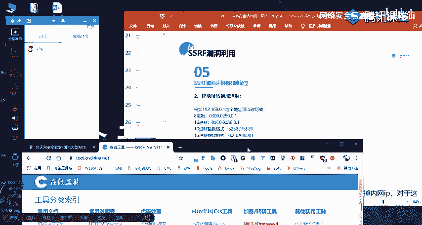

🤧。我们可以用这样子的一个在线的一个工具去进行一个转换。首先比如说我们在这里啊。我们的1个IP的话是一个。这。顶分十件制对吧？比如说我是192。168。点1。52。嗯。

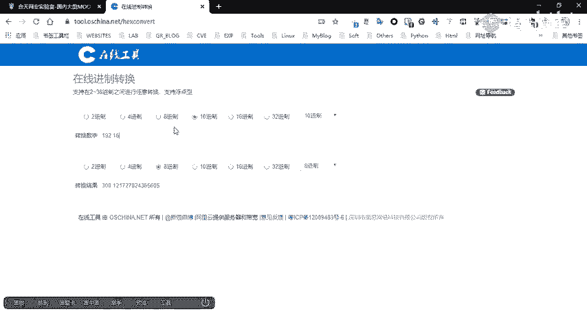

哎，我这里复制不了啊，因为我。😔。

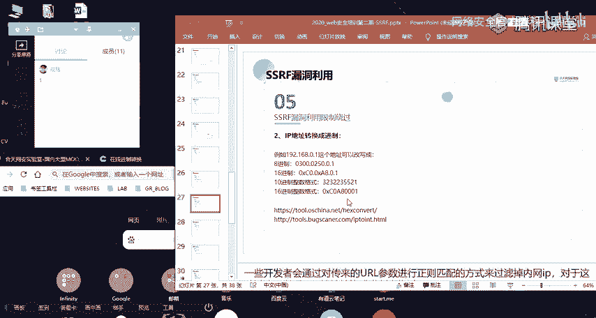

我。之前的那个电脑，我这里是换了个新电脑，就之前的那个电脑，昨天下雨的时候。被拧坏了，您您短路了，然后。用不了了。啊，现在正在修，所以的话。

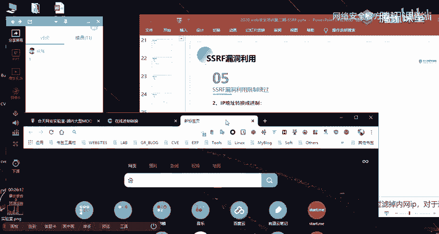

这里的这一个office的话，它没有激活，它用不了复制的一个功能。我等你他话掐一下吧。对。我。🤧啊，我用它的这样子一个功能，能够把我们的这样子的1个IP地址转换成一个就是数字，就转换成一个镜子。

我们这里转换之后的话，是这样子。然后他你看着这样子的话是一个字符范，对吧？对吧就是一个一个平平无奇的一个字符啊，不一个数字组成的一个啊，就一串数字，对吧？但是的话我们在这里唉可以看到我在这里的话。

我输入到浏览器当中，对吧？那这里的话，因为这里的话有记录，它直接的话就解析成为了这样子的一个我这里的一个内网的1个IP我这里的话重新换一个吧。What哪0。然我进行，然后我回车。可以看到我在这里的话。

呃，我去把它当成一个就是1个IP地址去进行一个访问，对吧？当成1个12去访问。我这里访问之后的话，可以看到它就是会去。啊，自动的去解析为我们的这样子的一个顶分实进制的这这样子的1个IP地址。

然后的话我们可以通过这样子的一个方式来去就是绕过。啊，绕过服务端，他对我们的这种IP地址的这样子的一个性制。对吧我们可以通过这样子的一个呃静制的一个形式来去呃进行一个rogo。嗯。而。

第三个的话就是添加端口，就可能绕过它的一个正则的一个匹配。就是说我们呃服务端如果说它是采用的这种正则匹配的一个方式来去过滤我们所传递的这样子的1个UL的话，我们可以啊。

有可能就是说通过添加这样子的一个啊端口。就说比如说添加一个80端口来去绕过它的一个正则的一个匹配。啊，这个的话是一呃是那个就是屋云上面的一个按钮。

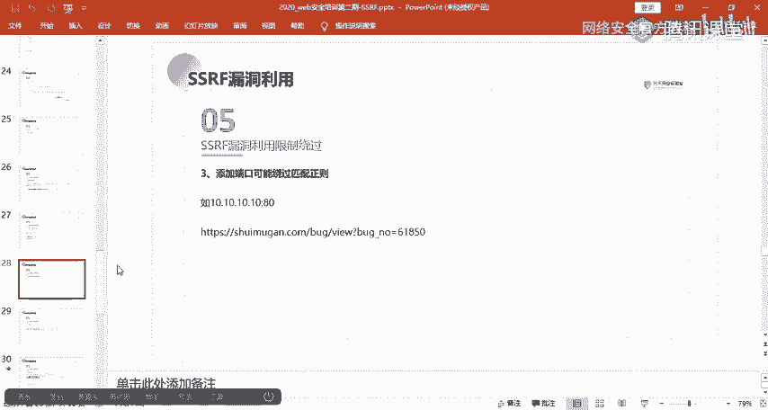

呃，就大家大家呃有知道婺源吗？应该都听过吧。然后的话就是呃因为物源的话，现在是呃网站关了嘛，就是。

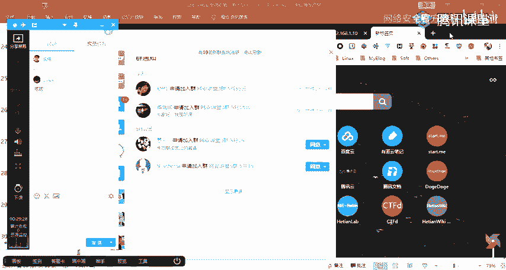

啊，我们有这样子的一些网站，就是呃婺源的那些网站的话，里面有很多的以前的那些呃大佬，他们呃挖掘漏洞的这样子的一些详细的一个过程。然后的话呃，我们可以通过这样子的一些网站。

就是说它有啊婺源的这种历史的一个漏洞。就别人搭的一这样子的一个网站，我们其实可以在这里面的话。呃，能够去学习到，就是说因为现在的话这个网络安全的就是网络安全法的这种性质，就有很多的这样子的一些啊内容。

或者说就是漏洞的一些细节内容的话，是不能不能去公开的披漏的。对吧所以的话呃其实有很多的这种就是去呃去直接去学习的这种知识的话啊，你可能自己的话。比较难的去探到。所以的话我们其实可以去查看查找。

就是以前的他们的这种。啊，漏洞利用的一些思路。对吧他这里的话呃有写的很详细，就就是我们就提交的，它其实就是一个提交的一个那个漏洞报告嘛，对吧？就是你发现这个漏洞的话，它的啊一个过程。

这边的话我们可以就查找我们想要去了解的这种。比如说CSSF对吧？啊，像这种。呃，他里面还有。这种脚本对吧？这种探测指定端口的这种脚本，我们用。可以用这样子的一个脚本去探测呃。

用这个SSF漏洞去探测它的一个内网的1个IP的一个存活，对吧？像6379的话，就是呃readd的一个端口嘛，对吧？能够探测到它内网的这种IP有哪有呃哪些IP有这样子的1个6379。

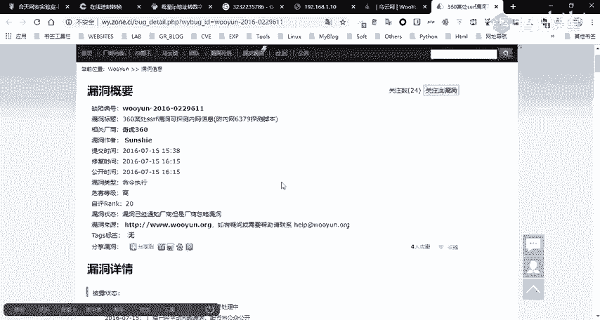

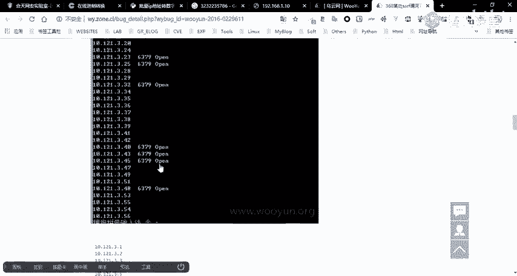

如果说它其中存正好存在这样子的一个未授权，对吧？那么我们可以利用它。利用他的这样子的一个呃。内网的这种服务来对他进行一个攻击。然后的话还有其他的话，我这里的话就呃有很多的这种技术。Good。

大家可以去学习一下呃大佬的这这种知识。嗯。然后第四个的话就是这个呃利用这个XIP点IO这样子的一个呃。这样子的一个就是域名，这个域名的话是呃。他它的一个特点的话就是呃这个是别人给呃。

就是别人做的这样子的一个服务。这个服务的话就是呃我们访问这一个网站的一个子域名的时候，比如说我们啊。访问的是这样子的1个192。168。0。1，然后的话点XIP点IO对吧？这样子的一个子域名啊。

我们访问这样子的一个子域名的话，它会自动的去重定向到我们的这样子的1个IP。我们可以来尝试一下。

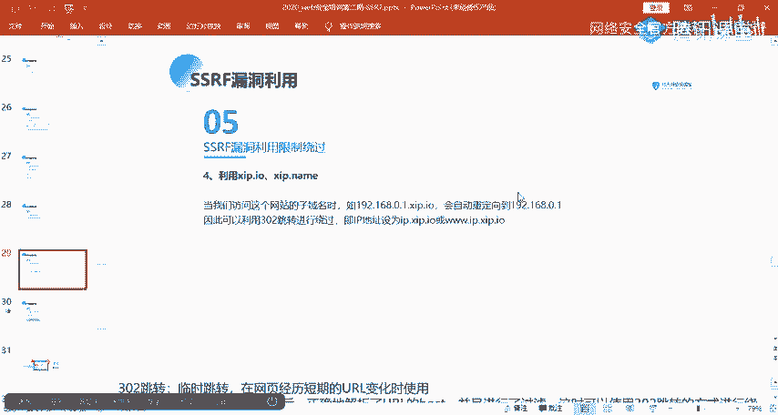

嗯。

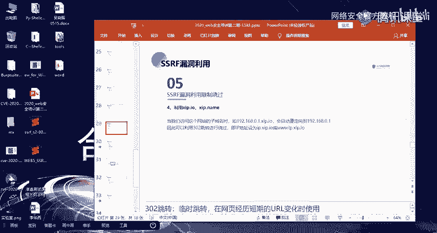

🤧比如说我啊。访问一下我的这个，对吧？访问这一个，我们把把记得这样子的1个IP然后的话我在后面接。我们的1个XIP点IO。这样子的一个啊域名对吧？啊，我们其实在这里的话。

其实可以看到我们这里的话相当于是这一个域名，对吧？这1个XID点IO这一个域名的一个子域。啊，然后的话我们去进行一个访问。访问之后的话。可以看到它虽然这里是访问的是这样子的1个IP对吧？

啊不这样子的一个域名有一个值域。但是我们实际访问到能够去访问到的这样子的一个内容的话，是我们在这里的一个啊给定的这一个域名或者是说IP的这样子的一个内容。

这个呢这个的话就是这一个啊域名的一个作用。然后的话像这个name。也是可以的。这个的话呃这个的话大家可以查一下这个XIP点IO这个。

Com。呃，这个是一个。开源。说别人。

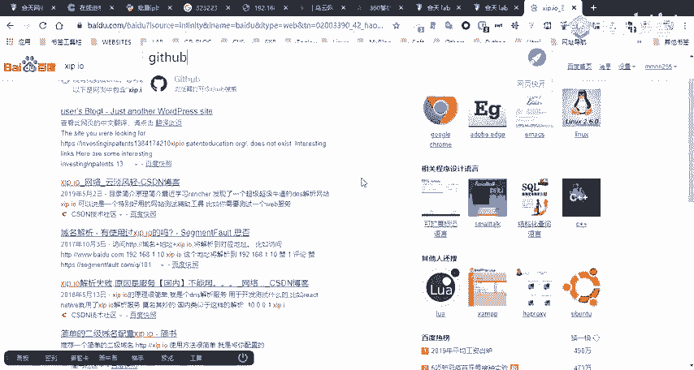

🤧K。

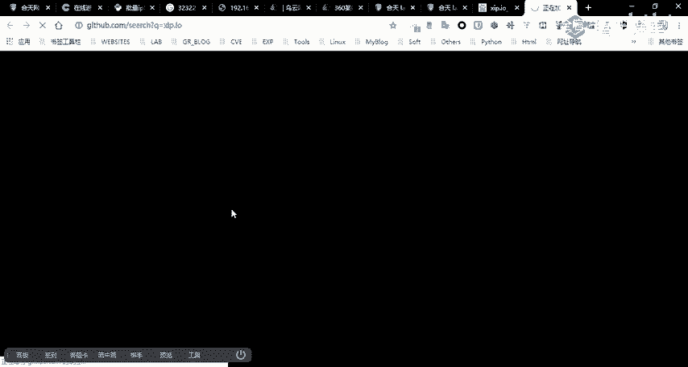

🤧And。😊，是有这样子的一个项目。对它其实是一个这样子的一个DNS的一个重定项。就是说它这一个域名的话，它其实设置好了，就我们在前面啊。加的这样的子的一个子域的话。

它呃它会从定向到我们这里的加的这里的一个内容。🤧。

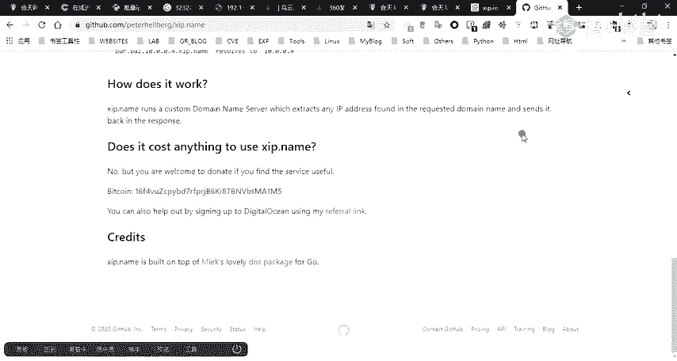

这个的话呃这个是他他的一个网站。

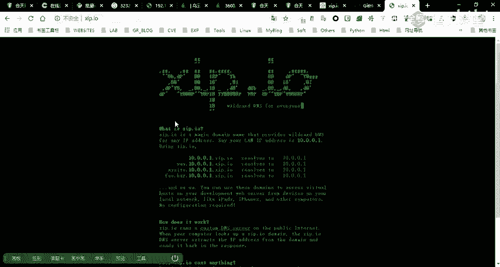

呃，的话一个点name。这样的话我就不一的去看。

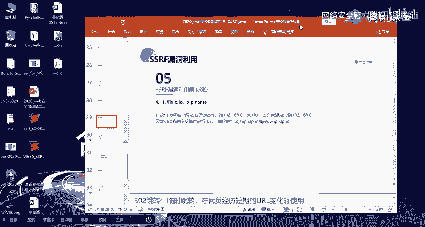

这个话是呃比较有意思的一个东西啊。然后第五个的话就是这一个短地址的一个绕绕过。就是说呃我们有一些IP地址对吧？IP地址，因为我们的1个IP地址，正常的这种IP地址都是啊这种顶分十进制这样子的一个格式。

对吧？我们可以有针对性的去对这种IP地址进行一个过滤。好的话我们可以通过使用这样子的一个短地址。

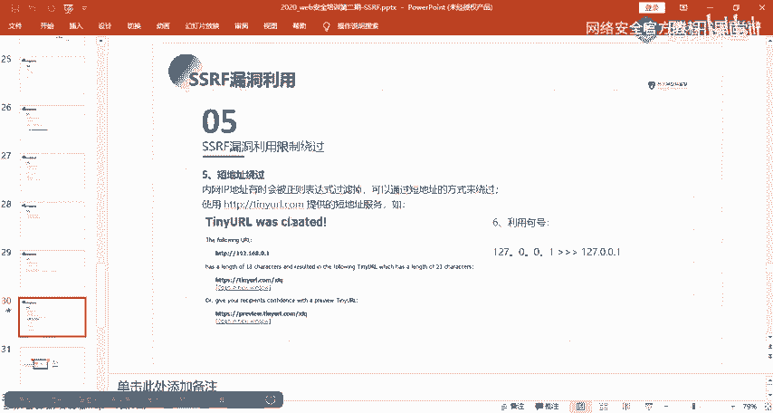

就有这样子的一些啊短地址，就你们应大家应该也有碰到，像比如说有微博啊、百度，还有这样子的一些。

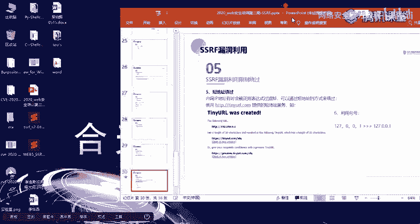

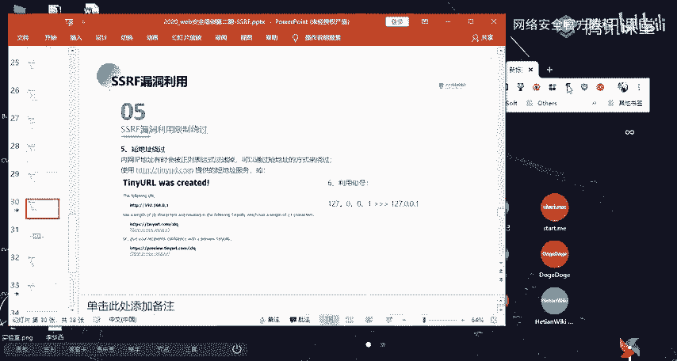

短地址的一些服务。

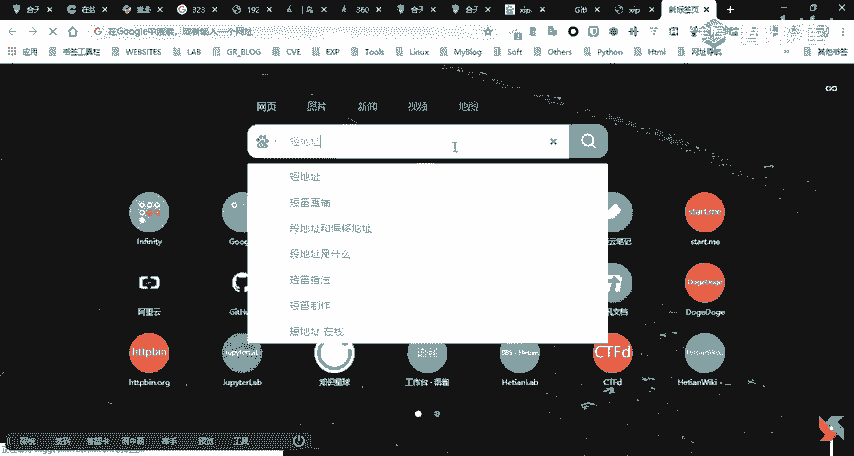

啊，微博像新浪的这种短粒子，对吧？比如说我这里呃。除了1个IP。除了这样子的1个IP，我们可以呃这里的话可以选择这样子的一些短域名。比如说我选择这个DW点Z1点问对吧？我们可以。嗯。链级不准确。

我随便找一个域名吧。换一个。清个。

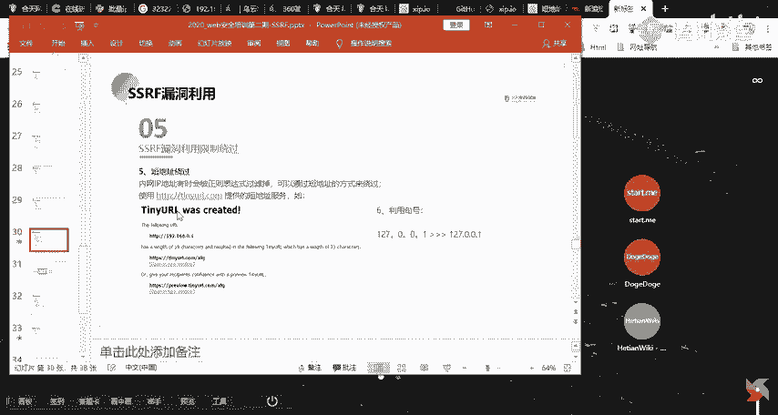

T膜。哦哦。嗯。Yeah。Yeah。Yeah。怎还问不了呢？嗯。哎，我这个。算了就就这个吧。这代理我这个代理没有配了，我刚刚才弄的。对。要翻钱的吗？这个。怎么样？好啦。我们就用这一个服务吧。

就这里的话我们可以看到它这里的话，把我们刚刚的那个呃链接，对吧？把它给缩短成了这样子的一个短地址。然的话我们可以通过这样子的一个短地址来去访问。而去访问到我们的这样子的一个域名。

这样子的一个就是你想要去访问的这样子的一个域名。然后我们可以通就通过这样子的一个方式来去进行一个呃绕过。然后第六个的话就是呃利用这样子的一个句号的一个形式。就我们其实可以就是我们常见的这种IP对吧？

它是通过这样子的一个点点。来去进一个分格的。然后的话我们可以通过利用这样子的一个句号的一个分格的一个形式。

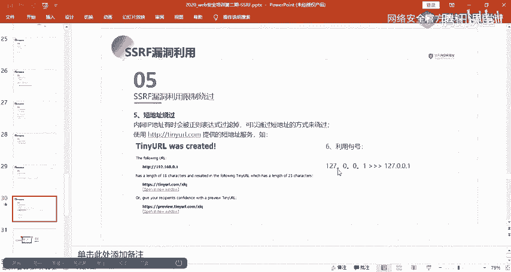

我们可以看一下。就是我这里要访问一个啊。就访问这一个吧，我把它改为一个句号，就把它的一个点。呃，就这样子的一个。

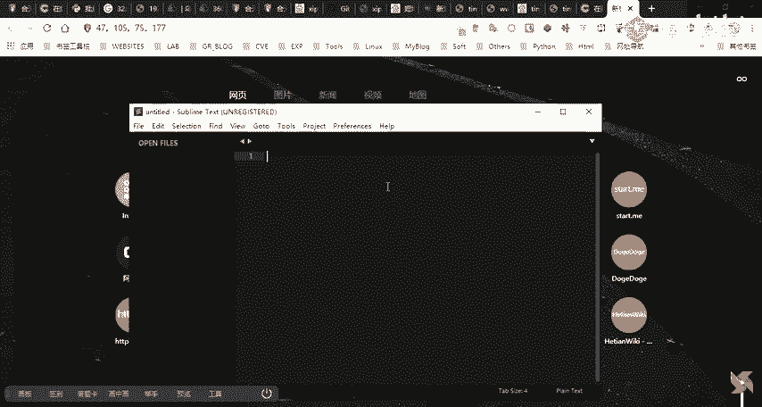

诶。就是这样子的一个形式这样子的1个IP形式。对，然后的话我们直接去访问的话，他其实他同样的会去跳转到这样子的一个呃域名。它其实是跟啊我们这样子的1个IP是。

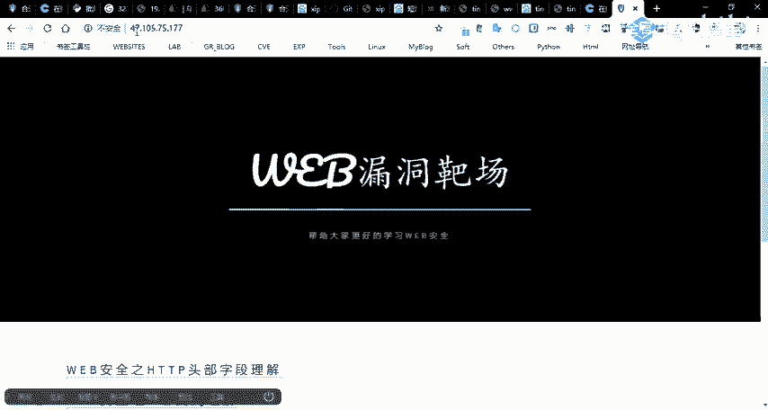

相等的比说127。对。比说我访问这1个127。0。0。0对吧？然我们呃访问之后的话。其实他在嗯。就他在我们浏览器里面去进行一个解析的时候，它实际的话是去访问的是这样子的1个IP对吧？

我们可以通过这样子的一个构造的这种形式来去就是啊。

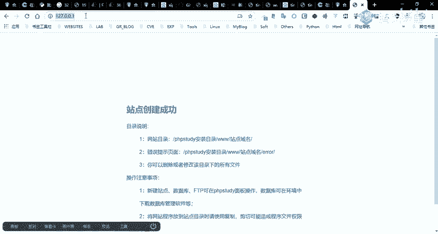

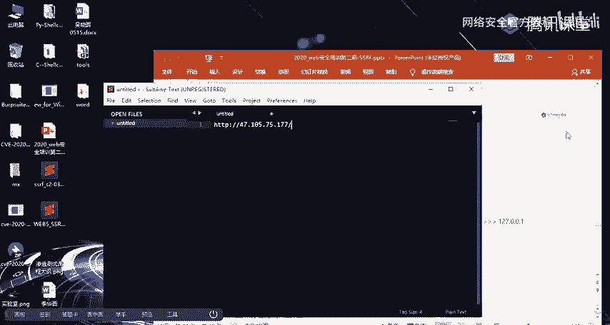

就是去混淆它的这种格式嘛啊，就他如果说他过滤的是啊通过这样子的一个呃点去进行一个分隔，对吧？就像我们之前讲那个呃。🤧讲命令执行的时候，对吧？就是他他。通过这样子的一个用点去进一个分隔。

然后的话给它分隔成为一个呃部分，分为分隔成为四个部分。然后的话一一的去对它做一个判断，来证来证明它是一个啊正常的1个IP。

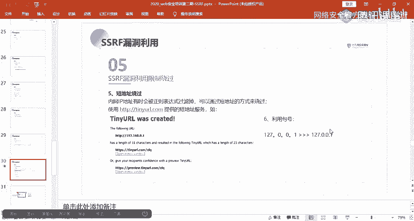

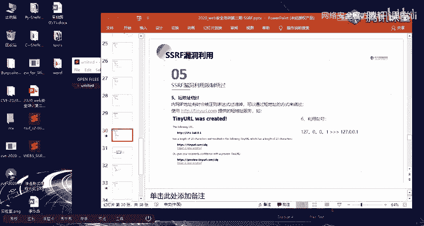

那么的话这里的话我们可以通过这样子的一个构造的这种形式。

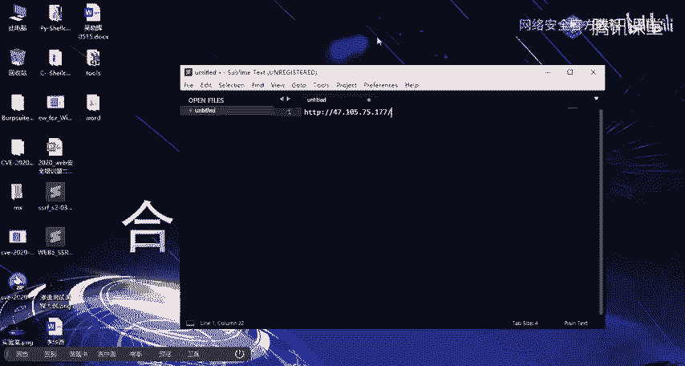

来去进行一个绕过。🤧嗯。不是以上的话就是呃针对这样子的一些就是。好，分享给大家的这样子的一些。😊，包括性制的这样子的一些知识啊，有些的话其实还是比较有意思的。那下面的话我们来了解一下。

就是这个漏洞的一个防御。就防御的话呃。其实我们从前面的话也大基基本都大概的有对他有了一个了解，对吧？首先第一个的话就是过滤它的一个返回信息，对吧？就是我们。

我们不让就是说我们的这样子的一些请求的一个资源，或者说呃这一些不合法的这种请求的话，它的一个返回信息是啊。就是它里面包含有这样子的一些敏感的一些信息，对吧？

那么我们对它的这样这样子的一些访回的一些信息做一个过滤。啊，就不允许他去进行一个返回。就如果包含有这样子的一些敏感信息的话。🤧嗯。😊，啊，第二个他就是统一这样的一个错误信息。就有些呃他的一个请求。

我们可以通过啊就是。如果说你能够去访问到的话，它不会有显示内容。但是的话呃我们可以通过判断，就是说它有这样子的一些状态码，或者说有这样子的一个che或者force。就如果你访问成功了，它就会有一个去。

访问失败了，它会有一个forse。我们其实也可以通过这样子的一个形式。就是说它的一个响应。的一个状态来去判断你的这样的一个请求是否呃成功了。第三个话就是。呃，限制它请缺的一个端口，就我常用的这种端口。

就呃我们常用的就是HP的话就是80嘛，还有8080等等的这样子这样子的一些端口嘛。然后其他的一些比如说呃其他的一些22呀、3306啊这种端口的话，就不允许它去行一个访问。

然后第四个话就是呃更严格的这种对我们的一个内网的一个名单啊，不内网的1个IP设置这样子的一个黑名单，就只允许只允许这样子的1个IP去进行一个呃访问。然后第五个的话就是金融不需要的这种协议。

就只允许这HGTP呀，还有HTTPS的这种请求。就我们前面的话有去说到，就是像这种fire，还有啊d这种协议的话，能够去进行一些信息的一些探测对吧？然后的话我们可以通过禁用它的这样子的一些协议。

就是不允许他去使用这样子的一个协议。然，最后的话对我们前面的一个内容做一个基本的一个总结。其实就是这样子的一张图。就。前面的话我们也讲了，就是啊这个漏洞的一个产生，对吧？S啊不在PHP当中。啊。

我们需要去关注这样子的一些函数，这样子子的几个函数是容易导致这样子的一个漏洞的。哦的话就是对它的一个利用，就是说这样子的一些协议。然后攻击的话就是我们能够去进行一个攻击的这样子的一些应用。

比如说read啊di。is的话，其实它其实也也存在有这样子的1个SSF的一些漏洞的。那另外还有的话就是这个fast CGI等等的这样子子的一些内网的一些应用。

我们都可以通过这样子那个SSF漏洞去进行一个利用攻击。然后的话就是呃对于这个漏漏洞的一个防御以及。一些绕过的一些方法。这个的话就是呃。我们上节课就是呃我上节课发给大家的这样子的三个实验。这三个实验的话。

大家有没有去进行一个预习呢？就有没有去做。啊，我这里的话是呃有收到两位同学的这样子的一个作业啊。我看了一下的话，我看了一下的话，都做的挺好的。啊，对于这啊。对于这一个课程的，就前面我讲的这个课程内容。

的话大家有没有什么疑问？然后还有的话就是这三个实验，大家有没有什么疑问，就需不需要我去啊给大家做一个讲解。大家都没有没有问题吗？😡，Okay。第二个实验，自动连接血要。第二个实验是吧。第二个的话是这个。

第二个你说的这一个呃定时任务的话，应该是这一个readdius是吧？

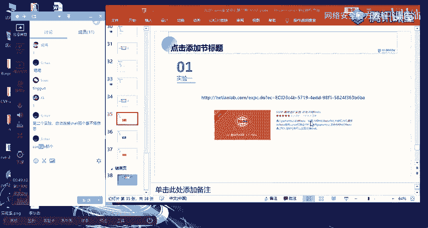

。是这个readius的这这一个实验吧。

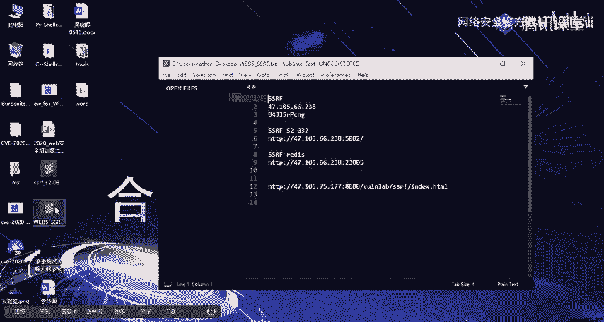

Yeah。嗯。就哦你说的是这个第二这里的第二个是吧？就这个readius。🤧对话。我给大家。😊，啊。讲一下吧。然后这里的话呃也是本来就准备给大家去做一个讲解的。

就说这个的话呃就是比较常见的这样的一个案例，就是说通过SSpro洞去攻击我们的内网的这种radius。那这里的一个实验的话。嗯，我先进一个机器。这样的话前面的话应该没有什么问题啊。

前面的话我在课上的话都有讲过了。然后这里的话呃。就这个靶伞的话，其实跟我们这里的话是呃一样的，有类似的。前面的话应该没有什么问题。就通过这样子的1个SS漏洞，对吧？我们测试测试的话。

它存在这样子的1个SSF。然的话我们通过这样子的一些就是啊去发包去请求我们的一些端口，对吧？我们只定的这种端口，比如说22号端口。其他的一一些端口。嗯。如果说它存在这样子的，比如说这这些端口存活的话。

那么它就会有返回这样子的1个200的这样子的一个状态嘛，对吧？如果说他他。啊。如果说它这一个端口它没有存活的话，它它的一个响应的话是会啊就是会比较慢的。因为他要去请求这样子的一个端口。

然后的话与这一个端口建立这样子的一个连接。如果他没有端口的一个存活的话，它会它的一个响应的一个时间的话会比较长。呃，前面的话就是。

对。

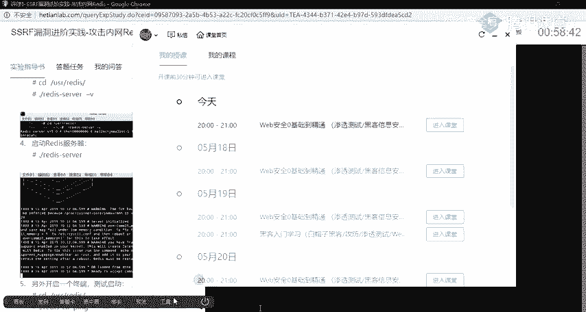

前面的话就是一个环境的一个搭建。这里话我没有怎么讲的啊，你的一个你的一个问题的话应该是在这里。在这里对吧？就说这一个啊lated访谈需要的这样子的一个伴取脚本。对吗？

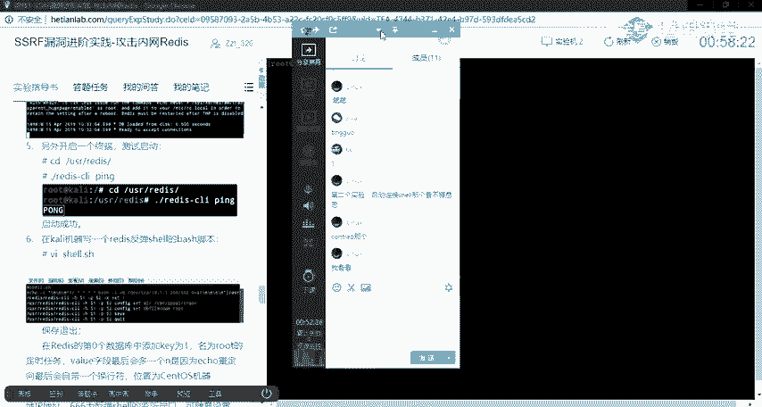

就说你不知道呃，你。对，这一块不是很很很理解。

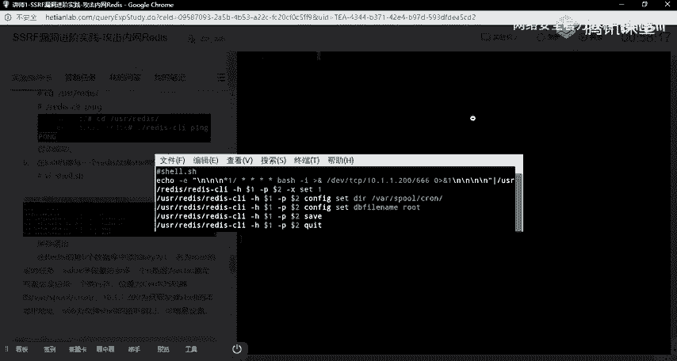

呃，是吗？

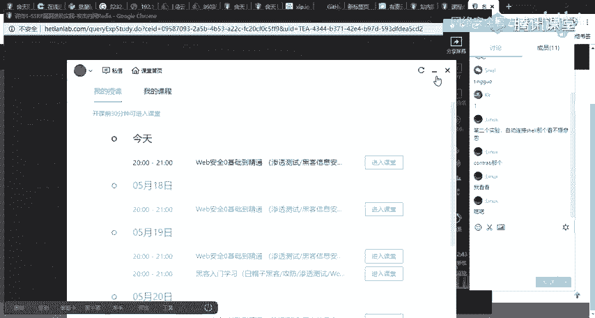

是的吧。那么呃我这里的话给大家做一个就是介绍。

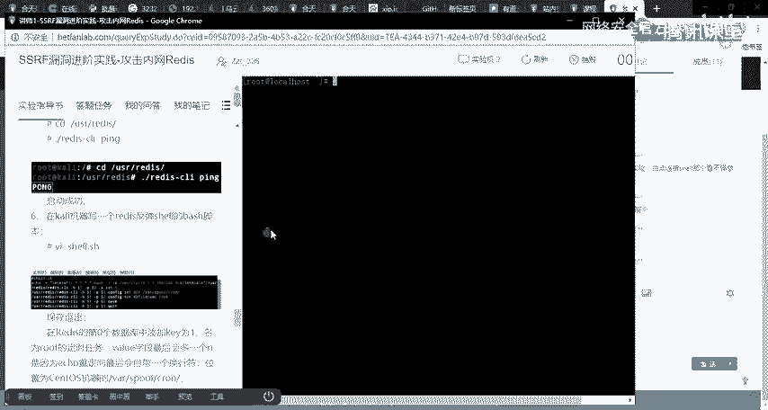

🤧Yeah。这样的话呃其实我呃准备了这样子的一个笔记，待会的话可以发给大家。🤧2。这样的话就是呃我们先来看一下这个readius微授群。

来进行利用这这样子的一个readd实惠授群去进行一个攻击的一个反弹渲的一个脚本。对他的一个脚本的话就像这样子。首先这里的话我们可以看一下。对ele干一。E口的话其实就是呃把我们的这里的一个内容，对吧？

就是啊主主要的话就是一个管道符。这个管道符的话就是把我们前面的一个内容当当作为这里的后面的一个呃输输入，对吧？这里前面e口的一个意思的话就是就是把我们的这里那个内容输出来嘛，对吧？输出来的话。

这里的话把它作为了一个输入。然后这里的话就是这一个readdiusread客户端，这个是CLI这个readdius的一个客户端。然后它的一个命令的话就是是这样子的一个形式。

杠H后面的话是接我们的一个就是你要连接的这样子的1个readdius服务器的1个IP。🤧然后杠P的话就是我们你们。就是我们要去连接的reads服务的一个端口，默啊不默认一般的话是1个6379的一个端口。

然杠X后面的话接的set一。🤧那你的意思的话就是把我们的就是。在我们的这一个readdius，就是前面的话是连接，连接了这样子的一个readdius服务器，对吧？连接之后的话。

执行这样子的一个命令st一。然后这里st一的话就是在我们的这个readdius数据库当中添加一个这样子的一个K值。而这个T也就是进嘛，就是它是一个静值啊，对的这样子的一个数据库。

就一个进的话存储这样子的一个值。然后的话这里的话是把我们就是添加这样子的一个为啊。添加这样子的一个一的一个key。然后它的一个值的话就是我们这里的一个啊值。然后这里的一个值的话其实就是一个定时任务。

这呃。定时任务的话，这里的话呃大家可以去自己去百度一下吧。就是说这里的话是一个linux上上面的一个定时任务的一个写法。就是前面的话是一个呃，这也是一个分分钟。啊，就是最小的一个单位，话是一个。

Yeah。好。就是我们啊你定时嘛，定时的话，你需要设置这样子的一个时间，对吧？就是秒多少秒来执行一次，然后多少分。多少就是啊月啊，还有零啊，就是。呃，再百度一下。table是inux里面的一个。啊。

定时任务的一个命令。这里的话我们可以看一下这里。就默认的话，它是这样子的一个格式。就是呃它默认的话是这样子的一个格式嘛，就是星星星星，然后分别代表的话就是我们的一个呃分钟。多少分钟0到59分钟对吧？

然后多少小时，然后多少天多少月。呃，这个是。Da are week。是多少周吗？就隔隔多少周隔多少周去呃执行一次。然后后面的话是接我们执行的一个命令。啊后这里个user name的话。

就是我们以什么样子的一个用户去进行一个执行，这样的话可以省略。然后后面的话是接我们的执行的一个命令，然后我们回来去看一下这里。回来之后的话，我们可以看到这里的话。

其实就是我们前面有说到的这这个ba喜的反弹命令，对吧？通过ba许的这样子的一个方式。来反他这样的一个hell来去连接我们这样子的一个呃指定的1个IP以及端口。这的话是呃写的是127，这个127。0。0。

这一个端口。然后这里的话前面这里的一个干恩干恩的话就是一个呃换行。就像我们呃。要实验。

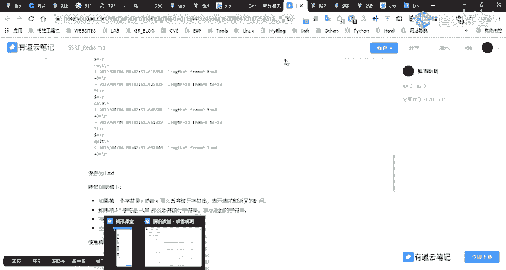

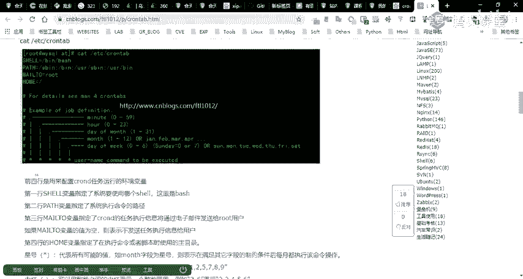

🤧在这里我们看一下。Yeah。就是在这里。那这里我们可以看一下，这里的话就是它执行这一个需要之后，对吧？我们其实可以看到它这里执行之后的话，它传递的这样的一个数据是这里嘛，对吧？而这里的话。

其实它有这样子的三个换行，三个空行，就是我们前面的一个杠恩杠N。然后面的话是会有4个。

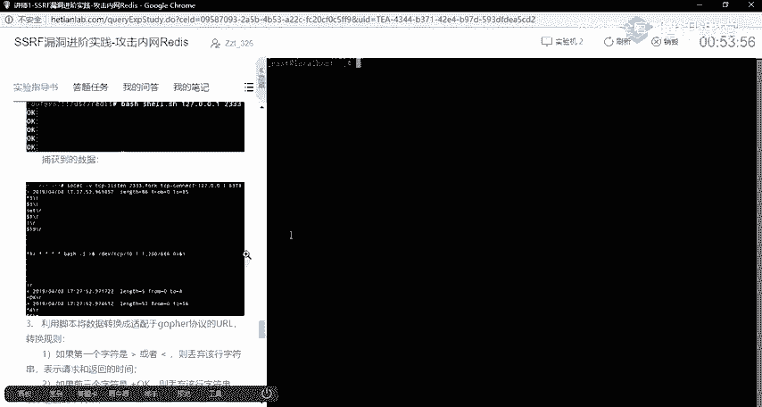

啊，这里要注意的一个点就是。这里它会有多一多一个干源，这个多的一个干源的话是因为我们的一个ee去进行一个这样子的一个重电下的话，它会自动的去添加，就是它会默认的会带有这样子的一个换行符。

然后后面的话就是我们通过这个readdius的一个客户端的这样子的一个啊命令去啊。去执行我们的这样子的一个啊设置。这样的话就是连接我们的这一个readdius服务器，然后的话执行这样子的一个命令。

执行命令的话就是呃设置我们的一个目录，就是我们的一个工作的一个目录，是这一个目录。然后这个目录的话就是我们的一个定时任务所在的一个目录。

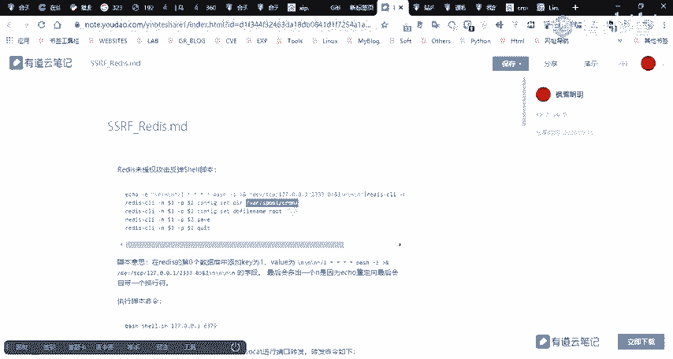

啊我。去服务器上面看一。

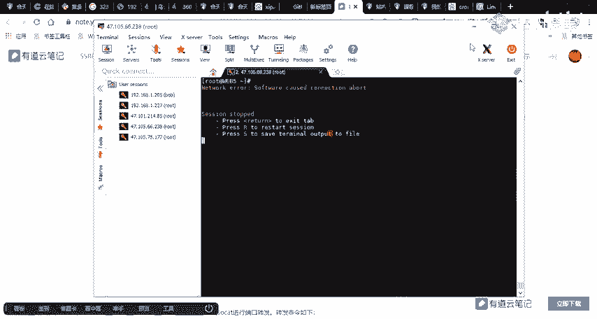

，也就是这个。L table。啊，这里的话暂时没有这样子的一个定时任务，就是给root的root用户的。然后我们可以去onepon这个目录。下面去看一下这里的话是呃它是现在的话因为没有电池任务嘛。

所以的话它里面的话是没有文件的。

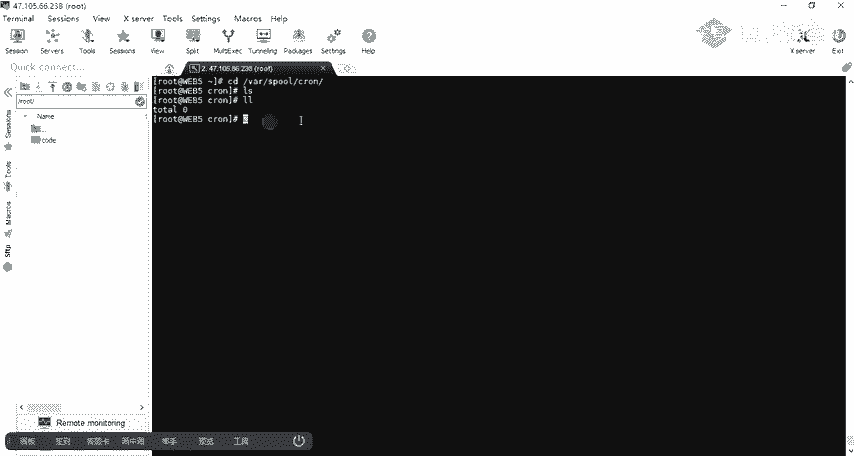

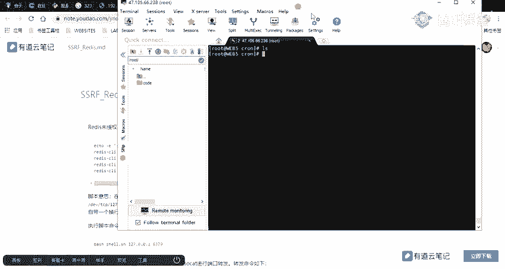

啊，这样的话我们设置这样子的一个目录。然后下一个的话就是设置我们的一个文件的一个名字是一个root。

然后这里的话root的意思的话等于就是我们会呃在这里它会有去创建这样子的一个啊，就是我们在我们当前的一个工作目录，下面的话会生成这样子的一个root用root文件。

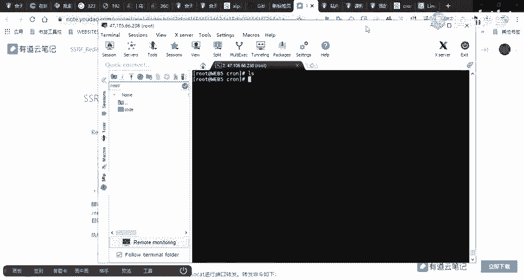

而这一个root文件的话。

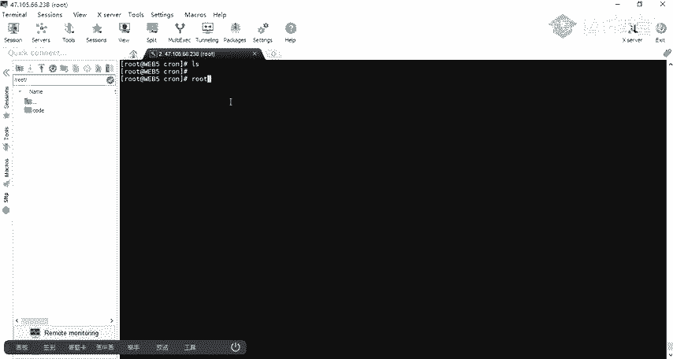

他的一个内容内容。内容的话就是我们保存这样的话是要保存，就保存我们上面啊执行的这样子的一个命令，把我们的一个呃内容给写到了这一个。呃，T为一的一个值。然后保存之后退出，然后保存之后的话。

它就会去进行一个啊。执行。这里的话是VD1的一个特性啊，就是它通过这样子的一个命令，它会执行，我们就在我们的这一个指定的一个目录下面生成这样子的一个文件名。然后这里的一个文件名的话。

就是我们这里啊设置的这里的一个值。

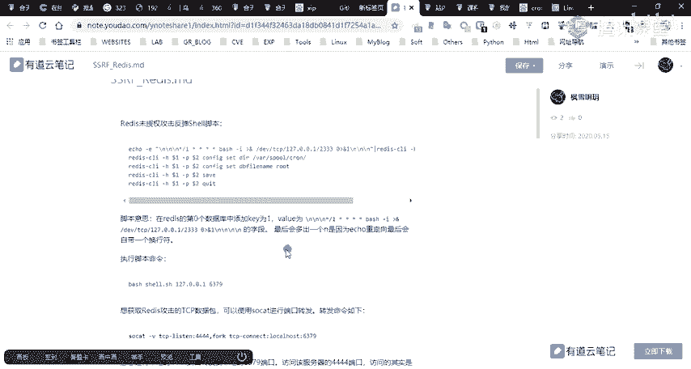

把我们的值保存到了我们这样子的一个文件啊，保存到这一个文件的话，等于就是我们在服务器上面新建了这样子的一个。呃，新建了这样子的一个呃定时任务。而，这个定时任务的话，就是我们这里隔一分钟之后。

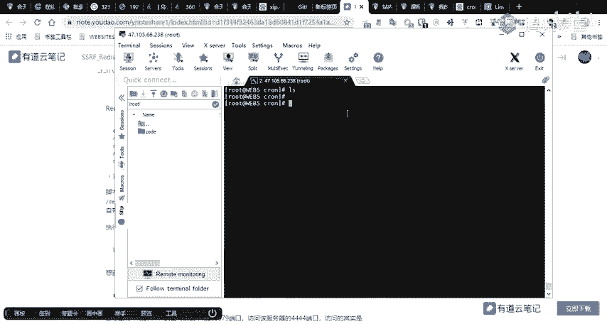

就每一分钟他都会执行一次。每隔一分钟他会执行这样子的一个命令，就是谈一个shll，谈到我们指定的1个IP端口。因外就是这一个电池任务的一个。呃。电时任务的一个。解释。这句话大家呃理解了吗？能明白吗？

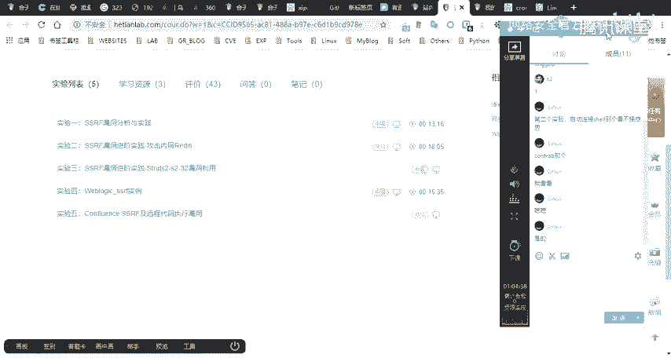

不明白的话呃，说一下哪里不明白。

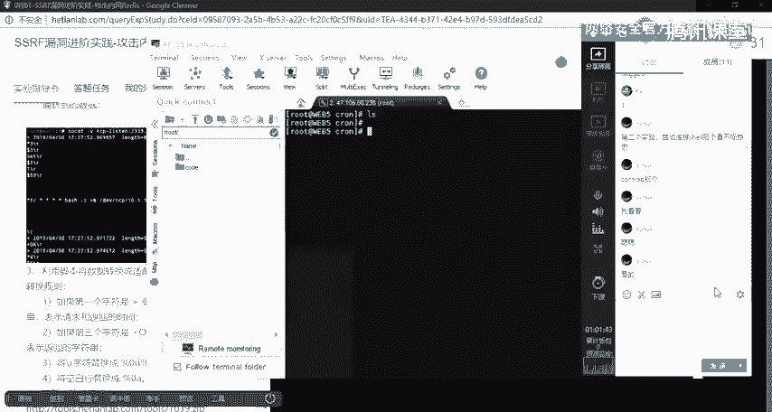

ok。😊。

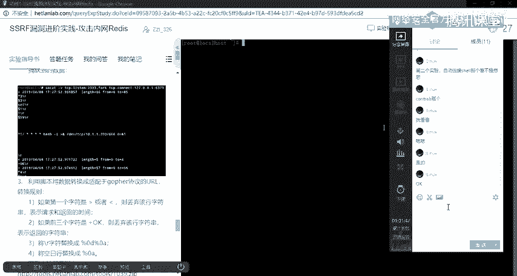

好。然后的话还有其他的一些问题吗？这个的话应该是呃。就步骤的话已经写的很很详细了。

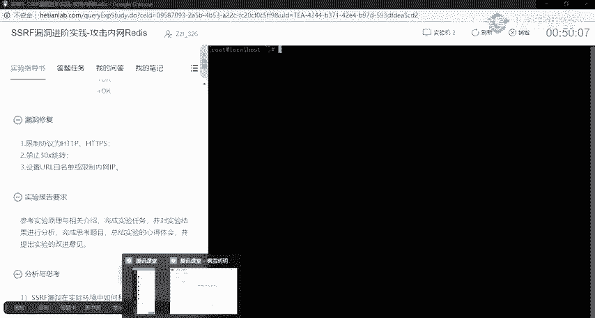

大家还有其他的一个问题吗？🤧。

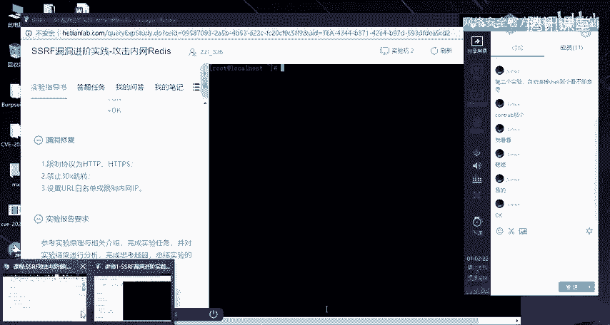

都都没有问题了吗？我把这一个呃文档发群里吧。Okay。我这的话应该写的比较详细啊。啊，呃这样的话是我之前的一个笔记啊，时间的话可能不对，就是我我直接从我之前的一个笔记上面呃摘摘下来的。🤧Com。哦。

这个的话应该没有。呃，大家有没有什么问题啊？要不要我讲一下？下密钥写进readdeos。🤧Okay。就我们的这样子的一个密钥，不是不是写到了readers。而是。而是我们通过这个readiuss，对吧？

它能够去进行这样子的一个写文件的一个操作。

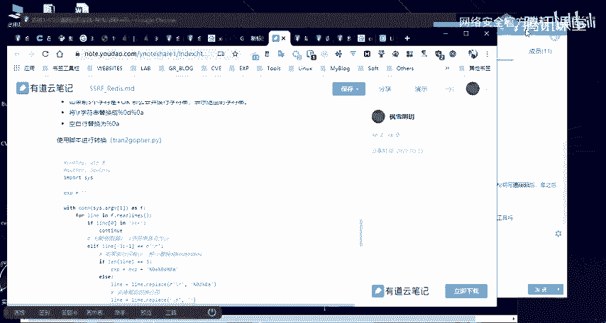

然后他写的话，他是会把它写到了那个我们的就是。

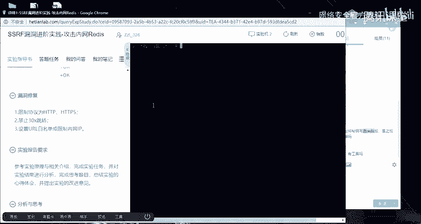

我们的1个SSH。有这样子的就是，我们。呃，不知道大家也知不知道就是免密登录啊。就说我们登录这样子的一个lininux服务器，我们要登录的话是要要输密码嘛，对吧？如果说你的这种密码，你。

你说这这样子的一个密码，你是啊设置的比较复杂，对吧？比较复杂的话，你记不住嘛。

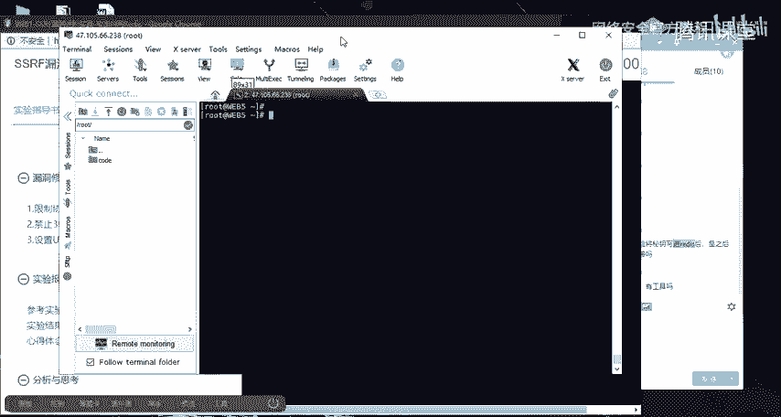

所以的话我们可以通过设置这样子这样子的一个秘密登录。然后秘密登录的话，因为SSG它是呃。了一个连接。你中间的这种数据的话，它是经过加密的。经过加密的话，我们想要就是客户端跟服务端。

也就是说我们的一个机器要去敏密的去连接我们的一个服务端啊，连接我们的一个服务器的话，我们需要生成这样子的一个密钥。以及工钥。这深层做的一个。呃，生成的一个方法呢就是SS取干。

T进利用这样子的一个工具来生成我们的一个密钥。然后杠T后面的话是接我们的一个。呃，加密的一个方式，一般的话是ISA的一个方式。啊。呃，RA。然后的话呃它会保存在这样子的一个目录。

默认的话是在这这样子的一个目录下面。我们这样的话直接回车，然后需要你输入一个密码。这个密码的话就是。啊，可以是一个比较简单的一个密码。🤧因为。就是说当然的话你也可以不输。如果你不输的话，就是说啊。

比如说某个人他使用了你的这样子的一个电脑，对吧？然后的话。他就能够去不需要使用密码，使用任何密码的一个方式去进行一个连接这样子的一个机器。🤧Okay。然后我这里的话就不设密码，就回车回车就可以了。

回车回车之后的话，我们可以去这一个目录下面。查看一下。打看之后的话可以看到它这里的话会生成这样子的两个文件，就一个的话是1个IDISA这样子的一个文件，对吧？这个的话就是啊写入的是我们的一个私钥。

这个私钥的话就是在我们的一个服务端。啊，不在我们的一个就是我们想要去连接啊其他服务器的这样子的一个。嗯。咩呀。😡，我可以看一下。

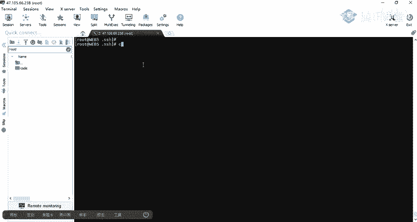

变化就是这样子的一串值，它是使用ISA的一个方式进行的一个。

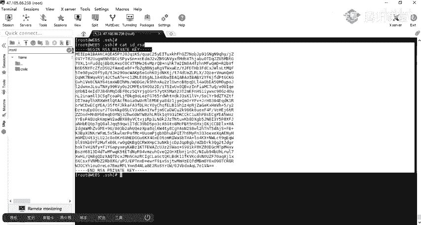

他的话还有一个光药。开水点 publiclic。Good。它是这样子的一串值，这一串公钥的话。对串公钥的话，我们可以就是。啊，把它发给你想要去敏密登录的那个机器。就把这一算值。

然后这里的话这里的话那一个实验的话呃，做哪一个实验？

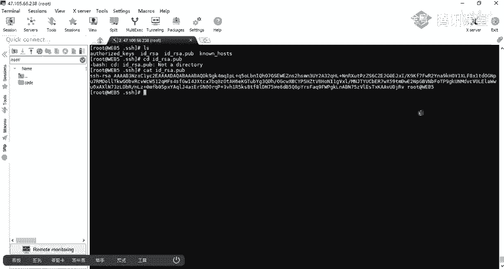

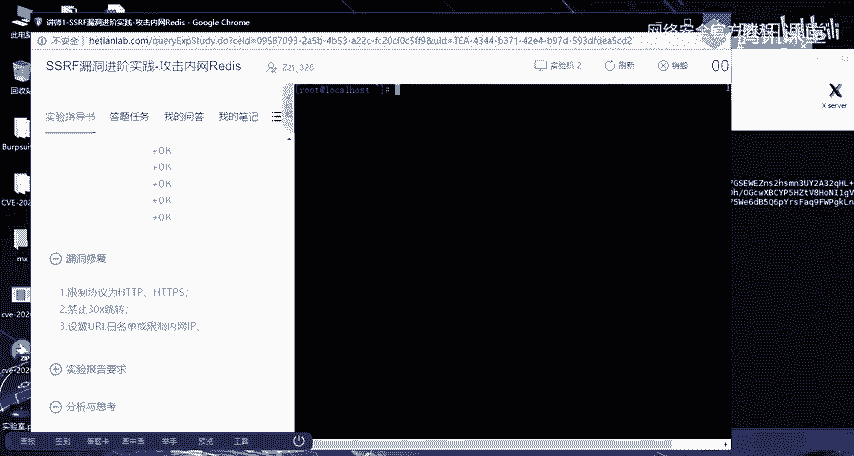

请小啊。

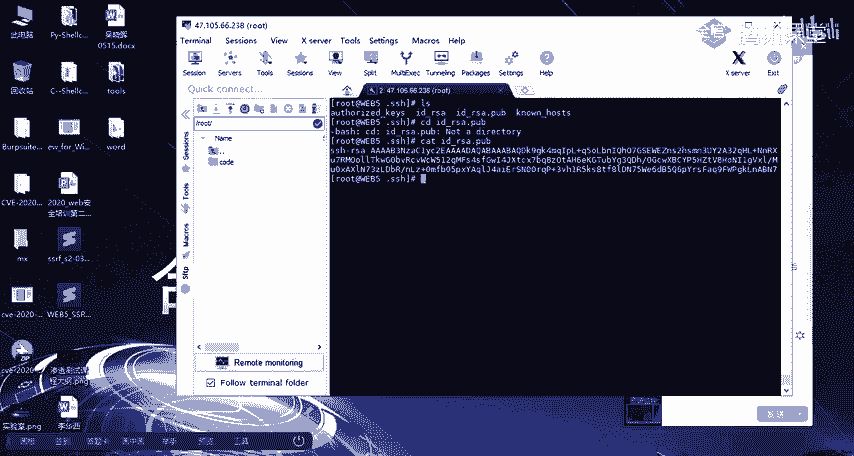

是那个。是哪个实验？哦，是就是这一个是吧？

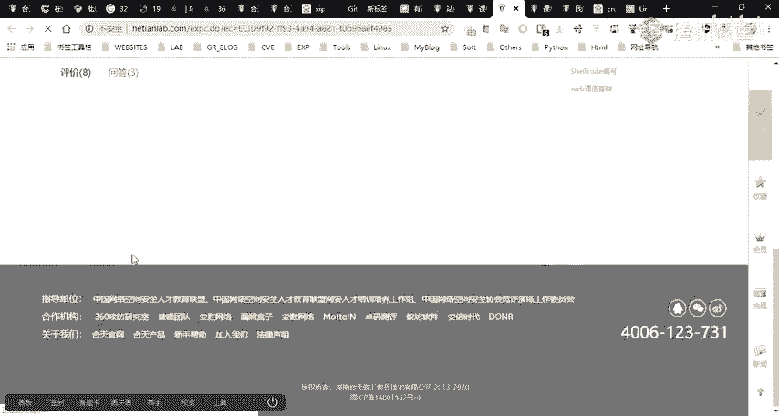

在后面是。即个嘛。🤧Yeah。🤧被个呃攻击str to。

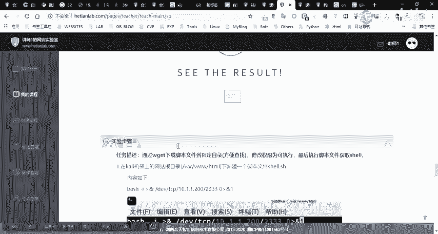

嗯。

对，这个这个这个weblog的这个SSup的一个漏洞。这个的话是呃weblog的这个啊它自带的啊，它自身就有的这样子的一个漏洞。然后他这里的话是用到的这样子它的这样子一个功能点。

我们可以通过这样子的在这里传我们的啊内网的1个IP来去对它做一个探测。而且它而且的话它是一个有回显的。然后在这里的话，主要是这里。这里的话我们通过前面的这样子的一个利用。前面的话。主要的话是看这里啊。

就我们前面。应该比较详细啊，就是介绍了这1个CICRLF的这样子的一个注入。呃，这个CRLF注入。需不需不需要大概的给大家说一下呢？就这样的话大家有理解吗？我大概说一下吧。就这1个CRLF的一个漏洞话。

其实这个CRLF的话就是我们的一个回车换行。就CR的话就是说回车嘛，LF的话就是换行。然后大家回想一下，就是我们之前在讲HTTP的一个。啊，请求头就是他的一个字段的时候，有给大家说过，对吧？

就大家回想一下那张图嘛，就说每一个这种我们的1个HTP的一个请求头当中的话。啊啊。每一个呃请求头部它的一个字段，它的最后都有这样子的1个CRLF。这样子的一个呃字符。然后这个字符的话就是一个回车换行。

然后在这里的话，我们怎么去进行一个利用呢？就是我们可以通过这个CRF。然后这里的话其就是呃回车的话就是这一个它的1个UR编码的话就是0%D。然后呃放传的话就是0A。它是1个URL的一个兵码。

然后我们可以通过这样子的一个0%D0%A来构造这样子的一个回车换行。然后他这里的一个漏洞的话，就是我们在这里能够去通过这样子的一个0%D0A。这样子一个方式。因为我们前面有说到，就是它的一个字段。

它是以这样子的一个方式结尾的，就说明是前面的一个字段的话，它的一个内容的话是已经结束了。然后后面的话就是新的一个字段。然我们可以通过在这里的话输啊构造这样子的1个CRLF。

来就是把我们重新再构造另外只另外的一个呃。呃，另外的一个。请求讨论。🤧就我们其实可以在这里看到，就我们在这里通过发送这样子访问这样子的一个请求包，对吧？访问到这里的一个端口之后的话。

我们通过它的一个响应。🤧Yeah。好吧，通过他的一个请求啊。能够知道他是发送了，就是他请求的是一个啊pos的请求嘛。然后他访请求的是这一个XS的一个内容。

然的话主要的话看看这里这里有一个host3W点百度点com这样子的一个啊字段。啊后其实这一个字段的话，其实是在我们原本的一个请求的时候，它是没有的。啊是我们通过这样子的一个构造来呃添加的这样子的一个啊。

就是注入了这样子的一个呃。请求投。🤧Oh。

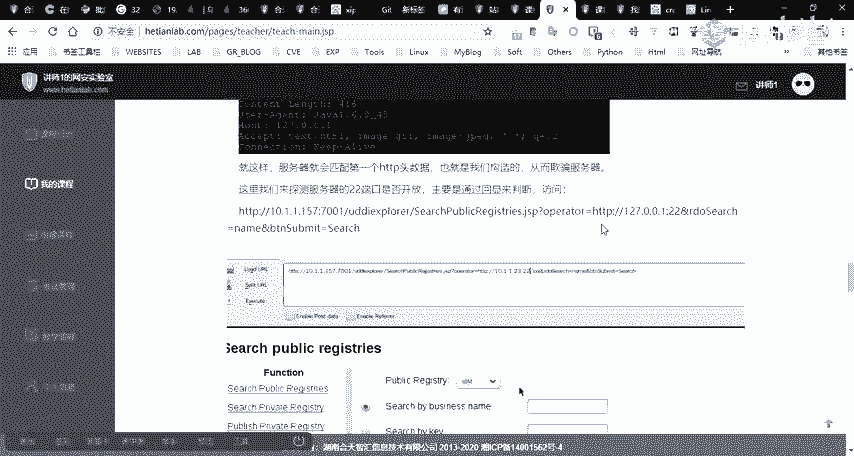

到了后面的话，就是说因为它是这一个参数存在这样子的一个CF的一个注入嘛。啊，我们可以在这里。在这里通过他的这样子的1个CF的一个注入来发送我们的呃这样子的一些数据包给我们的一个readdius。

Okay。给我们的这里这个redius的一个服务器。啊，发送的这一个数据包的话，就是这里的一串。这这里的一串的话，我们可以看到就set test。

set test的话就是创建了这样子的一个test的一个key嘛，对吧？然后它的一个值的话就是这里的一串。这一串的话就是我们前面说到的这一个啊公钥，就我们在这里生成的这样子的一个公钥。

在供业上的话呃可以自自己生成。

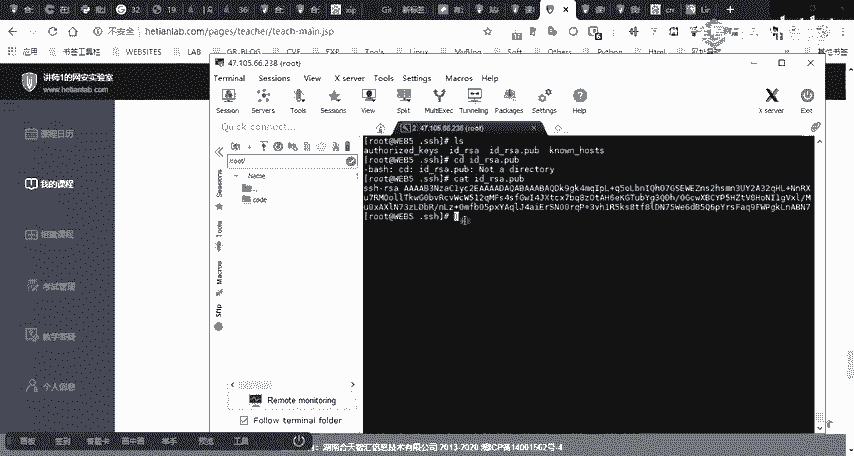

就生成之后的话，我们把它放到这里。那这里的话就是呃这个ts的啊这个。T名为t的这一它的一个值，它存储到的这一个redius的一个数据库啊，到了。这里。对。这双话其实跟我们前面的那个需要脚本的话啊。

应类似的，应该能看得懂。然后后面的话。后面的话就是啊。前面的跟前面的一样，我们设置我们的一个目录为这个这个目录。这个目录的话就是我们保存的我们的一个啊。呢个啊。SS取得那一个密钥以及公钥的一个目录啊。

我们设置的一个目录的话是在这里，然后我们设置的一个文件名是这个auory kiss。这个or kiss的话，这个文件的话，它里面存储的就是我们的就是比如说我们已经连接过了。我们已经有连接过了。

那里没有吗。我们可以把我们的就是已经有连接过了的这样子的一个T，就是它的这种公钥，把它存储到这样子的一个文件里面，然后存储到这里的一个文件里面的话。

它其实就是一个啊就是我们去进行一个身份验证的时候会去用到的这样子的一个啊公钥。

就一个钥匙嘛，然后我们我们可以通过存储的，我们这里生成的这一个公钥。

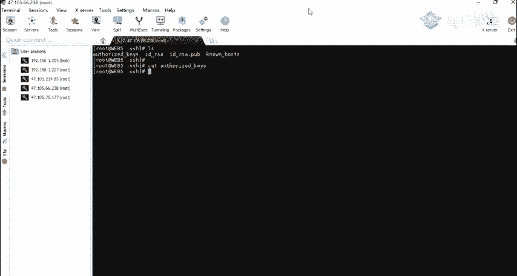

啊我们可以使用这里的，就是我们直接能够通过SSH。这一个方式来去连接我们这里存办公钥的这个服务器。

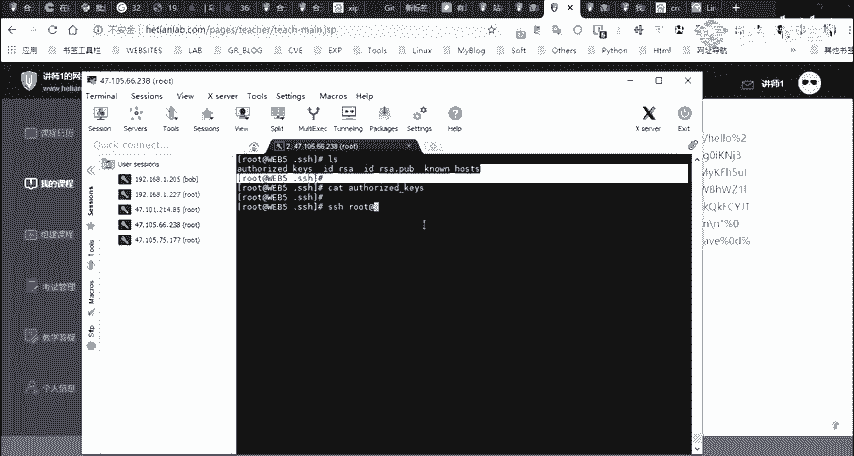

嗯。Oh。这里的话应该有。你看到我这里的话啊，我这里的话有设置了一个，这个的话是我。之前设了一个敏密的一个登录。啊，我们只需要把它把那个公钥把它给放到这里来。Yeah。好，保存保存之后的话。

我们可以直接通过SS去。啊，root。生气。通过诶。哦，我这的话呃SH的端口是那个。有一个端口啊后我们可以看到这里的话有了这样子的一个验证，对吧？那验证的话其实就是呃验证我们这里存储的一个公钥。

它是否啊是我们这里生成的。啊，我们yy之后的话，可以看到我们没有输任何的一个密码，对吧？我们没有输密码，我们直直接就啊就是确认了这样的一个连接，我们就连接到了这里的一个服体。你们可看一下他一个内容。🤧。

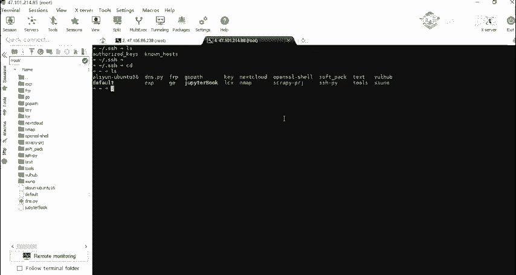

对吧。然，在这里的话就是通过这样子写这样的1个SH的一个啊key。这个秘密登录的这样的一个key写到这样的一个文件。之中写入之后的话，我们直接可以在我们在这里生成了这一个。

T的服务器上面来通过啊不需要密码的去登录到指定的这一个服务器。

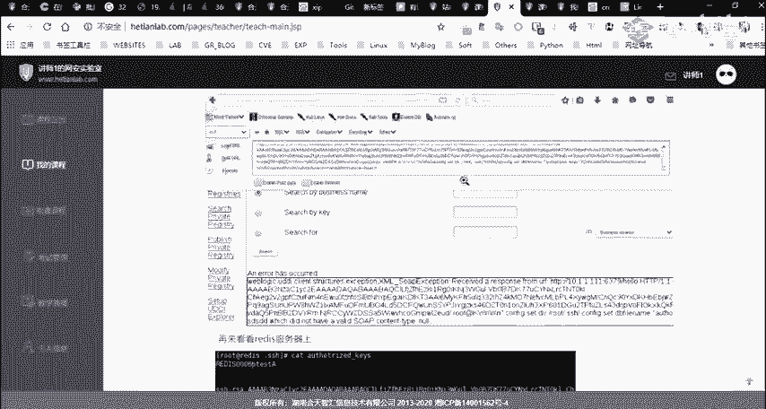

这的话就是这里的一个。关于这1个SH与IA的一个key的一个。啊。解释。这句话大家应该明白了吧。能明白吗？Yeah。大家可以自己去尝试一下。

就是通过这样子的这种呃这种通过readdius写这个SHK的话也是呃。也是呃比较经典的一种方式。就是我们能够直接的通过写入的我们的这样子一个公钥，对吧？能够不需要立马的去登录到。

就直接获取到目标服务器的一个啊需ll。而且是就是很稳定的一个选。Okay。呃，大家还有还有疑问吗？🤧Com。🤧。Okay。嗯，大家还有问题的话，直接提哦。

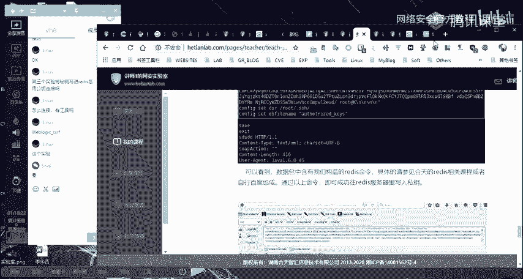

Yeah。🤧Okay。Okay。还有说这个structure two的话呃，应该。呃，跟前面的话其实也是类似的，就我们直接用这样子的一个payload就可以了。啊，用他的这个POC。

因为他这里的话就是直接能够去进行一个命令执行嘛，对吧？然后的话我们通过这个SSRF。🤧。通过这个SSF来去访问，就是说同直接去访问它的这个呃structure。这一个呃服务访问这个服务的话。

它是存在这样子的一个漏洞，我们可以通过这样子的1个POC来去执行我们想要的一个命令。然后他这里的话就是通过呃通过通过那个。下载一个就通过we gett。下载这样子的一个需要脚本。然后把它下载。

下载到这一个指令的一个服务器上面。然，下载下载之后的话，我们在呃。给他就是给他一个执行的一个权限，给他执行权限之后的话，我们再去执行它。因为我们已经能够去命令执行了嘛，对吧？

直接通过这样子的一个payload去。啊，执行执行我们的这样子的一个访弹需尔的一个脚本。然的话在我们的一个服务器上面去进行一个，今天就能够弹回我们的目标服务器的一个需要。

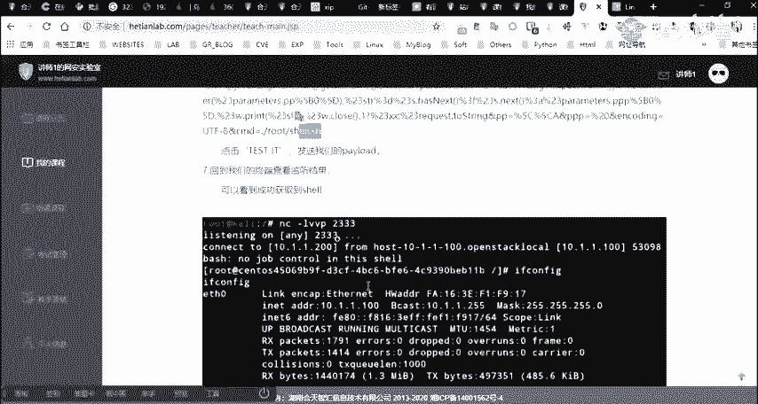

🤧Yeah。然后这里的话关于这个str two的话，呃，大家可以直接搜一下，搜一下实验室有实验的。这样的话呃这个structure的话是很好利用的，就不像readius那样子。

就说我们可能需要通过这样子的，比如说你要谈hell。我们需要通过这样子的一个脚本。就说因为我们想要把我们这里传递的这样的一个脚本。就说这种数据要把它给发送到我们那个readdius服务器。

然后发送到这个readdius服务器的话，我们需要啊就是符合它的一一个格式。就呃因为我们是需要去使用到这个go for。高pher。🤧呃，这个这个go for协议去进行一个发送。

所以的话我们需要把它就是呃。转换成。啊，能够去直接去进行一个发送的这种格式，就是发送的用这个goffer协议去发送的这种数据，直接发送到我们的一个readdius服务器的1个6379的。这个端口。

发送过去的话，它就会执行我们上面的一个需要的一个脚本。然后把我们的一个电时啊这一个电时任务它需要。的一个脚本写到我们的电时任务里面去。然后的话隔一分钟之后就能够弹弹。然后在这里的话，我们。

可以通过他返回的这种加OK。就这个加OK的话，就是readio使它执行执行完命令之后的话，它就会返回返回给你就执行一条命令，它就会返回给你这样子的一个呃字符，就O就是执行成功了嘛。

然后我们这里的话是有5条命令，所以的话啊返回5个okK。这说明的话这样的话是已经资行成功了。然，这里的话呃。这样的话可能这里要说一下，大家可能会有疑问。就这里的话我们是通过这个soet。

这一个set的话其实也是一个就是呃一个工具啊，它是你可以说是呃NC的一个加强版。就是说它的一个功能的话比NC要其实是要更强的，就更强大的。它的一个功能的话很丰富啊。能够端口转发呀。

传就是NC能干的他都能干，等于就是然后他还有其他的一些呃其他的一些功能。然后这里的话，我们通过它的这样子的一个命令。其实我们想要获取到这样子的一个数据。这个数据的话其实就是我们啊执行这个脚本，对吧？

执行这个脚本之后，我们发送给我们的个readdious服务器的这样的一个数据，是这样子的一个格式，对吧？然后的话我们发送的数据格式是这样子。我们如果说要去使用到这样子的一个go for协议。

发送这样子的一个呃。我们这里执行需要脚本的一个数据的话，我们就需要获取到它的发这种原始的一个数据。然后的话通过转换转换为就是。呃，符合go for的这种go for发送数据的这种格式的。

的一个呃样子这样的话有给一个脚本，就是他有这样子的一些转换的一个规则嘛。然后在这里的话就是通过这一个set来今听我们的1个444的一个端口。啊今天的这一个端口的话。

它会把这里的一个就是呃把发送到这1个444端口的一个数据给转发到我们的一个呃这里的1个6379的一个端口。这个637的话，其实就是我们本地的一个readdius的一个服务器嘛，对吧？然后这在这里的话。

我们就是执行这个脚本。执行脚本的话，这里需要两个参数。大家要注意的话，这里的话是两个变量。就呃多了一的话，就是我们这里的第一个变量，就我们的1个IP嘛。然后多了二的话就是一个端口。啊，执行之后的话。

🤧K。执行之后的话呃。啊，不是，在这里就执行之后的话，我们像我们的一个这里今天的1个444的一个端口发送我们的这执行命令之后的一个数据，也是这里的一个数据嘛，发送给这里。

实际的话其实就是发送到了我们的一个。呃，这里的1个6379的1个readdius服务器。然后在中间，我们这里今听的话，就像就相当于一个中间人，对吧？我们可以把它发送到服务端的。就是说这个6379的端口。

它的这种原始的一个数据把它给获取下来。🤧K。就是你发送过去，你发送发送到服务端，然后的话服务端返回的一个响应。的这种数据。能够通过这种方式把它给。获取下来。然后的话呃再通过这个go for协议。

就啊我们的指定我们的一个readius的一个端口。后面的话接我们的这里的一个数据。然后发送发送之后的话，就能够去进行一个呃。呃，写这个。写这个需ll。学我们的一个定时任务来反弹一个需要。

这你应该能明白啊，其实我这个文档的话已经很详细了。然后这里还有要注意的一点的话，就是这里啊。就大家。呃，大家可以可以自己在本地啊，就是我那时候的话也是就自己。自在本地搭环境嘛，大环境。

然后你自己搭一个readdius的一个服务器嘛，然后通过这样子的一个方式结获这一个数据。节后这一个数据化，你需要去进行一个。啊，转换转换构造。然后这里构造的话，我们要注意的一个点的话，就是它在这里。

我们其实可以看一下这里的我之前的一个数据啊。这里这样的话其实就是我们这里的干恩杠恩。你复制下来。

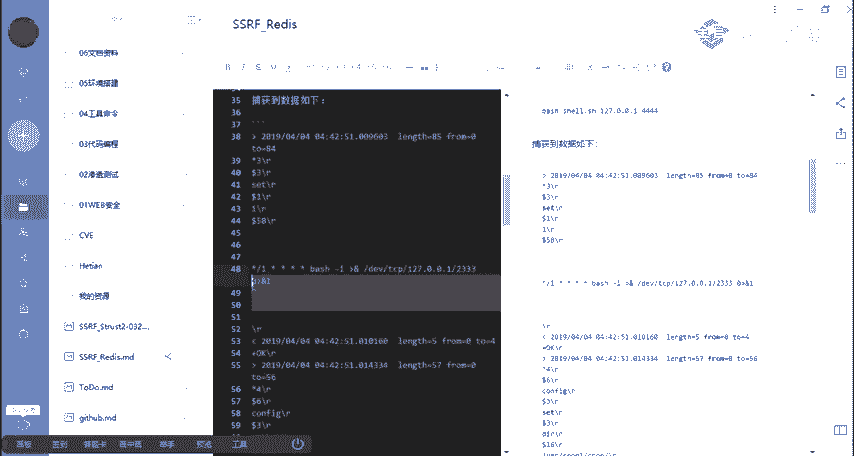

Oh。

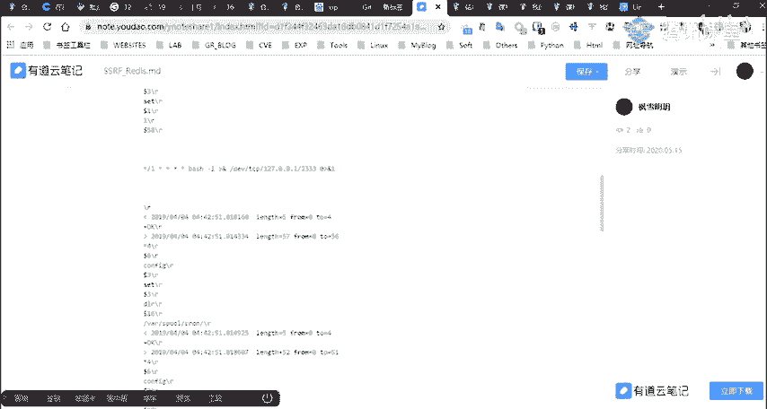

Yeah。我们复制下来，就这里的话，我们可以看到前面的话是有三个换行，对吧？这三个空盘，其实就是我们之前的一个干恩干恩的话就是换行的意思嘛，就换了三个行。🤧然后这里的一个数据的话。

我们可以看一下这里的话。🤧P。我们选中这里的话，其实是有51个字节，就51个字符，对吧？这里的话它的一个长度是51。然后后面的话这里呢要注意的话，它是有4个字符。Oh。😮。

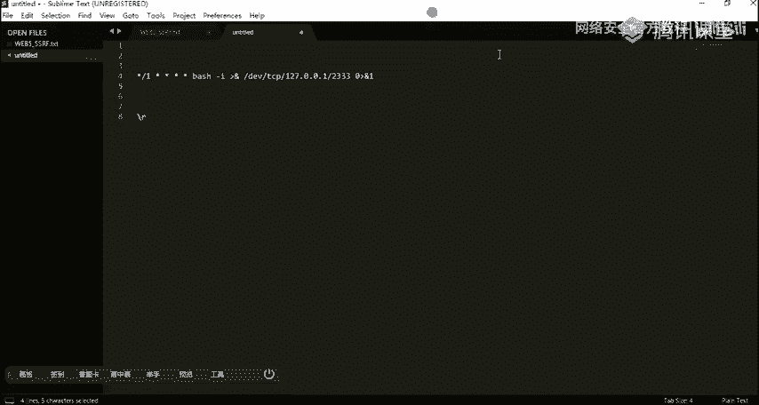

🤧我们。就可以看到在这里的话，有一个这样子的一个值，58这个58的一个值的话，就是表示我们这里所传递的这一个数据，它的一个啊长度是1个58。

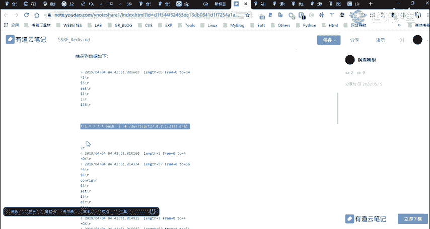

第一个。长度。

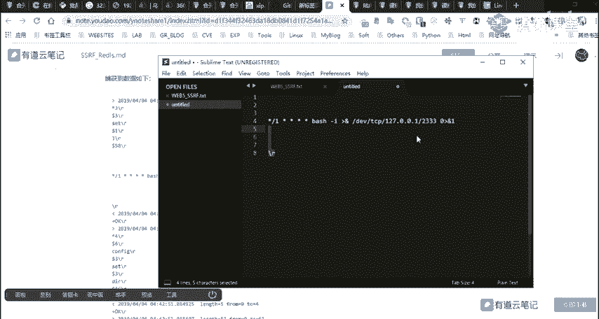

然后因为我这里的话是一个本地嘛，如果说你想要。你要去连接一个指定的呃这源是这样子吗？🤧う。想要去连接一个指定的。🤧123。指定的1个IP。Okay。🤧比如说。电网的一个呃。1。

100这样子的1个IP对吧？然后端口的话是。啊。666。那后这里的话，我们实际的实际要去反常的一个需小的话，是这样子的1个IP对吧？

然后这一个端口所以的话我们这里的话需要更改一下它的这里的一个呃就是长度的一个值。我们可以看到这里的话是1个55。这里55，然后加上我们这里的一个3，再加上这里的一个4，就是55加7嘛。

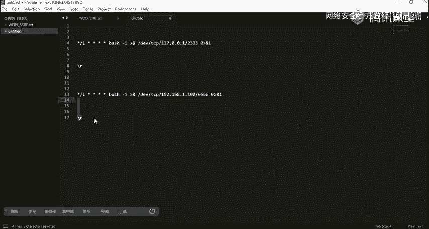

55加7的话，就是它在这里的一个长度的话就是62。所以说我们在这里的话，我们需要做一个更改，更改为1个62。就是呃体现到这里那个配roll的话，就是在这里嘛。呃，在这里。那应该有58嘛。

我们把这里58改成62就可以了。另外就是关于这个SSF。啊，Rds。就攻击内网radius的一个呃步骤以及方法。我看大家呃没有反馈给我，就是大家都听懂了是吧？听听懂了听懂了，就是没有问题的。

大家在讨论区扣个一。好吧。那我了解一下大家的一个就。理解的一个情况。如果有问题的话。诶扣啊。然后把问题发出来嘛。我现在的话就再给大家5分钟的时间吧。如果没有问题的话。

我们这节课的一个内容的话就到这里结束了。好，这位同学这一个应该理解了吧，就连接工具的话，就我们直接通过SSH就能够连接了。呃。大家是有问题还是没有问题呢？热要。给我一个反馈吧啊，没有问题的话。

那我们下课吧。

呃，下课之前的话呃。

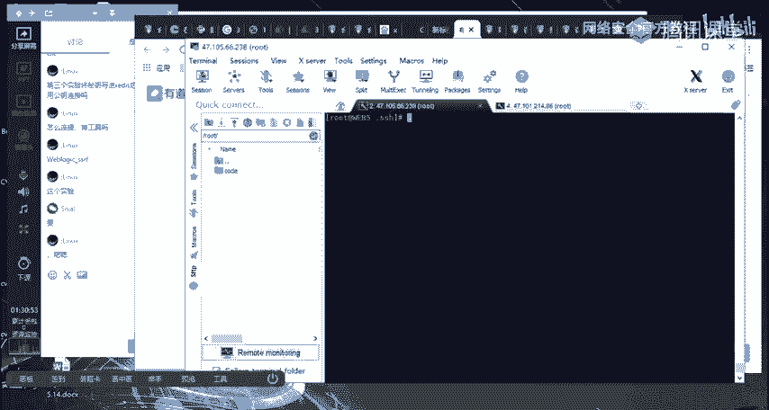

有一个就是。

我们下节课的话就是一个考核嘛，然后考核的话，我在这里的话有就是。

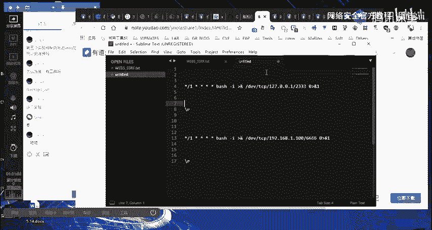

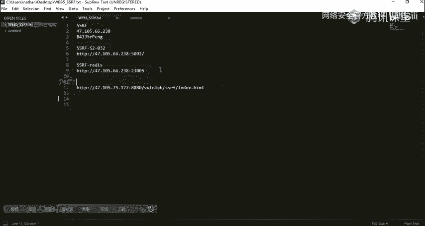

准备了两个题目。准备了这样子的两个题目。我发到群里。然后的话需要大家去啊进行一个做做出来。做的时候的话呃，大家就是。呃，在下节课之前的话呃，把那一个就是你做的这样子的一个详细的一个过程以及步骤。

把呃记录下来，然后写下来啊，就是把作业发给班主任。啊，到时候的话呃如果有问题的话，我给大家讲解。🤧Yeah。🤧呃，这里的话。看一下。Okay。Yeah。呃。🤧Okay。

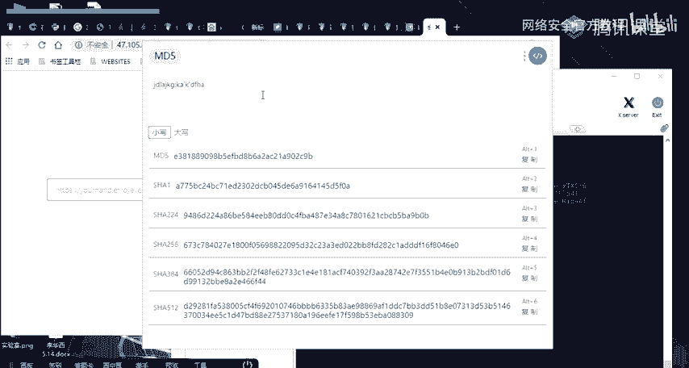

我在这里的话，我写一个。Flag。就是呃考核的一个目标的话，就是把这一个啊fllog。就是拿到。嗯。那个点 textext。

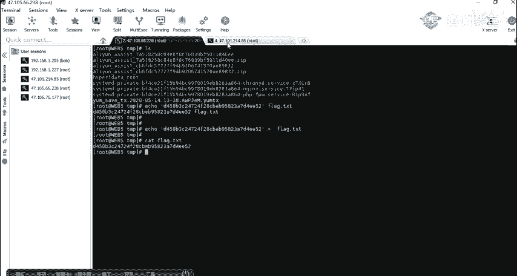

就是它的呃flag的一个目录的话是在这一个tamp temp目录下面，我直接告诉大家吧。就在这一个tamp目录。下面有一个flag intex。

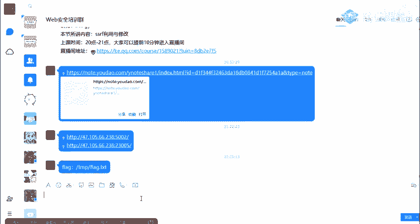

这样子的一个文件，我需要你就是啊目标的话就是获取到它里面的一个值。

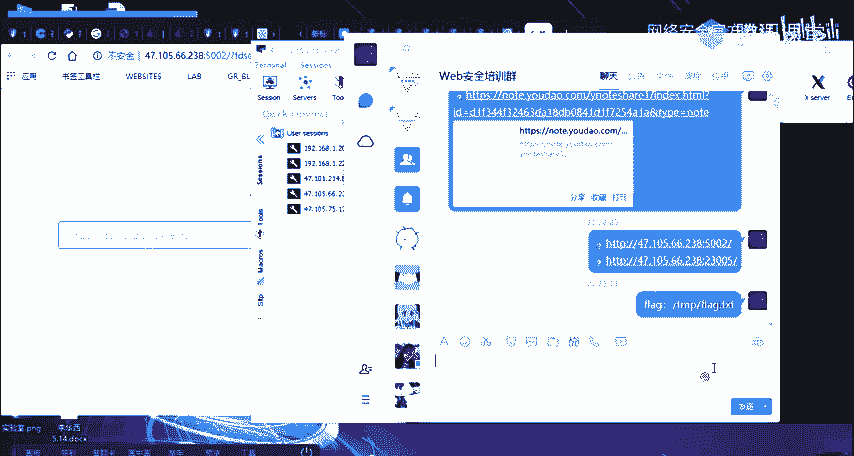

🤧Yeah。

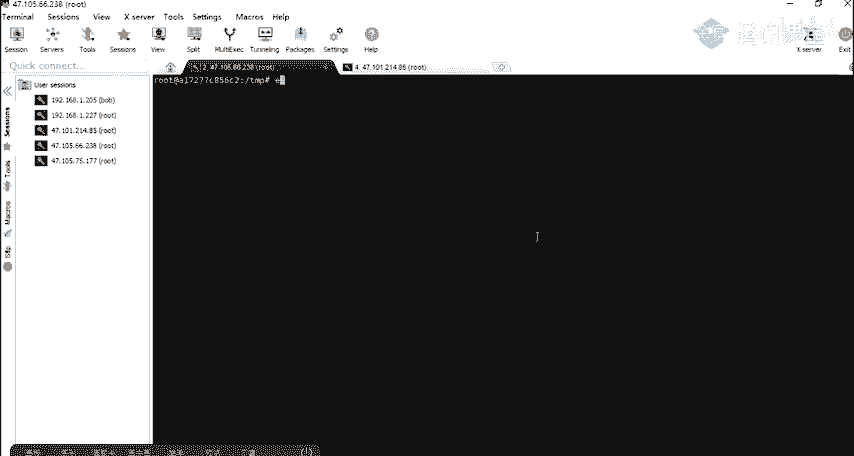

呃，然后的话这个的话就是下周的一个考核。啊，我们这节课话就到这里结束了。

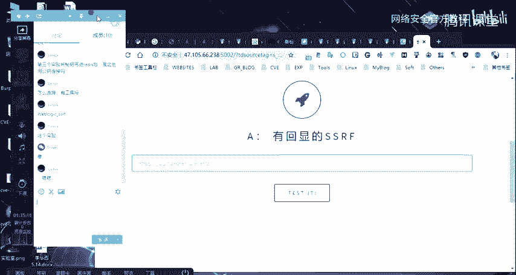

我们下课。