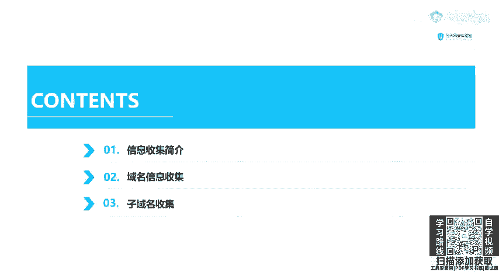
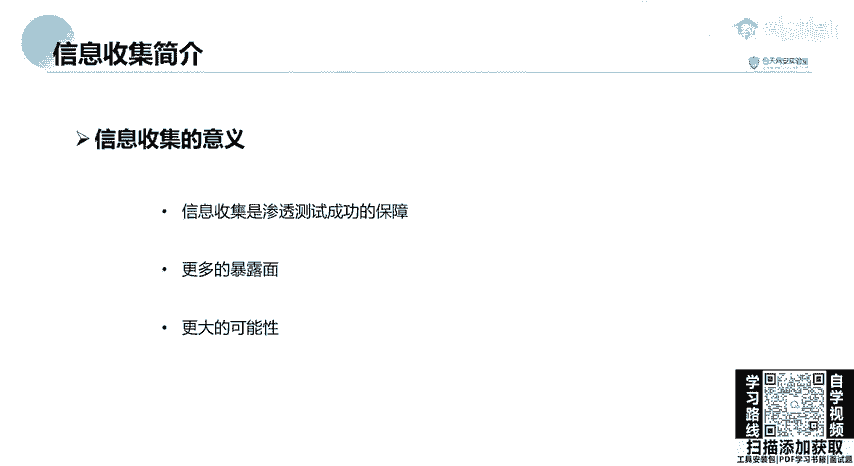
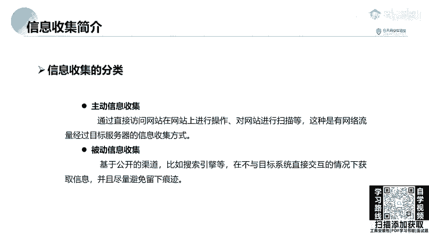

# B站最全网络安全教程，整整1300集，全程干货无废话，别再盲目自学了，看完学不会我退出网安圈！（web安全｜渗透测试｜内网渗透｜CTF） - P27：25.信息收集简介 .mp4 - 网络安全官方教程 - BV15u4y137cQ

啊，今天给大家讲解渗透测试信息收集的第一课。信息收集分为三天来讲，分别讲域名信息收集IP端口信息收集和网站信息收集。那今天我们来看域名信息收集。

首先，为什么要进行信息收集呢？信息收集是指通过各种方式获取所需要的信息，便于我们在后续的渗透过程中有更好的一个进行一个渗透测试。我们要收集，比如目标站点的IP地址中间键中间键，也就是服务器。

比如说阿帕奇还有tomca等等。脚本语言PAPGSPISP等等端口邮箱等。现息收集包括资产收集，但不限于资产收集。在渗透测试的过程中，为什么要进行信息收集呢？一、信息收集是渗透测试成功的保障。第二。

信息收集会给这个资产带来更大的暴露面，会增加我们渗透成功的可能性。大家应该都知道，知己知彼，百战百胜。我们当公司的甲方给我们一个目标之后，我们要对这个目标进行进行一个充分的资产收集。

收集它的IP和域名信息才能够进行很好的渗透。那大家去比如说公司给你1个IP不可能只对仅仅对这1个IIP进行一个扫描。你去啊挖百度的SRC不可能直接对着3W点百度点com这个主站进行疯狂的扫描。

是它是出现漏洞的几率是非常小的。这个时候我们就需要搜索它的子域名或者是庞站C段等等，去探索有没有那些是就是不太重要的站点，或者是刚刚上新的测试站点去找这个里面有没有漏洞。

信息收集的分类呢主要是分为主动信息收集和被动信息收集。也就是字面意思，主动信息收集就是通过直接访问网站啊，在这个服务器的网站上进行操作，对网站进行一个漏洞扫描和端口扫描等等。这是由网络流量。

经过目标服务器的信息收集方式。这种信息收集方式会在对方，也就是我们把机的服务器日志上会留下你的日志访问信息。如果对面有防火墙或者是硬件IDS的话，可能会对你进行封锁。而被动信息收集就是基于公开的渠道。

比如说搜索引擎或者是网络空间搜索引擎等，在不与目标系统直接交互的情况下获取信息，尽并且尽量避免留下痕迹。比如说我们需要对一个网站进行一个搜索，我们不一定非要访问这个目标机器，而是利用搜索引擎。

搜索引擎的爬虫已经帮我们爬好，并且放在互联网上了。我们只需要在搜索引擎中输入我们想要的内容进行一个信息收集即可。也就是主动进行收集和被动信息收集的区别。

那我们在信息收集中，通常是要收集哪些信息呢？这些不论是面试刚入门想转行渗透测试的同学，包括自己已经从事渗透测试工程师。接不论是大小项目、渗透项目互网项目的时候，都需要对这些信息进行收集。

分别是服务器信息，也就是端口服务和IP地址。第二，网站信息。我们通常对目标进行渗透，首要是渗透它的web服务，也就是网站。我们需要了解这个网站的架构，包括网站服务器的操作系统、中间键数据库、编程语言。

包括其他指纹信息，wawa意思是web应用防火墙敏感目录、敏感文件是否有源码泄露，包括C段和庞站的搜索和查询。第三点，我们需要查询这个网站的域名信息，通过hois查询或者是备案信息和子域名搜索。

最后我们还需要搜索这个目标所具有的人员信息。比如这个甲方去给的渗透目标，这个服务器所具有的人员、管理员、姓名、职务、生日、联系电话或邮件地址等等。我们拥有这些人员的管理员信息。

就可以对其姓名、职务生日进行呃打乱生成字典进行一个密码爆破。大家都知道，管理员包括我自己在设置一些密码的时候，通常会使用自己的姓名或生日，再加上其他的一些字母构成我的密码。

这个别人如果知道了自己的姓名、生日，就可以呃生成一个字典进行一个呃有效的爆括爆破。

