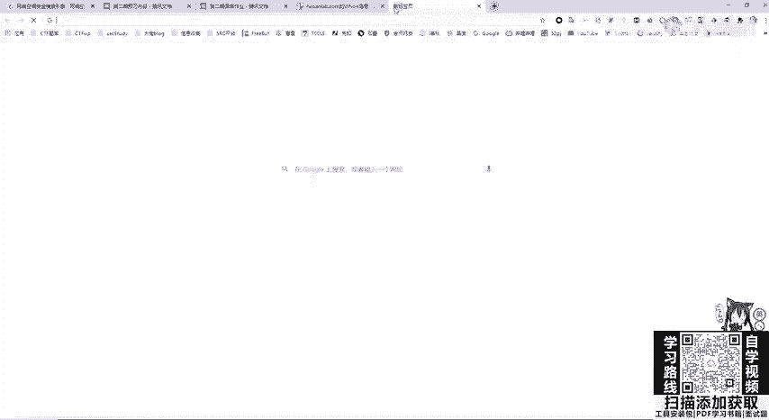
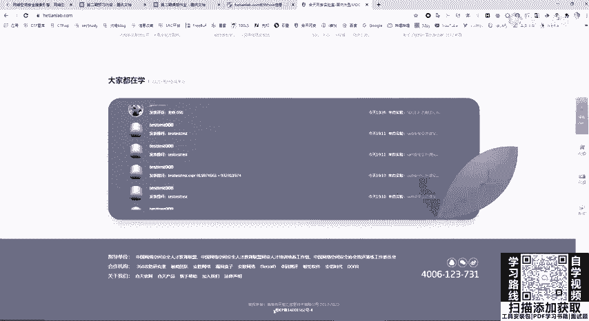
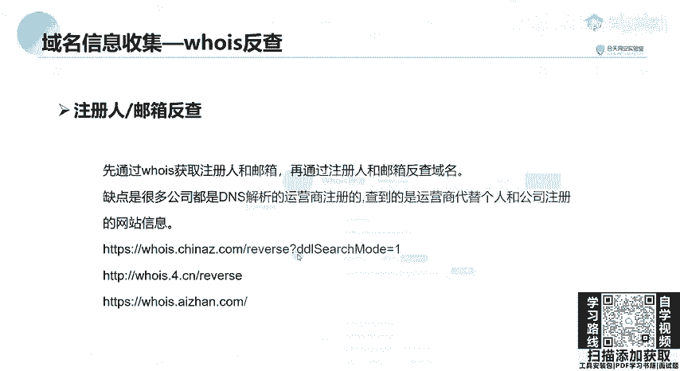

# B站最全网络安全教程，整整1300集，全程干货无废话，别再盲目自学了，看完学不会我退出网安圈！（web安全｜渗透测试｜内网渗透｜CTF） - P28：26.域名信息收集 .mp4 - 网络安全官方教程 - BV15u4y137cQ

首先我们来看什么是域名。域名很显然，大家已经非常清楚了，现在已经是网络时态，也就是用一串用点分隔的名字组成internet上一台计算机或计算机组的名称，也就是域名就代表计算机名。

域名相对于IP是互相对应的，是通过DNS又叫做域名解析系统，将域名和IP地址相互映射，映射成了一个分布式数据库，能够使人更方面的访问互联网。当我们访问一个网站，比如核天la，我们核天网安实验室的官网。

如果让你去输入核天实验室服务器的IP址，这个是非常的啊不容易记忆，也不容易访问。那我们把它通过DNS映设为我们的域名核天la这个大家就非常容易记忆。

访问微博3W微博点com访问百度百度点com这些就是通俗易等的域名。域名分为顶级域名、二级域名、三级域名等等。顶级域名，也就是我们域名最后面的这一个啊，最后面点后面的字母为点com顶级域名有很多种类。

比如普通的国际顶级域名点com政府域名点GOV商业教育域名点EDU在我们政府政务网站一边一般是以点GOV进行结尾的。我们在没有得到一个授权的情况下，是一定不能对GOV进行渗透或者是扫描及信息收集。

有可能你对GOV进行一个啊一个一个输入框，你对它叉SS一下，有可能后面就请你去喝茶了。教育域名EDU大家如果挖SRC就是一开始挖不到的话。

可以去尝试挖一个叫EDUSSRC一般嗯各个高校嗯使用的一个域名都是点EDU结尾的。who isho is呢就是用来查询域名的IP及这个域名所属的这个管理者信息。

也就是用来查询域名是否被注册以及注册域名的详细信息数据库。比如说域名的所有人，包括域名的注册商，这就相当于我们去一个商店里面，这个商店，包括公司都会有一个工商注册信息，我们可以通过一些外包接口。

比如说天眼查去查找这个呃公司这个商店是谁开设的法法人是谁嗯，是在哪里，是在哪个板块上市的。who is呢也就是同样的道理，它是用来查询我们域名是谁注册的注册商是什么？那呼意呢其实就是一个啊服务器。

我们通过Wiz查询，可以获得域名、注册者、邮箱、地址等信息。一般情况下，中小型网站域名注册者就是网站管理人，我们可以利用搜索引擎，对hoiz查询到的信息进行搜索，获取更多域名注册者的个人信息。

我们来看会iz应该如何去查询。首先，web接口查询这是非常方便的。有阿里云的护iz查询接口，还有站长之家的护s查询接口。我们这里站长之家来回例给大家看一下啊，这个都是一样的啊，哪一个都是一样的。

它都是请求我们的会iz服务器。啊，在这里。在在这里啊直接。去找我们的，比如说隔天lab。点COM。可以看到这个是和田的意信息。可以看到它的创建时间，包括DNS解析。DNS服务器的一个情况。

这里的注册商包括联系邮箱，都是他的，就是一个代理商，也就是阿里云。因为我们现在注册域名，包括自己搭设博客网站去注册域名。你不会自己向工信部去申请域名吧，你总是去找注册商，比如腾讯云。

还有阿里云万网进行一个注册。这里的话你进行你自己注册的域名查询。那这里的注册商和联系邮箱就是阿里云这个注注册商的一个邮箱。当然，也可以使用一个hoiz命令行进行查询。

hoiz命令行在卡利里面就可以使用啊，它也是请求hoiz服务器，这直接进行hoizhoiz百度。就来查询一个百度的信息。那我们继续来看。第二种方法，查询备案信息。查询备案信息，什么是网站备案？

在中国大陆进行网件搭建域名解析，都需要对网站服务器进行备案。在备案之后会生成一个网络ICP域名备案号。一般在中国大陆的网站最下方的banner都会显示这个备案号，就以和天网安为例。

在最下面可以看到它的备案号是西ICP备加备案号。

如果在国内你搭设网站不去备案的话，是没有办法进行正常域名解析的。所以我们可以使用备案号信息去搜集这个呃网站的一个管理员信息，包括庞站。还有子域名信息。这里我们还是以。公司的和天lab。哎。

可以看到这个跟刚刚我们看到banner上面标注的是一样的。同时这个嗯注册这个单位还会注册着其他的网站。比如说点ORG点啊这个竞赛系统一些。资产这就可以暴露公司的一些资产。那。

下面呢可以经过经过这个呼意获取的注册人和邮箱进行反查域名，这个是实际是不太实用的。因为刚刚已经说过，很多公司的DNS解析，包括域名的注册都是由运营商，也就是中间商代理商进行注册的。

查到的这个运营商和邮箱注册人都是代理商的信息。这个已经不常用了，大家想使用的话也非常简单，只需要在我们刚刚查找的那呼意里面去点一下那个邮箱即可。

