# B站最全网络安全教程，整整1300集，全程干货无废话，别再盲目自学了，看完学不会我退出网安圈！（web安全｜渗透测试｜内网渗透｜CTF） - P30：29.端口信息收集 .mp4 - 网络安全官方教程 - BV15u4y137cQ

对。端口端口是什么呢？在互联网上，各个主机通过TCPRP协议发送和接收数据包。那我们每个数据包它需要知道主机的IP地址进行网络互联网路由选择，从而将数据包顺顺利的传给目标主机。那它需要传给哪一个服务呢？

这就是通过端口号来一个区别。端口呢是根据提供服务类型的不同，可以分为TCB团口和UDP端口TCP和UDP是传租层的两个通信协议，一种是面向连接的可靠通信协议，一种是无无连接的不考客不可靠传输协议。

那TCP大家如果学过集团性网络，应该知道它是有一个三次握手的过程UDP是没有的。TCP协议的端口和UDP协议的端口是相互独立的。大家要知道。那端口的类型呢分为三种，是根据端口的大小来进行划分的。

一种叫做周至端口是0到1023这10001024个端口。这些端口呢是。系统固定服务的一个端口号，也就是众所周知的端口。比如80是3W服务，也就是web服务的一个端口。第二种端口叫做动态端口。

一般不固定分配某种服务是49152至65535这个最大端口。这些大端口是不固定分配某种服务，也就我们可以进行使用。第三种叫做注册端口，范围是从1024到49151是用于分配给用户进程或程序。

当我们比如哎进行一个web服务链接连接的时候，你去访问web服务器的80端口。外b服务器会发送response响应包返回给客户端，那客户端上面就会有一个端口去接收这个response。

那这个端口就属于注册端口范围，是分配给用户进程程序。端口的作用，我们为什么要收集端口呢？那把服务器可以比作一个房子，而端口呢比作进入这个房子的门门。那我们作为渗透测试就是作为一个窃贼。

我们需要进入这个房子。那窃贼想在门经过房子，主人允许进入房子就要破门而入。那在破门之前，那我们肯定要知道这有几扇门。这个门呢是什么东西，门是铁门还是木门好不好破，门后是什么东西，也就是俗称的踩点。

踩点踩的越多，对，顺利的渗透就至至关重要。Yeah。在渗透测试端口中，我们需要了解周至端口。周日端口有哪些端口具有一个渗透测试的可能存在漏洞，进行一个破门而入呢。通常是具有这些端口。

我们来一一看一下重点的一些端口。首先啊这个是FTP文件传输协议，是使用2120呃用于。20呢用于传输数据。21用于控制传输信息。这个呃大家如果学过网络的话。应该是呃很清楚。FTP文件传出协议。

它有哪种有哪些可疑的漏洞点呢？第一个叫做FTP爆破。我们可以使用HIDIR这个软件这个程序在这个呃卡里里面也是有的，可以看它的一个使用方法。它可以爆破各种的服务啊。

可以爆括各种的服务可以看到有FTP有脏吧。有嗯SMTP有SSH等等，还有VNC。第二种叫做FTP匿名访问。当FTP没有开启一个验证的时候，我们可以使用匿名用户密码为空登录FTP服务器。

那可能会泄露敏感信息。第三呢，FVSFTPD这个是林操作系统的FTP服务器。那就可能存在后门热洞。通过其可以提全到root权限。这个大家可以自己去搜索，并且啊尝试看能不能利用。第四呢就可以进行一个秀探。

因为FTP呢是使用铭文传输，这里就还有后面的远程代码溢出跳转攻击，这些就是啊比较不常用了。大家可以进行了解一下。这里主要是对主要端口进行一个介绍和了解。如果零基础的同学就是一定要知晓这些端口。

也可以就是之后会把这个PPT发到我们群里，也可以把这些保存一下，进行一个查看和记忆。第二呢，SSH就是啊远程绘话接口啊，远程传输协议安全传输协议。那我们可以利用这个远程登录服务器。同样它也具有弱口令。

还有一个用户枚举端口SSH大家应该就非常熟悉了。那我们需要连接到我们的卡利里面，就可以使用SSH的客户端进行连接一个服务器啊，连接服务器这里。

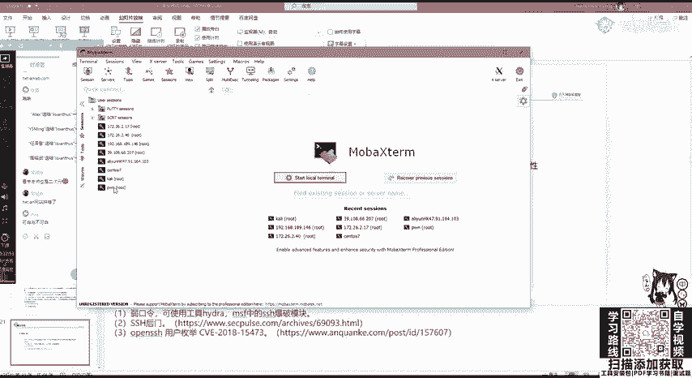

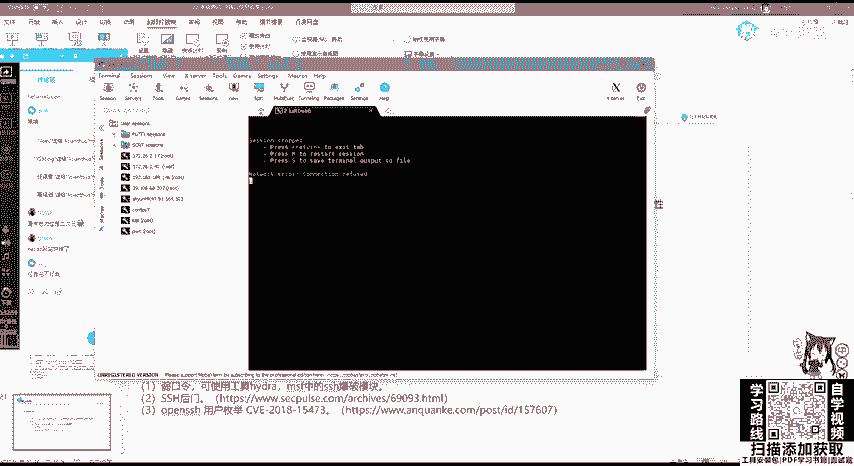

啊，能连上应该是这个服务是没开。这。对么。把它开启之后。

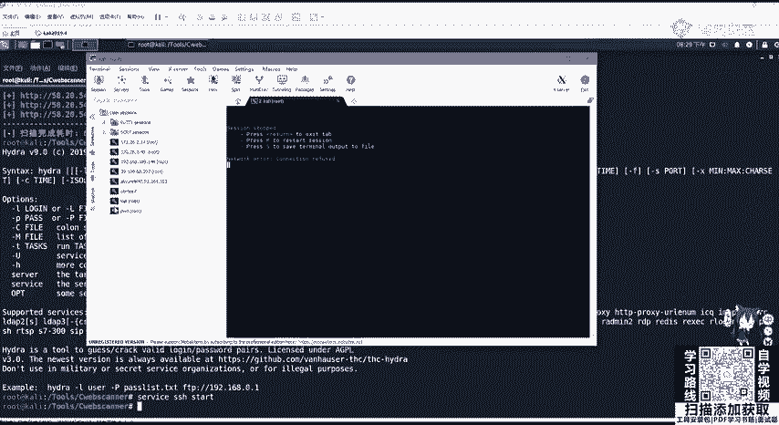

啊，我们就可以连到就我们这个服务器，就可以对它进行一个shall一个操作。它的端口啊是22。tnettelnet也是一个比较相似的SSHSSH叫什么？叫。安全sha。

而tnet呢在我们的windows下是十分脆弱的，它是没有经过任何加密，就在网络中进行传输。那我们如果对它的流量进行一个拦截，就可以获取截取远程登录的一个密码。SMTP邮件协议啊。

邮件协议这个可以利用这个服务发送钓育邮件，分别是25和465端口。3W最常见的超文本传输协议HTTP。是用于我们web服务器的一个站点啊传输。那我们通常呢80端口是使用中间键的。

比如IIS阿帕奇engstomcat等等。我们一般通过外部应用程序常见漏洞，OWISSP可以对80端口进行一个攻击，或者是使用中间界的漏洞。比如阿帕奇的任意文件读写漏洞。下面桑把。

共享文件服务一般是139。和445。用linux叫做sba服务445端口，大家应该知道有一个特别出名的漏洞啊，有几个特别出名的漏洞MS17010MS08067都是sma服务所具有的漏洞。

包括今年的这个永恒之黑，都是sma445端口的漏洞，大家可以去搜索，利用，直接去搜它的脚本去跑，或者是使用mata split进行一个渗透测试框架利用即可。myoccle3306myocq数据库。

一般我们使用PHP进行web服务搭建的时候，会使用myocq数据库。那mysoqcle呢可能会存在一个弱口令，或者是呃进弱口令登入myoccle进行一个提全。

RDP33893389是我们windows远程桌面鉴听端口，可以进行。如果3389进行开启之后，可以对远程桌面进行一个连接。OK这里也没有什么了，就是1个RDP的一个爆破攻击。

还有一个死亡蓝屏MS12020，远程桌面漏洞，包括MSMSF通过外部漏洞开启RDB或者是调用注册表开启远程桌面进行远程桌面里连连接。大家都知道。

如果我们使用admin去连接了这个windows路器的远程桌面。那我们就对它拥有绝对的控制权了。所以445端口和3389端口是一个漏洞非常多的，一般也比较常见。

readdis redis是一个可持久化的日志型数据库，它一般存放在内存里面。这里我们一般是readdis弱口令未授权访问。也就是我们可以通过SSRF去打造6379端口readdis进行一个未授权访问。

Yeah。weblog weblog7701是中间界oral的它welog SSRF及反循环复盘序列化漏洞，这个对影响是非常大的。大家也可以去搜索利用在后面的课程也会给大家去讲SSIF和反序列化漏洞。

tom cat8080tom Tom to cat是阿帕奇的一个分支，一般用来GSP，也就是java web page的一个服务。我们通常对加接写GSP的时候进行运行。

一般是使用topcatca作为中间键。那tomca也具有任意文件上传上传或管理页面若口令get share等漏洞。大家可以去自行搜索。这个都是要去积累，然后去发现这些端口。那我们进行端口扫描。

一般是使用N map。N map是一个啊不老的神器，一直都很好用。如果你使用它把它使用好了，那它去探测网络是非常快的，并且可以进行一个漏洞的扫描和利用。

N map是一款开放的源代码网络探测和安全审核工具。那它的一个参考指南有中文啊，中文参考指南，这个我也经放到我们的预习资料里面了。大家可以去看一下这个参考指南。

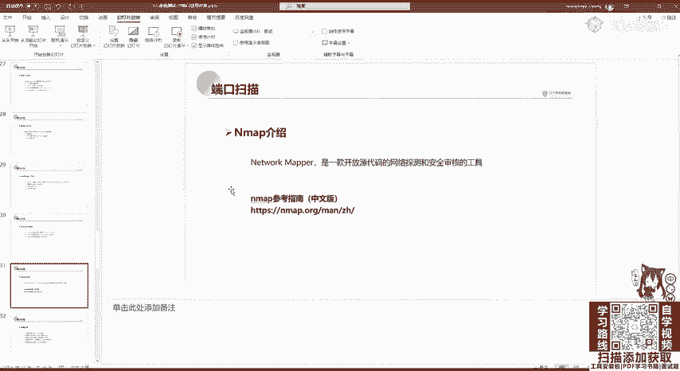

他会告诉你端口的一个扫描。功能介绍很简单。第一个主机发现，刚刚已经说过了N map杠SP加上我们的域名或IP地址进行1个C段的扫描。第二。也就是我们今天要讲的探测主机开放端口去攻击这些脆弱型端口。第三。

可以检测相应端口的服务版本，比如三大服务，它只是特定的版本，具有MS08067等等漏洞。那我们可以探测，通过M map探测相应的端口软件版本。第四。

N map能够帮我们检测操作系统版本硬件网卡地址及软件版本。第五，N map可以帮我们检测脆弱性漏洞。那Nm有很多脚本可以帮助我们检测漏洞。当我们使用Nm进行端口扫描的时候。

回显过来的一个端口信息就只有啊常见的这三种。后面几种就是大家看一下就行。首先open，这很明显是端口开启，并且。意思是数据有到达主机，有程序在端口上监控啊，这里就是端口开启close很简单，端口关闭。

那filter这个是意思是数据没有到达主机返回结果为空。这里呢一般是被防火墙或者是硬件IDS流控给过滤了。啊，我们一般会遇到这三种。端口状态。它的基础用法非常简单。

使用GNM杠I可以进行一个全面扫描杠T指定它的一个。呃，速扫描的速度，这个T可以指定从0到5。越高它越快，T0代表非常慢的扫描可以逃避IDS硬件的一个检测。而T5呢是极速扫描。

这种扫描会降低这个端口检测的准确性。我们一般是使用T4，也就是快速扫描。在网络环境很好的情况下，这个扫描是很快的，很方便。在默认情况下，这个Nm并不会扫描所有的端口，因为扫描所有端口。

它这个数据是非常的大非常的慢。它默认是扫描周知端口，也就是1到1024。那我们这里可以啊尝试扫描一下。对。Yeah。NMNM杠A杠T4那且扫描我们的这个隔天lab。Yeah。Yeah。

m的扫描会发发起大量的数据啊，如果对面有waf或者是IDS，其是的IP是很容易被搬掉的。这扫子也挺慢，那我们先继续看。那它的基础用法呢可以对单一主机进行扫描，也可以对子网进行扫描。

子网扫描这里也已经说过了，也就是加上子网掩码。进行子网扫描，也可以对多主机进行扫描，也就进行排列。进行主机范围扫描，用com指定扫描1921681。1至1921681。100。也可以将。

IP地址写到TSD文件里面，用杠Iimport l import list进行一个IP地址导入扫描，就是批量扫描。当然这个过程是非常慢的是非常慢的。刚刚我们看到扫一个都特别慢，那它还没出来，他还没出来。

那我们再不解。在扫描的时候，对子网进行扫描，也可以使用杠杠exclude进行一个。呃，去除。比如这里我们不想去扫描点一这个网，因为它一般是作为我们的网关，我们扫描它没有什么用。

也可以把除IP外的子网主机写到TID文档里进行去除扫描。也可以指定扫描主机上面的端口。比如我们不想让它变异1到1024去指定802123去扫描这个端口有没有开放。如果是扫描全端口也非常简单。

就是使用我们的这个啊杠P啊，0至65535进行扫描。当然这个过程是非常慢的。这还没出来。啊，对的，官网有这个叫ZN map，这个是一个窗口界面，窗口界面还可以看到top图。

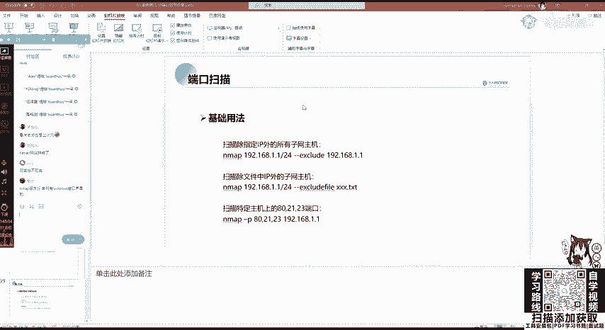

那我们来继续来看，通过MM进行探测主机，我们可以使用啊配合cut cut命令进行一个探测。使用M appM map这个参数啊非常的多，大家可能一时半会记不住，这没有问题。大家只需要记住这几个关键的。

比如杠I杠T4，然后其他的大家可以照着这样敲多敲两边多接两个渗透的项目，那你肯定就能记住了。

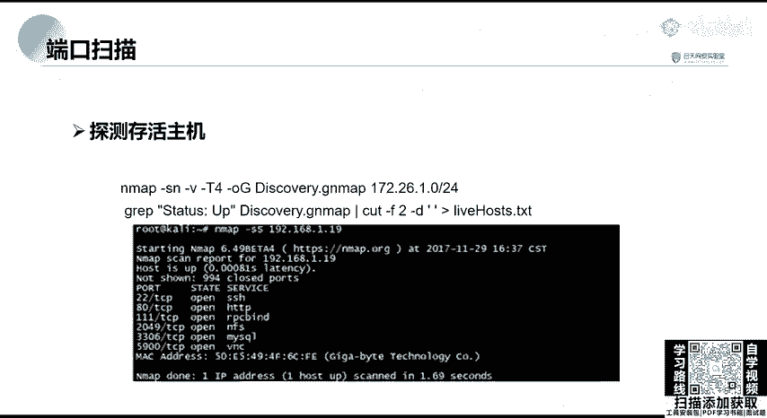

那这里SN啊我们来分别的看一下，首先SN它是等于SP的，也就是进行P扫描。P扫描大家知道吧？就是相当于按ICMP这个协议。

杠V可以扫描它的端口杠T4刚讲过了，杠OG啊output outputput G是以GN map进行一个文件导出，就是将扫描的结果导存在这个discoveryGN map这个文件里面，扫描内容是172。

26。1。0的所为网段。

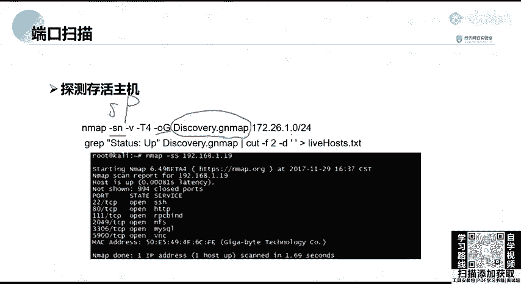

这里也可以给大家去演示一下，就扫描我们这个咖利在这个网站就行了。这里我直接给的。

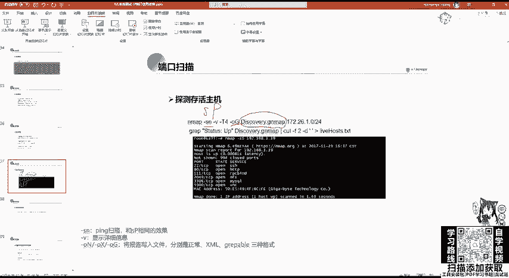

退掉了，这里扫描扫描出就是那些端口嘛，这个核天是有IDS的，你会扫到扫到很多filter。那我们这里看A map。首先看一下我们的IP地址啊，189135。

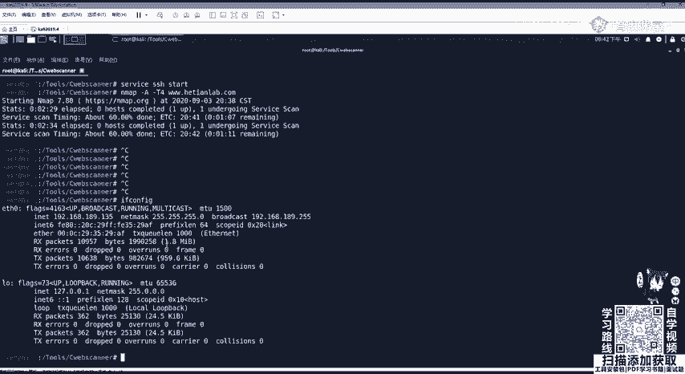

。

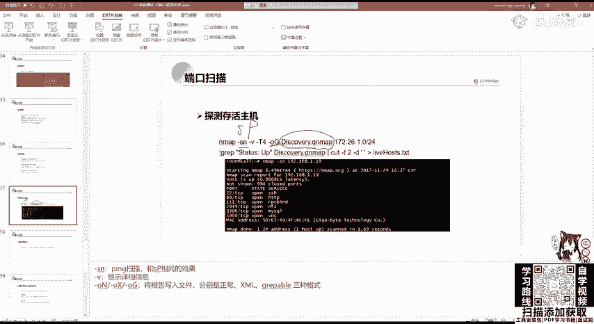

。进行1个192。1168。189。0224进行一个扫描。他会扫描，这是可以看到扫描的一个结果。那他是告诉有4个啊，这个是开启的那我们可以ca一下这个。这是扫描一个结果。

那有up有down down就是关闭up是开启。那我们这样看是不是非常复杂非常复杂。那我们可以使用lin0克斯自带的啊GREP和cut进行一个查找。

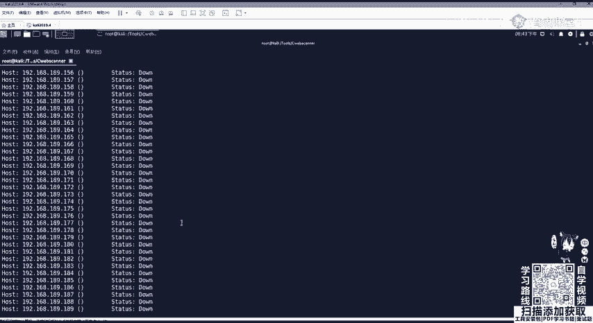

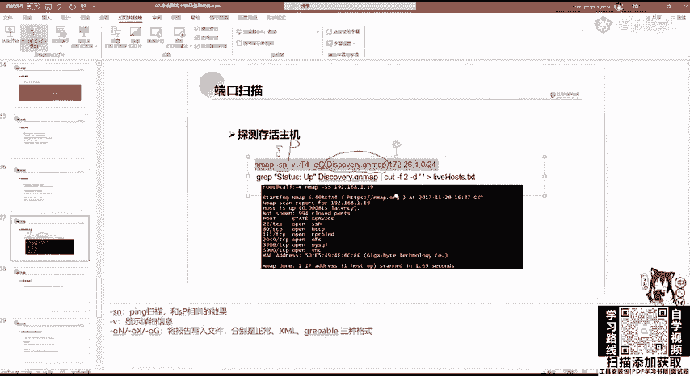

查找之后的这个内容放到live host点TIT这个文档里面，使用GIEP去查找up的这个东西，直接复制过来。

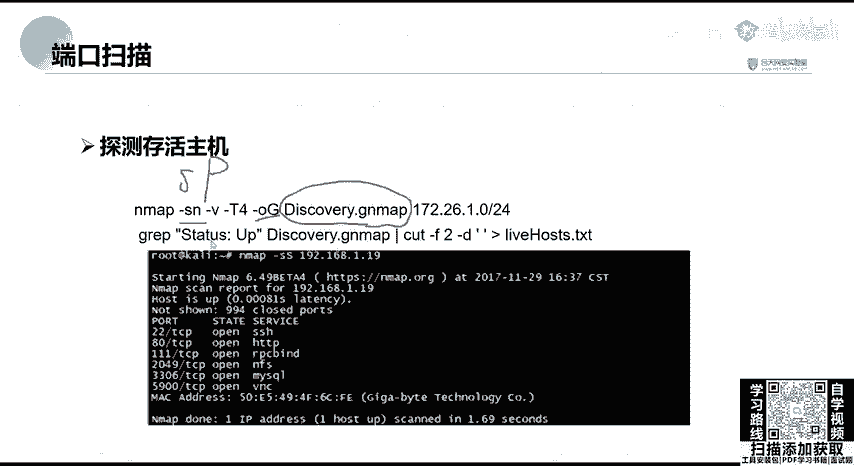

。呃，他放来之后，我们去查看这个li host，那这些就是开启的。可以看到135，我们本机是开启的一个存活主机探测，它速度也不慢也不慢。

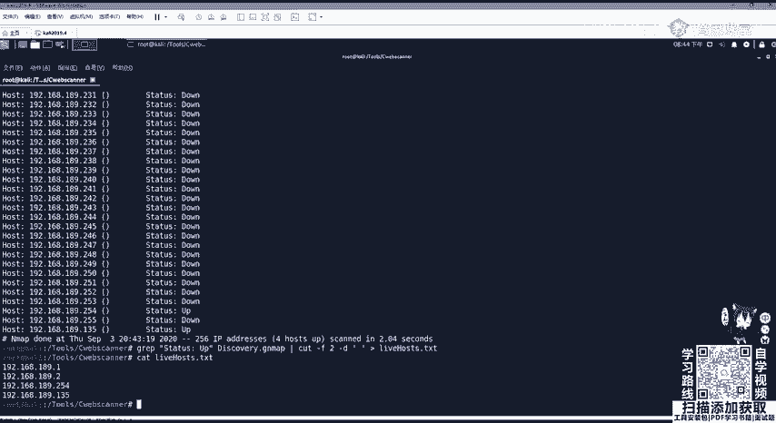

啊，非常快的这个。那我们可以对存活的主机，也就是刚刚我们就进行了一个C段探测，进行一个全端口扫描。在全端口扫描的时候，我们一般不推荐使用SP和SN因为ICMP会接收响应包，它会发包，并且接受响应。

有一个叫TLL值，它会接受响应的那我们一般是使用SYN进行扫描。SYN大家如果学习TCPIP的时候，应该知道，当我们进行TCP第一次握手的时候，是由客户端发给服务端SYN这一个呃数据。

然后进行一个回复ICK那SYN这里呢就是单独SYN扫描。它不会从服务器接收响应。这样的话就可以更好的防止。IDS对我们访问进行一个探测。

还有把IP给封锁掉PN呢就是no pin不使用pin杠P杠V杠T4。刚刚已经说过了，杠P就是指定端口。我们对全端口进行扫描杠O是使用output导出导出什么呢？

导出nomal使用默认导出导出名称为ful tCP对livever house点TIT里面的这些进行一个全端口扫描。那我们来看SYN扫描在Nm中叫做半开放式扫描，它不会进行一个完整的TCP连接。

它的特点呢是执行特别快，效率高。因为1个TCP连接需要三次握手，而SS选项不需要握手。A map发送到通过SYN包发送到远程主机，不会产生任何的绘话。也就是说。

目标主机几乎不会把连接的这个日志进入到系统日志里面。啊，这里因为他特别慢，就不给大家演示了。下面还有一些常用的N map语句啊，这里就是这些参数刚刚都已经讲过了。好，S oneA扫描no p。

output以那个N map的GN map的格式进行一个扫描。啊，下面SV进行一个版本探测刚O是查照操作系统，就是是探测操作系统。刚SV探测每个服务的版本号。当然你探测东西越多，它的速度就越慢。

这些是一些常用的命命令。同时，n map也可以进行一个漏洞扫描。在我们N map的 screams这个目录里面，它是有很多这个扫描工具的。这里有非常多，可以看到有CVE编号可以进行进行扫描。

包括sb的一些服务，永恒之蓝啊都可以进行扫描。这里呃比如说进行扫描M17020，它是45端口，也就是sba服务的一个漏洞。我们使用45端口杠V显示详细信息。

然后杠杠script指定我们要扫明的扫描这个脚本sba啊这个gost，也就是这个08这个17020进行对192168点1。0这个网段进行全部的扫描。如果有的话。

我们就可以利用现有的POC或者是mattter split进行一个攻击，获取服务器的下有权限。Yeah。在这里对m大家有没有什么问题他的使用？当正大家按 map还可以使用pathon啊。

python有摁 map这个包的，也可以使用n map辅助python脚本的编写。下面我们来看其他信息收集。

