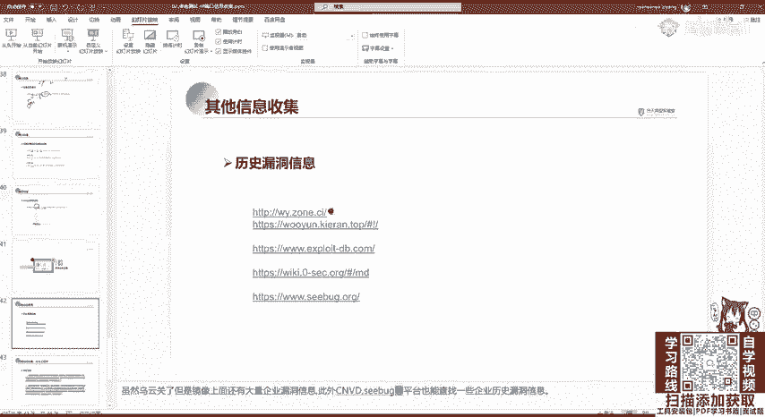
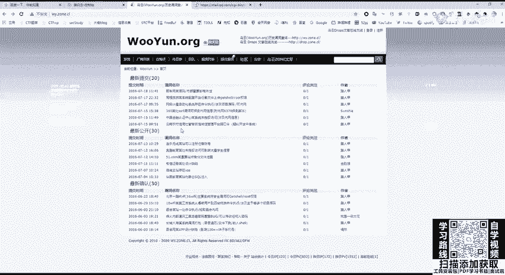
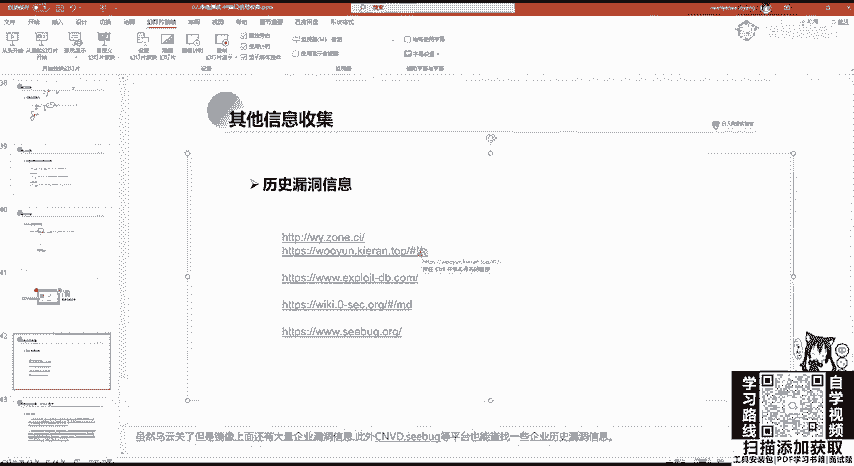
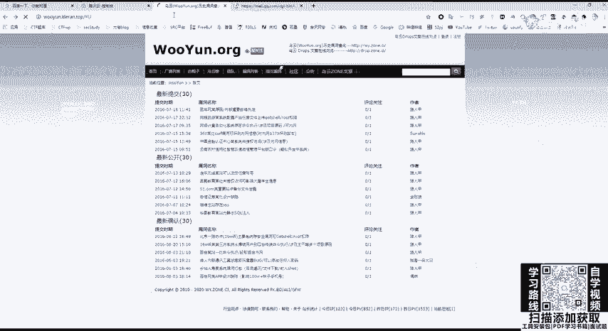
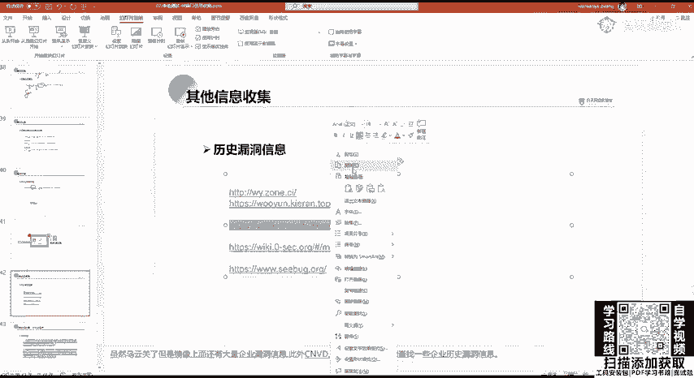
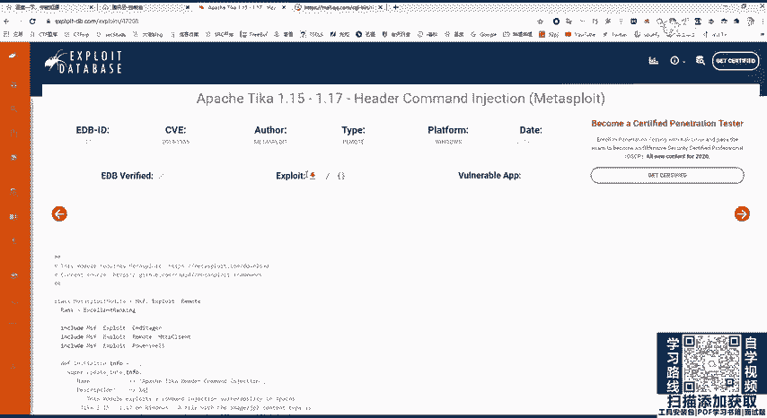
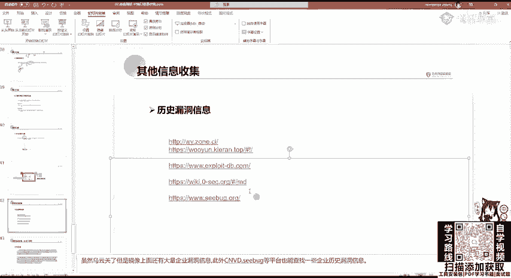
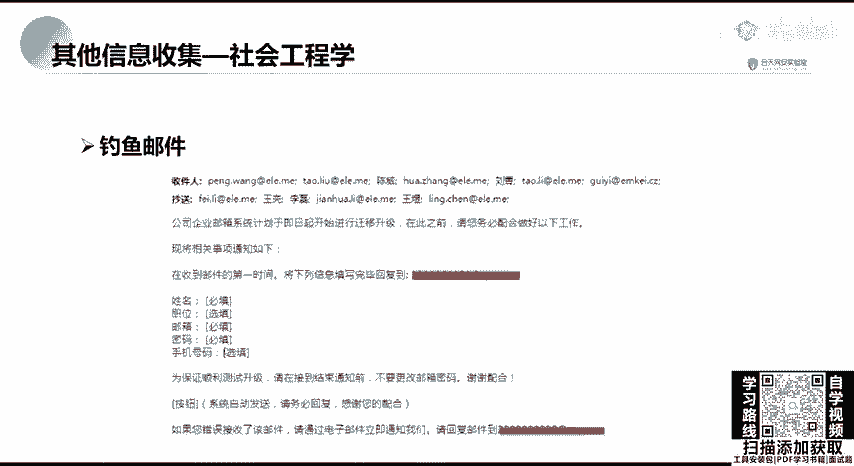
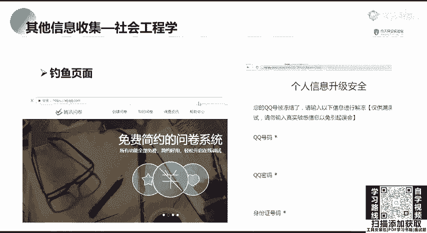

# B站最全网络安全教程，整整1300集，全程干货无废话，别再盲目自学了，看完学不会我退出网安圈！（web安全｜渗透测试｜内网渗透｜CTF） - P31：30.其他信息收集.mp4 - 网络安全官方教程 - BV15u4y137cQ

其他信息收集一般是对一个历史漏洞收集。也就是啊我们现在拿到一个网站，它是CMS连CMS或者是森科PHP阿帕奇啊，我们当探测到这些中间件或者是网站的架构之后，我们需要对它进行攻击。

那攻击我们不可能去自己写攻击脚本。那我们要拿现有的漏洞，也就查看历史漏洞信息，这里有几个平台，首先乌云。因乌云的站是已经早到关闭的。但是乌云镜像，它上面还是保存了呃很多东西的。

这个你去百度搜索或者自己搭建都行。啊，这里乌云镜像，很多路人甲路人甲乌云大佬路人甲补天带头大哥。

。

。第二个就是污云的知识库。

这些啊都会发给大家。

无云的一个知识库可以在这扫描啊，比如说。这个想学啊，胖啊，就搜索ROP这上面就有ROP的一些知识。想学SSRF。啊，直接去搜索。

下面呢是一个exlo dB历史漏洞，包括E叉P的一个搜索。

这是一个国外的平台。而，这里我们想搜索阿帕奇有哪些漏洞，那我们可以在search这里面输入阿帕奇进行搜索。可以看到啊，这是阿帕奇输入这个漏洞。包括其他的一些啊。

它有的是有这个E叉P的啊explode我们可以直接把它下载或者是查看，然后直接拿来用就行。

。还有Cbu也是非常好用的等等。还有其他的。

啊，这个是制造创业平台的，都差不多。

是。

这里可以看啊，有些是有详情的这些呃word price或者是深信福的EBR宝塔的未授权访问这些漏洞，可以去查看历史漏洞信息，并且搜索跟如何攻击进行攻击。还有进行收集社会工程序。

社会工程学一般啊用在我们这个比如。现在我需要对一个网站进行渗透。我需要登录到后台，发现这个后台登录页面，没有搜Q入入，也没有逻辑漏洞，也没有任意密码重置，啊，也没有弱密码。那怎么办呢？我们发现这个。

这个网站后台登录页面呢有一个管理员的邮箱，那我们就可以伪造相当于伪造一个公司的高管或是其他的客户，对这个网站管理员去发发一个邮件教育邮件进行一个密码攻击。

就像我现在在像QQ向你发一个请告诉我你的QQ密码啊，就是这样这一个钓鱼。那社区工程学，大家觉得哎这个好像没什么，但是他的危害是特别大的。像电竞诈骗，一般就是使用社工库进行查找。

就比如这个区域案就是呃山东省的这个高考信息，招生平台，这个被窃取，然后通过呃状库等把这个库给拖了下来。这这些高考招生信息就泄露到黑客这个手里，这个黑微产产业的这个手里。他通过个人信息进行骗取。

导致这个徐玉宇啊，这个最后死掉了。那这是一个电信诈骗。那，社会工程学的危害是非常大的。那在真正的互网过程中啊，也是有会遇到这个社工钓鱼邮件的这个攻击是经常的。啊，多钓鱼邮件就告诉你啊。

企业邮箱现在要升级了，你要告诉我你的姓名、职位、手机号码，还有密码。你看这个姓名、职位其实都没有必要。主要是要这个密码啊，主要是要这个密码。同时也有这个钓鱼页面，钓鱼页面啊。

这个mattter split，还有copo strike都可以生成钓鱼页面，或者是卡利里面自带的，你可以去搜索生成钓钓鱼页面啊，去钓个人信息是是用这种问卷系统。

或者是我们可以在啊之前啊前几年在QQ空间可以发现有什么啊同学录啊，或者什么问卷系统啊，其实都是就是对你的个人信息进行一个钓鱼，或者是伪造一个抽奖啊，抽奖的时候，你需要输入你这个游戏的账号和密码进行抽奖。

那你输入它的后台就抓到了你的这个登录的密码。

那你的账号就泄露了。Yeah。那那这节课那就到这里。主要是讲了IP及端口的信息收集。那社会工程学大家如果有感兴趣的话，可以自己搜索一下。当然，现在国内对社工库是肯定都没了啊。

这个是不要轻易去搞这个东西啊，也没有什么用。你在YSRC的时候，你是不能用社工的。