# B站最全网络安全教程，整整1300集，全程干货无废话，别再盲目自学了，看完学不会我退出网安圈！（web安全｜渗透测试｜内网渗透｜CTF） - P32：31.网站指纹识别 .mp4 - 网络安全官方教程 - BV15u4y137cQ

那我们开始今天的课程，嗯，今天就是信息收集的最后一讲了。我们在。拿到我们渗透目标之后，首先进行域名信息收集IP信息收集端口信息收集。最后呢就是对这个外国服务器，及网站进行信息收集。

因为我们一般的渗透目标都是对外国站点来进行收集的。像我们大家去挖SRC啊，肯定都是挖这个网站或者是APP漏洞，你去挖系统漏洞挖CVE这个就是呃很高层面的一个漏洞挖掘了。

就是二进制方向的漏洞挖掘就不属于渗透测试的一个呃过程了。那这里呢我们如何对网站的信息收集。今天我们就来一一的讲解。其实非常简单，无非就是这三种。网站指纹的识别敏感文件及网站目录的探测。网站waf的识别。

wa呢是web应用防火墙的意思。那我们首先来看网站指纹识别，什么是网站的指纹呢？我们首先要了解一个网站最基本的组成，就是由服务器中间件、脚本语言和数据库组成的。那么服务器也就是操作系统。

一般呢是有linux操作系统和windows server这两种中间键为we部容器，也就是开启80端口的web容器。有阿帕奇。tom cat engineer等等。

还有脚本语言GSPPHPISPSP点net，还有python的 dejangle和flask等等。数据库my circlecle s server，oracaccess等等数据库。

这些四个东西组成了我们的外b网站。为什么要了解网站的一个指纹呢？很简单，如果我们发现一个漏洞文件读取漏洞，我们需要读取敏感文件，比如ETC password。但是如果是windows系统。

根本就不会存在这样一个文件，那我们就需要首先知道它的一个操作系统。操作系统这里判别一般是通过三种方式。第一种pin。P之后啊之前也说过。

是以ICMP有1个TTL值windows的TTL值一般为128linux呢则为64，啊，一般为128。那我们可以确定当TTL大于100，一般啊我windows服务器，而小于100的。

一般为linux服务器。这里啊可以给大家去看一下，很简单，你就去拼一下就知道了。比如说我现在拼我们的本地这个记得啊，本地就是回还地址127。0。0。1。

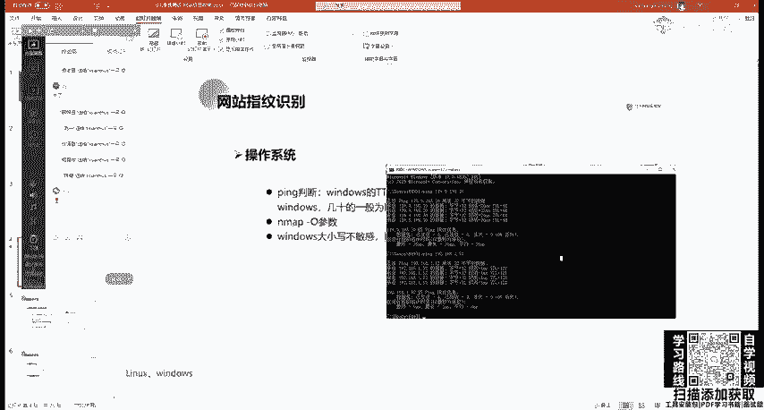

看是不是128128，说明我们win10啊是windows NT操作系统。那我们去定卡里这卡里，我们来看一下他的1个IP地址。

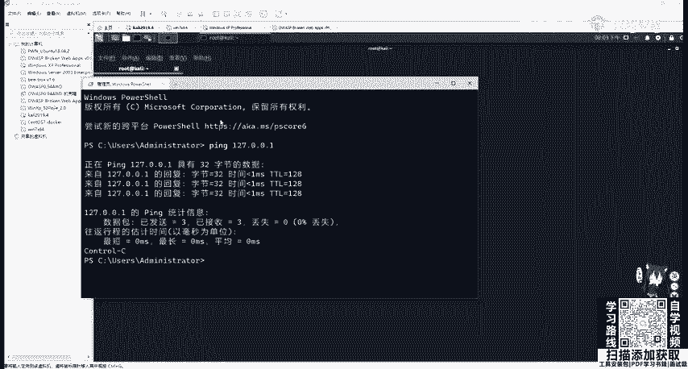

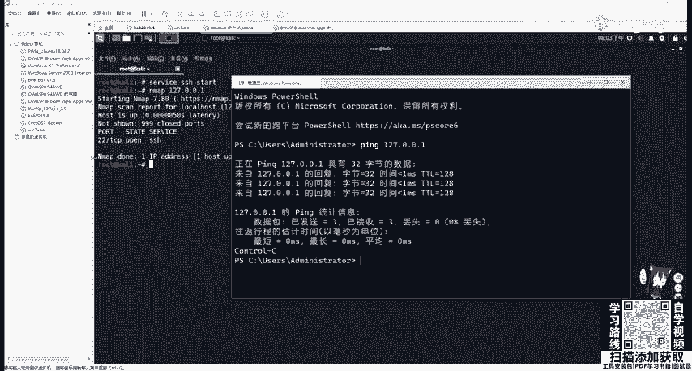

他的RRP地址啊，这个135，我们把它给复制下来。

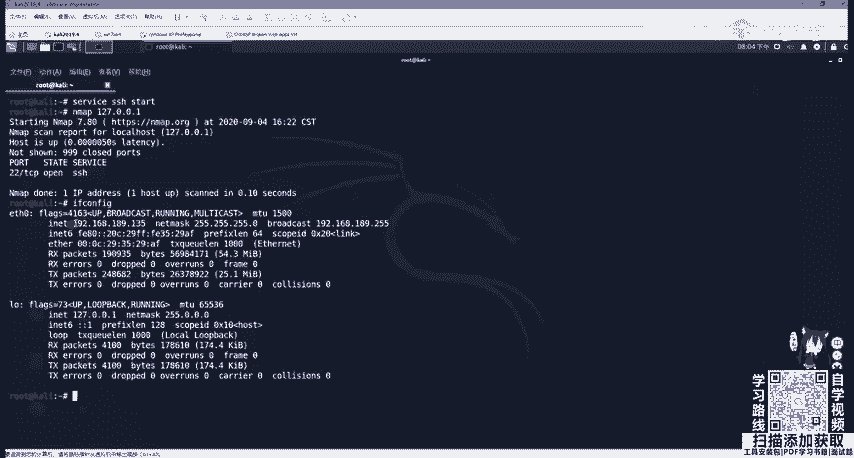

进行pin。可以看到这里是64，也就是小于100的那就很明显。可以用一般，你不能说确定一般几时的就为0克4。第二个方法，使用我们昨天讲的N map杠O参数进行识别。

MF杠O比如我们现在啊就是对189网段进行一个。

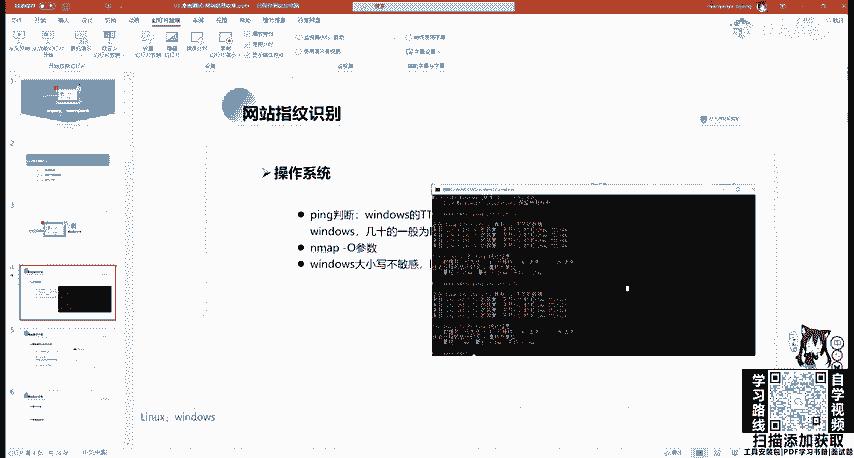

便利扫描并判断每一个网的一个操作系统。那我们我先把这个一些虚拟机都打开，他们都是处于一个网段，用一个net网卡的那使用n map。

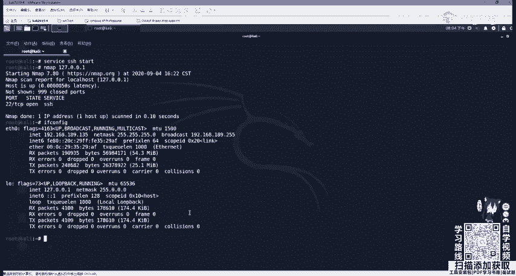

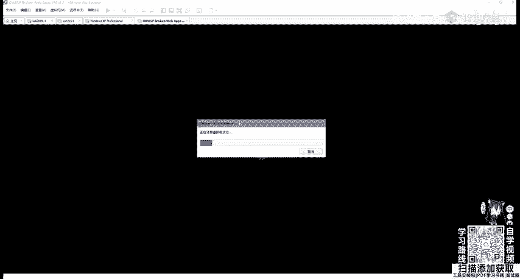

杠O在杠啊，可以杠PN，也就是不使用P在杠T4。OK在杠。哎，也行，指定我们的192。168。189。0，加上我们的杠24子网掩码，让他去扫描。来看一下。这些N map的参数，大家不一定一定要去死记啊。

大家多敲两遍，你差不多就知道了，不知道的时候就翻出N map中文手册，或者是直接在命令行里面敲N map，它就会显示它的一个用法。OK让他先在这扫吧。

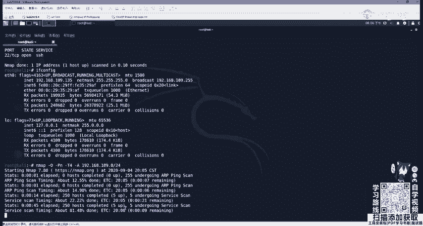

先这小，那我们继续看。还有一种叫做windows大小写不敏感，而linux区分大小写。这里我们最直观的地方就是在UIL地址栏里面。这里我给大家啊举个例子。比如。这个windows叉P系统。

我们开启了PNP study。里面呢我装他的一个地址是133，那我们访问一下他。访问一下它里面我已经装好了DVWI。我们可以把它登进去。Yeah。对之后，我们啊随便点个地方。

大家可以看到这上面的URL地址都是小写的。我们windows服务器是大小写不敏感的那我们把这个DVWI，我随便改一个为大写啊，我改成D大V会发现访问的还是这里，那我把index改成个大写。

访问的还是这里，这是最明显的区别。windows大小不敏感。那我们再看linux操作系统呢。

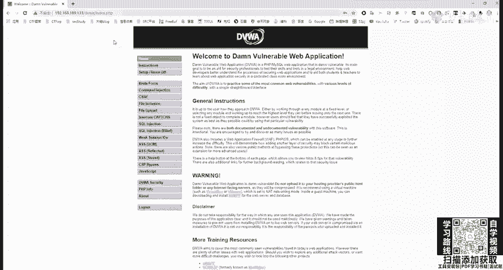

再看这个linux的操作系统。

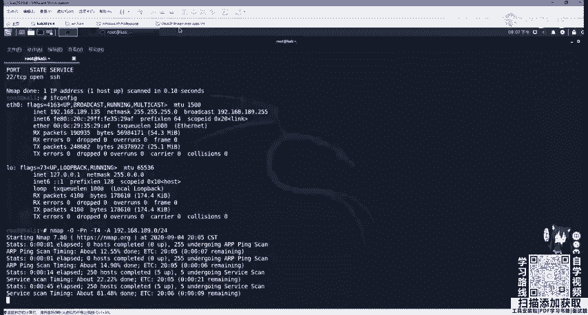

Yeah。这个服务器地址是139，是OWSPBWI这一个操作系统。我们访问他的IP地址139。

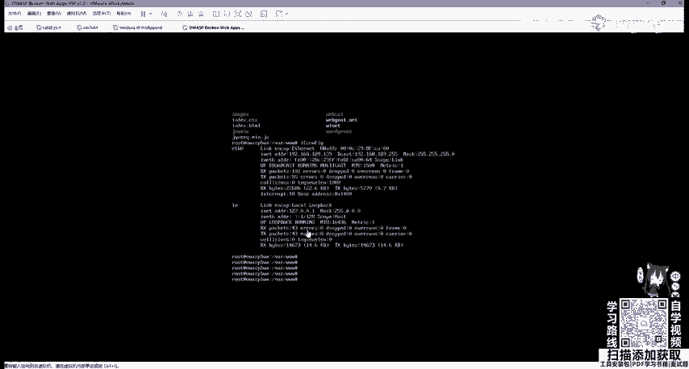

OK我们随便来到这个网站中，比如我们来到这个CILC这个地方。OK那我们去输大写。啊，这不行了。我们随便改一个，比如说把L改成大写。就会把自动转换成小写，会帮我们自动转换成小写。让我们。

放下 d v w咧。没有了。你要知味多咩。行吧，那这里就就是如果这里改成大写的话，那肯定是不能访问的。大家可以自己去尝试一下。

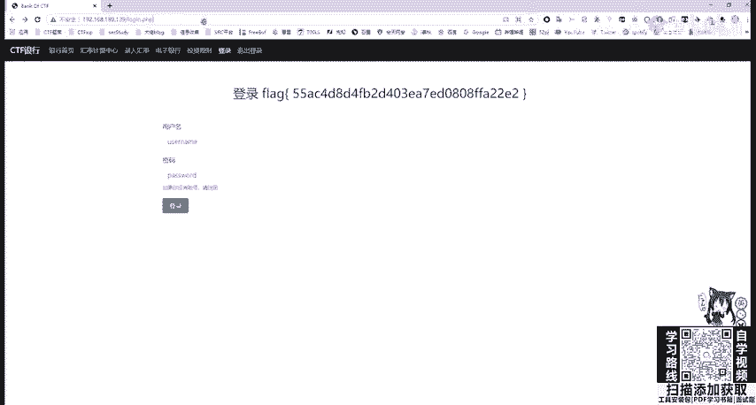

。呃，我看这这还没扫啊。快消号。操作系统判断之后，我们还可以对网站的服务，也就是容器编程语言中间键进行一个啊识别。而识别中间键为什么？因为阿帕奇这些中间键是有很多漏洞的。我们如果能正确的识别它的版本号。

包括一些库文件都是具有一个啊漏洞的那我是不是就可以直接利用。那我们修查看网站的一个。服务或容器类型。第一种方法通过F12，这里我就拿核天网。作为一个测试，如何去看呢？在F12之后。

会调出我们chrome浏览器的一个呃调试界面。调试界面我们一般是属于这个叫竖状这个HTML前端页面，还有network，我们选中network网络页面之后，按F5进行刷新，刷新。

我们可以看在下面看到很多请求啊，我们看到点action，其实这个就是用str to这个啊进行写的这个框架。然后第一个选中我们这个域名一样的地方，3W和天 labbcom选用它之后就会出现heads。

paersO这里能不能放可以放大。我们选中hiers之后，往下拉，有个叫做response headers，然后下面有个servver engineers，可以发现它是这一个中间键。这是第一种方法。

第二种我们还可以利用。web接口啊web接口whats web这个接口我就不给大家演示了，就和站甲站长之家是一样的。第三种方法也就是最方便的，也一般是使用这个浏览器插件。

这个浏览器插件大家可以啊去这个官网进行下载。大家可以去他的官网，也有外部接口，可以一个查询的。然后他官网之后。

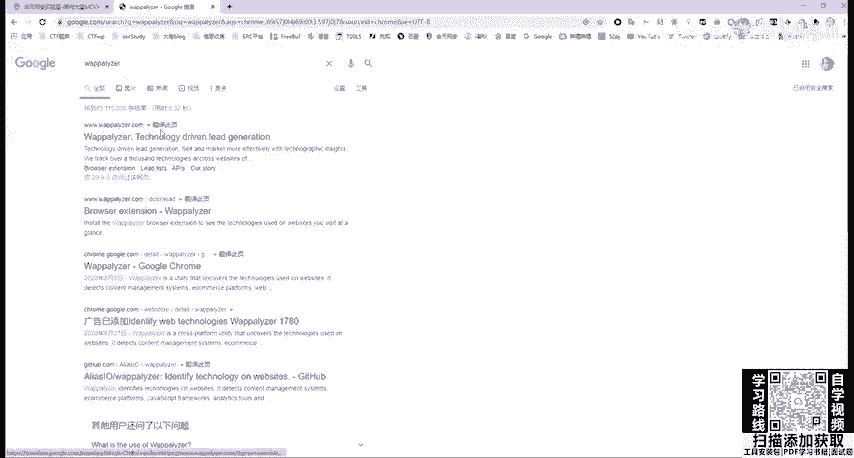

那这一个look look up。

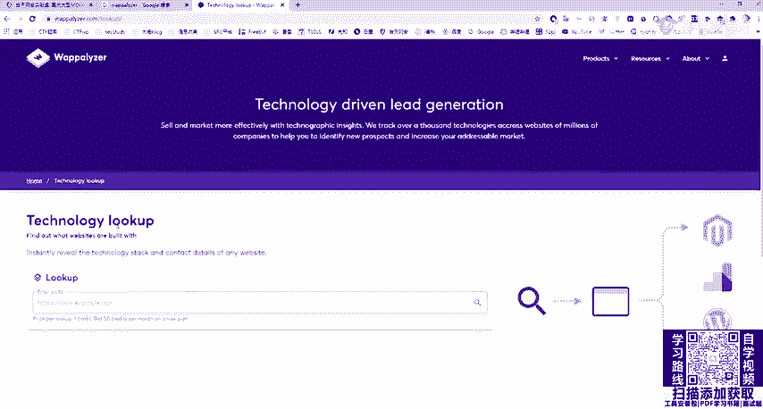

呃，在这里我们可以去查看它的一个。

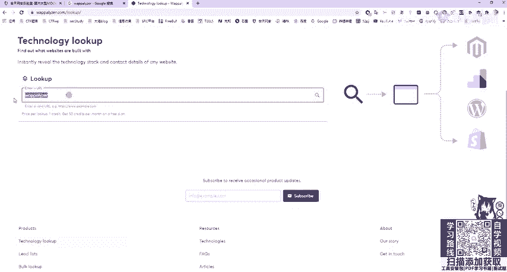

输入UIL之后，它会分析它一个指纹信息。当然它也是有个浏览器插件的，可以在啊网上商店里面进行搜索。

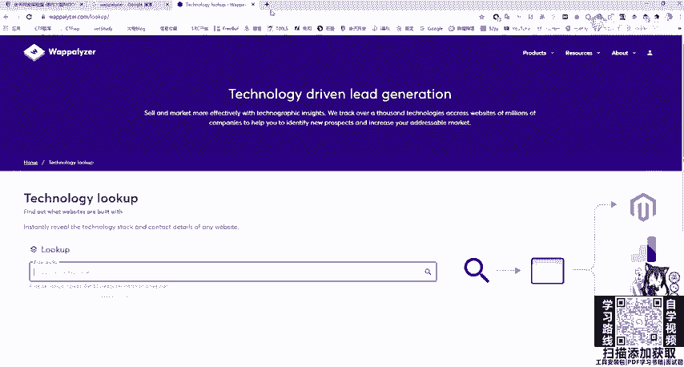

或者你打不开网上商店的话，可以去finf火狐浏览器进行下载，或者是下载离线版，然后安装进chrome浏览器即可。那我们打开它之后就非常方便了。只要点击我们浏览器右上角的这个。

插件它就会告诉我们这一个啊用了什么插件，包括中间件服务器接que库，还有一些bone strapUI框架等等。通过插件也可以帮助我们判断脚本类型。比如PHPGSPP或pyython。

这里我们判断这个脚北类型一般是看网站的一个后缀啊，看后缀名像PAAP网站，它一般后面是点PAAPGSP的话啊。

就是比如这个框架str to我们随便点一个就发现它后面是GSP说明它是加va server page里面写的那我们再进行其他的呃进行一个点击。可以看到是点度结尾。

说明是使用的str to模块或点action结尾。我们可以通过经验进行一个查看XSPSPX是呃这个ISP和SP导net进行编写的。

数据库类型一般mys super serverac orac可以进行一个指纹探测，在搜cle map也可以帮我们去探测这一个指纹信息。

我们需要知道是什么语言才能针对性的进行文件扫描、文件上传等一些后续渗透操作。比如PHP以及上传木马的话，要上传PHP吗。常见CMS识别CMS叫做内容管理系统，是通常用于网站内容的文章管理。

网站的管理员并不是每一个人都会写PP，比如一个新闻系统，或者是一个博客系统wordpress，那他并不要求你会复杂的前端代码或者是博客的交互代码。

我们只需要来到wordpress博客网站后台去用markdown或用自带的wordpress编辑器进行编写博客或者进行一个主题切换，进行网站设置用户创建权限修改等等功能。

那这个系统统称为CMSCMS框架是有很多漏洞的。可以说CMS养活了大部分渗透测试工程师，如果没有这些CMS的存在。我们根本就不知道去挖什么漏洞。那常见的CMS有很多，比如之梦discoPHPCMS等。

我们可以通过在线识别工具进行识别，故事是通过网站的banner进行识别。那在线识别工具也是通过外部接口，我们可以。打开去看一下。啊，我们在这输入UIL地址，它会帮我们识别。但是这里识别的不是很准确。

一般我们还是要通过手动啊手动去查看。

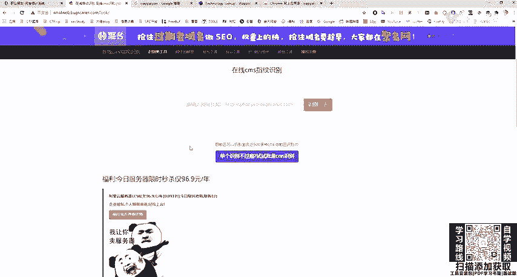

比如一个逆向的。破解52破解论坛。这个是如果大家对病毒分析逆向破解有兴趣的话，应该非常清楚。这个论坛可以看到它最下面左下角的banner就会告诉大家power by discusscus。

也就是用discus论坛进行编写的进行框架进行写的这个网站，那discus到底是什么东西呢？我们可以百度搜一下，可以发现它是一个啊。

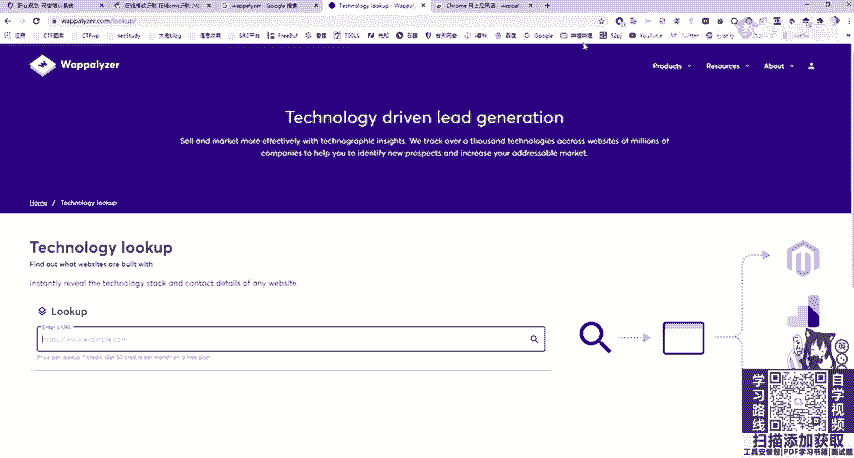

通用社区论坛软件系统，那它是有很多漏洞的。我们如何去寻找它应该还记得昨天讲的1个AEexpl dB这个网站或者是其他的一个历史漏洞网站进行查找。我们在这里复制过来我们的discuss进行搜索。

会发现这上面有很多。嗯，6。01。02。0版本的。包括啊这个注入。代码执行。任意密码重置啊，都可以打开去看。然后这方旁边就有E叉P。就是热洞利用脚本或漏度利用方法。同样我们的之梦。

包括PHPCMS都可以这样去查找。那PHBCMS啊是一个。内容管理系统。啊，这这网站怎么崩呢？OK它现在已经更新到V9了V9，那我们可以看到直接去百度搜PHBCMS。

它就会有一个链接是呃搜cle注入漏洞。那我们也可以在这个网站进行一个搜索。Okay。Yeah。可以看到啊，他很多版本一个漏洞。下面呢我们也可以利用其他的online tools进行一个啊内容识别。

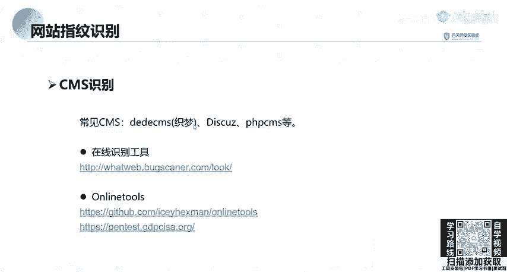