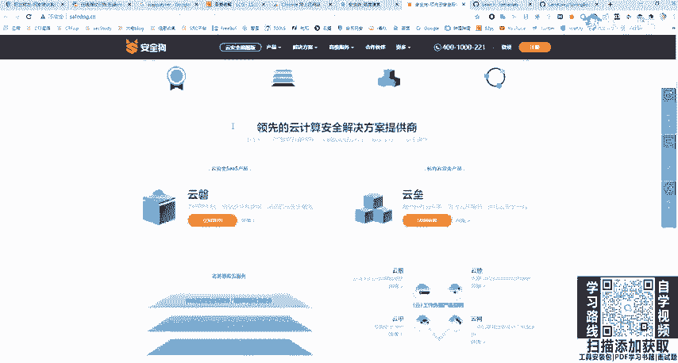
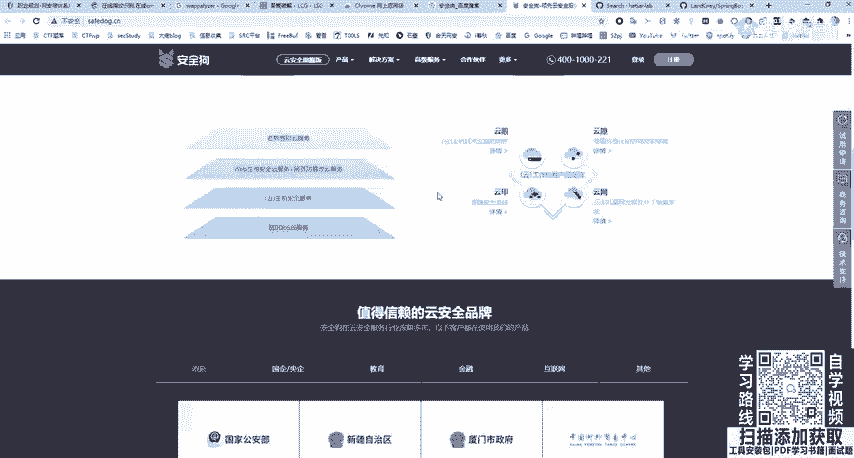
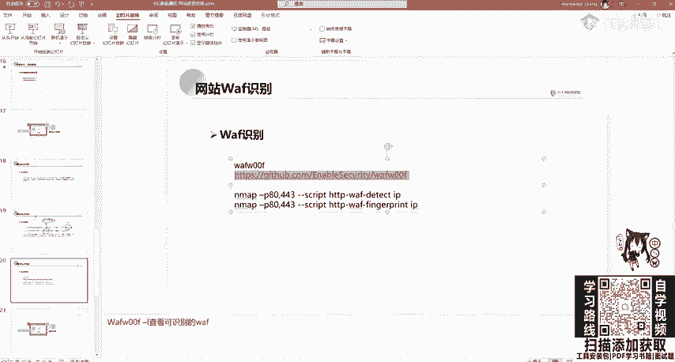
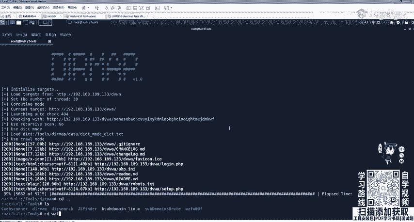
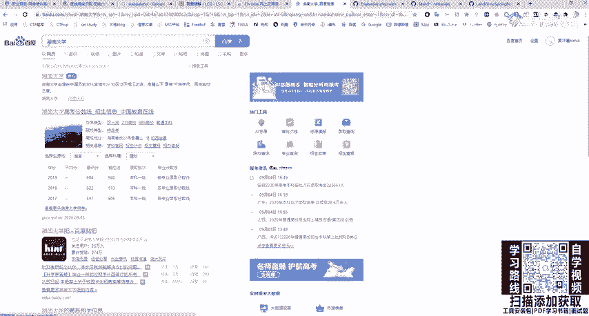
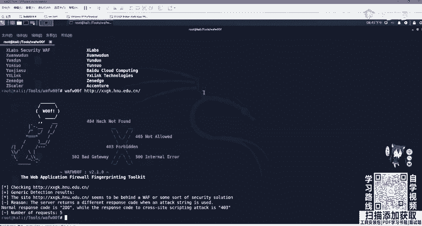
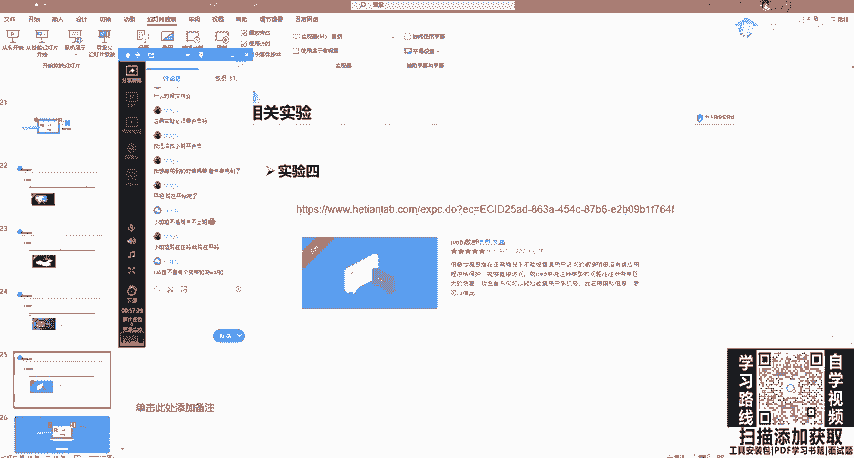
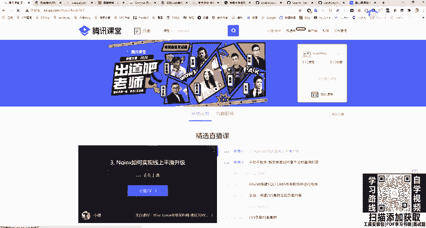
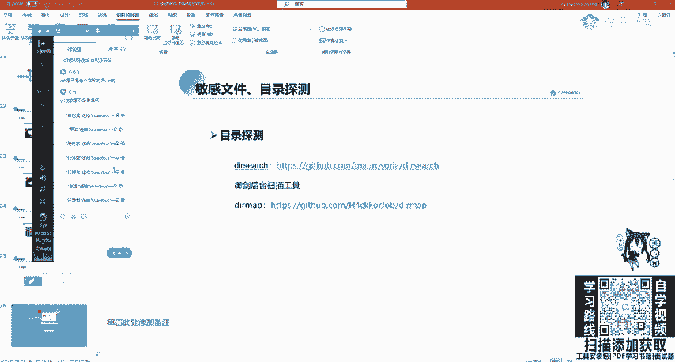

# B站最全网络安全教程，整整1300集，全程干货无废话，别再盲目自学了，看完学不会我退出网安圈！（web安全｜渗透测试｜内网渗透｜CTF） - P34：33.网站waf识别 .mp4 - 网络安全官方教程 - BV15u4y137cQ

现在的一些网站，网站管理员他自己不会做防护，也不晓得不清楚自己写的代码水平如何，有没有漏洞，那很方便就有waf的出现。那wa是web安全web应用防火墙，一般可以分为软waf和硬waf。

那硬件wa就是看到那个铁盒子啊，铁盒子，那个是一个硬件wa包括IDS流扣等等。那软件的waf呢一般是通过一个白名单或黑名单代码进行一个request包的过滤或responsible响硬包的一个过滤。

waf呢比如有免费的安全狗或者是知道创宇的waf，这些是免费的，或者是现代一些的中间件宝塔宝塔面板也都是具有waf的。并且阿里云阿里云盾安骑士都是可以防御一些基础的攻击，比如搜货注入。

这些基础攻击是都可以防御的那我们在做渗透测试，如果遇到waf遇到版本比较老的waf就可以搜索如何绕过或利用一些注释或者是URL编码、双重编码等绕过waf的限制。绕过wa限制，我们不能够进行盲目去绕。

可以经过复s或者是对wa进行识别，精准绕过。那我们如何wa对wa呢？wa就是web web application fire web应用防火墙，用于保护网站防黑客防网络攻击安全防护系统。

那大家在我8SRRC的时候，有可能看到哇，我找到了一个找到了一个庞站，一看用out bar一看，咦能看出它的列，然后用scle注入语句一看咦就提示安全狗语音锁啊，就安全狗语音锁。告诉你，你被。你被这个。

你被识别了，然后你使用socle map进行一跑，然IP就被封锁了啊，安全狗。Okay。那对于现在网站，你是挂有安全口，其实还是挺好的。只过它的一个缺点就是你如果挂着这个安全口。

它这个这个公司他会不停的给你打电话，让你升级产品。

妊升级产品这个就是比较麻烦。

。那我们看如何去识别wa呢？第一个就是我们用手动啊，常见的waf，一种是防建防种各类网络攻击，一般是防OWSPtop式攻击，包括但不限于搜狗注入叉4思CSIF网站后门等。第二个可以防止自动化攻击。

大家知道网站后门终究实行的是什么？网站后门执行的也是一些系统调用命令。那他这个wa把这些呃请求包的系统调用命令给干掉。那你这个。后门这个一句话木马就没有用了啊，你要做免纱嘛，叫照顾wa夫。

2、可以防止各类自动化攻击。比如暴力破解。那暴力破解，我们一般可以配置防火墙IDtables都可以进行配置啊。但是有的它这个运维啊，网站管理员它不会怎么办呢？我们可以用安全狗它帮我们这个配置。

那暴力破解。比如说你的密码登录3次错误就一分钟再登录，你登录10次，那你今天就禁止登录。比如你对SSH或RDD进行包爆破，你登录少于登录5次失败。那我你的ID就被干掉了。还有就是一个防止批量注册。

还有一个网站漏洞扫描器IWVS还发现你这个IP有大量的数据经过我这里就把你直接给封锁。第三呢，可以阻止其他常见威胁，比如盘虫零带攻击、代码分析、嗅探、数据篡改、权、越权访问、敏感性泄露等等。

还可以防止恶意的包含虐权扫描等。这里wa还有一个作用是防爬虫。我们一些知识库啊，包括一些重要的文件，公司的文件一般是不想被恶意爬虫的那我们可以利用wa或者是用前端的GS进行一个爬虫防护。

哦识别识别wa呢可以通过WFW这个00这个进行一个识别。那它用法也是看我们的这个read me。啊，很简单，可以看到它的wawa00F杠list去查看它支持的wa的一个版本啊非常的多。

那我们直接啊用waf加上我们的这个版本号即可。但是大家要注意，这里是进行了一个编译安装，需要使将克隆下来之后，使用python set up PIinstore进行安装。

那我们这里哎来简单看一下，看一下这里我已经克隆好了，克隆好。Okay。那WFW00F，但是它的识别啊是啊有问题的。它有的识别的时候，你会被封掉的。你IP会不被封锁的。

那我们这里进行python，然后set up p installt之后，就可以直接在命令行使用我们的这个命令了啊，就可以直接在命令行使用，加上我们的这个URL地址。

UIL地址一般大学里面啊会使用一个防护。那我们来看啊，随便挑选1个EDU进行一个。这这搜的都是啥呀？就拿湖南大学下手。

OK那我们直接把它的这个URL复制过来。来，进行一个粘贴。去查车。啊，这里。他会告诉我是有wauff的，但是没有识别出来。那我们可以看一下它能识别哪些wa杠L。啊，能识别的是挺多的。

云盾云锁360都能识别WTS啊，最好绕的就是这个了，是吧？大家在学绕up的话，肯定第一个接触的就是它第一个就是接触的它它是最好绕的。然后云锁云锁。我们来看一下他有没有一些航债。啊，我们还要庞站。

来试试一下。这试一下是没事的，但你需千万不要对它进行一个呃对他的业务进行一个攻击啊，不要对业务进行攻击。你去挖EDUS2RC的话，大家要记住啊，就是我觉得你是挖这些啊S2RC。

特别是现在正处于一个招生这个状态。你去挖它。第一就是一不看二不删三不改。

要做的这些，你不看不删也不改，你也不要去加东西，不要去给他上传一个木马。不要去给他上传一个码，这个啊被别人抓到了。你说你是玩EDOSIRC那有点说不通是吧，是吧？就是不不看不查不删。

然后去挖他是没有问题的。那这里我们也可以使用。那个N map进行一个扫描，但N map这个扫描wa就很一般了。我们看到这个工具其实都很一般。对它进行一个扫描。那我们这里来看一下，看一下那个wa来。

随便选一个吧，随便选一个，就直接用这个用百度吧，用UIL我们随便选一个吧，试一下它有没有这个。啊，算了，不在这选了啊，不在这选了，大家应该应该知道了，应该知道这个挖卡服拦截是什么样子的。

那下面呢我们对网站的收集啊基本上就到这里就结束了。那我们收集到这些信息之后，就是寻找有没有脆弱性漏洞，有没有中间键有没有漏洞。你这个CMS有没有漏洞，有wa如何绕wa啊，没有wa。绕不过。

包括找不到漏洞，那就是继续收集，进行C段航站的扫描，去找它的边缘资产进行一个渗透。因为我们是生能测试是最后是需要提交一个报告的。如果你提交报告是什么都没有，那肯定不合适，所以要对资产进行一个扩大扫描。

那我们在这些这三天讲的这个信息收集里面啊，核天实验室是有具有相关实验的，大家可以去自行的搜索，并且练习。有DNS进息收集。那我们今天的这个作业呢就是啊完成这两个实验。我来看一下1个Aax扫描。

这是以周末的周末的大家时间啊，可以利用一个晚上就可以做一下来做一下。OK这是。第一个实验啊这个实验我写在那我们群里了。我们写在这个群里。课好作业。Yeah。大家这个账号都有吧，账号。什么时候交作业？

那你周周一再交嘛？周一再交这个周。啊，就会员你可以问小姐姐要呀，小姐姐不是给会员吗？呃，还还没还没开会远呀。还没开会员呀。啊，没事没事，你要是现在不想开的话也没事，哎，开了你可以去学习啊，可以去学习。

其实呃实验室虽然很断，但是东西还是不少的。啊，没事的，你要是不想开的话也没关系，那我就。啊，对的，这小姐姐双休双休，你可以周一再交嘛？你周末交了，也是周一才会教到我们到讲师这个讲师这里。

那我这就给大家写一下这个作业了，作业就是一个I map网络扫描。嗯这个是写一下。2020。今天是4号叫网站信息收集。现在大家如果面试的话，在第一关就已经okK了啊，网站信息收集。别的也收集不到什么了。

无非就是一个工具的好坏。你工具很多，不仅仅是我讲的这些工具，你get up或网上一搜，杂七杂八，这些论坛也会爆出工具。当然有的就非常难用了啊，有的非常难用。这个是和天的一个实验。

第一第一个实验是这个叫N mapN map。问过十日。嗯。有人啥。就是你把前面的这些顶过来。1个MM的网络扫描。然后还有我们的第二个实验，这个外国的敏感信息泄露，也就是get泄露。

get ha还SVN泄露这几个大家都练习一下。Okay。Okay。Yeah。Okay。哎，这个怎么一点就这个样的？Okay。现在你可以问一下他吧，可以问一下他。我们是有两个班主任的吧，可以去问一下。啊。

卡利上面工具很多的，有自带磁瓦的，有的。啊，测挖虎的工具也很多，但是你感觉就就很一般测不到。这是网站信息上面，这是什么鬼？没。然后我再讲一个第三个作业哈，第三个作业是一个尝试啊。Okay。你可以去一个。

比如说呃公益SRC这些大家应该知道吧，不知道的话，去扫一下，或者是去那个找一下，或者是对一个众测啊，对这个漏洞盒子的重测。或者是呃这些公益SRC或漏洞和的众策啊，任选一个站。啊。

进行一个进行一个信息收集。呃，看看看看能不能进行一个完整的信息收集。啊，信息收收集这个熟悉信息收集的流程。啊，这是个尝试啊，大家这个课后作业我都写到这里了。Yeah。大家在这个呃去进行收集的话。

你有可能发现很多好玩的东西。像补天的这个公益SRC，你能挖到的还是很多的啊有的是占特别小，你能扫到东西的，包括咱刚刚讲的spprint boat那个泄露，它都有可能有。当然有可能也被挖完，他没有。

肯定是就被挖完了。这大佬用IWS批量扫扫扫都扫完了。那今天就先到这里了，大家还有什么疑问吗？对信息收集。

。

。那没有什么疑问的话呃，ge的泄露不用猜啊，因为我们那个报货工报告工具嘛。用这些工具你去试嘛，它会有的，他会告诉你有的。如果有的话，你会看到它会挂破出来一个点get。

然后你再去使用get hand进行一个挂破。你把这个核天实验做了就就行了，就不用猜。那大家如果有其他问题的话，可以去在群里询问或者是问我都行。嗯，大家应该知道我是哪个吧，就是。啊。

这个我的QQ也是这个医生的，在群里面有我。那今天课程就先到这里了，祝大家周末愉快。那我就下课了。

