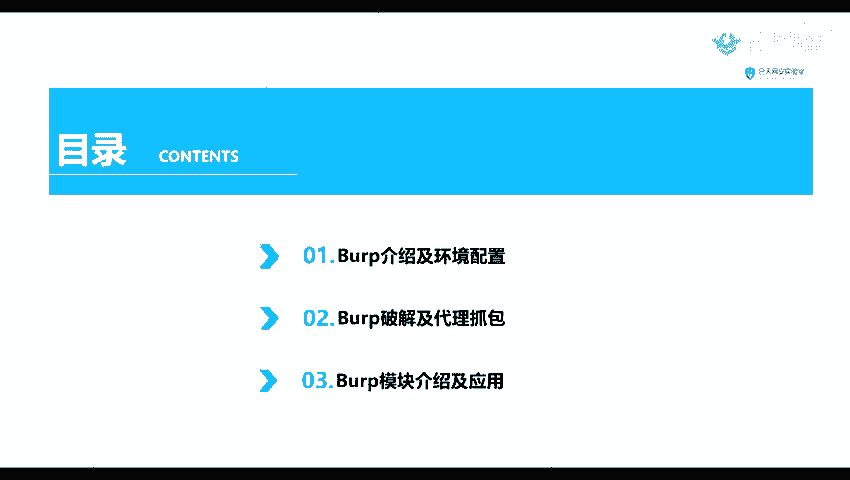
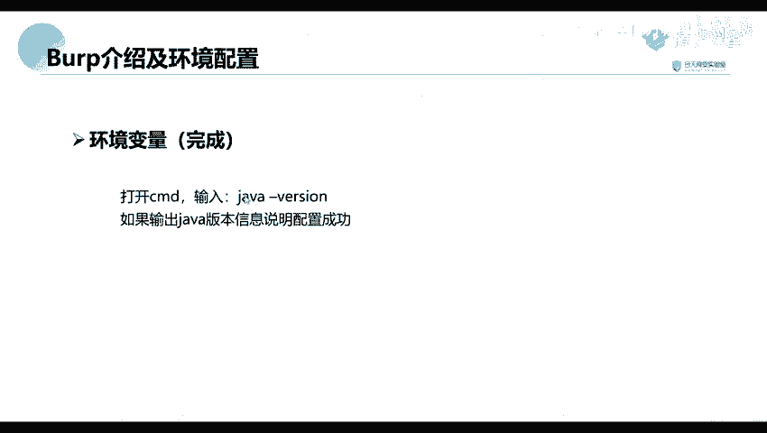

# B站最全网络安全教程，整整1300集，全程干货无废话，别再盲目自学了，看完学不会我退出网安圈！（web安全｜渗透测试｜内网渗透｜CTF） - P38：37.Burp介绍及环境配置.mp4 - 网络安全官方教程 - BV15u4y137cQ

嗯。我们的一个渗透神器之bo位。这个呢其实也是一个工具，就是我们最就是最常用的一个工具。应该说。现在我们来看一下我们的一个目录。首先呢我们的一个货款的一个介绍及我们的一个环境配置。环境配置。这里呢。

你们之前呢是有讲过这个环境配置的一个课呢，我们这里呢就简单的过一下。这样呢就是一个报款的一个破解以及我们的一个代理抓包。就是我们这个工具呢就实也也是一个消费的工具。如果我们的一个专业版呢是一个收费的。

社区版是免费的。这里呢我我们就是使用我们的一个专业版进行一个破解，以及一个代理抓包。第三部分呢就是我们的一个它的一个常见的一个模块介绍以及我们的一个使用。

首们先来看一下以以下第一部分，他的一个介绍及有他的一个环境备置。

嗯。首先呢我们来看一下他这个工具是什么工具。他是一个。集集成化的一个渗透测试工具，它集合了多种渗透的一个测试组件，使以我们自动化或者手控的能更好的完成对我们的一个web应用的一个渗透测试和攻击。

在这个渗透测试的过程中。这个bo rate将使得我们的一个测试工作会变，可以使得我们的一个工作变得很容易和方便。只要我们熟悉了这个工具的使用。我们的这个工作呢也可以变得很轻松以及高效。然后呢。

由于它是由我们的一个java语言编写的，所以呢由于我们的一个java语言，它自身的一个跨平台性。所以呢我们这个软件呢使用的一个可以更加的方便。比如说我们可以在我们的一个windows。再进行一个使用。

也可以在我们的一个。下面进行一个使用。还可以在我们的一个mOS，也就是我们的一个。苹果笔记本上面就是一格曼华为进行一个使用。那呢因为它是一个java巨写的。java语言编携的。

所以呢我们就需要配置我们的一个。环境。首先呢这个java这这这个java的一个环境配置呢，你们应该是在第二第二节对吧，应该是第一节是第二节课，你们是已经讲过了。这里呢我就简单的过一下。你们有不懂的话。

你们到时候就是再看PPT进行一个操作吧，或者是看上面的一些课程的一个回顾。在这里呢我也也已经放到我们的一个网上了。你们访问这个链接就可以进行下载。现在我们具行我们的一个环境变量的一个配置。

我们可以在我们的一个。右店我们子电脑。认没。要键子电脑在我们的一个属性这里。在手机这里找到这个高级系统设置。然后我们在这个环境变量这里去听写一个环境变量。并建一个系统面料。

这一个变量名呢就是我们的一个java号，变量值就是我们的一个。AD这个安装的一个路径。但是实际上我们在这个java这个JDK8。以后他好像是会自动帮我们配配置了一个环境了。

就自动帮我们配置这个这个环境变量了。就是我们在安装的时候啊，我们在安装的时候。我们这里呢可以那里面呢有一个。在C盘上面它有一个隐藏的一个文件夹。在这个老M在这里，他其实在这里呢给我们配置了这个。

房庭变亮了。你这个这么高级了吗？就是我们安装了之后，我们就它自动在我们这个文件夹上面，就是有一个Olele的这个。文件文件夹，然后呢，我们在实际上已经自动帮我们配置好了。如果说配置好了之后。配置好。

我这里呢就不讲了，配置好了之后，我们输入就是打开我们的1个CMCMD窗口，要输入我们的一个java杠莴笋。如果说它输出我们的一个java版本信息就说明配置成功了。就说我们这里呢一个java杠。

多损如果是出现出现这样子的一个信息，就说明我们。已经配置成功了。如果说没有没有出现输入这个vaword，没有出现这个信息的话，那么就需要我们进行一个手动的一个配置。啊，这里我直接跳过了。

