# B站最全网络安全教程，整整1300集，全程干货无废话，别再盲目自学了，看完学不会我退出网安圈！（web安全｜渗透测试｜内网渗透｜CTF） - P45：44.Weblogic漏洞利用.mp4 - 网络安全官方教程 - BV15u4y137cQ

Okay。Okay。先呢我们这个利用方法呢，我们先来看一下去怎么去获取到他的一个资产。也就是说获取到存在就是安装的这个vi这个中间件的一个地址。首先呢我们第一可通过我们的一个网络空间搜索引擎。

比如说炸弹、火法、终馗之眼等等。哎，这个反样都可以。不过呢我建议就是挖一些比较小众的的那种。那种漏就是SIC。因为你那种就是挖那种比较大众的话，都比较多人挖。像这种的话都很多人挖的。

可能就比较难进行难挖到。这你们可以将收集到的一个子域名，然后。放到AWVS里面，让他进进行一个扫描。就是要注意一点的的时候。注意要注意一点的是，我们要就最不要把他的一个网站给扫光了。

腾讯这里面可以看到啊。我给你们发这一个吧。在这里呢列了许多的1个SIC。现在你们就先做一个信息收集，然后再进行一个漏洞挖掘。好，这里刚讲完这个。比如说我们在这个佛法。

这博法呢实际上它是一个网络空间搜索引擎。我们这里呢他有也有一个，就是我们可以在这里发现一些。

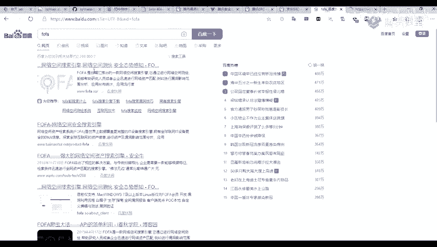

想要我们想要查询的一些东西。比如说我们这里呢就查我们这个点了一个we logic，所以呢我们这里呢可以查询这个we logic。系。点击查询，因为我们这个不是会员的话，我们能查询到的数量有限。

比如说我们这里呢随便找一找一台啊，我们这里找一台看一下。

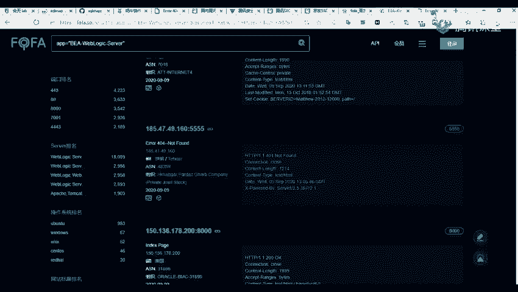

我们随便找一台机器，那么他这里呢访问呢也是1个404。404的一个页面。他端口的话，他是开放在5555，这就是他修改了他的一个默认端口。

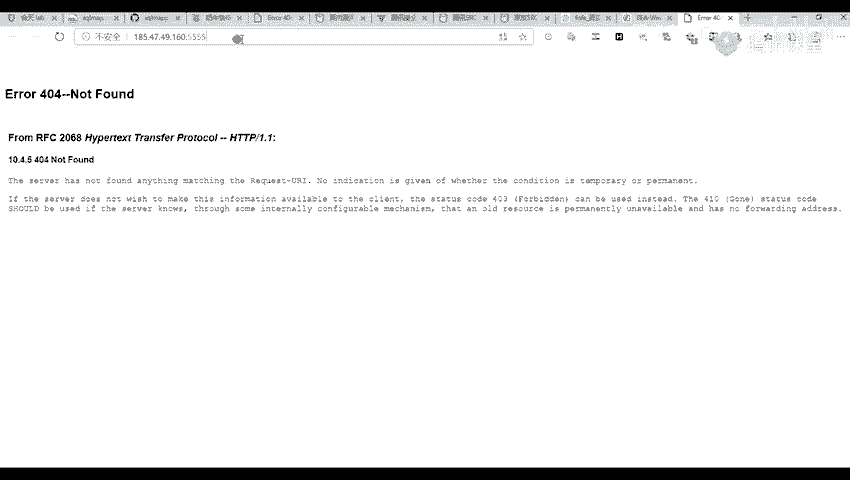

那下来我们也可以就是找到这里，等让我们找这个7001。我们找到这个7001这个端口。现在我们可以发现，我们应该访问的话都是都是这个7001端口。

嗯嗯。另外呢就是通过一个谷歌黑客，就是利用我我们的一个搜索引擎。钓语法我不知道你们有没有讲过。就是inURL你要加上一个漏洞地址。比如说我们那个漏洞，它可能是。发生在这样子的一个链接上。我们举个例子啊。

原告单。在这里要。不道。比如他这个UI要它可能是他的一个漏洞，但是这样子发生在这这样子的一个地方。那么我们是不是就可以在这个利用一个谷歌语法这进。UIL。U玩呀然。嗯。嗯。要加上这这样子。的一个链接。

然后呢，他我们出入这样子的一个语法，他就会给我们列出我们存这个IP里面。比如说10。10。10。1，然后后面这样子就是他会就会列出UI1里面存在这样子的一个。一个结果。Yeah。就类似于这种。

还有一个呢就是一个in title，就是在就是他的一个意思呢，就是在我们的一个标题里面有一个we logic的一个标题包含了这个we logic这个字段。

。Okay。嗯。原呢。我们前面呢主要是简单的讲了一下它的一个特征，还有他找如何去寻找它。那到我们这里呢就就点一下它的一个利用。利用呢，首先呢我们这里有一个小板，就是可以对它进行一个批量的扫描的。

并且这个表本表本里面已经结合了，就集成了许多的1个POCPOC呢，也就是我们一个漏洞验证的一个表本。就是一个检测我们漏洞是否存在的一个表本。也就也叫做POC。

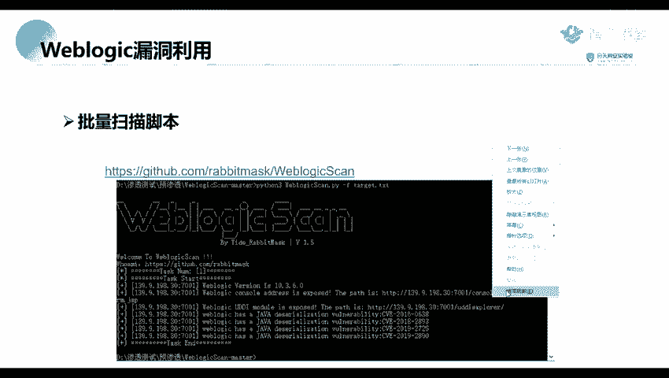

它的使用方法呢是非常简单的，不这里。哦，我我这里呢我我下载下来了，你们待会呢也可以可以是自己去进行一个下载啊。我就。跟上载了之后，我们。

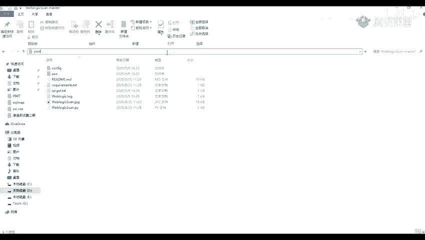

打开1个CMD窗口。嗯。我们这里呢我们是只用一个一个Pon3，就拍thon三进行一个执行的。这个二的话好像是也是可以的。但是但是最近改成一个三了。真的我们我这个呢就使用一个Pthon3。

我们下载下载了之后，我们可以看到这里呢是它的一个下载下来的一个文件。我们我们在从上面下载东西之后，我们如果是看到这个有这这个脚板就是一个quiment，qui这个脚板，就是这个文本。

我们就是它里面呢就是。

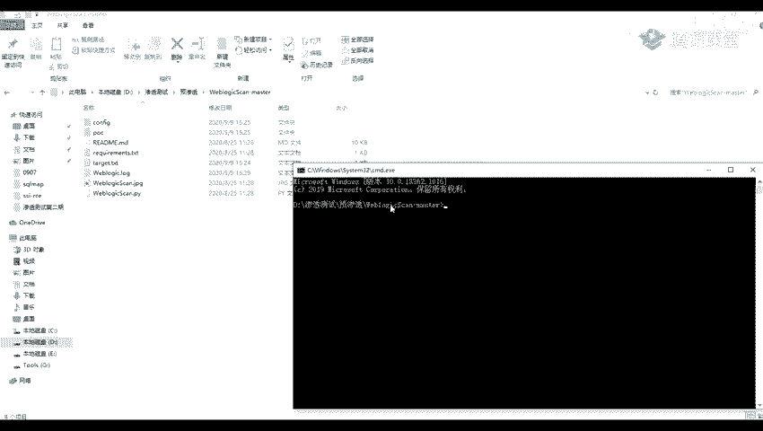

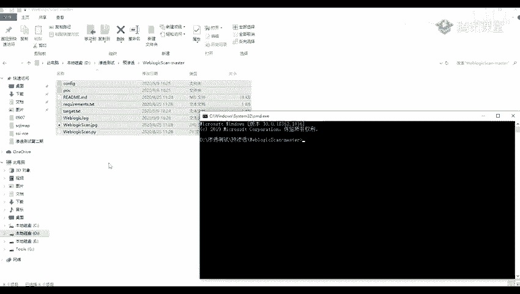

告诉我们需要去下载的一些模块。这需要去安装的一些模块。你们可以跟他理解为就是他的一个依赖，就是需要下载的一个依赖安装的一个依赖。那么怎么下载呢？我们执执行一个拍散。

31杠M杠M后面加上1个PIP。DIB就是通过这个PIB进行一个下载DIB一到。要干哈干哈就是他了一个嗯。文本名称加上一个文本，叫IEQ。这块嘛这块嘛这个带上这一个文本。

要呢我们回车回车就会将我们我们的一个依赖，就是或者说是一个谋划进行下载。

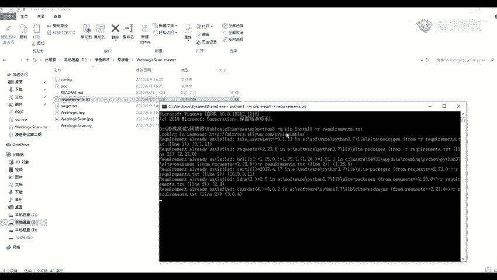

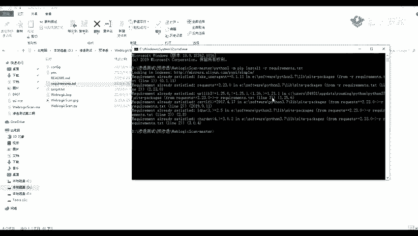

他点他点完了之后我们嗯。在这个插件点PSSP这里输入我们的一个地址，接是发 logic存在的。使用了这个vilog这个中间件的一个地址，然后我们输入进去。

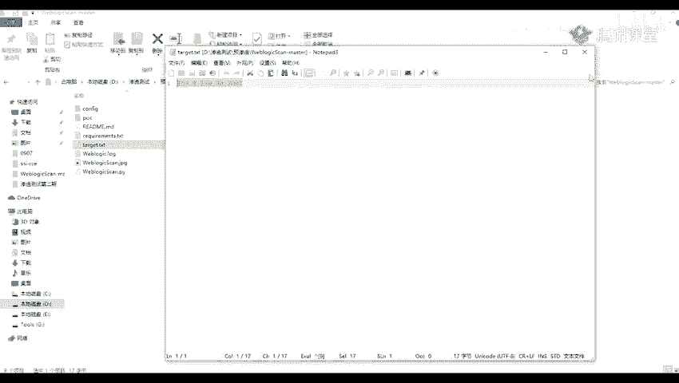

输进去之后呢，我们执行一个进行一个检测。然后杠F杠F呢就是跟跟我们的一个文本搭概。嗯。

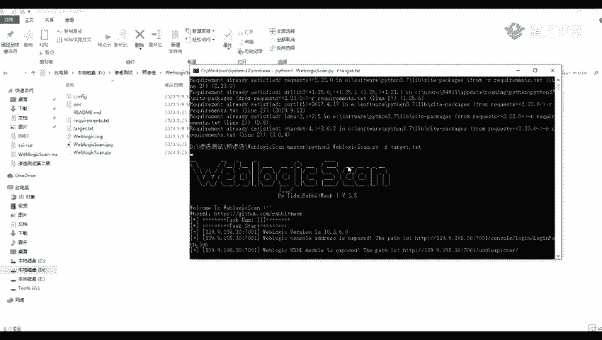

现在我们可以可以看到他这里呢已经在进行一个扫描了。并且他已经给我们找出了许多许多的一个漏洞，存在的一个漏洞。因为我们对个微po logic上面。他经常是一一个版本，比如说这里呢是1个10。3。

6这个版本。他一个版本里面就是会可能会存在很多的一个漏洞。经常都经常都是可能是今年在这个10。3。6发生了这个漏洞。然后明年明年还是在这个10。3。6发生了另一个漏洞。就是这样子。

我们需要等他进行一个扫描。嗯。然后我们可以看到他这里呢扫描到了许多东西，比如说一些他扫描到了第一第一条，就扫描到它存在了一个控制台。

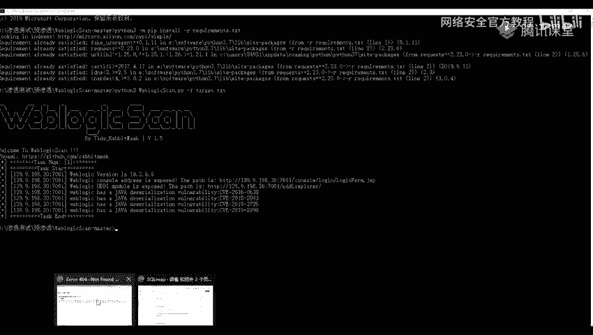

控制台呢也就是他的一个we博的一个登录界面。我们输入一个cl就可以进行一个访问了。D。是这样的。对。好，大在大正在。一个不足。那这里呢应该是一个。控制端的一个就是外b端的一个保那个。管理界面。哦。

这里进不去啊。

我我访问一下看能不能。

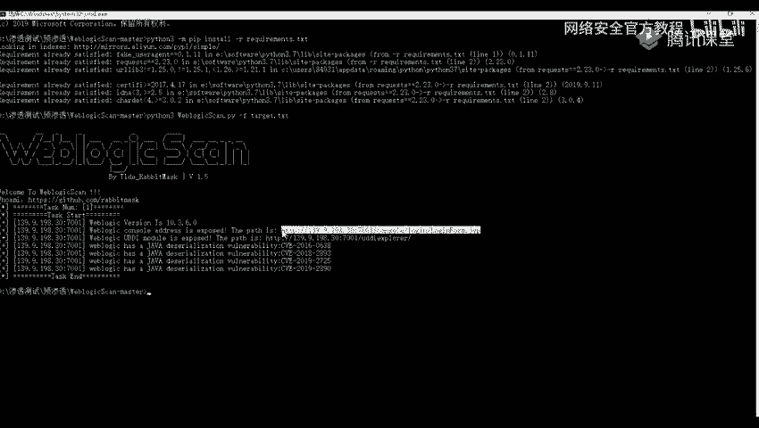

哦，他是这样子的一个界面，就是他的一个。管理端。我们这管理都断了，因为。他他做了一个就是限制，但是我们不能进行一个爆破，不能只用进行一个爆破。我我们就可以就是对这种就利用一个手工进行一个尝试。

手工去找可能存在的一个入口令。比如说他的一个默认密码，找他的一个他的一个默认密码，就是一个。搞内呢也是一个外fi。他默认密码呢是这一个，如果说他没改的话，那么我们就可以通过他的一个默认密码进行一个登录。

在这里呢是不能登录的。他这密码并不是一个被pro。

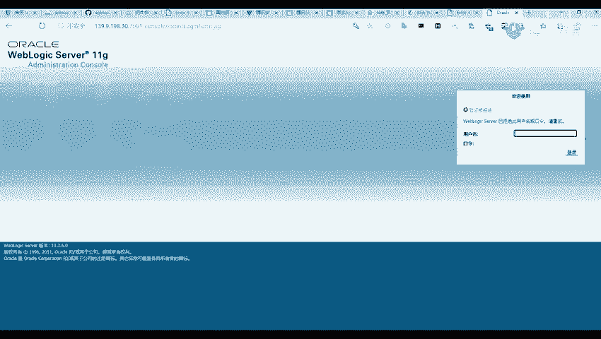

那么嗯。我们还找到了上面的这一些漏洞。比如说这个这个28932725等等。那么我们怎么去利用呢？应用的话我们就善于去利用这个搜索引擎，也就是我们的一个百度，或者说是一个谷歌。

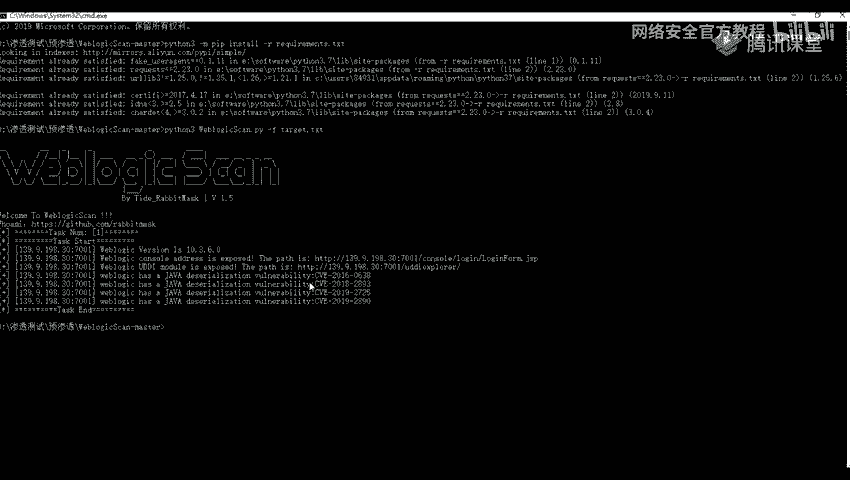

我们这里呢可以。通过百度它的一个利用方法。

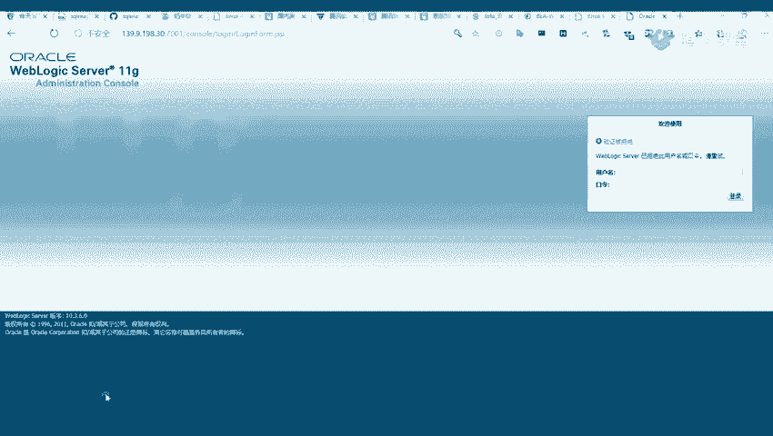

现在种呢，我们都可以找到我们他的一个相关的一个文章，多多找几个，看看是怎么去进行一个利用的。嗯。上面呢，我这里呢有一个利用就是2725的一个利用的一个脚本，我就这里呢就不再进行一个走了。

这边我有一个利用的一个脚本。这个呢就是他的一个利用的一个。两本。或者说是一个他的1个E叉P，也就是我们工地的一个就用来。执行命令或者是上传。上传我们的一个木马或者是其他的一个。

这个E叉P也就是可以说是一个拍lo的。因为这个E叉BPOC以及这个拍ro，就是有些人就是觉得他是一样的。其实这个呢也也可以这样子进行一个理解，并没有太大的。一个区别。能不能就只用这个第个表板。嗯。没白。

嗯。那漏他漏洞存在的一个路径是这这个的，就是1个2715的他的一个漏洞，存在的一个路径是这个。Okay。你看一下能能不能。我这里端过给抓了。Okay。哦，这个呢就是。他的一个漏洞存在的一个路径。

就是说我们能访问到就是访问到的这个我们这个2725，我们扫描到这个2725是吧，然后并且我们能访问到这一个路径的话，那么他还就很可能被存在这一个漏洞。

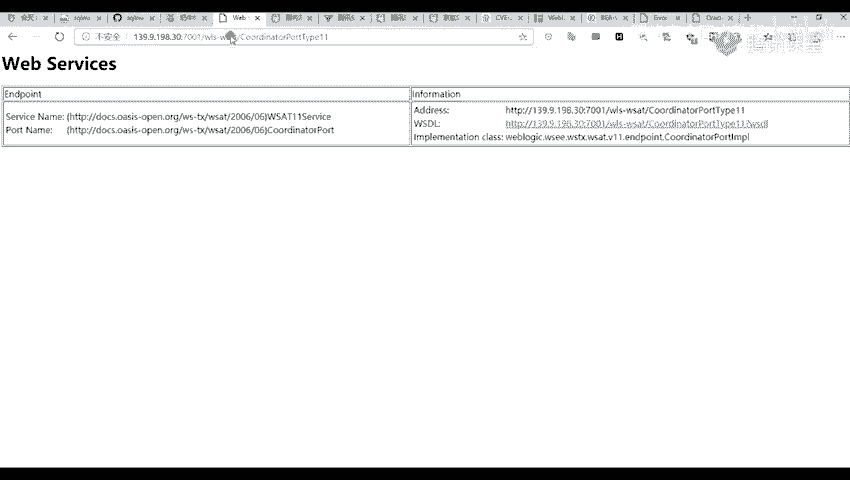

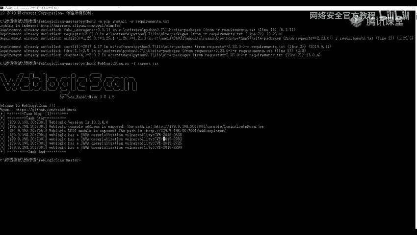

哦，我刚扫的是1个13909。198。30，这个可以可以看一下。

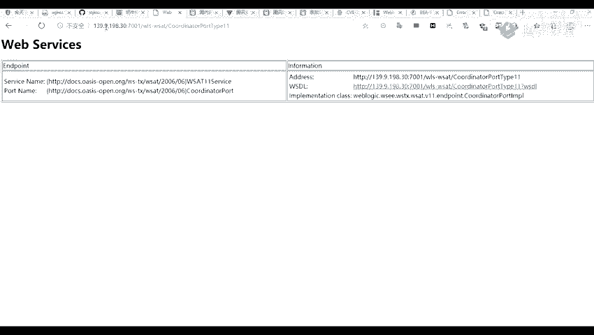

这里并且我的一个。啊。

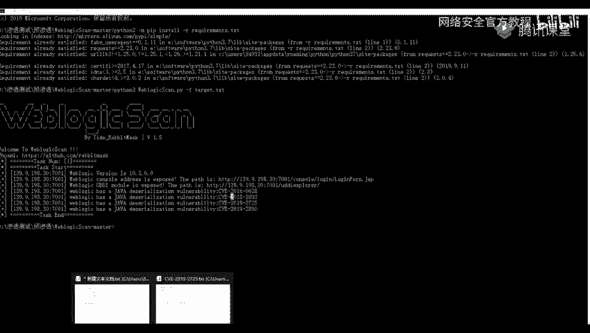

这个这个他这个目标也也是1个139。9。198。30这一个。刚刚访问不了的，刚刚我访问不到，是因为我这里抓包将它进行一个拦截了。嗯，那这个这个呢这里一个利用方法是比较简单的。我们直接将我们的这个。

我们先进行一个招包。我们这里呢也抓到了大的一个数据包，这个呢就是大的一个数据包。嗯，原来我们可以直接将我们这个2725的他的一个拍 out的。这么的1个275的1个finlo直接复制过去就可以了。

比如说我们先先这一个地址去换一下吧，他这里是1个139。9。198。3017001。这一个。那我们所以呢我们也在这里呢将它做一个这个house进行一个修改。修改了之后，我们直接将这部分的一个内容。

所有所有的内容都复制到这边来。现在我们我们对里呢我们执行的一个命令是K就查看这个EDC passwordword。能执行一下，可以看到我们现脑已经执行。每一个这个执行了这一个命令。

EDC password。就查看他的一个密码文件。我们还可以去执行一些提到的命令，比如说查看他的1个IP。え完璧。Yeah。你可以看到我们正常就可以去随意去进行执行命令了。嗯。嗯。

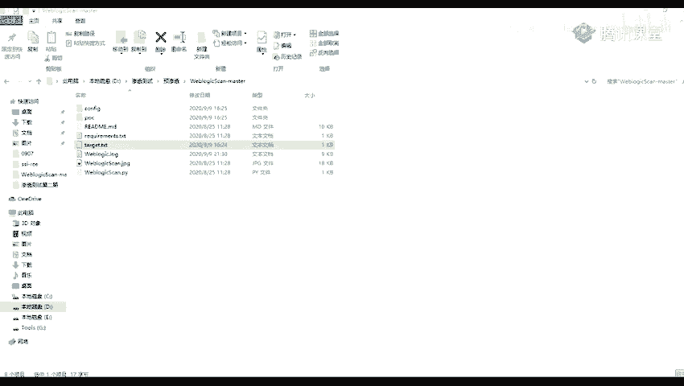