# B站最全网络安全教程，整整1300集，全程干货无废话，别再盲目自学了，看完学不会我退出网安圈！（web安全｜渗透测试｜内网渗透｜CTF） - P47：46.Thinkphp5漏洞利用.mp4 - 网络安全官方教程 - BV15u4y137cQ

那么下面呢我们来讲一下这个一个漏洞的一个利用。首先呢我们分为两个部分，一个是1个5。0。23的，还有一个就是5。0。2，还有1个5。1。29的。这两个部分我们先来看一下5。0。23的。

他的一个就是由于在5。0。23以前的一个版本中，获取这个max的一个方法中没有正确的一个处理方法名，导致工具者可以调用request类任意方法，并且高高造它的一个利用量。

从而导致到我们的一个远程代码执行漏洞。那么我们正常的话，我们。去怎么去发现这种漏洞呢？就是说发现他已经就是立可是否存在这些漏洞。这个呢我们就需要利用到我们的一个工具。

或者是我们去进行一个自己进行一个测试。我们去测试它是否会存在怎么测试呢？我们先来看一下这个版本的一个漏洞利用。首先呢，他是在这个。那个URL里面就是。Tack。盖这个参数里面。们来访问一下吧。

O看inS等于CATPTH。在在这一个里面。现在我们怎么去进行一个利用呢？首先呢我们开启一个抓包，我们将这个包给抓下来。这呢就是我们的一个包。现在我们将这个包改为一个post一个请求。

因为因为我们访问的话，我们这里呢访问是一个get请求，我们将它改为一个post一个请求。我们怎么改呢？我们通过一个右键。要建瑶，我们找到这个串quest。看起的快速卖这个等一下这里。

这样取就是改变请求方法。这里我们点击一下，就会将这个请求方法进行一个修改了。我们要重新将我们的一个路径。诶总经。复制到这里来。那呢他的一个。Pot的一个参数呢，就是我们这这一串。就是这块呢就是。

向我们的一个系统执行1个ID的一个命令，就是IDID呢就是查看我们。

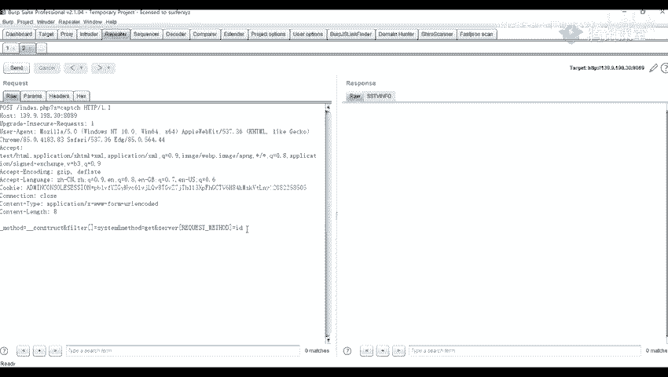

的一个系统的一一个用户或者一个货员卖都可以都可以去执行一些其他的一些命令。比如说if if分闭。

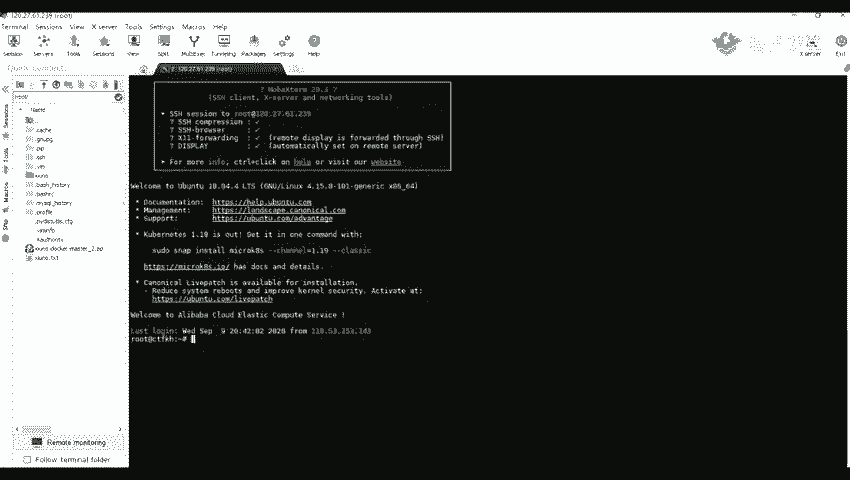

嗯。可以查看1个IP。哎，这里有错误了，看一下视频。其他什么问题？Yeah。阿0。在这里输错了呀，我看一下。嗯。204。哦，是前面是打手打了一个。比说我们执行1个ID。

或者是执行一些其他的一些系统命令比说也分费。哎，执行衣服跟被告不谁一样。好像是不行了。或者是我们执行渠道的一个命令吧。我们可以看到也可以就是查看我们当前的一个用户是。就是一个会员卖会员卖命令。

就我们可以看到他这里呢并给我们。返回了1个3W杠d，也就是我们一个阿帕奇启动的一个用户。这个呢就是我们的1个5。0。23的一个利用的一个方法。声更大。下面呢我们来看一下另一个。就是我们1个5。0。

2的一个。劳动。他的一个。原因呢，就是由于没有正确处理它的一个控制器，导致在我我们的一个网站没有开启强制路由的一个情况下，就是说他的一个默认情况下，就可以执行任议的方法，从而去导致远程命令执行漏洞。

那就是我们遇到了这种。这个定个PCP5就是定个PCP我们呢可以使用我们的一个表本，就是进行一个检测，进行一个批量的一个检测。

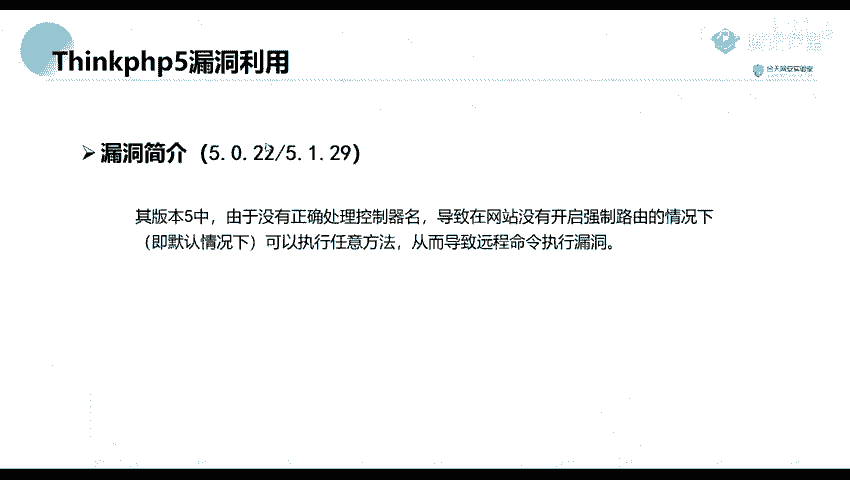

因为我们这个是实际上它存在的一个漏洞是非常多的。它的一个拍漏，也就是有各种的一个变化，我们呢就可以。就是利用我们的一个脚本去去便利这些拍照的是否能被执行。

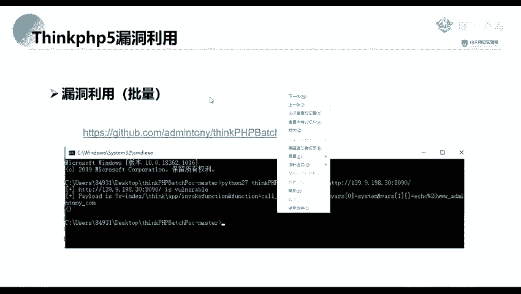

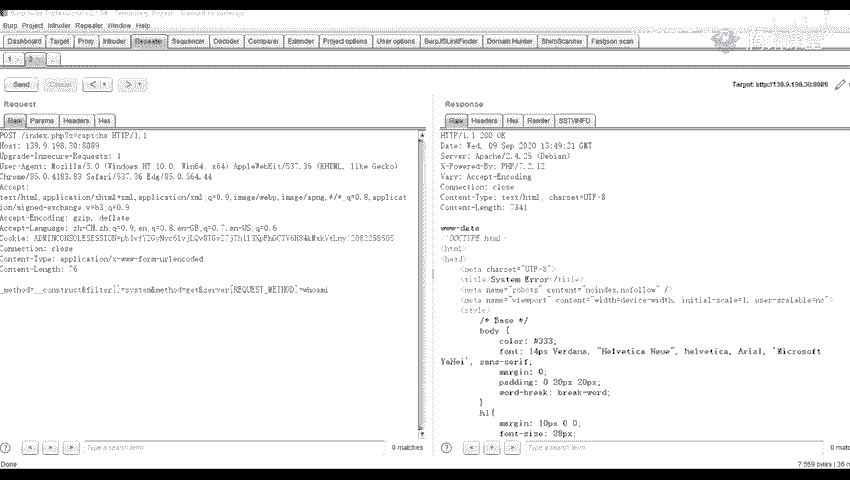

我们这里呢，这个脚本。

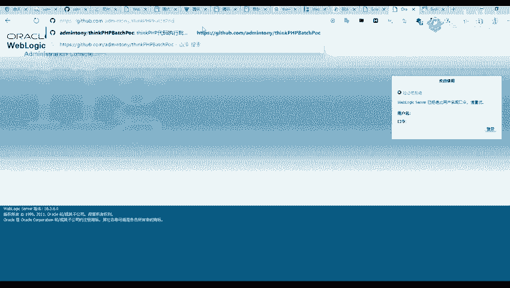

这个解板呢就是用专门用来扫描我们一个thinkPGP了。那里面呢他。内置了几几个几条，一个拍lo。我们可以看到他这里呢，实际上是有一些变化的。所以呢我们遇到这种的话，就将这些都进行一个尝试。

这种呢是就是因为他的一个版本不同，所以所所的一个做的一个变化。那我我们怎么使用这个表本呢？来看一下。这条本要照我们这CMD里面执行一个拍是。

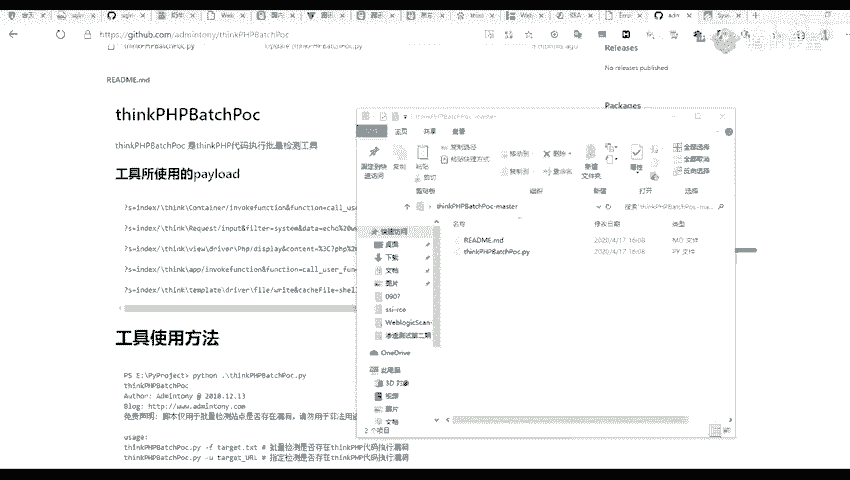

python1我的这一个python2。7。9，我就python271并KTB1后面呢就加上我们我们的一个杠U。杠右参数后面再跟上我们的1个UIL就是。

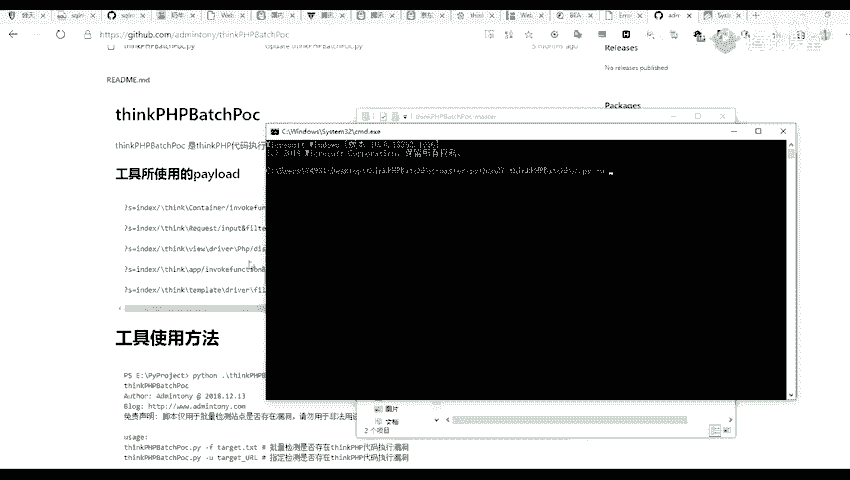

比如说我们这里呢有一个。我，这个UI呢还有1个8090的。

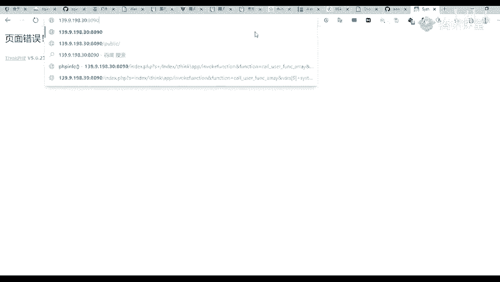

这张口是这一个这个8090的，加上我们这一个。刚刚我们那的那1个8089呢，是1个5。0。23的那一个版本的。然后这个呢是我们的另一个版本，也就是我们。

是我们这1个5。0。2版本的。

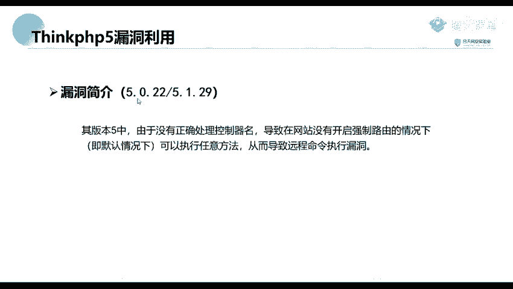

能执执行一下，然后看看他。要看到他他这里呢就是检测到了一个漏洞，就是检测到我们这个UI啊存在这一个漏洞，并且给出了他的一个利用的一个拍漏。我们直接将这个拍lon呢进行一个复制。

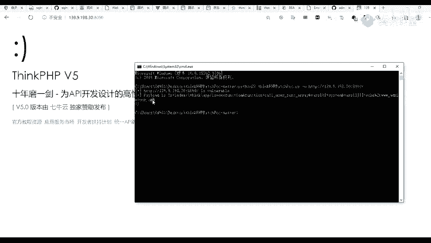

在哪号。别看。后面呢就是他的一个就是 echo echo它的一一些内容，比如说 echo test。就不是他这里呢，是不是就给我们ele了一个test一个数据，就是现在就说明他执行了我们的一个代码。

那呢我们除了那一个的话，我们还可以就是去寻找这个版本。但实际上这个版本呢有许说的一个拍lo的，比如说我们找一个这一个执行一个必B。那在实际上他的这个内容呢是这样子的。就这这样子。这呢就是这个PTP货呢。

就是他执执行的一个代码，就是给我们打印我们的一个。这个服务器信息。这个呢你们都可以在网上去进行一个搜搜索，要进行一个利用。那那我们这节课呢就讲到这里啊。你们有没有什么那个问题的话，去就私聊我吧。

或者是发到群里也可以。我们就讲到这里了。

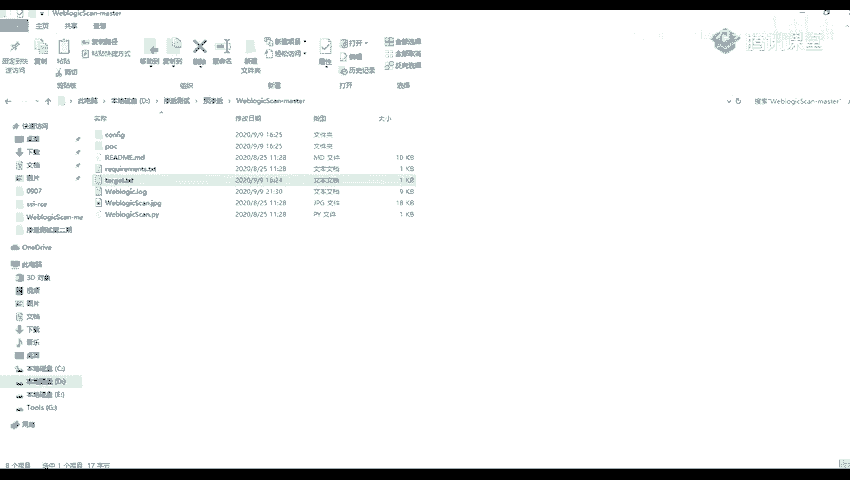