# B站最全网络安全教程，整整1300集，全程干货无废话，别再盲目自学了，看完学不会我退出网安圈！（web安全｜渗透测试｜内网渗透｜CTF） - P48：47.Struts2相关介绍.mp4 - 网络安全官方教程 - BV15u4y137cQ

下面呢我们来讲一下它的一个识别方法，以及它的一个漏洞利用。首先呢它的一个框架的一个识别。我们有我们这里呢有两种方法，第一种呢就是通过他的一个网页号缀来进行判断判断的。比如说我们点DO或者。

是一个点F的一个后缀。那么我们怎么去发现这种呢？就是我们。在可能在访问一个网站的时候啊。我们在访问网网站的时候，我们可能是。有一可能看到那像类似于这一种，就是点DO结尾的一个后缀。

那么我们就可以说它这里呢是使用了一个str处的一个框架进行一个设计的。就比如说我们这种点DO或者还有一种呢，就是一个点S软的。可能呢这里是一个可能呃这里呢应该也是可以的。就相当于这种我们在访问的时候。

就是我们在访浏览网站或者是访问网站的时候，我们再看到这种后缀。那么我们就可以试一下，就是尝试一下它是否存在这个structure的一个漏洞。

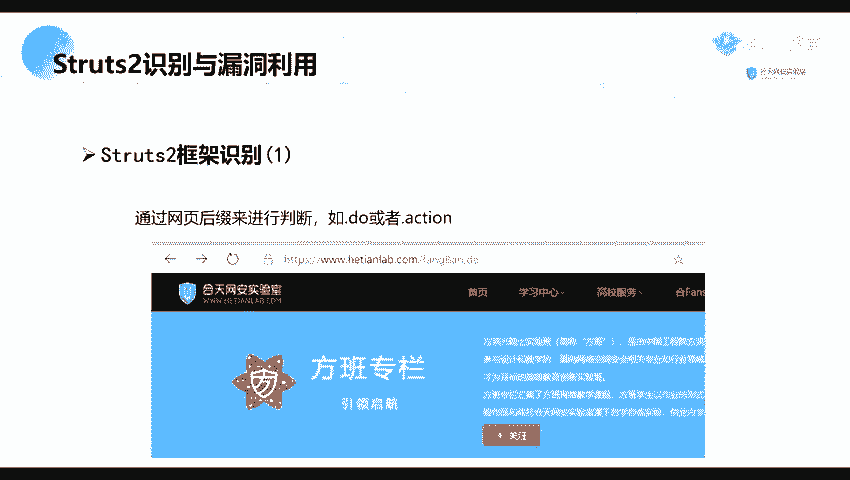

第二个呢就是我们可以通过判断他的一个。这个个它的一个开发开发模式，就是一个webcl这个页面。这个页面呢是我们的一个的官方为了方便我们的开发人员进行ebug而提供的一个功能。这呢我们可以。由此认识到。

他这是一个调试的功能，只有在调试的模式下才能进行使用的。那么怎么去判断呢？

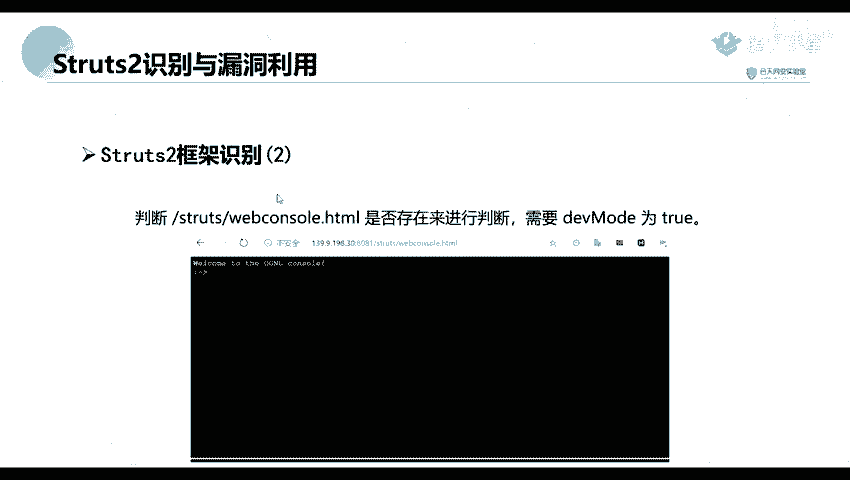

我们这里呢也可以。你好。哦，比如说这里这里呢我们是我们的一个实在处单就是体的一个服务，就是体的一个网站。

那呢我们前面呢就是可以说就是跟可以使用跟这个index indexd action就是这种a后缀后缀的一个路径。这种就说明他是一个用的是just two的一个框架。第二个呢就是我们我们的一个。

外b console的一个页面。就是我们通过访问这个页面看看他是否存在。

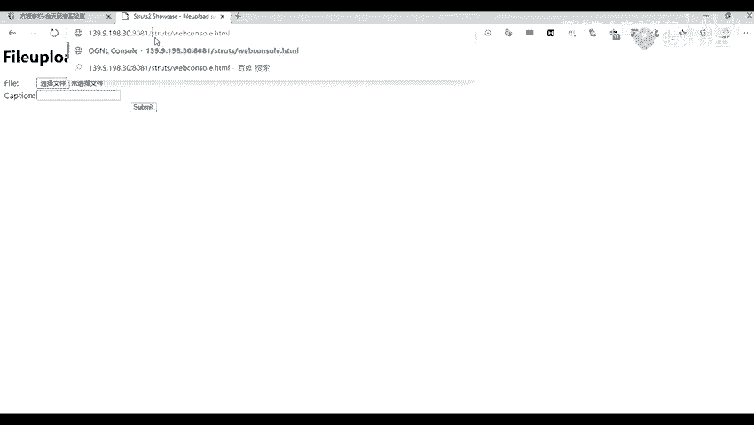

如果说他存在的话，那么我们也可以就是确定他是使用了这个钻处的一个框架。当样呢，我们这个呢跟这个呢是有条件的，就是需要开庭的那个。第一笔。DV mode这个功能。

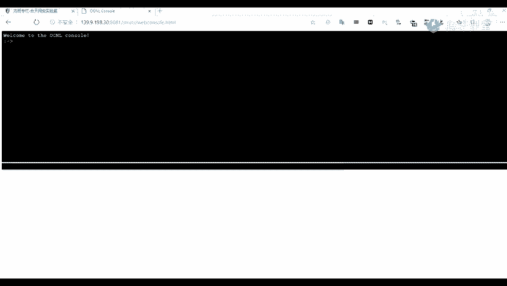

就是他开启了一个开发者的一个模式。原来我们。就是判断到他使用了一个str的一个框架，那么我们就需要对它进行一个漏洞的一个扫描。

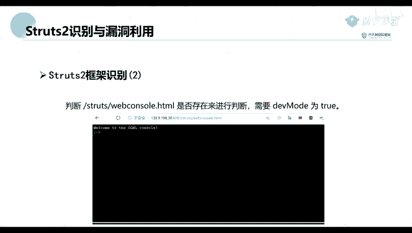

我这里呢是使用了一个工具，就是直接使用一个工具进行对他进行一个扫描。这工具呢就是在里面呢也内置了举豆的一个。sjust two的一个版本就是可以找其他的一个版本的一个漏洞。

这个工具的话，我我不知道你们那个工具包里有没有啊，要是没有的话，我待会发一下给你们。

就是就是这一个。哦，我们运行的话，他可能那个火容可能会进行一个爆竹。这个呢也不一定的，因为我们这种可能一些人就是大意，就是那种配置不当。

因为我们很多漏洞都是可能都是由于一些运维运维或者是一一些开发人员就是配置不当而导致的。就像我之前。看到过就是有一个是一个正式的一个网站。要要发直接一访问那那个网站，然后那个密码都直接记在那里的。

并且是一个管理员的密码。

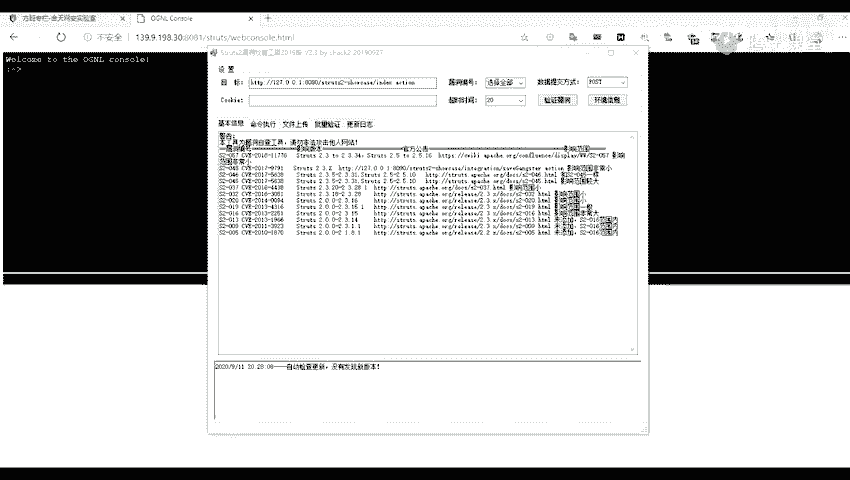

所以呢这种的话就得看就是别人的一个安全的安全意识。并不是说特别是像那些开发开发的话，安全一识他可能是并没。不是可能是他的一个开发的一个安全意识，他并没有那么强。所以呢有些人就可能是为了不方便，对吧？

签一些月考令之类的。他直接为了图方便，直接搞一个入口令。10你直接随便输入一个账号密码，可能就进去了。而且我们这个呢是指是他的一个判断的一个方法。

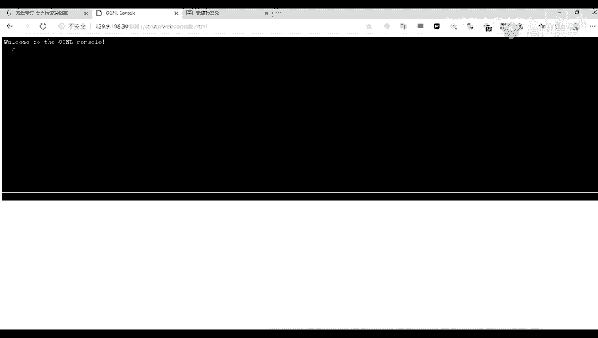

好，这个呢就是我们的一个工具。现在我们可以直接将我们的1个URL输入进去。现在我们就可以进行一个验证他的一个漏洞。验证之后，在这里呢会。就找找到了我们这个。地址存在了这些漏洞。当然呢。

我们我们呢也可以在我们的一个网上去搜索这个脚板。

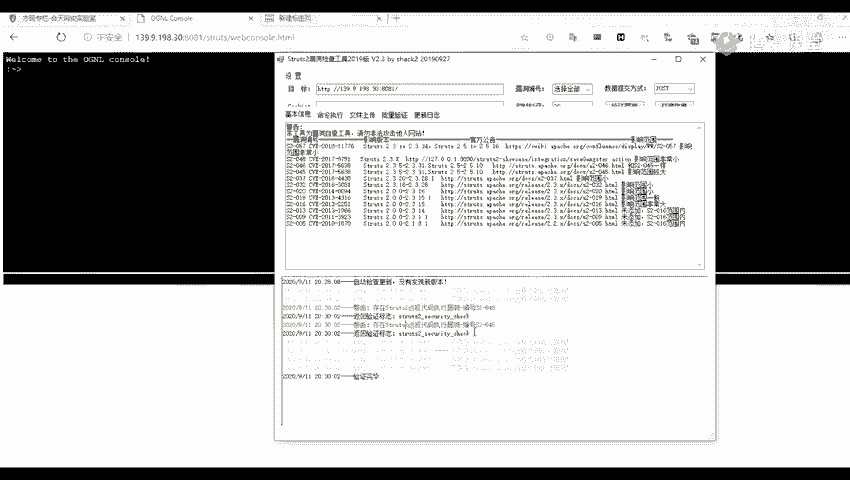

比如说在。比如说这这种脚本。呃，我们这里呢就用我们的一个工具进行一个扫描。现在我们这里呢找到了它就是存在了这些漏洞，那么我们就得需要对扫描到的一个漏洞进行一个利用。因为我们正常的话。

就算我们扫描到扫描到的话，那我们肯定还不行。那我们得对他进行一个利用才可以。下面呢我们先来看一下这个045它的一个漏洞介绍。但是由一个安全性息安全安衡性息安全研究院的一个。研究员。八线的一个漏洞。

它的1个CV编号是20175638，并且它的一个音响的版本范围为2。3。5到2。3。31，以及2。5到2。5。10。现在我们来看一下这个漏洞。会会对我们的一个服务器造成哪一些危害呢？

他是在在使用基于这个插件的一个文件上传功能时。比如说像我们这里。这里有一个文件上传的一个功能。第二这个呢就是基于他的一个插件。就基于那个插件的一个文件上传。

那么如果说他只用了这一个插件来进行做一个文件上传的功能，就会可能存在这个远程命令执行漏洞。那呢导致系统被黑客入侵。

然后我们恶意的一个用户可以在上传文件时通过修改他的一个HDTP请求投的用的一个contact type的的一个字段来触发该漏洞，进而执行他的一个系统命令。一般来说，这种漏洞能执行命令的一个漏洞。

危害都都是很大的。那么我们去怎么对他进行一个利用呢？首先呢我们利用呢我们先进行内部是执行一个命令。然后第二步呢，是我们。进行一个反谈效，就是将他的一个。终端的一个b去反弹给我们。

我们先来讲一下这一个执行命令。首先呢我们开庭我们的一个报考。bos service我们这里呢开启了我们的一个bos service位。然后呃这先发一下。你要开庭了之后。我们这里呢随意上传一个文件。哦。

待会待会有发发到群里。然后我们随意上传一个文件，上传什么文件都行啊。啊，我们这这里呢。抓到了。比如说我们这里呢点上成1个1。TAPGHP的一个文件。现在我们开始抓包，要进行提交。提交了之后我们。

这里呢是抓到了他的一个包了。收到了包，我们前面说过，我们是我们今将这一包发到我们的一个中继器这里，也就是这个newcle我们可以发送到这里，也要进行一个修改。

我们一般的话我们就是我们将都是将包发送到这个CP，然后进行修改，就可以随意的修改。让他修改我们的一个contact type的一个字段。我们找一下我们的这这个字段。

这个呢就是我们的一个concontact type的一个字段。要怎么修改呢？直接修修改为我们这一部分的一个内容。这部分的内容呢，我们可以在我们的一个网上去搜索到。比如说。我们这里吧，到一个V。刚。上。

我们可以在网上去搜索，然后上面呢应该都会有一些就是拍到的。你看你也可以呢，就是我们这样。他。直接在搜索引擎里面搜索。我们可以就是通过这些文章去找他的一个利用的一个方法。

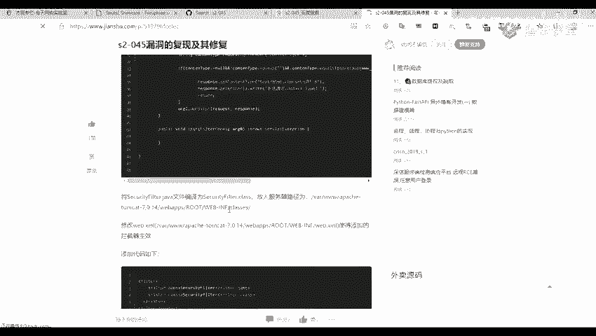

现在我们将我们这个拍load就是执这个拍load呢，就是执行执行一个命令。那就是这里呢就是他的执行的一个命令的一个内容，就是执行一个货员卖。执行一个货员卖的一个命令。

要我们将我们这些全部都复制到我们这个承台菜这个字段里面。你要点击电脑。点击下载之后，就是点击发送。发送之后，我们这里呢给我们回选了一个root，也就是回选了执行这个货原卖后面以后的一个结果。

除了一个固外麦呢，我们还可以去执行一些其他的命令。比如说ID。ID的一个命令，就是这些呢就是我们的in钮上面的一些命令，或者是LLX杠L。就查看我们一个目录。但是呢，执行命令我们。

对我们可能是我们执行命令的话，我们在那个。YSID的话是可以了，但是。我们在做一个渗透渗透的时候啊，渗透的时候，我们单单执行命令呢，我们还不做。我们因为我们渗透不单单是。只有这一台机器。

我们还还是要去拿下更多的一个机器，或者是拿下更。跟内网的一个机器，可能这里这台机器呢可能是它的一个外网机器。我们需要通过这个外网机器去拿一下它的一个内网的机器。

所以呢我们这里呢可以就可以将垃圾反弹一个需回来。那来这这里就是。这个文件这个链接里面的一一个文件，就是我刚刚执行命令的那个文件，你们。使用的话可以就是下载下来也要使用，也可以自己在网上去搜索。

那那我们来讲一下他的一个反弹票。

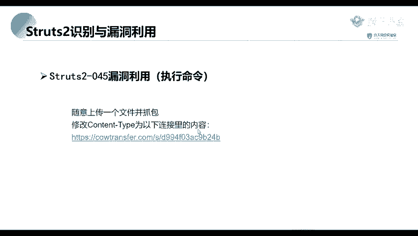

那为什么要反拿一个这样呢？通常就它本来需要那就是由在一个控制端去监听1个GDP的一个端口，或者是1个UDPUDP的一个端口。然后在被控端发起请求到该端口上面，并将其命令行的一个输入输出转到控制端上面。

那他有一个前提呢，就是需要有一个公网的IP因为我们我们这里的IP的话。

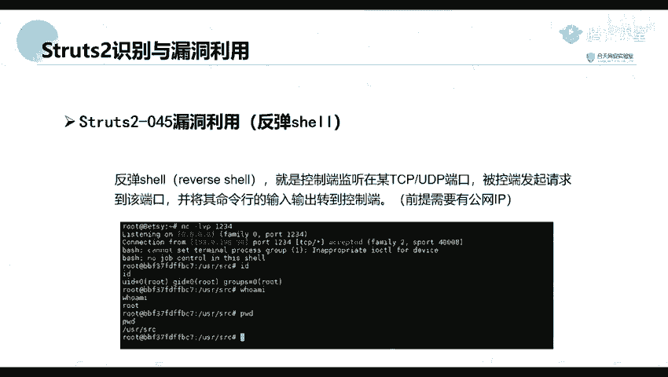

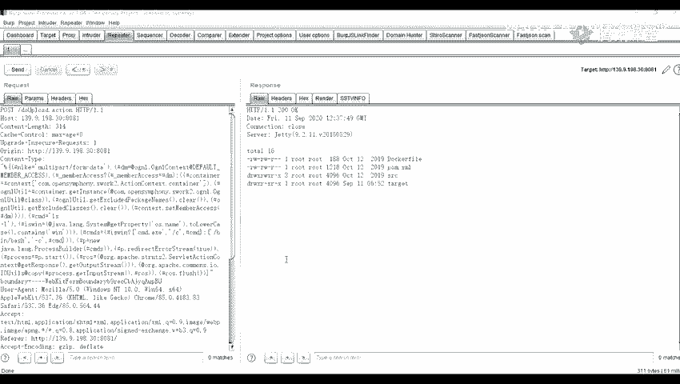

因为我们正常的话，我们是这个这种内网的1个IP。比如说像这种。I think complete。这里面呢是带了一个内网的1个IP找一下。哦，比如说这个它是1个192。168网。83网段的一个机器。

但是呢如果说我们就是将我们。

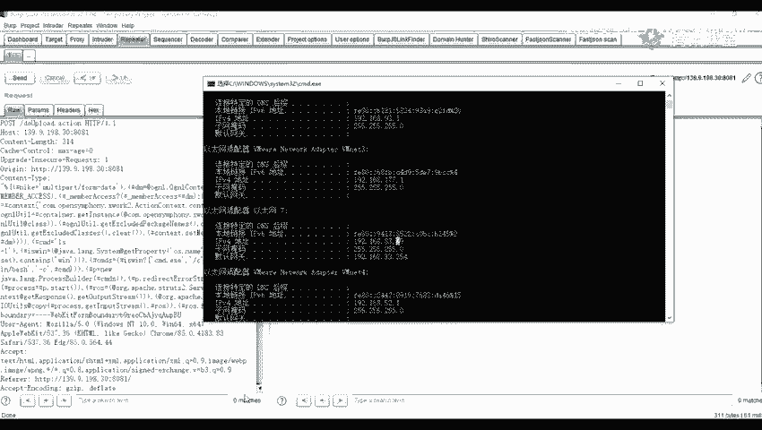

我们比如说像我们这一台机器。去将它的一个终端，就是它的一个输入输命令行输入输出去转到我们控制端，就是转到我们这台机器上面。但是这这台机器上面，它1个192。168。83。29，这是这是一个内网机器。

大家怎么可以去访问就是访问到呢，所以呢我们就是要有一个公网的IP。

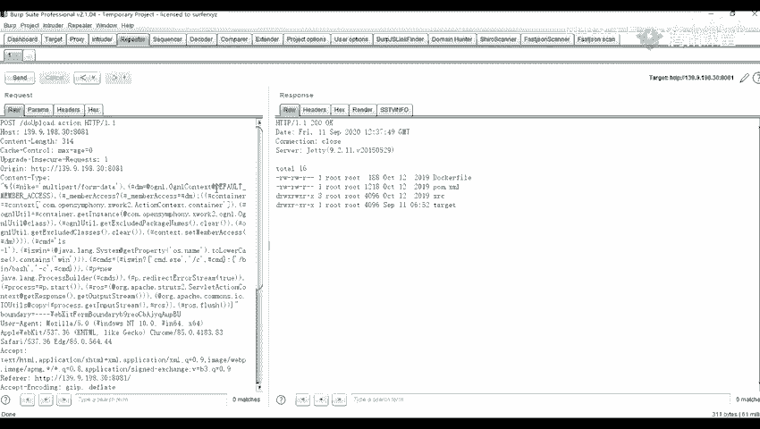

呃，对，我们就是有1个VPS或者是你们一个内网的，就是可以。将样你们的1个IP可以就是转出去。你们这个呢，你们后面的一个课程会讲，就是怎么给转出去，应该会有这个部分的一个内容。就是利用一个。

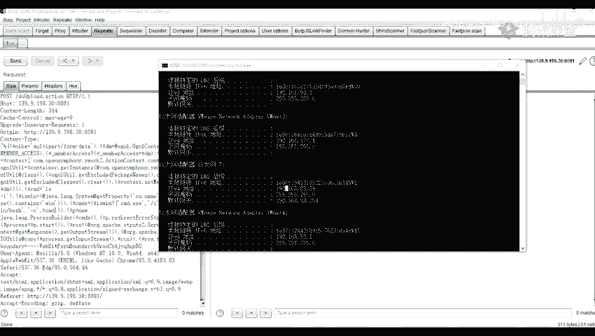

FRP。一个作为一个内网圈套。这个呢你们后面的一个课程会讲到这个FD的。不会呀，就是我们这个有1个VPS的话还是比较方便的。如果你们是还是学生的话，并且他还有一些学生机，学生机可能是119，也要一年。

我我这个呢是一个华为云的一个直升机，是199的199的，但是他。他是比正常的一个学生期大一点。因为我们很多时候我们。就需要用到这个工，就是很多时候都是要用到我们这个VPS。可能我们因我们的。一些请求啊。

或者就是发送到我们的1个VPSS上面。或者是我们可以在上面去跑一些脚本。当然呢我们在自己本地呢也可以。但是我们本地的话，我们一关机或者一断网就没了就停了。呃，我们继续两们的一个板单调啊。

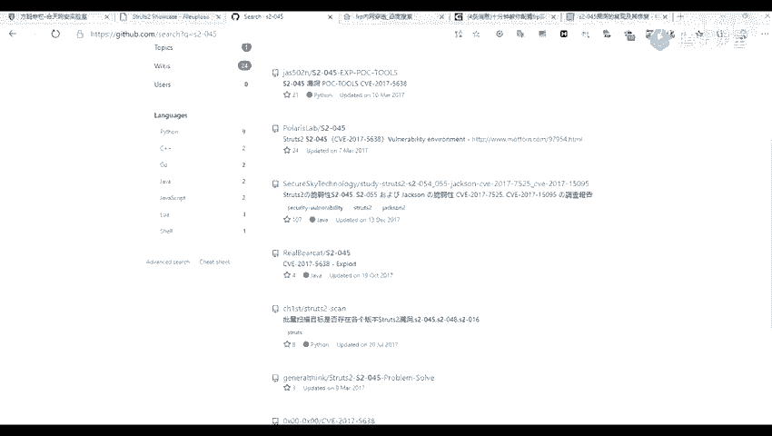

然后他的一个场景场景就是就是通常用于被控端，也就是我们。这个139。9。198。30这个机器上面。由于被控端因防火墙受电。以及或者权线不足、端口被占用等情形。为什么呢？因为我们。

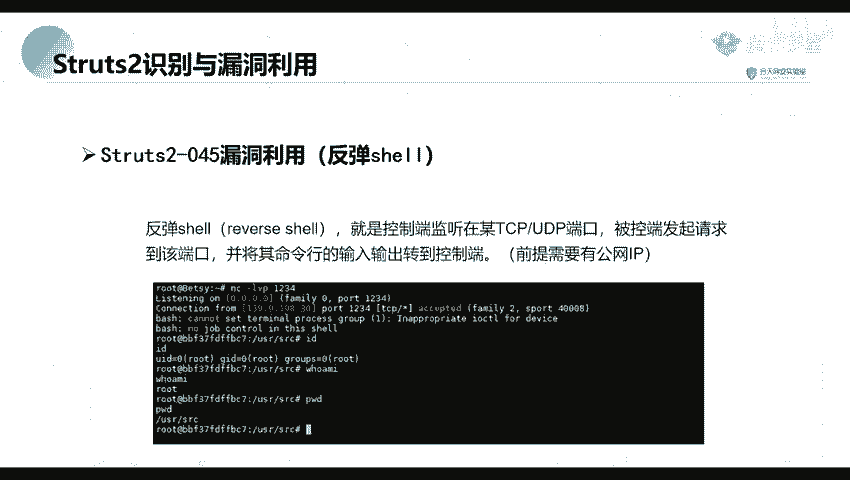

正常的话，比如说在这里。已经。这里他有已经有了1个808亿的一个端口，对吧？那当如果说我们。还需要一个正正向正向的一个连接的话，那么我们端口就会进行一个冲突了。

比如说将我们通过用我们自己的一个本机要去连连它的话，那么它两边的端口是不是进行一个冲突了，一一边是1个HTTP的一个端口，一边是我们去一个正向跳的一个端端口。但是这两者冲突了。这呢就不能去连接成功。

另外一个呢，就是。它的一个端口受限，也就是它的一个防火墙做了一个限制。比如说他这里呢只只开了1个8081端口。发只只开了1个8081专考。然后呢，我们如果是用一个正向效进行一个连接的话，在这里呢也是。

用他因为他这里8188081装口已经被占用了，就是。已经使用了，我们也不能去进行一个正向的一个连接。所以呢我们这里呢就用到一个反向反向的反向下，就是反向连接。

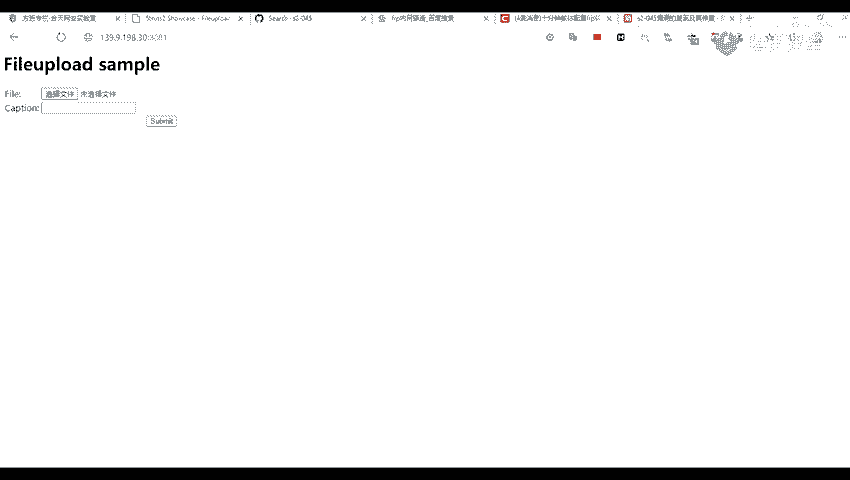

那什么是正线连连接呢？比如说我们工地了一台机器。就是攻击了一台机器，对吧？也打开了该机器的一个端口。原那我们攻击者在自己的一个机器去连接目标机器。或者就是一个目标ID跟一个目标端口。

这这个呢就是一个比较常规的一个形式。我们就叫做它的单为正向连连接。比如说我们的一个远程桌面。远程桌面服务是不是我们是需要输输入他的一个IP跟它的一个端口，对吧？比如说139。9。198。30。

跟像这种呢，就是我们主动向他发起一个连接的，就是一个正向的连接。比如说这种。桌远程桌面服务，还有一个就是我们的1个XH服务。

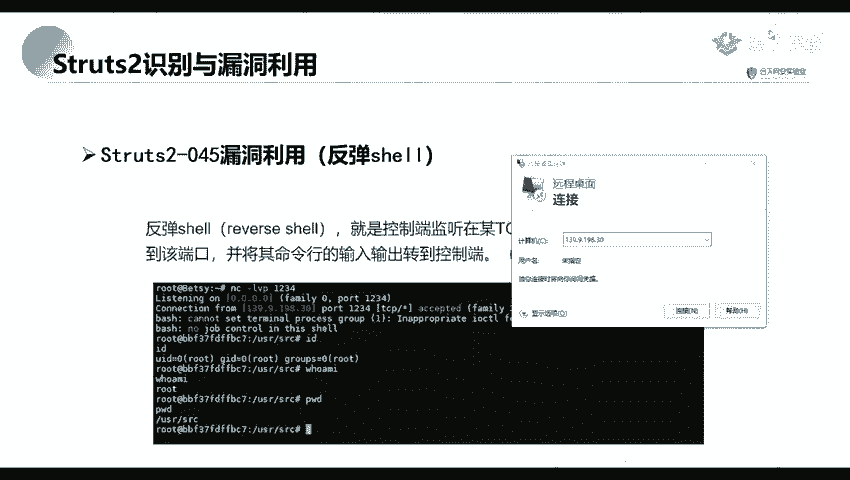

好，还有一个就是我们的1个S一体服务。呃，我们连接的话，我们是不是需要就是输是输入到的1个IP11个端口，这个呢也叫就叫做一个正向的连接。

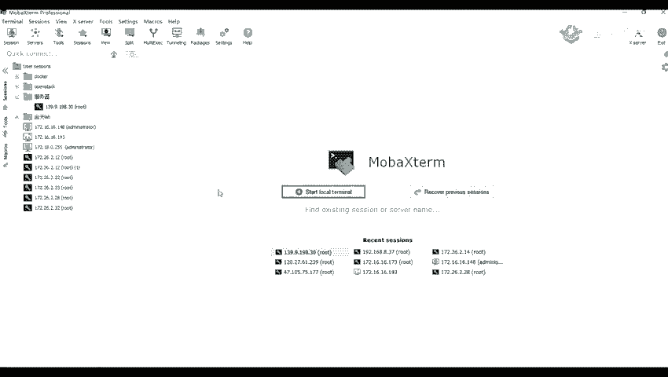

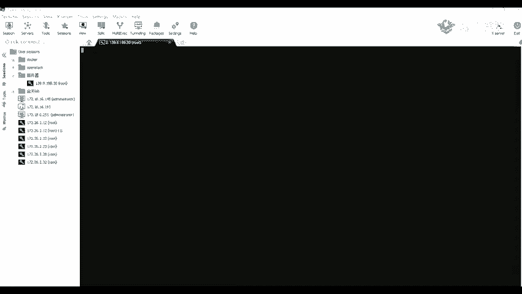

还有我们的一个web服务，web服务也也是一个正向连接，就是这种我们去主动访问他的这呢就叫做一个正向连连接。

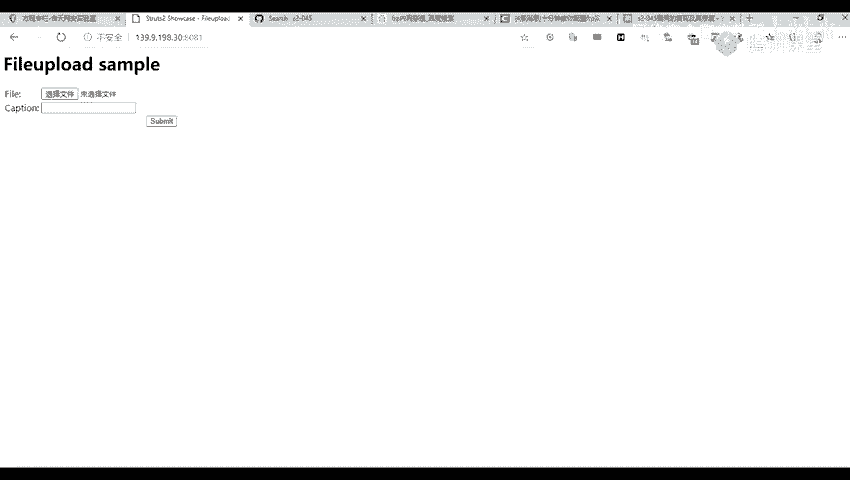

那么。看一下。哦，我们我们这里呢到这里呢，我们先休息一下吧。我们待会我们再继续接着讲啊。呃，我们我们还是先先讲完这一个吧，我们先讲完这一部分的一个内容，然后我们。后面的一个内容就下一节课讲。然后。

怎么去进行一个反向反弹反弹效呢？

我们这里我们前面呢，这里呢是不是已经执行了一个命令了，执行可以执行命令了。就是我们这个LS杠1这里。

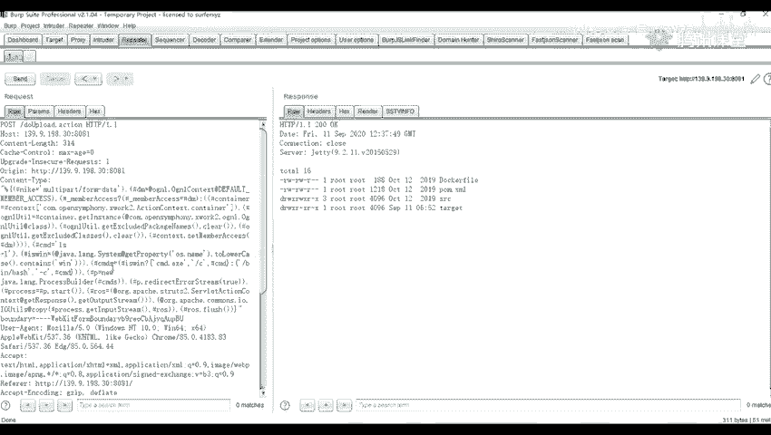

现在我们就进行一个反弹票。首先呢我们在我们的一个公网IP就是一个公网机器上面。

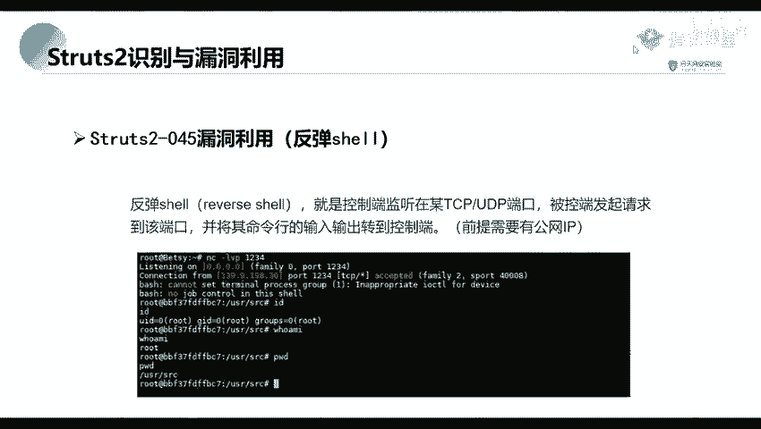

据此。