# B站最全网络安全教程，整整1300集，全程干货无废话，别再盲目自学了，看完学不会我退出网安圈！（web安全｜渗透测试｜内网渗透｜CTF） - P49：48.Struts2识别和漏洞利用.mp4 - 网络安全官方教程 - BV15u4y137cQ

我们今天呢也是给大家讲一个漏洞，就是一个常见就是我们。比较常见的一个漏洞是他 to以及 daybo。这两这两个的漏洞。刚刚这里呢，我们也分为两个部分，就可以说是一个两个部分。

一个第一部分呢一个是一个s two的一个部分。这个部分呢一分为两两个小部分，一个是它的一个相关介绍。第二个呢就是它的一个识别以及它的一个漏洞利用。第二个呢就是一个Gbo的一个相关介绍。

以及它的一个Gbo的一个识别与它的一个闹钟利用。那么我们我们先来看一下第一部分。just to的一个相关介绍。什么是指家处呢？他是美国阿帕奇软件基金会负责的一个开源的一个项目。是一套用于。

创建企业提交vawe应用层应用的一个开源MVC框架。这个MVC框架呢，也就是我们。然后然后。所做的一个模型视图以及控制器。他主要是提供两个版本的一个框架产品，一个是是str的str一一以及一个 two。

就是一个执证2。他本本质上。是相当于一个车内。然后呢，他在这个MVC设计模式中，它是作为一个控制器来建立立模型与视图的一个数据交互。我们简单的来说，他这个呢就相当于是一个框架。

然后呢我们可以就是对这个框架就是设计一个网站。这是我们的一个网部分的一些网站可以基于这一个框架进行一个设计。然后呢，他这个是抓处，他在历史上是报收获了非常多的一个洞。比如说。S2001。

S2003S2005等等。大大大概有十几二十个吧，这个呢CVCV编号呢，我没有写上然后那我们最近最近的话是。我看一下。毕竟的话就是我们的1个19年。等一下。最定的话是1个19年产生的一个漏洞。也就是。

也就是1个S2059，它的1个CV编号是CV12019。0232。这么牛逼的吗？哪里的呀？那个。EDUSIP的吗？啊，另外一个呢就是1个S2060。他的一个是1个TVE。20190233。

那样除了我们这些最近的一个漏洞的话，我们就是以前的那一些漏洞呢也是会存在的。比如说我们可能是比较。就是比较常见的，就是这个S2045的一个版本的一个。漏洞以及一个。哎，我这里没有052的。052057。

我这里都没写上。好，我这里呢就我待会我补充一下吧。所以因为呢他这个这个。用的用的比较多，所以他这个漏洞也也发发送的比较多。所以呢我们在日常日常的一个渗透的时候，我们都可以去试一下这些漏洞。

虽然说他可能离得稍微远，就是。离得我们稍微远一点，但是呢他也是会存在的。

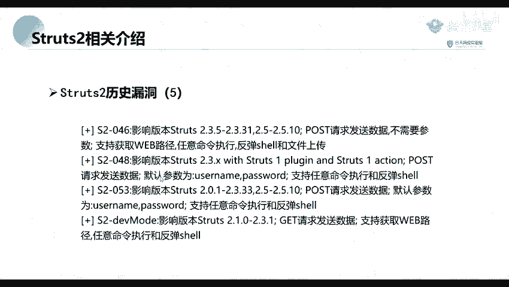

呃，我们我们还是先先讲完这一个吧，我们先讲完这一部分的一个内容，然后我们。后面的一个内容就下一节课讲。然后。怎么去进行一个反向反弹反弹效呢？我们这里我们前面呢，这里呢是不是已经执行了一个命令了。

执行可以执行命令了。

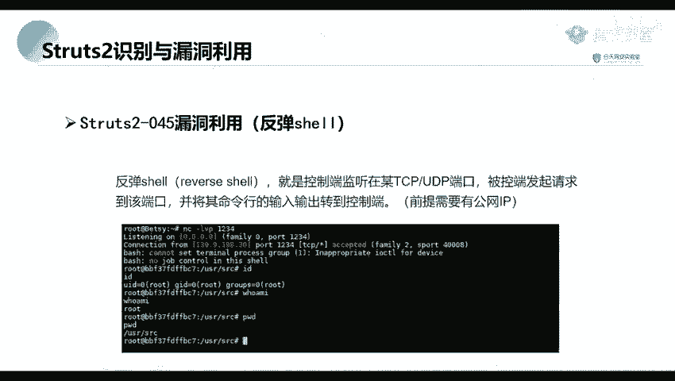

就是我们这个LS31这里。现在我们就进行一个反弹票。首先呢我们在我们的一个公网IP就是一个公网机器上面。据首先坚定一个端考。

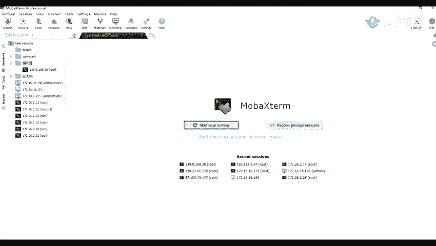

比如说我这里呢是我们是NC。是用于NC1个NC的命令。NC呢我们也叫做一个net care。

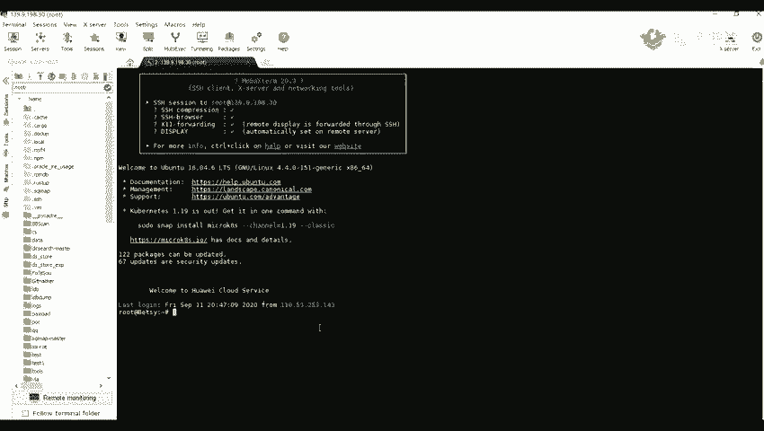

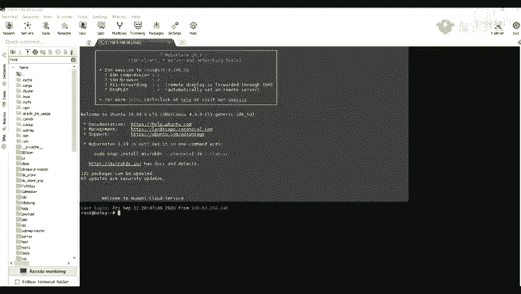

我们linux上面呢是1个NCmin。如果是我们window上面的话，它可能就是一个n cap。是我们下载下载下来它是一个ncket。现那我们首先呢我们NC接定一个端口NC1杠LVP。

然后后面加上我们的一个监听的一个端口，1234，我这里呢是监定在1个1234端口上面。然后呢，这里呢是这个杠A1杠1是什么意思呢？就是将我们的一个。NC就是指定NC要处于一个鉴定的模式。

然后如果说他只用了这个杠L的一个命令。这个杠1的一个参数则意味着NC被当做一个服务端。认定并接收他的一个连接。NT杠L1V。然。V呢就是租出交付或者是一个出错的一个信息。比如说我们。

他会给我们输出一些交互的信息。然后杠P杠P就是指指定我们的一个端口，我证明的是1个1234。指定1个NC端口就鉴定了之后。这个呢这里呢是我们的就是。我们的一个服务端就是用来被连接的一个机器。

就是被连接的一个端。

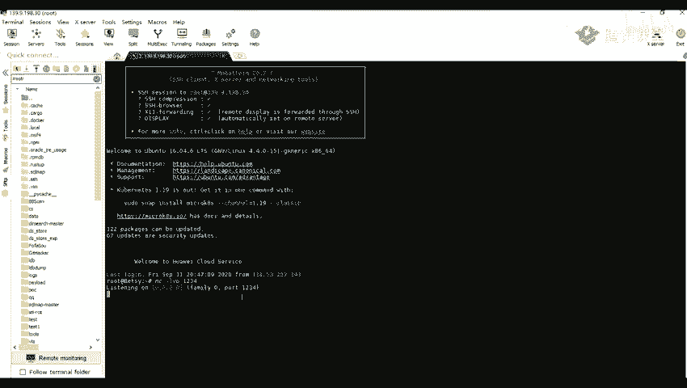

现在在我们这上面。去执行我们的一个。反弹下的一个命令。啊，我这里呢复制一下。那么我首先输入我的1个13。后面是一个。哦，这里呢就是我的一个法南票的一个命令。我这里先关掉。然后。

这里呢呃我把它复制为一个文本吧。他这里呢就是指指指他的一个意思，就是在我们的一个拜上面，也就是在我们的一个终端终端上上面类似于这种。

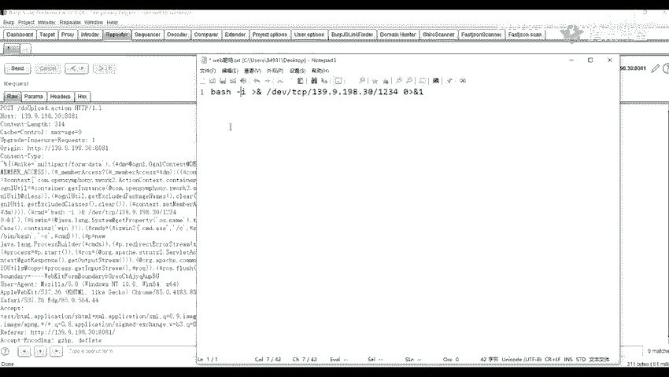

首先类似于这种这是一个拜。在上面要去执行后面的一些命令。

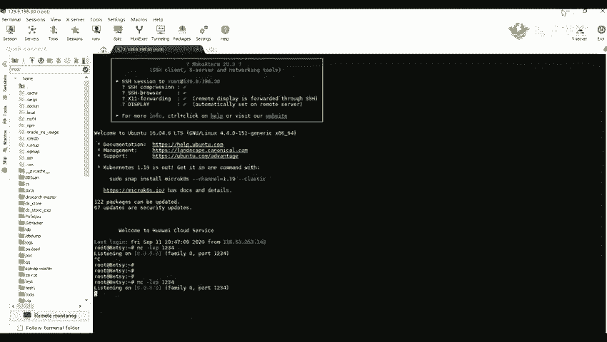

1杠I杠I参数呢就是。只产生一个交互式的一个sell，也就是一个bage。然后后面后面这一部分这个CVDCB。指的一个特殊的一个设备文件。我们在在链上面呢，它一切都是文件。

但是实际上这个文件呢是不存在的。他他只是用。那只是败审实现的，用来实现网络请求的一个接口。然后打开这个文件呢，就相当于发出了一个shopocking调用，并建立一个shopocking连接。

然后读写这个文件，就相当于在这个shop品连接中传输一个数据。后面呢就是跟上我们的1个IP以及我们就是我们的一个公网IP这个139这一个公网的IP。我们的一个购网IP。

1后1234就是我们鉴定的一个端口，也就是我们这里鉴定的一个端口。那那我们我们点击这的。点击发送之后，那这里呢需要等一下。139。啊，怎么不法连接了？等一下，看一下。

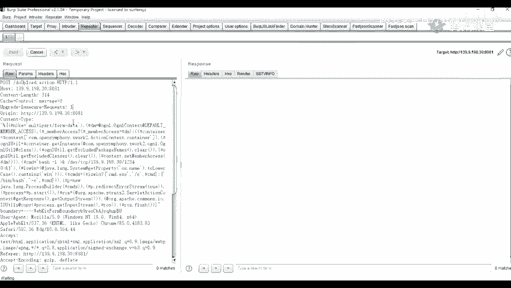

哦，这里呢我们这里在这边我们鉴定了一个就是我们的一个服务端，服务端上面已经。接着就是监听到他了到了一个连接，就是我们这一台机器上面发起的一个连接。

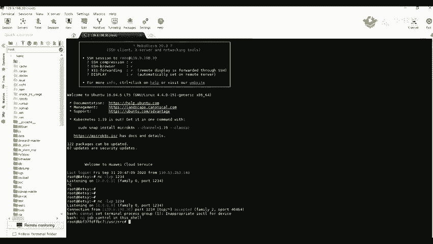

这个139。90198。30，因为我们这两台机器是实际上是不一样的。这里呢是1个8081端口上面的一个机器。

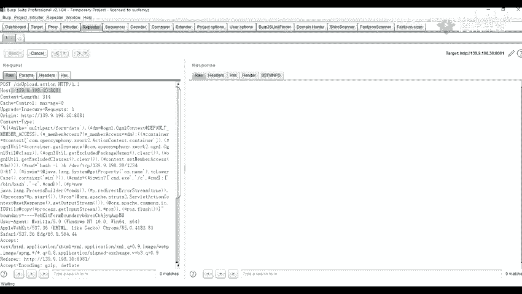

原呢我这里呢是我们。外面的一个机器里面这个呢是我们的一个docker，就是docker里面的机器。

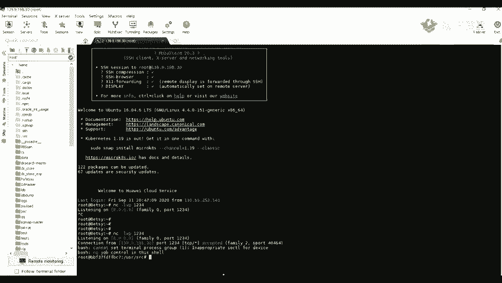

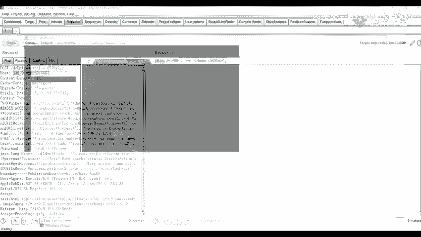

那在我们这里呢实际上就接收到了他的一个反弹调，也就是说我们已经拿下了这一台服务器。比如我们执行一些IDID的一个命令，或者是。5。Am I？会卖的一个命令，我们可以看到我们可以随意的执行他的命令。哦。

这个呢就是我们利用我们的1个S2045是加 to045做的一个反弹效的一个操作。

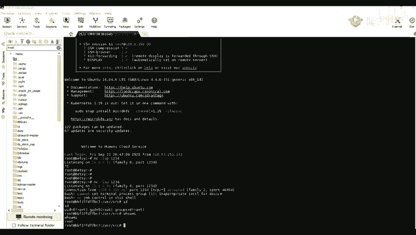

好，那我们这里呢先休息一会儿，休息5分钟。你们有什么问题的话，也可以在那个提问。

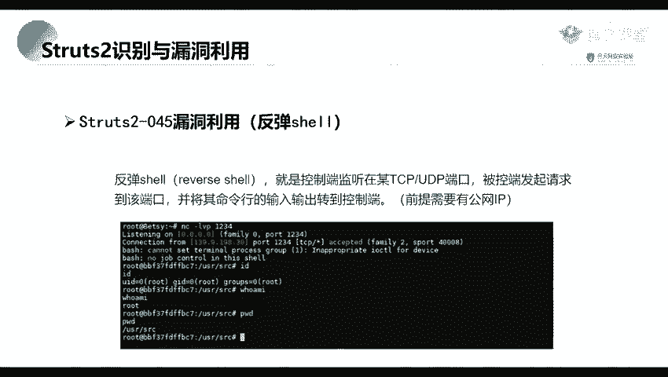