# B站最全网络安全教程，整整1300集，全程干货无废话，别再盲目自学了，看完学不会我退出网安圈！（web安全｜渗透测试｜内网渗透｜CTF） - P50：49.Jboss相关介绍.mp4 - 网络安全官方教程 - BV15u4y137cQ

那么我们怎么去识别？怎么去识别这个就是使用了这个Jbo的一些网站呢？首先呢但这个接po一般的话，它默认呢是开放在1个8080端口上面。它它是使用的是1个HTTP协议。

它的一个默认端口呢是在8080端口上面。并且到了一个访问的一个页面，默认的一个页面，就是这样子的一个页面。

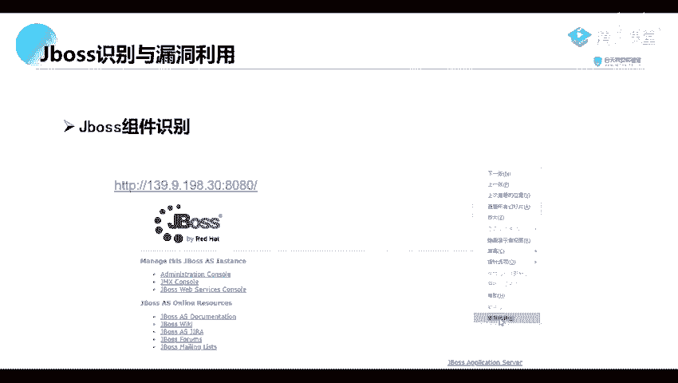

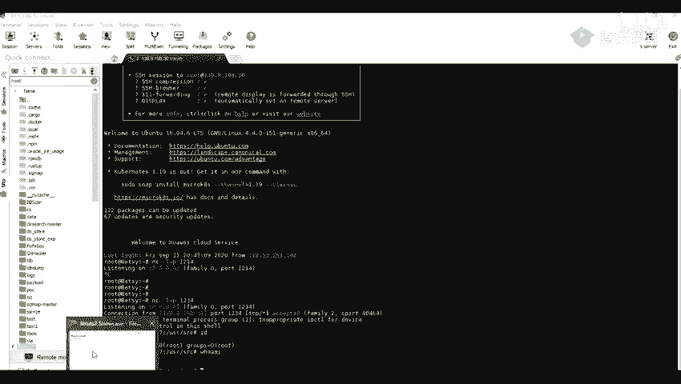

13。就是这样子的一个页面。并且我们那个佛法刀应该也能搜到，我看一下。

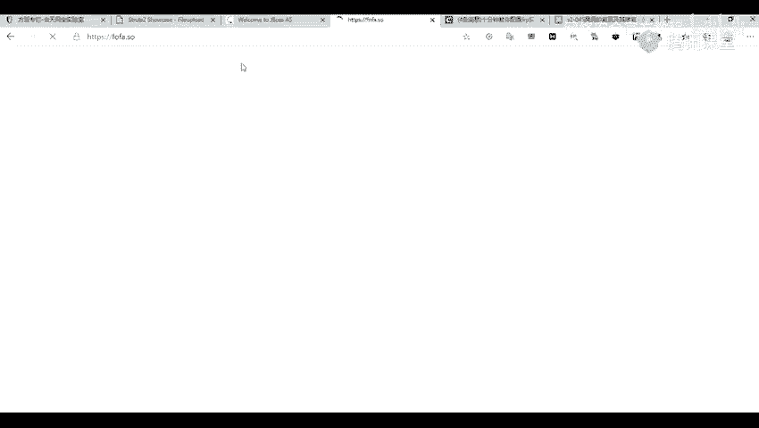

Okay。我。哦，比如说这个我看看一下他是。

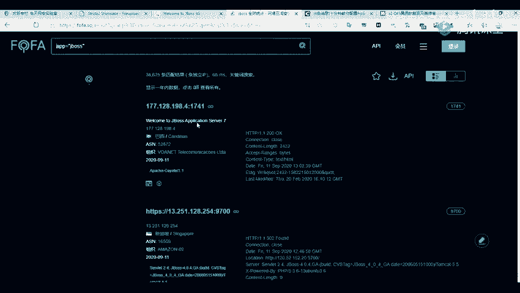

这是。啊，还有另外还有一个就是相当于是这这一种页面。因为我们前面那个是1个66点几版本的，这个呢是1个7版本的，你们也可以就是很很明显的看到他的一个就是网站，他是使用的一个J box。

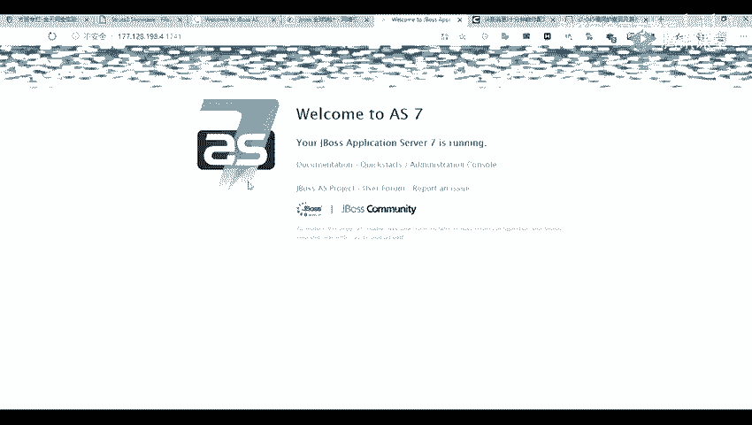

我们再找一下其他的。比如还有这种。

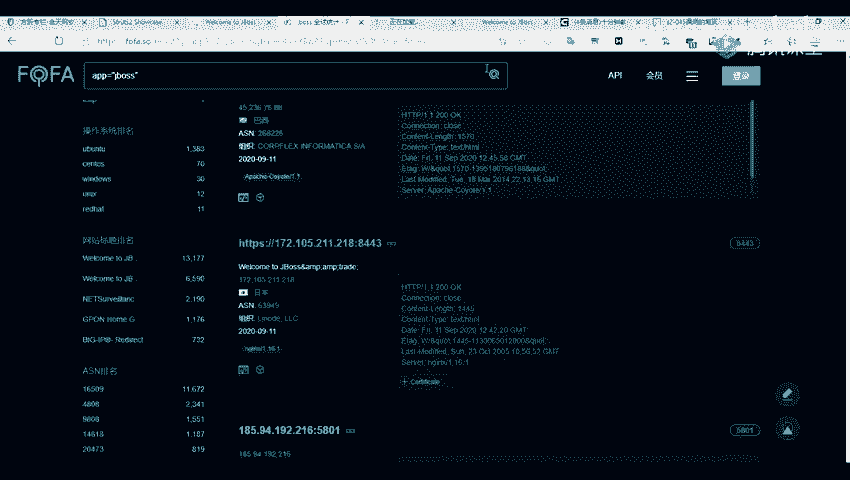

在这里呢我们也可以看到它也是一个Dbo的一个网站。

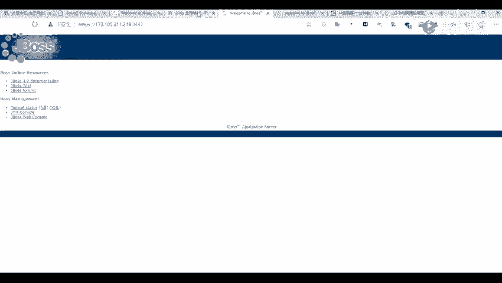

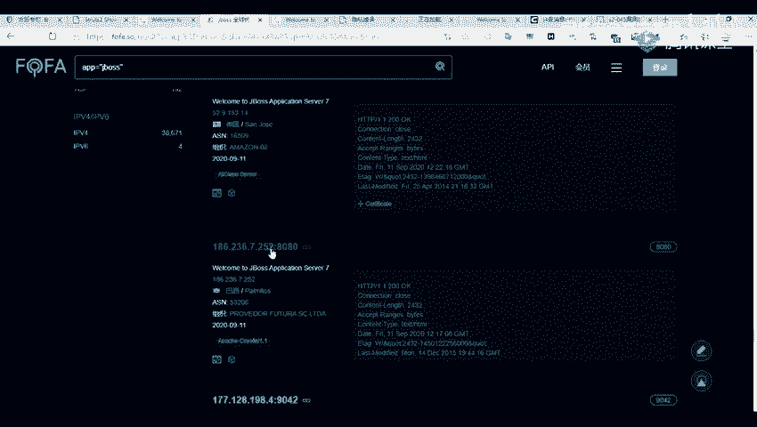

他的一个版本版本不同，它的一个页面可能就有所不同。你们可以看到这这个呢也也是开放在他的1个8080端口上面。

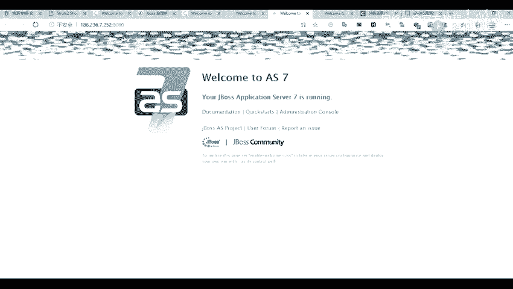

80。

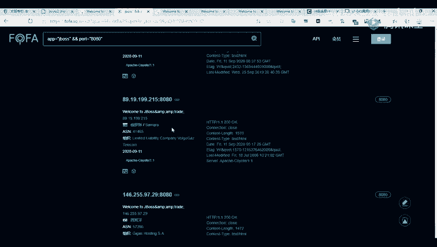

还还有还有这种也是在8080上面的。我都可以看到，在这里很明显的一个信息就是只用了一个japo这这个图标。现在我们来看一下就是如何去发现这个漏洞。我们这里呢也使用到它的一个批量的一个检测的脚本。

我们这个呢我们也是在别他。上面的。好。原来我们这里面使用这个脚本进对我们的一个网站进行扫描，看看。现在我们下载下来之后呢，主要有两个文件，第一个是一个tge，还有一个tboard点PY。

只需要将我们的一个目标，就是目标放到我们这里就可以了。给我们的一个目标，还有一个端口，就一一行一个一行一个放上去，一样一行的放上去。比说我们这里这样子。让那我们执行一下。没有。

我们这个节盘呢是使用我们的一个python3，python3执行的。你们就是之前有一些同学，你们说就是怎么就执行完了之后，就是怎么没有反应。

那是因为你们可能那个环境可能是一个pythonpyython2的，就是可能你们直接注入一个python，它可能就是他直接是相当于这这样子，你们注入一个python，可能是类似。是我这样子的一个输出。

可能是你们可能是一些是2。7。4或者是3点几的一个版本。你们如果说你们输入的话，有。我这里呢因为我配置的话，就是将它的一个命名为一个2，就是python2。所以呢我这里呢使用的一个Pthon。

就是一个Pthon2。要不我还有一个三版本的，就是一个Pthon3。怎么我这里给你们点一下吧，就是在这里进行一个修改。比如说我这里呢安装了几个pyython版本，对吧？比如说我这里有一个。ion33。

7的。现在我这里我们这里呢可以看到我这里它的这个命名python，这命名为是一个pythonpython3的。所以呢我这里执行命令的话，我这里呢执行一个python3的话，那就是一个python3。

7的。

还有呢，我这里呢还有一个就是。

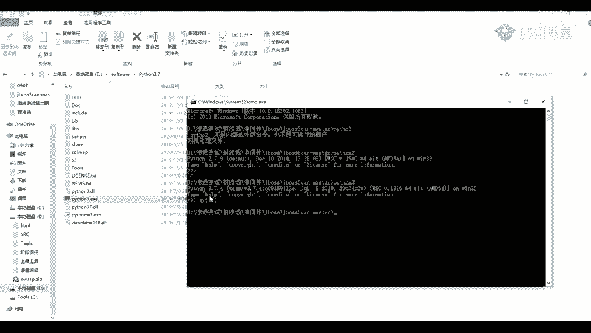

python，比如说我这里有一个python3。8的对吧？这样呢我这里他的一个命名是拍粉38。对呢，我这里输入一个拍粉38。

那呢他这个环境呢就是一个python3。8的。如果说你们输入输出就是输入就拍thon或者是拍on2拍on3没有输出的话，那么一个是你们没有安装。第二个呢，就是你们那个命名就是没有命命名成这样子。好呀。

那我这里。这里是一个。这用一个拍遣三案的一个。牙板。Oh。要回声。回车之后呢，他这里呢就给我们做一个检测。

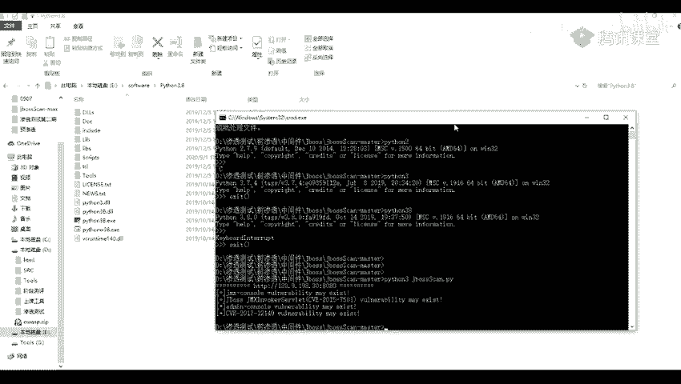

那第一个呢就是检测到了这个。边插的一个控制台就是。说他可能存在一个漏洞。那第二个呢，就是他的1个CV20157501的一个漏洞，也是可能存在的。第三个呢就是一个是就是一个儿童秘疫康手，他的一个。

漏动他这里呢也是可能存在的。第四就是1个Q1201712149。

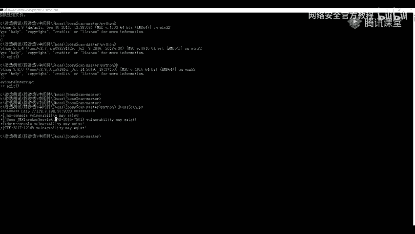

现在我们这个呢是一个B量的。那么如果是一个单个的话呢，那怎么去进行一个判断呢？就是我们访问我们的这个UIL就是这个UIL就在我们的IP后面加上这这部分的一个内容。就在我们这一部分后面加上这一个的内容。

那如果我们访问之后，如果说他的一个状态码就是500。如果说他的一个状态嘛显示为500呢，那就说明他是很可能会存在这一个漏洞的。刚刚我们来看一下他的漏漏洞的一个概数。

但是由于是一个java环境内话的一个错误类型，存在于C box的1个HTTPmo的一个。组件中的一个过滤器中。就是我们刚刚的访问的这个URL。你窝口。那那这个个漏漏洞呢也会就是导致了一个。命令执行。

也就是可以去对我们的这一个服务器就getel的。那么我们怎么去get下呢？我这边呢是直接使用一个脚本，就是直接使用一个脚本来进行一个反弹效。哦，我们脚本的地址地址呢是在这里。

这个呢就是我们的一个表本的地址。那他使用呢也是比较简单的。等一下，然后直接呃我进入到我们我的那一个目录片。

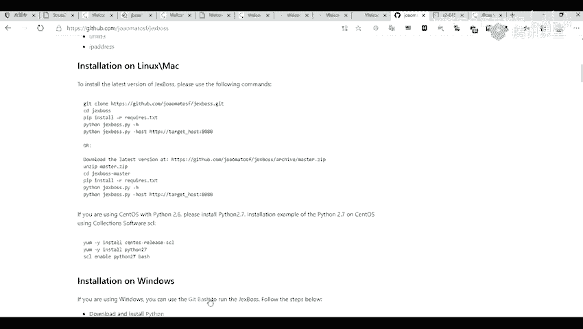

我们这里呢先进行NC1个端口。现在鉴定一个端口，我们这里这里呢是前面鉴定的一个端口，我们先进行退出。我这里好了。我说怎么保连不上啊。哦，在脸连上。首先呢我们这里也是NC1个端烤要LED。11234。

我们这里呢是监钉1234砖头。那之后呢，我们执行我们的脚本。

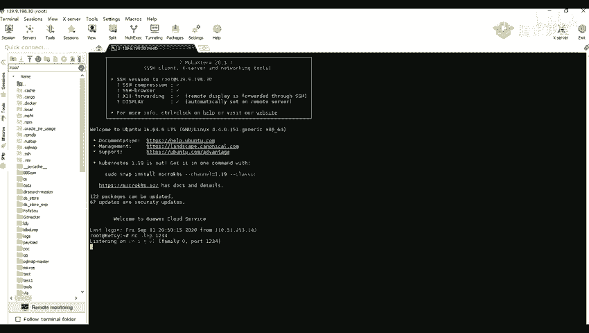

啊，这个脚板执行我们的脚板。那么在我们的路径上打开的他的1个CMD。

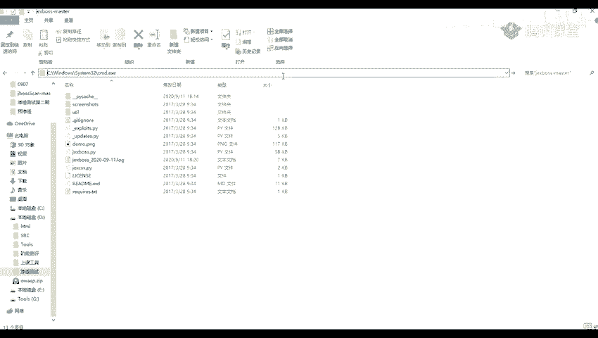

要直接拍拍展。我这明这一个潘成二的。要拍展。要加一。之后呢加上我们的一个杠杠号，杠，是看一下杠号，我看一下是号还是杠杠号。

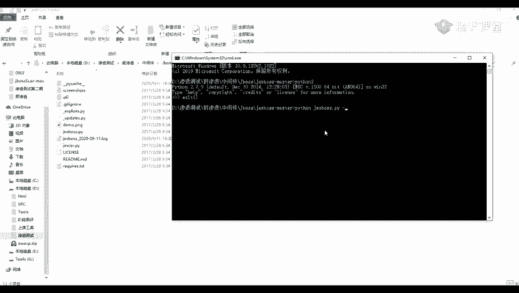

哦，杠号啊，也要加上我们的我们的1个IP。

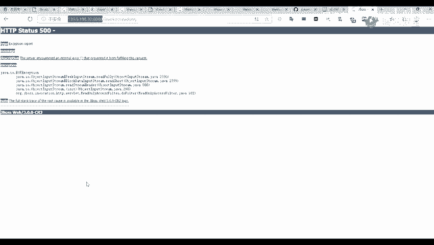

对我们的1个URL。让我们回收一下。嗯，我我这里找了一个那个你们之前就是有些同学就执行完之后，他没有任何的一个显示。就是因为你们那个环境就是没有。比如说你们有些同学是一个Pthon三的。

拍审三案的然后执执行完之后，这里呢是一个拍审三案的。更新完之后，他并没有任何的一个显示，就说明你。没有那个环境或者是那个环境被料是没有配好。这里呢是一个python2，然后KEX。再加上我们的一个号。

加上我们再加上我们的1个URL。要回车。嗯。

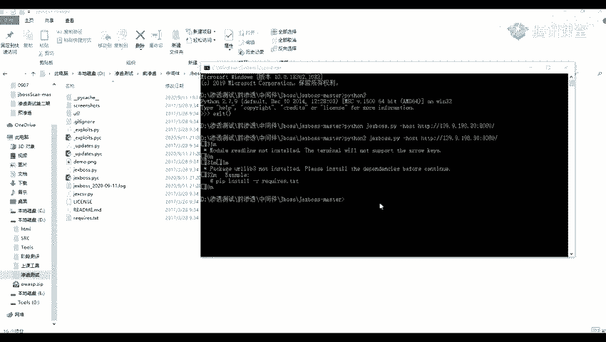

你是三的吗？我看一下。

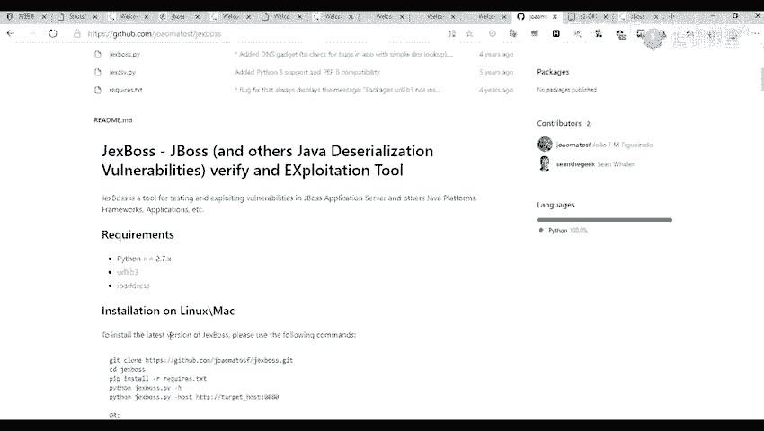

我这里不用我这里不用三吧。回车之后，他就会进行一个检测。这个脚本呢还是比较方便的，那我们可以直接输在这里输入我们的这1个IP跟端口就可以。将他的一个拜部给反还回来。那么我们这里呢做一个页。yes之后呢。

他就会攻击我们这这一台服务器就是139。9。198。30这一台服务器。那我们等等待他进行攻击。好然后呢，我们在这里呢来询问询问我们就是。让我们输入1个IP就是一个远远程地址的IP。

也就是我们的一个公网公网的1个IP139。9。198。30。这这个IP呢就是我们就是接收接收下的1个IP。

要端考就是1234，也就是我们这里建订了1个1234端考。

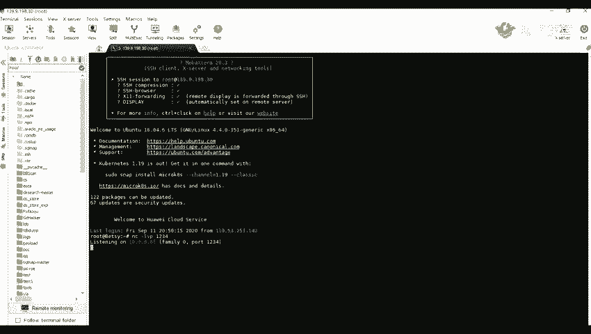

好，在这里呢就会将他的一个袋纸给反谈到了这里。

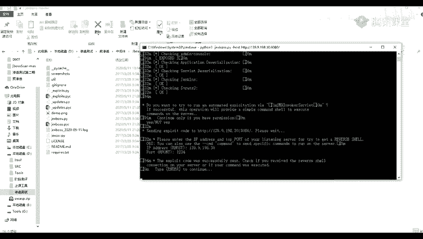

哎，没有成功吗。

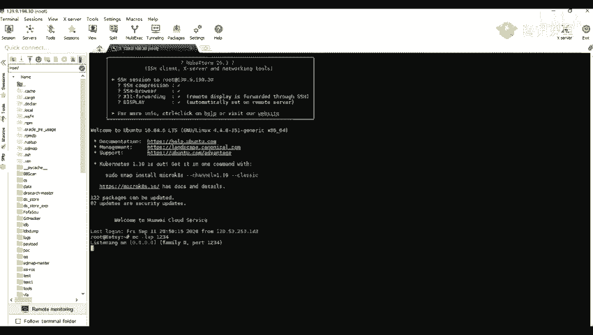

再看一下。

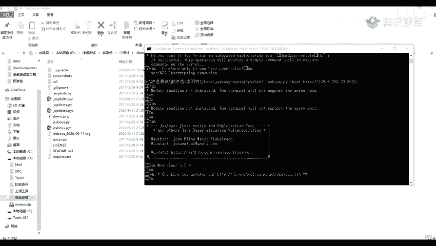

唔知。

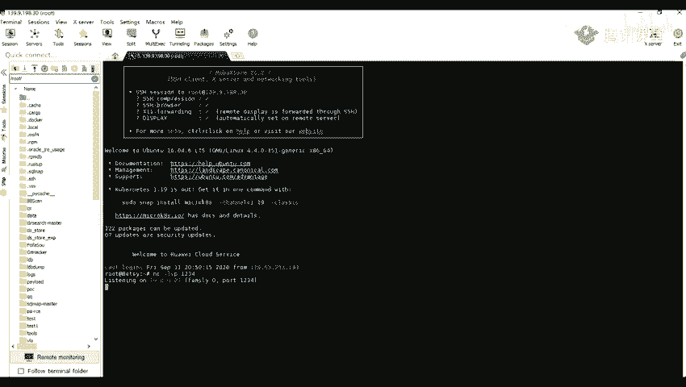

1234。在这里报错了，但是连接连接不到我们。的一个机器。

这里看一下。应该。

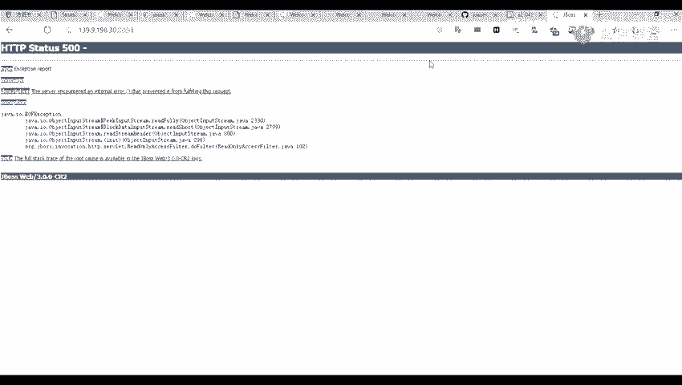

重新执行一下好好，看一次。3。啊。等后我们在这里在这里出现一个错误了。h t t t。

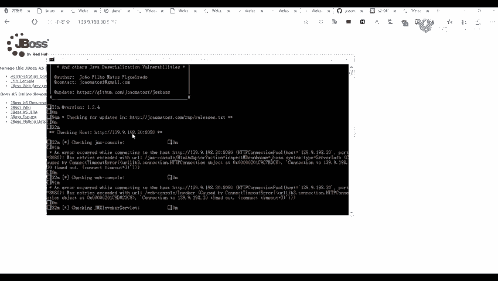

对。

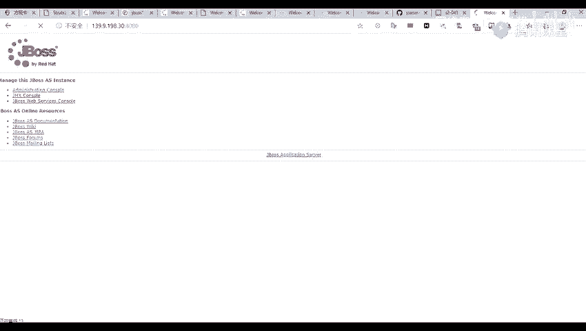

这个站可能是打封了吧，我看一下。巴啦年花年。

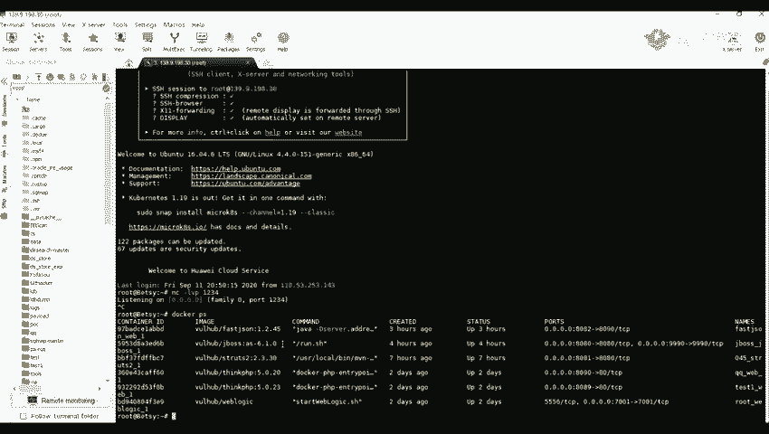

五0三。我这个账给打光了。

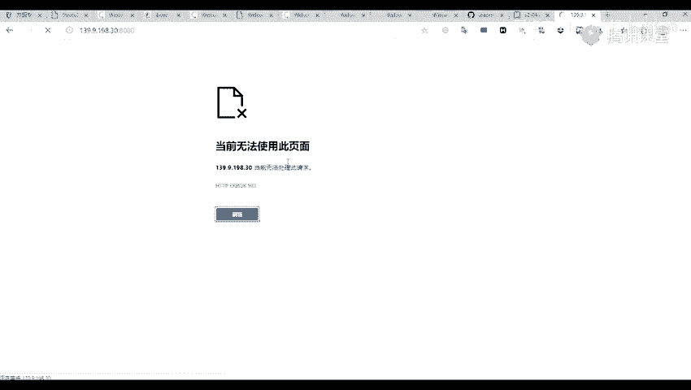

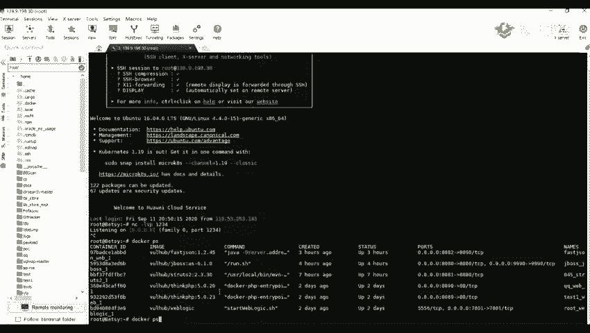

要是不行的话，我们在这里呢就先跳过。然后139。我们这里等等待一下。重听。推建一个端口。将。啊，这里嗯。这里打打不成功啊，我们这里先跳过吧，他里面的服务应该有问题。那么我们这里呢就先跳过啊。

我们开始下一节课的一个就是下一部分的一个内容。这个网网站封了啊。

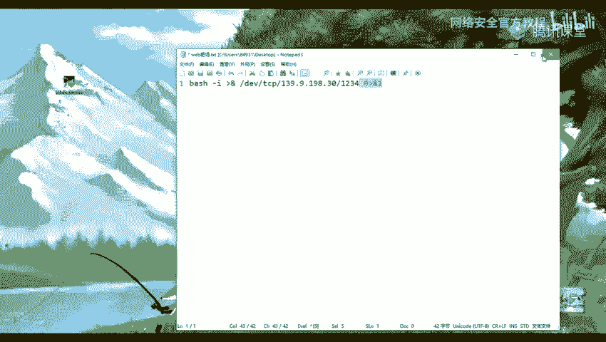