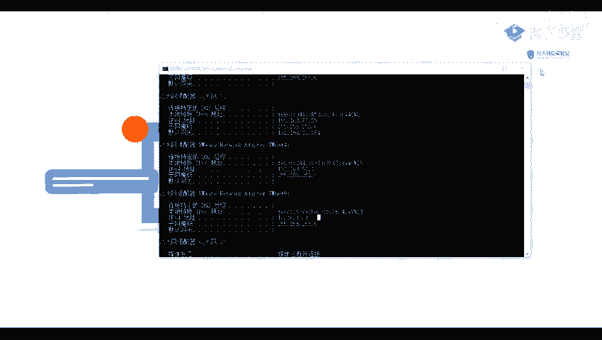

# B站最全网络安全教程，整整1300集，全程干货无废话，别再盲目自学了，看完学不会我退出网安圈！（web安全｜渗透测试｜内网渗透｜CTF） - P51：50.Jboss识别与漏洞利用.mp4 - 网络安全官方教程 - BV15u4y137cQ

然后我们第二部分就是讲我们的一个Gbo。首先呢看一下D box是是什么呢？它是一个基于J2E的一个开放源代码的一个应用服务器。他是用来管理EEJB的一个容器和服务器。

但是它的一个核心服务并不包括支持在一个车内。PSSB的1个web容器，一般一般上它是与一个toca或或者是一个jaing绑定使用的。那这个呢他这个呢历史上也出现过许多的一个漏洞。

首先呢第一个是一个广泛控制不严导致的一个漏洞。比如说他的一个GJMXcl，它的一个未未授权访问getel。以及。他的意见要过。那的一个控制台安全验证要包漏洞。这这些呢都是比较老的。

但是呢有一个有一个呢是一个还有一个就是一个得秘看手，他的一个入口令getel，也就是我们一个运维管理人员，或者说是一个开发，就对我们的一个网站就是做了一个入口令。

他通过我们可以通过用宝令进入我们的一个网站，然后从而进行一个getel。还有么就是一个反对量化的。比如说我们这就是17年的一个G box A6。3的一个反区电话漏洞。

它的一个第一编号是1个201712149。以及他的一个另外1个20177504的一个漏洞。

