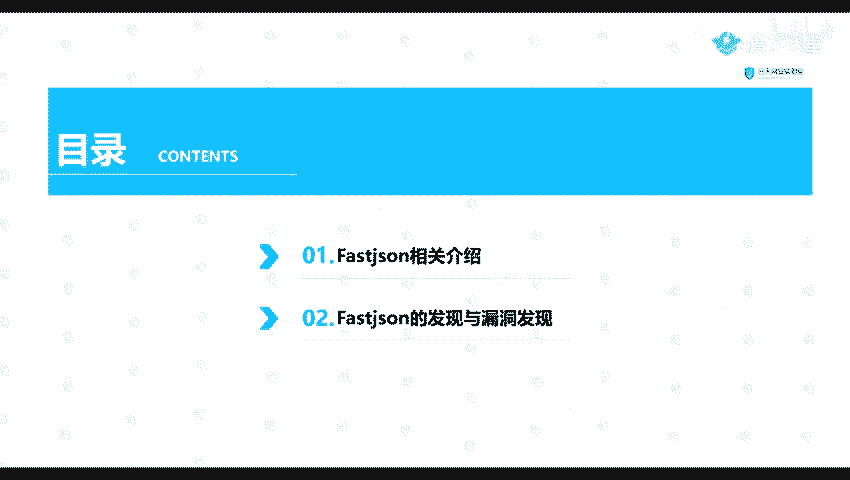
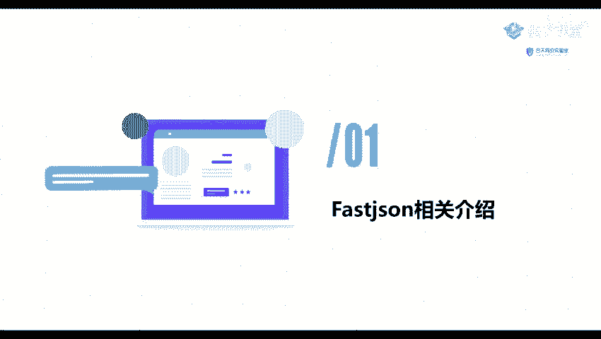
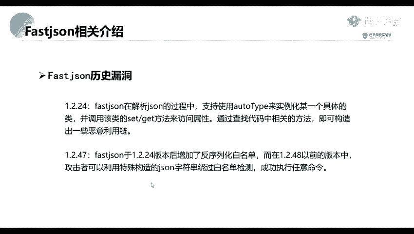
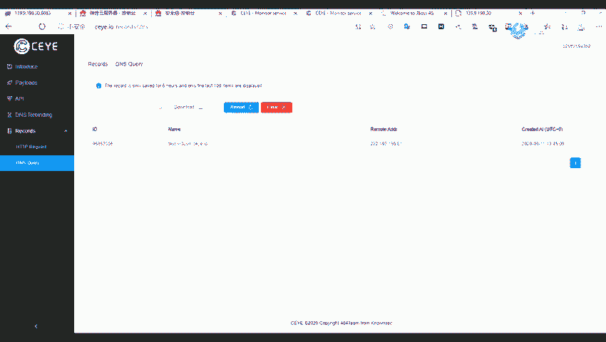

# B站最全网络安全教程，整整1300集，全程干货无废话，别再盲目自学了，看完学不会我退出网安圈！（web安全｜渗透测试｜内网渗透｜CTF） - P52：51.Fastjson相关介绍.mp4 - 网络安全官方教程 - BV15u4y137cQ

嗯。下面呢我们来点一下这个。fat jason的一个漏洞。因为这个漏洞呢这。最近这两年也还是比较火的一个漏洞。所以呢我我们这里呢给大家讲一下。那么我们这里。要因为一个时间关系。

我们先讲前面的两部分的的内容。然后第三部分的一个漏洞的利用内容呢，我们在下一下一节课再讲。我们先来看一下第一部分fasge的一个介绍。

但是pas的节省是什么呢？

他是阿里巴巴公司开源的一款接son的一个解析器。我们最近的话这个漏洞呢还是比较火的，就是这个bu阶的一个漏洞。嗯。第二呢嗯。那最早最早的话好像是在17年17年出现的一个漏洞。

原在我们这里比较比较火的话就是一个。1。2。47也要1。2点。1。2。24L1。2。47吧，这里。就是一般的话我们可能都是都是听说这两个版本的，就是主要听说这两个版本的就是1个1。2。24，还有1。2。

47。嗯。他的一个原因就是发死的阶审在解析就是。我们的一个阶审就是。被在解定的一个过程中，支持使用的一个or态来实例化某一个具体的类，并且调用该类的一个set get方法来访问属性。

通过查找代码中的一个相关的方法，就可以构造出一些恶意的一个利用类。然后1。2。4G的话，就是在在一个fa fast jackson在1。2。24版本后增加了一个反序列化的白名单。而在1。2。

48以前的一个版本中，这里面并不包括1。2。48。攻击者车就可以利用特殊构造的一个jason字符串药卧白名单的一个检测，成功执行任意的命令。

