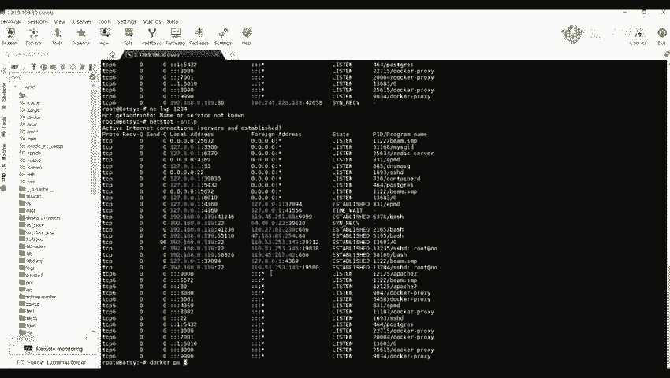
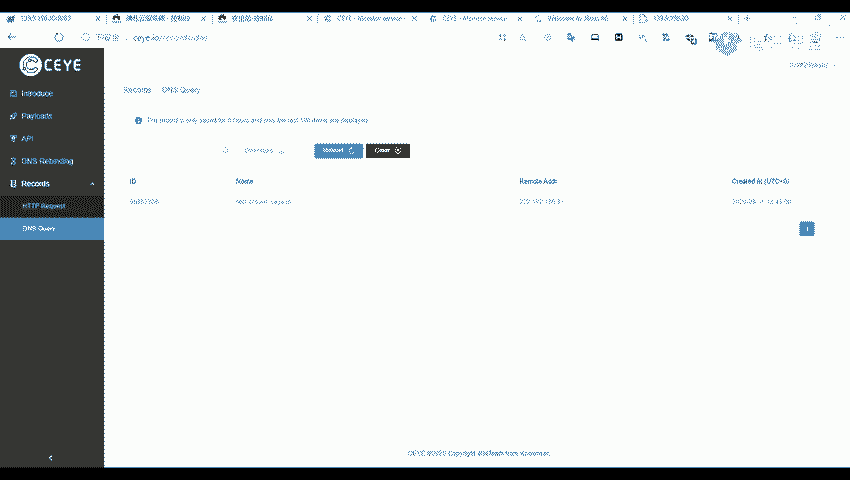

# B站最全网络安全教程，整整1300集，全程干货无废话，别再盲目自学了，看完学不会我退出网安圈！（web安全｜渗透测试｜内网渗透｜CTF） - P53：52.Fastjson的识别和漏洞发现.mp4 - 网络安全官方教程 - BV15u4y137cQ

那么我们来看一下第二部分，它的一个fast jackson的一个识别与漏洞的发现。我们来先来看一下fast的一个识别。也就是我们如何去找到使用了这个fast jackson的一个网站。

首先呢我们前面呢也讲了它的一个作用呢，这个fast jackson的一个作用呢就是用用于对jason格式的一个数据进行解析和打包。所以呢出现了这个jason格式的地方呢。

就有可能使用了这个fas fastt jackson。比如说我们这里呢是之前的一个例子。这个呢是一个之前一个真实的网站的一个一个例子。我们在抓包的时候。我们在做包的时候。

我们可以看到它这里呢有一个contact type，是一个jason格式的，就是这个ab application。这地方是一个阶son格式的。原来我们看到这个地方的话，我们大可以就是猜测。

就是他可能是利用了这个jason，就是利用了了这个fast jackson。所以呢我们发现了这个的话，我们就可以对他进行一个尝试的一个检测，检测他是否存在漏洞。并且我们呢你可以看到它的一个格式。

它这个post这个body就是上面这部分的一个内容的一个格式，也也是以一个jason格式的一个形式。那么可以来看一下，我这里呢我看一下能不能找到一些。哦。哦，比如说我们。

我比如说我们在这种这种呢看到一些接son格式。他那一些接种格式的话，我们可以。可以猜测，它可能是使用了这个fast jackson的一个。那一个那个酒店。不过呢，我们因为是一个我看我找一下这个。好。啊。

类类似于这种。就是我们类似于这种的一个格式啊。比说我们这里呢可以看在这里呢这个。你找他。很。你这这不是啊。我们需要在在这个刚间 tap这里，我们如果是看到他是使用了一是一个这样子的一个格式。

原告他可能他使用了这个AFA。K选，然后后面呢是一个接省格式。那这JSON比如说我们看照他这个con type这个字段里面是这样子的一个内容，那么我们就可以。将我们的1个P1C进行一个尝试的就是。

去打就就用这个PC去打，看他能不能进行一个解析。比如说我们这里呢有一个网网站和。13。好。哦。比如说这里这里呢我们是使用了我们的一个fas电的一个网站。我们们正常的话，我这里呢先构造一个包法。嗯。😊。

这里怎么。我看一下。

八。阿里巴巴。可以。不会是华为赢对吧。IP你办了，我先访问我用手机访问一下。哎，你们你们帮我访问一下，看案这地址能不能访问。不是，可能是刚扫描可能是刚扫描的时候那个了。我看能不能解决一下。访问不到是吧？

那我重新。几一个吧。嗯。等一下。看这里有能不能找那个。拜嗯拜拜。我这里重新洗一个嘛。啊。啊。那本一。啊，比如说我们这里我重新改一个。嗯。68083，然后抓好包。我们在这里黑离这里呢找我们的一个包。

这呢是我们的一个包啊，我们我们先叫先改为一个post的一个请求。然后呢，我们将我们的这一个compnet type改为我们的一个jason格式。我们正常的话应该是这样子的，对我们访问。

我们这个如果使用了这个buson。的一个组件的话，我们这个存 type的一个字段是这样子的一个类型，plicationson。然后我看一一个后面。田后面复制一下。有后再再再加上他。

类似类似于这种这种东西。就是一些阶层格式的一个内容。就是我们在访在访问网网站的时候，就是我们抓包的时候，我们可以如果是看到了这一个是他到的一个台 type的一个字段，是这样子的话。

那么我们就可以利用我们我们的1个POC去进行打，就是去打一下他有没有存在这个漏洞。那呢我们这里呢就是利用了利用到了我们的1个DNS log。就是江。就是将他的一个请求。

就是可以说去发送到我们的1个DNSlo上面。这去请求了这个DNSlo。我们直接将我们的1个POC。要复制复制到这里。原呢。看一下我们在我们的1个DNS log的上面。据去查看他是否能接收到他的一个请求。

哦，对，这是接诊核是。因为我那里我们我是说我们的一个正常我们访问的一个网，就是抓到的包。如果是是这样子的话。如果是这样子的话，他这个传台t的一个一个字段是这样子的话，那么我们就可以去试一下。我我们刚刚。

我们刚刚。这这里它的一个数据虽然是一个jason的一个格式，但是它的一个。他的那个con type并不是。就将他的一个请求就解解析到我们的1个DNSlock上面。这个呢是我的一个。

别人的1个DNF的一个平台。DN看一下。EBW7。哦，这个呢是我的一个编呃，先将我的一个先将我的一个数据给删除掉。如果如果就是你看照你。呃，这个是别人别人的一个，我看一下是是什么牌的。

反正也是1个DNF的1个lockck的一个网站，就是可以将我们的一个请求发送到这种的一个网站。这是一个哪里的，我忘了，待会待会看一下吧。然呢我们可以看到我们这里呢是现在是没有任何的一个数据的。啊。

不也不是说不能这么利用，就是得看他是不是使用了那个fa jackson。就是使用了那一个的主件。如果说你也你也可以就是将我们刚刚刚刚那里的，就是先那里，比如说他这里可能是一个XML，对吧？

你可以你可以你也可以修改一下，是不是修改一下，看这样子行不行。不过呢我们一般的话都是检测他的一个旁台t的一个字段。检测他这个字段是否为这样子的一个格式。给我们在给我们的1个POC去打。

这个呢就是我们检测的1个POC。如果说我们。在对于我们的一个。标C之后，在我们的1个DNS的一个平台，上面接收到了这一个数据，那么我们就可以尝试进行一个利用。这个这个漏洞呢也是可以getc的。

也就是可以返弹的一个他的一个cel回来。好呀我们。发送一下。哎，别别要买意了吧。8083。好啊。哎哦，好像他的1个IP可能是。被华为云磊办了吧。我问都访问不到了。好，不行的话，那么我们就。就先到这里吧。

我们下节下节课我们在点它的一个利用方法，就是我们这里呢是他的一个就是发现以及它的一个检测的一个方法就是。就是他的一个格子。它的一它的一个post，它的一个格式是一个descent的。

还有它的一个comp type是一个 application，也要是一个decent的。如果说他只就。他这个con间time是出现这个地方就出现了这这样子的。

所以呢他就有可能是使用了这个fas get的这个主件。然后呢我们就如果使用了了的话，我们就可以将我们的1个POC给。给用来打一下，就是如果在我们的1个DNS平台接收到了这个数据。

我们可以看到这里我们的一个内容，这个t点SR3后面这个name这里呢也是这样子给我们返回的，就是接收到了一个数据。那么我们就可以。对他进行一个进一步的利用，也就是一个get sell。原到这里呢。

因为我我们的个网站也打不开了。我们那个后面的话，我们下一节课下一节课再给大家讲。怎么这么回忆？哦，我们这里呢看一下有没有一个请求。那在我们这里呢也可以看到，我们这里是接收到了这个DNS的一个解析请求。

这个呢就是他的一个检测的方法。然要利用方法的话，我们下一节课再讲啊，我们就这节课呢就先到这里。

