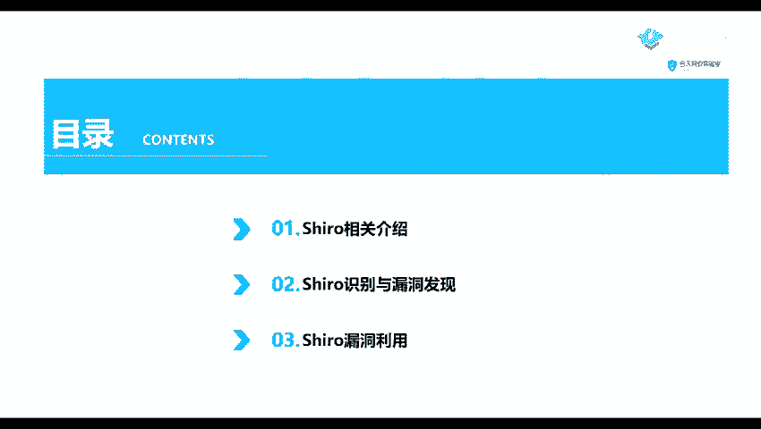
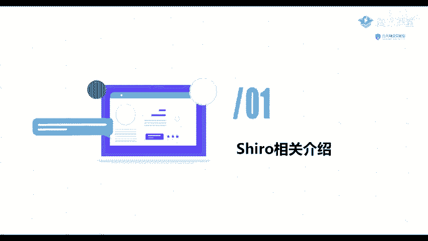
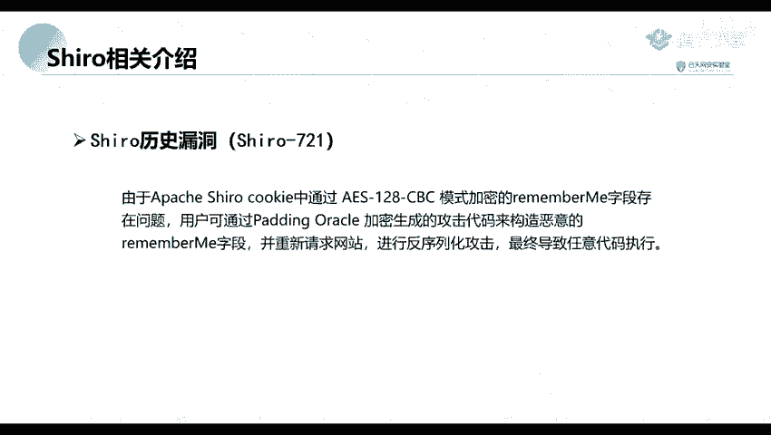

# B站最全网络安全教程，整整1300集，全程干货无废话，别再盲目自学了，看完学不会我退出网安圈！（web安全｜渗透测试｜内网渗透｜CTF） - P54：53.Shiro相关介绍.mp4 - 网络安全官方教程 - BV15u4y137cQ

这节课呢给大家讲的对，我们就是应该说都是今年还有去年吧，就是。这一个比还算是比较热门的一个洞jara就它的一个系列的一个洞。首先呢我们。有一个课程内容呢分为三个部分。第一部分呢，我们点一下C。

就是什么是这个CL。第二个呢就是它的一个识别，就是我们怎么去发现我们哪一些服务器，或者或者说是哪一些网站使用了这个组件呢？第一个还有一个第一个呢，就是他的一个漏洞的发现。

就是怎么去发现他使用了这个组件的网站是否存在漏洞。第三部分呢就是他的一个漏洞的的利用。因为我们单单是发现他存在漏洞利用，就是发现他存在漏洞还不够，我们还得对他进行增一步的利用。

下面呢我们来看一下第一部分C老的一个相关的介绍。

首先呢嗯。它是一个强大的，而且应用的一个java位java的一个安全框架。他提供了验证、授权加密和绘话管理等的一些功能。他是他的这一个框架呢是比较直观的，而且应用。同时呢也能提供一些见证的安全性。

那么这个框架。3、历史上发生过哪一些漏洞呢？首先首先我们来看一下第一个漏洞，就是C550。嗯，我们就是一般的话就是叫他这个漏洞名呢，就叫一个c550。我们这个是app帕奇衰这一个框架。

它提供了记住密码的一个功能，也就这个remember me，也就也就是我们平常登录网站的时候，就是有一些网站，它有一个就是选项，就是可以提供我们去记住那那一个密码的。

那么那一种网站呢就可能使用了这个框架。然后用户用户登录成功后就会生成经过加密，并且编码的一串cookie。也就是我们的一一个身份验证的一个就是。你串字不串吧。然后在服务端。

然要对这个remember me的一个cook的一个值先进行一个被64的解码，然后使用1个AAS的解密再进行反对类化，就导致了我们这个反对类化的1个ICE的漏洞。也就是我们这个1个550。

第二个部分呢就是摘了721。他这一个漏洞也是。这个漏洞呢是去年19年出现的一个漏洞。那呢是由于阿及衰 cookie中。

也就是我们前面所说的一个cook通它通过1个AES128CP的一个模式加密的一个remember me的字段存在问题。然后我们用户呢就是或者说一个恶意攻击者。

就可以通过这个ending加密生成了一个攻击代码来造恶意的remember me字段，并重新请求网站。然呢就会导致了我们的一个争义代码的执行。

