# B站最全网络安全教程，整整1300集，全程干货无废话，别再盲目自学了，看完学不会我退出网安圈！（web安全｜渗透测试｜内网渗透｜CTF） - P56：55.Shiro漏洞利用.mp4 - 网络安全官方教程 - BV15u4y137cQ

哦，然后呢我们前面就是我们讲到他的一个漏洞漏洞发现以及它的一个漏洞验证。

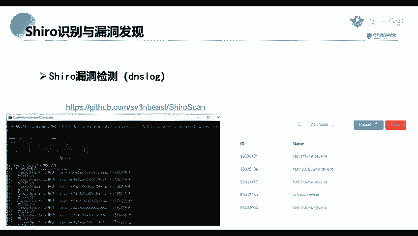

那么下一步呢，我们就需要对他进行一步一个闹洞利用。合同利用呢这个呢是也并不是很复杂吧。他这个漏洞呢也是可以就是获取一个cel的，也就是通过一个反弹调的一个一个方法。原来我们可以获取到他的一个cel。嗯。

这里部分是我们的一个人工的一个方法，就是一个手工的方法。那么我们有没有更简便的一个方法呢？是有的，我们也可以就是去找一个下载一个工具。我这里呢我待会给大家发出来啊。我这里呢也有一个是一个比较简单的。

它的也也是一个serv，就是用来帮助我们检测这个框架是否存在漏洞以及利用的一个。一个就是工具吧。刚他双击双击打开之后，我们可以看我们在碟卡上面呢也可以倒一下，找一下。然后有一个这名字啊。飞红。系啊好。

嗯好。Let see in。那我们找一下是哪一个。嗯应该总是这。嗯。哎，我待会我我给你们。发在是吧。找不到是哪一个了。不是这一个。好，待会我给你们发下去吧。那那我们这这个这个工具呢。

它可以帮助我们验证两两个漏洞，一个是CL721的，一个是CL550的。因为这里呢我们是验证它的一个C550的一个漏洞。那那我们这里呢是使用比较简单的。

将我们的一个地址UIUIL复制到我们这个目标地址之后，然后点击下一步，下一步呢它就会帮助我们进行一个测试。呃，也不是也不是回选结果。就是我们那一个漏洞并没有回旋的，并没有一个回旋的漏洞。

所以呢我们可以执行一个聘的命令，去让去让大家去聘我们的这这1个DNSSDNSlog的一个平台。如果说我们这1个DNSlog的一个平台。如果就是收到了这个DNS的一个请求。

那么就说明那个网站就是很可能存在那一个漏洞的。我们来。嗯。那我们来看一下我们执行的一个结果。你是哪一个来着？啊，然后呢我们点击下一步之后，他就是让我们就是选择使用哪一些进行一个验证。

我这里呢就使用1个CEYE点IO进行一个验证。我这里呢配置了1个CY，我们这里有一个配置的文件，就是这个这里。仓这里这个文件，然后上面这个。Proports。这一个文件就是第一个文件，那里面呢有嗯嗯。

就是记记录了我们的1个DNSlog平台的一个token。我这里给大家看一下。啊。也是。那呢。😊，这里呢这个这第二行这个CYE没有，这个呢就是我们的一个域名，就是我们这一个地址。

这个CYE这个平台的这个域名。这一串。另Y1点IO前面这个L1的文件我们的这一个专属自己的一个子域名复制到我们的。

这里那么后面这个token token呢就是我们上面这个这个APBIAAPI token这一个部分就这我们这一部分的一个内容就是。将他这个凭证复制道就是替换成我们这个CYE这里。之后呢。

我们我们选择这个使用CY1点IO进行一个漏洞验证，那么它就会。像上一个工具那样子，就是对我们的这个域名进行一个。访问。我们我们可以看到他这里呢，现在是没有任何的一个记录的。看到我们。使用之后点击下一步。

下一步之后呢，他就会进行一个尝试这的一个验证。然后我们现在这里呢，他他是在执行他的一个拍的。们这里呢需要等一下。那我们刷新刷新一下。没。这个呢也是稍微慢一点的，并没有像我们之前那样，我们可以看到。

这里呢也也收到了一一条请求了，1个DNS的一个请求。就收到他的一条记录。那么这也说明我们这个网站就是这个139。9。198。30，这个8085这个网站呢也是很可能会存在这个漏洞的。然后我们等到跑完。

等到跑完呢，我们呢还有一个后面的一个利用方法，就是我们这里呢也有EC些大的一个记录。们这里等到好吧，这个呢因为他要跑跑完的，所以呢时间的话需要等一两分钟吧。哦，这里呃这里还没有。如果说他跑完的话。

那他这里呢就会并不会显示灰色的了。等么显示这个字体出来之后，就说明他保案了。啊，这里呢他他已经跑完了，他这里呢有一个有一个简便操作。有一个简便的操作，我们点上打勾，打勾呢呢它这里呢有一个获取web跳。

也有一些其他的一个选项，就是就是一个反弹跳，一个是linux平台的，还有一个是windows平台的。我们怎么去反弹呢？首先呢我们点选择我们这个。哦，待会我给大家说一下。

或者是我们就是周末周末找个时间说一下也行。因为那个利用的话是比较比较长的比较多的一个内容的。就是这这周末或者是我看一下呃，对，这周末吧。现在我们可以看到它这里有一个反弹效的一个选项。

那那我们这里呢就是我们可以看到他给出的一个方法，就是1个IP加上一个端口。IP就是我们要接收它的1个需要的1个IP端口呢就是我们坚定的一个端口。比如说我这里有一个我这里那就使用我的一个服务器吧。

我我用另一台吧。

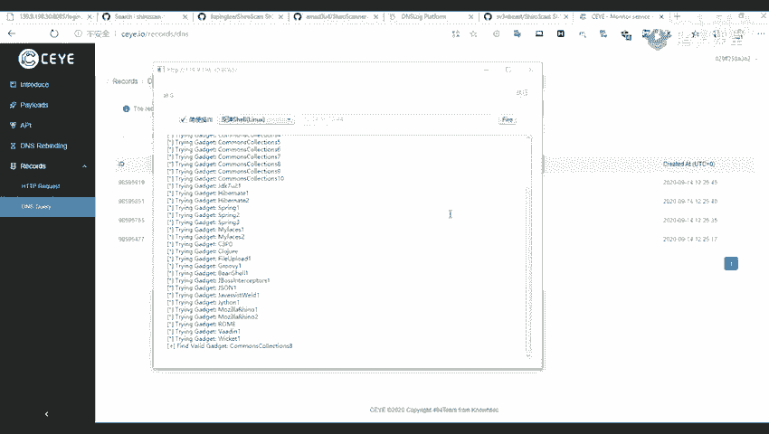

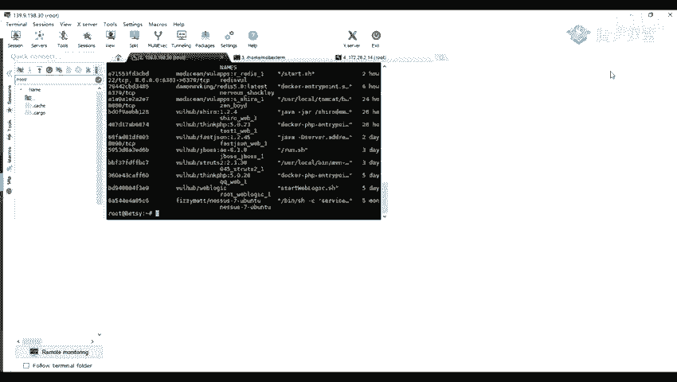

等一下。哦，我就找这一台120。27。61。239的这台机器。现到我们坚定一个端口NC然后杠LEP。哎，这里怎么掉了？没关系，这LLVP然后后面呢加上我们的一个端口。比如说你随意什么端口都行啊。

1234这里呢这个板弹需呢也是需要我们有一个公网的1个IP的。如果说待会就是待会的话，我可以就是把我的一个服务器给你们。😊，给你们做一下。就是如果是没有那个服服服务器的一个同学。那我们建定一个端口。

我这里呢就建定1个1234的端口。

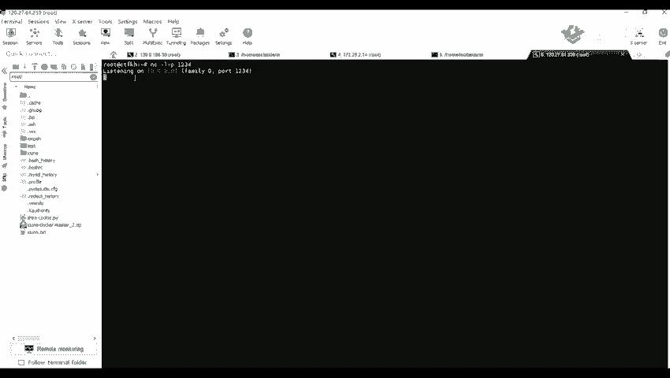

鉴定完之后，我们在这里呢输入我们的1个IP加上他载一个鉴定的端口120。27。点61点。239，然后加上我们的一个端口，端口是1234。那那我们点击一下执行。

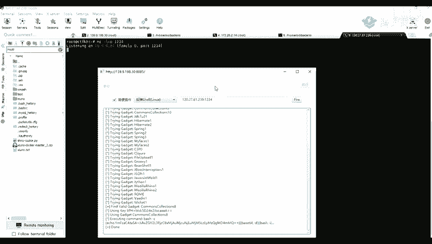

点击完之后，我们在坚定的端考这里，我们可以看到他这里呢已经接收到他的一个反弹这了。

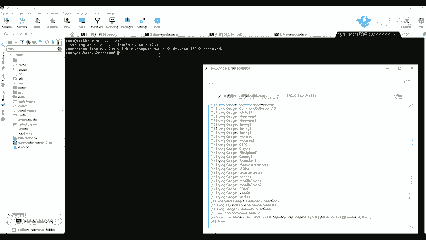

所以呢我们这里呢就是对他的一个利用。这这台呢就是我们搭的一个搭建了这个。呃，买买什么呀？对工呃那个。那个如果是那个有我们那个阿里云或者是华为云的话，有那个学生记的。就是学生机，你你只要不满24岁的话。

都可以用就是。99块99块1年吧。原天是119。哦。就是你只要没没满24岁都可以的。不是学生也行。那我们可以看到在这里已经反弹回了一个这了，我们呢就可以对我们的一个服务器进行一个操作了。任意的一个操作。

啊，这里呢就是他的一个。就是一个它的一个简简便的一个利用吧。那么我们还有就是我们还有一个就是稍微复杂一点的一个利用。我们这里呢也给大家讲一下。嗯。😊，首先呢我们。从这个第一页PPT来讲。

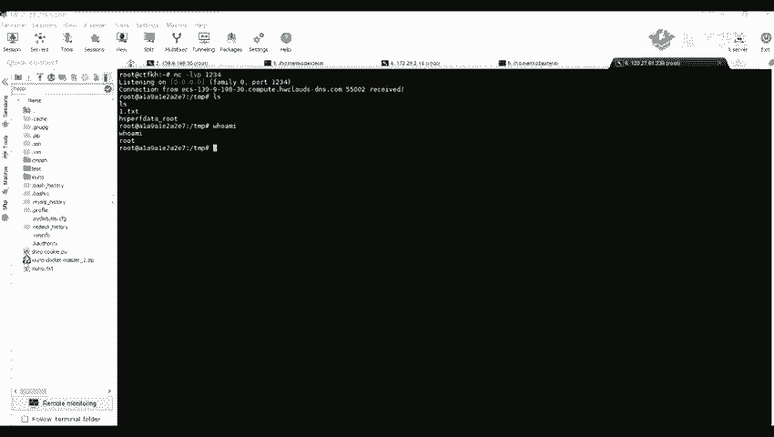

首先呢我们也是去NC去去去监听一个端口。那在我们将我们的一个反弹票的一个语句。这个反弹票的语句呢，我们前面的课呢也给大家简单的讲过。那那我们将我们这个反弹需要的语句进行一个编码。那么为什么要编码呢？

因为我们的一个这个管道符，一个管道符或者是一个输出输入的一个重定向。只有在一个败水的一个环境下才能使用。

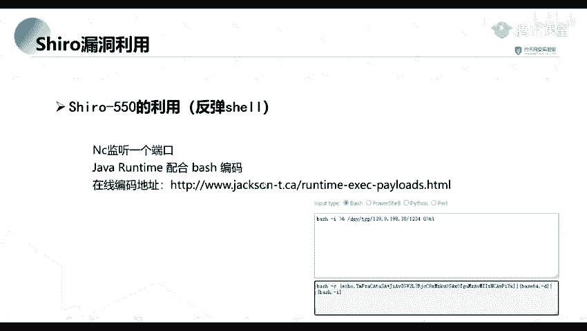

也就是说只能在我们这个，比如说我们这些。终端。就是在我们这这里面才能进行一个使用。那边。管道管道服或者是一个输入输出的一个重定项，只只能在这种环境下使用。

但是呢我们在这里呢就是使用的是一个javajava为我们提供的一个命令执行的一个环境。而这这个提供的这一个环境呢，并不支持这个管道符，还有它的一个输入输出的一个重进这量等等。

因此呢我们这里呢就需要进行一个被60次的一个编码。我们我们呢有一个在线的一个编码的地址。我们将我们的一个反南效的一个语句。

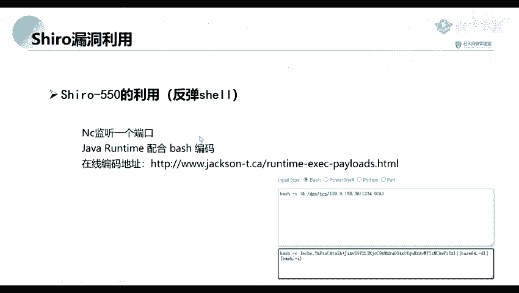

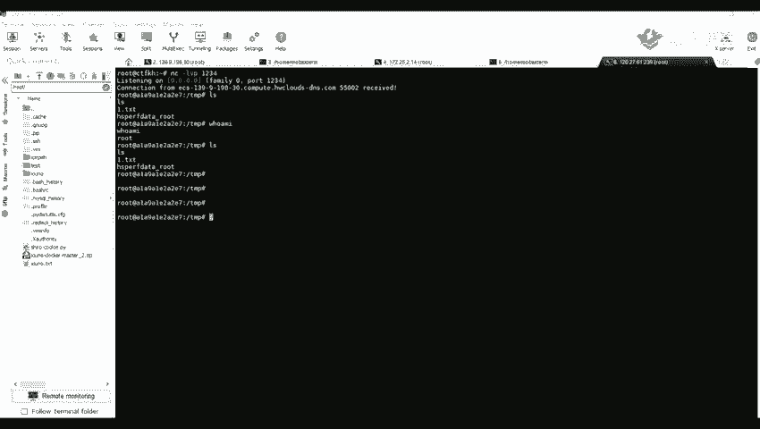

Okay。Yeah。在我们的一个编码地址这里。然后呢，我找一份这个。那到这里呢就输入我们的这一个反南效的一个语句。你等一下啊。B11杠I。

加加上1个DV你看TCP后面呢就跟上我们的1个IP就是我们接收他的1个的1个IP。

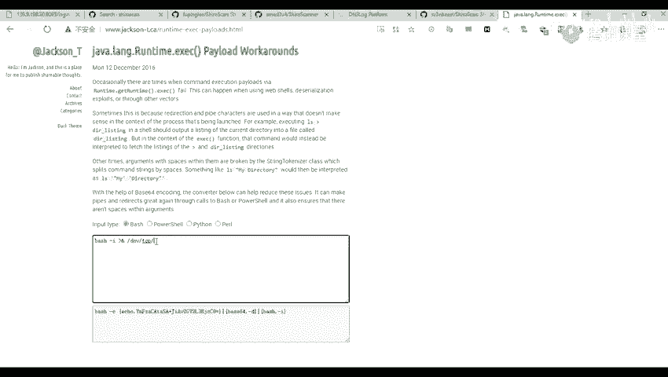

比如说我们这里呢是一个。1，我们那个台服务器是多少来着？1202761239。

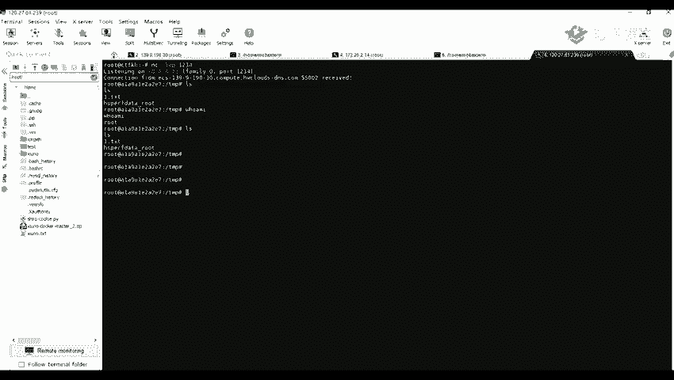

120。27。61。239，要加上它的一个端口，这里呢使用1个2234吧。然后我们我们后面加还有一个内容。后面是一个0。这个呢就是我们常规的一个反弹效的一个语句，一个命令吧。那在我们将我们的这个ge。

就是将它编码后的这一个内容去。复制复制到我们的这个。在va程序里面。那么我们。就使用我们的1个YSYSO这个工具。这个YYSO的这个工具呢，它是集合了各种的一个java版具类块的一个piro。

我们呢就使用这个工具进行执行。那么这个呢我们在网上去搜也可以，待会也可以给大家发下去。就是我们这个它它是这样子的一个工具。那呢它里面是集成了许多的一个版系内化的一个piload。

就是java版系内化的一个piload。

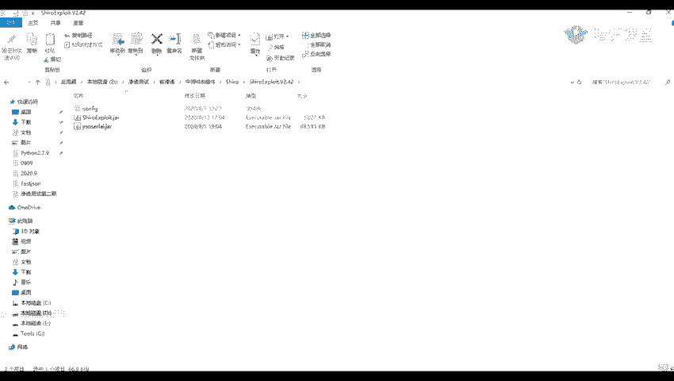

让那我们在我们的一个机器上找一下。我们这里呢先将这个刚刚接收到的一个反单调给退出啊。让它进入到我们的一个工具那里。Oh。啊，这个这个不在这台机器，在我的一个服务器上面，我就用我的一个服务器来吧。

Yeah。那也不是这个，看一下。Okay。哦，在这个在这个里面，而这里呢有一个YYSO这个点赞的一个包。看到我们只瑞行我们的一个命令。再一个的一个语法呢是这样子的，就是我们。这一个。

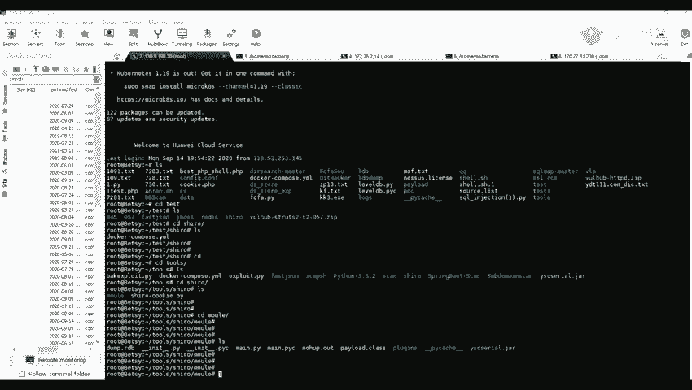

这个嗯这个漏洞。那他后前面呢就是它的一个java上copy，然后后面呢就是我们的一个工具工具的的一个名称。那呢我们这里后面。后面就是我们起一个服务。

或者说就是起1个1099端口的1个CIMP它的一个监听模块。这个这这个呢是它的一个监定模块。后面这个1099呢是他的一个端考。然后后最后面这个这一个这这一部分就是它的一个拍涝。

这个可以理解为它的一个拍涝。第二这部分呢就是他的右执行的一个命令，也就是我们将我们前面进行一个编码编码的一个命令，编码号的一个反南效的一个命令给复制过去。

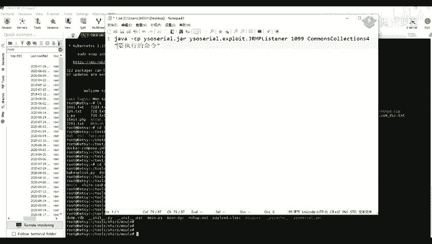

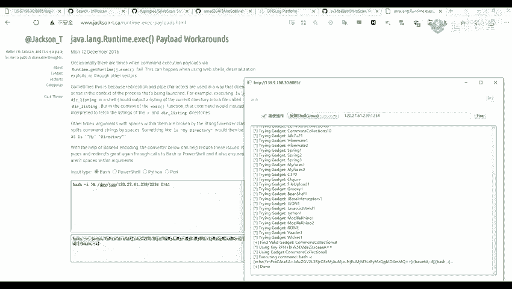

可的，是这一个。

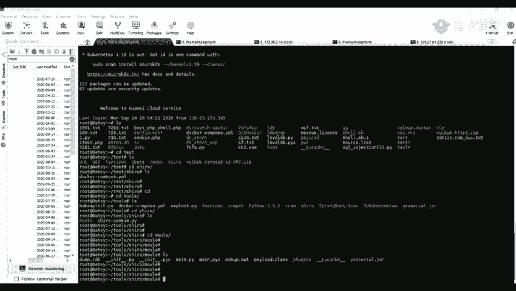

是这样子的一个，然后呢我们。

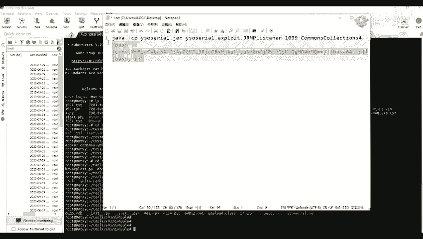

复制到我们那个YYSOYSO那个工具上面。要点击回车，回车之后，他会取取1个1099的1个端口。1个1099的担保之号。我们这里连接一个。现呢我们就随就去生成它的一个cookie。

也就是我们那个里 me的一个字段的一个字符串。那在我们这里呢有一个slow让 cookieook的一个PY。然后我们看一下它的一个内容。他这个内容呢是比较简单的，也跟我们前面呢是差不多的。同。Oh。

Oh。好，我们看完这个脚本的一个内容，那么我们就去执行一下。我们在这里呢使用的是一个。可以使用一个python2的一个。拍他的一个拍场环境比较衰老，放cookie。

然后后面呢这后面呢就是我们的这一个地址，这个139。9。198。30。这里呢就是这个139。9。198。30，是我们起的这一个服务的一个。

地址啊并不是我们并不是我们这一个跟我们这个是不一样的这两者是有一个区别的。

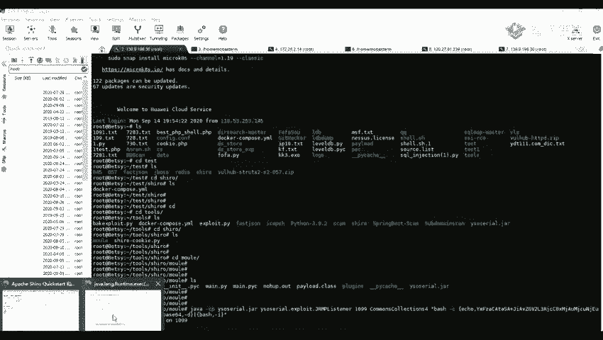

如果说你你取的这个服务是在其他的一个地址，那么我们这个呢也后面这一个呢也是跟我们其他的一个地址啊，这里要注要注意139。9。198。30。然呢我们这里呢是去连接这个139099。198。30。

然后后面的他的1个1099的1个端口。他加上他的一个。1099。1099之后呢，它就会生成它的一个OK，就生成这个 me的一个字段的一个OK。这固体的一个内容呢，实际上就是我们要执行的这个。

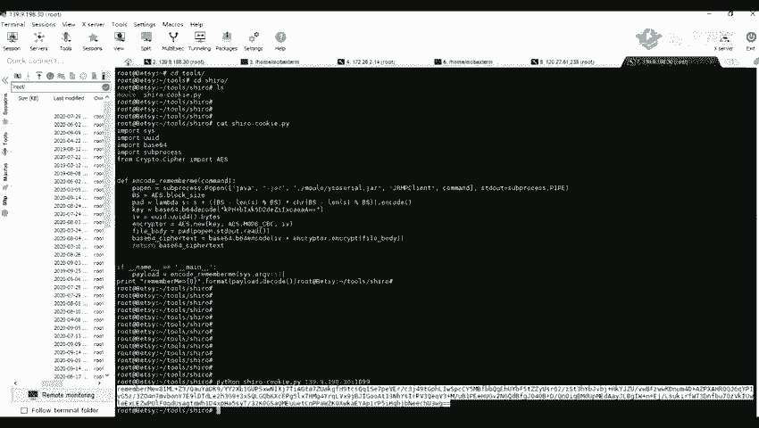

实际上可以理解为就是这一部分的一个内容。就是反南校的一个命令。

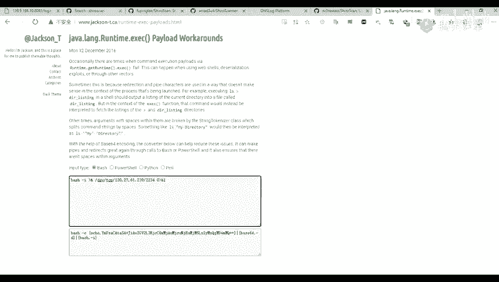

看到将我们这个c的一个字段给全部复制。

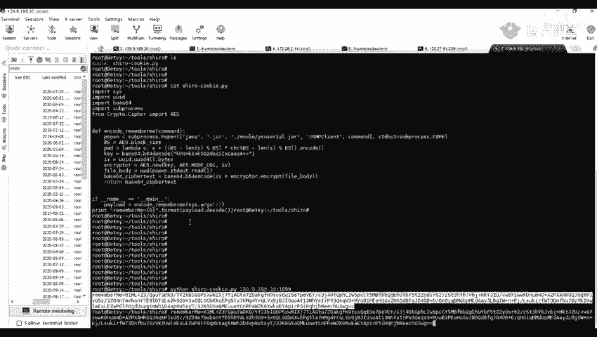

复制之后呢，我们。在我们的这个这里就是在我们抓到的这个包这里啊，就是我们前面。前面这一个包这里，就是我们登录的时候，勾选这个里面 me，这里抓到的这个包这里。那我们将它进行一个替换。另外了之后。

因为它是一个反弹效的一个命令。所以呢我们这里呢需要去接定一它的一个端口NC杠LVP然后我们是一个多多少来着。

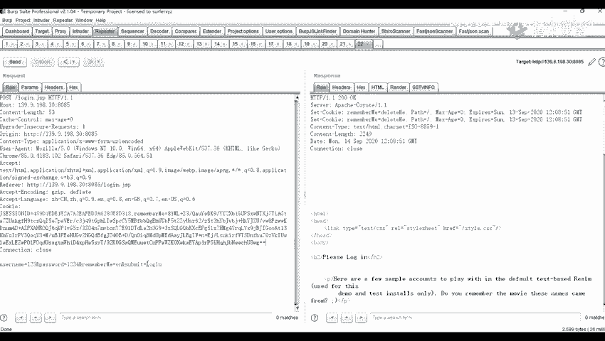

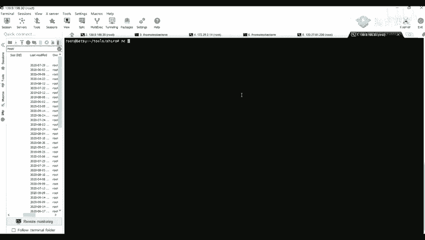

是1个234的一个端口。

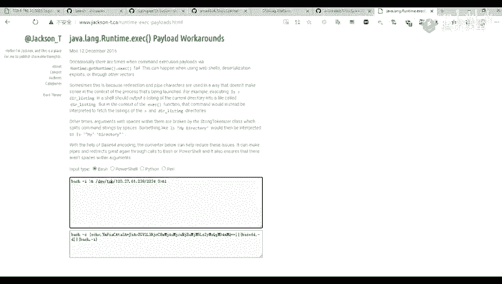

到。哦，我是我们是在这台机器上面的一个。NC1杠LVP2234。然后呢我们提测之后，他就会在本地去监听他的1个2234的端考。

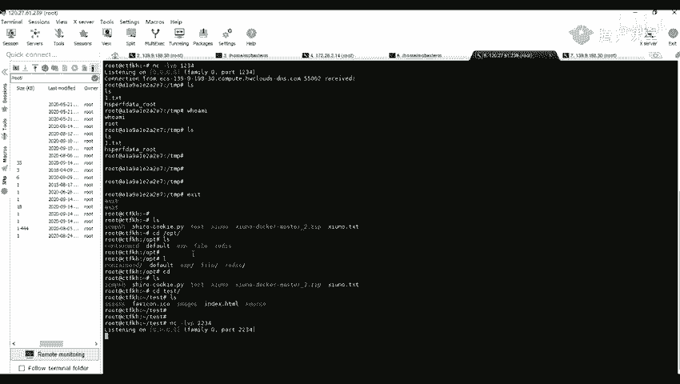

确定了之后，我们在这里呢就将我们的这这一部分的一个coook的一个字段给复制过来之后，我们发送一下发送一下呢，这里呢我看一下行。

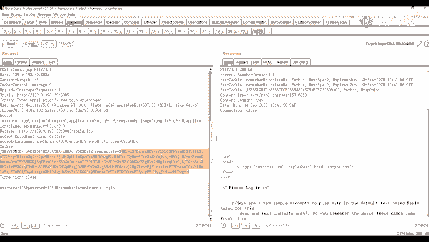

不点啊。Remembermber me。

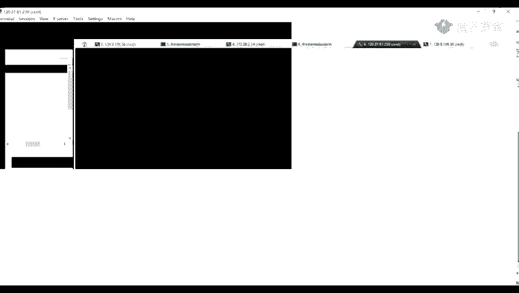

连，这里已经进行连接，我看一下。10998杠7。我再我再这里再重新试一下。首先呢我们将我们的一个端好。能重新试一下。

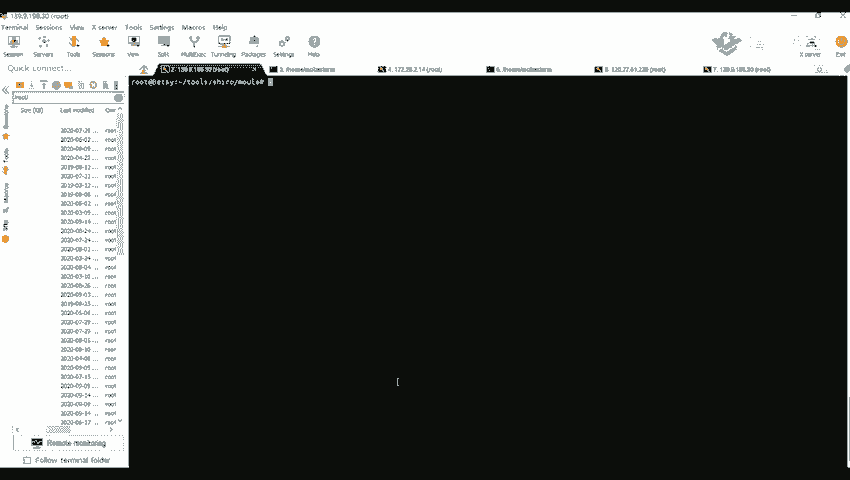

我这里呢返回返还到我们我我的机器上面吧。啊那我们的139。9。198。30。要在我的机器上面是1个1234，我们得得仔细去检查它是有没有错误。就是我们在利用不成功的时候。哎 on I。

到DEVDCP139090198030。啊，这里呢是没有问题的。

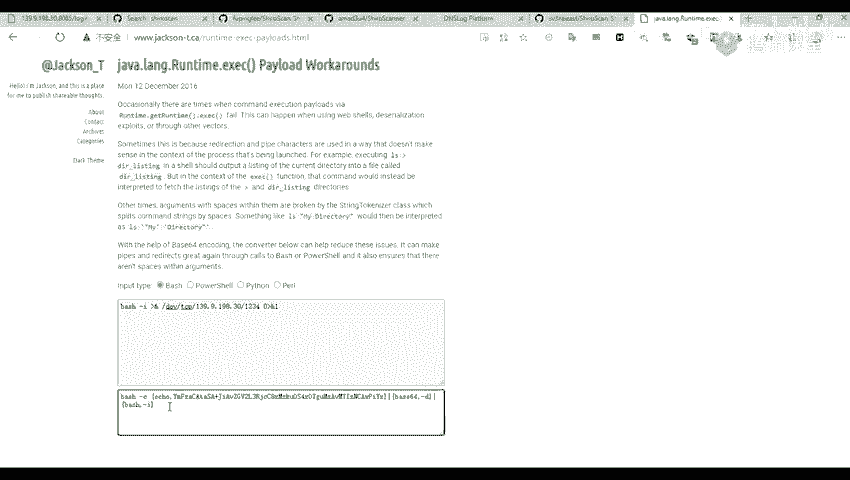

要间辑固置。Now。我们重新去执行一下。嗯。大湾空。好，我们重新执行一下，看一下。现那我们再重新去生成它的一个裤腿。看到了coK之后。我们将它全部进行一个复制。

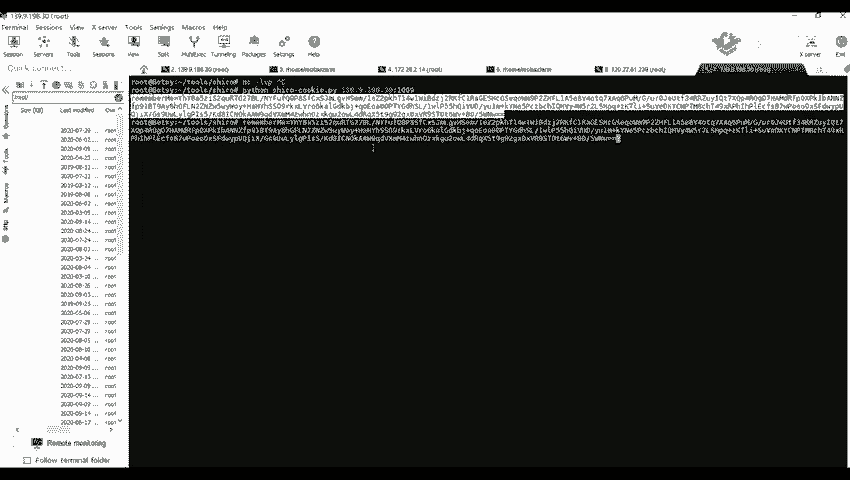

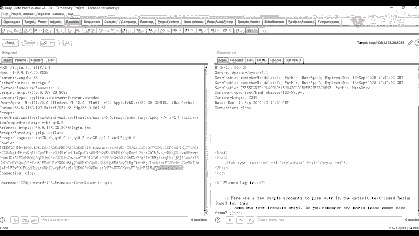

member me这个字段，然后呢我们去监听它的一个端口ND上LVD。2234。

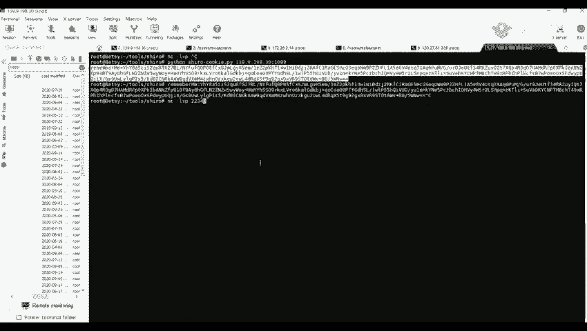

先听到的一个端号，178送一下看看。

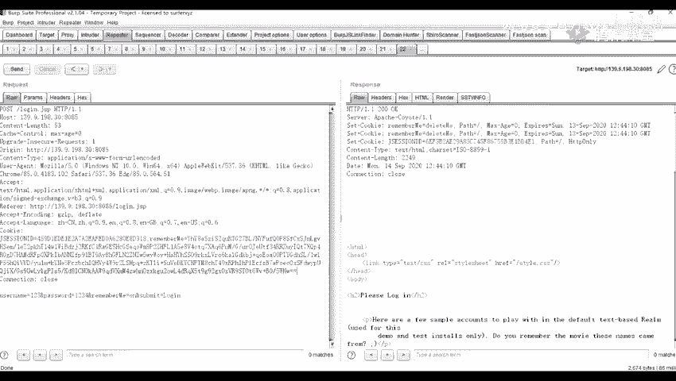

哎，这里还没有还是没有啊。系咯。一接了坏了。今你。我我检查一下，如果不行的话，那那我们就先跳火。

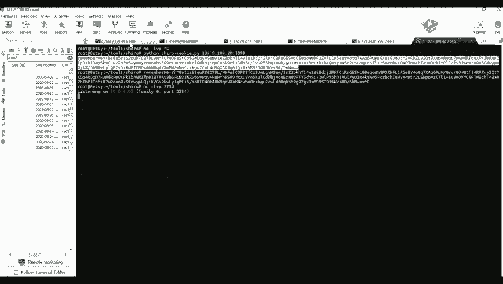

Okay。我们将我们的这个字段去复制到我前面前面成功的那一个，我看一下。呃，我我我不知道我前面的一个网址，我看一下。这样。

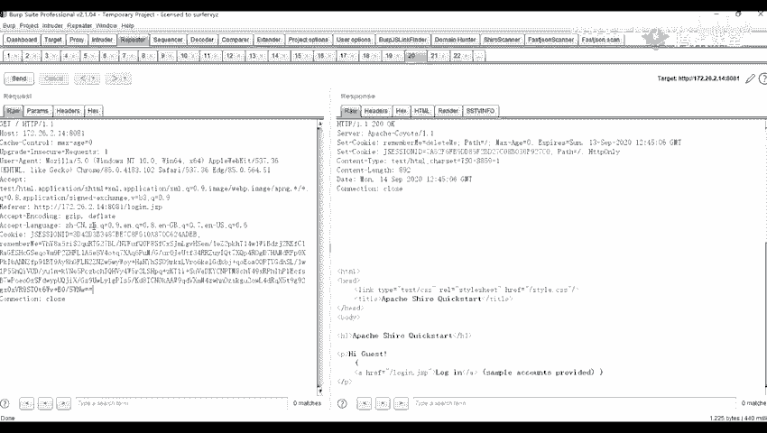

这个还是没有2234。好，那这里呢我们就先跳过啊。我们我们就先休息先休息一下，待会我们。下一节课再继续点啊。

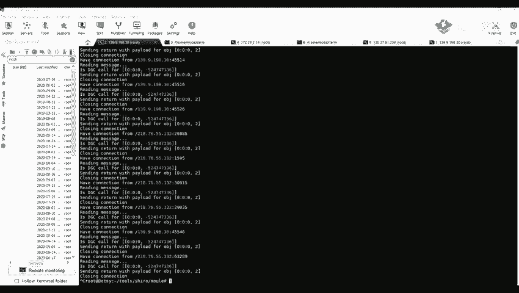

好，那个这个几号本的话是。是是永来就是去验证验证漏洞的他这个命令呢应该是不行的。哦我我把那个工具给发发下去吧。不行的话，我刚刚出问题的话，应该是我哪里命令出错了，我检查一下。Yeah。

那个货员卖的话应该可以，但是那个的话反南笑的我不知道。Oh。Yeah。Okay。

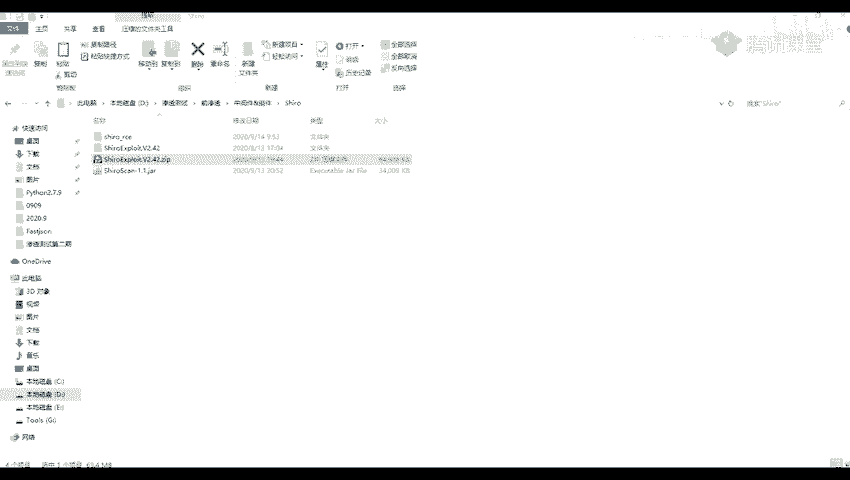

Oh。