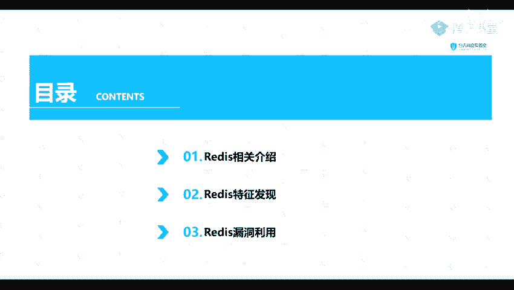
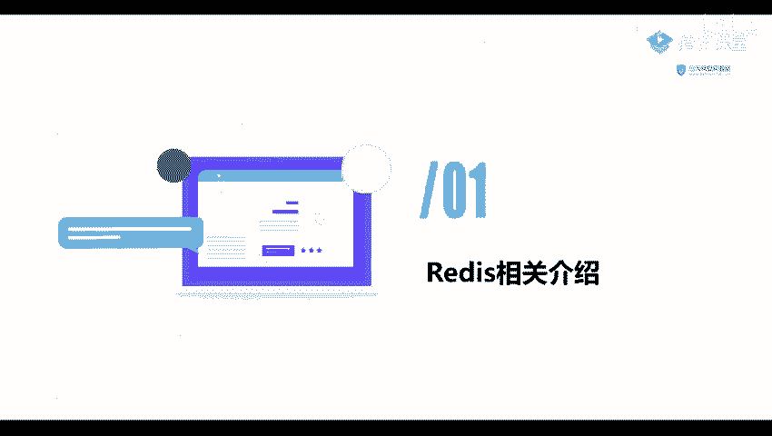
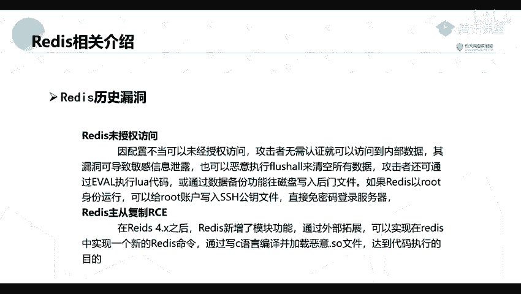

# B站最全网络安全教程，整整1300集，全程干货无废话，别再盲目自学了，看完学不会我退出网安圈！（web安全｜渗透测试｜内网渗透｜CTF） - P57：56.Redis相关介绍.mp4 - 网络安全官方教程 - BV15u4y137cQ

然后这节课呢，我们讲一下这个readdit的一个漏洞。这个re这个lo洞呢，我们在内网中内网中啊是比较常看到的。并且他这个。ready我们也在我们的一个一些大的一些公司，或者说说是大的一些企业。

也是经常用到的这一个。我们先来看一下我们这分为三个部分的一个内容。首先呢就是他的一个相关的介绍。第二个呢就是他的一个特征的发现。第三就是他的一个漏洞利用。

第一第一点，我们先来讲讲一下他的一个相关的介绍。

它是一个完全开源遵守BDF的一个协议。它是一个高性能的一个K value的一个数据库。我们前面这这里呢不用理了，我们就理解可以将它理解为是一个数据库，就是一个pay value的一个数据库就可以了。

那么大家可以应用在哪一些场景呢？就是在在一个javava中，它的主要有两个场景，就是一个存储缓存用的一个数据。第二个呢就是需要高速读写的一个场合，使用它快速的进行读写。什么是高？勾毒写的场合呢。

在我们如今的一个互联网中，越来越多的一个存在高并发的情况。比如说我们在天猫双十一的时候啊，或者是一个抢红包，或者是某一个明星，就是开演唱会所售卖的一个门票等等。

这些场合呢都是在某一瞬间就是或者是某一个短暂的时刻，就是或者就是一个时间段嘛，就是有成千上万的一个请求到达服务器。如果说单纯的使用我们的一个数据库来进行处理的话，就算这个不崩掉呢，也会很慢的。

所以呢他就会对我们的一个用户的体验，就是造成极下的一个体验。那么什么是缓存呢？在我们的日常对数据库的一个访问中，读操作的一个次数是比我们的一个企操作是更多的。因为我们更多的都是一个进行一个查询。

比例呢大概是到1比1比9或者是3比93比7之间，就是1比9到3比7之间。所以呢他需要读的一个可能性是比写的可能性是大的很多的。如果说我们在场使用。

平常的一个搜cle语句就是对他的一个数据库进行一个读写操作时，数据库呢就会把他的一个。就就会去磁盘，把对应的一个数据进行一个索引，这是一个相对慢的一个过程啊。现在我们这个一个leadice呢就很好的。

解决了他的这一个过程。我们这里呢就简单的讲一下。现么我们来看一下他历史上是出现过哪一些漏洞的。

当然主要有两方面的一个漏洞。第一个呢是一个未授权的一个访问。第二个呢就是他的一个主从复制的1个IE。其实这两个呢都是这一个组成复制的1个ICE呢，也是由于未授权访问造成的。我们先来看一下这个未授权访问。

但是由于因为我们的一个配置不当。导致可以未经授权进行访问。龚记德呢就可以。可以就是在不用认证的一个情况下，就可以访问到他的一个内部的一个数据。它这个漏洞呢可以造成它的一个敏感信息的泄露。

也可以执行一个葫芦萨来清空所有的一个数据库。这个葫芦萨呢就是清空数据库的一个。意思啊。他还可以通过数据备份的一个功能往磁盘写入他的一个后门文件。

如果说他这个readit是以是以一个root身份进行运行的，那么我们也可以给这个root账户写入一个公钥。给入他的一个公要文件，直接进行一个免密码登录服务器。嗯。

这个主从复制ICE呢是在他的这个readis4年。4点几之后，在这个ledduce呢，它形增了一个模块的功能，通过外部的一个扩展，就可以实现在readduce中实现一个新的leaduce命令。

可以通过写一个C语言编译，并加载恶意的一个点SO的文件，去达到代码执行的一个目的。简单来讲，就是我们这个组宗复制ICE呢，就是他去。去加载外部的1个SO文件，去达去达到他的一个代码执行的一个目的。

