# B站最全网络安全教程，整整1300集，全程干货无废话，别再盲目自学了，看完学不会我退出网安圈！（web安全｜渗透测试｜内网渗透｜CTF） - P59：58.Redis漏洞利用.mp4 - 网络安全官方教程 - BV15u4y137cQ

我们前面也讲了连接它的这个readdy，因为它并不是一个we web服务，所以呢我们需要使用它的一个客户端进行一个连接。这里呢这个呢就是下载它的一个客户端的一个连接程序。我这里呢就不给大家做一个演示了。

我这里已经下载了。

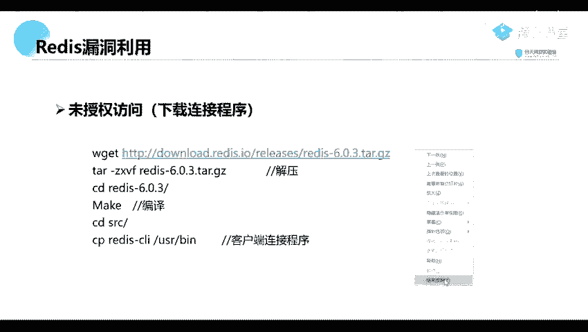

就说我这里这里。先退是吧。然后看一下。我找一下我的一个程序啊。我这里呢有一个laddy的一个程序。然后呢，我进入到那里面。但在我们。就是下载解压，以后进行一个编译之后，它是这样子子的一个文件。

现在我们进入到它的1个SIC的一个目录，我们的一个客户端连接程序就是在这个SIC的一个目录上面，那CDSIRC。之号。あ回た。要后么我们查看查看一下，在这里呢有一个laic杠CI的这个连接。

就是客户端的一个连接程序。我们如果说。就是进行一个连接。如果我能我们能成功连接上，就是一个未授权的一个访问。就是之后我们就可以进行对他进行一个漏洞的利用。刚杠石分类呢就是使用一些它特定的一些脚本。

就是它里面它不是内置了许多的一个脚本嘛。比如说它里面也有一些检测漏洞的一些脚本，就是这个意思啊，就是指指定一些脚本进行扫描。这里呢进行一个连接啊，我们这里进行一个ready杠CI。

然后后面就是跟上我们一个杠H杠H呢就是我们的一个。leddy服务器的一个地址，我这里呢是1个139。9。198。30。然后后面加上一个杠P。上批就是我们的一个端口，端口呢是默认在1个6379端口上面。

我们进行一个连接。连接之后，我们这里呢可以看到它可以连接成功了，它并没有进行任何的一个报错。我们执行一下inport之看一下。连这里没连上。之前有一个我看一下。那么总是会出现这一块。我。我看一下。

在这里呢，应该是之前有一个连接吧。或者是我们这个没启动，我看一下我这里启动了没有。

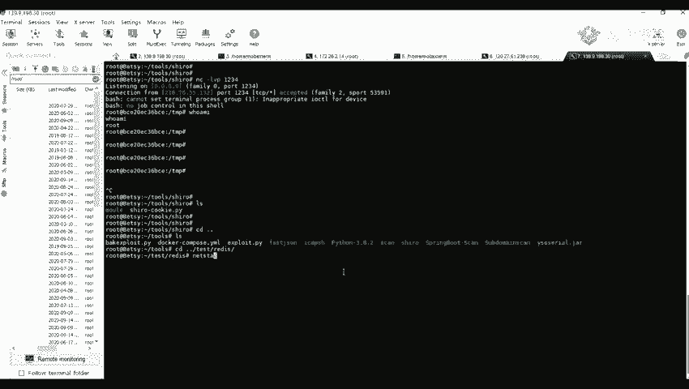

6379，我这里呢是启动了。启动启动了之后，我看一下。嗯，好。好像没有。并没有其他的一个连接。六单。我再重新连接一下看看。139090198030。对，这个。不成功啊。哦。

我用我的一个我用我自己的一个机器连一下看看。

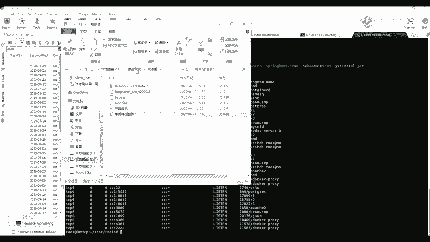

我找我找一下。やってい。我这里呢我是下了一个windows上面的一个leduce客户端。我这里呢进行打开看一下连接。要来得。这个来。杠DI。然后加上我们又干了一起，干了一起就是139。9。198。30。

要上低。这个6379。然后我们执行一下info，就查查看到的一个信息之后，你们可以看到这里呢是进行一个连接的一个可以连接了。可以连接这说明。他他这里呢就存在一个未授权访问的一个漏洞。

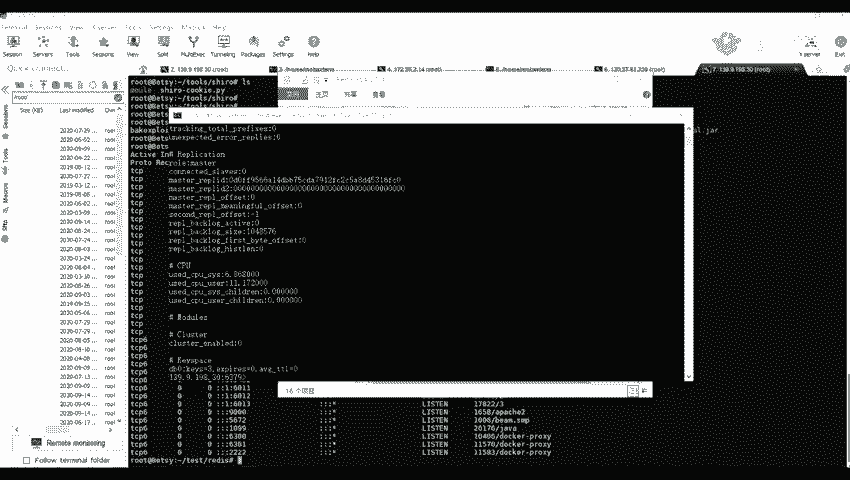

首先呢我们利用这个未授权访问漏洞呢，我们可以可以对它进行写一个web cell。这个前提呢。就是我们。我们的一个网站就是存在一个web服务。

比如说我们开他开启了一个阿帕提或者是一个N解等等的一些web服务。如果他开启了这些服务的话，我们就可以对他去写一个webc。不过呢，他有。一个限制就是我们需要知道他的一个物理路径。那么是物理路径呢。

也就是他的一个网站的一个根目录。也就是我们访问一个网站的时候。

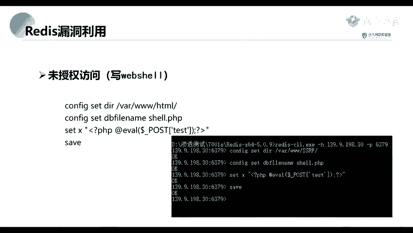

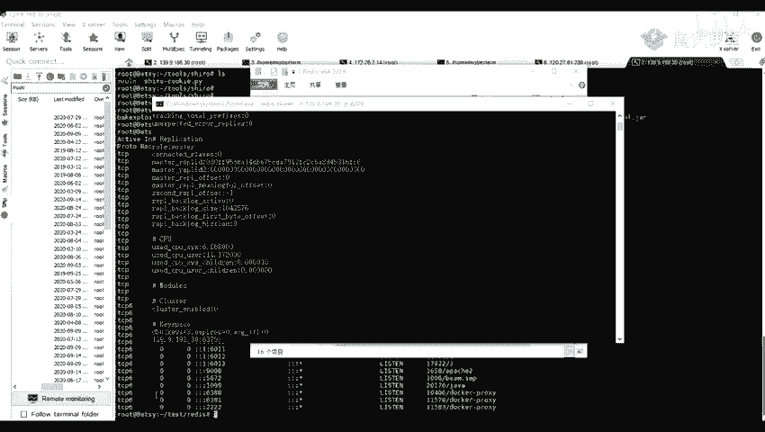

比如说我这里有1个139。要是一个。有。九天端考啊。哦，比如说我这里呢有一个9天端草。

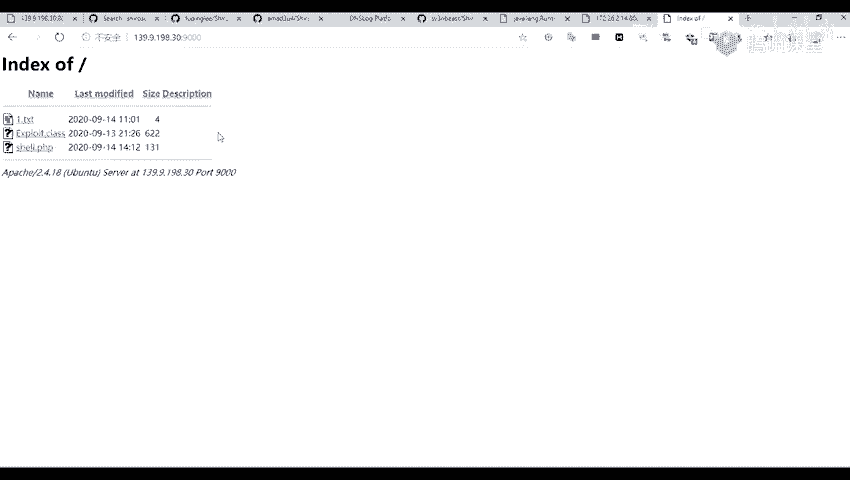

那访我们我访问这个9000端口呢，实际上就是访问我服务器上面的这这一个C条。实际上是。就是访问我这一台扶务梯上的这一个路径。就是VIR3WHSHI这一个路径。这个呢就是我的一个网站登录录。

就是他的一个绝对绝对路径。哦，JHB的那肯定得用那个JHB的一个那个。那个外博是样的呀。就是我们什么网站就用什么语言。比如说一些GSB的，就是就用我们的一个java语言写了一个web cell。

就是我们我们如果说存在一个leadit，一个未授权访问漏洞之后。我们就可以利用到我们。那个第一节课讲的一些信息收集的一一些方法。比如说收集到他的一个。服务器就是收集到它的一个服务器。

是windows还是linux的？还有的一个就是它的一个。一个web容器，ip帕奇啊，或者是一些NG等等。另外一个呢就是他的一个网站语言，就是网站的一个后端语言，是一个java的。

还是1个PHP的或者是1个ASP的这呢就需要配合到我们前面的课讲的一个信息收集，收集他的一个服务器信息这里。啊，比如说我这里。我这里先将我里面的一个文件给删除了。

我我先将这个需要点PAP给删除了IM杠IFI杠IF呢就是一个强制进行一个删除。你让他删删除了之后，我看到已经没有这个笑点PAP了。

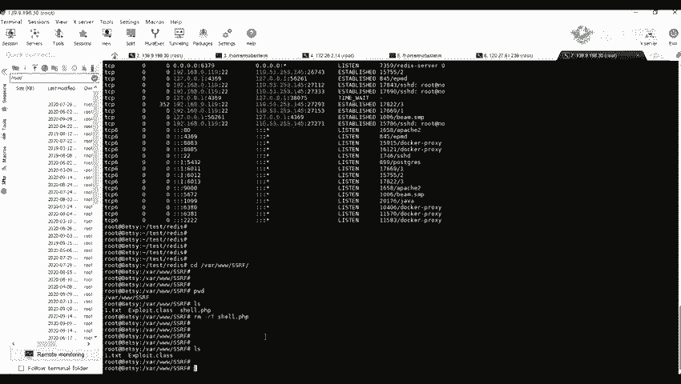

而且我这里呢也是运行了一个web服务的。

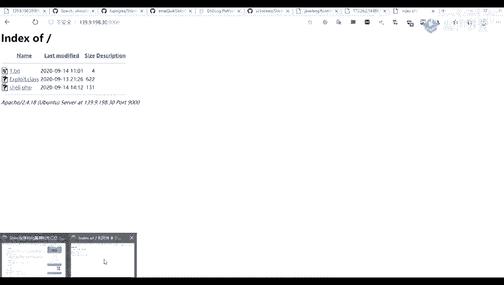

那么我们怎么。

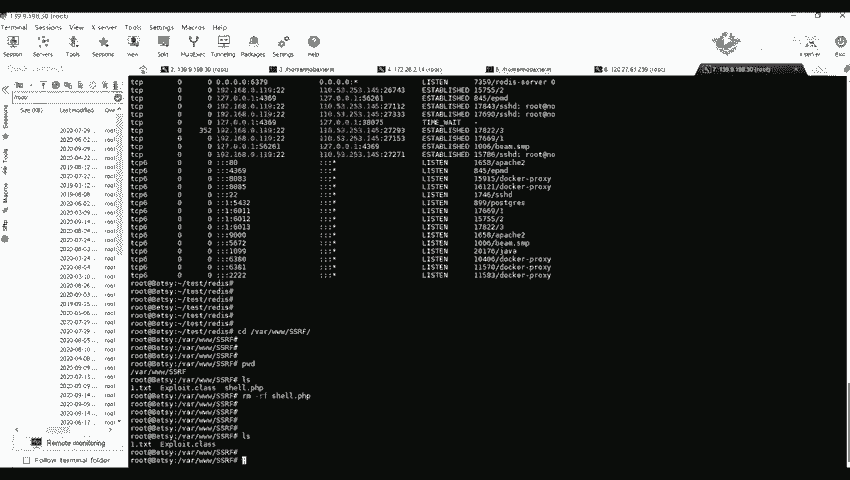

怎么写笑呢？首先我我们回到我们的这个客户端连接程序这里。原来我们。已经连接上了，我们执行一个comcomCOCONMIG1 set。

这就是这里呢就是也要加上我们的1个DIRDIR就是说设置他的一个工工作的一个路径，或者是一个备份文件的一个路径。然后我们这里呢是1个VR斜杠3W斜杠。我这里呢是一个SI的。这里呢我们要注意一点。

就是我们可以根据服务器不同，你要去对他的这个根跟目录去去猜测。因为我们这个给web需要知道它的一个根目录。嗯。我们如果说我们是一个。

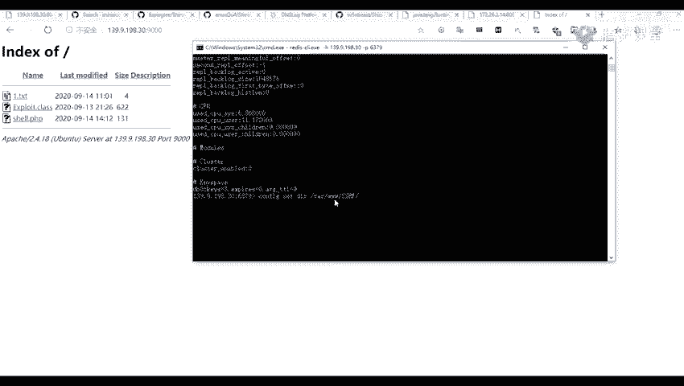

是一个阿帕阿帕奇的一个网站。阿帕奇的一个网站的话，那么它的一个根目录呢一般都是一个。一般都是一个在VA压3W上面的1个ATTML目录。这是一个linux上面的，如果是一个。

windows windows的话呢，那么就看它的一个具体啊，不可可能是一个C盘上面，然后看它的一个是用什么起的一个网站。还有呢，我们这里呢是一个阿帕提的阿帕提呢，这就是这一个。

如果是一个N解N解释的话就是一个在可能涉计在这个VA呀CD。VR然后SHARE。这个我这里没有没有这个，所以就不存在了。

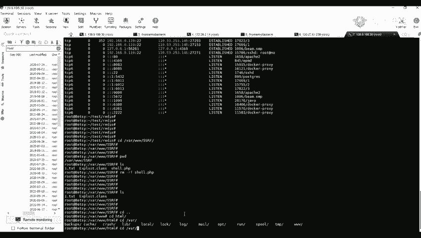

如果说他是一个NG的一个网网站，可能就是这样子的一个路径啊。咩啊，系啊诶。AI。A加一不要斜杠N解。NTMX可能就是这样子的一个路径。嗯。

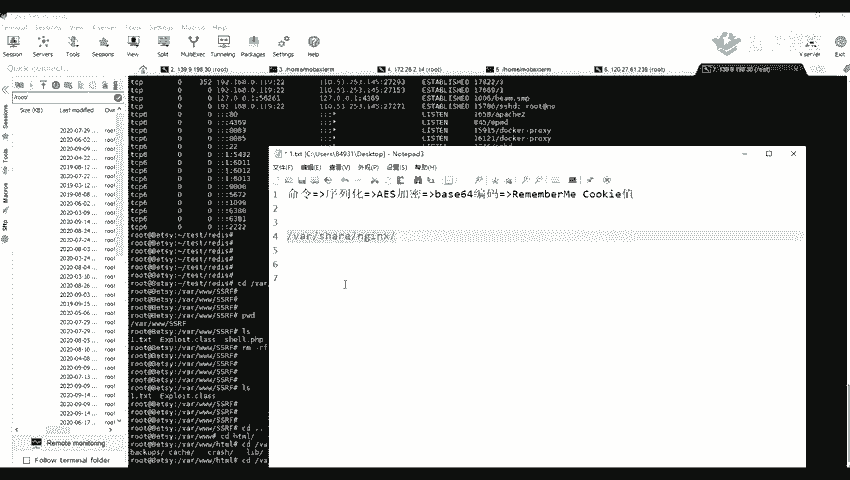

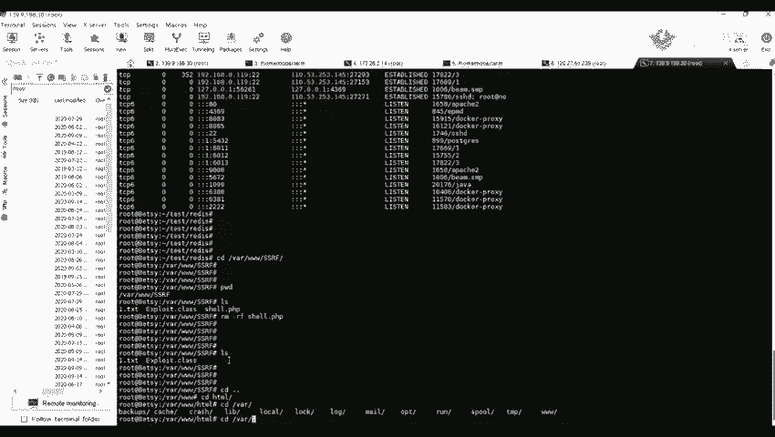

哦，我这里呢已经我这里呢假设大家知道了这一个路径啊，知道大家的一个绝对路径。

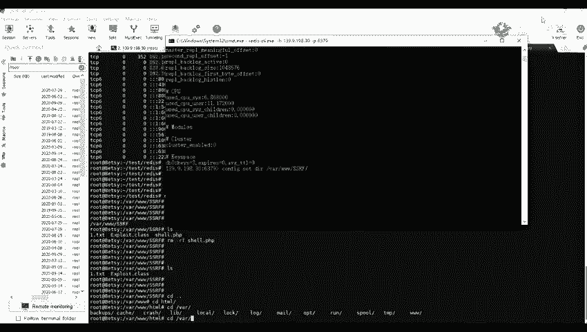

现在我们设置他的一个工作的就是这个目录工作的一个目录，或者说是一个备份文件放的一个目录。那么我们回车。回托之后当家出现OK的话，那么就说明他已经设置成功了。那么我们再执行一下conpy。要贷看。

现记的一个DBF name。第一表呢就是我们的一个备份文件名。这样我我这里呢。BDSY点。点PHP吧。这个呢就是说置我们的一个备份文件名，就是bey点PAAP。然后设置之后，我们再进行一个回车。

回车之后他出现OK那说名单也已经设置成功了。原来我们在执行我们的一个。就是web cell写入我们的一个web cell要set。然后后面跟上一个参数，参数呢是什么都行。比如说X。后面加上一个X。

其他的也可以啊，然后我们再加上我们的一个双引双引号。双引号里面呢就是我们的一个we的一个内容。比说问号PHP我这里呢就写一个一句话的一个木马，PHP的一一句话木马要后艾特DVAL。加上我们的一个。

到了不好？到了。杠耗s号。哎，我这里怎么找了一个？あ了。杠pos他。POS post，然后加上我们的一个密码，就是我们连接微博下所取所用到的一个密码。那么我这里呢就加上一个S吧，一个然要写到S。

嗯你加其他也可以，然后再加上一个问号进行一个闭合。我们后面呢。1个PHPHPHPE的一个语句结束之后，我们需要使用一个。分号进行一个结尾。那么我们进行一个回车。北上之后我们进行一个备保存在。

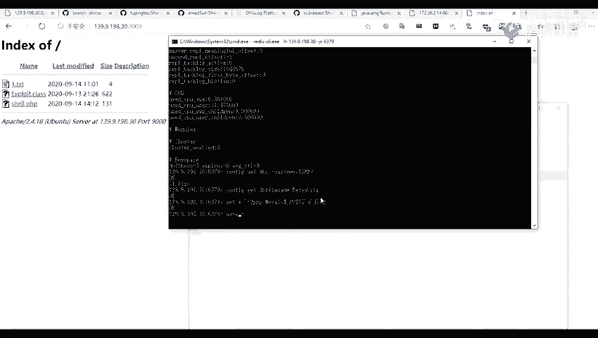

保存之后保存之后呢，我们就在我们的这一个里面，它就会生成一个。一个web webb。我们可以看到我们这里呢已经在我们的一个网站登录里面已经生成了一个webshop，并且它的一个内容我们可以看一下。嗯。

啊，这个外本它的一个内容呢，就是这样这样子，我们前面呢是不用不用理他的。哎，后面好像。多了一个。BB然后一个po。我们让的我们进行一个连接看一下。哦，这里是没错的。我这里呢之所以有一些乱码。

因为我是我之前已经写入过了一些其他的一些命令。所以呢他这里呢有一些会有一些乱码，这里呢是不用理他的。那在我们使用我们我们的一个web叫的一个连接工具。比如说我这里呢就使用一个一键进行连接啊。

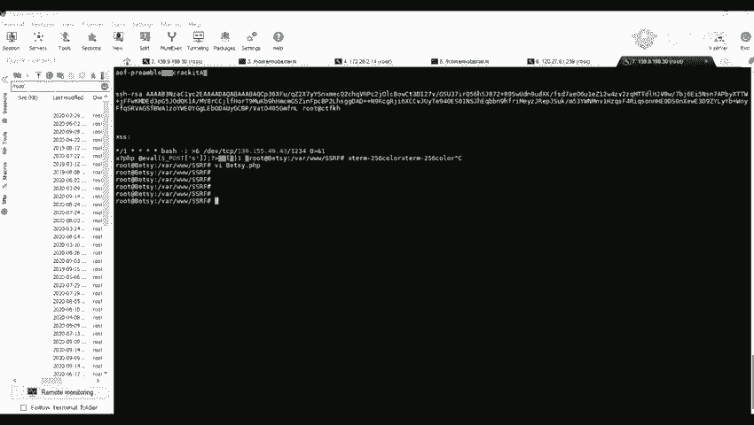

我我先将我这个给关给关掉，给删除掉。要我清也要清除缓存。这个引键呢就是我们用来一个连接我们的一个we的一个管理工具。那在我们右键。右键添加一个数据。这个UY1地址呢就是我们的一个网站的一个地址，139。

9。198。30。后面呢是一个因为我们有是1个9000的一个端口啊，我们在那1个9000。然后后面就加上我们的一个文件名。BTXY点PHP。下面呢就是他的一个连接密码。

连接密码就是我们刚刚post里面的那一个内容。比如说我们我我们这里呢就是一个SS，然后测试连接看一下。这是连接之后呢，它提示我们连接成功。现当我们点击添加添加之后们双击。双机之后呢。

我们可以看到就可以对我们的一个网站进行一个管理了。这常就是我们就可以获取到了他的一个。获取到了他的一个el。不过呢，他这里呢，带着一个那个权限的话，可能是一个是一个3W的一个权限。应该我看一下。

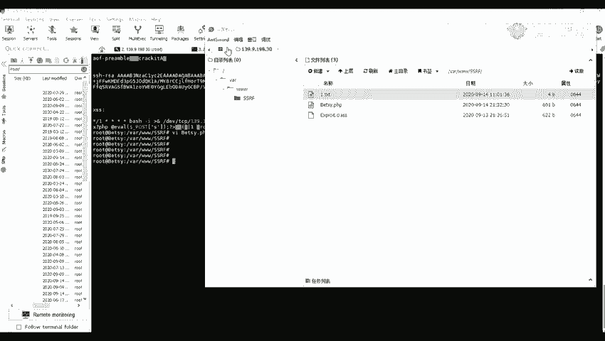

我们可以看到他这里呢也也有，就是他他是1个366杠D的的一个权限，也就也就是。阿帕奇就是启动阿帕奇用户的一个权限。好，这里呢就是我们的一个写we跳。

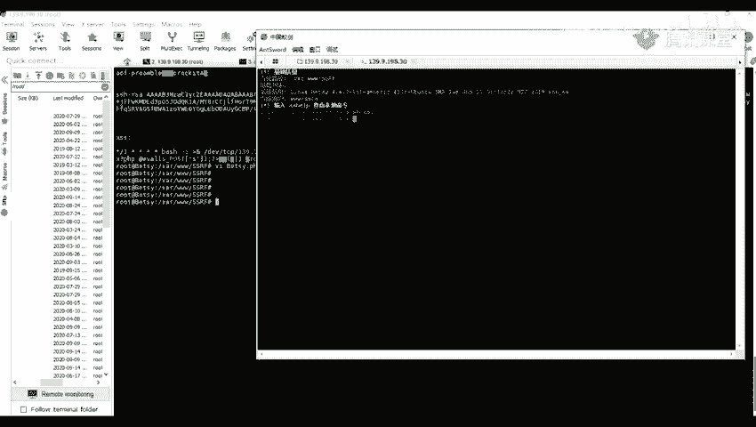

当判呢嗯。我们除了写web之外，我们还可以写一个定时任务。写一个定时任务去反弹他的一个价。我们这里呢前面这个con点con set点DI这个DII进来就是我们设置我们的一个。

数据库备份文件的一个装置的路径。我们这里呢我们的一个。这个路径呢就是我们物班图上面就是他的一个定时任务的一个路径。如果是一个仙桃OS的话，就没有后面这个。后面没有，后面这这个路径。

就是我们前面这VIVS部CRON这个路径。如果是仙桃OS的话，就是前面前面三个路径。然后后面第第二个呢，就是。他的一个备份的一个文件名DBDBF nameroot就是我们的一个备份的一个文件名。

就是一个root。嗯。然后上面上面这个set set，然后叉X呢，这个是可以随意设置的。就是它的一个这个指任呢，就是说它的一个意思就是先助数据库添加一个K。后面这一部分呢就是他的一个K，可以理解为。

后面这部分就是一个K，然后这个叉SS呢，就是它的一个K的一个名字。然后呢，这里呢就是他的一个定时任务的一个写法。在这里呢定时任务的它的一个解码呢是。有5个星星。

5个星星呢分分别代表是一个第一个是他的一个。每分钟。一个是每分钟，然后第二个星期呢就是每小时。第三个就是。每每天吧。第四就是一个每周每月好像是这样子的一个。

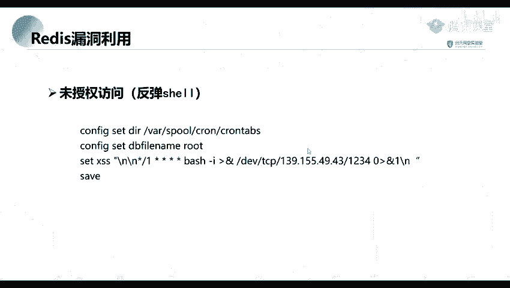

然后呢，我们这里。这里的话。

他这里第一个星星要斜杠一，就是说就是我们每一分钟每一分钟就执行这一条这一次这一条命令，就这个法南需的一个命令。现在我们进行保存，保存之后我们再坚定一个端口。比如说我们反弹到这个139。155。49。

43这个端口上面，那么。我们就会在我们的这个机器这个端口上面去接，就会接收到他的一个定时任务所执行的一个反弹票。我喝口水啊，等一下。然后嗯。回来了。然后呢，我们除了执行一个反弹需要之外。

我们还可以写一个公钥，我们。写工写公钥呢，我们前面也说了，就是通过我们写一个公钥，然后可以执行，就实现他的一个免密登录。这个呢就是他的一个。一个具体的一个步骤。不过呢，它的一个前提呢就是我们的一个le。

但是以以一个root用户进行运行的。那么首先。我们先去生成它的一个中药，就是我们执行这个SSH杠K点这个命令去生成一个中药。生成之后，它会以默认在我们的一个加目录上面的一个点HZH上面。

就就我们这个点HAH，然后上面会生成它的这个IDRSA点PUPUB这个文件。

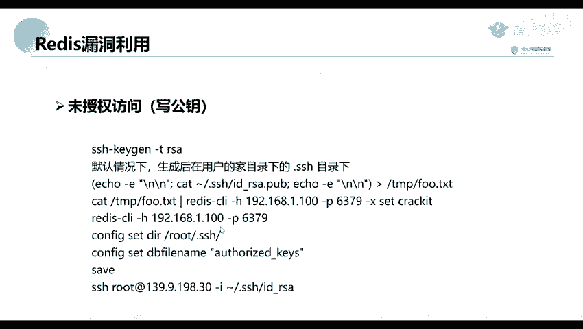

好。我们先先这里进行一个。清求数据库款。因为有一点。太太多的一个内容了。现在。

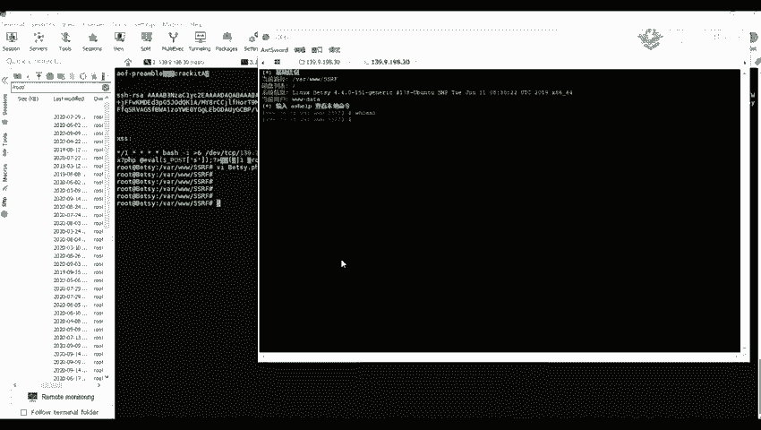

哦，首先将我们的一个内容给清楚。就清空这个这个的不漏不漏不漏上，就是清空我们的一个数据库。

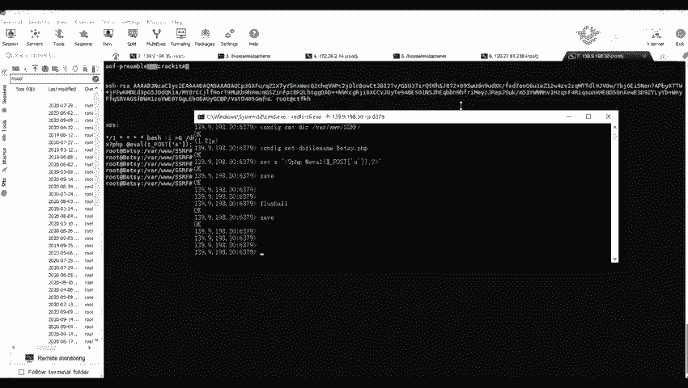

那么我们进行一个连接。我这里呢我看一下这里还能不能连了。这还是不行啊，我连用另一个看卡。13。我们重新进行一个连接呀，let。看CI。1杠H。139。9。198点。要上。6379。这里也是连接不了啊。

我这边总体一下看看。如果不能重启的话，那我们就需要。用另一台机器进行连接吧。我刚刚是用的哪一台？我这个没有。我先看这这台机器能不能用啊。杠HH就是我们的一个远程地址139。198。三0。

杠H杠杠T一个端口。6379。行凤。这里还是连不了，我们在我们的一个其他的一个机器上面连吧。来的。在我们的1个172这台机器上面进行连接。要将我们的一个客户端的一个程序。我这里呢有一个readdy。

这个程序给拖到里面来。你要进行一个解压。解压之后，我们进入到我们的一个文件夹里面。看一下哪一个是lady上标啊。然后我们只执行一个mate MAAKE进行一个编译。明天编译这个文件。

更译的话还是比较快的。嗯，我们用我们其他的1个D器进行连接吧。好的癌症癌症癌症正在编译。我们等那编译完成。

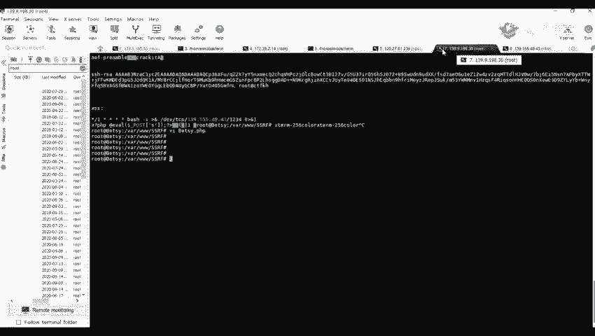

我来看一下刚刚是什么原因啊。来定。就之前是可以连上。

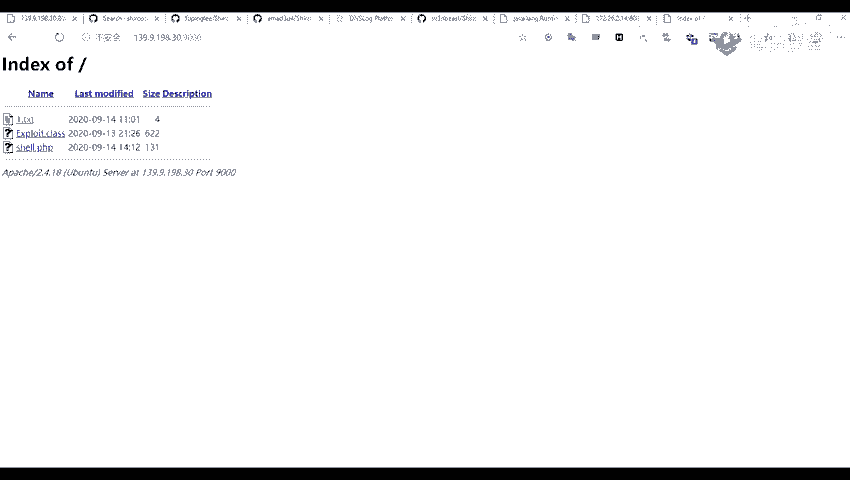

好，这里呢已经。已经那个编译完成了。然后呢我们进入到我们1个SIP的一个目录CDSIC。进录到里面之后，我们可以看到。应该会有一个。la地杠B爱。便译失败了吗？我来看一下。613909。198。30。

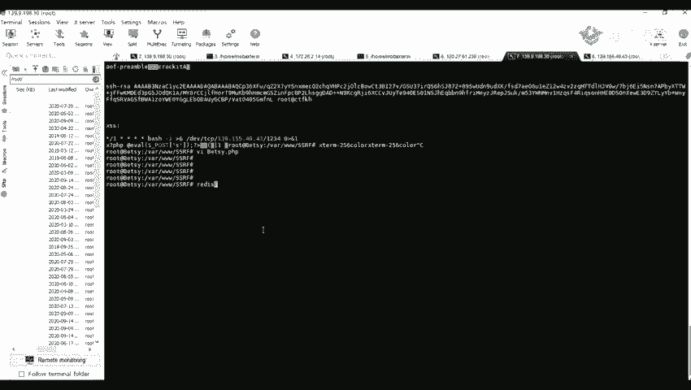

我我先在我本地进行连接看看。

好，这个。这个连不上的话，那么我们这个它的一个铁功药呢，我们就先跳过吧。

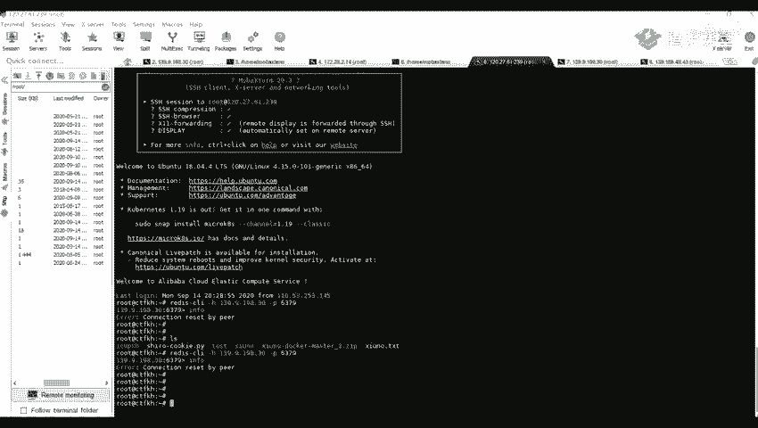

他的一个鞋工用呢，我们就先跳过啊。我们先来再来看一下。他的就这个水工药呢，其实它的一个命令是非常简单的。第一个第一步呢就是先生成它的一个工钥，然后将这个工药的一个内容。去输出输出到这个附点TST里面。

就输出到一个文件里面。之后呢，我们再进对我们的一个将我们的这个。再进行一个连接。连接之后。我们就将我们这个内容，这个F点PSP。在里面的一个一个内容去写入到这个里面。留到这个K里面。这配置。

就是个这个CCI这个英文呢，就是它的一个配值，就是它的一个配名里面这个PSD的文件呢，就是它的一个配值。之后进行一个连接，就是这个leddex杠71Y杠的H就是。连使用他的一个客户端进行连接。之后呢。

再设置他的一个备份文件，就是设置他的一个路径。我们呢因为我们我们的那个公钥呢，是默认的，都是在里面的这个附径的。之后再进行一个就是他的一个。名字，他的一个备份文件名。然要进行保存，保存之后呢。

我们就可以使用我们我们的一个公钥进行一个连接了。下面呢我们来讲一下他的另一个未授权访问它的一个利用方法，就是它的一个主从复制IC。这个组成复置I心义呢，我们前面呢有讲过他的一个原因。

就是实际上就是去下载它的一个外部的，就是下载外部的一个点SO的一个文件，去达到它的一个代码执行的一个目的。那么。那这里呢它的一个利用方法呢也比较简单。我们有一个现成的一个脚本进行一个利用。

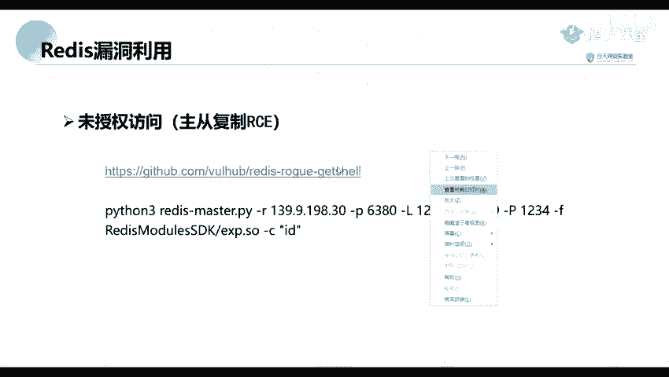

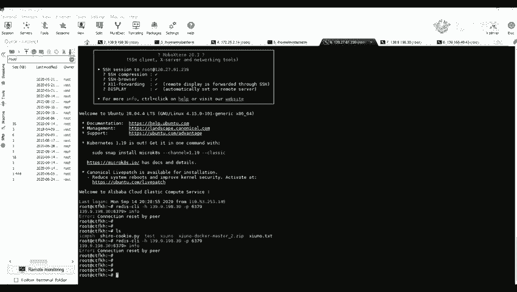

你这里呢也有一个线上的一个脚板进行利用。我们可以看到这里就是它的一个文件文件组成，有一个reFDK的一个文件夹，还有它的一个脚本。然后呢，他是只用一个Python3的一个环境进进行运行的。

我们下载下来之后，它默认呢是没有这个E叉P点SO的一个文件的。我们需要下载下来，然后进行一个编译，编译去得到这个点SO的一个文件。

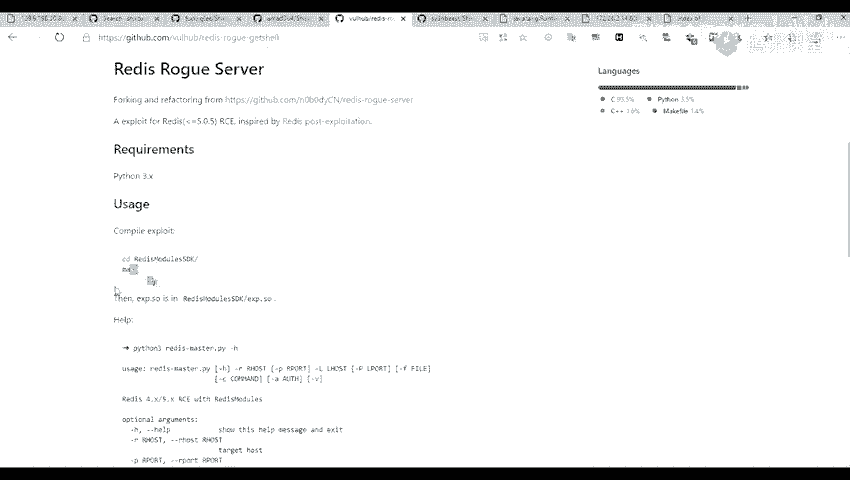

我看一下我这在哪里来着。要进入到我们带来的那一个。周静再来。我看一下是在哪里呢。有。也不在这一个嘛，我找找一下是哪一个来。哦，没有的话，我们这里呢就自己下一个吧。我们先将我们的一个文件下载下来。

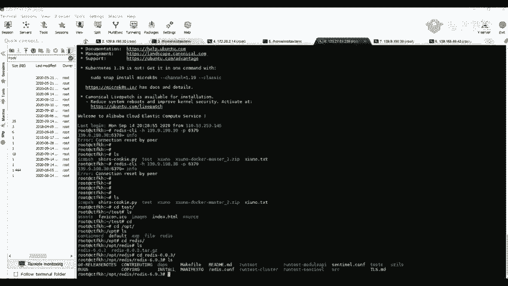

大的。哦，我们这里呢已经有这个文件了，要我们进行一个编译。

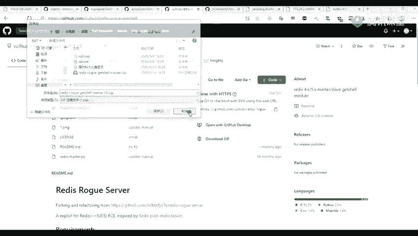

我们将它拖入到我们的一个服务器里面啊。等下，这个执行命令的，你就是在哪里都都可以的。拖到我们的一个。里面。要在他的一个。要进行一个解压。解押之后，我们。进入到我们的一个文件夹里面。

你要进行1个CCD进入到那个net。要进行一个编译。MK。进行一个编译。编译之后，他这里呢就得到了1个E叉B点XO的一个文件。你们可以看一下，这里呢有1个E叉B点SO的一个文件。

现在我们回到我们脚本那里，上一步的一个脚本，就是这个leit杠ma点PY。那才我们执行我们的一个表本。12027。我班想像这里最远的呀。其实是是在这里啊，我们这里呢。在这里啊。

让他执行我们的一个脚本拍on3。要的一个m点PY要加上一个杠R的一个命令。杠R就是指定我们的一个远程的地址，139。9。198。30。要再加上一个杠P。钢笔我这里呢，我这里的另一个red。

就这个主成复制IPE的这个漏洞呢，是开放在另一个端口上面的，一个是一个。6380。这个6380的1个端口。要加上一个杠L。杠1就是我们执行我们脚本的这个地址。比如说我这里呢是1个120。点27。点61。

239。再加上我们的一个钢钉。但不啊，你可以。随意指定啊，这里呢就刚贴1个1234吧。然后再加上一个杠F杠F就是我们就是去加载的它的一个外部的一个恶意程序。我们前面说了。

就是他实际上是在载外部的一个点SO的一个文件。家庭。SO。之后加上一个杠杠C命令，杠C后面就是执行我们的一个命令就。1个ID吧，申定1个ID的命令，要回车。回车之后。

我们可可以看到在这里呢已经给我们回选了他的一个命令，就是1个UID999，就是他的它是一个readdish。

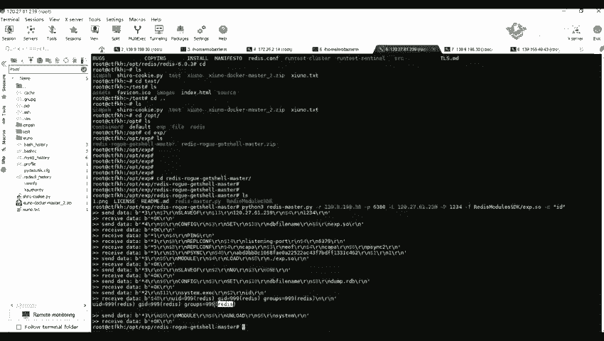

我们也可以将我们的1个ID去修改为其他的看一下。比如说一个货员卖。然后执行这个会员麦命令呢，他这里呢也给我们回本了他的会员麦执行的一个结果，就是一个ready。这个呢就是我们的一个。

主从复制IC的一个漏洞的利用。那么这节课呢，我们就先讲到这里啊。

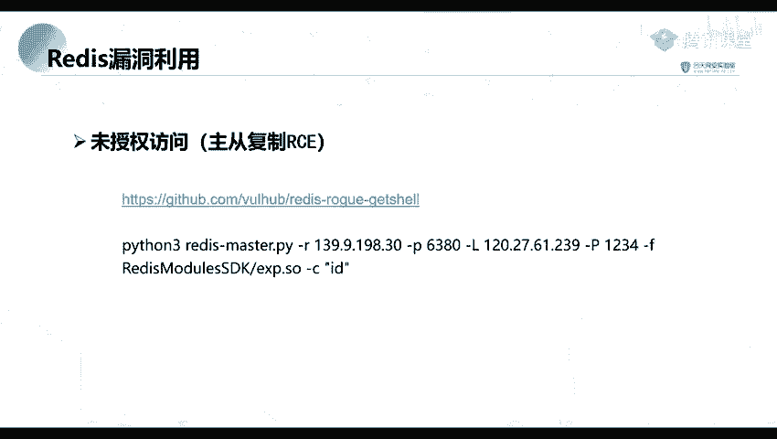

我们就下课了，你们有什么疑问吗？

把作业作业待会我我发在那个那个里面，就是在内文档。我实验室也有一部分，就是我们。那个什么预习预习里面也有一部分，就是写一个web cell的。哦，其实那那个呢也是也是差不多的。还有还有另外一个就是一个。

找一下。

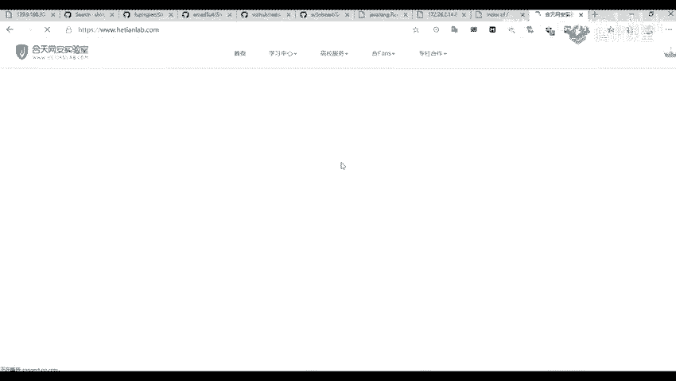

今晚的内容你你可以用就是用我的机器进行一个就是操作的。

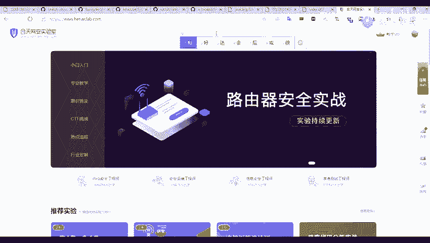

哦，实验呢，你们也可以去搜这个他攻击内网medic的一个这一个实验。他证明了实际上也是。去写他的一个定职任务。

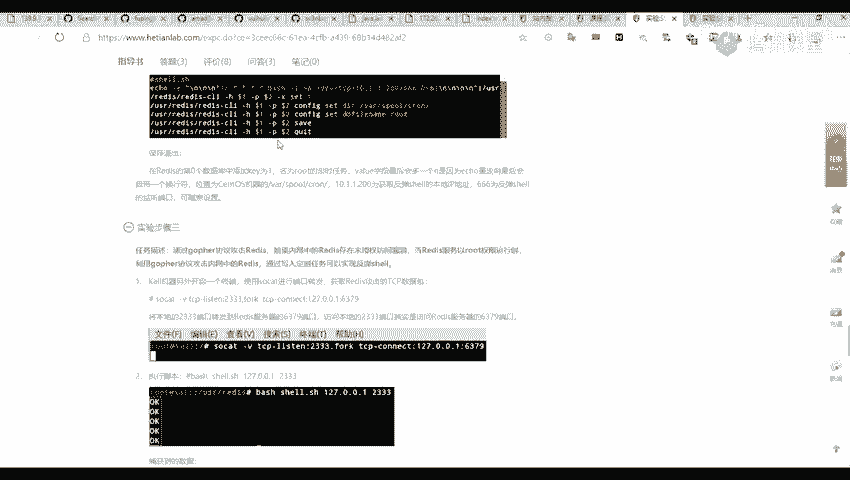

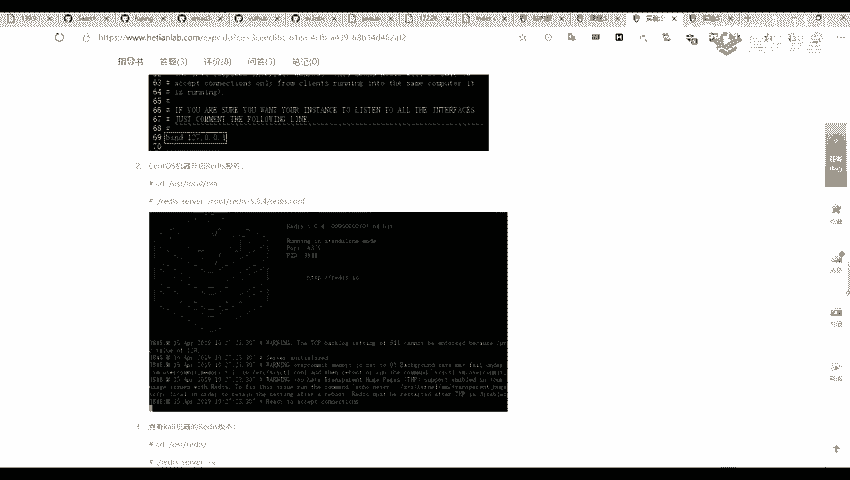

我我把这个职业名发到那个里面吧。你们也可以看一下这一个实验。好，那我们这节课就到这里了。

