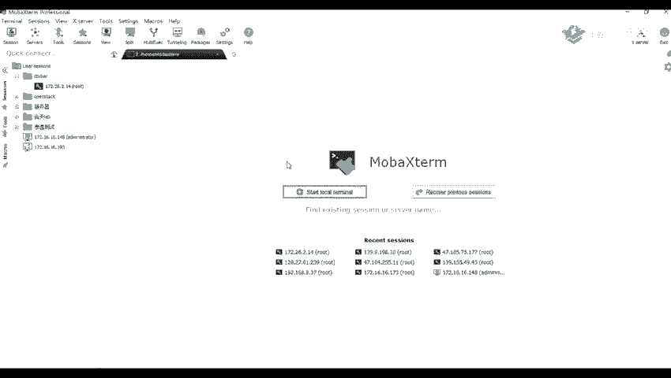
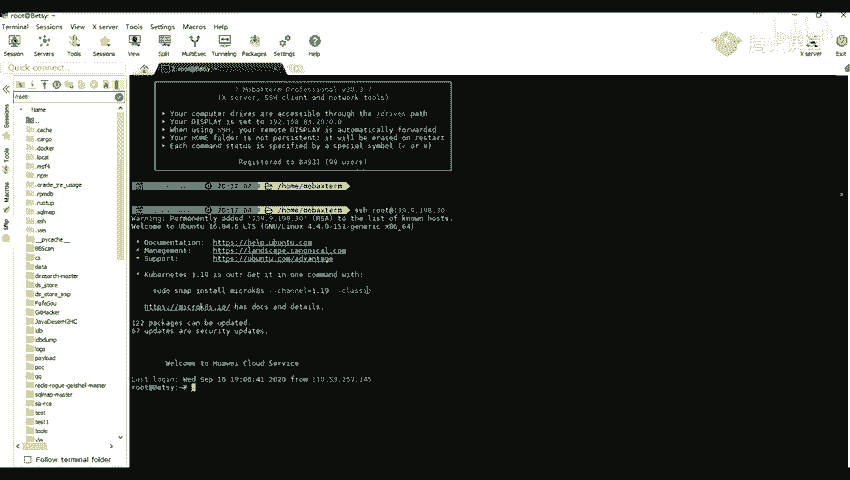

# B站最全网络安全教程，整整1300集，全程干货无废话，别再盲目自学了，看完学不会我退出网安圈！（web安全｜渗透测试｜内网渗透｜CTF） - P60：59.暴力破解介绍及应用场景.mp4 - 网络安全官方教程 - BV15u4y137cQ

这节课我们。这节课呢我们给大家讲一下我们的一个入口令的一个密码破解。当然了也不不仅仅是说他的一个只有他的一个密码破解，包括他的一些账号啊、验证码啊，都都可以就是在一些情况下都可以遇到的。

都都可以就是进行一个破解的，或者说爆破。那那我们先来看一下。看一下。我们的一个第一部分的一个内容呢，就是我们讲一下这个暴力破解它的一个介绍以及它的一个应用场景。

也就是说我们一般都能在哪一地哪一些地方去应用。第二个呢就是我们点一下这个这个使用暴力破解，就是去破解他的一个comca的一个后台。我们先来看一下第一部分。暴力破解的一个介绍以及他的一个应用场景。

首先呢我们来看一下暴力破解，它指的是用枚举的方式来爆破用户的信息。具体的一个流程呢，就是用我们事先收集好的一个字典，然要使用字典，不断的进行枚举，直到枚举成功。这个呢是比较容易理解的。那么。Okay。

嗯，美女一般都是美举一些入口令啊，或者是一个验证码，还有其他的一些别人的一个就是上传的一个wecha，也就是也就是一些大码的一些信息。我们来看一下他的一个常用字典。常用字典呢我们。

一般呢都可以在网就是就是在我们的编号上面去搜索到他的一些字典。比如说我们。可以这样子稍一下。比说我们可以在网网上去搜索他的一些。是的呀。看一下右口令。你可以去自己去生成一个字典。

就是自己去收集我们常见的一些字典。比如说我们在网上可也可以搜到一些比较多的一些字点。比如说。他的一个入口令，还有它的一些就是根据关键词，要快速生成相关的一些入口令的字典。这种呢就是一些脚本。

就是生成字点机的一些脚本。当然当然了，还有我们出的可以爆破，这些用务所令，我们还可以就是对我们的一些敏感文件等都可以使用一个字典进行爆破。比如说我们可以看到这里有一个就是第一个就是在最上面的一个字典。

它是收集了2011年到2019年的一个top100的一个入口令。以及popo1000的一个密码字点，服务器的一个密码字点。还有一些后台管理密码字典、数据库密码字典等等。那么我们说的右口令。

什么是右口令呢？右口令呢就是指仅包含一些简单的数字，或者说是一个字母的口令。比如说123123456以及一些root or me排除word等等。还有或者是一些嗯。一个单英文单词。

因为这样的一个口令很容易被人破解，从而使得我们的一个用户的一个计算机啊，或者是一个的网站，还有一些个人信息，就比较容易遭遭到他的一个泄露。嗯。因为我们在现在很多的地方呢都是以一个用户名。

就和他的一个密码作为一个健全的世界，也就是作为一个登录的一个。地方。原来我们的一个口令呢，就相当于是我们家门里的一个钥匙。但是呢当他人有一把可以进入你家的一个钥匙呢，那么你的安全啊，你的财物啊。

你的隐私啊就就会非常的容易遭到泄露。然后呢，右口令呢就相当于你就是把你家里的钥匙放到你家门口的那个垫子上面。现在我们来来看一下。这第一个右口令的一个字典。这这上面这张图呢，是我们1个2019年。

还有1个2018年以及2017年的，就是top100的一个入口令。我们可以看到我们最常用的一些呢是排在第一位的是1个123456这个密码就是单纯的一个6个数6位数字，这种呢是非常好记的。

所以呢也会非常的被人去拆解到的。因为很多时候我们就是为了做一个方便方便，对吧？方便呢就自己随便的一个设置一个统机的密码，所以呢就会很容易被别人拆解到。好那我们来看一下一些常见的一个密码破解的工具。

密码破解呢，我们前面在前面讲一个爆破 switch的的时候，我们也讲到它的一个intro的一个的一个模块，也就是它的一个爆破的一个模块。这里呢我们就讲到使用这个爆破的一个模块去进行爆破。

第二个呢就是我们的一个工具，nack的nack的一个工具。第一个工具呢，它里面呢也是可以作为一个破解密码破解的一个工具。它里面是集合了非常多的一个就是应用版，就是它可它可以破解很多的东西。

比如说我们的1个HHHmys烤等等的一些应用。然后除了这一些呢，我们还可以使用我们的一个mateaxpro的一个。里面的一个爆破的一些模块，或者说是爆破的一个拍漏。除了这些呢，我们。

还可以在网上去搜索一些脚本，就是密码破解的一些脚本。比如说我们处理呢也也给大家列出了一些，比如说他可以嗯。破解一些wifi的以及HH的的一些字典。还有上面的最后一个。

还有一个破解我们的1个VNC的一个密码。呃，我们也可以在就是我们给大家看一下怎么去找这个。比如说我们这里呢就随便招一个密码。破解，然后呢就可以搜试到非常多的一个工具，或者说是一个脚本。

看样了这边呢还还是要自己去看看是能不能用的。比如说我们这里呢有一个破解它的一个wifi的，因为wifi呢这个是一般的话都是最少是8位数的。所以呢这个如果使用的话，应该是要那个破解非常的久的。还有一些。

比如说破解他的一个VN机的。还有一些压缩包的等等。嗯。我们破解的一个成功成功率呢，一般呢就是取决于你字典是否够强大。如果说你字典就是字典里面是包含了那个密码的，包含了一个正确的密码呢。那么理论上呢。

你就是可以破解成功的。那那我们来看一下他一般这一个暴力破解，一般呢都适用于哪一些场景。首先呢可以去报括他的一个验证码。我们现在的话一般登录网站的时候呢也可能是。有一般呢都是需要输入一个验证码的。

如果说他这这个验证码，这里呢，他没有没有过期，就是没有它的一个时间的一个限制。那么我们验证码呢就可以去进行op破。第二个呢就是不含验证码的后台嗯。

一般的话我们后台的话也也有许多的后台是不包含的是一个验证码的。他一般呢都是可能是前台的一个普通用户登录，他可能是需要去使用验证码去校验。但是呢他有着一个后台的话，他可能是不需要验证码的。

以及一些各种的应用程序，比如说PHPmin mecom cat my等等。这个PPHP版的密码呢，就是我们用来管理数据库的一个外web端的一个管理工具。

数据库的一个管理工具就是web端的一个数据库管理工具。这个tec开呢就是我们前面给大家讲的一些，比如说他的一些中间件，类似于阿帕奇NG等等的一些中间件。这个my色l呢就是我们的一个数据库。

这里一个myCl数据库。除了今些呢，我们还可以对各种协议进行一个爆破。比如说FTB的协议，还有HHH的一个协议以及IDVIDP等等。我们平常就是登录我们这个linux的时候。

一般呢就是使用的这个HH的一个协议。比如说我这里。给大家就是做一个登录。嗯，等一下。

比是我这里呢做一个登录，我脑线是只用的一个登录我的一个服务器，原脑就是只用使用了我的一个。SSHH然后加上我们我们的一个用户名。用户名。root然后艾艾后面呢就跟上我们的一个地址。

我们这里呢是1个139。9。198。30，然后回车回车之后呢。因为我这里之前是已经已经保存了密码的，所以呢我这里呢直直接就可以连上了。如果是没有密码的话，那么我们就需要去输入它的一个密码。

