# B站最全网络安全教程，整整1300集，全程干货无废话，别再盲目自学了，看完学不会我退出网安圈！（web安全｜渗透测试｜内网渗透｜CTF） - P63：62.暴力破解各种应用.mp4 - 网络安全官方教程 - BV15u4y137cQ

那里面下面呢我们先来看一下，使用一个九头蛇去破解它的1个HHHH的一个密码，用户名以及密码。

它比较简单，我们可以就是使用那个HYDI就是这个9头折的这个命令以后指定我们的一个杠大写的一个L。要再加上我我们的一个用户名。这个用户名的一个字典。这个字典呢我们可以自己去指定，也可以。

只用我们它里里面它是一个内置了一个字典。因为我们卡里里面呢其实也内置了一些字典的，我们来看一下。Yeah。

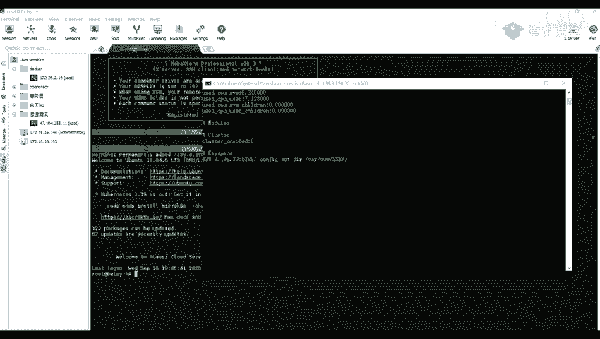

啊，这个呢就是我的一个咖里。

现在我们进行一个先进行一个登录。然后登录之后，我们。在它里面它的一个字典的一个注径呢，我找一下在CD。啊。USR要刷word list那在这里面就是在这个USR刷摇 word list这个文件夹里面。

那里里面呢是内置了一些字典，比如说我们一个mateax pro这个框架里面的一些字典。或者是一个nm里面的一些字典。等等。还有一些就是一个路径的一些字典，我们可也可以看一下DD1DI呀。第然。

嗯随随便你看一个一个吧，我们可以看到这里呢。可以看到他这里呢是一个路径，就是。是一个路径的一个字典。都是一些从就是。一个大部分都是一些英文英文名吧。这是一个小的字典，我们还有一些大的一些字典。

比如说这个。这个字点呢就比较大了。那么我们这个。CD我们我我加入的这个CD呢，就是切换路径的一个命令，就是在我们。linux上面呢是切换路径的一个命令。我们在windows上呢。

实际上也是可以使用这个CD进行一个切换路径的。

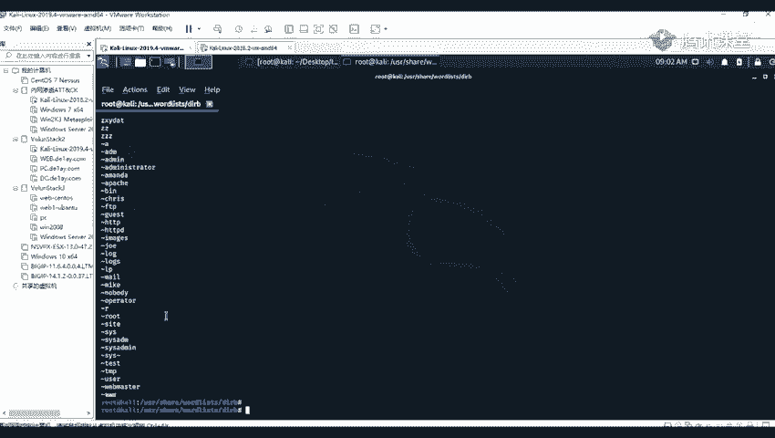

我们比如说我们回到上一局，要滴滴。Dpo这个切换路径的一个命令。

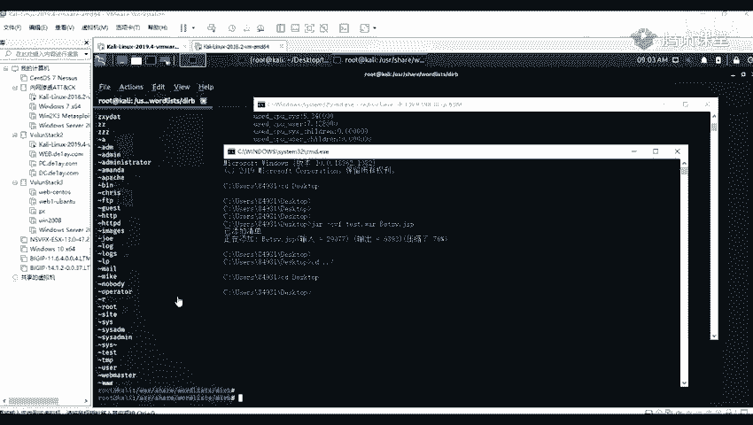

现在我们前面讲到我们的要tca就是查看我们的一个文件内容。那我们。就是查看我们的一个文件内容，比如说我们ca more。等等。好像是跟我们这个派口找一下。

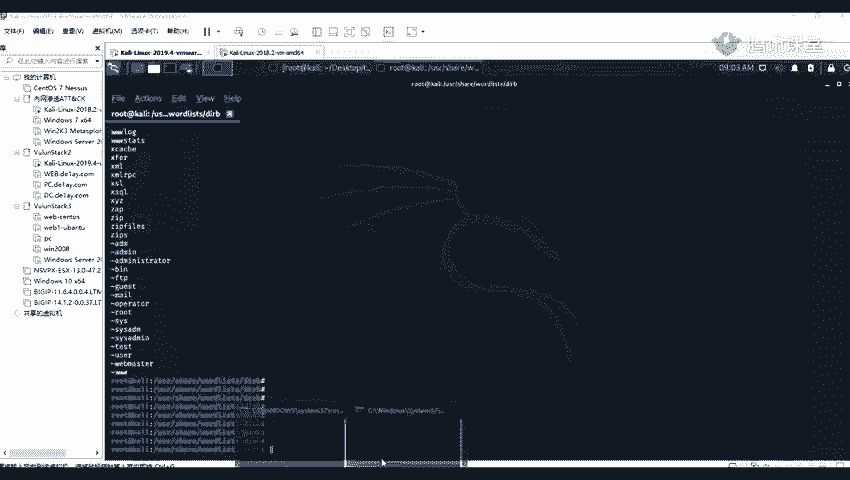

智为。

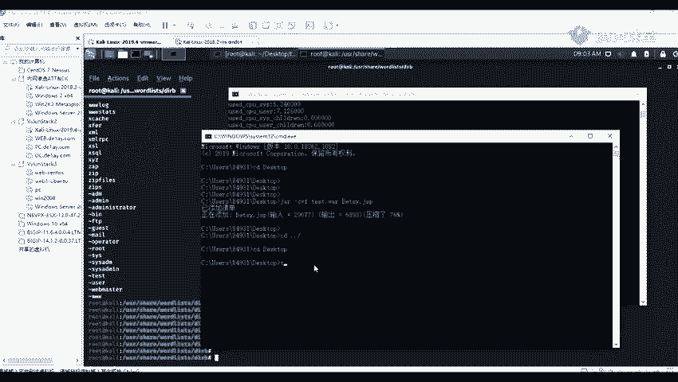

我，跟我们这这个windows上面的一个type的一个命令是一样的一个意思，也就也都是查看我们文文本里面的一个内容。哦，不是。VIVI是编辑。比如说VR摇字贸，我们可以看到可以进入里面进行一个编辑。

我们可以对我们的一个我们V院呢是一个编辑器。어。就是我们可以对我们的一个文件进行编辑。我们开命令呢才是就是查看那个文件的一个内容。你用VI进行查看也行。

因为这个就相当于这个VI跟我们windows上面的一个文本编辑器是一样的。就这样相当于是我们这样子去右键，然后去查去打开。

打开之后，我们就可以对我们这个文件进行编辑了。对，这个意思。

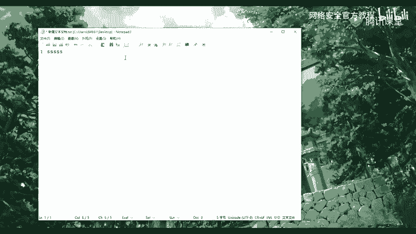

原来我们来看一下，使用我们的一个九头蛇去破解我们的一个用户，就是HHH的一个用户名以及密码。

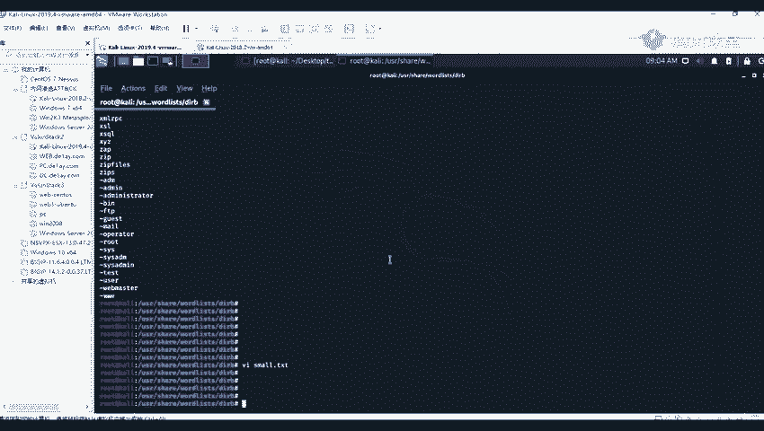

首先呢我这里我我这里呢有另外一台咖里，我们举个例子啊，我这里呢是举个一个例子啊。

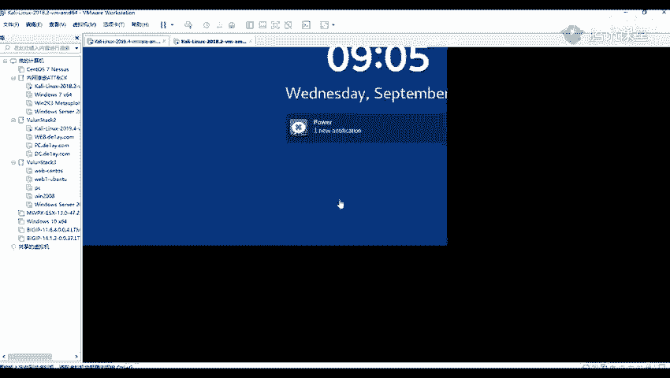

我们在信息收集的时候。就我们在信息收集的时候，我们找到一个就是使用我们的一个m，就是查看我们的一个端口的时候，我们查看到这台机器，比如说比如说是查看到1个192。168。83。33这台机器。

它开放了这个2的一个端口。开放了这个22的一个端口，那那那么我们就可以。使用我们的一个工具，只有这个端口进行一个爆破。因为这个这个二的一个端口呢，它是一个默认是是1个SHHH的一个端口。

现在我们就可以使用它进行一个爆破。让他我们输输入我们的一个命令HYDI。1杠LL呢就是指定我们的一个就是用户名的一个字典。杠L就是指定了一个用户名字点，如果是一个杠L，就是小写的一个L。

就是指定我们的一个用户名。我们呢因为我们是需要对我们的一个用户名以及密码进行破解的。所以呢我们使用我们的一个杠大写的1个L。看到嗯。是我们的一个字典的一个路径。因为我这里呢是已经有一个字典了。嗯。

我我这个pos这个文件夹里面，它已经有两个字典，一个是username的一个字典，就是用户名的一个字典。然后还有一个pasword的一个字典。那么我这里呢就只用这两个字点进行一个爆破。

杠151斜杠路的指定我们的一个文件的一个路径。哦。Yeah。我们这边指定我们我们的一个路径。然后我们再指定我们的一个密码杠大T。张大飞就是一个密码字典。那到这里呢，我们可以输入我们的一个绝对路径。

也可以输入我们的一个相对路径。相对路径嘛，就是我们可以在我们当前路径上面就是相对于他是在哪一个路径的。比如说我们这里一个相对路，我们这个tos上面有有有两个字点，对吧？

我们就可以是使用我们的一个相对路径点斜杠。然后我们的一个密码字典EWD。我们绝对录地录径呢，就是我们指的是在我们的一个根根目录上面就就一路指定到他所在的一个目录。然后之后呢，我们。没。

上第要3上字典之后，我们。在是输入我我们的1个IP。比如说我们这里呢是一个，我们看一下这个IP是多少来着。我们这个ifcomp这个命令呢就是我们在linux上面查看IP的一个命令。

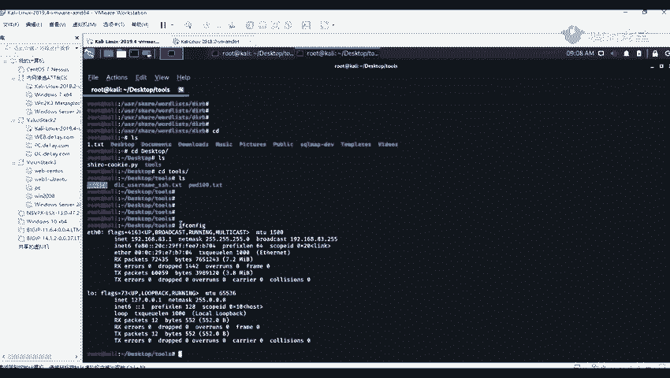

如果是在我们的一个windows上面的话。在windows上面的话，就是ID装。

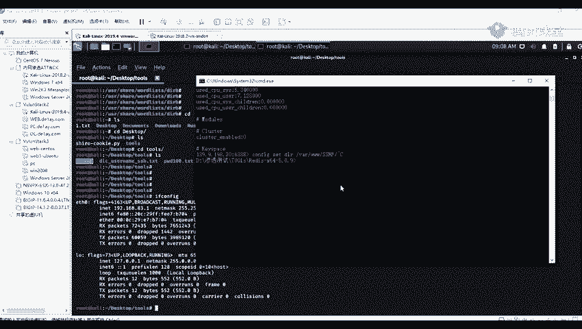

我们另面承呢就是一个A分被告。我们这里呢有1个192。8168。83。1哦，是这边的机器啊。192。168。83。33。要指定我们我们的1个IP。192。168。83。33是这样子吧。然嗯。

在指定我们的一个协议，比如说我们这里呢是包括1个SHH的，也可以指定我们的一个。如果是一个my circlel的话，就属于我们的一个myCl。我们这里呢是一个SHH的。之后呢我们是可以的。

但是呢我们可以就是加那一个杠F的一个参数。这个杠F呢就是指我们在爆破到一个对，就是一个成功，就是成功爆破到的时候，我们就自动停止掉。看到我们进行一个回车。那回车之后，我们可以看到他这里呢是爆波的的。

还是比较快的。他这里已经给我们报破出来了，他的一个用户名login也就是一个root，他的还有他的一个密码，paword就是一个toPO啊。那在我们将我们报破到的一个用户名以及密码进行登录看看。

那那我们可以看到现在呢是1个1192。168。83。1的一个机器啊。看到我们使用我们的登录HHH，然后root。艾特艾就是我们前面所爆破到的所爆破的一个地址，192。168。83。33。192。168。

83。33，让他我们进行回收。回收之后，他就输告诉我们输输入这个密码，现在我们输入我们的一个密码718。回车之后我们可以看到已经成功进行登录了。那我们查看他的一下他的IP也彭被告。你看到他这里呢。

就是他的1个IP192。168。83。33，就是我们这一台机器里面的1个IP。

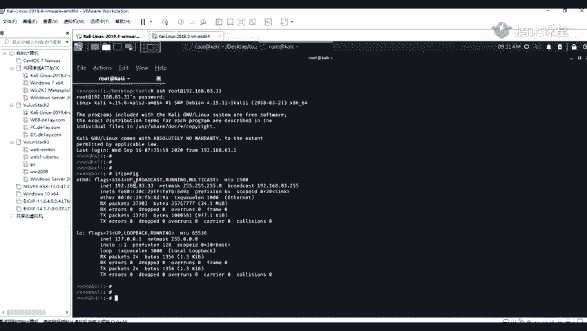

现那我们来看一下，就是另一个包括另一个my烧跑。我们前面呢是包抱了我们的一个。使用我们的一个图形画的一个工具进行包括我们的一个myrical。下面呢这个呢就是使用我们的一个。

有头蛇去破解我我们的一个my烧烤。当你。首先呢，我这里你看一下。我我我这里面就举个例子去破解我本地的一个买车口啊。我先看一下我的ID。我这里呢是1个192。168。83。29，他这里呢是。

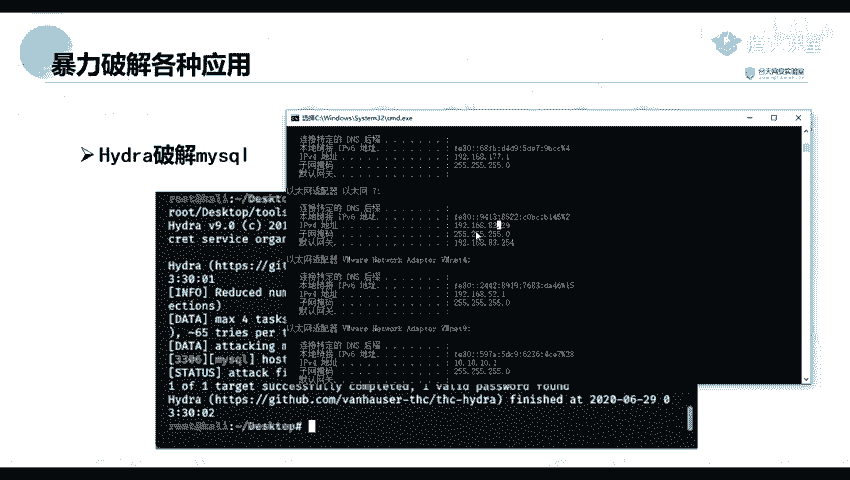

进行了一个my circlel的一个服务。就往这里呢，就。假设举个例子，就是我们也是在定期收集的时候，就收集到我们就是存在我们的一个mP就是找到了他开放的一个端口。这是1个3306的一个端口。那之后呢。

我们就进行一个爆破，然后HYEI。要杠带回的一个L，那是跟我们前面是一样的。我这几天直接用前面的那那条语句吧。192。168减多少来着？83。29。然后我们的指定我们的一个应用是一个mysrl的。

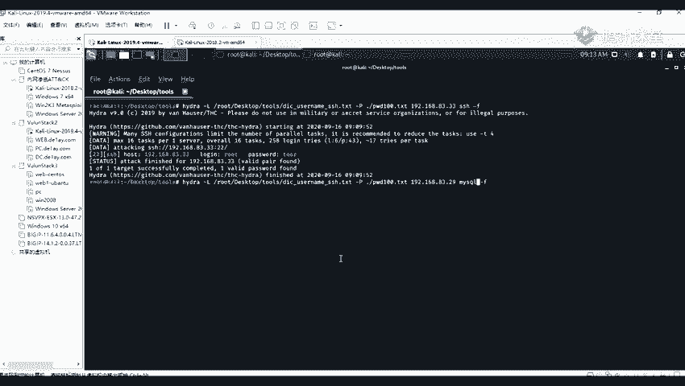

看到单就会进行一个报破。在这里呢报破呢也是比较快的，在这里直接将他的一个用户名给报报出来的。他的一个用户名呢就是一个test，还有一个密码呢，也也是一个是一个root。然后我们进行连接一下。

看这一个用户名以及密码是不是正确的。我找一到了一个工具。我这里呢我我就使用我的一个。工具就是。myfi口的一个连接工具。mycycl这个工具进行一个连接。要连接到这里呢，我看你们看一下他的一个一个是。

有。有。2。168点。83。29。然后呢，他的一个端网呢是3306，然后用户用户平台就是我们的一个t啊。密码密码密码呢就是一个root，我们看一下能不能连接成功啊。啊，然来我们进行一个连接。连接之后呢。

我们可以看到也也是可以成功是进入到的那的一个数据库里面。那在我们就可以对大的一个数据库进行一个操作或者是一个管理。比如说查看最大一个的一个数据库进行一个增山改查等等。这个呢就是他的一个。

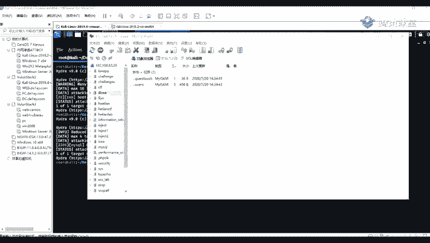

使用他的一个九头蛇去破解他的1个SHH以及埋C口。前面呢我们也讲到，我们还有一个mateax pro的一个渗透设试的一个框框架，它里面的一个。扫描的一个模块。Okay。

第二那里面呢是已经内已经内置了许多的一个模块了。我们这里呢就使用我们的这一个搜索我们的一个SHH log login这个模块进行一个破解。然后呢，我们第一步呢就是使用我们的这个模块。然后第二步。

这个在R host这个那就是指定我们的一个远程的一个地址。比如说我们在信息收集到我们的的这个172。26。2。36。他开放了一个二的一个端口。那么我们就可以我们这里呢这个RR host。

这里呢就指定了那1个IP。然后上面呢这两步呢就是分别分别指定他的一个用户名以及他的一个密码密码的一个字典。那么我们我们这里试一下。

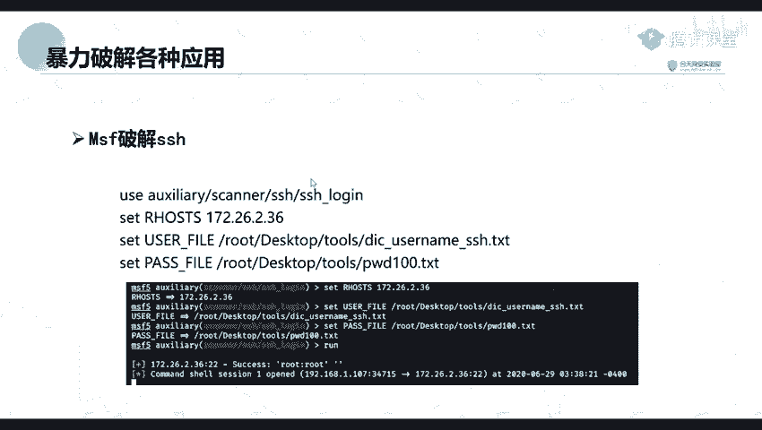

首先呢我们启动我们我们的一个mateac pro，只有直接截行M。SF。Coil。MMMSFMSSF分手这个命令就是开启我们的。嗯。哦，我们找了一个N安少。那呢他就会进入到我们的这个框架里面。

这个呢大启动的话需要等待一会呀。Okay。无法连接，好像我看一下，好像数据库没有开启，我看一下。好。这个呢他的一个数据库没有开启，我们先将他的一个数据库给开启。嗯。你点买吔。睇啊系啲。

那我们的一个数据库是一个找一下是哪一个。没有。有到。post glass circle这个数据库它使用的是这一个数据库，要到门开启它。那我们重新。我们重新登订阅一下。Okay。

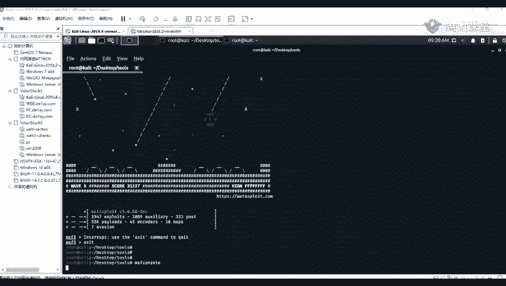

我看一下这里。加了。还是没没有连接上吧？我来看一下这个是否开启了。5432开庭了呀。我们这里呢先出始化一下吧。要我们注意我们的1个MSFDV。进行一个初始化。要加上这个INIP这个命令进行一个初始化。

现在我们再重新进入看看。这个呢在你们后续后面的一个课呢，会讲到这个这个工具的使用，这个框架的使用方法。好了，我们可以看到我们初始发之后，我们已经。已经进入到了。那那我们这里呢我们可以使用我们的一个设取。

就是一个搜索的一个命令。搜索的一个命令去搜索稍等一些。login的一个模就是包含了这个log login的这个模块，这个这个名字的一个模块。那我们这里呢可以搜索到很多，它包含了这个login的。

这个模块。那那我们找到我们这里呢需要的一个。我们这里呢所需要的一个模块。比如说我们这里呢有1个SHH的一个login的这个模块。这里。这个呢就是我们所需要进行一个使用的。现在我们就使用我们的这个模块。

O然好。现在我们我们使用一个右右子的一个命例，就是使用我们的一个模块。姚继平将我们的一个模块给输入进去。江蓝牙回车。回这之道他已经设置好了。对。然后再设置我我们的一个远程的一个地址，就是s。

RHOS T。我们这里呢设置我们的一个远程的一个地址。然后我们这里呢是一个地址，是一个。多少来着？

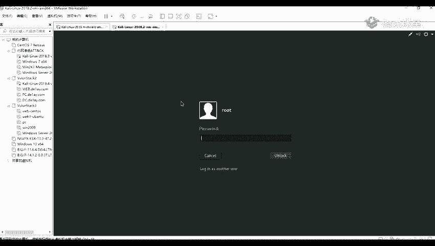

被告192。168。83。33。这个地址呢就就是我们信息收集到他开放的这个2方口的一个地址。要了回车。回托之后，我们再设置我们我们的一个用户名的一个字典在that。USE啊。

到FILE加上我们的一个路电root。Okay。我们嗯。要再加了我们那个扣。DI p t。那样呢我们也可以使用我们的一个option的这个命令，查看我们所需要设置的一个东西。比如说这里呢他测试时。

他的一个叶子，这里呢就是说明我们是必须要设置的一个东西。那我们在设置我们我们的一个。密码密码的一个字典。啊。Parts杠表。原告mo。S top。测置完之后，我们再查看一下我们。设置好了。

我们那这里呢已经设置好了。我们可以看到。这里这个require require。这个选项上面这个。上面他这里有几个页，然后呢，我们这里呢就需要设都需要进行一个设置。比告我们这里呢有一。

这个dequire就是所需要设置的一个东西。而这个就是我们当前所设置的一个东西。比如说我们我们的一个pa pass，就是我们已经设置了这个路径的一个PWD100的1个P的一个文件。

以及我们的一个远程的地址 host就是我们的一个要破破的一个地址。后面这个apple就是远程的一个端口端口。这个呢是默认了默认是2的一个端口。让他我们执行一下乱的一个命令。乱的这个命令呢。

就是执行的意思。那那我们需要等待他就可以了。八三点三三。我们等他跑完啊。原来我们可以看到。他这里呢已经跑到了他的一个用户名以及密码，就是我们前面只用九头蛇跑道的一个用户名密码。然后跑到了之后。

就是这个mateax pro的这个在探测这个SS的一个绕口令的时候，如果是发现了存在就会返回答的一个ux的一个che。就是就会返返回到一个linu的一个c。但是呢注意我们返回的一个c。

并不是我们的这个框架里面所内置的一个m的一个c。所以呢我们这里呢属用我们的一个阶段。SESSSS杠IONS1杠U原么他这个son的一个ID呢是一，然后我们就回只有一个一son杠U，然后加上一个ID是一。

哎，没有进去啊。我看一下。Okay。好。我们是要先出来，就是先出来之后，我们再输入啊SESSSION。1-U。加上我们的一个一。知道吗嗯。他就得到了他的一个mal black的一个se。嗯。

他这里有一个错误啊，我看一下。到。对。0400。我看一下。配合 s e诶。有两个。行那我们进。不的。啊。看到我们升级了之后。升级了之后，他就会。找到我们的一个met的一个c之后。

那到我们输入我们的个s杠I，然后加上我们的一个ID。就是比如说我这里呢是一个我们又进入到这个met这个c之后，我们就它的一个ID之2。所以呢我们就输入我们我们的一个s杠I，然后加上一个2。

那到我们这里这样子他就得到了他的一个。mate collect的excel，这样呢我们就可以对它进行进一步的深入利用。那然关于这一部分的一个后续后续的一个内容以及深入的一个利用。你们。

后面的一个课程内容呢会讲到我这里呢，就讲到他如何对他进行进行一个破解，并且去得到他的一个me的一个elel。对。呃，这节课呢我们就讲到这里啊。下面。好，待会待会我会把我在群里那个在线作业呢。

我会在上面写是吧。哦，会会有关。后后面的话是另一个老师给你们算吧。门电不到电不到我了。不过就是你们有问题的话，你们还是就是在后面的课也可以就是去问我的。嗯。

因为我们今天呢主要是就是讲主要主要的一个内容呢，主要是都是讲一下我们的一个爆破，就是使用我们的一个爆 switch的一个爆破的一个使用的方法。还有呢就是我们的一些常用的一些爆破的工具。

就是介绍一下这些爆破，就怎么去对我们的一个应用进行一个爆破。并且还有这个使用我们我们的一个macaxpro的一个框架，对我们的一个。应用进行破破。因为这个框架呢，你们后续都会讲到这个的。

现在我这里就先给你们讲一下，使用这个框架进行破破。啊，然后这个bus阶层的一个利用我我在这周末我看一下是不是周六还是周日，这周末我现在给你们讲一下，然后后面呢还会。还会再点一个其他的一个内容。

就是我们在挖SIP的时候，就是可能会经常遇到的一些一个漏洞。就是给你们讲一下他的一个。就是发现以及他的一个利用方法，那个呢是比较常见的。其实这个s的一个密钥呢，是我前面那个PPT呢，也是在上面是写了的。

因为你们是一个我不知道是那个什么原因，就是连接不上了。这个我当时我就没有解，我看一下就是嗯。看到什么时候我搞好了，他就是连接上了之后，我也给你们一并讲一下。就是我们一些没讲到的一些内容。

还有一些其他我们一些其他的一个漏洞的一些发现以及利用的方法。