# B站最全网络安全教程，整整1300集，全程干货无废话，别再盲目自学了，看完学不会我退出网安圈！（web安全｜渗透测试｜内网渗透｜CTF） - P64：63.metasploit目录结构 .mp4 - 网络安全官方教程 - BV15u4y137cQ

那我们今天就来学习maha splitlate。首先我们需要了解mat split的目录结构，就是里面放了一些什么东西。matta split就是MSF是它的简称，是高度模块化。

这个框架呢由多个模块组成，是最受欢迎的渗存测试工具。对MSF呢，它是一款开源安全利用和测试工具，它集成了我们常见的系统服务漏洞和流行的shall code，并且持续保持更新。现在的MSF已经更新到了6。

6版本。let它 split涵盖的渗透测试中全过程，你可以在这个框架下利用现有的piload或shall code进行一系列的渗透测试，我们就不需要关注。漏洞的一个本质就不需要再去调试了，真的不需要吗？

其实是需要的。我们如果去自己去调试MS17010，会发现啊这个漏洞是怎么形成的，自己去调试，也会学到学到很多东西。当然我们现阶段作为一个入门，那我们不需要去花这么多的功夫去做这件事。

metta split在卡利里面是自带的那它的一个安装路径呢，在19年的卡利新版通常是第二个路径，是user目录sha目录下的matta split framework目录。在这里面有我们框架的。

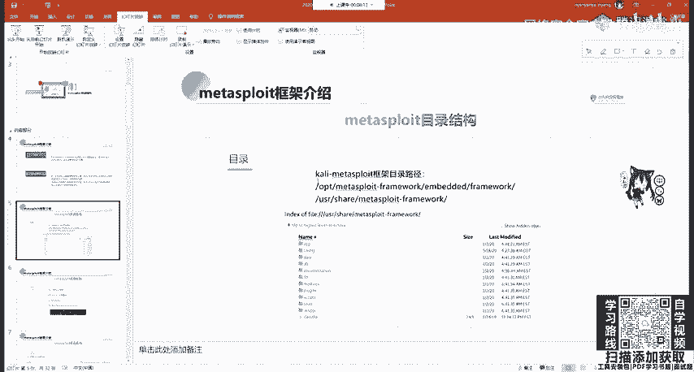

文件内容哎，我们来看一下。

就在这个在这个目录里面。

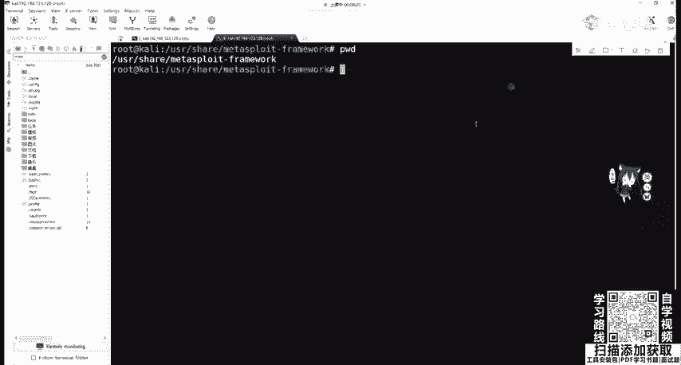

就是它的一些文件。那我们来快速的看一下这些文件是干什么，我们可以使用。MS console这个是MSF的一个接口，我们是通过它来操作操作MSF杠V version查看版本。如果更新它也非常简单。

首先更新我们的IPT get语。这个语言大家如果是使用卡里自带的de软的话，有可能在国内访问非常的缓慢。大家可以去百度自行搜索，如何更换IPT语言。

更换成净华源或阿里云源进行update就是更新语言之后，简很简单。IPT get installt安装 meta split framework即可对MSF进行更新。在MSF。

如果大家不想去更新整个的框架，而是利用它现有的一个插件或者是漏洞利用脚本。大家可以到git hub上面。mate split的官方仓库进行寻找最近更新的内容，进行一个下载。

然后移动移动到我们的modles这个模块目录即可。这些大家都可以操作，命令不需要自己去记，因为这些都可以找到。我们来看一下它的目录，也就L看data数据。很显然。

它是包含了MSF用于存储某些漏洞的二进制文件和可编辑文件。那documentation这个就是包含了文档。那lab呢是库文件夹，还有插件文件夹，screens脚本文件夹，tth工具文件夹。

还有我们最重要的models。是包含了MSF的所有的模块。那我们对渗透测试自动化利用，通常就是对models里边保存的模块文件进行调用。那我们来看啊这个models目录里面有哪些东西呢？

这些是我们需要掌握的CD的models进行IOS可以看到里面是有7个子目录，分别来看一下它们代表什么。首先辅助模块。很显然，辅助模块就是辅助渗透。也就是对渗透测试进行前期信息收集，进行漏洞的扫描和探测。

包括端口扫描，若密码爆破漏洞验证的。

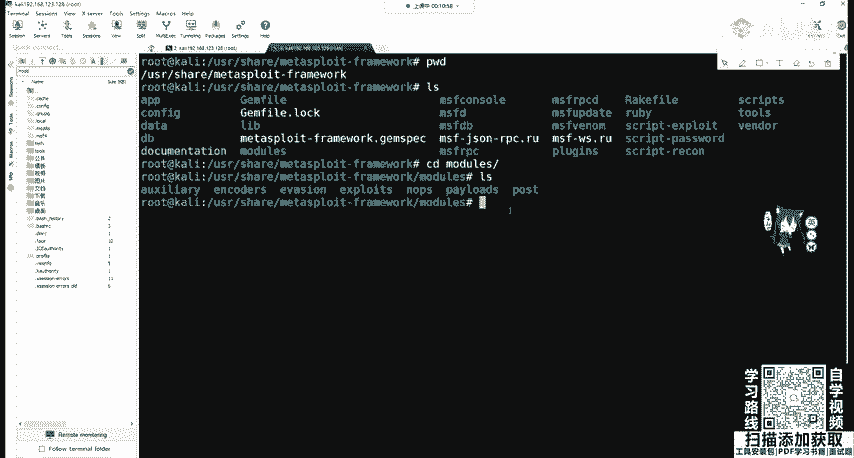

explse漏洞利用模块。很显然，这就是E叉P里面包含了主流漏洞的利用脚本。pas攻击载和。ps主要是用于攻击成功后，在目标机器执行代码反弹shall的代码。我们不论是渗透测试，还是通过web进行攻路。

最终是拿到shall权限，也就是get share shell是什么？就是我们可以输入命令的地方。就是我们lin操作系统的dash，还有windows操作系统的CMD。po后渗透阶段模块。

当我们进行攻击，拿到shall之后，我们会获得m printer。这个东西可以帮助我们向目标机器发送一些功能性指令，比如提全或者是进行内网的代理路由的一个创建等等。incos编码器，很显然。

这些都是字面意思，即对拍漏的进行编码加密，编码和加密能够绕过入侵检测系统或者是杀毒软件。躲避模块用来生成免杀的pilo。Looks。nice是因为一些入侵检测系统会检查数据包中不规则的数据。

我们这个nopes呢，大家如果学过汇编，应该清楚，在汇编二进制语言中。这个no不是0000，而是9016进制的90代表汇编语言的nopes指令，它不会执行任何的这个指令。

那我们来看一下matetter split体系结构。也就是核心的库文件。我们通过interface接口是MS console这个接口调用这个。mate split的核心文件。

这核心文件中基于MSF的modelles这些进行一个调用。

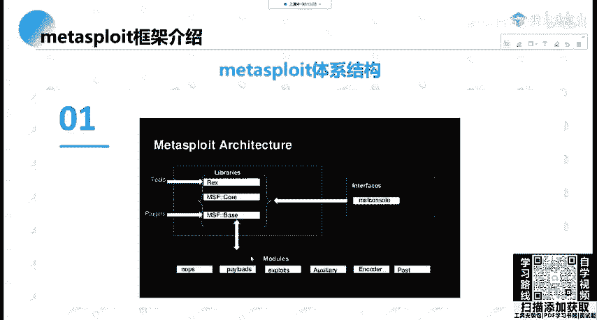

我们首先来看如何进入MS console松。首先我们需要对数据化、数据库进行初始化。当然这里你如果不做是也没有问题的啊。我们有的时候不需要保存到数据库里，那这是也是没有问题的那数据初始化很简单。

MSFDB initialit这个就进行一个初始化。

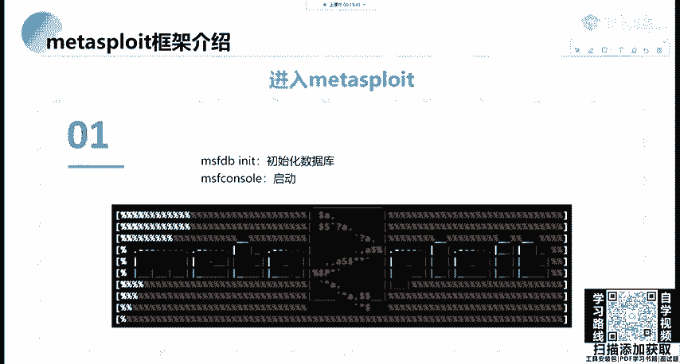

然后在他这里面直接输入MSF console宋进行启动。那这我就不多讲了，就这一条命令。

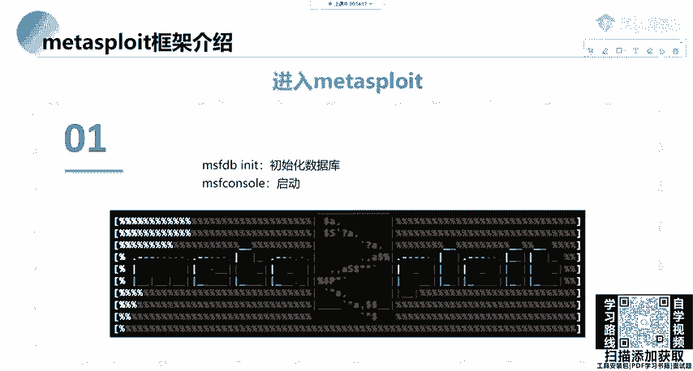

在启动之后，我们会推出shall来到MScon的一个命令行里面，我们来试一下。

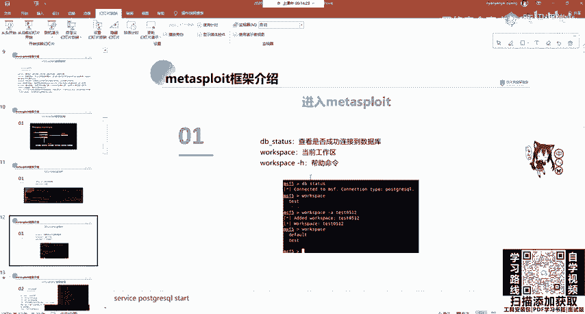

这个大家如果。嗯，去做过这个MSF的，应该都非常清楚。

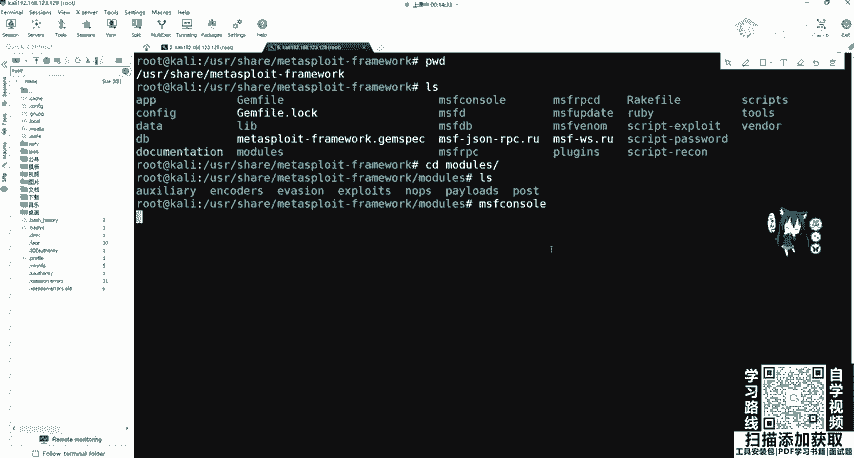

这么我们会来到1个MSF的一个命令行模式。好，我们继续来看。在这里面呢，我们可以输入DBt去查看是否成功连接到数据库，就是连接到我们的。

MSF使用的是postgra circle，那我们使用DB。可以看到，已经成功的连接到post gra circle，当然这里不连接也是可以的。workspace查看工作区，我们是处于default。

也就是MSF的默认工作区。我们可以进行创建其他工作区，使用workspace杠A，也就是艾创建其他工作区，并且切换至其他工作区。这里大家都可以不做。因为对我们后续的渗透测试及后渗透都没有任何的影响。

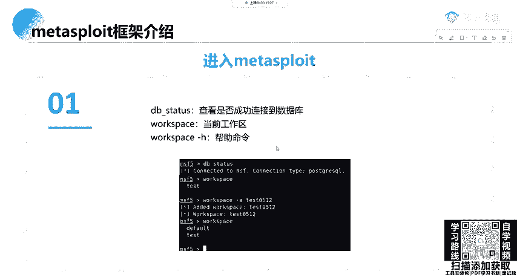

内网主机发现，那这里metta split当然它能满足我们渗透测试的全过程。我们在第一阶段讲到渗透测试，首先要做什么？面试官HR首先问你什么，就是问你如何进行信息收集。

那MSF作为一个全能的信渗透测试框架，那信息收集肯定也缺不了。首先，收信息收集的一个不扰的神器，N mapmate split里面也是自带的。

但是我们使用它需要加DB杠N map它的一个使用方法和我们在信息收集中讲的N map的使用方法是完全一样的。只是它扫描之后，会存储到我们的postgram circle里面。

那我们来简单的进行1个DBN。还，可以看到它有个usage。那个H看到这是我们和这个N map是一模一样的。那，这里我就不多讲了，因为跟我们n麦这个已经讲过了，大家如果忘记了话，可以去。

看一下之前我发到群里的PPT。同时，Napp的所有功能，它这里也都分别支持，分别端口服务和版本探测。包括SYN半开扫描，还有TCP扫描。同样也可以调用nm的的参数去检查是否有常见的服务漏洞。

比如SMB445端口的。一些漏洞。在我们信息收集里面，可以不利用N map。因为这个DBM map实际上还是调用了N map工具进行一个扫描。那我们刚刚在介绍MSF的时候，就已经说过，M对MSF的操作。

主要是依靠它下面的models。models里面有辅助模块，辅助模块我们一想肯定知道辅助模块里面有什么，有漏洞扫描，弱口令扫描有端口扫描。那我们是不是可以利用模块进行一个扫描？那我们这里看一下。

如何去利用模块呢？使用use，我们想用什么？想用辅助模块，辅助模块下面的什么呢？是cancanner，我们需要扫描扫描什么扫描端口。是吧这些都是一些常见的一些英语。我们使用什么草描，你不知道的话。

直接按table，按table它会告诉我。告诉我们，我们可以使用半开扫描是什么SYN对它是不会在我们服务机上留作留下痕迹的一个非 pin扫描，也就是只发TCP的第一次握手包。如果你不知道的话。

也非常简单，使用searchsearchport scan，也就是端口扫描。Oh。他会把这些可以用到的models都为我们列出来。那我们回到刚刚的use这个半开扫描。在来到半开扫描之后。

我们需要对指定IP，也就是目标机进行扫描。那我们这个叫做设置。我们想看这个模块需要我们设置什么，就是查看设置show options。Show options。那这些。那这些我们来看一下我们需要配置的。

pos这指定的是1到1万。are host这个叫目标目标的地址。那我们需要设置目标的一个地址，后面现程。延迟okK这些而且最大的一个端口数。那这里我们去设置它的一个。目标机器它的1个IP地址。

我比如是扫描这个win7，我们来看一下它的1个IP地址。它129，那我们可以设置一下它为129。然后进行run，它就会进行一个扫描。那这里因为时间去过长，那我这里就不做扫描了。

当然你也可以进行一个现程的一个设置。比如20线程。OK你再去看一下这个配置，也可以看到这里已经变成了20。启动模块使用的是explode攻击或者是run运行都可以进行扫描。它们两个是一样的。那我们对。

端口进行扫描，同时是不是也要对目标机器的C段进行扫描？C段扫描可以用什么？可以自己写脚本pin。可以利用CW scan，可以利用Nm自己带的这个参数进行一个内网探测。那同时我们。

MSF肯定也提供了这个探测一个收集模块，也就是discovery发现。它同时同样也在我们的辅助模块下面的canner。

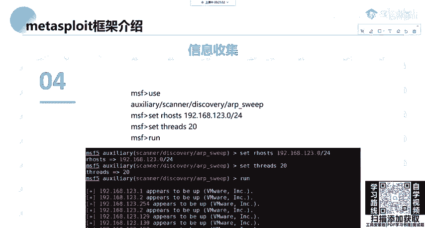

里面的一个内容。那我们这时候就可以进行一个搜索搜索。

Search。不Discover。那，这里我就直接用，我可以返回到或直接在这儿直接用，或者是返回到上一级。use我们的辅助模块cancanner。Discovery。然后我们可以按t键。

可以看到我们可以使用哪些东西进行一个主体发现，可以使用UDP或者是LRP。那我们最快的最常用的肯定就是LRP了。可以show options进行一个查看，这里也需要我们指定一个目标的机器，延迟。

包括县程。然后run就可以对目标机机器的一个C段进行扫描。Yeah。这里大家应该没有问题吧。

啊，我们继续来讲，因为这个流程还是要过一遍的。大家如果听好之后。可以进行手动的一个操作，这些就是一个渗头测试的一个流程。

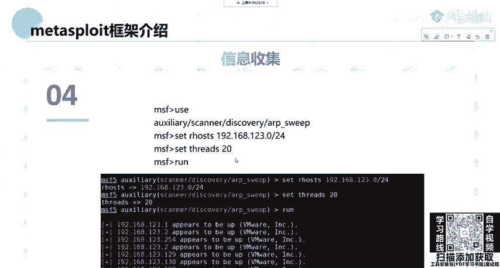