# B站最全网络安全教程，整整1300集，全程干货无废话，别再盲目自学了，看完学不会我退出网安圈！（web安全｜渗透测试｜内网渗透｜CTF） - P65：64.msf攻击获取meterpreter .mp4 - 网络安全官方教程 - BV15u4y137cQ

那么MMSF攻击的最终目的就是获取我们的matpre。大家要记住，我们不论渗透，只要使用MSF对目标机器进行攻击。最后目的就是拿到matepre进行一个后渗透。

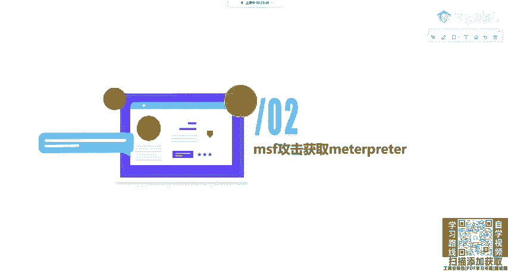

那我们如何拿下对方的电脑呢？这里就是一个常用，也是一个非常简单的一个模块。MS17010有恒之南漏动。那这里我们还是以它作为例子。因为它是一个十分经典的例子，包含了我们整个MSF的一个攻击流程。

那我们来看一下它吧。首先。

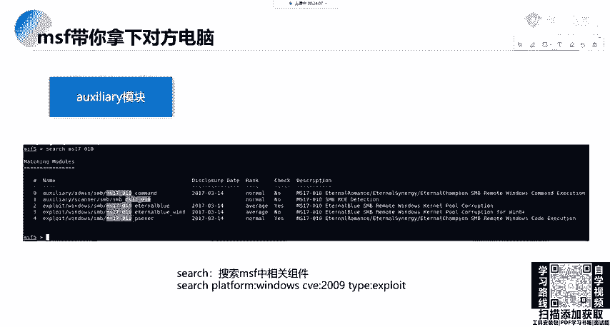

我们需要啊这里就拿这个机器。

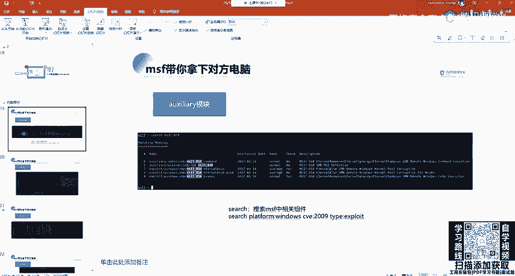

来进入我们的MSF。Oh。使用之后，okK我们来 search一下。我们的MS17010。可以看到两个辅助模块，一两个工具模块，那辅助模块是用来干什么？用来检测我们这个目标机器是否有SMP漏洞。

这个永恒之战路能，那我们的攻击很显然就是攻击。那我们首先来检测检测是用什么？我们就拿这个cannerSMB。S，M B。M17010进行一个配置的查看。

配置查看这里upport这个目标端口已经给我们指定了是445。那我们需要指定什么？指定目标机器的一个地址，指定线程，或者是如果你有usename和password的话，也可以进行一个指定。

那我们这里就指定一下目标机器的一个地址。有什么s设置设置什么？设置areco。目标的一个地址设置为是什么？我们设置有这个机器，就这个。啊，这个叉T的。大家就是看一遍这个流程，131啊。Okay。

设置好之后，是不是可以run或explode进行一个攻击？可看到它会告诉你，主机似乎有M017010漏洞。那这个时候它有这个漏洞，我们需要干什么？需要利用利用使用什么使用export模块。

那这个模块我们在刚刚的se置里面已经看到了。这个有PPSESECpower share命令执行。还有只是简单的永恒自蓝，那我们随便去利用一个，我们来去看。windows操作系统SMB。MS17010。

我们可以按t键进行选中，那么选择power share的一个执行。那这里我们说op思一下。可以看到他要我们指定的是什么？它有什么？有一个叫做modode options。

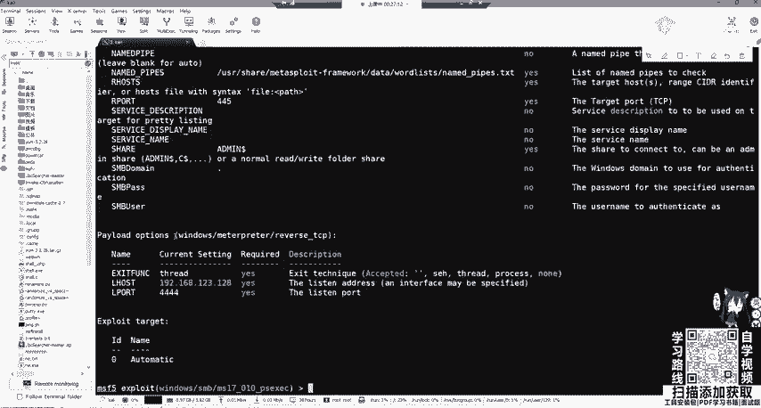

叫做这个模块的一个。设置。

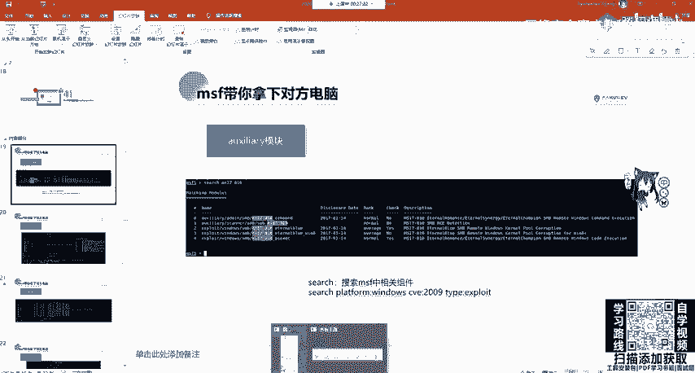

OK那那继续。模块的设置拍lo的设置，还有目标的一个。目标这里是设置为自动。那我们piload options是包含了我们airhoairho叫local host，也就是指定我们本机的IP地址。

airport4444，指定我们本机的一个端口。那这里用到了pload windows meta reserve tCP也相当于在我们这个公积机上面开启了44端口。

用来接收我们把机反弹回来的 share。那我把机里面的地址应该如何配置呢？肯定是在model options是配置areho这个那我们来配置一下set our host。配置我们这个。131的一个地址。

配置好之后，那我们可以进行一个执行。嗯。它会帮我们自动打，可以看到131的1312端口连到了我们的公积机的44端口，并且我们的这个命令输入已经来到了mattterpre里面。

那m printer是一个后渗透模块。那我们可以在这里输入问号去查看mattter printer能为我们做些什么？OK这些命令。给大家来看一下，首先核心指令。background等等。系统文件指令。

文件系统指定，也就是查看文件，查看靶机文件。移动文件下载文件、编辑文件、上传文件等等。Networking command。网络的一个命令可以是设置代理查看IP查看开放的端口、配置路由等等。

systemcom系统命令可以清除后台数据。设置环境变量至查看或者是关闭进程，或者是关机，甚至重启机器。这里都是对靶机进行操作。用户接口命令，这里主要是对我们鼠标键盘进行一个监控。

目标机器的实时监控或者是屏幕的截图，或者是关闭鼠标或键盘等IU设备。Web cab。webcom也就是我们的摄像头设备。我们可以打开摄像头的麦克风。打开摄像头的流输出或者是控制摄像头拍照。

甚至录一段视频。那接下来也就是一些权限提升命力get system和。密码数据名令hash down。那我们来具体看一下，举个例子。

OK那我们先过一遍这1个PPT。

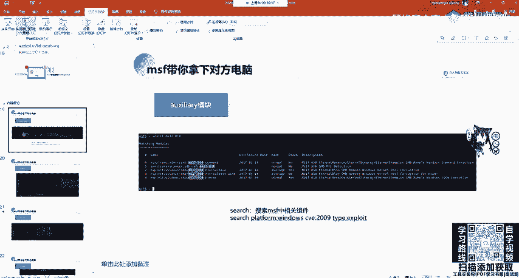

首先我们可以在。MSF5的里面进行search，搜索MS17020这个进行相关的组件。

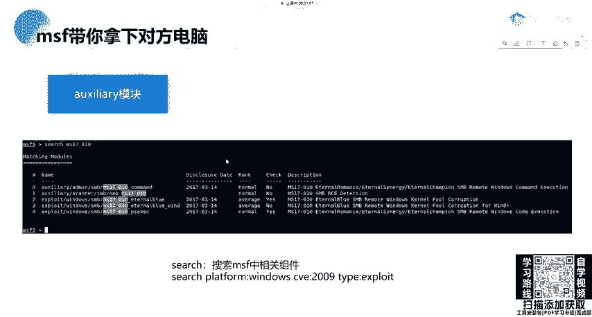

然后使用辅助模块进行MS17010漏洞的一个扫描，是设置我们目标机器，也就是rho的一个地址，设置线程或者是不设置进行run或expl进行攻击扫描探测是否有MS17010漏洞。如果有的话。

我们就可以使用。使用什么使使用一个，当然这里我们在探测的时候，在设置Rho的时候，可以设置网段，也就对全网端进行一个探测。这里我们设置网段目标为192。168。24。0-24。

这里的24是指组网源码255。255。255。0，也就是探测192。168。24。1到255。

这里我们设置要设置线程要稍微高一点，不然的话它扫描非常慢。那我们通常是10至20，如果设置太高，有可能会误报。这时候我们就可以对全网段进行一个扫描。在扫描之后，我们发现拿到这个有漏洞的机器。

那我们就可以调用攻击模块进行攻击。那有的同学说。MS17010这么简单，现在还有吗？是有的。大家如果在做渗透的时候，你外面啊我们公网的机器是肯定没有这个漏洞的，而且云服务器自态防御。

你见过现在还有云服务器有这个漏洞吗？那没有了，即使自己是搭的搭搭建的话也没有这个漏洞。因为如果有的话，早被别人日穿了。那它主要存在哪里？主要存在我们内网机器里面。大家对内网机器都觉得有那个流控。

都觉得有IDS就不做防护。那我们就可以利用这个模块进行攻击。特别是一些啊公司的机器，不是个人电脑那些老型机器，基本上如果没有修复，都有这个漏洞。那我们在。进行探测之后，需要调用expl进行设置。

设置我们的目标机器进行攻击。

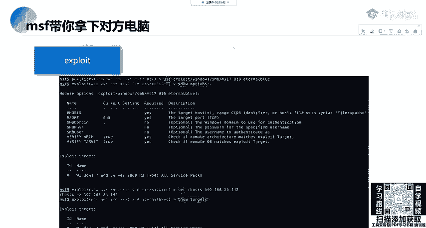

攻击之后，它会拿到我们的mat printer。

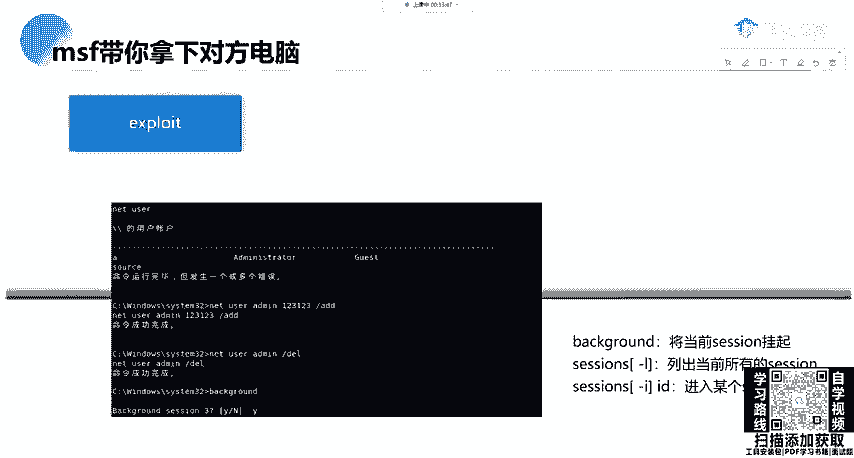

拿到Mtter print。之后我们可以干什么呢？大家会觉会知道啊，有的时候你拿到的并不是mappre。如果你直接调用永恒之蓝的话，你拿到的是啊，对，win7是有的。

windows server2012windows server2008叉P都有。如果你自己从MSDN上面自己去下是有的这个漏洞，你可以自己去看你搭一个win7的虚拟机，它里面就有这个漏洞。😊。

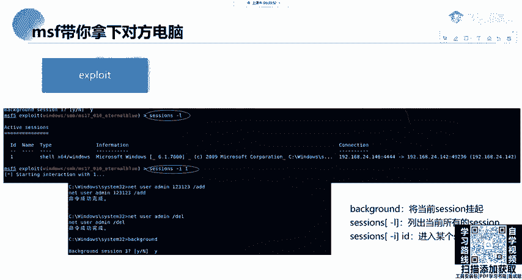

ok那我们这个。如果我们拿到的不是mate split，那我们可以进行什么？可以进行一个转换，把它转换成mate split。那如何转换呢？我们现在啊现在我还是来到这个已经攻击好的这个matprint。

我们可以把它切换到后台，也就是background，它会保存看backgrounding sessionession一，那session一就保存了我们的这个matpri，我们可以进行进行转换。

如果它不是matprint话，我们可以使用sessions。😊，可以查看我们现在已经活动中的sessions。那我们如果想把它转换成mate，也是sessions杠U，加上我们的进程。

加上我们的sessions IDD，也就是一进行一个转换。当然我这里已经是mate了。我们想进入session的话，直接session一进来还是能个mate。😊，那这个mateprint。

我们就可以做很多的事情。比如输入share可以执行我们的CMD指令。这时候我们来到了是不是就那个靶机了，我们可以DRR看一下sttom32存放我们coDLL文件。😊，或者是whoMI进行指定的一个执行。

当然这里因为编码的问题，你看到的肯定是一个乱码，当然我们可以去更改标签页去改成UTF杠8，这样的话就可以自动显示了。那么这里可以进行退出。

它会来到我们的mattter printer进行background返回到我们的MSF5的一个界面。

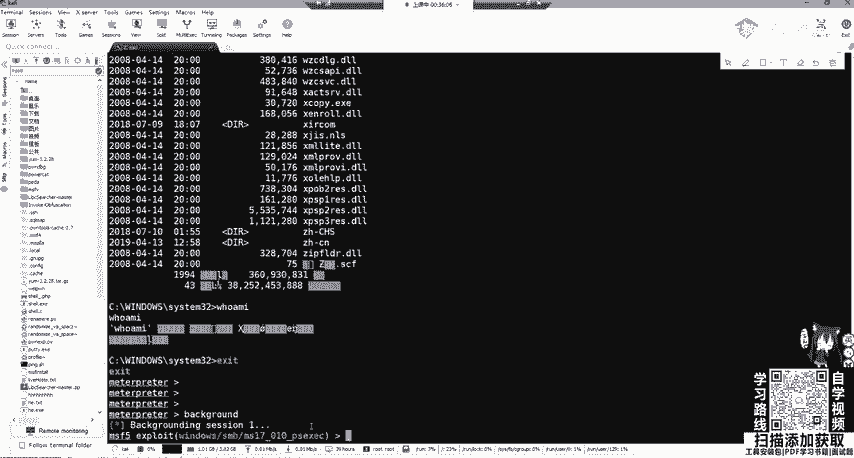

那么这里个呃。攻击的流程就讲到这里。那MSF常用的命令呢，这里也给大家在过程中也都讲过了，可以showex是查看渗透攻击的程序代码，查看辅助模块查看我们的模块，可用选项和设置。

查看pis可以用的攻击载和查看tarrggets目标机器，还可以进设置MS17010进行模块的搜索info显示模块的详细信息和用法use加我们的模块名是用我们的某个攻击渗透攻击模块dck可以回退。

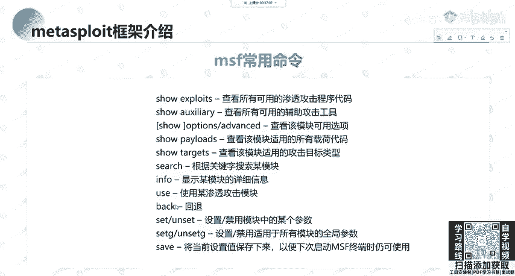