# B站最全网络安全教程，整整1300集，全程干货无废话，别再盲目自学了，看完学不会我退出网安圈！（web安全｜渗透测试｜内网渗透｜CTF） - P66：65.msfvenom介绍.mp4 - 网络安全官方教程 - BV15u4y137cQ

啊，我们继续来看攻击windows或者是linux操作系统的一个实例。嗯mate split是支持全平台的，它不只能攻击这两个呃操作系统。

也可以攻击我们mux架构的路由器公共设备、安卓手机或者是呃一些mac OS这些类unlinkux操作系统都可以进行攻击。所以它十分的强大。首先我们要看一下MSFV known，也就是。啊。

嗯毒病毒毒液的意思。它生成了一个后门。MS win known是MS pilotload和MSMSF in的组合，这两个工具集成在一个框架式的种。那他们两个大家应该还记得是什么吧，一个是攻击载合。

一个是编码编码和加密，也就是一个负责攻击一个负责绕过杀毒软件或者是IDS。这两个工具集成在一个框架中，形成了MSwin。也就是用来生成后面的软件，在目标基础上执行后门在本地监听上线。

可以理解为一个远控木马。OK它就是一个生成木马的软件。我们只需要那利用的思路大家要清楚是什么，找到漏漏洞点，用MSV known生成木马，将木马想办法搞到把它上传到我们的靶机上面。让他下载也好。

你主动上传也好。上传到靶机上面，在靶机上面运行。在运行之前，我们需要有公积金去接收它，那它运行我们就可以控制它了，也就拿到了我们的mate print。那这里我们首先来看一下呃如何生成我们的后门。

但基本参数我自己在学习的时候是非常不喜欢看这个杠help制定的。因为他把这些参参数丢给我，我也记不住，记不住怎么办，没必要记，也没必要去看，你只需要多用两次，知道这些常用的。你知道常用的。

你不知道是什么意思也没有问题，就多用就是多做。说了再多都是要经过实战。如果就是一直去到岗位上实战，那你诉这个能力是得到飞速的提升。那这里的参数啊还是给大家稍微的过一遍啊，带一遍。首先，杠P。

那MS win是pload和incode的一个组合。那么它最重要的不就是incode和Pload吗？那我们只看他们两个刚Ppiload就指定piload攻击载和支持全平台啊，这不是几乎了，就支持全平台。

那L这个是几乎所有的这个命令都有的参数list列吗？我们的英课的在哪？杠一英刻的指定编码加名方式。啊，我们常用的。我们对不同的平台，它有不同的操作系统，有不同的系统架构。

那么们需要指定系统架构杠I什么是系统架构，叉86系统架构mps IM是吧？IM你的安卓手机IM架构，苹果要新发布的mbook pro IM架构。那我们通常用的windows操作系统。叉86架构。

你用的乌乌班图，用的卡利叉86架构m4。华山的设备。啊，有的是用米普斯架构，但有的是叉86。啊，planform很显然指定目标的操作平台，你是NT操作系统，windows NT还是linux操作系统。

还是m克S，这都非常简单。那我们接下来就都不看了啊都不看了。大家还要有一个注意的，就是刚I设置编码的次数，编码次数如果读越多，那还就是对这个拍lo进行几次编码。如果你不编码就是一个木马文件。

别人一看杀的软件一下就给杀掉了。你编码的次数越多。他刷的软件越看不出来嘛，并不是。杀毒软件它是根据一个特征码进行识别的。大家要知道，每个文件都有MDO码，它病毒肯定有一个关键的算法，它有一个特征码。

它是根据这个东西给杀掉的。你编码次数多，不代表就是绕过理论上是绕过杀软的可能性更高，但实际并非如此。因为现在杀软也非常的牛逼。比如火容，它就挺好的，是吧？挺好的，但是他不是所有的东西都能烂的。

那我们就看这些参数，其他都不看了，用到不知道自己去搜啊，自己去搜。你说能记住是谁也记不住。那这里就举三个例子，分别是linux windows和mac OS平台的paload。

MS文轮这个命令杠P指定我们的一个piloadpiload指定指定什么linux啊，linux叉86叉8的加勾，我们要干什么？要拿到met operator。使用reverse TCP。啊。

反向TCP也就是反弹shall反弹sha这个地方还指定其他两个参数。那么反弹sha刚刚在做MS17010的时候，我们使用的什么？是windowsmate reserve tCP我们需要指定什么？

指定local host和loc pot，也就是我们目标要在哪一个目标机器上开启计验听呢，肯定是我们公击机啊，也就是local啊本地目标本地地址。那，下面呢logo po。

我们需要在哪一个端口上开启服务开启监听。呃，开启键听杠F fire啊，你指定你输出的什么类型ELFEMF是什么？ELF是linuxux操作系统的可执行文件。

包含了可重填重定向文件动态连接库文件和普通可执行EF文件。相当于我们windows操作系统的DIL和EXE。这两个在window操作系层下，我们统称它为PE文件。而linux操作系统操作称为EFF文件。

称为EFF文件。好，这里。没有问题吧，使用大于号从定从定向符，定向到我们的shall点EF这个文件。那么shall点EF其实就是linin操作系统的一个可执行文件，一个码。

那下面您公司第二个也非常简单了，就是不一样的，就是ban的TCP是主动连接正向正向Sll正向shall。OK这个我就不多讲了。它下面windows操说很简单呀，把linux改成windows就行了呀。

一样的是m克，那很简单呀，改成m OS mac OS是什么OSX呀。如果你有macbook的话，肯定知道呀，就这样OK。它使用主播不是mate。

是使用shall reverse GCP你这里不记不住se一下啊，list一下或者是。tablele一下都会出来，再不知道去百度看一下，它肯定都存在。在这里。嗯。攻击手机、无线网络、电脑。

这些不在公网的东西。那我们需要先找公网的东西啊，你不可能直接打断内网吧。就像我现在讲课，你用你的电脑能打到我吗？不能打到我吧，我是内网IP。我的IP是内网的，你打不过我的，你打到我，你要穿透呀。

你要找我们公司的公网。找到公司公网的漏洞，一层层的打进来，进行代理，进行逐步代理，进行内网穿透，最终打到我。那这个过程是非常复杂的。但是我们渗透测试要做的就是这个事情，就是一个内网的渗透。

在第一节课或者是开课的胖白老师也有可能跟你跟你讲过。那个web和渗透的区别就是我们渗透需要做内网渗透啊，就是这个区别。你加阿姨加多少次都被秒杀，这是嗯不然呢IDS那么贵嗯买了都扛不住，那还卖什么。

别人都不买，要花那么多钱去买IDS，结果什么用都没有，是吧？😊，现在的棉纱。你这样做他的做IDS的，他就会把这些生成出来，是执行那个去确定它的一个。

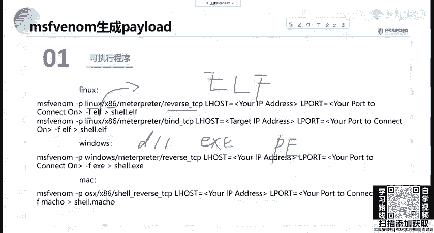

特征码进行一个查查。那这里我们简单举个例子。使用杠P指定我们的windows。windowsmate reserve TCP指定logo host logogo po当XX是指定模板。

现在我们想生成个木马，你这个木马什么功能都没有是吧？连个图标都没有，别人一看，你放在邮箱上面，别人敢下载吗？肯定不敢下载呀。那我们可以杠X把一个把一个已经正常用的。比如说系统更新。

比如说PP study，你作为一个伪装啊，作为一个伪装，作为一个模板，也就是。他一看，即使它尾装正常功能已经已经错掉了，但是它的大小还有图标是一样的那就可以进行一个呃射工对方。

相当于呃杠E刚刚已经说过了，编码叉86。那，这里编码我就不多讲了我就不多讲了。因为它真的没有什么用。就像刚刚有的同学说，你刚阿里多少次都没有什么用。当然你可以进行一个多次编法或者是一个循环。

或是编法之后再利用其他的进行呃加壳呀，或者一些进行一个综合利用，还是有一定用处的那这里我就不多讲了。因为它编码速度非常慢。我们这里虚拟机都是没有IDS的OK那我们这里简单进行一个生成一下。现在正整一下。

MFV。好，杠P指定有什么windows。Mtter parade。Rese TCP。指定什么？指供我们的logo host。等于我们本地的地址。logo pot这里等于我们就比如说555啊。

你不要设80什么的，有可能会冲突啊，有可能会冲突。然后进行一个什么我们不编码编码大家可以自己去查看incs。我可以说除了那两个特别有用的，其他的基本现在。嗯，用处不是太大，除非综合编码。

你有可能用到用到的时候再去看，你不可能把那些编码都记住吧。哦，我记不住OK那我们记不住就不看。那刚F输出输出什么？这里我们输出ESE啊，EX你就直接写ES重定项，比hello点ESE。

那叫他这人生存着吧，生存着。😊，晨那这里我们要干什么？要开启监听。那经厅如何开启？这里给大家讲一个叫做。expl里面的mty里面一个叫hander，它会等待我们就是一个监听。我们要使用这个模块。

使用这个模块。去指定一个piload。那这里我们不指定它其实就是一个等待的一个握手状态。那么需要指定它的一个piload。那现的拍load，我们这边的piload要和什么？

要和我们这个木马生成的这个piload是一样的啊，它已经生成好了。那这里肯定有一个piload。点ESE啊，肯定是跟这个是一样的那我们直接把它复制过来。😊，知道吧？要开启静听。复制过来之后。

我们来看一下需要指定什么，指定logo po logogo po指定为什么，肯定跟我们M5V这个是一样的是一样的。那我们来s一下设置设什么local host。19号点168。点123点128。

Local， local park。lopo设置的是吗？是555555啊，我可以run一下，或者是E叉Pexplodeexplode杠G放在后台，就是你不会在那一直等着，你可以去操作其他东西。放在后台。

他会告诉你，sd reverse。TCP handleer有个TCP的监听，监在555端口。那这个监听他这个工作它是不工作，它放在哪？放在后台工作jobs，我们看后台输入jobs可以看到它。

是一个等待连接的。反向TCP端口正在监听。那我们这时候把这个ESE放到我们靶机里面进行运行啊，放在我们靶机里面进行运行。那我们把它拖到靶机里面吧，我这里一会儿再给咱大家讲怎么如何攻击啊。

把它给拖到靶机里面进行一个运行。😊，hello点ESE然先拖下来啊，这里我们已经拖好了，也生成好了。把他拖到靶机里面。嗯，这个8G可能有一点卡。谁没拖进来呀。OK他过来了，我们双击他。啊，他是64位的。

64位的呀，我搞错了，这里应该是叉86叉86加构。应还是叉86的。那我们看一下是哪一个，我给搞搞混那test一。那我们生产的这个嗯运行应该是它为港测。可以，那我们重新生成一个吧，重新生成一个。

指定我们的叉86。那这里持续的开启监听。啊，他是没有的。没有的那我们利用这个进行一个查看。可以使用杠Lpilos列出所有的pilos，然后GREP是GAPP是什么？是我们的啊一个正则查找。

查找我们想需要的内容。然后使用I wake这个字符的一个寻找print到了一可以搜索我们想需要的拍lo，那直接把它给复制过来。搜索我们的windows pilot。OK这个因为他这个。冒号都是有问题的。

我们只需要把这个办的TCP给改一下。改成我们的windows。这时候我们就能看到它windows应该有哪些H叉P可以供我们用啊，供我们用。

这里有windows materesve hTPres这个这些大家可以看一下。啊，只是给大家过流程。那我们呃用这个机子有这个机子上的吗？用这个机子上。

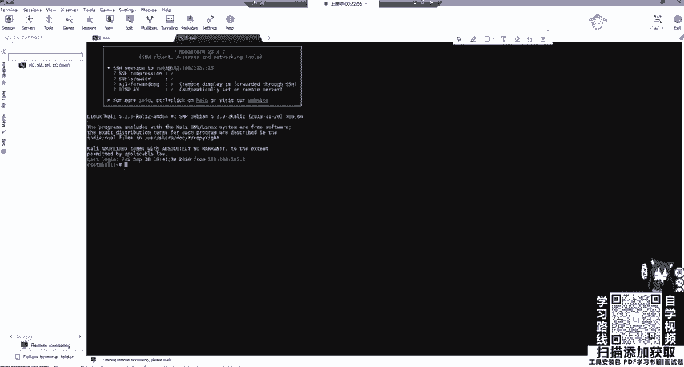

O。啊，稍等一下。

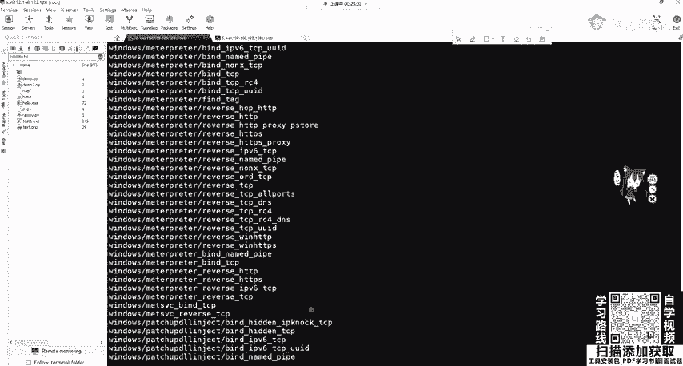

那我们先。往下讲啊。像我还要讲。那他。做的这个是生成木马，我们就是要想办法。那这里刚好马上给大家后面讲那个真正攻击的时候，刚刚给大家补上这个可能这个编码有问题。这个嗯给上传到我们的靶机，上传到靶机之后。

公击机开启监听，开启监听，也就是等待我们的shall弹回来。这里设置的内容paload Air airpo一定要和MS win这参数是一样的。然后进行run进行等待连接。我们要上传到靶机，然后进行运行。

上传到我们target然后进行运行。啊，这里大家应该都没有问题，相信。啊，这里我们来解释一下。这个就是MSwin可以帮我们从大量的这个有效载合，也就是piload里面进行合并。

我们需要指定piload和回联主机的端口，主机名和端口文件模板文件。当然我们模文件可以不设置啊输出格式及编码。那我们最需要的是哪一个一个输出格式，一个配置，还有piload，这些是必须的。

那我们一开始us的这个explode multi handleer是一个负载处理程序，也就是等待负载链接。我们最后拿到的mattter plate是mate meta split的后渗透这个工具。

可以通过创建一个新进程，并调用注入的DFL动态文件动态装载库，来让系统运行注入的DLL文件，也就是运行我们刚刚的getULDUID或者是打开摄像头等等。那这里可以生成we博牌的。YYp及我们。

木马只要去运行它即可，也就是web share。嗯，可以生成PHPSPGSP还有m搏应用。那这里分别使用PAPPmate reverse TCP。

还有我们的ISP就是直接使用windows的一个metpre。那这里大家可以看到，我们PHP使用RSW进行输出，而ISP使用ISPX进行输出，这是为什么？IW的意思叫做未经处理。

大家如果使用相机进行拍照。拍出拍出来的未经处理，保存明暗信息的就是RIW它是无损化的。那PAP这里很显然就是生称PA3嘛。那有没有PAAPP这个模板这个输出模板没有的啊。

我们要以这个RW未经处理的模式进行输出。

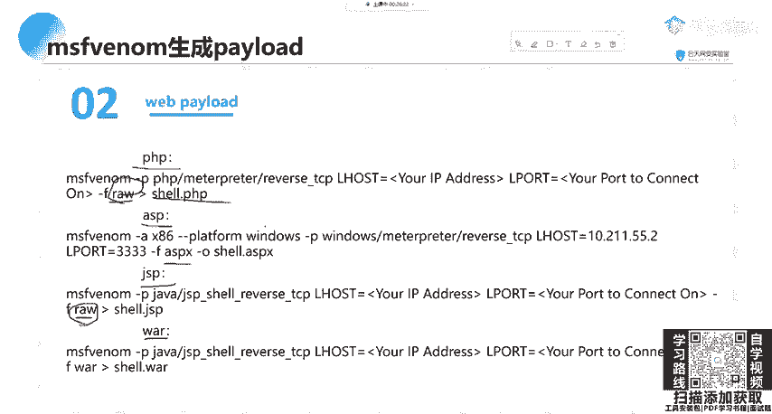

那这里我们可以生成一个shall点PHP，然后进行回联。那这里给大家简单就做一下这个吧。

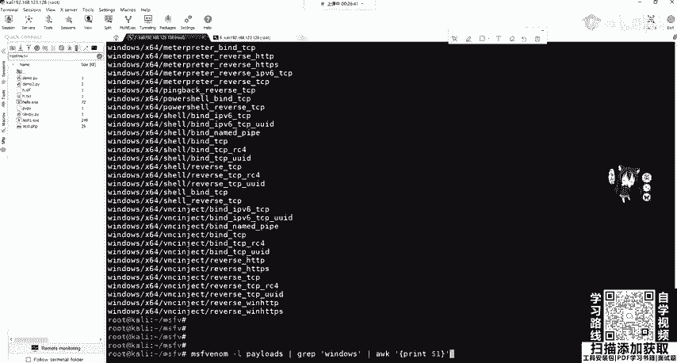

还，直接。这就直接你复制过来。能让他运行，因为我们这个是不对的。128。55PHP生成的一个木马文件，就在就在这个地方生成吧，就A点PHP。然后我们将I点PAAPP上传到。

把机的HTR3W目录下进行运行，它就可以拿到我们的shall啊，就可以拿到我们的mate。嗯，这里我们还是做一下。这个I点PAP已经生成好了，我们把它先移到本地。A点PHP。那你可以可以查看一下哈。

OK他其实就是。调整一个啊socks。set进行一个连接。那我们这只是给大家讲上传到这个地方，然后我们进行一个访问，尤为就在本地访问。哎，这个变得特别卡呀。

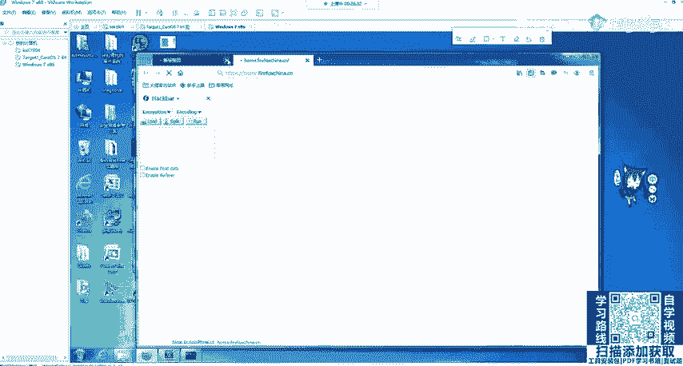

27点0。0。1A点PHP。进行访问之前，我们这边要干什么？这边要先一个啊监听。要先监听。这里我们还是使用这个my handle，只是我们的拍load呃发生了变化。我们使用我们的这个。在他拍了。

你粘贴过来。然后我们 show options。和配置我们的airho，还有airpo，这里是5555是没问题的。然后我们run一下。嗯，他会告诉你，你已经使用了这个无5端口，那是哪个使用的呢？

肯定是我们刚刚那个搞的鬼呀，我们把它jobs。杠QQQ什么Q0，把这个给停掉。OK这时候都没了都没了。那我们把这个 run起来。OK现在它在监听55端口，那么在这边啊运行一下。

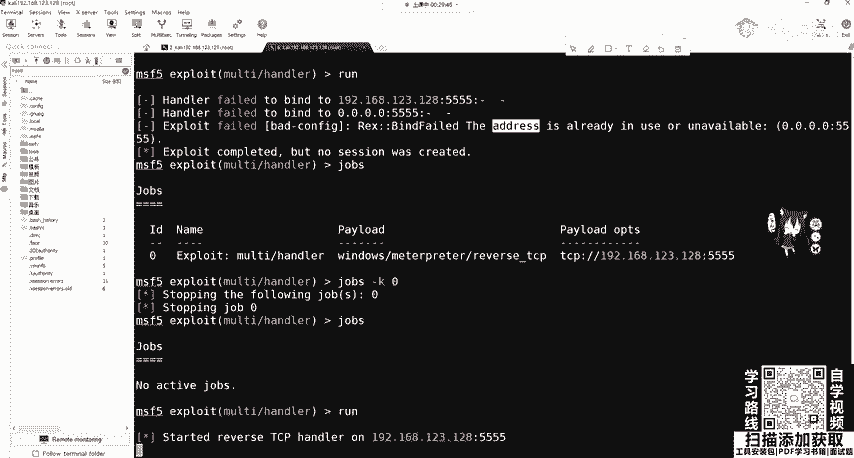

这个I点PHP。我们看这边。你要稍等一下，因为他在打开这个代理。What。那PHPC的关掉了吗？没有关呀，天。😔，等一下，我把这个服务给启动一下。这个容易被查杀呀，这个并不并不比小马，小马也容易被查杀。

这些都容易被长杀查杀的。那我们运行一下。还不行啊。这什么意？同时加这个东西。

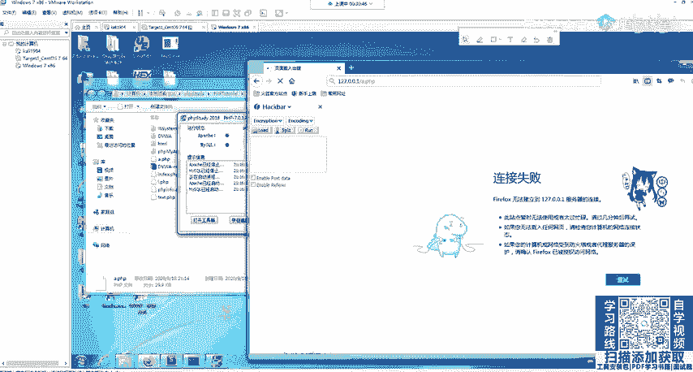

O呃看到这边还在转，但是我们这边是不是收到了session来到了这个matrate里面。O来到materate里面。是不是来到这里面了？可以看一下。

ad administratorist可以back把它放回去呃，session一已经是1个PB呃m已经拿到了。

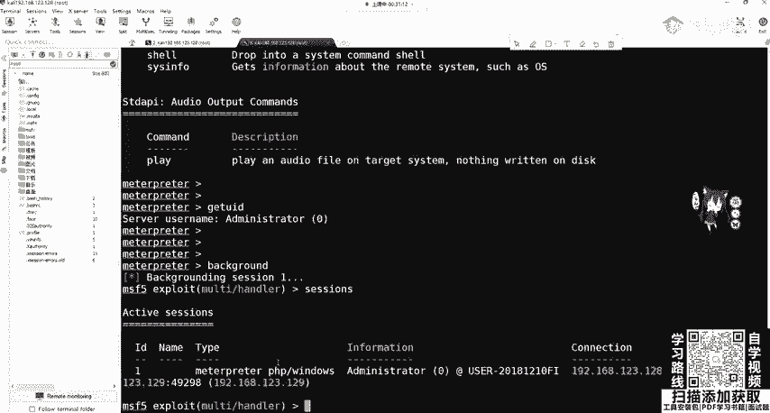

那这个就是作为一个攻击思路，你可以在那个靶机上面上传啊，利用文件上传或者是呃文件写入，你去或文件包含进行把它执行。那我们就可以接收到这个mattter，就可以接收到这个mat print。

这个大家应该都没问题吧。这个就是常用的思路。有如果在HDEP就是在巴黎端口呀，有个TCP是你自己开那一个端口呀。如果就是你的那个服务器。就是怕被查插的话。

你可以使用re reverseHGP它就端口不同啊，一个是HTTP协议，它80端口，一个TCP，你自己指定TCP端口，可以指定555。OK这些马上都会讲。呃，这里拿到了我们的wi padd。

那同样可以使用脚本pilopython dash和PER这个一些脚本的一些。这些很简单，就是修改piload即可修改成pason的 mat create reverse tCP然后还是指定我们的logo host logogo pot dashash是CMD啊。

这里。Rever size。这里刚F大家要知道是生成RIWRIW。如果你生成passin的话，你可以自己去看生成pas性的话，它生成的是Cll code。其实它并不是一个脚本，要记住，这是RIW。

大家可以自己去试。

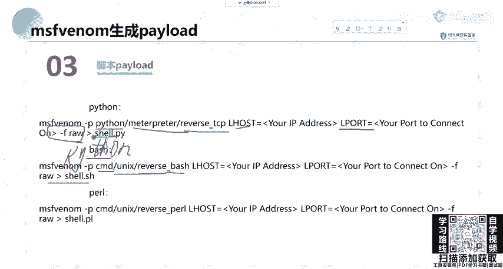

然后如果我们去设置这个。生成MSF规定之后。我们在。公击机上开启监听，开始监听赛 pload拍lo是什么？

赛 pload就是他赛 logo house是他cycl logogo port是它一定要完全一样。然后我们进行runrun之后，将它生成的这个pathon shell啊。

pathon shell我们给复制到我们的靶机上面进行运行，就可以拿到我们pathon的 mat operator。啊，这是同样道理。那大家再去查找，包括刚刚那个同学说的这些有什么区别啊。

这些palo有什么区别？那这里啊给大家讲东西。😊，我，刚刚在设置的时候。这里大家应该都有哦这个问题啊。

比如看到这个windows叉64mate reserve tCP大家要记住这个再看上面windows叉64mate reserve tCP它跟下面有什么区别？是不是就少了中间一个杠？

那这个杠是什么意思呢？这告你觉得他们两个英语是完全一样的。其实它在MSF里面是不一样的东西，一个叫做分段排lo的，一个叫做不分段排load的。那我们来看一下他们分别是什么？

这也是给大家就是做渗透的时候一个。

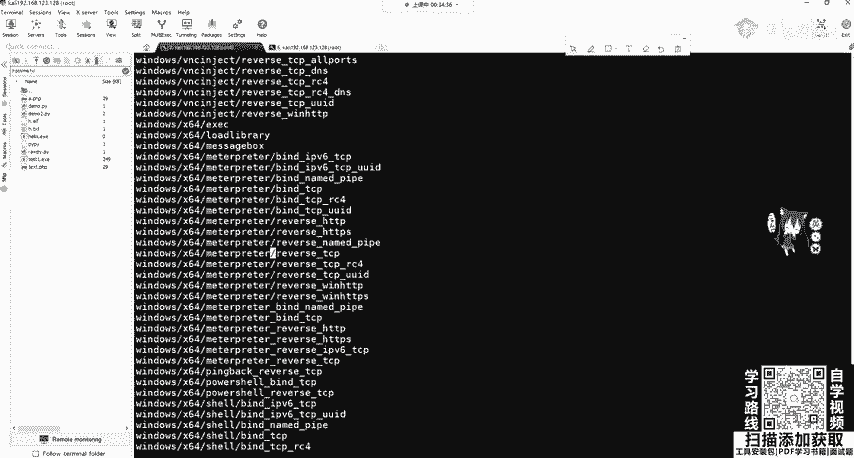

呃，讲解。因为这个如果你用错的话，你会发现你接受来m。它经常断掉，就是你正在配置路由，突然断掉了，那就很难受是吧？很难受。那就给大家讲一下。

就合理的使用这个stagtagless和t的这个pi load。那piload分为两种，一个叫做分段排load，也就刚刚看到杠比较多，一个叫过分的排lo连起来的。他很难理解。

那连起来的也就是windows meta没有杠reserve tCP，它其实呢就是一个二进制文件，它包含了matepre所有必式的部分和必要的扩展，全部都捆绑在一起，也就是一个完整的排load。

而分段的呢，它只是它的功能只是建立一条与攻攻击者之间的网络链接，其他的什么事情都没有。然后我们获取到的m printer是另外一个阶段，也就是它会传reserve TCP80TCP等等。

那如果你不能理解的话，那。不部分段的和分段的那就相当于不分段的相当于我们web里面的PIP大码。大码是什么？你不用web shell管理工具，你一连上里面可以查看目录，可以执行问命令，可以上传文件。

甚至可以齐全等等，功能很强大，但是它体积庞大。那不分段的呢就是小码，小码是什么？一个ever一个stem，一个assert就一句话，这一句话你连上之后有什么用吗？没有什么用，你是不是要给他传参数啊？

是不是使用外we shell工具啊，使用引键是冰械去连呀，就这个就这区别。那很显然它是它它这个嗯这个你看一下吧，这个分段和不分段。那很显然有什么区别？PHPIB就拿PP大码来说。

它用于干什么是非常的大的。我们上传文件一一般会做什么限制，是做一个大小限制。如果这是一般的文件上传都会先做限制的吧？如果你不做限制，你服务器只有20GB的硬盘，我一个人上传40GB的上去了。

它也不是木马，那你这个就相当于Ddo少次攻击了，是吧？😊，那他肯定要做一个限制。不做限制呢大码就没用了，让那小码就判断用场了，但是小码有用用用用有一个缺点，你小码干什么？

你要用web share管理工具，web share的一个原理就是像传入，就是像ever函数像stem函数传入参数。那你这个网络是不停的在连接。那你中间如果网络断了，怎么办？是不是就断掉了，就不稳定。

这是小码的一个缺点。那大码却大码优点啊，你什么都有。一切东西都是在服务端进行运行。你跟你跟你的公积金没有关系，你这个网络不稳定的时候，你就考虑大码啊，这个也是一样的，网络不稳定就考虑不分段了网络稳定。

分段的好小，而且不易被查查，大码肯定容易被查杀。

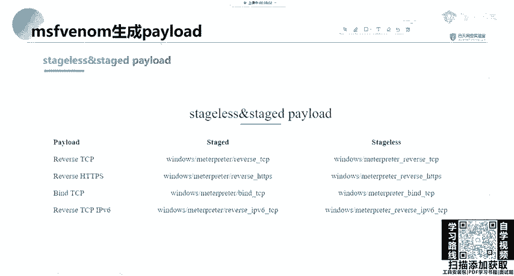

OK那这里大家应该都没问题吧。那这里。😊，这一些参数给大家，其他参数可以给大家简单讲一下，一个是保持的一个监听端口的存活，还有是防止进程被插死，这些都不用记啊，不用记。还有一个是放到后台的一个。

嗯session这个PPT会发给大家，到时候大家可以试一下。