# B站最全网络安全教程，整整1300集，全程干货无废话，别再盲目自学了，看完学不会我退出网安圈！（web安全｜渗透测试｜内网渗透｜CTF） - P69：68.msf攻击windows实例.mp4 - 网络安全官方教程 - BV15u4y137cQ

那我这里就讲一个啊例子，就是攻击windows这个实例。让大家看一下吧。targe attack的IP我这里都写好了。那这里我们来看一下方法。方法一，我们的突破口在上一章中讲。

突破口基本上都是we部或中间件的突破口。也就是说我们可以通过外国站点。外gle站点可以干什么？可以通过命令执行、漏洞、无文件的方式进行攻击。或者是使用上传点进行上传web share进行攻击。

上传web share这是上传什么？上传是不是刚刚我们那个MS win win这个生成的这个码？第三，可以攻击其他的端口445M17020拿到matepri。总结来说就这三三种。那我们首先看8法仪。

在发法仪之前，我们是要干什么？需要对端口进行收集。我们需要知道它哪开了哪些服务，哪些端口，开80端口。那这个Mm我就不跑了。S这跑时间很长。杠SV大家还记得吗？

探测版本杠T4第四速度探测加上它目标地址或网段进行探测。探测之后，我们可以看到开到80端口，开了445端口。开了3306，马是不上口。并且操作系统是window操作系统。那这时候我们可以进行渗透。渗透。

我们首先数出来的突破口是哪里？80，为什么？因为80端口是漏洞最多的端口OWSPtop10都是80端口漏洞，对吧？都是外部漏洞。搜狗注入叉词是SSFCSF等等。所以它最好的利用点。

那我们首先访问站点寻找可能点，怎么寻找DIR search。预见上包括目录。包括目录我们可以看到一些啊可能利用的一个路径。这里我就以DVWI靶场。这里大家如果对外部有所了解的话。

应该知道DVWSOWSP的一个靶场，它里面有各种漏洞，你可以进行练习，可以设置一个难度进行练习。那这里我就拿这个DVWI来看它里面有个命令执行练习模块啊，命命令执行漏洞。那我们进行访问。啊。

访问之后访问之后我们需要干什么？需要把这个seity改成这个low啊，改成low。😊，很lowlow之后这是com injection，他叫你拼1个IP，那我就聘127。0。0。1，这个就拼自己。

我们拼自己这个肯定是乱吧，因为他这个那个编码不通，编码不通。那我们命令执行是要干什么？😊，是进行一个命令的拼接。我们可以用and进行拼接。and什么？我and。比如按呼i啊。就是执行完前面一条命令之后。

继续执行下一条命令，进行命令拼接。那第一条命令执行什么？执行P127。0。0。1。第二条命令执行呼MI呃subit提交一下，看一下，肯定两条命令都执行了。😊，都执行了。

是不是或 my administrator，那这里问题来了。我们有命令执行权限了。那这里时候我们就可以利用mat split帮我们来进行攻击。我们来看如何进行攻击啊。这个我们利用执行漏洞，结合上张知识。

我们可以做什么呢？是不是可以生成piload的脚本piload的PAP pilotload的pathonpiload。这里我们就遇到一个web delivery，就是跟。

这个marty handle一个不同的一个。model一个模块。webal deliveryivery是什么？就是当攻击当攻击者拥有部分受害者主机攻具时，我们能不能进行执行shall能执行。

但是我们有没有拿到shall，没有，我们只能执行单个的命令，这就是来到了当我们拥有部分的控制权，但还没有拿到一个完整的shall时。weable deliveryelive就是这种用。😊。

那wever delivery论日的目的就是快速和受害者主机连成一条session。比如。存在的命令输入、命令执行的。我们就可以用web delivery构建一个稳定的命令建立连接。同时。

wib delivery它不会在靶机上面写文件，它是将服务器的代码加载到内存中执行，是有利于照过检测的。它支持PHDPthon pass shell等多种脚本。ok那我们现在来看一下。

首先啊想他DVW是PHP站。首先想来什么？用PIAPP。没错，我来用PHP来试一下。

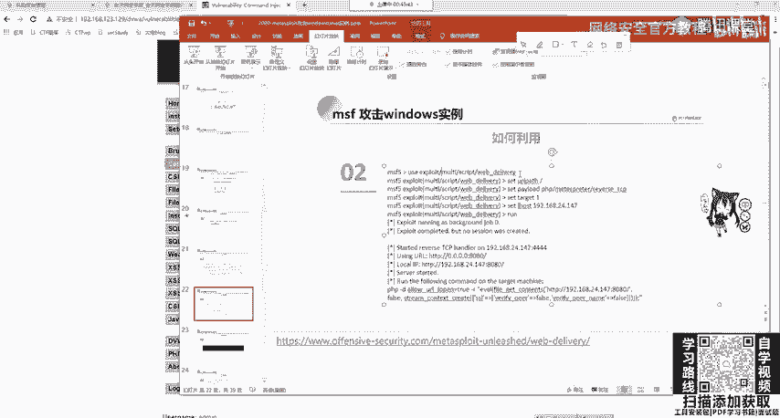

啊，这节省时间，我直接都复制过来。不好，直接。这又。

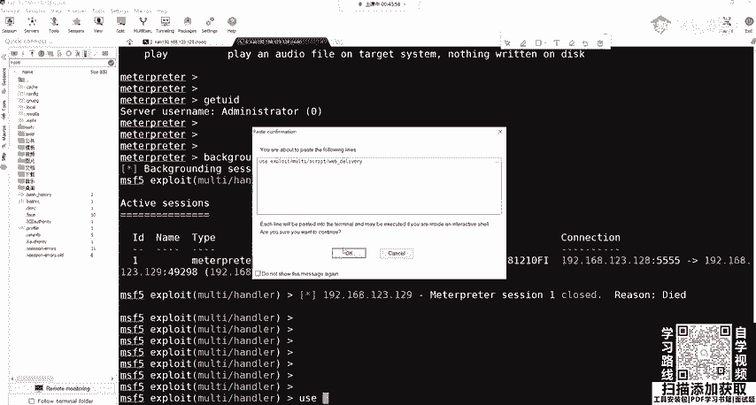

这复制这么麻那么麻烦。啊，多打了一个优3。然后这里我们show optionstion，是需要指定排lo。我们这里默认是python，我们PP站有python。没用，即下次拍log改成PHP的。

PAAP的啊PAm reverse TCP啊正向的一个。I show options。指定什么？指定logo post logogo po就指定这两个东西。那么下logo host。

Sa a logogo po。那这里是我666这个然后how options啊，都没事的，我们rap。让一下啊，这个他告诉你不是一个。不是一个拍lo的那我们把这个。Ex派。啊，我们这个是搞错了。

这个是target，这下面这个target。那么指定它的一个target set targetet。我们指定它为PAP才行。

那我们可以s target查看一下s target我们 targetetE是PA，那我们就set targetet。一啊这就是我们的s optionstion样，看它变成PAIP这后我们run一下。

OK它要给我们生成一段代码，我们要把这些代码复制到这里运行。😊。

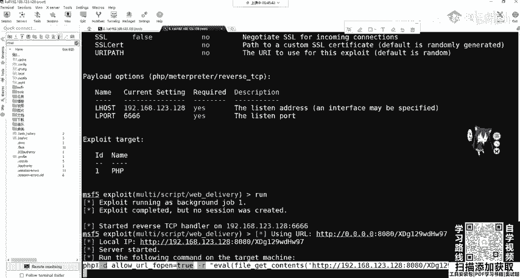

复制到我们这里运行运行什么？通过我们的web端口进行运行，P移27。0。0。1，然后进行按按的进行一个粘贴，进行运行。

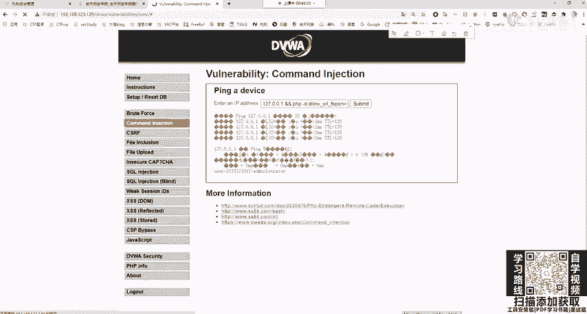

他这边会收到我们的啊一个指令吗？不会为什么不会？在这里我就给大家讲一下，因为这条命令我们复制到打机里面它能不能运行，我们复制一下，我粘贴过来。😊。

不能运行，因为它告诉你PP不是外部外部指令，也不是可运的文件程序。为什么？因为我们这里是使用的集成化的P study study它并没有将PP写到环境变量里面环境变量是什么？我们在装JDK时候。

大家应该还记得有个配置va环境变量那配置va环境变量我们在CMT输入va它怎么那么聪明就知道java是什么？那计算机没那么聪明，是我们自己去配置的配置环境变量，那么告诉他java是什么东西。

那P没有进环境变量，那肯他肯定不知道P什么东西，我们可以进行配置一下，你可以自己去试配置好环境变量之后，怎么配置很简单，在我们P study里面的这个P这里面不是P吗？你随便选个版本啊。

把这个路径复制到我们环境变量的pa里面就我们java是一模一样你再去运行发现它还是不行。为什么因为你并没有对全全部的用户进行一个。😊。

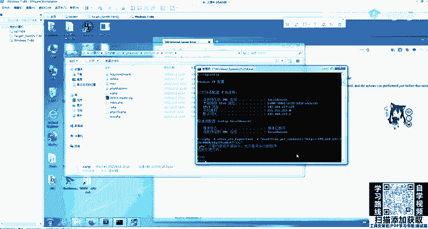

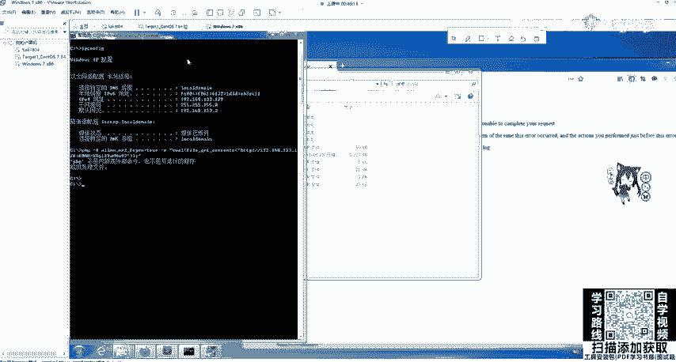

配置啊这里大家可以去尝试一下，如果不想这样搞。我们服务器上面有可能装有python，那好吧，我们把刚刚piload换成python那来再看一下，哎，这个就不要再搞了，我setPload。

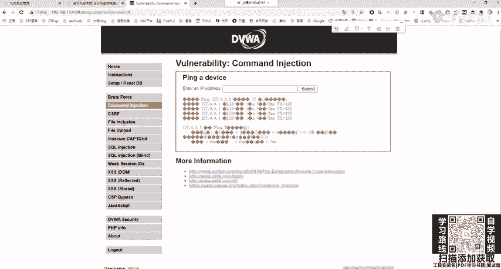

直接复制PPT啊，看一下这个他告诉你PAAPP它识别不了，或知道是什么东西。

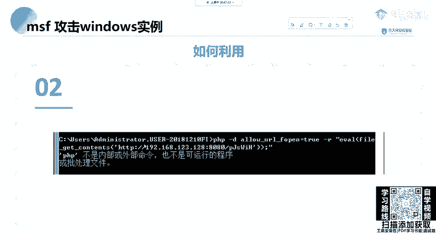

然后下面我们对拍lo的进行一个切换，切换成我们一开始的python。O这个可以尝试啊。如果他没有装python的话，你这个python也是不行的啊。你肯定这都懂啊都懂。因为他没有pasthon。

你执行pathon代码执行到哪儿？这show absence，我们loc house real report没有变，因为我们他帮我们记住了，下面我要改什么改tart，改目标，改什么改成python。

python是什么？show targets。pithon是0，那我们现在 targetsget0。OK吧。啊，他告诉我们正在用正在用，把它干干掉。jobo杠K。

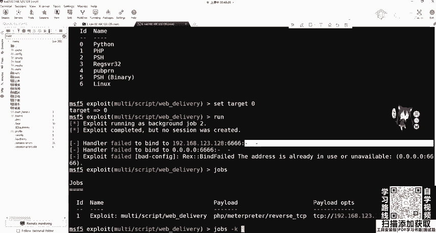

一啊这就没了。然后我们让让一下。啊，生成这个python这个这个代码。啊，把它复制出来。记住一定要一行啊，它如果不是一行的话，你要给它凑成一行。

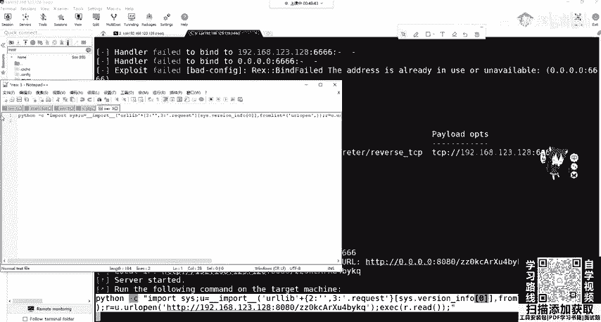

然后到这边我们进行一个运行，这边有没有run起来啊，有run起来。那我们P127。0。0按安的。就面。

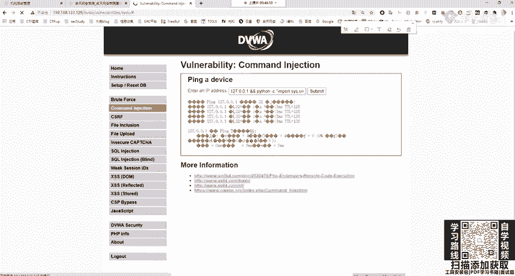

来看这边。OK okK我们收到了。😊，是不是收到一个matepre session2open，我们看sessions，是不是session2在。😊，来到这里。啊，来到这里。是不是很很有趣啊？就是这样。

你这样是是命令执行，遇到命令执行漏洞，就这样搞，就这样搞。是原告。那我们接下来。再看我们这个目的达成拿到了这个Y meta，和者拿到materate。当然我们还可以使用power shell进行执行。

那power shell你很简单，就是换一下你的targets不就行了吗？你targes我们看到有什么？有PHP，有python，有pyython这里我们background。我修t。

是不是有PIPPSH是吗？还是power shell啊power share。还有一些其他的东西。那我们只需要改一下这里就行了。但是power shell一定要注意。

power shell是我们一个系统windows7以上系统自带的一个命令执行工具。

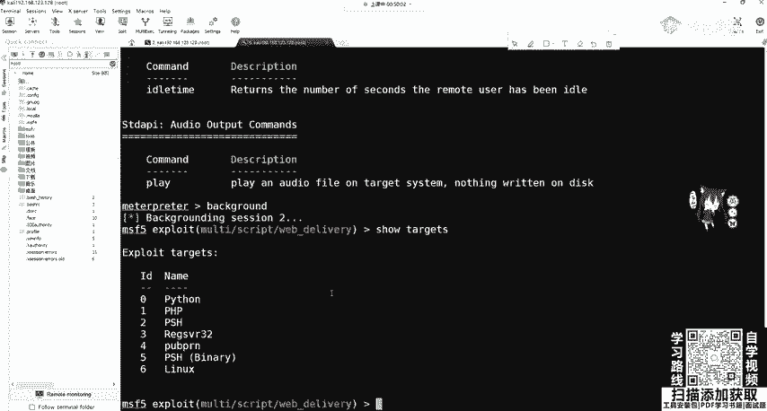

所有的杀毒软件都会燃烂它，你不相信你就可以去试。当远程执行power shell的时候，杀毒软件是肯定会燃的。因为power shell可以说呃调侃来说就是windows操作系统最大的一个自带后门。

它功能很强大，我们可以利用它做很多事情。所以杀毒软件都会拦他，都觉得啊你拿它做事情肯定是不好的事情。😊，就把它一刀切就感觉就十分安全了，是吧？啊，这是杀毒软件的一个特征。

因为power share你混淆很多，我们后面都会讲混淆很多，刷毒软件分不清怎么办？不如把power share一刀切安全。就像你把网线拔掉，互网的时候，把网线一拔安全。

如何批量的分IP最最好的批量分IP的脚本，什么是电闸，就是这样。😊，那我们方法2上传我们的web shell。啊，上传外部。如果你用DII设置进行扫描的话，你就扫描到你个HTML1个字目录。

那我们可以去访问一下。啊，可以去访问一下。哎，可以看到thinkPHD这个5。1。啊，他是肯定有漏洞的。那我们是随便给他找一个S啊，随便随便输一个可以看到他会告诉你模块不存在往下拉往下拉5。1。29。

5。1。又有什么？远程命令执行。不知道百度搜哎之前也应该讲过了吧，远程命令执行。那我们只记不住拍了的没关系。百度。OK那我们。thinkPH5。5。叉版本远程命令执行漏洞可以帮助我们开el。

它可以执行命令。比如说我就拿第二个在两排楼的执行的结果是一样的。啊，执行我们的C互MI。😊，al么你选可以命令执行。那这里命令之间我们可以干什么？可以利用刚刚的一个python来进行一个攻击。

当然呢也可以利用上传web shell进行攻击。那我们这里就来一个上传文件的吧。刚刚那一那刚刚那一种是不会上传文件的，但不会上传文件。有个问题，你达到metpre其实功能很少。

你发现你达到的是python meta。你还要进行一个后渗头齐全或杠U进行发包。在发包的时候，有可能就被IDS拦截了。那可以使用一个免纱码。我不死马进行一个上传。😊，那这里我们找到论用点之后。

可以利用这个。呃，上传有上传我们的PHPin进行。这里呢我们上传什么上传shall点PHP它的内容呢就ever post ever post。OK这我们把它上传一下。这个大家应该都知道了，这个5。5。

S的就是远程命你执行。think个PSB的这些漏洞，这漏洞很多，大家可一定要要记，可以去复现一下get up下面有一有现实的漏洞代码，一个现实漏洞代码。OK百度一搜一堆啊，这个博客freeb一搜一堆。

那我们把它执行一下。他没有报错。那很显然我们PDI post这一句话木马应该都清楚吧。ever执行当我们将我们传入的参数当做命令进行执行。那传入的是通过po命执行传入的C参数，把它当做一个命令执行。

把它当做命令执行。它传入了我们的catch file shell点PP那它在哪？我们这里，因为我是能看到我的靶机的啊，在真正的你看不到的这里我就给大家看一下。看一看有没有没有传过来啊，有没有传过来。

HTML。Public。可以看到下一点PHP在这儿盯着呢。哎，看一下来。哎，这个虚拟机莫名其妙的卡呀。OK是我们写的这个东西。是我们写这个东西，那我们写到里面之后了，我们可以干什么？可以连他可以连他。

嗯，可以点它。他告诉用我们，他没有找到C参数，这里你可以加艾进行屏蔽报错，它就没有报错了啊，就没有报错了。那这里使用web shell进行一个连接，啊进行一个连接。啊，这个工具库都有啊，这用一键连吧。

我连过嘛，连过了连过了。连过之后，那我们要干什么？要上传木马，是不是可以上传我们刚刚的马？O。那这些下面大家的思路肯定都非常清晰了。你现在已经干什么了，已经拿到web share了。

像web share的权限很低，你要干什么？要拿到mat printweb摄像能看摄像头吗？不能m print可以看吗？可以，那你要看到拿到mat print，那怎么办？我现在拿到web share了。

如果是windows操作系统，我们是不是有上传权限。一会是不是有上传权限，是不是有执行权限？😊，如果是英立克操作系统，我们是不是可以把木马上传到tom目录下，然后进行执行？

他不录下可读可写可知行左右用户。是吧OK这是我们的思路。那现在我们上传什么东西，上传这个码是什么？我们刚刚是不是讲过了MSF miniium生成的这个码给它上场执行拿到mate，这个思路非常的清晰。😊。

如何利用用sha尔进行连接，然后进行一个木马的生成。木马的生辰。嗯哪生车。啊，这里我已经生成了一个码啊，生成了一个码。

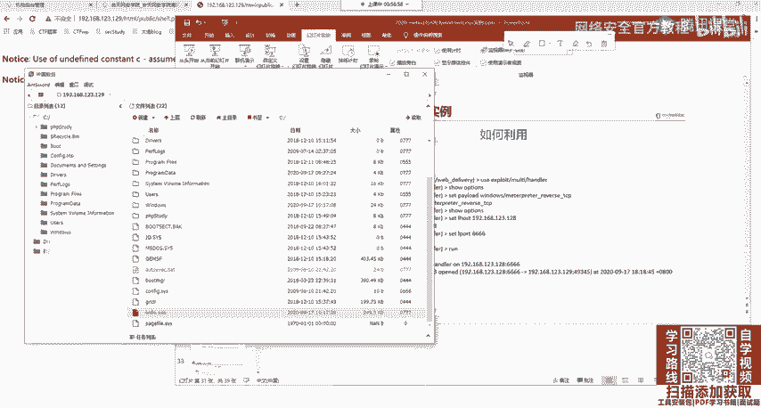

可，那大家。这里就给大家做一个简单的演示，那时间也不早了。嗯，实验室有很多就实验什么作业你可以自己搭环境，也可以去实验室看。都可以，您不想自己答案，你就去实验室多了，这些实验都有的。😊。

那我们这里就简单做一个演示吧，还是用我们的mty hand啊，m hand。啊，要show options进行seet pal pilot，我们不能再用这个PHP了。我们要什么？

我们要s pad这个啊这个东西。我们现在就用一个这一个大的这个东西了，最大的这个东西。就是部分段的排lo。这时候我们s options，看一下它里面有什么东西。

ok这个logo house logogo pot，我们把logo po改一下吧，防止它又出什么猫腻啊，防止收小猫腻。呃，把 set。locgo pot改成我们的啊8888。啊，让一下。他现在在监听了。

监听呢，我木马还没还没生成啊，别急。

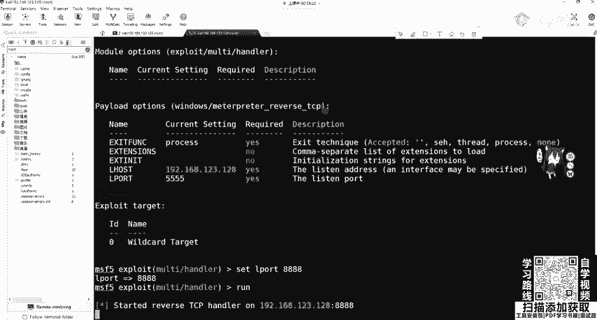

我把这个给copy下来。这边是不是可以修改一下呀？修改一下我们这个东西。那后面改一下啊，778888。输入什么输入ESE。输出啊，比如说ABCD。点ESE。你运行。呃。

运行之后我们来看这边会生成ABCDESE，然后把它啊上传到，现拖到本地再上传吧。啊，拖到我们的呃这个C盘里面吧，当然你拖进来，他肯定会查杀的，肯定会查上。我们来看他会不会给大家插上。啊。

这个还还没动就查查了还没动就查查了。我遇到这个。你到这里。为什么啊他这个会查查很显然。这是木马吗？你可以在隔离区里面进行恢复。可以看到它厂沙的路径并不是我们地盘的这个路径。

是因为我们这个mobil这个软件它在移动的时候，会把这个文件先存储到我们的user lesson这个mobille叉 to这一个文件夹里面，我加恢复添加到新云区。

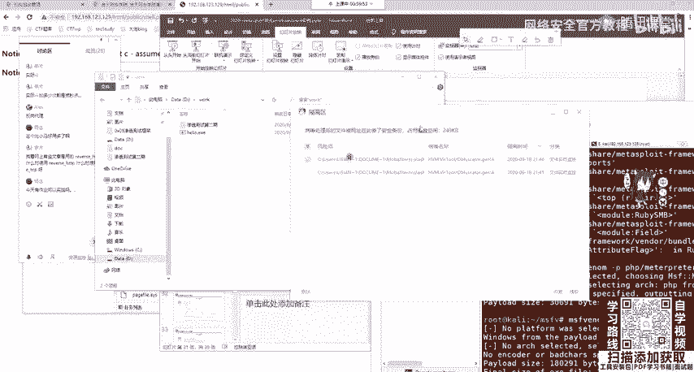

ok那我们再进行一个拖动。太可过来啦。可以过来之后，我们干什么？你们来到我们的一键里面点击C盘，然后你什么都不用做，直接上传人直接点上传文件就行。转说我们的IBCD。等他上传。它上传成功之后。

我们看一下它的权限，其实它就是可执性权限。那么在此处打开终端。打开终端知道吧？就是我们的web share，我们的web share。OK这里大家应该都知道啊，web share那我们现在要干什么？

要运行我们的啊IPCT的star或者直接运行都行。但系 a b c d 。呃，IVCD运行起来。O。要等一下，我们看这边灭了，这边灭了，并不是并不是给关掉了。这个已键大家如果用过。

应该知道你这个命令执行35秒没有回显的话，它会把你自动放到后台。不信我们可以这一个呃task keyt list看一下。嗯。可以看到我们那个IPCD在不在在不在。啊，IBCD是不是在这儿在后台运行着呢？

那在后台运行的。😊。

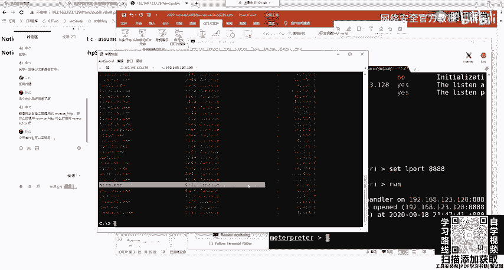

那我们这边很显然已经收到了maderate那，收到很慢，因为我们生产的是大码，知道没没有用分段的一个木马，收到是大码。那大码之后，那我们在这里OK可以做我们想要的事情了，是不是可以想要的事情？😊。

ge your I d。administr。我想提全get system进行一个简单的提全。这个期全是利用我们的注册表进行一个管道，大家可以去查一下它的原历，这时候我们就是最高权限sem了。

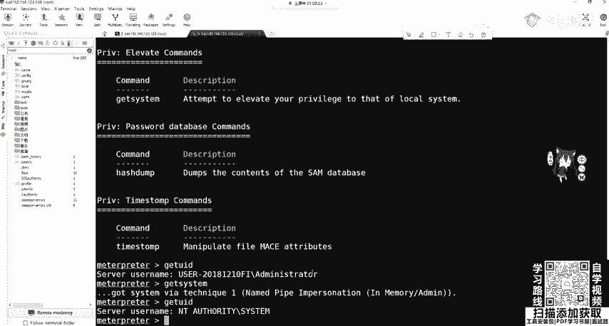

这C项目，但是大家要注意。如果你是网站管理员，现在我网站管理员，我又来到我的把戏了。我发现我把银行卡可能为别人中了病毒。

重病毒大家在小时候玩电脑觉得重病毒第一件事什么感感觉是不是启动任务管理继续看到底有什么东西在运行吗，到底在什么运行吗？哎看一下看一下哦。

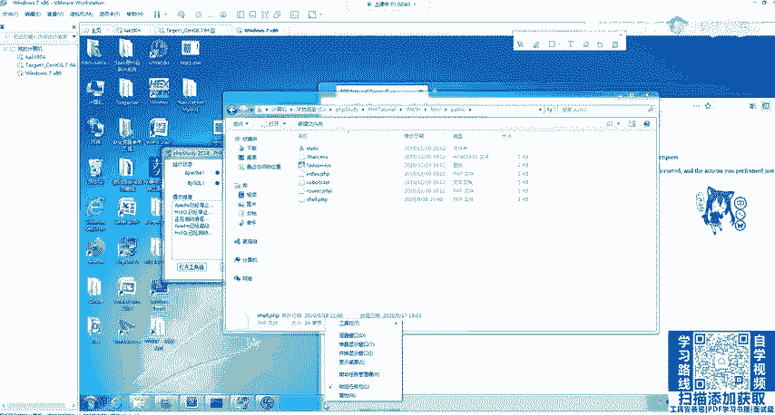

CMD正常。发hos火锅浏览器啊，我在看IBCDABCD是个什么鬼呀？IBCD是个什么东西啊？我把它给结束进程，我把它给结束掉。啊，结束点。OK那你就凉了，你这个RUCD被解束掉。

你这边的mat就断了是吧？三神3close。😊，端了，那这肯定不行吧。我们要做伪装。

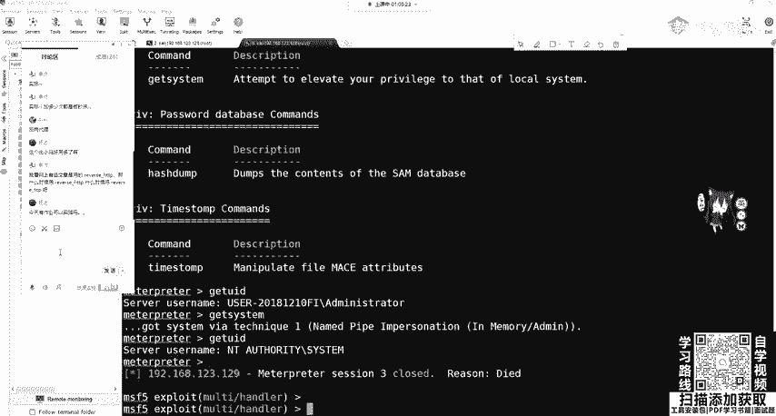

他如何进行伪装啊，我们来看一下。我们拿到之后，我们可以getPID去查看我们的这个。进程ID，然后进行一个进程的迁移，迁移到我们正常的程序中。来伪装我们这个后台程序。

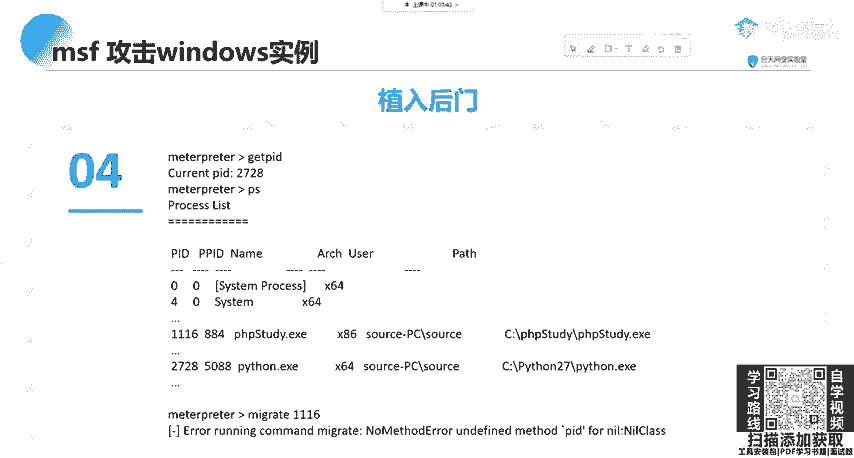

那如何进行迁移？好，我们首先还是把这个给跑起来跑起来。把这个跑线。

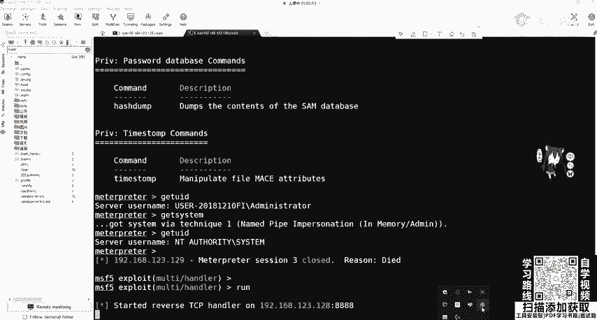

你的 web share在这还t。ABCD点ESE。大家有什么问题吗？这个目前没有什么问题吧。O他已经收到了，收到之后。😊。

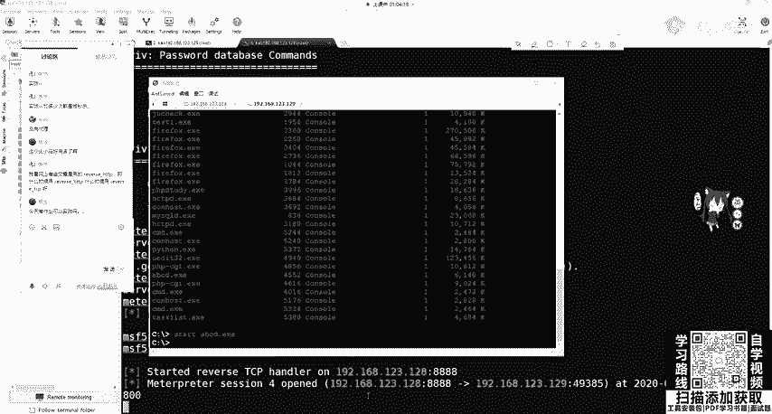

啊，稍等一下。他这个会有包发过来。

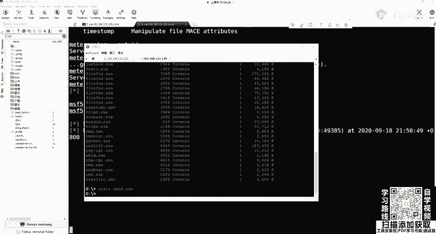

学到之后，我们来看这边的一个进程。啊，我们的IBCD有没有再出来呀？啊，又有又有了PID4512，我现在是管理员，我会把它干掉，要把它干掉的。

那我们可以ge啊PID看一下4512跟网站管理员在把地看到是不是一样呢？4512。那我们这样不行，我们要做一个进程迁移进程迁移。那进神迁亿我们迁移到哪了？可以PS看一下啊。

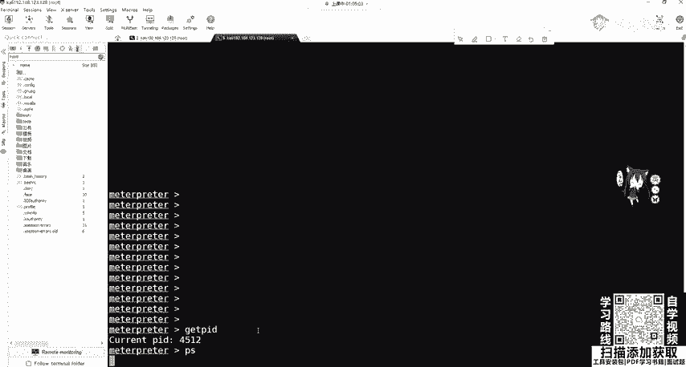

process看一下我们有哪些进程在运行。我们本身是什么？本身是IBCD是吧？本身ABCD。那么要迁移到哪呢？大家一定要记住啊。高的权限可以往低权限进行迁移，低权限不能往高权限进行迁移。

那我们现在的权限是什么？可以get your IDDus IDD看一下administ。那可以切换到stem你就最高权限啊，我们再get uID看一下是不是sstem了，那我们这些都可以往下进行迁移。

你想迁移到哪。我现在现在知道这个服务器上运行的网站运行这 singleP那我们想把它迁移到哪迁移到我们的app帕奇服务或者是PIP study行不行。OK肯定行。那我找一下PHP30在哪。

找一下PH3D。可以看到在这儿。他有administr进行运行的，我们s能不能牵迁移到administr肯定行啊，它的ID是多少？39963996，那我们m进行迁移，加上我们的3996。

把4512迁移到3196。有同学说啊，一个进程ID能运行两个任两个进程吗？我们分布式操作系统是可以的。可以附加的，大家可以去操作系统那边看一下它的原理。中合式操作系统，这是一个有算法的进行一个迁议。

那这时候他告诉我45112ABCDESE迁移到333996已经成功了。成功我们再getPID看一下啊，3996。Thank you。那我们这个PSH3的影没又断了，它没有断，他还在这呢，他还在这。

在这时候这个网站管理员再去看，再看ABCDMA的没了。已经没了，那他去查查木马，他会查什么，查查其他一些奇怪的或者系统进程，他会去查去关掉PAPP study吗？他如果关掉网站就崩了，他不会管是吧？

那我们这个met create就一直在这了，就一直在这。OK这是个进程前一，大家有没有问题？这是竞争权益。当然，matetter功能不仅仅只有这后面我们会在大家matepre客户一定要做编析。

因为我们后面的课程几乎都会贯穿它。都会用到它。我们执行之后可以。对后门进行一个植入啊，进行植入，可以植入我们的这个。后门。植入后门一般是植入到注册表里面，大家要知道。这种我们是有后门的，我们后门人在哪？

是不是shall点PAAP我们上传的？如果管理员进行了重启机器，他是不是还要开启P尔B斯R，那我们还是能连到它。但是我们上一期上一个方法里所讲的web deliveryel。这个东西是没有文件的。

它是在内存中运性的那管理员把它关掉了，那不就没了吗？那再重启，你这木马就被杀掉了，那很显然不现实。那更检查方法二更现实一点啊，因为你有后门，你要是怕后门被炒杀的话，你可以查一下注册表。

其实注册表更容易被炒杀。我不推荐这种这种这种方法。这种方法是我们在注册标里面写一个东西，已经使用嗯regregstry，然后写一个东西进行开机的运行，这我就不做演示了，因为它没有什么用。

我觉得还没有web线好用。然后我们如果进行一个重启，它就会链上来。点下来。那我们最后呢连上之后，我们要干什么？要对我们这个痕迹进行清除。clear啊以为它会自动清除我们一些痕迹。夜兴节。嗯。

这这这这是什么？那我们后面再讲，如果利用MSF进行渗透测试的时候，我们会将自己的木马发送给受害者。那由于我们的木马是临行临时性的。不能很好的保持持久在线或导致渗透过失失败。

或者是被管理员发现IBCD点ESE被干掉。那我们通常要做的就是将木马进程迁移到其他程序正常程序。一般你可以迁移到一些服务上面，HTEP阿帕奇、马蚁搜克上面。这然一来是防止受害者。

也就网站管理员可以发现可以进程关闭后门程序。二是可以有效的保持木马在线。那这里大家应该很清楚，刚刚已经演示过了。那今天的课程就到这里。课后作业呢大家可以自己去打靶击。并且做两个实验。也就是。

攻击的win7啊，这个我都放到放到我们的那个。呃，文档里面放到文档里面。大家有什么问题可以问啊，现在。啊，我放进来了放进来了。大家去把这个实验做一下。啊，内网确实比外国好玩，我觉得是的。

因为你内网有洞呀，你外国你打半天都没有洞，你找不到呀。哪受不住，现在防的比谁都好。😊，啊，是吧。那这个呃这个在大家在做这个实例的时候，因为。啊，这些作业我。这些是看着这个实验书进行傻瓜式的操作。

我是其实不是很推荐的。所以大家要通过做实验。或者是自己搭建靶题也好，做核天实验也好，一定要熟悉这个maask的利用过程。有可能你觉得很基础，没什么呀。这就是这个流程。即使做后面在实际工作中。

你遇到什么要免杀呀，无非就是这个整个的这个流程上面再加一些编码或者是免杀，或者你。进程迁移会留下会在系统留下这个记录的。如果。程序IDS包括。呃呃，卡巴斯机杀毒软件，它是有这个内存的一个。

内存的一个动态监控呢，你这个时候就没办法迁移了。你迁一的话，他就为你干掉了，他会发现你这个嗯这个木马驻加到某个正常进程上面，正常服务上面。但这个在内网中还是挺有用的，在内网中还是挺有用的。啊。

这个你说它好不好用，这是比较玄学的事情是吧？它有的。有的你比如说上了嗯这个wa夫，有的wa夫就很好绕，有的就绕不过去。有的你觉得这个wauff很强，但最简单的收入你甚至编码一下就绕过了，那这就很玄学。

所以要多次尝试，帮你的编码，你敢说哪一个编码就一定免杀吗？谁都不敢说。那有MSF有没有能力做到现在的IDS还有杀软全部免杀，是有能力的。但是大家都不说，如果说出来了。

如果大家在gethub或者是free book或看学上面，把这个东西对，cle我那个进行删除。或者是后面我们会有一张专门的讲，这个痕记清楚的，那个知道吧？是倒数第二章。

我专门讲就如果把你的这个足迹给抹掉。那我们。无非就是再附加一些东西，这整个的流程啊是不变的，整个的流程是不变的。那大家还是有没有什么疑问？嗯，觉得都听懂的吗？就是这个MSF有可能今天讲的内容比较多啊。

比较快，大家有听懂吗？有听懂的话呃，没听懂的话扣一下2吧。这个免杀大家不会说出来啊，对，操作有点多，大家要自己过一遍流程，过一遍流程一定要操作，要记住，不论你学什么操作是最重要的。

你看跟你做完全是不一样的啊。作为这个免杀技术是不可能透露的，你透露的第二天就不免杀了是吧？第二天就不免杀了，他一看这些360的安全工程师一看哇，免杀码出来了，赶净提取特征，加班提取特征。

然后进行写出我们的360或火容。然后你就不就不免杀了吗？是吧？就是这个道理，这很很好理解。如果你开发插作软件，你是不是。在对网上的秒杀教程都不行，基本上都不行。但是你说不行是不可能的，可以多种综合嘛。

后面会讲的我会讲。会讲power share棉杀。嗯，当然会这的，当然这个还是比较玄学。有的你你要说这个不可能有通用的这个这个绕过的。这个没有通用的绕过木马的通用的那丁小天肯定就被杀了。你今天通用。

明天肯定就是全部都不通用，就是这样的。那有没有什么疑问啊，已经10点多了。嗯，小课会讲小课会讲一些最新的吗？我们这个课程里面会讲一些。呃，我们固定的这个渗透测试的流程嘛。

因为我们这个是面对大家入门或者是。今天ma three就先到这儿。😊，但是绝绝对不要觉得masplay到这就结束了，远远没有。啊，内网后面都会讲。你到那个。嗯，腾讯课堂那后面那不是有个大纲吗？

后面有我们的课程。那呃后面那个有把机供大家练习。就远方向、渗透测试、安全服务这些。做做互网都是get share啊，get share。啊，对吧。就是渗态测试。那大家还有没有问题？没有问题的话。

我们就下课了。那我这就把PPT。上海上海你可以撒网呀，其实一线城市都挺好的，可以撒网。其实现在没有没有专门搞外包安全工程师的，都是做渗透。外国可以玩SRC呀啊SRC我们这个东西对SRC没有用。

你SRC你不能拿他的matepre，你不能给他上马，你上马，你被抓到了，别人的核心东西，你不能给他上马的。😊，打网撒网撒网，就上海公司很多嘛，你可以在。投简历投很多公司嘛？变成啥了？

那大家还有什么问题吗？没有什么问题，我把这个打包发一下。我发。甲方安全我没有了解过？我这一直都是做椅发。你可以问一下我们班主任呢，我们班主任还两个班主任呢，你可以问他们，他们资源多。专考就业。

多跟他多跟小姐姐交流一下。OK那我这个PPT已经上传到嗯群里了，大家有什么问题的话，可以在群里问我。嗯，这节课就到这里。大家早点休息啊，不要熬夜，头发重要。那就先下课了。

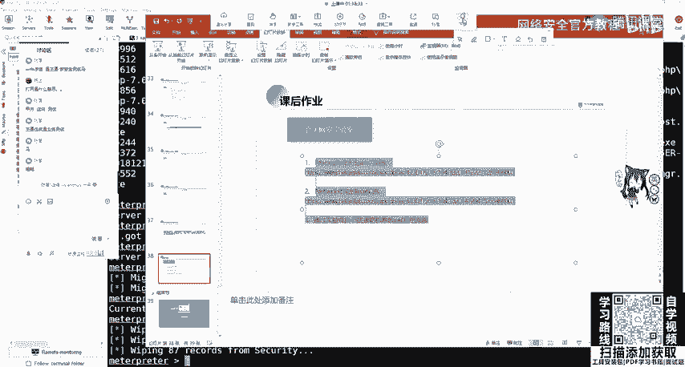