# B站最全网络安全教程，整整1300集，全程干货无废话，别再盲目自学了，看完学不会我退出网安圈！（web安全｜渗透测试｜内网渗透｜CTF） - P70：69.cobaltstrike常用功能.mp4 - 网络安全官方教程 - BV15u4y137cQ

那我们接下来来看co strike的常用功能。首先是查看CS的快捷工具栏。快捷工具栏这分别是分为。

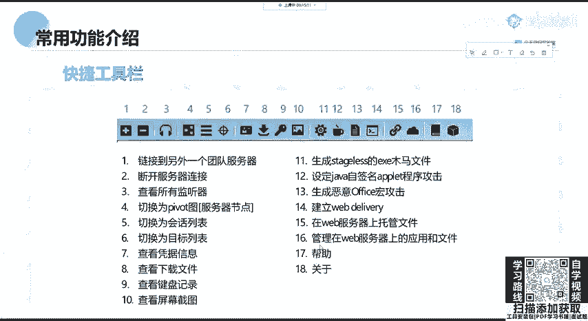

五大类我们来看一下他们分别代表什么。

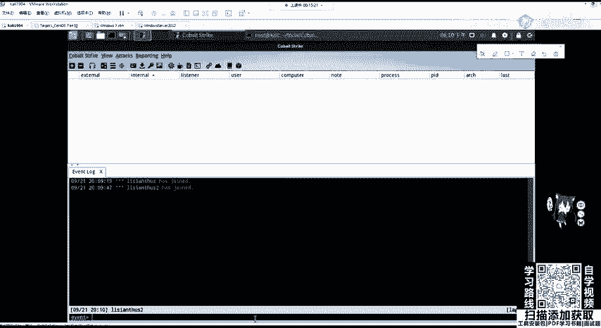

首先，一和二代表连接到团队服务器或者断开当前服务器链接。3、代表查看所有的监听器。我们需要创建监听器，才可以让靶机上线，去连接我们公网服务端上去开启的真监听端口。大家要知道。

我们做任何的操作都是通过服务器的IP地址去连接靶机去和靶机进行文件tage的一个传输和交互。所以这里大家推荐是把CS放到公网上面，是会比较方便让法机上线。4到6分别是CS的三个视图，分别是。

服务器节点视图，绘画列表目标列表。嗯好。Yeah。七和十分别是查看已获得的凭据信息，查看下载文件，查看键盘记录，查看屏幕截图。11是生成stage list的ESE木马文件。

大家还记得stagage list是什么意思吗？piload分为tage stage和tage stageage la。t list相当于PIP的大码，它是拥有拥有所有的功能。

包括mate operator。它的非常的大，我们不需要其他的管理器，就可以对sageless进行完全的交互。在网境在网络环境比较差的时候，可以考虑使用它非常大，并且容易查杀，并且容易被查杀。

第十二是设定加va4签名的程序攻击，这个已经淘汰了。我们这里不讲。1三是生成恶意的office红攻击。在microsoft的off里面可以设置红。那这个红实际上就是一个脚本代码。

我们可以通过嵌入恶意红攻击进行让靶机上线。14、建立web deliveryive。这个web delivery大家应该还都记得吧，是在嗯加载到内存中去执行恶意代码。是不会在服务器上进行留下文件的。

第十务是在web服务器上托管文件。16是管理web服务器上托管的应用或者文件17和18分别是帮助和关于那么快捷工具栏就介绍到这里，大家不需要去死记。因为我们在用到的时候多点两下就OK了。

所以渗透测试关键一定要动手操作。这里我再给大家提一个性，自己去听课和动手操作，完全是两个是。

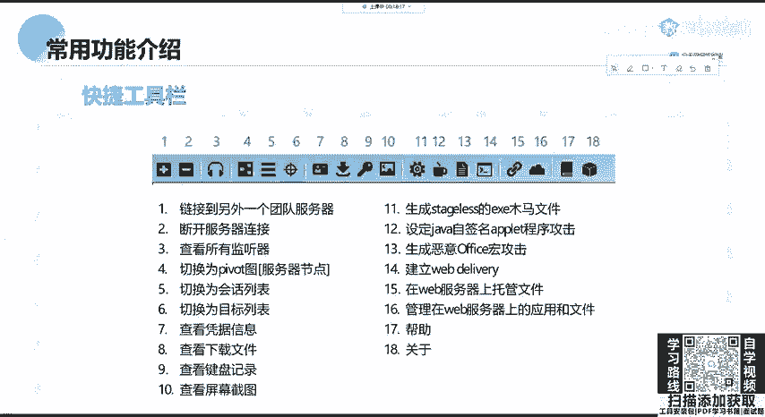

有可能自己听的非常清楚。如果这这三个月的课程你全部听下来，但是没有操作，你会觉得你都懂了。但是当你听完最后一节课，面试官就让你操作，给你一个把机，让你去测试的时候，你肯定一无所措，甚至teamwe。

不是这个team server都没有办法启动。OK那我们一定要操作。首先我们可以进行一个用户通信，用户通通信通信很简单，直接在这可以输啊，比如hello。

OK这两个客户端都会收到一个。聊天相当于聊天，当然也可以进行私发啊，比如MM麦。杠MSG然后指定我们要发的1个RID。然，给他私发个消息。啊，这我发给自己了。Yeah。OK他会收到这个发的消息。

那大家如果想连接我的这个呃服务端的话，也这个IP的是。

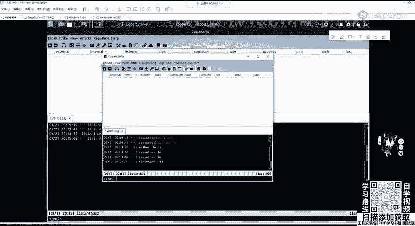

大家如果想看这个靶机上线的过程，可以登到这个服务器上面。OK服务器的IP就是这个。然后密码是怕错的，大家应该在讲课的时候都听到了。

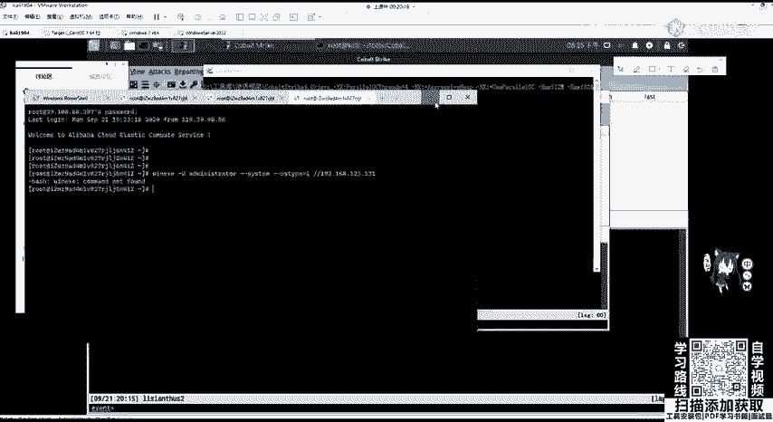

。常用的功能，我们首先对CS的一切操作都要创建监听器，也就是listener没有listener，我们做不了任何事情。那这里大家看别的教程，这个listener3。0和4。0是不一样的那我们这里来4。

0来讲一下。在co strike的下拉菜单里面，可以点击lister，就会来到我们的这个窗口。当然这里我们没有进行创建，可以点击艾进行创建lister。创建lister的时候。

它会让我们输入lister的一个名称，我们可以随便输，比如demo one。下面让我们选择piload分别是backon， baconck叫做洋葱，也就是自带的一个。

piloload还有外部HT外部piload。我们这里先讲beckconbeckcon DNS是通过DNS记录HTTP那这里我就不多讲了。

嗯是HTTP协议HTBSSMBTCP我们可以正常情况下可以创建HTTP。嗯，大家在3。0的话，有可能还会看到其他的，当然都差不多。Yeah。对。在选择相应的pilo之后。

我们需要对pilo options，需要对pilo进行设置。首先设置HTTP hostse，就是它的一个地址，这里设置为我们服务器的一个地址。HTEPho host这个tggger这个和这个有什么区别？

它是用来发送tgggertggger是什么？是用于获取靶机上线执行命令的一个呃传输。那这里我们是由服务端。对任何靶机的操作。这个流量都是通过服务端发送的。所以这里我们把它设置为服务端的一个ID地址。

下面我们需要设定监听的端口。那这里不推荐大家使用80。因为如果服务器开启了阿帕奇服务的话，你这样他会告诉你80端口已经占用了。那我们可以给他一个高一点的端口，比如8080。是。可以 say。

started listener这个监听器已经开启已经开启。那我们可以来到服务器上面。

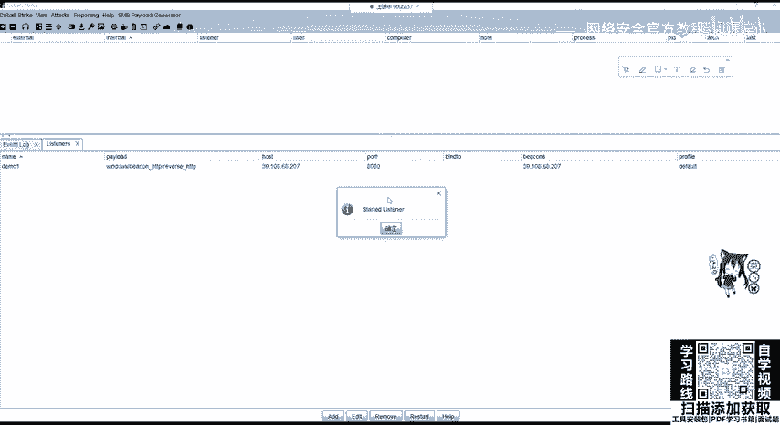

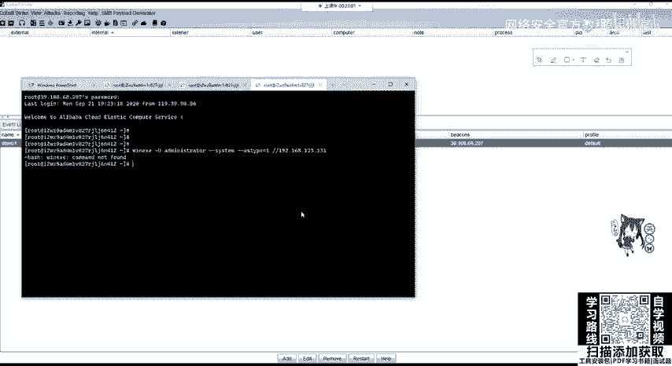

啊。来到这个服务器上面去查看8080有没有在监听，只有NETSDITINLTUP啊，这个可以看到8080已经开启了监听，正在等待连接那我们如何让靶机上线呢？现在先不及来看创建监听器，创建监听器之后。

想让靶机上线，很显然就是攻击靶机att那att有哪些功能供我们使用呢？att在哪？在上面的这一个。

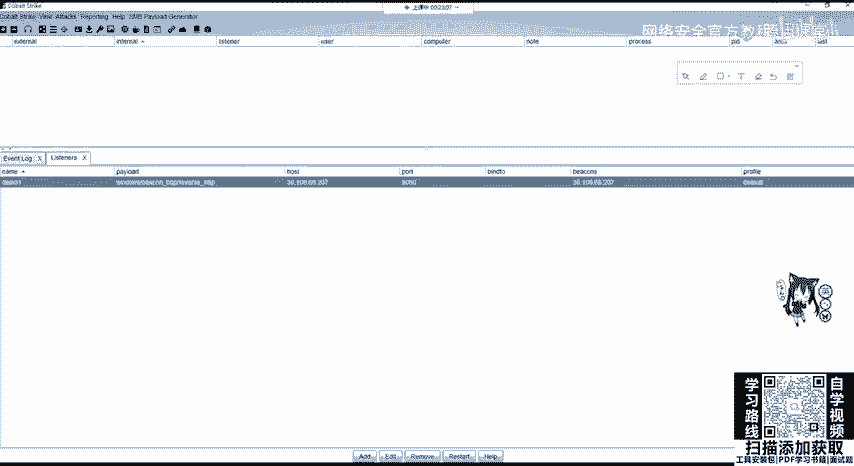

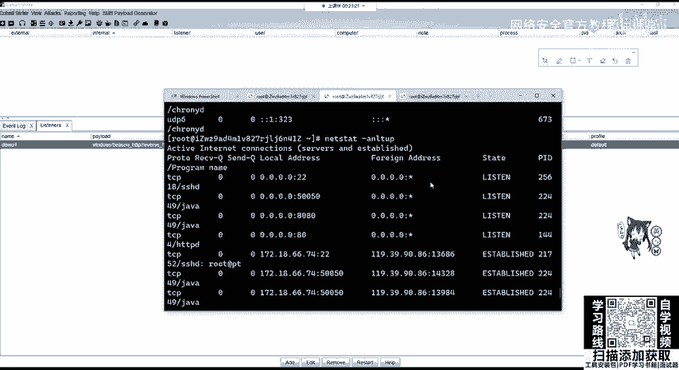

有packagesweber drive by，我们分别来看一下。没意见。腾讯云安全组在你如果是ESECS那个服务器的话，在嗯它默认是出端口全全开的，你是入端口，你是配置吗？配置0。0。0。

然后嗯就是全部放出嘛。就是不会配端口的话，就把端口全放我是这样的。不用重启不用重启。不用重启来。Okay。Yeah。不。不。是。那我们继续去看这个atts里面有什么东西。首先。

packages packages里面大家有可能下载的这个CS是汉化版。汉化版，我觉得有可能还没有这个讲的清楚。因为它汉化的有些语言特别的怪。

那我们首先来看HTM application很显然是HTML应用程序，是生成一个点HTI文件，在服务在法机上执行这个HTI文件就会上线到我们的CS服务器。

还有MSoffice是生成恶意的红放入office文件。pilo的生成器可以生成各种语言版本的piload。windows可执行文件可以生成可执行文件，默认为32位叉86，可以勾选64位的。

windows可执行文件杠S。那这杠S和前面一个可执行文件有什么区别？那这个I带大S的也就是生成st list。这个相当于web里面的大码，也就是生成全功能被控端，生成全功能的一个木马。

下面we要ever drive by。web drive这里可以进行manage进行一个管理，可以管理当前服务器开启的所有we包服务。哎，这都是简单的一个翻译。下面克隆网站可以克隆网站。

克隆钓鱼网站hostify可以在服务器的某一个端口提供web进行下载下载某个文件。也就是我们可以利用这个东西把文件传给我们的靶机。う。scr web delivery是可以为拍lo提供web服务。

便于下载和执讯。那这里就比较像MSF里面的exode MUFTYTI加上scr web delivery是一样的这个。这个模块。接下来的两个是自签名的java日习环境都已经淘汰。我们这里不讲。

system profile是用来获取系统的信息，包括系统的版本、浏览器版本、flash版本等。最后一个是邮叉钓语的件控呢，这里我们也不讲这些。大家可以作为一个拓展去百度搜索来了解一下。

我们来看如何让法题上线。这里我只举一个例子来讲，因为是差不多的。att package生成HTML应用程序。我们需要选择一个需要选择。监听器选择刚刚开启的8080端口监听器。

并且选择执行方法是生成可执行文件，还是power share，还是VB的一个脚本语言。那这里我选择power share，是选择生成。它会让你选择一个路径，保存HTI文件。这里我保存在桌面上。嗯。

保存在桌面之后，我们需要开启一个端口，共把机下载这个文件。那如何开启呢？使用web drive by点击hos file是开启端口。那这里选择我们的一个刚刚生成的这个HTI文件。Iello。

然后这里logo host已经帮我们设置好了，这里还是不推荐使用80端口，因为很容易被占用。那我们这里使用9090。点击生成。它会生成一个hos file，然后把它复制过来，然后再靶机里面。

这里的靶机是我使用的是win764位的操作系统。他的IP地址是192。168。123。131。那这时候我们可以使用。MSHTI这个文件去运行。去运行我们复制过来的这个文件。

也就是在9090端口去开放的那我们把它运行起来，把它运行起来。这时我们等待一下，会发现。把机上线了好，在这里。是不是10。10。128，因为我开启了一个内网的端口是。

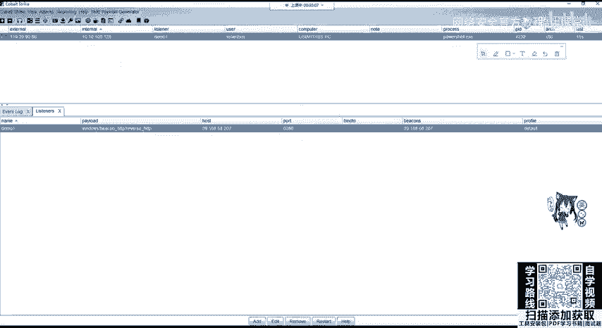

网卡是10点10点100。128，那他就上线了。大家如果连到了我的服务器。应该能看到他上线了啊，能看到他上线了。

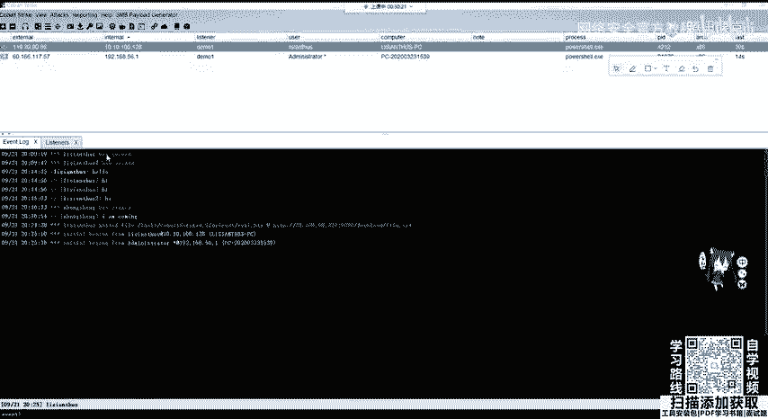

这怎么还上线一个呀？这是谁的机器啊？这个是。Yeah。这这随着继续上线的啊，OK那我不碰你的那我们上线之后，我们可以做很多操作，interact开启交互access权限，还有一些设置。

包括呃转移和session的一个控制，会把它退出。那这个时候靶机就上线了，靶机上线之后，我们可以点interact开启交互啊，开启交互。

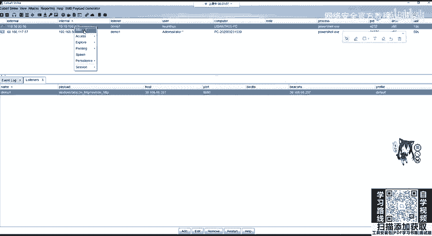

嗯。Okay。

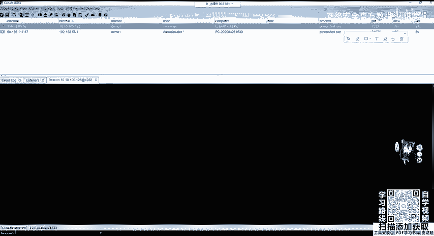

这个小伙呢，这里我放。

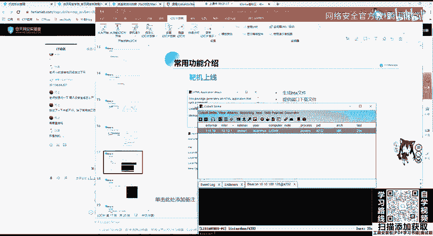

嗯。可以交互，可以在这里输入share who am I。shall是指执行shall命令，后面加上我们的CMD命令即可。那这里因为它设置的心跳是60秒，也就是。嗯。

它为了避免流量的特征设置60秒的间隔，那我们可以修改它的一个间隔，可以在右键点击sessions sleep去设置，也可以使用命令。呃，看这里是非常慢。它回旋给我们的这个。嗯，用户名。

那我们可以sleep。把它设置为2。Yeah。你需要在后台里面把这个进程给关掉，就是你的power share，不然的话，你在这里退出了，它还是才会上线的。还是会上线的。好。好。

这里是比较慢的那我们先继续讲。

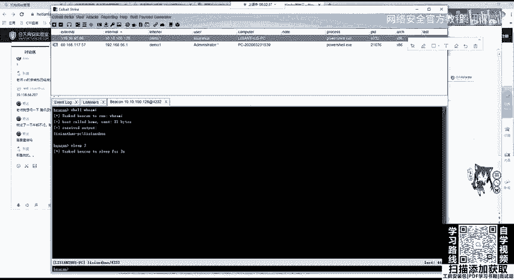

那当我们的靶机。被出现了被控端就会出现在主机列列表，选中要操作的目标主机，右键interact可以进入交互命令界面。这个时候我们可以使用back and command对靶机进行各种操作。

我们一般拿到这个靶机上线的靶机之后，首先就是要对sleep进行修改。当然，在真正的测试过程中，你也可以不修改，因为sleep2很容易被IDS查杀。

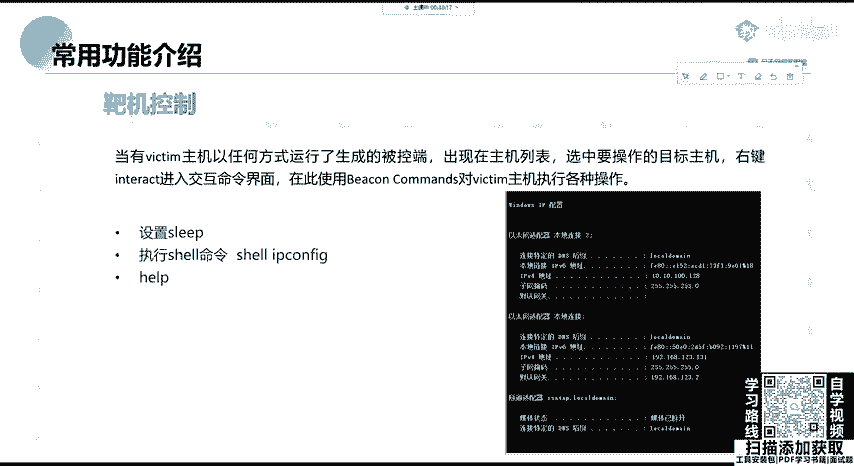

之后我们就可以输入shall加上CMD命令进行命令执行。那这个时候sleep嗯两秒已经设置好了，我们再去执行命令，比如RT configurefi。啊，它就非常快，可以看到我们的网卡131和128。

这本话。当然还可以执行其他的命令，可以输入help，可以查看我们可以执行的一些命令。嗯。嗯。包括呃upload可以上传文件，可以开启代理，可以查看注册表，也可以进行截图。

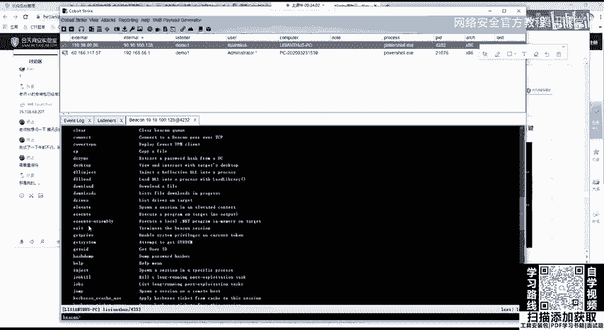

我们分别来看一下，当我们拿到了一个靶机之后，我们可以看到它的提权和显示这个模块中分别有几个重要的，分别是提权，还有转移运行咪咪卡太。这个是一个密码，从内存中获取密码的一个呃脚本。

到时候后面都会讲开启VNC，也就是远程链接。当然这里VNC大家是不建议开启的，因为我们的。内网的机器去把VNC3389端口去映射到公网上面。你VPS服务器的带宽一般是非常小的，除非你是土豪把带宽特别大。

用特别小的带宽去看VNC的一个转发就特别的卡。然下面呢还有文件浏览器。包括端口扫描进程列表和屏幕截图啊，这里给大家稍微看一下吧。

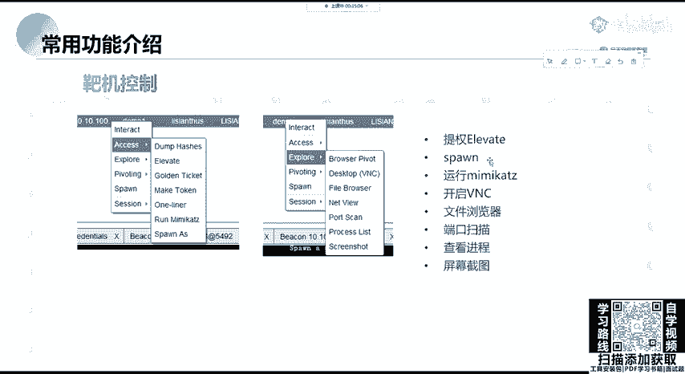

可以对它进行一个嗯屏幕截图。在屏幕截图之后，我们可以在vio视图界面去查看screenshot这个屏幕截图。

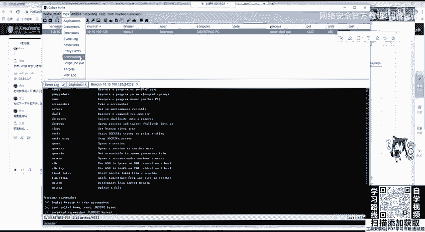

OK我们点击是不是把那个把机的桌面给截了一下呀，截了一下。那它也可以做哎端口扫描端口扫描。也可以就是查看进程，这是靶机上运行的进程。可以进行。文件的管理啊文件的管理。这里就大家应该都清楚。

那同样也可以进行一个端口扫描，在点击端口扫描之后，它会自动识别我们靶机的两个网卡所对应的IP的C段。可以看到我是有两个网卡，分别是10。10。100网段的和192。168。

123网段的那这个时候我们可以选择一个内网网段进行一个扫描。因为我们还想探测内网中是是否有其他的一些机器，可以进行一个扫描。那这里它因为特别慢，就不给大家去等待了。

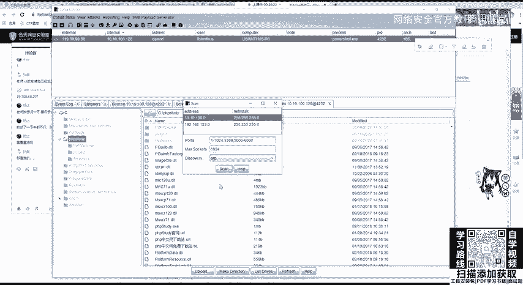

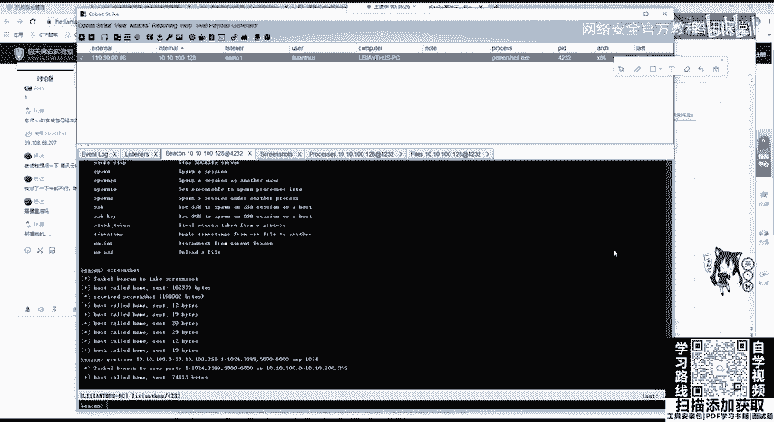

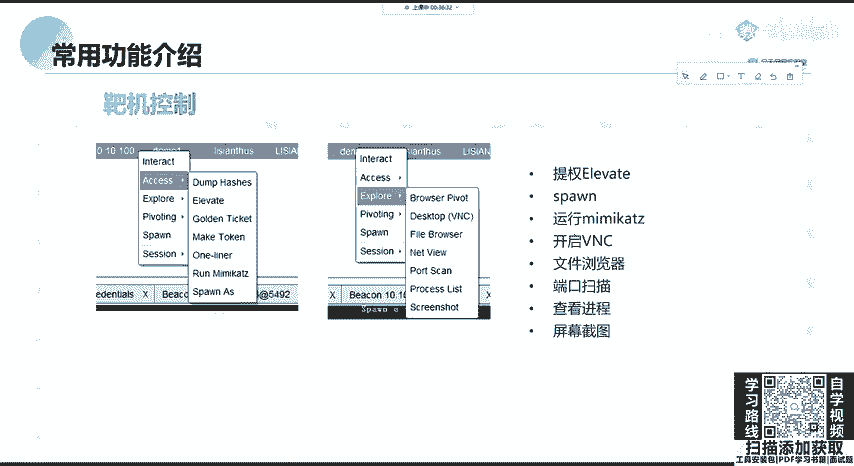

我。