# B站最全网络安全教程，整整1300集，全程干货无废话，别再盲目自学了，看完学不会我退出网安圈！（web安全｜渗透测试｜内网渗透｜CTF） - P71：70.cobaltstrike实战演习.mp4 - 网络安全官方教程 - BV15u4y137cQ

同样，我们可以使用其他的监听器或者是attack进行一个主机上线。比如使用。我们的。scr web delivery在这里同样也需要开启端口，因为9090我们已经占用了，这里我设置9091。

它也需要去设置我们的piload，也就是监听器。我们所有的操作都是以监听器，也就是CS服务端上面的一个端口进行操作，发送tage或其他的命令。

下面同样也是选择bes amin是windows操作系统自带的下载程序和power sharepyython，大家应该都很清楚吧。那这里如果是power shell进行生成的话，它就会生成这个命令。

那我们在把机的运行里面去运行这条命令，就会拿到同样的效果，让把机上线。那如何删除我们开启的这些东西呢，可以点击。这个叫。

manage web server或者是attack web drive by manage来到的都是同一个页面。

这里就可以看到我们开启的9091端口那一个power shellweb delivery的一个下载一个远程端口和HTIHTMLap的9090端口。

那这这里下面我们可以点击copy uIL进行一个copy过来啊，这里可以copy过来啊，直接copy过来。啊，这边如果你没在设置的时候没有copy，就点这里就可以copy过来了。

然后我们如果想关掉它的话，直接点下面的Q就把它给关掉了。OK那这里我就讲到这里。

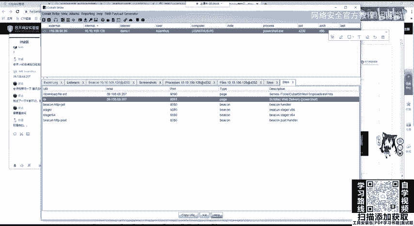

那我们可以在下面看到这一个端口已经扫描完成，在扫描完成之后，我们可以在view上面进行切换视图，或者直接使用我们三个这个命令，分别是show sessions和show table view。

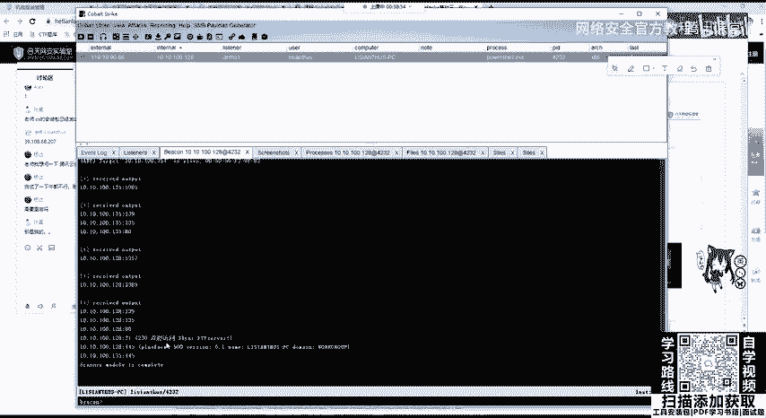

和tarets wheel。首先我们可以看到这一个一个逻辑视图。

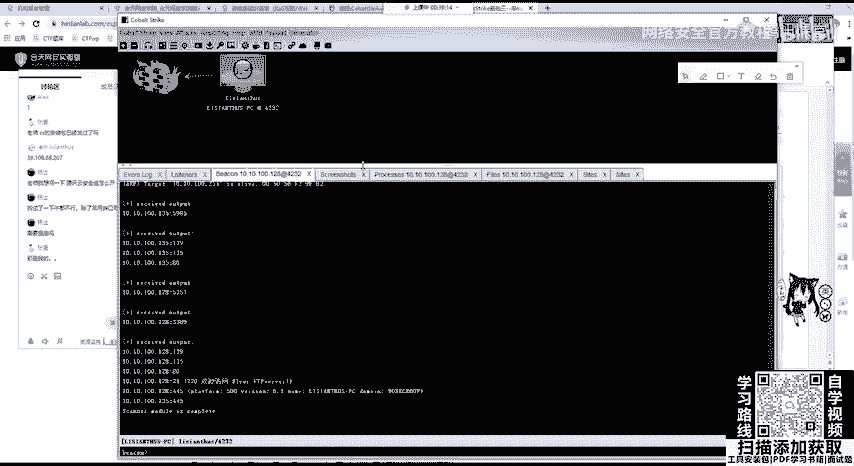

第二个是我们靶机上线的目标，第三个是ts。可以看到他发现了啊，这个是刚刚同学的这个机器啊。可以看到这个129，也就是我们上线的这个机器，它所在的IP地址，还有129，它这一个在的内网地址。

还有1个135。那135是哪一个机器呢？就是我搭建的这个windows server2012，它是不通外网的，它是不通外网的，它是内网的一个服务器。

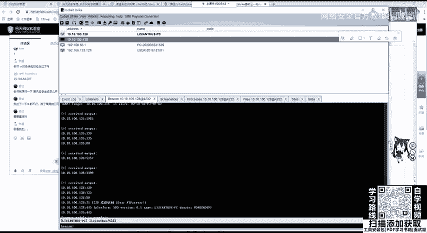

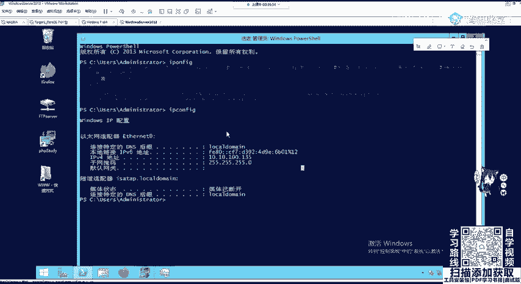

那我们同时也可以把它扫出来。把它扫出来。那我们可以。在tars的这个结果中去右键点击呃siceservice查看服务，可以查看开启了8013445啊，我们可以考虑是否有嗯MS17010或者是其他的漏洞。

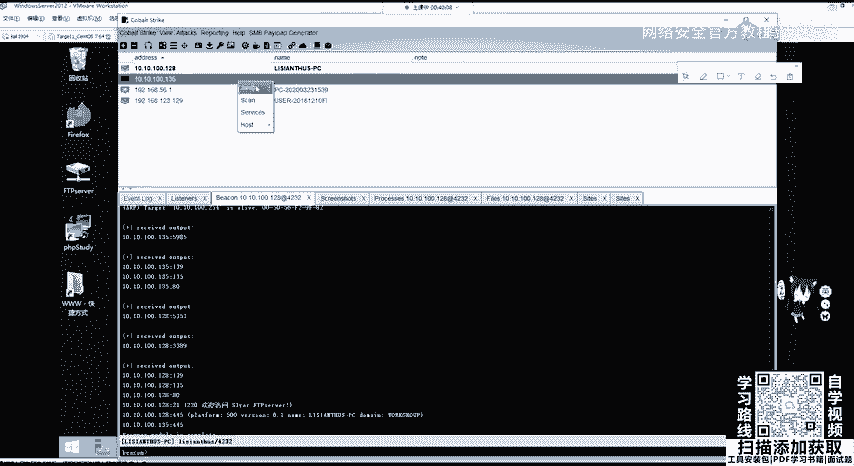

那，这里嗯给大家就讲到这儿。那也没什么啊，可以就是进行一个后渗透模块嘛。这里想给大家进行一个概括，完是呃要花很长时间，就像已键和冰线一样，它有很多功能，大家可以摸索着自己去玩，又不会把它玩坏。

当然你不要拿真正的机器去去搞这个东西，如果没有授权的话，千万不要动用mat split和co strike这两个渗透测试框架。因为它是渗透测试框架。

它里面有很多集成的工具会不停的发包和留后门或者是改写注册表。你对未授权的机器进行了修改，增删改查，这个有可能会违反网络安全法。这个你需要动用他们两个渗透测试框架，就是在工作的时候被授权渗做渗透测试在用。

OK那我们可以使用监听器进行1个445网段或者是。指定一个端口，或者是对一个网段进行扫描。Sure。好。在一开始就给大家讲CS支持扩展端拓展关端口。支持拓展这个脚本。

那它脚本大家可以去get upub上面进行一个搜索，啊，特别非常简单安装它那就直接使用我们的co strike，然后screen脚本manager脚本管理，然后点击load加载。

还有onload取消加载reload重新加载load，然后选择我们的一个CNI的一个路径啊，这里我会到时候会发给大家一个。大家如果没有的话。

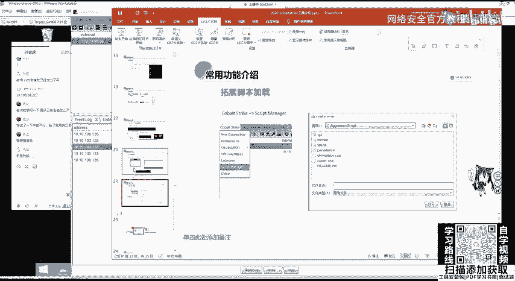

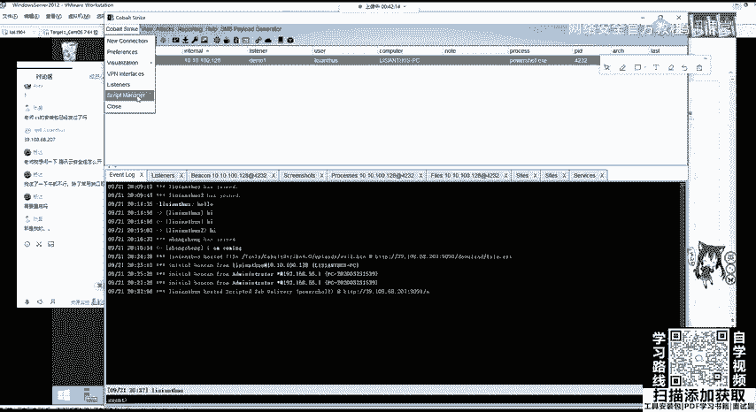

嗯。Yeah。Yeah。可以去呃去把这个CNI进行导入进来，直接打开之后，它会告诉我们已经导入过后，如果导入成功，再ready这个栏这个列会显示对号。嗯。Yeah。

这里给大家做一个简单的CS的一个实战演示。那它攻击流程和ma split是一样的。因为我说过，在3。0版本之前还是没有和MSF进行分开的那它的攻击流程也非常简单。

首先就是创建我们的监听器listener。第二步呢去设置attack选择攻击的方式，使用HTILap也好，使用web deliveryelive或者是office和都行。第三呢，寻找靶机漏洞执行命令。

因为我们不论是使用哪一种attack攻击方式，都是生成一串python脚本。power share脚本sha code或者是其他应用程序。那我们需要在靶机上面执行这条命令，就需要寻找靶机的漏洞。

进行命令执行，或者是在靶机上上传weber share拿到靶机的web shell之后，在weber shell管理工具里面执行相应的漏洞。当我们执行命令之后，就会把把机就会上线。当靶机上线之后。

我们一般获得的权限就是执行命令的这一个权限，它一般是向windows操作系统一般是已经登录的用户。linux操作系统它的权限就比较低。我们需要对靶机进行提权。提全之后，windows操作系统。

我们会拿到sstem权限。linux操作系统，我们会拿到root权限。拿到权限之后，我们可以对内网进行后渗透，包括内网的信息收集。比如端口的扫描，C段的扫描内网的一些代理配置。

然后就可以进行更一步的扩大战果。比如使用SMB backken进行批量带出内网机器，使内网横向移动。在这后面我们都会进行讲。那我们现在就举一个例子啊，举一个例子，比如还是这个机器啊。

最简单的还是DVW还是DVW那我就给大家演示一遍，过一下流程吧，过一下流程。

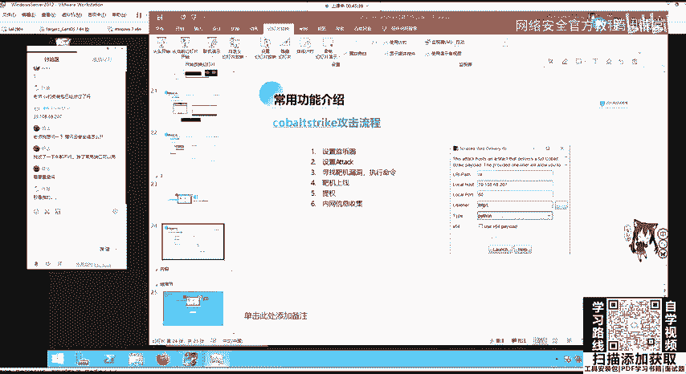

首先访问我们的机器。131192。168。123。13。要是131。嗯，131对的。然后去访问下面的DVWI我已经装好了。大家如果有疑问的话，包括这些同学有说对web漏洞不是太了解。

可以去自己装一个PH study，然后装DVWIDVWI上面就基本上概括了OWSPtop10的 webb漏洞，而且这里可以自己是设置一个嗯难度。

比如进行一个等级的切换漏 medium high和imppost进行切换之后，可以来到comd injection叫做命令注入，或者是爆破文件包含文件上传cle注入搜cle盲住，还有三种类型的查思思。

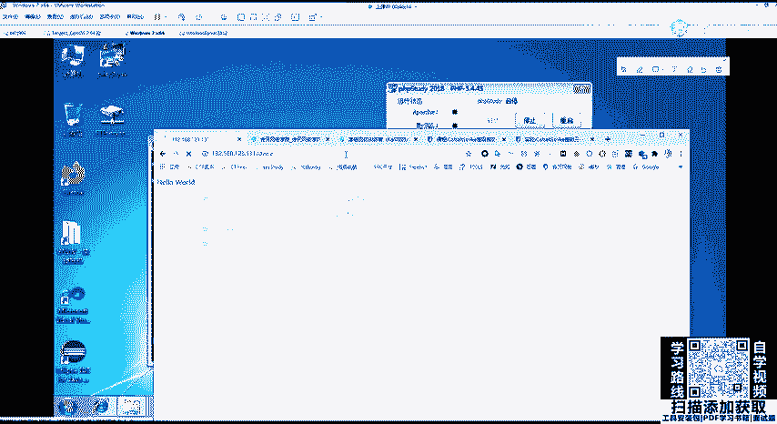

在这里我们还可以vi source进行一个查看，查看它的后台代码，可以查看所有的通常啊低级的是就是没有防护。而高中级的呢是黑名单，高级的呢是更强的黑名单。然后impossible，一般是使用白名单防护。

啊，大家可以自己去看。那这里还是老规矩，我们可以使用1个127。0。0。1去加上我们的hoMI它会执行后面的命令。那这里和之前讲的MSF就就是一样了，就一样了。

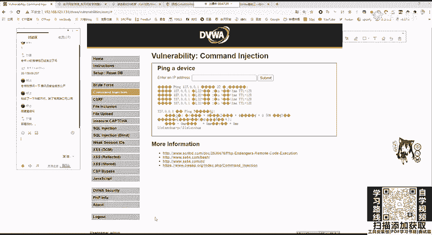

那我们来看一下。在这边是生成我们的。

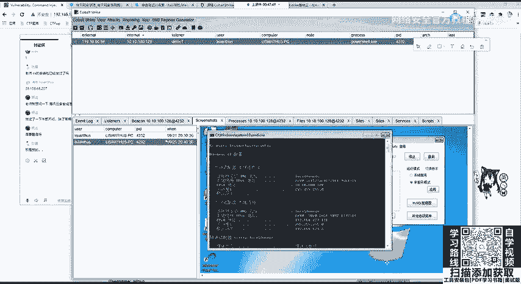

生成我们的一个。类一个这里，我先给它呃关掉eat。然后把它给remo。这里在先听器我们已经生成过了，就用它了。用它之后我们要干什么？要生成att text，这里就以嗯web deliveryive为例。

然后我们点击生成，选择我们的liston，然后开启一个端口，这里还9090啊，9090。

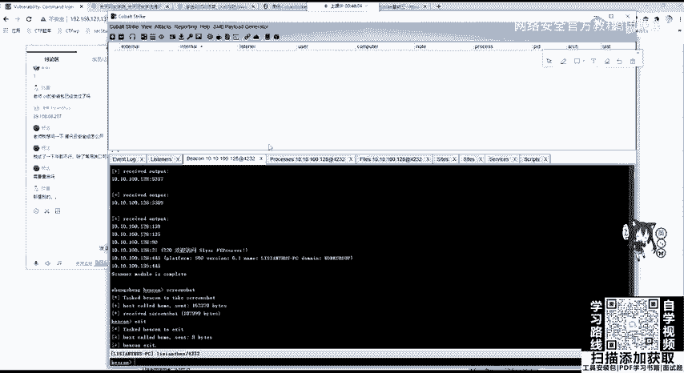

9090开启过了，9091开启我们的python或者是power share，这就pypower share为例。当我们把机上装有python的话，可以开启python的一个web delivery。

这里是不会在服务器上留下文件的，所以它比较安全。那这里我们生成了这个东西。刚刚你的那个那个不会上线了，那重启就不会上线了。嗯。嗯。你想让它重启上线的话，你需要植入后门。然后后面您都会讲。

就是如何去往注册表里面去写一些开机启动的一些脚本。

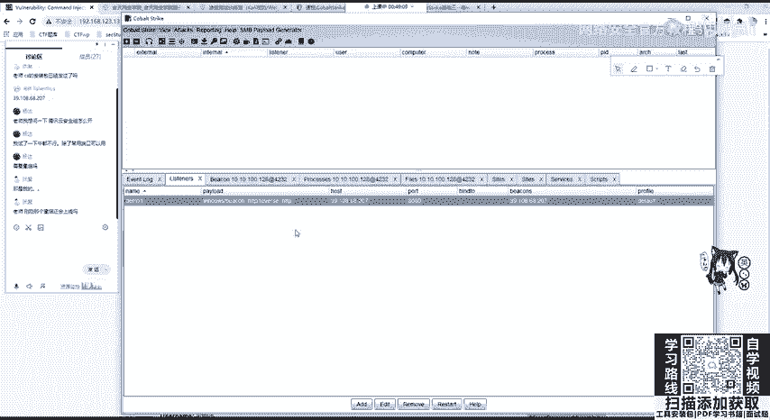

你想让它关掉很简单呀，因为你这边实则就像我们刚刚看到的这个我开启的呃9091端口，我们copyURL我看一下。

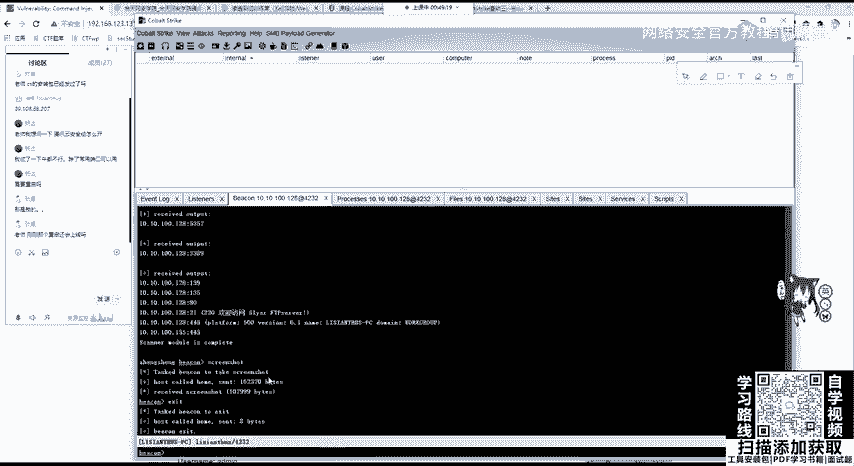

我发在这这里看到没？是执行了我们的power shell。那它在后台你在任务管理器肯定会看到一个power shell点Yeses他ing的话，它也是执行去调用power shell啊。

你可以把它给关掉，这一个主机就下线了。那我们来看一下，我把这个URLcopy过来，然后和这里进行一个命令执行，把它粘到这个呼MM处subit提交，还等待他这边把机会不会上线。

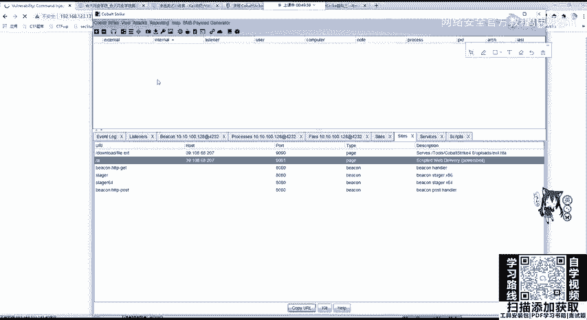

嗯。啊，因为他去联公网去发送tage包，是需要一段时间的。OK我们可以看到靶机上线。是。那这里。啊。我执行的是east退出。对，因为退出是我们服务端把它退出了嘛。list removemove和服务端。

你如果直接remove的话，它是会再上线的。你需要先list先退出这一个进程，然后再remove，它就不会再上线了。那这个时候这个靶机上线了，大家有没有问题这个整个过程没有问题的话，那有问题也等一下吧。

我先把这一堂节课下课。那我们开启下一节课，就是如何。让CS和MS2个渗透测试神器进行互相的连接和交互。那这一节课我们先到这里，大家可以去休息5分钟，我们5时准时进入下一节课。是。Yeah。hello。

大家能听到吗？麦克风声音是正常的？嗯。什么问题。OK那我们大家休息几分钟，我们马上后面开始讲，继续讲。要怎么说啊？啊不。Yeah。

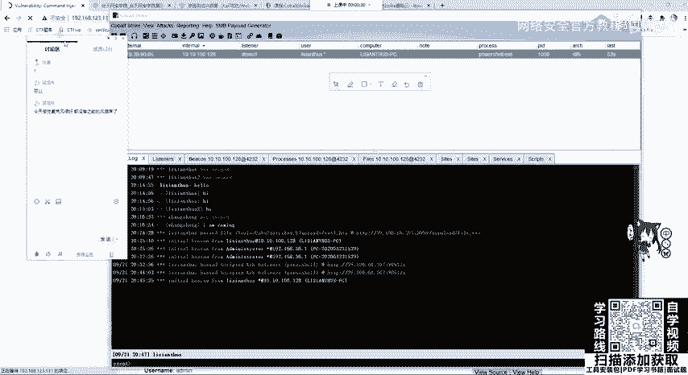

Yeah。嗯。So。

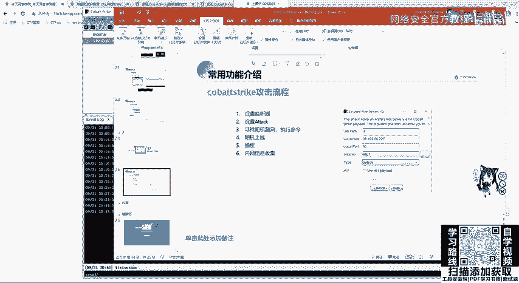

Yeah。Okay。Yeah。对呀，之前是有电是风扇的声音的，我换设备了。大家如果有问题的话，随时可以在讨论区提问啊，或者是客户的时候，如果有问题。比如装不上哪个地方打金没有办法上线，可以在群里问。

或者是私聊我进行问都行。当然也可以自行百度或谷歌解决。

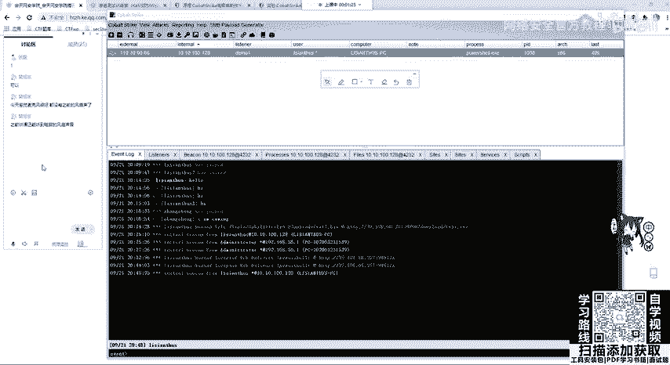

。然后。没有。Yeah。Yeah。Okay。嗯。I。ほら。这个靶机上线的方法大家应该知道吧，一种是刚刚我测试的这个命令执行或者是文件上传，上传web shell。

然后在一键或者是冰写里面或者是菜刀进行执行这个命令。只要这个命令得到了执行，并且有权限执行就是没有报错。那这个靶机是能够上线的。那大家一定要注意，如果是。CS是在内网中的。

你要确定CS1定要能够连到把耳G。啊，不是，是把机。

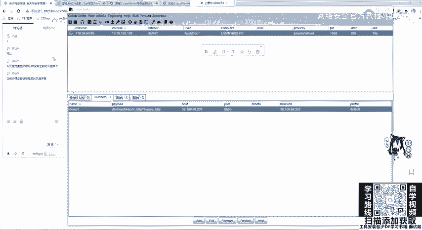