# B站最全网络安全教程，整整1300集，全程干货无废话，别再盲目自学了，看完学不会我退出网安圈！（web安全｜渗透测试｜内网渗透｜CTF） - P72：71.cobaltstrike攻击流程.mp4 - 网络安全官方教程 - BV15u4y137cQ

Yeah。hello，大家能听到吗？这麦克风声音是正常的吗？嗯。什么意。OK那我们大家休息几分钟，我们马上后面开始讲，继续讲。要怎么说啊？嗯。啊是清楚。Yeah。

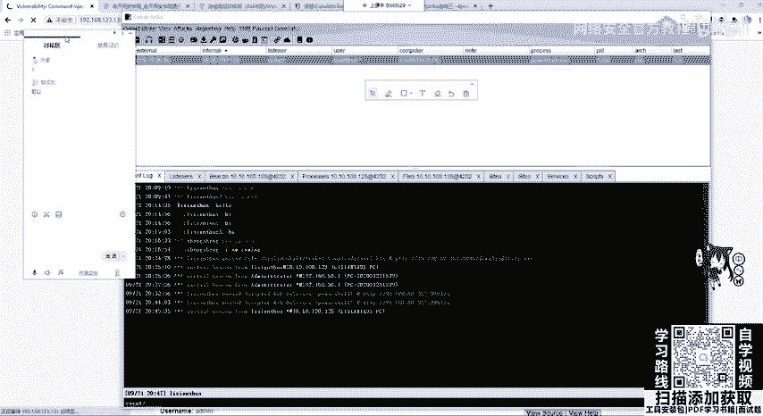

Yeah。Okay。

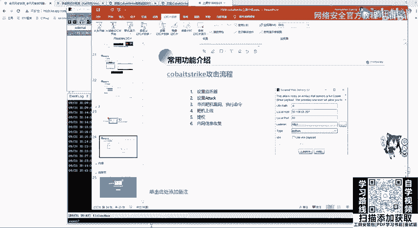

Yeah。Okay。Yeah。对呀，之前是有电风扇的声音的，我换设备了。Okay。Okay。大家如果有问题的话，随时可以在讨论区提问啊，或者是客户的时候，如果有问题，比如装不上哪个地方把机没有办法上线。

可以在群里问或者是私聊我进行问都行。当然也可以自行百度或谷歌解决。然。这的。

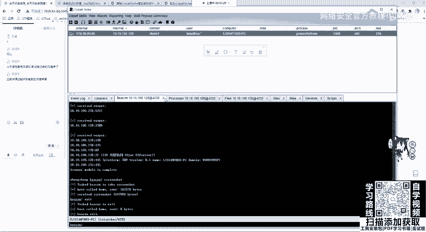

Yeah。嗯。Okay。Yeah嗯。Yeah。嗯。打啊。这个靶机上线的方法大家应该知道吧，一种是刚刚我测试的这个命令执行或者是文件上传，上传web share。

然后在已键或者是音写里面或者是菜刀进行执行这个命令。只要这个命令得到了执行，并且有权限执行，就是没有报错。那这个靶机是能够上线的。那大家一定要注意，如果是。CS是在内网中的。

你要确定CS1定要能够连到把8G。啊，不是是把机一定能够连到CS才能够上线。那CS也一定要能够连到靶机，因为它需要进行一个tage的发送。嗯。はい。Yeah。嗯。那是。你那说。你把那个。啊。好吗。

啊这个我。再等一分钟，嗯，大家有可能。去倒水还没回来。再等一分钟，我们继续来讲。没。好好嗯。She。好。Yeah。嗯。Oh。OK那我们继续讲。哎。当拿到靶机sll之后，是不是就是来到了第四部靶机上线。

靶机上线我们拿到的是什么权限啊，这里也告诉我们了，你的user是一个普通用户，我们可以进入一个交互进行看一下。首先呃设置sleep2，因为默认60是比较慢的。

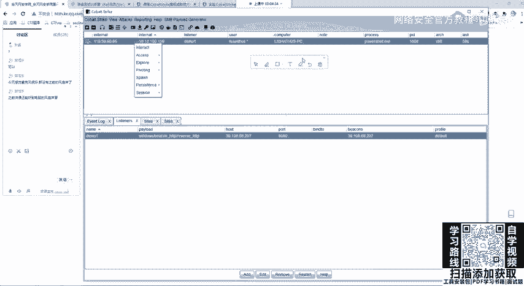

好，这里上节课大家听懂了吗？如果没有听懂的话，没有听懂的话，你扣一下2。啊，如果没有听懂或者是。是哪里没有听懂呢？咁。Okay。因为他这边设置。嗯，sle还有一段时间，你可以问一下你的问题。

设置监听器啊，设置监听器就是在co strike。怎么发言违规仅老师可见，这个监听器被违规了啊，这个只有我能看到。那你这个lister在这个点击list似er这里没问题啊，没问题。

那我们去点击艾是添加exit编辑remove啊，移除restar。从一开始。

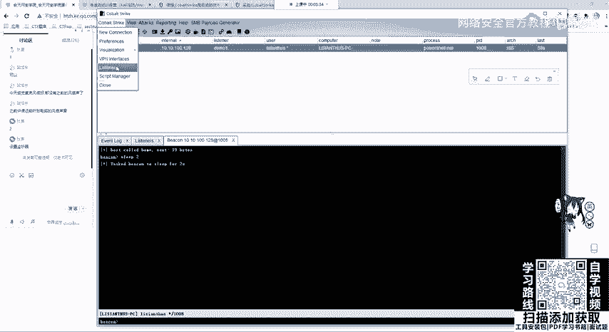

在点击edit之后，这就相当于什么？大家肯HTTP相当于什么？我告诉嗯，我这样告诉你应该就知道了。那MSF还记得吧，它就相当于呃我们的这一个东西。Windows。Meter operator。Yeah。

REVERSEHTTP。就相当于它这个东西，那我们拿到它之后，是不是s optionstion一下。说 options我们可需要设置什么？

是需要设置我们Lho和LportLhoLport是不是在我们机器上开启监听的端口。那L host是哪里呢？就是我们的HTTP host。那airport是哪里呢？就是HTTP port。

就是你在服务器上开启的监听，这里能够理解了吧，能够理解了吧，就windows我打错了手帕。OK那这里端口你可以随便设置，这无所谓啊无所谓。如果你在嗯嗯老版本的这个老版本的这个里面，你会看到一个。

Yeah。会看到一个这样的1个TCP啊，它也是一样的。因为我们在讲MSF的话，经常用这个东西，它是一样的那我们拿到这一个低低权限，我们可以进行，你看我直接输ID卡贝是不行的哈，要用嗯是你输的呀。

啊，是这个同学出的。你不能直接说ID防防抗figer，你去执行shall命令，你要在前面加个shallshall IDD configurefiger。啊，这里是不是就好了那你可以试一下。

反正你是能连接到这里的，你可以再试一下。😊，对。这没问题的，你随便板弄他。那我们拿到这个地方可以看到呼MI进行看一下。他是一个低权限的用户。那我们如何进行一个提选呢？也就是exs一个提选1。提全之后。

我们还是要选择监听器。也就是listener，还是选择我们刚刚创建的demo一choose选择我们需要攻击的一个脚本。大家可以看到自己的有可能是有SVC和UIC token。那这里已经我做了一个拓展。

那这个拓展我会发给大家。这里我比如选择MS16135进行launch，它会自动的把这个脚本攻击脚本给打出去。Yeah。我们看他记住，如果在这个啊okK他已经他已经告诉我们success。

并且上线了第二个机器。第二个机器和我们第一个机器是IP是一样的，说明是同一个机器。它的区别就是user变成了sstem，我们可以interact设置它的sleep为2。记住啊是一个session。

一个把结设置一个sleep。嗯。

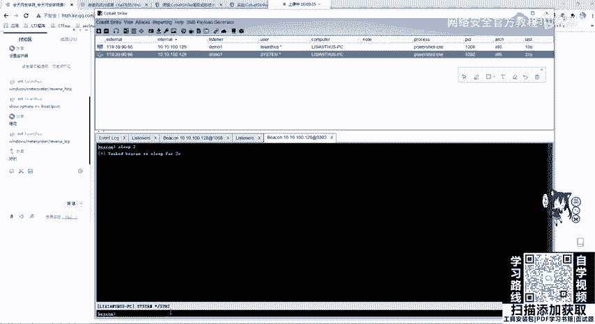

设置之后啊，这个可以在这边看清楚的看到是不是两个用户是不一样的啊，两用户是不一样的，一个sstem，一个普通的用户。

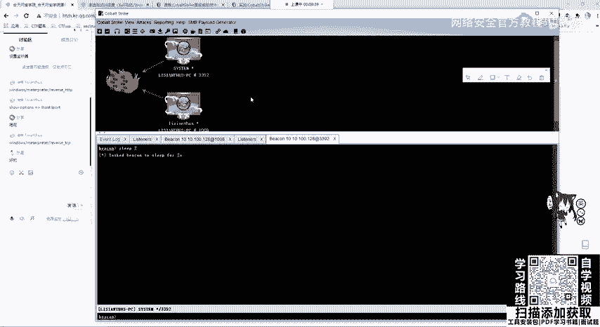

那我们拿到它的一个最高权限之后，就可以运行其他的一些命令。alexs里面的这里等我们把这个两秒给设置好。

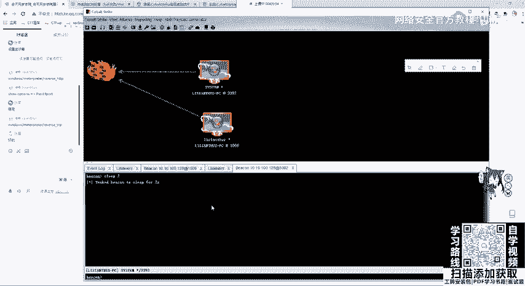

这个两秒设置好之后，我们再记住一定要选择这个stem，可以看里面有一个hush dump当 hushes会使用命令hush dump。会从我们的NT这个服务器里面读读取用户的一个哈息值。

也可以去把迷咪卡te这个软件去运行起来，也就是使用loginlogin on passwords。他会去我们内存中去读取。我们来看读取的结果，有没有把密码读取读取的。

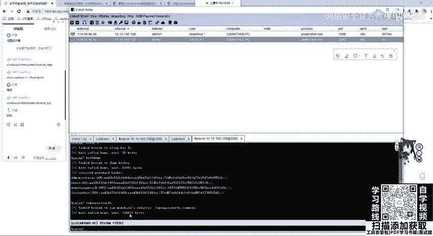

OK他已经读取到我们的一个任一个凭证，也就是这个用户，他的密码是123456。那确实我这个win7的它的密码就是123456，就是123456。

那这里给大家看是不是开启了power share那有这个东西，哎，因为这个power share开启着呢。那我们把这个power share给干掉，那这边就断掉了就断掉了。当然你可以把进程迁亿。

进程迁亿可以利用MSF那这里就给大家讲，当然他还有其他的一些操作，那大家都去自己去看一下就行。那这里就给大家继续讲第二节课。嗯，如何和MSF进行联动，如何进行联动？嗯。

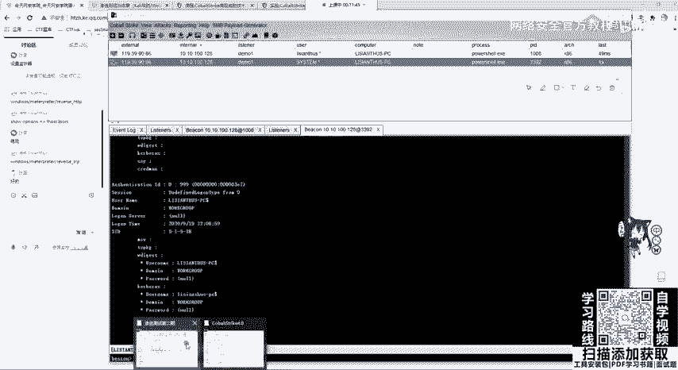

应该。没问题。

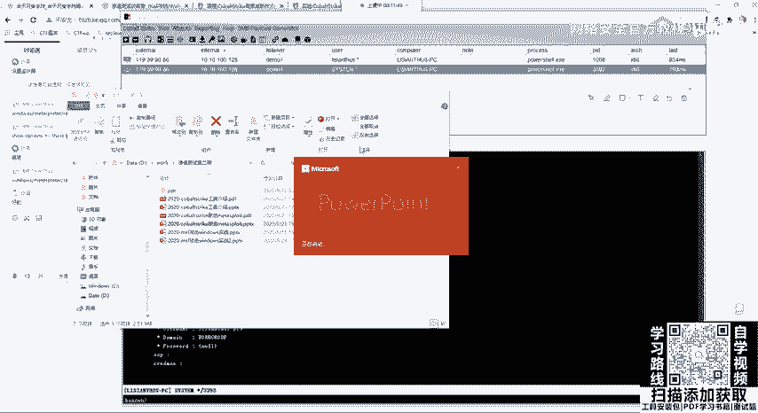

分开。因。