# B站最全网络安全教程，整整1300集，全程干货无废话，别再盲目自学了，看完学不会我退出网安圈！（web安全｜渗透测试｜内网渗透｜CTF） - P73：72.cs联动msf之socks代理.mp4 - 网络安全官方教程 - BV15u4y137cQ

在联动我分别讲两个，分别是在一开始讲的reer有一个外部鉴听器，或者是使用costruct开启socks代理。socks是外部防火墙穿透代理。向我们访问内网或者是无法访问的服务器。

可以通过sox建立代理。然后就能访问到无法访问的机器了。同样啊这些都可以。首先我们来看嗯这个。Sock steady。CS和MSF各有所长。CS更适合作为稳控平台。MS更适合用内网收集信息及漏洞利用。

大家要知道matepre的功能是十分强大的，大家应该有所体会。而且MSF的模块非常的多，包括辅助模块攻击模块编码模块等等。而CS它就非常少了。

但是我们可以利用CS进行团队合作进行一个主机的上线和SMD的横向横向移动内网横向移动。所以CS更可更可以作为一个内网稳控平台。那这里我给大家首先讲一下，我们接下来的课程所用到的一个环境。

这是我自己搭建的。因为告诉大家大家这些IP防止大家在下面听课的时候搞混淆。首先，CS客户端CS客户端，这里我有两个分别是windows操作系统和卡利操作系统和卡利操作系统。

我两个分别是类CS1和ZCN2这两个用户进行一个登录。他的IP是192168123128。

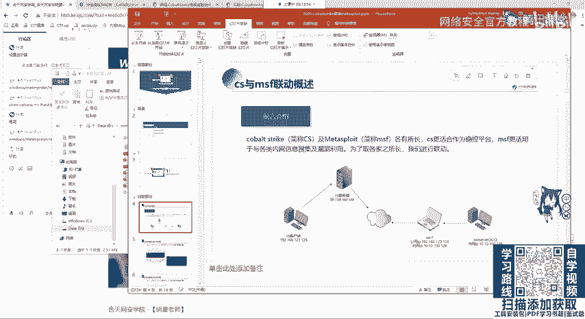

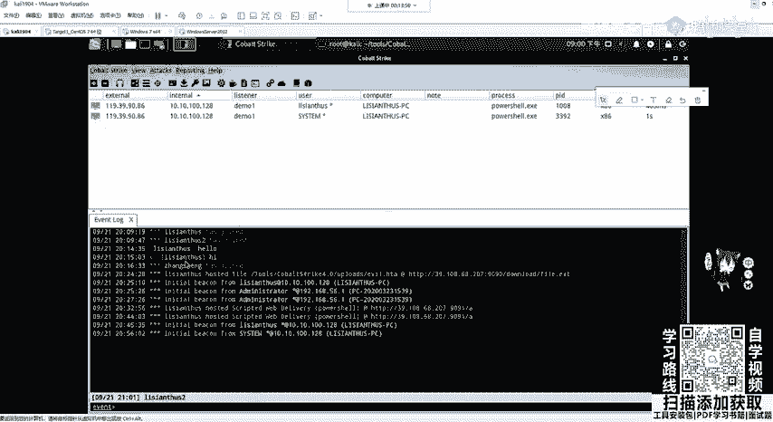

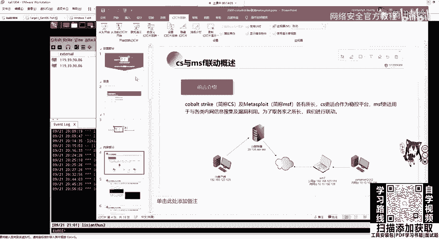

他去连接co strike的服务器，这个服务器我是放在公网的VPS上面的，它的IP地址39点别是lisance1和liance2，这两个用户进行一个登录。它的IP是192168123128。

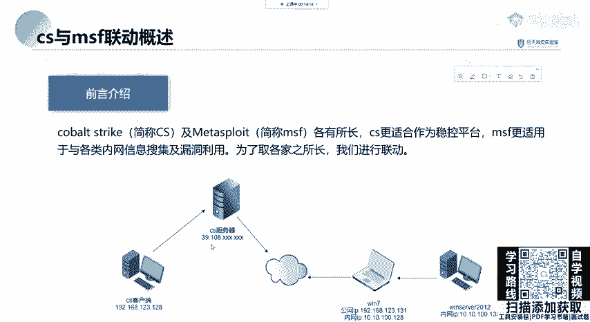

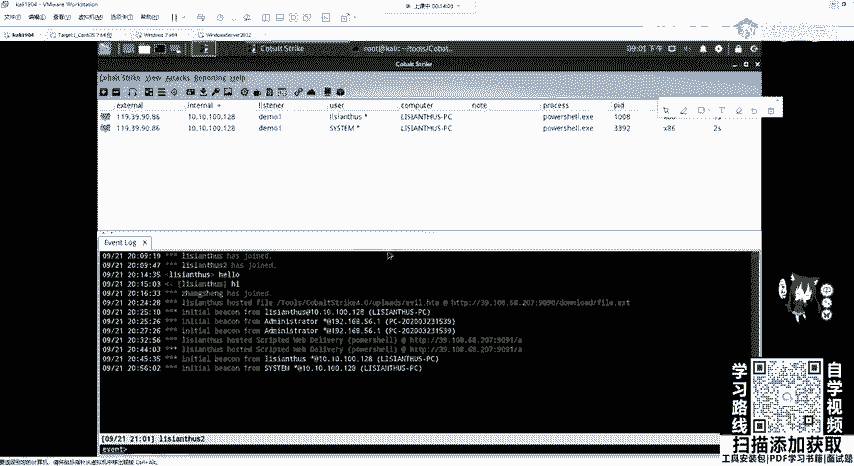

他去连接co strike的服务器，这个服务器我是放在公网的VPS上面的，它的IP地址39。108点。刚刚我已经发到群里了。然后在公司的服务器里面分别放着两台机器，也就是windows7。

windows7，我配置的net网卡IP地址是131，它可以连接到我们的互联网。在WI7的第二个网卡，10。10。100。128网段，还有一个内网机器，10。110。100。135，它是不同外网的。

也就是说我们的CS我们的CS客户端是连不连接不到这里的，包括CS服务器也无法连接。因为它不同网。它这里的一个基本的一个公积机服务器和靶机的拓扑就讲到这里。那下面呢我们。

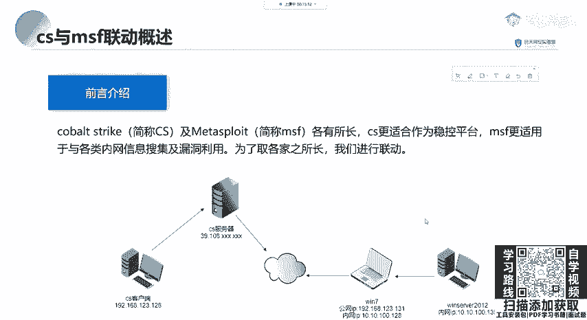

这个如何开启代理呢？如何开启代理？都以这个seast这个为例啊，都以sstem为例，开启代理。是直接socks。加上我们需要开启代理的端口，需要开启代理的端口。比如socks开启代理1234。

1234开启代理之后，我们可以在这边的manager啊，不是是viovi显示里面的这个代理查看里面去看到在1234开启了1个ss4I代理服务。

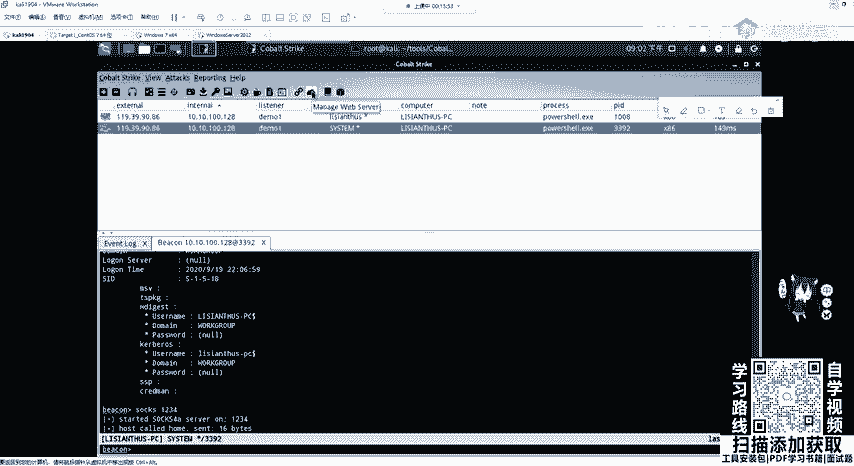

那我们可以来到。服务器上面这个服务器我SSH连的这个VPS去查看一下是不是1234已经开启代理服务了。OK这里可以看到1234已经开启监听等待连接。那我们如何去连接这一个代理呢？它代理是开在哪个地方的。

是开在我们客户端吗？不是是我们一切的操作都是对服务端而言，你客户端做的只是连接服务器，所有的攻击所有的上限都是在VPS上面的CS服务器来讲的。O大家一定要记住这一点这一点。

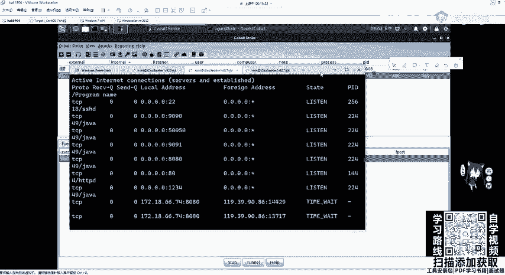

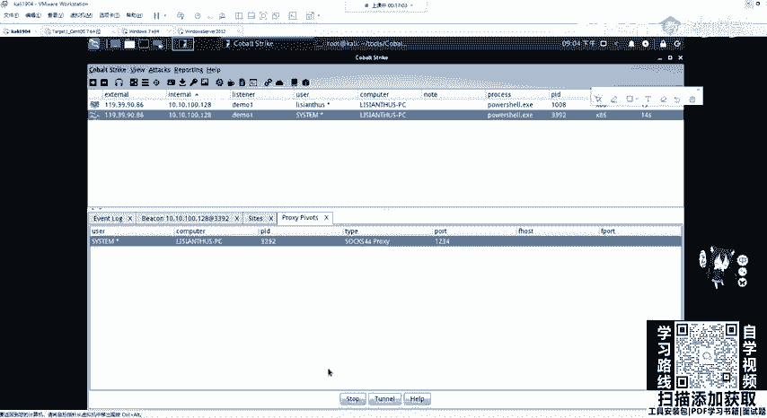

那我们比如咖利里面去开启这个服务，去开启去打开这个链接。

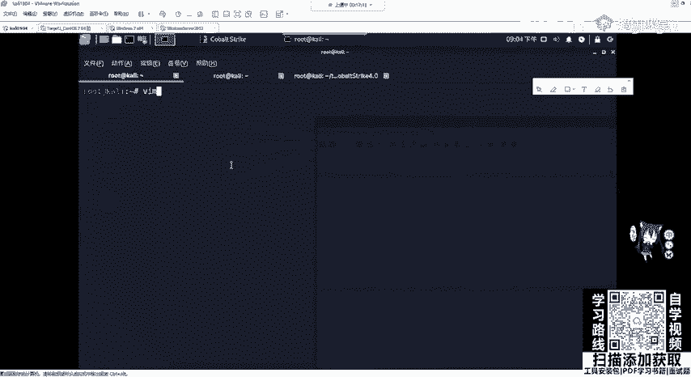

有一个呃软件叫做perpro chance这个软件。可以进行配置IP和ss服务端口进行连接我们开启的代理。

它的配置文件在ETC配置部骤下的proces chance。点康飞个。我们VIM或VI也进入里面之后啊，可以看到在最下面它会告诉我们配置连接有一个例子，可以配置ss5连代理HTTP代理和ss4代理。

那这里我们服务器是ss代理。那我们就把这里给写写到这里就行。ss4空格，然后加上我们服务器开启代理服务器的一个地址，3910868207，加上开启ss代理的端口1234。Okay。然后进行代理运行。

在我们需要运行的命令前加一个process chance。加上运行的命令。比如我发现通过端口扫描，发现在内网中有什么有135这个机器。那我本身能不能连到它呀？服务器不能开启代理之后是不是就能连到它了。

那我们是不是可以P，不可以。

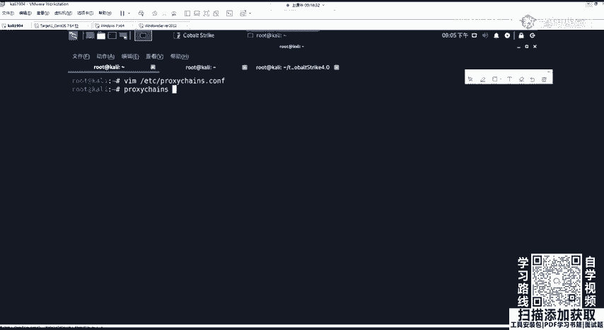

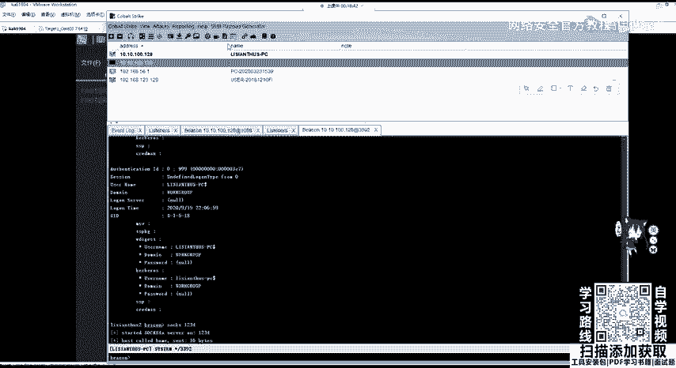

啊，不可以聘，为什么不能聘呢？因为我们的ss代理是工作在TCPIP协议的上一层的。就工作在RMREMCP协议上一层的，它并不能对P进行一个代理转发。

那但是这里我们N map是不是可以进行no pin扫描啊？O那我们可以N map进行扫描，看看是否进行连接。如果我们只是单独的使用N map是肯定无法连接到内网的那这里要加一个pro tense。

加上我们的T4啊ST，也就是no pin。加上啊我们的1加上内网的地址。

OK可以看到这里它会有一个显示验证80是存在的。当然这里是非常的慢会非常的慢。会非常的慢。因为我们走这个代理，你想要是这个代理是怎么走的，是不是走到了我的一个呃虚拟机，虚拟机跑到我的物理网卡。

物理网卡跑到了运营商的上级交换机，然后经过啊这个交换机的一个路由到达这个VPS服务器，所以它非常的慢，包括N map的这个流量也非常大，所以它转发起来是非速度非常的慢的。

那这里时候我们可以减几个重要的端口进行扫描。大家应该还记得N map的参数。比如扫描22端口80端口135端口，445端口。4443专课。23306端口。还有3389专课。进行个扫描。

那我们来看他这个扫描结果应该就不会那么慢了。OK这还是有点慢，这一个没办法硬伤这是。Time up。嗯。Yeah。Yeah。Yeah。Yeah。这里慢的话，我们就不等它了，可以已经看到了啊。

OK这个已经帮我们扫到这个开启的一个端口了，分别是2280135443。4220关闭了啊，80关闭了，那开始了135和3306。其实80也是开的，因为它的这个延迟导致了它的一个呃检测出现错误了。

那再来跑一遍。因为这边我是开启了这一个阿帕奇的。

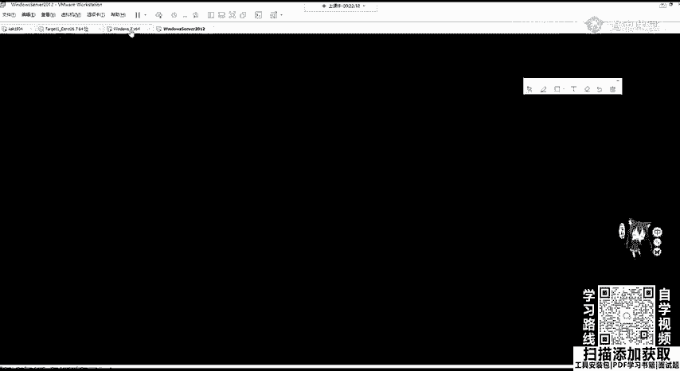

。OK看这个时候扫面那个嗯就已经开启了。那这po police chance在后面我们还会再继续讲，因为它是一个比较好用的。代理。可以直接配置s进行代理链接。那这里我们。

也可以对winESE进行一个执行。winESE在卡利里面是自带的，可以在执行我们内网的一个命令啊，内网的命令这里比如说我改成我刚刚的一个内网机器。10。10。100。135，这直接是执行。

你肯定是连不到他的，我输一下密码。啊，肯定是连不到它的那这就不用试了，你需要加一个呃，就是你想要哪一个有练药代理，就直接在上面前面加一个procy chance即可。那这时候我们再去输入我们的密码。

这就会来到什么？来到我们的这个。哎，稍等一下。Yeah。他没有过来吗？好。其实是已经连接到了，因为这里都显示OK了，那它已经连接到我们内网的一个机器了。那这里它比较慢，我们就不等它了。

大家可以自己去尝试这个PPT我A都会发给大家。OK如果我们poise chance的一个工具的缺点就是需要依次代理。如果想方便一点，可以直接把MSF是挂到内网中去。如何去挂呢？

就是在co strike里面的vi啊vi里面。这谁的机器又上线了？咩嘢啊。那我们在vio里面可以看到这一个。

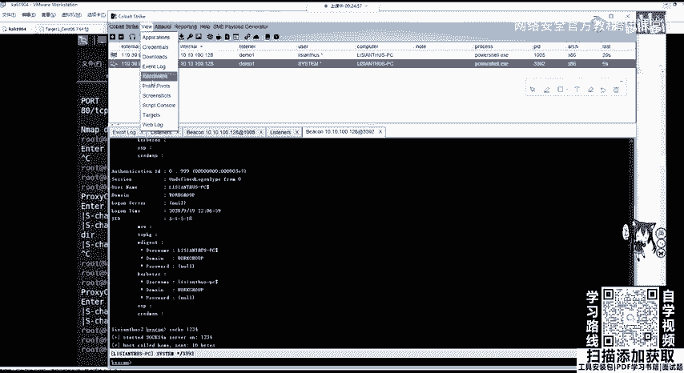

。我们的process print，那我们可以在这里去。点击特no。会来到这一个东西，那我们把它复制过来。去在我们的MSF里面去执行。打开MSF。Yeah。当然这个地方大家有可能会出现各种各样的错误。

多尝试几次，注意细节，应该不会出错。然后把它直接粘粘贴过来，粘贴过来。这个时候我们MSF的一个代理，就被整个MSF就被代理到了这个1234端口。那这接下来我们是不是就可以进行一个呃辅助模块的扫描。

比如scanner，然后SMB。SMB。Okay。嗯，MS17010，比如这样，然后我们show options。s我们的什么areho。比如说是10。10。100。135或者是点0-24。

指定它整个网段。那这里因为它扫起来肯定比较慢，因为走代理，那我就设置为135。进行run。OK这里是出错了呀，这个代理。Yeah。那我们先看一下在这个proch。在MSF中实行代理中，一些配置。

可以使用set reverse allow process true。通过这个设置可以让socks反弹share，但是不推荐这个大家可以看到，我们使用代理，不论是prose chance。

我们扫描端口的时候，是不是误报把80把我们第一次给t out了。那同样你去用这种东西去反弹sha，那肯定速度更慢。在一开始讲内网上线的时候，上线到co strike就已经很慢了。

你再用这个进行反弹shall，那种基本上就t out了。然后下面呢我们可以对一个目标进行检测，进行检测。O那我们这边可以简单试一下。Okay。这边还是不行的。Yeah。好。OK这个是非常的慢的非常慢。

那接下来看一个就是CS如何联动MSF。

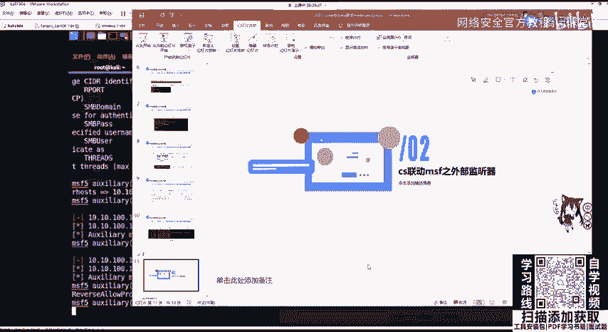