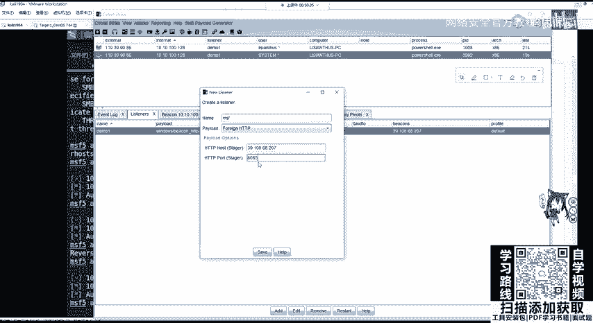
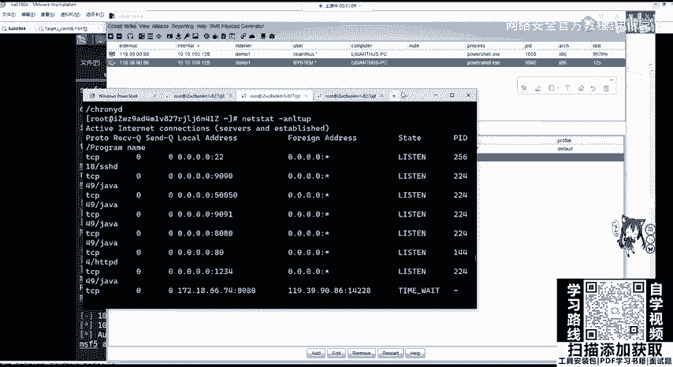
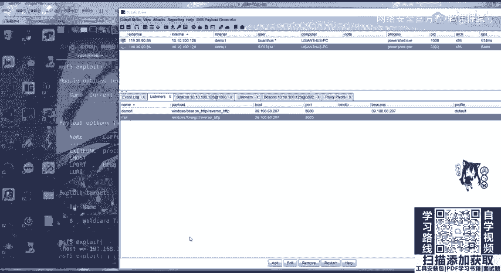
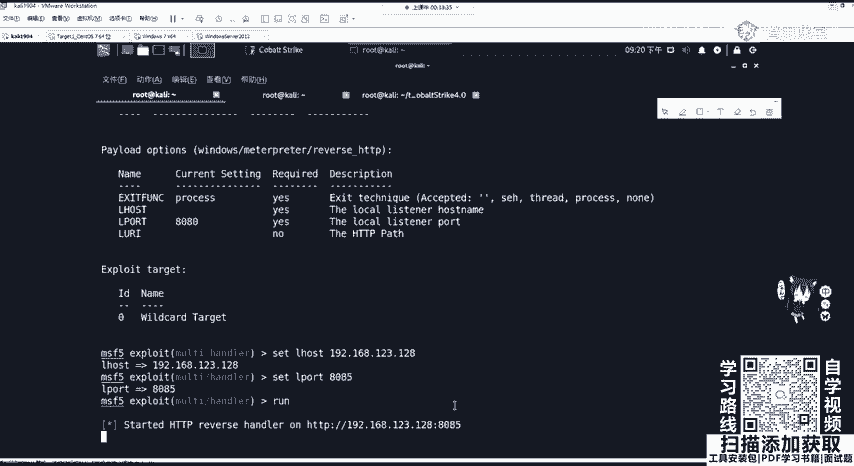
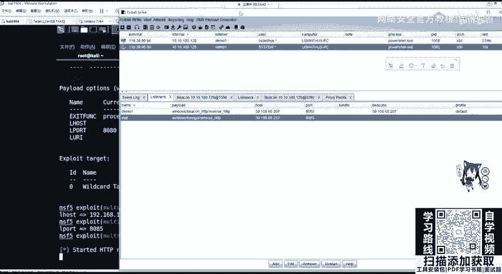
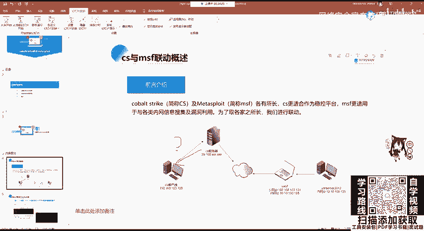
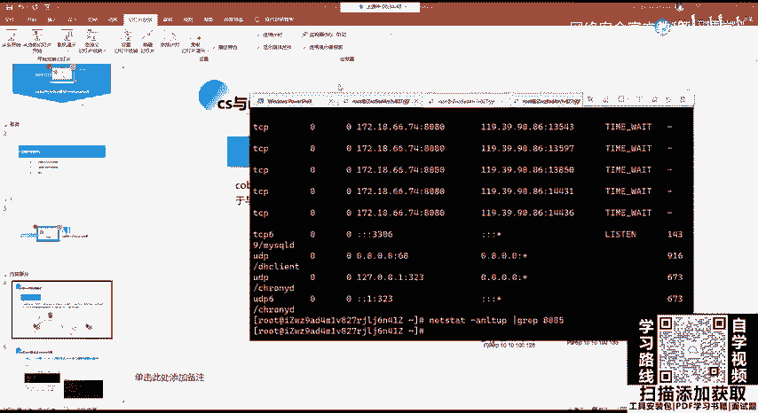
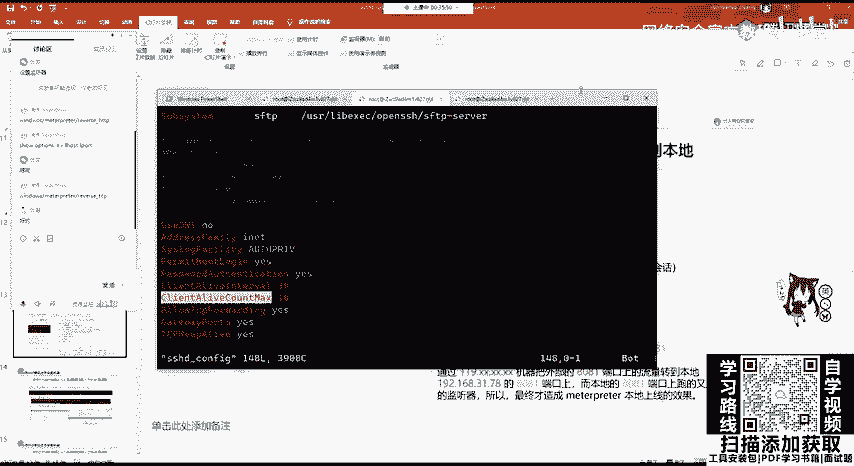
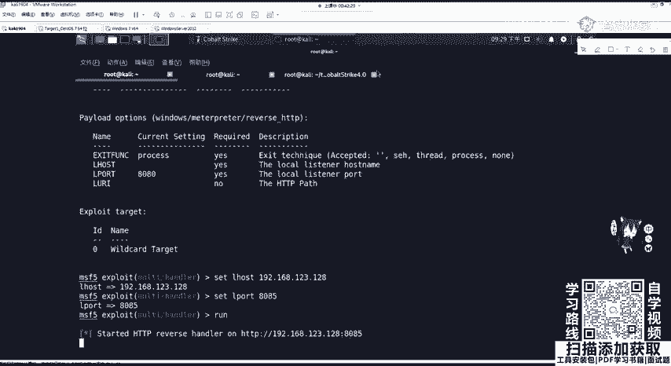
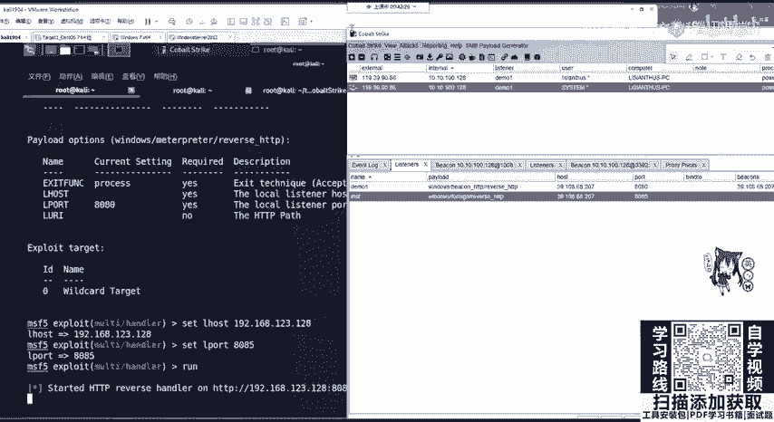

# B站最全网络安全教程，整整1300集，全程干货无废话，别再盲目自学了，看完学不会我退出网安圈！（web安全｜渗透测试｜内网渗透｜CTF） - P74：73.cs联动msf之外部监听器.mp4 - 网络安全官方教程 - BV15u4y137cQ

我们如果能把内网上线的机器去发送给mate split，变成matepri，去执行更高的一个操作，更拓展的操作，那就非常方便。现在要做的就是这一个在讲lister的时候，我提到外部监听器。

那我们将内网主机上线的session去发送给meta split就是要创建一个新的lister监听器。这里监听器去设置piload为外部paload外部pilo。这一一直不行啊。不行就算了。

这个代理也不常用，你不会这样去扫的，这扫没啥用，特别慢。那，这里我们来操作一下，首先创建一个新的lister。比如SMSF选择piload为外部piload。如果你是使用CS3。0版本。

你会看到外部piload有很多。那这里4。0可以剪成了两个，当然也没有什么大影响。我们选择外部HTTES。就会让我们设置两个一个hos，一个port。

也就相当于我们MSF show options设置里面的logo host和logo port开启端口监听。那这里我们的logo host，也就是服务器的地址3910868207。

它的端口这里给大家设大一点，就8085啊，8085。

设置好之后呃，在这边8085可友经开启了。我以GAP一下更快。甲AP是正正正则查照8085。Yeah。哦，这里我们需要去连去转移它的时候，它才会开启啊才会开启。

那我们来看一下如何把这个system的这个session去发给我们的mate operator。

在设置好我们的。listen之后，我们需要对MSF进行配置，使用我们的exportit handleer模块，并设置piload和我们监听器设置的piload为相同。

设置logo host和logo pot开启监听。那这里我们又。这一个hander。然后show options它默认是不会选择排load的那我们可以s排load。下载拍到的是什么windows。

Okay。啊，这就用到我刚刚讲的那个。Mt operator。reverseHTTP为什么是HTTP不是TCP呢？因为我们lister这个地方你开启的是HTTP啊O那我们。

MSF就是HTTPs options。是how options需要配置logo host本地地址。那大家呃现在就问起来了，你这个logo host是配我们卡利的内网地址，还是配我们服务器的IP地址。

还是配我们服务器的IP地址？啊，这里我就直接讲了是配置我们的。本地地址一定要记住。目标机器的地址是r houseloL host是logo house，也就是本地地址。不论你是发生在什么情况。

这里一定要配我们卡利所在的地址。我们咖利所在地址是19192啊，你不知道的话，可以发一个top图看123。128。我们的logo po开启监听的端口，要和监听器相同。80858085。

然后把它撞起来。run起来之后，我们在卡利这个MSF所在的机器上面开启了8085端口的监听。

接下来我们需要将cogle strike服务器这个。

也就是我这里还拿top图来讲，也就是将我们co strike的这个服务器的这个地方啊，这个服务器它上面存储的session给发送到CS客户端，也就是mateta split所在的机器。

从39108到192168123128，我现在请问它可以连接到这里吗？也就是CS服务器。可以连接到这里吗？肯定不行，不信我们可以拼一下。因为哈利在内网里面呢。

在内网里面呢肯定是拼不通的啊肯定是拼不通的那我。

我这拼内网地址，外网拼不通内网。这怎么回事？

嗯。对。OK这个不同，那怎么办？我们还是要做代理转发。代理转发可以使用其他的工具。当然有一个非常方便的就是SSH隧道。通过编辑SSHDSSHD是指SSH的服务端开启SSH端口转发功能。

并且重启SSHH服务。那服务器的SSH配置，它在哪儿呢？在我们ETC目录下的SSH目录SSHDconfi。那我们来进里面看一下。

首先CD到ETCSHH里面可以看到有两个confi分别是客户端的confi和服务端的confi。这里我们需要对服务端进行配置。千万不要配置错了。在服务端进行配置，我们需要添加这两这三个东西。

或者是将它的注释去掉。

分别是pasword password密码认证。yes，也就是开启我们的密码登录。开启TCP转发E。然后开启我们的getaway pose yes和TCPke alive。 yes。开启之后进行保存。

保存，然后使用system哦，这里我是以sOS进行操作ret。SSHD一定要加上它的服务器，把这个执行，因为我这里就不执行了，它我已经配置好了，它就会有隧道转发的这个功能。这个有有学生走了，是听不懂吗？

听不懂的话，你可以在。嗯，讨论区随时问啊随时问。那这里SSH最大的常用参数给大家稍微讲一下，不需要记忆，只需要复制粘贴，那一定要学会复制粘贴。那首先杠C是指压缩传输。

杠F是指将SSH转入后台执行杠N开启静默连接杠G是远程主机连接本地用于转发端口L呢是本地转发P指定SSH端口。那我们将这一句直接复制过来，进行一个代理转发。它是在我们的卡利里面进行运行粘粘贴过来。

我们需要对它进行配置。首先我们是对公网的1个8085端口是808。如果忘记的话，你可以在这边去看8085端口。这边的8085端口映射到我们本地的连接8085端口，我们是将哪一个服务器映射呀？

root用户的39。108点多少，我看68207。杠P指定SSH端口默认是22。那这一这一句执行，它就可以将8085端口通过SSH隧道给转发。那这里我再给大家看一下，那root艾这个是什么意思呢？

我们需要连接我们远程服务器怎么连接，是不是SSH加上我们的。需要连成软件的主机名。用户名艾特我们的主机名，比如3，这里直接39啊点108。点68。207。让我们输入密码。

这里我们是不是延伸到了我们的阿里云的服务器？OK那这里呢就是多了其他参数，对它进行一个代理转发。那同样我们在执行这条命令之后，他也会让我们输入3910868207的root密码。不要输错。

你intint之后为什么没有进行一个交互？因为我们进行交互的隐藏，并且将SSH传输数据放在了后台运行。通过参数，我们可以使用NTSTIT。去查看这个时候可以看到。有1个SSH是处于连接状态的。

连接到了我们的3910868207，它需要转发的是我们的8085端口。这个时候我们内网机器的8085和公网VPS3910868207的8085端口就已经通了就已经通了。我讲这些IP地址。

大家很有可能会混。我们再来看一下吐不兔。Yeah。192168123128是卡利MSFco strike客户端所在的内网地址。39108点这个点点什么是公网，也就是阿里云的VPS服务器。

在上线CS服务器的靶机分别是W7，它的公网，也就是能连通互联网的IP为192168123。131，它的内网IP也就是通向下一层内网的网段的IP是10。10。100。128。我们理清top图之后。

那就非常清楚了。我们公网的服务器是无法拼同内网的。CS客户端可以连接CS服务器，能够并通，但是CF服务器并不同CS客户端。那我们在CS服务器开启了8085端口的监听器lister。

我们需要将858085端口和CS客户端所监听的8085端口通过SSH进行隧道端口转发，使其两者互通。互通之后，我们可以在CS服务器上面操作已经拿到上已经上线的session进行s，也就是转移。

哎，我们来看一下，这个时候我们这个mat split放小放在这儿。

然后co把放在这儿来看一下它的上线过程。

选中system这一个user的一个session，有上线的主机。这一个。在这。选择它上线的主机之后，我们选择右键spa进行转移。转移它也会让你选择listener监听器。又来到这里了。

我们对CS的一切操作都是服务端的监听器所造的所做的操作。所以listener拍load就构成了我们CS的核心。那么我们这里选择哪一个是不是选择对应的MSF pilotlo的。

也就是外部的HTTP8085端口。我选择第一个啊，选择选。选择这个MSF啊，我也不知道怎么回事啊，choose。😊，OK大家注意这边注意咖利这边。这现在已经把包发出去了，我们来看这边有没有什么变化。

它这个是很慢的啊。