# B站最全网络安全教程，整整1300集，全程干货无废话，别再盲目自学了，看完学不会我退出网安圈！（web安全｜渗透测试｜内网渗透｜CTF） - P75：74.cs联动msf之实战演习.mp4 - 网络安全官方教程 - BV15u4y137cQ

Yeah。

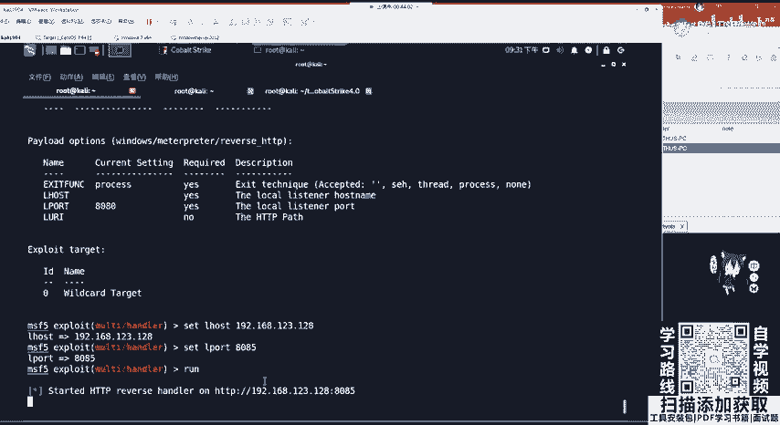

嗯。他这边那个代理这个这个掉了，代理掉了，那我们重新开一下这边的代理啊，重新开一下这边的代理，他没有连接到我们的8085。没有连接到我们的8085。

。Yeah。这里进行一个重新的连接。首先看一下这个8085还在不在。嗯，8085是在的。不。我们可以将这个SSH给删掉，这个叫做Q9485和9444。Q94应该是网络环境的问题啊，他是能够弹过来的。

只能够谈过来，我们先把这个给 run起来。装起来，然后做一个转发。转发之后，将这个给spon回来，点击MSFchoose。是。不。这边的IP应该没有错吧，看一下。是没有错的。你这人过不来呀。

那过不来的话，我们就换一个监听器吧，换一个监听器。首先先把这边的给删掉。他没有进行一个正确的代理转发。将SSHQ。9494。给它删掉，删掉之后，我们去创建一个新的监听器啊。

还是嗯IDIIDD这里再给大家演示一遍。这比如说MSF2。他的一个地址是我们公网地址，39店108点。68。点207设置我们的一个port。19999。So。这9999会在上面进行运行。

那么们将本地的9999端口进行1个SSH自大转发。哦，这个地方我搞错了。我找到原因了，这个地址我没有改啊，这个内网地址。是不是要改成我们的123。128改成这个机制？啊，前面的进行所有的端口进行转化。

9999。后面跟我们的。root3910868207。啊，这边我们要开启一个监听。就 my hasplay。这边输入密码。这开启转发之后，看一下有没有正确。9999OK我们现在哦，这个8085给搞错了。

这边也要改。setlogo port等于9999。runrun起来之后，我们将这个点击spon，选择MSFR类似的choose。OK这边因为它需要经过一个远程发送。

大家是不是看到这边mate print session一op？哎，等一下，因为这个经过了代理是非常慢的，它需要SSH隧道转发。这里我们拿到met了，是不是可以get uID来看一下。

OK都能正常的一个执行。正常执行之后，我们还可以进行一个进程的迁移，或者是shall去拿到它的一个shall。拿后这断断码的话，可以CHCP，65006或者直接什么都不干。

这时候我们是不是拿到了matetter operator？就是一个能做更多的事情了。Yeah。那这里大家有没有什么疑问，要需不需要呃再演示一遍？大家听懂了吗？

这个过程就是将这一个上线的这个session去发送给我们的matepre。嗯，对的，因为这些操作一般记不住的，没事，自己记不住，没问题，自己从头到尾敲一遍，绝对就懂了。绝定就会了，你再不懂。

敲两遍肯定会。就是迷茫迷茫，再迷茫就懂了。这里我就给再大家再再演示一遍吧，那要不要？用不用再演示一遍？hello，大家还在吗？😊，Okay。嗯，听懂了吗？这个将session去发表。行。

那我再给大家讲一遍。那这个内网主机上线这个就。

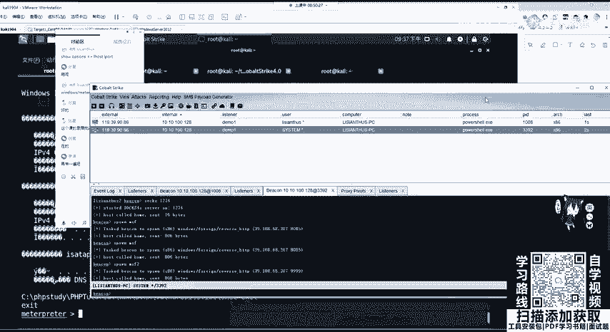

不需要了吧，这个就不需要了。因为通过命令执行tack进行生成内网主机上线即可。那这里。我给大家就从这个主题上线这个地方来讲。主机上线进行提全之后，我们会拿到一个session。

也就是sstem user的可以在这进行交互。

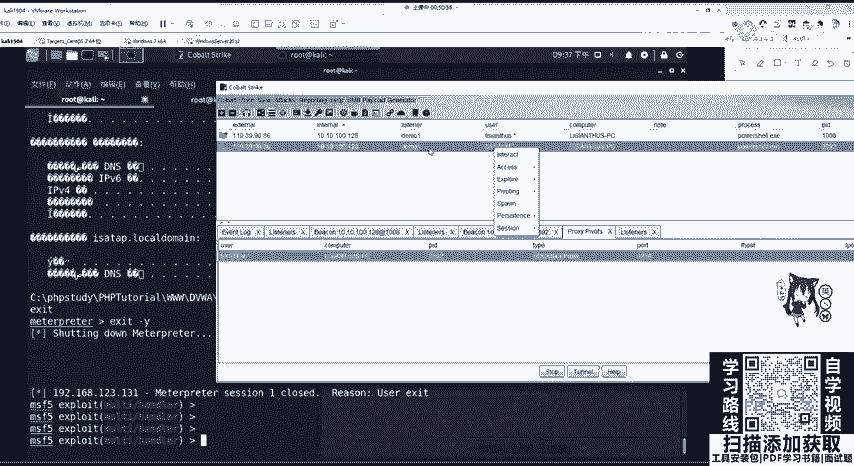

这是交互，我们现在要干什么？想利用第二个神器，也就是matetter print进行一个。呃，利用拿到它的matepre，但是这个coer strike所在的服务器在公网上面。

而我们的MSF去接收matepre在内网中。我们公网是没有办法拼通内网服务器的，所以我们需要利用SSH做隧道转发。这SSH隧道转发的命令，大家不需要记忆，只需要粘贴和修改。

那这里我们对co strike这个都需要做一个啊内网的一个lister创建。我们创建lister给大家演示。首先co strike listeners。爱的。

创建nameMSF3选择paload为外部拍lo的其中之一可以选择外部HTTP。会让我们设置host的地址和port端口。这地址设置我们CS服务端所在地址39。108。68。207。端口自己去设置。

推荐设置一个比较偏僻的端口，比如7777s。这时候我们在listeners面列表就会看到我们刚刚创建的MSF3这个lister。这个时候我们来到内网里面的MSF，这里大家应该都都会进吧。

我就给大家再进一遍MSFcon。进到这个里面之后，我们需要创建一个hander，等待监听，也就是useE叉P melt handleer。去set它的一个拍load。

为和我们lister pilot一样的，我们lister pilot是windows reverse hTTP那所对应的MSF的 pilot reverse TCP是HTTP是哪一个呢？

也就是windows啊mat。加上reverse。HHTTP。要保持一样。然后我们对palo进行配置，配置airhologo host为我们本地的地址，也就是卡利的这个地址。我这个卡里的地址是192。

168。123。128。那slocal port和我们co strike所开启的MSF3lister port要相相等，也就是7777。

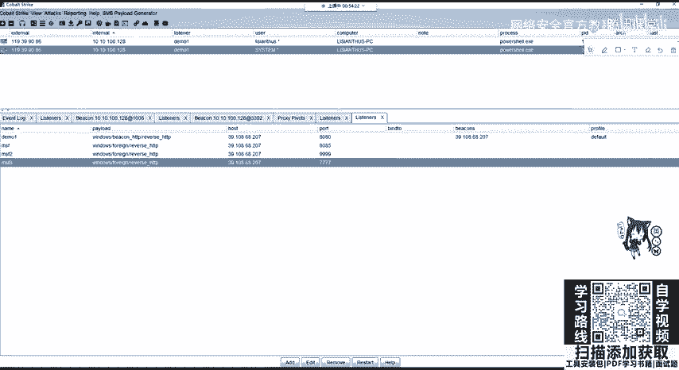

然后配置好之后，我们run把它运行起来，在他利上面开启7777端口监听。这个时候，我们的777和CS服务器的777并没有互通。我们需要进行SSH端口转发。如果大家SS端端口转发出现错误，想把它关闭的话。

可以使用NETSTATT杠ILTUP也就是查看list似的IN所有的，包括TCPUDP的介议，包括看它的PID。

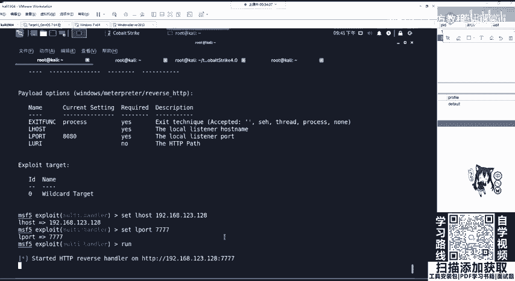

那这里我们先去看一下，发现我刚刚上一步上一次的时候，我们开启了1个SH服务端，它还在监听，我们可以把它关掉它的PID叫做9517，我们Q杀死9517，就可以把它关掉。啊，他已经没了。它没了之后。

我们需要干什么？需要干做一个端口转发0。0。0。0。如果配过IVPS安全组的时候，应该知道这叫所有地址，所有ITV4地址。我们需要对哪一个端口进行转发，是不是7777端口，转发到哪里。

转发到我们本地监听的7777端口。使用哪一个SH使用转发root用户加上我们的主题地址端口SHH默认的是22，或者是你不加都一样。进行回撤，它会让我们输入root用户的SSH密码。大家通过自己执行。

这这里我这个密码是没输掉，可以通过自己VPS的密码输入上就行了。说上之后，这个时候你再去NETSTIT去看一下啊，OKOK这个时候已经连到了这边68207这边的1个ICSH隧道。那这个连上隧道之后。

我们这个777端口和这边的CCS服务器端的777就已经连接完毕。连接完毕之后，我们想让这个session，也就是拥有高权限system权限的session，转换成我们卡利的mat printer。

直接右键点击spon，选择我们刚刚创建的listenerMSF3，点击choose。

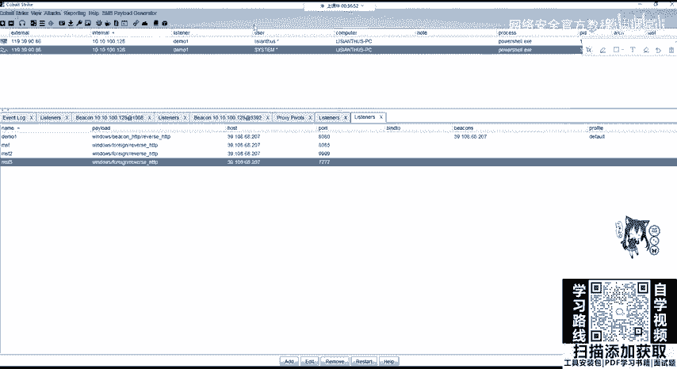

稍作等待。嗯。这边收到mate。稍作等待，因为它需要发送stage，因为我们生成的是stage的，而不是stagelesspiload，它需要进行一个stage发送。等待之后。

我们拿到matetter print，这就可以利用周五讲的mattter split进行一个后视统的利用，包括代理的搭建等等。那，这里大家应该。嗯， ok。那这节课。

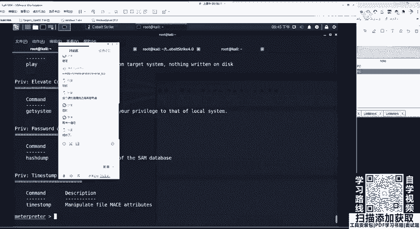

内容就算讲完了，但是CS的功能还有很多，包括。我再给大家讲的那个。不是啊。这个。被攻击的，你可以不让他提全，没有断没有断呀没有断啊。你看他拦截的是什么东西。他拦截的不是没有用的东西啊。

它拦截的是我们放在本地的一个缓存文件，没有问题的。你不提选也行，我可以把这个session。我可以把这个session就把这个也也放过来，但你你你放到这边。

你获取的met是licy answers这个用户的权限，你获取的不是最高权限。我们既然已经在这进行提全了，为什么不直接获取这个高权限的session呢？这两个session都可以过来的，都可以过来的？

都可以过来了。OK那我们。拿到mettter print之后，这个操作。就很多了，就很丰富。当然CS还是刚刚讲这个用处特别多，还还有其他的一些东西，大家可以自己在后面自己去看一看，或者是用到什么。

不是啊。怎么了怎么不不行一键齐全了呀？他因为有这个漏洞吗？我这个。是有脚本的呀。他不是让你选择这个漏洞吗？比如UIC token啊。还有MS如果是还有17010的脚本，它有这个漏洞才能提全。

那MS17010达到的就是这个最高权限呀，就是最高权限。它从administator切换到stem是没有问题的呀。但是我们这个从ACS我这自己创建这个用户去切换到stem，你只能是靠漏洞去打。

打进去的最高权限。

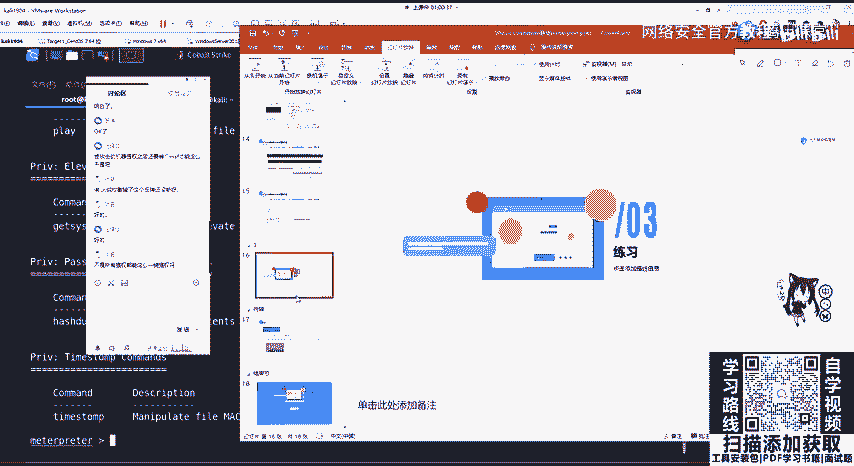

不能立一键齐全的，这个一键齐全，还是要看约束性比较大，包括get system那个m里面的命令，这个约束都比较大。那我们作业的话就做两个实验吧。就做这个。和厅网安实验室的完整生核测试这里。当然这个是。

呃，3。0啊3。0，因为那个群里面的文档没了呀。群里面的文档没了，没了，我就直接发在这里了。这是作业啊作业。是一个完整的渗透测试之旅，大家可以去试一下3。0怎么用吗？一样的。Yeah。然后。

去做一下这个MSF。还有就是如果大家有能力的话，可以去购买1个VPS。如果是在校大学生或者是24岁以下是有学生机可以购买的。阿里云可以去购买1个VPS一年也非常便宜。如果你是在这些疫情期间的话。

还可以半白白嫖白嫖半年的1个VPS服务器。大家都可以去尝试，或者是去嗯不推荐去购买国外的，因为这个本身就很慢，你国外的更是卡的一批。那这就做两个实验了。

那大家可以自己在公网的VPS上面去搭建一个嗯coba strike进行一个尝试，进行一个尝试。

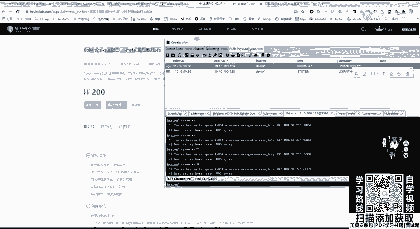

那大家还有什么疑问吗？

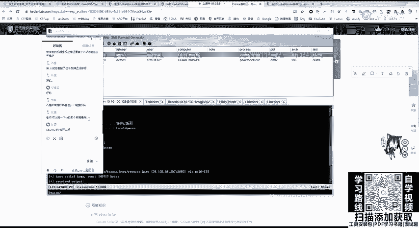

CS红病毒呀，那红病毒就是。

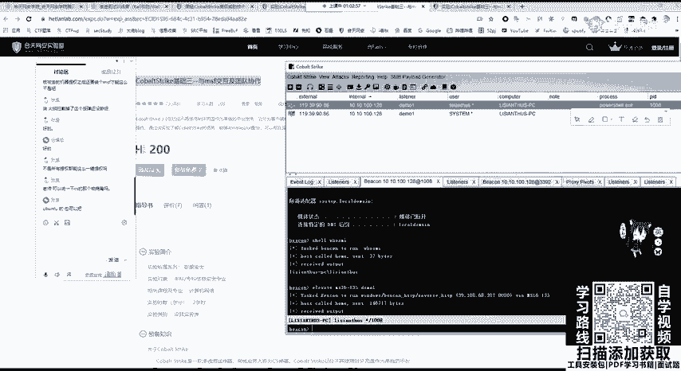

你的这个比如PPTPPT在里面这个插入。操新版的是什么鬼？那新版的这个是什么鬼呀？OK在视图里安安班图也行的，都可以的。你只要安装了java这1个CS都能启动，在这个红里面，你新建红。

然后把那一个它生成的一个脚本你去运行就行了。怎么放进去，你这生成了不是可以运行吗？这个实验室好像有这个实验吧，你可以看一下。这个其实用的不多，你会被查杀的。看一下。这个是。嗯，我看一下看一下。

好像是有这个实验的吧。没有啊。😔，是这个实验吗？OK你可以去看一下这个实验，他告诉是MSF的。你这个这个杀软会拦截的。你现在的嗯office，你有的时候你打开从网上下载的文件，包括邮箱。

你是不是会看到一个叫做嗯在保护视图中运行，你是没有办法编辑的。office自己就会把它的毒杀掉，并且还有windows defender，包括其他的杀毒软件。对你这个发给别人是现在就是。

你这有杀软回拦截的那大家还有其他的什么问题吗？那，如果有问题的话，可以在群里去问我们的每个老师都行，嗯，可以去或者是私聊我。那这9点多了，大家早点休息，明天还要上班上学。呃，确实东西有点多。

还是要提醒大家一句，一定要动手操作。操作才能理解才能不是说记住啊，才能理解。如果你不操作，只听，那你最后肯定什么技术都没有，什么都不会做，也相应的不会进入渗透测试，这个岗位肯定会被淘汰掉，要多动手。

那这节课就先到这里了。嗯下课了。

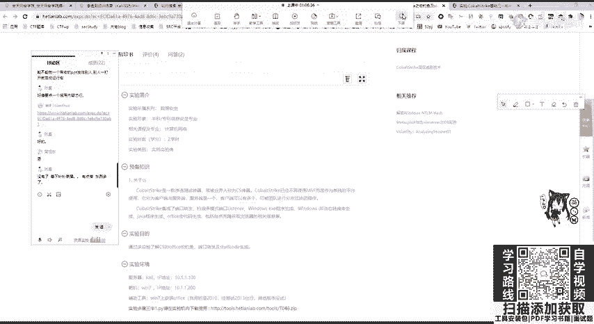