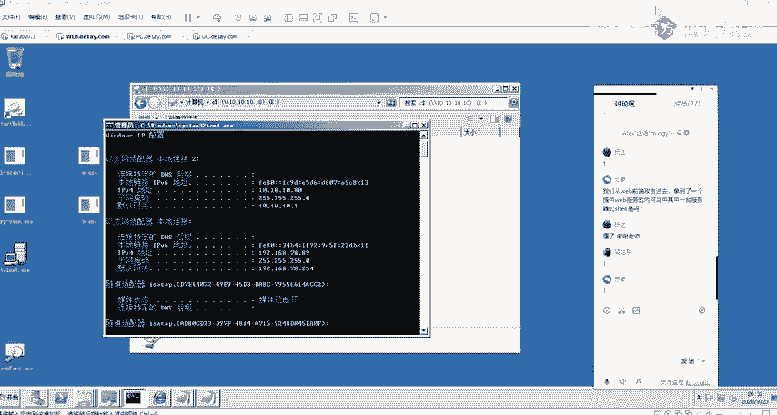
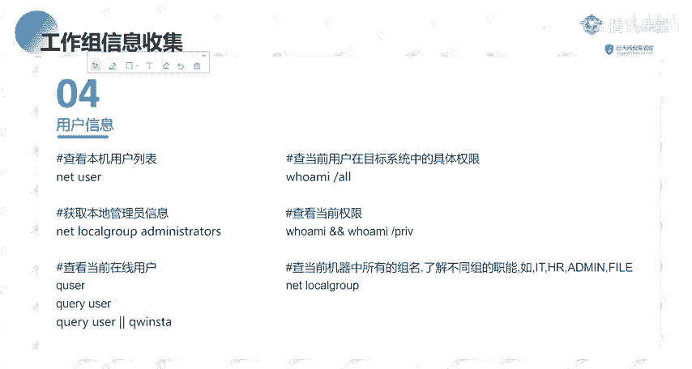
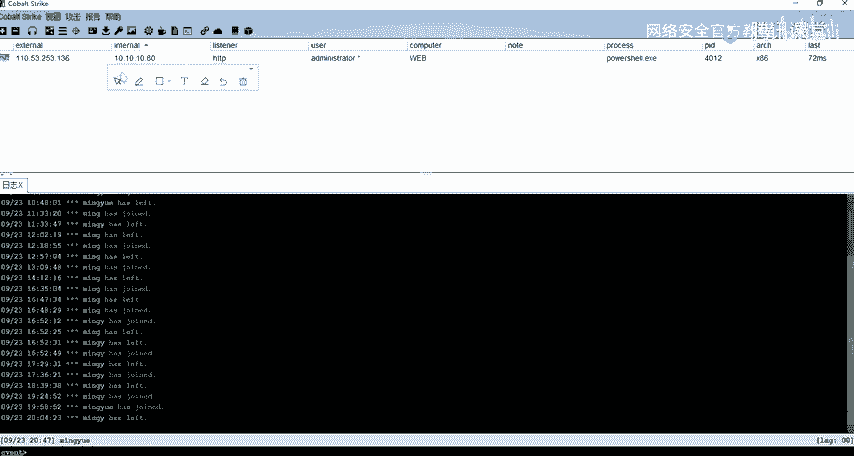
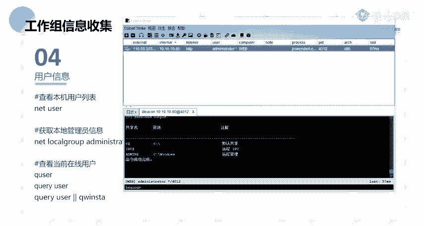
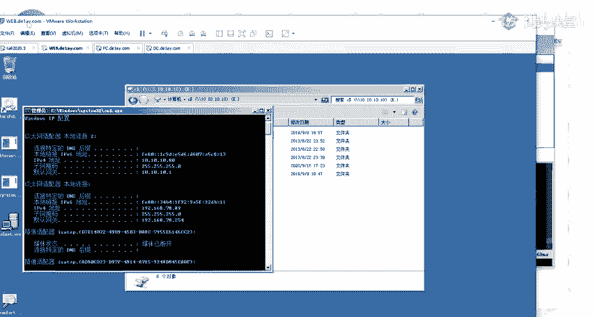
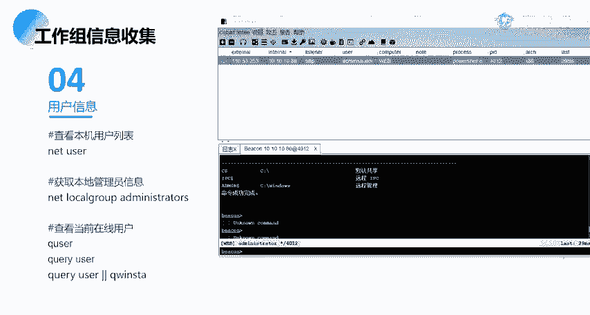
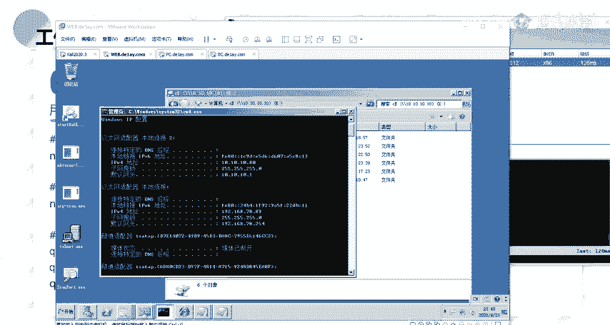
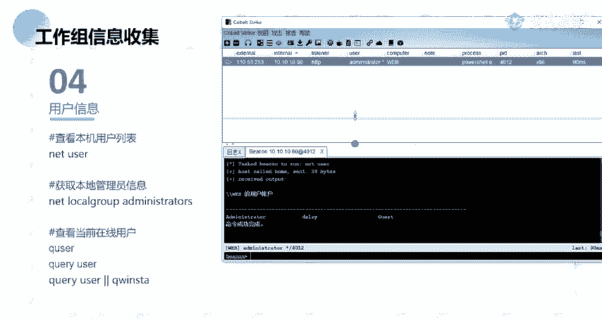

# B站最全网络安全教程，整整1300集，全程干货无废话，别再盲目自学了，看完学不会我退出网安圈！（web安全｜渗透测试｜内网渗透｜CTF） - P76：75.Windows基础信息收集、本机进程信息.mp4 - 网络安全官方教程 - BV15u4y137cQ

🎼，🎼如こ。🎼有一轮酒过有三0。🎼，🎼有一群少年望着星星。🎼有一卷长夜。🎼以为我的远。🎼それ？🎼有一次呼火窗外。🎼花那些。🎼给我。🎼所无穷的人。🎼多回一次家。🎼我现在哭喊。🎼有没有辜负？🎼的人。

🎼不负自己，不傲。🎼看恩。🎼Yeah。🎼Yeah。🎼有一场小只有。😔，🎼三旬。🎼的。🎼又一次痛。🎼出。🎼假的真心。🎼有一些不可。🎼有一被抱怨。🎼又一次开心的委屈。🎼求全。🎼你拼过了命啊。🎼最优秀的人。

🎼，🎼我回忆死掉。🎼看。🎼我现在哭好。🎼有没有辜负的人？😊，🎼辜负自己。🎼可能。🎼，🎼追你爱上。🎼其实。🎼世界。🎼我不可。🎼不平。🎼的漂泊。🎼说爱我。🎼就多几。🎼好，请大家晚上好。

🎼然后还有大概呃还有一分钟的时间，我们今天的一个课程量容的话就要开始了。然后在快上课之前的话。🎼先测试一下我的一个麦克风吧，就呃大家能听到我麦克风的声音的话，在这边扣个一，好吧。

🎼然后还有就是如果呃我的一个麦克风啊，还有就是呃整个画面有杂音，或者说不清晰的话，大家都在这边跟我说一下，好吧，反馈给我。然后我这边去做一哦，歌声音太大了是吧？呃，关了抱。一在。啊，我把歌已经关掉。呃。

还有其他的吗？就是呃声音声音方面还有就是画面应该都没有没有什么问题吧。Carpen。呃。能听得到吗？正常正常的话okK。Yeah。好的，那么正常的话，那么呃。正式开始我们今天的一个课程内容啊。

然后在正式课开前开始之前的话，呃先大概说一下吧就。呃，我们。这边的话稍等一下。啊，就是后面的一个课程上的话。呃，都是由我去给大家做一个讲解。就呃我们现在的话是在内网信息收集，呃。

后面的这一些内容的话都是由我给大家去做一个介绍。所以的话呃在后面的话会有很长的一段时间，就是跟大家做相应的一些交流沟通什么的，对吧？然后的话呃在这边的话先就是大概给大家说一下。然后呃。

然后的话嗯我们之后的一个课程内容的话，因为前面的话是拼wordb方面的，就是呃从我们的课表当中的话，其实也能够大概知道前面的话就是一些呃wordb相关的一些东西，对吧？

然后呃以及就是我们采用的渗透测试的一些框架。然后后面的话就是着重于我们的一个内网的一个渗透，以及我们的在去进行内网渗透当中所需要去使用到的相关的一些技术，以及我们的一个预渗透，🤧等等的相应的一些技术。

所以的话在后面的话课程内容的话，它的一些点的话会相应的会增多。大家需要做一个做好一个心理准备，好吧。啊，呃我在这边呃，我在课上讲课的话，大家如果有没有呃，如果碰到有什么问题，对吧？有什么疑问的话。

大家就欢迎大家就踊跃的在这个讨论区之间发出来。好吧，就直接你直接在课上问就OK了。当然的话如果你课上不好意思问，你可以课后的话私聊我也是可以的。嗯，建议的话还是就是说呃你直接在课上问嘛，是吧？

因为你可能你碰到的问题也是其他同学正好呃，不知道的一一个问题。然后我在课上解答的话，等于就是给所有同学都做了一个相应的一个解答啊，就不需要说呃在课后的话再给大家一一解答。这样的话呃比较浪费时间。🤧嗯。

好呃，大家对我这一些的东西的话应该没有什么问题啊啊吧，应该能理解。好，然后的话呃没有什么问题的话，我们开始我们今天的一个正式内容啊。我们今天的话是给大家讲的是一个呃windows的一个主机信息收集。呃。

稍等一下。Okay。Yeah。一个呃windows的一个主机信息收集。然后呃我们本节课的话主要分为这4块内容，就是呃会带大家去了解，分别的去了解这4块。呃，当然的话呃因为我们今天晚上的话。

一个晚上是两个课时，对吧？我这边的话是把它每一个内容的话都是放在了1个PPT当中。那的话呃我的一个计划的话呃，正常情况下面的话就是前面的两部分是呃第一个课时，后面两部分的话分为第二个课时。

然后第一部分的话就是一个内网环境的一个分析。第二个的话就是工作组的一个信息收集。第三个是域内的一个信息收集。第四个是内网的一个存活探测。然后大家现在可能对这个没什么概念，没关系。

我们后面后面会详细的给大家做一个介绍。首先第一个就是内网的一个环境分析。可以。然后。呃。在讲这一个内网环境分析之前的话，我先大概的介绍一下，就是说什么是内网渗透啊。就是说可能大家刚接触这一块的话。

对这个没什么概念，对吧？就呃内网渗透跟呃渗透是有什么关系呢？对吧？就说我们前面在我们前面介绍的一些wordb相关的一些漏洞，对吧？那些呃其实从我们的一个。课表课表的一个标题，我们也能够去大概的知道。

对吧？我们前面的话就是说呃一个信息的一个收集。前期的这个信息收集的话，是为我们后面去寻找突破口做的一个铺垫，对吧？我们前期对相应的一些wordb站点，还有以及服务器以及服务相关的一些呃信息的一个收集。

为我们后面去寻找相应的一个突破口。这个突破口是呃什么意思呢？就是说我们在这边介绍的相应的一些wordb的一些漏洞，是为是为了我们后面要去做进一步的渗透。这一个进进一步的一个渗透的话。

就是涉及到我们的这边的一个内网的一个渗透，是吧？我们需要去通过这样子的一个突破口，就是说通过外网的这样子的一个wordb形式的一个突破口，来进入到内网。然后进入到内网之后的话。

我们才能够去说去进行我们的这样子的一个内网的一个渗透啊。而我们前面就是说通过相应的一些web漏洞对吧？在拿到web share之后的话，我们需要去想办法得到系统的一个信息。然后的话拿到它的一个权限。

以及进入到网络系统的一个内部来去收集它内部网络的各种信息。获取相应的一些价值的一些资产人员的一些信息，对吧？然后在这边的话，我看我这边着重标红的就是重点的一个部分。

就内网渗透的第一步就是内网的一个信息收集。也就是说我们要去进行一个内网渗透的话，我们第一步要去做的也就是一个内网的一个信息收集。也就是我们本节课要去给大家介绍的一个内容。

然后再去进行一个内网信息收集之前的话，我们先来了解一下内网的一个环境分析。这个环境分析是什么？有涉及到哪一些内容呢？我们一起来看一下。首先第一个。内网的一个基础的一个环境判断。

我这边的话有列了这样子的一些点。首先我们呃大概的来看一下，对吧？IPIP的话呃，我们都知道，我们的就是说我们的一个机器都会有相应的1个IP对吧？然后的话在内网当中的话。

我们需要去了解我们得到的我们进入到的这样子的一个内网的这一个机器。它的1个IP以及它IP相关的一些网段的一些信息啊，这些IP的话也就是我们要去呃收集的。

以及我们需要去通过这一些IP来去查找到其他的一些呃突破口。然后还有就是网关DNS等等的这一些的话都是我们要去啊就是说去了解它的一个内部网络的一个基础的一个就是它的一个大概的一个网络的一个结构。

以及还有的话就是能否去连通外网。你比如说我们得到的这样子的一个呃内部的内网的一个机器，它是否去能够去连外网。因为我们在内网的话，就是说内网跟外网之间的话，它是会有相应的一个呃就是阻隔的。

就大家应该有这样子的一个基本的就基本的一个概念。就是说我们的一个外网以及内网之间的话，它是会有相应的一些设备。像比如说防火墙对吧？有这样子的一些设备做一个阻隔。

就是为了防止我们就是说防止从外网能够去直接去访问到内网，对吧？然后一般的话就是说你从外网的话是无法去直接的去访问到某一个网络的一个内网。然后的话在内网的话呃，一般就是说一般的这种你比如说你在一个内网。

你在一个公司，你在这一个公司，你的一个办公区域的话，一般的话它是能够去从内网去访问到外网，对吧？当然的话有一些就是说一些特殊的一些区域的话，它是不允许去访问外网。因呃你能够去访问外网的话，它会给攻击者。

就是留下一个可乘之机，能够去呃进行相应的就是说一个呃通过就比如说如果打入到了它的一个内网的话，这一个内网，它的一个这一个区域的话是很核心的一些业务。比如说是它的一个生产区，对吧？

那么它能够去访问外网的话，那么我们如果打入进去的话，我们直接可以通过就说直接能够去利用它能够去访问外网的一个特性，得到它这一个区域的一个呃权限，也就是一个需要，对吧？

然后的话还有就是网络的一个连接以及端口。就网络连接的话，就是我们需要去分析它的一些呃开放的一些端口，以及它这一个机器上面的话有哪一些IP或者说有哪一些呃机器来连接到了我的这个机器。

也能够去通过这样子的一个网络连接，来去了解到你的这个机器，它所开放的一些服务以及端口。然后就是本机host文件。这个本机host文件的话，其实呃。大家应该也嗯。大家如果熟悉windows的话。

就是对这个应该不陌生，对吧？就我们在windows机器上面的话，会有这样子的一个host的文件。这个host的文件的话，其实就是做一个呃IP跟域名之间的一个解析的一个转换。啊。

大家对这个hosse的文件呃。了解吗？就说呃有谁能说一下这个文件它的一个作用。就是说它的一个在我们的一个windows7上面，它的一个作用是什么？呃，有谁能回答一下吗？把IP和域名绑定。啊。

我放在这边可能。啊，大家都能看得到。但是这边的话挡掉了，放这边绑。啊，对呃，就是。这位同学的话，他是第一期的，就我其实前面的话也讲过的。就是访问域名的时候的话，就说我们在本地机器。

我们要去访问去去访问一个域名的话，你的一个windows机器，它去解析这一个域名的时候，它其实是会先从本机的1个host这一个host文件里面去解析这个IP了。就如果说他在这一个host的文件当中。

它找到了这一个域名所对应的1个IP那么它就会向这1个IP去发起请求。如果说没有的话，他就会去找我们啊就是就近的一个服务商去他那边去找到，就是说就近有本地的1个DNS的一个服务器。然后的话去进行一个解析。

找到它对应的1个IP。然后呃还有的话就是机器的代理。机器的代理的话在这边的话呃就是其实大家。呃，就有趣这个怎么说呢？就说在你的一个内网对吧？在一个内网，你公司的一个内网，你想要去访问外网的话，对吧？

你可能你在本你在本机的话，它是无法去访问到外网对吧？那么我们想要去让这个区域去访暂时的去访问到外网的话，那么我们可以通过这样子的一个代理来去进行一个访问。就比如说我们的一个就VPS对吧？

我们的一个呃就是呃科学上网工具对吧？你不能够去直接的去访问到外国的一些网站。那么我们通过这样子的一个代元的话，就能够去进行一个访问。然后在呃内网当中的话，也会有存在这样子的一些机器。就这个机器的话。

它是有走相应的一个代理。就是说你的这一个机器它不能够去直接通外网。但是的话如果说它有配它有配置这样子的一个相应的一个代理的话，那么我们可以去查找到它。

通过呃相应的一个命令去查找到它的一个代理的一个服务器的一个IP。来，然后的话我们就能够去利用他的这样子的一个代理来去进行一个粗网。还有就是是否在域内，然后域名是什么？这个域的话在这边的话。

大家先了解一下，然后以及的话在就是说我们的一个预习资料的话，其实有给大家对吧？嗯。我这边的话。稍等一下，我找一下。嗯。这边呃预习内容的话，在这边。哦。有给大家。

就前面的话这边的话是呃第二个课时的一个内容哦哦不是这边。呃，就是这一篇这一篇文章，就大家去看一下，就这一个我觉得这一篇文章的话，它讲的就是工作组和域，它的一个区别就讲的很详细了。

就大家去看一下这个文章的话，呃，先对它有一个大概的一个印象。然后的话如果你还不是很理解的话，我们在课程当中的话会一一的去带大家去了解。然后呃在这边的话就是在域内，如果说在域内的话。

那么就会去涉及到我们的域内的一个信息的一个收集。然后在这边的话呃第二个课时的话会给大家去介绍，以及它相应的一个域名。我们能够去啊查找到相应的一些信息。

这是第一个啊后第二个的话就是分析机器所处的一个位置的一个区域。这个的话从致个意思上面的话，应该很好理解是吧？就呃我这边的话也列举了一些像比如说DMG区、办公区生产区核心DB等等这样子的一些区呃一些区域。

当然它这个区域的话不是说绝对的它是一个就是相对的这样子的一个概念的一个区域啊，它没有说有很明显的这种呃界限，对吧？它是一个呃相对的一个概念的一个区分区。然呃，在这边的话呃，这个DMZ区啊。

有有同学知道这个DMZ区它的一个意思吗？啊，其实。啊，我第一期的话呃第一期的同学应该知道吧。Okay。呃，有同学就是能。知道这个DZ区是什么意思吗？就是它是一个什么样子的一个概念。Okay。我。呃。

知道的呃知道的同学扣一，不知道的扣2。Oh。Oh。不知道的多一些对吧？不能。好呃，大部分都不是很理解是吧？这边的话看一下。唔点。过的。比如说我们这己发生个。Yeah。电话电脑。他帮我。啊。哦あ。诶。

然后翻给。哦，我这边的话直接。加上很多。他我们的。我这边他直接呃百度吧，百度一下呃。我记得我有做一个比较好的一个笔记的，就是关于这个DMG的。我找了一下，发现没找到。

然后这边的话呃我们呃看这个百度百科吧，就这一个DM机的话，它是呃一个比较特殊的一个区啊，就这个区域的话，它是有呃防火墙之间的一个空间称为一个DM机的一个区域。就在这个区域的话。

一般的话我们的像这样子的一些面向外网的这样子的一些外服务，对吧？通常的话它会放到在放放在这一个区域当中，就它也可以称作为一个隔离区。就在这一个区域的话，它是我们内网的话，它是能够去访问到这个区域的。

然后的话在外网的话也是能够去访问到这个区域的。然后的话在这个区域的话，我们可以通过相应的就是说它有相应的一些配置的话，在这个区域的一个机器，它也是能够去访问到内网。当然的话通常的话不会去这样做。

就是说这个区域的这种机器的话，如果当的话也不是说就也有一些例外。就是说它的这个DMZ区域的呃，这些服务，它需要去访访问到内网的一个资源的话，那么处于这个DMZ区域的这些机器的话。

它是也是能够去访问到内网的。所以的话呃这一个区域的话呃。就通常的话它是呃存放的，就是说放置的是一些面向外网的一些服务。然后大家只要去了解，就是说它这个区的话，在这个区域的一些机器的话。

它是呃可能去就是能够去访问到内网。当然的话也可能就是说它只能够允许就是说你从内网去访问到这个区，而不能够去访问到内网，以及还有相应的一个办公区以及生产区。就这这里的话就应该不用多说啊，就都能够理解。

以及核心地域的话就是说你的一些外表的一些业务，对吧？你的这一些啊服务器，这一些数据库的一些服务器的话，它是放在内网的。就是说它的一些核心的一个数据的话，它存放在你呃内网的这样子的一个服务器当中啊。好。

呃。第三的话就是分析机器的一个角色。机器角色的话，我这边也有列了相应的一些角色，就是说我们要去大概的去了解我们得到的这个内网机器，它所扮演的一个角色，就比如说它是一个它只是一个普通的一个web服务器。

对吧？它就是一个面向外网的一个workb服务里面的话有相应的一个网站啊，对吧？等等的这样子的一些服务，然后还有就是开发服务器。

就是说我们的一个开发者啊我们的一个程序员它的这样子的一些相应的一些呃开发的一些代码，对吧？等等的，它会存放到这样子的一些服务器，以及还有文件服务器，就用于存储我们的一些文件，对吧？还有代理服务器。

就是说我们通过啊这一个服务器的话，它就是一个代理。就我们通过这样子的一个代理的话，能够去访问到其他的一些呃呃网络。还有DS的一个服务器，就是做一个域名解析，还有数据存储服务器等等。

在这边的话呃大概的了解一下，就介绍一下。然后我们了解这个角色的话，其实就是说我们去判断我们所得的这个机器它是一个什么样子的一个呃服务，对吧？然后的话这一些服务的话有存在什么样子的一些信息。

或者说它的这一些呃在这个服务器上面的话，我们能够去得到什么样的一些关键的一个信息来去进行下一步的一个呃利用，对吧？像比如说你的一个普通的一个web服务，那么你web服务的话，你的这个服务。

它是否有相应的，比如说你的一个数据库账号密码，对吧？你web的一些管理员的一个登录的一些密码信息，等等，以及还有就是你的开发服务器，对吧？那么这个服务器上面的话，存放着相应的一些呃站点。

你的一些呃所开发的项目的一些代码等等，对吧？文件服务的话，就是存储的相应的一些文件嘛。就可能的话就有一些敏感的一些文件。等等。好，呃，以及第四个话就是分析进出口的一个流量是否能灵通。呃，这个的话。

这个的话就是其实就是我们前面提到的，就是说是否能够去联通卖网。对。在这边的话，我们为什么要去分析是否能够去就是说我们的一个进出口的一个流量是否能够去连通外网。就如果说我们得到了这样子的一个机器，对吧？

然后的话这个机器的话，它是呃在内网在内网当中的话，它无法去连通外网的话，那么我们就无法的无法去得到这一个呃机器的一个需要，对吧？我们不能够去反弹需，啊，当然的话可以去进行一个正向需要嘛。

那么我们的这个机器如果说它不能够去连通外网，然后的话我们无就是说。如果说我们要以这一个机器做一个跳板机来去攻击内网的一个其他的一些机器的话，那么我们去进行相应的一些操作的话，可能会呃就是不太方便。

Yeah。然呃以及我们要去判断，就是说我们什么样子的一些流量，就是说什么样子的一些协议的这样子的一些呃流量能够去出网。啊呃，在这边的话。

其实我们一般的去考虑的就是说我们的在这个机器上面能否去就是说去出网，对吧？其实呃。在这边的话就是呃重点的话就是去呃关注能否去出网嘛，对吧？就是说再去进行针对这种进网的这种的话。

我们是呃对我们的话是意义不大的。🤧啊。然后在这边话，协议的一个判断的话，就常见的就像TCPIDNSHDPSMP等等的这样子的一些协议。就针对这些协议的话，我们能够去有相应的一个呃反谈西尔啊。

或者是说能够去进行呃进一步的一个呃利用。然后还有的话第二个话就是端口的一个判断。就端口判断的话就是我们去测试这个内网机器，它常见的这种端口，就是说能否去进行一个出网。就我们能否通过这样子的一个端口。

像比如说80的一个端口去进行一个出网。也就是说在这个内网机器，它能否去访问到外部的1个80的一个像这种外部服务，对吧？啊呃我们那么我们如何去进行一个相应的一个判断呢？在这边的话。

我就大概的列举了这样子的一些。呃，方法就针对这样子的一些协议啊，针对TCP的话呃，我们常用的话就是用NC嘛，是吧？我们要去测试它是否能够去进行去进行这样子的1个TCP的一个协议的一个初网。

那么我们可以通过就是说呃上传1个NC。但的话在这边上，如果说是windows机器的话，我们是呃就是通过NC啊但的话呃。我们需要首先需要去上传这样子的1个NC。

然后的话用NC来去呃连接我们的一个公网的一个机器的某1个IP地址，对吧？然后的话如果能够去灵灵通的话，那么能够去大概的判断它是能够去呃通过TCP的一个协议来去进行一个呃出网的。

还有的话就是HD的话就是我们的一个word服务嘛，对吧？就是一个8年的一个端口。也是同米是吧？🤧好，当然的话。还有的话就是IMP，也就是我们常用的一个pin有 pin命令，它就是一个SMP的一个协议啊。

那么我们通过这样子的一个 pin pin我们这边的一个IP地址。然后在我们的个UPSPS上面的话，我们使用这样子的一个TCPd。这个TCP调的话，就是一个抓包的一个工具啊。

就我们可以通过TCPd来去抓取我们的呃这样子的一个流量。然后我们去聘这样子一个IP的话，我们可以通过TCPd来去抓取呃来去聘我们这个机器的一个流量。

这个的话其实呃TCB电盘话就相当于就是一个Ysh一样子的一个抓包的一个工具。当然的话肯定没有Ysh那么强大了。就说它是一个命令函的这样子的一个工具。然后还有就是DNS的话，就是我们的一个域名解析。

域名解析的话，我们常用的像在windows的话，就是说通过这个NSlook up这样子的一个方式来去进行一个呃测试。还有这这个第ig。好，当然的话这个D命令的话呃，我看一下。呃，D格命的话。

它不是一个啊就是在windows里面的话，它不是一个内置的一个命料。就是说在linux上面的话，它是啊能够去使用这样子的一个Der的一个命令。就是在windows上面的话。

我们就使用这个NS dolinux上面的话，我们可以使用这个dig。啊。然后呃在这边VPS上面的话，我们可以通过NC去今天我们这样子的1个53的1个端口。就这1个53的话。

就是我们DS的一个呃协议的这样子的一个默认的一个端口。啊。呃，关于以上这你的一个内网环境分析的话，大家能理解吗？有有没有什么疑问？应该能理解吧。这边的话就是一些呃稍微概念性的一些东西，带大家呃理解一下。

这是。哦。不是点。好呃，大家不回的话，应该是理解了呀。对呃就是我我我在这边我问问问问大家问题的话，大家还是回答一下，就是给个反馈。就如果你就是觉得没问题，你就扣个一嘛，对吧嗯？呃，我们在这边的话。

需要拿到内网线。呃。你可能还是没有，就是说我这边在这边有讲对吧？我在这边讲的话就是一个内网的一个渗透。然后的话你要去进行一个内网，渗至的话，我刚刚不是讲了嘛？就是说你要去进入到内网的话。

你需要通过相应的一些啊需要有这样子的一个路径，就说能够去访问到你的一个内网。然后我们要去访问到一个内网的话，我们就需要有相应的这样子的一个入口。这个入口的话，就是相应的。

比如说这样子的一个web share。这个web share的话，我们什么意思呢？就是说。比如说你一个公司对吧？你一个公司，你相你有相应的这样子的一些。针对外网的一个服务。这些服务的话。

比如说就是一个普通的一个网站的一个外表服务，对吧？然后这一个外网服务的话，你拿到了它的一个需。也就是说你拿到了它的一个机器，这一个服务器，它的一个需尔。然后这个需尔的话正好它是能够去访问到内网的。

Yeah。嗯。我这边泡口水。Okay。它正好是能够去访问到内网。那么在这里的话，在这个时候你只有能够去访问到内网，你才能够去进行一个内网的一个渗透。然后的话你去去进一个内网渗透的话。

那么你才你的第一步就是一个内网的一个信息收集。也就是我们在这边所讲的。去对这个内网去进一个基础的一个环境分析。也就是说你前提的话，你就是需要有这样子的一个突破口，有一个入口能够去访问到内网。

当然的话具体一点说的话，就简单点说的话，你也可以说就是拿到呃进入到内网的一个需要，而不是说拿到内网的一个需要。就这里的一个需要的话，是可以是一个外网的这样子的一个服务器，对吧？这个机器的话。

它正好是能够去访问到内网的。是的。呃，这边的一个就是说我这边所刚刚所说到的这个web服务的一个机器，对吧？这个机器的话，你可以把它理解成是一个跳板机。啊，就是我们通过这个跳板机的话。

就能够去访问到这个内网，对吧？可理解吧。而而而不是说是内网的这样子的一个服务器啊，就说这个机的话，它其实是你在外网是能够去访问到的。能理解吗？呃。就比如说。

比如说我这边的这一个机器，对吧？我这一个机器的话，我就呃运行了一个wordb服务，对吧？然后我这边的这个机器的话，我假设这边它是一个外网，一个外网，对吧？一个外网IP然后的话我从外网去访问这个IP的话。

我我就能够去访问到运行在这一个机器上面的一个服务，对吧？然后的话我通过这个服务，通过这个服务拿到了这个机器的一个需要。拿到这个机器卸有之后的话，我们可以发。

如果说恰好他有这样子的一个能够去访问到内部网络的这个，比如说这个10。10。10这个网段的这一个网卡。就一般的话你去访问到你要去访问到，就是说啊不同的网段的话，你需要有这样子的一个网卡，对吧？

就是说你需要有这样子的跟他同网段的这样子的一个呃IP。那么我这边得到了他一个需要，那么我就可以通过这一个机器来去访问到这1个10。10。10的这一个内部的一个网络，是吧？能理解吧？

晚大家应该。好，应该跟你讲。呃，这边的话就是呃关于什么室内网生的话，刚刚给大家介绍了。Mm能检测到端口是否开放。呃，端口开放无法访问的话哦，有啊。

就是说你的你你不是说所有的端口都能够去给你直接去访问到的，是吧？呃，它的这个机器的话，它有做这样子的相应的，就是说对这个端口有做这样子的一些呃性质策略，就不允许去访问的话，你是它它的这个端口虽然开放了。

但是的话你是会就扫不到的。就呃前面讲rap的一个端口的一个扫描状态的话，应该给大家有介绍了。比如说他有呃5种5种状态吧，就是开放呃，关闭过滤，还有还有什么什么什么的，我有点忘了。

大家可以去回顾一下讲Mrap普的一个内容，就应该是端口信息收集的时候有给大家讲了。哦。当还。好，然后我们继续。呃，下面的话就是给大家跟大家一起来了解一下是工作组。什么是工作组。呃。

这边的话我这边列的内容的话有点多，在这边就是带大家大概的了解一下。我这边列的一个内容的话，不是说呃我是这边就是直接在课上给大家读给大家听啊，就是说到时候PPT给大家，就是主要是给大家看的。

我这边的话就是大概的带大家就是了解理解一下它好吧。就呃工作组的话，它就是一个就是最简单的最普通的一个资源管理模式，就是将不同的一个电脑按功能分别列入到不同的一个组中，以方便管理。

我这边他是摘的那个百度百科的。就呃我们怎么去理解呢？就我们的一个默认情况下，所有的一个计算机，它都是处在一个名为work group的一个工作组中。就这个work group。

它其实就是工作组的一个意思。就我们呃我们的一个电脑，我们去连接一根网线，对吧？连接这个网线之后的话，你在公司你去连接连接网络之后的话，它就你你的这个机器的话。

它就会自动的去加入到这样子的一个啊work group的一个工作组当中。就是在这边我们可以看到，就大家如果在电脑旁边，你可以去打开啊。就啊右键此电脑右键此电脑，然后就是属性嘛，属性在这边的话。呃。

属性这边的话，我们在这边不是有这样子的一个计算机名域工作组嘛，对吧？在这边有显示相应的一个信息。在这边话就是这个是我的一个计算机名，对吧？然后呃这边的话就是我的一个工作组。是吧。就默认的话。

它是在work group的一个工作组。我们在这边的话可以去更改它，可以去更改它。以及如果呃在后面他会讲域，就是说我们去把我的这个机器，把这个机器加入到一个域中。这个的话后面会介绍。然呃第二个的话就是。

他的这这样子的一个管理模式，就是适合网络当中计算机不多。然后的话对管理要求不严格的一个情况。就是说适合就我们普通的这种啊就是一般的这种小规模的一些公司，对吧？

你不需要去对啊每一个接入到网络当中的这个计算机去做一个管理。就呃默认的话，它就是使用了一个work group的一个工作。呃。还有其他的话，这边的话我就不一的去说了。然后呃在这边的话给大家介绍这个的话。

其实就是呃为了与我们后面去讲的这个域去做一个区分啊。以及还有这里有一点就是不同就是相同组中的一个不不同用户，就可以通过对方主机的一个用户名和密码来去查看对方共享的一个文件夹。就默认共享的话。

它是一个优者式的用户。就是说我们在同一个这样子一个高的一个工作组当中话，我们想我们可以通过啊对方的一个组机的一个用户名密码来去查看他共享的一个文件夹。就是说在这边我们的。你。啊。

那我们在这边的话会有这样子的一个网络，对吧？这里的一个网络的话，当话呃如果你第一次那个的话，你点这边的话，网络它会在这边会有一个黄黄条啊，就是你需要去开启，就是呃发现这一个网络共享。嗯。就是。

就这个你需要去启用它的一个网络发现，你才能够去呃去发现在同一个组的当中的这样子的一些啊机器。Yeah。诶。嗯。然后我们在。好呃在这边的话，我们在这边网络的话，我这边呢是打开了。然后我们在这边的话。

我就能够去发现到我的这一个工作组当中，也就是work group工作组当中有这样子的一些机器，对吧？这些机器的话，这边的话就是它的一个主机名嘛啊，然后的话我们就能够去呃去进行一个访问。

当然的话我们访问的话，你首先的一个前提就是说你需要去啊知道它的这样子的一个呃。用户名以及密码。然后的话你知道他一个用户名密码的话，你就能够去查看到他的一个呃这个用户的一个优质目录。就说这个用户。

你这边登录的这个用户目录下面的一个文件夹就能够去访问了。然后他有的然后还呃下面的话就是。下面的话就是本机的一个信息收集。呃，在这边的话，我这边的话列了这样子的一些啊，就是啊我们后面的话会一一的去有介绍。

就这边的话，大家大概看一下，我就不一的去呃给大家解释了。啊，主在这的话。着重说一下这个就是如果是域内的一个主机的话，那么操作系统还有应用软件补定服务等等这种刷网。一般的话它是批量安装的。

就是说我们的在一个域，就是说域当中的这样子的一个机器的话，因为它的就是说我们去使用这样子的一个域的这样子的一个管理模式的话，就是说我们是面向于那些就是说啊，你的一个主机数数目很多。呃。

想问一下什么是玉这个的话待待会会有介绍。这边的话先呃知道这个当个人有介绍，好吧。然后的话就是说如果说我们要去管理到管理很多的这样子的一些机器，对吧？比如说呃这一个机器它存在存在这样子的一个。

你想要去安装一个服务，安装一个软件，对吧？那么我们我们不可能说对整对所有的，比如说你的这个网络结构当中的几百台的一个机器上面一一的去进行一个登录，然后的话去安装，对吧？这样子的话就是不太现实的。

就是说我们如果说是把这样这一些主机的话，它是在域内，那么我们我们会有这样子在域内的话，它会有这样子的一个角色预控。然后的话在呃我们就能够去通过这个预控的这个主机来去进行一个批量的去安装。

在呃这一个域当中的这样子的一些主机来去啊安装它的这样子的一些软件。因为预控的这样子的一个预控的话，它能够去管理在这个预当中，它所有的这样子的一些主机。那么我们就能够去批量的去管理它的这样子的一些软件。

如以及补丁啊等等沙网的这样子的一些安装以及啊管理。然后下面的话就是我们呃正式的一个工作组的一个信息，收集相呃相应的一些内容。所以第一个话就是内网网状的一个信息收集。好，那网网段的话哦。

我们去收集它的一个内网网段，它的一个意义的话就是为我们去进行一个纵向渗透，做一个准备。就是呃这这的话有涉及到两个概念，就是纵向渗透以及横向渗透。就我们知道纵向的话就是。诶热啦。哦。嗯这啊。

就纵向的话就是这这样子嘛，对吧？横向就是这样子对吧？那么我们。横向性的话，什么意思呢？就是说比如说我这边拿下一个主机，对吧？拿下来一个主机是10。10。010的这样子一个网段。那么我们要去横向渗透的话。

就是说我们针对这样子的1个10这个网段。这个因为我们拿下这个主机的话，它能够去访问到的一个网段的话，就只有10这个网段，对吧？那么针对这一个网段的一个机器的话。

我们能够通过这个机器做一个跳板来去进行一个访问。那么我们就能够去进行一个横向的一个渗透，来去渗透这个10这个网段的一个机器。对吧那么纵向渗透的话就是说针对不同的一个网段，对吧？

比如说我还发现有这样子的1个10。10。11的这样子一个网段，对吧？那么我们的这样子的一个机器的话，它是无法去直接访问的对吧？但是的话我通过这样子的一个横向渗透，发现有有某一个机器。

有有这样子的一个机器，它是1个10。10，比如说10。10的一个。20的这样子一个机器，它有两个网卡。然后他有一个网卡的话是10。10。11点20是吧？那么我通过这一个机器，这个机器的话。

它有这样子1个11的网卡，能够去访问到这个机器，对吧？那么。我就能够去以这一个机器做一个跳板，来去呃纵向的去渗透这个11的1个网站。同理的话，我们还可以去有其他的一些网站嘛。

这这个的话就是纵向的一个渗透嘛，对吧？就是纵向的。那走。然后呃我们去找到不同的一个网段，我们才能够去进行一个正向渗透，对吧？因为我们需要去知道有哪一些呃网段是能够去进行一个渗透的。Yeah。

然后呃网段信息设计的话，我这边大概列了这三点，就第一个就是内网网站的一个扫描，对吧？就是啊你对这一个内网网站去做一个扫描，去扫描它存活的这样子的一个网段。

然后第二个的话就是对这样子的一些文件共享FTB的一些连接记录，还有你浏览器的访问记录，还有你啊你的一个远程桌面的这种连接记录。我们通过这样子的一些记录来去发现不同的一个网络。🤧嗯。

像比如说呃我们的一个浏览器访问记录对吧？你在内网的话，你在内网的一个机器上面的话，呃，它可能会有相应的就是说一些服务，对吧？你需要去去访问，访问到内网的一些呃网段的所开放的一些服务。

比如说是某一个网段它的一个外服务。那么你在浏览器当中的话，你去访问的话，它会有相应的一些记录，对吧？还有话就是FTP的一个连接记录以及呃就比如说。我这边对吧。就我们在比如说我们通过资源管理器，对吧？

FTP你去连接，对吧？我这边输入FTP的话，我在这边能就能够去发现有这样子的1个FTP的一个连接记录，对吧？嗯。😊，还的话像MSTSC的话，呃，就是我们的一个。Okay。我们那个远程桌面的一个登录嘛。

对吧？就呃你可以去发现有这样子的一些就呃我这边通过这一台机器去登录的这样子的一些网段，对吧？那么那么的话我们在这边的话，我们去呃就说他有这样子一个记录的话，就意味着他的这个机器的话是有可能去访问到。

能有可能能去访问到这样子的一些IP的，对吧？Go。横向渗斗是整个C一段渗透的。就是说呃你横向的话就是说其实这个横向的话不是说呃只一个C段嘛。

就是说你的你通过你的这个跳板机能够去访问到的其他的就是说这样子的一个机器，你都属于是一个呃横向渗透嘛，对吧？然后的话你通过横向渗透，拿下的这样子的一些机器。然后的话你还发现有其他的一些网段。

就是说你通过这样子的一个跳板机，原先的这边这一个跳板机，你无法去访问到的这样子的一个机器，对吧？但是的话你通过横向渗透拿下的其他机器，能够去渗透这样子的一个原本这个机器，它无法访问的这一个机器。

那么这个就算属于是一个纵向的一个渗透啊，就横向渗透的话，你不要局限是于说只是这个要0这一个C段，对吧？你只要是你这一个机器能够去访问到的这样子的一个网段，你都属于你都能够去直接的去进行一个渗透嘛，对吧？

这个的话呃大家思路放。开一点，就是不要太局限。还就是路由器交换机等等呃，这样子的啊，就是说在这些路由器交换机上面的话，有相应的一些就是呃网络的一些配置，对吧？

那么的话它会有记录的相应的一些呃不同的一个呃网段。🤧嗯。好呃，然后第四个话就是用户的一个信息。呃，在这边的话。呃，在这边我去演示的话，我通过。

就啊我就是。

通过这1个CS吧。就是。我这边的话呃再去进行一个演示的时候的话，我这边先说明一下，就我这边的话是已经拿到了一个机器，拿到了一个机器的一个序啊，是通过CS拿到的啊。然后的话这一个机器的一个需要的话。嗯。

我这边的话就实是这个靶靶场，就我这边的话已经通过了一个它的一个外表漏洞，拿到这个机器的一个线。

然后的话我在这边的话，我是呃我后面的这样子那些就是说这些信息收集的一些命令，我都通过这样子的一个方式来去给大家演示。是。就呃如果大家没有这样子的的话，你就是说你直接其实直接就是说你自己的1个CMB是吧？

作为一个你得到的一个需。去进行一个操作。就在这边的话，其实就是一些命令的一个意思。就是说我们通常会去使用这样子一些命令，去收集我们想要的这样子一个信息。好，首先第一个就是这个net yield的。

那些腰枕的话，大家应该都是常进也是常用的对吧？呃一。那个。

啊，是的，因为因为我这边的话是搭在内网呀，我这边的话肯定是一个内网的一个网段，内网用的一个内网的1个IP啊。但是的话如果说你这一个机器它是一个外网的一个机器的话，你会有这样子的一个就是外网的1个I啊。

你才能够去访问到这个机器嘛，对吧？因为我这边的话是一个把机啊，不是不是说一个真实的一个外网的一个机器啊。能理解吗？就你把它在这边你理解为1个外网的1个IP嘛。然后这个的话是一个内网的1个IP嘛。

然后这一个n1枕的话呃就是。是大家比较熟悉的一个面，对吧？就是大家玩win的时候的话，应该都知道，就是说我们通过net user来去查看到。

