# B站最全网络安全教程，整整1300集，全程干货无废话，别再盲目自学了，看完学不会我退出网安圈！（web安全｜渗透测试｜内网渗透｜CTF） - P77：76. 内网环境分析、内网存活探测.mp4 - 网络安全官方教程 - BV15u4y137cQ

呃，就是说他有这样子一个记录的话，就意味着他的这个机器的话是有可能去访问到能有可能能去访问到这样子的一些IP了，对吧？Okay。横向渗斗是整个C一段渗透的。

就是说呃你横向的话就是说其实这个横向的话不是说呃只一个C段嘛，就是说你的你通过你的这个跳板机能够去访问到的其他的就是说这样子的一个机器，你都属于是一个呃横向渗透嘛，对吧？然后的话你通过横向渗透。

拿下的这样子的一些机器。然后的话你还发现有其他的一些网段，就是说你通过这样子的一个跳板机，原先的这边这一个跳板机，你无法去访问到的这样子的一个机器，对吧？但是的话你通过横向渗透拿下的其他机器。

能够去渗透这样子的一个原本这一个机器，它无法访问的这一个机器，那么这个就算属于是一个纵向的一个渗透啊，就横向渗透的话，你不要局限是于说只是这个要连这一个C段，对吧？

你只要是你这一个机器能够去访问到的这样子的一个网段，你都属于你都能够去直接的去进行一个渗透嘛，对吧？这个的话呃大家思路放。开一点，就是不要太局限。还就是路由器交换机等等呃，这样子的啊。

就是说在这些路由器交换机上面的话，有相应的一些就是呃网络的一些配置，对吧？那么的话它会有记录着相应的一些呃不同的一个呃网段。嗯。好哦，然后第四个话就是用户的一个信息。呃，在这边的话。呃。

在这边我去演示的话，我通过。

就啊我就是。

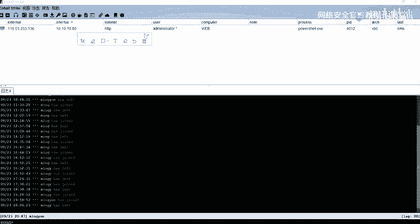

通过这1个CS吧。就是。我这边的话呃再去进行一个演示的时候的话，我这边先说明一下，就我这边的话是已经拿到了一个机器，拿到了一个机器的一个需要，是通过CS所拿到的啊。然后的话这一个机器的一个需要的话。嗯。

我这边的话就实是这个靶靶场，就我这边的话已经通过了一个它的一个外表漏洞，拿到这个机器的一个线。

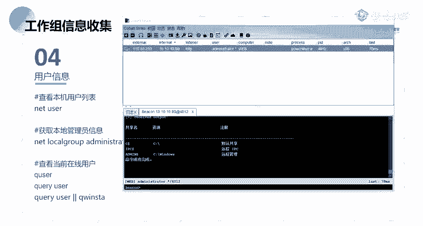

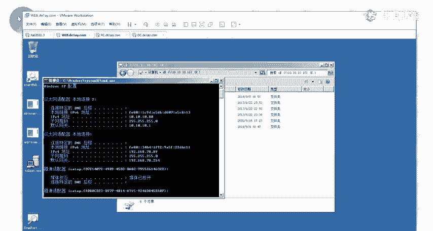

然后的话我在这边的话，我是呃我后面的这样子的那些就是说这些信息收集的一些命令，我都通过这样子的一个方式来去给大家演示。就呃如果大家没有这样子的的话，你就是说你直接其实直接就是说你自己的1个CMB是吧？

作为一个你得到的一个线。去进行一个操作。就在这边的话，其实就是一些命令的一个意思。就是说我们通常会去使用这样子的一些命令，去收集我们想要的这样子一个信息。好，首先第一个就是这个net yield的。

那些腰枕的话，大家应该都是常进也是常用的对吧？呃，哎那个。とや。

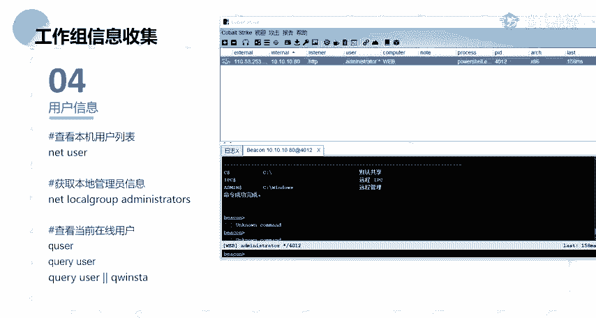

啊，是的，因为因为我这边的话是搭在内网呀，我这边的话肯定是一个内网的一个网段，内网用的一个内网的1个IP啊。但是的话如果说你这一个机器它是一个外网的一个机器的话，你会有这样子的一个就是外网的1个IP啊。

你才能够去访问到这个机器嘛，对吧？因为我这边的话是一个靶机啊，不是不是说一个真实的一个外网的一个机器啊，能理解吗？就你把它在这边你理解为1个外网的1个IP嘛。然后这个的话是一个内网的个IP了。

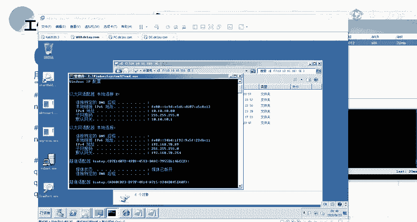

Okay。然后这一个盖腰枕的话呃就是。是大家比较熟悉的一个面对吧？就是大家玩问的时候的话，应该都知道，就是说我们通过net user来去查看到单前计算机上面有哪一些用户，对吧？

这句话我们能够去查看到它的一个用户。然还有就是呃获取本地的一个管理员的一个信息。在这边的话呃，我们就是大家应该也去使用过，就是说我们把我们自己的一个呃用户，对吧？加入到我们的一个本地管理员组，对吧？

就是这个local group这个组当中，那么我们要去查看到这一个本地管理员组当中，还有哪一些用户，也就是有呃哪一些用户有一个管理员的一个权限，对吧？那么我们可以通过这一个命令。Okay。

通过这一个命令来去查看到这一个addmin组，就是管理员用户组当中的有哪一些用户。在这的话有这样子的三个用户啊是吧，那么我们就能够知道在这三个用户的话，它是有一个管理员的一个权限的。

还有就是呃查看当前的一个在线的一个用户。在这的话这三个命令都能够去查看。Here we有 them。就哦在这边的话，我们可以看到就是当前的话有这样子的一个用户，就是有一个ad面的一个用户。

它是处于一个登录运行的一个状态。然后其实我们可以看一下。我当前的一个用户的话，其实就是一个ide着面的一个用户。然后我我这边的话呃我这边的话也是一个I面的一个用户去登录的。

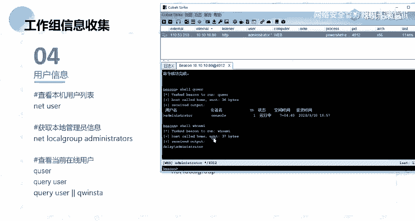

是吧嗯。然后还有其他的一个呃其他的几个面的话，它的一个结果的话都是一样的。对吧我就唯一的去演示了。呃，啊，对了。其实在讲这个之前的话，其实我还是要说一下，就问大家一下，就是大家对这一些的话。

对这些命令的话，大家呃知道吗？就如果说大家知道的话，我这边的话就带大家只大概的过一遍，我就不我就不去呃操作来来去让大家看一个效果了。啊。大家对这样子的一些面的话呃，能了解。有了解吗？是。呃，了解的扣一。

不了解的扣2，好吧。没有了解。就是呃需要啊我这边。操作一下给大家看效果对吧？呃，其他同学呢？嗯。呃，大家呃。一是有了解是吧？知到几个简单的。直到个别。好，呃。

那我那我这边的话就是呃就是我大概的操作一下吧，其实也是一些比较基础的一些面料。我大概操作一下，然后的话可能就是。windows不了解。呃，你不用windows了吗？

你你日常的一个就是日常使用的一个系统是linux1，对吗？windows的话应该就是呃大部分的同学的话应该呃用的使用的应该是windows，就是日常使用的话，对吧？

然后那么我这边的话我就呃我就不会去不细讲了吧。然后的话我这边的话就就是比较快的给大家操作一下，演示一下，好吧。

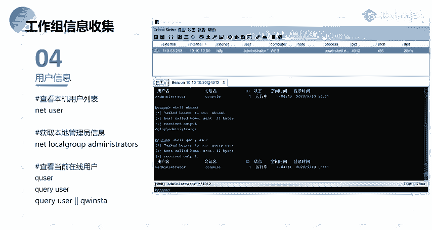

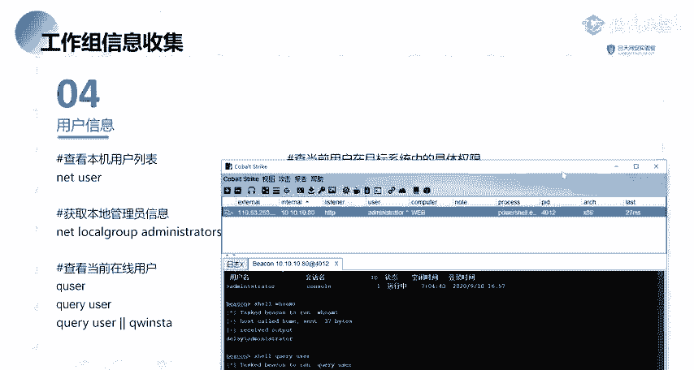

因为呃这个的话其实大家自己去课后的话去呃操作演示的话也是一样的，好吧。

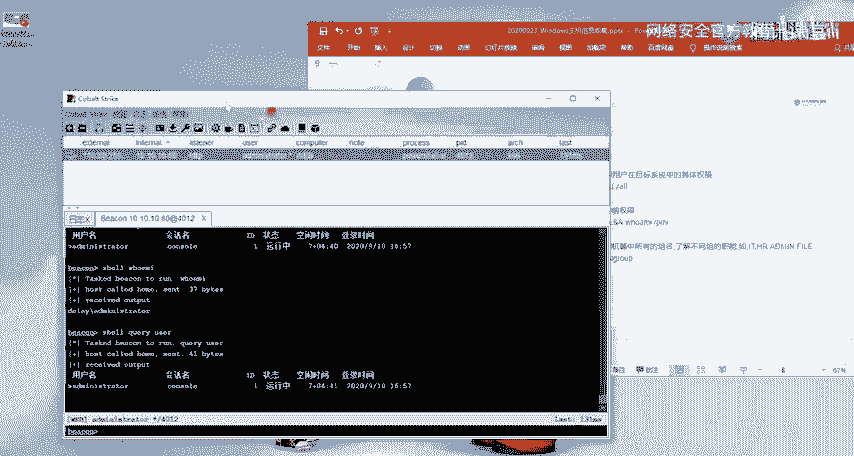

我这边话就大概的。可过一下。好，我查看当前用户在目标系统当中的一个具体的一个权限。OK哦呃，我这边的话先呃大家先休息一下吧，好吧，先休息一下。

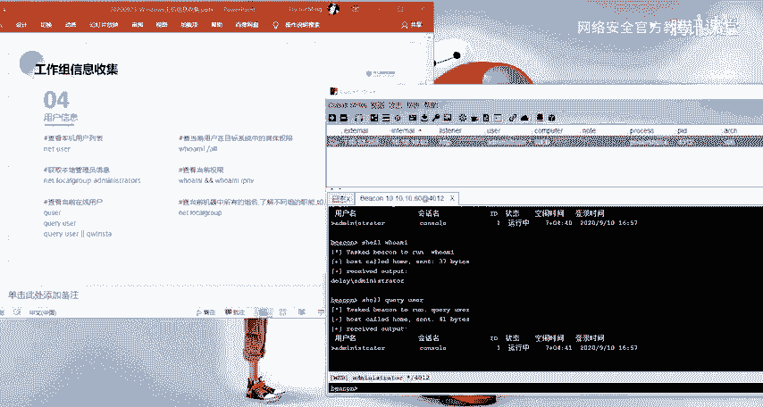

呃，我这边的话，因为现在的话改了就是第就是一个课时的话45分钟，对吧？现在的话已经54了。忘记了呃，先大家先休息三休休息5分钟吧。好吧，就是9点钟的话，我们正式开始。我这边的话先断掉。怎么办呢？

这是8嘛。那么。嗯。你快。这他。刚刚这个。Yeah。这个大明。Yeah。你。嗯。打啲。Oh。Okay。Yeah。Yeah。冇。转身。🎼该说的。😔，🎼别说了。😔，🎼你都。边度。包括自己。hello。

大家呃能听到吗？😊，应该都在吧，哎。可以。哦哦，这边的话呃。这边的话就不休息了吧，呃抓紧点时间。我后面的话还有比较多的一个内容就是。呃，这边这这些面令的话，我我这边。要不不操作了吧。好吧。

大家自己课后去操作可以吗？就反正PP的话会发给大家。然后这边的一些命令的话，我也有相应的一个解释，对吧？然后我就大概的给大家就是过一遍，我就不不一的去操作。因为操作的话可能花的时间的话又比较多。🤧嗯。

Okay。然呃，这边的话就是一个用户的一些信息。就用户信息的话，我们主要他就是去啊查找，就当前的我们得到这个机器，对吧？我们这边得到的这个机器，他所拥有的这样子的一些用户，他有哪一些用户。

以及他的这些用户，他是分别有什么样子的一个权限，对吧？这个的话就是我们去收集它的一个用户的一个信息。然后然后的话就是一个系统的一个信息。系统信息的话主要的话就是去收集你的这个系统。

它是什么样子的一个版本，对吧？以及你的这个系统，它对相应的一些呃运行的一个软件以及服务。你还有就是呃这个话其实应该算是前面的1个IP信息啊。对我们通过这个IP config或这个面的话也是我们采用的。

就在后面的话也会有。

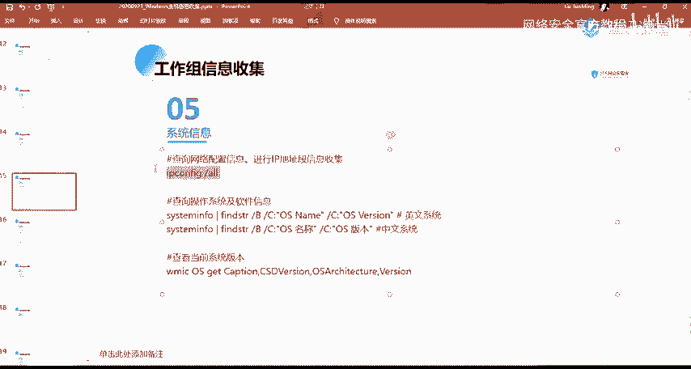

No。

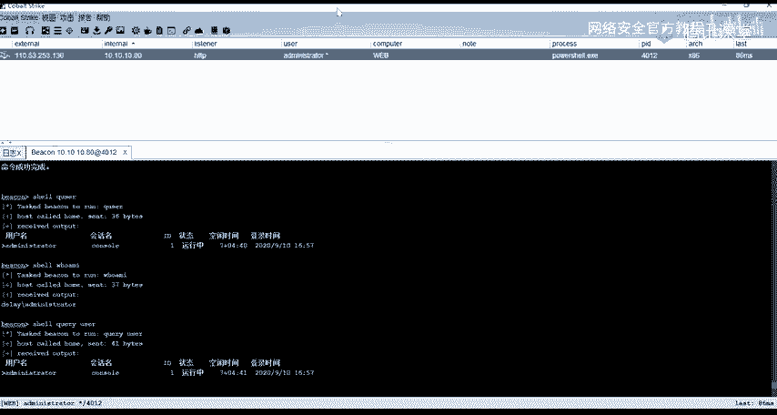

也会经常的去也会有说到，就是说我们通过这个IP供fi。我们知道ID工具的话就是嗯。

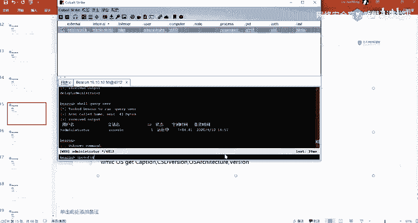

能够去查看到当前的这个机器，它的1个IP的一个信息，对吧？那么在这边我们查看到的话，其它其实是一个比较简便的一个信息啊，我们可以通过加一个干货。来去查看到更详细的一个信息。然后在这边的话。

我们可以看到在这边就是有比如说它的这一个机器，它的一个主机名，对吧？主机名的话是这一个web。就呃主机名是什么意思呢？就其实就是我们刚刚给大家那个呃。就大家要分析一下，就是主机名。

就是说这个这个的话它就是一个主机名嘛，然后以及你右键此电脑，然后属性。

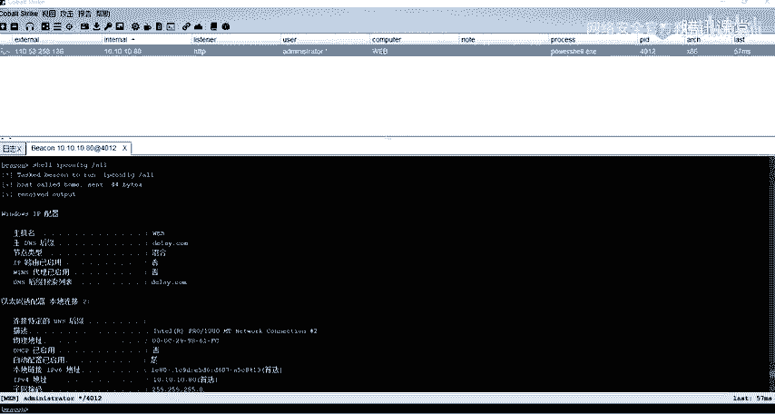

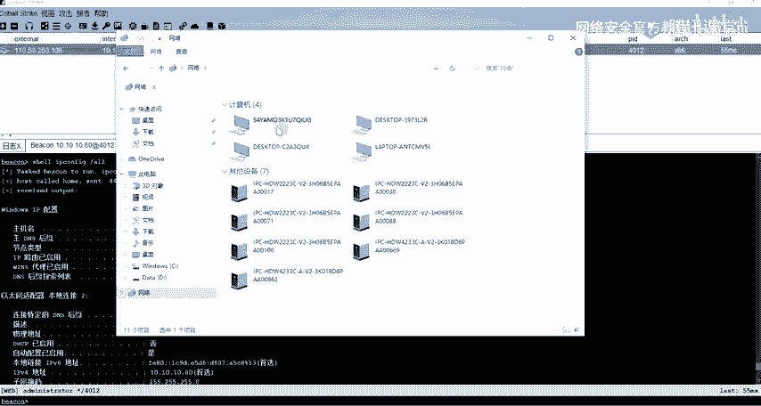

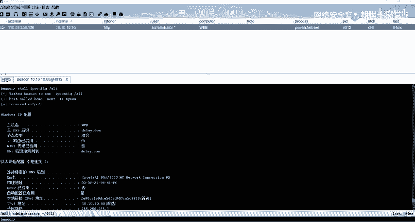

这边这一个的话就是你的一个计算机的一个名啊，正确的说，他应该算是说计算机名啊，就你一个主机名。

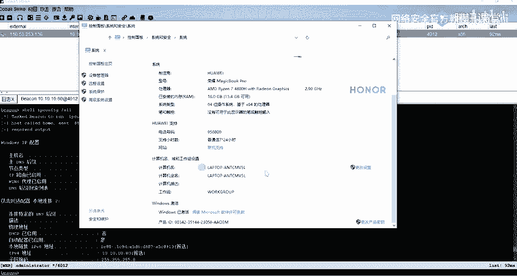

在这边它的主机名就是这个，也就是说它的这个计算机名，主机名的话是web，然后DS后缀在这边的话呃，它是一个这样子一个Dlay点com。这个的话呃就是。呃，我们在后面会讲，就讲玉的时候会介绍到。

就是说在这边如果说我们发现有比如说它的1个DNS的这种后缀，以及在这边它的一个呃。这边DS的一个后缀的一个这种搜索列表。像这种信息的话，它是这样子的一个。像域名的一个形式，对吧？那么我们能够去知道。

就是说当前的这个机器的话，它是处在这样子的一个dlay点com的这样子一个域当中的。也就是说这个基器呢是一个域内的一个主机。然后还有在这边的话，有能够去查看到它的一个就是啊网卡的1个IP的一些信息。

对吧？比较详细的一些信息，对吧？IP地址，还有DNS。然后呃在这边的话，DS服务器。所以这个的话也是我们要去着重要去注意的。就说我们在域当中的话，我们通可以通过这样子的一个。

就是说如果我们知道当前的这一个主机它是在这样子的一个域当中，对，那么我们可以去通过这样子的1个DS的1个服务器，它所对应的这样子的一个地址，能够去判断这一个地址的话。

它是一个预控的1个IP也就是说我们当前的这个域这1个DD类点com这个域它的一个预控的IP的话是10010010这个IP。然后呃这边大家不理解的话，我们等会会说啊，就是说我们的一个预控的话。

它的一个作用。它其实就是说我们的一个DNS服务器。因为我们在域当中的一个主机要去找到其他的一个主机的话，它需要有这样子的1个DNS的一个解析。就说他知道他知道我们的1个预控的1个IP地址。

然后的话他想要去访问到其他的一个主机的话，我们需要通过这个预控啊，也就是在这个预控上面的话，它需要有这样子的1个DNS的一个服务器。我们的1个域内的一个主机，所有的1个DNS啊。

就是它的1个DNS的一个啊就是一个。呃，DNS的1个IP的话，需要去指向我们预控的1个IP。以及还有其他的这样子的一些信息，对吧？其他网卡的一个信息。

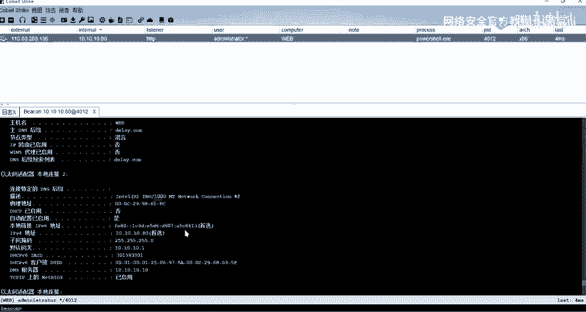

这里的话就是这个IP config。还有的话就是查看就是操作系统，还有软件信息等等。在这的话像啊就是英文的话就是像这样子的OS外选。

其实就是通啊通过这个fin drive这个finas drive的话就是啊一个就是查找匹配，就是在windows上面的一个查找匹配字符字符，还有就是啊相应的一个。你就可以把它理解成为是一个查找命令嘛。

就呃可能用就大家一般的话就是在lininux里面会用用的比较多的话的话就是你在linux里面，你去查找呃，去检锁一个文件，指定的一个文件名。对的话，你会去使用这个放und令，对吧？

然后在windows里面的话，它我们通常的话会使用这个fin join来去匹配您这边指定的这样子的一个啊字符。然后在这边它其实就是通过从西 in这样子一个信息当中去查找你的这1个二0的名称。

还有二0的一个版本。你你还有多少？ま。是我大。Yeah。然呃还有就是查看当前的一个系统版本。在这边的话，我们使用这个WMIC呃，关于这个命令的话呃。我这我这边的话我就不会我不去多讲了。

就呃详细的一个使用的话，大家可以去直接去百度。然后的话呃也可以就是说。啊，就是在这一期的话呃。诶。稍等一下。以及啊就是大家可以在全。群文件当中啊去查找到就是我们第一期的1个PPT就是。诶，你走了？

就是呃在那个。这这1个PPT啊就是生态测是需要命令这个PP。然后在这一期的话呃，就是没有去着重的对这个命令去做一个详细的一个介绍。你可以去啊。

如果你对就是说对windows以及linkux下面相关的这样子的一些需要命令，你不熟的话。

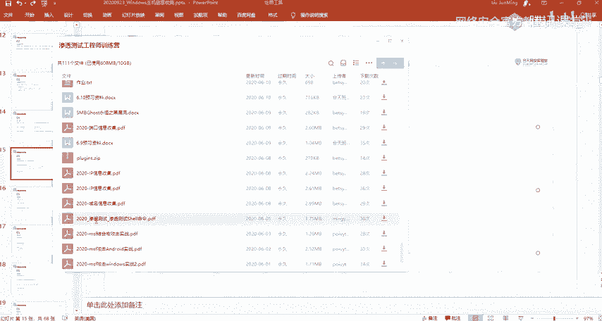

你可以去看一下这个PPT。

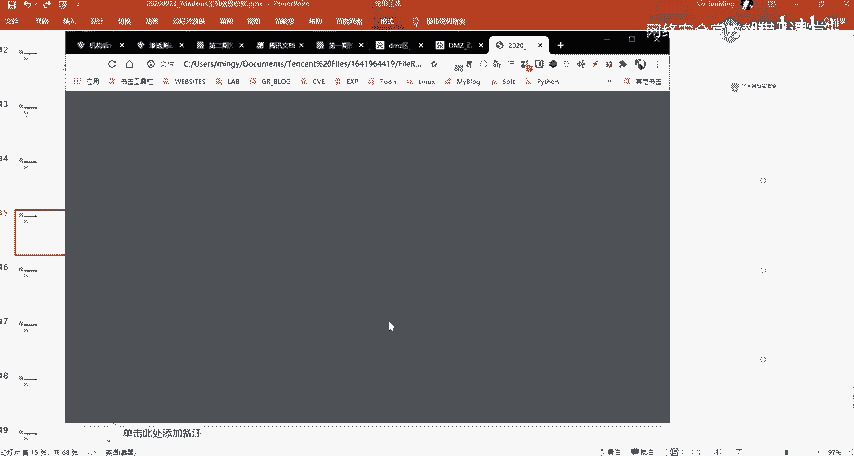

然后的话大家去敲一下，就是问我在这边的话。有列呢就是在windows下面，还有linux下面的这样子的一些命令的一个详细的一个使用方法。然后因为呃这一个命令这一个东西，这种命令这种东西的话。

其实对于我们来说就是没有很大的一个学习价值啊就。

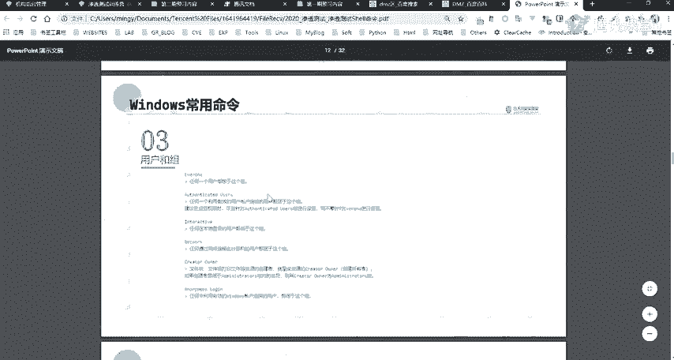

这一个呃就是我们要去学习的就是最有价值的一个东西是就是说呃相应的一些思路以及知识点。就如像这种命令，还有工具这种东西的话，其实价值不大啊，对吧？就大家自己去百度啊什么的，都能够去学会的对吧？

所以的话呃这这的话就在本期的话就把这些东西都省略掉。当然的话这些就说这些命令的话是需要大家去了解的。因为我们经常会去使用到。而且这个面的话，它的一个功能的话也是很强大的。就我们以以这个命令。

我们可以通过这个命令来去查找到当前系统下面的这样子的一些系统版本啊，还有它的一个就是它的一个呃位数，对吧？它的一个版本。以及它的一个系统的一个类型。我这边的话是它是一个windows设。

2008R2的这样子的一个机器啊。然后还有就是系统的一个体系结构。这个的话其实就是我们的一个系统架构，就我们可以通过这这样子的一个。面来去查看到可以看到在这的话就是一个叉86。这一个价格。还。

就是本机的一个服务。本机服务的话就是sice。就我们通过就是。比如说你这个文件啊，就是我们的这一些服务，对吧？我们通过这个命令的话，就是查询到的就是这边的这一些服务的一个信息。就通过这个命令的话。

能够去列出当前的一个系统下面当前这个主机下面有哪一些服务它是开放的，以及它的一个呃相应的一些信息。比是说它的1个PID啊什么的。嗯。😊，等等的这样子的一些信息。是吧。可以看到在这边的话是它的一个服务名。

对吧？然后的话它的1个PID以及它的一个运行的一个状态。在这边的话我们都能够去查看到，就这些服务的话，我们能够去知道这个系统当中它运行哪一些服务，对吧？以及它服务的一个运行的一个状态。

还有就是安装的一个软件版本路径等等。就是啊去分析去收集我们的一个系统当中，它所安装安装的一个软件的一些信息，对吧？好呃，在这里的话大概的就是介绍一下，大家可能会有疑问，对吧？就是说我收集这些东西干嘛呢？

有什么用，对吧？那比如说我们的一个系统的操作系统、软件等等这些信息，对吧？那么我们收集这些信息的话，为我们后面的话，就是说我们后面会有相应的一些内容，就是会去使用到这一些信息。嗯。运行一下这个命令。

你说的这个命令的话是哪一个？刚刚的话没有看到嗯。查询系统及软件信息的一个命这一个是吧？那我这边的话是一个中文的一个系统的话，我就用这一个。

就是效果的话就是像这样子，就是20名称。就其实在这块，它是用这个fin join，然后的话呃就杠C的话就是去匹配去匹配呃，这边输出的一个信息当中它的有没有这个os0的一个名称。如果有的话。

它就输出这一行嘛，然后的话还有20版本，对吧？啊，其实你可以自己试一下嘛，对吧？就这一个的话也可以就是就类似于grape嘛，类似于grape。然后呃回到刚刚的就是说我们收集这些操作系统，还有软件。

就是说这个操作系统的一个版本，对吧？我知道了它的一个系统版本。那么针对这样子的一个系统版本，像比如说我们后面讲提权的时候，就提全的话，就需要去知道你的这样子的一个系统的一个信息。

以及呃你这个系统当中它所运行的一些服务，还有你安装的一个软件。就安装的软件的话，就是有很有一些软件，或者说有挺多的一个软件的话，它可能会存在相应的一个漏洞，对吧？我们可以利用这样子的一些软件。

或者说服务的一个漏洞来去进行一个提全，以及能够去呃进行一些呃权限的一个维持，还有话就是进程信息。进程信息的话，我们采用的一个面称就是test list。嗯。就我们能够去。

能够去查看到当前的一个计算机当中，它运行的哪一些进程。

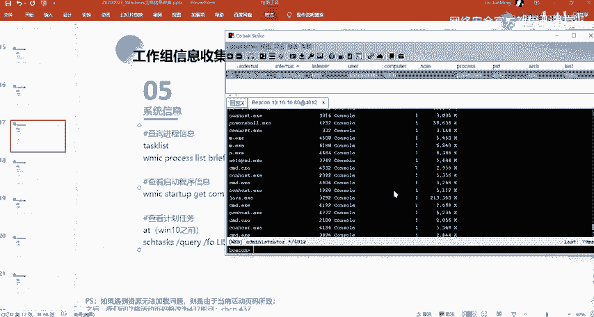

以及其实在我们CS当中的话，我们可以直接就是说右键在这边呃目标有一进程列表。就我们在这边的话也能够去查看到这个主机当中，它的所有的一个进程的一个信息，以及在这的话它有相应的一些功能哈。

就像比如说啊ki也就是把这个进程停止掉，还有可以去呃偷取就偷取进程的一个token。啊，这个token的话，在这的话大家先了解一下，后面的话会给大家讲。

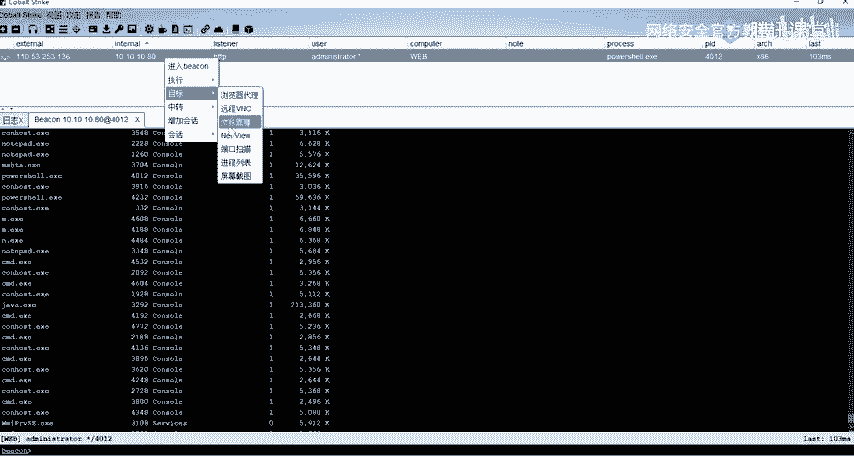

Okay。然后以及还可以通过这个WMIC来去查看，以及还有查看启动启动程序的一个信息。这边的一个启动程序的话，其实就是我们的一个自启动。就是在这边就我们通过这个面的话，就是查看查询到的一个信息化。

其实就是在这边的一个启动这边启动项的一个信息啊。啊就是查看计划任务。这个查看计划任务的话就是我们的这一个机器。

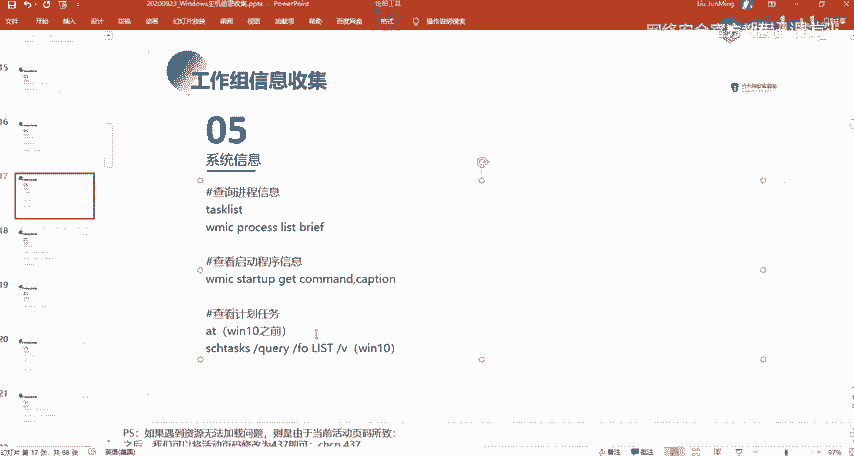

好，杠B呃，这边的话。差你时间。你可以通过就是你直接在windows上面，你执行这个fo的券杠斜杠斜杠问号来去查看这个命令，它的一个详细的一个使用。好吧，我这边的话我我就。

就不会说就是一个一个的给大家去讲他的一个选项。像这种这种命令的话，呃，你直接在命令函当中去查看他的一个帮助信息，你就知道了。好吧，如果实在不知道的话，你再来问我。

或者是说其实百度就百度的话就能够去解决你大部分的一个问题了。就如果就其实有句话还是说的好，就是你百度的话就能解决大部分的问题了。如果你百百度都解决不了的话，我我这边可定也解决不了，对吧？

当然的话当然的话有一些东西的话呃有一些东西的话，百度上面也不一定有是。就呃就学会大家自己学会去百度的话，百度谷歌就是很多的这些问题它都其实不是问题。就你碰到这些问题，你不知道怎么去解决的话。

你的一个问题的话，不问题的话，其实不是说你不会，而是说你不会去查找去查找这样子的一些问题的一个解决方法。Yeah。就呃其实建议大家的话在碰到问题的时候，其实不要说第一时间就去问别人，是吧？

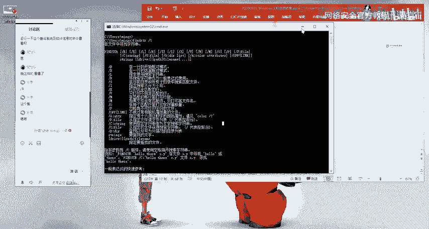

就你你的第一时间的话，你的一个想法应该是说我碰到这个问题对吧？我要去怎么去解决对吧？然后解决的有哪些方法是吧？首先的话肯定你实在不知道的话，就是你经验有限，那么你就直接去百度嘛，去百度查找看是否有没有。

是吧？如果实在就是说你百度也解决不了的话，你可以去问别人。呃，这边的话就是呃查看计划论就是呃艾这个面的话，它是在就是像我们那个windows2003还有2008的这些比较老的一些机器上面的话。

就是使用的这个艾命。然后我们在新新的一些系统上面的话，像m1，还有2008哦202012serv的这些机器上面话，都是使用这个SC test。干子个命令，就是计划任务。

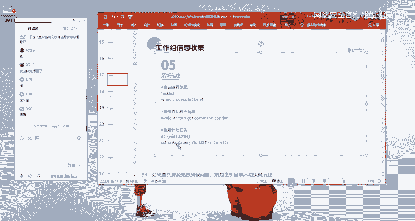

好，我在这边的话，我有这个。

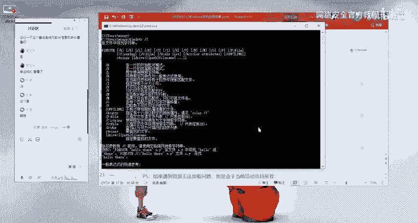

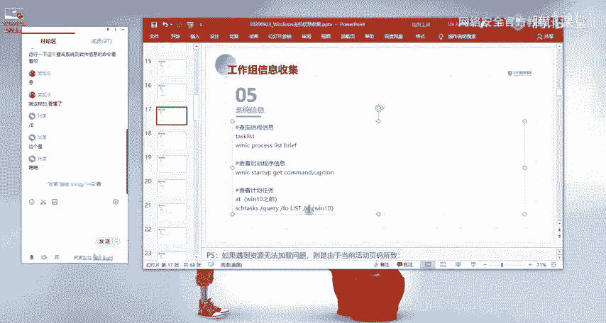

我这边执行这个面的话，它就会列出所有的这样子的一些计划任务。就这一个计划任务它是什么意思呢？就是说你的这个系统当中的话，它会有这样子的一些定时的一个任务。这些任务的话。

它会在啊就是说相当于是一个就是冒重一样，对吧？

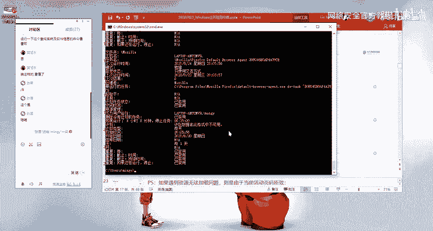

打个比喻，就是闹钟对吧？你闹钟的话，你定个时间，你定了这个时间，你到了时间，你闹钟就会响，就定计划任务的话也是同理啊。就是说你设置了这样子的一个计划任务，对吧？那么你到了这个时间。

或者说到了在这个时间范围之内，对吧？那么他就会去运行相应的一个任务去执行相应相应的一个任务，比如说去执行这样子的一个程序，对吧？这个的话就是计划任务。

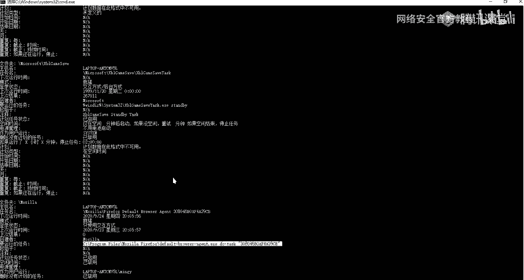

然后呃就是说大家再去进行这样子的一个计划任务的一个执行命令的时候，可能会碰到这样子的一个问题啊。

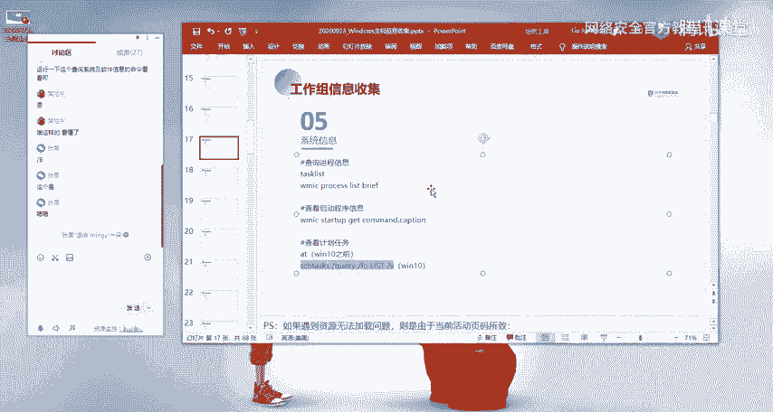

像比如说哦。像比如说我在我这边我在这个机器上面，我执前的话，他会有报这样的一个错，就是说错误无法加载列资源。啊，对，这个at也是可以用的。但也是可以用的。就是呃在这边的话艾这个命令也是可以用的。

然后呃我这边的话就是就就新版新的比较新的一些系统的话，都是使用这个。我在这边的话，之前这段话他会有这样子一个错误啊。在这边的话，它是就是。我们需要就是说你要让他执行正常的话。

你需要去更改一下它的一个编码，就更改编码的话就是CHCP。在这边的话需要去把它更改成就是每版的一个啊437的一个编码。像这样子，然后的话你再去执行的话，它就没有这样子的一个问题了。

就是能够去输出它的一个正常的一个结果。

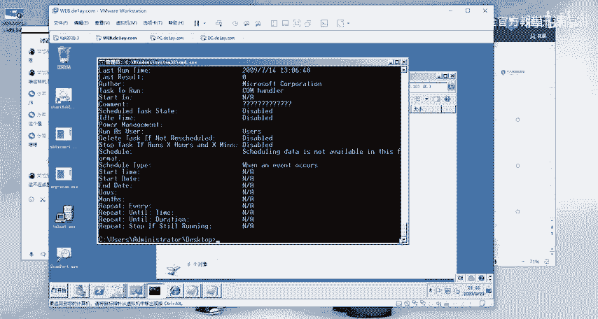

这个的话给大家提一下。啊还有呃相应的一些其他的一些系统信息啊，我这里的话就着重的介绍一下，就是查看端口列表以及本机开发的一个端口所对应的一个服务，还有应用程序。就这个nett。

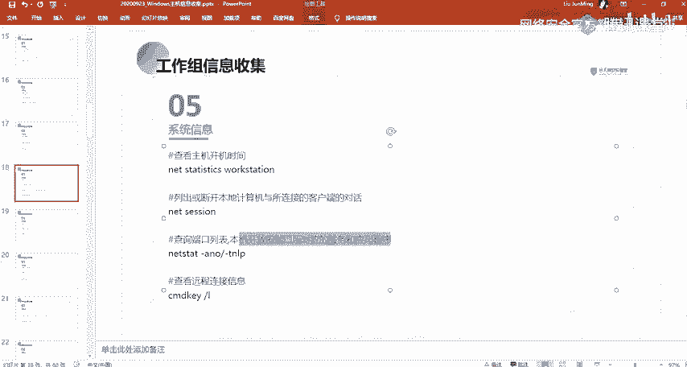

这个面的话也是就是常用的一个面料。就我们常用的这个nstar杠ANO这样子一个命令。这个命令的话它会列出来，就是说当前的一个机器项。就它会列出单前机器上面呃，它的一些呃本地的一个端口的一个信息。

比如说它开放了一个端口的一个信息，以及它的一个状态。

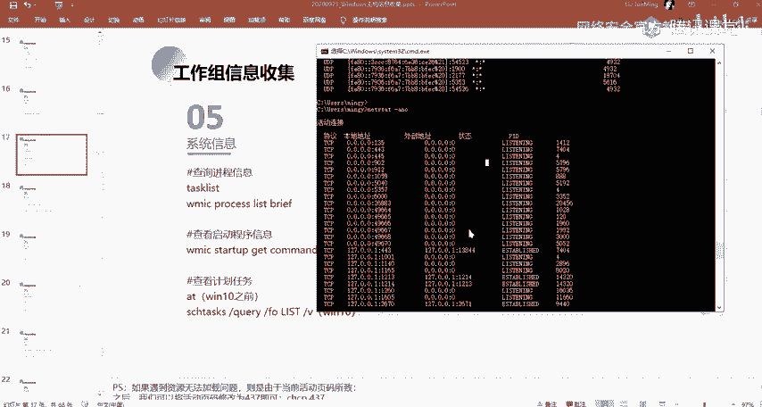

在这边的话，我们可以看一下，就是像在这边我们可以看到有这样子的本地地址，还有外部地址对吧？然后我们本地地址是在这边的话有这样子的一些呃端口的一个开放，对吧？像445135等等，以及它的一个状态。

是一个处于一个今天的一个状态。然后还有的话就是在这边的话，我们可以看到有这样子的一些外部的一个地址，对吧？在外部的地址的话，就是说与我们的这样子一个端口有相应的一个连接，它是处于一个连接的一个状态。嗯。

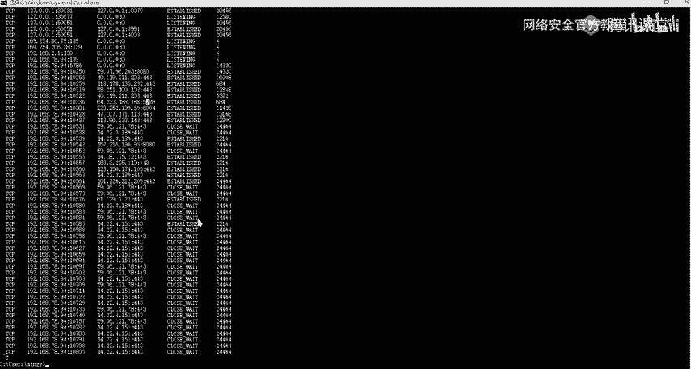

。

以及还有就是呃这个杠TNLP。调屁。嗯。嗯，你哪里错了？嗯。可。

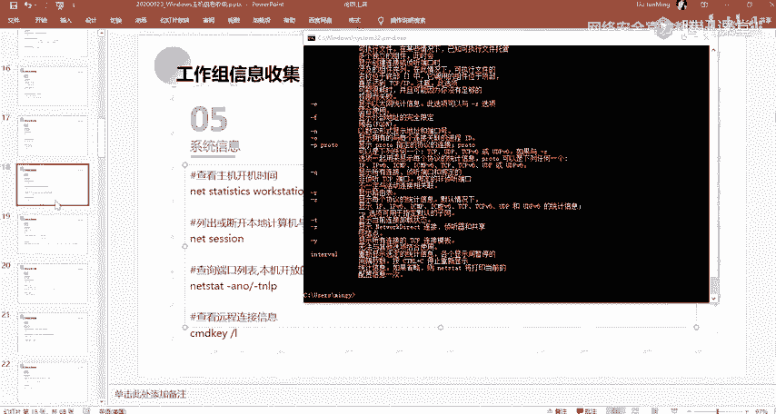

。

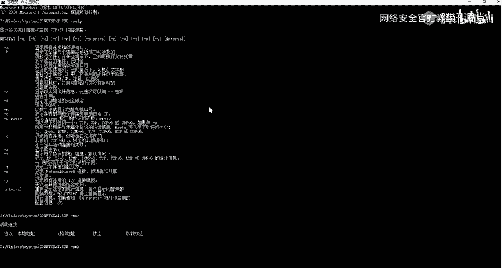

啊，这边的话命令超了呀，这边的话没有这个L啊。就是呃我们常用的话就是这个ANO，就反正我是常用的话就是这个ANO就是呃我们要去。

我们要去查看查找，比如说我当前的这个机器，它开放的哪一个端口，对吧？就是查找一下它这个机器。呃，我这边指见的这一个端口，它是否开放，比如说45的一个端口，对吧？

那我们就可以通过这个nstarIO然后加这个管道符。管道服的话，大家能理解吧？就是说我们前面的一个结果的话，作为一个输入。然后的话呃。呃，就是前面结果的一个输出作为后面的一个命令的一个输入。

也就是说我们这边执行的一个结果的话，呃，它会通过这个方式 join命令来去查找这边的一个结果。执行结果当中它是否有包含445的这样子的一个字符啊。然后这这块我们就能够去查找到它的这个机器。

它开放了这样的1个45的一个端口，对吧？以及还有其他的一些窗口，我们都可以通过这样子一个命令来去查看。

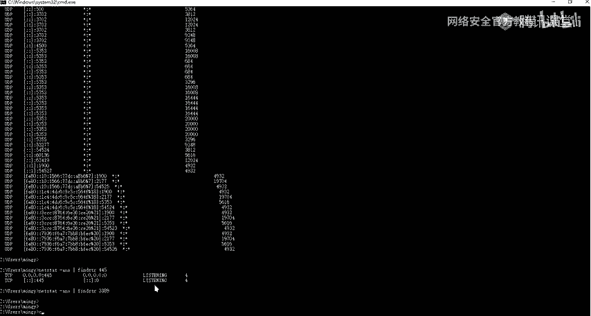

还有这个呃sDT。

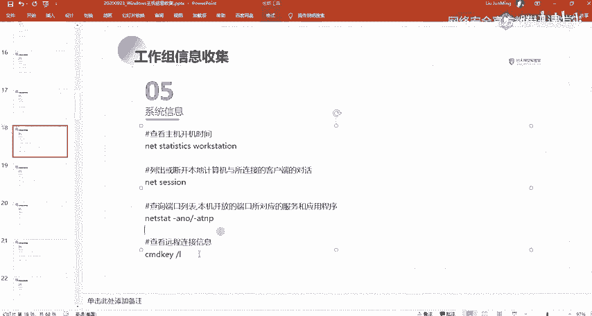

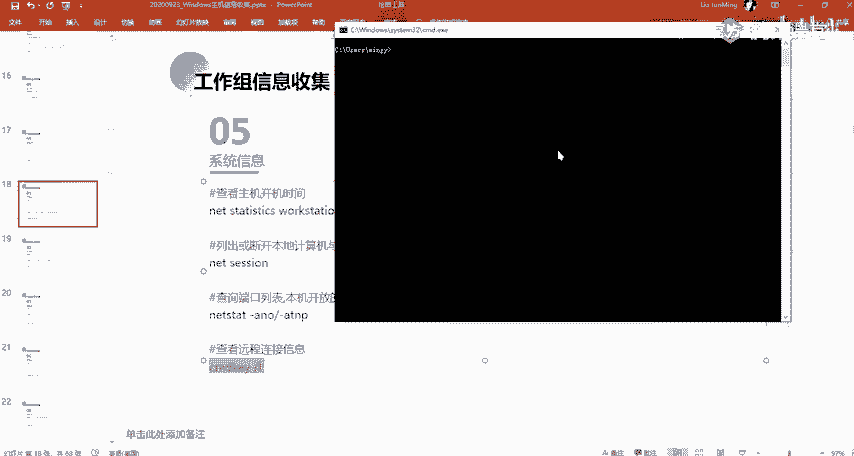

这边的话呃这个SMDK的话，就是它是用来查找我当前计算机上面的这样子的一个。

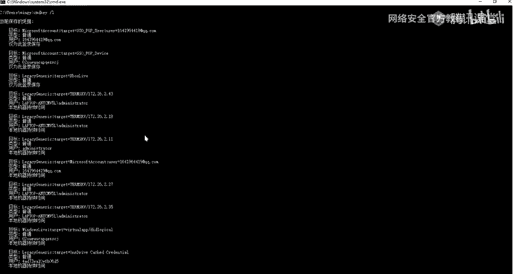

就是所保存的一个凭据啊，这里的一个凭据的话，哎呦我去我这边。泄露了我的信息啊，就这边的话这一个凭据的话，其实就是啊我们去访问某一个资源的时候，它会在本地它会有存储这样子的一个呃登录的一个信息。啊。

像比如说我这边我去登录这个机器，对吧？我是用的是这一个用户去进行一个登录的，以及我这边呃登录用这一个账号去进行一个登录，还有登录的这样子的一些机器。我们在这边的话都能够去查看到。然后呃还有像。啊。

在这边的话呃，我这边的话其实是我自己加的添加的一个，就实际的话，这个把机它上面的话是没有。就我们在这边就是说我们可以通过这样子一个命令来去查看目标机器上面它是否有这样子的一个啊就是存储的这一个频据。

然后存储的这个频据的话，我们就能够去知道这个主机，它啊就是。呃，就是能够被哪一些机器来去进行一个访问，就是用什么样子的一个用户来去访问。就这边的一个凭据，它存储之后的话，就是说其他的一个目标机器。

比如说这个他给他给的这个机器来去访问这一个机器的话，用这个用户来去访问的话，他是可以不需要去进行一个密码，就可以直接去进行一个名义的一个访问。被个人你讲。哎，就还有就是查看补丁列表。呃。

查看补丁列表的话。就这个s in就其实还是同样的。嗯。😊。

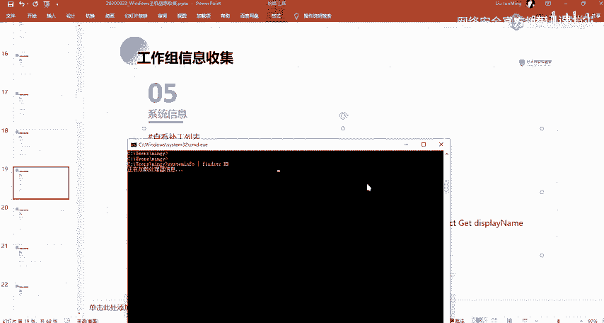

就呃可以通过这个命令能够比较直观的去查卡查找就是说当前的一个主机上面它打了哪一些补丁。然，查找这些补丁的一个作用的话，就是为我们后面就是说相应的一些像提全啊，对吧？

我们提全的话就像这种windows系统的话，它相应的一些提全的一些漏洞。

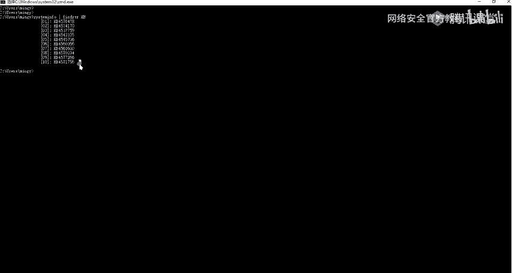

如果说他打了一个补丁的话，那么我们无法去进行一个使用，对吧？如果说他没有打补打这个补丁的话，那么我们就知道可以去使用哪一些呃漏洞，哪一些攻击手法去进一个。利用。然后还有查看附件的名称描述，还有查看杀网。

呃，这边的话我们可以通过这个命令来去查找，来去查看到当前的这个主机上面它安装了哪一些杀毒软件。就以在这边的话，我们可以我这边的话是装了一个火容。

还有就是windows系统它自带的一个windows def，对吧？在这边的话，我们可以通过这样这样子的一条命令，能够去紧锁到我这边的一个呃杀毒软件的一个情况。

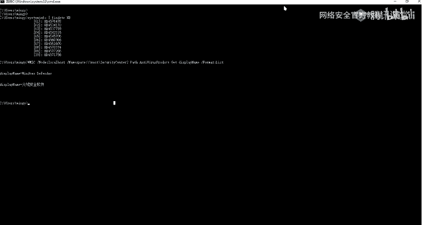

呃，这边的话应该是没装吧。看一下。呃，这边的话是没有删网，就这个机器没装。

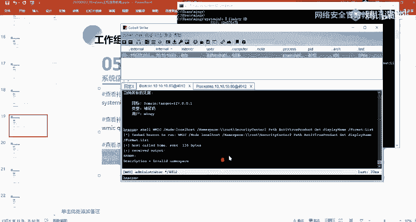

う。然后还有其他的像呃查看housese的文件，就在linux下面的话是这样子的一个housese的文件。然后windows下面的话是这一个路径。就我们可以直接。嗯，你真。🤧然后呃我这边执行之后的话。

我就能够去查看到他的这样子的一个主机上面，它的hos的一个文件里面的一个内容，对吧？当然这这边的话它是没有内容。还有呃其他的看一下。我这边的话跟前面重复了。嗯。三个了。看这个。啊。

这这里边的话就是前面已经讲了呀，就是还有这个NOB。就是刚才已经执行了呀。

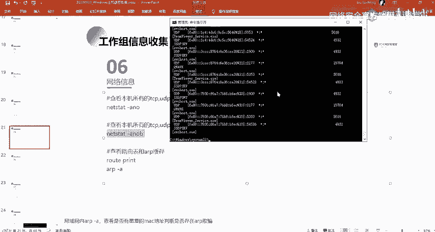

嗯。就是我们在这边的话能够去查看到，就是说它的一个端口以及它的一个运行的一个程序的一个名字。我们在这边都能够去看到，以及他它的呃一个协议的，它是1个TCP还是1个UDP的一个端口。

在这边我们都能够去查看到。

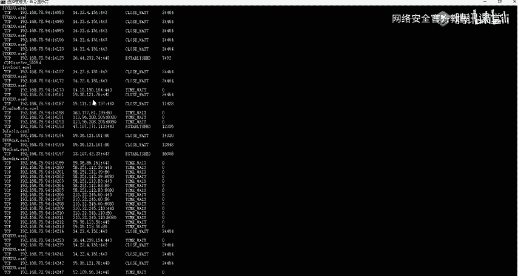

呃，看一下还有。还有这一个就是呃查看本机的一个共享列表，还有可访问的一个这种预共享列表。就我们通过这个net share。这个的话也是呃我们在后面也会有去介绍到的。

也是大家需要大家去理解的这样子的去了解的这样子一个东西。就我们之前这个nett尔的话，我们能够去查看到当前这个机器它的一些共享。就这边的一个共享的话，其实啊这些的话都是默认的一个共享。

就是说您可以在你自己的一个机器上面去执行这样子一个命令。let。然后的话你会发现有这样子的一些共享，就是CDE我们可以看到就其实就是你的一个磁盘嘛，就是C盘D盘E盘它都是一些默认共享。

还有IPC的一个远程啊，远程共享，还有这个addmin。然后这一些共享名它所对应的一个资源的话，它能够去访问到那个资源它是不一样的。比像CD这种的话，都C盘D盘E盘对吧？等等的这样子一些。うん。然后呃。

Okay。然后呃磁盘映射。磁盘映射的话在这边的话就是说如果说我们知道了某一个机器，就某一个机器它的一个用户名义及密嘛，那么我们就能够可以通过这个mats share。

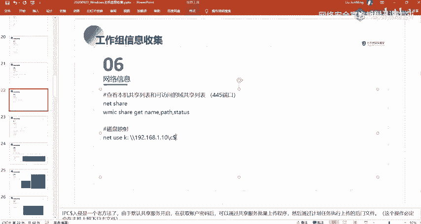

吧net use来去进行一个进行一个连接。就我这边的话，我可以通过net柚来去连接到我这边指定的这个机器上面来呃它的一个共享名为C，也就是去连接到这个目标机器上面的一个C盘的一个目录。嗯。然。

呃我这边的话，因为我这边直接去那个柚子的话，它是会机进理连接。然后的话其实呃我们可以把就是说目标机器的一个C盘，把它给就是映射到我们本地了。像比如说我在这边的话，映射到我的一个。呃，E盘。

我这的话是啊直接预控。哎呦，我去。

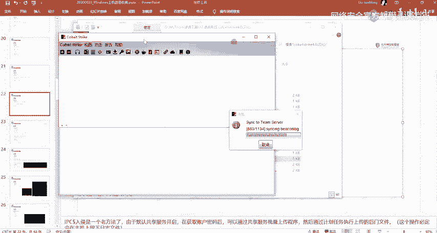

对。我这边的话是。没有出需要。然我这边之前的话你会发现可以就是已经面令成功了。就这边就命令成功的话，就是说其实实际的话呃，就如果说你是一个普通的用户，你去进行一个连接的话，你是需要就是账号密码。

然后因为在这边的话，我这边的话，它其实是一个。呃。他其实是一个预用户啊，就是说他能够去呃他的一个权限，它是一个预用户的一个权限。也就是说他能够去隐密的。就是说你他当前的一个权限的话。

是能够去直接去登录预控的。所以的话我这边的话就是没有输入密码，而但实际的话就是说你没有这个权限的话，你去。就是说。呃，你当前的一个用户是没有权限去直接去连接，去访问这样子的一个共享的。

所以的话你需要去输入他的一个账号密码来进行一个登录。然后我这边我把它那只柚子共享到了我的一个E盘，那么我可以直接呃。第二。我直接可以加压查看我的一个当前的一个E盘。

那么我就能够去查看到呃远程远程机器上面就是远程的这个10010这个机器上面的一个C盘的一个目录。啊，呃其呃，我这边的话。

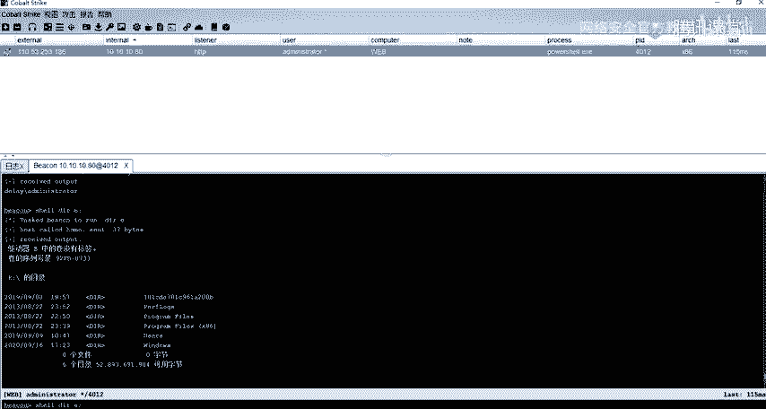

我们可以在这个我这边主机上面看一下。嗯。就是啊这个。我们可以看到这个的话就是我们刚刚进去的这个连接。这边的一个呃内容的话，其实就是我们那个10010的一个这个远程主机主机上面的一个啊目录啊。

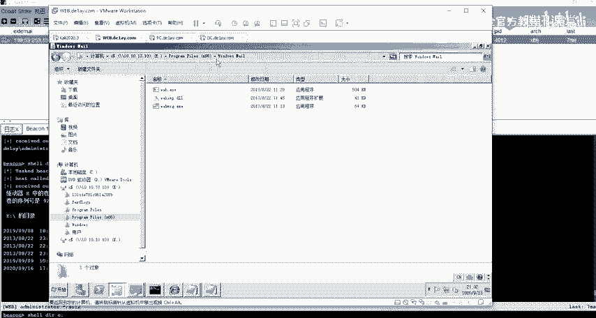

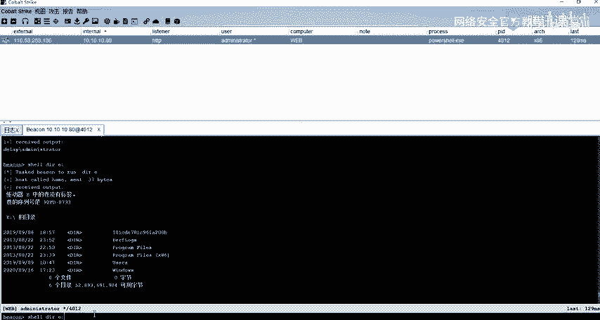

这是一个呃nett尔的一个共享。呃，在后面的话会去使用到，就是说用这样子的一个共享啊，就是我知道了目标机器的这样子的一个账号密码，对吧？我就可以通过这样子的一个共享来去进行一个呃来去进行一个横向移动。

来去呃执行相应的一个命令，以来去呃反谈系。哎，就是呃关闭防火墙这里的话呃，我这边的话我就不讲了呀，就大家课后的话去看一下。面令的话还是比较多的这一些面令。Okay。然后呃第八个的话就是代理信息。

就其实前面的话有给大家有讲，对吧？有提到就是说我们呃在内网在内网的一个机器上面的话，它的这些机器上面的话，它可能会有这样子的一些代理的一个服务器，对吧？

然后的话我们在内网的这些机器要去访问到其他的一些网站或者说出网的话，它可能呃它会有配置相应的一些代理的一个信息。那么这些代理的一些信息的话，也就是这些代理的一些IP代理的一个IP的一个地址。

以及它的一个方法的话，我们怎么去查看的。就我们可以通过这样子的一个命令。来去查看啊，这边的话它是呃它其实就是它的一个信息的话，它会存储在这样子的一个注册表象当中。

然后的话我们可以通过IGque这样子的一个命令来去查看这个注册表当中的这样子的一个代理的一个信息。

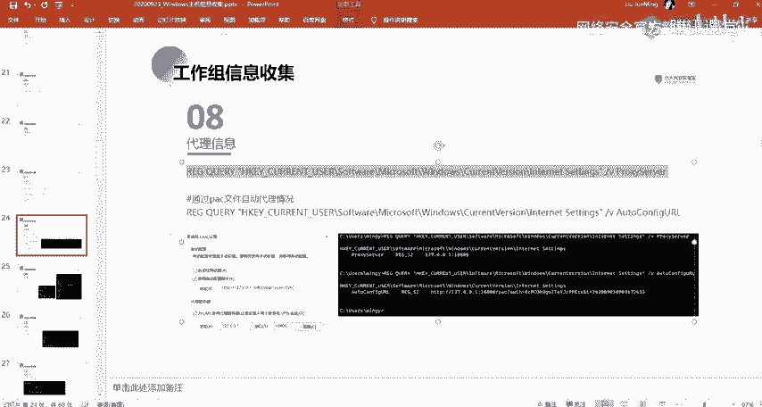

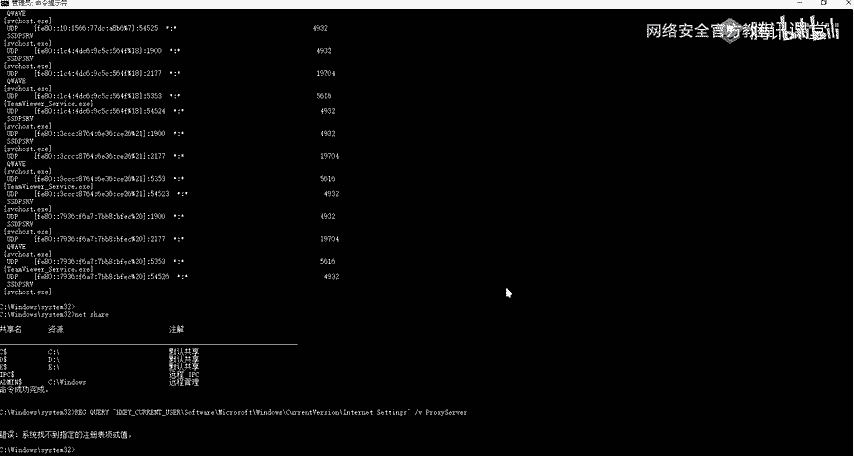

嗯。系啊你开。我这边话开个代理。🎼Yeah。

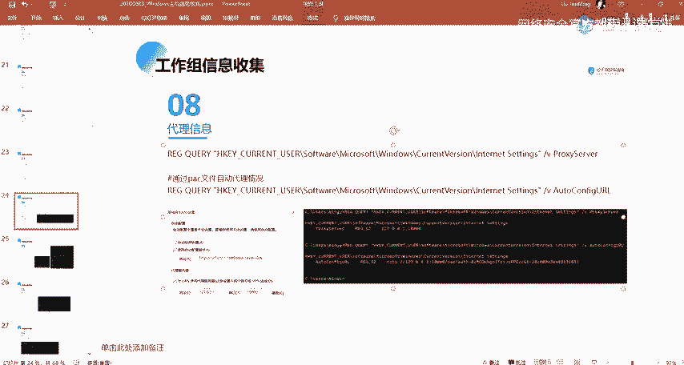

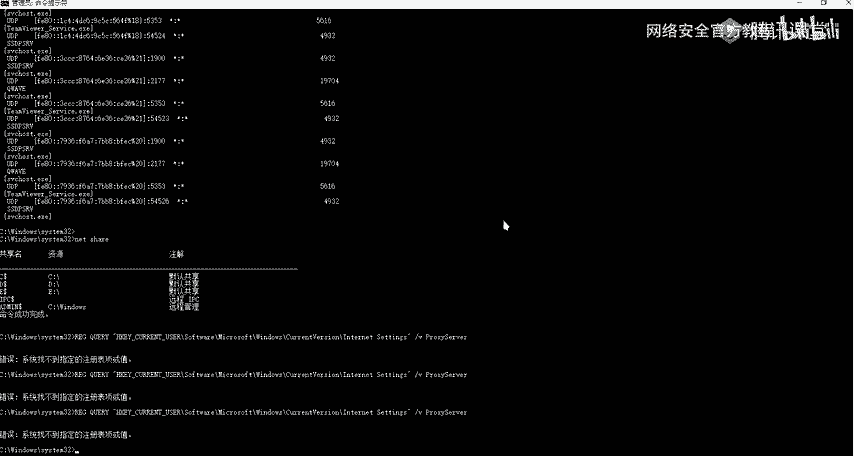

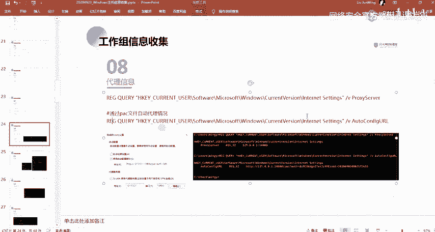

好呃，在这边的话，我们可以看到在这边我。我通过这里的这样子的一个命令来查看到了有。好，这样子的一个值这个值的话我们可以看到在这边它是一个这样子的一个呃链接的一个形式啊。

就这边的话就是1个PAAC的一个方式啊。就大家如果。啊，这边看不到你们。我这边话是开了这样子的一个。还了一个这样的1个S3R个，他的一个代理。要。而且我使是呃选择它是1个PAAC的一个模式。

然后它如果说你是用的这样子1个PAAC的一个方式的话，它是会显示的这样子一个呃样子。然呃我上面这边没有查到的话，就是说呃。

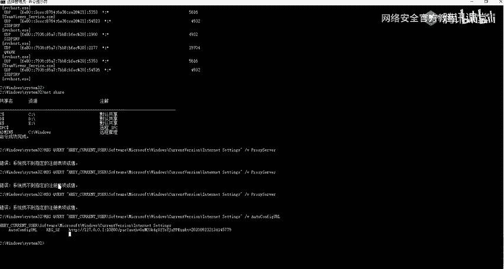

他不是使用的这样子1个PAC的一个文件代理的一个情况。好吧。佢爱你。就其实我们在这的话能够看到就是他在这边有一个脚本的一个地址，也就是我那边的1个POC的一个脚本地址，我这边把它给关掉，然后我这边。

手动。1108年对吧？

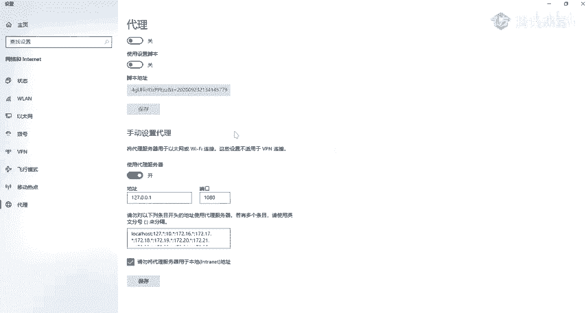

如果说我不使用1个PA的一个方式。那么我去执行这一个的话，我们可以看到在这边能够去查看到它当前的一个主机的话，它使用的1个代理的1个IP以及地址呃，IP以及端口。

就是它在本地它是使用的这样子的一个代理的一个呃服务器。

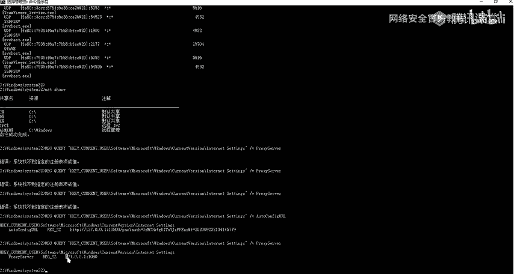

是谁映射到了谁上面。

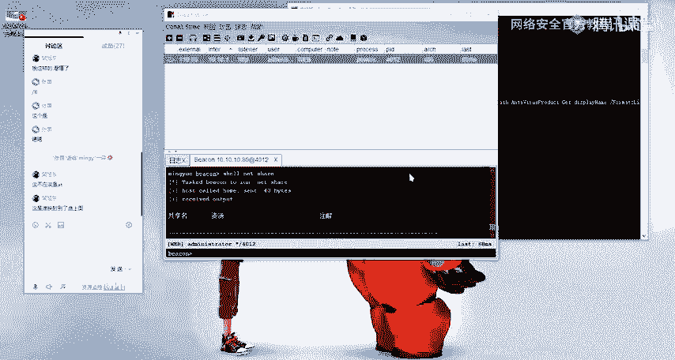

呃，这个的话是呃就是把远程主机。因为我这边的话是1个10。10。10。80的一个机器，对吧？然后到我这边把机的话，其实就是我这边是。

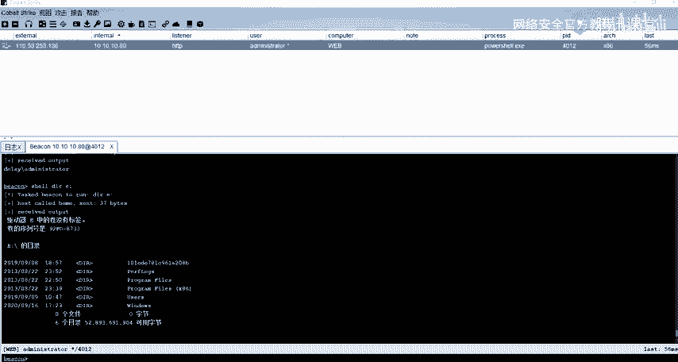

好，这个这一个机器，然后这边呢这个机器的话就是那个10。10。10的那个机器。

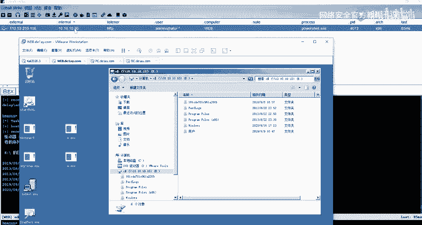

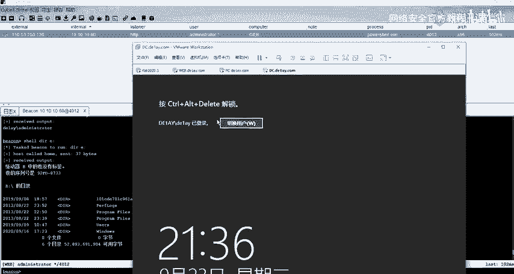

然后呃我们映射的话在这边是我这边执行了，对吧？执行的这一个命令是这样子的。啊，那就需右一，然后远程IP，然后共享名的话是C，也就是啊映射到啊不，也就是把我们远程的这个10。10的这个主机的一个C盘。

把它给映射到我们本地的一个呃E盘。然后要注意的话，这边的一个这边的一个磁盘的话是需要你就说没有被占用啊。这个能理解啊。

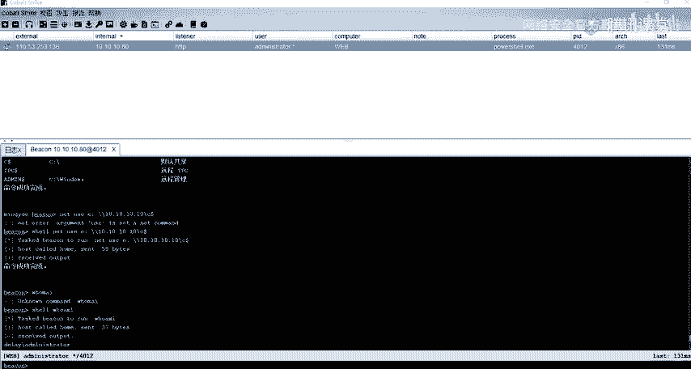

就是说你的一个磁盘的话，对吧？你有C盘，有D盘，对吧？这两个驱动器的话，它其实已经被占用了，对吧？那么你就是可以你需要去把它映射到，就是没有被占用的。像比如说EFG等等，这些都可以啊。

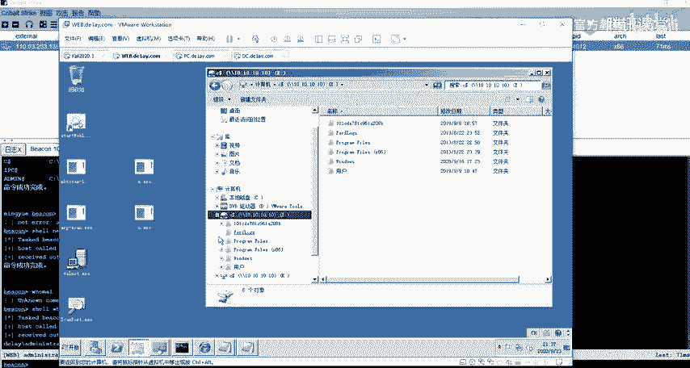

就是把远程主机的1个C盘，把它个映射到我们本地的一个E盘，这个应该能理解吧。

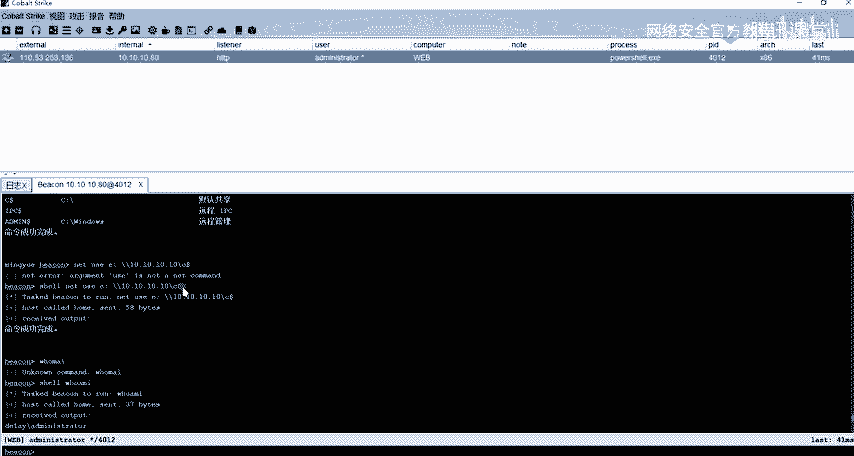

好有军。嗯。

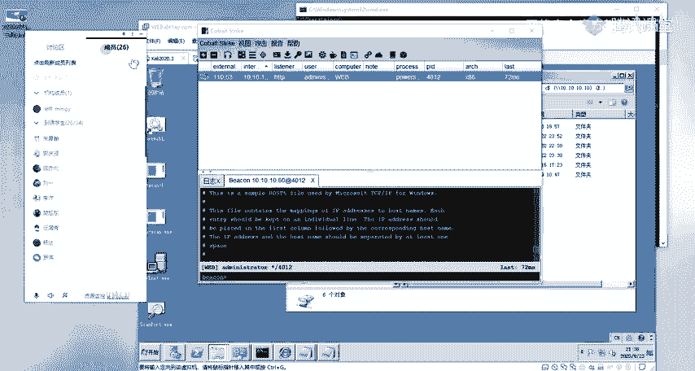

这个的话就是一个代理信息的一个查看。啊。然后还有就是呃wifi密码，像呃这边的话，这一个的话也是大家大家应该比较常用的对吧？就是如果说你的一个电脑上面也的一个wifi密码，你连接之后的话。

你忘了你忘记了它的一个wifi密码，我们可以通过这样子一个方法去进行一个查找。就是呃通过这个let share认这一个命令的话，它就是呃在这边我们看看一下。

就查看当前的就是说你如果说你连接了这一个连接了这个wifi的话，它它这个这一个wifi的一个名字的话，它就会在这边有记录，对吧？就你连接成功了之后的话，然后的话我们在这边的话，可以通过这样子一个命令。

就指定我们这边连接了这个wifi的名字，然后加一个Q clear，那么我们就能够去查看到这个连接wifi的它的一个名文的一个密码。这个的话应该大家应该也比较熟啊。大家可以自己去试一下。啊哦。

第十的话就是回收站内容的一个获取。然，这边的话就是一个比较就是一个。技巧吧。就可能的话可能的话就是能用得到，也可能用不到。就说呃在这边的话，我们回收站对吧？大家都知道就是回收站啊，我这边的话是空的。

我这边嗯。我这边的话呃。好，我这边就是。删复制了这样子一个文件，我把它给删除掉，对吧？删除之后的话，如果说你没有全就是啊就是。没有呃，我一般的话就是习惯用shift加delete，就是它删除之后的话。

它不会放在回收站回收站当中。如果说你像一般的像你右键删除，对吧？你右键删除以及你直接按deleate的话，删除的话，它会放到回收站啊，它会放到回收站当中，对吧？然后放到回收站它的一个好处的话。

就是你删除了之后，我我们可以复原嘛，对吧？就你可能你误删了，你可以就是把它给啊重新呃复原到我们的一个主机主机当中，然后在这边的话，其实我们。可以通过这样子的一个方法来去获取回收站当中的一个内容。

就是说如果说呃你的这个机器它呃有这样子一些敏感文件，对吧？这个敏感文件里面的话，它存放着一些比较敏感的信息一些信息。然后的话管理员把它给删了，删了之后的话，在回收站当中，我们直接在桌面的话是看不到。

是吧？那么我们就可以通过这样子一个方法来去获取到这个回收站当中的一个内容。而且就是说我们一般的话都是通过命令函的一个方式直接去操作嘛。当然的话如果说你呃能够去直接得到他的一个。

就是像能够直接远程登录上它的一个主机去手动的去翻找的话，那么你可以就你直接在回收站当中就能够去找到嘛，是吧？然后呃在这边如果我们想要去找到这样的一个内容的话，我们需要通过这样的一个方法。

这边的话就是一个脚本。这个脚本的一个意思的话，就是它其实就是一个或循环。然后的话通过这个BMIC这样子一个这边的这个命令的话，它其实就是去查找我们当前这个主机上面有哪一些用户的1个SID。

就这个SID的话就是呃。呃，每一个用户他都有这样子的一个唯一的1个SID的一个值，就是我们在这边的这个就这里我当前这个系统上面的话，有这样子的4个SID值。然后每1个SID的话，它对应的一个用户。

然后每一个用户下面的话，它就是我们都知道每一个用户它都有一个文件夹，对吧？那么我当前的这样子的一个回收站的话，它其实也对应的有就是说我在我当前的一个用户下面的话，它会有一个文件夹。

它是存放着回收站的一个内容。也就是这一个啊，默认的话，它是这样子的一个目录。

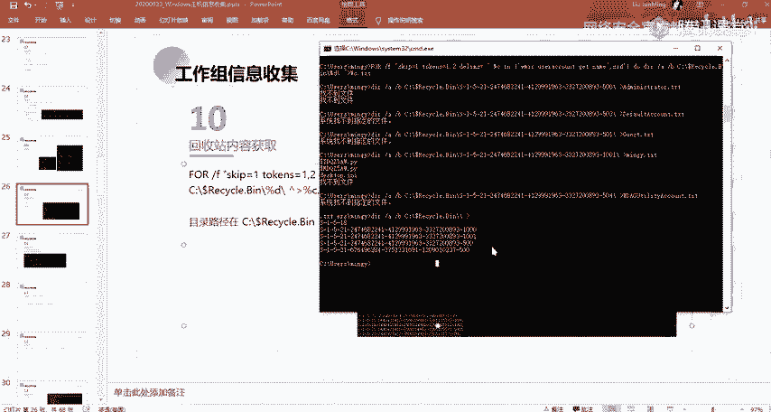

然后我们在这边的话，我们通过这样子这个脚本的话，我们能够去紧锁，就是说去紧锁这样子的一个呃路径。就这一个呃C盘的这个路径下面，他每一个用户的话，他的有这样子1个SID值下面的一个目录。

就是说如果你有多个用户，对吧？你多个用户他你有都有删除的这样子一个文件放到回收站当中。那么它每一个用户他对应的1个SID目录下面的话，就是说回收账中当当中的一个内容的话。

他会啊放到对应的一个用户SID的一个目录下面。这个应该能理解。然后在这边的话，我们可以看到我们查找到有在这一个呃这个。用户啊就其实我们在这边能够知道我当前的一个用户是MIGY。

还有像admin的一个用户啊，对吧？还有个ose的用户，对吧？还有这样子的一个用户，他下面的话它都是没有这样的一个文件的。但是我这边的这一个文件的话，它可以看到是有的。那么。

那么我们就可以去进入到这样子的一个文件目录下面来去查找到它的一个文件。Okay。🤧。我们呃可以通过DIR杠A来去查看到这样子的一个文件夹。呃。这边的话是这个。OKCD进去，然后D家能够去查看到对吧？

有这样子的两个文件，然后我可以直接通过typeap。来去查看这两个文件的一个内容。然后可以看到首先这一个多了I开头的这样子的一个文件，它的一个文件的一个内容的话，它是存放着我们的这一个文件。

它的一个路径。这边的这一个路径的话，其实就是我们在删除之前这个文件所处的一个路径。就因为我们这一个回收站当中的话，我们需要去。如果说我们需要把这个文件复原，对吧？就把它给还原的话。

我们需要知道原来的它的一个存放路径是哪，对吧？也就是说你的一个回还原操作的话，它会读取这一个文件当中的一个存放的一个路径，然后的话他会把这一个文件把它给重新放到这样子的一个文件路径下面。好。

那么自然的我们下面的这一个文件的话，就是我们的这一个删除文件的一个内容，对吧？也就是呃这样子的一些内容。这边的话是一个呃拍点的一个脚本。当然的话呃这边的话有中文的话是乱码的，有。

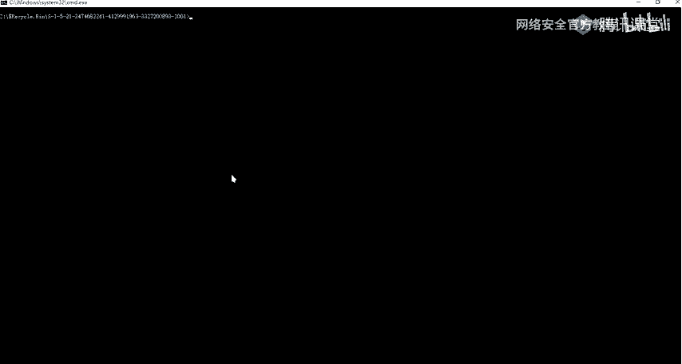

就比较正常。嗯。然后这边的话是一个回收站的一个内容获取。然后还有就是呃谷歌的一个历史记录，还有cookie的一个获取。呃。就我们知道我们的一个就是我们的一个主机。

我们通常的话都会去使用浏览器去进行个访问，对吧？像我们去浏览网页以及浏览相应的一些服务，对吧？我们会去使用这样子的一个浏览器。就框啊，谷歌浏览器的话应该都是大家常用的，是吧？

反正我是常就最常用的话就是谷歌浏览器啊。嗯。然后的话呃谷歌浏览器的话，在这边我们可以通过相应的一些操作来去获取到它呃浏览器当中所存放的这样的一个历史记录。还有我们访问的一个网站。

它的一个一些cookie的一个信息啊。Yeah。哦呃在这的话要了解一下，就是呃这样子的两个路径，它分别的话是存放的就是说我们的一个我们的一个库ki的一个信息，以及我们的一个呃。

访问的这样子的一个历史的一个记录。存放在这两个路径下面。然，我们要去读取它的这两一个呃文件的一个内容的话，我们啊可以使用这样子一个mini cards。因mini cards的一个使用的话。

下节课会给大家讲。呃，在这边的话，我们先就是看一下效果吧，好吧。嗯卡。Yeah。

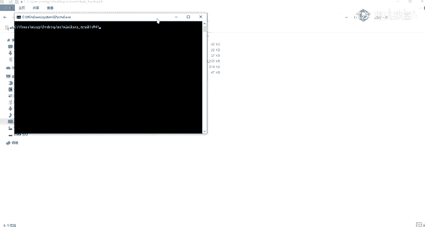

然后在这边的话呃，我可以通过minicast它的这样子的一个。呃，调用它的1个API的一个接口。就他那个API来去啊，这边太多了。就这样子的一个命令。

就是呃有这样子的1个DAPPDPAAPIcom这样子的一个呃这样子的一个模块。我们能够去读取这样子的就这一个路径下面的一个信息，然后这边的一个信息的话。

其实我们可以看到就是我们的一个访问的一个呃网站的一些呃信息啊，对吧？我们在这的话能够知道我这边的访问了哪一些IP对吧？以及哪一些域名。对吧都能够查看到这边的话。细看都是我的眼子。

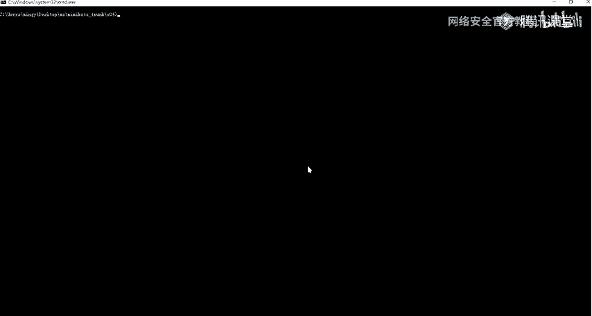

然后的话还有就是。cookki的一个信息。就是我们访问的一些网站啊，对吧？啊，访问的这些网站的话，它会有存存储在存储的一些cookki值，对吧？像比如说在这边访问的这一个网站，对吧？

然后它的存储的一个cookki值。

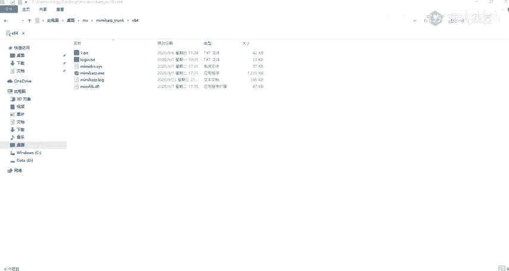

以及还有相应的这样子的一些。这边的话大家自己去尝试吧，好吧。对吧。我这电话。就不细看了。

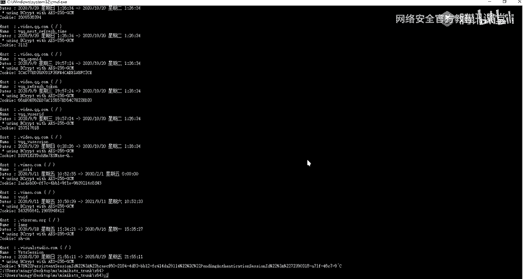

大家可去看一下自己的。然呃还有的话就是通过抛 share。我们在这边的话就是通过po希尔的这样子的一个脚本的这个get information的这个脚本。它这个脚本的话。

它能够去获取到我这边写的这样子的一些信息啊，就FTP啊共享链接，还有呃驱动应用程序hos的文件内容进程，还有无线网络的一个记录。其实在这边的话啊把前面的相相关的有一些有一部分的一个内容。

它把它汇汇总到了这样子的一个脚本当中。然后通过这个脚本的话，就能够去啊，直接去批量的获取到啊目标机器上面的这样子的一个信息。那还有的话就是通过MSF。就MSF的话呃也是大家常用的对吧？就我这边的话。

我我不演示了。大家可以就是自己得到这样子1个MSF的一个选，对吧？然后我们可以利用MSF当中的话，它自带的这样子的一个模块。我这边的话介绍两个模两个信息收集的一个模块，就是这个school。

还有这个呃winwinUM这样子的两个模块。这两个模块的话，它呃它收集的一些信息，我们从这个截图当中我们能够去查看啊，就是说它其实它是相当于也是一个脚本，对吧？然后这个脚本的话。

它会去执行这样子的一些命令，就我们在这边可以看到，像比如说ARP杠A就是查看我们的AIRP的一些记录，还有IPIP confi干落，对吧？它会去一一的把这一些信息去进行一个紧锁收集。

然后还有呃问边M的话，同样的它也呃哎。没。我，这边。这边截图搞错了呀。Okay。呃，这边这边的这个scrapper这个截图搞错了，这边截的话是这个V12嘛。的一个截图啊。

就是说这个VVENEM的它的一个功能的话，就直前这样的一个面料。呃，这个的话我有点忘了。

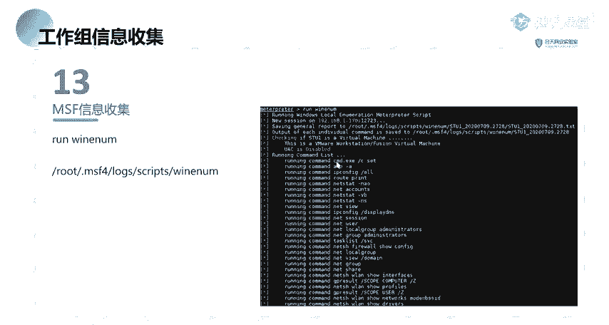

对。这边截图搞错了。我去系统信息。然，大家自己去啊在自己用MSF去执行一下就知道了。好吧，我这边的话我就不多说了。我这边的话呃截图搞错了，这边放错了。啊呃。

以上的话就是呃工作组的一些信息收集的一些方法以及思路啊。呃，这边的话。讲的有点多了。诶。常用2G呃2G呃常用2G2G也行，现在2级浏览器的话还可以。搜索软件搜索软件叫youtu us。呃。

抛屑脚本的话呃杀网会难，但是我们可以有相应的一个方法可以绕过。就可以绕过绕过三碗的。在后面的话可能会给大家呃有介绍。然后其实大家可以去看一下前面的就是看第一期的一个内容，里面也有相应的一个那个。诶。

关于前面的这一个内容的话。大家有没有什么疑问？前面那个。前面的这样子的一个工作组的一个信息收集的一个内容。Yeah。好，没有疑问。啊，没有疑问的话，那么我们继续啊，我们抓紧时间把后面的一个呃。

内容给过一下吧。好，呃，下面的话我们一起来看一下，就是域内的一个信息收集。就其前面的话我们讲的是一个工作组，对吧？工作组的话，其实我们常常见的就是工作组。对？在域内的话呃，可能大家呃。接触的应该比较少。

对吧？好哦前面其实有同学问就是什么是玉对吧？就这个玉到底是什么？然后与我们前面那一个工作组，它有什么区别？然呃就详细的关于这一个工作组和域的一个区别的话，就大家去看一下这篇文章吧。

我这边的话我就不细说了呀，就他这边文章的话，他就是用他自己的一个语言对吧，就是。就可能大家更好理解一点啊。就呃他用他自己的一个就是比较好理解的一个语言来去介绍了就是工作组，还有玉他的一个区别。

以他的一些特点。我这个话就大概的给大家就是介绍一下，就是玉。就域的话它是一个有安全边界的一个计算机集合。就其实就是呃跟我们前面那个工作其实也是比较类似的。就它是呃多个计算机的一个集合。

就集合起来组成了一个域。然后这个安全边界怎么理解呢？就是说在两个域中，一个域中的用户无法访问另一个域中的一个资源。就是说这是有一个边界。就是说你在一个域中的一个主机。就是在同一个域中的一个用户的话。

它是可以去互相访问的。如果说你不在同一个域的话，那么它就无法去访问无法去直接访问。但样的话我们也呃我们可以去配置相应的一个域性任的一个关系来去实现这样子的一个呃跨域的一个就不同域的这这样子的一个访问资源的一个访问。

🤧嗯。😊，然后呃域的话就是说它是将网络中多台计算机逻辑上组织到了一起来去进行一个集中管理。就其实前面也说了，就是说他相比一工工作组的话，它那个优点的话就是它是呃。它是能够去批量的去管理呃更多的一个主机。

对吧？如果呃在我们工作组当中的话，它是呃他的这样子的一个管理模式的话，他是呃无法去批量的去管理所有的一个主机的。所以的话工作组它是只适合这种小规模的一个计算机的一个集合，啊，就把在呃就小规模的去呃。

在把一些计算机按不同的一个功能来去进行一个分组，对吧？啊呃在玉当中的话，它是。能够去批量的去访问，去管理，去控制。就是说在这一个域当中的所有的一个机器。然后在这一个域当中的话。

它会至少有这样子的一个预控预控制器。这个预控制器的话，它保存着整个域的一个用户账号，还有安全数据库。就是说在预控机器上面的话，它保存着所有用户的一个账号的一个信息，就账号密码的一个信息。

然后的话我们的在域内的一个主机，要去访问其他一个主机的话，它都会去呃在预控制器当中去查找去查找到目标机器上面的这样子的一个呃用户账号的一个访问权限。然后的话才能够去访问到其他的一个机器啊。呃。

这边的话呃在后面会就是说在讲它的一个capco的一个协议。就是说在域当中的话，它的这样子一个密码印证的一个协议的时候的话，会给大家去介绍。在这边的话呃提一下。

然后呃域它有相应的一些就是需要大家去了解的一些点，就是呃预成云计算机在登录的时候，可以选择登录到域中或者此计算机。就是说呃我这边的话。

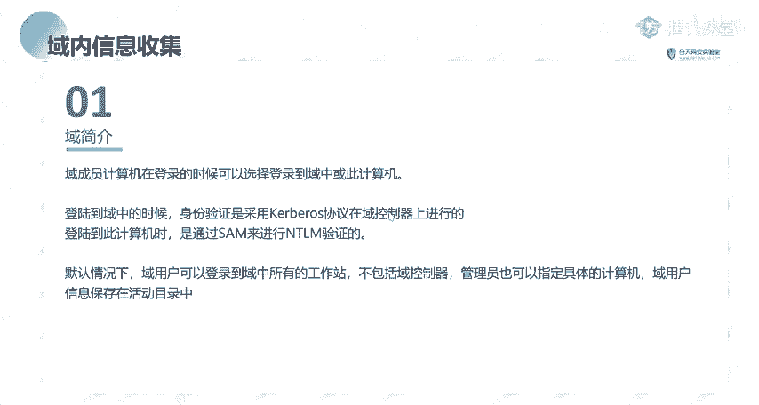

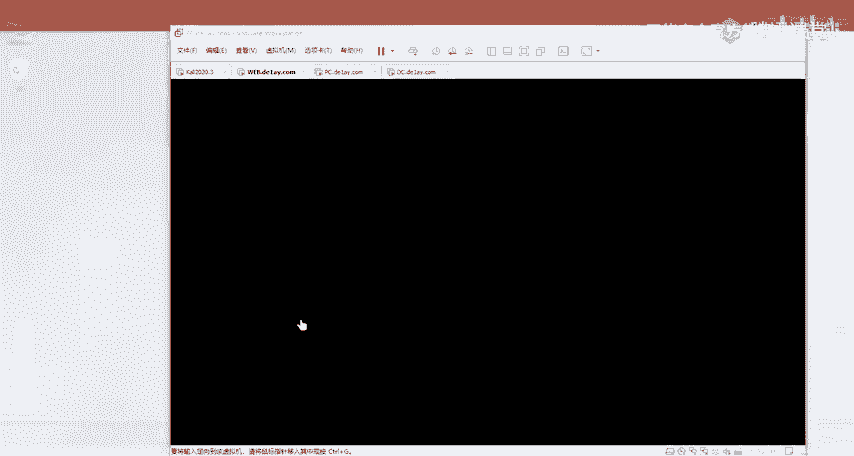

以这个机器为例。Okay。比如说我这边这一个机器，对吧？我当前的话是登录这个dlaymycycl这样子的一个用户。对？然后的话其实呃。我可以。呃，我要我要去登录域的话，我需要首先的话输入一个域名。

就是登录域的话，有这样子的方法，有两种登录域的一个方法。我这边的话就先说一下第一个。第类就是我这边当前的一个登录需要去登录的一个域名，然后的话输入我的一个用户名。比如说。

我用addmin的一个用户去登录这一个呃域。然后的话密码是。Yeah。可以看到在这个的话已经成功的登录进去了啊，这边的话就是我以addmin的一个用户而登录到了。

就是已域就登录到了这样子的一个域delay的这一个域当中了。这边的话。再切换一下就。就呃首先刚开始是不是用的这个my circle的这样子的一个用户去登录的。好。就注意的话。

在这边我都是登录的这个dlay的域对？那么我可以选择就是我不登录。就只登录到就是这个机器，这一个主机的话，我们可以看到它会显示这一个登录到PC。这个PC的话其实就是这个机器的一个主机名。

就我们的那个计算机名，然后呃密码应该是。2。你密我说一。嗯。呃，我这边忘记了他这个密码了。这是什么？呃，这个的话，因为我这边的话是就是用的那个别人的一个把机啊。就是我这边就推荐大家去下载的这几个把件。

我是用的这个就wins style3。因为因为其实搭建域环境比较麻比较麻烦，所以的话。

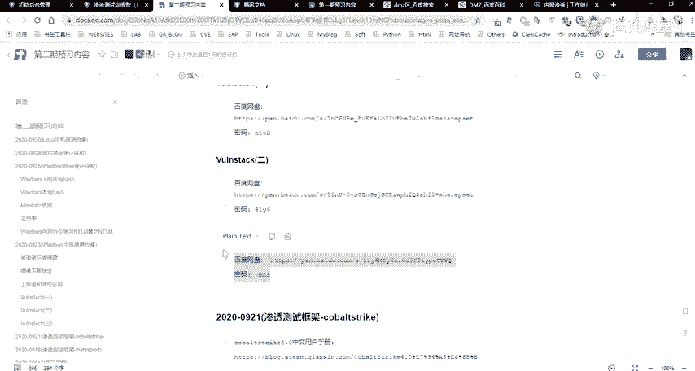

呃，我推荐大家我建议大家也去下载这样子的，就是别人已经搭建好的这样子的一个预环架。然后的话它的这个预环间的话，它里面也有有相应的一个呃。就是漏洞啊，可以去直接去利用，就方便大家去进行一个另手。

然后我这边的话是用的它的这个win stack3的这个把件。唉呃考虑到大家其实我自己不喜不是很喜欢搭这种环境，就搭环境浪费时间用。而且就比较麻烦，就我建议大家的话就是刚开始学这个的话，呃。

还是就是不要把时间花在搭环境上面。就是大家可以先就是先知道这个东西是什么，对吧？然后的话怎么去进行一个使用啊，什么之后的话，如果说你想要对这样子的一个预环境的一个搭建更更了解的话，你可以呃自己去动手搭。

然后的话其实网上有这种搭遇的一个教程嘛，对吧？

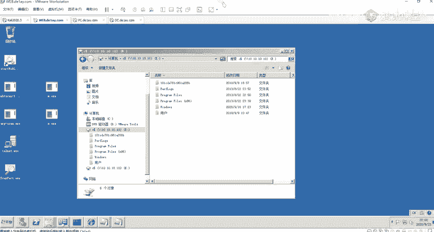

嗯。呃，我这边的话呃这边的话实际的话是可以去登录到我这边的一个机器的，就是登录到本地的一个啊，你本地的一个用户。然后的话呃登录到域中的时候，就是身份印证。在这边的话，就是前面有提到，就是身份印证。

它是采用到这样子一个cos的一个协议，它是在预控制器上面去进行的。就是说他登录到域中与登录到本地计算机，它的一个身份验证的一个方式，它是不一样的。然后登录到本地的一个计算机，也就是我们平常的我们平常呃。

对。T。就我我平常我这边我去登录我的这边的一个用户，对吧？我登录这个用户的话，就登录到本地计算机。他的一个身份验证。就是首先我们需要去输入我们的一个账号密码，对吧？输入我们的一个账号密码。

然后他输入账号密码之后的话，它会通过这样子的一个印证，就印证你的一个账号密码是否正确，对吧？然后它的一个印证的话，它会是通过这样子的一个就是s。就这个sam的话，它是存储在我们计算机本地的一个文件。

这个文件当中的话，就存储在我们当前计算机上面啊，所所有的这样子的一个用户的一个呃呃用户的一个信息。就包括你的一个账户账号名以及密码信息。然后它的一个密码的话，它是通过1个NTMNTLM的一个呃印证。

就它是一个通过NTM的一个呃加密算法来去进行一个呃加密的。好，关于这一个的话。呃，下节课会给大家具体的讲一下，就是这个NTM就是说我们在下节课讲我们的一个密码哈希获取的时候。

会介绍到这样子的一个就是说windows上面的一个哈希的一个内容。这边的话大家先了解一下，然后登录到狱中的话，它是采用的这一个coice的一个协议。呃，这个的话后面也会讲啊，大家先不要急。先了解一下。

Yeah。啊，呃，默认情况下的话，预用户可以登录到域中的所有的一个工作站。也就是说呃你是一个如果说你得到了一个预用户的一个账号密码，那么你就可以去登录域中的其他的一个主机。

当然的话它是不包括预控制器的就预控制器的话。预控制器的话，你需要预的一个管理员的一个账号才能够去登录。嗯。😊，然后呃在奖玉的话，就需要给就大家需要去了解的几个概念，就几个。呃。就几个专有的一个名词吧。

首先第一个话就是预控。就预控的话，其实前面我们提了很多了，对吧？就在预当中的话，必须至少有一个这样子的一个角色，就是这一个预控，也就是DC就是这个doin control。就是啊预控制器嘛，然后的话在。

就预架构预架构当中的话，预控它是用来管理所有的一个客户端的一个服务器。也就是说我们如果说我们登录了这样子的一个预控制器，那么我们可以在这个预控制器当中去管理单前域当中的所有的一个机器。

所以说我们再去进行一个渗透的时候，去去进行这样子一个预渗透的时候，我们最终的一个目的其实就是去拿到这样子的一个预控的一个权限。如果我们拿到了预控的一个权限的话。

那么当前的这个预下面的所有的一个主机都是我们可以随便的去进行一个登录去修改。我们我们能够去对这个域当中的这一些主机有一个完全控制的一个权限。Yeah。然后的话呃预控的话呢是我们预架构的一个核心啊。

然后在预控制器上面的话，它包含有这样子的1个AD活动目录的一个数据库。这个活动目录数据库的话，它这个数据库当中的话，它就是呃存储着我们的所有的一个预用户。好不，所有就是我们呃当前域下面的所有的一个主机。

它的一个呃账号密码的一个信息，它都存储在这样子的一个活动目录数据库当中的。大家要注意的话，就是说在域当中与我们本机的这样子的一个登录，通过这个s目文件，它的一个区别就是在域域当中的话。

你的一个身份印证的时候，你是需要去啊通过这一个域的，就是你首先需要去访问域控制器。然后的话在预控制器上面，它会去审核你的这样子的一个账号密码。它是否正确。它去审核你的账号密码的话，它会通过这样子的。

科巴斯的一个协议。然后它在中间的话，它会有系一系列的一个过程，然后他会去在这个数据库当中去去查找你的这样一个登录的一个账号密码。它是否正确。如果正确的话，它就会允许你去访问到其他的一个机器。

然后的话呃就。在一个域中的话，可能。就至少有两个预控，就一个作为一个就是DC就是主预控啊，也不是主预控，就是一个正常使用的1个DC预控。

一个的话一个备份的1个DC就是说备份DC话就是当我们的1个DC控制器，它就是崩溃了，对吧？或者是说呃损坏了坏了，那么我们的一个备份DC的话就起到了作用。因为我们如果说你DC你的一个预控制器，啊。

你崩溃了，你崩掉了。那么域内的所有主机它都是不能够去互相访问到的对吧？因为你要去访问到其他机器，其他机器的话，你都需要去首先去访问预控。然后的话由预控制器去进行一个这样子的一个呃印证审核。

然后呃活动目录，也就是前面我们讲的这1个AD的一个活动目录数据库。就呃它是预环境当中提供的一个目录服务的一个组件。呃，它它的一个主要的一个作用的话，就是我们所有的一个网络对象信息，它都是以。

一种结构化的一个数据来存储在这样子的一个活动目录当中的，就是这个activedirecty。然后网络对象有哪一些呢？像比如说我们的一个用户。

还有主计算机、共享资源、打印机、联系人等等这样子的一些网络对象的一个信息，它都存储在这一个目录当中。比就是说我们所有的一个用户，他的一个信息以及组的一些信息啊等等的这些信息。

它都存储在这1个AD活动目录当中。然后的话呃AD活动目录的话，它的一个服务器就是我们的一个预控DC。也就是它的1个ID活动目录的服务器，它是在预控预控制器上面的。嗯。呃，以及活动目它的一个主用功能的话。

这边的话大家自己课后去看嘛，我这边我就不一一的去介绍了。然后呃还有就是这边的几个就是容器。这边的一个容器的话就是。呃，如果大家有去有去。

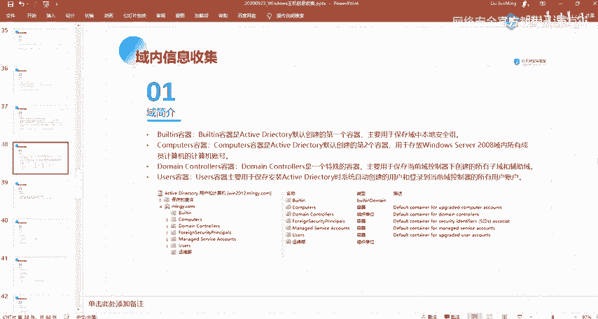

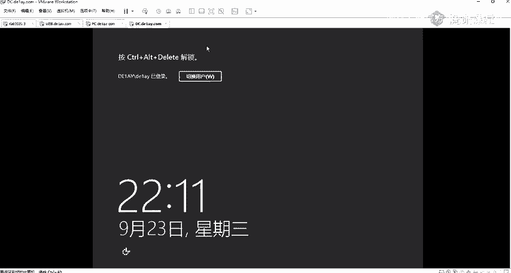

用这样子的一个玉的话。嗯。😊。

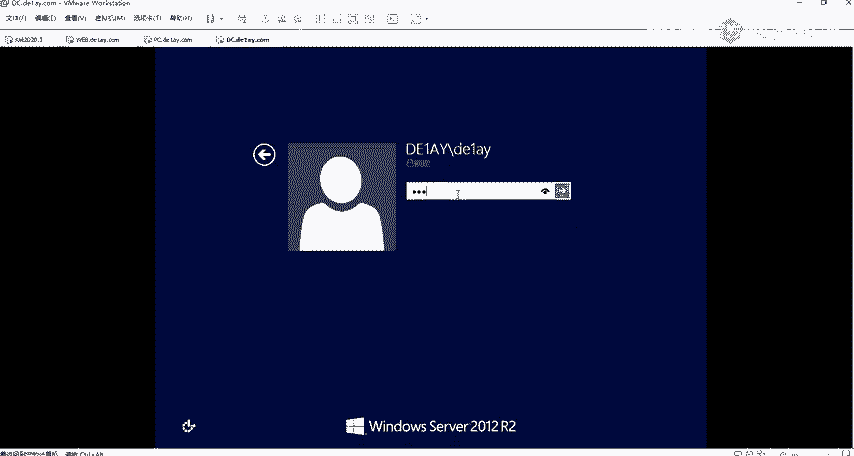

用这样子一个域的话，你进入到它一个预控制器之后的话，它会有这样，就是在这样子有1个AD的一个用户计算机的这样子的一个东西啊。在这边的话有这样子的一些呃选项，也就是这样子的一些容器啊，还有组织单位等等。

然后在这边的话，我们来大概了解一下，就是说这样子的一些容器它的一个作用啊。就我们知道这样子的就是ADAD的一个活动中的话，它是存放着一些啊我们的啊网络对象的一些信息，对吧？包括用户的一些信息啊等等的。

啊吧，然后的话在这个AD的一个控制器当中吧，啊不AD的这样子的一个活动目录当中的话，有这样子的一些容器。像这个必二指名容器，它是AD默认创建的第一个容器，就主要用于保存域中的一个本地安全组。🤧Yeah。

然后我们可以在这边就是选择这个辫子里来查看到在这边的话，它存储了这样子的一些安全组。就本地域的一个安全组。然后在这边它有这么多的一些安全组啊，然后呃这边的话也有相应的对这个组的一个描述。

像比如说这个优者。啊优者的话呃优者的话就是我们的一个用户组嘛。我们本地的一个啊用户组。呃，还有addmin主要就是我们那一个管理员组，就是他可以对计算机，还有域的话有不慎不受限制的一个完全访问权。

就是说有这样子的，如果说我们的个用户他是在这个呃组当中的话，那么我们。那么他的这个用户呢就是一个管理员的一个用户。就是关于这一个标题容器，它是存放保存域中的一个本地安全组。

然后com呃computerscomputers这一个容器的话，就是呃用于存放我们的一个就是windows服务器的。啊。这个不是windows设的708呀，先用来存放。

应该是windows server域啊，就是说用来存放我们当前的这个呃域当中的所有成云计算机的一个计算机的一个账号。就是说我们可以在这边来看一下computer这边的话有两个计算机，对吧？

然后这两个计算机的话，它的一个就是说它我们就是这两个计算机啊，就是这一个web还有PC的这两个计算机，然后的话因为它是在域当中，对吧？在域当中的话，它加入到了域当中。

我们如果说web这个机器要去访问这个机器，要去访问这一个机器的一个资源的话，那么它中间会有这样子的一个过程，就它首先这个wordb机器它会去访问预控。

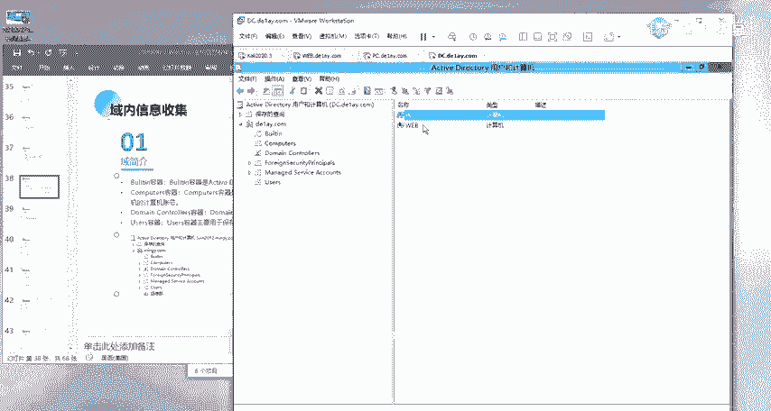

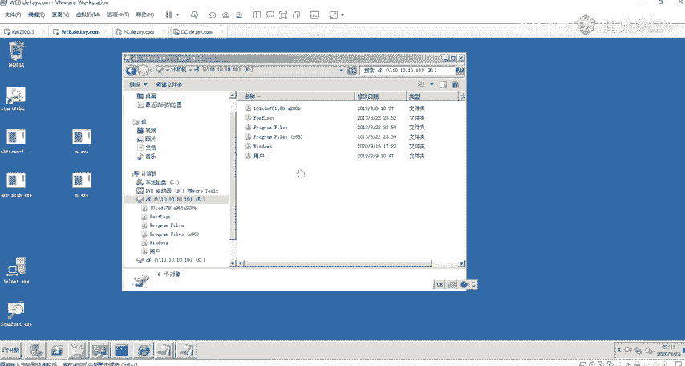

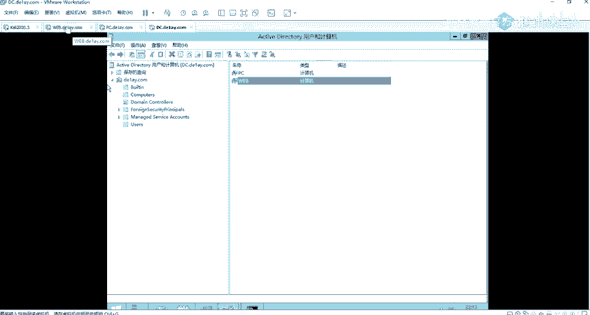

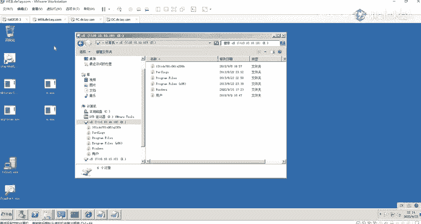

然后的话在预控当中，他会在这个AD目录当中去查找，去验证你的给出的这样子的去就去访问这个资源，他需要他的这个用户名及密码，对吧？那么他就会去在这一个目录当中去查找。去找到对应的这样子的一个计算机。

它存储的一个呃呃用户名密码的一个信息，对吧？然后的话与这边给过来的去行一个匹匹配。如果匹配正确了，那么它就能够去访问到这个机器的一个资源。所以的话在这边的话。

它在这里的话就是存储的啊域当中的所有这种用户的一个账号的一个信息。然呃这个doindoomain controller就是预控嘛，在这边话就是我们可以在这边能够看到在这边它是存储着预控的一个信息啊。

就其实就是我当前的这个机器，它的一个信息啊。

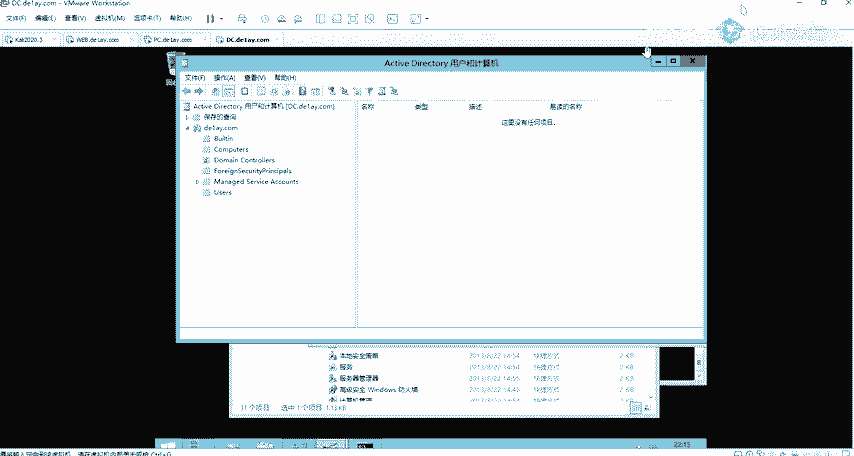

然后还有就是呃优着使容器。6者是容器的话就是用来保存，就是创在安装预控，安装这个ADAD的时候，它系统自动创建了一个用户，还要登录到当前预控制器的所有用户的一个账号。

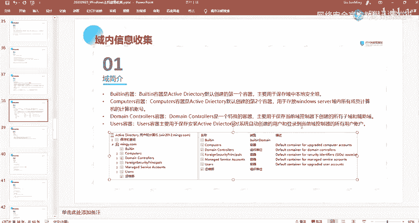

Okay。我们来看一下。就是啊在这边像比如说我们这边有一个delay的这样的一个用户，对吧？这一个用户的话。就是我们能够去进行一个啊，它是一个预用户，还有这个my set。My s circle。

Yeah。还有这一个administer的这样子一个用户，这这三个用户的话，还有这个ghost4个用户的话，它就是一个域用户啊，就是等于在这的话，它是有4个预用户。也就是说我们这四个用户的话。

我们都可以去我们可以用这四个用户来去登录。啊，在域在这个域当中的这样子的一些域的一个主机。

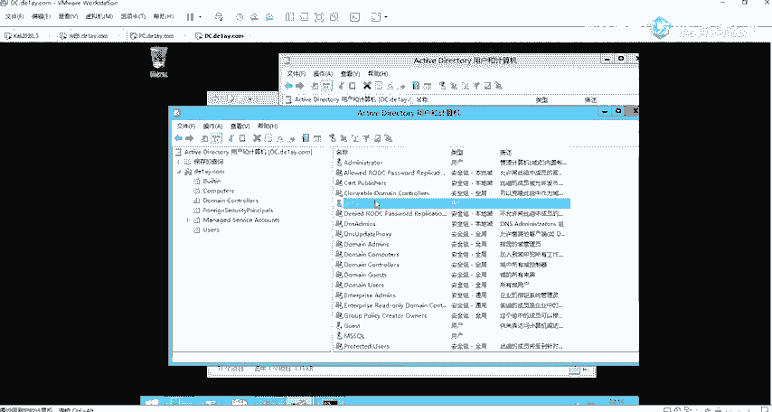

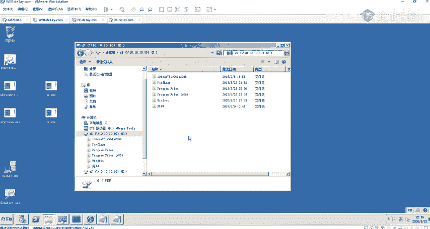

像比如说在这边啊，我们可以登去登录这样子的一些主机。Yeah。呃，DC崩溃了。呃，对，到时候的话我们有所以的话我们需要有这样子一个备份的1个DC嘛。对啊。就你你的这个DC你崩了的话。

我们有一个备份DC的话，你那个DC你崩了，我们这个备份的DC我们可以直接就提起来嘛。就不会去影响他的这样子的一个。影响他的一个浴环境嘛。影响呃各个主机之间的这种访问。呃。还有一个呃还有一个东西的话。

就是这个DNS的一个域名服务器啊，就其实前面也有提。🤧这DNS域名服务器的话，大家要注意的话，就是啊我们的一个预控服务器，它是要求DNS服务器按名称来去查找计算机成为服务器和网络服务的。

也就是说我们的一个预控器预控，就是说在域内的一个机器，我们是需要按照这样子的一个计算机名，还有像这种网。按照这种名称来去查找对应的一个计算机的对吧？

所以的话我们需要有这样子1个DNS的一个服务器来去进行一个解析。然后它的一个作用的话就是通过它的1个A记录将域名解析成IP地址嘛，对吧？那么我们就是说在预控，就是说在预控制服务器当中的话。

它有这样的一个DS服务器，能够去把来自呃域内的一个主机。它去请求的这样子的一个计算机名。来去把它解析成对应的1个IP地址来去进行一个访问。然后呃DS域名服务器的话。

我们可以用来去定位我们的一个呃活动目录服务。就是说我们知道就是说DNS服务器的话，它是在预控上面的。那么我们就能够知道呃，这个DNS服务器，它的1个IP就是我们的1个预控的1个IP那么我们也能够去知道。

就是说我们的一个活动目录的话，因为我们活动目录的话，它是在预控上面嘛，对吧？这呃通过DNS来去定位预控，在后面的话也会有介绍的讲到。然后呃下面的话就是在域内的一些信息收集的一个秘令。呃。

在这边的话我就不细讲了呀。好吧，这一些命令的话，我这边的话有很详细的一个介绍，就其实这些命令的话也是比较常用的，而且就你。就大概讲一下吧。讲一下比较常用的，像比如说这个啊n dorm，这个的话是我们就。

经常用到的这样子的一个命令，我们可以通过就netre的话，我们可以通过这个命令来去查看到当前的这个多门，就查询当前这一个主机它是存在哪一个域当中。然后在这边的话，我们就能够去知道它的一个域名是这个第一。

第EAY这样子的一个域。我们能够通过这样的一个命令来去判断当前的一个主机它是否在域当中，以及它的一个域名是什么。就是说我们在前面再去进行分析我们的一个内网环境的时候，对吧？有提到这样子的一个呃东西。

然后还有就是我们查询域内的所有的一个主机。所有的一个计算机，对吧？我们可以通过命令来去查看。要。NiceU的我不知letV。ここ。就啊我们可以通过这样子一个命令，就是。在这边的话。

我们通过net view，然后加这样子的干多门。这边的话干多门的话呃，我们在后面会经常会碰到这样子的一个就是命令参数的一个格式。就大家在windows机器上面的话。

就是我们能能够知道我们很多的一些命令对。

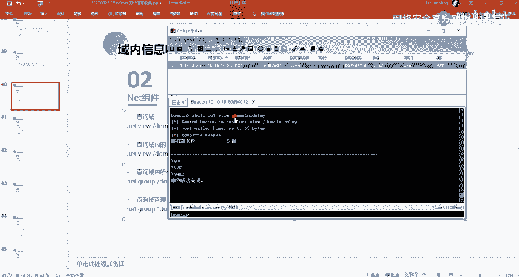

就如果大家如果经常玩win时的话，会经常使用到这样子的一个横盖，对吧？然后在windows下面的话，它是一个斜杠来去表示这样子的一个参数的。像比如说我们的一个IPphoneB，对吧？不是这样子的。

横杠过，对吧？而是。鞋带好。对吧。然后同理在这边的话，我们这边的一个干多们。它其实就是指定了这样子一个多门的一个参数，对吧？然后其实就是指定我们的一个域名嘛。然后我们在这边查询到的域名是DEEY对吧？

然后这边的一个命令的意思的话就是查询在域当中，在这个delay这一个域当中有哪一些计算机。我们可以看到在这边有三个计算机，对吧？这三个的话，这三个计算机大家注意这边显示的都是计算机名额。

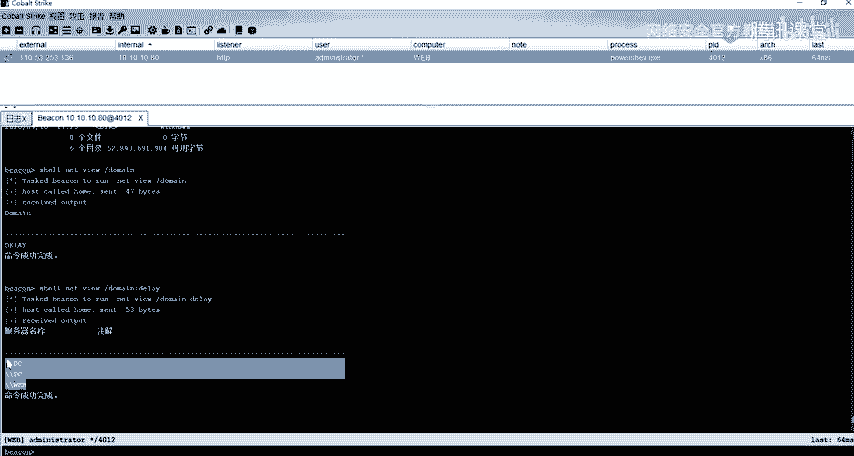

啊。就呃之后的话也会大家会经常会碰到，就去看到这样子的一些形式这样子的一个形式。呃，以及。查看预控制器。这个也是我们。经常会去。

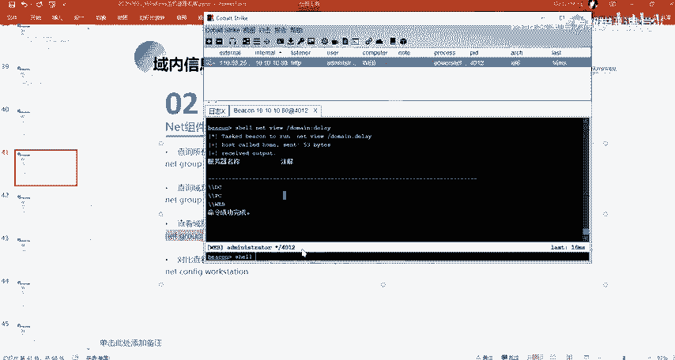

用到就是说我们需要知道，就是说我当我当前的这个域当中的话，它的一个预控制器是哪一个？对吧？我们在这边的话，我们可以通过这样子一个命令，有预控制器的话，就是doomain controllert。

他是在这样子的一个组当中的。然后的话我们可以找到有这样子的一个成语DC也就是我们能够去知道在这边的这个主机名为DC的这一个呃这个机器的话，就是我们的一个预控。

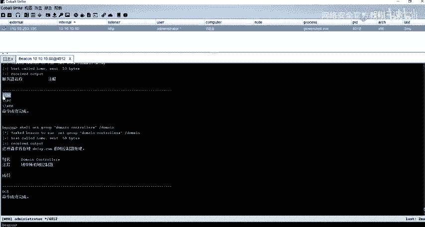

但的话这边的话它是命名的话是以DC命名的嘛，对吧？就我们通过命名的话，也能够知道。但的话如果说他不是按照这样子一个命名的话，那么我们需要通过这样子的一个方式来去判断你的这样子的一个主机，它哪一个是预控。

嗯。还有可以查看域内的一个所有账号。就是你的一个在当前这个域当中，它有哪一些用户。就我们可以看到在这边的话有这样子的一些用户。这里的话除了这个catcat就是KIBTGT这一个用户的话。

这个用户的话呃在后面会给大家讲。嗯，这个用户的话是比较特殊的。他这个用户的话，他是就是说呃。嗯，他是一个不能够去登录的一个用户。但是他的这个用户的话，就我们再去进行一个cas协议的一个认证的时候。

会去用到。比是说呃域内的一个主机，去向我们的一个预控区进行一个验证审核的时候去进行一个资源访问的时候，会去用到这样子的一个开呃KRBTTT的这个用户它的一个哈希子。然，呃在这边的话。

我们可以看到在这边有这样子的4个用户，这四个用户的话其实都是我们的一个域用户啊，就在域内的这样子的一个用户是吧？就是就是对应的我们这边的。

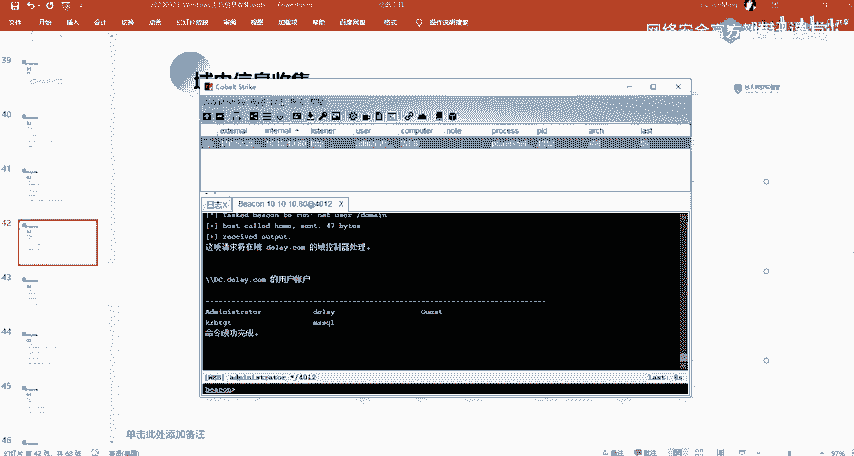

这里的4个用户，对吧？

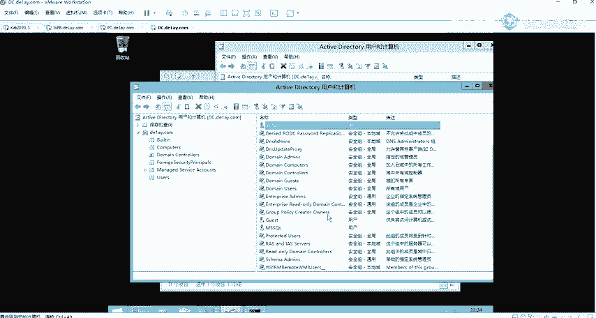

然后还有其他的这样子的一些方法，我这边的话我不一一说了，还有就是通过这个dicra discra。这一个工具，然后要注意的话，这一个工具一般是在预控上才有。就这个Ddiclaimer。

我们可以通过这个命令来去查看就域中的账号名啊，还有啊主名啊等等这些功能。然后我们其通过net这一个自带的也能够去实现。这个的话就是介绍有这样子的一些方法，能够去进行域内的一个信息的一个收集。

还有其他的一些，像比如说查看域内的一个信任关系，以及查看预控制器的一个机器名。就通过这个NLtest。这个命令，还有我们可以通过NSlookup来去，就是看预内的一个就邮件服务器啊。

还有这种DNS的一个服务器。啊，大家注意这边的话，这边的话是我的一个域名。就呃不是我这边的一个机器，是我另外的一个环境，然的话。呃，我另外的一个行间的话是这样的那个MIGY点com的这样的一个域啊。

还有就是呃第五个就是定位预控。就定位御空的话，就呃有这样子子的几个方法，我这边列了。就其实通过前面的话，前通过前面再去介绍这些命的时候，其实已经大概给大大概给大家介绍的差不多了。就是这个像比如说。

第1个IP confi就我们直接IP confi干货的话，能够查看到它的一些信息，对吧？像DNS的一些信息。就DNS的1个服务器，这1个IP地址以及DNS的一个这种勤奋，对吧？我们就能够去嗯。

大概的判吧。Mhm。😊，能够去大概的呃获取到当前的这一个啊域名，对吧？以及它呃它的就是预控的1个IP地址，对吧？这样子的一些信息。就主要的话就这里的一个电源室的一个服务器啊。

然后其实我们也可以通过就我们知道了这样子的一个。

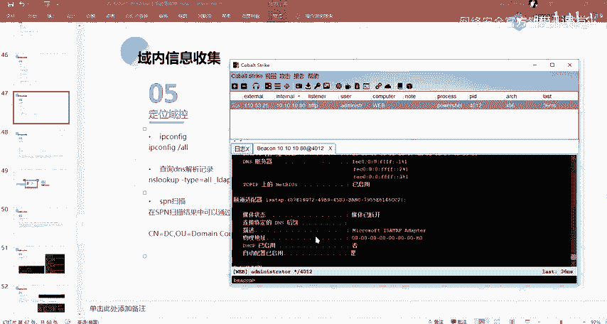

好，我们想要去知道它的一个预控哪个IP对吧？我们可以通过。那直接看 up对吧？我们直接去解析这样子的一个预预控名。然后我们。就能够去解析到他的这样子的一个。预控的1个IP就这个。

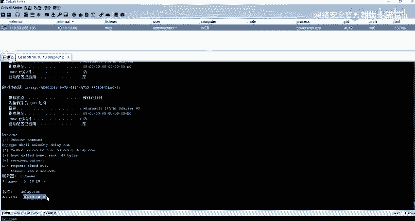

嗯。因呃直接通过NSNS来去去呃解析我们这边的一个域名。然后的话我们就能够去得到我们预控的1个IP啊。然后以及还有通过前面的就是去定位预控，对吧？啊，去查找就是预控的一个主机名，对吧？来去定位。

还有通过DNS记录，我们可以通过NS的看up好，通过这样子的一个方式来去定一个呃定位。还有呃这1个SP那个扫描。SPN扫描的话呃。这边。哎，后面后面的话有相应的一个内容会讲。

应该这边的话大大概先了解一下，就是呃在这边的话呃，我们可以通过这样子的一个方法。通过SPN的1个扫描来去查看到。像比如说在这边的话有这样子的几个呃东西，就是CN就是呃DC就表明我们当前的这一个它是一个。

呃，它的一个计算机名是1个DCOU的话就是它的一个doin controller，也就是它是一个预控制器。以及我们DC的一个。我这边少了吧。然后还有的话就是呃通过net group。

就我们刚刚说到的对吧？来去查找到啊，这个在这个doin control这个组当中的一个主机名。他的一个成名，他的一个名字是哪一个？然后的话我们就能够去定位到他的一个主机。还有话就是端口识别。

就端口识别的话，其实就是呃。这两个端口就是389389的话就是我们的1个LDAP这个LDAP的话，它是一个目录访问协议，就是它是我们可以通过就。就在预控当中的话。

它会开放这样子的一个目录访问的一个协议的一个端口。就是这个389的一个端口，它是起了这样子1个LDAP的一个服务。以前有53的话就是我们的1个DNS的一个服务端口嘛，默认的对吧？

因为我们的一个预控上面的话，它是有一个这样子1个DNS服务器。那么我们可以去呃通过扫描呃，通过发现呃主机的这样子的两个端口来去判断这一个主机它是否是一个预控对吧？能够有一个基本的判断。Yeah。呃。

后面的这一个。内网存活探测的话。呃。我这边的话就不讲了吧，因为呃讲的有点多了。现在。又超超时了。哦，不好意思，又忘记看大家的一个问题了。今天讲了好多呃，有点多啊，后面的内容其实都挺多的。

就是所以的话其实我让大家就做好心理准备嘛。就是呃剩下的话下节课再讲呃下节课还有其他的内容啊。就和大家先。大家先我等会儿把PPT发给大家，好吧，然后的话大家先可以先自己先看一下了解一下。

然后的话好好的消化一下我前面讲的一个内容。然后后面的内容的话，如果大家觉得有必要去讲的话，我抽个时间给大家讲是吧？然后我可能下节课的话还是讲的下节课的内容。因为我有下节课的一个安排啊。

重修两三次嗯嗯没必要的没必要。🤧其实呃这东西的话呃也不是说很难，就其实也不是说很很深奥的那一些东西啊。就可能大家刚接触的话，可能还是一时半会呃，有点接受不了。那没关系，你呃你陈嘉欣。

你跟跟着我这边学的话，然后你有有问题，你直接问啊。还是嗯可以掌握的。当呃就这一期的话，因为加了就是有加了预渗透的相关的一些内容。可能呢就所以的话会呃可能大家一时半会儿比较难理解，就有些东西的话。

因为有些东西的话，可能我这边只是单纯的给大家说介绍，可能大家不是有很深的一个印象。所以的话建议大家一定要在课后自己去进行一个操作。因为我们现在的一个课程的安排的话，是中间有一天的一个时间，对吧？

就两节课的话，这一天的时间的话，大家就是留给大家自己去操作的。然后呃所以的话就是大家自己去在本地，建议大家自己去本地，就是呃可以跟我一样去下载一下这样子的一个把机。这是有这样子的三个机器。

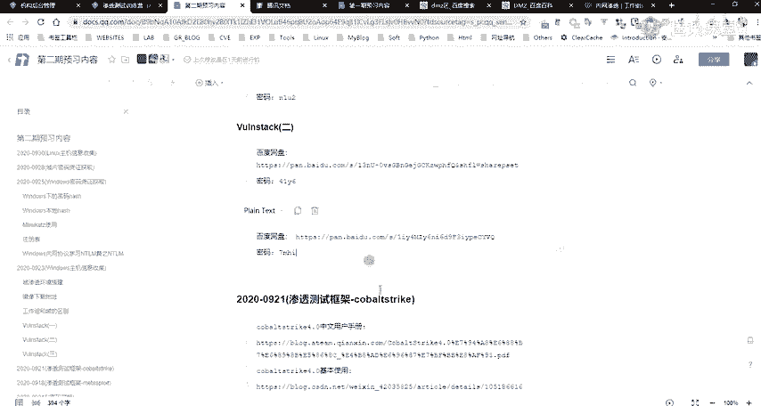

这三个机器它是一个预环境，就不用大家自己再去搭了嘛，对吧？你自己去搭的话，你还要去安装这种系统啊，对吧？然后的话还要去配置。虽然配置的话其实也不是很难了。但是能节省自己很多时间嘛。

当当然的话就是下载的话需要时间。然后你再加一个卡里的话，你就能够去啊就组成了你的一个就是学习的一个环境。

嗯。😊，好吧。呃，解压呃，应呃应该是的啊，是的，就是你解压之后的话，你当然的话你还是需要去配置的，就你需要去进行一个相应的一个网络配置。当然的话你网络配置你不知道，你可以问我好吧。你直接在群里问。

只要在群里问就可以了。就是你需要配置网络嘛。比如说我这边的话是桥接，还有就是自定义的这样子的一个。呃。云木 name。Yeah。大家呃有什么问题吗？应该没有什么问题啊。好，就是我这样子给大家讲课的话。

大家能接受吗？Okay。啊，或者是说呃就是大家有有什么就是建议，对吧？如果我觉得你的建议可以的话，我可以采纳的。就是主要的话最终目的是要让大家能够去就是理解我讲的一个内容啊。我呃现在大家不好说的话。

大家可以就是私聊我好吧。就如果觉得我这样子就讲课的一个方式，或者说内容太多了，对吧？内容太多了，这个其实也是一个问题啊。以及我讲课的一个节奏，命令不要讲太多呃，好，可以。就是呃前面的话。

那前面是呃不是有同学，就是说就是这一些病的话不是很了解嘛，是吧？啊。好呃，应该没有其他的。后面的这一部分内容的话呃PPT发给大家，大家自己去看一下吧。其实我这边的话已经写的相当详细了。

对吧包括命令以及呃我这边的一个使用的一个截图结果是吧？也就是一个内网的一个存环探测，就是通过在这边的一个netbu协议，然后的话。以及还有像SMP。还有UDP的一些协议。

AIRP还有一个端口扫描assesem协议，对吧？等等等这样的一些协议来去进行一个内网的一个主机的一个存货探测。以及在去利用这些协议的时候的话，我们经常会去用到的这样子的一些工具。像比如说MM。

对吧我们可以通过map的这样子1个NBT state这样这样子的一个自带的一个脚本。还去进行一个netbu的一个协议。利用这个netbu协议来去探测呃这个网段它的一个存活主机。对吧还有用用MSF啊。

对吧？还有这样子的1个NPTNBT scan这样子的工具。这工具的话是常用的一个工具啊。就是很他的一个速度很快，而且就是呃他的一个这种回旋的话，我们很很好理解对吧？还有SMP的话。

就是其实就是我们的king嘛，是吧？就我们可以通过这样子的一些命令行的一个方式。以及通过map，还有p sharesp share的这样子的一些脚本。好吧。这边的话我就不一一的说了呀，就是一些。

常用的一些方法给大家已经汇总好了，大家只需要了解就可以了。啊，对呃，其实就是一个预环境嘛。是。因为呃因为在后面的话，在讲育的时候的话也会。呃，PPT备注吗？备注的话，我应该没有什么备注吧。呃。

如果有的话，我。备组有的话，我呃。我另外发个文档吧，好吧，就把备注内容我发文档里面，或者我直接发在这边的一个在线文档上面，好吧，我直接贴到贴到这边。嗯。😊，啊。还有其他同学还有问题吗？没有问题的话。

我们就下课了。今天的话呃。She。没问题的扣一，有问题的扣2。OK ok都没问题啊。好的好的，那呃。那我们下课吧。然呃大家呃早点休息，今天的话又讲的比较多了。时间长了。老，大家早点休息啊，晚安。

这怎么下的？

