# B站最全网络安全教程，整整1300集，全程干货无废话，别再盲目自学了，看完学不会我退出网安圈！（web安全｜渗透测试｜内网渗透｜CTF） - P78：77. 第二十二天：Windows密码凭证获取-1.mp4 - 网络安全官方教程 - BV15u4y137cQ

🤧嗯。

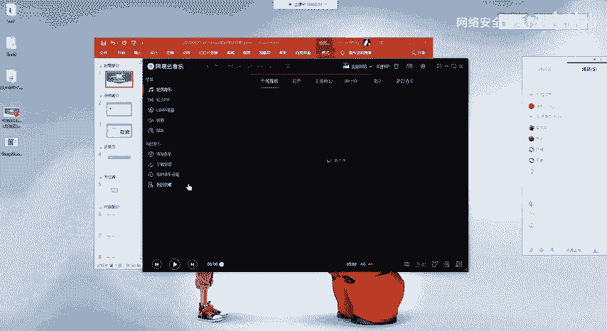

🎼。🎼还剩多少时间？😔，🎼能在你身边。😔，🎼不知最后悔。😔，🎼昨远。🎼想要和你见面。😔，🎼再多看一眼。🎼试探你最真实。😔，🎼感觉你总是说。😔，🎼我们终究还是会分离，直到超越。😔。

🎼我们曾在一起的时间无法看见。😔，🎼像是所有曾经。😔，🎼最后只剩。🎼一点点的东西。😔，🎼那都无法跨越。😔，🎼距离。🎼张开书的相片。😔，🎼过去的瞬间。🎼突然发现一。🎼走远。🎼否和你见面？

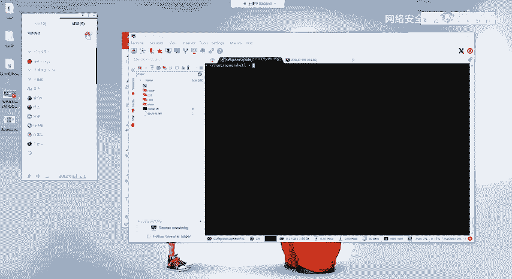

🎼要你在远。🎼终点。🎼会望住。🎼不到的。🎼感觉。🎼你总是说。

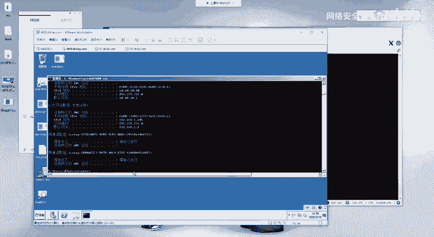

🎼我们。🎼终究还是未分。🎼直到超越。🎼曾在一起的。🎼时间。🎼那感觉。🎼下驶走。🎼曾经。🎼最后只。🎼一点点的东西。😔，🎼那段无法跨越的。🎼不去。かか。🎼为什么为什么为什么。🎼为。🎼你总是说。

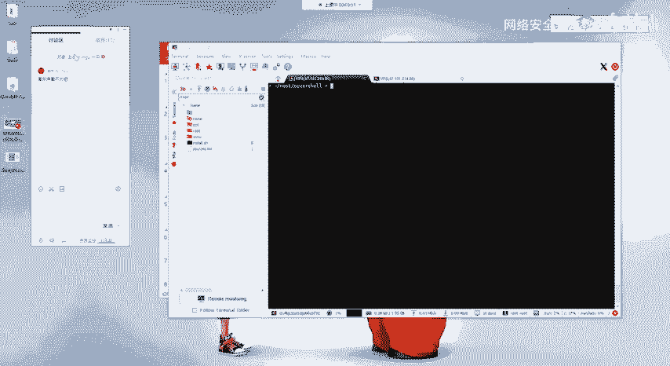

🎼我们终究还是会。🎼指道。🎼找月。🎼我们能在一起。😊，🎼无法看见。😊。

🎼像失所有。🎼最后只剩一点点的动心而已。😔。

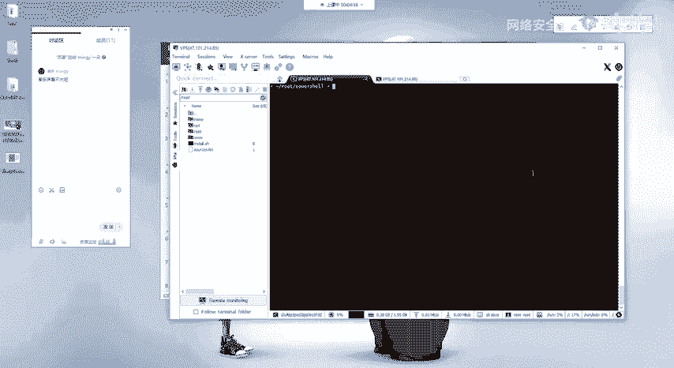

🎼无法看见。😔，🎼像失所有曾经。😔，🎼最后只剩一点点的东心。😔，🎼那段无法跨越的距离。😔，🎼像困在手心就能够发光美丽，想放在脑海，就能够翻云覆雨。从陌生到熟悉，爱你到恨你，爱让每个人都有秘密。

🎼好像是每个人都拖着旧行李，好像是每个人都住在电话里。😔，🎼有人不常联心，有人似有似弟，铃声不响，我编辑不清。🎼什么才是真理？我失恋快失忆。😊，🎼说爱过就可以伤歌。🎼说什么不会忘记，说什么保持联系。

明天遇见他，却牵着新的伴侣。🎼要讲什么道理，我十年快失忆，受过伤才懂留爱启用的道理。🎼谁才是最后唯一时间才是传奇，永恒的爱藏在老去的白发里。🎼爱你。🎼好像是每个人都拖着旧行李，好像是每个人都住在电话里。

🎼有人不哭息，有人似有似弟，铃声不响，我便记不起。🎼什么才是真理？我失恋快失忆，他们说爱过就可以伤河。🎼说什么不会忘记，说什么保持联系，明夜遇见他，却牵着新的伴侣，要讲什么道理。我是。🎼快失意。

受过伤才懂留爱启用的道理。🎼谁才是最后唯一时间才是喘奇永恒。🎼爱藏在老去的白。🎼阿你。🎼说爱你。🎼夕让虚无糖一炮弹甜言蜜语，打发自己。🎼别流着苦涩的眼泪总在快，折磨自己快学会忘记。ちっと？

🎼什么才是真理？我失恋快失忆，他们说爱过就可以上河边。🎼说什么不会忘记，说什么保持联系，明天遇见他，却牵着心。🎼要相受。🎼年快失忆，受过伤才懂留爱情中的道理。🎼谁才是最好唯一时间才是传奇中永恒的爱。啊。

现在已经8点了，然后呃还有没过来的同学的话，就先不等了呀。啊，呃，在上课之前的话，呃先测试一下我的一个麦克风，就是大家能听到我麦克风声音的，以及没有发现说有杂音，或者说呃画面看不清的这种问题的话。

大家在公屏上扣个一，好吧。嗯。今天东西多吗？呃。应该还算。算算算好吧。多的话可能会有一点多啊，就呃我昨天啊不我上次讲课的话，不是已经跟大家说了吗？就是大家做好准心理准备，就后面的内容的话可能会拼多一点。

嗯。呃，就就三位同学吗？其他同学呢？有没有什么呃声音方面有没有什么问题，或者说声音小了还是。嗯。好的，呃，应该没有什么问题啊。大部分同学的话。好呃，那么我们正式开始我们今天的一个课程内容。

然后在讲今天的课程内容之前的话，先大概的就是大概的回顾一下我们上节课的一个内容。好吧。因为中间的话隔了一天，大家可能呃忘记了，对吧？然后呃大家跟我一起来走一下，就是。上节课的一个内容。

我们上节课的话主要就是呃windows的一个主机信息收集，对吧？然后主要的话就是这4块内容，就是对内网的一个环境分析。

主要的话就是给大家介绍了呃我们如何去判断我们所得到的这样子的一个内网机器所处的一个环境，然后的话根据这些环，根据你的一个主机所处于的一个环境的话。

我们有不同的这样子的一些呃路径以及方法来去进行相应的一个呃信息收集，对吧？然后第二个的话就是工作组的一个信息收集以及域内的一个信息收集。好，然后在这边的话有给大家就是大概的介绍了。

就是工作组以及域的一个基本的一个概念，以及在工作组当中，我们常用的一些信息收集的一个方法以及。在域内的话，我们通过什么样子的一些方法来去进行一个信息收集。以及第四个内网重复探测的话，呃，这块内容的话。

因为时间关系的话，后面没有给大家介绍。然后大家对这一块内容有没有什么疑问？就是呃在后面的话呃，我后面课程内容稍微少一点的时间的话，如果大家有疑问的话，我再给大家呃具体的介绍一下吧。呃，呃。

为了课程的一个安排，就是课程内容的一个安排的话就呃。不会可能中间不会就是再重复的去讲一下这一个了。这样的话如果大家有问题的话，我后面的话可以就是抽个时间给大家介绍一下。大家对这一块有有问题吗？呃。

就是大家多跟我一点反馈啊，就多给我一点反馈。就是我在这边呃问大家的话，好吧。就呃有问题的话就说有嘛？没有的话就就没有吧，好吧，但是你呃还是要你让我知道，对吧？让我知道你没有。嗯。呃。是大家都没有去看吗？

还是怎么的？嗯。没没有一个人回我。这有点尴尬。白天再嗯。不是有给了大家就一天半的一个时间嘛，对吧？嗯。就是算起来的话，是中间有一天半的一个时间。好呃，既然没那个的话。

那么我后面的话再安排个时间给大家介绍吧，好吧。就嗯。然后这边的话就是一个基础的一个回顾。然后具体的一个内容的话，这些我看交了作业的话，大家呃交了作业的有大概六七位同学啊，就交了作业的话。

应该是都有过一遍，对吧？就是对这一些啊比较基础的一些信息收集的一个方法啊。然后呃。然后的话呃就是。大家我看了的话，我们现在这一期的话是有20位多位同学，就交作业的话只有几位啊。

就我不知道大家对这一个作业就是有没有去做啊。就呃大家的一个作业还是就是说中间有一天半的一个时间的话，呃，这段时间你可能白天有事，对吧？

但是晚上的话还是就是抓紧一点时间把这一个东西就是自己呃把我这边的一个作业啊，还有就是PPT上面的一个内容，你自己都在自己去过一遍。好吧，因为呃说实话这个东西的话，这个东西是大家一定要就是要认真的去对待。

因为我现在的话是从八主那那边的话，只收到了几份作业。就是呃大家在学学报我们这个课程，对吧？花了花了几千块钱学这个东西的话，这个东西不是说我在这边讲，你在你在底下听。

你就能够学会的这东西是一定要你我在这边讲，我讲了之后，对吧？你要自己去做，你做了之后，你才能够是说把这些东西。是把把它变成你自己的一个东西，对吧？而且大家就是来报这个班的话，就是报参加这个培训的话。

就是你可能是要转岗，对吧？或者是说找工作等等这些东西这些东西的话，你要去。达到你的这样子的一个目的，对吧？大家抱着这样子一个目的来，那么你就不要说呃就是要重视起来，好吧。然后的话呃就是这里的一个预环境。

呃，因为我这边的话这个这里写错了啊，这个给大家说一声抱歉，就这边的话我写成了个三，就是实际的话呃就是。

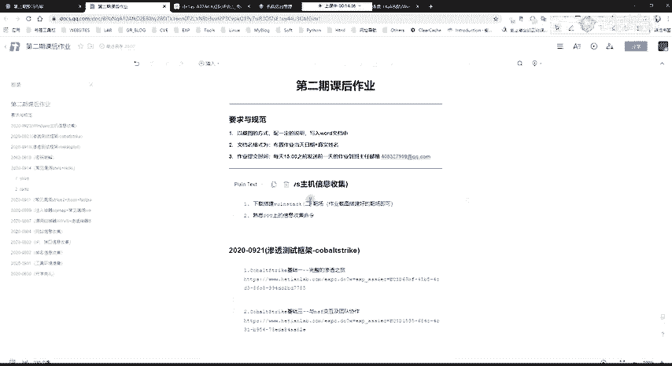

我这边在用的这个的话是2，当然的话你下了山的话也没关系啊。因为你后面的话，你自己可以去做。

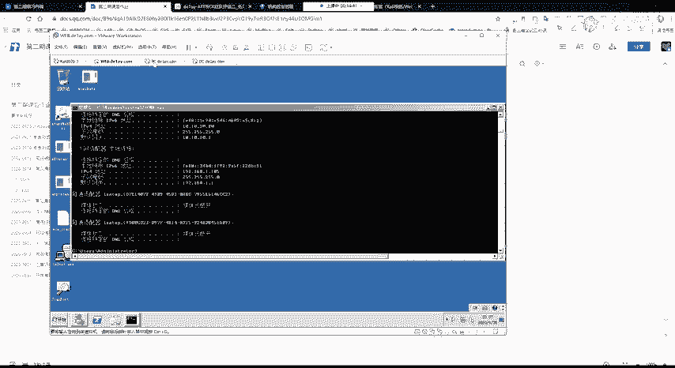

就后面的话也会有用到嘛。就呃。

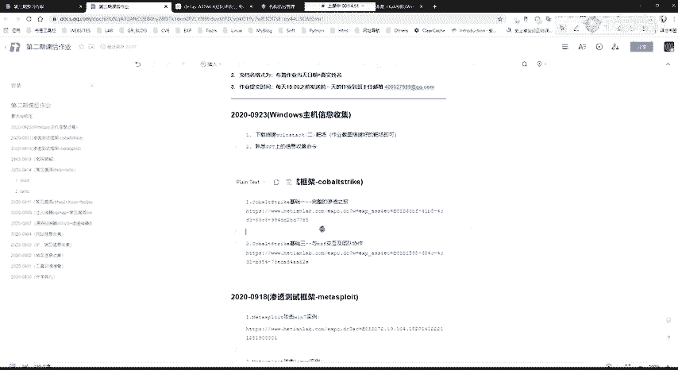

好，呃，这边的话就是课前的一些呃东西啊，然后的话呃。今天有同学问我，有同学在群里问问题对吧？就是说你的这个预环境怎么去登，怎么去登录？我觉得这个。呃。

这边的话大概的给大家演示一下，好吧。

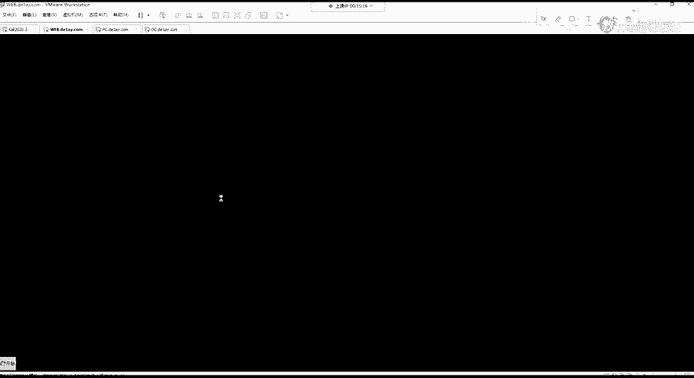

就说我们平常我们去登录我们的一个机器，对吧？登录你的这样子的一个。啊，windows的一个机器。就我。我们一般都是输入一个用户名，对吧？好，这个。输入一个用户名。然后的话输入对应的密码，对吧？呃，密码。

这个的话就是说登录到了他本地的，就是说他本地的一个账户，而不是说我们的一个呃预用户啊。这边的话就是登录到了他的一个本地的一个账户。我们我可以看一下当前我的一个用户的话就是delay嘛，对吧？

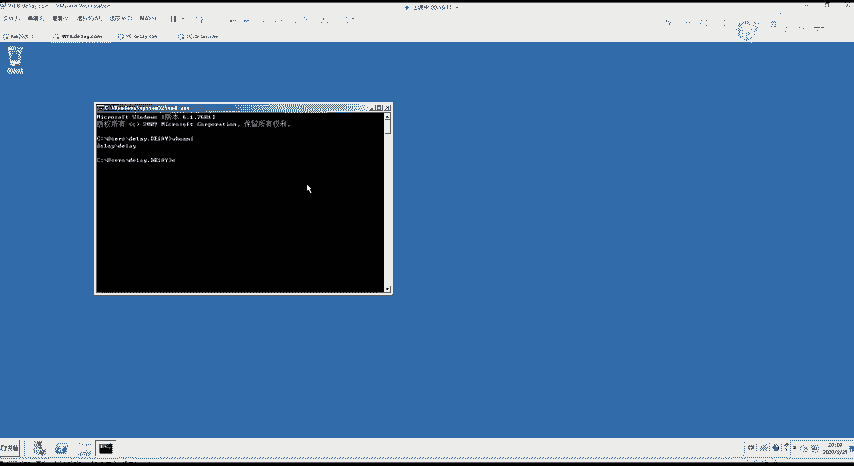

然后的话呃登如果说你要登录到域中。

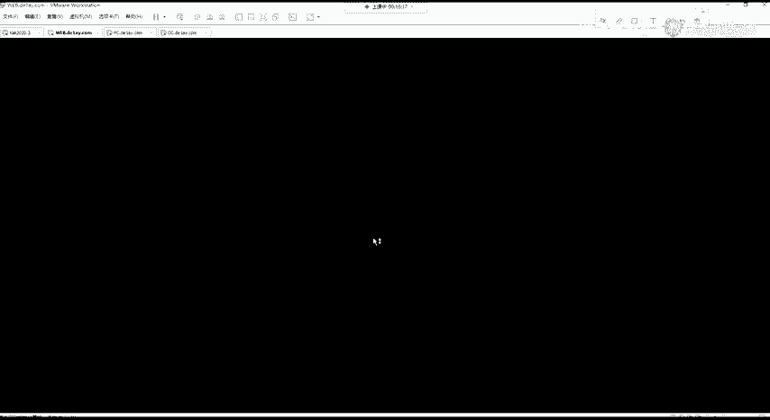

就说我刚刚这边登录的话，它其实是你登录到了这样子的一个delay的一个用户。就是说它本地它本地的话是有这样子的一个用户，对吧？嗯。啊，这个也是登录的御用户。呃，我们要去登录我们本地的一个账户的话。

就是呃因为我们。我们登录域域内的话，我们前面这边的话是需要去写一个域名的。就是说你要登录哪一个域的话，你就写域名。然后的话后面的话接你的一个用户名。K其实在这边也能看得到，就是登录到哪一个域，对吧？

登录到哪哪里。然后如果说你是登录到本地的话，就是顶顶斜盖。顶的话就是代表你登录到当前的一个本地的一个账户。然后在这边的话可以看到它是登录到web这边的一个web的话，其实就是这一个机器的一个计算机名。

然后前面的话就是delay的话就是它的一个域名嘛，就是说登录到域中，这边登录到web的话，就是登录到它的一个本地的一个计算机。然后当要注意的话，就说这边你登录的本地计算机的话。

你的一个用户名是你的一个本地计算机的一个用户名。这边他的一个密码其实我也不是我也不是。我也我这边也不知道。他这个的把机的话，他的一个就是说他说的是所有的一个用户的话，都是那个那个。就一QWAWSX嘛。

对吧？就这样子的一个用户。

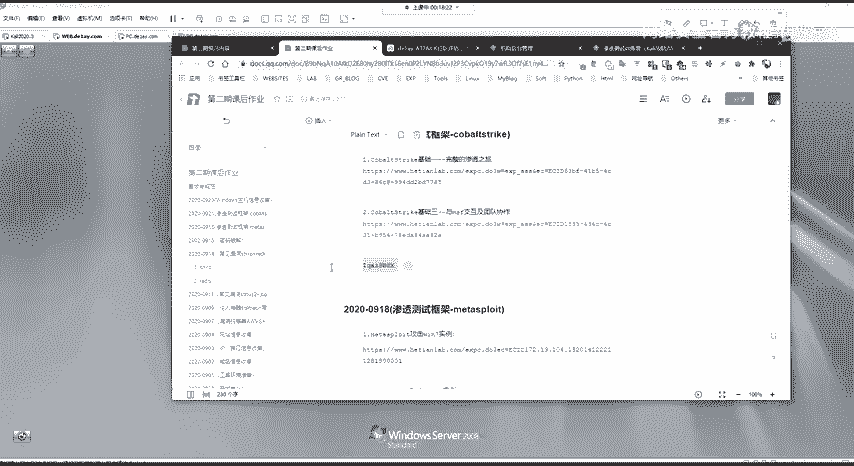

然后在这边的话可以看到这边登录那有两个用户，其实它都是呃登录到了这个delay的这个域当中。因为呃。我们是在这个delay的域域当中嘛。这边的话就登录进来了。

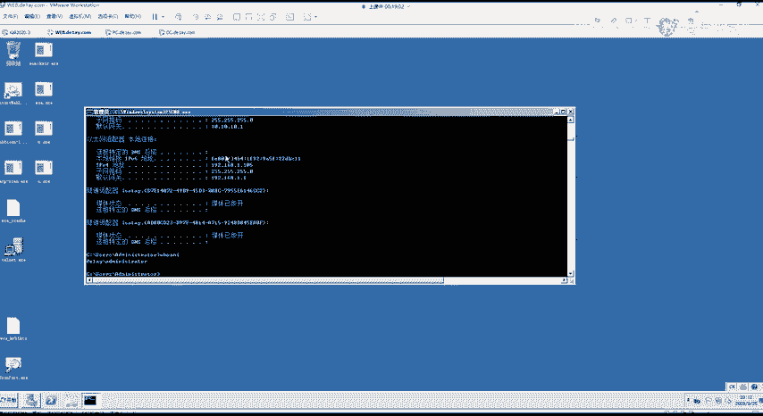

其实我。啊呃，有没有什么？这边的话应该没有什么问题吧。

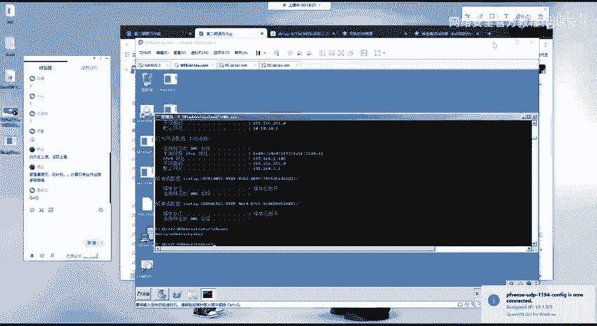

就其实呃你登录的一个方式，像这种的话，你直接百度一下嘛，好吧。马上有的。比较基础的一个东西。好，然后呃其他也不多说了。呃，正式开始我们今天的一个课程内容啊。

我们今天的话主要给大家介绍一下windows的一个密码凭证获取。然后呃主要的话我这边分为了3块内容。第一块的话就是给大家介绍一下windows的话哈希，就说什么是呃windows下面的一个哈希。

第二个的话就是系统用户密码的一个凭证获取。第三个的话就是az。我这边的话就包括了呃其他的一些方法，就是说不仅仅是你系统用户的一个密码，以及包括了你系统当中的一些呃软件。

以及相应的一些像比如说我们的一个RDP的这种连接。你的这种连接的话，有保存的这种凭据，我们尝试去获取。这种RDP的连接的它的一个密码。好，呃，首先第一部分就是windows的一个哈希警戒。

那么什么是windows的哈希呢？就是说呃。windows哈希的话，我们简单理解就是windows加密过的一个密码口令，我们可以称之为一个哈希。

哦哦这个哈希的话在这边我们知道它是就是说我们的一个密码口令。比如说我们是一个addmin这样子的密码口令。那么它经过加密之后，它有这样子的一个加密的一个算法。加密的一个函数，把它加密之后的话。

我们就会生成有这样子的一个哈希纸。那么在这边的话，我们需要知道它有windows下面的话有什么样子的一个加密方法呢？呃，windows系统下面的话会使用两种方法，对用户的一个密码进行一个哈希处理。

他们分别是呃lenman，就仅称的话是LM。然后的话呃net learn manage manage的话就是NTM就我们一般的话都是说它的一个检测就是LM哈希，还有NTM的一个哈希。

就是呃比较呃比较方便说嘛。哦呃这边的话还要知道的话，就是说我们。看一下这边啊，看一下这边第二页PPT的这个图。就说我们在windows下面的话，它有两种这样子的一个M哈希的一个加密的一个方法，对吧？

然后的话在这边要注意的话，就是说LM哈希的一个密码，它最大长度为14。然后的话如果说你的一个就是说你的一个密码口令，它的一个长度超过了14的话，那么LM它是无法去对它进行一个加密的。

它是呃如果超过了14位的话，它就会使用我们的1个NTM的1个哈希。以及的话就是说LM哈希的话，它是有。就是存在缺陷的。所以的话在新版的这样子的一些系统上面的话，它默认的都是使用的1个NTM的1个哈希纸。

所以说在后面的一个内容的话，我们不会过多的对这个L哈希做过多的介绍。主要的话关注这个NTM的1个哈希。然，呃。大家要知，但是大家一要知道这样子的1个MLM的1个哈希啊。因为我们在后面的话会也会去用到。

就是说有一些工具以及呃命令的话，你需要这样子的1个M哈希以及NTM哈希的一个格式。好，呃，然后的话还有大家要知道的话，就是说NTM哈希的话，它已经有了这样子的就NTM和VR的一个版本。

就是说它有两个这样子的一个版本。它每一个它的版本的话，它的一个加密的一个方法的话，它是有区别的。以及呃caps的一个验证体系。关于Cs的一个协议的话，其实上节课也有提。

然后我在后面的一个内容会给大家展开的介绍。B。前面这边的话，我们主要的话就是关注关注我们的这样子这一个win下面的1个NTM的一个哈希。然后以及我们的windows系统下面的一个密码，哈希。

它默认情况下是由两部分组成的。就是说我们的第一部分的话是LM的1个哈希，第二部分是NTM的1个哈希。它中间的话是由一个冒号，就是说这个这个冒号做一个分隔。啊，我们可以具体来看一下。

他的一个哈希的一个密码格式。密码格式的话就是像我这边所呃这边所写的。首先第一个的话就是说你的一个用户名称，然后的话冒号注意冒号的话，它是一个分隔，就是分隔两个部分的一个呃符号。

然后RID的话RID这边的话就是它的一个呃。说到这个RID的话，我们先看一下这边我这边贴的一个图。首先我这边的一个用户名称是administrate，对吧？它的IID的话就是500。然后大家要注意的话。

这边的1个IID的话，它其实是啊。唯一的就是说。呃，等会的话再展开介绍。然后后面的话就是接我们的1个LM的1个哈希值。LM哈希子后面的话以冒号分隔分隔之后的话，后面就是NTM的1个哈希子。

就说我们这里的这一部分是LM的一个哈希。后面的这一部分的话就是我们的1个NTM的1个哈希。然后后面的多个冒号的话，我们不用管它这一部分的话。然后呃还有在这边还有其他的一些用户。

像比如说我这边的1个winIN7用户，他的1个ID的话就是1000，对吧？还有还有特使的用户，个词的用户，对吧？他那个IID值的话，它是不一样的。然后这边的1个RID我们如何去知道它是什么呢？

就是说呃比如说我就在我当前的这样子一个windows的一个机器，对吧？我换卖。

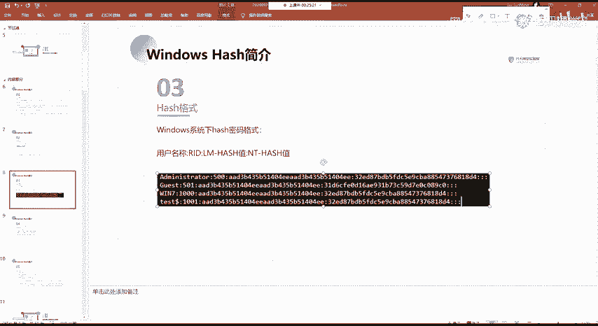

是我的一个。我换卖干沃干2的话，我们上节课有讲就是。

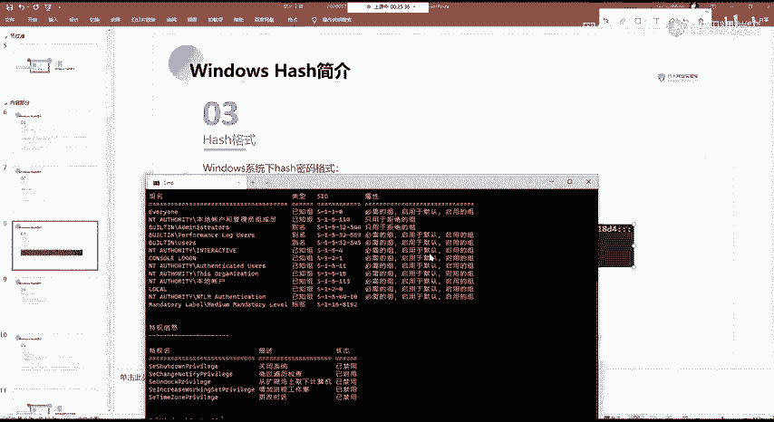

呃，有这样子的一个命令，对吧？我们通过这个命令能够查看到当前用户他的一些啊，比如说他的一些主信息、用户信息以及他的一些特特权信息。然后在这边的话，我们可以看到当前我的一个用户是这个MNG的一个用户。

对吧？就这一个用户，然后这这边的话有1个SID的一个值。这个SID值的话，它是一个唯一的。就说你的一个windows系统上面的话，它每一个用户它都有一个唯一的这样子的1个SID值。

然后这边的1个SID值的话，我们注意后面的这一部分有一个这样子的一串，对吧？1011001这一串的话就是我们的一个用户的这边的1个RID。你知我。看一下。稍等一下。呃，这边的话我通过这个WMI这个命令。

就是这一这里有一个Uer count。这个要在看的话，我们通过这个命令话能够查看到就是说你当前的系统下面它的所有用户的一个账户的一个信息。然后在这边的话。嗯。然后在这边的话呃。

我们可以看到在这边我可以看到在这边能够有这样子的5个用户，对吧？这5个用户的话，他每一个用户这边他是他的一个用户名，对吧？用户名，然后这边的话是它的1个SID的一个值。这边的1个SID值的话。

其实我们可以看到前面的这一部分的话，它都是。啊，一样的对吧？前面的这一部分都是一样的。对吧就每一个用户他的SID前面的这一段都是一样的。然后它的一个不同的话。

就在于我们后面的这一个这一串这一串的话就是我们的这边的1个RID。然后它的一个唯一的话就它的一个不同的地方其实就是在于这个RID的一个值。

嗯。就呃大家可以自己查看一下自己的一个。

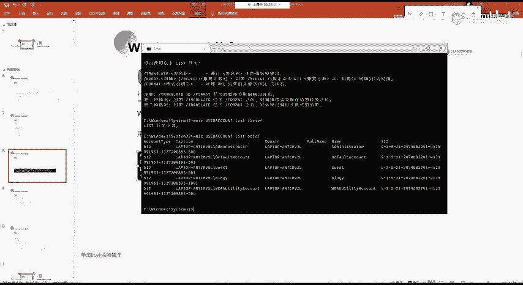

大家可以查看一下自己电脑上面的这样子的一个用户的一个信息啊。就能够知道然，所以的话在这边的话，我们就能够去理解这样子的windows下面它的一个哈希的一个密码格式，它是怎样子怎样去组成的对吧？

这个的话能理解吧。应该没有什么问题啊。呃。你们是都是呃还在上学，对吧？就是上学要上课是吧？呃，那。那你们的话更加要就是要。更加要呃多花点时间，对吧？因为你白天的话要上课的话。

你我这我们这边的一个课程内容的话，可能你就做的会比较少。那么那么你课余的这些时间，还有周末的时间的话，还是要抓点抓紧一点就是。嗯。好的，能理解。那么我们继续。然，下面的话我们给大家介绍一下。

就是说windows的一个认证基础。在这边的话呃，其实本来的话应该是在后面会给大家去讲啊，就是windows认证的一个基础，以及就是说windows认证的三个部分。就有这样子的三种认证方法。

首先第一个就是本地认证，就本地认证的话，它是用户直接操作计算机去登录账户。就说我们这边的一个本地认证，其实就是我们平常我们登录我们自己的一个电脑，对吧？我们。我们登录我们自己的一个电脑，这边登录电脑。

我们使用我们的一个用户名，然后的话输入我们的一个密码，就登录到了我当前的这样子的一个系统，对吧？这个的话就是一个本地认证。然后呃网络认证的话就是远程的去连接到工作组中的每某个设备。就是说我去远程的。

比如说我用FTP，还有我用呃这样子的一个文件共享，对吧？我要文件共享这种我要去连接到我这一这一个work group这个工作组当中，或者说某个工作组当中的其他的一个设备。

那么这边的话它的一个认证方式的话，就是网络认证。Yeah。哦哦，预认证的话就是登录到预环境中的某个设备。在这边的话呃，后面呃。在这边的话，本地认证以及网络认证这个的话。呃。我不知道大家有没有去看。

就是说我这边给的一个预习内容啊，这边给的预习内容的话，其实大家看了这几个文章的话，应该也能够有一个基本的一个理解以及印象，对吧？

叫呃这里的这里有这样子的一个NTM哈西以及nettNTM哈希这边的NTM哈希的话，就是我们本地的这样子一个认证的话，它是使用的这样子的一个哈希，对吧？然后这个nettNTM哈希的话。

就是说我们这边的一个网络认证方式的话，它是通过这样子的一个。呃，这篇文章的话我就不打开了，大家预习的时候有去看嘛，对吧？以及还有就是呃NTM的一个呃详细的一个介绍，以及这一篇文章的话有。

以及这一篇文章的话，就是你看了这一篇文章的话，应该就能够去理解。就是说这边的1个M哈希以及NTM哈希啊。他在这边的话也介绍了就是说他的一个加密的一个方法。就如果大家对这种加密的方法就是感兴趣的话。

可以去研究一下。当然的话在这边的话我不会去对这一些做过多的一个讲解。嗯。然后的话呃我们这边的话我们主要的着重的就是给大家介绍一下windows的一个本地认证。啊，问的是本地认证的话，呃。

大家看一下这边啊，就我这边的话把它分成了这样子的四个步骤。就是四个就是中间的四个过程。首先第一步就是用户输入密码，对吧？我们登录一个登录一个系统。

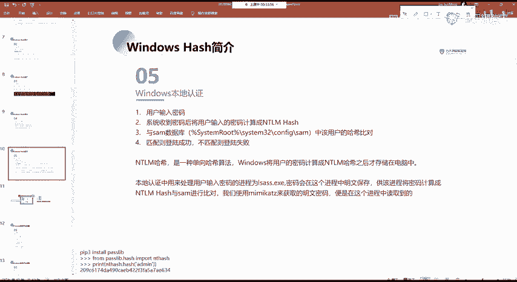

我这边。登录这个系统，对吧？我先输入密码，对吧？我随便输入一个密码，然后的话呃输入用户名以及密码，对吧？我这边随便输入。然，输入之后的话，就是说系统它在接收到你这边输入的一个密码之后，它会做什么呢？

它会将我们用户输入的一个密码，它会计算成1个NTM的1个哈希。啊，呃在这边的话要注意的话，就是说你新版本的一个系统上，它都是用的1个NTM的1个哈希嘛，对吧？然后的话如果说你是一些老版本的一些系统的话。

你的一个密码长度没有到14的位的话，它可能是用的1个LM的1个哈西的一个加密算法。这边的话应该能理解对吧？然后他把我们的一个密码计算成这1个NTM哈西之后，它会与我们的一个samsam数据库。

这个sam数据库呢，它是存储在我们的一个windows的一个本地本地系统上面的。它的一个位置的话就是在这一个路线下面。

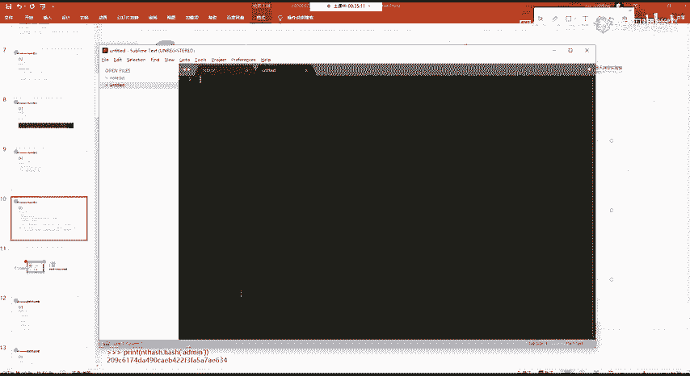

就是在这一个路径下面。然后呃这个路径下面的话有这样子的一个sam姆文件。这个文件的话，它就是存储着我们这个windows系统上面的所有的一个用户名的一个呃这样子的一个哈希值。

然后呃当我们要去登录这个系统之后，输入密码，它会把我们的一个密码加密成NTM的1个哈希。然后的话在与我们这边的一个s数据库里面所保存的这一个用户所对应的1个NTM哈希值去进行一个比对。

如果说你比对成功了，也就是匹配，那么就能够去成功的登录这个系统。如果不匹配的话，它就会去登录，它就是登录失败，对吧？嗯。然后像比如说我这边我登录。啊，我这边登录之后的话，它会有它就会有这样子的一个过程。

他会把我们的一个输入的一个密码，我这边要输入admin，对吧？它会把我们的这样子的一个addmin的一个密码加密成NTM的一个哈希池。然后的话再去进行一个比对。然后这边的一个呃。NTM哈西的话。

大家可以用这样子的一个pathon的一个模块。就这里你首先需要去安装这样子一个pass lab这样子的一个库，然后的话可以调用它这一个库当中的这样子个NT。哈西这样子的一个。这个方法。

然后的话把可以去把我们这边给定的一个呃字符给它加密成我们的1个NTM哈西的一个格式。然，像在这边的话，我们呃admin的一个哈希值的话，NTM哈希的话就是这这一串。啊，我这边。把代码发给发出来吧。

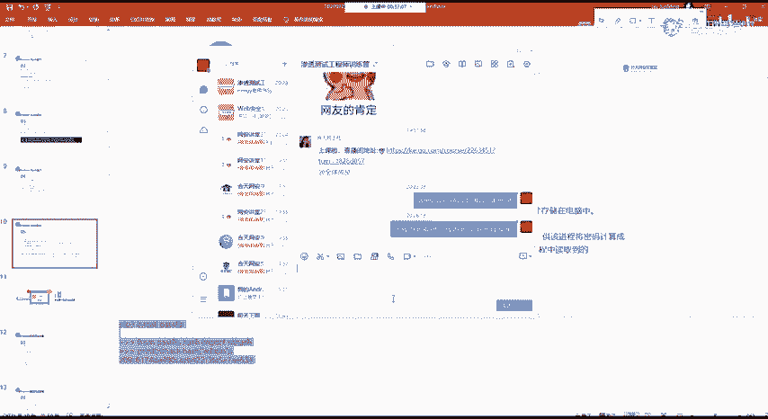

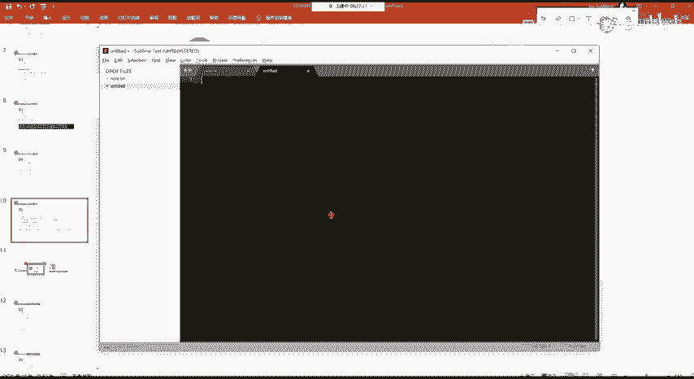

嗯。

然后我们这边看一下。

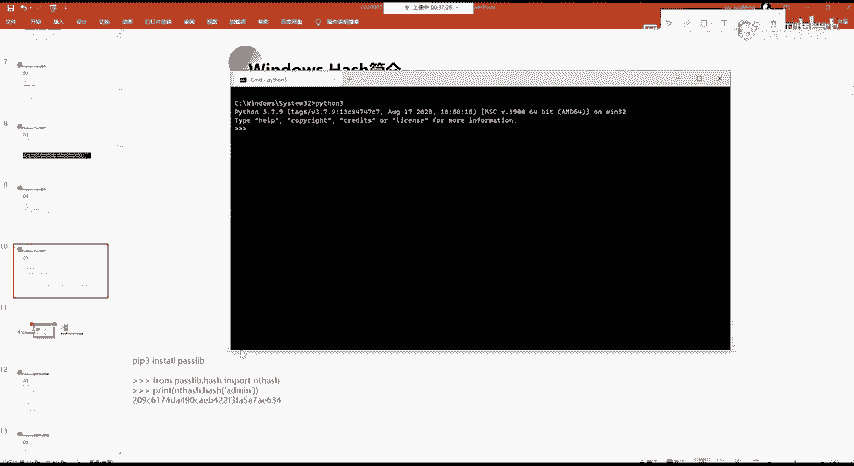

我就不敲了，我直接复制了。

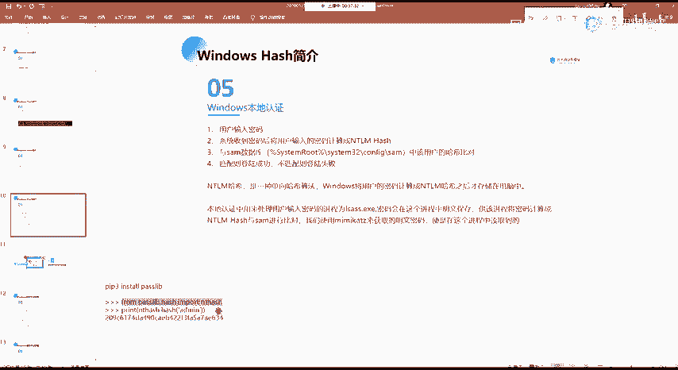

然后这边的话就得到了我这边ad面这一个字符，它的一个N铁M哈西。

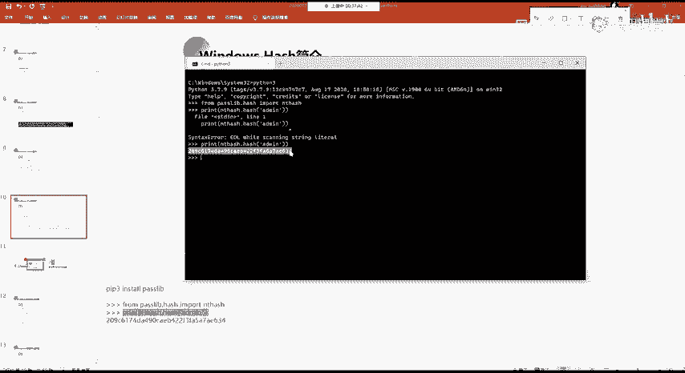

然后像这种NTM哈希的话，其实像这种比较简的NTM哈希，我们可以去进行一个解面。就是这边的话。

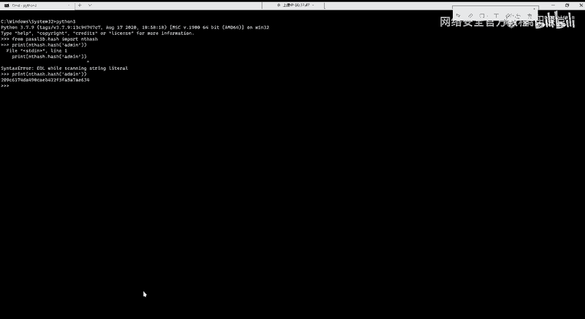

待会会讲啊，我这边先让大家看一下效果吧。啊，就这个CMD5这个网站的话，大家应该都知道对吧？我它里面可以解密很多的这样子的一个呃。一个加密的这样子的一个。呃，串。

然后的话在这边其实它也有NTM的1NTM的一个解密啊。我这边的话直接查询。应该是能查出来，是吧可以直接很快的就查出来。像这种比较简单的这种密码的话，它的一个哈希值的话，我们可以很快的去查出来。

然后可以看到在这边它的一个类型的话是自动的识别为了1个NTM，对吧？就是说它是用NTM哈NTM的一个方法加密的这样子的一个值，然后解密的一个结果是admin。

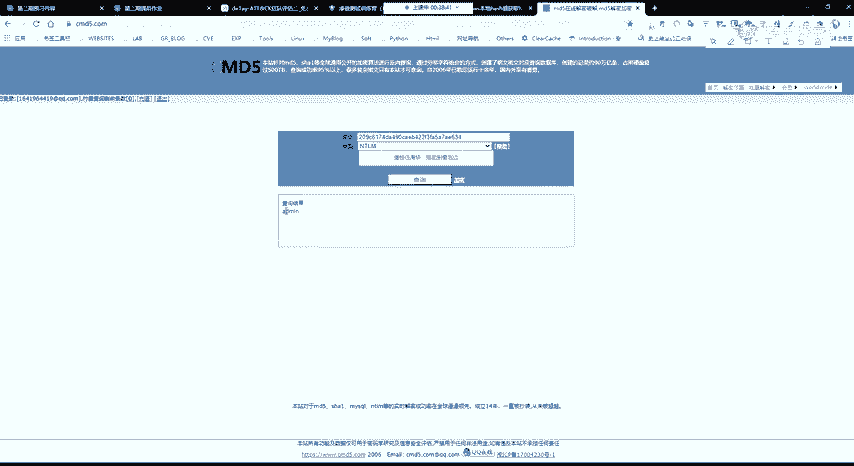

所以说呃。我们等会的话会给大家讲，就是说我们如何去获取到系统当中的这样子一个哈希子。然后的话我们通过这个哈希子的话，就能够去解密成我们的这样子的一个铭文的一个密码。

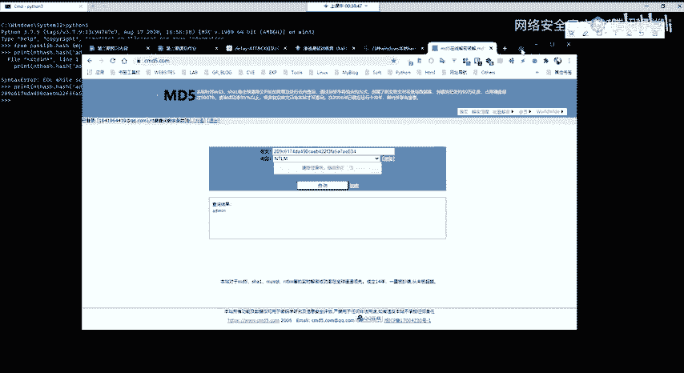

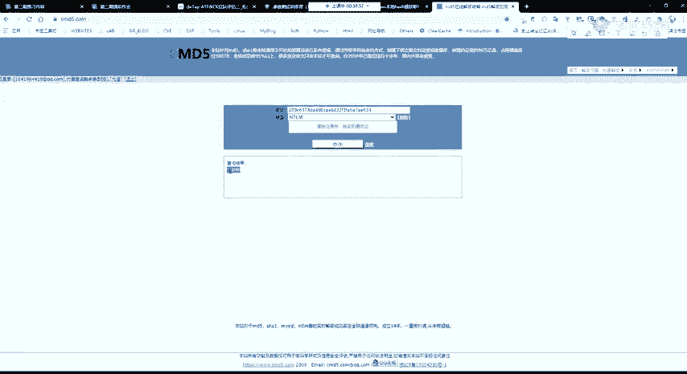

然后的话会给大家介绍呃多种解密的一个方法。啊，不是多种获取这一个哈希值的一个方法。

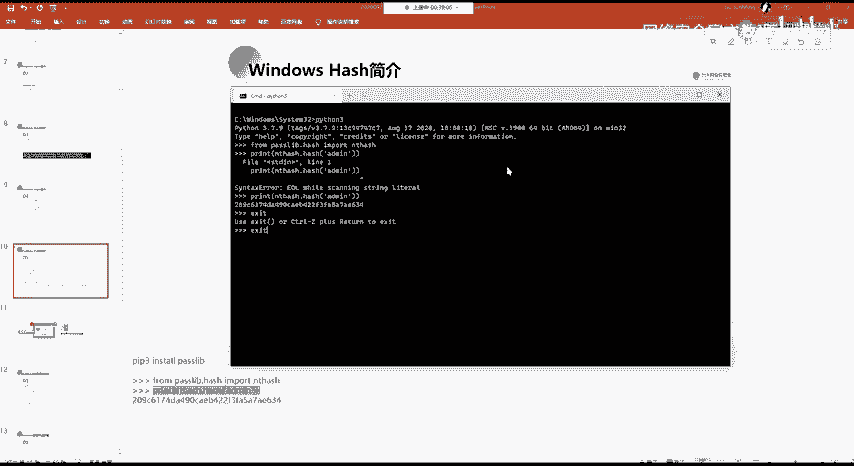

。然后的话呃。NTM哈希它是一种单向的一个哈希算法，就是我们的一个用windows，它会将用户的一个密码计算成这个哈希值之后的话，存储在电脑当中。就说你的一个你在创建用户，就比如说你创建一个用户。

你创建用户之后的话。你需要输入密码，对吧？那么你创建用户之后的话，这个密码的话，它就会把它计算成NTM那个哈西值存储到这样子的一个s数据库。啊，关于这个s姆数据库的话，大家可以去看去这一个目录下面去看。

当然的话你这边直接的话是打不开呃，直接的话是你打开的话是一个乱码，就是你看不到里面的。实际的一个内容，因为它是一个加密的嘛。呃。而且在这边的话要注要注意，就是说这一个的话，你是需要一个管理员的一个权限。

你才能够去访问的。所以说在后面的话，我们我们要去获取到这样子的一个，就是说从这样子的一个sam数据库当中去获取它的一个哈西的话，你是需要一个管理员的一个权限的。啊，在这的话有这样子的一个sm的一个文件。

这个文件的话。这个文件的话。你这边打开了，打的话是打不开的，就是说你看不到它里面的一个内容。然后。后面的话会介绍我们如何去获取它的这样子的一个哈希值。哦后呃还有的话就是我们本地认证。本地认证的话。

它中间的话有这样子一个特殊的一个建程。这个进程也是待会儿会去涉及到的。在这边的话给大家介绍一下。就是说我们再去进行本地认证的时候。

它windows系统下面有这样子的一个进程叫LSASS点EXE这样子的一个进程。这个进程的一个作用的话就是用来处理我们用户输入的一个密码。就是说我们的输入的这样子的一个铭文的一个密码，对吧？

在windows系统上面，它需要把它进行一个加密，对吧？那么这个铭文的一个密码的话，它会在这样子的一个进程当中保存。然后的话。在这个进程当中的话，再把我们呃输入的这样子的一个铭文的一个密码。

它把它加密成我们的1个NTM的1个哈希，对吧？然后的话再去进行一个比对。但是在这边的话就是说有一个问题，就是说我们这边的一个密码的话，我们输入一个密码，它会在这个进程当中做一个铭文的一个保存。

那么我们可以通过相应的一些方法来去从这个进程当中获取到它的一个铭文的一个密码。然，呃在后面的话会有讲到，就是说使用这一个mini cards来获取名为me。就这边他获取名为密码的话，获取名为密码的话。

它其实就是在这一个进程当中去进行一个读取的。Yeah。呃，第一部分内容的话，大家能理解吧？应该没有什么问题吧，就大家有没有什么疑问？能理解我这边讲的吗？就说能能接受我这样子的一个呃介绍吗？能能接受。

能理解的在讨论区扣个一。就有问题的话呃，扣2。ok。应该都没什么问题啊。那么我们继续。好，第二部分第二部分的话就是我们今天的一个主要内容，就是系统用户的一个密码凭证获取。在这一部分内容的话。

我我会给大家介绍这样子的10种方法来去进行一个呃我们的一个密码凭证的一个获取。在这边的话会就是说会涉及到我们前面所介绍的一个哈希，就是说通过相应的一些方法来去获取它的一个哈希。嗯。

首先第一个的话就是呃mini cards。min mini cards的话，它是一个就是说呃相当有名的这样子的一个。呃，工具啊这个工具的话，它的功能很强大。然后的话也是我们经常会去使用到的。

就以说它能够去读取啊系统的一个密码，以及能够去。解密解密我们的特定的这样子的一些啊加密的这样子的一些密码。第二个的话就是呃抛 share尔的一个一些脚本。

就是说我们通过抛 share尔的一个方式来去加载啊获取哈希的这样子一个脚本。Yeah。呃，以及还有下面这一个的话，我就不一一的去说了。这边的话呃等会儿的话会一一的介绍。

然后首先的话我们先来看一下第一个就是mini cards。mini cards的话呃，大家可以去这一个网址去下载。然后呃在工具包里面的话，其实也有也有给。

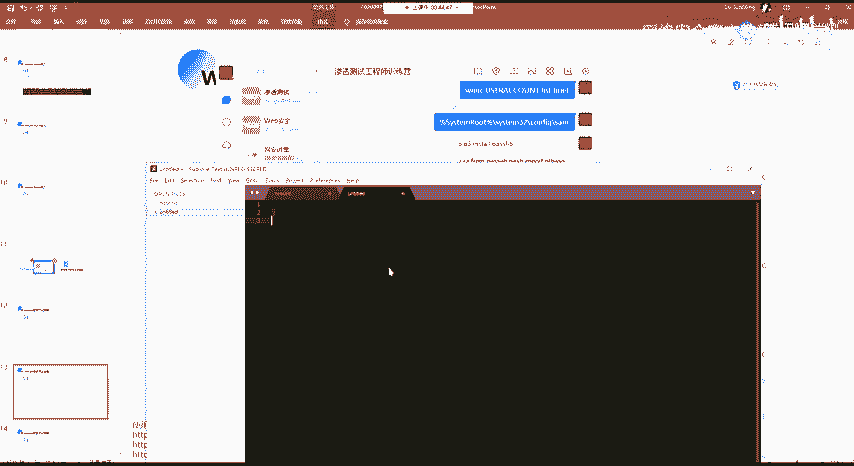

就去这一个网站去下载，就在github上面。

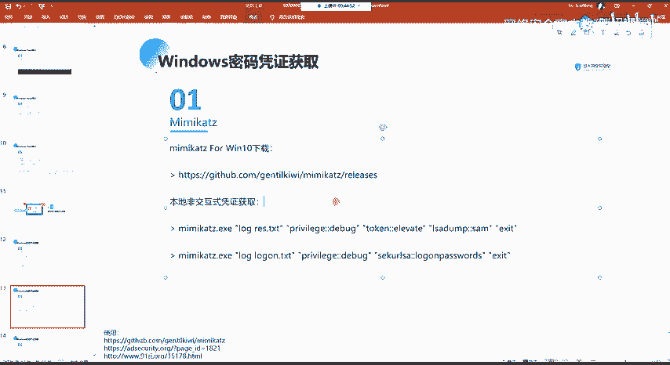

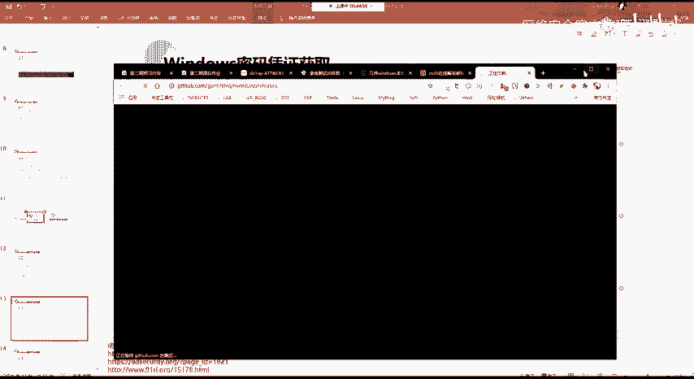

先呃最近的话他应该有更新啊，就7天之前的话有更新了。然后呃他在这边的话。呃，集成呢就是说最近爆出来的一个域内提全的一个漏洞，就是这个zerologgan。这个的话在后面的话呃应该会给大家去介绍。

就说我们可以直接用这这样子的一个mini cards来去进行这一个呃域内提群的这样子的一个。啊，漏洞就是说这个漏洞的话，我们可以就利用它的这样子的一个协议，利用它里面的一个协议来去协议的一个漏洞。

来去把我们的预控的它的一个用户密码，把它置为空。然后的话我们就能够去啊去得到预控的一个权限。就就是一个提全的一个呃漏洞。对，因为我们知道我们得到了预控的话。

那么它就能够对这一个域当中的所有主机都有一个完全的一个控制嘛。啊。然后的话呃。下面的话介绍一下就是说面令卡的一些用法。呃，这边的话就是一个使用的一个就是本地非家互士的一个凭证获取。

这也是我们经常会去用到的。就是说我们的一个mini卡的一个工具的话。诶。在哪？就你下载下来之后的话是这样子的。然后的话在这边的话有这样子的一个程序，对吧？然后的话你直接输入咪。因为卡。

然后的话它就会去进入到这样子这个交互式的一个界面。后的话就去输入相应的一些命令，对吧？

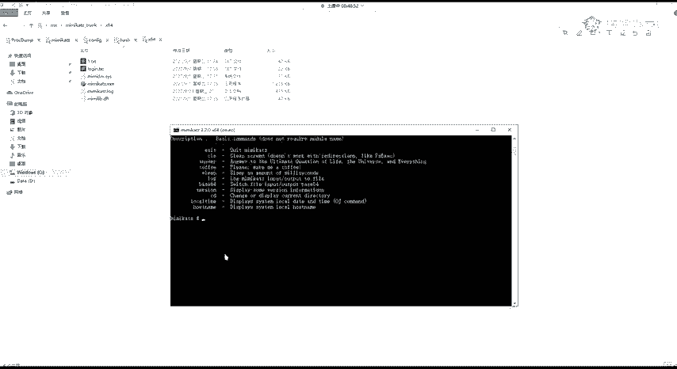

当然的话这样子的话就是适用于就是说。就我们实际的话我们实际去执行的话，就是说呃你不可能你直接直接有这样子的一个交互式的这样子的一个命令函，对吧？除非你直接得到它一个，比如说你远程桌面登录上去。

然后的话把它传上去，然后去执行，对吧？

就去这样子的一个交互式，就一般的话都是常用的用非交互式，就直接获取。通过这样子的一个非交互式，通过一条命令。呃。通过执行这样子一条命令来去获取我们这边的一个呃密码哈希。然后这边的话我们看一下呃。

大概的介绍一下关于它的一个具体的一个使用的话，大家看我给的那个预习的一个内容，里面有啊关于这个mini卡的一个详细的一个使用，对吧？然呃在这边的话，我们大概来看一下，就是我这边给的这两个mini。

首先这边的话呃mini cards，然后。在这边的话，每一个语句的话，它是用的一个双引号去做一个分隔。然后注意要有有空格的，是有空格来用双引号去包裹每一个命令。这边的loggoRES点tex的话。

就是说这个loggo的话就是记录嘛，就是说它会。呃，把我们在这后面执行的这样子的一个结果的一个内容，它会写入到我们这边的一个文件当中。就这个呃指定的这个名字IES点text。

然后呃这一个第二个面的话就是进行一个提全。就说我们要去把我要去就是说我们这边执行命令卡的话，我们首先需要去执行这一个命令。这个命令的话就是呃把我们的一个呃就是进入到我们的一个Dbug调试的一个模式。

然后你要去进你要能够去进入这个debug的一个模式的话，你首先你需要有一个就是管理员的一个权限，你才能够去进入啊。也就是说你要去获取这样子的个用mini卡来去获取密码的话，你需要有管理员的一个权限。嗯。

嗯。嗯。呃，然后的话就是这一个。Talken average。这个我有点忘了呀。这个是呃获取。系统的一个token来去进一个提群。我在了啊。我这边的话用交互式的一个方式给大家演示一下。

可以看到这边它返回了1个200，就说说明我们已经进入了这个debug的一个调试模式，也就是。

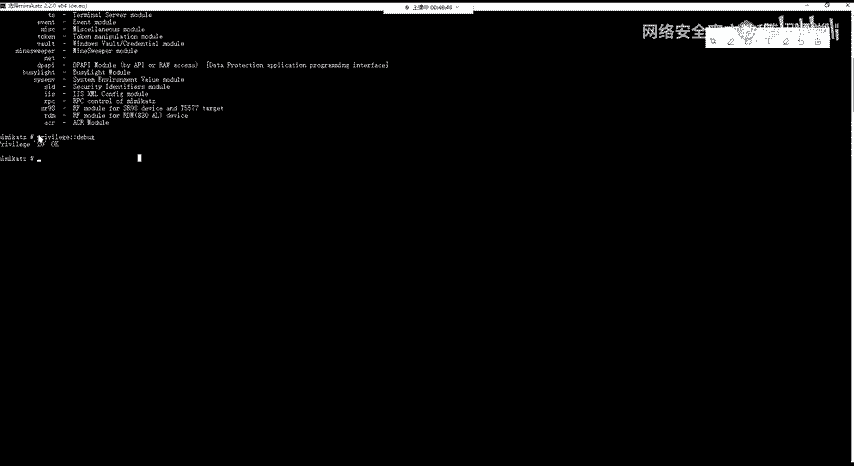

进行了相应的一个提全。然后的话呃。这个taken的话。

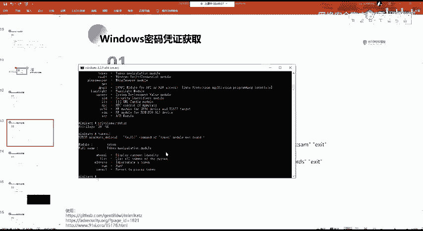

呃，token的话这边的话，它是我们可以用这个token。嗯。就我们可以通过利用它的这个功能，就是token list来去列出当前，就是说当前系统上面的话，我们可以去用哪哪一些token。

就关于这个托ken的话，在后面会给大家介绍。这边大家只需要知道有这一个托ken就可以了。然后的话呃我们可以就是说。这个用windows系统下面，它所保存的这一个token来去进行相应的一个提全。

在后面的话也会介到介呃介绍到就是呃token的一个呃偷取获取以及token的一个注入提全。然后这边我们就是token average的话，就是用它系统自带的这样子的一些token来去进行一个提全。

就imp person这个是。

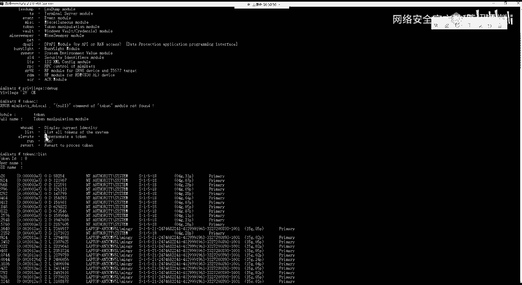

啊，模仿就是。

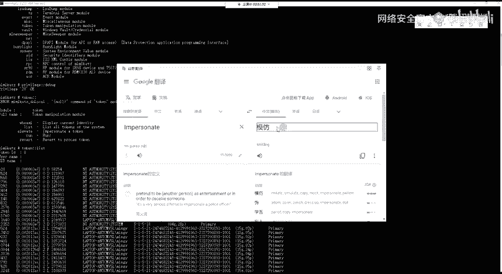

就是他会去模拟呃系统当中所存在的这样子一个token来去进行来去得到相应的一个权限。

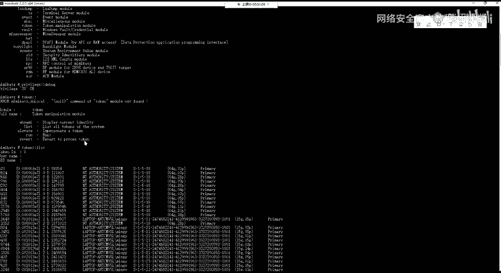

然后的话呃这1个LSds的话，它就是会去我们的一个sam数据库当中去获取到我们的这样子的一个哈希值。这边的话呃。

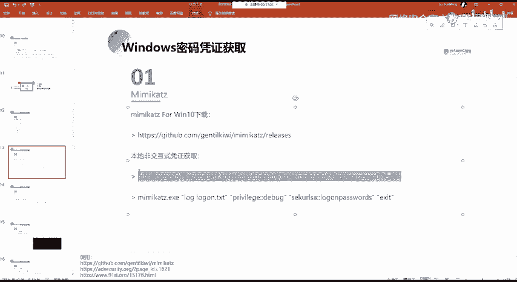

在这边。

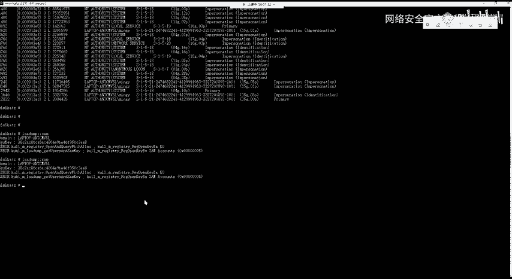

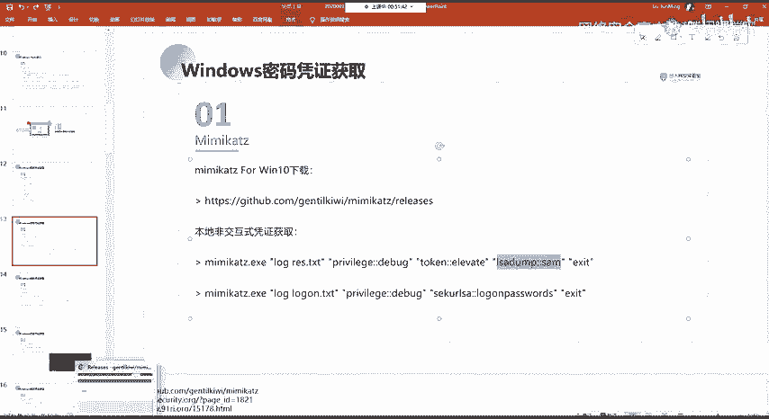

我在这边。

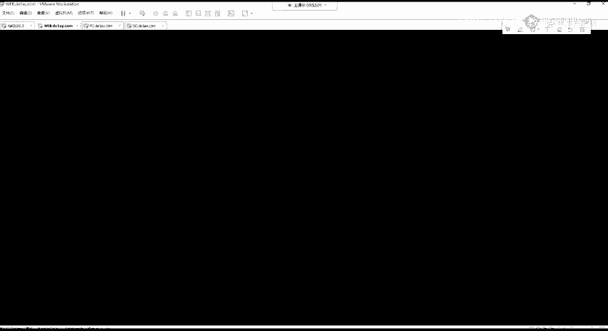

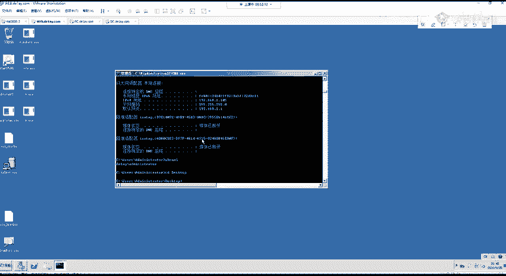

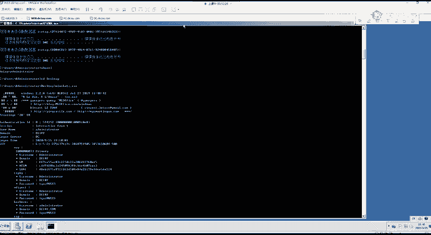

嗯。ふ不。呃，已经46了，我们先休息5分钟吧。然后的话呃。

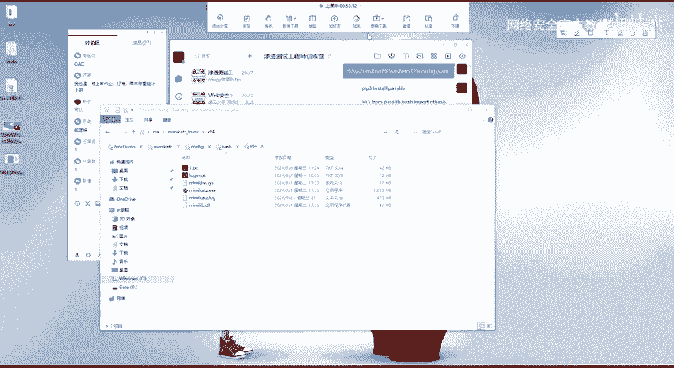

我们先休息5分钟，然后呃我这边的话先把课断一下，然后50的时候我再上来。好吧。