# B站最全网络安全教程，整整1300集，全程干货无废话，别再盲目自学了，看完学不会我退出网安圈！（web安全｜渗透测试｜内网渗透｜CTF） - P79：78. 第二十三天：Windows密码凭证获取-2.mp4 - 网络安全官方教程 - BV15u4y137cQ

Yeah。

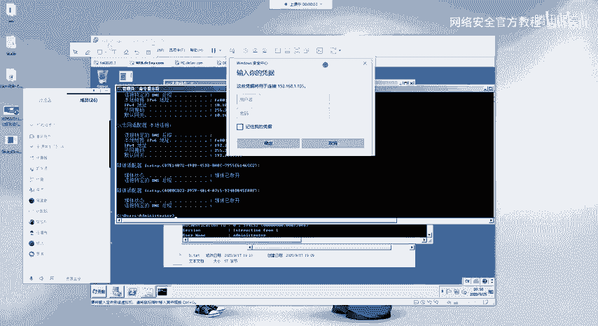

Yeah。Yeah。あ。

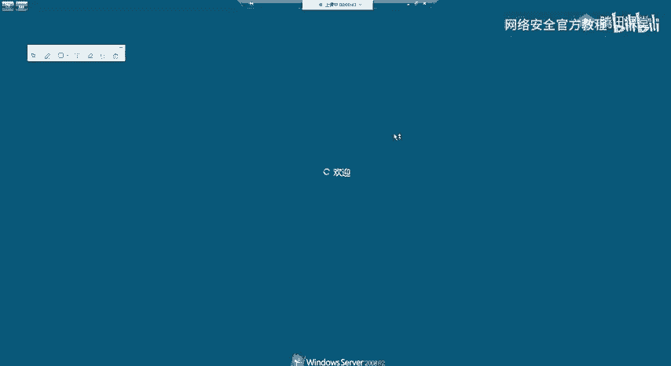

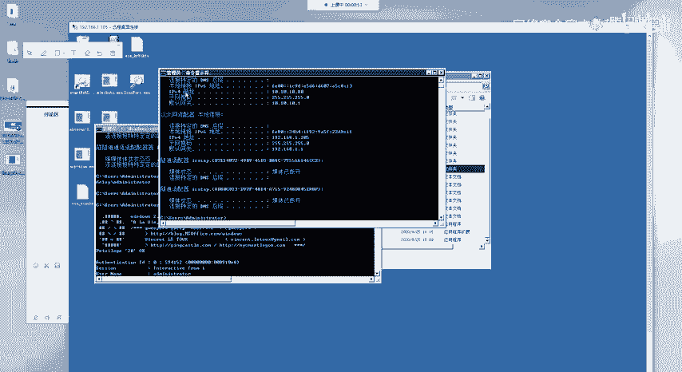

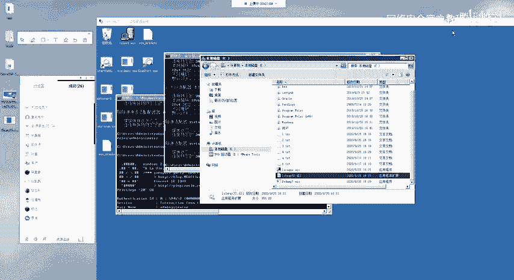

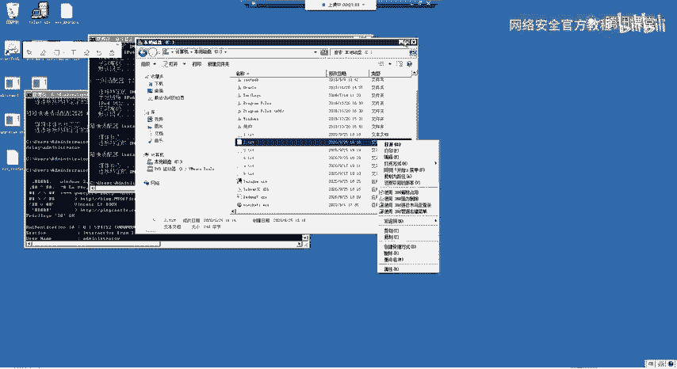

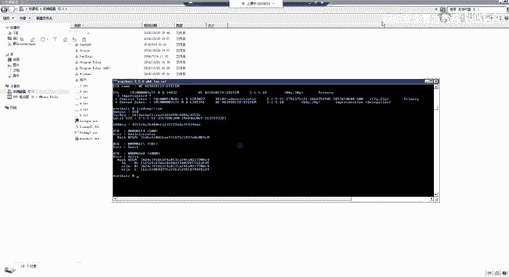

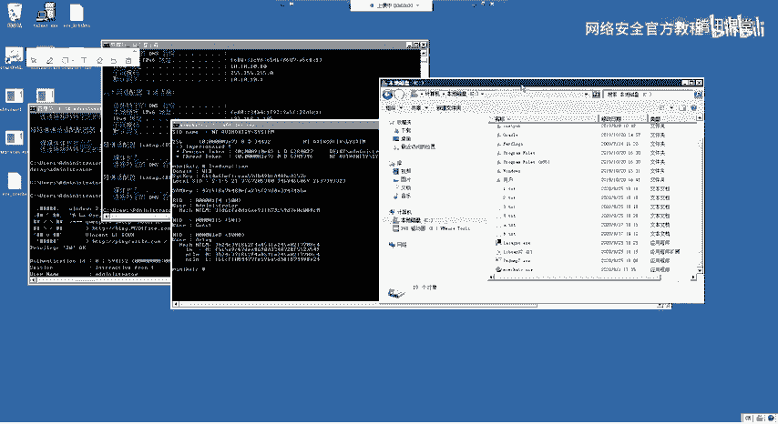

好呃，我们呃休息了一会儿。呃，刚刚的话是我没有开麦啊，就是。😊，刚刚我没有开麦。呃好呃，休息了几分钟，我们继续我们的第二个课时啊，就是接下来的一个内容。然后刚刚话我们讲到用这个mini cards。

对吧？

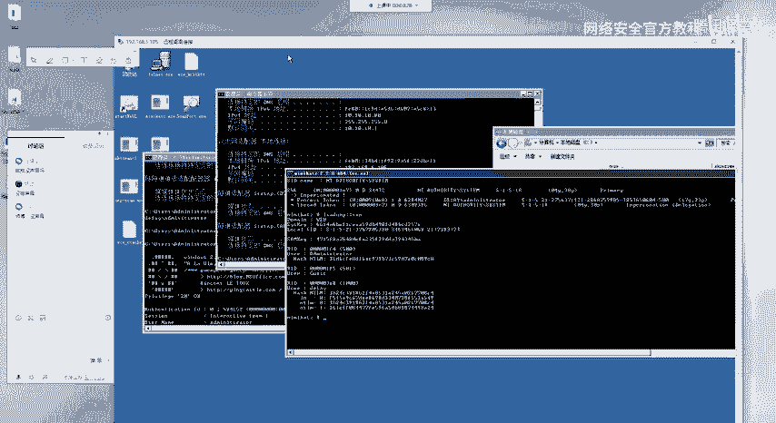

然后在这边的话呃。大刚刚大家应该也有看我操作吧，对吧？就呃首先你用mini cards，你进入这个交互模式，然后你首先需要用这一个privige debug进入debug的一个模式进行一个提全。

然后在这边的话。用这个tken talkingken average来去进行来去。进行一个呃token的一个模拟。然后这边token的模拟的话，其实我当前的话是一个面的一个权限。

然后的话我这边通过token的一个模拟的话，能够去把我当前的一个权限把它给提到我们的一个stem的一个权限。然后的话我再用这个Ldump来去d我们的一个samp。三个数据库当中的一个呃内容。

然后这边的话就是我这边d下来的一个内容啊，就是。可以看到在这里的话呃，有这样子的一个userus administratorist，然后它的1个NTM的个哈希值的话就是这一串，对吧？

以及还有这个呃DDEAY这样子的一个用户。这个用户的话我们可以看到他这边呃有呃NTM那个哈希，然后的话还有LM的一个哈希。在这的话我们都能够看到。Yeah。喂。😊，去怎么断掉了呀？

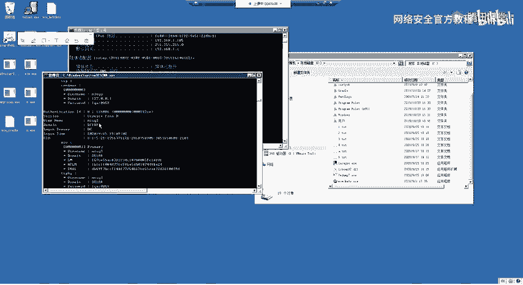

哎有。这个。嗯。这环境有点卡呀。不道。Yeah。是。咋不看呢？But。

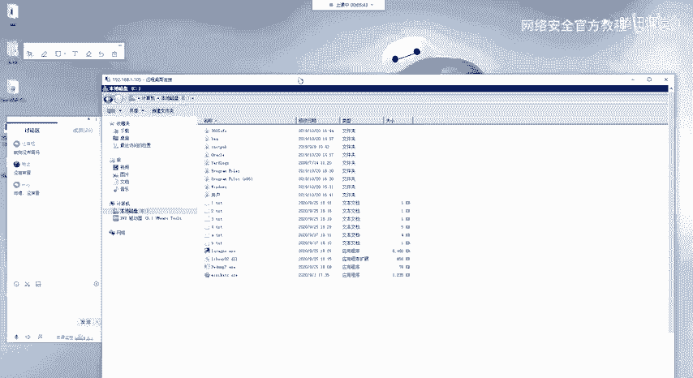

Okay。Yeah。あ。有点卡。No。Okay。然后这边的话我们获取到了我这边addmin这一个用户，他的一个哈希值，对吧？那么我们得到这个哈希值的话，我们可以尝试去对他做一个解密。

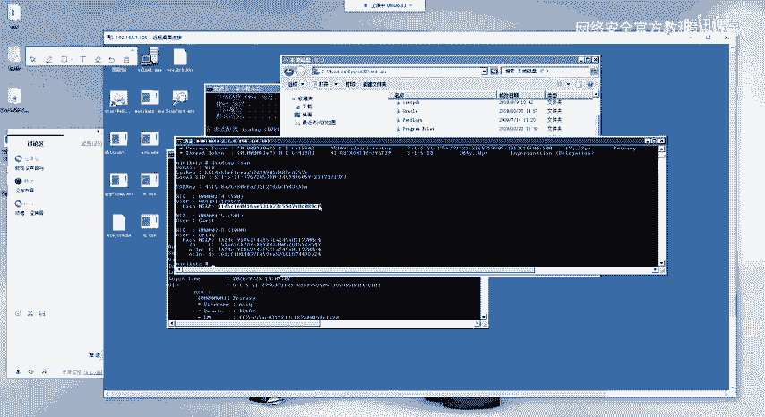

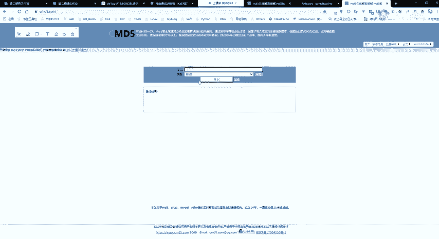

徐总么没粘贴过来呢？Yeah。哎，这环境有点问题啊，崩了。呃。

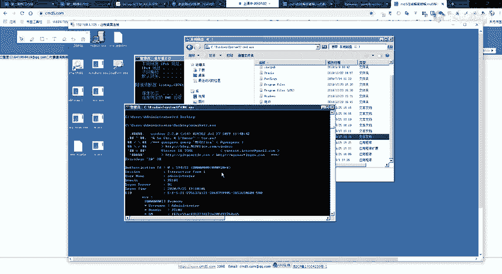

演示的话就这样就这样，好吧，大家应该能能理解，就我这边得到了它的一个哈希值的话，就其实就跟我们前面一样，对吧？我得到了那个面用户的一个哈希值。那么我可以尝试去进行一个解密。

就是用这种在线的一个解密网站去进行一个解密。当然话这种解密的话，你不一定能够去解出来的，就是说呃如果说呃这这边的话就是后话啊就是说这些哈希值，虽然我获取到了。但说这个哈希值的话，我去进行一个解密的话。

解密不出来，对吧？就是说它的一个密码的话，它是很复杂的，他得到这一个哈希值的话解密不出来，那么解不出来的话，我们后续有相应的一个方法能够去用利用这一个哈希值来去进行一个横向的一个移动横向的一个渗透。

这边的话呃给大家提一下。后面的话会具体的去介绍。然呃这是一个，然后还有下面的这个的话也是同理啊。下面这个的话就是呃我们可能够去尝试获取到它的一个铭文的一个密码。

就用这一个呃loggan pass password。

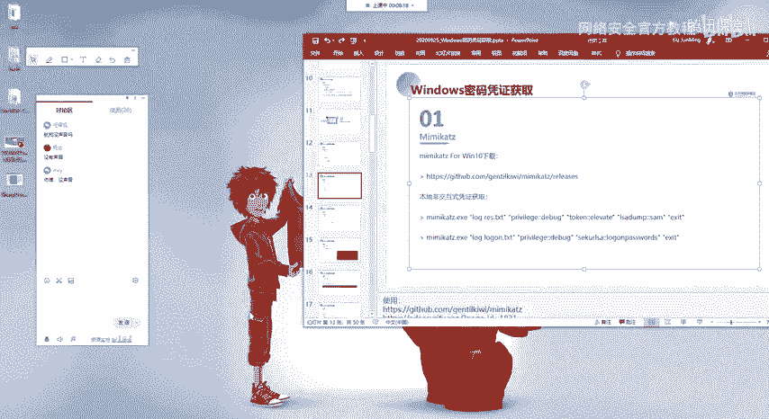

能够去得到他一个铭额密码。其实在这边的话。

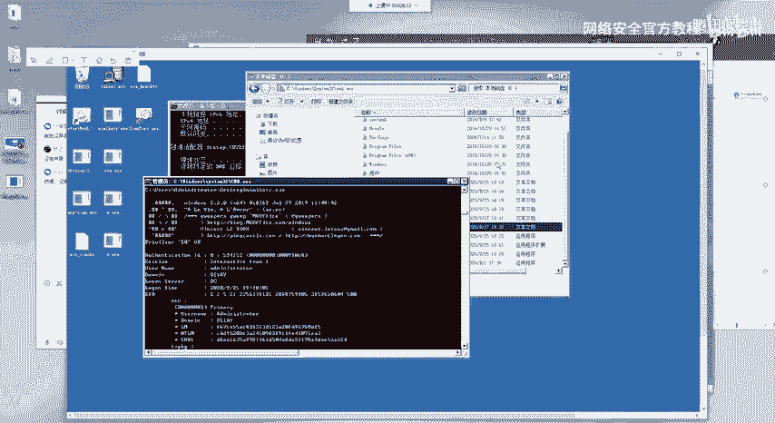

这的就在这里的话，我这边执行了这样子的一个mincast。这个mincard的话，它是啊就是啊你直接执行的话，它就会去获取我们的这样子一个名文密用。它其实实际的一个操作步骤也是使用的这样子的一个方法。

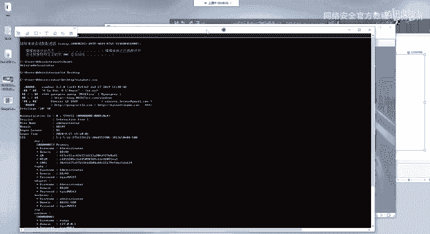

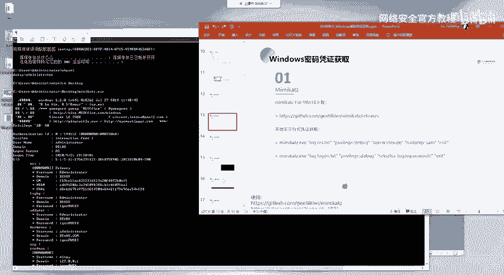

然后在这边的话，我们可以看一下它的一个效果。就在这里我执行之后的话，它也同样的会去进行一个提权，对吧？然后的话获取我们当前系统上面的。所有的这样子的一些用户，他的一些铭文的一个密码。以及它的一个哈希值。

然后在这边的话我们可以看看到，就是首先这边user name这个admin这个用户。然后的话。う。然后的话它是所在的一个域的话，是这一个这一个域。嗯。然呃在下面这边的话。

它就列出来了相应的这样子的一些啊账户，它的一个哈希子以及它的一个铭文密码。然后在这边其实我们可以看到呃这个addmin的一个用户，它是这一个呃这一个ddlay这一个域的，它的一个铭文密码，是这一个对吧？

我们可以直接获取到。以及呃还有这里这这边的话就是这个cres，这里的话就是。呃，看。就其实我们上节课有。有给大家就是我有给大家演示，就是存储在本地的这样子的一个。存储在本地的这样子的一个频据。

就说这里的一个频据，我们可以看到就目标的话，它是这1个117。0，对吧？嗯然后他的一个密码的话是这一个。是这样子这样子的一个呃频据。然后还有下面的话，还有其他的像这样子的一个M。

MScycl的这样子的一个用户，他的一个呃哈希，对吧？以及他的一个铭文的一个密码等等这一些呃以下这些的话都是类似的，他会列举出当前系统下面这些用户。能够去枚举出来的这样子的一个哈希值以及它的一个密码。

可以看到在这边的话，它都已经获取下来了。

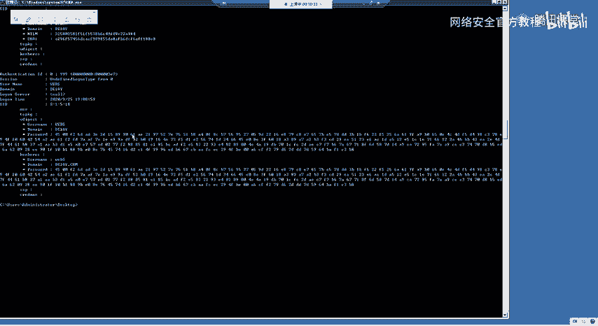

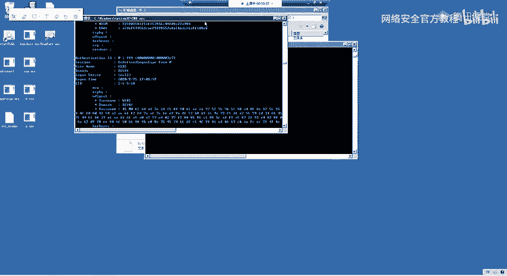

这样的话就是mini cards它的一个使用。那么我们在这边我们得到它一个名为密码，那么我们就可以去登录到这样子的一个系统。然后的话得到这一个系统呃对应的这个用户的一个权限，对吧？这个。

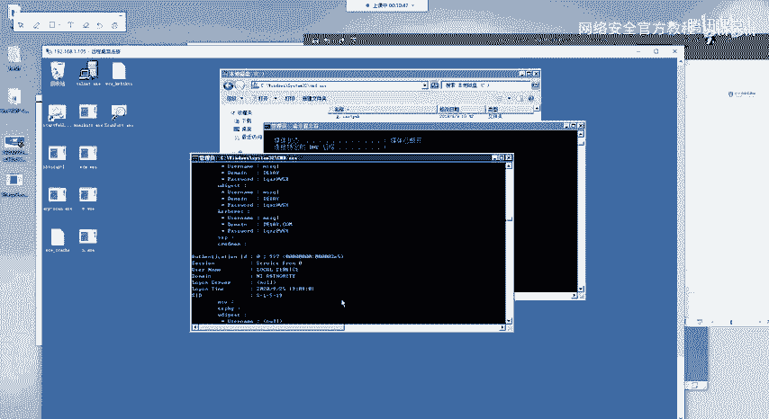

应该能理解。嗯。然，呃下面的话就是呃这边的话其实就是给大家提一下，就是我们现在的话一般的话都是用的新版本的，就是呃2。02点多的一个版本。就老版本的话，我们以前的话是用的这个一点多的一个版本。

就是它的一个命令的话，它是跟现在是不一样的。前面这里的话就是提升权限是一样的。然后在后面这边的话，我们就说它是有这样子的1个DL文件。我们需要去把这样子的一个D文件注入到这一个进程当中。

我们才能够去获取到这个进程当中所存储的一个密码。然后2点多的话就是啊按我刚刚的一个介绍来去进行一个操作。这边的话其实就是让大家就是啊就是告诉大家，就是如果你比如说你看别人文章，对吧？

你看到他使用的一个命令跟我现在用的一个命令不一样。那么你这个时候你不要奇怪，对吧？那么他可能是用的一点多的一个版本，就是比较老的一个。比较老的一些文章了对吧？

然呃第二个的话就是power share脚本来去进行一个加载。就是说mini card的话，它有一个power share的一个呃power share脚本的一个就。Of。

就是有一个用po尔的这样子一个脚本的一个呃写的一个mini cards的一个。呃，脚本啊就它的一个脚本功能的话，就是实现实现这样子的一个minicast的一个功能，就是来去获取系统当中的一个铭文密码。

好，我在这边的话。呃，大家对。抛 share。有了解吗？呃，上节课的话其实也有提到这样子的一个抛弃。大家呃了解抛系吗？就是呃知道知道它那一个基本的一个使用没有。Okay。我没有什么意思？

就知道po尔如何去进行一个基本的一个使用，来去进行这样子的。像比如说去加载这样的一个脚本执行，对吧？本地的去加载以及远程的一个加载。不了解。呃，不了解的话，我这边大概的说一下，然后呃。

如果呃就是其实后面的话也会涉及到这一个。涉及到这涉及到这样子的一些内容。啊，我看。一点点。呃，p share的话比CMD比CMD要强大。但是呃p share它是windows下面的一个自带的一个呃。

应该说是。一个。工具。一个模块的一个一个工具模块啊呃。你百度一下吧。可能我这样子描述不是很准确，就它是呃一个命令行的一个外壳程序脚本环境。即系诶。抛下面的话，它有自带的很多的这样子的一些功能以及脚本。

我们可以直接去进行一个使用，来去啊操作我们的一个系统，去获取相应的一个信息，以及能够去执行相应的一个命令。嗯。啊诶。如果大家对抛 share不是很了解的话，我后面的话看抽一个时间。

像比如说周末什么时间给大家介绍一下抛 share的一个使用吧。然后后面后面的话因为也会经常去使用到。好吧。如果当的话，你可以自己去你可以自己去了解一下，就自自己去百度相应的一个资料去了解它一个使用。

好吧，然后这边的话大概的介绍一下。呃，我这边的一个语句，它的一个作它的一个作用。就是。嗯，可能我现在讲的话，大家不是很理解啊，但是没关系啊，你先有一个大概的一个一个印象。然后的话你后面你自己去。

或者说我后面讲的话再去细讲，好吧。然后这边抛线IEXIEX这一个的话就是一个嗯。

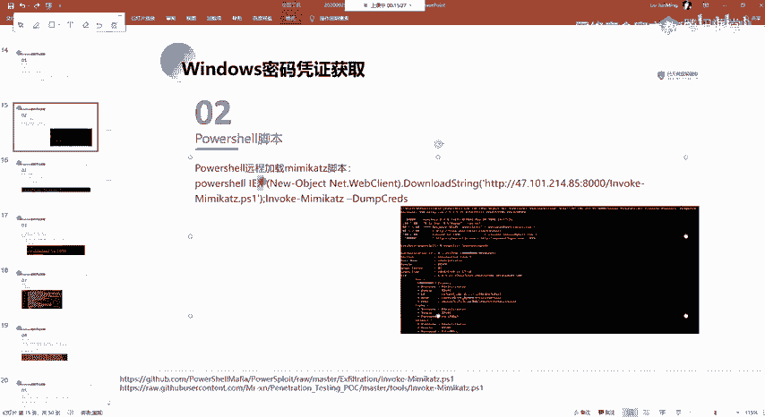

呃，我先进抛 share，然后你输入一个help的话，能够去查看到。查看到。相关的相关的一些命令以及一些参数，对吧？然后在这边的话，我们可以通过这个get help来去获取到相应的这样子的一个命令。

它的一个。详细的一个信息，就包括名称以及它的一个语法，还有别名，以及它这一个呃它的一个具体的一个使用。具体的一个使用。然后在这边的话，这一个IEX的话。

它其实这一个inwork expression的它的一个别名。这里它的一个意思的话，它是我们可以去执行相应的一个命令。

就是说把我们的在这边把我们这边用donor drive去下载的这样子的一个p的一个脚本，把它加载到内存当中去进行一个执行。这个的话就是这个IEX的一个作用。

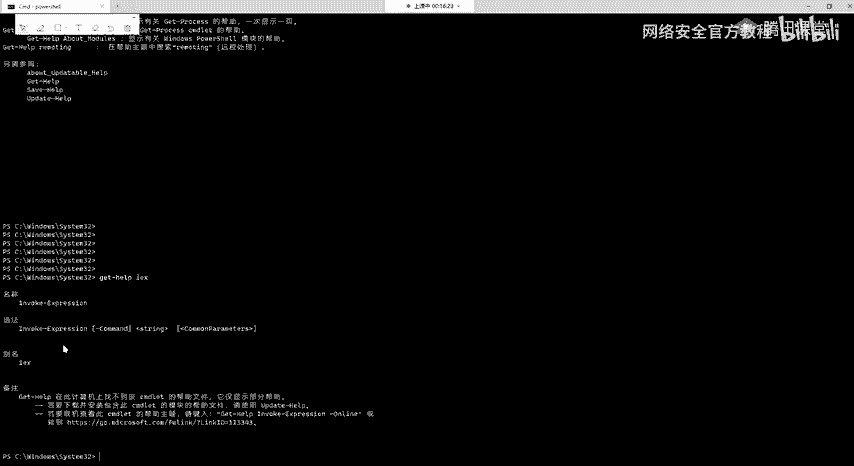

然后这个IEX要注意的话，它是这一个。invo exposurepoion它的一个别名，就我们可以通过这样子的一个警写的一个方式。然后下面这边的话。

new objectnet web client这里的话就是这一个new object的话就是创建这样子一个对象。这个对象的话就是这个net web client，这个是呃啊就是donnet。

因为我们的一个p share的话，它其实是一个。嗯。呃，利用的是这个donnet framework这个框架的一个强大功能。就呃在这边的话，我们创建了这样子的一个web client。

也就是呃web的一个客户端的这样子的一个呃对象。这个对象的话，它有这样子的一个方法。就这个donload drive的这一个方法。这个方法的一个作用的话就是去下载我们这边给定的这一个链接的一个内容。

然后这边的一个内容的话就是我们的一个远程的一个脚本。我这边脚本的话是放在我的这个VPS服务器上面的。然后的话当然的话你也可以就是说呃就我这边的话有给这样子一个脚本。就是说比如说这一个脚本。这个脚本的话。

你可以。Yeah。就跑啦。Okay。对。嗯。Okay。不去。Okay。Okay。不去。呃，就是这一个脚本。哎，怎么防不到呢？Yeah。呃，要翻墙啊呃，要要要翻墙才能够访问到。Okay。

然后这边的话就是它的一个脚本的一个内容啊。当然的话你你可以直接就是说用这样子的一个链接，对吧？这一个链接的话就是你可以直接把它call到这边来。来去进行一个直接下载这一个链接。

但是的话这一个啊一般的话就不不推荐大家去用这样子一个方法。因为。我们从这边的话也能看到它是挂它是放在我们的一个github上面。啊，github的话，你去直接去访问的话，你是需要去翻墙的。

比如说你在国内的话，用这样子一个方法的话，你去进行一个远程的去加载这样的一个脚本的话，它会有报错。就是你连接不上这样子的一个github它的一个域名，是吧？你访问不到它。

然后的话一般的我们的一个呃操作话就是把这个脚本，把它给就是下载下来，下载到放到我们自己的这样子的一个呃服务器上面。

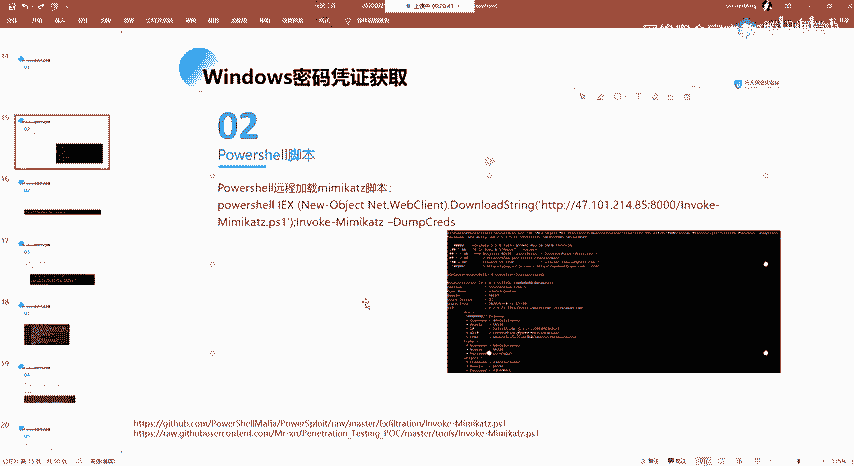

我这的话呃放在了这边，就是已经就放了几个脚本。这边的话有这个evo cards这个脚本。然后呃我通过就是pathon。还起个简单的1个HP的一个服务。然后呃默认的话，它是开放在80087的一个端口。

你也可以去指定其他的一个端口也是可以的。

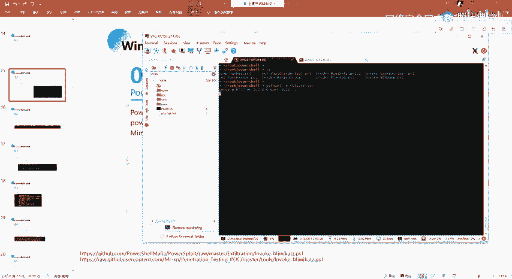

然，在这边的话呃在这边的话。前面这边的话就是去利用这个IEX，把我们这边下载一个脚本加载到内存当中，然后去执行。而且这边的话是一个远程的一个呃远程的一个加载。然后用分号去进行一个分隔。

就分隔前面的一个命令就后面的一个命令。这在这边的话就是说我们前面已经加载了这个脚本之后，我们可以用这样子的一个呃，用调用它的这样子的一个呃命令来去执行。然后这边执行了一个。呃，执行的一个。

达到一个效果的话，就是像这边我这边的一个截图啊，截图所示。就是说其实跟我们前面呃直接用mini cards来去获取它的一个铭文密码，它其实是类似的。我们可以看到在这边。然后呃看一下实际的一个效果吧。

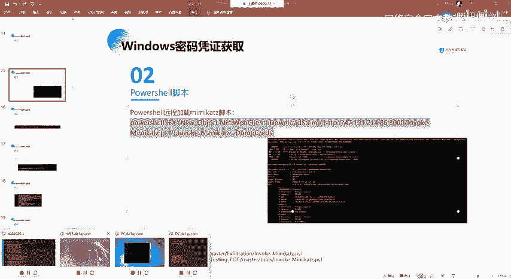

Okay。Okay。

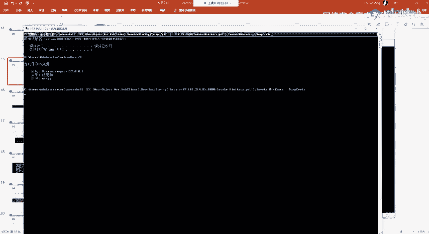

然后呃在这边的话，我们其实可以看到。他会来这边去加载。对。Okay。

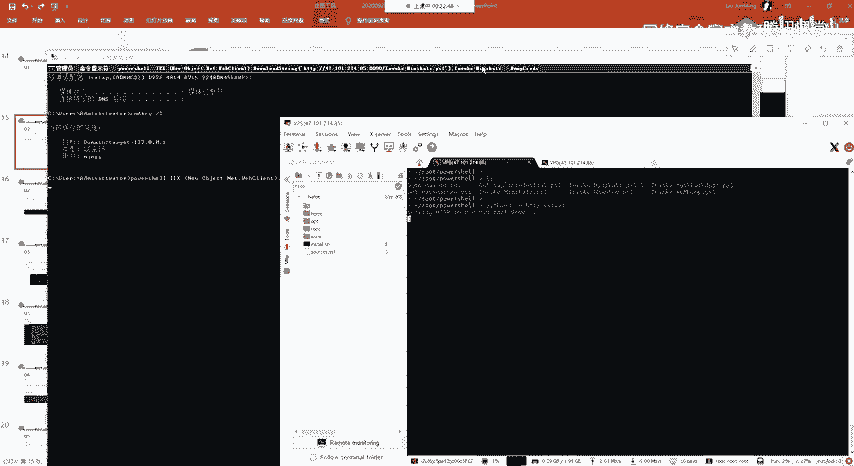

Oh。呢咁嘅反应。

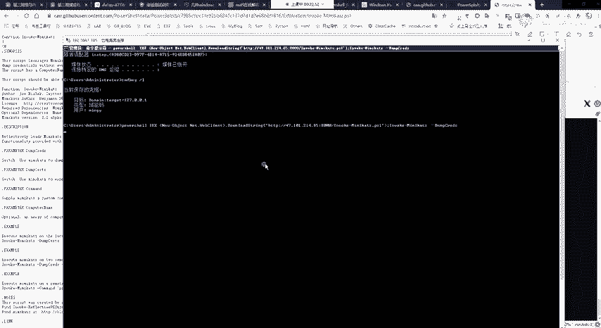

Yeah。Yes。呃，这边的话应该是。网络的一个问题啊，下的有点慢。可看到在这里的话，他已经呃发起了这样的一个请求，就是来请求了我这边的这一个脚本，对吧？然后他这在这边的话，他加载到的内存当中。

加载加载之后的话，它会去执行执行我这边的一个invo mini cards的一个命令。这边的话需要等待一下。他需要一点时间。我蚊。对。呃，我先让他跑在我们继续后面的一个内容。

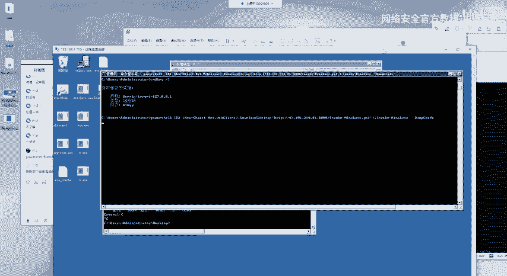

嗯。搜索猜。搜索是插件，就是这个Utu嘛，你可以你可以你去下载一下玩一下嘛。它里面有比较多的一些插件。呃，我是习惯用这个，就是里面它的一个功能的话还是挺多的。嗯。开启过1个HTP服务，就能用这个命令嘛。

诶。怎么说呢？你你没你没你可能没明白我这里的一个意思。就说我这边的话，我是下载好了这样子的一个脚本。这个脚本的话，它的一个功能的话就是实现的mini cards的一个功能。

然后的话我把它放到了我这边的一个呃。

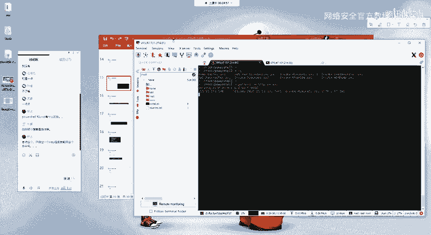

UPS的一个服务器上面啊，因为在这边的话，我是通过就是说通过这样子的一个啊，其实你这边的一个对象的话，其实你就可以把它理解成就是一个呃下载。就说下跟我们在浏览器上面去下载，其实是同理的。

然后他他会去下载我们这边的这样子一个脚本。然后这边的一个脚本就。你对HDP的一个请求应该能理解吧，是吧？这个的话就是一个一个链接嘛。然后的话他通过发起1个HTP的一个请求，请求我这边的一个。啊。

请求我这边的一个链接嘛，请求我这边这个链接的一个内容嘛，也就是我这边的一个脚本内容嘛。然后的话通过这个IEX把它加载到内存当中去执行。然后在后面这边的话是接我们具体的一个命令。

然后这边的一个具体的一个命令的话，就是说呃基本的这种po的一个脚本大家还是要能会看哦。就是其实在这边的话，它有这样子一个方可选的一个声明，就是它是声明了这样子的一个invo mini cards。

就其实我们这边执行的一个就是调用的这样子一个命令的话，就是这个invo mini cards。然后在这边的话有相应的一些注释，就是使用的话就是这个这一个命令。其实。对，是你。

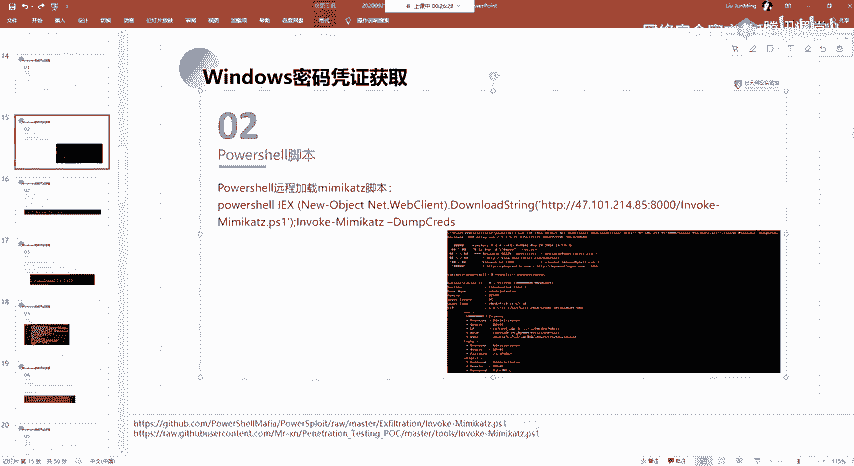

看下应该可以了。呃，可以看到在这边的话已经好出来了呀。就是呃因为在这边的话，它有这样子的一个过程啊，这过这一个过程的话就是去下载这样子的一个脚本。下载脚本的话，它会要加载到内存当中去执行它。

所如的话呃你可能网络啊什么的呃机器什么的，这样子的一些导致它的这边执行的一个命令的话，可能会就是返回的一个结果会比较慢。然后其实在这边他可以看到在这边执行的一个呃结果的执行的一个命令的话。

其实就是这一个sec log and password。就我们刚刚讲的这个通过这一个呃命令来去得到它的一个铭文的一个密码。

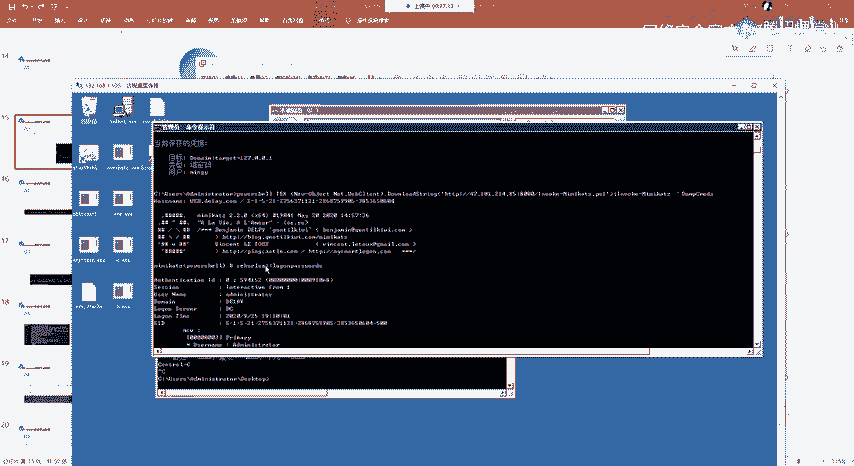

Okay。Okay。呃，这边的话是通过pa share脚本来去加载这样的一个命令cast的一个脚本。然后第二还有的话就是通过p share加载这样子的一个pass哈这样子一个脚本。

这个脚本的话就呃简单直接了很多。就是说呃我们可以看一下这边我这边执行的一个结果，这边执行之后的话，可以看到它没有多余的一些内容，他直接就把它的一个就是呃哈希就NTM哈希的一个格式，对吧？

他按照NTM哈希的一个格式。把它把当前这个系统下面的用户，他的1个LM哈希，还有NTM哈希的一个值都给列出来了。

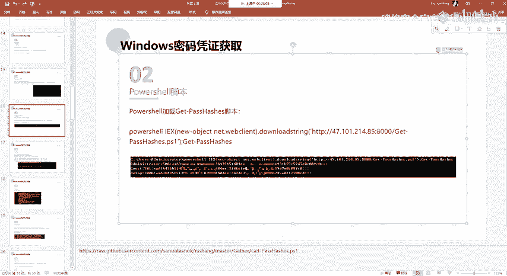

Okay。So。Yeah。

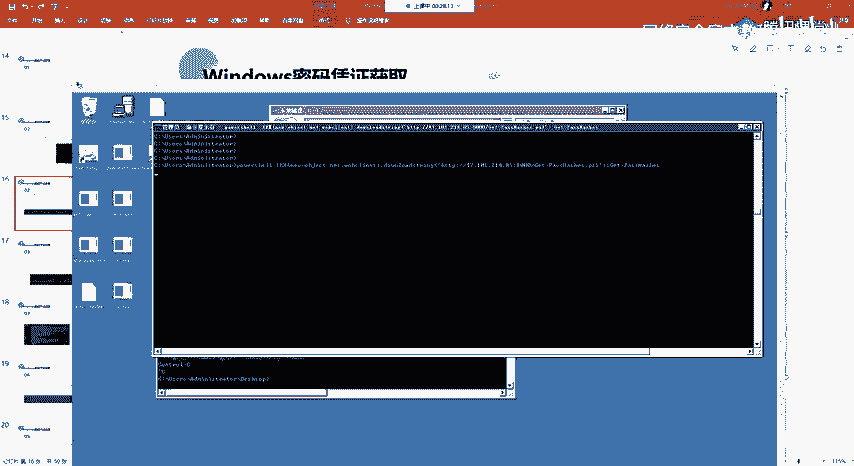

这边同样先让他跑着吧。好，我们看下面啊后第三个话就是WCEWCE的话，它是跟前面命令卡齐名的一款哈希管理工具啊。这个工具的话，它的一个功能也是比较多的。然后呃它的一个作用的话。

同样就是呃它是这样子1个EXE的一个程序。我们执行之后的话，它就能够直接返回呃返回用户的一个哈希值。这边话我就不演示了，就看截图，好吧。嗯。然后呃这边有给了就是这一个工具。

它的一个详细的一个使用也不多说了，大家可以自己去啊。关于这些工具命令的话，大家自己去研究一下，自己自己去自己去呃执行一下就你就能够知道了。

然后第四个话就是1个PW的DD7这个工具的话同样的呃可以读取当前系统的各个用户的一个密码哈希尔。然后这边呃它是这样子1个EX的一个程序，我们直接执行之后的话，执行之后的话它会自动的去关闭啊。

就是它会你执行之后的话，它会。呃，直接会关闭，也就是它不会引留一个窗口这样子的一个东西。所以的话你需要把它执行之后的一个结果，把它给输出到一个文件当中来去进行一个查看。

得到的一个结果就是像这样子的一个呃哈希的一个格式。嗯ん。以及第五个的话就是这个OPH crackrack。这个的话就是呃。如果我们用网站无法去破解这样子一个哈希值的话。

我们可以用这样子的一个工具来去进行配合彩虹表来去进来去进行一个破解。关于这个彩虹表，这个的话，大家看那个预习资料吧。呃，都是。就是理解它是一个什么东西就可以了。啊，其实实际的话实际的话。

你实际碰到这样子的哈西的话，你可能也不会说去呃跑这样子的一个，反正我是会觉得很麻烦。就是因为你跑这个东西的话，你的一个时间成本的话是比较高的，而且不一定能够跑出来。嗯。呃。Yeah。这个。就是。咦。😊。

哦，我这边呃大家去看看一下第一期的那个预行量容吧，我这边应该是忘记贴上来了。不。就可。就是呃彩虹表的话，它是就是根据我们这边呃根据一些给电的这样子的一个哈希。

它是有这样子的一个就是有一个比较复杂的这种这样子的一个算法，能够去呃根据给电这样子的一个哈希来去呃得到它的一个铭文啊。就这个东西的话比较比较复杂，你就大概知道有这一个东西就OK了。好吧。

然后呃第六个的话就是用这个pro dump加min cards。好，这里的一个pro。好，这种方法的话是我们。呃，比较常用的就是这个pro dump这个工具的话，它是微软，它的这样子的一个工具箱里面。

它自带的就这个SYSinter这一个工具箱。这个工具的话，它是呃。在这一个工具箱里面的话，它的这一些工具，它是有微软的一个签名认证的，也就是它是微软出品的这样子一些工具。

这工具的话就是说能够比较好的去进行。就是说杀软的话，对这一些工具的话。U。就是能够去绕过沙卵吗？他不会去查杀他。然后的话我们可以用这样子的一个工具去把我们的一个呃。去。

从我们的这样子1个LSISS这个进程当中去导出我们想要的这样子的一个呃。一个哈希子以及铭文的一个密码。然后的话我们导出来之后的话，就是从这个进程当中导出这样子的呃，它的一个内容，它保存了一个内容。

然后的话我们使用min卡来去进一个还原即可。这边的话是它的一个使用的一个方法。呃，就是说我们的。这样子的一个mini这种方法的话是比较常用的。

就我们的mini cards杀软对mini cards这个工具的一个查杀的话，是呃就是已经比很严格了呀。就是说min天开始的话，你想要直接去进行一个执行的话，你需要去做一个秒杀，就是对它进行一个秒杀。

你要对他秒杀的话，你就需要去研究呃。去你要去知道它的一个代码它是怎么去写的。然后的话去你要去研究呃它的一个秒杀的一个方法。嗯。那怎么乱嘛？早开信。😔，Yeah。Okay。擦。呃。

这边的话有这样子的一篇文章，这里的话就是呃他总结了mini cards的一个秒杀的一个方法。大家对这个感兴趣的话，你可以去研究一下它里面有很多的这样子的一个mini cards的一个秒杀的一个方法。

它都总结出来了。おピ。Oh。呃呃，第七个的话就是注册表导出哈希，就是说从注册表当中去导出我们那个哈希纸。就是在windows系统上面的话，呃，我们的一个密码嗯。我们与密码相关的这样子一些东西的话。

呃大多呃以及这些工具啊，就有一些工具。他去获取这样子的一些windows系统啊，包括软件以及这样子的一个。这样子的一些哈希值的时候。大多是从呃就说注册表当中，以及他的一个。还有什么。不的。呃。

而且突然突然忘了要说什么了。就是从注册表当中，还有就是呃。一些就是软件的它的一些特定的，像保存这种密码文件的这一些路径当中去获取到它的一个密码信息。所以的话在这边的话，其实我们呃在注册表当中的话。

它同样的。有存放这样子的一个呃系系统用户系统当中用户的这样子的一个密码的一个哈希。然后的话我们只需要去用这样子1个IEGC这样子一个命令。就是说从这样子的一个注册表象当中去导出它的一个内容。

导出内容的话，保存成这样子的一个文件。然后的话我们就可以用min令 cards来去呃获取这。文件当中它的一个密码的一个哈希。以及还有通过这样子的一个secrets dump这样子的一个工具。

也能够去获取到。H。😊。

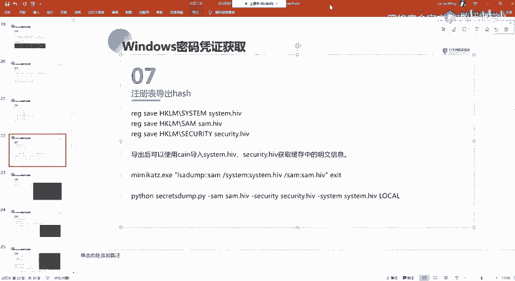

呃，这边。啊，这前面的这些啊我先讲完吧，先讲完。

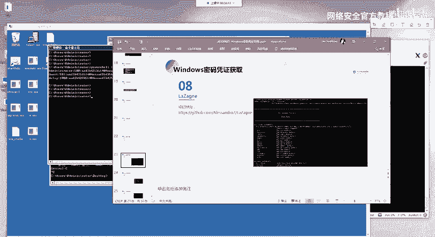

然后第八个的话就是这个lan。呃，LAGAGNE的这样子一个工具。这个工具的话它是一个呃也是。经常使用到的这样的一个工具啊，这个工具的话它功能的话很强大，就是它这一个工具它里面已经写好了。

就是说呃我们可以用这个工具来去获取相应的一个密码。然后在这边我们可以看到。在这边它有这样子的一些选项，它能够去获取到相应的这样子的一些呃密码。像比如比如说bs。就是浏览浏览器。

还有呃datbase就是数据库啊，还有一些游戏啊，gi址，还有mail。邮箱对吧？还有。一些SVN啊等等这一些呃项目，还有wifi，还有windows系统的这样子的一些呃。

密码就说我们可以指定相应的这样子的一些模块来去获取到相应的一个密码的一个信息。

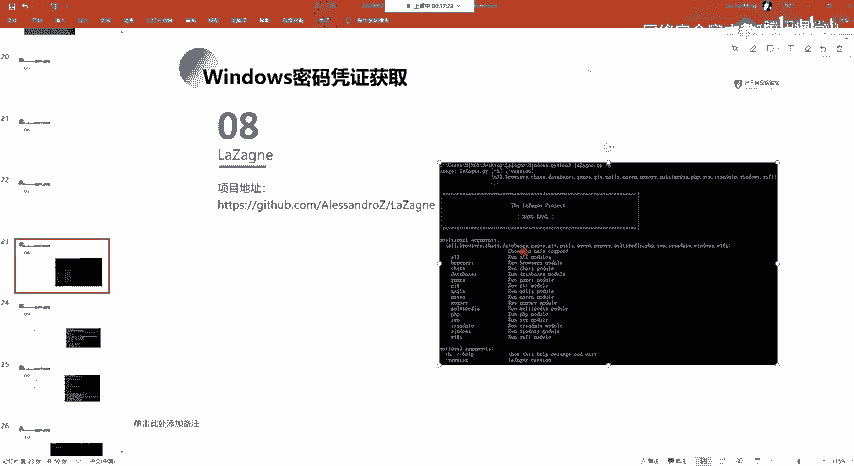

嗯。然后这个工具的话也是比较有名的，就是一些APP的一个组织，也也也有去使用这样子的一个工具。

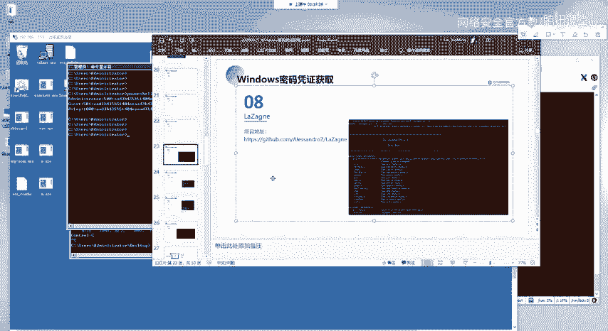

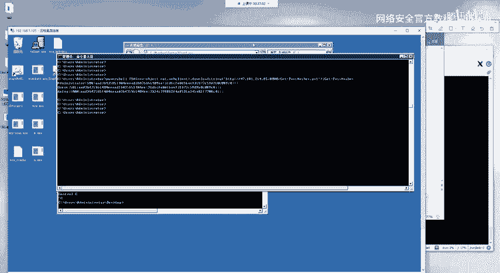

呃。这边的话我们来看一下呃，这边的话有这样子的一个yX一个程序。Yes。我们可以来执行一下。

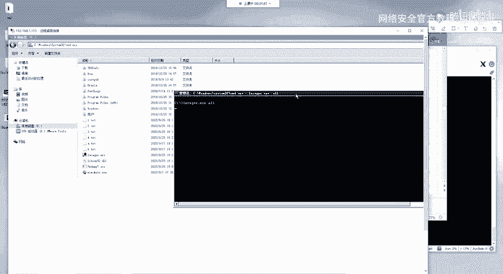

我这边的话直接哦就是呃获取他所有的就是调用他所有这边提供的一个模块来去获取当前系统下面所有的。

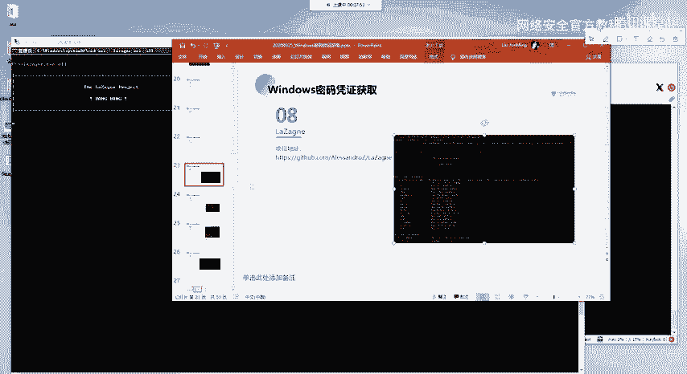

他这边能获取到的这样子的一些密码的一个信息啊。呃，这边的话先让他跑着吧。

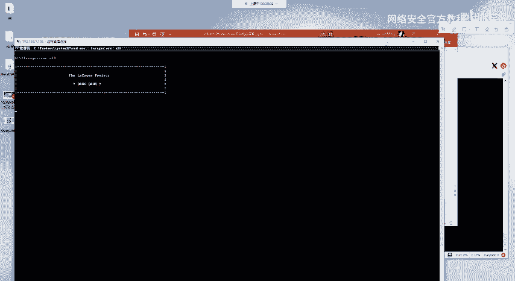

因为他需要一定的一个时间。走。然呃第九个的话就是呃前面讲到的，前面应该也有讲，对吧？就讲MSF的时候有给大家介绍，就是说我们得到一个mat的一个筛选之后的话，我们可以用mat里面的这样子的一个一些模块。

来去进行一个密码哈锡的一个获取，就哈熙juump。然呃在MSF里面的话，有这样子的两个模块，就是。呃，这一个。这一个hush dump以及这一个small h dump。

这两个模块然后我们只只需要执行这两个模块的话，就能够去进行一个密码的一个哈希的哈希值的一个获取。嗯。哦呃。具体的一个效果的话，我们看我看一下，看一下我这边的一个截图啊。

就我们得到一个mat的一个需要之后的话，然后要注意的话，就是说你这边要去进一个哈西的获取的话，你需要有一个管理管理员的一个权限，对吧？然后有管理员的权限的话，我们就可以把它提全到我们的一个stem。

用呃get system的一个命令去进行一个提群，对吧？然后的话我们在这边的话，我们可以直接执行这个哈希d来去获取当前系统下面所有的一个哈希值。以及我们呃MSF里面的话，就是mat这一个呃组件的话。

它里面有。集成了这样子一个mini cards的一个呃。这样子的一个模块啊。就是说我们可以通过load mini cards来去加载这样子一个mini cards的一个模块，来去使用它的一个功能。

我们知道命令卡的话，它能够去获取到它系统的一个铭文的一个密码，对吧？然后的话在这边我们可以通过MSVI还有c等等的这样子一些命令来去获取到系统当中，它所存放的这样子一些铭文密码。在这边的话可以看到呃。

这边直接获取到了它的一个铭文啊。administister还有优质2的这样的一个用户。以及还有其他的呃，以及我们可以用mini cards。Com慢。去执行指定的一个命令。比如说这个ssomees。

就是获取我们那个哈西。对吧。以及我们这边的一个呃。search pass word这边它同样的能够去获取到它的一个名为密码。然后关于这个命令card的一个使用的话，我这边呃就不做过多的一个介绍。

前面应该也有讲了，然后主要的话就是在你的它的一些命令。嗯。😊。

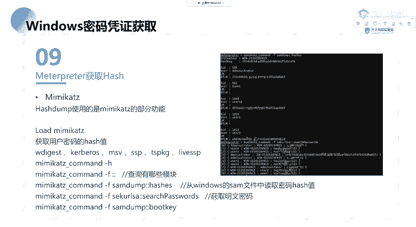

我这边的话呃也有相应的一个注释解释。然，第10个话就是construct获取哈西。呃，这边的话就是。CS获选刷期的话，比MSF的话呃。简单直接一点。就呃我们得到了这样子的一个需绘画之后的话。

因为我这边的话。正好有一个。就这边前面的话已经。对吧首先呃用sleep来去调整一下它的一个就是睡休眠的一个时间。呃，因为我这边我只是本地演示的话，我一般的话就直接把它给调为零啊。

就是你直就是你直接执行执行命令之后的话，它就会去立马的把这一个请求发送到我们的这样子这个backer。然后的话执行之后的话返回结果给我们就是比较快嘛。然后实际的话可能就是呃不建议大家调为0。

就调为零的话，就你的这样子的一些请求的话，比较频繁的话，很容易被发现。嗯。

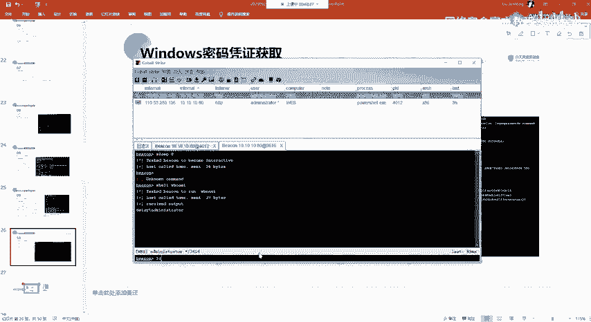

然后的话呃我们想要去获取它那个哈希值值的话，我们只需要就是。执行执行我们的一个哈希蒂。就直接在beken这边执行哈希电用卡的话，就能够去直接获取到他那个哈希，就这里。

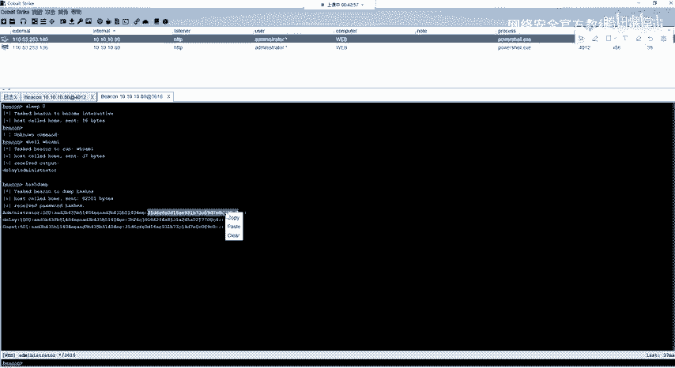

然后这一串。阿西的话应该可以解密啊。这边设的比较简单的。

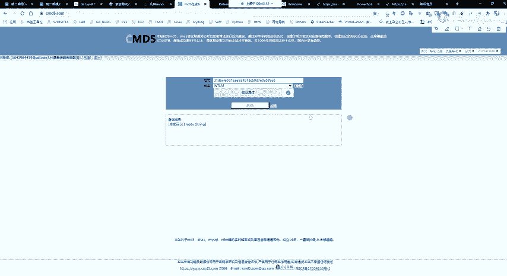

穷。空裕啊。

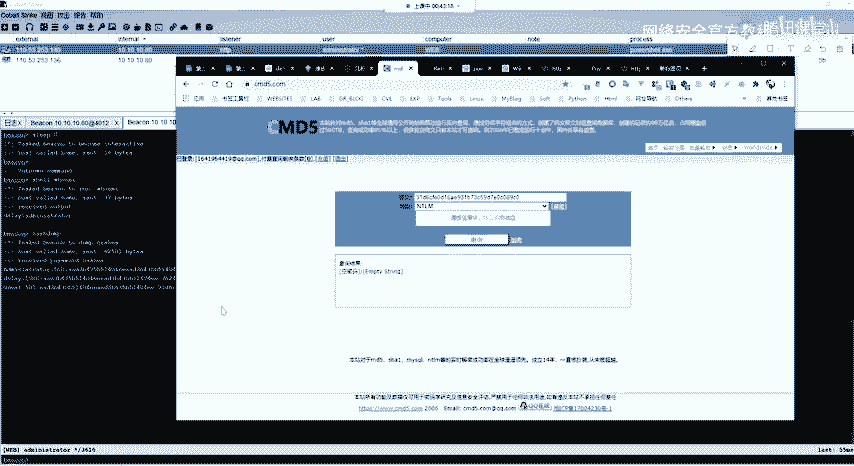

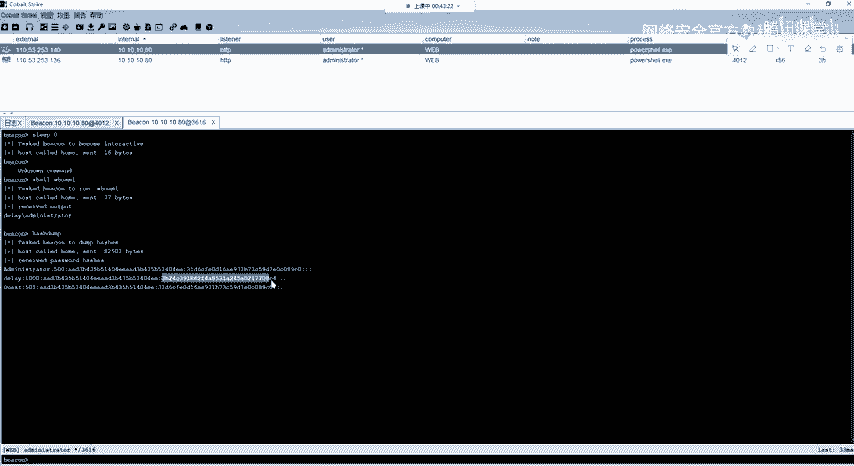

是吧。

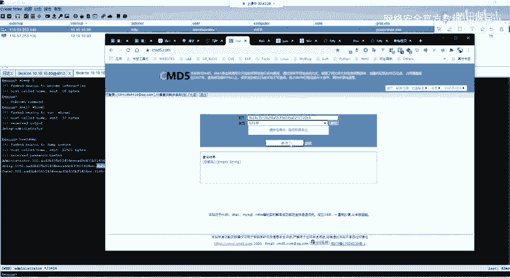

哦，这边的话解出来了呀，可以看到。

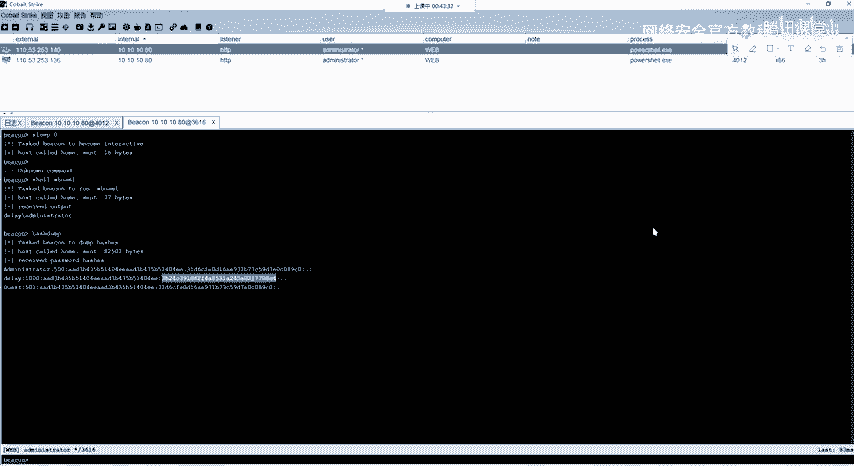

就这种比较简单的话，直接用这种在线网站去建一个简密即可。有。然呃还有的话就是在。CS当中的话，它同样都可以去使用mini cards的一些功能啊，就是它里面也有集成了mini cards的一个模块功能。

然后我们可以直接执行这个loggan password来去获取到。因为在这边的话只是获取到了它的一个哈希值，对吧？


然，我们在这边的话，我们可以通过login passwordword直接执行它。来获取到当前系统下面的就是说能够获取到的一个铭文的一个密码。你看到在这边的话已经返回了一个结果，就这边执行的一个结果的话。

跟我们前面用mini cards得到的一个结果的话是类似是一样的。一样的。


好，这边的话我就。不一一介绍。然后的话我们可以用mini cards里面的一个，就是它模块啊。就是用命令cast的一个命令。因为我们。呃。

mini card的话不仅仅是只有这样子的一个loggan password获取它一个名为密码的一个功能，对吧？它还有其他的一些功能。然后的话我们想要去执行，想要去使用其他的一些功能的话。

那么我们可以使用这边使用它这边。明日号。


写错了。啊，没有了，有没有参数啊。Okay。这个它是呃没有加参数。然呃在这边的话我们可以看到呃加个问号的话就是输出它一个帮助信息嘛。然后其实就跟我们前面去进行一个呃用mini cards是一样的呀。


然后这边的话我们可以直接mini cards接我们这边的一个就是用这个secak。loggan password其实这边的一个log password，就我前面执行的这一个login password。

它的一个功能跟这边的话它是一样的。只是的话我们在这边min你看啊，不这这边CS里面的话，它已经有它已经就是写好了这样子的一个功能，就我直接执行log password的话就能够获取。

就能够去呃相当于在这边执行这一串命令的一个功能。


可以看到呃跟上面的一个结果的话是一样的。病。呃，然后的话呃前面的这几个工具需要给大家演示一下吗？就是说怎么去进行一个使用。再把机上访问自己的服务器的脚本并执行。对。就是说呃因为我们自己的一个机器的话。

你去访问的话，你去访问的话是没有说不像在get hub上面那样呃，有这种呃。就是不能访问的一个情况嘛。只要你在你自己的机器上面开一个web服务，开一个简单的wordb服务。

然后的话通过web的一个方式去访问。嗯。😊，呃，前面的这样子的一些工具需要我去做一个演示吗？应该不用吧，就是呃到时候把PPT发给大家，然后大家自己在打机上面去操作吧。呃，这些工具的话，我这边也有给链接。

对吧？就是怎么去下载，让那里下载。然后如果不知道的话，如果找不到的话。呃，找不到的话，你再找我吧。啊呃，工具库里面应该其实有的呃，那就是如果工具库里面没有的话，是呃因为那个工具库的话。

是我这边就是整的第一吧，就是比较就。内容的话不是很全，就只有一小部分，因为是就是发就是名就是直接发出去的嘛，就是呃所有人。就是来去了解这样子的一些东西的话，都发给他了。所以的话不是很详细啊。

就是有很多的一些东西都没有加进去。然后后面的话如果大家有需要的话，我这边可以去整一个就是啊我们包括我们生透测试相关内容里面所使用到的一些脚本啊，工具什么的，我都可以把它整成一个工具库。

到时呃可以发给大家，就不需要去不需要去自己去gihub上面去找，是吧？因为呃如果大家没有不能翻墙的话，你去geHub上面去下这些东西的话，可能会比较痛苦。嗯。然后呃在这边的话。这边的话应该没什么问题啊。


呃，在这边的话就是呃提一下。就大概的提一下，就可能大家呃使用这样子的1个CS就我呃我是习惯的去使用这1个CS就MSMSF5的话呃MSF的话就相比CS的话可能。呃，它的功能的话其实要多要多很多。

但是使用起来的话，CS的话要稍微方便一点，就确实要方便一些。对。然后MSF的话就是呃。操作的话就是比如说你突然网断了，对吧？你网断了的话，你前面的那些东西全断了就。挺挺那个的。

然后呃在这边的话就是说我这边是以以这个CS为量，就是在MSF的话，其实也是同理啊。就你MSFF的话，你直接得到了一个筛选的话，或者说你直接得到了一个需要的话，对吧？

你可以直接比如说你里面你直接执行一个直接执行需要。


对吧你直接。直接直接下。Okay。你直接执行CL的话，就能够去得到1个CMD的一个命令函嘛，对吧？以及你在直接在。诶。Okay。你直接在。verate下面。


你直接在m下面也能够去执行相应的一个命令是吧？然后呃在这边的话就是说就是可能大家之前的话没有这样子的一个用这些工具来去执行命令的一个概念啊。

所以这边的话大概的介绍一下，就是说比如说我前面这边我有讲对吧？我有讲这样子的一些工具或许他RC的一个工具，对吧？那么我这边我谈谈那个需要谈到CS或者MSF上面。那么我这些工具我要怎么去进行一个使用啊？


像比如说我这边1个WWCE这个工具，对吧？我这个是1个ES的可执行程序。那么我要执行的话，我需要上传到我的这样子的一个这一个靶机上面，对吧？我需要把它上传上去。


然后上传上去的话，在CS里面的话，我们可以通过upro这样子的一个命令。就通过upload。其实在MSF里面也是一样的对吧？通过upload的这一个命令。

你就能够去上传去上去选择你要去上传的一个这一个程序，对吧？然后的话上传到这个目标机器上面。然后呃这是一种。然后还有的话就是。CS里面的话，它有这样子的一个文件管理器，对吧？


文件管理在这边的话，我们直接可以进行一个文件的一个操作，对吧？然后的话我就我就可以直接把我的这样子一个程序上传上去，对吧？通过upload上传上去，上传到指定的一个目录下面，然后的话。

然后的话你要去执行的话，像比如说呃在这边。我以这个PWDD7为例吧。そか。对吧我这边前面呃在介绍这个的时候，对吧？PWDD7，我要去执行它。


然后的话得到他的一个哈希的一个结果。那么我在这边的话，其实就是通过这样子的一个方法嘛。我直接需要执行这这样子的一个程序。


电排器。学习。


没写错。然后的话我这边要去执行执行之后的话，我的一个结果需要导，需要就是输出到一个文件当中，我才能够去查看的对吧？比如说我输入到要点text。这样子的一个文件当中。


然的话，我这边执行。Okay。执行之后的话，他会在呃我们从把机上面这边来看的话来看吧，比较直观一点，对吧？


然后在这边的话，我们。看一下。有点卡。Okay。Yeah。什么去心。Okay。


🤧嗯。


这边的话你执行的话，你执行之后的话，它会有这样子的一个就是说呃需要去等待一些时间。因为你执行执行的话，它需要时间的，以及你在这边执行，你在CS上面，你执行。就是说你这边输入命令之后的话。

它会呃把我们这边要执行的一个命令的一个请求发送到我们呃这个把机上面的这个backken，对吧？然后的话在backken上面执行之后，它才会返回结果返回给我们。


然后在这边的话，其实我们从这边的一个。呃，标识也能够知道，就是说他这边的话是呃发送了这样子的53字节的这样子的一个请求。就是说我们这边的一个命令对吧？


那要过一会儿才有结果。


还怎么。怎么突然这么卡呢？😔，Okay。


哦。我这边的话就是在输出这个text的时候没有加。那加C盘的一个路径，就是应该是在直接在当前的一个路径下面6点。Yeah。


应该是有是吧。Yeah。呃，其实在这边的话已经有了这1个6点tex的。


但是没有内容，啊这边的话呃应该还在执行，可以看到呃在。嗯。


还没写进去吗？


Oh。重新写一下。


Okay。


Okay。啊，怎么突然这么卡呢？难生话。Okay。


嗯。Yeah。Yeah。Okay。呃，我们以这一个为例吧，就以这1个WCE为例吧。因为这边的话，WCE的话，你直接执行之后的话，它就可以去返回结果的。然后我这边的话执行的话就直接需要。

然后的话接我这边上传上上上传上去的一个这个程序的一个路径，对吧？然后的话他就会去执行。执行之后的话，在这边就能返回结果。就这样子的一个方式。然后上面这一个这一个的话呃，就是说我们这我们直接执行之后的话。

它不会把结果直接返回给我们，对吧？那么我们可以通过就是说把我们执行之后的一个结果重联向到一个文件当中。然后的话通过typeap这一个命令来去进行一个查看。


这边不知道为什么没写进去。


卡咯。唔晓得。Oh。


Okay。


，Okay。本来的话就是你这边执行之后的话，他会有这样子的一个回响就行。


还没写进去。


然后可以看到这边的话已经有了呀。


那你说了。


这边在CS上面执行的话有点慢了呀。Okay。就是呃正常的话是这边执行之后的话，它也会有这样子的一个回显。就是像在这边执行之后的话，有这样子的一个，然后的话它会有这样子的一个output。


就是在这边它会显示，然后你看到了这个，他就说明我这边执行的话已经执行完成了，对吧？就像在这边有这样子的一个output。嗯。😊，然后的话我们直接type这一个文件的话，就能够去查看到它的一个内容。

这边的话就是呃。


介绍一下我们如何通过这样子的一些就是。


在CSGMS上面如何去使用这样子的一些工具啊，就可能大家没有这方面的一个经验的话，就是你不知道这样子的一些思路。以及同样的同理的这一些也是一样的嘛，对吧？你直接通过这样子的，就把这个程序上传上去。

然后执行获取到它的这样子的一个文件。然后然后的话下载下来，下载到本地。然后我在本地再用mini cards来去进行一个解密。就能够去得到它的去还原它的一个密码。注册表同理啊。

就我这边的话同样的可以去执行这样的一个命令，得到这样子的一个文件，对吧？嗯。啊呃，关于这第二部分的一个系统密码的一个。凭证获取的话，大家有没有什么疑问就。有没有什么问题啊？应该都能理解吧。嗯。对。

Okay。Yeah。诶。有。大家还在吗？是不是？都睡着了呀。还在听吗？呃，再听的话就呃。给我点反馈嘛，是吧，就是你这不跟我交流的话。你这不跟我交流，我不知道就是大家有没有就是说。有没有什么问题。

或者说能不能听懂，以及我这样子去给大家讲大家能不能去接受，对吧？在。听起来没问题，实践的话实践的话，那么你肯定就是要你自己去多去操作了呀。Okay。就是多多自己动手去操作，然后碰到问题，碰到问题直接问。

就其实就大家去学学这些东西的时候，学习的时候，其实你问的问题越多，你学的会越多。当然的话当然呃就是在这边正好就说一点，就是你问你问我们问题可以，对我们知道的话，我们肯定会给你回答，就是肯定会回回应你。

我说到这个我。我突然想起来。昨天晚上有位同学问我问题，我今天忘记。我我今天忘记看了呀。呃，这位同学。几。😊，Okay。呃，我等会我等会再去回你吧。我突然想起来这位同学他问了我昨天晚上我今天早上看的时候。

他晚上一点钟问我的问题，然后我那会儿没看到嘛，对吧？所以就没回他，然后后面后面看到了也忘记回了，就是在这边的话正好就是。呃，说一点就是你问我们问题可以，但是就是注意一下时间好好吧，就是注意一下时间。

就是我们不是说24小时都在线的啊。我们不是说24小时都在线的。就是你问问问题这种，你碰到问题，你问的话，你在群里问，或者你私聊我可以。然后的话就是尽量都在白天就是白天白天的一个时间，对吧？就你下班。

就我们这边下班之后的话，也就是也不会说一直盯着这样子的一个呃，盯着你们的一个消息，对吧？啊，就这个人是你是吧？应该不是吧，明星尽兴。啊啊叶。Yeah。W。啊，行行吧，就是你问的话，你还是就是白天问嘛。

就而且有时候的话，我虽然看到了，但是可能我自己这边有事的话就忘了。Yeah。然后大家就是尽量多提问嘛，是吧？因为呃其实你实际的话，这些东西你可能很多东西的话。你可能直接问别人的话，是比较好的一个选择。

当然首先的话，你首先你需要首先是要自己去进行一个找去尝试寻找这种解决问题的一个方法，对吧？然后的话你如果实在解决不了，你可以来问我们。如果我们知道的话，我们肯定会尽力的去回答你们嘛。对。

就是这个的话就是。就以。这样子的一个怎么说呢？就我们其实也是一个服务业，对吧？就是为你们服务的。嗯。啊呃，其其他的一个情况也不多说了呀。然后呃就是稍微给大家唠下嗑，然后我们继续我们后面的一个内容。

后面的话还有一部分内容。


也也就是第三部分的一个阿。呃，首先的话第一个就是power share尔的一个脚本获取RTP的一个连接记录。就这里的话呃这里的一部分的话就是。好，给大家介绍一下。

通过一些方法来去获取我们呃本地的这个IDP的一个连接它的一个密码。


嗯。She。首先第一个的话就是呃在这边的话，我们。首先介绍一下，就是这一个呃。脚本。Yeah。这里的一个po的一个脚本。这个脚本的话，它是呃这一个上级stutu，他写的一个脚本。

这个脚本就是来获取你windows系统下面的这样子的1个RDP的一个连接。就呃具体的话我们来看一下这一个图啊。就是在这边的话。我们可以看到在这边它列出来了。

就我当前的一个用户的话是1个MINGY的一个用户，对吧？然后在这边它列出来了，就是呃有这样子的一些连接。我们可以看到就是呃我有连接了这个比如说172。26。2。35这样子的一个呃机器这个机器的话。

我使用的一个用户的话，是这样子的一个面的一个用户去进一个尝试连接的对吧？还有其他的这样子的一个机器。啊在这边的话，它就列出来了，我RDP的一个连接记录。那么从这个RDP的一个连接记录，我们也能够去知道。

就其实呃上一节课就有讲对吧？就是说呃做这样子的一些信息收集。就是说在这边我通过它的1个IDP的一个连接，我能够去知道当前的这个机器，它能够去连接，也就是说它能够去访问到哪一些网段的这样子的1个IP对吧？

以及它呃能够以及它有去有去用IDP的一个方式去连接这样子的一个机器，对吧？那么我们知道了我们知道了它的这样子一个密码。那么我们就能够去进行一个呃连接这一个机器，也就是一个横向的一个渗透横向的一个移动。

对吧？


对。然后呃。嗯。这里的话呃这两个图的话是一样的。唉，我这边。


这这边的话这是一样的，就一样的一意思啊。然后在这边同样的就获取到了他的一个记录。


呃，然后在这边可能大家对这一个会有疑问，就是在这边我是用的这样子一个方法，抛 share杠EXEC by pass，然后的话还去加载执行的这样子的一个脚本。

这里的一个方法的话就是说我们再去加载我们本地的这样子的一个p share的一个脚本。


呃抛 share他。呃，就是。嗯。就是抛蟹。p share它有提供了这样子的一个就是怎么说呢？就是扩展或者说呃接口这样子的一个东西。对吧？

然后的话我们可以通过它的这样子的一个PS抛 share的这样子的一个呃语言。呃，怎么说呢？就是P。啊，PSPSE的这样子个脚本语脚本语言。就他有他自己的一个这样子的一个呃规则。

然后的话我们通过编写它的这样子一个脚本语言来去调用系windows系统上面的它所提供的这样子的一些啊接口啊，一些扩展啊，来去达到相应的一个目的。像比如说我去呃执行。比如说我去获取我系统的一个信息。


抛里面的话，它有自带的这样子的一个脚本就是。呃，应该是什么？就比如说你要去执行一个system in这样子的一个获取到stem in的一个信息。我们在抛 sharing里面的话。

我们可以直接去呃有这样子的一个方法来去获取到对应的一个信息。然后关于抛蟹这个脚本的话，在这边的话你就。呃，建议大家去学习一下。然后在这边的话，在这里的话，我在课上的话，因为一时半会儿也讲不清啊。好吧。

一时半会也讲不清这个东西。你就呃理解他是。哦，我们看一下吧。嗯，呃这些这些东西就你让我讲讲解释这种概念，说实话。说实话，我也不是说很很那个，因为。谁没事会去谁没事研究这种东西是吧？P。然后我们看一下。

就是这这这里的话就是一个po的一个脚本。


Okay。Yeah。然后可以看到在这边的话，就是抛弃来的话，它这个脚本上，它有相应的一个格式的就是。像比如说在这边的话，就是它的一个注释。然后他的这一个脚本。呃。

可以看到在这边get VMI object。就这个的话这个的话其实就是呃我们。


就在p share里面的话。嗯。它跟我们的这个WMIC它是一样的。一样的一个功能。比如说我们g子 have。


应看有吧。Yeah know。


就这一个。呃，我记得应该是啊。就是这一个getWMI。就是这这一个功能的话，它跟我们直接执行WMIC它的一个功能是一样的。但是的话在这边它是用p share的一个方式。


Yes。


没看到在这边执行的话，他在这边呃应该也可以那个吧。Okay。


呃，我我有点忘了呀。就是呃它是实现了1个WMIC的这样子的一个功能。


然后的话呃还有后面的这一些的话，具体这一个的话就是。嗯。这个东西。呃，在这边的话我先不讲吧我先不讲吧。然后后面的话呃后面的话我抽时间就是。给大家讲一下抛弃尔吧，就是基本的一个语法。

当然的话具体的这样子的一个写法的话，肯定一时半会写讲讲不了。

Okay。No。


因为我我我都不知道我从哪里讲，你们能够去就是能够去理解啊。就你需要你首先现在的话，你先对它有一个基本的一个概念就行了。IDP连接。哦，IDV连接的话就是就是这个。就远程桌面连接啊。

就remote desktoptop嘛。然后IDP的话，它是一个就是协议嘛，就是我们这一个远程桌面的一个协议，有没有 desktop。A projector。嗯。这的话就是远程。

就是RDP啊啊就呃可能习惯的就是说说这些。


嗯。


Okay。啊呃，言归正传。


扯远了又。


然后在这边的话，我们想要去。呃，我们想要去执行他，我这边下载到本地的这样的那个pos share的一个脚本。我们。实行的一个方法呢就是这样子。花絮，然后的话。诶。执行的一个这样子一个方呃。

执行这个脚本的一个方法，就是像这样子，就是杠F来去指定我们要去加载的这样子一个脚本。然后在这边的话，你会碰到有一个问题啊。就说碰到这样子一个报错，碰到这个报错，大家不要。呃，不要急。就是说在这边的话。

抛析尔的话，它有这样子的一个就是运行的一个规则，就是有一个策略。他呃有几个有有有三个策略吧，就是三个还是4个，我忘了，就是呃他原他你默认的话，你在word了上面，你去执行抛弃的一个脚本的话。

它不会去允许你去执行。就你默认的一个规则的话，它是禁止你在系统上面去运行这样子的一个抛弃的一个脚本的。就为了安全性的一个考虑。然后还有的话就是还有大家可以去就是可以去更改它的这样子的一个规则。

像比如说更改成为就是能够去就是没有限制，没有任何限制，就是你可以远程的去加载，也可以再加载本地的。然后还有的话还有一种策略的话，就是呃不允许远程的，就远程去加载这样子的一个抛弃的一个脚本。

然后在这边的话，我们可以去通过这样子的一个方法。Bypass。就杠XEC by pass就是呃来去绕过它的这样子的一个运行策略的一个限制。然后的话我们可以来去执行。这样子一个脚本对吧？

可以看到他在这边他就已经没没报错了。本来的话它是禁止运行的嘛，我们通过这样子的一个方法的话，能够去绕过它。然后在这边的话就列出了我当前系统下面的这样子1个UDP的一个连接记录。就主要的话就在这边，对吧？


可以看到。而不是UDP是RDP的就远程桌面连接的一个记录。


然后我们。得到这个记录之后的话，我们能够去干嘛呢，对吧？我们可以去获取到它的一个连接记录的一个就是这种IDP连接，就原程桌面连接它的一个密码。P。然后它的一个密码的话，它其实有是进行了一个加密的。

那么我们需要对它的一个连接密码做一个解密。在这边的话，我们解密的话，我们使用到了一个工具的话，就是这个minicast。P。うんうん。呃，然后的话呃在这边的话，我们一起来看一下就是。

其实在这边我们想要去查看您在本地连接过的一个目标机器的话，我们也可以通过注册表的一个方式啊，就通过查询它的这样子的一个注册表来获取到呃连接的一个G。它的一个注册表的一个值的话就是在这边。

我们来看一下效果。你看到这句话就列出来了啊所有的这样子一些记录啊。就比如说这个主机我使用的一个addmin的一个用户去进行一个登录的对吧？还有其他的一些主机。然后的话嗯。

第二步的话就是要查看你当前用户下面的这个目录，它是否有这样子1个IDP的一个密码文件，也就是这一个目录。


看一下。这个目录如果有的话，它就会显示这样子的一些。显示这样子的一个呃。文件。

🤧嗯。Oh。它会显示这样子的一个文件。然后的话呃。在这边的话我要提一点，就是说大家可能不知道，就是说我这边的这一个密码文件它是怎么来的。对吧就是说你可能你会你会你你去看看你自己的话。

你会发现你没有这样子的一个密码文件，对吧？那么为什么为什么你的会没有呢？就是说你可能你没有去用这个RDP。就是说呃很多时候的话就管理员他为了方便，对吧？或者说你自己也为了方便，你要去连接某一个机器。

对吧？比如说你去连接这个机器，你连接这个机器的话，你就是说。你每次都要去填写这样子的一个用户名以及密码，对吧？就主计算机的话肯定是要填的对吧？然后的话你每次去连接同一个计算机的话。

它都要填这样子一个密码，对吧？那么我要我下次要去连的话，我还要去填。那么这样子的话肯定就是。如果密码多了，对吧？那么你可能记不住或者搞混。所以的话在这边。我们可以去勾选这一个，就保存我的一个频据。

就允许保存我的一个频据。那么我再去连接这个的时候。就我连接之后的话，如果它之前的话有保存，我这边的话是不是这个机器了。了解。这个机器。啊我这边去连接的话，他在这边的话，他会要输入我们的一个密码，是吧？

然，连接。然后在这边的话，我们。下次还要去连接这个机器的时候，对吧？那么我们只需要去。呃，填写我们这边的一个主机名。啊，我计算机名。然后的话他在这边的话可以看到在这边的话，它已经保存了我们的一个频据。

就是说我们输入了这个计算机名，它会保存它已经保存了我们的这样子的一个频据。这个凭据的话就是登录这一个机器的一个密码凭证。然后我们下次再去连连接的时候，我们就可以不用再输这样子的一个用户名密码，对吧？


然后去进行一个连接。


对吧我在这边的话，我就没有没有再输这样子一个密码。


。


然后的话在这边我们这边保存的一个频据，那么它在哪里呢？对吧？因为我们这边这个凭据，我们下次再去连的时候，它不不需要我们输，那么它肯定是保存在我们本地的某一个某一个文件当中，对吧？某一个地方。

然后它保存的一个地方啊就是在这一个目录下面。Okay。就是也就是在这边显示的这样子的一个文件，就密码文件。嗯。然后呃查看保存在本地的一个远程主机信息。这里的话呃上节课的话也介绍了呀，是吧？

这边的话我就不多说了，就我们在这边的话也能够去查看到我们远程连接的一些呃信息。一些主机信息。然后的话我们本地呃我们要去我们获取到了它的这样子一个密码文件。那么我们怎么去对它做一个解密呢？解面的话。

我们在这边需要用到这个minicast。这边min令 cards的话，需要用到就是说这边的这个DPAAPI这个credit它的这样子的一个呃功能。这个模块。

然后我们需要去指定我们这边想要去解密的这样子的一个文件。的一个呃路径。然后我们在这边要去指定路径的话。记住是用这个杠斜杠印，斜杠印的话，你可以理解成就是说我这边的一个呃要去解密的一个东西的话。

它是在这样子的一个文件当中，对吧？就是印在这一个文件当中。就是接我们的一个文件的一个路径。然后的话。在这边我们执行之后的话，它会有这样子的一个值。

就我们需要得到的其实就是这一个值GUID的1个ma key这个值。啊，我们得到了这个值之后，我们需要通过这个值来去找到它对应的一个ma的 key。也就是这一个我们要去怎么去得到它一个m key呢？

就是通过这个sacDPAAPI就是通过mincard。通过命令卡制这个命令。来去得到它一个master key。然后的话这个master key的话，如果说你有多个这样子的一个呃用户以经连接的话。

那么它在这边的话，它不会仅仅是只有一个它会有多个。然后的话那么我们怎么知道就是说我们的这个master key它是我们想要的呢？对吧？我们想要的解密的这个文件呢。

就是说通过这个GUIDmaster key。来去进行一个确认。就是说我们可以看到在这边有1个GUID对吧？是这一个我们前面这边获取到的这一个文件，从这个文件当中获取到的。那么我们。

这一个GUID所对应的一个ma key，也就是我们需要我们需要去用到的。

也就是我们要去进行一个解密的这样子的一个值。而我们要解密的话，就是通过这一个。呃，同样的也是通过这个DPAPL这个ceds。来去解密它。解密的话。

我们需要通过这样子的一个就是把我们那个master key把它给加加进来。就。加进来，然后执行执行之后的话，就能够去解密到它的一个呃数据。来去拿到他的一个铭文的个IDP的一个连接密码。在这边的话呃。

可能这边拉大一点，看得清楚一点。


对吧，就是呃通过mini cards。首先指定我这边解密的一个文件，然后的话指定我这边前面通过GIDmusster key得到的这个musster key，对吧？得到之后的话，我这边执行之后的话。

它会返回相应的一个信息。返回的相应的一个信息的话，再注意在这边在这边的话，它就会。返回我们的这样子的一个密码。可以看到在这边我们的一个tag name，也就是这个我们去连接的这个172。26。2。

43的这个主机，对吧？它的所使用到的，就我们在本地去连接所使用到的一个用户名的话，是这个adminadmin，对吧？以及它的一个密码的话是root。因为在这边的话，我是使用的一个root去登录的。

所以的话。得到了它的一个铭文密码是root。那么我们现在的话就已经得到了这一个登录这一个。呃，机器的一个ad me管理用户的一个铭文的一个密码，对吧？那么我们就能够去直接的去登录这个机器，对吧？

就是横向的移动，得到了这一个机器的一个呃权限。


🤧嗯。以上的话就是呃。通过获取本地的这种IDP的这个连接的一个密码，然后对它进行一个解密，来去进行一个呃横向的一个移动吧，对吧？


因为呃在windows机上面的话，用这样子的一个远程桌面连接的话是很普遍的一个操作，是吧？


然呃第二个的话就是这个PPTP口令获取。这个的话PPTP的话大家可能接触的不是很多啊，就是这个点对点的一个隧道协议。就我们可以我们在问的系统上面的话，我们可以就通过拨录这个ISP来去访问企业的一个内网。

就是通过这个PPTP的一个协议。呃，在这边的话我们。你可以下。嗯。一片。


Okay。就是这呃。


就是这两。Yeah。Yeah。嗯。就是我们这边的1个VPN啊，然后我们在这边的话，我们可以去添加我们的这样子的1个VPN的一个连接，对吧？来来去连接到我们指店的这样子的一个啊就是VPN的一个网络。

然后呃在这边的话，我们就是配置好之后，就注意的话，就如果说你是使用的这样子的一个VPN那个类型的话，是这种点对点的一个隧道协议的话，就像我这边的一个截图这边，对吧？然后的话你连接连接之后的话。

你就是说如果说你得到这个机器，它还存在这样子的一个连接的一个信息。那么我们可以啊获取到它的连接的一个密码，那么我们获取到它一个连接的密码的话。

那么我们就可以在它的这个机器上面来去通过这个VPN通过这个PPTP的一个呃隧道来去连接到我们指定的这个服务器，对吧？嗯。然后首先我们去获取的话，获取它的一个密码的话，第一步我们需要获取它的一个配置信息。

它那个配置信息的话，它在这样子的一个路径下面。就这一个路径。🤧嗯。走了。呃，在这边的话，你找不到的话，是因为呃我这边的话没有串这一个，就是没有添加这样子的一个V片。因为我这边的话没有。当然的话诶。

我这边随便创一个吧。啊，我这边不试了吧，你们呃你们自己如果想要去获取的话，你自这边的话，你随便去进行一个写过，就你不需要有这一个，你不需要有这样子的一个UP。

你就呃随便输入这样子的一个信息以及用户名密码。然后的话你可以去尝试去获取它的一个你这边输入一个密码，对吧？然后在这边的话，你配置完配置完之后的话，它会在这个目录下面，它会有这样子的一个文件。

就这个文件的话，它就是存储着这一个连接的一个配置信息。当然的话，这里的一个配置文件里面的话，它是不包含用户名以及口令的对吧？那如果有的话，那么我们直接在这一个文件当中就能够获取到嘛，对吧？

一般而且像这种的话，也不会说是一个铭文的一个存储。然后的话在这边的话，我们可以通过mini cards。来获去获取到他的1个PPTP的一个密码。屁。然后获取的一个方法的话也比较简单。

就是呃通过这样子的一个方法，就用这个LA du secrets。来去见一个获ach。就呃具体的一个步骤的话，看这边吧。我就不演示了。然后我在这边的话执行之后的话。

他就会去获取我们的这边的一个secret。然后主要的话就是看这边。在这边的话，我们就得到了我这边的一个铭文的一个密码。就我的一个用户名的话是艾min一密码的话是艾min一啊P篇。

也就是我在这边输入的这一个。嗯。而我们得到了它的这样子一个密码，我们可以通过就是说通过这样子的一个命令来去进行一个连接，就是连接这个VPN。

那么我们就等于就是说我们通过这个VPN进入到了另外的一个网网络，对吧？那么等于就是说呃进入到了另外的一个，可以说是内网，或者说是另外的一个网段。就通过这样子的一个方式来去进行一个连接。就ISDAL。

然后关闭的话就是通过这样子一个命令。这边的话我不一一的演示了。嗯。然呃第三部分的话。呃，先因为时间也不晚了，我这边的话我就抓紧一点时间。第三部分的话就是my circleql的一个数据库密码的一个扩解。

就是呃因为mysql数据库的话也是我们常用的对吧？然后的话如果我们一旦获取了我们网站的一定的一个权限之后的话，我们可以获取到。这一个机器上面它所运行的这个mycycl。它保存的一个用户的一个数据。

然后的话这个用户数据的话，我们可以通过解密来去获取到他的一个数据库的一个呃用户名密码。🤧嗯。然后的话呃就mysql的一个数据库用户密密码的话，它跟其他的一个数据库，它其实一样的。

就是它在系统的一个代码当中，它是以一个铭文出现的。然后的话我们获取到它的一个读取权限，其实可以直接从数据库当中去进一个读取。然，呃，关于这个的话，大家自己看一下吧，我就不一一说了呀。

然后呃主要的话就介绍一下，就是mycycl的一个数据库的一个文件类型。就说mys数据库的话，它总共有这样子的三种文件。我们重点要去关注的话，就是这一个就是说与用户相关的这三个文件。

就是优着点FRM还有MYDMYI。然后的话我们mysql数据库用户密码的话，它都保存在这样子的一个us着点MYD的一个文件中，就包括root用户，还有其他用户的一个密码。所以说在这边的话。

这个U着点MYYD是我们需要重点去关注的对吧？因为我们目的是要获取到。呃，去寻找他的一个数据库的这种用户名密嘛，是吧？Oh。说到密码的话，我们需要去了解一下。

就是mycyclql的它的一个加密的一个方式。这边的话主要就是呃了就是了解。就了解一下呃，我们my circle的话，它在4。1还有4。1版本之前，以及之后的话，它的一个加密方法它是不一样的。

就现在一般的话我们都是401嘛，所以的话我们的一个加密的方法，它都是这个mycycl的1个SHAE的一个加密方法。然后的话呃我们其实mys数据库当中的话，它自带有这样子的两两个函数。

我们可以通过这两个函数来去呃进行一个查询来。就是比如说以我这边的一个例子，我通过这个password这一个函数。这个pasword函数的话就是在新版的就是4。1版本之后的话。

我们可以用这个password这个函数来去生成。来去呃。呃，查询到这边指定的这个root，它的一个就是它加密之后的一个数据，也就是这边这边的这个数据。🤧嗯。😊。

然后也就是说如果说我们在呃我们都获得的这一个。啊。在mysql啊这一个文件当中获取到的这这样子的一个。加密之后的一个数据是这一串的话，那么我们就能够去知道它的一个铭文的一个密码是这一个root。

所以的话呃在这边我们怎么去获取到它的这样子的一个。这一串值呢。诶。然后前面我们有介绍，就是说。在这一个优者点MID文件，它是保存的root用还，有其他用户的密码，对吧？

那么我们在这边我们如果得到了这一个机器，它的一个就是它的一个权限，我们可以直接获取到就是说在它的一个my circleql数据库的一个date文件夹下面。

就保存的这样子的一个文件的一个呃路径下面找到这个文件。然后的话我们可以把它拖下来，就下载我们本地。然后的话我们可以通过用win hack或者是说用呃能够使用二进制的一个模式查看的这样子一个编辑器。

来打开这个文件，就能够去找到它的一个加密之后的这样子一个值。就像在这边的这一串。加密了一个密码的一个哈希值。然后这一串密码哈希值的话，就是我们需要去进行一个解密的。然后解密这样子的一个哈希值的话。

我这边的话介绍这样几种方法。首先第一种的话就是呃在线的一个网站破解。就在线网站破解的话，是我们用的最多的对吧？就。那比如说我这边的这一串对吧？可以看到在这边的话，我这边直接查询之后的话。

得到它的一个结果就是root，然后它的一个加命的一个类型是mycycll5。嗯。Okay。就是呃一种啊，然后然后的话如果说你在线破解不了的话，我们可以选择就是用这一个hush cat。HK的话。

它是一个密码破解的一个工具啊，它里面支持很多的这样子的一个密码破解的一个呃一个方法。然后在这边的话，我们呃就大概的介绍一下。就呃在这边使用这个哈 cut h cat的话。

我们要去解密我们的一个my circle的一个这样子一个加密的一个哈希值。我们需要。这样子的。呃，两个参数就可以了。首先第一个参数就是这个杠M杠M参数的话呃。先。Iuch cat。


就是这一个。Okay。我们可以通过ha cat干H来查看到他的一个帮助信息。然后在这边的话，你会发现会有很多的这样子的一些信息反馈给你啊，就是它支持的这样子的一个。呃，功能相当多。

就是他能够去解密的这样子的一些呃。这样子的一些。就他的一些加密的这样子的一些。呃，算法呀，还有指定的一些呃，像比如说。thon的一个pass哈这样子的一个方法，它的一个加密方法。

它能够去进行一个解密是吧？还有其他的一些指定的一些功能。像比如说PDF的这样子的一个。指定版本，它的一个加密，它能够去进行一个解密，还有其他的一些等等的这样子的一些功能。


然后在这边的话，我们可以看到就是我们这边的一个杠M的这个参数的话，其实就是指定的这个哈希mod。也就是我们要去解密的一个这样子的一个哈希，它是什么样子的一个类型。


然后我们这边的话是1个300，其实呃。在这边的话，我们找到就是三00所对应的这一个。Yeah。这里啊就是300所对应的它的一个就是解密的一个类型的话，就是这个mycyclcle4。1。

还有mycycl mycycl5对吧？然后的话我们在这边的话，我们要去解密的话，其实就是这样子的一个啊它这个mycycl版本所对应的一个加解。


加密的一个类型，对吧？然后在这边的话嗯。No。Okay。然后在这里的话，我们需要杠M指定这个300以及杠A指定3的话，这边杠A的话就是指定你要去呃。解密的一个模式。就这边指定三的话。

就是一个爆破的一个模式去进行一个解密，就是用他自己的，他其实有内置的这样子的一个解密的一个方法。


但系。はい。这边内容有点多啊。Oh。看一下这一个就attack mode，就是攻击的一个方法。嗯，然后这边的一个攻击方法的话，就呃就你就使用它默认的一个三就可以了。

它是用一个呃它有自己的一个就是爆破的一个方法来去进行一个解密。


Yeah。然后在这边的话。看一下效果吧，就这个的话因为比较简单，应该可以直接就跑出来。


Okay。


嗯。啊你。对。Yeah。对。Yeah。Yeah。は。语音仓鼠。


这边怎么没出过？🤧嗯。呃，这边的话是因为就是你哈希克的话，他在这边他去跑的话，他会。哎，是刚刚发啥的吗？你去跑的话，它默认会它是会用那个GPU啊。啊，我记得是是这个，我有点忘了。Okay。好。


Okay。呃，这里的话先先这样。我等会去看一下，我在这边我忘了，就他在这边的话，这个报错的话是可以忽略掉的。就是说呃你用哈西Q的话，因为你去跑这个的话，它需要资源挺多的。然后的话它是其实就是一个爆破嘛。


然后他这边他默认的话，呃，他是会用那个就是GPO的一个方式去跑。然后的话如果你的1个GPU呃是不支持还是怎么的？我可以用一个参数去把它就是不用GPU去跑。然后的话就不会有这个报错。

然后这边我忘了这个参数了。


然后这边参数太多了，我觉得一个一个找的话，太麻烦了。然后我们在这边的话看一下，就看这一个截图，它的一个结果吧。就正常的话，你跑的话，跑出来之后的话会是像这样子。就在这边的话。他跑完之后的话。

他会在这边有这样子的一个结果，就是这一个哈西所对应的一个铭文的一个密码，就root。🤧嗯。😊，然后还有就是用这个jo the rip，也就是呃。这1个GOH是它你里面自带的一个工具。

也是一个常用的一个密码爆破工具。我们。用这样子的一个工具去进行去进行一个包破，也是可以得到的。然后还有呃就是系统当中所常用的一些软件密码。呃，这边的话大家自己课后去尝试吧，好吧？

我这边的话其实截图啊也给出来了。然后主要的话就是用到了它的这一个ship这个工具啊，这个工具的话很好用的一个工具，就是能够去获取你系统当中，像比如说MVcast这种还有叉 manager啊。

就叉 share呃te等等的这一些呃常用的这种软件，它里面的一个密码，能够去获取出来。呃，其实我前面要说的话，就是这一句话就是在window系统上保存这个密码，就无非就是存在这两个位置，就注册表。

还有文件啊吧，就你在注册表当中，从注册表当中获取。然后的话还有就是啊从这样子的一些它的这样子的一些路径。像比如说这一个插叙。就插需L的话，你安装插需L之后的话，它会有这样子的一个s选时的一个文件。

然后的话你的这样子的一些存储的一个密码的话，它会在这个筛选文件当中，也就是呃它会存储在这一个路径下面。那然后的话我们可以用这个工具来去获取它的一个筛选里面的一个加密的这样子的一个铭文的一个密码。


你家有te目V，Tam目的话在这边我们可以看。呃。就在这表我们可以看到在这边它是这样子的一个就ID还有密码，对吧？然后以及在这边的话，我们可以在这边可以看到它直接获取到了你T上面所有的这样子的一些信息。

就包括你的1个ID以及密码。还有你想要去连接的这样子的1个ID以及你的一个姓名啊等等的这样子的一些信息。都能够获取的。好呃，以上的话就是我们本节课的一个所有的一个内容啊。呃，我发现内容还是有点多啊啊。

我看一下。还有21位同学在。呃，大家对今天的一个内容的话，有没有什么疑问？Okay。呃，因为后面的话就是后面这些的话。


后面这些的话，我没有一一一的去进行一个操作。因为每一个操作的话可能。


诶得翻。一两个小时才能搞完啊。然，因为我这边PP的话已经很详细了呀，就是包括步骤啊以及截图，对吧？所以的话这些操作步骤的话呃。我就稍微省略了呀。嗯就挑了一些。重点的一些东西的话给大家演示啊。

然后剩下的这些东西我们要去演示的话，就留给大家自己课后去进行一个操作啊，反正PP的话也会也会给大家相关的一些东西的话，都在PPT上面，以及还有预习内容。呃，讲的太详细了，就是呃讲的太详细。

是你觉得好还是。不好。🤧嗯。😊，Okay。好，对吧。嗯，好的话，那就行。虽然讲的确实有点累啊，说实话可能你们听着也累，但是。但是我但是其实讲课的人才是最累的，你们只要听就好了。

当然的话呃其实主要目的还是就是让大家能够去。就是把我这边的一些内容都能够理解。就讲详细的话，其实我也可以就是说就是稍微的过一下。但是可能很多东西的话，我不讲的话，因为。

我不清楚大家就是说对这些东西有没有接触过，就你我觉得应该就大部分同学都都没有接触过吧，是吧？所以说很多很多的一些东西你可能都没有一个什么概念，就没有这样子的一个概念。有话诶。就为了让大家能够听懂的话。

就是可能我这边就尽力吧，就尽力能够讲讲细一点，就是把我觉得就是大家可能会有疑问或者是说呃。可能需要去给大家解释的一些东西都给大家有做解释，好吧。嗯。啊诶。给大家一分钟的时间就提问吧。如果没有问题的话。

就下课了。然后呃今天又。今天又又又又加班了。又加班了。一节课嗯。嗯。呃，没3个小时呃，没有吧，没有3个小时吧。辛苦的话辛苦的话也说不上嘛嗯。都是为人民服务。


哎。😊，哎，都是为你们服务是。啊呃，没问题的话，给我送朵花吧。好吧，有问题的话直接提，然后我就。没问题的话，我就下了。然后大家也早点休息，就是呃就是大家。自己在课后的一个时间多去操作一下，好吧。

因为这个东西你不自己去操作的话，你看我讲，或者说你就看我PPT，你可能觉得哎就就就这一条命令对吧？这一条命令就出来了。但是呃。你可能你看的话，你没有你自己操作那么体会那么深。而且容易忘记。🤧嗯。好的。

都没有问题啊。我们一般我们一般如果不讲课的话，一般下下班就可能。啊，不会很关注群里啊什么的，当的话，你要发了的话，看到的话还是会回的。P。啊，毕竟下班时间的话，像其实我们晚上在在讲课其实也算加班了嘛。

是吧？就加班给你们讲，你白天一样的也要上班也要。一般呃就你就7八九点这种这种时候你问的话。看到了会回你是吧？要是再晚一点，说不定就可能看到了也不会回。然后因为可能电脑什么的也关了，对吧？躺床上了。

这个时候。🤧嗯。😊，就可能。也有可能就是已经睡着了，对吧？这个时候就互相都。啊，体谅一下好吧。然然的话尽量的话看到了会回你了。好，都没有没有没有问题的话，我就就不多说了呀。嗯，就大家早点休息吧。

