# B站最全网络安全教程，整整1300集，全程干货无废话，别再盲目自学了，看完学不会我退出网安圈！（web安全｜渗透测试｜内网渗透｜CTF） - P80：79. 第二十六天：Linux主机信息收集-1.mp4 - 网络安全官方教程 - BV15u4y137cQ

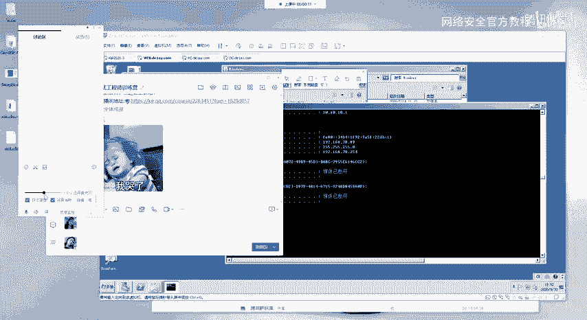

🎼拍开心阳光热烈，就伤心走入狼烟。🎼越灿烂，那方世界越容易有梦熄灭。🎼可当年你两处夙愿什么深渊都看不见。🎼从不习惯害怕退，却一首双眼格外藏脸。🎼谢谢你沿路的守护说。

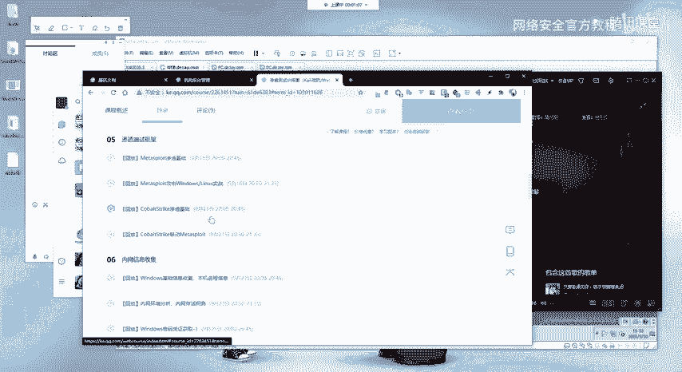

🎼谅解。🎼你让。🎼摆脱世俗虚伪。🎼坚持率心无悔。爱着你。配し？🎼只要一。🎼安慰你。🎼我有自。🎼嫌弃。🎼那么。🎼不懂爱。

願い？🎼更了解。太慢。🎼在笑。🎼不是。🎼You飞。🎼最深的爱像蓝天，宽荣的无边无减。😔，🎼看着我飞越极限，你比我还要。🎼你月。🎼沿着门的内心世界，你总能够走进里面。😊。

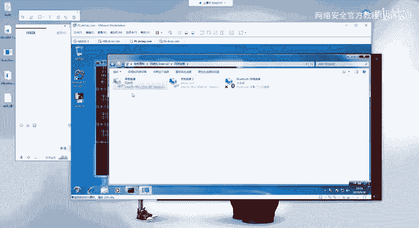

🎼变尘能交换的一切远远超过许多。🎼Yeah。🎼人再好墙也想被宝贝。😔，🎼一点。🎼你让我摆脱世俗的。😊。

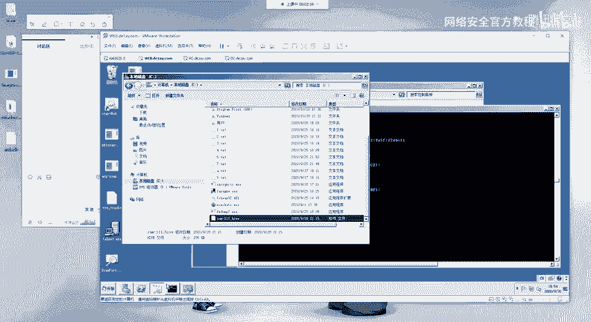

🎼的虚伪。🎼已无悔。

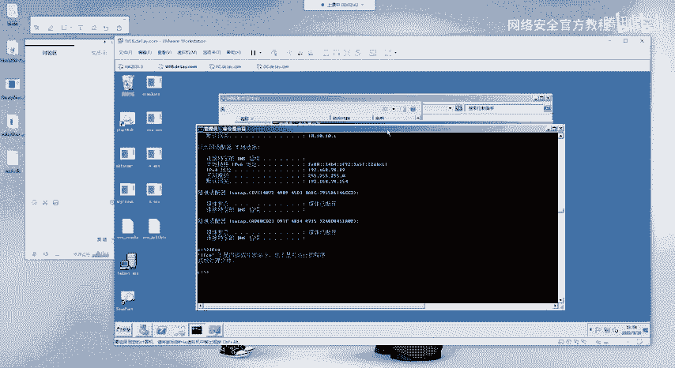

🎼带着你。🎼在心里。🎼是要郁。🎼不安慰你。😊，🎼我有。🎼冒嫌弃。🎼的人不懂。🎼的了解。は。🎼再相拥时。🎼有泪。

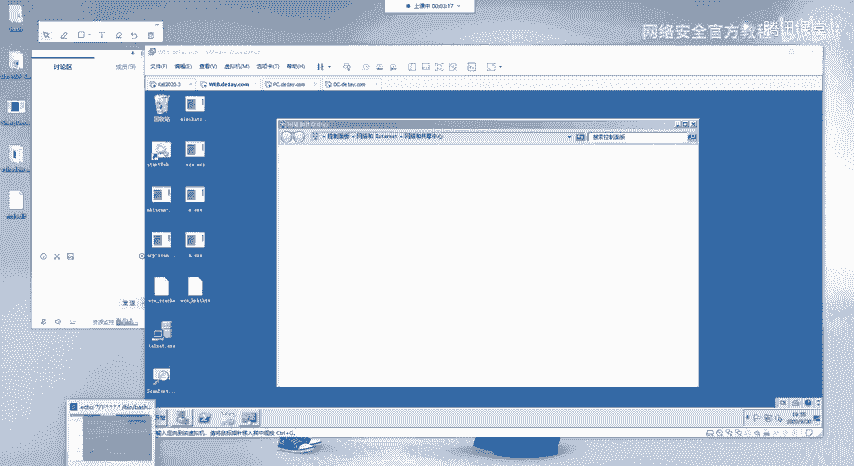

🎼你目送我冒险起飞。🎼牵过如风，一路金随。😊。

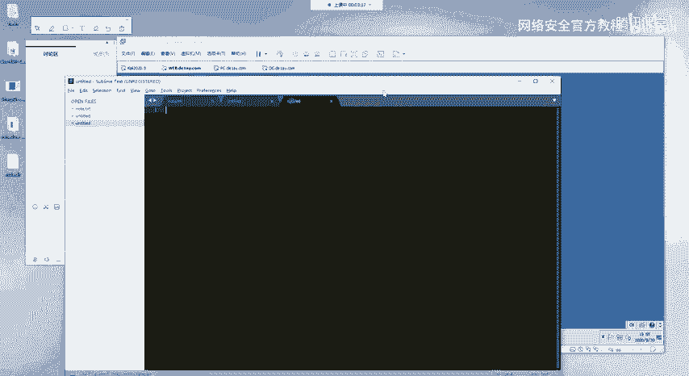

🎼欲しい？🎼深会。🎼向着会召唤春天，在冬日点燃的火焰。😔，🎼相细会整个纪念，曲折是感人。😔，🎼忘了是对。🎼远的午后。🎼飞走了。🎼有个计较。🎼你说蓝色的就是我。🎼红的黄的是你围绕我。😊，🎼你突然从后。

🎼到了我的。🎼多小声。🎼他说。🎼不要离开，我好好的。😊，🎼阳光在你。😊，🎼相爱了。🎼很作。🎼什么。🎼用说静静的看着我。🎼融果我的。🎼而你突然的笑容跟时天都是。😊，🎼要再去想着我和你的以后。

🎼我只是想和你走。😊，🎼知道。🎼分手。🎼望的人。🎼我在看望。🎼永久。🎼这不就是电影里别曾经看到。🎼边会有哭。🎼的家。🎼反着。🎼不够你。🎼就会舍起。🎼看着。🎼就像是。🎼的气球飞。🎼在空中。🎼高か。

🎼的漂亮。🎼失控。🎼也许某些时候对的感情就像气球一。🎼别不在。🎼然后转头。🎼不存在。🎼一直往前。🎼Yeah。🎼Yeah。🎼我等来珊。🎼好像有温暖。🎼什么。🎼不用手请神情看着我融化。🎼而你突然的笑融。

个时间都现。😊，🎼又再去想着我。😊，🎼你。🎼我只是想和你走在街头。😊，🎼千秋。🎼红着。🎼这不就是电影离别曾经看。🎼难边会有故事的角落。🎼有你。🎼都会升起。🎼看着。🎼就像是。🎼你球飞。🎼在空中飘飘。

🎼的飘。🎼时刻。🎼也许某些时候。🎼的感情就像气球一。🎼跌迫在。🎼到转头。🎼不身在。🎼一直往前。好呃，大家晚上好。然后在上正式上课之前的话，先测试一下我的一个麦克风啊。大家能听到我声音的。

以及能够看到我画面的，在讨论区扣个一。然后声音的话应该呃很清楚吧，声音的一个大小。呃，好的，应该。没有什么问题啊。好，那么正式开始我们今天的一个课程内容啊。我们今天的话课程内容的话呃比较少啊。

今天的一个课程任的话就是linux的一个主机信息收集。就是说呃前面的话都是呃给大家说的多的一点说的多的一个系统的话，就是信息收集方面的话，都是在windows下面的一个主机信息收集，对吧？

然后但是的话我们的一个lininux的一个系统也是大家常用的，也是常见的这样子的一个系统。而且的话就是说全球的话，大部分的一个服务器的话，它都是使用的一个lininux的一个系统。当然的话，在内网的话。

它同样的也会有这样子的linux的一个主机，对吧？然后我们本节课的话主要的话就是给大家介绍呃lininux的lininux系统下面的一些信息收集的一些命令。然后呃。这里的话呃主要的话就是给大家介绍。

就是说我们在lininux系统下面的话。呃。呃，可以这么说嘛，但是的话呃就是说lininux呃，在企业当中，其实在内网的话大多用的都是就是说你个人的一个主机什么的。

大多都是用的windows的一个系统嘛，对吧？然后呢因为linux的一个系统的话，可以这么说，就是说它一个学习及使用的话是有一定的一个门槛的。

然后呃本节课的话主要就是带大家一起来了解一下linkinux系统下面的一些我们如何去收集它的一些信息，就是说收集一些对我们有用的一些信息。当然的话其实呃。这一部分的一个内容的话，呃。

应该就是说我先问一下，就咨询一下大家，就是说对linux的一个系统的一个了解程度。就大家呃有linux方面的一些基础吗？以及对相关的这样子的一些秘令。Yeah。

有自己独立的去使用linux系统的一个经验没有。就熟悉linux的在呃讨论区扣1呃，就是了解的扣2，不知道的扣3。Yeah。了解括。呃，大多都是了解对吧？就了解的一个程度是什么呢？

就是只会一些简单的一些命令吗？还是。做一些简单的命令。嗯。嗯，好的，那么本节课的一个内容的话，对呃对大家的话应该是没有什么难度啊。就是呃考虑到就是呃。就只有这几位同学吗？其他同学呢就是还在的。

其他同学就没有回的。都是了解是吧。没有说不知道的吗？就呃我这边的话就是有了解，就是就大家不是填那个问卷调查嘛啊呃有有3分之1吧，应该是有3分之1左右的一个同学是呃就是。

没有相应的这样子的一个linux的一个基础的。然后其实呃前面在讲那个行建搭建的时候，也有给大家介绍linux的一些呃基本的一个呃结构，对吧？好呃，其他的也不多说了，应该大都是了解。

那么本节课的一个内容的话就比较轻松了。就是大家呃听我介绍。然后的话我觉得就是呃比较需要给大家介绍的话，就重点介绍的话，我会给大家重点的说啊。

然后首先第一部分的话就是呃lininux系统的一个架构相关的一些信息的一个收集。就其实一些主要的一个命令。我PPT里面的话内容的话都已经呃比较详细的列出来了，就是相关的一个命令以及它的一个意思啊。

就是便于大家在课后的话自己去进行一个巩固。然后在课上的话可能会比较简略的一个给大家介绍。首先第一个的话就是Uname杠A这一个面的话，大家应该用的比较多吧。嗯。一骗都是吧。😔。

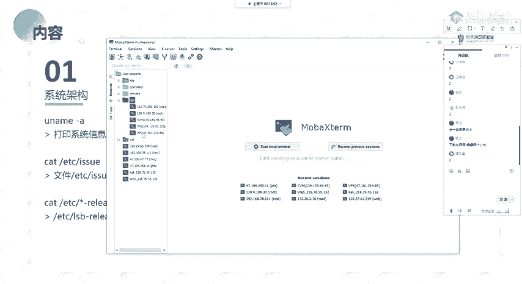

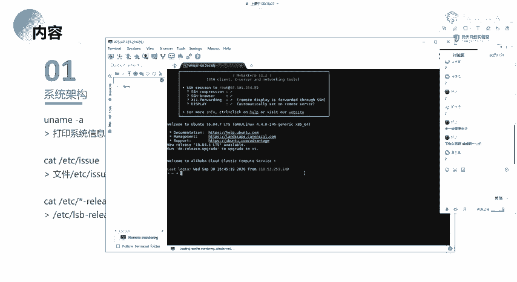

呃，Uname杠A的话，它是呃打印系统相关的一个信息啊。就我们要去查看一个linux系统，它的一个呃信息的话，我们通常都会使用这个命令。you nameU name，你直接输you name的话。

它会只是输出一个linux。然后U name杠A的话，它会输出啊，就是说相关的系统的一个信息。然后这里列这里列出来的它相关的一些信息的话，其实我们通过U name。盖H这一个呃。刚干help。

这一个命令能够知道就是说它对应的是哪一个呃哪一部分的一个内容。就是说它其实就有这么一些的一些选项，对吧？每一个选项的话，它对应的查询的一个内容的话都是不一样的。然后在这边的话。

首先第一个的话就是刚才就是列出所有的这样子的一个信息啊。然后下面这一部分的话就是分别的对应上面的一个部分的一个选项的一个输出。比如说我们用name杠S。你可以看到你U name杠S。

它输的话输出的话就是linux，对吧？也就是对应的我们这边的第一个，它这边干S的话就是con name，也就是你的一个内核名，就是你当前的一个系统，是一个linux的一个系统，对吧？

它是一个linux的一个内核。好呃，杠恩杠恩的话就是输出你的一个n name，也就是你的一个节点。就其实呃。我这边的话。我这边的话。我这边的话是使用的1个GSH啊，所以的话它没有显示全我的一个主机名。

然后这边的话这一部分其实就是我的一个node name，也就是一个节点名，就是我的一个呃主机的一个名字。然后这边杠来的话就是输出这边的一个内容，对吧？其实就是对应的我这边。K。

然后同理后面的话都是一的去进行一个对应的。然后杠A的话就是输出所有的嘛。就不你当然你要去查询你指定的一个信息的话，你不需要输出所有的对吧？

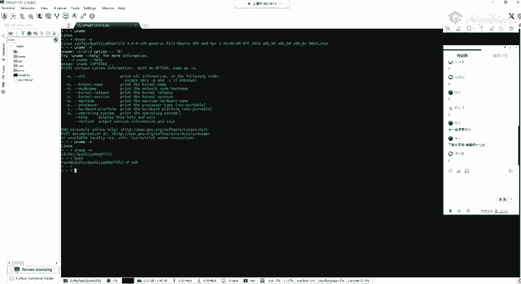

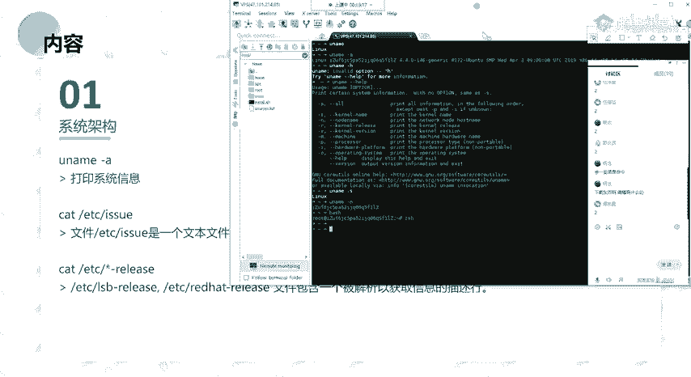

然后第二个的话就是cat啊，就是ETC的医。这个这个的话它是一个文本文件，就主要是包含要在登录提示之前打印的消息，还有系统标识。呃，这个的话。

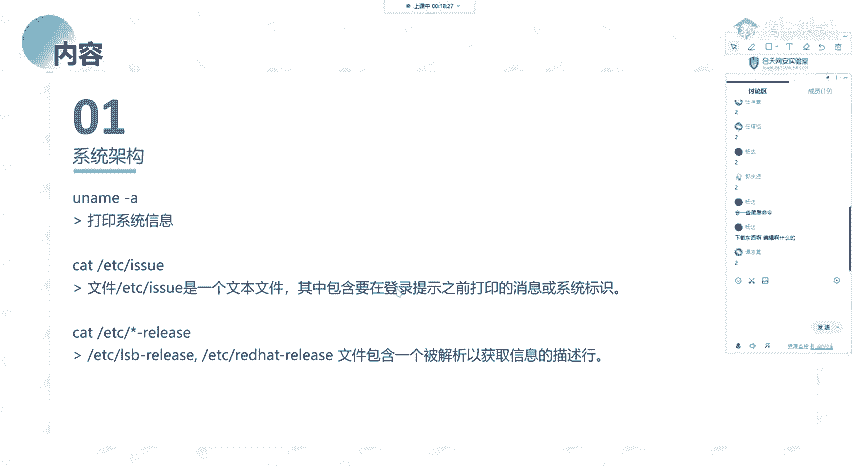

给大家介绍一下。就呃这边的话可以看到你这边输出的话，它是输出的这样子的一个内容，也就是你在呃去进行一个。登录的时候。其实我这边的话。就我这边的话原本的话输出的应该就是这一部分那一个唉。

因为这边的话我是用的这个工具，所以的话它会有加这样子的一些东西啊。就你实际去登录这样子的一个机器的话，它输出的话是会是这样子的一个东西，就是告诉你当前的一个系统的一个版本。当然的话这边的这个内容的话。

其实我们是可以改的啊，就我们可以改成我们自己想要的。也就是在登录的时候，你可以去加相应的一个东西，对吧？你也可以把它改成就是像这样子的一个内容，对吧？

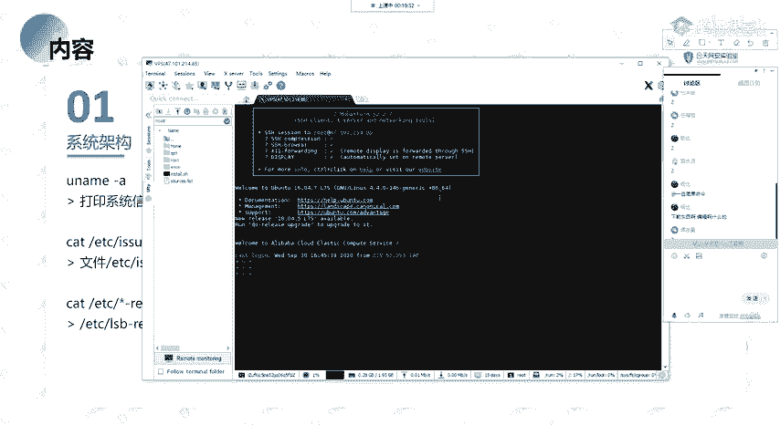

然后呃还有的话就是。呃，看。这个ETC下面的有这样子的一个文件。对吧。呃，默认的话就是在比如说低变系的，像我们的一个乌斑图啊，还有那一个呃。那个卡里对吧？他们都是低变系的这样子的一个系统。

所以所以的话这种系统的话，它它的一个它有这样子的一个文件，就ETC下面有1个LB点release的这样子的一个文件。我们想要去查看系统的它的一个信息。我们通常会去cat这1个LB。Rease。

然后在这边的话，它会显示就是你当前的一个系统啊，对吧？你的一个版本。版本。然，呃对应的就是说还有就是像red hat，也就是红帽系的。比如说s OS的这样子的一个系统。

比如说渗透20的这样子的一个系统的话，它是。

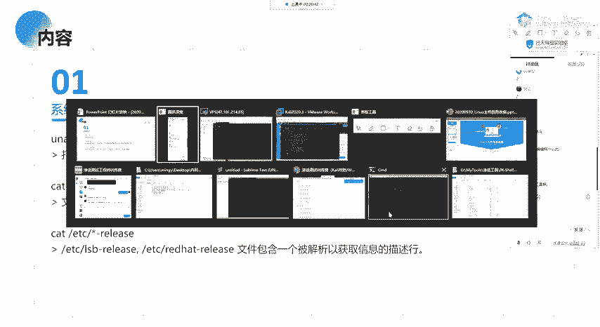

它是会有一个这样子的一个呃red hat杠release，就你可以通过就是说在这个ETC下面的一个文件，对吧？你不知道它是什么系统，你可以通过去cat这个系统下面的这样子的一个文件。

如果说有这个文件的话，那么它就是一个红帽系的就red hat啊细的这样子的一个linux的一个系统。呃。你说的是什么什么工具啊，就我现在用的这个吗？还是什么？呃，我现在用的话是这一个工具啊，就。

打开服务器显示的那个。就这个这个是一个吸有工具嘛，你说的应该就是这个啊。Hmm。这个是一个呃免费的一个工具啊，就是你在呃它支持这个系统，就windows Linux。还有麦克2手上面。

都可以使用这一个工具，就我觉得这一个工具的话是比较好用的。

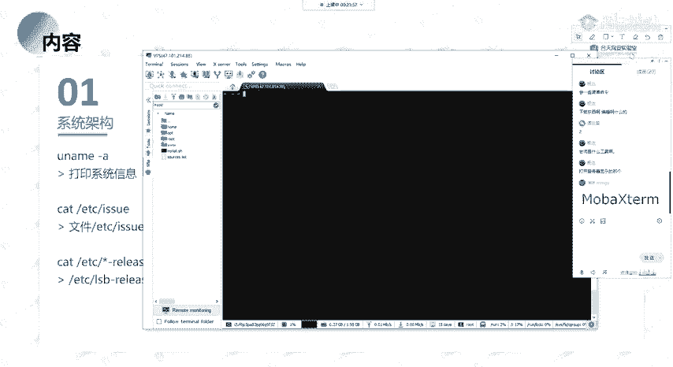

然后下面的话就是这一个呃查看linux内核的一个指定的一个版本，就是呃查看这里。这边的话我就不一的去敲了呀，然后以及还有就是它编译的像内核的这种GCC的一个版本。

以及它编译的一个实践等等的一个详细的一个信息，以及同理下面的这一个也是呃。啊，类似的。呃呃，第二个的话就是进程，就进程的话，其实是我们就是操作硬词的时候经常会去使用到的这样子的一些命令。

就说呃我们想要去查看我的一个程序，我启动之后，对吧？启动之后的话，它是启动的一个状态，以及它的一个呃启动的一个呃，它是否有没有启动，对吧？比如说我们去今贴一个端口，我们今贴一个端口的话。

它也会有这样子的一个呃。进程对吧？就是说你的这个端口它是由什么样子的一个程序去啊监听的。我们通常会去使用这样子的一个啊PS的一个命令。常用的的话是PS杠ELF还有。呃，PS杠AUX。

就我们可以列出单前的一个进程。

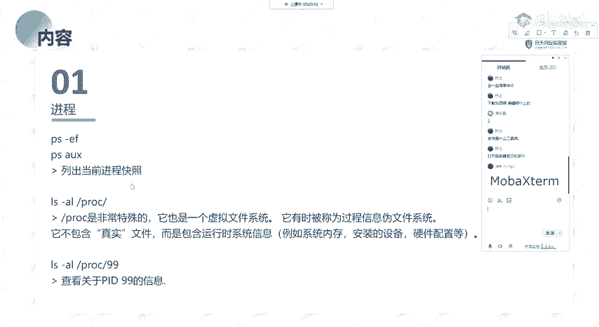

但话呃，你直接输入PS的话，它是会显示就是说你当前的这样子的一些可以使用的一个hell。Yeah。

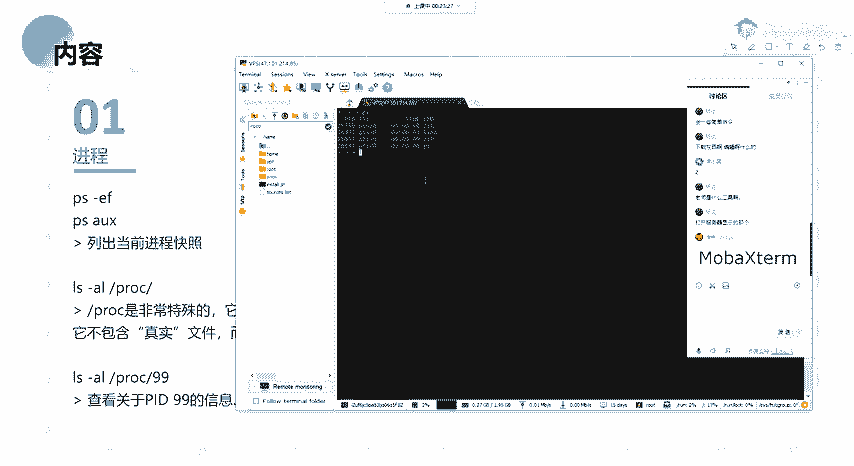

啊呃PS杠ERF。嗯。然后在这边的话，它就会输出你当前系统下面的就是呃。

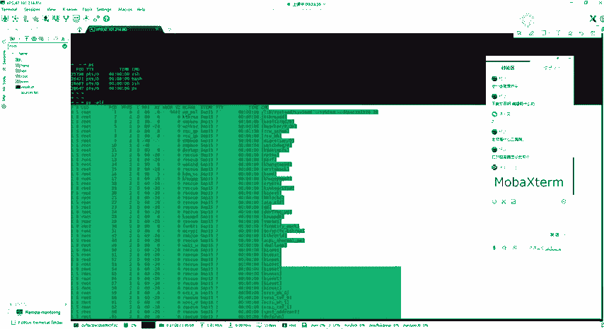

一个进程，然后它分别比如说这边。比如说我找一个就是。比如说我当前就是我当前执行的这个PS杠EF的这个命令，对吧？它同样的有这样子的一个进程。

就这个的话是它的1个ID就进程ID就是我们主要的话就关注这1个PID以及这边的1个CMD对吧？就我们想要去查找对应的一个程序，它的1个PID。因为我们要去，比如说我们要去结束这一个进程。

我们需要通过这个PID来去进行一个结束。

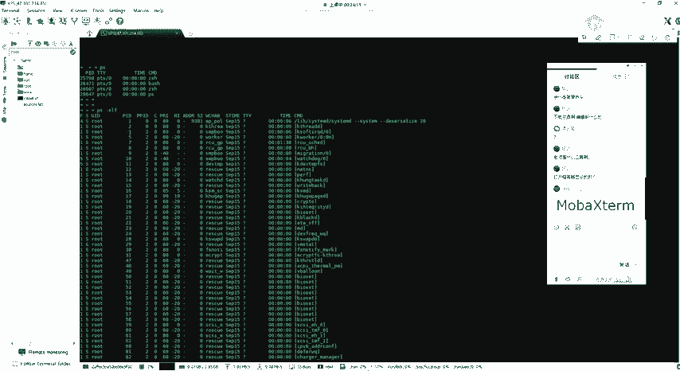

以及呃就是说可能就是你直接PS杠EF这样去打打印的话，它输出了一个信息过多，对吧？我只想要去就是说查看。就是查看我指定的一个信息。所以的话这个时候要配合我们的一个group的一个命令。

配合一个group的一个命令。就关于这个group的一个命令的话，它的功能很多啊就。很强大的一个呃工具，就是我们用用来做一个过滤筛选的。当然的话你也不一定说去刻意学，你刻意去学的话，也可以。

就是你想要对历更了解，对吧？就是方便自己的一个使用的话，你可以去具体的去学一下这个mini。然后我们常用的话就是用这个group。比如说我要去查看这里的一个。呃，SSHD。对吧我只想要去列出。

就是说包含有SSHD这样子的一个字符的这样子的一些进程，对吧？然后在这边的话就列出来了。它会去我们这边列出来的一些信息当中去匹配是否有没有这样子的1个SHD的一个呃字符。如果有的话，它就会输出来，对吧？

这样子的话就便于我们找我们就是针对性的去寻找我们想要的这样子的一些信息，对吧？以及PS杠。PS杠AX。其实呃输出的一个内容的话呃都是一样的。就是你可以去看的话，它输出的一个内容的话，对吧？

都是没有太大区别的。啊呃，第二个的话就是这个PROC的这个文件。就这个POC的这个目录的话，其实前面讲应时的目录结构的话应该有说对吧？它是一个比较特殊的一个呃目录。这个目录的话。

它是一个虚拟的一个文件系统。

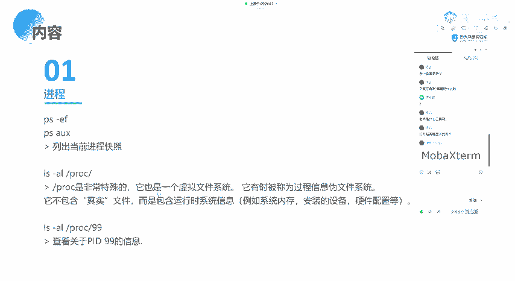

呃，在这一个目录下面的话，我们其实经常的话。我们可以看一下，在这一个幕下面的话，你L。去查看的话，你会发现有这样子的一些数字，对吧？这里的这一些数字的话，其实对应的就是我们上面的有相应的一个进程。

然后我们可以去这样子的一个进程当中去查看它里面的这样子的一个这一这一个进程所运行的相关的一些文件。的一个信息。然后其实呃。像比如说嗯。比如说我这边的话呃，我今天搞的一个就是。

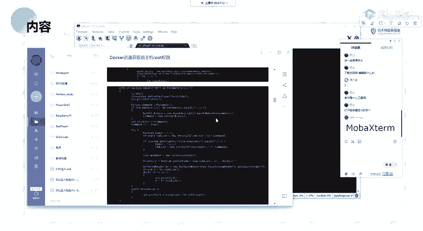

就是呃。我今天搞的这个。就是呃我们用来做作业的那个主机啊，我今天上去看的话，因为他一直发短信给我，我之前的话没去管。然后我今天的话就看了一下，看了一下他的这一个，就是他说有一个Ddoss的一个木嘛。

对吧？要让我去处理。然后我今天呃因为。给主播庆身嘛，对吧？就。就就就摸会鱼。然后就研究一下，然后就没有去弄其他的一些东西，就看看这个。然后其实在这边的话，它就有。就发现了有这样子的一个进头。

其实就是利用的那个给大家做作业的那个多壳，然后被别人中了嘛，就是中了挖矿的，他用的就是多壳的一个虚拟机的一个陶艺。然后呃。在这边的话，如果大家也去看那个的话，它会有这样子。像比如说你在阿里云上面，对吧？

阿里云上面的话，有这样子的一个原安全中心，它报的这样子的一个木马文件的一个路径，对吧？你会发现有这样子的一个东西。去讲这个好像不太好。呃。就有这样子的一个东西，就呃它会提示有这样子的一个路径，对吧？

这个路径，然后PROC就是这个目录下面，然后有这样子1个1509。对吧这个1509的话，其实就是你的这一个呃程序它的一个。ID就是你的1个PID进程ID然后的话在这个进程ID下面的话。

你可以去查看到对应的一个信息。在这边的话，它就是通过那个tom cat的那个呃管理员的一个后台的落口令，对吧？它传了这样子的一个码。

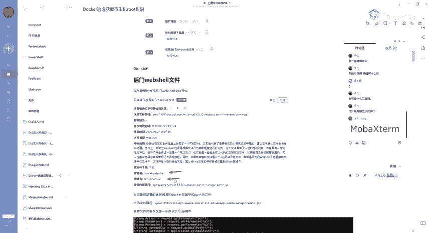

我以这一个例子。

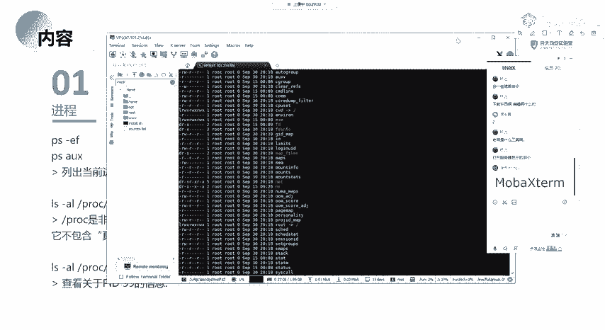

这没念。就是呃大家再去做这做做这种的话，去查找你的这个进程下面下面所运行的这样子的一个呃文件的话，因为它是一个虚拟的一个文件系统。它每一个ID它每1个进程ID它它里面会存有相应的这样子的一些文件。

就是它系统就是进程运行时候所需要的这样子的一些信息的一个文件。像比如说配置啊呃设备啊，系统的一些内存等等的这样子的一些东西。我们可以去这一个目录下面对应的一个进程ID当中去查找去查看。啊诶。

像L杠LPOC。这边的话就是查看这个PID99的一个信息，对吧？

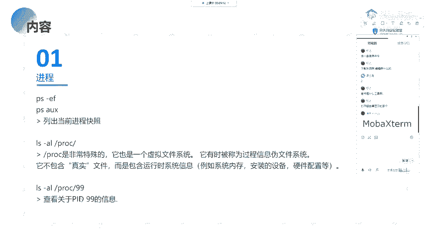

就我们可以通过这样子的一个命令。来去查看对应的这样子的一个进程。比如说这边随便找一个进程。

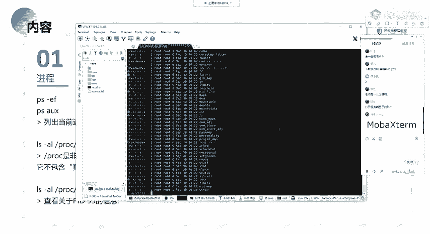

就说呃其实就是查看这一个进程ID它的里面的一个文件吧，就是详细的一个信息。是吧。呃呃，还有的就是这一个top命令。top的话就是我们如果就是就大家搞运维啊什么的，就是minux主机的相关的这样子的一些。

诶。去看去监控进程等等的。8。呃，大家有能看到吗？我这边它提示就是是断了吗？还是怎么的？没有问题是吧？好的。就是呃。经常会去使用这样子的一个top命令来去显示我们的一个inux机器的它的一个就活动。

对吧？因为它我们前面的话。什么呀？我们前面的话是通过大家能听到我声音吧，应该。能能好，那应该是没有问题啊，他这怎么报这个呢？

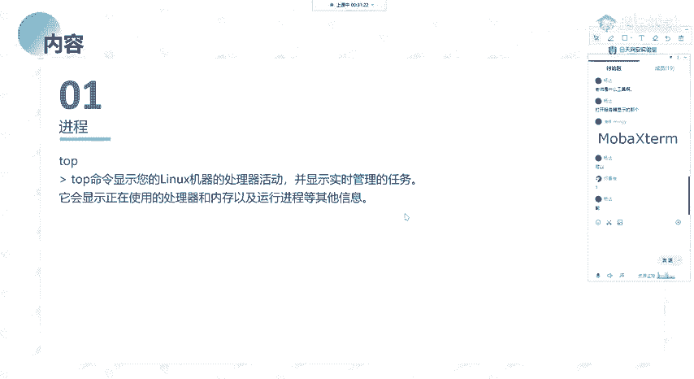

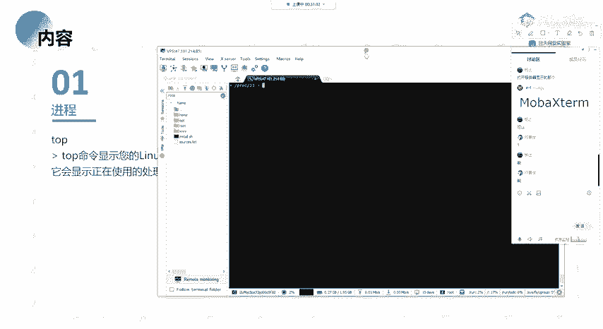

就是呃我们前面的话直接PS对吧？查看PS杠EF查看的这些信息的话，它是就是你查看的这一会，对吧？它的这样子的一些信息。然后我们使用top命令的话。

它能够去实时的去就是显示你当前的呃这里的所运行的你当前系统下面所运行的这样子的一些任务。

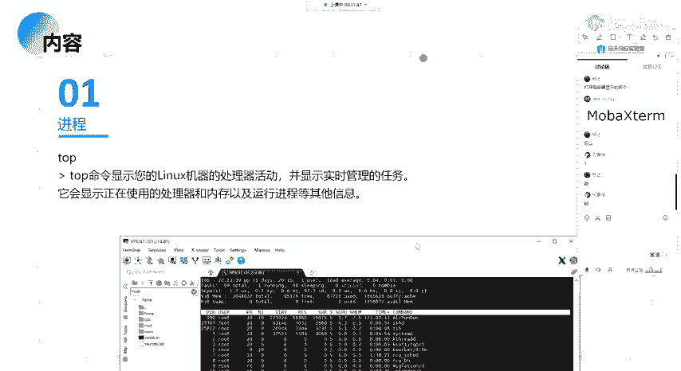

对吧它会去实时的去啊更新，以及我们可以根据就是比如说根据它的一个啊运行的一个内存，对吧？就是说它运行的一个内存的CPU的一个大小来进行一个排序，对吧？就是我们能够去找到呃当前系统下面有哪一些哪一个程序。

它所占的1个CPU是最大的，以及它的一个存储啊，对吧？然后在这边我这边话因为是一个阿里云的一个机器啊。阿里云机器的话，它有这样子的一个阿里云对啊。他是占的最多的。

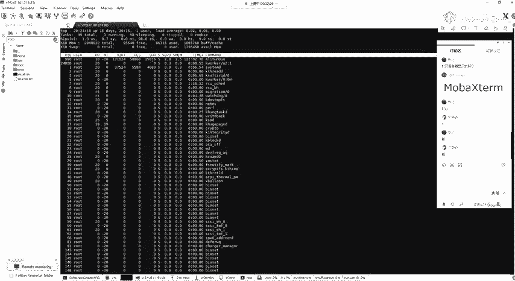

啊，关于这一个命令，它的一个详细的这样子的一个就是。

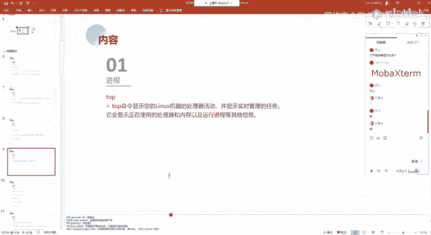

把它付出来。

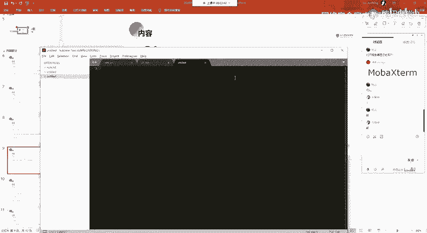

关于这个命令，它的一个详细的一个输出，我这边的话呃大概的说一下，就我们其实主要的话就关注呃。其实。如果大家不搞运维的话，对吧？其实也比较少用这个。当然的话这个命令也是常用的。

就我们只需要去关注这样子的一些信息啊。像比如说你的一个进程ID对吧？以及呃。还有CPU对吧？你CPU的一个占用的一个百分比，我们可以去查看。然后这边的话我就不一一的去说了呀。

以及还有你的这一个进程的一个优者，也就是你当前的进程的一个所有者，是吧？

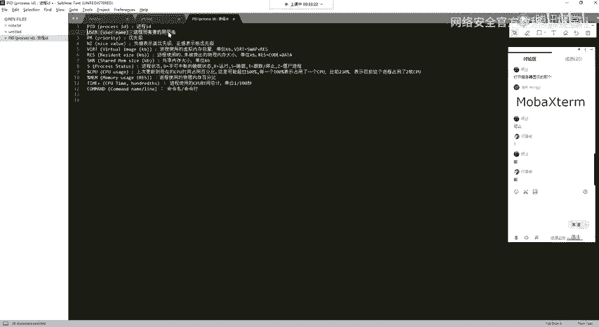

然后第三个话就是用户和主，就是呃用户信息，还有主信息。我们可以通过这样子的一些命令，就常用的1个ID。ID的话就是我们能够去查看到当前的一个用户的1个UID还还有GID。ありや。

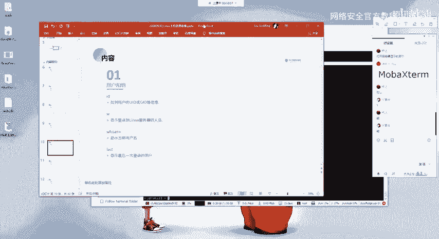

我就不全屏了，我就这样吧。比如说我输入1个ID对吧？然后在这边的话，它会显示这样子的一个信息。这里的一个信息的话，它分别的对应的就是U个ID也就是我们的一个用户ID，就是为root。

也就是我当前的一个使用的一个用户的话，就是rootGID的话就是呃主组就是表示你当前的一个用户它是处在处于什么组内，就是这里的一个root。这边的一个groups也是。啊，表示你当前所处于的一个组。

也就是root组。因为我是一个root用户嘛。当然的话如果说你是一个普通用户，像比如说你通过web share。对吧你通过web share，你得到的一个用户的一个权限，你可能是啊3W。

对吧上当的干被子，还有像阿帕奇。这样子的一个就是说这样子的一个普通的用户，像这一些用户的一个权限的话，就是你得到的。因为你是通过web share，其实你得到的一个权限的话。

就是那个web服务器的一个啊权限。这它的一个权限的话是比较低的一个权限。啊呃，W的话就是显示登录到linkux服务器的一个人人员。就比如说你当前的一个啊你当前的这一个呃机器，它是有多个。

就说有多个人去登录的对吧？那么你可以通过W来去查看到有哪哪一些用户，就哪有哪哪几个登录的一个呃连接。然后在这边的话，我们可以查看到他当前所登录的一个用户，以及呃他是从哪1个IP登录过来的。

他登录的一个时间，对吧？我们都能够去查看到。然后换卖的话，这个的话应该不用多说，对吧？windows Linuxux下面都都都可以去使用这样子一个命令来去查看当前的一个用户。呃，TTY的话。

它是一个呃怎么说呢？这个我百度一下吧。

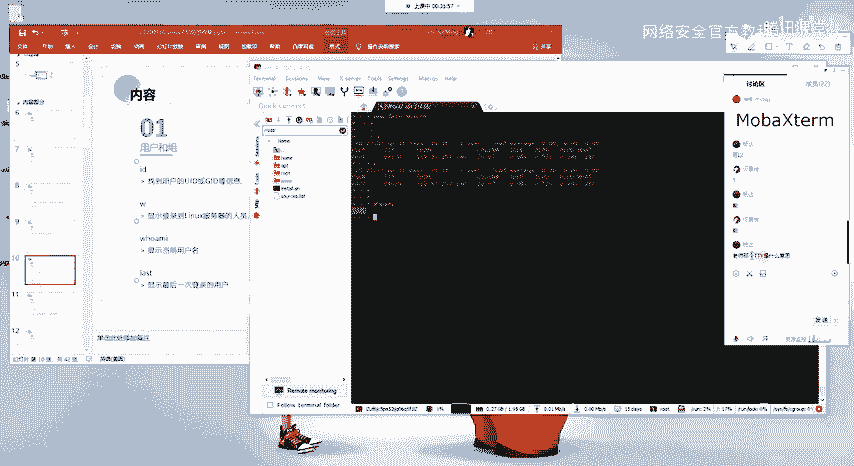

这个叫虚拟。虚拟什么。虚拟控制台。呃，关于详细的这一个的话，你呃你想要去了解的话，你去百度一下吧。好吧，因为这个东西的话，说实话我没有说很去很关注啊。呃，配置空出口就是你TTY的话，就是说大家都知道吧。

就linux系统下面的话，它有多个这样子的1个TTY的一个终端，对吧？然后的话它有每一个控制台的话，它有这样子的一个优先级吧，还是呃什么呢？说实话我比较我有点忘了，就是。

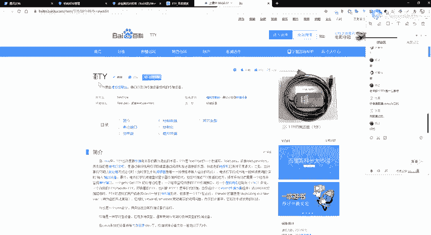

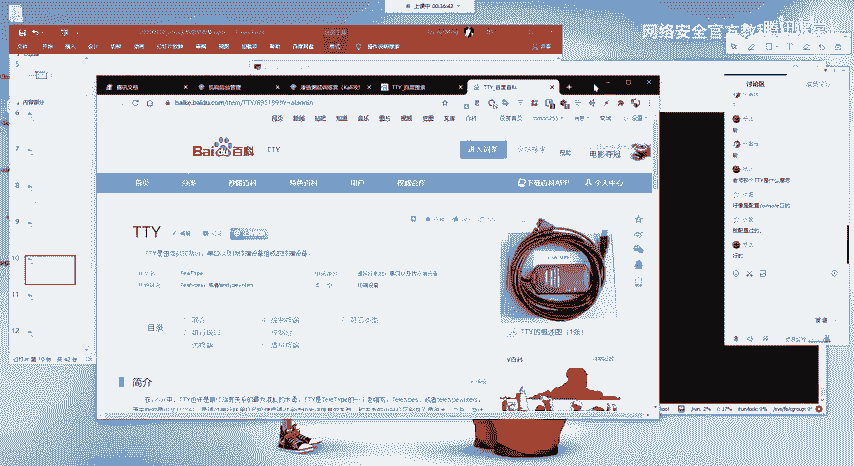

之前学金的时候，然后的话你比如说你在。呃，比如说我这边的一个卡尼的一个机器，对吧？它是有图形界面的，然后是TTY级的话，它是一个图形。

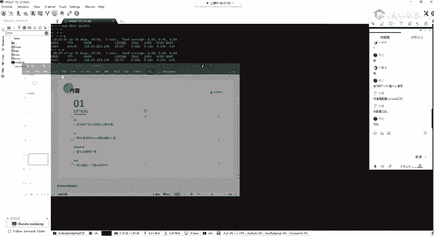

图形界面，然后的话TTY01的话，像这种的话，它是一个唉它是一个就是没有图形界面的。然后我们切的话是。

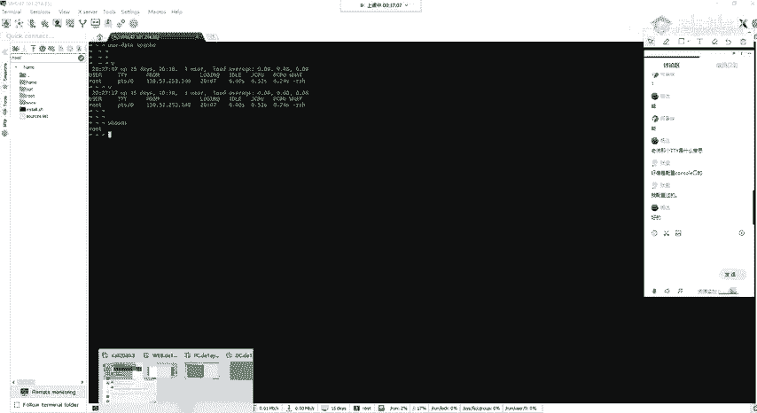

ctrorlt加F几吧。诶。锁掉了，然后可以看到我这边的话就切入到了1个TTY5啊，就是ctrl加F5的话，对吧？我ctrl加F4的话就切入到了TTY4。就它这个的话。

它的每一个它是不同的一个呃一个控制终端。然后的话。呃，它具体的一个区别的话，我我这边有点忘了呀，你要去具体的去那个了解的话，你百度一下吧，好吧。

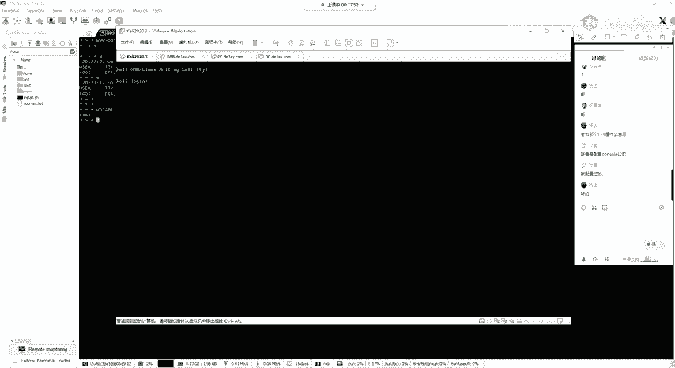

啊呃。就ctrlalF8的话就是呃TTY。F8的话就能够去切换到我们这边的一个图形界面。大家可以用自己的一个看你机器自己尝试一下。就如果说你不想要这样子的一个图形界面，对吧？

你可以直接切换切换到其他的这种TTY。然后的话你登录进去就直接就是没有图形界面，直接是一个终端的一个形式。

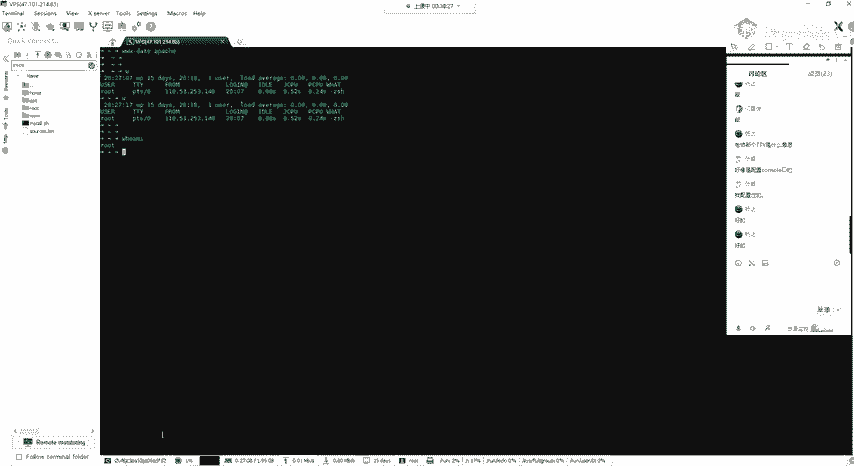

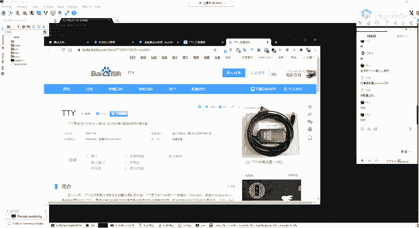

好，我们继续。呃，刚才的话讲到了换外卖换外卖这个面的话就是输出你当前的一个用户嘛，对吧？然后windows linkux下面的话都是比较通用的对吧？

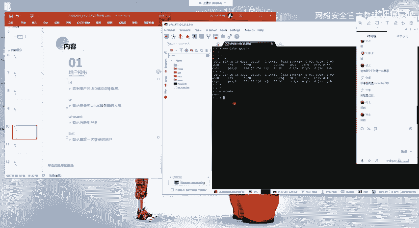

赶你外卖，哎，我这边。

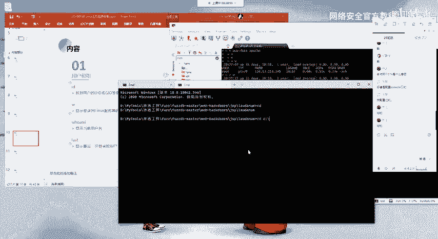

然后呃还有last last的话就是显示最后一次登录的一个用户。就是说我们通过last的话，能够去查看到呃当前的这样子的一个。

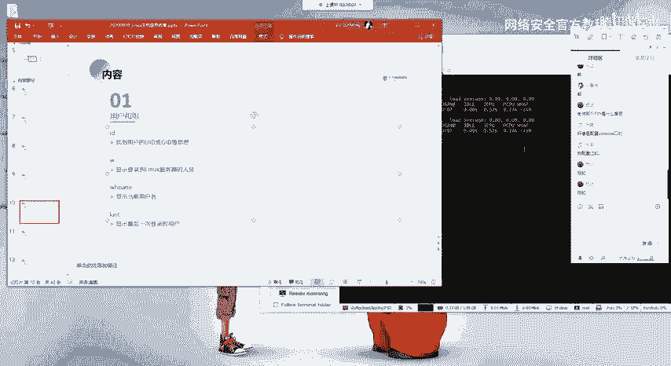

就是说当前这一个系统下面所最后登录的一个用户，在这边它会显示，就是说呃登录的一个记录啊，我们通过拉s的话能够查看到就是。

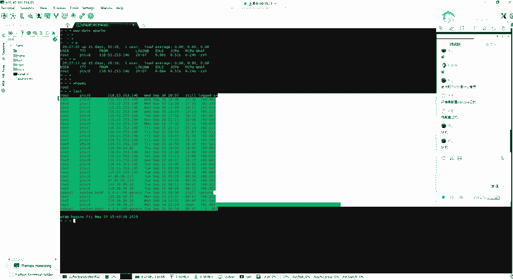

。呃，比如说。比如说呃因为我这边的话是只有我一个人在用，就是使用的一个root的一个用户登录的。然后在这边的话，我们可以看到就是这一个root用户他是在什么时候去登录的。

以及他是从什么样子的1个IP登录的对吧？他我们都能够去查看到，以及在这边的一个时间，就他是什么时候登录的，对吧？就我们可以通过las的命令来去查看，就说这一个系统它的一个root用户。

他是呃什么时候登录的。

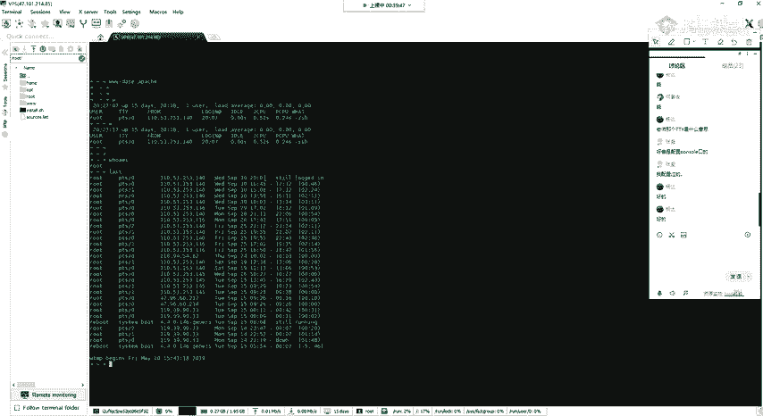

或者说他是。就能够去确定这个系统它的一个管理员，对吧？它是是不是有在登录。以及他最后登录的一个时间。然呃，lastloglast log的话就是打印我们上次登录的一个日志。我们直接执行之后的话。

它会在这边的话，它会输出就是呃这样子的一个一些信息啊。这边的一个信息的话应该啊比较好理解，对吧？在这里的话，因为只有一个ro者用户啊，然后我们可以看到在这里就是他登录的一个呃信息。对吧。然后在这的话。

我们可以看到是我这边是从这个IP过来的，登录过来的。嗯。然后登录的一个时间。然后呃还有其他的这样子的一些，就这边的话是其他的一些用户啊。

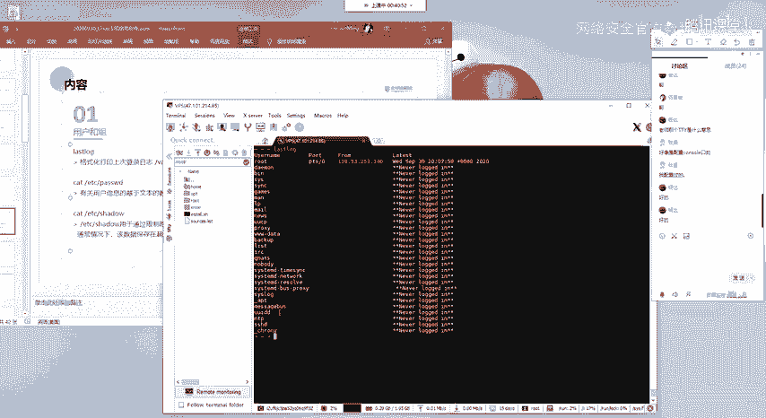

Hm。对吧我们通过就是CAT下面的一个password。在这个文件的话，我们能够去找到查找到就是对应的有哪一些用户嘛，这些系统的一些用户是吧？然后如果说比如说你有一个普通的一个用户。

然后的话你用普通的一个用户，你去进行一个登录。登录之后的话，他同样的会在这边有记录，就是说你这个用户，他是什么时候登录的，他从哪里登录过来的对吧？然后像在这边的话，因为我只登录了一个root用户。

其他用户其他的这些是一个内置的一些用户啊，他其实也是他是不允许去登录的对吧？它是low log，就这边的一个伴的话，它是一个 no log的话，就是说表示这一个用户它是无法去进行一个登录的。

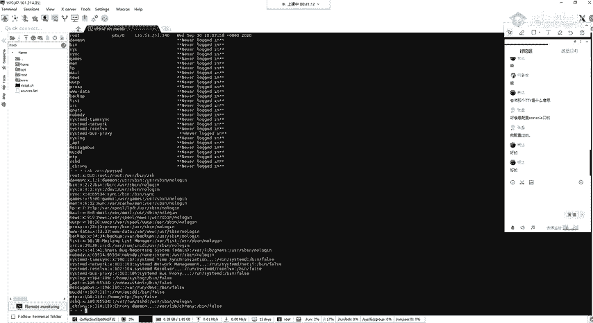

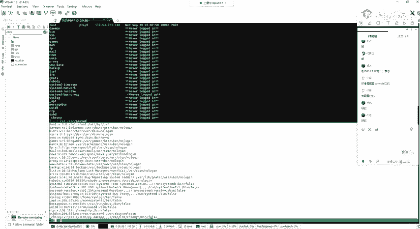

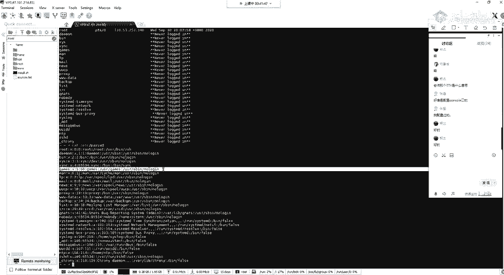

但是的话，因为他这种内置用户的话，他有。它有相应的一个作用，对吧？如果大家看自己的一个机器，有这种普通用户的话，也会有这样。你有登录过的话，他会有这样子的一个登录的一个记录。

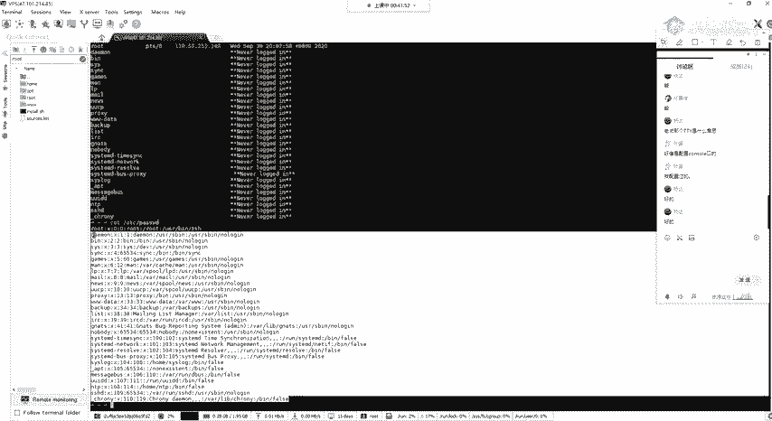

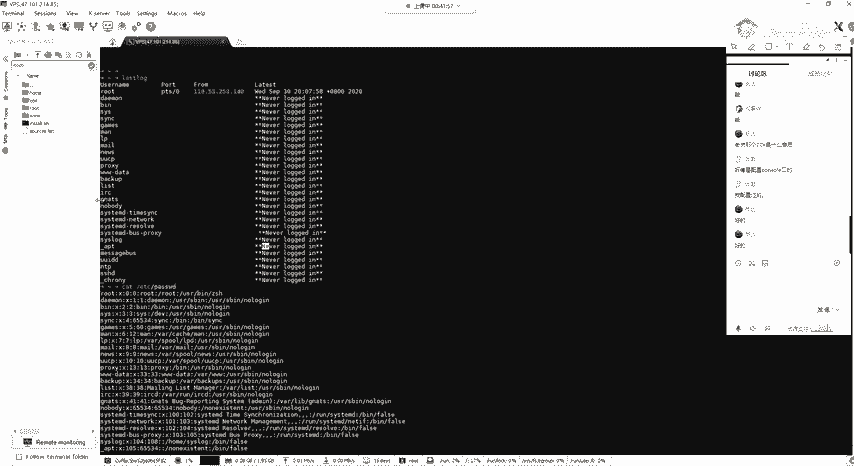

我们可以通过这个命令去查看。哦，呃。

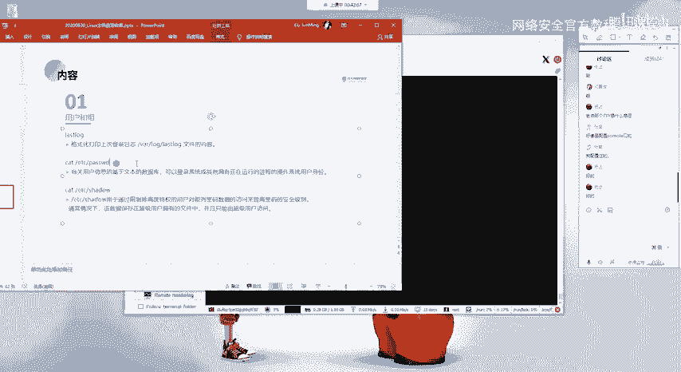

还有的话就是这个ETC passwordsword刚刚也说了，对吧？这个文这个password这一个文件的话，它里面的是存储的当前系统下面的所有的一个用户的一个信息。呃，关于这个的话，我大概的说一下吧。

就这一个文件就在后面应该也会讲，就这个ETC password word这一个文件里面的话，它存储的当前系统所有的一个用户。我们这边的话以这一个ro用户为例。

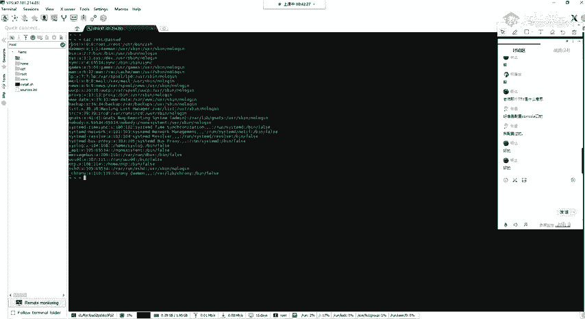

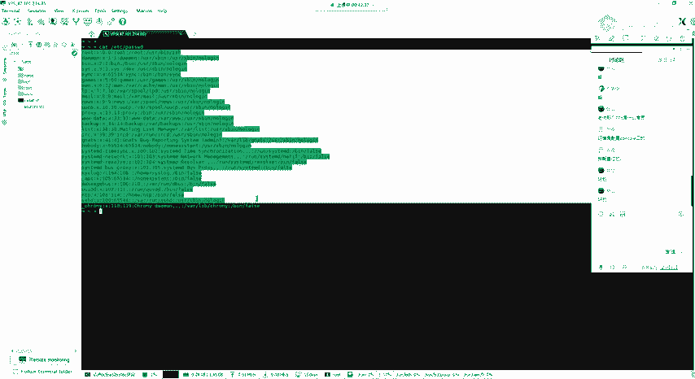

这首先第一个的话注意的话，它是每一个每一个。就每一部分的一个内容，它都是以这一个冒号去做一个分隔的。然后在这边的话是露腿这一个用户。第二个的话。就是一个X这边的一个X的话，其实是一个就是占位符。

就它这边表示的话，就是说它原本的一个意思的话，其实就是说在之前的话，在之前没有采用这样子一个模式的话，在这边它是一个用户密码的一个哈希值。就这边的话是保存的一个用户的一个密码。然后在这边用X去代替的话。

就是我们后面的新的这样子的一个系系统的话，它是它的一个用户名用户的一个密码的话，它不是存储在这样子的1个ETC passwordsword的一个目录下面的。就为什么它不存在这个目录下面呢？

我们可以通过LS杠L来查看一下这一个。文件啊这个文件它的一个权限。其实我们在这边的话可以看到这个文件，它的一个权限的话，它是呃。主要的话看这里。这边的啊啊的话就是表示读嘛，读取嘛。

就这边的这一串的一个权限的意思的话就表示其他的一个任何用户，就除了root用户的其他任何用户，他都有一个读的权限，对吧？那么就是说如果说你是一个普通的用户，你是一个最低权限的一个用户。

只要你是一个用户的话，他都能够去读取读取这个文件的一个内容。那么如果说我们的一个密码哈希存储在这一个文件当中的话，普通用户他同样的也能够去查看到他的一个哈希值，对吧？

那么如果说他的一个哈希值能够去能够去被解密的话，那么那么我们就能够去得到相应的一个用户的一个呃权限。第二部分是同组用户的一个权限嘛。你是说到这里吗，对吧？呃，前面在讲linux的时候，不是有给大家讲吗？

讲。讲那个环境的时候呃，讲那个linux环境的一个搭建，对吧？啊，我你进来Y的话，我再说一下吧，就是。这个的话这一个权限的。这里的这个权限的话，应该其实大部分学年龄时的话都呃。

可能都刚开始接触的话都会比较迷啊，对吧？就是对这里的这一串东西，它是什么，对吧？P。

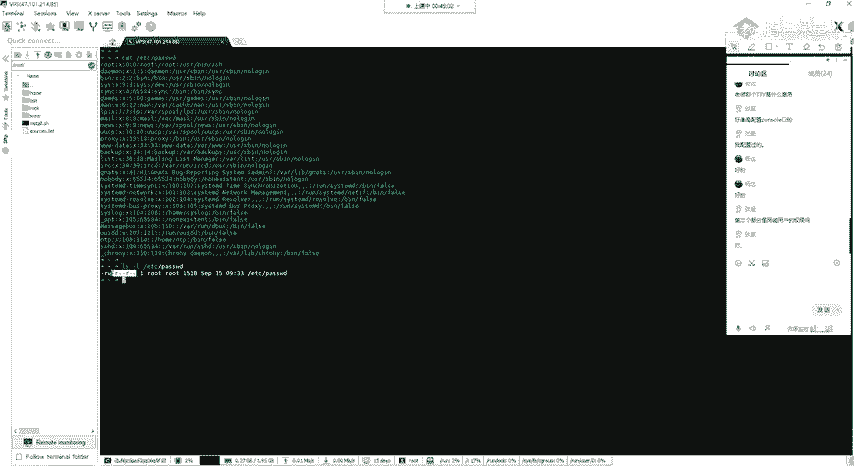

这边的话我再给大家，就是既然有人问的话，我就给大家再解释一下吧，好吧。那你你知道就是77770075，它是什么意思吗？对吧？你首先你需要知道嘛，对吧？好，哦，在这边我以这一个为例，对吧？我们唉。

这边不对，还有个啊。前面还有个干。我这边的话我们看一下，应该看得到这边的这一个群这边的话就是我们去查看我们的一个文件的话，它都会有这样子的一个东西，对吧？就都有前面这样子的一串。

那这一串它表示什么意思呢？就是表示我们的一个权限。

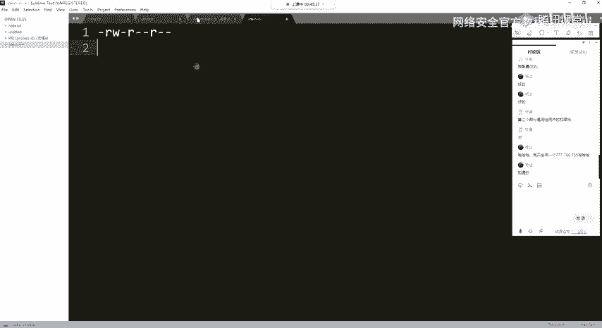

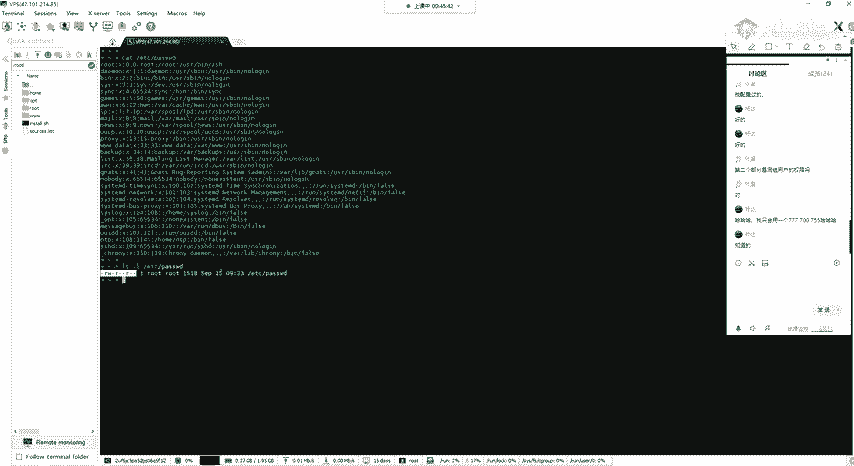

然后呃在这边看，比如说我们是一个rootroro对吧？是一个test的文件。那么这一个test的文件，我们怎么知道它是一个文件呢？我们看的话就是看到它的第一位。

就这边的第一位的话就是表示我们当前的这个呃当前的这个东西它是什么样子的，它是一个什么东西，对吧？它可能是一个文件，对吧？它可能是一个目录，还有它可能是一些啊设备文件，对吧？那么在这边的话。

我们通过查看这里的这一个就是第一第一部分的这一个东西来去判断这边前面这里的一个干的话，就是表示它是一个文件，也就是表示我们这边t的是一个文件，如果是常用的，像比如说有个D，对吧？

那么就表示我们这个是一个目录。

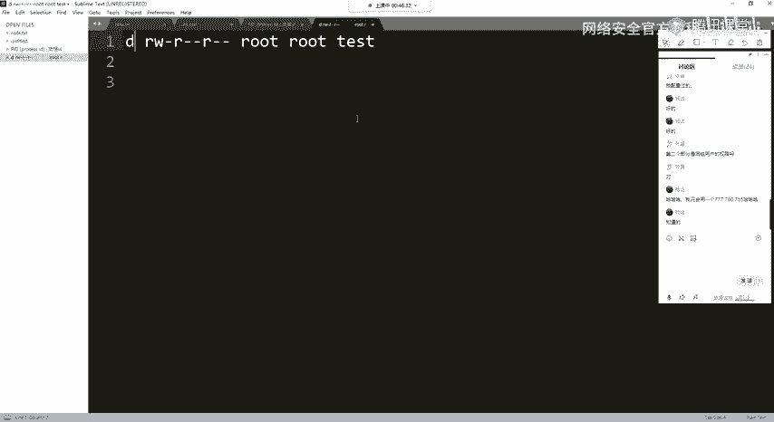

我们找一个目录来看一下，好吧。比如说就ETC这个目录，对吧？可以看到这边的话，它就是一个D开头的啊，我们要去查看目录的话，在这边也提一下，就我们要去查看目录的话，就是你LOS你要去查看目录的一个信息。

要加这个杠低的一个参数。其实D的话就大家学lins不要去死学，就是要活活学啊，其实这些命令的话，其实命令的一些参数的话都是很容易记的。就是你要当然话你需要有相应的一个linux的一个啊。

不啊英文的一个基础啊，一些基本的一个英文的话，大家。都是就是九年硬务教的话都能够懂的对吧？然后这边的一个D的话，其实就是表示我们的一个目录就是dlecty。就是目录的一个意思。

以及DIR其实也是就是directory的前面的就是目录的一个那个那个那个前面的三个字母嘛，对吧？然后这边的话就是第一的话就是表示啊。表示目录啊，就我们这边指定一个杠D的话。

就是表示我们要查看的一个信息的话，就是一个目录的一个信息。那不然的话，你L杠L的话，你查看的是啊这个ETC这个目录下面的一个文件，对吧？它的一个信息。

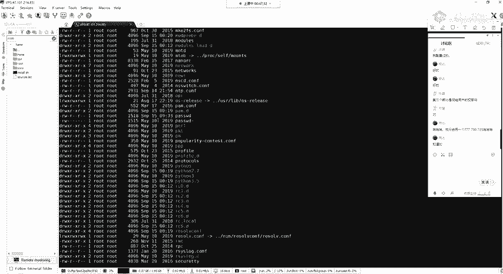

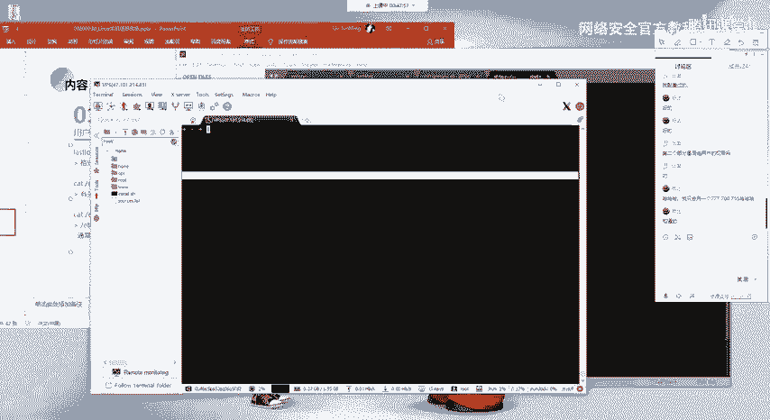

好，呃，我们讲了第一位。那么第二后面的这里后面的这这一部分的话，我们把它分成三部分。这三部分的话就分别对应的就是。首先第一部分就是我们的一个用户。啊，应该是说所有者吧。小鸭走。就说表示我们这一个文件。

它的一个所有者是哪一个？就是说我们创建一个文件，我们以什么样子的一个用户去创建一个文件的话，他这边的一个所有者的话，就是你的这一个当前的一个用户。然，后面这个的话就是所有组。就是。就是说你的。呃。

这里的这个文件它是这里的这个文件，它是属于什么样组的，属于哪一个组的一个用户。然后在这边讲到所有组的话，就是说。啊，等会儿再讲吧，这边的话就是其他就是阿着。OTHER就阿着其他用户。啊。

呃所有者的话就是U嘛，对吧？就是U着就是表示U者。然后所有组的话就是主的话就是gve，就是表示G，对吧？所以其实我们再去用t mode来去进行一个呃就是权限的一个。呃，修改的话会有这样子的一个U加X。

对吧？或者是U减X。这个的话就是表示你的一个所有者。他会去给一个X的一个权限，也就是执行的一个权限嘛，是吧？减的话就是把它的一个执行权限去除掉。然后分别对应的这边的一个，比如说这边的一个所有者。

就是表示你当前的一个文件，所有者它的一个权限。然后这边的话RW就是完整的一个权限的话，就是呃RWX嘛，对吧？就是读取写入执行的一个权限。读取就是R就是绿的。写的话就是。P。X的话就是呃。XQ的吧。

应该是。执行。然后呃对应的在这边的话，就是你有有这一个位的话，就是有一个R位的话，就是表示你这边的呃所有者，也就是这个root用户，它有一个读取的一个权限。有W的话就是有一个写的权限。

然后在这边一个横杠的话就是表示它没有这一个权限，也就是相对应的这边它是没有一个写的一个权限。然后呃同理所有组的话，就所有组的话，就我们每一个用户的话，它都有相对应的一个组啊。

就是这里的一个组的话就表示比如说我是一个root组，然后我有一个用户，我是一个。啊。tom用户。然后的话这个tm用户的话，他呃。我把它这一个tom用户，它加到一个root组当中，对吧？

那么在这一个root组当中，如果说比如说这一个文件，这个文件的话，它的一个root组的一个权限啊，这个这个它的一个root组的一个权限是R，对吧？那么这一个文件就说在这一个本来它是一个普通用户，对吧？

它一个普通用户它在root组的话，它这一个普通用户，它同样的可以对这一个文件有一个读的一个权限，因为它是属于一个root组。如果说在这个肉ot组当中有。W的权限话就是可以对它进行一个写入啊吧。

而阿着其他用户的话，这边的话就是O嘛。然的话表示阿着其他用户的话就是表示除了ro。对一个用户的话，像比如说我你自己创建的一个用户，叫普通用户part你你这一个普通用户的话，它不在root组当中。

它也不是root用户，它属于一个其他的一个用户。那么这个其他用户的话，他在这边的话就是对应的这边的一个权限。像比如说这边他其他用户的话，只可以对这个文件有一个写的一个啊，不有一个读的一个权限，对吧？

那么就是说你不是root用户，他同样的能够去对这个用户对这个文件去进行一个读取。嗯。以及还有的话就是这位同学他说的这样子的一个数字的一个表示。就如果你刚接触电0时的话，你可能不明白像这种777对吧？

你可能你全帽。呃，755。对吧2死的。这样子的一个文件，你给这个文件要付1个75的一个权限。那么这个75的一个权限对应的它的一个就是说对应的这样子的一个权限呢是什么呢？就是我们知道这边的1个RWX对吧？

RWX的话，它对应的这样子的一个权限的一个数字的话就是4。呃。421。呃，十24十2页吧。442424421吧，我没记错吧。啊，没错没错。就是呃对应的就是421。

然后的话如果说我们这边比如说我们这边对吧？我们要去表示这边它的一个权限，用数字的话去怎么表示呢？就R的话对应的是4嘛，对吧？就是4嘛，然后W的话对应的2就是4加2嘛，也是也就是表示这边的话是6嘛。

这边的这一个就是6嘛，然后从你这边RW也是6嘛，然后这边R的话就是4嘛，对吧？加法应该能算嘛。所以的话这边的它的一个权限的话，就是1个664的一个权限，如果说我们想要给这个文件付一个这样子的一个权限。

那么我们就可以通过。个冒的。加这个664。然后指定这一个t的文件就能够给到赋予这样子一个权限。就同理比如说这边755，对吧？我知道它是1个755，那么它对应的一个权限是什么呢？对吧？

七的话就是表示所有的就所有它。RWX它都有这样的一个权限。因为我们RWX加起来421加起来就是7嘛，最大的话就是7。对吧其实也就是说这边的话就是RWX的一个权限。五的话就是五的话就是4加1嘛，对吧？

其实总共的话就这样子的组合嘛，就是。呃。一对吧。啊。44加24加12加1这样子的一个加嘛，还有的话就是124嘛。当然的话其实我们常用的就是这样子的一些组合。这边我的话就是表示呃R杠X对吧？就是。

🎼有读取游戏执行的一个权限，同你这边的话也是R杠X。就是对应的。

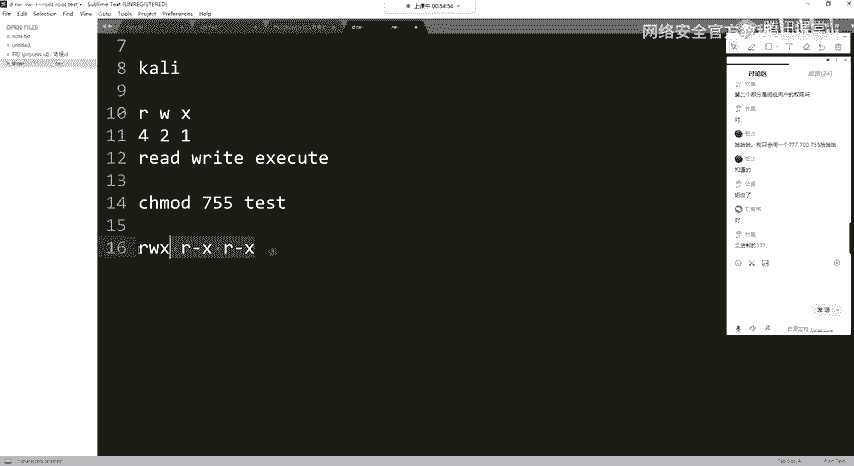

嗯。我这样讲应该能清楚吧。

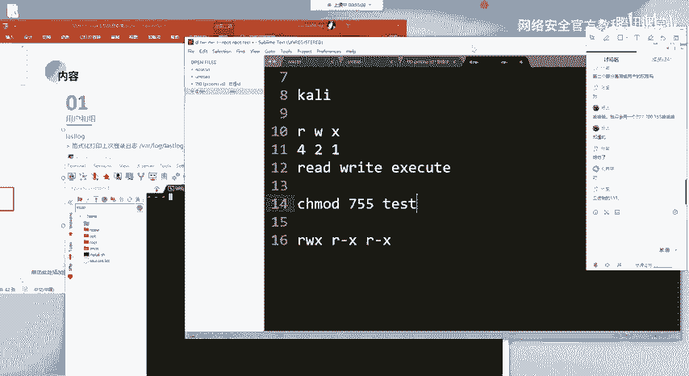

能理解吧，如果这样讲还有问题的话，那那不应该啊。我个人觉得是讲的很详细了，就是关于这个权限的话啊这一块。就大家这这里的话，这种东西的话自己用多了话就很熟了，就会。

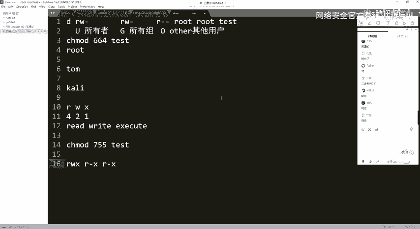

好，那么我们。呃，休息一会儿吧，现在已经。中间休息5分钟吧，就呃503分钟，50的时候的话，我再开。

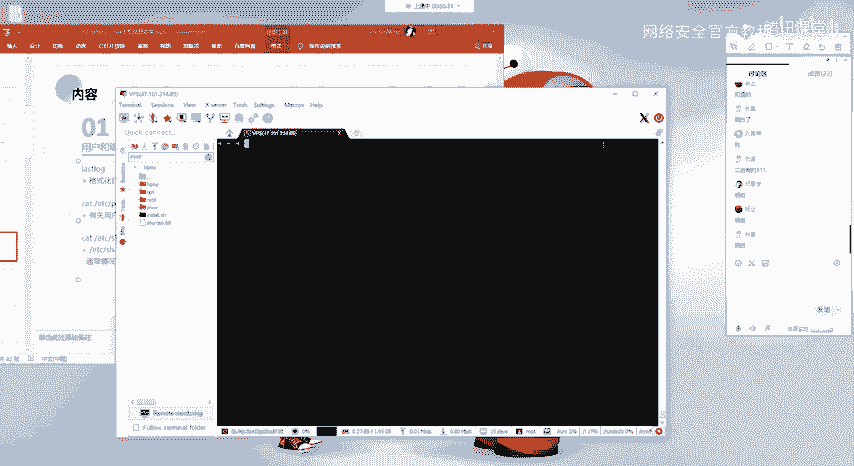

好吧。

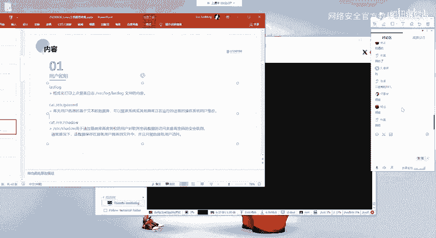

啊，先下下下会儿下。

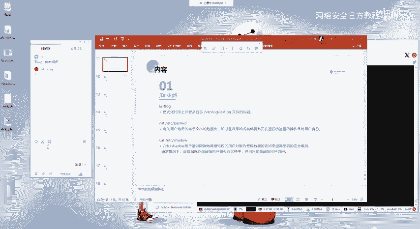