# B站最全网络安全教程，整整1300集，全程干货无废话，别再盲目自学了，看完学不会我退出网安圈！（web安全｜渗透测试｜内网渗透｜CTF） - P81：80. 第二十八天：Windows系统下的文件传输.mp4 - 网络安全官方教程 - BV15u4y137cQ

Yeah。

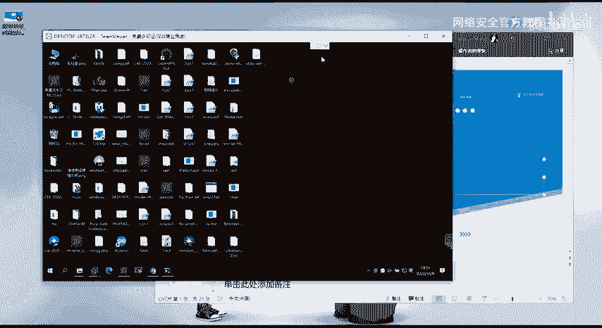

Okay。🎼没爱。🎼传重钟声不停。The。我法。So。🎼笔下谎。🎼花的月。🎼心间天。🎼的远。🎼是你。🎼我不会。🎼当初。🎼如今。🎼长不。🎼埋头天。🎼命中最。🎼Thank you。🎼是你。🎼是。う。🎼不是。

🎼去。🎼忍不住花生雨。🎼不值得。🎼え？🎼你这样。🎼我自由。🎼然后。🎼年少时不见。🎼爱过的。🎼承诺。🎼我在。🎼周而复始。🎼结局还。是。🎼是。🎼去你。🎼不中。🎼一说话。的月。有今天。🎼为何。🎼想。🎼眉头见。

🎼命中起。🎼Yeah。やか。🎼。🎼写不出化身一条固执的鱼。🎼你这要流。🎼自由到底。🎼年少时故。🎼惩罚过的。🎼沉默的沉默在。😔，神。系你。🎼一手逞墙，写下信房，褪去对时间。😔，🎼的去。🎼我去。🎼都想。

🎼与你分享在那个市窗说了个好。😔，🎼爱上头。🎼不承认性。😔，🎼一圈，眼泪发烫。😔，🎼浑身是伤。😔，🎼如何挂断？🎼爱只能少多坎坷。🎼爱敢涸。🎼懂着伤心和去走。😔，🎼什么歌？🎼拉扯。🎼这是我为你写的句。

🎼是现在只有。🎼看记得起爱的人。🎼我风。🎼时间在最最。🎼于是。🎼是。🎼的残忍，缠担心就脆。🎼给你什么只有一首情歌只要。🎼曾知的事心多吗？🎼却再多情了。🎼再经。🎼失去你。🎼以后。有什么。😔，🎼是。

🎼当爱上场。🎼不知任谁开了一枪。😔，🎼在发烫。🎼浑身失色，有人会过断爱。🎼能想。🎼不可。🎼爱敢涸，等着伤心和。😊，🎼是。🎼为。🎼这是。🎼为你写的所有一些情歌只要。😊，🎼记得曾爱的。🎼一吹。

When네에서。🎼Yeah。🎼。如果。多不不不多。🎼，かか。🎼月明星稀。🎼拂去沉意。😔，🎼遥望天地。🎼好似你的。🎼没雨。🎼清风起扇起涟漪。🎼是谁？🎼动情雨。🎼将往昔当作秘密。🤧hello，大家晚上好。

😊，呃，能听到我声音的已经能够看得清我呃。画面的同学在讨论区扣个一。不。Okay。好的，呃，应该都能都能够听清，都能够看到。啊嗯。那么其他的也不多说，我们正式开始我们今天的一个课程内容。

今天的话给大家介绍的是一个内网文件传输，然后主要的话介绍这3块内容。呃，分别的话就是第一块的话就是在windows系统下面的一个内网文件的一个传输的一些方法的一个介绍。

第2块的话就是lininux系统下面的。然后以及第3块的话就是一些脚本语言相关的一个呃文件的一个下载。首先我们先来了解一下第一块的一个windows系统下面的内网文件传输。

第一个就是FTP呃不知道大家对FTP有没有了解。我不知道大家对FTD有没有了解，就是有知道这一个东西它是什么，以及怎么去进行一个使用吗？嗯。呃，知道的扣1。不知要扣2。是。Yeah。

用插有用过叉FTP呃，这个的话。呃，也算就是叉FTP的话，它其实也是一个呃就是FTP的这样子的一个协议。就是说它是一个呃文件传输协议。然后在这边的话，它是一个就是。我们这边的话。啊，对。

就是文件传输协议。我们在这边的话，我们就使用这1个FTP。因为我们要做的要达到的一个目的的话，就是进行一个文件的一个传输，对吧？那么我们在这边的话就可以利用呃这边的1个FTP的一个文件传输协议。

然后在windows系统下面的话，大家其实可以打开CMD。呃，在windows系windows系统下面的话，应该是呃自带的有这样子的1个FTP的一个客户端的。就是。嗯对。

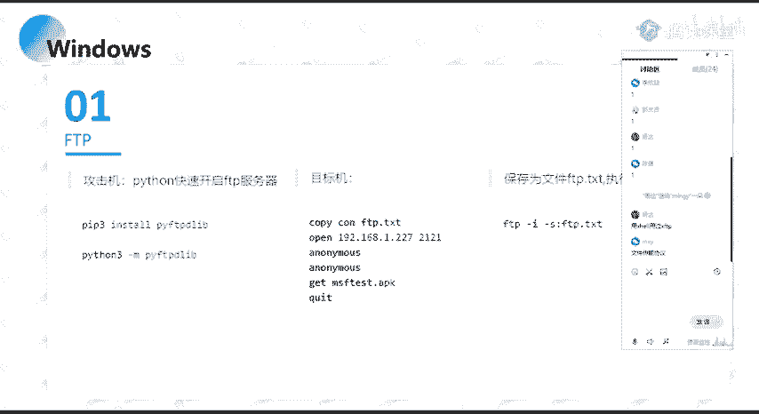

就是你打开1个sD的话，你输入FPP。对吧你就能够有这样子的一个客户端。然后在这边的话，这个FTP的这一个命令的话，它其实是一个命令啊。这个命令的话，它是windows系统里面的话都自带有的。

就默认有的。它是它的一个作用就是将文件传送到运行FTP服务器的一个服务计算机上面。

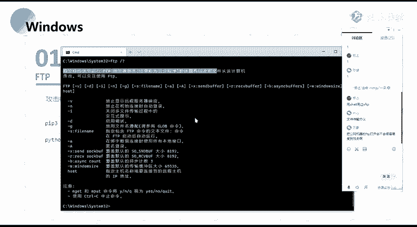

嗯。把官网G器S0给打开呃，你的STP的话，因为。嗯。比较容易受到攻击。就是说你的1个FTP的话，如果说你没有去设置你的一个就是认证就是账号密码的，你允许他去进行一个匿名匿名登录的话，那么就是啊。

工击者他只要知道了你这一个机器的话，开放了FTP的这样子的一个呃协议的话，他可以直接去登录到你的一个机器嘛。然后的话还有就是你的1个FTP的一个目录的话，需要做一个比较好的一个权限控制。

就是说如果说你虽然你设置了密码，对吧？你设置了你的一个用户名密码，但是攻击者他可以通过FTP的一个爆破，对对你的一个机器上面的1个FTP的一个呃协议去进行一个爆破。如果爆破成功之后的话。

它可以直接就是访问到你的1个FTB的一个目录，对吧？那么这个时候的话，如果你的这个呃FTP的这一个目录的话，它是能够去进行一个有读取写入的一个权限，或者是说执行的一个权限的话。

那么它可以把自己的一个呃恶意文件，对吧？上传到你的一个机器上面，然后去执行来访他线。然后呃在这边的话，我们就是使用的呃，我在这边的话是首先的话是这样子的一个流程。就首先第一步的话。

我们在攻击机上面用pathon的话，快速开启1个STB的一个服务器。然后使呃使用到的所使用到的话是这个PYFTPD的libb的这样子的一个呃库。这个库的话呃默认的话它是没有安装的。

我们可以通过PIP去进行一个安装。然后的话使用python3-M指定这样子的一个呃模块。然后的话就能够去开启1个STP的一个服务器。然后第二步的话就是在目标机上面，我们需要去写入这样子的一个脚本。

这里的一个脚本的话，我们来看一下。首先第一行的话就是通过这边的一个copy呃copy的这一个命令，把我们下面要写入的这样子的一些呃语句，把它给写入到这个FTP点texax的一个文件当中。

然后我们写入到这个FTP点tex文件之后的话，我们。就是它会保存为这样子的一个FDP点t文件嘛。然后的话我们就可以去通过FTP杠杠S指定的一个太文件，也就是保存的这边这一个脚本内容的这个文件。

然后的话就能够去自动的去下载我们这边所指定的一个呃文件，然后我在这边的话是呃随便的写了这样子的一个点APK的一个文件，对吧？然后的话实际的话我们实际实际去使用的话。

就是说我们已经得到了就是说它的我们要去进行这样子的一个操作的一个前提，对吧？就是说我已经得到了有一个某一个机器，它的一个呃hell。然后的话我想要去访他一个hell。

就是说我需要去上传我的一个木马的一个文件，对吧？或者说上传我的一个码。然后的话我要上传码的话，我需要把我的一个文件，把它给上传到我的一个目标机器上面去，对吧？然后在这边的话，我们就可以通过FTP的这里。

ge子来获取我们在公积机上面呃FFTP服务器上面所存放的这样子的一个木马文件。然的话下载到这一个呃目标机器上面去进行一个执行。好，呃，这边的话我们来看一下。

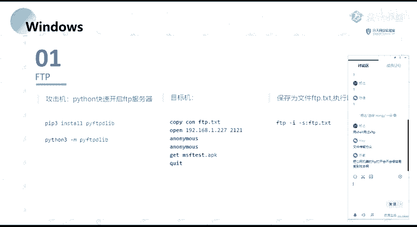

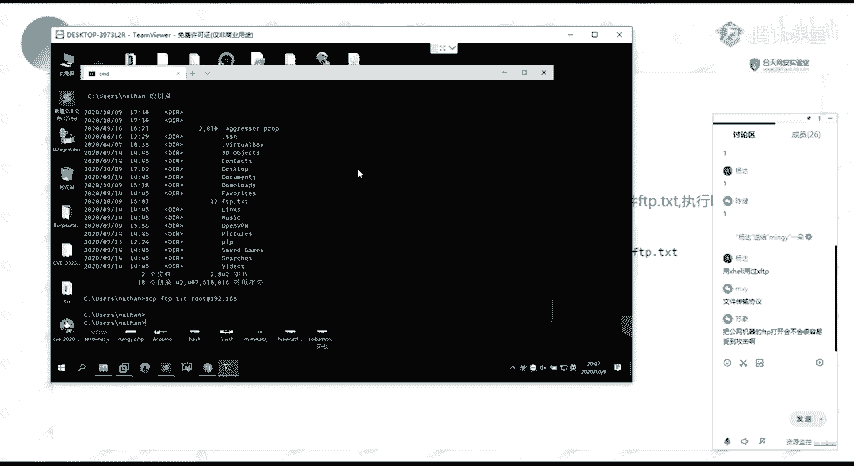

呃，首先的话就是说呃我这边的话，我就不去就是说做前面的那一个拿希尔的那一个操作啊。就是说我们拿到那个需尔之后的话，我们就可以去执行相应的一些命令，对吧？然后的话我在这边的话。

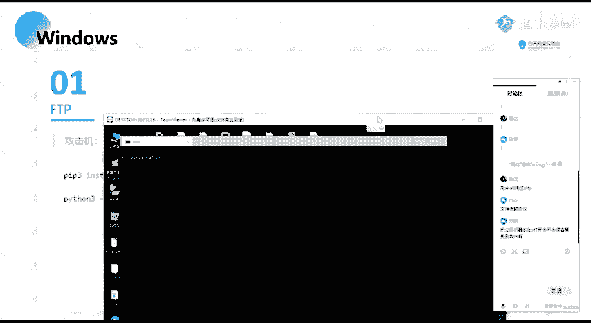

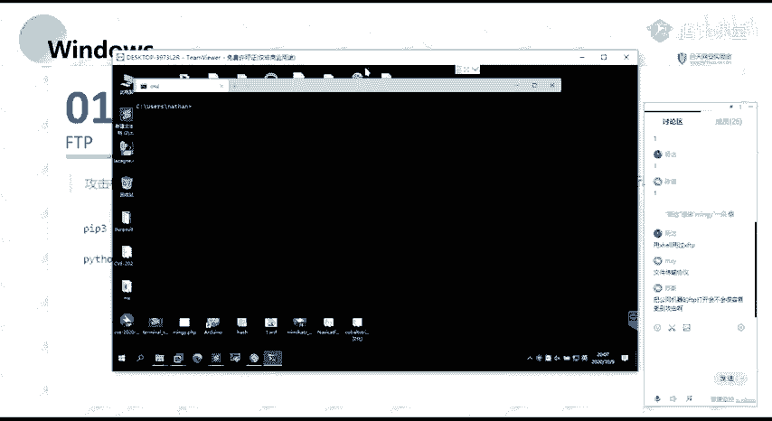

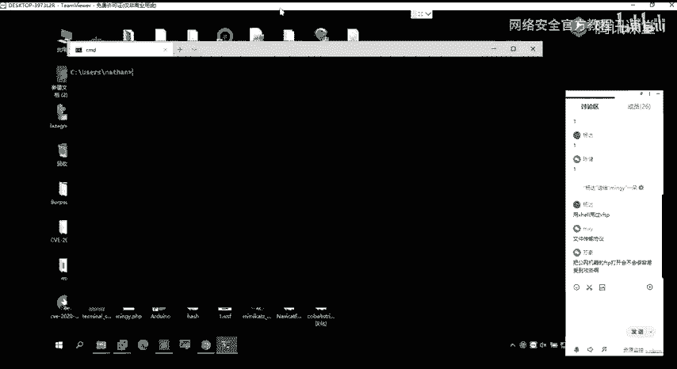

嗯。

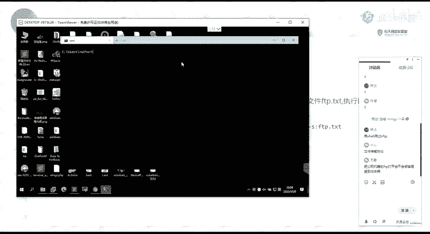

首先我的我在我自己的一个机器上面，也就是。是。Yeah。我在我这边的一个呃不是。

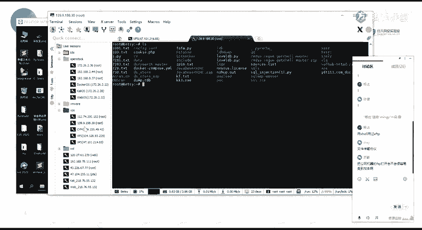

我在我这边的这个基上面。嗯，我先通过。他审的一个这一个模块来去进行一个快速的开启1个FTP的一个服务。然后我这边的话是已经安装了这样子的1个PYFTPDliber的这样子的一个库。你装咩。没装的话。

我这边抓一下吧。你。哦，我用这边的这一个机器啊。

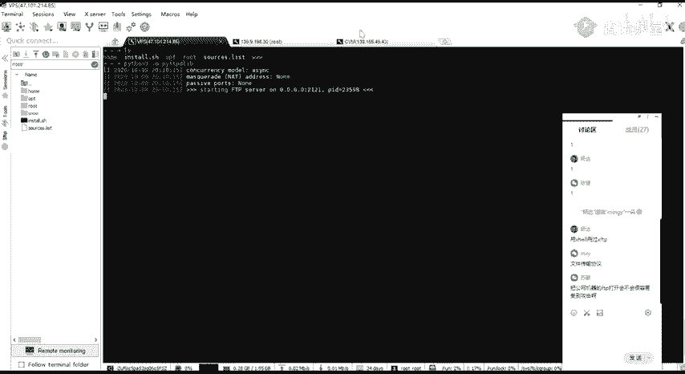

我这边的这一个机器的话已经安装了这样子的一个模块，然后的话直接通过这样子一个命令就开启了这样子1个FTP的1个server。然后这里的一个servve的话，它默认是开放在2121的这一个端口上面。

然后我在这边的话，我以就是说我以这个instore点SH的这个文件为例，对吧？当然的话我们可以把这边的这个文件，就是说我们想要去呃上传到目标机上面的这一个文件的话，呃，改成任意的一个啊码字，对吧？

任意的一个码。然后我在我的一个目标机器上面，也就是说我们已经得到了这个需尔的这个机器上面，啊，我们写入这样子的一个。

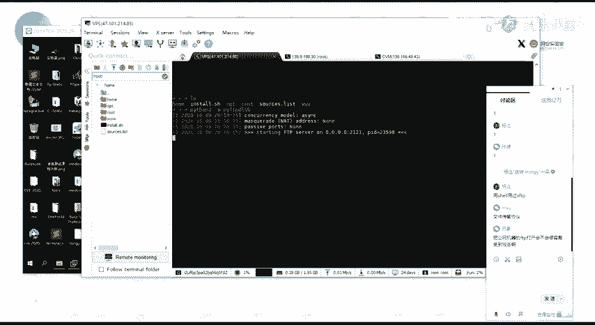

太的一个就脚本。然后这个脚本的一个内容的话，就是去连接我们这边的1个FTP的1个serv。我这边的话是。

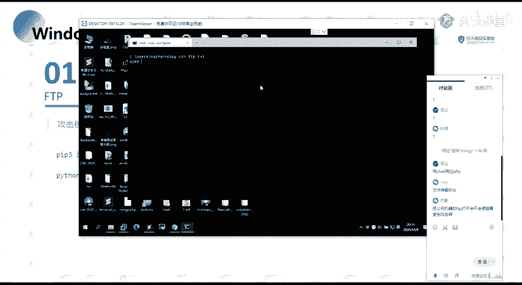

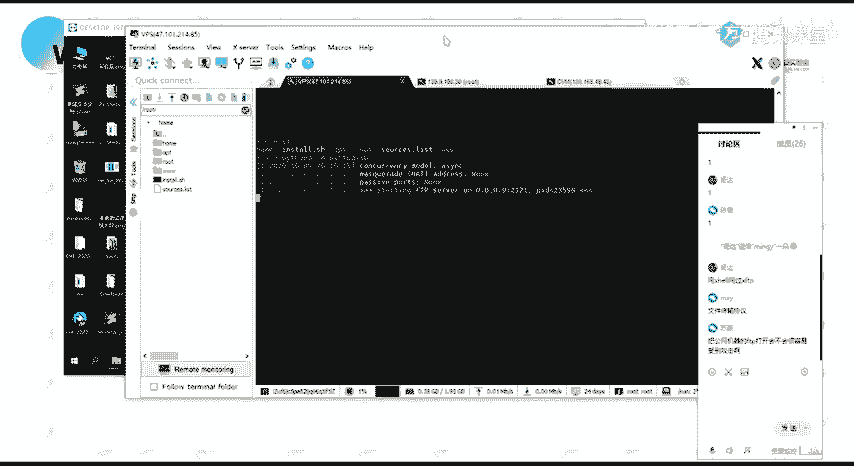

这1个17。然后端口的话是2121。嗯。这边的话已经有了一个。把这个删掉。我这边的话重新写一下。啊，呃我写的一个脚本的一个内容的话，就是这样子，我给大家来解释一下，就是说我这边的这个脚本它的一个意思。

首先在这边的话呃。呃，我先从这边开始说吧，这边的话刚刚有说了，对吧？就是用的这个copy的一个命令。然后这边的1个CON的一个意思的话，它表示我们的一个控制台就是说这边整体的一个意思的话。

就是把我们从控制台的一个输入，把它给复制到我们这边的一个文件当中。然后这边控制台的一个输入的话，其实就是我们后面所输入的一个内容。然后首先第一个就是open，就是你呃FTP的话。

你首先你要去连接我们的1个FTP的一个服务。所使用的一个命令的话就是这个open。然后的话指定我们FTP的一个服务IP以及端口。然后的话下一行的话就是回车回车之后的话。

下一行我们写的是我们的一个用户名以及密码。然后我这边的话是使用的一个匿名登录，匿名登录的话就是用的这一个anonymous，也就是匿名者嘛。然后呃下下下一行的话，这边的话是一个密码。我这边留空的话。

就是说因为我匿名登录的话，我可以就是说呃可以不输入密码，我直接输入一个这样子的一个anonymous的一个用户名就能够去进行一个登录。当然的话你也可以输入，就是说密码是为这一个anonymous。

也就是用户名密码都为这一个，你也可以去进行一个登录。然后我这边留空的话就表示就是直接回车。然后下面的话就是说我们连接成功之后的话，我们通过get这一个命令。

get的话就是去从我们这边的一个FTP的一个服务器上面去下载我们想要的一个呃文件。也就是我这边的话是以这个insstore点SH为例，对吧？然后的话get完毕之后的话，我们cutt退出。

然后这边我们把我们的脚本写完之后的话，我们想要去把这个内容把那个写入到这边的话，我们直接ctrl Z。注意是cttrol Z，然后的话回车这边的话就已经复制了一个文件。

然后我们可以通过太普来查看一下它的一个内容。对吧这边的话就是我们所写入的一个内容。然后的话我们通过FTP的这样子的一个命令。

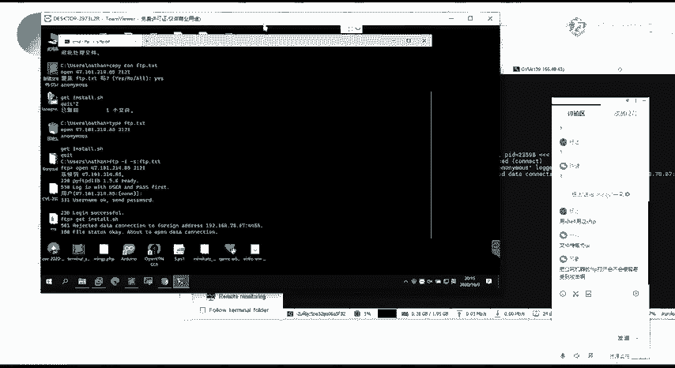

Yeah。

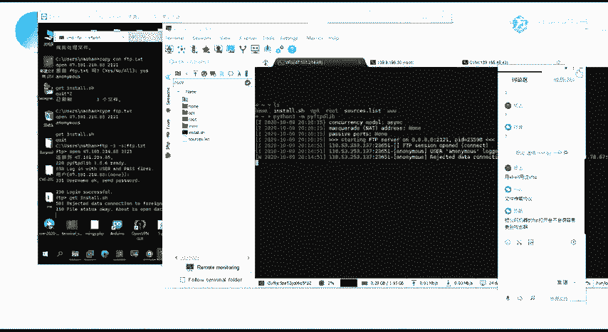

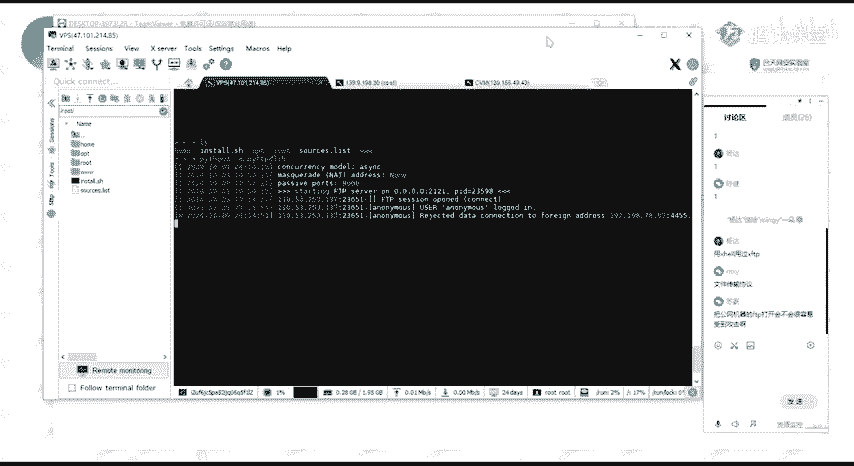

嗯。

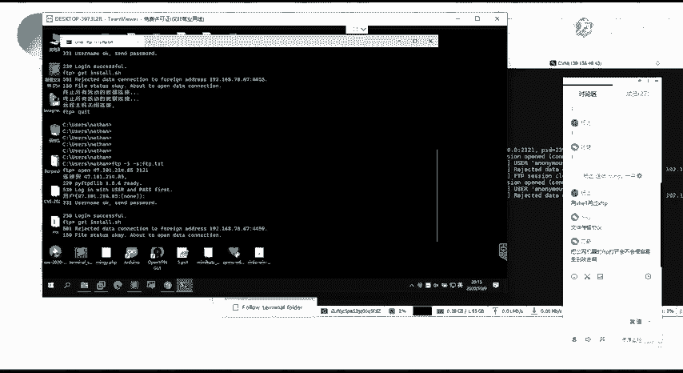

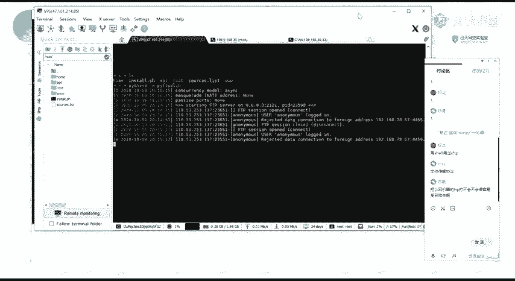

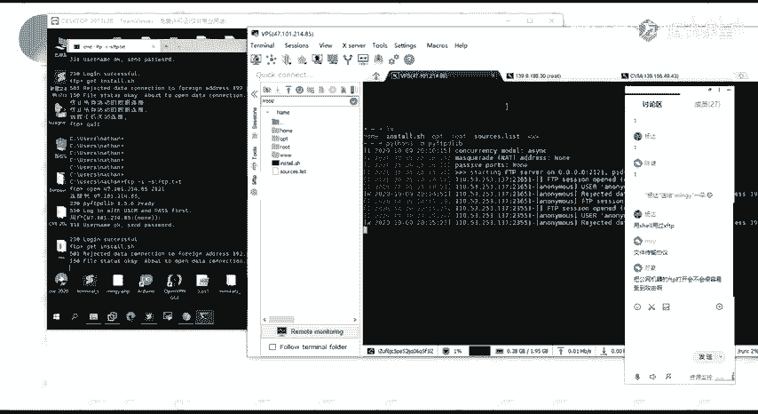

这边的话呃。出了一点问题啊。这边的话我们可以看一下，在这边我的1个FDB的一个server的话，可以看到在这边是已经就是说提示我这边的一个anonymous的这一个用户已经是登录了，对吧？登录之后的话。

他呃在这边的话。

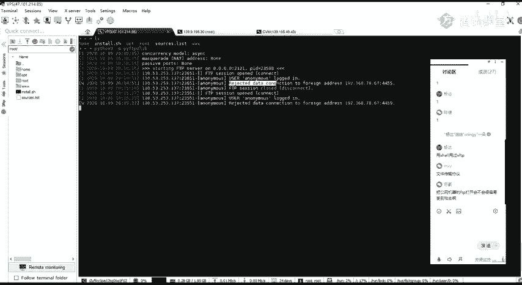

他拒绝了我的这边的一个就是请求啊。

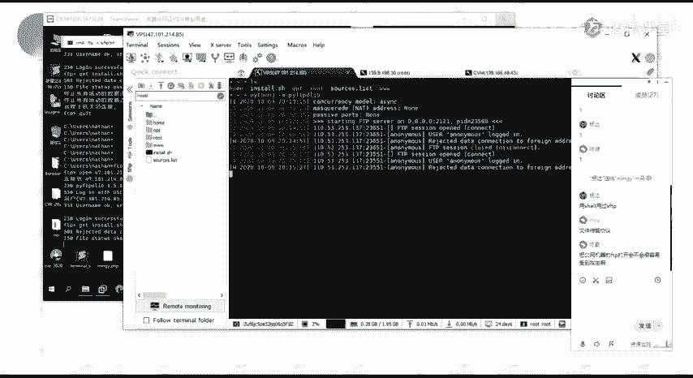

大家。是。

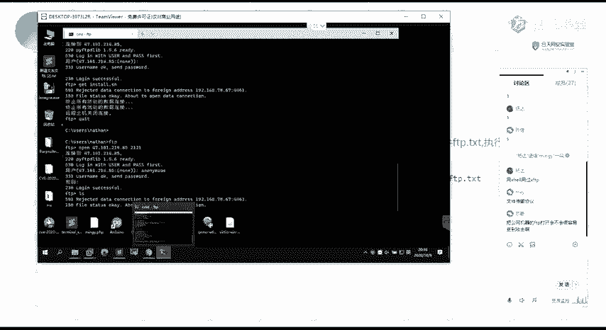

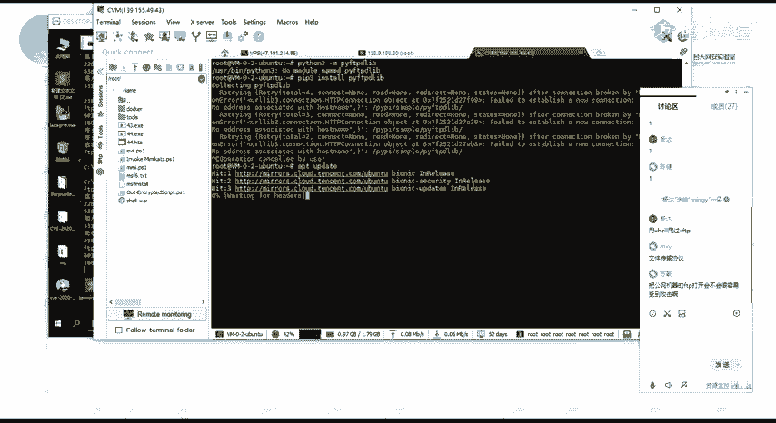

稍等一下。嗯。mm。😊，不知道怎么回事。

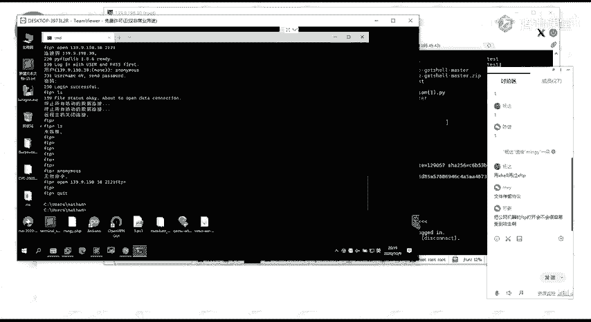

。

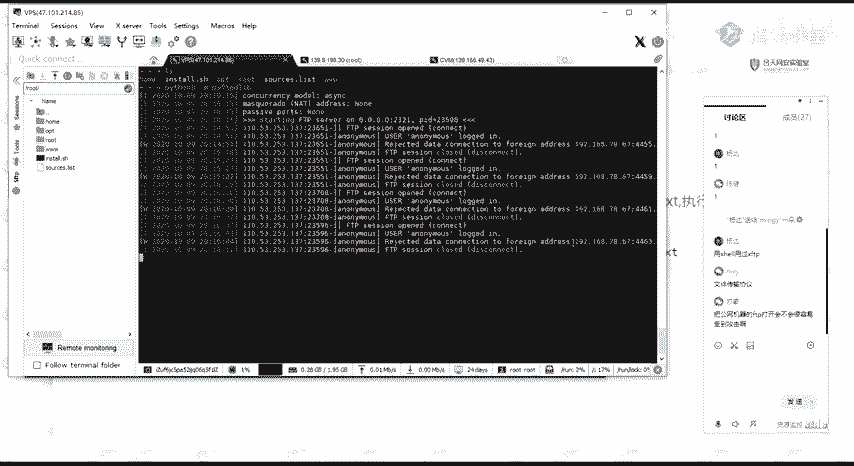

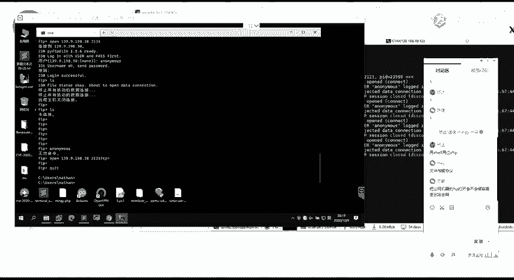

呃，这边的话碰到了一点问题啊。行。

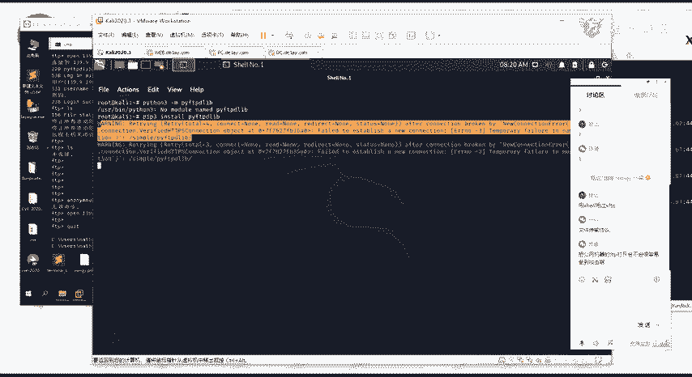

O我今天试的话是没有问题了，怎么突然就。

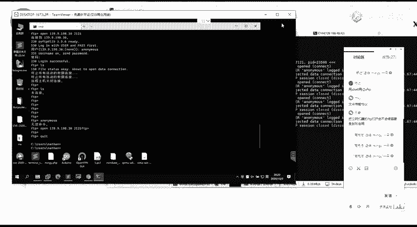

你要是不是服务器的问题啊？

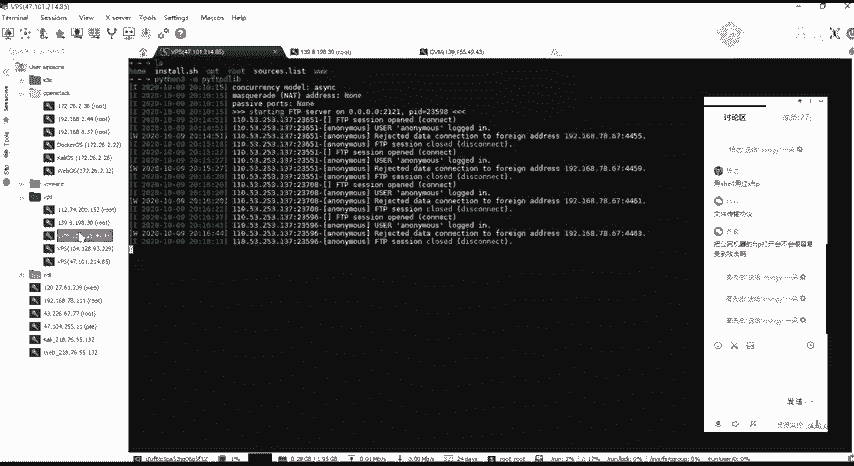

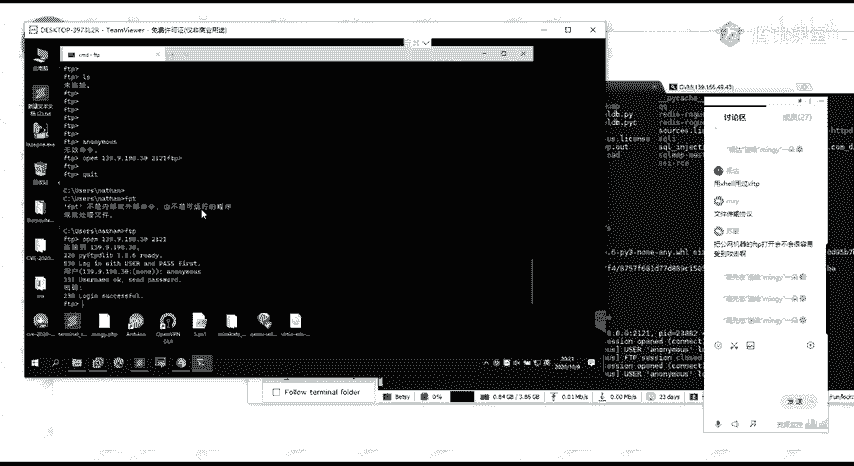

呃，这边的话先。先挑锅吧，好吧。大家大家试一下，应该是没有问题了。我这边不知道怎么了，就我今天还试了，就是说是没有问题的。就是说我这边FTP连上去之后的话。

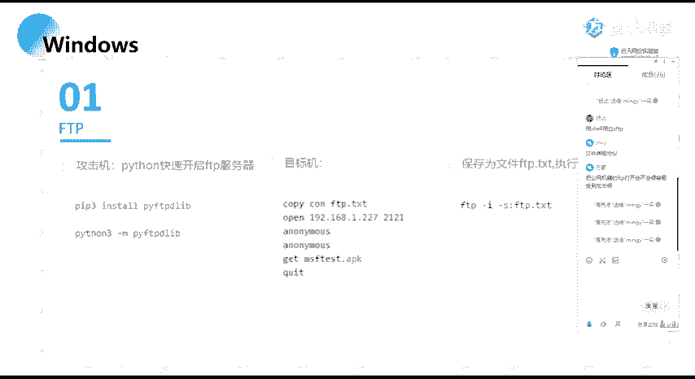

呃。就以说我这边FTP连上去之后的话，对吧？我这边的话已经loggan。successful是吧？就是说登录成功，登录成功之后的话，我可以通过输入L的一个命令的话。

就能够去查看到当前的一个就是说这个FTP的这个服务。这边的我这边的这个FPP的这个serverer，就是说我当前的话是这个server，它是在当前的这个目录下面，对吧？那么我连接上去之后的话。

我就能够去查看到当前目录下面的所有的这种文件以及文件夹。然后的话我可以通过。通过get的这个命令来去接收指定的一个文件。然后我这边的话就是说接收的话，就是这边的这个inst点SH的一个文件，对吧？

那我就可以通过get installstore点SHH。点SH然后去下载的下载这一个文件，当然的话这边。他报了一个这样的不错，就是说。他这边不允许去。这边的服务端他不允许我这边的这个IP去连接啊。

我不知道是不是被禁了。うん。

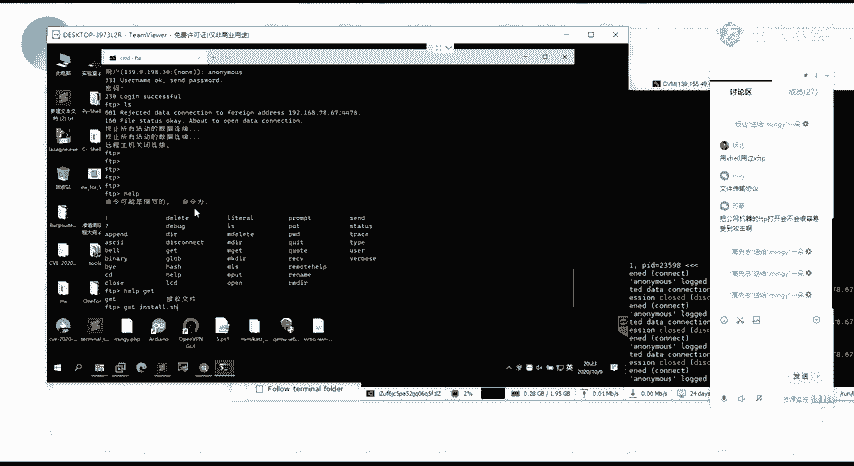

我这边的话呃我课后的话再去看一下，好吧，大家可以试一下。

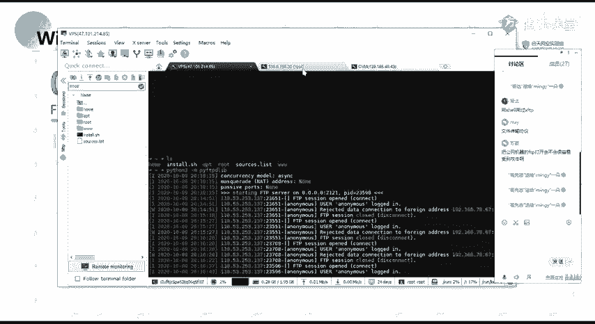

我。我不知道是我这边的一个问题还是怎么的。好吧。然后第二个的话就是这个bets amin。 beat admin的话它是一个命令行的一个工具。我们可以用它来去进行一个创建，还有下载。呃，创建下载。

还有上载的这样子的一个作业。然后的话监视其进度。就其实说白了这这个的话就是beats amin的话，它是windows下面的一个自带的一个工具。然后这个工具它的一个作用的话。

就是说我们可以用它来去进行一个呃文件的一个下载。然后使用它的一个具体的一个步骤的话。呃，首先的话在这边。呃，我通过nF re去生成这样子的。像比如说一个这样子的1个HTA的这样子的一个呃。

木马然的话我通过这个beside命来去呃。把我们来去把放在我远程服务器结束我VPS上面的这一个44点HTA的这个文件，把它给下载到我本地。然后的话下载之后的话，我再通过这样子的一个方法来去进行一个加载。

来去get share。然后在这边的话都。

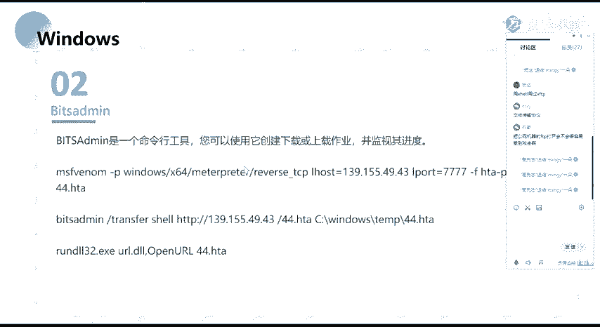

直接演示吧，我们直接来看效果。嗯。😊，我电话用我的这边的这个机器，我首先。骑一下我的1个MSF。然后的话呃。通过这样子的一个命令，通过MSF re来去生成一个这样子的1个HTA的一个文件。嗯。

这个文件它就是一个呃木马文件，然后我们可以来查看一下这个14点HTA的一个内容啊。

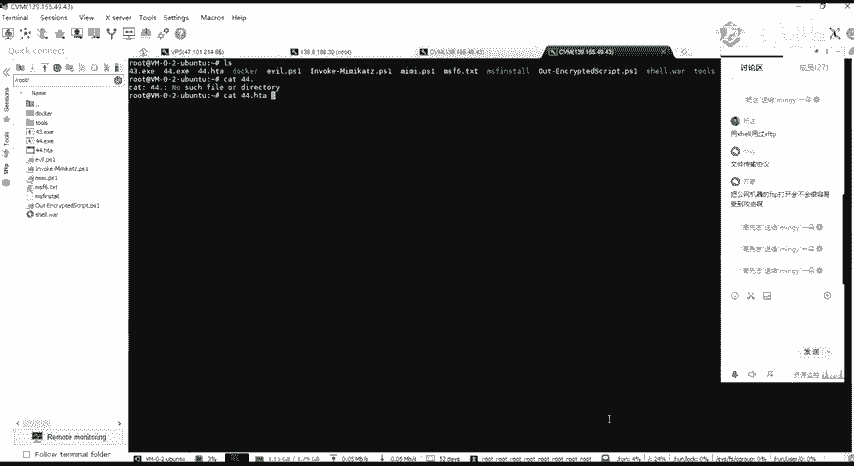

可以看到它的个的话，其实就是像这样子然HTA的话呃，大家了解它什么东西吗？大家有了解，就是说HTA。就这种文件它是什么吗？啊，我这边的话呃直接就是百度来查看一下，就。大概的了解一下它的一个意思。

就HTA的话它是1个HTM的的一个缩写，其实就是一个HTTM的一个应用程序。然后呃它是直接将我们那个HTM保存成这样子的一个格式，可以把它当成一个独立的这种应用软件。然后我们看一下它的这一个例子。

它其实就是一个HTM的一个代码，对吧？然后的话我们的这样子的一个代码的话，我们可以去啊就是把它作为一个应用程序，然后具体的一个实现的话，我们来看一下这表。前面这边的话。

它其实就是一个呃指定了一个我们使用的一个脚本，就是一个VB script，也就是一个VB的一个脚本，对吧？然后在这边的话，后面的这里的一部分内容的话，其实我们主要的话就知道。

在这边它主要的话就是使用了这个cor object来创建了这样子的一个对象。主要的话就是用的这个Wscript点 share来去执行我们的一个命令。关于这一个的话，大家可以呃。百度一下。

它是一个就是一个对象。然后的话我们可以通过创建这样子的一个对象来去运行程序。比如说操作注册表啊，创建快捷方式，还有访问文件夹等等，是吧？然后在这边的话，我们就是创建这样子的一个对象。

然后的话来去执行我们这边的一个p share的一个代码，对吧？所以我们可以看到就是调用的就是我们这边创建了一个对象赋给了这一串值，对吧？然后的话它调用了这样子的一个乱的一个方法。

然后的话来去执行我们这边的一个p share的一个脚本，这边的一个po share脚本的话，它是就是后面的这一串的话，它是做了一个base64的一个编码，对吧？

我们可以通过呃相应的一个代码去把它做一个解码。

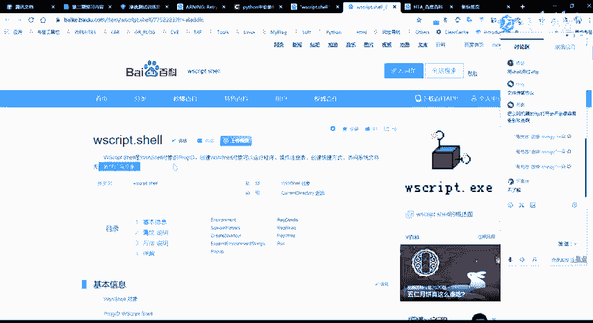

2 six。这边的话有有啊。嗯。咋回事？这里。这边的话呃。其实就是一个这样子的一个脚本。我们可以通过把就是说把我们这边的一个base64的这样子的一个编码的一个代码的话，把它做一个解码。

我们其实可以看一下它里面的一个内容啊。

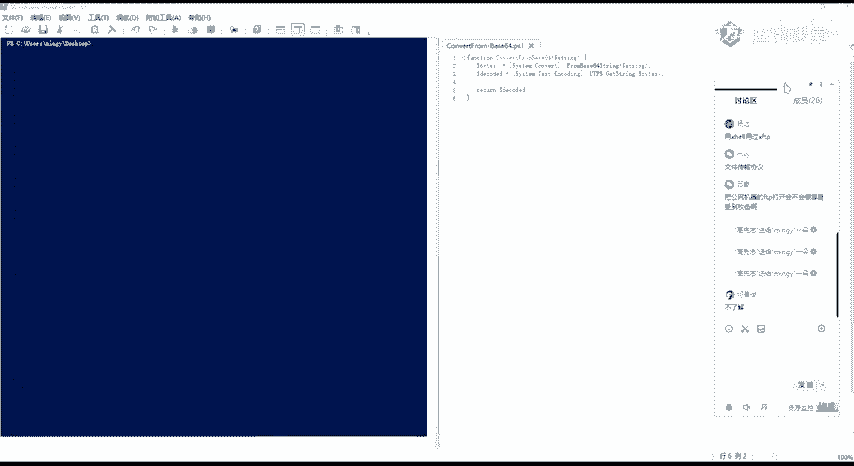

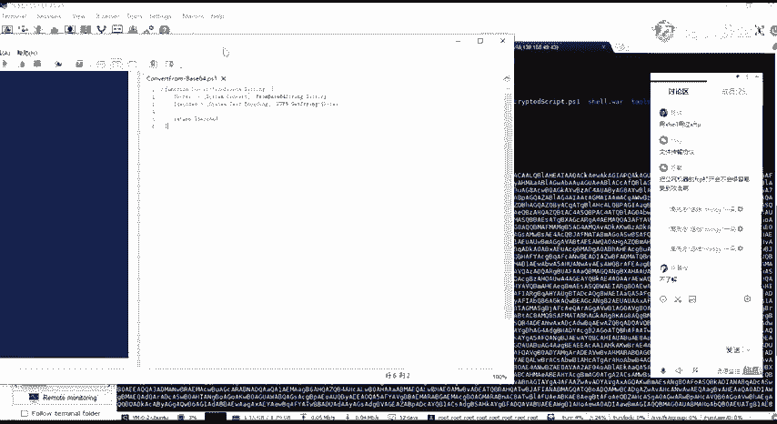

就是这样子的一个东西啊，然后我们可以通过嗯。看下。Okay。不。嗯。你。嗯。嗯。Oh。

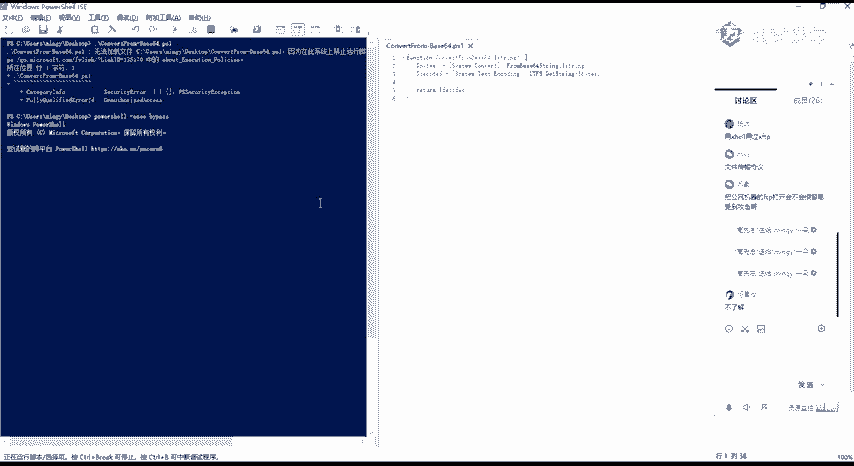

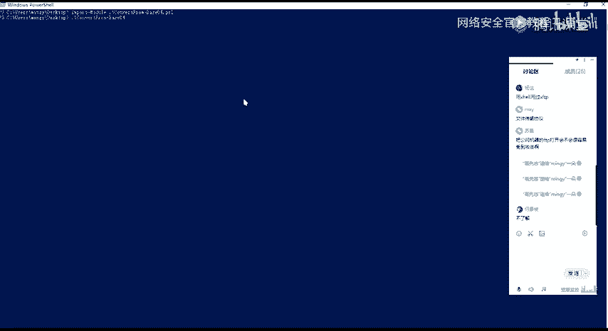

啊，不是搞错这了，是这一个方法。

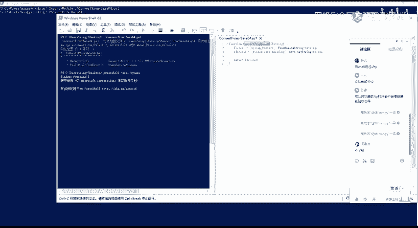

好。

然后呃在这边的话就是解密之后的话，就是这样子的一串啊，我们可以看一下，就是这边的这一串内容。就这边的这一串内容，然后这边的这一串内容的话，它其实也是就是一个p share的一个这样子的一个脚本，对吧？

然后我们可以看到它在这边的话，就是它会去调用呃你系统里面的一个po share的这样子的一个EX的一个程序，对吧？然后的话再去执行我们后面的这边的这一个内容。

然后其实我们可以看到在这边后面的这一些内容的话，像比如说杠NOP。以及杠W嗨d对吧？这个的话都是我们常见的这样子的一个呃参数啊。然后后面这边的话，它是同样的，他又做了一个b64的这样子的一个就是编码。

对吧？然后其实在这边他同样的就是他会把这边的一个6贝64的一个内容做一个解码。解码之后的话去进行一个执行。我这边的话我就不再去做一个解码了。就是他通过这样子的一个方法做了一个就是呃编码的一个混淆，对吧？

然呃实际的话在这边的话，它其实就是会去执行这样子的一个脚本。这这边的一个抛弃的一个脚本。这边执行之后的话，它是一个反他需尔的一个呃目的啊。然后我们这边的话生成生成之后，生成之后的话，我这边先通过。

阿们杀组建立一个今听。Okay。病。好，呃，设置了配load之后的话，设置我们要去今天的一个our host。在这边的话，我再去说一遍啊，再说一遍。

今天又有两位同学又问我这这问我这一个就是我已经说了很多遍了，就是你的1个VPS对吧？像比如说这边我这边的这个VPS。我这边的1个VPS，我的1个官网IP是这一个对吧？

然后的话你的一个你的这个VPS你不是独享的1个IP。也就是说你的这个机器的话，就是有一个专门的1个IP能够去直接访问到，对吧？就是独享IP。那么你如果说你是一个独享IP的话，那么你的一个公网IP。

就是这个对吧？以及在这边有1个ETH0的这1个网卡，你的这个IP它也是一个公网IP对吧？那么像这种的话，像这种VPS像阿里云腾讯云的这种VPS的话，它其实是相当于就有一个做了一个这样子的一个映射，对吧？

就是说通过这样子的一个公网IP。来去映射到了这边的，就是说把我们这边的VPS的这个。

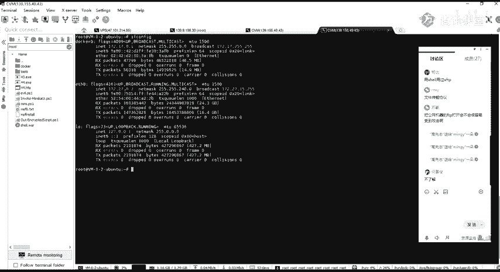

IP就是说这个机器啊映射到了这样这样子的一个公网IP。

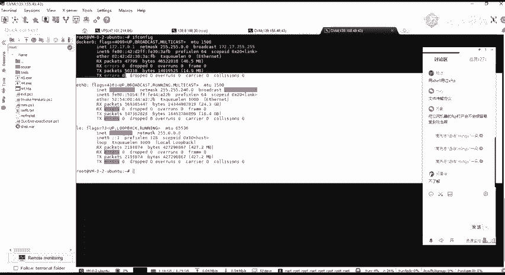

那么我们要去今听一个端口的话，我们是我们在本地这边的话，只有这几个IP对吧？我们要去今听一个端口的话，我们不是使用我们的一个公网的1个IP啊，你去用公网的IP去今听的话，你是今听不了的。

它会它会有一个报错，对吧？就是nten就是notote什么什么那个对吧？然后你要去今听一个端口的话，对吧？你去指定的一个IP的话，你就就是你要去今听你本地的一个端口。

你指定的一个IP就指定这1个ETH0的1个IP。好错去去去。啊，呃ex。去这立一个监听，对吧？在这边的话就没有任何报酬的了。然后如果说如果说就是说呃有同学有同学是一个就是独享的1个IP对吧？

就是说你的个官网IP跟你的这边你去查看呢，就是说ETH连那个网卡，它其实是同样的，也是一个公网IP。那么你去今天的话，它你就去今天你的公网IP就可以了。

就在这边要host指定你的一个公网IP它就能够去访问到这样子一个端口。啊，我这边今天之后的话。今天之后的话，我这边有这样子的1个40点HTA对吧？

那么我们要怎么去把我这边的一个生成的这个HTA的这样子的一个呃木马文件，把它给就是上传到，或者说下载到我这边的。

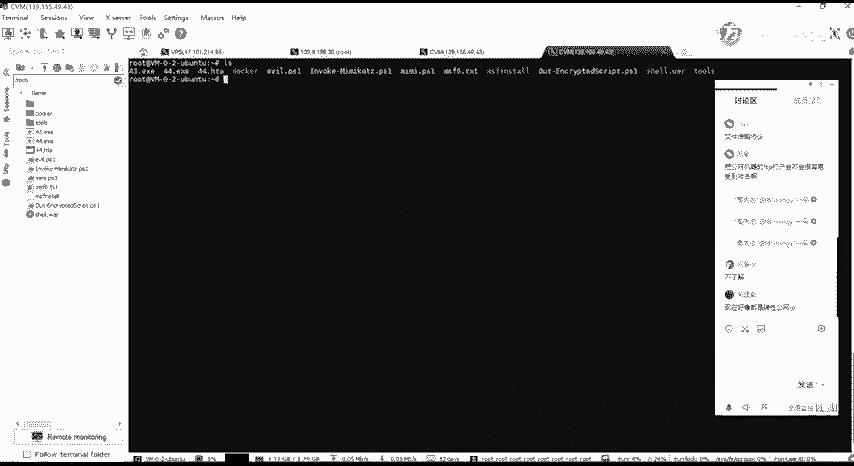

这个机器上面去进行一个执行的。在这个时候的话，我们因为我们前期的话是已经得到了这一个机器的一个。

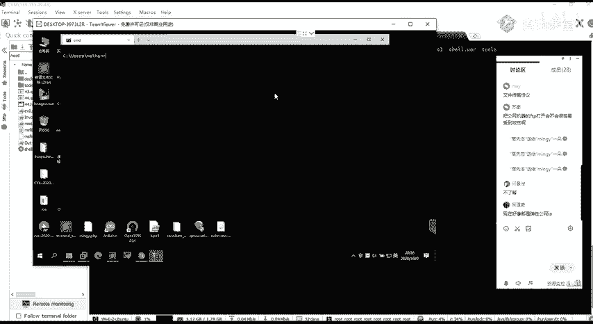

就是有一个基本的一个权限，我们也能够去执行命令，对吧？那么我想要把我的这一个文件放上去，它是一个windows机器，我们可以通过BTSad命这一个命令，这一个命令行的一个工具来去进行一个文件的一个下载。

然后在这边的话，我们呃看一下，看我的PPT。

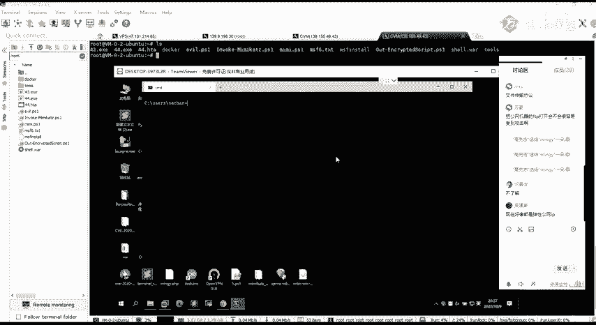

具体的一个面料的话就是像这样子。

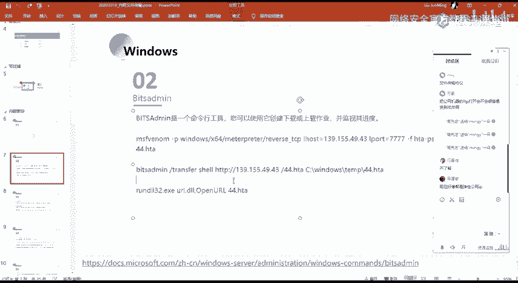

我这边话我就不敲了，我直接复制。

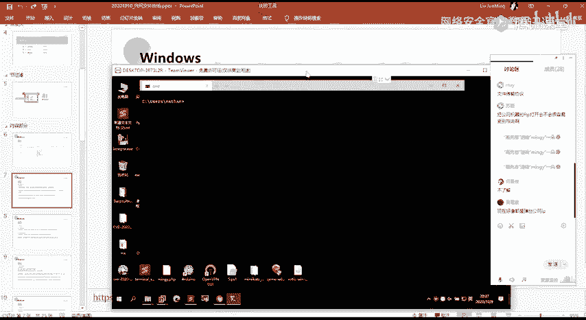

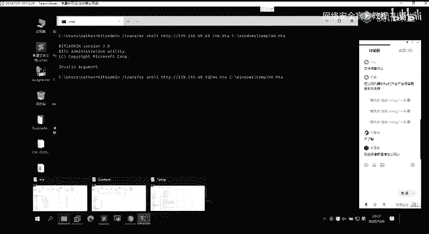

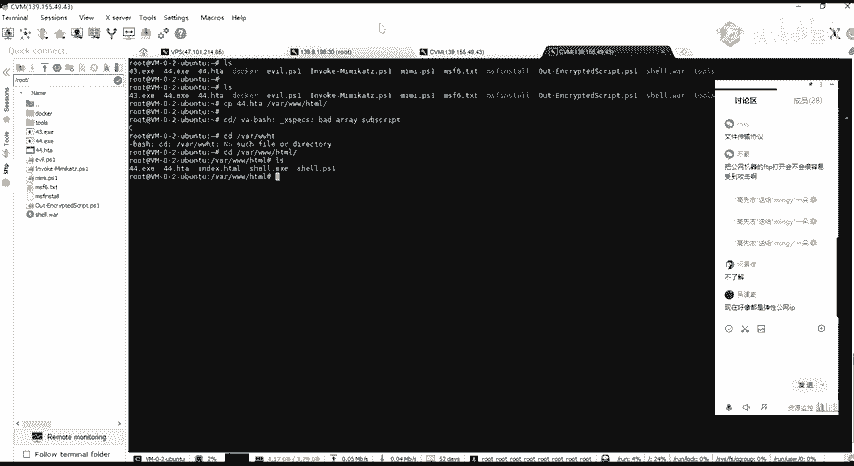

然后我这边的话，我把这个HTA文件放到了我的一个就是阿帕奇的一个外本目录下面。然后的话我去进行一个执行。

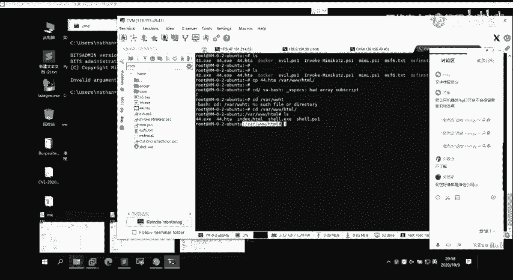

执行之后的话，我在这边的话。可以看到他在这边会有这样子的一个进度啊。我这边执行执行的一个命令的话，就是像这样子在这边的话，我先啊我们先来看一下，就是说。这边的这个目录下面是否有这样子的一个文件？

我们来验证一下，就是说这一个我的这一个命令它是否就执行成功了，对吧？可以看到在这边我是把我这边的1个UPS上面的这个HTA的这个文件把它给下载到了这个目录下面，对吧？可以看到已经成功的下载下来。

然后我们回过头来去了解一下，去理解一下这一条命令，它的一个大概的一个意思。在这边的话，主要的话就是用的这一个transip。嗯。呃，这边的话大家记一下就行了，好吧。

你要想要去就是了解它其他的更多的这样子的一些功能面的话，你可以通过干问号来去了解。这边的话我们使用的就是这个trans。嗯。这一个这一个参数啊，然后在这边的话我们。可以看一下这个轻死宝参数。

后面它所要去进行去所要去加的这样的一些参数，对吧？可以看到在这边有一个jober name。jober name的话就是呃我们可以进行一个随意的一个指定，就是指定我们自己想要的一个作业的一个名称。

然后的话后面的话接我们的这样子的，像我们的一个remote UL，也就是我们要去进行一个远程的一个文件的一个下载，对吧？我们需要去加我们的一个文件的一个URL。

然后的话local name的话就是把它保存到我们指定的一个本地的一个文件名。以及以及路径。然后我们回到这一这条命令的话。就是说这边通过transranfer。

然后的话指定我们的一个jober name，我这边话是指定的一个需ll。当然话你也可以指定为其他的，就是随意的对吧？然后的话后面接我们的一个要去下载的一个资源的1个URL，然后的话接我们。

要把我们的这一个资源下载到哪一个路径下面，以及它的一个呃下载之后的存放在本地的一个文件名。然后我们这边就是下载完之后，对吧？我们如何去进行一个访弹需要呢？

就是如何去执行这样子的1个44点HTA的一个文件。在这边的话呃，我们要使用到这个run deal。32。这一个程序的话，在后面再讲区进行，再讲window下面的一个反兰西尔的收费区。

讲到怎么去进行一个呃使用啊。然后这个runer32的一个作用的话，它其实就是去就是去注册调用我们的一个d。然后在这边的话，我们要去使用到的话，就是使用到这个UL点掉。这个的话。

它在windows里面的话，它是一个。呃，就是一个我们知道第二的话，它是一个共享链接库嘛，对吧？我们可以通过这个runer32来去调用就是。来去注册这样子的1个12点DL。然后这个U2DL的话。

它有这样子的一个。Oec。OUL。都这样子的一个呃。什么来着？

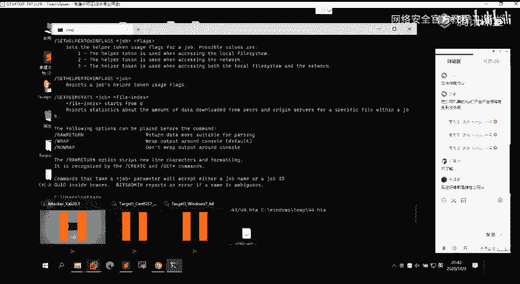

对对。有点弯了。呃，其实具体的一个东西的话，你可以去看一下我这边的一个预习内容。就是这边预习内容的话已经有写，就是这个利用这个run上次来去执行程序。嗯。然呃它的一个这个run调ll上升的话。

它主要的一个作用就是去加载dL。然后我们这边所要去加载的就是这个UR点调里面的这个open your的这一个这一个函数。它是一个包含导出函数。然后这边的话就如果你懂这一些东西的话，你可以去进行一个研究。

不懂的话你就知道你就知道他怎么去用就OK了，好吧。

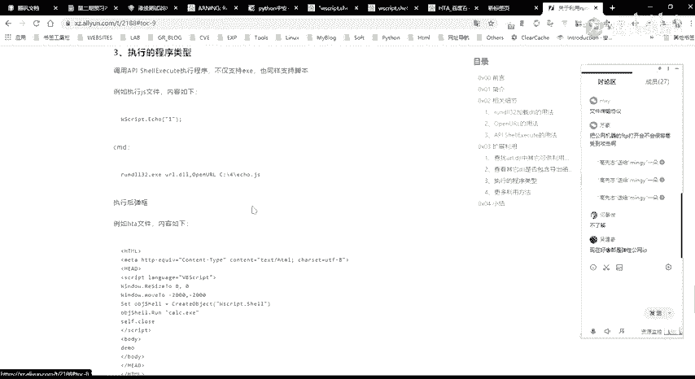

🤧好，我们在这边的话，我们指定这一个open your，然后然后的话指定我们这边的1个HTA的一个文件。

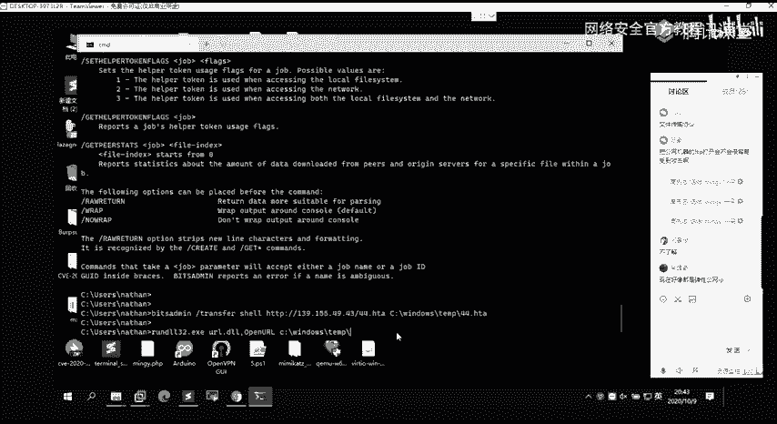

谢谢。好，我们这边执行执行之后的话，在这边我们可以看到。

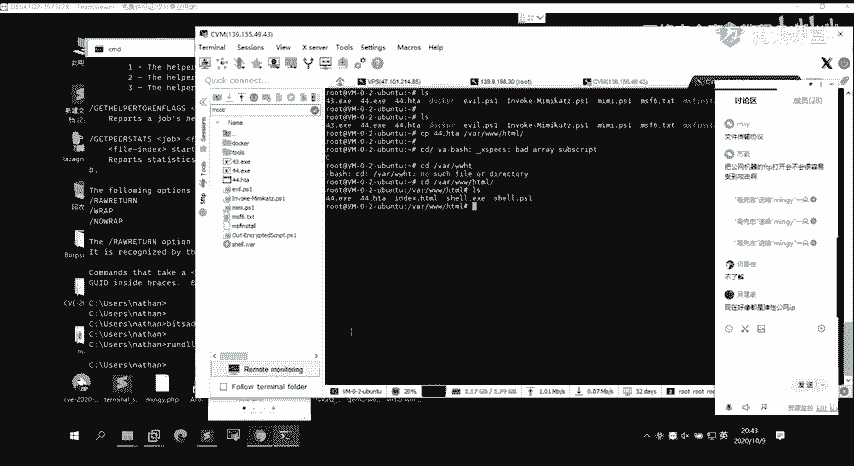

就我这边刚刚的这一个今天的话已经反弹为了这样子的一个筛选一。是吧。然后这边的一个。可以看到得到了一个筛需尔的话，就是我这边的这一个机器的一个吸尔。

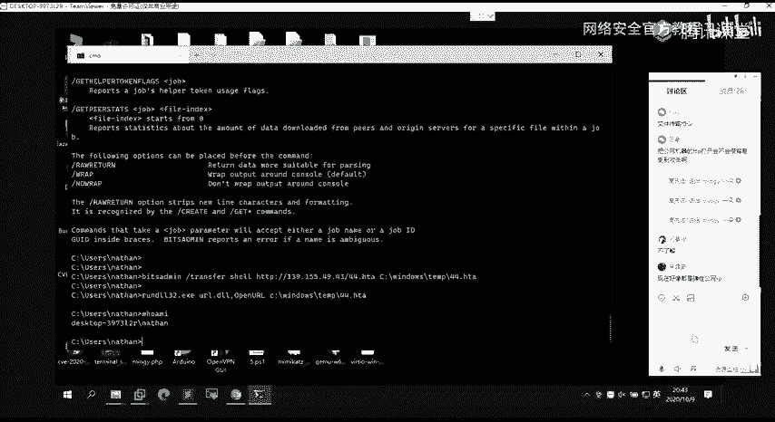

。这个的话是使用这个beter side命这样子的一个命令行工具啊，以及通过这样子的一个实例啊，就是说去进行一个反弹需尔的一个实例。

然后第三个的话就是这个CRTUTL这个的话它是一个它同样的也是windows下面的一个自带的这样子的一个程序。这个关于这个东西的话，它是什么？它是一个什么东西的话。大家看这个预习内容。

就是看这个官方的一个文档。它是一个命令行程序，就是作为证书服务的一部分进行一个安装。它它的一个作用其实就是去来存储啊，就是来去操作我们的这种证书网。

它的一个就是通过命令行的一个方式来去操作我们这样子的一个证书，来去对这种证书去进行一个呃操作，像备份还原啊、配置等等，对吧？然后在这边的话，我们实实际去用到去使用的话，就我们在我们这边渗透测试的话。

我们可以用这个命令行的一个程序来去进行一个文件的一个下载。具体的一个使用的话就是像这样子，就CR，然后的话指定这个杠1K，然后杠4sp杠F指定我们的一个远程的一个资源。

然后的话把它下载到就是下载到我们本地之后的一个文件名。🤧。哦，我们先来看一下大概的一个效果吧。

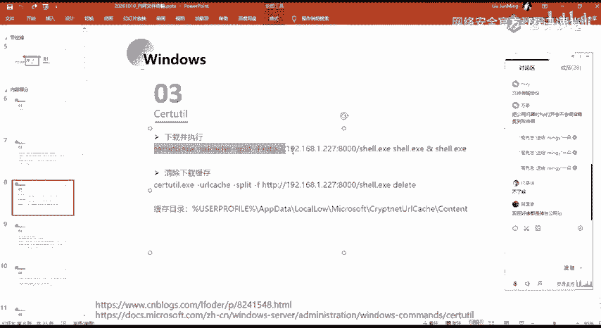

我这边的话。同样的就是以下载这个44点HTA这个文件为例吧。然后的话呃下载到本地下载到当前目录，然后的话保存为H44点HTA啊，然后我们回车回车之后的话。

我们来看一下当前的一个幕录下面它是否有这样子的1个HTA的一个文件。哦。好的。

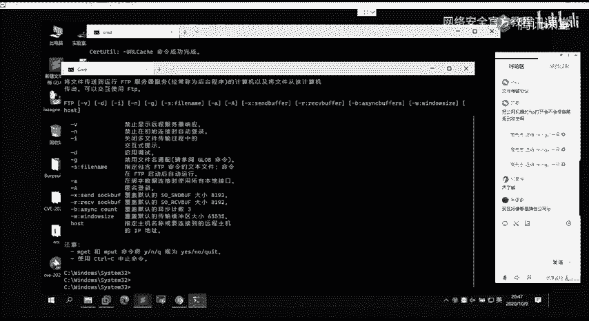

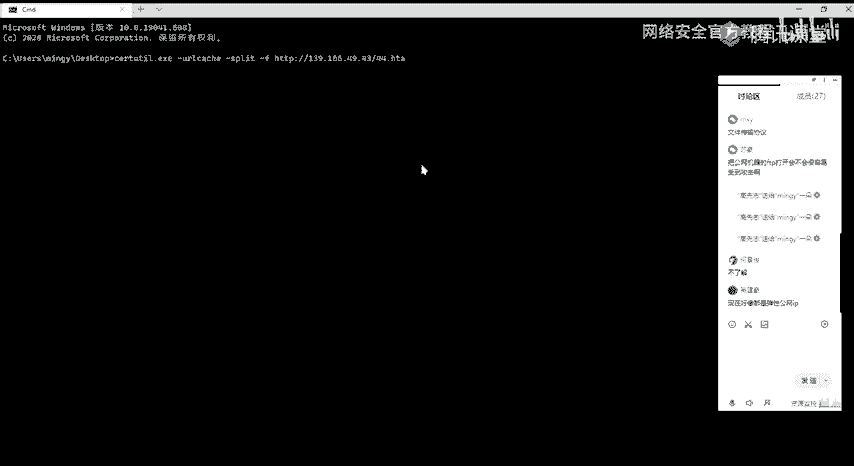

Yeah。

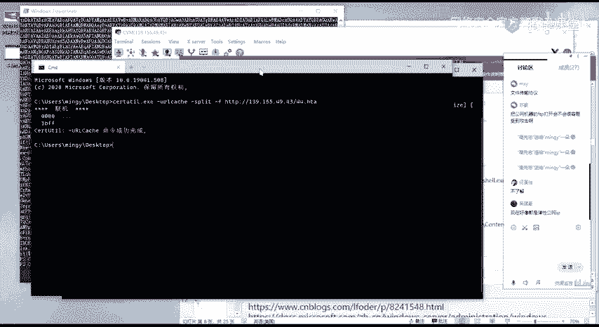

可以看到在这边的话，在这边的话，我们通过这一个命令啊成功的去下载了到下载了这1个4字点HTL。然呃就是正确的就是说他你执行之后的话，它会有这样子的一个回响，就是像这样子的。一个回显。

就是你看到这一串的话，就说明你的这一个命令的话是执行成功了。然后呃我这边的话是下载到了这里。

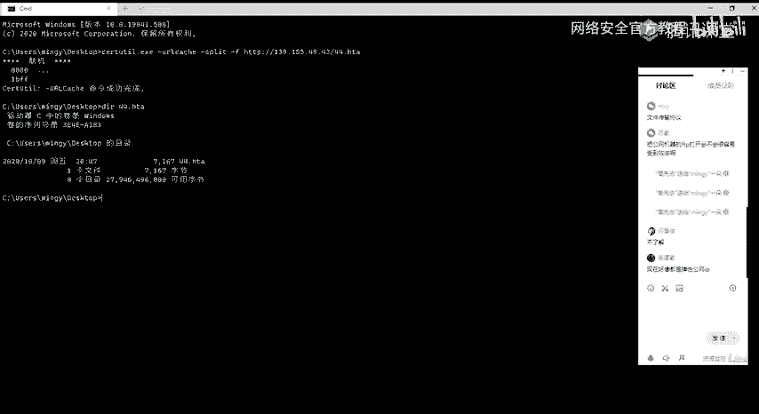

我可看一下里面的一个内容的话，就是这一些对吧？就是我们刚刚的那个文件的一个内容。

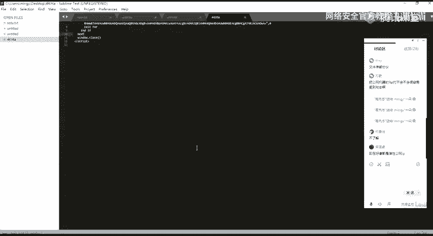

Okay。这是呃第三个，然后呃这个命令的话，就是说这个CRRTOTL这个命令的话有一个点需要我们去进一个注意。就是说我们通过它的这一个命令去进行一个文件的一个下载。下载之后的话，它会有一个缓存。

比如说通过这个命令下载之后的话，它会有一个缓存式存放在这样子的一个目录当中。就是在这样子的一个目录当中呃，我这边的话先把它给删了。对。我把这边的这个缓称全部清掉。

然后的话我再重新去执行一下这样子的一个命令。

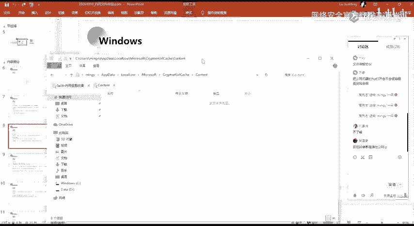

执行之后的话可以看到，就是说我这边执行下载完了我这边的这一个文件，对吧？然后的话在这个目录下面，它同样呢它会留存有这样子的一个缓存。这个缓存的一个内容我们也可以来查看一下。可以看到我的这边的这个缓存。

它的一个内容其实就是我们所下载的这一个文件，对吧？所以说的话我们去用这个命令去下载去下载了我们这边的这样子的一个木马。脚本之后的话，它会在这一个录下面，它会有留下这样子的一个缓存。那么我们。

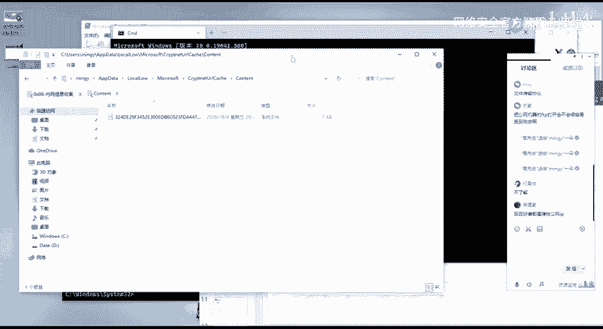