# B站最全网络安全教程，整整1300集，全程干货无废话，别再盲目自学了，看完学不会我退出网安圈！（web安全｜渗透测试｜内网渗透｜CTF） - P82：81. 第二十九天：Linux系统下的文件传输.mp4 - 网络安全官方教程 - BV15u4y137cQ

就是执行完之后的话，我们需要去执行这样子的一个命令，来去把这个缓存给清除掉。就清除掉这一个缓存的一个目的的话，就是为了就是隐藏我们的这样子的一个就是说使用了什么样子的一个木马。

使用了什么样子的一些一个方法来去进行一个攻击，对吧？就我们需要把我们这边的，因为这边的一个缓存的话，它记录了我们的就是说所使用的一个木马的一个内容，对吧？

那么管理员或者说呃就是我们的一个渗透测试之后的话，呃，法管理员他去做一个溯源啊等等的这样子的一些操作的时候，他可以在这样子的一个目录当中去查找我们。所使用到的这样子的一个木马，对吧？

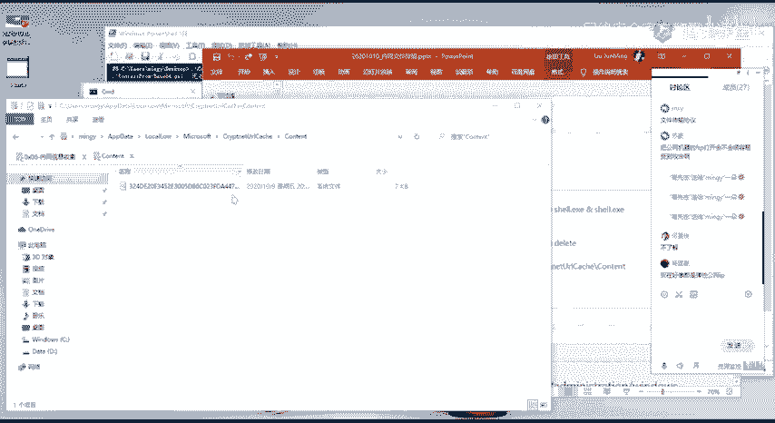

来去对它进行一个分析。然后在这边的话，我们可以通过这样子的一个命令。

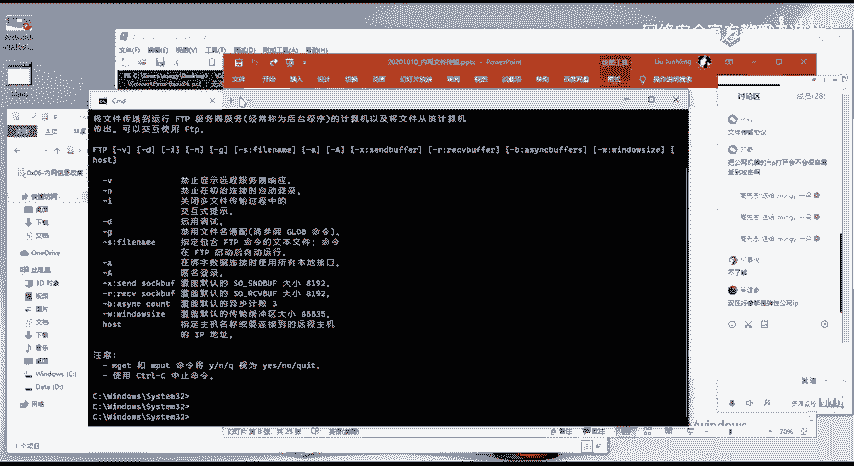

去把这样子一个谎存给清除掉。比如听除的一个命令的话很简单，就是在这一个命令后面的话，加一个DLET，也就是deletedelete的话就是删除的一个意思，我就是。可以看到我这边执行之后，对吧？

它的原本这个目录下面它有这样子的一个缓存的。但现在的话已经没有了，就是已经做了一个清楚。

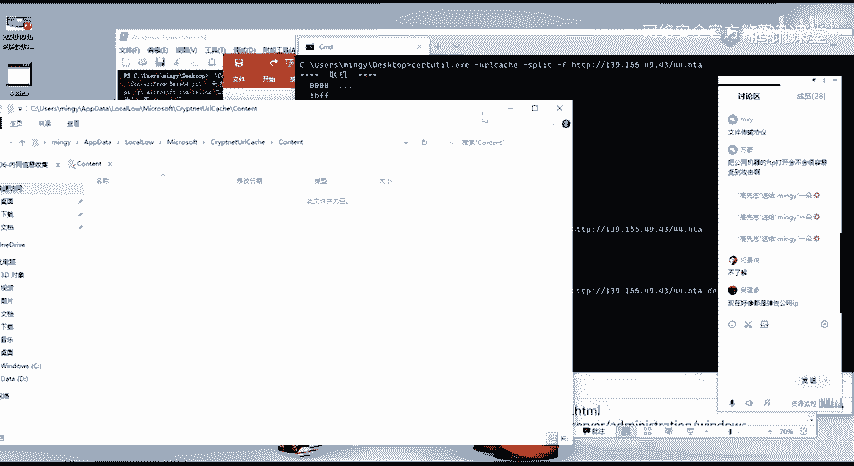

做了一个痕迹的一个清除。这是第3个。呃。后面那个段的话，我们等会再那个我们先休息5分钟吧，先休息5分钟。啊，5分钟之后的话，我们在呃我们在。是。

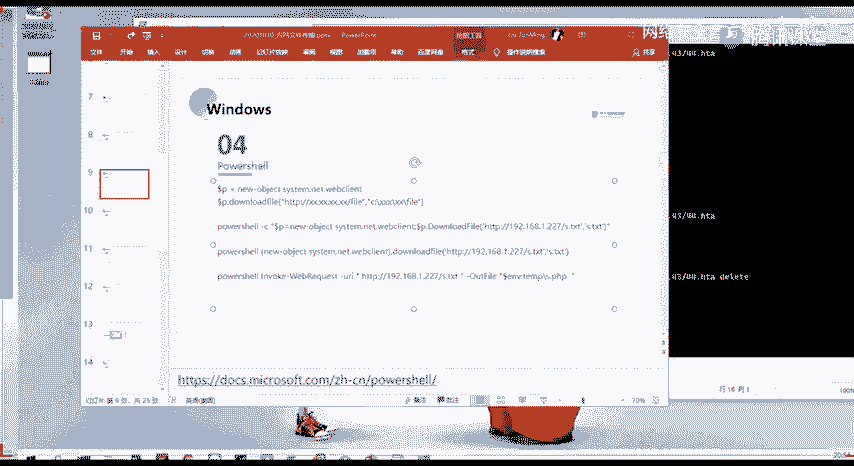

嗯。Yeah。

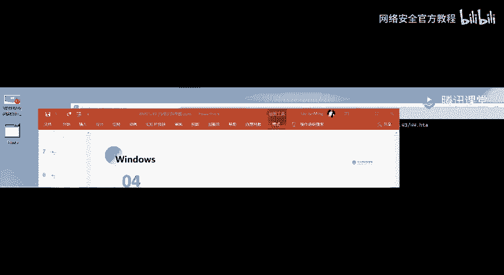

。好，我们继续啊。呃，前面的这三个的话，大家应该没有什么问题吧，应该能理解吧。其实就是。就是利用的就是windows系统下面，它自带的就是原本就有的这样子的一些命令行的一个工具。

这样子的一些命令行工具来去进行一个。进行一个利用利用它来去进行一个呃我们去下载我们已经生成好的这样子的一个木马，或者说啊工具文件等等的这样子的一些内容。应该没有什么问题啊。没问题的话，那么我们继续。

下面的话我们。比起来呢这些就是抛蟹。就我们其实前面在讲信息收集的时候，就已经有介绍了，对吧？就是windows下面的话有这样子的一个pohe的这样子的一个命令行工具。然后这个pohe的话。

它的一个作用的话呃，它的一个作用。它的一个功能的话是很强大的。然后在这边的话，我们可以利用它来去进行一个文件的一个下载。以及执行。以及进行一个呃文件的一个执行。然后在这边的话。

我们首先来看一下这这一部分。这一部分的话是为了就是让大家能够更好的一个理解。我们。

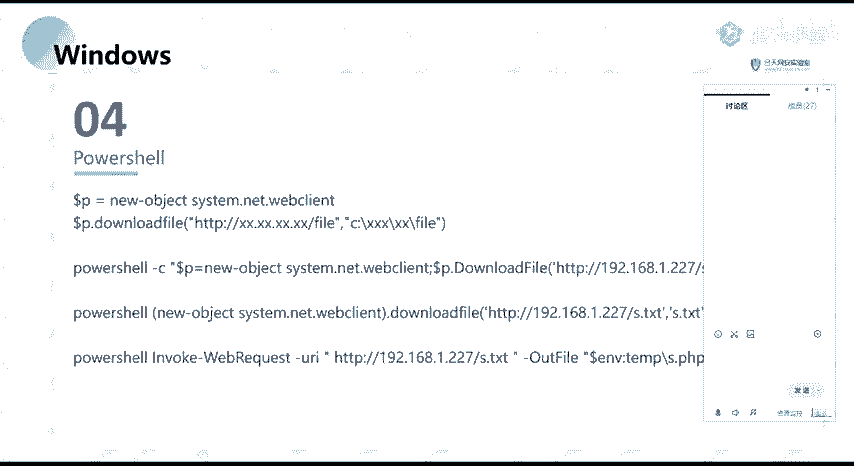

呃。这边。我们在sMD当中直接输入这样子的一个power share，对吧？输入之后的话，它会进入到这样子的一个命令行，对吧？

然后这里的一个power share的一个命令行跟我们原本的一个sM的一个命令行的一个区别，其实就是它在前面有这样子一个加了一个PS，对吧？然，我们在这边的话，我们已经进入了part share。

那么我们首先来看一下第一个啊，我这边就这样。

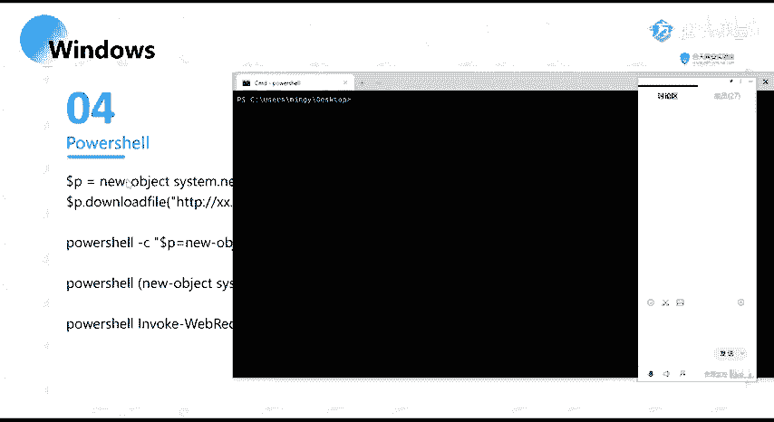

首先来看一下第一个第一个这一个语句呃，我这边的话是把一个就是说把这个文件下载的一个功能啊，把它分成了2块，就两个部分就便于大家的一个理解。

首先第一部分的话就是通过呃new object创建了这样子的一个对象。

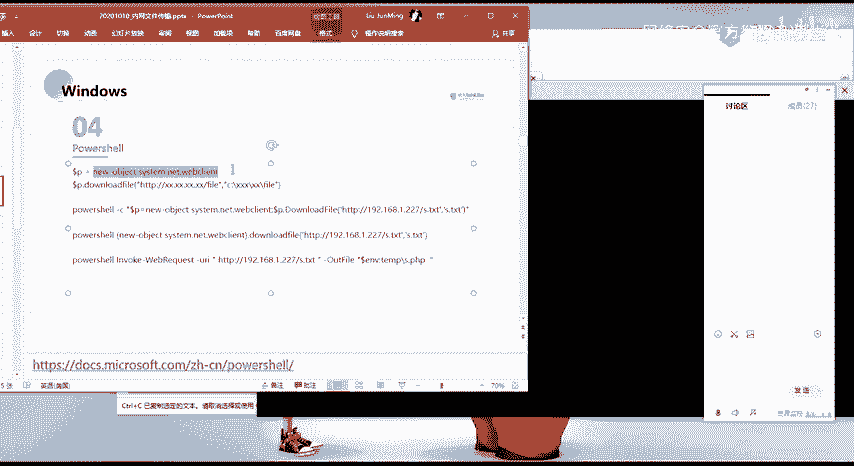

然后的话把这里创建的一个对象的话，把它给付给了这样一个变量P对吧？就多了符号的话就是表示变量的一个意思。然后这边的一个new objectject的话，就是创建一个对象。

这个对象的话是这个stem点net点we client这个这这边的话大家记住啊，就是说就你去碰到这一个或者说你要去写这样子的一个抛的一个脚本的时候，对吧？你就直接能够去直接直接上手写了，对吧？

然后这边的大家可能会有疑问的一个点的话，就是这一个new objectject的这一部分，对吧？你不知道它什么意思。就不知道是什么意思的话，我们可以来看一下。呃。嗯。呃，预期内容。就运行内容这边的话呃。

我也给了这样子的。几个链接对吧？首先这个话就是pro share的一个官方文档。就大家想要去学习po share的一个使用的话，大家可以去在这边的一个p share的一个官方网站上面。

官方文档上面进行一个学习，对吧？就包括它的一个就是它是一个什么东西。对吧。它是一个它是一个他能够去干什么，它有什么作用，以及我们能够去用它，我们怎么去利用它来去写脚本去进行一个开发，对吧？好呃。

第二个的话就是。这样子一个po常用的一个donnet，还有com对象。这里的话就是我们呃这一篇文章大家可以去看一下。这这里的话就是我们。所要去讲到的这一部分。

就这里的一个创建的这个stem点donnet的这一个对象。然后其实在这边的话呃。前面这部分大家自己去看好吧，我这边话我就不一的说了，我们主要的话看这边。

主要的话看后面这边的就是说how share常用的这样子的一个点com的一个对象，以及还有常用的一个顶net的一个对象。

然后呃在这边的话就是说我们所使用到的其实是这一个就是说我们通过port share去呃创建了是这一个顶net的一个对象，对吧？我们可以看其实。嗯。在这边对吧？它是一个stem点net。

然后点web client。那么我们找到这一个。seatem点n。up client也就是这个。那么创建的这个对象，它的一个作用是什么呢？就是说它我们创建的这个对象。

他提供了常用的一个方法来发送和和接收我们URI标识的资源的数据。就是说我们可以通过这这一个对象来去进行一个就是。发送请求，还有接收，就是说资源的一个就是说URLURI的一个资源数据。

就是说呃能够去下载我们指定的这个呃资源的一个数据。然后的话我们回过头来看一下这只边。在这边的话呃。在这边的话，第二句的话主要就是这一个donload fire。

dontload fire的话在这边你可以把它理解成，就是说这一个对象的一个方法。就是说我们创建了这个对象之后的话，我们可以调用这个对象它所提供的这样子的一个方法。

然后这边的一个方法的话就是donload file。从字面意思看的话，我们就知道它是一个就是说下载文件，对吧？就下载文件的话，我们知道就是说其实就是跟我们这边对吧？它提供的。呃。

一个方法来去接收我们指定的一个URL资源的一个数据，对吧？就是其实就是这个donload fire，就是来去接收我们我们这边所指定的这个啊URL。的一个资源。

然后的话把它给就是下载到我们指定的一个路径下面。

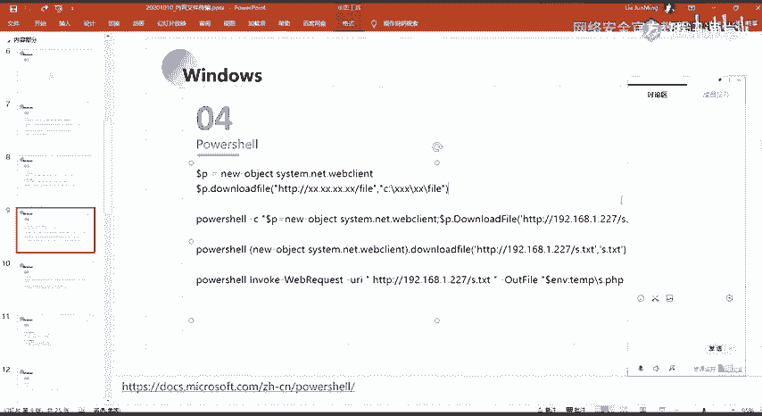

然后我们同样的以这一个就是说。

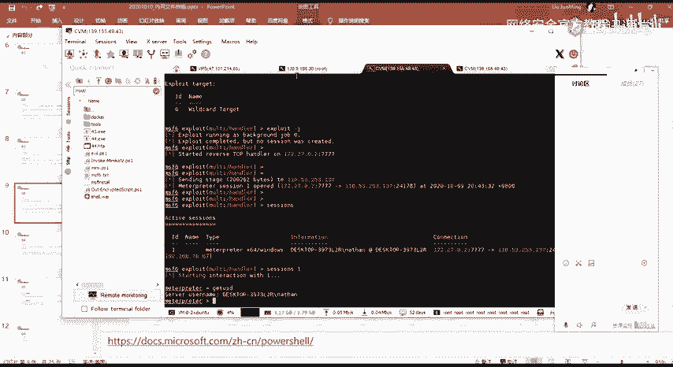

呃。

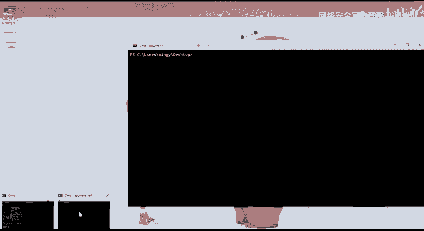

。同样的以这一个。是。同样呢以我们前面所下载到的这个44点HTA的这个文件为例，是吧？

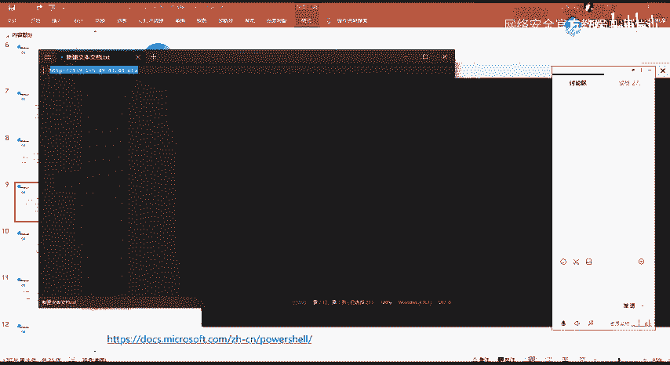

嗯。然后的话呃我们来去通过这样子的一个方法来去进行个下载。首先的话我们要去执行要去执行这一个命令的话，我们首先需要去进入一个po share，对吧？

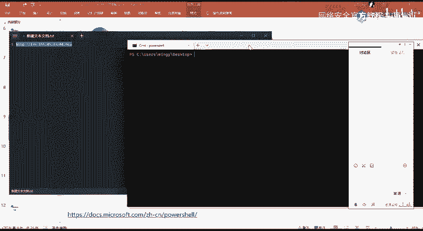

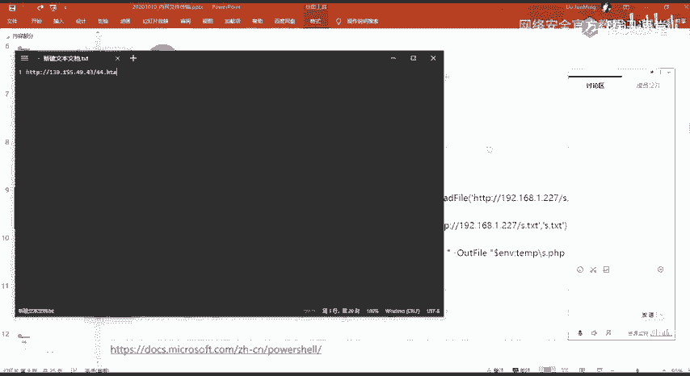

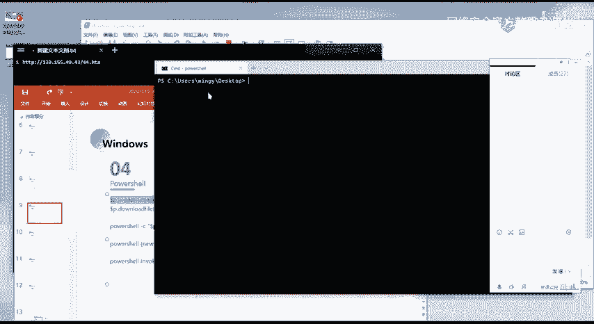

然后我直接粘贴啊，我直接粘贴进去，然后的话。

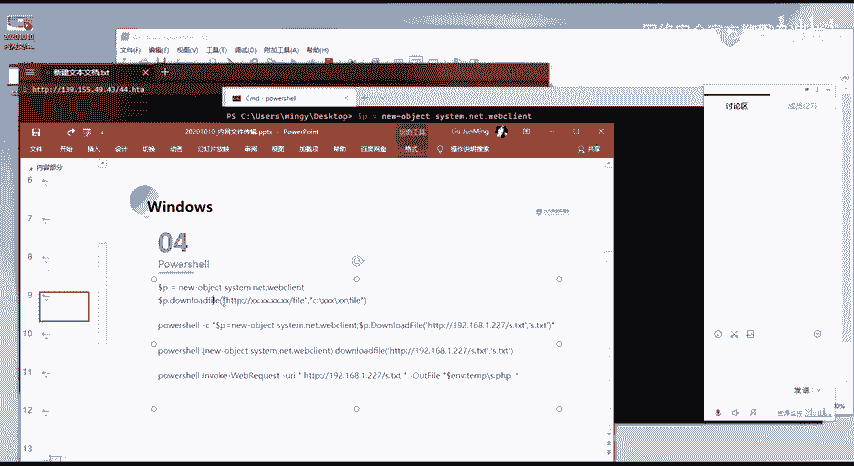

实店我们下载的一个资源的一个呃URL。然后的话指令我们要去就是把它下载到哪里，我这边的话直接就下载到当前的一个录下面。呃，我就。就。444连时店。嗯。Okay。

好后，可以看到我这边执行之后的话，在这边我当前的一个目录下面的话就生成了这样子的一个文件，就说明我通过这样子的一个方法，成功的下载到了我这边VPS上面的这个44点HTA的一个文件，对吧？

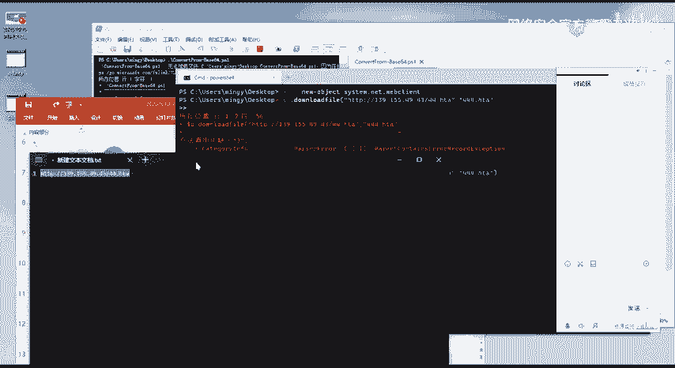

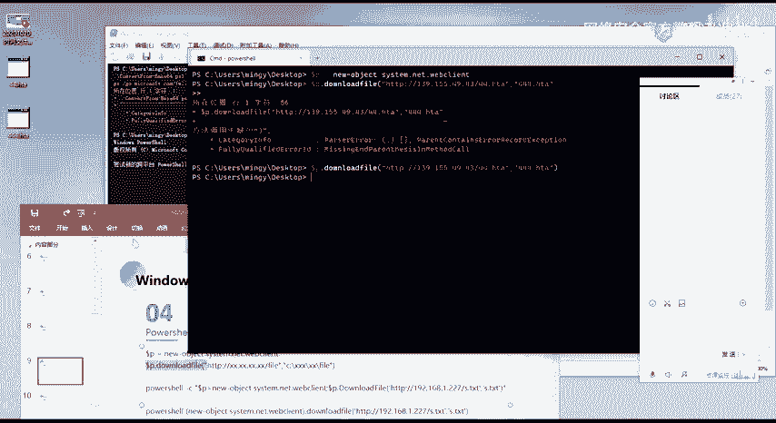

这是一个。好，下面的话。我们通过这样子的一个方法。就其实下面的这一句的话，其实就是跟上面的这一个其实是类似的对吧？只是的话我们我们可以通过这边的一个操作。

我们知道我们首先需要去进入这一个part share，对吧？然后的话我们这边有两条命令，我们需要输入两次，输入两次的话去行一个执行，对吧？那么实际的一个情况的话，我们可能就是说我们。

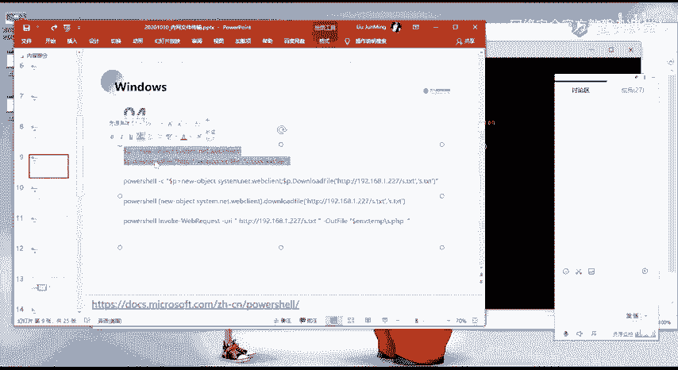

比如说我们通过呃CS对吧？我们通过CS的话，我们执行的通过po share去执行命令的话，我们执行之后的话，它立马会返回结果，对吧？那么我们执行之后的那一个环境的话。

它不是在同样的一个power share下面的。我们要去执行要去进行这样子的这种变量的一个操作的话，我们需要在同一个就是说how share的这样子一个命令行下面的。因为我们这边负责这个变量的话。

它会在就是说在当前的这个po线 share下面，它是能够去找到找得到的这找找得到这个变量的对吧？如果说在另外的我再另外去创一个抛 share的话，他是不知道这个。呃。

找不到这个变量所对应的这一个值的对吧？所以的话我们就说在同一个框式下面的话，去执行多个命令的话，可能就是不会很方便。

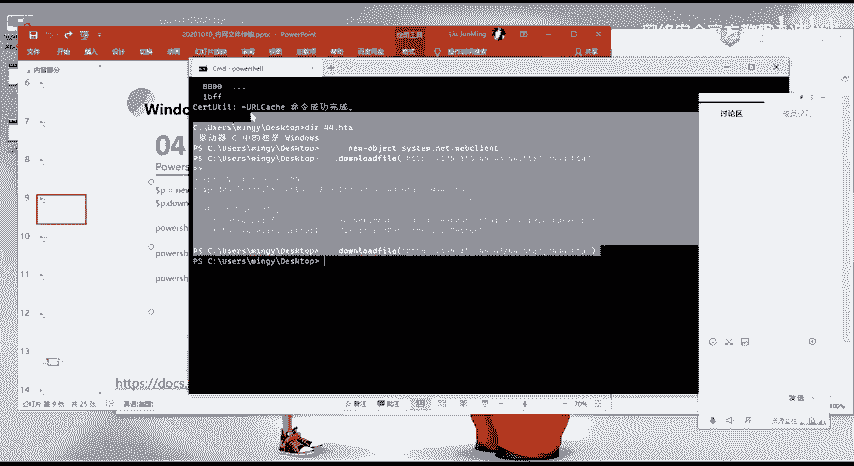

啊，所以的话我们可以通过这样子的一个方法来去进行一个就是把它合并成依句抛选的一个语句来进行一个执行，来达到上面的这样子的一个目的。然后我们来看一下，就是说这边的这个语句，它的一个意思。

这一个语句它的一个主要的一个呃点的话就是这一个杠C的这个参数。这个杠C的这个参数的话就是抛 share的一个。

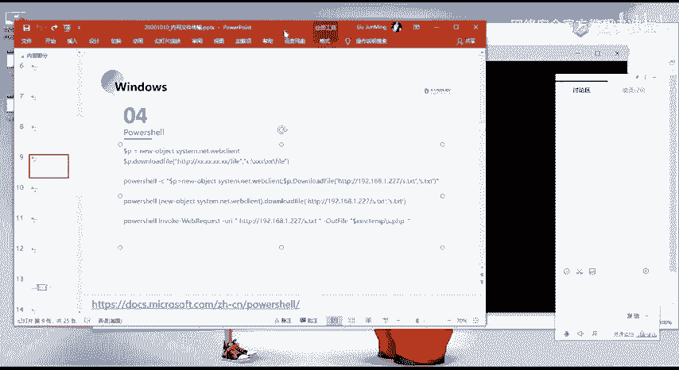

呃，比较常用的一个参数。我们可以通过posure。干问号来查看，就是说part share下面的话，我们可以接哪一些参数对吧？可看到在这边的话，它有这样子的一些参数。

然后的话呃我这边的话我不会一一的去讲，就是。

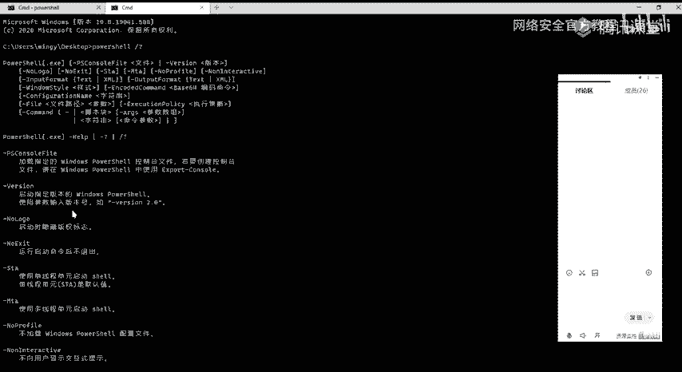

关于更多的这样子一些东西的话，他你自己去查看好吧，而且就是都是中文的对吧？有描有对每一个参数的一个描述，这个的话应该很容易理解对吧？然后在这的话我们。主要的话就是看这个杠C这边的这个杠C的这个参数的话。

它其实是指定的，就是说是这个干comend的。

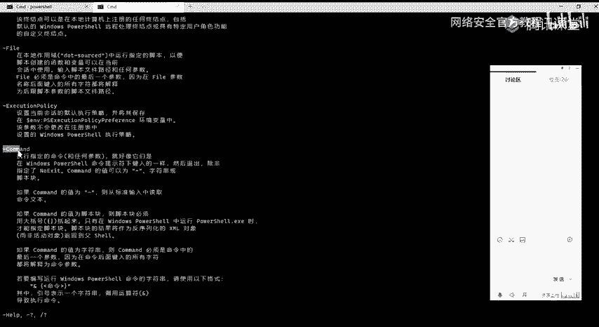

就是说我们可以通过杠C来去就是表示我们的一个参数的话就是这个com呃杠com。

从它的一个字面意思的话，就是执行我们指定的一个命令嘛，对吧？com on的话就是命令的一个意思嘛。然后的话我们通过杠C参数，后面的话我们指定可以指定相应的一个命令以及参数来去进行一个执行。

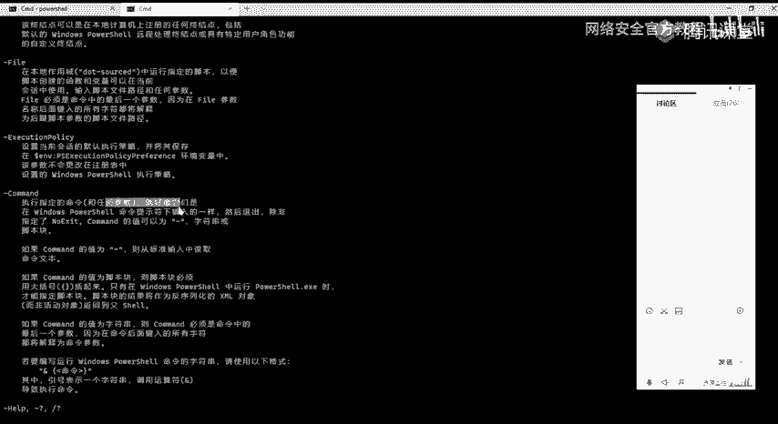

然后在这边的话，我们所要执行的话，其实就是这一个。就是这一部分。对吧这一部分的话其实就是我们这边上面的这一部分的一个内容。我们通只是通过分号做了一个分隔，对吧？然后的话把它放到了一行命令当中。

直接去进行一个执行。嗯。😊，然后呃在这边的话，它所下载的一个呃文件的话是。这一个当的话关于下载这个文件的话，我们可以就是你自己想要去下载什么，你就更改成什么样子的一个文件，对吧？好，呃。

下面第三个的话就是。呃，使用p的另外的这样子的一个就是写法，就是它它的一个作用的话，它其实跟上面的两个的一个作用的话，它其实是一样的。只是呃它的一个写法以及表示的话，会稍微有一点区别，对吧？

就是大家在碰到，比如说碰到别人去写的这样子的一个的一个脚本，对吧？它是通过呃，这样子的一个形式去写的，你不要觉得奇怪，对吧？其实它的一个作用的话，它它的一个作用其实跟上面这个这个都是一样的，对吧？

只是我们可以看一下它的一个内容的话，其实就是通过new object来创建了这样子的一个对象，对吧？创建了这个donate的一个对象。

然后的话调用了它的这样子的一个donify的一个方法来去下载我们这边指定的一个资源，对吧？下载到本地的一个保存成一个S点t的一个文件，对吧？这个的话应该。

这里的这一句话是能能够比上面就是能更加直观的去理解，对吧？而且其实这样子的一个写法的话，就是就更加就更加方便嘛。可以看到就是已经就比上面的话还要短，对吧？然后下面的话就是另外的一种方法。

我们上面的话是通过创建了这样子的一个呃s donnet的一个web client的一个对象，对吧？然后的话通过调用这个对象的这个donorify的一个方法来进行一个文件的一个下载。啊。

而且是抛下面的话有这样子的一个呃呃方法，或者说。呃，函数。有方法吧。就是这个invoer杠web request。这个然后呃这一个invo web request的话，它的一个作用。

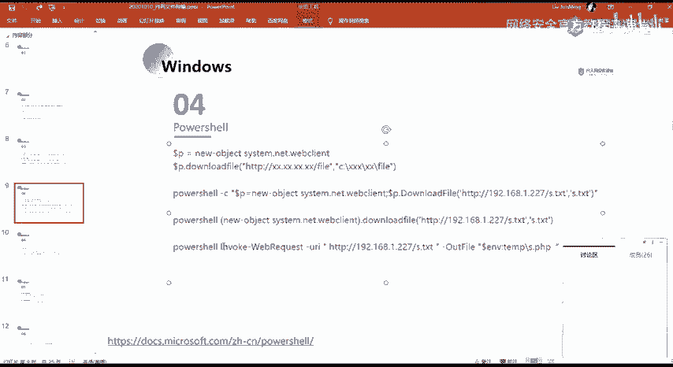

我们可以通过就是说。我们首先的话进入到夸 share当中，然后的话我们。因为。大家现在他不知道他什么意思，对吧？那么我们怎么去知道，就是说比如说你看到别人写了这样子的一个语句，对吧？

你想要知道他使用的这里的这个呃方法它是什么意思，对吧？那么我们可以通过在p当中输入一个help然的话接我们这边的一个啊inmo web request的这个方法。来去查看。

就是说这个方法它的一个详细的一个呃详细的一个使用。Yeah。然后可以看到在这边它的一个语法的话就是invoke web request，然后的话加这样子的一个干URI的这样子的一个参数，对吧？

然后后面的话接我们的1个URI，也就是我们的一个呃资源的一个地址。然后的话后面见我们那一个common per，这边的一个 commonmon per的话，其实就是我们要存储。

就是说把我们这边的这样子的一个啊文件把它输出到哪里就。

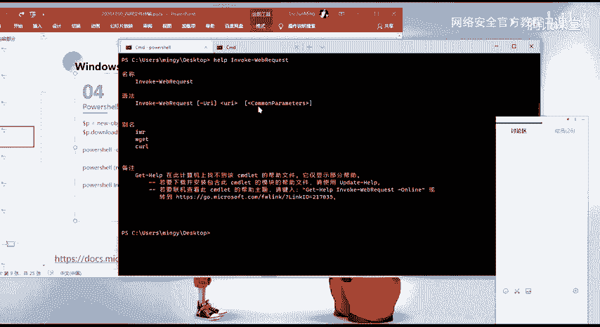

具体的话我们看一下这这样子的一个例子。

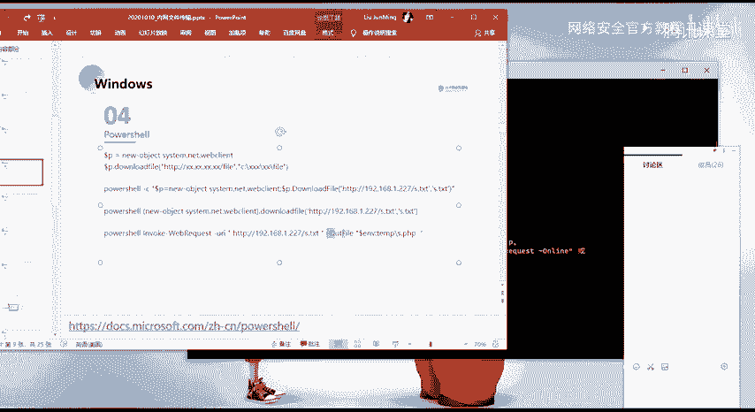

就在这边的话，我们呃使用的是这一个刚out out fire的这样子的一个参数。

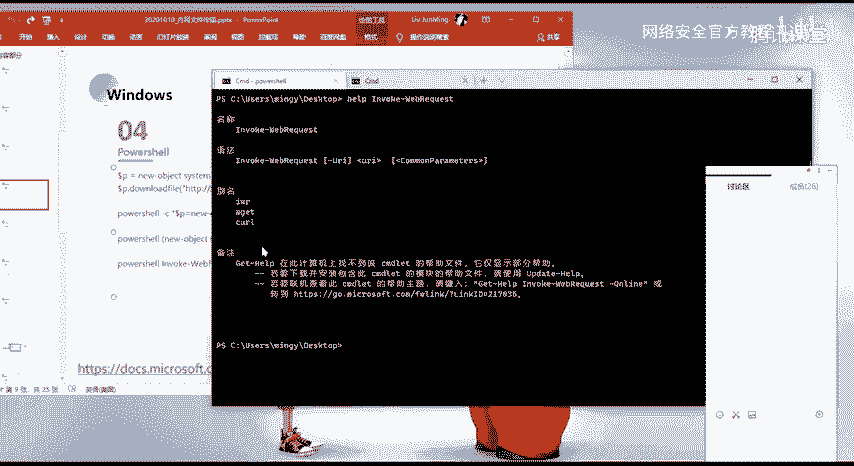

这样子的一个参数，然后的话把我们前面所请求到的这一个资源，然后把它保存到我们本地的这样子的一个路径下面，对吧？然后我们可以看一下它的一个效果。

我这边的话同样的以就是下载那个44点HTA那个文件为例。

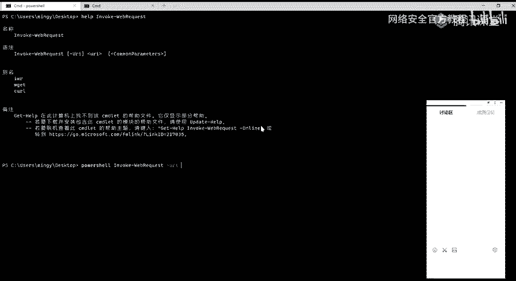

我这块直接粘贴啊。呃，还有的话在这边大家要注意啊，就是之前的话也有挺多同学就是问我，就是就是截图发我这样子的一个问题啊，就是为什么会报错。

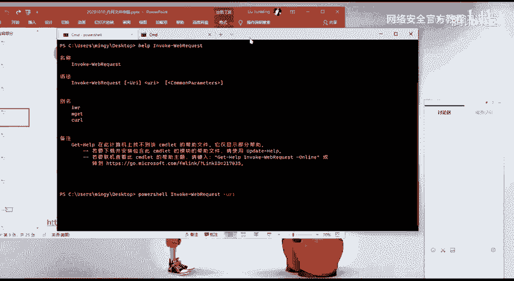

就是其实大家你去认真的去看我的一个命令的话，对吧？你会发现就是说。我就是这种power share的一个面的话，都会加这样子那个power share，对吧？就前面有这样子的一个抛。

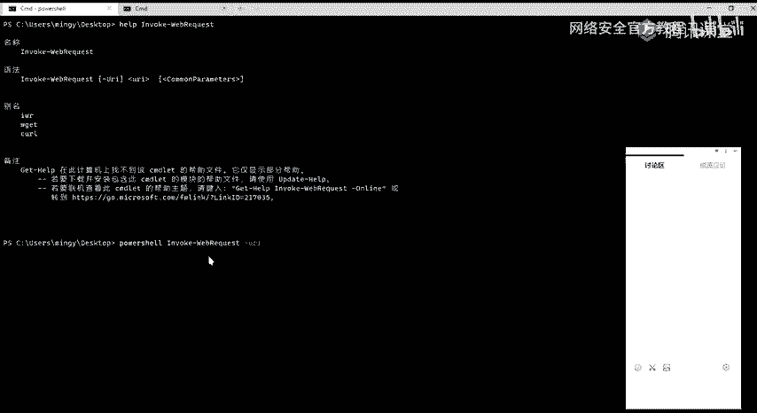

就说加这个抛 share的话，其实我们这边的一个执行的话，就我们得到的这样子的一个share。我们原本得到的一个share。像比如说1个CMD。

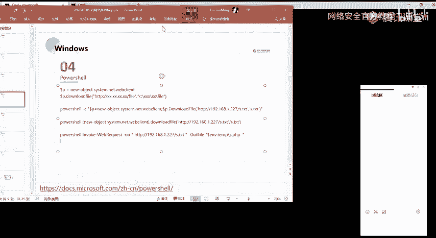

好吧，像比如说我们在windows系统上面，我们得到了一个he，其实是一个在CMD的这样子的一个环境下面，对吧？我们反弹的一个he。那么我们要在CMD环境下面去调用这个p share的话。

调用p share来去执行相应的一个命令的话，那么我们需要去加这样子一个p share来去就是说告诉CMD，我们要去使用这个p share来去执行后面的这样子的一些命令，对吧？

但是的话如果你已经进入了p share。那么你加这个p share你。

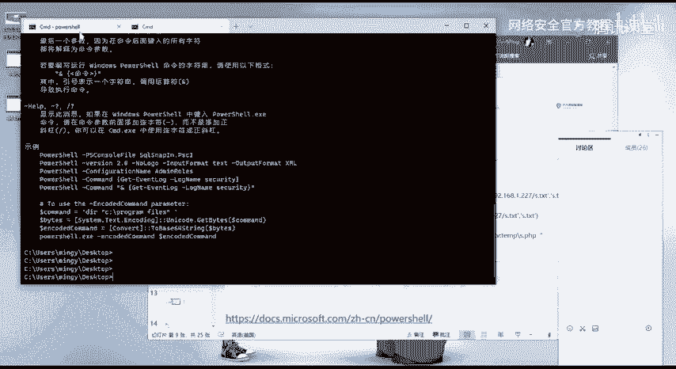

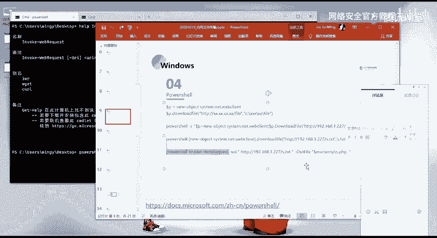

它就是一就是重复的对吧？然后的话你在抛线下面，你去使用这个抛线来去进行一个面的一个加载的话，它会有一个它会报错的。所以的话我们一般的话就是你在CMD当中去进行一个这样子的一个执行。

当然的话如果说你比如说呃像MSF当中的话，像MF当中的话，就是说你可以去反弹反弹回一个power share的一个 share的。就是说呃一般的话我们就是指定的一个配load的，对吧？

指定的一个配load的，就是反弹的一个需的话，它是一个像比如说mat的，还有的话就是像那个sh的对吧？这样子的一个线。还有其实我们如果说windows系统下面的话。

我们其实也可以返返回一个power share的一个 share。就是说我们反弹的一个 share的话，就是直接是在power share的一个环境下面的。

然后的话我们可以在这个 share下面去执行power share的一个脚本以及命令。这个话大家可能。呃，没有去注意啊，就是你可以去查看那个呃payload的。

就是windows下面的payload的话，是有po share的这样子的一个payload的。以及它的所对应的一个呃模块。好，然后在这边的话，我们使用这一个in work web request。

然后的话干UI指定我们要去下载的一个资源。我觉的话同样的以这一个为艺。然后的话下载到我们指定的一个目录下面。呃，在这边的话。

我们看一下这边，我这边的话是写的是多了 enV，然后的话t，然后它后面的话接我们的一个保存的一个文件，对吧？然后其实在这边的这一个多了 enV的话，它其实就是说在power share当中话。

它表示的一个意思，其实就是我们的一个我们前面所讲到的那个sstem root。

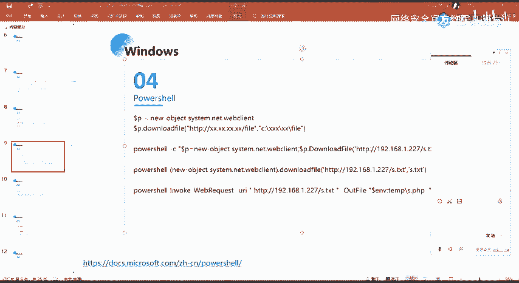

就是在CMD下面，对吧？我们可以通过apple。呃，百分号百分号啊。其实很样。来输出就是说你当前系统下面的一个就是系统的一个安装目录，对吧？就是这个Cwin。然后在p share当中的话。

我们可以通过这个多了NV来表示就是说。

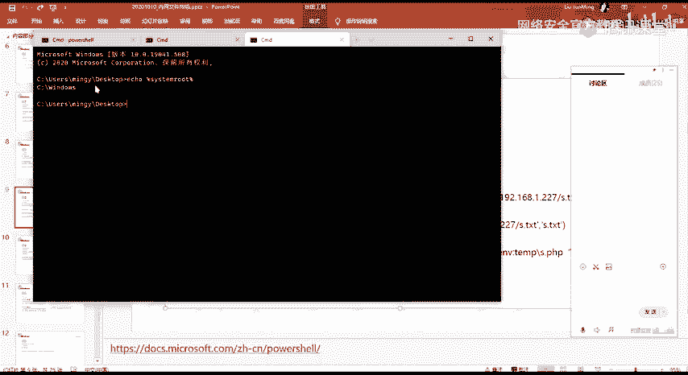

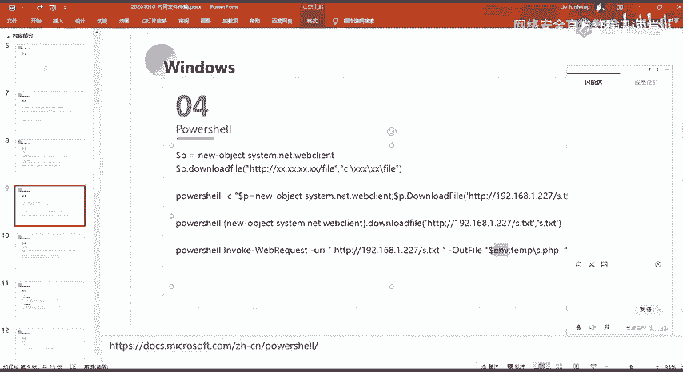

我们当前的一个系统所安装的一个目录，其实就是这个Cwin的是吗？就一般的默认的话，它都是在这样子的一个C盘目录下面，对吧？

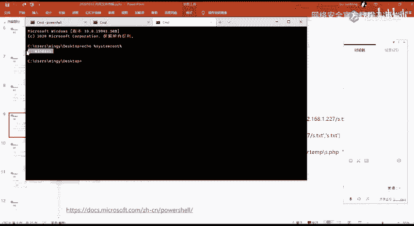

然后其实在这边的话，它就是在C盘的一个windows下面的一个t目录下面，就是保存到了这一个目录下面去。

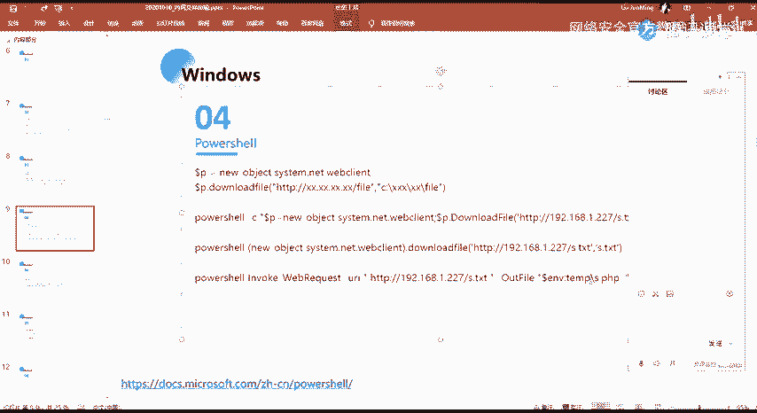

然，其实我们也可以就是自己去指定，比如说。我这边的话就保存到D盘的一个。呃，D盘目录下面，然后的话呃444点HD。是。接受时间。可以吗？

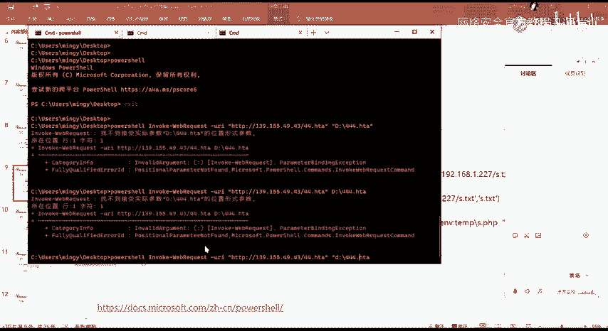

第个。哎，不能吗？

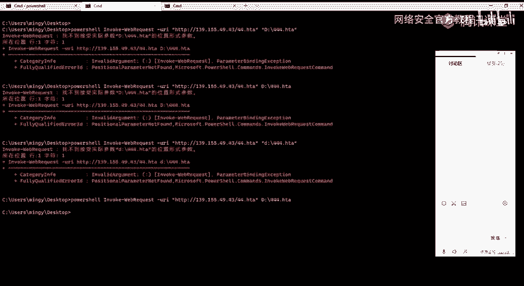

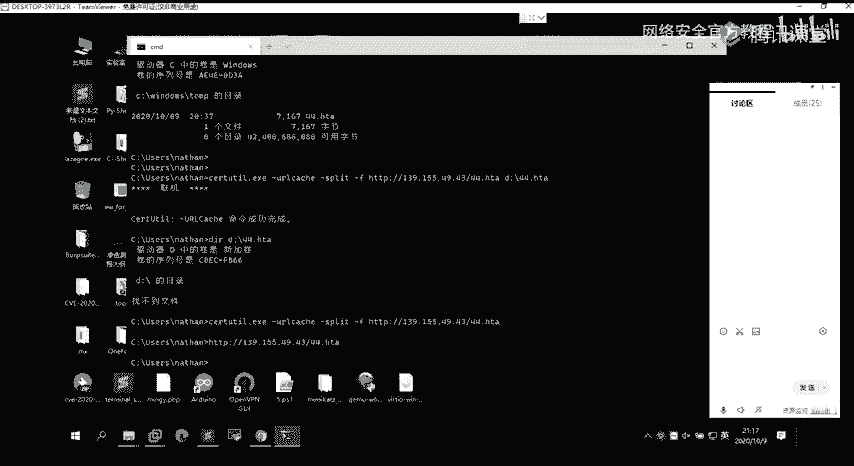

嗯。好好。这边。这边少了一个参数啊，我忘了，就是刚out fire。需要加这样子一个参数，然后的话再去指定我要去保存的这样子的一个路径，对吧？我说怎么一直报错。

少了这样子的一个ge out file的一个参数，就是指定我们保存的一个路径。然后在这块，我们再去这个目录下面去查看。就是第一盘下面我们可以查看是否有这样子一个文件。事实。对吧可以看到呃。

我们这边的一个面化已经成功的执行，就下载了这样子的一个知试点。

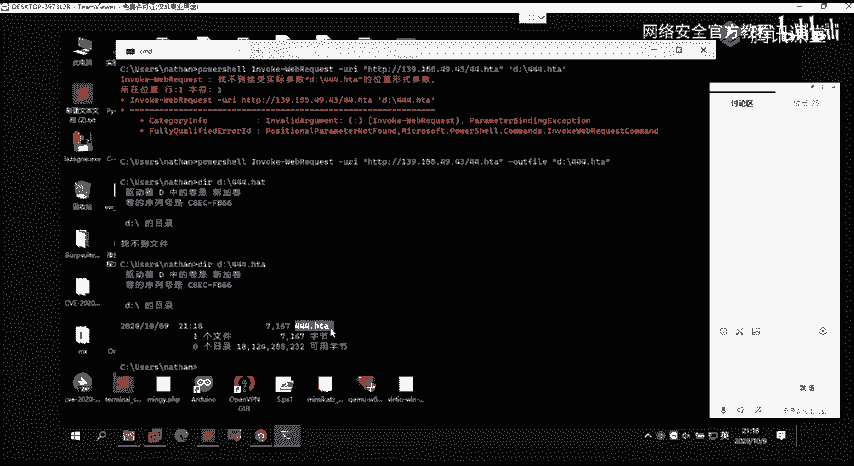

HTA的一个文件对吧？

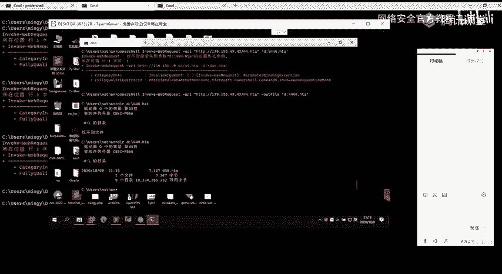

啊，呃其实我们也可以通过这样子的一个方法，就是加这个多了烟V。

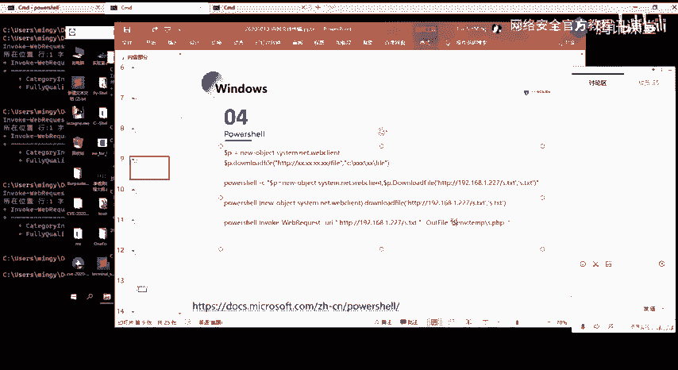

就是保存到我们的一个windows下面的一个。呃。看看目录下面。う。然后看我们DII市场下面的一个windows。今嘛。对吧可以看到已经就是存在了这样子的一个文件，对吧？

就是我们刚刚通过这样子的一个命令下载的这样子的1个HTA的1个木马文件。

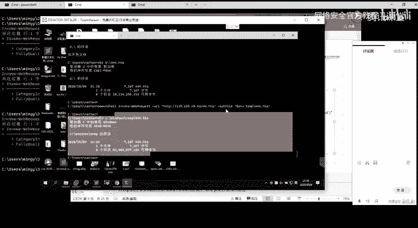

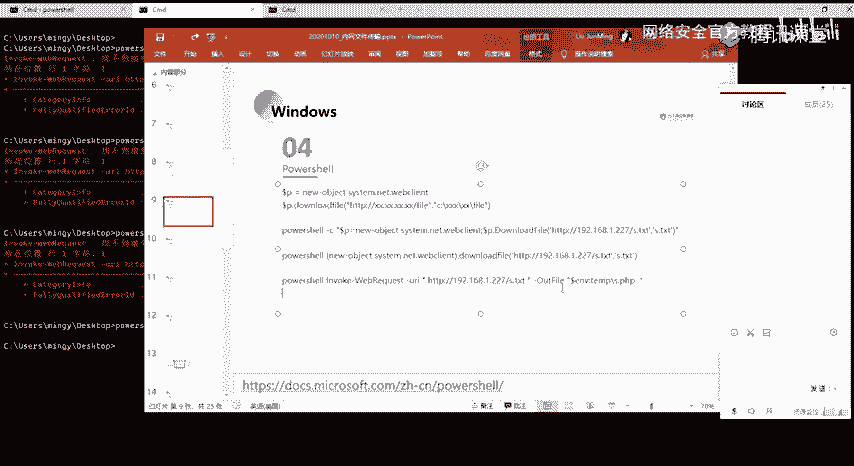

嗯。啊呃，以上的话就是po share的一个使用po share的一个方法来去进行一个文件的一个下载以及木马的一个下载。其实我们这边的一个文件的一个下载的话，大家可以就是灵活的就灵活。

不要说局限于就只是一个文件，对吧？就比如说你需要某一个工具对吧？或者说你你可以去下载任何就是说这种文件的一个形式，你想要去把这个文件下载到啊，我们的一个目标机器上面去，对吧？

我们可以使用这样子的一个方法。然后呃还有的话在这边要提一下，就是这个invo web request。就其实我们刚刚的话在这边我们通过help查看它的一个呃使用方法的时候，在这边有一个别名，对吧？

就是IWR，还有we gett CL这这三个的话其实都是这一个的一个别名，就别名是什么意思呢？就是说我们可以使用这样子的一个方法来去调用它。

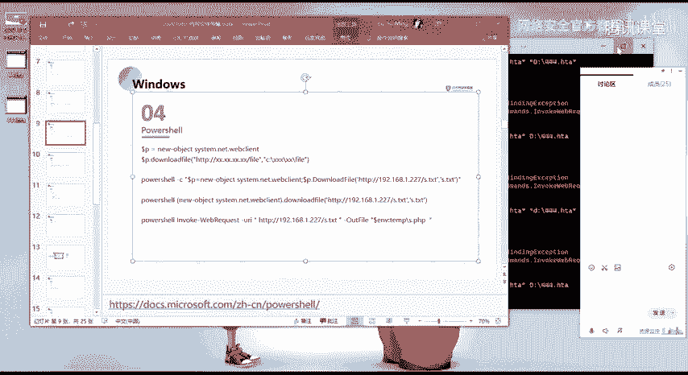

啊，其实使就是使用这一个就等价于就是使用的这一个。那么我们可以通过这样子的一个方法。

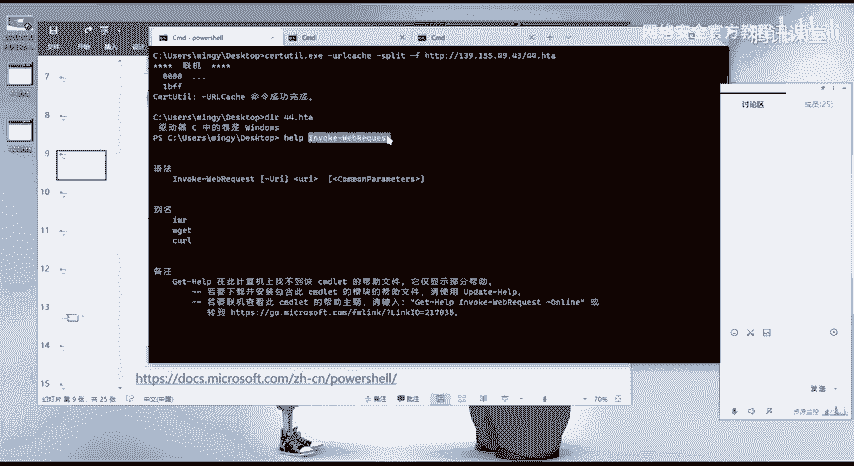

就是。好后去。就说啊呃他打你啊。然后的话UY。指店我们这边。Yeah。4545。然后我们执行对吧？然后可以看到在这个第一盘的一个目录箱里。我们可以。查找到这样子的一个刚刚下载的这个HTA的一个文件。

对吧？就使用的是这个IWR。然后的话其实我们也可以通过使用we get。就parture加we gett，就像we gett还有CRCRL这种的话，是在linux下面的话，一个命令命令嘛，对吧？

其实我们等会也会讲。然后在这边的话，它是作为就是在window下面这一个invo web request的一个别名。就其实如果你不记住记不住这这么长一串的话。

你可以记就是weget还有CL或者说IW啊这样子的一个呃。这样子的一个方式。可以看一下446。

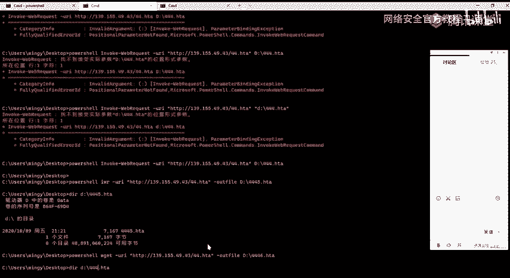

都是可以的CL也是可以的，我这边话就不演示了。好呃，下面的话就是一个就是实际的一个例子。就是说通过po share来去加载我们远程的这样子的一个po share的一个脚本来访他 share。

其实这里的话呃，其实我们后面再讲马上 share尔的时候也会讲嘛，也会讲这个就是利用po share的一个方法来去加载我们的一个po share脚本来访他 share。

以及来去执行相应的就是说呃来去加载使用po share脚本所写的一些工具。像比如说minicast，minicast的话也同样的有po share的一个加载的一个脚本，是吧？呃，其实前面我们已经有讲了。

然后在这边的话，我们以这样子的一个实际的一个例子就是。来就是给大家演示一下，我这边呢通过MSFV norm来去生成的这样子的一个就是哈希尔的一个脚本。这个脚本的话，它是一个反拉希尔的一个脚本。然的话我。

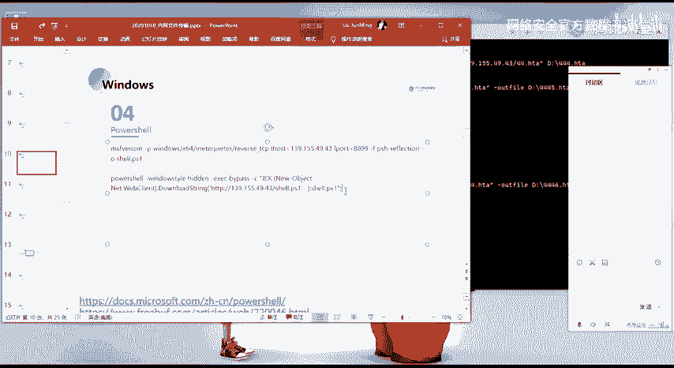

把这个脚本的话就是。我是在。这个机器上面。傻人。是。这个的话是我已经提前生成了，有这样子的一个需要点PS。PSE的这样子一个抛弃来了一个脚本啊，然后的话呃首先的话我先。

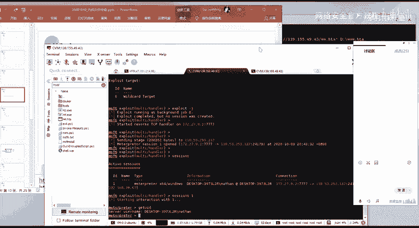

在MSF这边做一个今天。就是今天我们等会儿我们在这边执行这一个。

通过抛 share的一个方法去执行的话，他就会去加载我们这边访他 share的一个脚本。然后的话反他到我们这边那个MSF。所以的话在这边的话，我先。

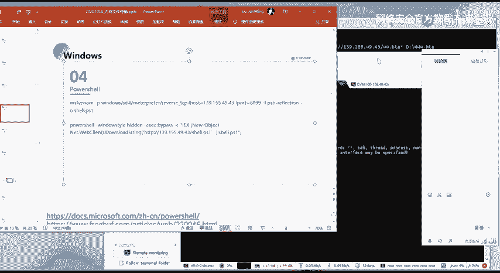

今天。建立一个今听器。呃，这边的一个端口的话是8888899。没错。Yes。

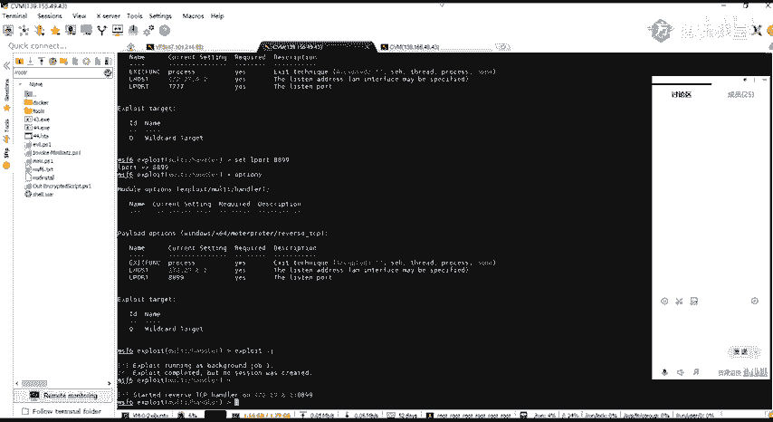

好，已经静力了这一样子这样子的一个惊听器。然后的话我们通过这样子的一个花絮的一个脚本。

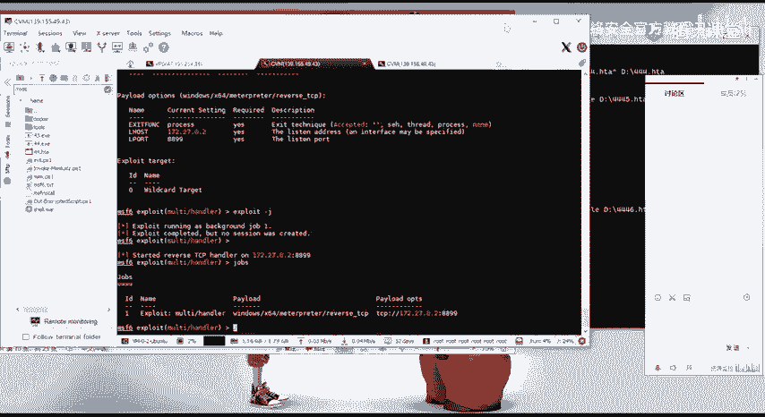

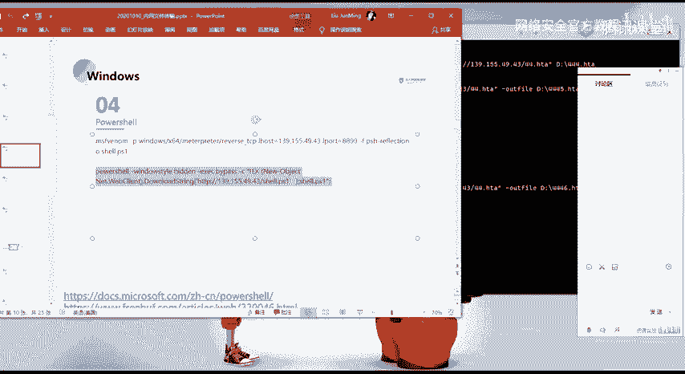

来去加载我们远程的在这个呃EPS上面的这个part share的一个厂商sha的一个脚本。然后大家在复制的时候就是复制我PPT的时候，一定要注意，就是一定要注意。

就是你我建议大家就是先在自己的这样子的一个编辑器当中，对吧？你粘贴过来，因为你在编辑器当中的话，其实你就能够比较明显的去查看就是这一些标点符号。其实主要的话就是标点符号有括号等等。

这种一定要使用英文的一个形式。你使用中文的话会报错，对吧？就其实很多时候很多时候的这种命令的一个执行的一个报错。其实就是大家呃。不够细心，就是你去细心的去检查你的这样子的一些面令的话。

你会发现其实就是这种报错的话，其实很很简单，对吧？

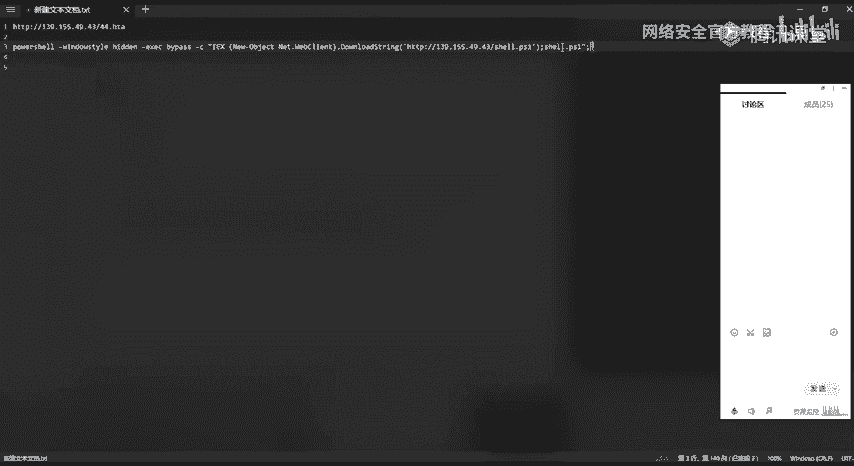

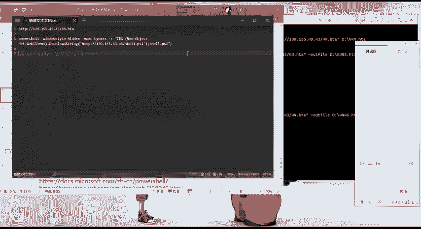

然后我这边的话在嗯。这一个机器上面吧。执行我的这样的一个抛屑的一个脚本。

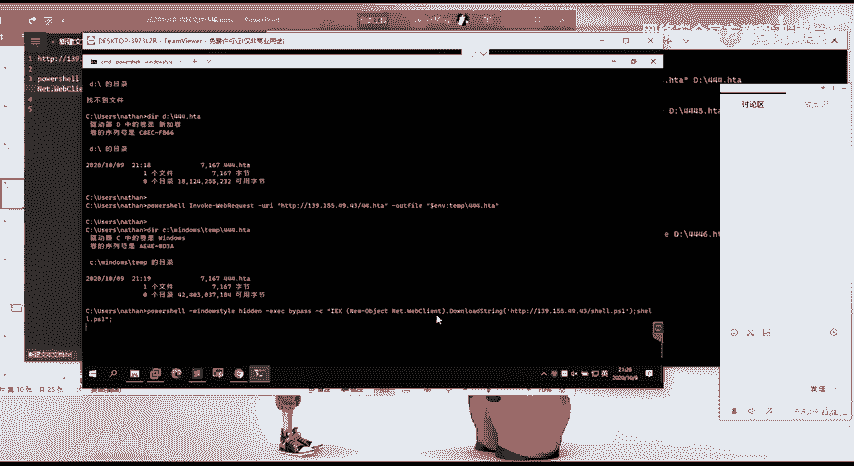

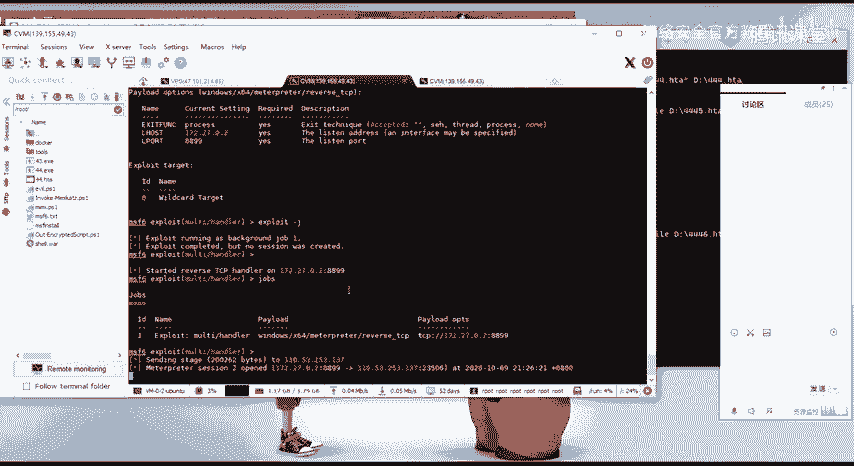

然后我在这边执行之后的话，可以看到在这里的话已经反弹回了一个去。

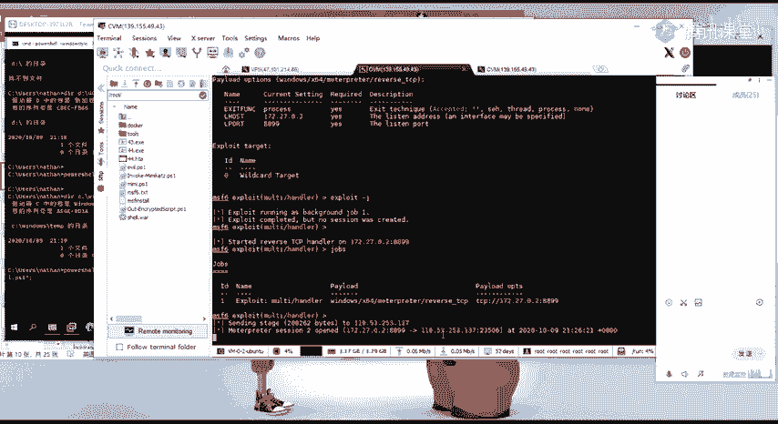

对吧反他的一个需要的话，就是我这边所执行的。然后呃。在这边它没断掉的话，是因为。我打开一个摄像机吧。因为呃这边的话是一个就是。这个。Wdows tenmina。稍微。然们有点不一样。

我这个话我再弹一个回来。我这边执行嗯。可以看到我在这边执行之后的话，它会就是刚刚所进行的那个CMD的那个CMD的一个窗口，它自动的关闭了。对？然后的话反弹回的一个需。

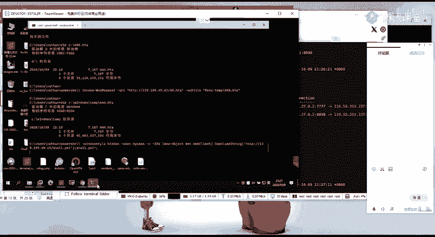

返回返回了一个申选3，对吧？对吧，然后其实在这边的话，我们再回过头来去查看一下，就为什么它能够去达到这样子一个效果。

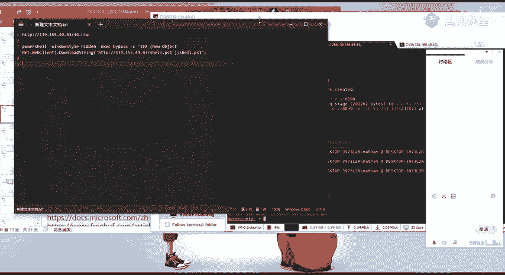

就其实主要的话就是我们刚刚。我们这边的这样子的一个参数啊，就这个干windows style our hide。

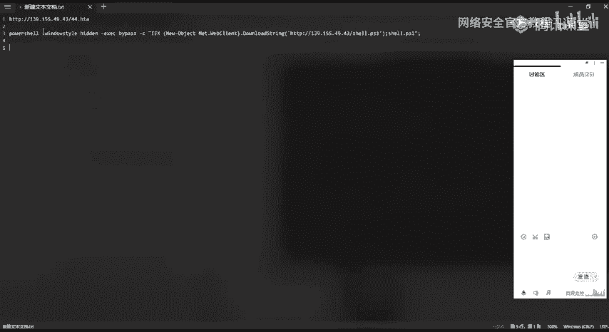

哦，我们刚刚的一个效果效果的话，就是我执行这个p的一个脚本。我在这个CMD窗口下面执行之后的话，它的一个窗口立马就关闭了，对吧？

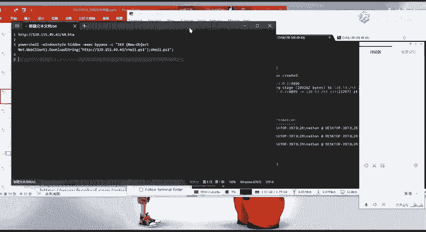

然后它的一个呃达到这个效果的一个参数啊，其实就是这个这个这个参数它的一个意思的话就是呃我们这边执行执行之后的话，它会去把我们的这个窗口给关闭掉。然后这个的话在这边的话。

关于这个参数，它还有呃。

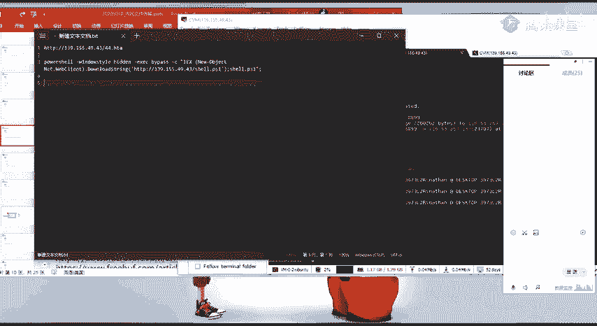

他还有其他的几种表示。我们可以在抛 share当中来去查看。就是这个干windows style。他这个参数它的一个意思的话就是将我们的一个窗口样式设置为就是nm的话就是正常，就是正常的话。

就是我们就是这样子的一个窗口，对吧？然后minmin指的话就是min的话就是缩小嘛，对吧？就是最小化。maxmax的话就是最大化嘛，h的话就是隐藏。

也就是说把我把我们这边的一个这个窗口执行的这个窗口给隐藏掉。然后我们这边所使用到的话，其实就是这一个。

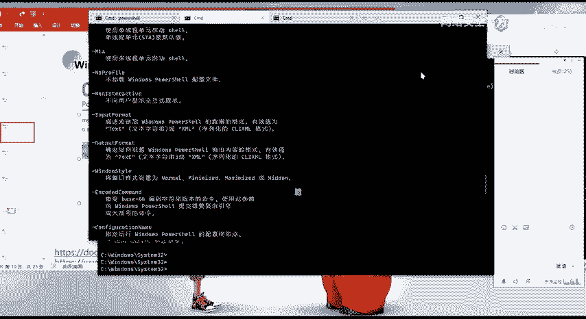

然，其实在这边的话。

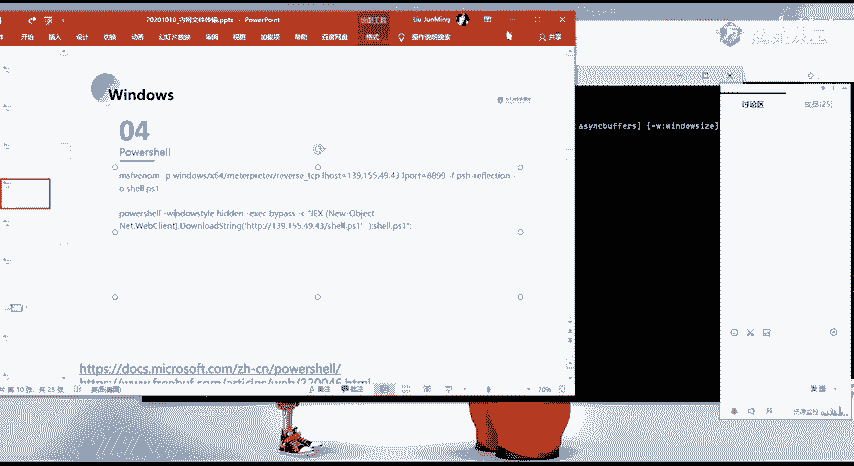

嗯。其实在这边的话不需要去写这么长啊，就是在抛弃当中的话，我们可以就是通常的话，你看那些脚本的话，通常它都他们都是这样子写，就是干W加hder。就不需要写后面的这一个这么长一串，我们直接通过杠W。

然后的话h等来去进行一个指令就可以了。以及呃这边的杠EXEC bypas的话，就是呃指令我们执行的一个策略。呃，这个执行策略的话前面有讲吗？应该我记得是有奖吧。呃。我前面有讲嘛，就是有讲的。

我有点忘了呀，前面在讲话学的时候有讲这个嘛，就是执行策略就。知道的说一下。对。就大家知道这个嘛？嗯，怎么没。呃，大家还在吗？在的扣个一。不知道。有知道的扣个一。嗯。

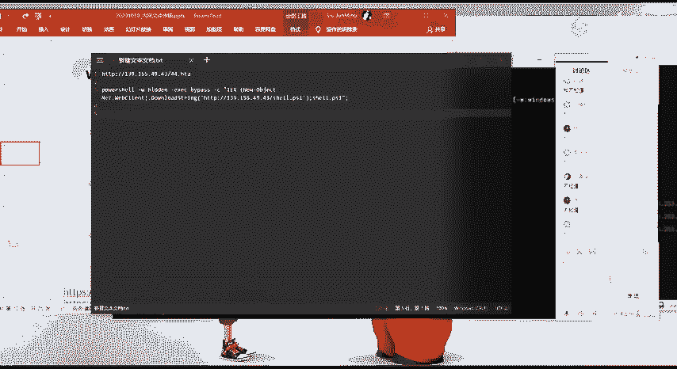

我前面没讲吗？呃，好吧，那那我在这我这边的话再讲一下吧，就在这边的话，刚刚EXEC by pass就是指定我们的一个执行策略。啊其实我刚刚在这里的话，其实也有做这样子的一个操作，对吧？

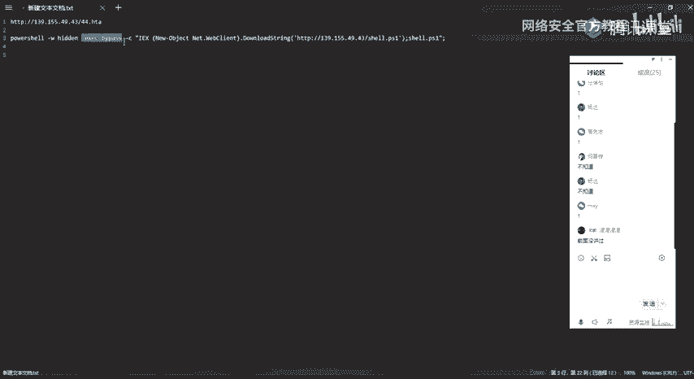

呃。在哪呢？这个。Yeah。あ。

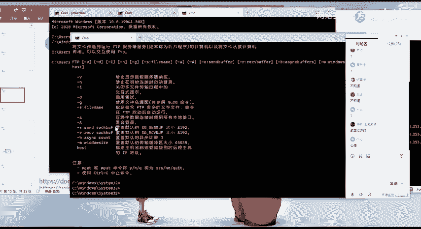

Yeah。怎么。用出来拿。

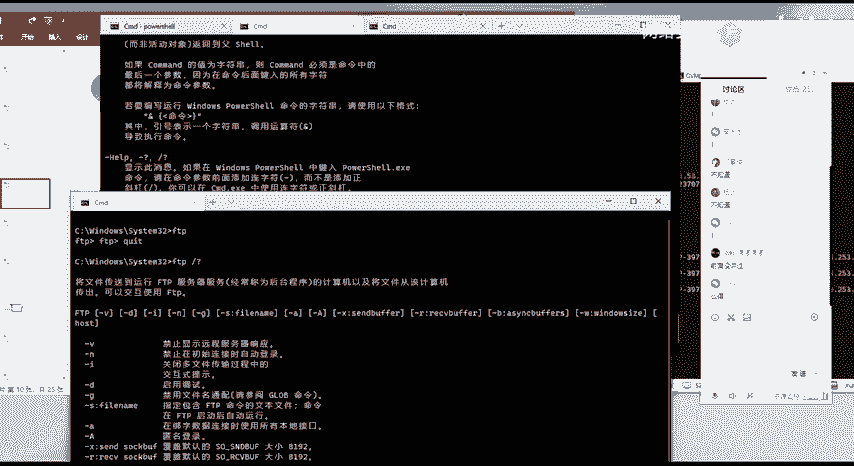

啊，这里。我在这边的话，其实也有去执行这样子的一个操作，对吧？然后在这边的话，我们可以看一下，就我这边去进行一个加载我这边所写的这一个pos弃的一个脚本，对吧？然后在这边去进行一个加载的时候的话。

它有这样子的一个报错，他说无法去加载这样子的一个文件。因为在此系统上面禁止运行脚本。

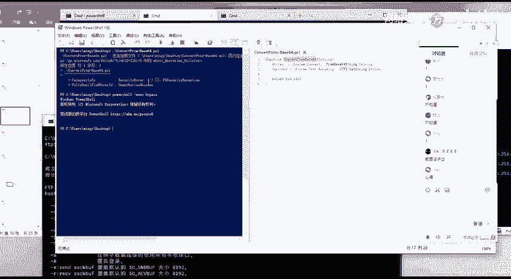

就什么意思呢？就是说windows系统下面的话，它就是有这样子的一个，就是在框学下面有这样子的一个执行策略。就默认的话，它是禁止你去呃去加载这种其他的一个脚本的。

那么我们在这边我们要去加载我们自己的这样子的一个。这种所写的一个脚本的话，我们就需要去更改我们的一个执行的一个策略。

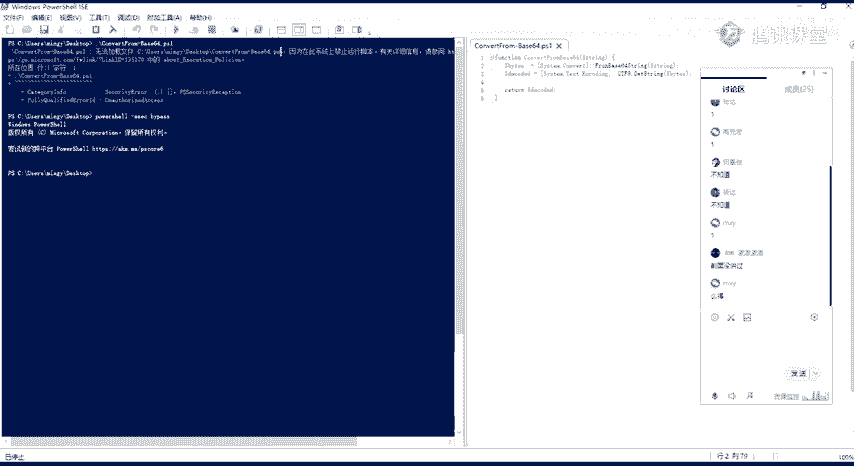

然后这一个执行策略的话。呃，我们可以在。

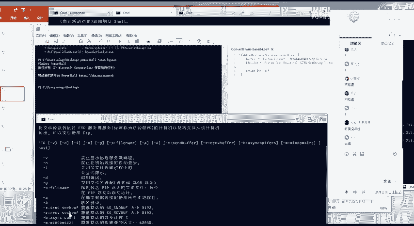

所。就是这个SQ。呃，poliice这个的话就是设置当前块化的一个默认的一个执行策略。

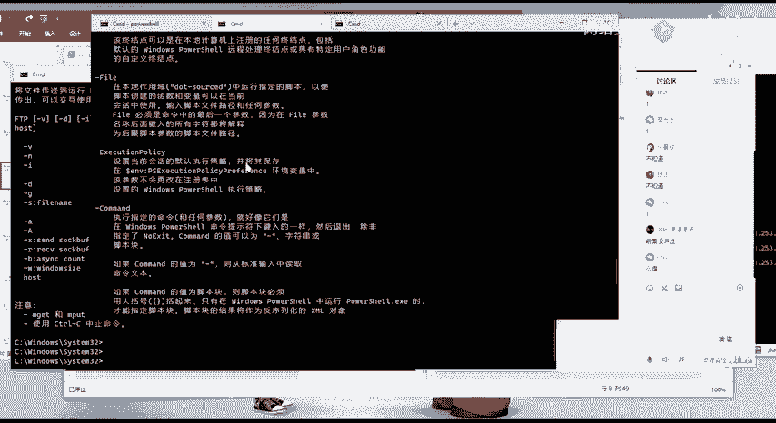

然后呃。嗯。

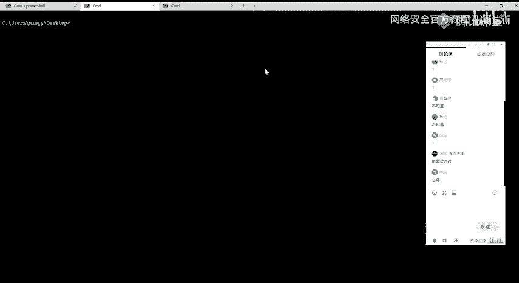

嗯。呃。看一下啊，预习资料里面我忘记了那个就是查看执行策略的那个。

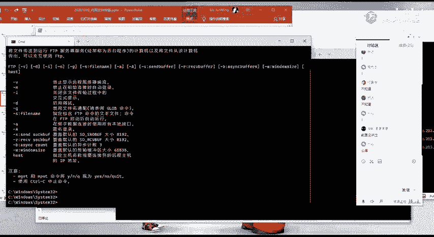

🤧嗯。Meニ。做错我。嗯。就是这个在这边。怎么去查看那个车？

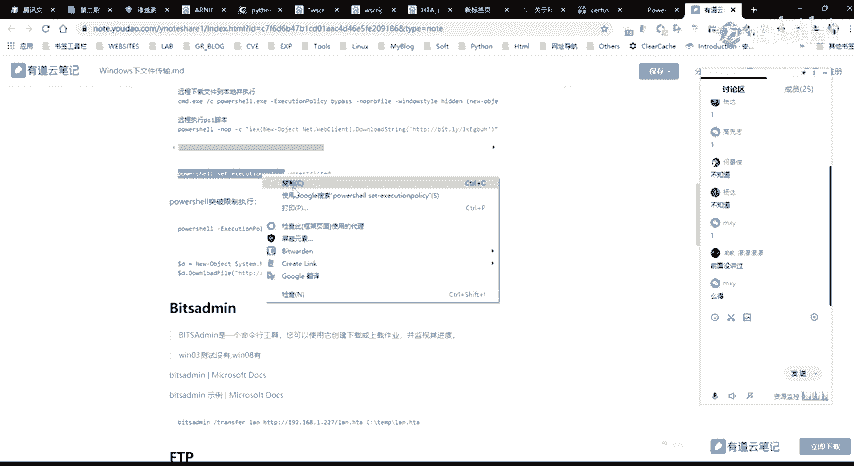

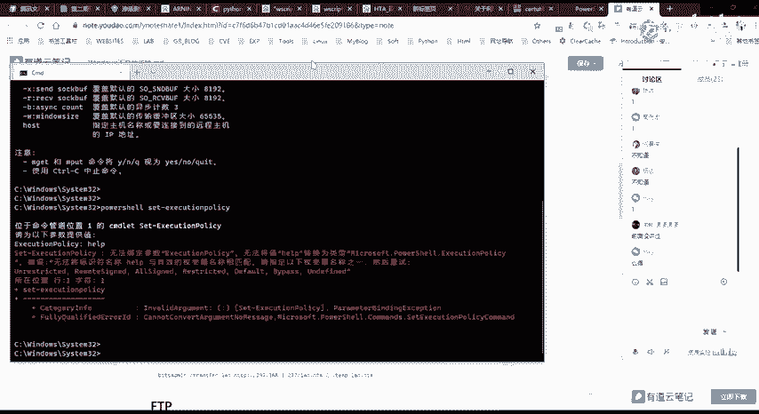

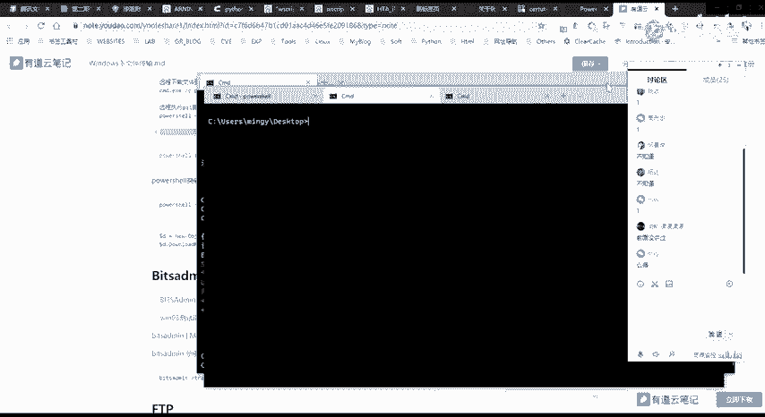

哦，我百度一下吧。Okay。啊，直接啊这个。

我们可以通过这样子一个命令来去获取到当前的这样子的一个执行策略啊，就是一个RE straight。

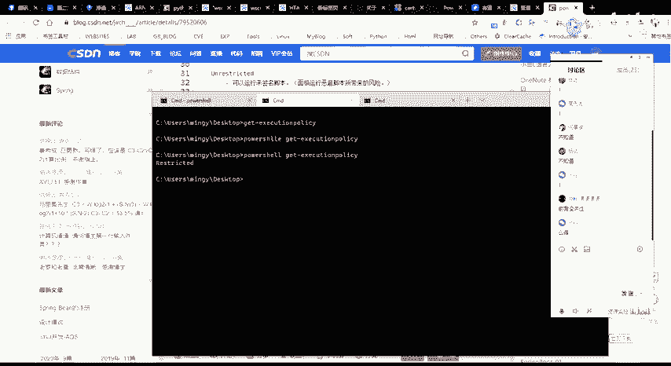

然后我们再结合这一篇文章，在这边的话，icestr的话它是默认的一个策略，就是这个策略的话，它是允许单个命令执行，但不能去运行脚本。也就是说我们可以通过po share去执行命令。

但是我们无法去加载我们的一个p share的一个脚本，它还阻止所有脚本的一个运行。然后还有其他的这种像overside的，就是可以运行脚本，就包括本地啊，还有远程的这样子的一些脚本。

它都是可以去进行一个运行的。然后remote sign的话，它是可以去运行，就是呃。就是从远程的，就是从我们通过UL地址，从internet这上面去下载的这种脚本，它可以去进行一个呃运行。

但是的话在这边的话呃。在这边的话，它是就是说需要去有相应的一个签名啊。其实实际的话就是说我们自己去写的这样子的一个脚本，话是没有这种签名的，对吧？所以的话它是就不允许去进行一个远程的这样子的一个加载。

但是它可以去加载我们本地的，就我们本地所编写的这样子的一个脚本。然后还有就是呃bypass。就主要的话就是这个bypass，就我们经常使用的，就是不阻止任何执行项，也不会去显示警告，还有提示。

就我们可以通过指定我们执行策略为这个bypass来去绕过前面的这样子的一些策略。就是像比如说我们去加载我们自己的一个远程的一个脚本，对吧？我们可以就指定这一个呃呃执行策略为bypa。

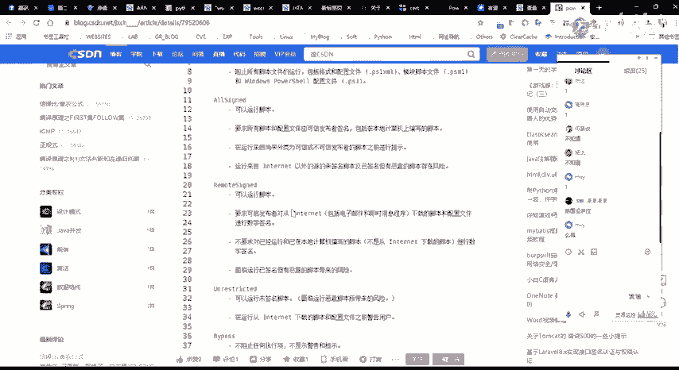

然后指店执行策略的话，我们。

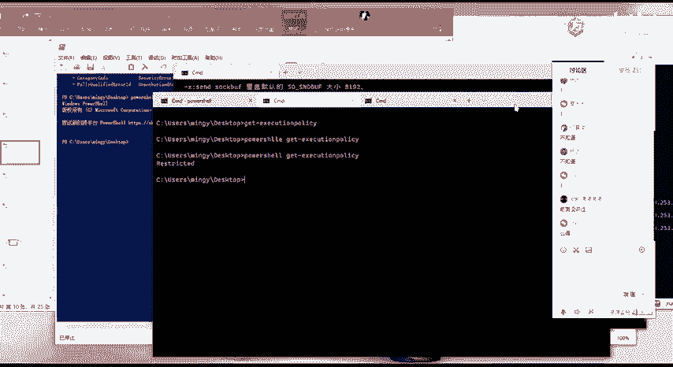

可以就是通过这样子的一个方式啊，就是干EXEC。当然的话呃你也会看到就有这个样子的一个形式，就是说干EP就其实就是其实就是。呃，执行策略的一个首字母的一个缩选嘛，就是excusution。

然后poli对吧？就是干EP来去指定这样子一个执行策略。然后杠C的话就是指定我们后面要去执行的这样子一个脚本，对吧？这边的执行的一个脚本的话，呃，其实跟前面的话是这一部分的话，跟前面都是一样的对吧？

主要的话就是这里。呃，不一样啊。这这个的话donload strike的话，这个的话前面有讲，对吧？前面已经有讲过了。Okay。就是在讲那个就是信息收集的时候，用po去加载的时候，对吧？

大家一定要注意的话，就是这边的话是donload是 dry。然后前面我们这边的话是donload fire。对吧它这两个的话它是不一样的。这边的话donor file的话。

它是就是下载就下载我们远程的一个文件到我们的一个本地，对吧？它是有文件，就是它是有文件的一个落地的。也就是说它是需要有这样子的两个参数，什么意思呢？就是说它是下需要需要去下载到本地嘛，对吧？

然后它这边的一个donor drive的话，它是直接把我们这边的一个脚本把它加载到内存当中。来去进行一个执行，就是说它是直接加载到内存当中，也就是说没有这样子的一个文件就保存到本地的。Right。

然后主要的话就这个IEX这个IEX的话就是。就是呃这一个in work in work呃 expression。就是把字符串当做命令来去进行一个执行，其实就是执行我们这边的一个命令。

就是执行我们这边通过加载的远程的，就把我们这边远程的这个p share的一个脚本，把它加载到内存当中之后的话，去进行一个执行。嗯。然后呃我们通常的话会使使所使用的话，就是书写的话就是这样子那个IEX。

然后的话其实就是在wind里面的话，大小写其实。呃，不是很敏感对吧？就我们也可以通过IEX就是小写的这样子的一个形式，对吧？啊，呃还有就是windows style。就，通过这样子一个方法。

还有就是这种非交互啊，还有呃主最常用的话就是这个杠杆NOP。就是抛需要控制台不加载当前用户的一个配置文件。

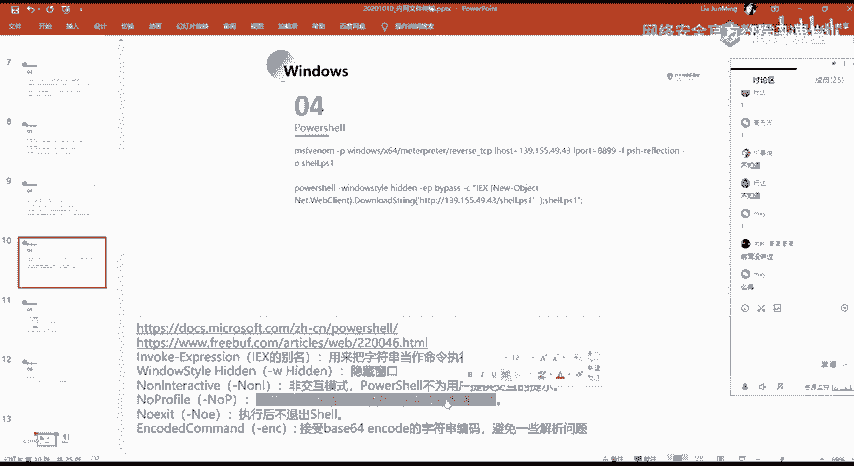

就哦其实我们前面的。比如说我这边的这个就用MSF生成了这样这样子一个po脚本，对吧？在这边其实它的一个使用的话就是这样子对吧？就是杠NOP指定指定这个杠NOP这个参数。

然后杠W就是指定我们这边执行之后的话，这边的一个窗口它就关闭了。然后杠一的话，它其实是呃就是做一个编码。关于这里的话，同样的我们。

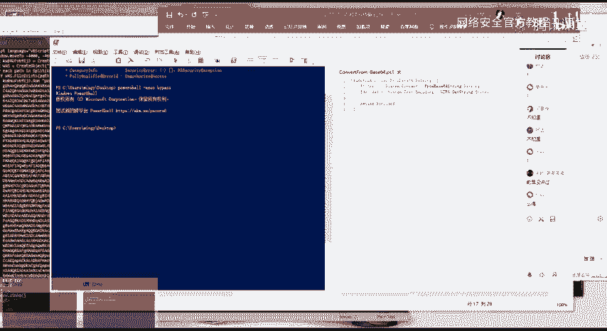

嗯，通过滑现。来去查看一下。

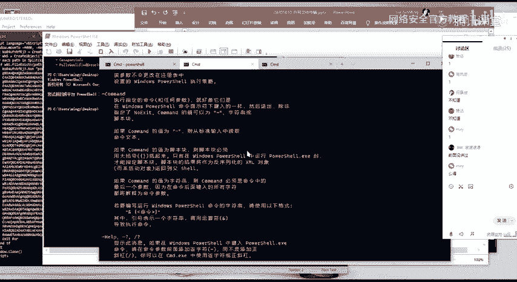

就这边的一个杠呃杠一的话，它其实是这个in code command。就是他是指令呢，它其实是呃跟我们这边的这个参数，它其实是同理的。

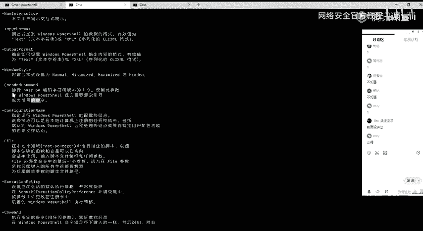

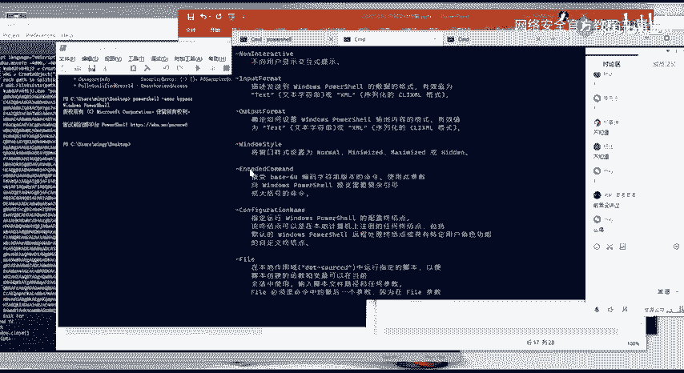

就是这里的这一个杠一。它的一个作用的话就是接收bsase64的一个编码的一个字符串。也就是说我们可以通过杠一参数后面指定我们base64加密之后的一个字符串。

它能够去对我们这边的一个base64的一个字符串做一个解析。然后的话呃执行。

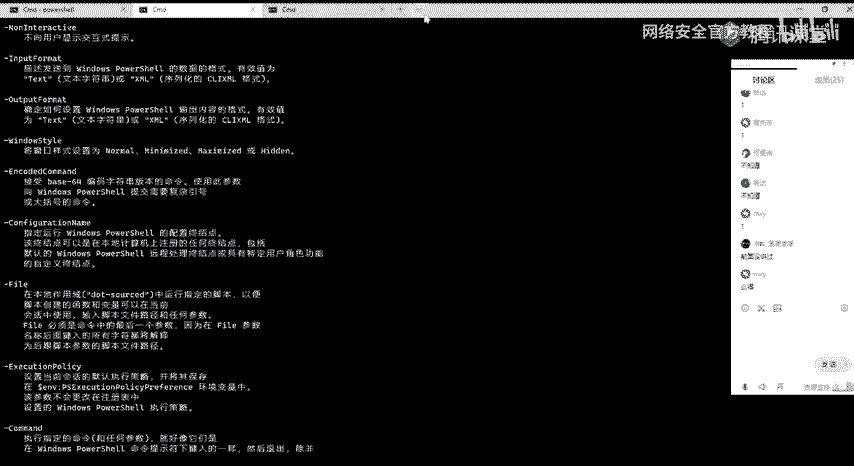

嗯。这些的话都是呃我们常见的这样子的一些参数啊。🤧嗯。呃，关于抛蟹的这一部分的话，就呃这一些。好，大家能理解吗？就有没有什么问题。啊，其实这些的话我。其实这些的话，大家就是你去。呃，看别人写的这些。

或者是说呃像这种MSFMSF它生成的这样子的一些脚本啊，这些配load的啊不这些木马对吧？你可以去就大概的去研究一下，对吧？你不要不要求你说你就是怎不要求你说你知道怎么去写，对吧？

但是要求你去能够看懂对吧？你要能够看懂它的这个脚本它是干什么的，它有什么作用，对吧？不邀请你说你要去写这些，因为这个的话你直接去直接就能够去生成嘛，对吧？就方便我们直接去使用。

但是的话你要去理解它的一个意思啊，不然的就不要说你就知道用你。就说有现成的这样子这个东西给你用，但是你不知道他的一个意思啊。Hello。其实这一些的话呃你去百度一下，就是像这样子的一些关键字啊。

你都能够去大概的理解它的一个意思啊啊。你同理的话，part希尔的这样子的一些这样子的一些表示。就是我们其实通过就是这一些现程的一个脚本，对吧？它的一个写法我们也能够去学习到，对吧？呃，那这里嗯。啊吧。

通过他的这样子的一个写法，我们也能够去学习到啊吧。都是就是常用的是都是这样子去写的。呃。有疑问吗？没人回呀。都没有没人回我的提问。有有问题的扣一，没问题的扣2。或者说。或者呃就是自己课后。

去做了才知道的，扣3。好，我这一个选项一说。大多都是选那个啊。那行吧，那呃大家自己课后去再去做吧，好吧。然后呃下面第五个的话就是这个SCP。关于这个的话，我这边的话就不多说了。呃，同样的大家自己去试吧。

我就大概的说一下它的一个呃用法。就SCP的话，我们在windows系统上面的话，它同样的也有也有这样子的一个命令。我们直接执行SCP对吧？它就有这样子的一个命令。这个SCP的话。

它的一个作用其实就是相当于我们的一个就是文件的一个复制嘛。

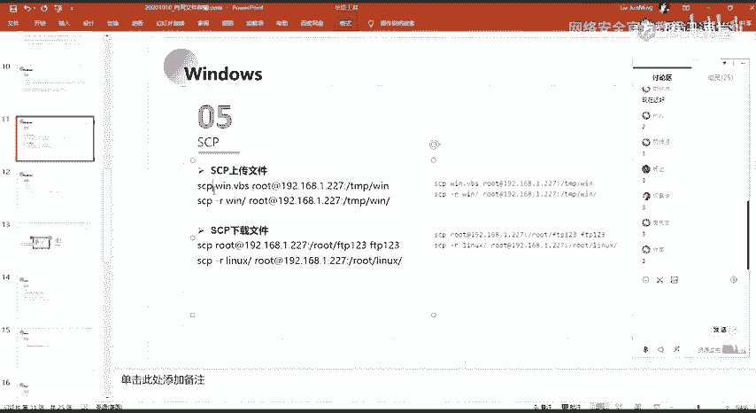

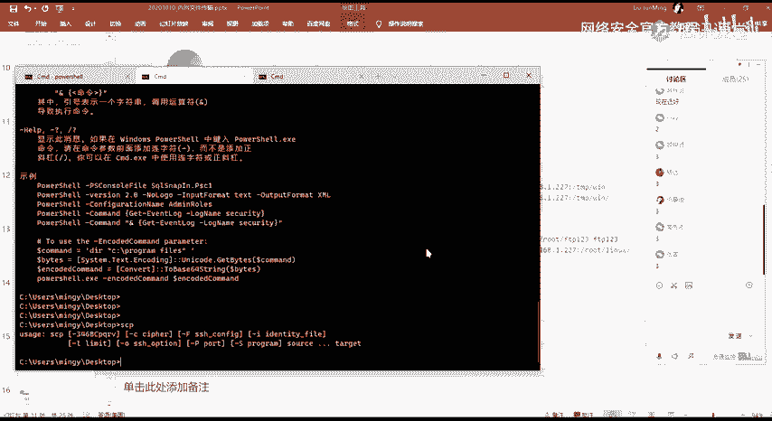

然后在这边的话，我们可以用这个SCP来去进行一个远程的一个文件的一个复制。像比如说第一个。第一个的话就是我们把我们本地的这样子的1个UPS的一个文件。

把它给复制到远程的这一个呃linux系统上面的一个指定目录下面。这个的话就是呃。SCP的一个文件上传，对吧？然后的话第二个的话就是STP的一个文件的一个下载。就主要的话也是用的这个就我们通过SCP。呃。

下载远程的这样子的一个lininux系统上面的指定的一个文件，对吧？然后的话把它下载到我们本地。就是我们在windows系统上面的话，实际的一个使用的话就是用SCP对吧？然后的话来去呃。

请求我们这边远程的我自己的1个VPS的一个服务器，对吧？然后的话我这边的一个文件在这个目录下面就存放我自己的一个呃文件，就想要去上传到目标机器上面的一个文件，放到这个目录下面。然后的话通过SCP把。呃。

把把在远程服务器上面的这个文件把它给呃复制到本地。然后这边的一个盖拉的话就是就是递归的去进行一个复制。也就是说它可以就指定一个目录，然后的话把这个目录下面所有的一个文件都统一的复制到指定的一个目录下面。

然后第六个的话就是windows的一个文件共享。文件共享的话，其实前面的话在讲那个呃信息收集的一个命令的时候已经有讲了，对吧？

就说我们可以通过net use来去进行一个呃把我们的一个把远程机器上面的一个指定的一个目录挂载到本地，对吧？然后的话我们就能够去对这一个目录去进行一个呃文件的一个操作，对吧？我这边的话以这一个文例。

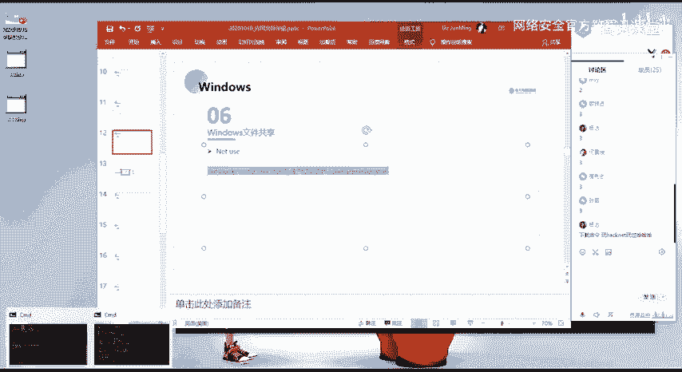

呃，我在这边。我通过就是。

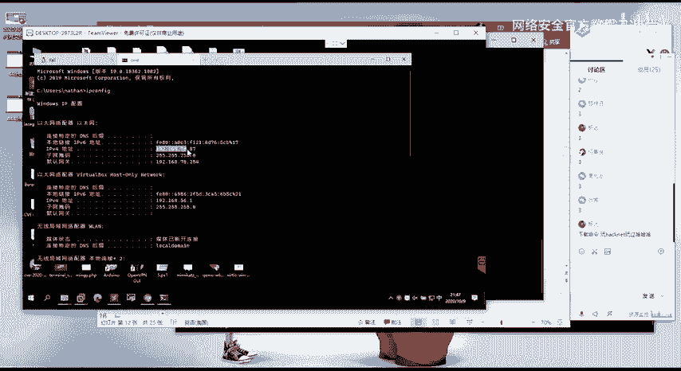

78。67我通过我这边的一个本地的一个机器来去连接我这边的这一个远程的呃，就是另外的这一个机器啊。嗯。Okay。

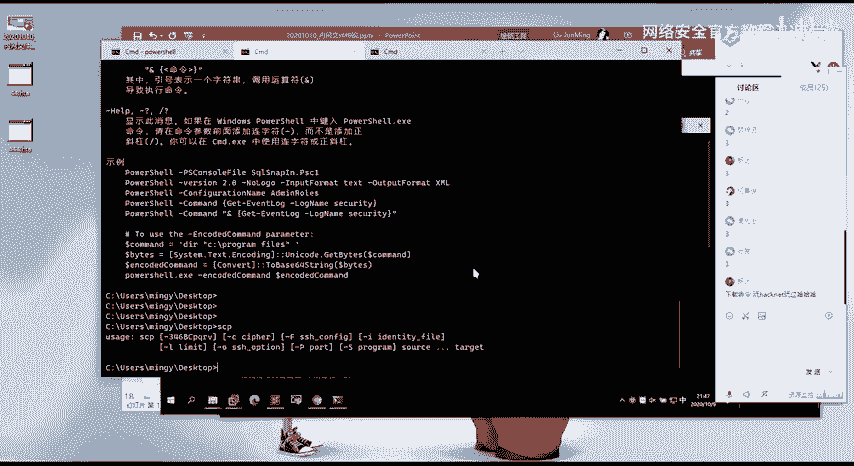

Yeah。

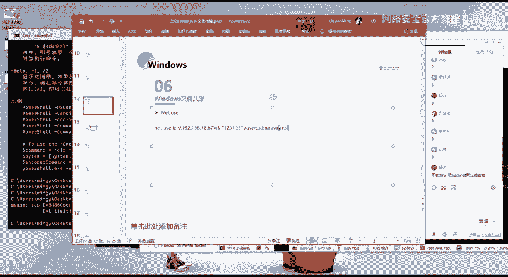

我这样直接复制了。好，呃，这边的话我直接复制。

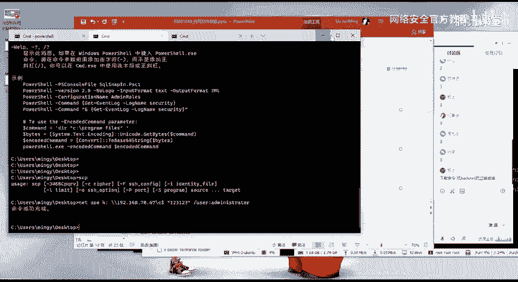

粘贴这边的一个命令的话，命令的一个意思的话就是把我这边远程的这1个78。67的1个C盘，然后它把单把它映射到我本地的一个K盘。对啊，然后我在这边我映射成功之后话，我做了下些钥匙。

可以查看到这边的话已经就是进行了这样子一个连接是吧？然后的话。我们可以通过DIR开盘。

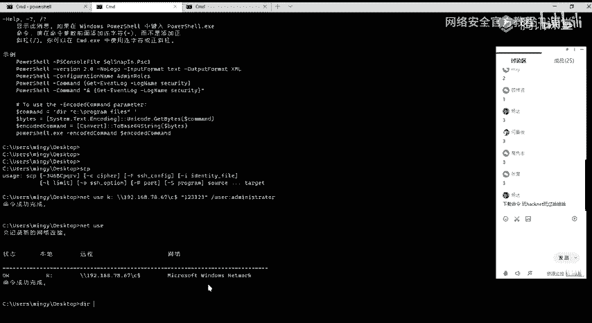

来查看来查看到远程的这个C盘的一个目录，对吧？然后们也可以通过就是copy的一个面去进进行一个呃写入，去进行一个文件的一个呃下载，是吧？以及我们也可以在这一个文件当中去进行一个写入。

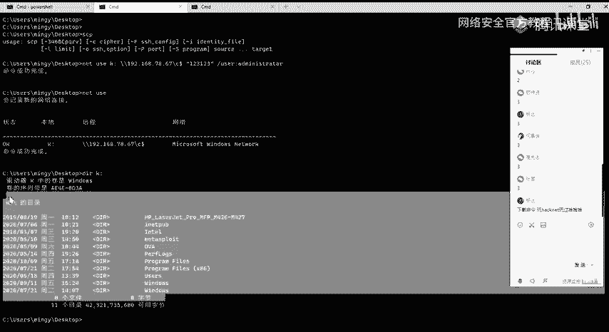

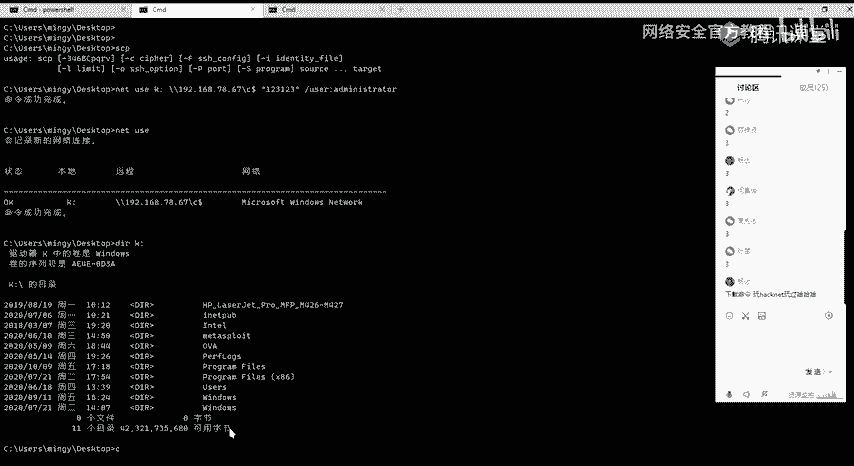

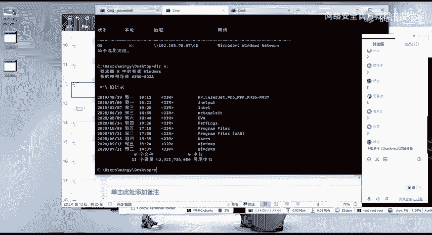

啊，其实在这边的话，我们在就是在文件管理器当中，对吧？我们可以看到有这样子的一个呃这样子的一个。磁盘就是这个。K名字为K的这一个磁盘。然后这里的一个内容的话，其实就是呃这一个远程的机器上面的一个内容。

我们可以看一下用户，对吧？就是这一个。对吧。那么我们就我们就同样的可以去进行一个文件的一个传输，以及啊文件的一个下载以及写入。这个的话是一个windows的一个文件共享。但是这一个文件共享的话。

就前提的话是你需要呃知道你需要知道就是目标机器的这样子的一个需要，好不？不是目标机器的一个账号密码，对吧？以及就是说。呃。前面我有前面我有讲吗？应该没讲，就说。

我可以通过就是说我得到了一个机器的一个sure，对吧？我得到了这个机器的一个hear。然后的话我想要呃通过这一个hell。呃。怎么。怎么跟大家说呢？呃，这里的话后面在后面应该会讲会给大家讲。

我这边的话先不说了，就说我可以通过就如果我不知道他的一个账号密码。但是的话我通过了我比如说我在CS上面，我已经得到了一个呃内网机器的一个 share，对吧？然后的话我通过它的一个密码，哈希什么的。

我得到了他的一个密码哈希，然后的话我就可以通过。呃，去生成一个令牌，以及去进行一个token的一个窃取，来获取到对应的就是说呃对应的一个权限。然后这个权限的话就是能够去访问到。

就是说这个用户他有权限去访问到这个远程的这个机器。那么我可以通过token的一个注入，token的一个窃取来去进行一个得到这个用户的一个权限来通过net柚映射呃，访问到这一个原本是访问。

原本是没有权限去访问到的这样子一个机器啊。这边的话提一下，可能这样说大家。会比较晕，后面的话会给大家讲，就是讲那个。呃，taken的一个注和taken的一个窃取，就令牌的一个窃取。以及生成。🤧呃。

以上的话就是windows下面的。一个一些文件传内网文件传输的一个方法。其实。其实windows下面的话，主要的话就是利用的它的一个系统当中所自带就有的这样子的一些命令行的一个工具，对吧？

我们其实可以知道，就是说这样子的一些命令行工具的话，我们就直接能够去进行一个使用，而不是说我们还需要去额外的去进行一个文件的一个上传，对吧？

因为我们原本就是需要去通过这样子的一些方法来去进行一个文件的一个上传，对吧？以及文件的一个下载。然后第二个的话就是linux下面的一一些文件下载的一个命令。呃。

linux的话相比windows1的话就简单的多了呃。就这一些。首先第一个话就是we gettwe get这个面的话，应该呃不需要我做过多的一个。呃，下载命令。我还net玩购，你说的是哪一个？

你你是这么少是什么意思啊？就你是说我这边列的就少吗？就其实常用的就就这几个嘛，如果还有其他的话，像这些的话，其实你在练史里面的话都是常用的呀，对吧？像we get CL都是去进行一个文件的一个下载嘛。

还有的话你可以通过就是NC。NC还有SFTP。呃，然后在这边的话，we gett这这面的话，应该我不用多说吧啊，我这边的话我就就呃略过吧，好吧。就其实主要它就是这一个杠O的一个参数。

就我直接通过we gett来指定我的一就是要去进行一个下载的一个呃链接，对吧？我就能够去下载到这一个资源。然后的话我想要去把我这边下载的一个文件，就是保存到指定的一个文件名当中，对吧？

就使用这个干大小的O的一个参数。详细的一个使命令的一个使用的话，大家看运行内容。好吧，我都把就是这些东西命令的一个使用所涉及到的。一些内容都放到了预习内容当中。

反那这一些的话就是没有没有很多的一个可讲的，对吧？自己自己看一下，就自己看一下，以及自己试一下就会了。啊，CL也是同样的，就CL的话，这个工具的话也是我们常用的是吧？它的功能的话其实也有很多。

就是它的一个。作用的话就是用来请求web服务器的一个命令命令函的一个工具嘛。就我们通过命令行的一个方式使用CR来去进行一个web服务器的一个请求。就是我们可以通过CL来。

比如说常见的这种get请求po的请求，对吧？我们都是可以用这一个命令，用这个CR的命令来去进行一个实现的。然后呃在这边。我这边的话就列举了这样子的两个，就是我们通过CR来去呃下载我们指店的一个呃资源。

我这边的话我就不多说了。然后第3块就是NC就NC的话。呃，关于NC大家了解多少呢？就是。呃，有了解吗？应该。应该都有用过吧，是吧？NC这个工具。就是net cat，它是网络工具中的一个瑞士军刀。

就是它是通过TCP还有UTP的这种协议在网络当中去读取数据啊。就我们经常的话会用MC去进行一个端口的一个监听，以及呃反弹 share，对吧？然后其实它不仅仅有这一些功能。

它还有就是说我们可以通过NC来去进行一个。像比如说端口扫描，就我们可以通过NC来去进行一个端口的一个探测。然后的话去进行连接，就呃这里的一个就正向连接反向连接的话，在访到需尔的时候会给大家去具体的讲。

在这边的话呃我就不多讲了。然后主要的话就是这边传送文件，就我们可以通过NC来去进行一个文件的一个传递。具体的一个使用的话呃，我这边的话写的很清楚了，就是关于这个呃。它的一个使用。

我这边的话呃还需要我讲吗？应该不需要吧。我们看一下这边的一个例子吧，就是呃我这边的话通过cat file，然后NC杠L。1234就这边的这个意思的话，就是我cat file。

就是呃查看这个fi的一个文件嘛，对吧？我们cat的话。cat这一个文件的一个内容的话嗯。我操作吧。

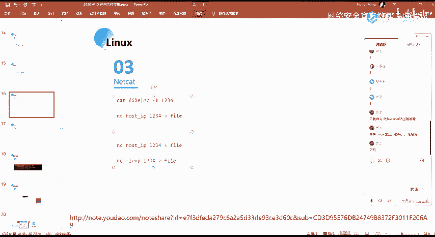

总感觉说的话不是很好很好很好说。我们知道linux下面的话，我们可以通过ca命令。嗯。有点卡呢。Yeah。在历下面的话，我们可以通过cat面来去查看。来去查看这个文件的一个内容，对吧？就说。对吧。去。

😔，嗯。就这1个44点HK吧，是吧？我通过cat那的话，它会能够去查看这个内容。然后这个内容的话，它其实输出在我们这边的一个控制台当中的对吧？然后的话我们这边通过这个广道服。

这管道服的一个意思的话，就是把前面的一个命令的一个执行的一个输出作为输入，对吧？然后其实这边的一个输出话，就这一部分。然后这边的这一部分作为一个输入的话，就是把它输入到了这边。

我们通过NC的话会精听一个端口，对吧？然后这里的这一句的一个意思的话，就是呃把我们这边这一个fi尔的一个文件，把它给就是呃。传递到我这边今天的这个1234的这个端口。然后的话我们在远程的这个机器上面。

我可以通过NC来去连接这个端口。我这边尽力一个连接之后的话，那么我就可以去获取到这边fi尔的这个文件的一个内容。然后的话把这个文件内容，把它给重定向到我本地的某一个文件当中。呃，下面的话也是同里。

就是呃方向不一样啊，就是呃从目标金上面到我的一个公积金是吧？就原理的话呃。都是这样。主要的话就是这个管道服及重定向浮的一个意思。然后第四个的话就是SFTPSFTP的话。

也是我们就是在应上面去进行一个文件的一个传输的话，就常用的是吧？就前面有的同学说的那个插插需要插FTP对吧？这种的话其实都是像比如说就都是使用的这个SFTP的这样子的一个。

就是这个像比如说我这边使用的这个工具，你看到吧？这SFTB嘛，是吧？就SFTP话呢它是就是它同它使用的一个端口的话，其实就是SSH的一个端口。因为他所使用的是呃就是。跟SSH是一样的。

就是你SSH取的一个端口是22号。那么你SFTP你去连接的话，你去进行一个文件传输连接的话也是使用的22号的一个端口。然后呃。在这边的话，我列举了这样子的三条命令。

就是通过SFTP去连接到我这边的一个远程的一个机器上面。以及通过干大写的P指定端口，以及通过干小写的I指定我们的一个私钥，就是说去进行一个秘密的一个登录。嗯。然，呃第五个的话就是一个DS传输数据。

这边的话就是给大家介绍一个小技巧，好吧。就是minux下面的一个数据传输的一个技巧。就是我们可以通过呃DNS来去传输我们的一个文件的一个内容。具体的一个方法就是这样子，我通过cat test呃。

我首先在。呃，使用的话就是。使用1个DSlog。嗯。

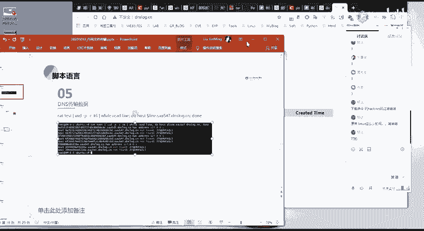

嗯。

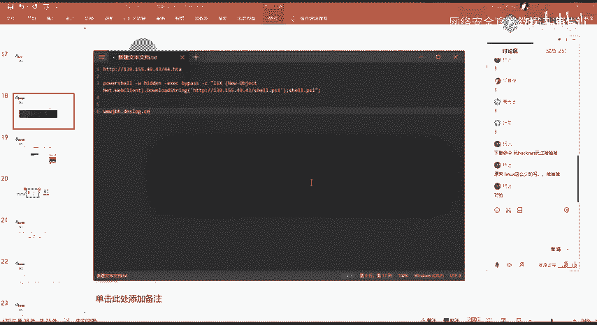

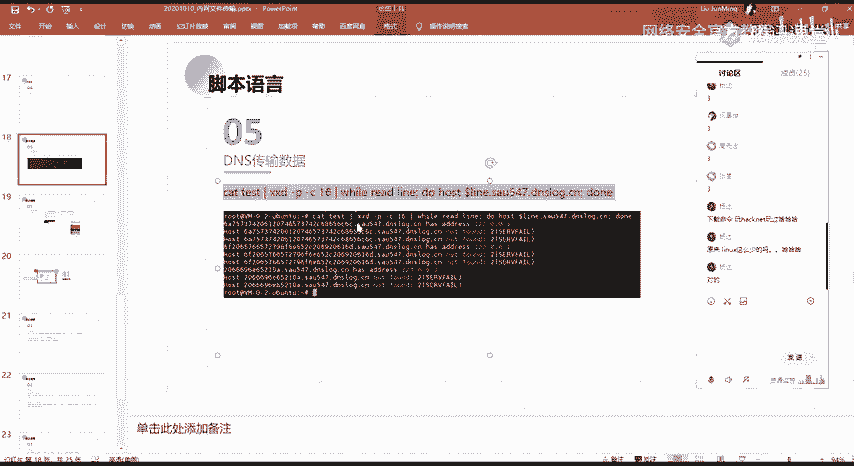

我们先来看一下效果吧，然后再给大家解释一下这一个命令的一个意思。

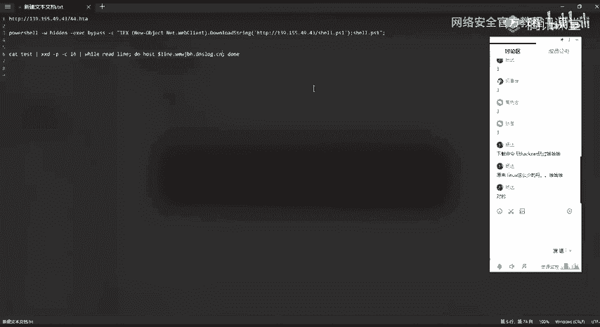

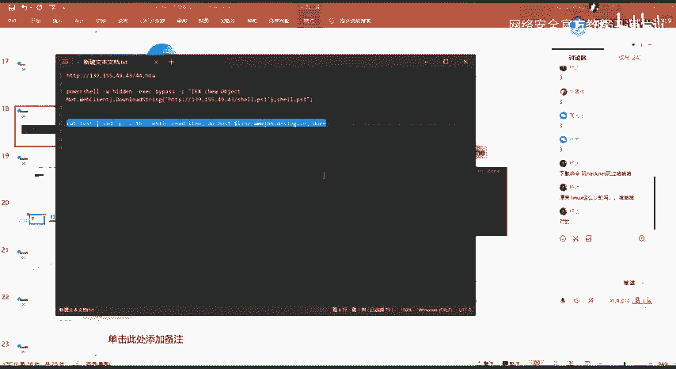

然后我这边的话，我在我的这一个机器上面。随便走。呃，就这个吧。哎，我随便写一个。Yeah。我就写这子的一个内容是吧？然后我就通过这样子的一个命令。谢谢。执行之后的话，他会有这样子的呃一个请求啊。

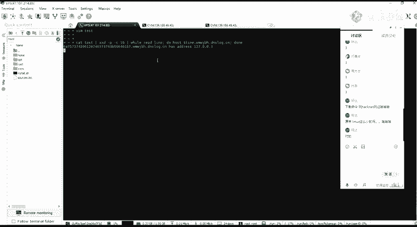

。

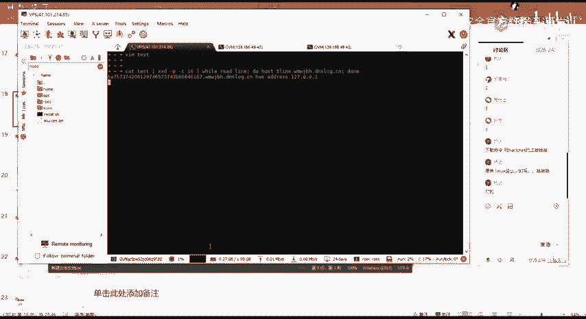

然后它会有这样子的一个请求。然后我们在这一个DSlog上面的话，能够去接收到这样子的它的一个DS的一个请求。

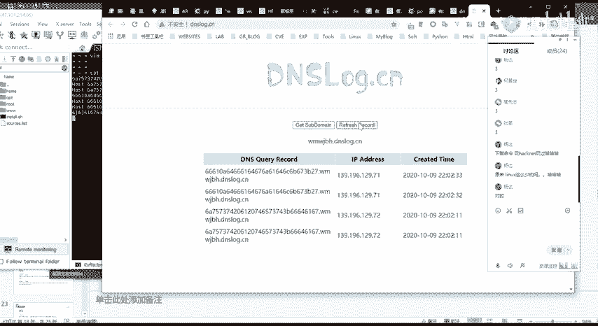

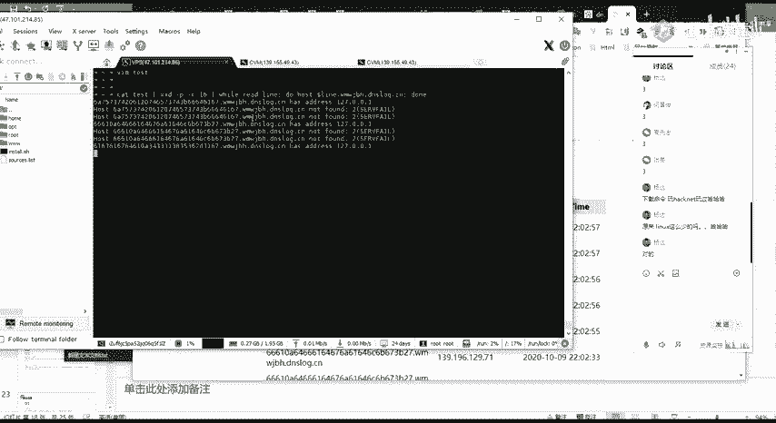

这妈要等一下。买他。

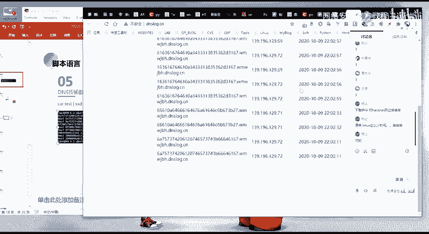

你什么都没有了。

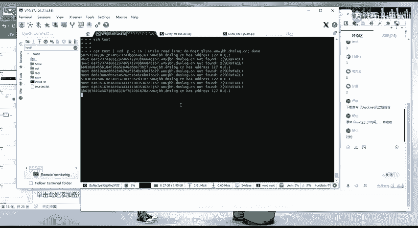

我这边直接停了吧。应该就就这些吧。好，呃，这在这边我这边执行命令之后的话。我们在这个DSlog这个平台上面的话，就有接收到有这样子的一些数据，对吧？然后其实这里的这一部分内容的话，其实就是我们所需要的。

然后这边的这一部分内容其实它是做了一个。就是hax的一个加密。然后我们可以通过呃像在BP当中的话，我们可以通过这样子的一个方法去把它解密出来啊，然后我们只需要把这边的这一个数据把它做一个害死的一个解密。

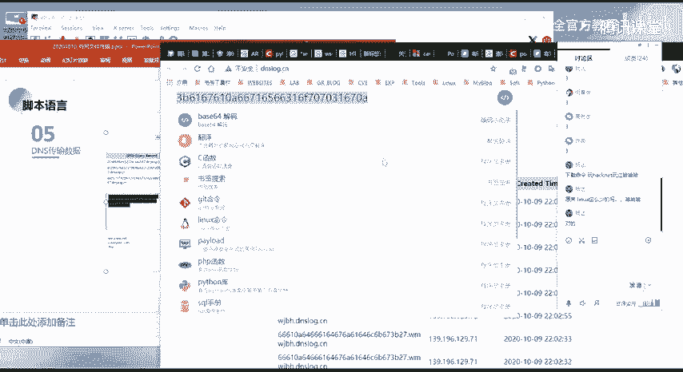

我看一下。打开录音。

嗯。不。啊，我把这一部分的一个内容做一个解密，解密之后的话就是得到的是这样子的一个东西，对吧？然后这一部分的东西的话，其实我们。

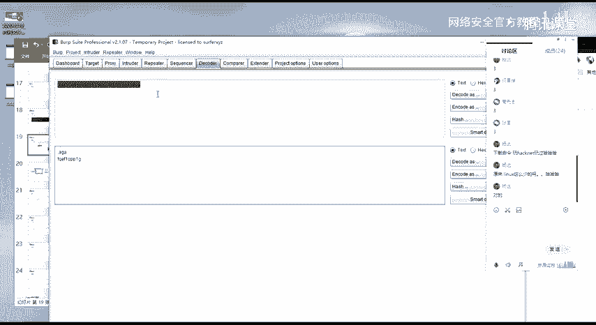

ca做一个t的文件，我们可以。

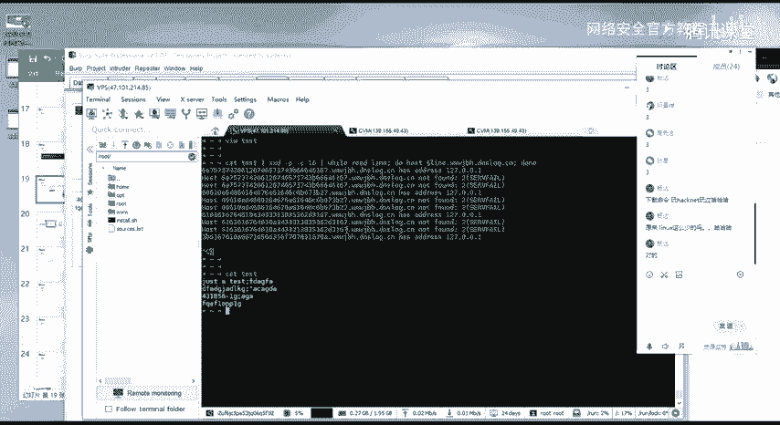

看到就这一部分的内容的话，其实呃。等个 a子。就是这一部分对吧？就是这一部分，然后为什么是截取的这一部分，等会会说啊，对吧？我们可以看到就是这一部分对吧？然后呃因为这里的话是最后的这一个请求。

我们前面的这一个的话就是。

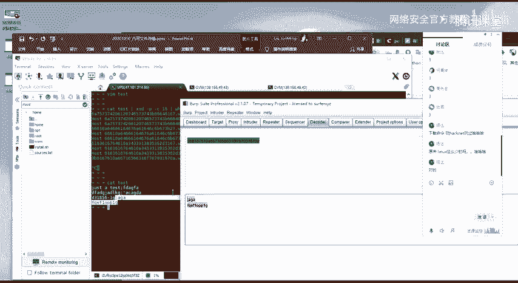

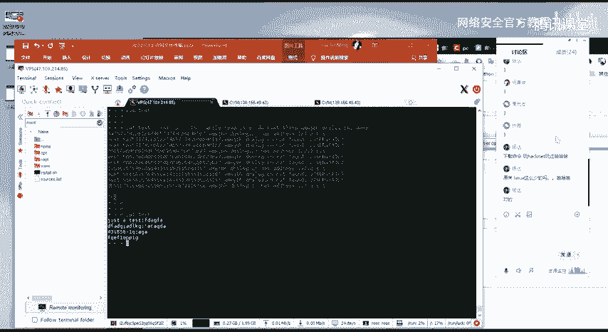

对吧前面的这一部分的话就是。从这边开始就是这一部分的一个内容，对吧？那同理还有其他的这一些的话，我就不一的复制了。就这边的前面这一部分内容的话，其实就是我们这边文件的这一个内容，对吧？

然后我们回过头来再去看一下这个命令，它是干了什么，他为什么可以就是达到这样的一个效果。

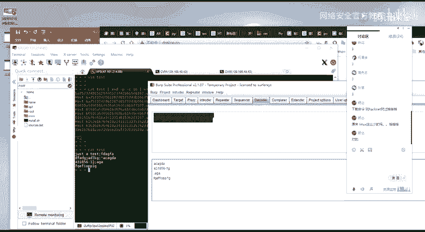

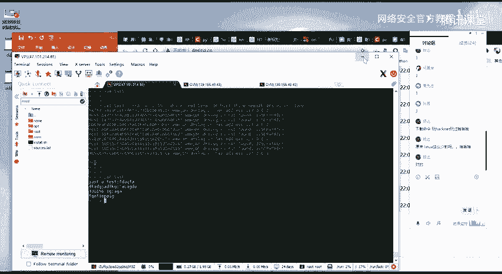

然后同样的这边的话，我们就是用这一个广道服，对吧？把我们这边t test所输出的一个内容，把它作为这边的一个输入。这边的话就是使用的是这个叉叉D叉叉D的话，它是一个就是linux里面的一个命令。

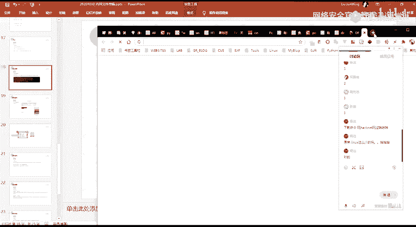

嗯。叉叉D的话，它是一个二进制的一个查看命令，它默认将文件显示为16进制的一个字符串。也就是说我们可以通过这个叉叉D的这个命令，把我们这边t的一个文件内容把它转化成为16进制。

也就是我们的这边的一个has的一个数据，对吧？然后他这边的这两个参数的话，我们主要看这一个杠C。杠C的话就是呃指定我们这边的一个长度啊。呃，看一下。嗯。嗯。Oh。嗯。这怎么没有？😔，啊。Okay。

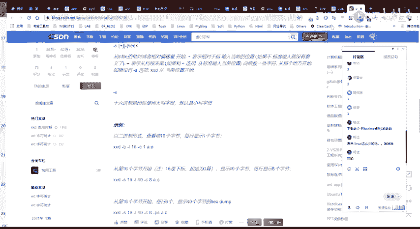

杠C就杠C的话就是指定我们这边的一个。

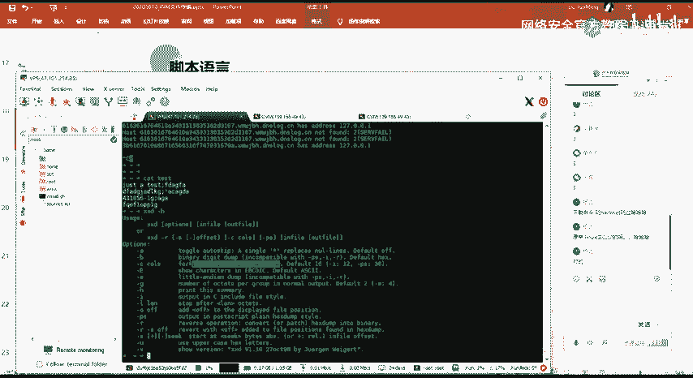

就是。7。所要去呃转换的一个数据啊，就是把它转化成多长的一个长度。然，因为我们这边的话。

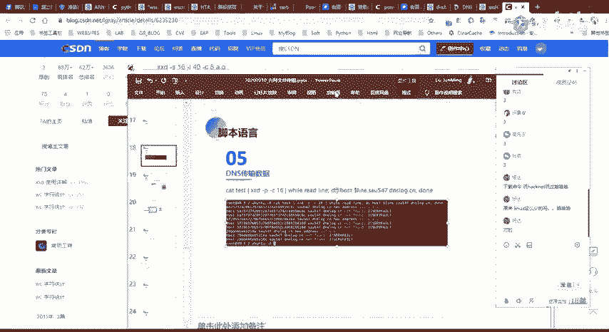

我们这边呃。我们这边所输入的这一个数据，对吧？它每一行的话，它它不仅仅有就是它有我们不知道它有多少的一个数据，对吧？所以的话我们每隔16行，就是每隔16个字符就把它作为把它进行一个呃换行。

就是把它作为一行的一个数据进行一个输出。啊，不是进行一个输出，作为一个就是进行一个编码，就是把它编码成为1个16进制，对吧？利用叉叉D，就是每隔16位把它编码成一个呃116进制的一串数据。

其实就是我们这边的这一串。像这样子的一串数据，对吧？这个的话这一串的话就是呃每16位所编码的一个has的一个呃值。然后的话它编码之后的话，我们再用这一个Y循环。

就是这个的话是一个需要的一个脚本的一个写法，就是一个Y一个循环的一个写法。就是呃通过read去读取每一行。因为我们前面的话是每每16个字符把它作进行了一个编码，然后的话作为一行，对吧？

那么他读取这一行之后的话，他会做做一个这样的一个事情。就对的话就是做嘛，就他读到一行的话，他就会去进行一个呃请求他会呃去请求我们这边的这一个域名。然后这边的这个域名的话，其实就是这里的一串内容。

就是我们这边把我们前面读取到的1个16进制的一个数据，把它给到了这个linein这个。呃，这个值这个边量。对吧到这边的话就是作为了一个变量，然后的话去进行一个请求。然后请求之后的话。

它会请求到我们这边的一个DS的一个loggo的一个平台。然后的话把我们这边的一个文件的一个数据把它给带出来啊，我们在这边的话就能够去接收到它的一个数据嘛。这个的话。呃，就是一个小技巧吧。

就战列历史下面的一个就文件的一个获取文件读取的一个小技巧。呃，第三部分的话就是脚本语言啊。脚本语言的话，我这边话就只介绍了这几个。就是呃脚拌语言的话。首先第一个的话就是PHPPHP的话呃。

一个写法呢就是像这样子，就主要的话就是这两个函数。就这个fire put content以及fire get content这两个函数，它的一个作用。呃，我这边的话也写了。

就是首先这一个fire content的话，就是加一个字符串写入文件啊，然后fire get content的话就是将整个文件读入一个字符串。然后我们使用这两个函数就能够去达到一个这样子的一个就读取。

就获取远程远程文件的一个内容，然后的话把它保存到本地。2是我们来看一下，就是详细的看一下，在这里话主要是用这个farget content来获取到远程的这一个UL的这个资源。

然后的话把它读入一个字符串是吧？就获取这一个远程文件的一个内容把它写入到一个字符串当中。然后的话我们再把这一个通过f put content，将这一个字符串写入到这一个文件当中啊。

进行就通过这样子的一个方法呃进行了一个。文件就远程文件的一个呃下载。然后关于这个，还有就是PHP杠R这个杠R的一个长数的话，其实大家可以。

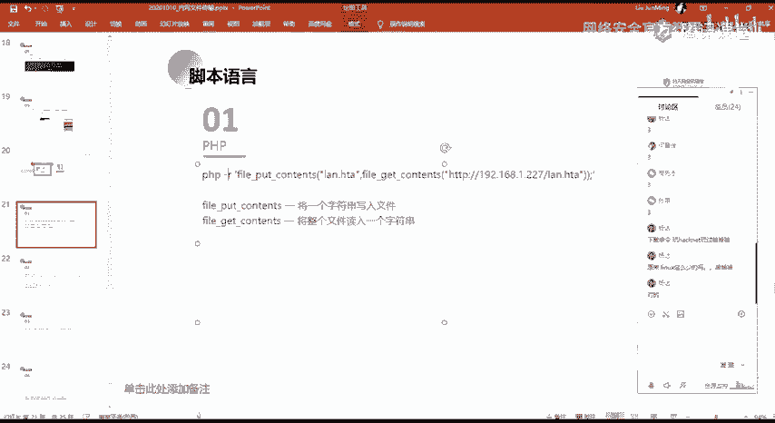

嗯。如果你的一个系统上面有PHP的一个环境的话，你可以通过PHPS来查看。

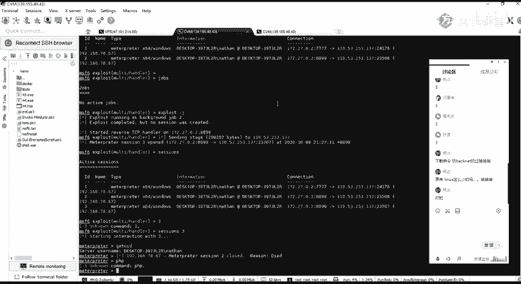

哎我去。我这个没装。

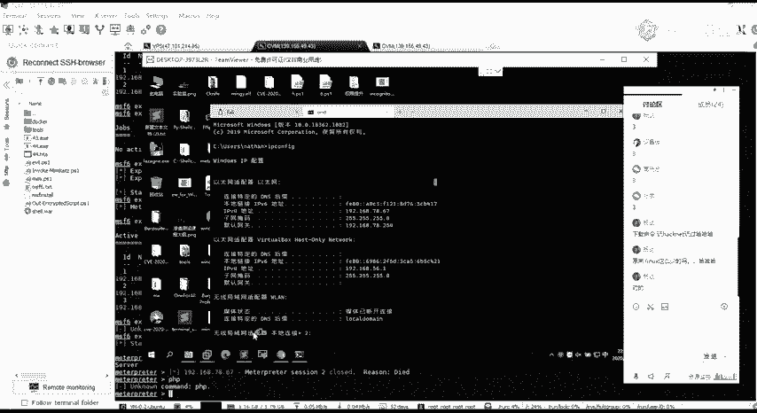

我们通过PHP杠H来查看它的一个参数。然后主要的话就是这个杠R这个参数。这个干参数的话，我们可以看一下它的意思就是runPH B code。without using script targets。

就是我们可以就是没有这样子的一个呃，就是我们知道PHP的话，它是需要包就PHP的一个代码，它需要包裹在这样子的呃就是。金括号当中对吧？然后金括号问号这样子的一个就是呃标记。

然后的话我们使用这个杠R参数的话，可以就是执行这样子的一个PHP的一个代码。然后的话可以不使用这样子的一个标记。就其实在这边的话，其实到这边的话，其实我们这边的话就是1个PHP的一个代码嘛，对吧？

然后的话我们像正常的这样子的话，我们需要把它保保存成1个PHP文件的话，我们需要加这样子的一个。就是。这样子的。需要加这样子的一个标记，对吧？来表示我们我这边的话是1个PHP的一个代码。对吧。

然后我们在这边的话。我们在这方使用这个刚刚上出的话，我们可以直接就是执行这样子1个PHP的一个代码。同理pathon。就python的话。它的一个执行就是python的一个代码话就是杠C的一个参数。

然后呃在这边的话就是我这边写列了两个，就是python2以及python3下面的一个远程文件的这样子的一个读取。远程文件的一个呃下载写入。就主要的话就是用利用到这样子的一个URlib to的一个Uop。

就学过python的话，应该都用过，对吧？然后在python3的话就是呃用的这个URlib的一个request。这个的话应该拍thon的话，其实。因为pathon的话比较简单，对吧？

这个的话应该都能理解吧。而且而且现在python这么火，应该就在座的各位应该都有，就是有。了解过吧，对吧？至少也知道就是能够看得懂吧，对吧？像这种常用的这种库这种呃。

you live to的这种请求这种库对吧？request的这种请求库应该都是呃知道的吧。然，第三个话就是P。呃，Pre还有这一个rebu的话，这边的话呃我这边的话我就不讲了嘛。

就你知道知道这两个东西可以去进行一个这样子的一个，通过这样子的个方式来去进行一个远程文件下载就OK了。因呃其实我也没有去没有去特意去学过这样子的，就P尔跟绿伴也是两个，就是一个脚本语言，它都是脚本语言。

呃，像呃reby的话就是我们那个MSF，对吧？我们那个MSF，它其实就是使用的reb这一个脚本云去进行一个冰雪的。然后的话呃就是为什么要去讲这这样子的一个。

就是就前面的话是讲了windows以及历史系统下面的一些呃文件的一个上传下载的一个命令，对吧？就这些命令的话，其实是系统当中它自带就有的对吧？那么如果说没有这样子的一些命令，对吧？

而且这些命令我们就是说。就有一些环境下面它没有我们无法去用这样子的一些命令。那么我们可以尝试去考虑，就是使用这样子的一些脚本语言。就是说如果说我们的这样子的一个环境。像我们的一个外b服务器。

它是使用的像这种LNNMP的这种架构，对吧？那么它会有这样子的PHP的一个脚本环境，对吧？那么我们得到了它的一个需要，我们就可以尝试使用PHP的这样子的一个脚本。

就PHP使用它系统就自带有的这样子的一个PHP的一个环境来去进行一个呃文件木马的一个下载。同理的话，python还有PRV也是一样的对吧？就说在存在有这样子的一些脚本环境的情况下面的话。

我们可以首先想到使用这样子的一些方法来去进行一个。文件的一个传输。啊，以上的话就是呃本节课的所有的一个内容。大家。呃，有什么疑问呢？给我送方案是没有疑问是吧？呃，没有疑问的，给我送朵花吧。

然后的话呃有疑问的直接在讨论区说吧。🤧嗯。Okay。啊，应该应该都是没有什么问题了啊，所以至少现在是没有什么问题了。然后呃大家课后的话就课后作用的话就还是一样的，就是自己大家自己去把这样子的。

把我PPT里面的一个内容自己去进行一个操作，自己去进行一个尝试。好吧。然后作业的话呃作业的话就是我看了就是大家的一个作业啊，其实呃交了的话都写的应该都是挺好的，就是。呃。

就是呃交了的作业的话都是写的挺好的是吧，就是。

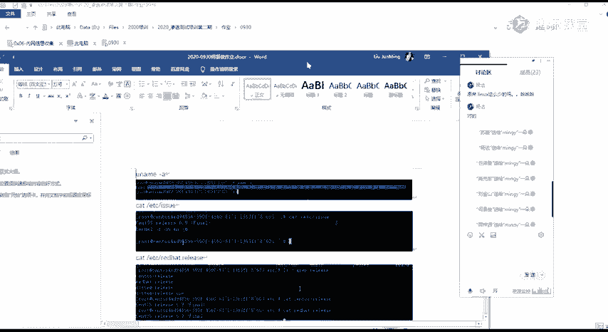

我们我这边的一个作业的话，就甚至这是相关的，就是至少现在的这一些作业的话，都是呃需要大家自己去课后去动手做的。

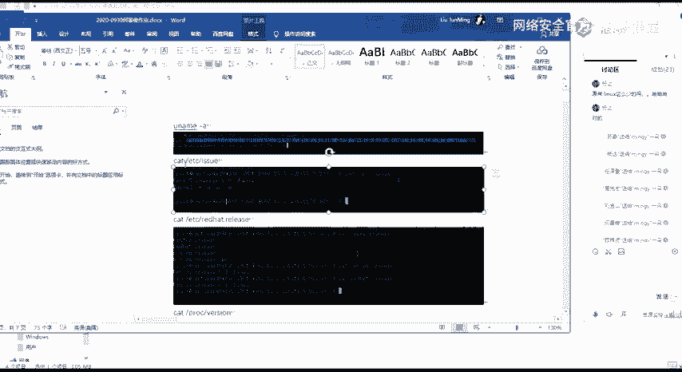

因为你在课上的话，你在课上听听我讲的话，像这一些东西的话，你自己不去做的话是呃。是一时半会，你是就是理解不了的对吧？你只有你自己去做了，你才有深刻的一个就是才能够去理解他的一些啊意思，对吧？

才能够去加深自己的一个印象。

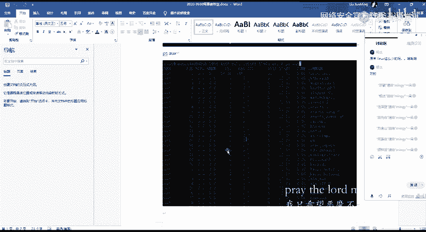

然后其实你们的这些作业的话，其实就是一个笔记嘛，是吧？没有。就就这么讲嘛，这这位同学。对。不止这么点吧，你你这应该是还没写完吧。

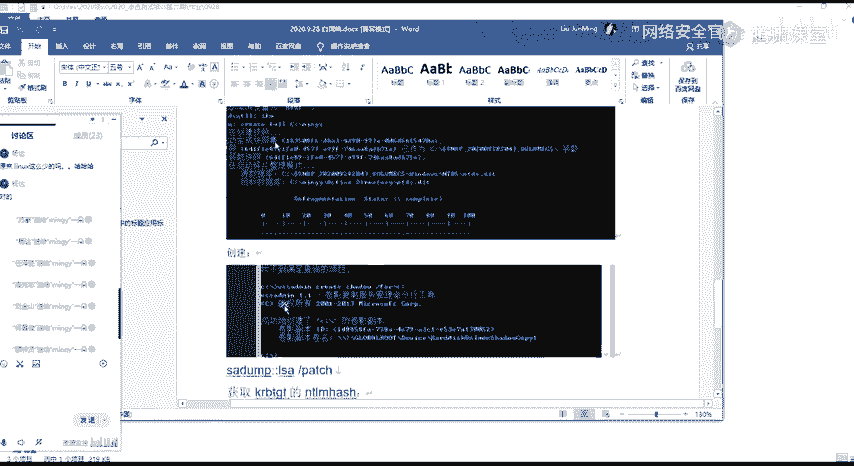

我PV上的内容应该是不止这么一点的。嗯。大家作业的话我其实也都有看。然后的话呃我如果有就是大家有什么问题什么的，就是。我今天的话不是有有说吗？就是有一位同学的话，他的那个作业啊，他那个作业的话。

就是在作业里面都是有报错的，但是的话他直接写写上去也没有管。就是说这个报错，它是为什么。因为你这报错的话，你是直接用的我PPT里面的一个那个VPS的1个IT因为我VPS的1个IP的话，以及那个端口。

我是那个呃用python开的1个IP的1个serv，对吧？所以的话下载的那个脚本我都是放在就是放在那个木录箱面的。但是我课后之后的话就关掉了的。所以你使用我的那个IP，你是访问不到的。

所以的话会有那个报错。但是这位同学你那个你这明显就是报错了。然后的话，你你你那个截图，你还照样的贴到作业里面，我不知道是就是你是为了贴到作业，让我看还是就是说你不想去管这个。

就我建议的话你你碰到了这种错误的话，你自己先。去解决一下，然后的话你要去找到，就是说为什么会有这样子的一个报错的一个原因啊。你不是说把它就是记录下来，把它呃写到作业里面的话，就O了。

因为其实作业的话我虽然会看，但是我因为也有这么多嘛，我不可能看的很很很很仔细啊，也有可能logo。所以说最好的话就是你自己去把这个错误，你自己先去解决一下。然后的话，如果你解决不了，你再问我问问题的话。

大家最好在群里问，好吧。然后的话呃就是太晚的，就是已经很已经比较晚了的话，大家问我的问题的话，我可能就是。呃，看不到，然后的话也可能就是比较晚的话，我不会回哦，好吧。Okay。

就建议的话就是就是最好的话是白天。下午的时候来去问问题，好吧。呃呃，大家没有什么问题的话，呃，也不跟大家大家多扯了呀，现在时间也不早了。那么我们下课吧，然后大家早点休息。

