# B站最全网络安全教程，整整1300集，全程干货无废话，别再盲目自学了，看完学不会我退出网安圈！（web安全｜渗透测试｜内网渗透｜CTF） - P83：82. 第三十天：Windows反弹Shell方法大全-1.mp4 - 网络安全官方教程 - BV15u4y137cQ

。🎼，🎼Oh。🎼别人那。🎼Ohello。🎼想 you。🎼Weing came you fight。🎼Really。🎼我朋友。🎼And Joe， you don thinking。🎼So。

 you think。🎼Say hi to send you go。

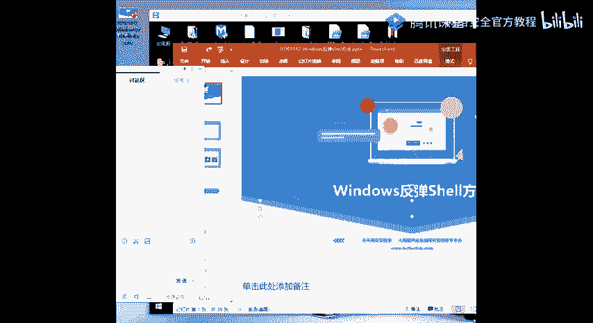

🎼Bring。🎼You to know you saying to go。🎼跳动了。🎼余生。🎼Bringing down。🎼Time to go。🎼And dont to so。

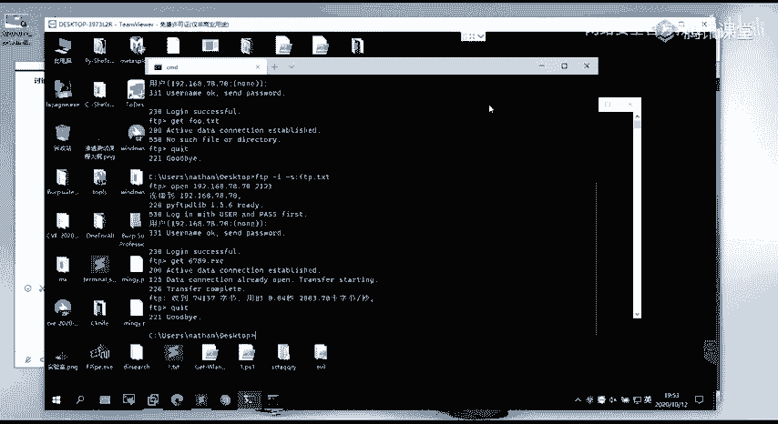

🎼眼角。🎼Think so。

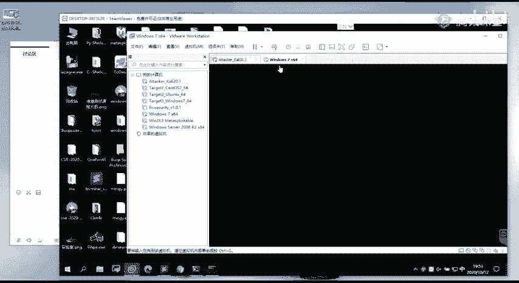

🎼昨天就。🎼Bringrinking， I fight to go。🎼，🎼买。🎼眼间留。🎼心着。🎼This。🎼听到。🎼Ting to。🎼I can tell to soon。🎼眼倦你。

🎼You're trying to。🎼要懂得。🎼于是。🎼Breaking down， you trying to go。🎼Can talk。🎼Yeah。警对风。🎼Yeah。

🎼How could I forget that day。🎼It'spar then to my memory。🎼也不到。Okay。🎼How can I forget the way。

🎼You look at me like an enemy。

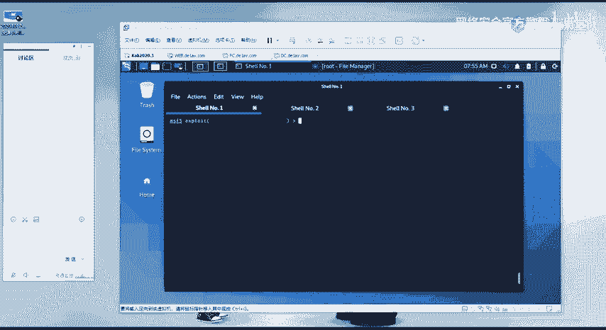

🎼I could believe。

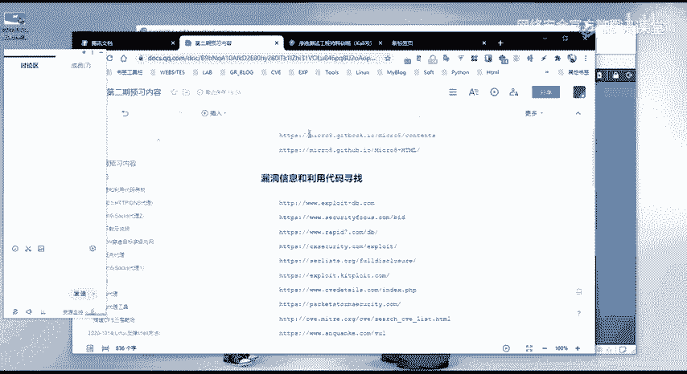

🎼I thought things would get better。🎼Is taken forever。🎼Will we ever be the same。🎼Why does。🎼诉。

🎼せ 그 바ブ라け。🎼And on the only我。🎼I don't want。🎼我的。🎼快了你。🎼写的。🎼そして。🎼不想。🎼to。🎼再多。🎼只有 think个吧。

🎼Maybe you still do。🎼8 months and six days later。🎼No one asked me how Im do。

🎼I was kind of hoping they would。🎼And all your friends still'll talk to me。

 but they choose their words so carefully。🎼Always be the enemy。🎼I'll keep praying for a breakthrough。

 an explanation for what。🎼也曾忘了迷惘的。🎼In my closet， there's a la。🎼I don't see when things get bad。🎼Oh。

 I hope that things get better。But until then。🎼あろ。🎼Do。🎼我的。🎼不怕的没。🎼习怪。🎼I stand。🎼再也放。🎼自我可。🎼S。🎼在我。🎼一次一。

🎼Maybe you still do。🎼不在风。🎼拜分。🎼在。🎼The baby is still。

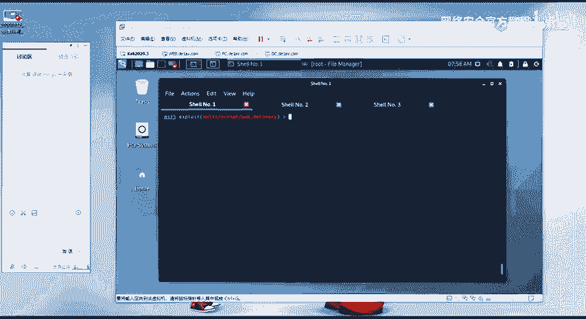

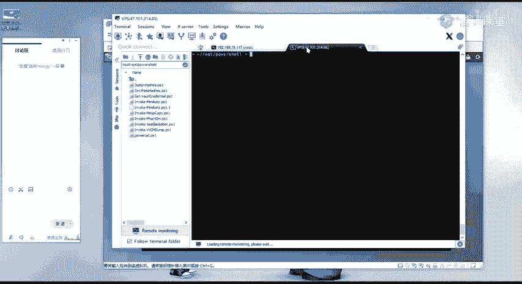

🎼Ba光。🎼可能。🎼The my。🎼We do when its finally。🎼白是。🎼Of first time。🎼Last night couldn't have current tweet。

🎼Sometimestime the dream。那年为。周。🎼周围。Cca。🎼Yeah。🎼Yeah呀。🎼Yes。🎼We way。🎼谁着。🎼Yeah。Yeah。🎼Yeah。交完毕。啊呃能听到我声音的。

以及能够看到我画面的同学在讨论区扣个一。嗯，能能听能听到我声音吗？呃，就是声音以及画面没有问题的，在讨论时扣个一。YeahYeah。因为。好的，应该没有什么问题了。

那么呃我们正式开始我们今天的一个课程内容。然呃在开始之前的话，就是上节课的话，不是有遗留一个问题嘛，就是。

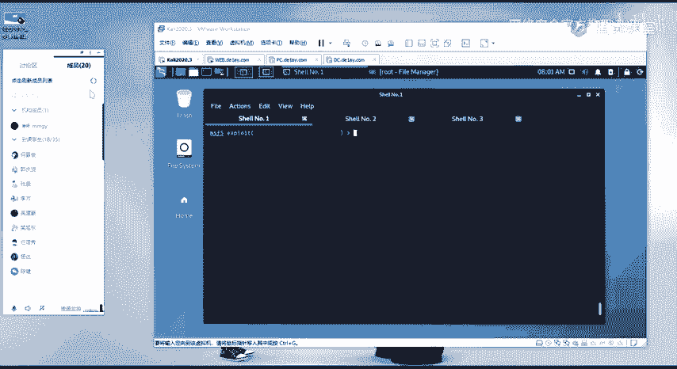

那个。呃，稍等一下。啊。Okay。就是上节课在去在讲那个内网文件传输的时候，使用FTP的一个方式的话，碰到一个问题，对吧？然后那个的话。那会的话没有解决。因为呃就是看了一下的话，暂时没没那个。

所以的话我把他在这一节课的话做一个补充。然后呃我们上节课的话是讲了使用的这一个我们写一个这样子的FTP点菜这样子的一个脚本，对吧？然后把这个脚本的话。

我们把它通过copy的命令把它写入到我们的一个呃目标机器上面去。然后我们写入进去之后的话，我们在使用这样子的一个语句，就这个FTP杠I杠S，然后的话指定我们的这个呃FTP的这一个脚本，对吧？

然后的话执行之后的话，它就会自动的去下载我们呃想要的这样子的一个文件，对吧？然后其实最终的一个效果的话，就是像这样子的。

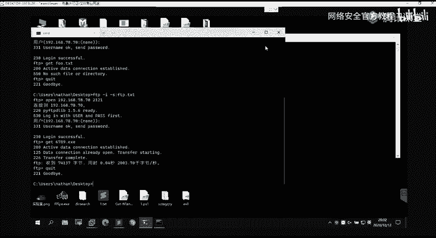

就呃其实它的这一个脚本的话，它对应的其实就是我们FTP的一个命令。就是可以看到在这边首先的话执行这样子的一个连接FTP服务器的这样子的一个命令。然后的话连接成功之后的话。

我们需要呃这边的话是一个匿名登录。所以的话我们需要输入这样子的一个anonymous，也就是匿名。

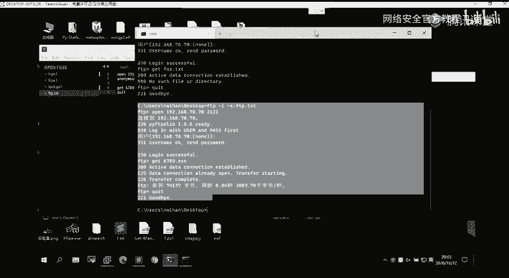

匿名的这样子的一个用户名以及密码。密码的话可以为空，也可以为这个anonymous。然后为空的话，我们这边的话就呃就留空盘，等于就是相当于就是说在我们这边的话，就等于是一个回车。

然后的话我们连接成功对吧？login successful连接成功之后的话，我们通过这个get命令来去获取这样子的1个6789的这样子的一个文件。这边就是我们获取我们自己想要的呃任意的这样子的一个文件。

对吧？然后get之后的话，它就会下载到我们的一个本地。我们这边的话来执行一下，我这边的话同样的是get这1个6789的这1个点EXE。我当前的桌面的话是没有这一这样这一个文件的。

我们这边执行执行之后的话，可以看到在这边的话已经有了，对吧？然后的话我们就可以去进行一个执行。

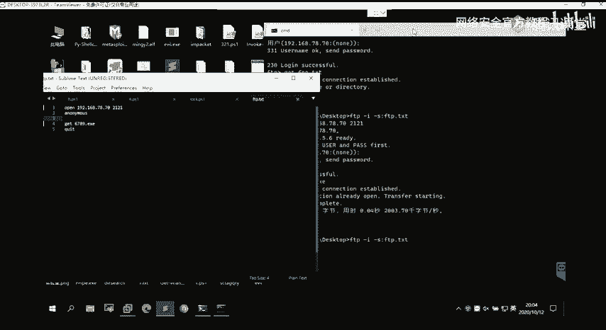

成功的进行了这样子的一个文件的一个下载。然呃其实这边的话同样的是用的这样子的一个就是FTB的一个serv。我不知道昨天为什么呃没成功啊，我这边的话就是后面我客户的话，我去试的话是没有问题的。

就我通过这一个pathon3杠M指定这1个PYFTPDlibb，然后的话然后他默认他会进现在2121的一个端口。然后后面这边的话就是我们的一个我们FTP的一个客户端去连接的时候的一些消息，对吧？

首先的话就是说这一个呃匿名的用户已经登录进来了。登录进来之后的话，它呃请求了这样子的一个文件，对吧？然后因为我当前的话是在这一个root目录下面。

所以的话呃我FTP连接连连接到我这边的一个服务端之后的话，他就会在我的一个root目录下面，也就能够去查看到root目录下面的一个文件。呃，我这边通过。命密来，好看一下吧。7年。

然后这边它已经连接成功了，对吧？连接成功了。然后我们可以通过LOS。啊，你。我们可以通过L的命令，对吧？我这边的话执行OS之后的话。

它这边它返回了就是说呃我当前这个root目录下面的所有的一个文件以及文件夹，对吧？然后以及嗯。

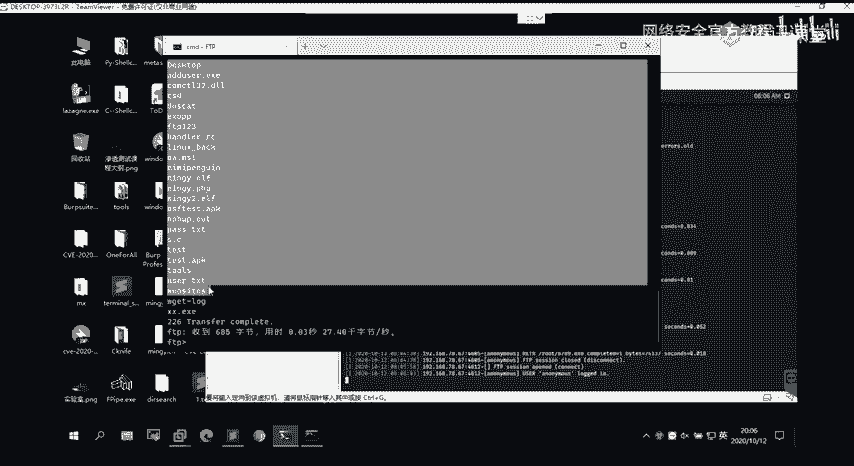

就说好。还有其他的一些没。还有其他的一些命令，就是我们常用的话就是像呃DIR对吧？DR的话，它其实也是查看当前的这样子的一个用户嘛。好吧，不是用户当前目录下面的一个文件，对吧？然后L也是一样的。

还有我们常用的话就是像那个啊get以及putget的话就是下载，就是把我们的一个文件从呃FTB的一个serv端呃下载下来。然后put的话就是上传。

就是我们可以把我们本地的这样子的一个本地的一个文件上传到FFTB的一个server上面去。Yeah。啊呃，这边的话是对上节课的就是遗留下来的一个问题做一个补充。

然后下面的话正式开始我们今天的一个主要的一个内容。我们今天的话主要给大家介绍一下windows下面的一个反弹 share的一个方法。

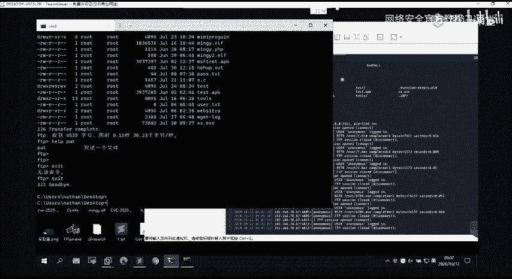

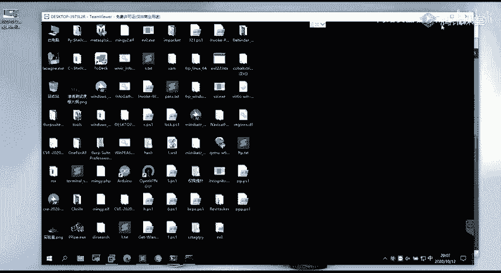

本节课的话会介绍这3块内容。呃，主要的它就是前面2块。第一块的话就是呃带大家一起来了解一下什么是反弹线，以及对反弹线尔的一个警界，以及呃让大家区分正向效以及反向性就。在后面的一个呃内容的话。

我们经常会去呃使用到，或者说去呃你必须要去理解这样子的一个概念，你才能够去比如说你去呃得到一个谢尔。就是说我们的一个正向下以及反向下，它在不同的一个情况下面的话，我们是呃有不同的一个用法。

然后第二个的话就是windows下面的反谈线尔的一些方法，给大家做一个详细的一个介绍。第三个的话就是呃反向线尔的一个实验啊，留给大家作为一个课后的一个作业。好，首先的话我们先来一起来了解一下反弹效。

在了解反向线有之前的话，我们先来呃看一下什么是正向的一个线。剩下协有的话，我这边用这样子的一句话做了一个概括，就控制端主动发起连接请求去连接我们的一个被控制端。然后的话中间的一个网络链路，它不存在阻碍。

然，呃从从我们这边的这个图，我这边的话画了一个草图啊，就这边的话是一个控制端，也就是我们的一个atat的话就是攻击者。被控的话就是他给这也就是我们要去控制的一个目标，也就是我们要去攻击的一个目标，是吧？

然后我们的一个正向泄额的话就是控制端，我们的一个攻击者主动的去向我们的一个被控端，也就是我们要去攻击的一个呃目标去发起这样子的一个请求，发起一个连接的一个请求。

然后的话他发起这样子的一个请求来去建立这样子的一个连接来进行一个呃控制。然后的话正向泄，它是就是说在中间的一个网络链路，它是不存在阻碍的，就是说我们比如说我们的一个被控端，对吧？我们的一个控制端。

它是在公网的一个服务器，对吧？因为他在公网的一个服务器的话，我们是能够去直接的去访问到的对吧？我们只要我们只要能够去领网，我们就能够去访问到他公网的这个服务器。然后的话我们就可以通过呃就是。

就是说我们攻击者与。呃，我们的一个目标服务器中间它是没有这样子的一个阻碍的。也就是说它是能够去直接的访问到。那么呃什么是反向线啊的？反向线啊，我们也经常会常称作为就是反弹线。

就是呃我们的一个被控端主动发起连接请求去连接我们的一个控制吧。就其实呃从这面意思我们也能够大概的理解，对吧？就是跟正向线啊，它是相反的，就说正向线，它是要我们攻击者主动的去发起请求去进行连接，对吧？

那么反向线的话，就是我们等待着就是我们的一个呃攻击者等待被控端，也就是我们的一个目标机器来主动的去连接我们。我们的一个呃控制吧。然后的话这这一种反向需的话。

主通常的话就是用于就是说我们的一个被控端是在有防火墙的一个性质，或者等等的一些权限端口占用等等的一些问题。就导致我们的一个被控端，它无法去正常的。就是呃不能正常的接收发送过来的一个数据包。

这这句话怎么理解呢？我们看一下这个图啊。就是说我们的一个控制端与我们的一个被控端，它中间是有相应的一个阻碍的。这个阻碍的话就来自于像防火墙，对吧？因呃它中间有这样子一个防火墙的话。

我们的一个控制端是无法去直接的去访问到我们的一个被控端的。就大家可以就是大家应该都知道，对吧？就比如说我们的一个控制端的话，也就是我们攻击者是在外网，对吧？然后的话我们想要去控制的一个机器。

它是处于一个内网当中。然后的话我们在外网是无法去直接去访问到每某一个内网的对吧？但是的话在内网当中，你比如说你在公司你的一个内网当中，你是可以去连网对吧？去连外网去访问外网，对吧？

那么这个时候我们就无法去通过正向线来去控制这样子的一个被控端去被控端去进行连接，对吧？那么这个时候的话，我们可以尝试使用这样子的一个反向线，也就是说让控制端啊。

不让被控端来去主动的去连接我们的一个控制端，也就是连接我们攻击者的一个服务器，对吧？那么这样子的话，它中间它是因为它是能够去正常的去访问到的，所以所以的话是能够去正常的去进行连接。呃。

这里的话大家大家能理解吗？呃，应该能理解吧。就是呃反向线以及正向线。应该没什么问题吧。27个汇报什么27个汇报。能你姐的扣一啊，有问题的扣2。呃，FTP呃，上节课这边的FTP报错的话，呃。

我尝试了就是说它是有这样子的一个问题，就是FTP的它的一个在命令行当中的话，它要去建立要与我们的一个服务端去建立连接有这样子的一个。呃，被动以及就是casive以及co的这样子的两种模式，就主动模式。

还有被动模式。然后的话在在命令行下面的话，在项M机下面的话呃。

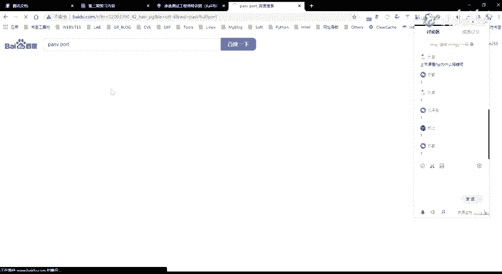

你需要去启用这样子的一个pasy，也就是被动模式。但是的话在面令函下面，我尝试使用这样子的一个模式的话，是有失败的。就这边的话我呃这边的话。我查了资料的话，我暂时也还没有说没有去解决啊。

看就是别人的一个呃就是。回答的话就是说他这个的话就在命令行下面不能够去使用这样子这个。被动模式。但是的话像我们的这样子的FTP的一个工具。其实我们就我们的1个FTP的一个工具，是吧？

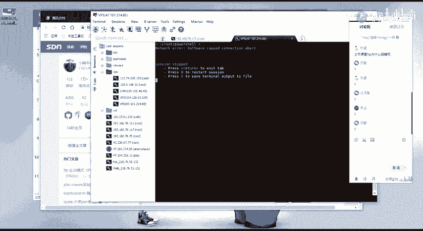

佢出嚟做。我们的FTP的一个工具。你看像在这边的话，默认的话它是勾选的一个passive mode，也就是我们的一个被动模式。嗯。😊，关于这个主动模式以及被动模式的话，我这边不多做介绍。

你去你想要去那个的话，想要了解的话，自己去了解一下，好吧。Yeah。

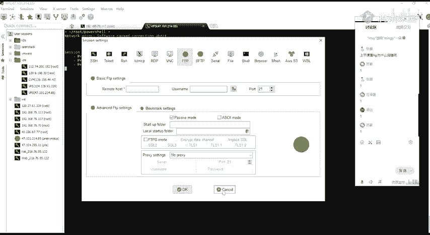

Yeah。Okay。嗯。好，这边的话应该没有问题啊。那么我们继续好，下面的话就是我们的第二部分内容，也就是我们今天的一个主要的一个内容，就windows下面的法谈效的一个方法。

首先第一个的话就是我们经常会去用到的，也是经常会听到的这样子的1个NC的一个工具。我们经常会去使用NC来去建立这样子的一个正向线以及反向线。然后在这边的话。

我就呃练了这样子的两个就是说带大家一起来理解一下NC它的一个正向线以及反向线，它的一个呃基本的一个使用，以及它基本的一个原理。首先的话我们NC。呃，NC这个工具大家应该熟把。

然后呃我之前的话不是如果不熟的话，我之前不是已经给了一篇笔记嘛，大家自己去尝试。诶 n c。这一个这一篇笔记，大家自己去呃。自己去尝试一下，然后的话去使用一下NC这样这样子的一个工具。

然后的话可以尝试就是照着我这边的一个笔记，对吧？自己去做一个尝试去理解一下，好吧。这个工具话是我们经常会去使用到的。好，呃在这边的话我们来看一下，就是首先的话我们的一个被控端以及控制端。

同样的就我这边的话有标注啊，就是呃跟这边是对应的，应该能理解对吧？首先的话我们要去建立一个正向选。我们前面已经说了，就是说需要我们的一个控制端，主动的去连接我们的一个被控端，对吧？来去向被控端发起请求。

然后的话所以的话我们的一个控制端，我们的一个命令的话就是NC去连接我们的一个目标的一个就是我们的一个target，也就是被控端的指定的一个端口。然后的话我们的一个被控端的话。

就需要去通过NC去监听一个端口来等待我们的一个控制端去进行一个连接。然后在这边我们能够去建一个share的话，重点的话在在于NC的这一样子的一个参数，这一个杠一的一个参数。呃，在这边的话。好。

我们可以呃。通过NC杠hel来查看这一个工具，它的一个帮助的一个信息。然后在这边的话就能够去呃列出来了它能够去使用的一些选项，对吧？然后我们主要的话关注这几个就我们常用的。首先的话第一个就是这个杠一。

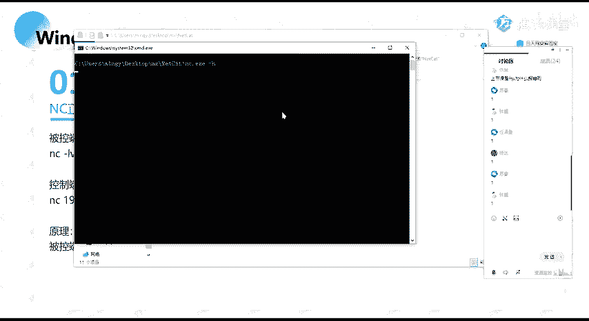

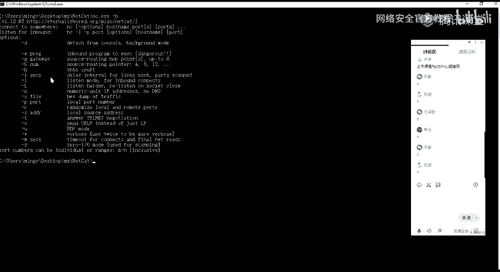

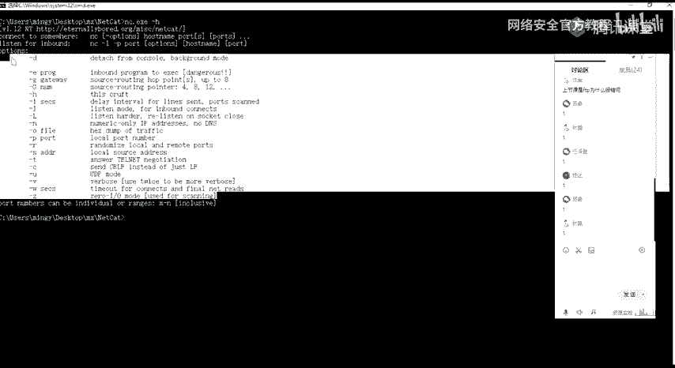

这个杠一的一个参数的话，后面接一个program。也就是说我们可以通过这个杠一参数来去呃执行一个，就是说在建立连接之后的话，能够去执行一个程序。然后其实他在这边有标注derous。

也就是说这一个选项的话是一个很微型的一个选项。而恰恰是这个选项的话，就用就我们可以用这个NC工具来去建立一个呃线正向线以及反向线。

然后第二个的话就是这个杠L杠2杠L这个参数的话就是进入一个今听的一个模式，也就是去进行一个端口的一个精听。就我们经常的话会这样子去进行一个使用NC杠L，对吧？然后的话去监听一个端口，比如说。

8888的这样子的一个端口。好，然后呃在这边的话，我们还还还要介绍一个参数。这边干L的话就是进入津听模式，也就是表示我们要去精天一个端口，对吧？今天一个呃端口。然后的话我们要去指。今听某一个端口的话。

我们需要用这个杠P的一个参数去进行一个指定。也就是说我们还需要去用杠P来去指定。我们要去监听的一个端口。然后现在在这边的话，我们就能够去。呃，现在的话已经今今天了这样子的1个8888的一个端口。

我们可以通过。喂。通过我们前面给大家介绍的。nice that这样子的一个命令，对吧？来查看一下。我们的这个888的一个端口是否处于一个今天的一个状态，对吧？我们可以看到在这的话。

它是处于一个精天的一个状态。listening。888的一个端口。所以的话我们在这边的话，其实是已经今天的一个端口。就只需要这两个参数即可。然后还有第三个的话就是这个杠V杠V的一个参数的话。

就是显示我们的一个详细的一个信息。就是说我们的这样子的一些连接。我们。呃，控制端以及被控端之间的这样子的一个连接信息，我们能够去查看到。当然在这边的话呃，指定杠V的话。

它就显示了就是说今天在了我们本地的这样子的1个888的一个端口吧？然后的话如果有呃有客户端啊不有控制端来去进行一个连接的话，它在这边的话，它可以显示相应的一个信息。

以及我们呃就是说控制端以及被控端之间的一个信息的一个交互。

呃，我们也能够通过这样子的，就说在这边能够去查看到。他好。然后呃我们再回过头来。回过头来理解一下它的一个原理。

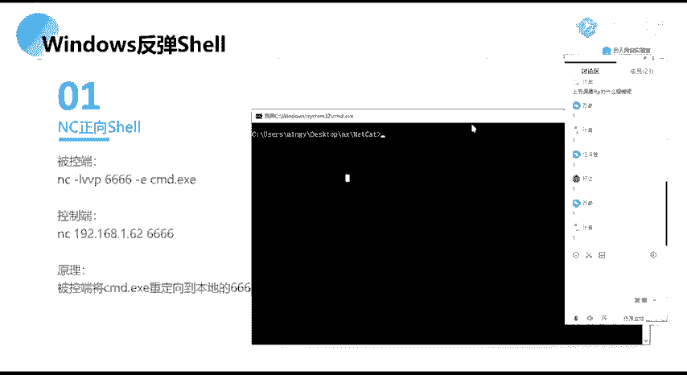

就呃原理的话，其实就是我这边概括的这一句话，应该很好理解。就说我们的一个被控端将我们的1个CMD点X1重定向到本地的这样子的1个6666的一个端口。也就是我们这边被控端今天的一个端口。

然后的话我们控制端去呃连接被控端的这一个端口之后的话，它会去建立一个连接。尽力连接之后的话，它会在这边它会去连接到呃这1个666的一个端口。然后的话在这边666端口上面的话。

已经有运行的这样子的一个CMD点X1。就是说它是在被控端上面去重定向到这个端口。然后的话我们尽力连接之后的话，就能够去得到这边被控端的一个CMD的一个线。呃，在这边的话，我们。好的。来具体的看一下吧。

Yeah。Yeah。

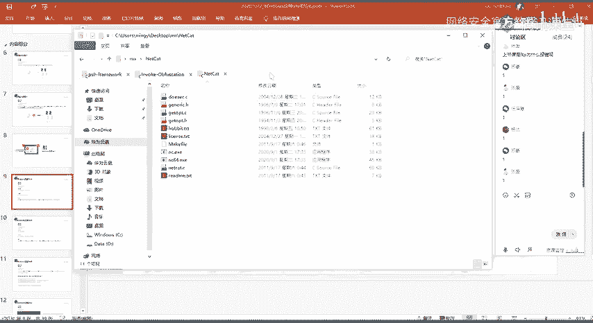

嗯，都可以。YeahYeah。

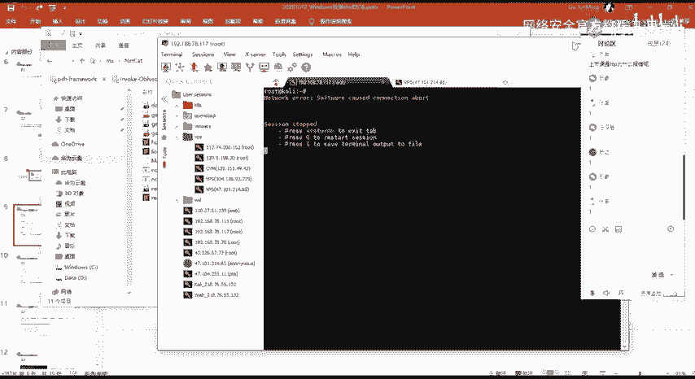

Yeah。啊，我们这边事故。7802。啊，呃，我这边的话就以这一个以这一个作为我的一个就是说一个。控制端，然后这边的话作为我的一个被控端呃。啊，换一下吧，就是我这边的一个咖里机作为我们的一个控制端吧。

就是说这样子的话，可能大家会。更更更好理解一点，对吧？我们今通常的话会使用卡里这一个机器去做相应的一些攻击，对吧？就作为一个我们的一个控制端。然后我这边的话作为我的一个目标机器，也就是我的一个被控端。

然后的话我这边的话通过。通过NC。

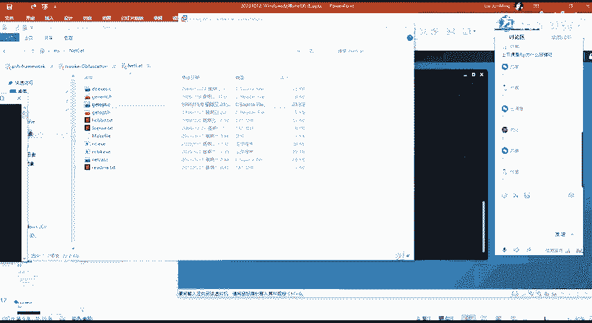

Yeah。首先的话我们呃要去等待我们的一个控制端来主动的去进行一个连接。所以的话我们需要去精贴一个端口，对吧？干VVP然后指定的一个端口的话就12345吧。

然后的话我们要把我们这边的一个就是目标机器上面的1个CMD点X一从电向到我这边的12345的这样子的一个端口。白。然后这边的话今天今天成功。然后我这边的一个机器的话，我再去主动的去连接。Okay。嗯。

超。

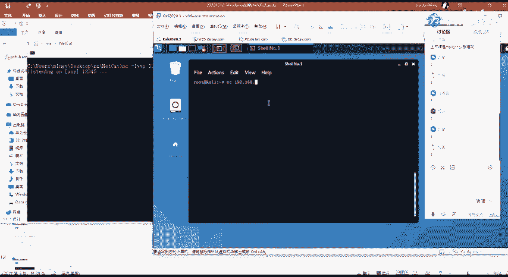

78。114。

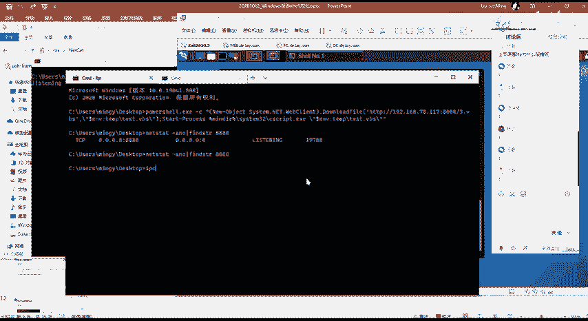

谢实。要4试。然后的话呃连接这边的1个12345的一个端口对吧？啊。好了。7八。そが？嗯。Okay。对。啊。这边没写。啊。没有。嗯。嗯，吃饭啦。

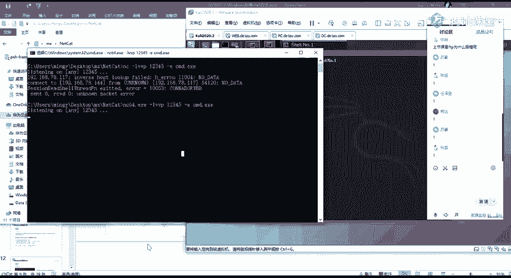

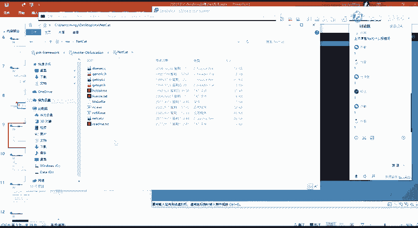

H。嗯。啊。Yeah。这个的话是。Right。嗯。嗯。啊嗯。あ。啊。あ。那我们把。我换个机器。

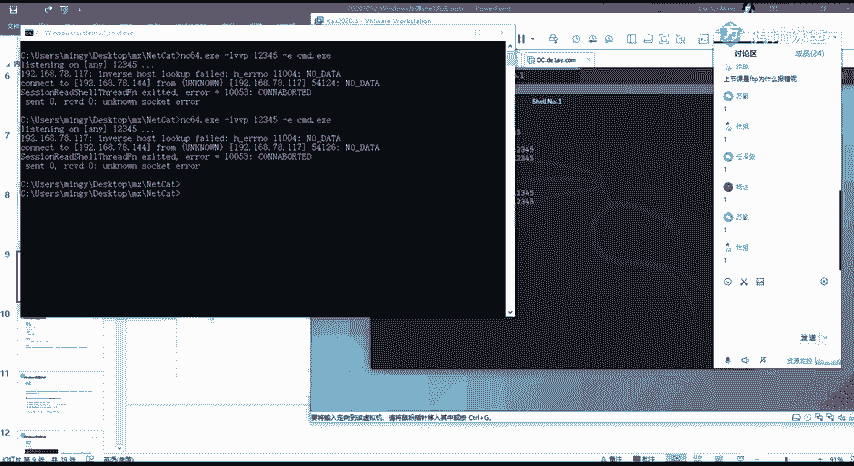

这边的话应该是被我的防火墙给拦了。

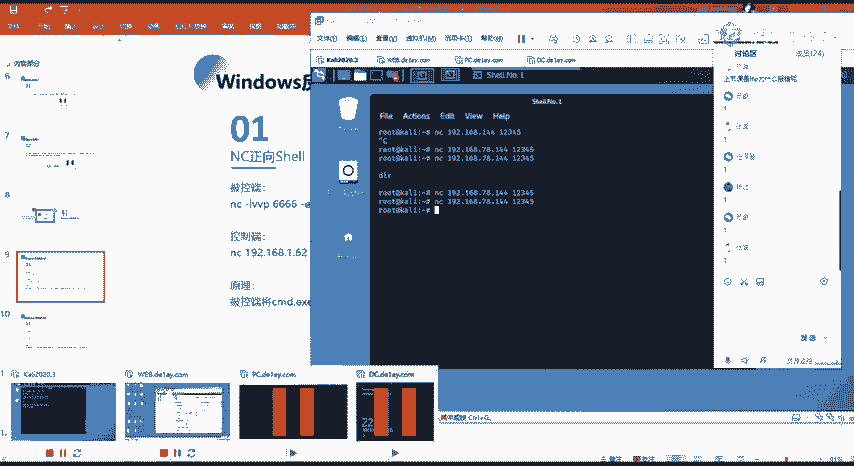

。

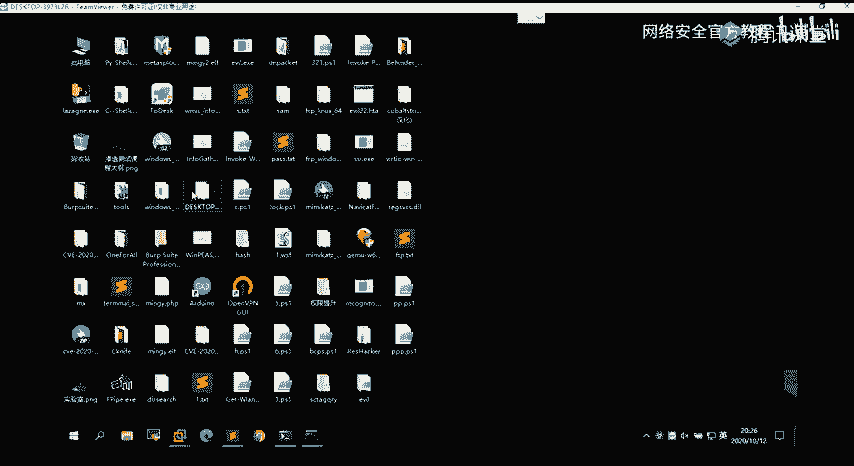

好。

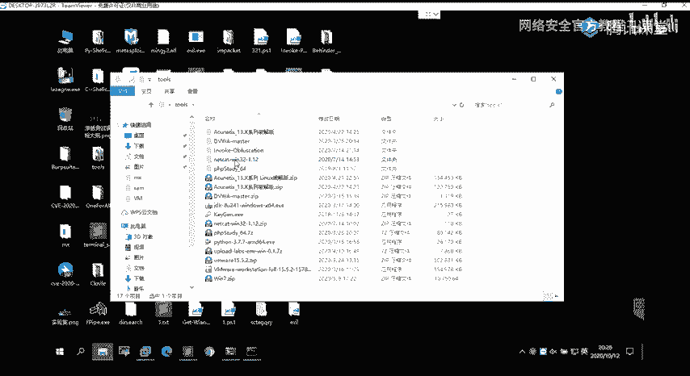

Oh。Yeah。Yeah。嗯。78。67。

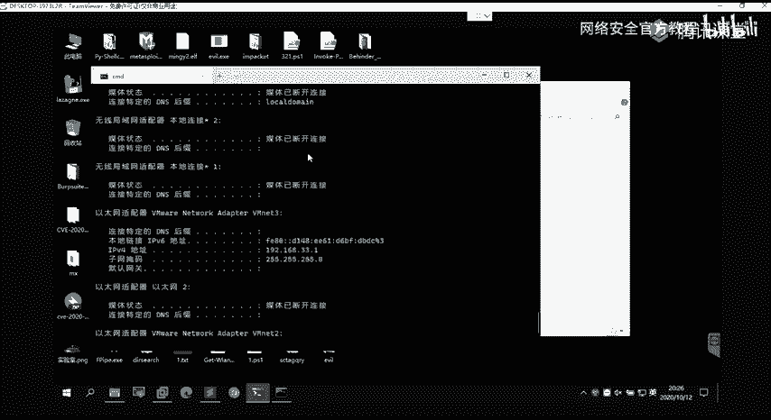

对。

嗯。

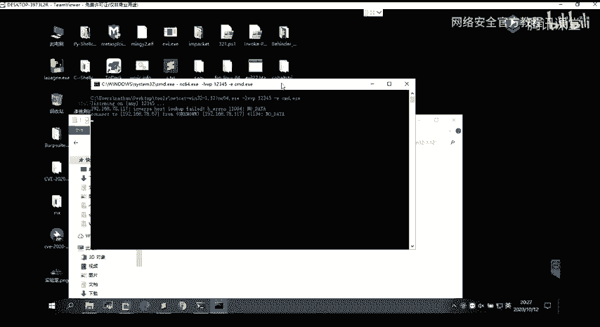

这边的话可以看到我们已经建面了一个连接啊。然后在这边的话。在这边的话，我们呃我们的一个控制端对吧？也就是我的一个看理机器，我这边主动的去连接了这边的1个12345的一个端口。

然后的话得到了这边的一个CMD的一个选，对吧？可以看到我当前的话是在这边的一个目录下面，然后我可以执行一下。

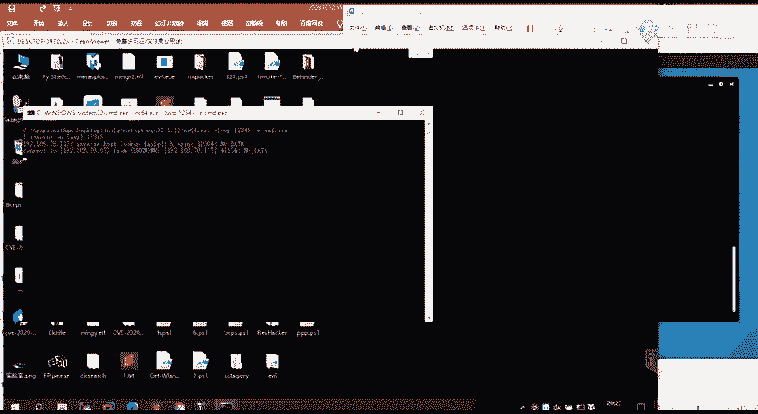

就说。放开系。

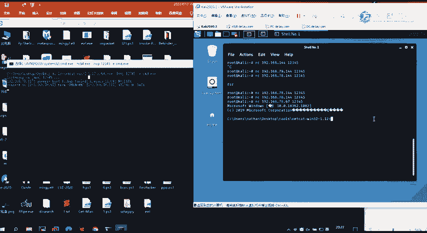

然后我当前的一个。用户用户的话就是这一个那ice。是然后在这边的话就得到了得到了一个这样子的一个。

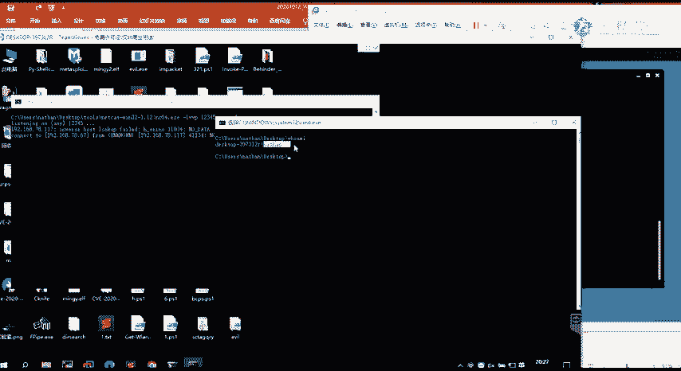

呃，相低的一个笑。

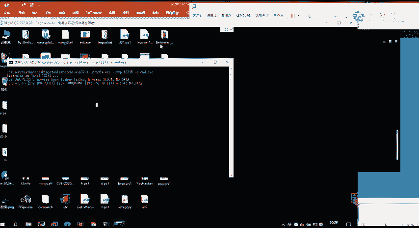

这是这就是呃正向性。然后的话反向性反向线的话呃，你理解的正向性啊，其实反向性啊也也就是也会很好理解，对吧？对呃，我们的一个反向需要的话，就是说我们的一个。被控端主动的来去连接我们的一个控制吧。

也就是说我们要去等待的等待着控被控端来去主动的我连接我们，对吧？那么我们。

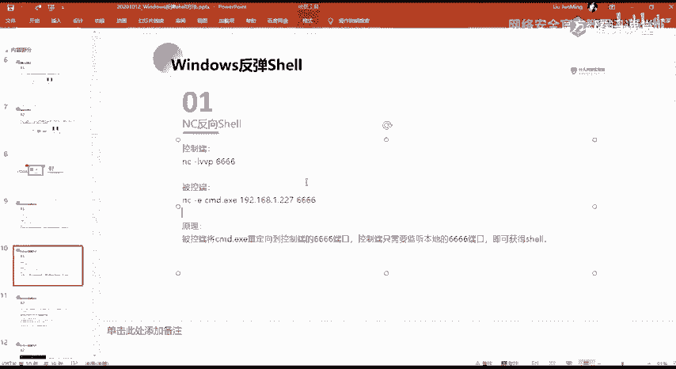

呃要去做什么呢？也就是说。也就是说我们的一个攻击者要怎么才能够去让呃我们的一个目标机器来连接到我们呢？对吧？所以的话我们需要去精贴一个端口。比如说我这边的话，54321。

我去我们的一个控制端去精贴一个端口来等待我们的一个被控端，主动的去进行一个连接，对吧？所以的话同理我们的一个。

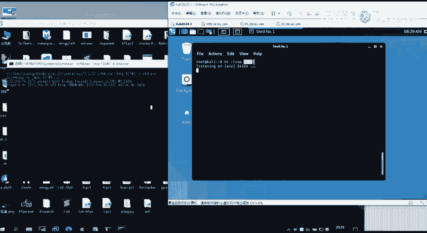

控制端的话啊，我们的一个被控端，也就是我们的一个目标机器的话，要去连接我们的这样子的一个呃控制端，也就是我这边的一个咖米机器。

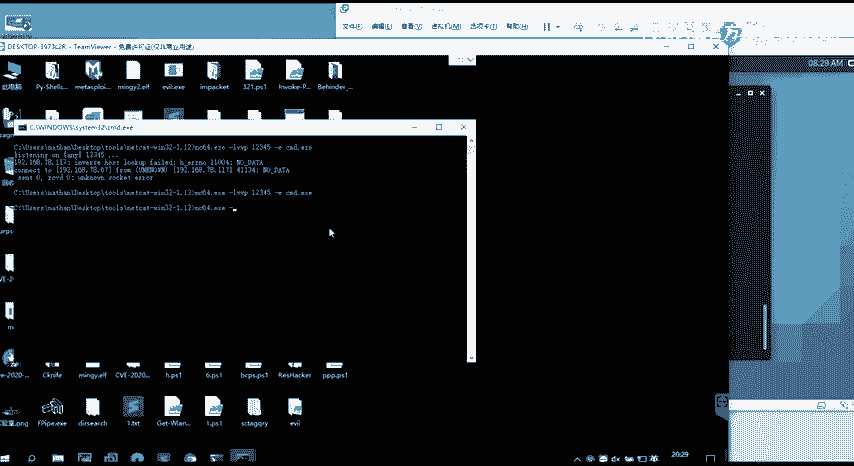

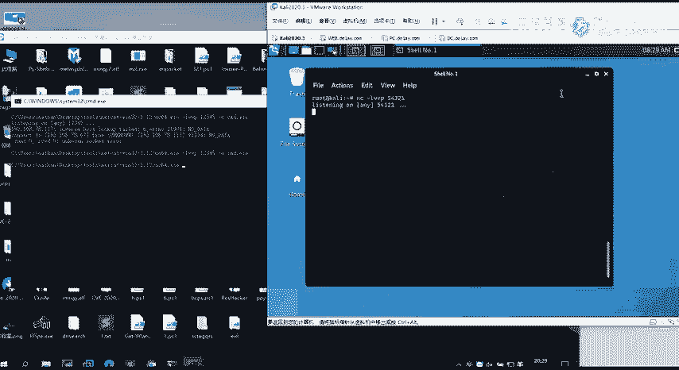

呃，的这个54354321。然后的话把我们的这样子的一个。呃，控制端的这样子的1个CMD点11一要重向到重定向到我们这边的一个就是说我们这边是主动的去连接控制端的这个5431的这个端口，对吧？

所以的话我们这边连接成功之后的话，我们再把我们的1个CMD重定向到这个5431的这个端口。也就是说我们在这边的一个控制端今听之后的话，就能够去得到这边的一个呃被控端的这样子的1个CMD。

我们可以来试一下。

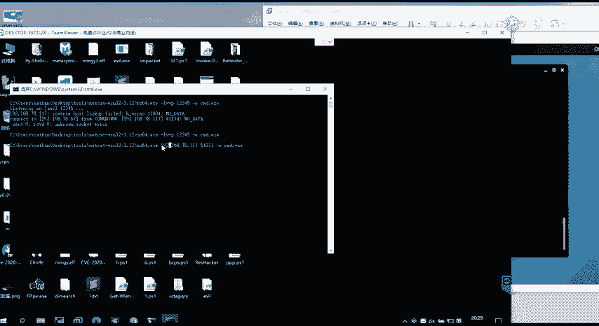

Yeah。对。对吧。可以看到在这边的话就得到了这一个呃这一个机器的这一个线。

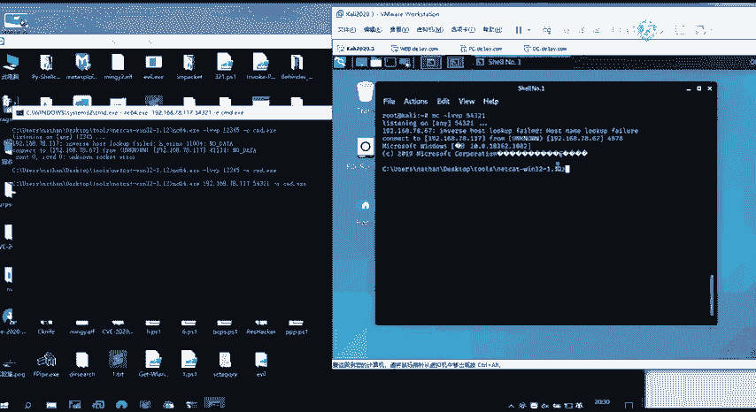

这就是呃反反向线。

然，呃它的一个原因的话，其实跟前面也是类似的是吧？就是我们的一个被控端，将我们的一个这个CMD从电向到控制端的这一个呃这个端口。啊，当然的话在我这边的话是这里啊，对吧？

就我实际的例子的话是那个54321，对吧？也就是我们的一个呃控制端所今天的这一个端口。然后的话控制端只需要今天这一个端口就能够去获得这1个CMD的一个选。这就是反向小。系。呃，这里的话能大家能理解吗？

有没有什么问题，应该没有什么问题吧。啊。我这讲应该很好理解吧。Yeah。好，没有问题的话那。我们继续看第二个。第二个的话就是。呃，我们windows下面的反谈西尔的另外的一个方法。

就是这个MSHTA这个MSHTA的话，它主要的话是就是说它是windows里面它自带有的这样子的一个解释程序。这个程序主要是用来用来解释运行我们的这样子的1个HTA也就是我们其实上节课的话已经有讲了。

对吧？就这1个HTM的一个应用程序文件。我们上节课有去讲，就是说在讲那个bes amin以及那个文件，就其他的那一些文件的一个呃下载的时候，对吧？其他的一些内置工具文件下载的时候啊。

都是以下载这1个HTA这个应用程序的一个木马为例的对吧？然后的话我们呃这里的这个。MSHTA这个程序的话就是用来去解释执行这样子的一个程序。好。

然后的话呃下面的话我们通过具体的一个例子来解释呃来去给大家介绍，就是说我们如何去进行一个利用，如何去实际的去进行一个使用。

首先第一个话就是通过呃我们MSF的这样子的1个HTA的1个websserv的模块来去发起这样子的1个HTA的一个攻击。呃呃MSF的话，大家其实前面呃就前面已经讲了，对吧？就基本的一个使用，对吧？

但是可能就是具体的就是说可能没有具体到，就是说相应的怎么去使用里面的一些呃已经存在的这样子的一些模块，对吧？就没有说有去通过MSF来去呃实际的去应用到。然后其实我们这边以及后面的一个课程内容的话。

是都会有去涉及到的。就我们前面的一个呃我这边的一个课程安排的话，其实就是说前面的1个MSF以及CS的话，就是告诉他告诉你们就是就是一个基本的就你基本的能够去使用就OK了。

然后的话后面具体的一个使用方法的话，就是以及实际的一个利用的话，利用的一些方法的话，都会在后面的一个内容当中都会去给大家一一的去体现。Okay。好呃。在这边的话呃。应该是。在这的话。

我其实已经写的很详细了。我这边的话我就呃先过一遍嘛，先过一遍的话，然后的话我再给大家呃实际的操作一下。然后在这边的话主要的话是用到了这个HTAserv的这个模块。然后的话呃使用这个模块之后的话。

我们可以去就是说它会有返回，它会主动自动的去生成有这样子的一个HTA的一个木马文件。然后的话我们可以通过MSHTA这个呃windows里面它自带的这样子的一个应用程序来去解析执行远程的这样子的一个HTA的一个文件来去访谈一个些。

然呃具体的一个我们可以看一下，就在这边。我这边的话用这个模块呃执行之后的话，对吧？它在这边它会有返回给这样子的1个URL。

这个URL的话就是我们的一个这个呃它自动生成的HTA的这个木马文件的一个链接地址。然后生成的这一个链接地址的话，我们可以通过这个MSHTA来去在目标机上面去解析执行。执行之后的话。

在我们的这边的1个MSF的话，它就会去得到这样子的一个系。呃，这边的话我们实际来看一下效果。

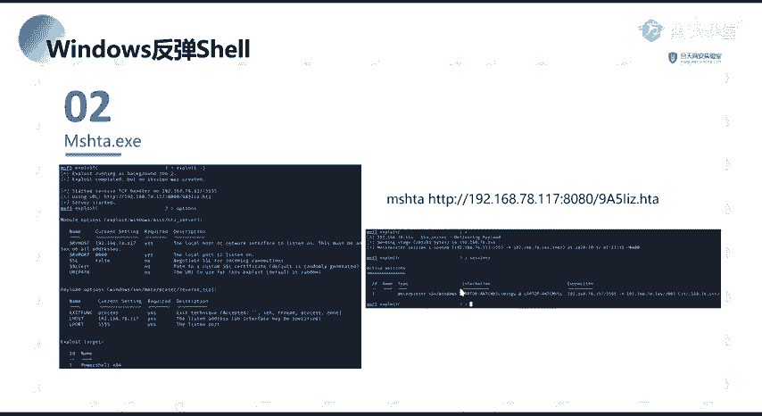

Yeah。電。怎么样。我这边的话直接复制吧，就不敲了。

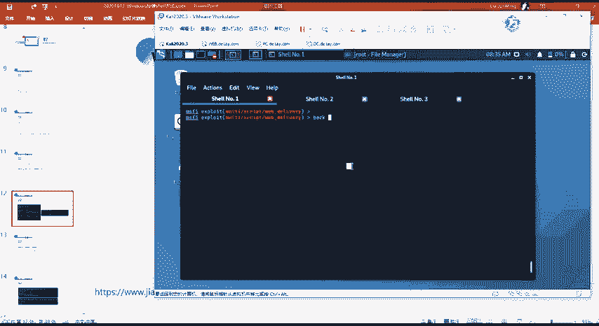

节省一点时间。首先的话我们先幼稚一下这样子的一个模块，对吧？然后柚子之后的话，我们通常会去首先的话就是要去做一个配置嘛，对吧？是。

所以的话第一步我们会通过options的一个命令来去查看呃这个模块它的一个需要去配置的一些信息。配置的一个信息的话，我们主要就是去查看这边你require它标明的这种y，对吧？

就是说它y的这一个选项的话，就是说是我们必须要去配置的。如果它这边没空的话，你是啊就是说你不配置的话，你是无法去执行的。然后在这边的话，我们需要去做相应的一个配置，主要的话就是SRV house对吧？

这边呢SRV house的话，其实就是我们的1个MSF的一个呃服务器所在的1个IP。因为我这边的话是呃是在就是就在内网的一个机器啊，对吧？所以的话我这边的话就是一个内网的1个IP。

也就是我这边的这个咖里机器的1个IP。然后这边的一个端口的话，默认的话是8080，也可以改成其他的一个端口。然后其实这边的这边的这一个配置的话，其实就是对应的我们这边的。

这边我们会它会去自动的去生成这样子的一个配load，对吧？生成这样子的一个码，然后生成的这个码的话，它需要一个服务，需要一个外围服务才能够去访问到，对吧？所以的话它MSF里面，它自带的。

它自己就会去呃生成这样子的一个服务，也就是在这边的一个配置，其实就是对应的。

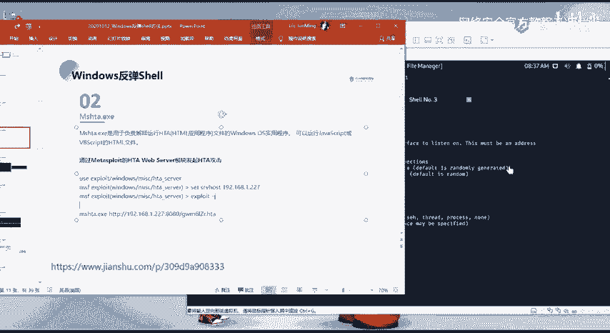

然后我们这边要配置的话，就是说我们要配置的一个这个访问这个码的这个serverer的这个IP以及端口。这边我们可以自己去进行一个自定义，是吧？然后下面的话就是我们的一个payload。

 payload的一个options，也就是我们要去配置我们的一个payload它的一个信息。这边的一个payload的信息的话，就是我们生成的这个码，它的就是说呃我这边的话。

我这边的话是使用的一个reverser tCP，也就是一个GTCP的一个反弹的一个线的反弹的一个mater的一个线。然后的话我们在这边的话，就前面再讲MSF其实有都有讲，对吧？就是说反弹这一个反弹。

就是rever的TCP还有半的TCP的这样子的一个配置，对吧？在我们那个rewes的一个TCP的一个配置的话，其实都是。通都是就是通用的，应该算是种。

就是主要的话就是配置这一个airpo以及airport，就是我们用去访谈的这种呃配load的话，那么你要配置它就是airpo以及airport这边的airpost的话就是我们的一个要去。呃。

这边的话这边的话还是要先理解一下，就是说其实就跟我们今天的一个反兰西尔。对，反谈西尔的一个内容是。呃，一致的。就说我们这边的话是用的一个反弹下尔的一个配load的对吧？那么我们要反弹 share尔的话。

我们的一个这边生成的一个码，对吧？生成的一个码的话就相当于是我们的一个就说在被控端上面的一个呃我们。嗯，怎么才能让大家好理解呢？就以。

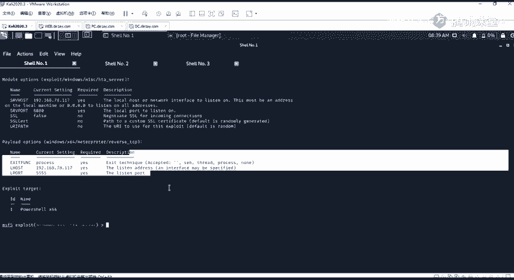

呃，以以以以这个NC吧，对吧？你就相当于就是说相当于就是说我们这边生成的一个码，它是呃在控制端啊，不在被控端上面的1个NC的这个mini，对吧？

然后的话我们生成的这个码在被控端上面去执行之后的话，它会它会去主动的来去连接我们的一个控制端。因为我们的一个反向限的话，就是说就是说我们需要我们的一个被控端来主动的去连接我们的一个控制端，对吧？啊。

这边这个。

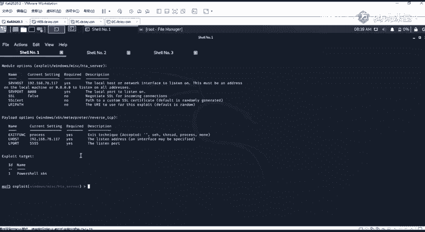

对吧所以的话对应的就是说对应的我们在这边MSF当中，我们要去使用这样子的一个反弹的一个呃反向的这样子的一个TCP的一个hell的话。那么我们这边配置的就是说Lho的1个IP以及端口的话。

就是说我们呃控制端，我们控制端的1个IP以及端口，就是我们控制端的1个IP以及今天的1个端口。

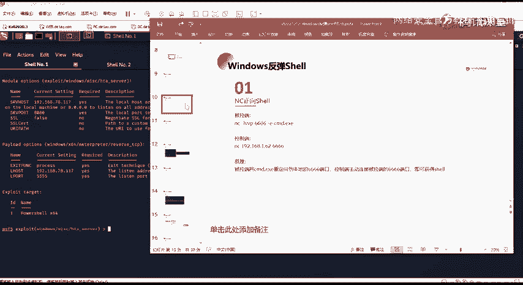

2。

对吧就是呃其实跟这边的话一样的对吧？我们的一个被控端需要知道需要知道我们的一个控制端的1个IP以及端口对吧？然后的话我们的一个控制端的话，只需要去监听它的这样子的一个端口。

就可以了。然后的话只需要去等待我们的这边的一个payload。

来主动的去连接我们的一个控制端，对吧？就能够去反弹一个需要。

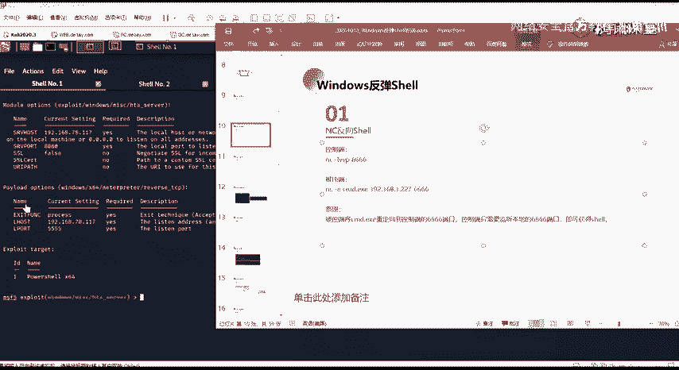

呃，这边的话就是。给大家就是说让大家就是说能够去更好的去理解MSF它的这样子的一个这一些模块啊，这些模块它的一个呃使用吧，对吧？

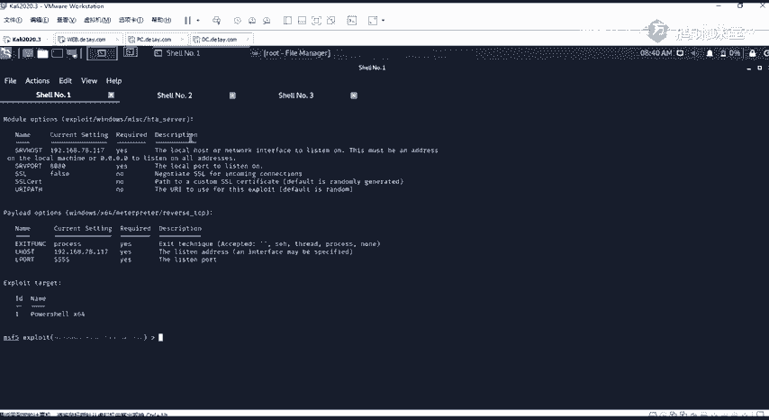

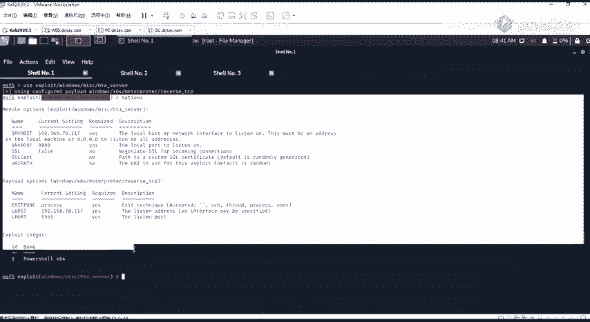

就你你可能就是说你刚你刚开始用这个工具的话，你可能会很迷，就是说你不知道的。呃，你不知道该怎么去配置，或者说你不知道该怎么去用这样子的一个配load，就是说这一个模块。

这一个模块它它的一个配置以及你这个模块它所对应的，我们要去使用什么样的一个 payload，对吧？以及这一个 payload的，我们这边配置的IP及端口是什么，对吧？这个的话。

其实我上我刚刚的话已经就是给大家应该比较应该应该。比较直接的给大家讲讲啊，就不知道大家明白了没有。这边的话大家能理解吗？は。有问题的话，现在赶紧提好吧。Yeah。没问题的话，扣1。那这。就一位同学吗？

或者说呃我那里还没有讲明白什么的，你都可以你都可以提。exist方选参数哪个？这个嘛？呃，这个的话。这个的话就是说我们在这边所使用的这样子的一个呃。Exist fun。啊，不是这个。翻译一下。

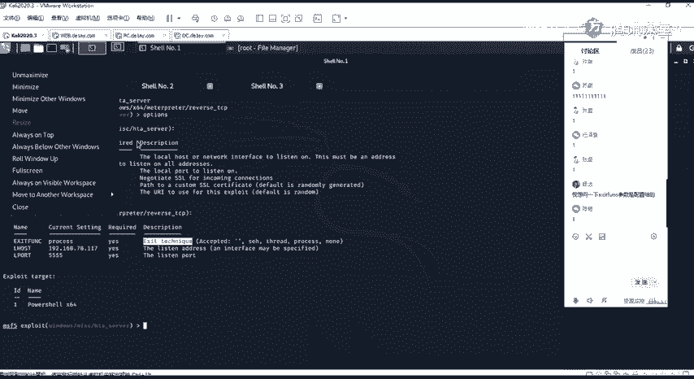

这边呃退出技术对吧？然后呃在这边的话，其实他这边有提供了有process，还有SEH，还有thread性程，对吧？还有n这边的话。

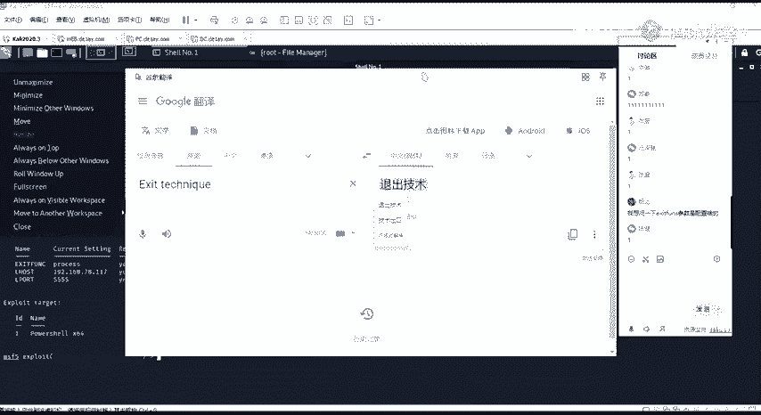

我查一下。

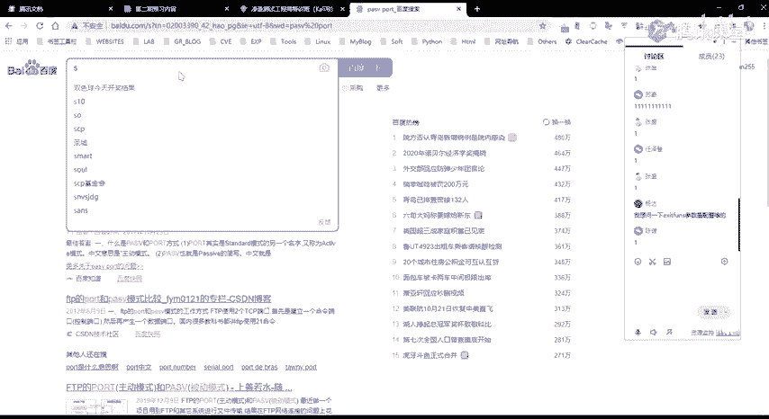

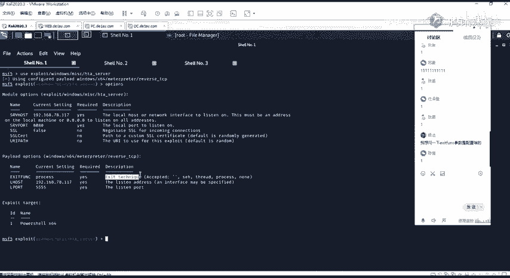

Oh。あはい。Yeah。退出技术。我这边的话也没有去深圳，但是在这边按我的一个理解的话，就是我们知道process的话就是进程，对吧？然后three的话就是信程。Yeah。我也去。咁全点。So。嗯。啊。

嗯。好告。好。Okay。

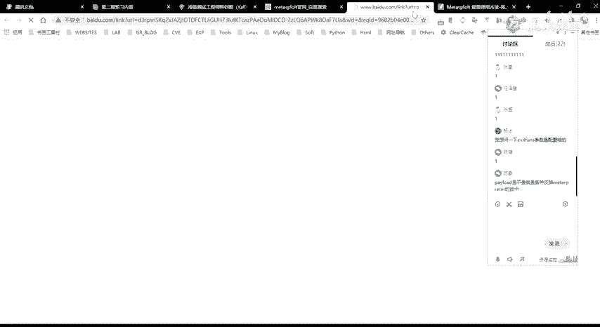

🤧他说这个问题问到我了呀。Yeah。Okay。好。Okay。啊。

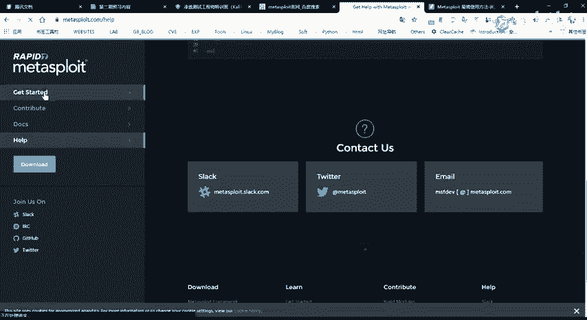

う。

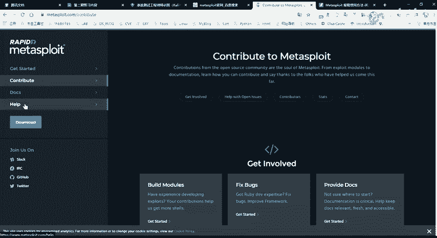

Tpen。

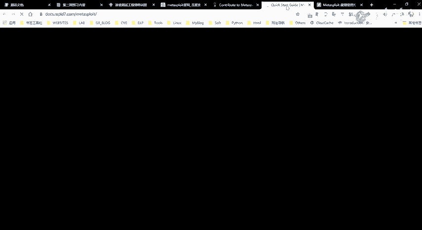

Okay。

嗯。那这个。那去。这个没没人给出解释啊。啊。呃，这个的话我课后我去研究一下，好吧，在这边。我这边的话我没有去关注这个，说实话，因为呃没有有没有去有用到这一个，一般的话就是默认的就可以了。

这边的一个payload的话。

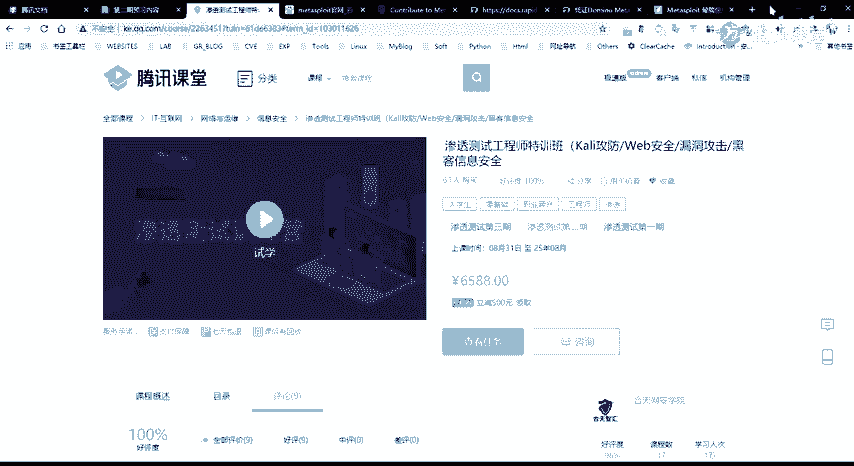

而且它一般呢就是y，虽然是yS，但是默认的话就是这个process。好吧。

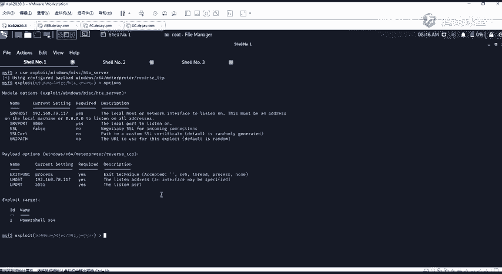

啊。他这边他这边也没有。还有。Yeah。嗯。这也没有讲到这一遍。啊，我课后去研究一下吧。然后的话我下节课再跟跟你说，好吧。这边的话是呃算是知识盲区了吧。他的官方文档竟然也没有写这一个。

然后我们呃先继续看后面的一个内容吧。好。啊。呃，下面的话呃就是呃。

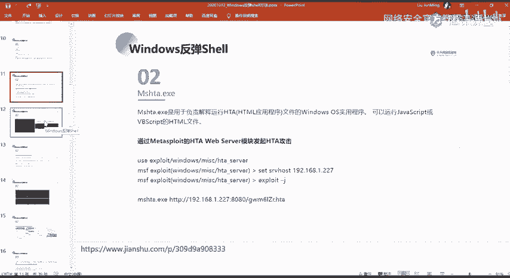

刚刚的话也演示到了这边的这个利用这个HTA server的这个模块，对吧？然后的话嗯我们这边的话需要去进行一个配置，配置配load以及这个呃model options。这边的话我这边的话已经开始了。

我这边已经配置了，我当前的这个看你的1个IP及端端IP的话就是这个780117。然后我这边要去今天的一个端口那就这个。呃。这个555的这个端口，我这边的话已经今天了，所以的话我这边把它先。发掉。

这边这边你要去就是tel掉一个job时的话，就说tel掉这边已经今天的这个端口。就是说呃。啊，我这边我先不P掉吧，就呃其实之前也有就是也有同学问对吧？问这个就是说端口占用的一个问题啊。

我这边只好借这一个给大家解释一下，是吧？就我这边的话是要去今天的一个端口是55的一个端口，对吧？我这边配置好了，那么我ex干接我ex执行执行之后呃干接的话。

就是说把我们这边的一个就是说把我们的这边的一个任务，把它放到后台，也就是把它变成一个job。如果你呃如果就是说不不加杠机的话，就是说你export的话，它它会在这边，它会是在呃前台的对吧？

然后他在这边他会一直有那个，因为这边的话是报错，所以终止掉了。如果说那个的话，就是说如果不加干接的话，他就会是在前台这边，他会一直的去等待连接。等待连接成功之后的话，他就会去得到一个筛选的一个绘话。

对吧？然后其实在这边的话，你会发现在这边它就有这样子的一个报错，对吧？就说这一个报错，其实像这种报错的话。嗯呃，大家懂一点基本的一个英文的话，其实这种报错应该很很就很好理解，对吧？

主要的话就是看这边的嘛，就是呃fa band。也就是说他这边的话就是呃我们这边的undernda的一个今天器模块的话，它就是绑定这边的这个55的一个端口的话，是失败了，对吧？

就绑定这一个本机的55的1个端口是失败了。

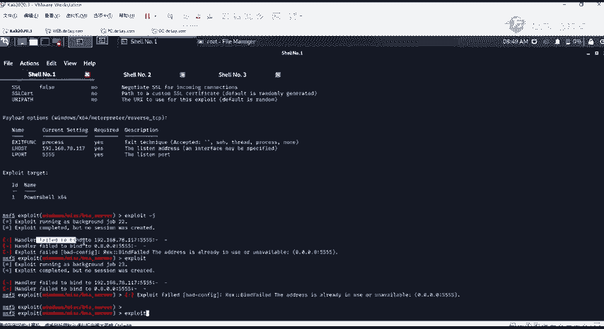