# B站最全网络安全教程，整整1300集，全程干货无废话，别再盲目自学了，看完学不会我退出网安圈！（web安全｜渗透测试｜内网渗透｜CTF） - P84：83. 第三十三天：Linux反弹Shell方法大全-2.mp4 - 网络安全官方教程 - BV15u4y137cQ

嗯。🤧嗯。好，呃，我们继续啊。然后呃我刚刚试了一下，确实是呃应该是我这边的这一个这个需要的一个问题啊。因为我这边的话是windows下面的这个WSL。就一个临时的子系统，然后他在这边执行，不知道为什么。

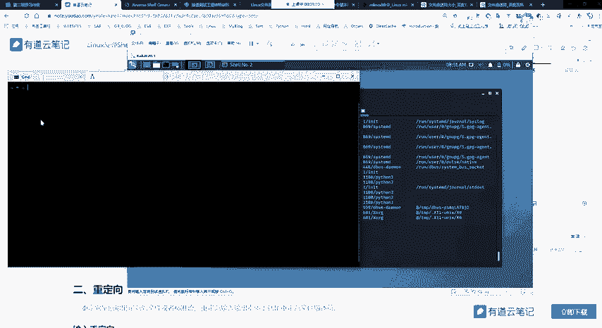

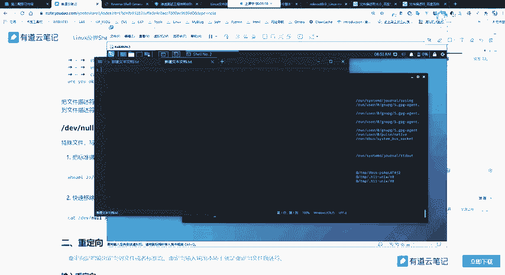

执行就是XEC，比如说13。执行之后，他在这边他直接就退出去了。

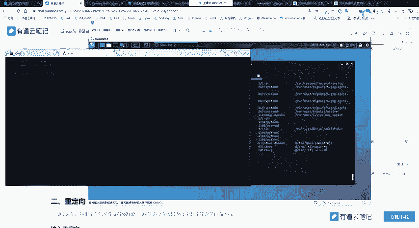

那，其实实际的话，你只要你这你的这个文件描述符是一个就是非负整数啊就可以了。大家可以看我在这边，我这边看你你卡你系统上面，对吧？我指定1个123那个文件描述符指向tt文件。

然后的话我通过就是呃这样子的一个操作的话是没有问题的对吧？呃，这边的话报错的话是因为呃这边注意的话，你的这个重电向符跟你的这个呃符号要挨着呀。要挨着。不。🤧嗯。呃。讲到这边讲到了这里，然后的话我们。

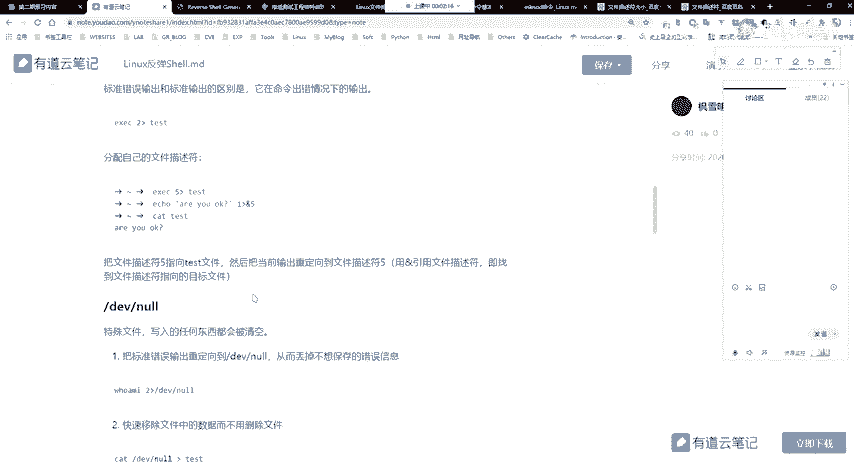

继续我们刚刚的就是所提到的那个问题啊，提到的那一点就是我这边的话，我EXEC5对吧？我只向这一个t文件。嗯。的5对吧？然后我看的这个探索文件，对吧？我现在的话是把我的。

就是通过这一个文件描述服务来去做一个输入，把我这边的一个啊值把它给写入到了这边的一个test文件当中，对吧？那么我想要去从这一个tsest文件当中去读取它的一个内容。那么我们怎么去进行一个操作呢？

就是说在这边的话就会去涉及到就是刚刚有同学说的这个。这一个就是两个呃，就是我们说的就是中文里面的中括号嘛啊，不金括号对吧？这样子的一个然后其实在这边的话就是。我们知道我们这边单一的一个就大于号，对吧？

大于号的话是一个输出的一个重电下，对吧？然后小于的话就是输入的一个重电下。那么我这边EXEC，然后的话创建一个，比如说6就这样子的一个。这样子的一个文件描述符，我们来看一下。比如说。12345。

6666。对吧我创建了这样子的一个文件描述符。那么创建的这一个文件描述符，我们。呃，它有什么就是什么样的一个意义呢？或者是有什么样子的一个特点。就他这边相比于上面这边的话。

哎我们在这边的话只是做了一个输入的一个重定向，对吧？也就是说它可以去接收我们的一个输入，然后的话重电向到这一个文件当中，对吧？但是的话我想要去从他这边去读的话，是读不了的。我们可以通过就是。

比如说我想要通过cat来去读取这边的一个。文件描述服务它里面的所指向的这个探索文件的一个内容。啊，你会发现他在这边的话，他是呃报这样子的一个错误。然后我如果说我在这边对吧我e一个。随便你串字符啊。

然后的话把它给输入到这一个文件描述符6。然后的话我可以来cat一下，cat一下这个呃666，对吧？来查看一下我们我这边的一个内容的话，已经输入进去了，对吧？然后的话我想要去读取呢。

那么我可以通过cat加这一个文件描述符6。诶。嗯。读取他呢。哎，这边怎么。

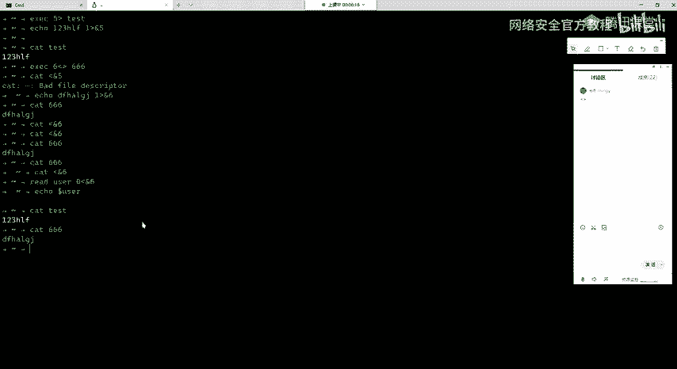

等一下，我看一下。没有搞错了吗。😔。

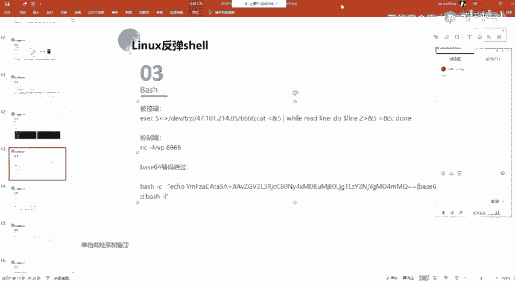

嗯。

再试一下。没有问题的呀。我这边怎么。不行了。呃，我这个。

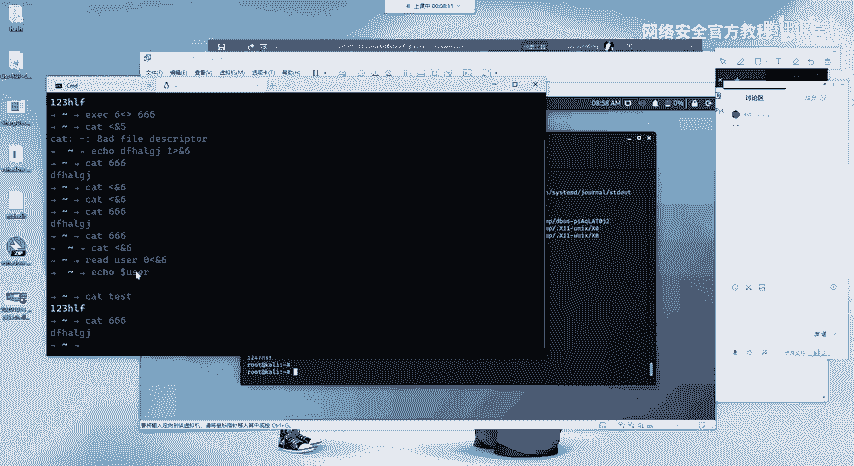

我感觉应该是我这边的这个hell有问题啊。啊，其实。大家在看你上面去操作吧。或者是说呃一个完整的这样子的一个lininux系统嘛。然后其实在这边的话，大家可以看啊，对吧？

就我这边的话是创建了1个66的这样子的一个文件描述符值项的test，对吧？这个test文件里面的话有这样子的一个值。然后的话我通过cat。

然后的话呃就是从这一个呃66这个文件描述服务当中去做一个就是呃输入，对吧？然后读取这一个文件描述服务所对应的这一个文件当中的一个内容，把它作为一个就是输入到输入到这个cat命令，对吧？

我们知道cat的话就是查看嘛，所以的话它其实就是会呃输出到这一个文件描述符，66所对应的这一个test文件里面的一个内容啊，就是这一串，对吧？这没有问题的。我这边。应该是我这边的这一个。

他这一个需要有问题啊。

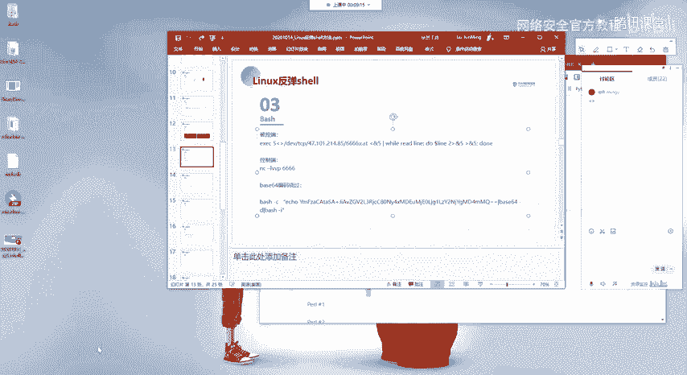

在这边读不出来都。

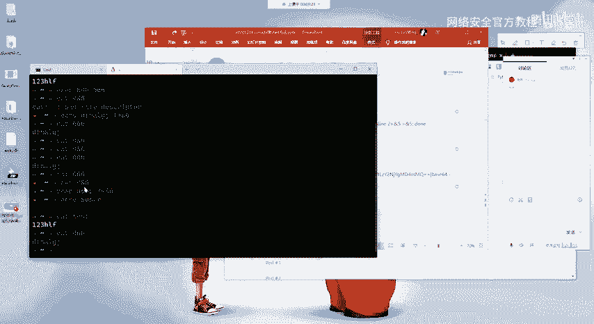

大家在自己的就是完整的历史系统上面去操作。就呃这个windows下面的这一个应该是有相应的一个问题啊。因为它不它其实也不是说一个很完整的这样子的一个linux的一个系统。🤧Yeah。嗯嗯。呃呃。

以上的话就是这一部分的一个内容啊。呃后还有的话就是介绍一个这样子的一个特殊的这样子的一个文件。就这个DB浪这个文件，就这个特殊文件的话，我们在后面也经常会去用到。就这个文件的话，它是。

就写入的任何东西它都会被清空，就是它这个很比较特殊。就我们如何去利用这个文件呢？就是比如说我们要去把我们的一个错误，对吧？把我们的一个标准的一个错误，就是我想要去执行命令。我执行的一个命令的话。

它有各种的一个错误，对吧？那么这种错误的一个东西的话，我们是不需要的，就这种报错的一个信息，对吧？这种报错的一个信息我们是不需要的。那么我们如何去就是说把这样子的一个报错的一个信息。

就是把它就是不显示在我们的一个呃控制台或者是说显示器上面呢。那么我们可以通过就是这样子的一个方式。就把这样子的一个标准的一个错误输出，就是文件描述符二所指就指向这样子的一个文件，就这一个DV浪这个文件。

那么所有的这样子的一个错误输出它都不会显示到显示器当中。Yeah。然后还有一种的话就是我们可以通过就是。呃，这样子的一个方式啊，就是可以就不移除文件，就是我们想要去删除文件里面的一个内容，对吧？

那么我们可第就第一种方法就是我们直接把这个文件删除掉，然后再创建一个，对吧？然后其实我们可以通过这样子的一个方法，就通过cat这一个DV浪这个文件。

然后的话把它从定向到你要去就是清除这一个文件的这样子的数据的这一个文件。然后的话就可以把这个文件里面的一个内容群做一个清空。比如说。嗯。

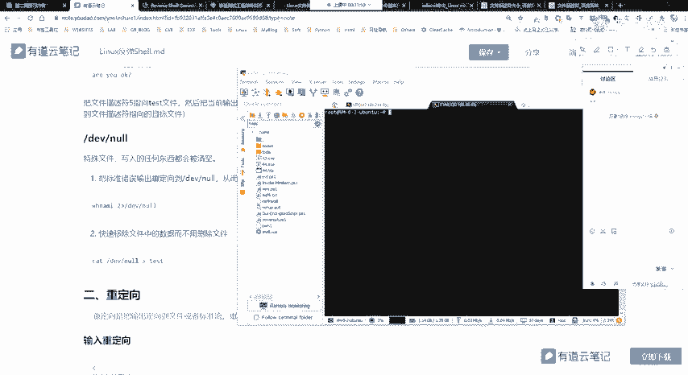

有说我这边。一Z嗯。s死了这一个文件是吧？我可以。呃，cat一下这个DV那。应该有吧。然后重面看到这一个ts文件，然后的话可以看到这个ts文件里面的内容的话就被清空了，对吧？

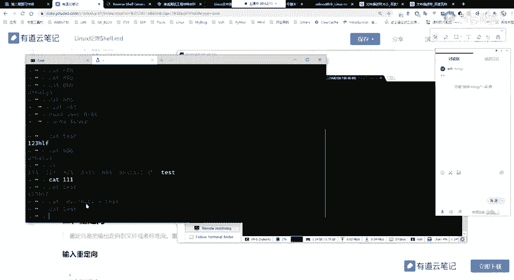

这是一个。Okay。好呃，理理解完了上面的这一些就是。一些前置的这样子的一些知识点以及概念的话，那么我们再去来看一下。

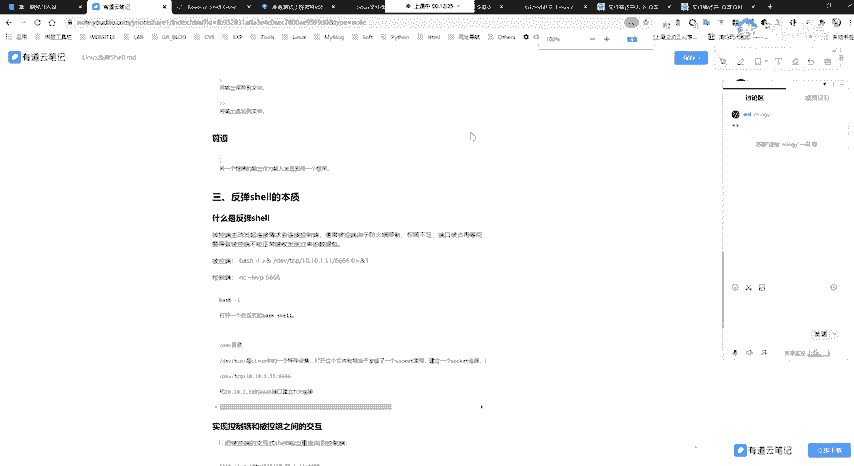

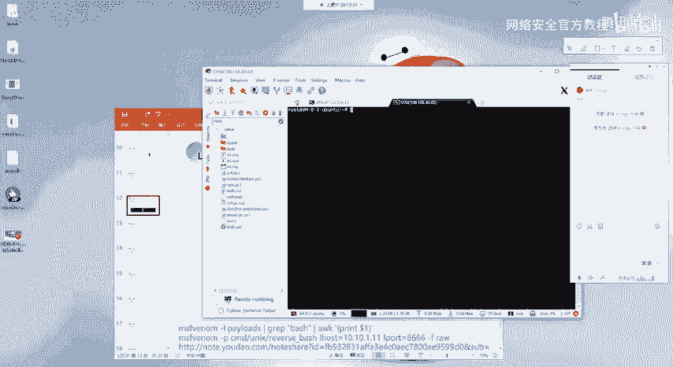

我们的1个PPT的一个内容。就大家呃大家理解了吗？就是我上面讲的这一些概念，以及就是说其实主要的话就是理解那一个文件描述符。就标准的文件描述符，以及我们自己去创建这样子的一个文件描述符。

以及对它的这样子的一个啊输入输出的一个操作，是吧？好，理解。那么我们再回过头来去看一下，在这边我PPT上面的这样子的一些这一个反纳希尔的这一个呃写法以及命令。其实在这边的话，我PPT上面已经给了。

就是一个呃解释。然后在这边的话，我们一起来看一下。首先这一个命令的话，呃，我这边把它抠出来放到。

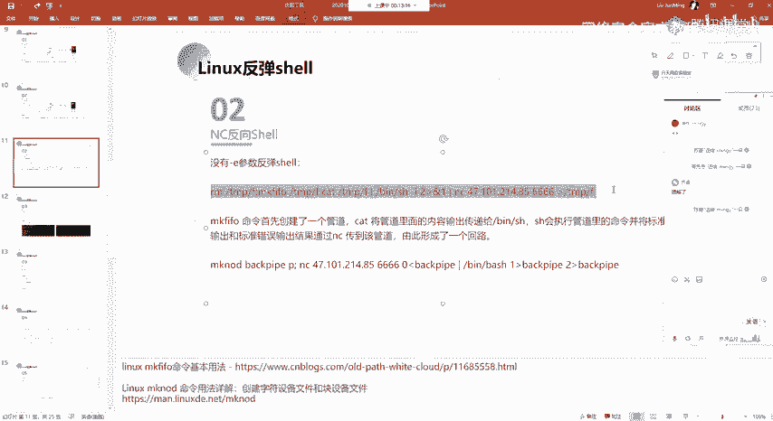

对。

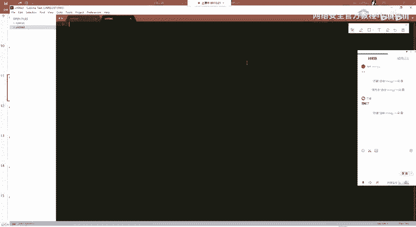

编辑器当中给大家讲吧。

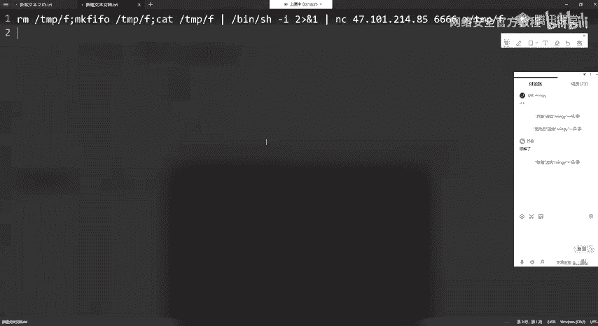

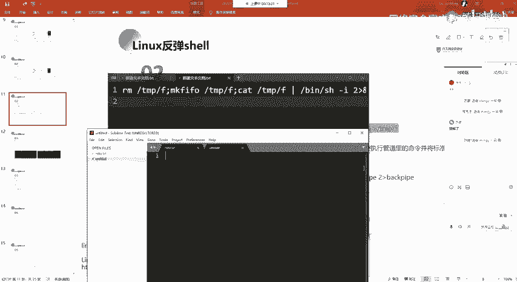

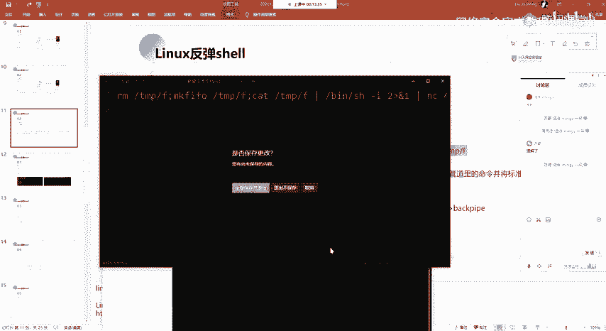

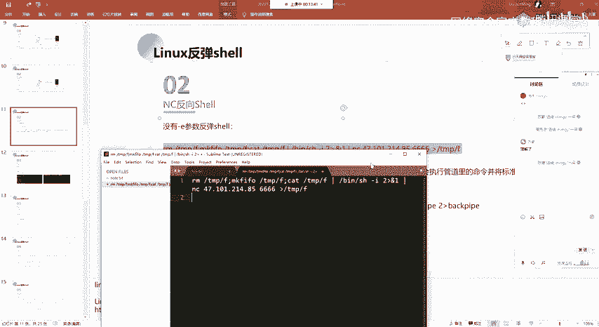

按这个。呃，呃，首先的话就是第一个命令是RM杠tempamp杠F，这个的话就是删除这一个temp目录下面的这个F的这个文件。呃，这一个的话就是呃你要就是其实就是保证这个t目录下面没有这样子的一个F文件。

因为我们待会的话需要去创建这样子的一个F文件来作为我们这边的这样子的一个呃就是。呃，在这边话是一个那个。命名管道的一个文件。然后在这边的话，我们需要去使用这1个MK。Fire4。

MKFIFO这样子的一个命令这个命令的一个意识的话，我们。

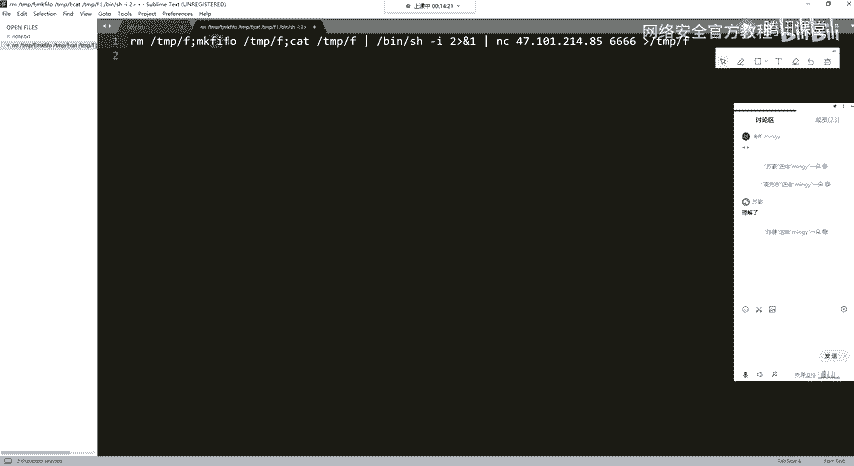

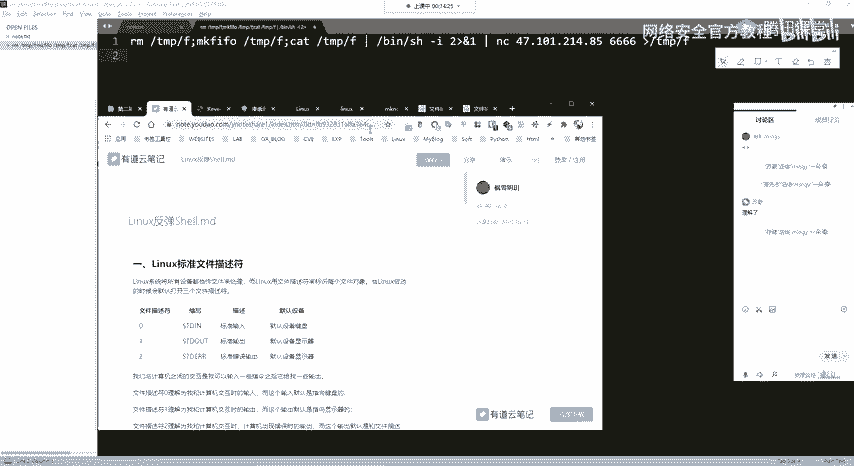

看一下。呃，这边我这边的话就运行内容的话，有给给这样子的一个链接，对吧？这个链接的话就是这个linux。MKFIFO这一个命令的一个基础用法。然后前面这边的话这边的话大家自己去看一下吧。好吧。

然后的话主要的话就是这边。就是我们通过这个MKFIFO来去创建一个这样子的一个命名管道。然后他在这边的话有解释，就是什么是命名广道。就这个命名管道的话是两个进程之间的一个通信的一个通道。

然后的话我们可以通过这一个命令来去创建这样子的一个通道。呃哦，这里的话是这个。是这一个呃竖滑线这一个竖线。是呃管道啊，应该是这边的话是管道的意思啊。然后下面的话这个的话就是一个命名管道呃。

命名管道它的一个作用的话是呃。就是说这我们这边创建的这一个命名管道的话，它其实是一个文件，就也是一个文件的一个形式存在。然后然后的话这个文件的话，我们可以就是说对它去进行一个输入。

以及能够去从这一个文件当中去进行一个读取它的一个内容。呃，具体的话我们以实际的一个例子来给大家理解。

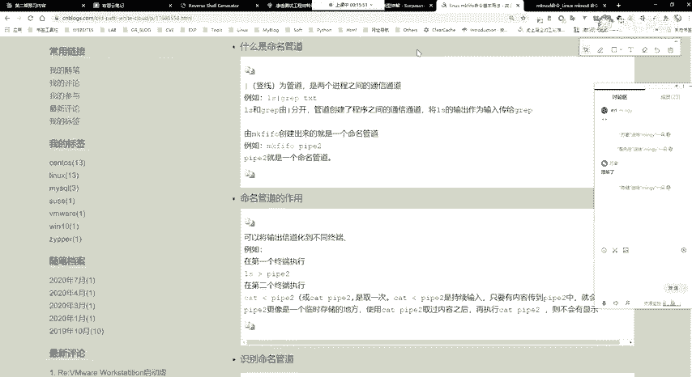

就比如说我这边的话。呃，我创建一我通过MK。FIFO这一个命令来创建一个，像比如说创建一个。啊，T的这样子的一个灭名管道是吧？然后我在这边我L。然后的话查看这一个文件，这个P这个文件。

然后你会发现的话它的这个P的这个文件的话，它这边的一个文件类型，它是一个P，对吧？然后呃在这边的话，这一个P的这个文件类型的话，就是表示的这个文件，它是一个命名管道的一个文件。

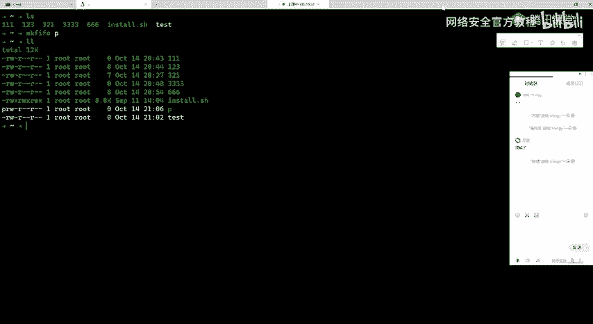

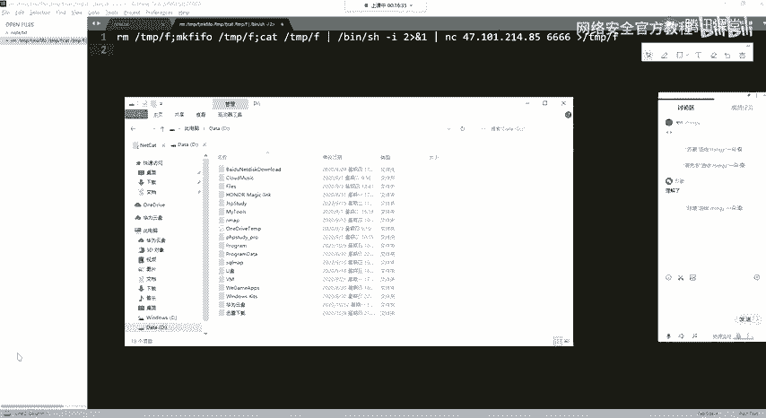

然后呃关于这一个文件类型的话，大家可以看一下这一篇文章。就这个这边的话，它列出来就是常见的这样子的linux下面常见的这种7种文件类型。然后主要的话我们在这边的话就前面其实也有介绍，对吧？

就是像这种横杠的话就表示常规的这种文件嘛，就是fi。第一的话就是目录啊吧？然后P的话就是表示我们这边的1个PIP的一个命名广道文件，也就是我们这边通过这个命令所创建的。

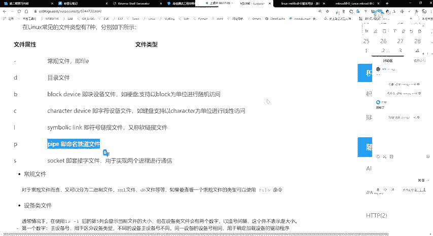

这一个。

他的这一个的话是P。那么这一个文件的话，我这边创建好了，对吧？然后的话我可以通过就是说。通过重定向向这一个文件当中去进行一个写入。就是输入我们的一个内容，对吧？比如说我这边I的话，内容的话是这一些。

对吧？那么我LOS把I输出的一个内容，把它给重定向到这个P。然后的话呃我在这边的话，我重新再开一个。是。开一个中段。Okay。然后的话在这边我们这边L的话，因为我们知道我们这边L执行之后的话。

就是把我这边的一个输出，对吧？把它重进现到这个文件当中。那么我们如何去确定我这边的一个就是输入。就是正确的输入到保存到的这个文件当中呢，我们可以通过cat在这边catP来去进行一个查看，对吧？

然后其实在这边的话，你会发现这边我们caP的这个文件内容的话，其实就是我们在这边L之后所执行的一个内容，对吧？没有错吧。

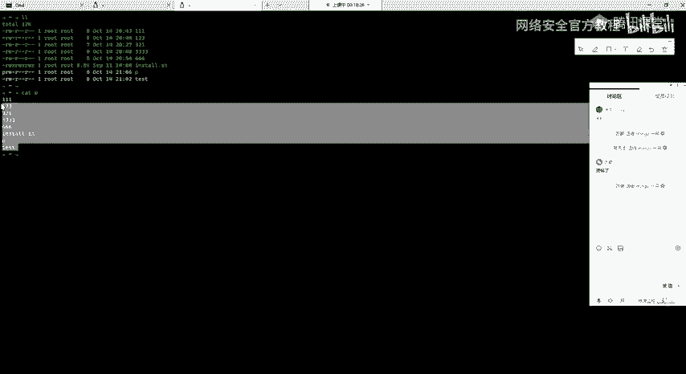

🤧嗯。

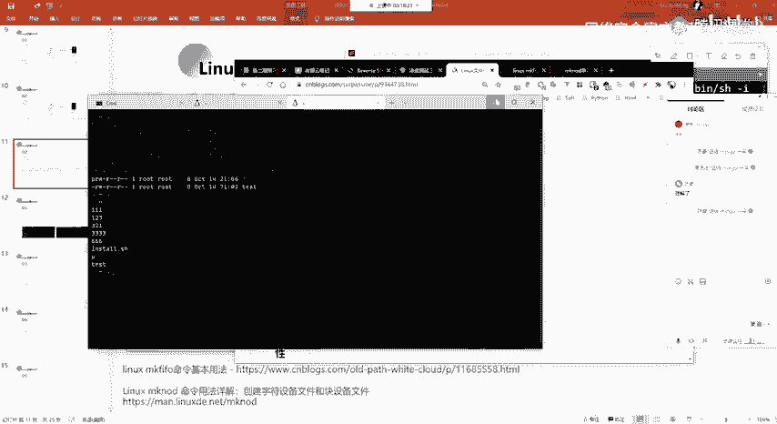

可。呃，然后的话。我们既然可以进行一个输入，那么也可以进行一个输出嘛，对吧？那么我们可以通过cat进行一个读取。然后其实呃当然的话，我这边的话是直接通过就是cat直接去读取的这个文件，对吧？

然后其实呃我们也可以就是以这样子的一个。

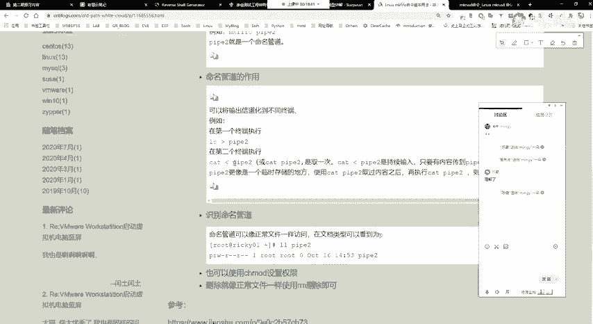

方法就是我们用我们的一个输入重定项，对吧？我们可以把这边的我这边批的这个文件里面的一个内容，把它给通过输入重定项输，就是输入给这样子的一个cat命令去进行一个输出，对吧？然后得到的是这样子的一个结果。

其实是一样的。

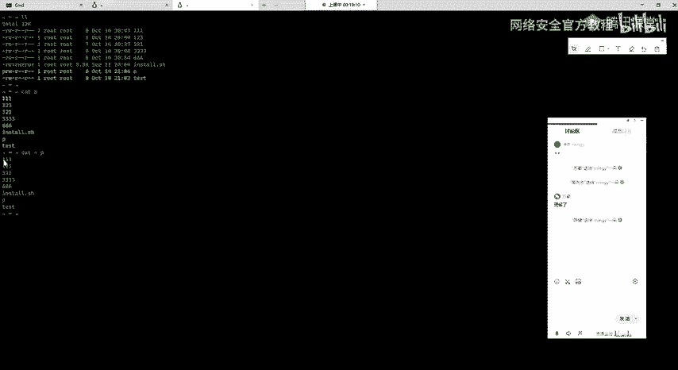

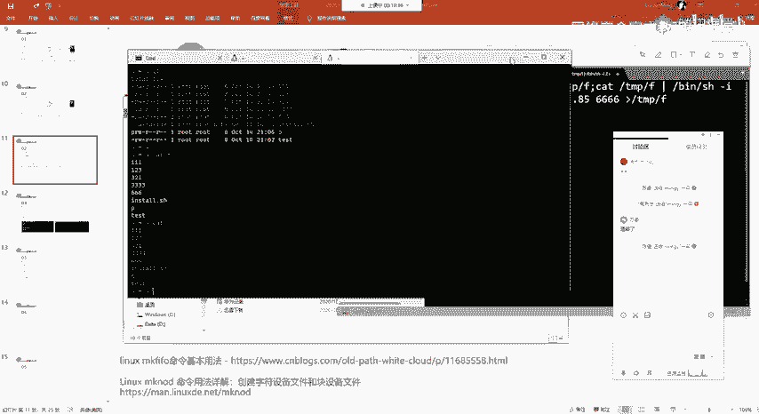

然后在这边的话要注意的一个点的话，就是说就这一个命名管道这个文件，它是一个。呃。就是像是一个临时存储的一个地方。就是说这一个文件的话，它是可以去临时的去存储我们的这样子的一个输入，对吧？

然后的话我们这边你存储进去之后的话，如果你通过cat，或者说你通过啊输出的一个重电向。

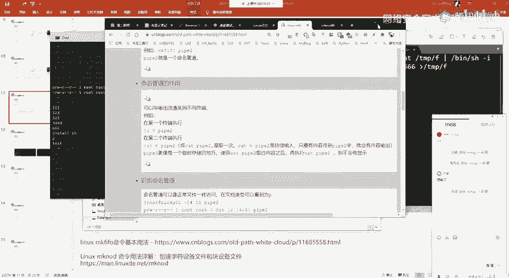

啊，把输入的一个重定项，把里面的一个内容把它给呃读取出来了。那么这一个文件当中的一个就是说我们读取了一次之后的话，我们就。呃，里面的内容话已经被读取出来了嘛，对吧？

那么我们就第二次我们再去进行一个cat的话，你会你就。里面的一个内容的话就。看不到了。对吧这里面的话内容的话已经没有了。然后然后其实我们就是这边我们再去进行一个输入一次的话。

我这边cat的话还是能够去获取到。但是我这边cat一次之后的话，第二次的话就没有了，我们还需要去再去做一个输入。

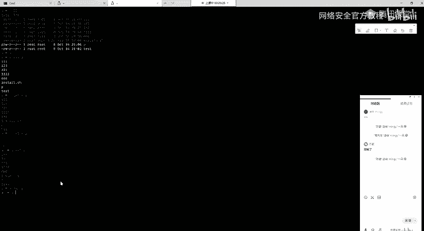

这个的话是需要去注意的一个点。呃啊，说完了这个创建这个命名管道的话，我们再来。

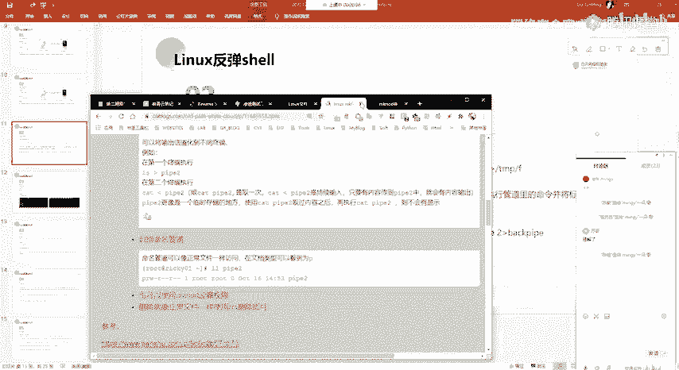

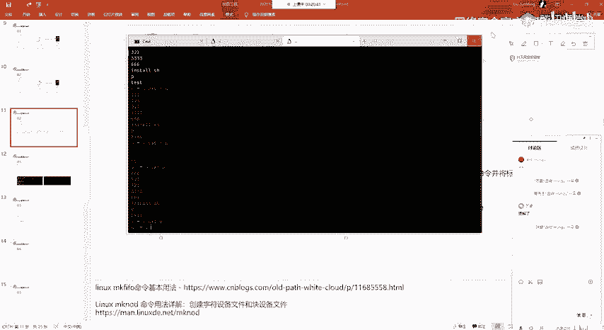

继回过头来继续看这个命令。呃，这边。

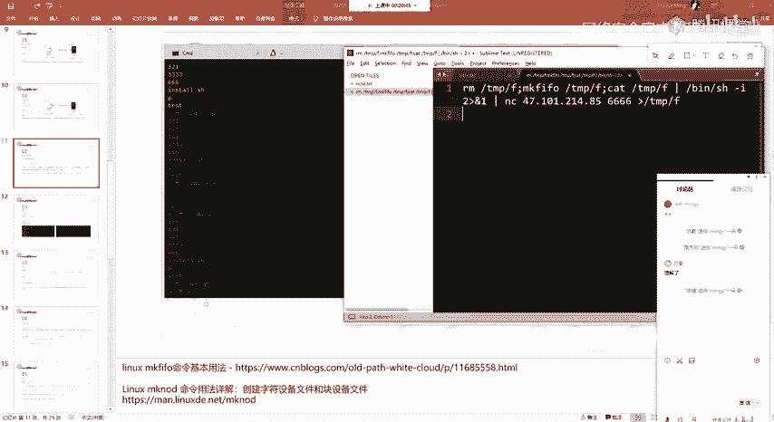

这边呃我们创建了这样子的一个命名管道，呃，文件为F在这边的话是F。然后的话我通过cat这个呃文件。就cat这个文件的话，就是呃。就是获得对吧？就是获取里面这一个命名管道文件当中所存储的一个内容嘛，对吧？

然后的话这边的一个管道符就是把这边cat之后的一个值作为一个输入，对吧？输入输入到了这边。输入到了这边的话，那么我们在这边的话。需要呃了解的就是这边这个并SSH杠I。

这个变SSH杠I的话呃。

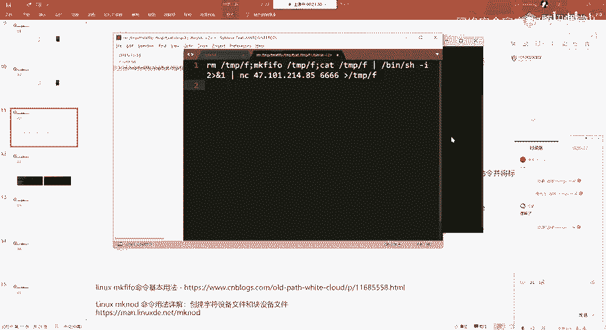

我们来看一下。嗯。就是这边这一个变SSH杠I是什么意思呢？就我这边呃我这边并，我当前的话是一个就是GSH的一个需要啊，然后我通过并。杠SH杠I的话，我能够去就是说。进入到这样子的1个SH的一个线。

然后你片时可以看到的话，它在这边的话又创建了这样子的1个SHH的一个需要，对吧？所以说在这边的话，其实就是我输入这一个命令的话，我们就能够去进入到这样子的一个。

就是说或者是得到这样子的1个SH的1个sure。

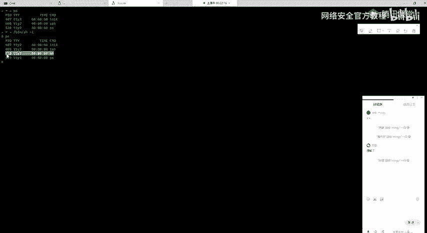

也就是SH的一个环境。

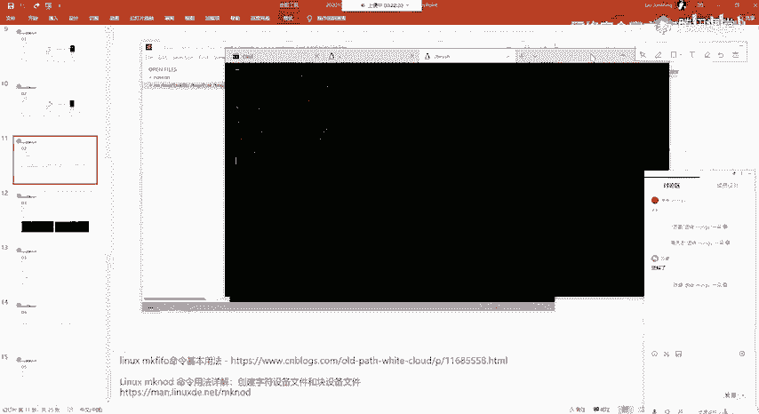

然后我这边执行之后的话，执行之后。然后在这边。这个的话应该也熟了吧，对吧？就是。呃，二大于N的一。这里的这个操作的话，我们知道二的话就是标准的一个错误输出，对吧？

也就是说它在这边它会把我们的一个标准的一个错误输出重定向到这个end一。我们知道end就是说end的话就是引用嘛，对吧？引用这一个文件描述符一所对应的这样子的一个文件。那么文件描述符一的话。

它是一个标准的一个输出。也就是呃我这边的一个错误的一个输出，它会输出到我们的一个文件描述符一。也就是其实就是我们的一个显示器。

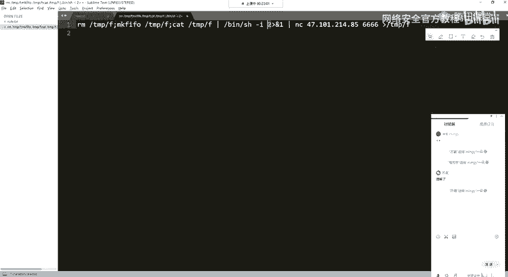

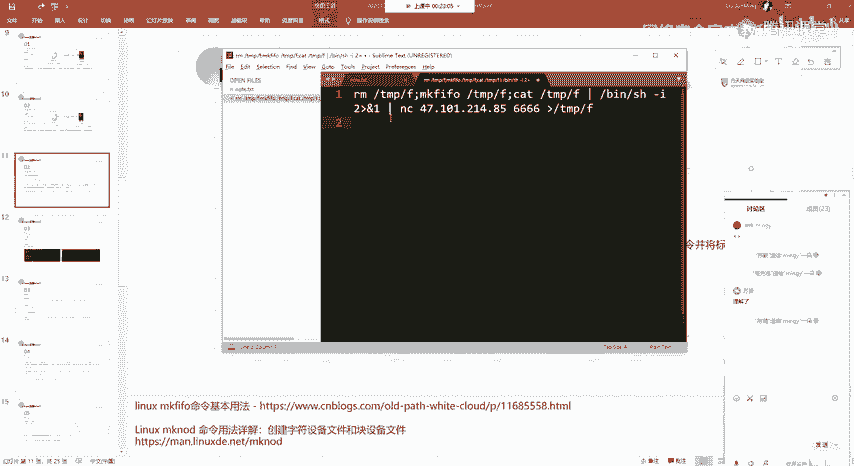

也就是我们的一个标准的一个输出嘛，对吧？然后的话在这边输出之后的话。因为我们在这边的话，它其实就是我们cat之后的话，它如果说在这边里面有内容的话，他就会在这边的1个SH环境里面去执行，对吧？

如果说执行有报错，就是说他是不认识的这样子的一个命令。那么它执行之后的话，它错误的一个输出，它也会输出到就是进行一个显示，显示在我们的一个显示器上面，对吧？来，作为一个标准的一个输出。

然后的话在这边呃输出之后的话，输出之后的这一个内容，对吧？然后的话再作为这边的一个输入，这边的话就是我们比较熟悉了，对吧？就是NC这一个命令。就利用的就是NC的一个建立的一个连接。

这边的话是NC我这边的1个IP以及端口，对吧？呃，在这边的话，就是大家如果NC用的熟的话，应该会比较好理解。

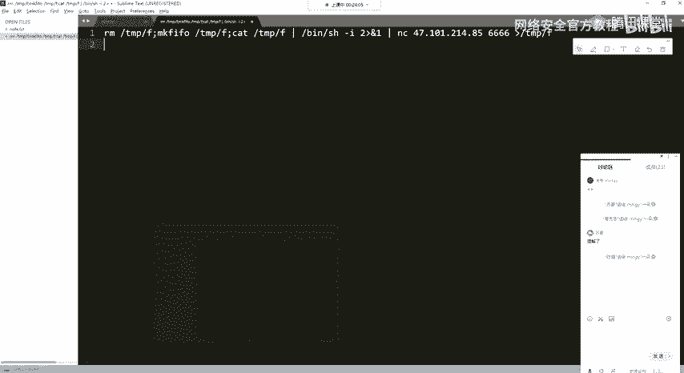

对吧其实我们的一个我们可以通过这样子对吧？我这边啊NC。我这边今天1个666的一个端口，对吧？然后我在这边的话，我另外的一个机器啊，我再通过NC去进行一个连接。

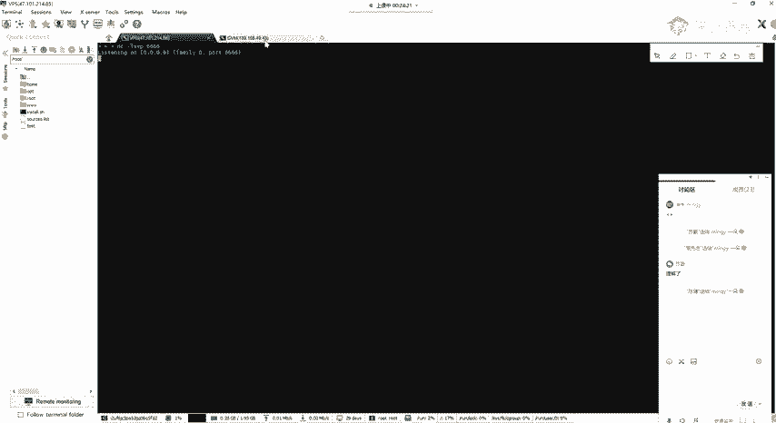

然后去连接这样子的1个666的一个端口，对？在这边的话就已经进行了一个连接，是吧？

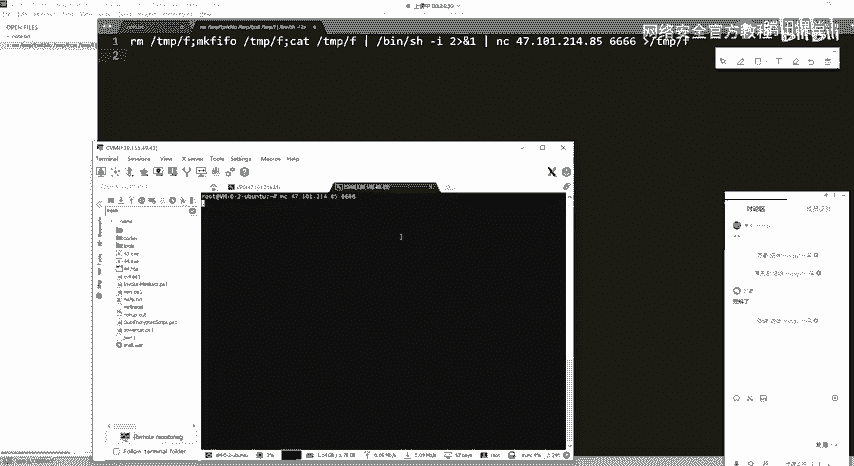

然后在这边静力的一个连接的话，其实这边NC去静力的一个连接，其实我们就可以去进行一个输入以及输出。比如说我在这边，他们建你进去之后，我在这边我去去输了1个L，对吧？输入1个L，那么我这边的1个L值的话。

它就会呃同样的它会输出在这边。我在这边去输入的一个一些值，对吧？它同样的能够在这边去进行一个显示。也就是说它在这边的话，它其实是建立了一个连接，能够去传输我们在这边输入的这样子的一个数据，对吧？

那么再回到这边的话，再去再去看，对吧？

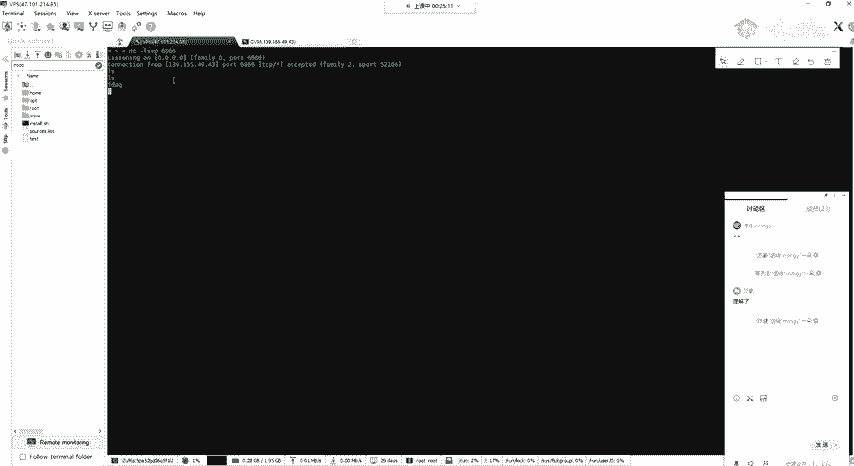

我在这边我执行之后的这样子的一个结果。然后的话我通过作为这边的一个输入，其实就是说我这边去连接我这边NC连接到了这边，对吧？也就是说我在这边连接之后的话，我在这边。就是可以去进行一个输入。

输入的一个内容的话，就是前面这边所执行的一个结果。然后的话输入到这边的话，其实就会显示到这边了。对。然后在最后这边的话，同样的有了这样子的一个重定项。就是啊一个输出重电下，就是这边的一个结果。

就进力连接之后的话，它这个结果重电向到这一个tamp杠F的这个文件当中。

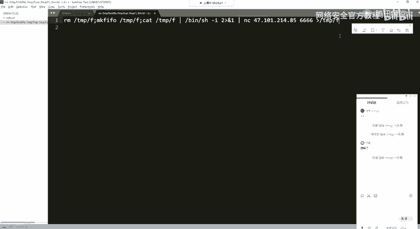

然后其实在这里的话，你会发现他在这边的话有了一个回煌了。

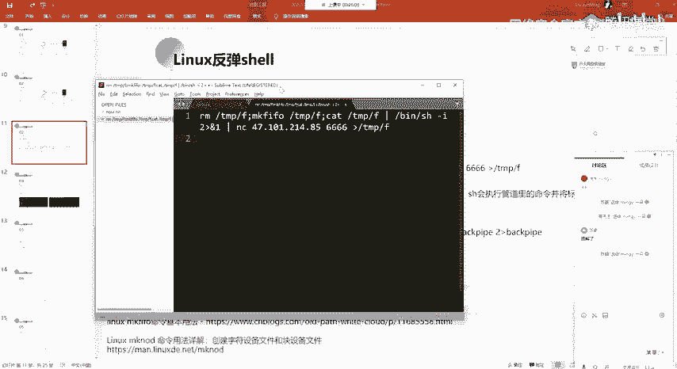

就是说我这边的一个t杠F这个文件的话里面。呃。里面的话就是说存储的就是我们从呃。怎么说呢？就存储的其实就是我们在这边我们在这边所输入的这样子的一个数据，以及我在这边输入，对吧？

在这边输出的这样子的一个数据，以及我在这边输入的话，它会在这边有输出。然后其实我们这边的这一个连接NC的连接的这样子的一个内容的话，它都会存储在这一个文件当中。那么就是说。在这里。呃。做啦呢嘅啦。😔。

对。我在这边的话呃，我先就以这样子的一个条面料演示给大家看一下，好吧。然后我这边这一个机器这边的话，我监贴了这1个666的一个端口。然后我在这边我去执行。执行之后的话，在这边它有进行了一个连接。

然后得到了这样子的一个需，对吧？然后其实在这边的话有这样子的一个temp杠F的一个文件，对吧？就这个文件的话，就是我们刚刚所说的那个命名管道的一个文件。

我们在这个tempamp幕下面有这样子的一个F文件，对吧？它是一个命名管道的一个文件。然后其实在这边我们可以就是catF。KtF的话，我们可以去查看里面的一个内容。然后我在这边我去进行一个输入L。

我输入的L的这一个值的话，它其实会会就是说我在这边，首先的话是今年的一个连接，对吧？今年的连接其实在这边对吧？然后的话从这一个连接当中获取到的一个值，它会输入到这一个tamp干F这个文件当中。

就是就是在这边。

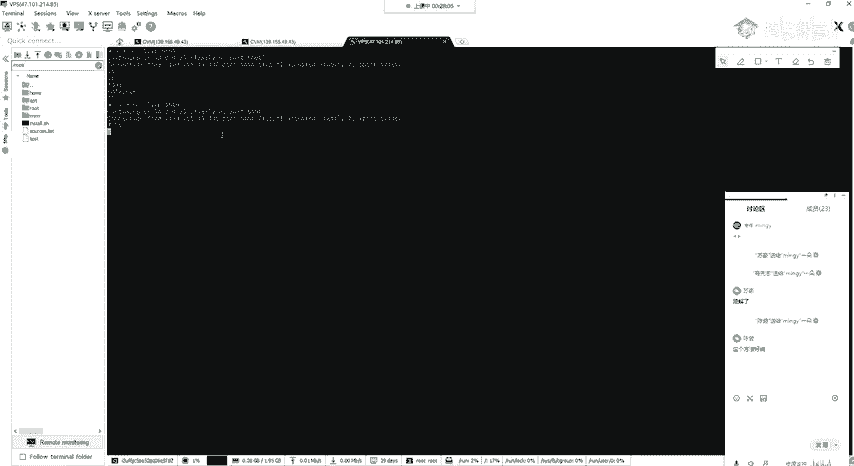

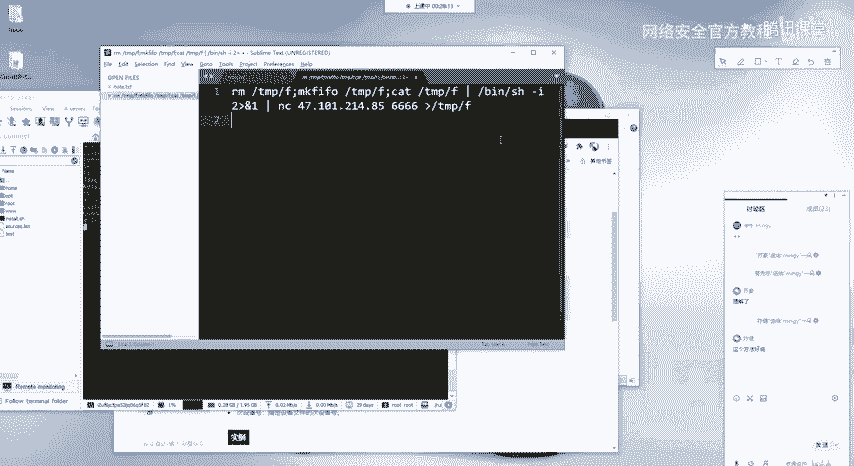

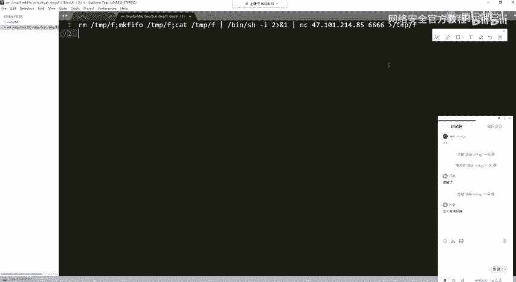

对吧你会发现我这边我cat这个值的话，这边的这个文件里面的话就存储的。其实是我在这边输入的这个L的一个值。

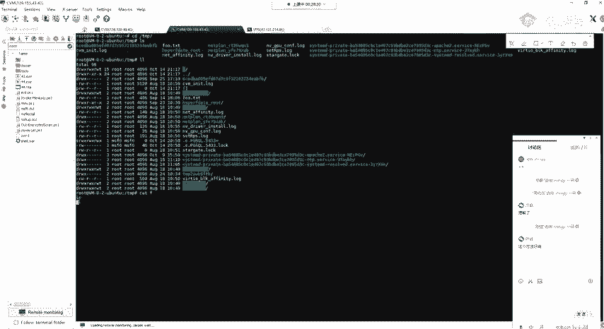

然后然后的话这1个L的一个值的话，它其实我们。

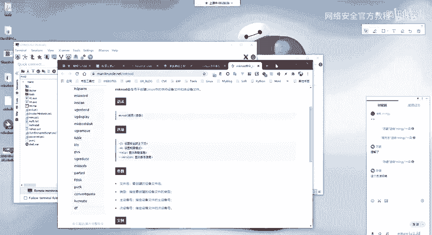

再从这边。喂。对吧然后的话其实在这边的话呃，就首先的话它是会IM这一个嘛，然后呃其实。怎么说呢？它在这边它存到了这个文件当中，它其实会到这边来。就是说我们这边的一个值它会传递过去，传递到我的。

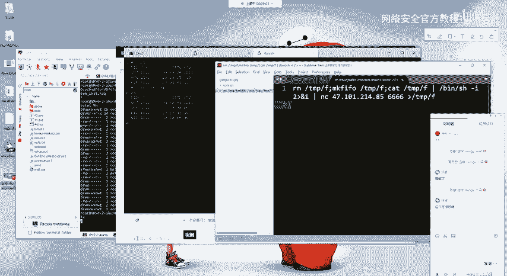

我的这一个机器这边来哎，对吧？但是的话因为我这边的话，我cat了这一个文件，所以其实我这边传递了一个值。因为我们知道刚刚也有介绍，就是那一个命名广道。我这边如果cat了之后的话，它里面就已经没有内容了。

对吧？这个文件当中没有内容，没有内容的话，那么我们在这边的话，它其实它会有这样子的一个操作嘛，对吧？就它会去读取这一个文件里面的一个内一个内容，但是这边它没有内容的话，所以在这边它其实是没有显示的。

就没有获取到从这边的一个内容，也就是它在这边去执行的一个内容。

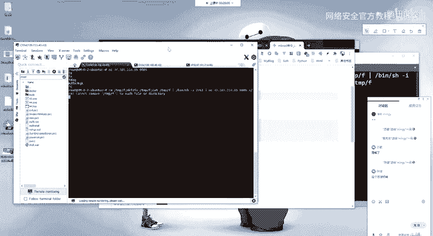

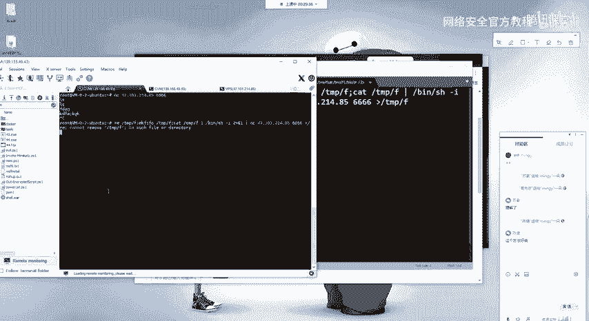

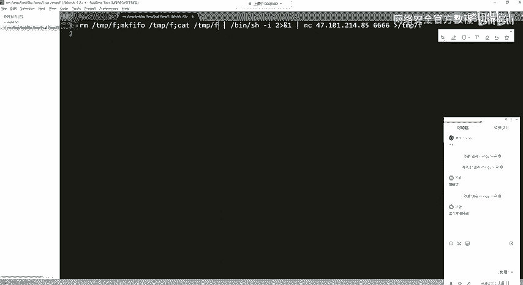

呃。可能这样讲，大家不是很好理解。

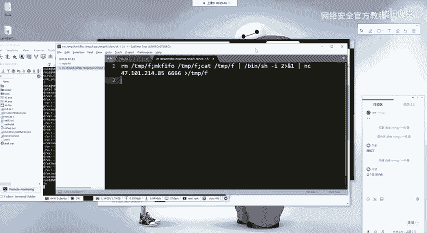

就其实这边的1个L啊，我直接就通过命令的那个吧，就这边I在这里对吧？然后的话它cat这个东西的话，其实就是cat的L的一个命令嘛，对吧？然后的话LOS命令的话，把它在这个这个环境当中去执行。

那么其实就是相当于就是在呃这边的这一个机器上面，对吧？这边的这个机器上面执行了1个L。

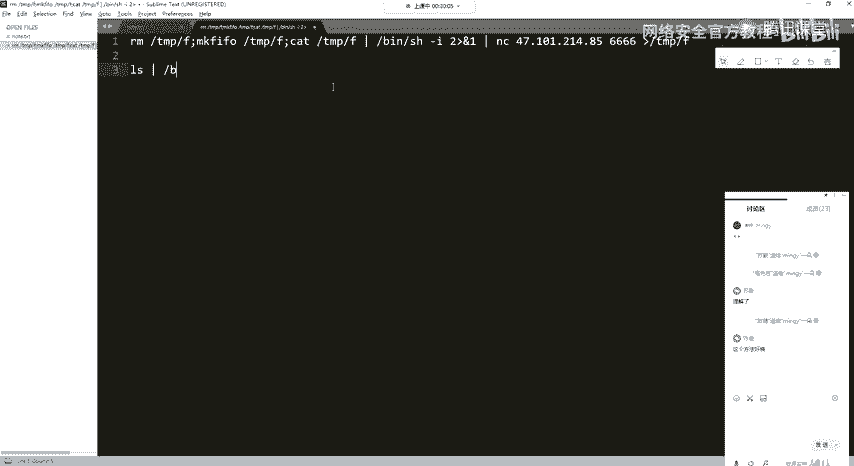

执行了1个LL的一个命令，对吧？然后这边的一个命令的一个输出的话，它就会输出到了这边。然后的话再通过这一个连接来返，就是返回到我的这边的这一个机器，也就是我在这边L之后的话，输出的一个结果。

在这边执行之后的话，又返回到了我这边。

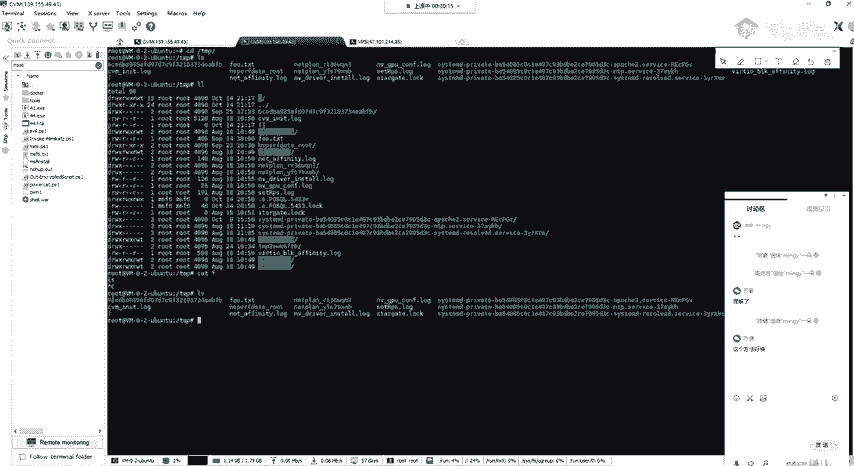

对吧就实现了一个。呃，实现了这样子的一个命令控制。好，我执行，我们来看一下具体的一个效果，对吧？我L之后的话，执行执行的一个结果就是这边。然后其实在这边的话，其实相当于就是在这边执行的。这1个I。

的一个内容。啊，这样然完十来个那种。对吧。没错了。

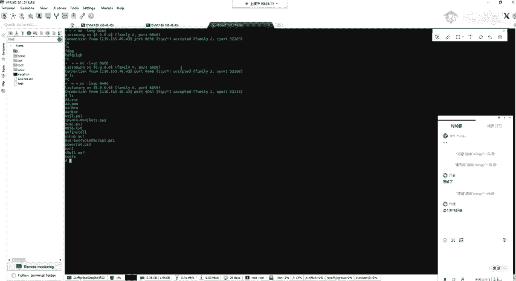

嗯。呃，这里的话大家能理解吗？

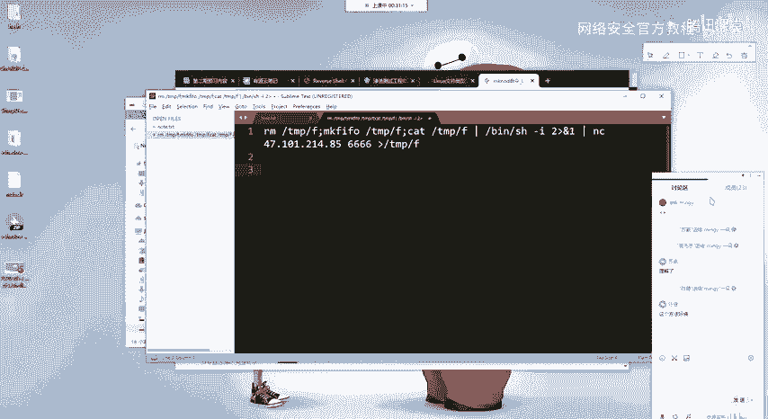

这个方法好绕呃，绕的话其实是因为你可能还没有。呃，理解吧，就是他在这边的话，其实就是利用到了这样子的1个NC这一个吧建立的一个通道。然后的话在中间的话，在这边需要通过这样子的一个输入输出，对吧？

因为我们需要我们要与这样子的一个需要去进行一个交互的话，我们需要把我们输入的这样子的一个命令，把它通过这一个通道传到我们的一个目标机器上面，对吧？来去执行。执行之后，它的一个结果。

我们还需要再通过这一个建立的一个连接。

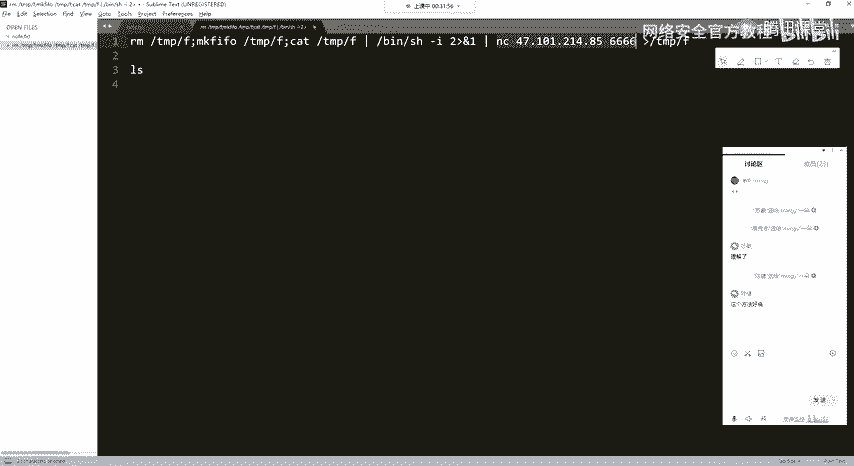

来显示。所以的话它需要有一个这样子的一个过程，你才能够去进行这样子的一个命令的一个控制，来去达到这样子的一个反特西尔的一个效果。

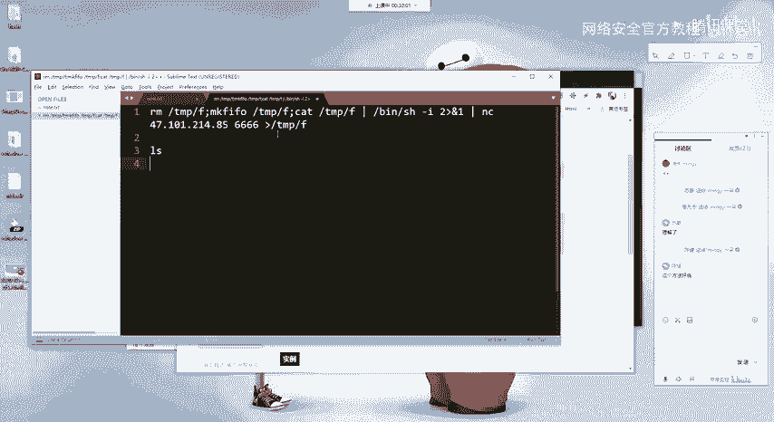

嗯。😊，其实呃。大家自己去好好的理解一下吧，好吧。然后其他的其实其他的方法原理都是类似的。Okay。呃，以及下面的这一个下面的这一个也是就是也是类似的。但是的话他在这边用的是这个make node。

就是创建的是一个设备快的一个文件，就创建了一个快设备文件。其实这个文件的话，它同样的就是跟我们前面这个命名管道。我们可以就是说对这个快设备文件去进行一个输入输出的这样子的一个呃操作。

就是像这个文件去写入。然后的话从这个文件当中去读取内容。呃，这边的话我就不多说了，然后那个。大家可以去看一下这里的一个预习内容。就是。我们的一个应用程序可以打开关闭，还有读写这样子的一个设备文件。

就是我们用这个make node所创建的这个文件。嗯。呃，然后的话就是be啊，其实呃你理解了前面的这边的话，那么就是在beash下面的这样子的一个访谈希尔的话，其实呃。就更加好理解了。

就呃首先的话我们先就是来看一下，就是说这边现有的这样子的一个ba下面仿纳希尔的这样子的一些命令。比如说这边的第一个这个的话是大家经常用到的这样子的一个命令。就经常会去使用到这样子的一个lash杠I。

然后的话呃通过这样子的一个方法去连接这边的1个IP以及端口，对吧？然后的话我们只需要在我们的一个控制端上面去今听这一个端口，就能够去反他一个需。然后具体的一个效果的话，我们来看一下。

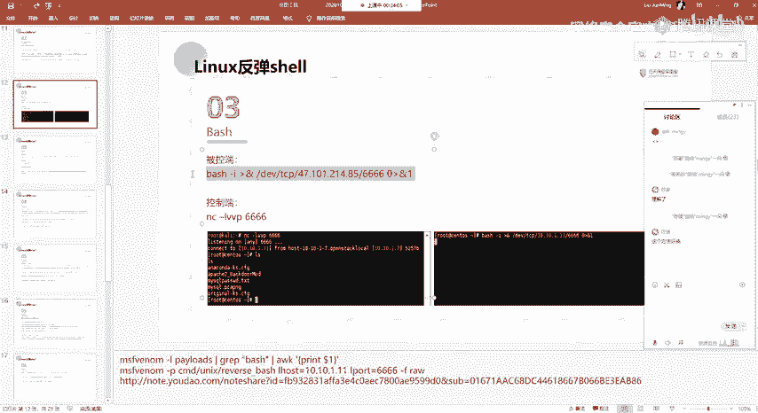

嗯。可以看到我在这边执行之后，对吧？执行之后的话，在这边我就得到了这样子的一个拜喜的一个选。可以看到对吧？在这边的话就得到的是这个。然后我在这边的话就能够去执行相应的一个命令。对吧。

就相当于是在他的一个机器上面去进行的一个执行。

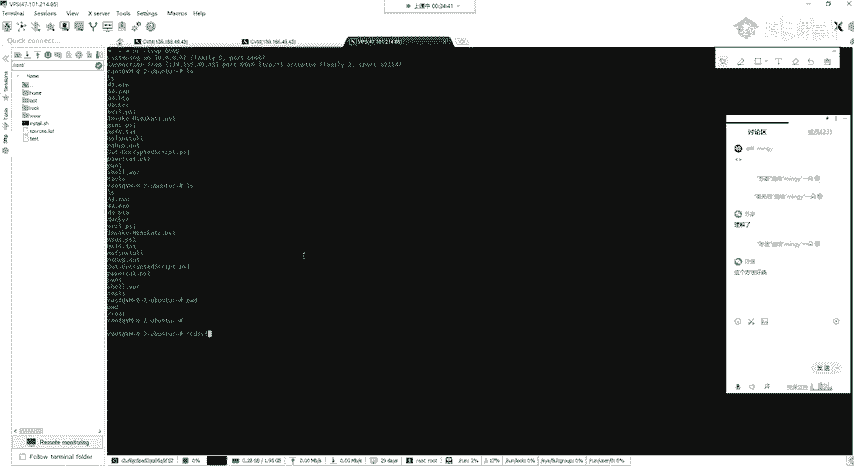

对吧没有没有。

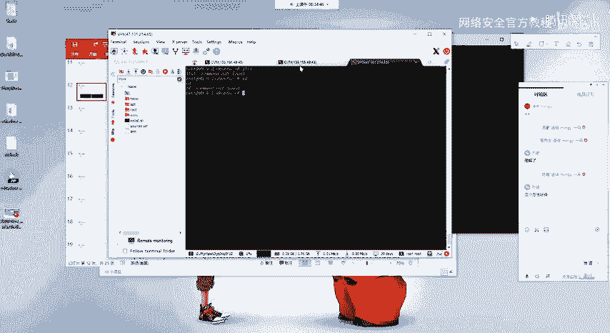

任何的一个区别。这是呃一个。然后的话呃第二个的话就是这样子的一个方式啊，这这边的这个方式的话，其实就是相当于就是呃。一个就是一个病种啊，就是一个变化。然后在这边的一个变化的话。

其实就是要结合我们前面的前面给大家讲的就重点讲的那那些内容，就是涉及到文件描述符的一个创建，以及我们的这样子的一个输入输出的一个重定向符务。

以及我们对这样子的一个文件描述符务的这样子的一个呃输出的一个重定向输入的一个重定向。要涉及到的。要就是结合了前面的所有的一个内容。

呃，在这边的话，我大概的又给大家就是。讲一下这一个吧。

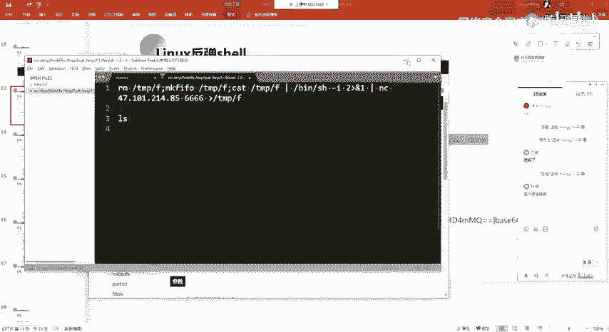

呃，其实前面的这一部分的话，我们呃刚刚的话已经有讲了，有介绍了，对吧？就是创建了这样子的一个文件描述服务，对吧？然后这里的这个的话，其实就是能够去对这边的这一个呃连接做一个输入以及输出。

也就是能够像这一个呃通道。去写入文件，以及能够从这个通道当中去读取所传递过来的一个数据。然后的话在这边的话是cat cat的话，其实就是呃一个输出的一个重电项。啊吧一个输入的一个重定项，对吧？

就是从我们的这个文件描述服务当中去呃获取呃获取内容。其实就是说从这一个通道当中去获取所传递过来的一个数据。然后cat的话就是显示出来嘛。然后这边显示出来之后的话，这边有一个Y耳的一个循环。

这边的wi循环的话呃，我们会可以看到有这样子一个read line。就这边的一个read line的话，其实我们前面有也有介绍，对吧？有介绍了这个read line它的一个意思。就如果就说我们在。

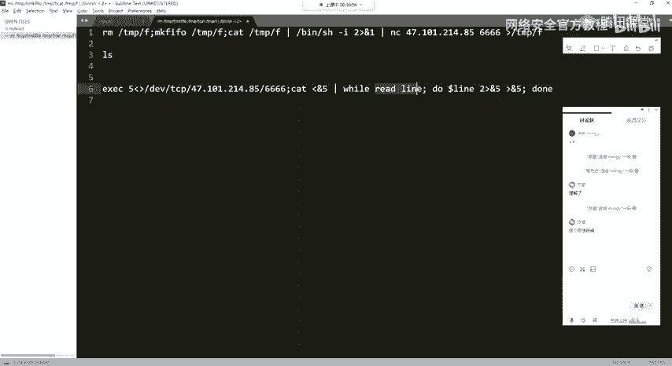

我们的一个命令行当中去执行这个read line，对吧？然后的话我们就它会创建一个这样子的一个变量，这个line的一个变量。

然后这一个变量的话，他会去就是说。他会从我们的一个标准的一个输输入。就是把标把来自标准的标准输入的一个数据，把它给写入到这个变量当中，对吧？然后的话写入写入了写入到这个变量当中的话，在这边有一个D。

就是Y循环嘛。呃，这边的话是一个需要脚本的一个写法，就是。单读取到了他你他的一个数据，对吧？它就会。做这样子的一个事，做的这个事的话，就是把这边的一个变量里面的一个值做一个执行。就是它会它会呃执行嘛。

就比如说我这边是输入的是一个变量啊，不不是一个变量，是一个命令。比如说就1个L的一个命令，对吧？然后的话它对这1个L的命令，它就会去执行这1个L的一个命令。它执行之后的话，在这边的话。

其实就是呃一个呃标准的一个错误的一个标准错误输出的一个重定向，重定向的话这一个文件描述服务。然后其实这个文件描述服5的话，其实就是这边的这个通道，对吧。那么他这边的一个操作话。

其实就是把这边LOS执行的一个结果。把它给输出到了把它给输出到了这样子的一个通道。呃，这边的话其实是省略了一个一啊，就是标准的一个输出啊，还有错误的一个输出。然后动的话就是呃这一个循环结束嘛，对吧？

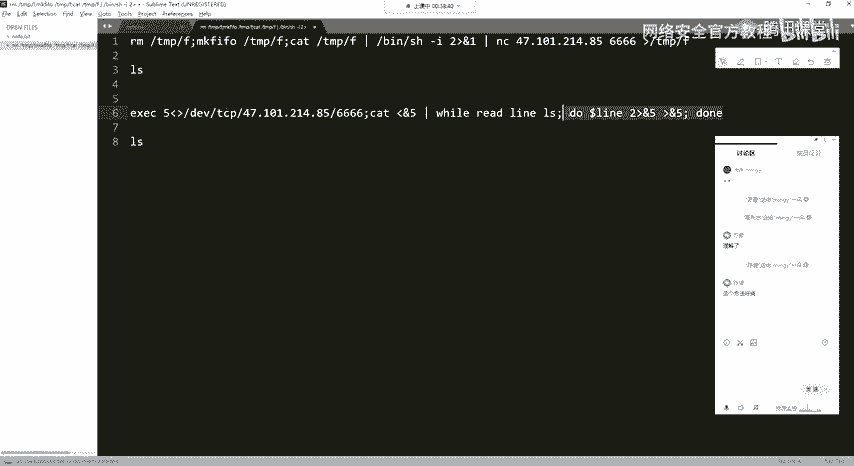

而且的实呃实际的一个效果，我们来看一下吧。

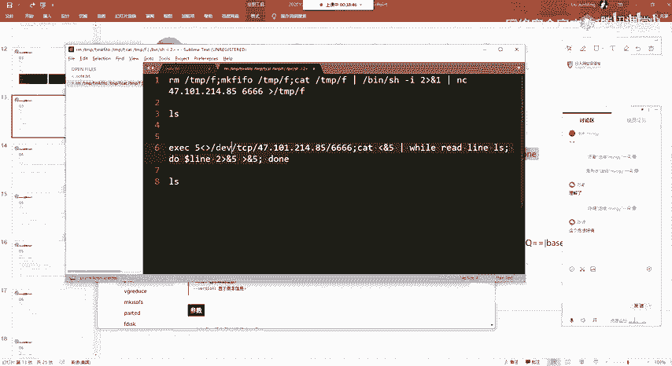

同样的这边我的一个控制端，我只需要去今天这一个端口。然后的话我在这边被控端去执行这样子的一个命令。执行之后的话，在这边就得到了这样子的一个需要。然后我在这边可以去执行命令，对吧？

然后其实在这边执行的一个命令的话，就是我这边L执行的1个LOS的一个输入啊，它其实是会通过这边的这个DVTCP经行的这个连接。

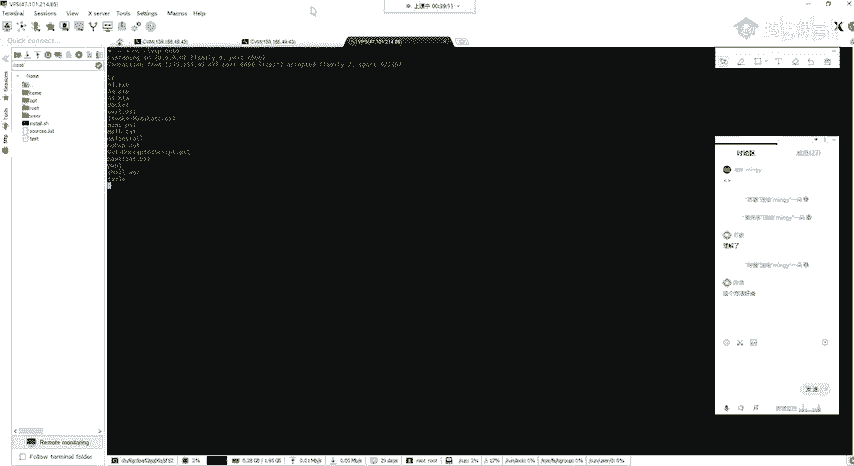

来就是把它放到了这个文件描述服务。当中，然后的话cat的话就是输出的一个结果，其实就是我L的一个min嘛。对吧然后的话把它的一个输出的一个结果，再通过这一个通道传递到了我这边的这一个终端。

其实就是输出的就是这一部分对吧？这个的话其实就是一个我输入一个命令。然后的话它再给我返回一个结果，就是一个交互式的一个需要，对吧？

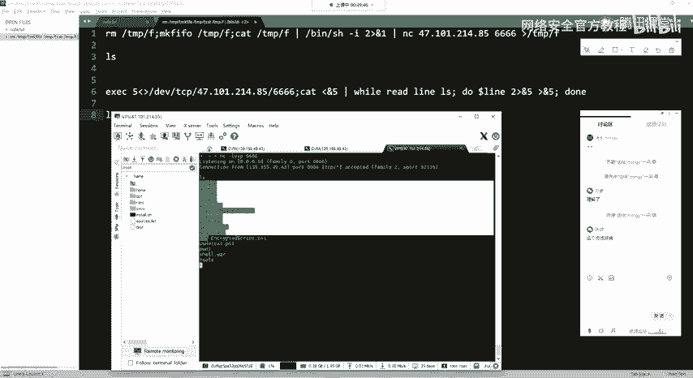

就这样子的话就实现了一个交互式的一个需要。

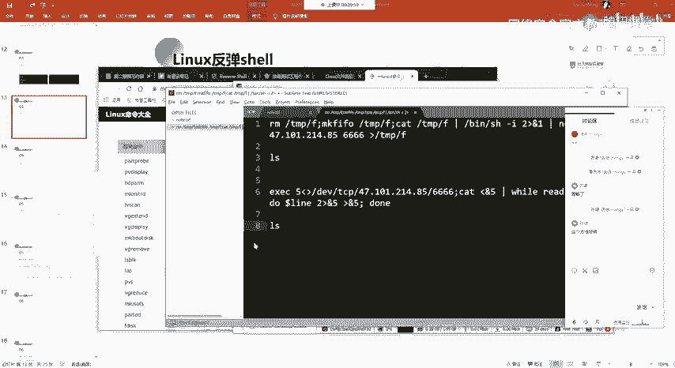

好呃。还有呃下面的这个的话就是一个base64的一个编码的一个就是一个技巧吧。就我们可以在link里面，我们可以通过base64杠D来去做一个就是解码。

就是把这边的一个bs64的一个编码的一个值做一个解码。解码之后的话，我再把它输输啊，就是传递给这个ba喜杠I，也就是进入到这一个b喜环境当中去执行这边的一个呃base64编码的一个呃内容。

这边的话其实就是一个。这样子的一个反谈需尔的一个内容。嗯。呃。然后的话还有一个就是。这一个半学。这边的话刚刚的话讲了这一个对吧？然后还有一个就是这一个这一个命令，这一个命令的话没有还没给大家讲对吧？

然后关于这一个就是命令它是怎么来的，我们。同样的就是看一下我这篇笔记吧。就其实就是这边的第三部分，就你理解了这边的第三部分的话，你就能够去理解这边的一个拜喜它反的 share尔的一个呃原理。

以及它的一个本质。就我们通过这样子的呃一个命令来去建立了这样子的一个可交互式的一个sh尔。嗯。然呃。这边的话。首先第一部分话就是呃什么是反弹系啊，这个的话其实已经有说过了，对吧？

讲过了我这边的话就不多说了。我这边的话就是呃挑重点给大家介绍一下。首先这个伴喜杠A的话就是打开一个交互式的一个balash sheet呃。

当然的话在这边话其实是就是呃没有写那个就是这个be的一个绝对路径嘛。就其实一般的像这种需要环境的话，会在这个beb下面啊，我们beb杠I。如果说你没有那个pa的话，没有那个pa的一个黄金变量的话。

我们最好的话是加这样子的一个绝对的一个路径。如果说有的话，就你pass环境变量里面有的话，那么我们可以直接baash刚来就能够去进入到这样子的一个呃交互式的这个baash线。

然后的话就是这个DV的这个目录下面的就是特殊的一个文件，特殊的一个设备，就这个DVTCP。这个的话它是linux系统当中的一个特殊设备。呃，其实也是一个文件嘛，对吧？因为呃。就是。ux系统的话。

它会将这种设备它都是当做文件来处理啊。这个的话大家一定要就是要有这样子的一个呃呃印象。然后的话其实这个的话就是一个文件。然后这一个文件的话，我们可以对对它去进行一个呃打开。那么打开这个文件的话。

它就会相当于是发起了这样子的一个s的的一个调用。然后的话它会去建立一个s连接。然，我们也可以对这个文件去进行一个读写。就是能够去从这个文件当中去读取内容以及写入内容。然后读写这一个文件的一个操作的话。

就相当于是在这个s连件当中去进行一个数据的一个传递。然后我们使用这1个DVTCP的一个方法呢，就是像这样子就DVTCP，然后后面GIP接我们的一个端口。然后的话在这边我们打开这个文件的话。

那么它就会向这边的这一个IP以及端口去建立这样子的一个s连接。然后的话呃我们。接下来再看一下，就是说我这边的话把这边的一个实现这一个。伴许的这一个命令。把它分成了下面的这几个步骤，分成了下面的这几步。

就是1234步。四部。然后呃首先第一步的话就是把被控端的这样子的一个交互式的一个需要输出从电向到控制端。就是就是像这样子呃，其实我这边的话就是把这边的。把我们前面讲的这一个把它做了一个拆分了。

就是在讲这个之之前的话嗯。

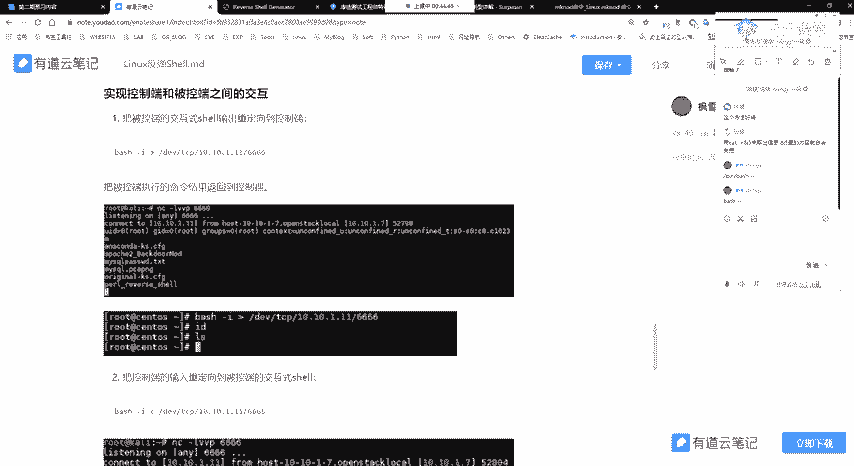

大家就是。捋一下思路对吧？要捋清一下思路。

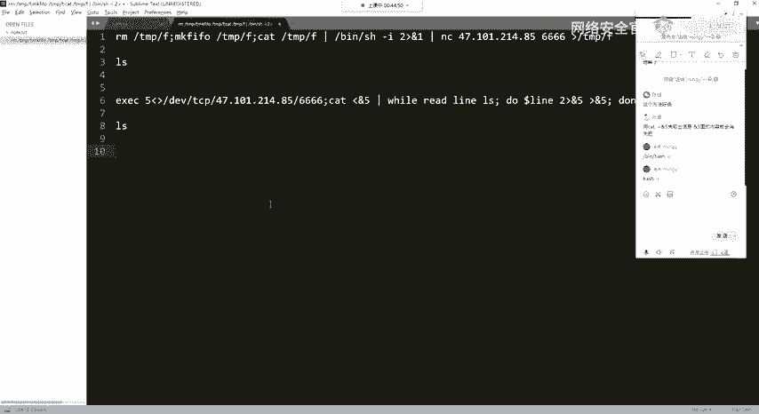

就是说我们想要去实现控制端与被控被控制端之间的一个交互的话，对吧？我们就是实际的，我们不管它中间的一个东西，我们先不管，我们去要得到这样子一个需要的话，我们要实现的一个功能，对吧？就我得到这个需要。

我执行命令，我执行命令之后的话，它的执行命令之后的一个结果，它是需要返回给我们的对吧？这样子的话，我们才有个说才是一个完整的一个交互。我执行我这边输入命令，你返回结果给我们，对吧？

那么这边的这一个命令的话，我们怎么去输入到就是怎么传递到我们的一个控制啊，被控端呢，对吧？以及我们的一个被控端。

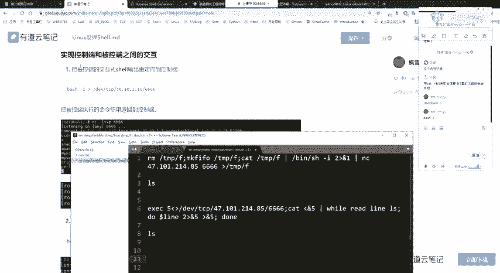

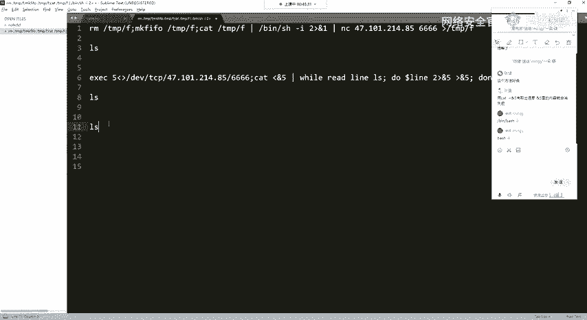

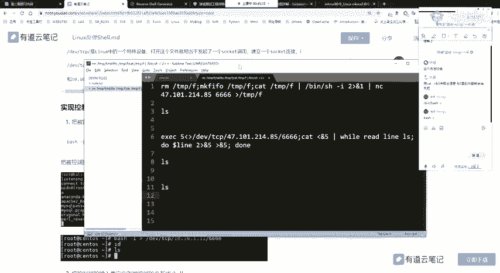

在被控端上面去执行的这样子的一个命令，它返回的一个结果，怎么返回给我们的一个控制端。

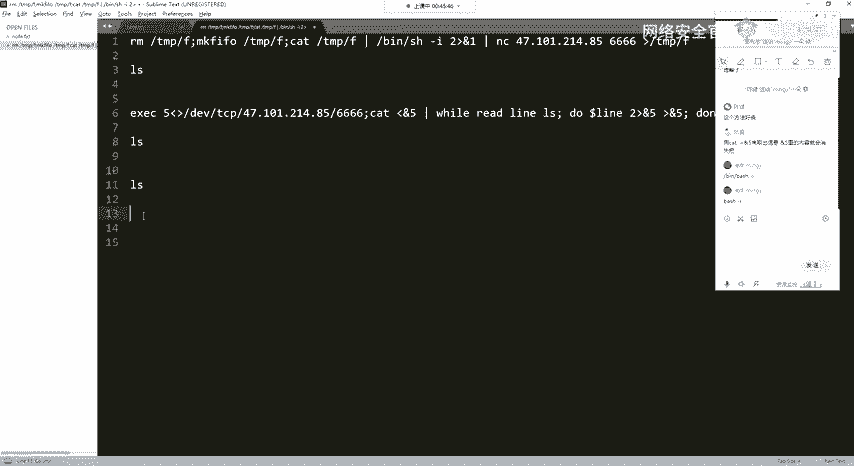

啊，就是中间的这一个实现的话，就是我们需要去考虑的。其实也是就是说一个交互式需ll所要去具备的这样子的一个。

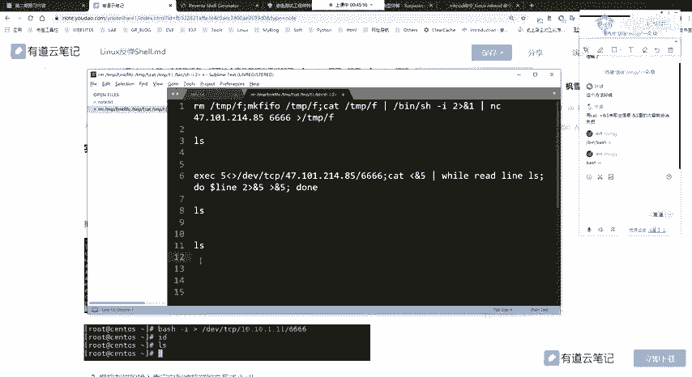

呃，功能对吧？🤧嗯。然后的话我们首先的话就是需要去实现第一步，就是把我们的一个被控端的一个交互式shall，它的一个输出从电向到控制端。这这里的第一部分这一部分是什么意思呢？就是说我们在被控端上面的。

执行的这样子的一个命令，对吧？执行的命令它的一个结果。他需要输出到我们的一个控制了。然后所实现的一个方法呢，就是通过这样子的一个be杠I。然后的话从电向到这一个。然后其实这边的一个重定向的话。

其实就是打开打开了这样子的一个文件，对吧？就我这边伴喜杠I之后的话，呃，伴喜杠I的话，它会打开这样子一个需要环境，对吧？然后的话在这个需要环境所执行的一个命令的话，它命令的一个结果。

它就会输出到这样子的一个呃这样子的一个。呃，通道对吧？

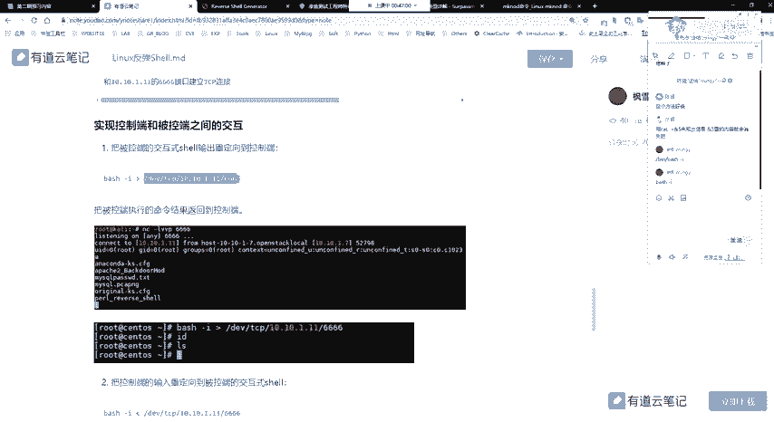

这样子的一个ser的一个零件。

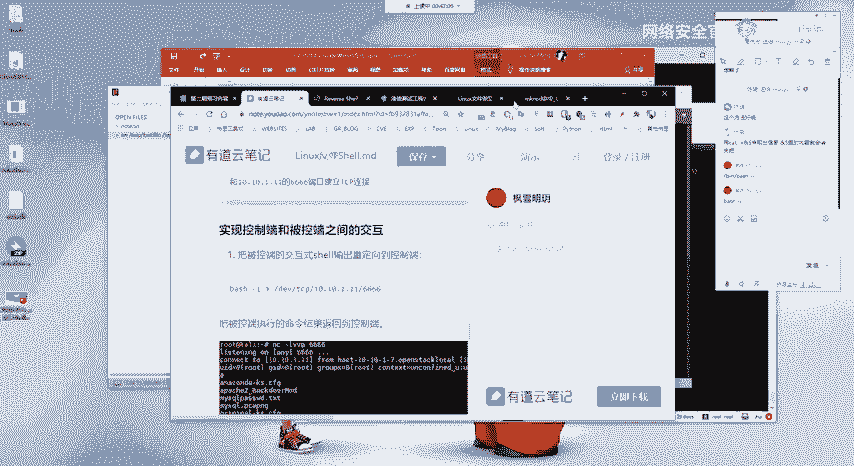

这边通过实际的一个。操作。来大家。带大家理解一下。首先我这边的话先执行这个就是半喜杠癌。然后的话我这边先建添一个端口。不是执行之后的话。在这边的话就尽力了啊，不算。这边IP写错了。这边执行之后的话。

他在这边的话就尽立了这样的一个连接，对吧？就连接到了我这边。然后的话连接到了这边的话，我们在这边。

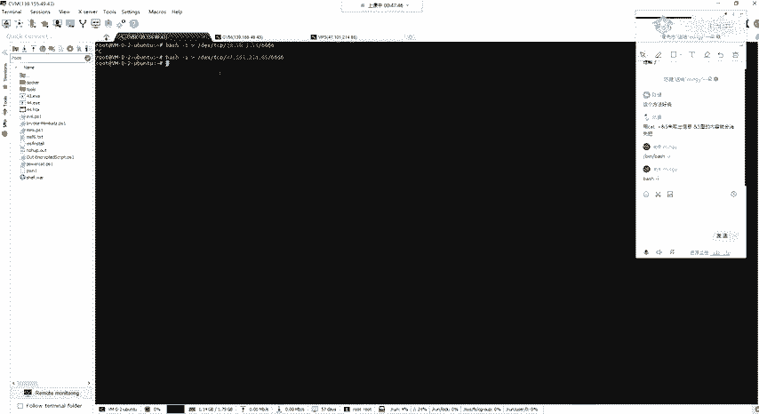

因为是我们是要把我们的一个输出，就是说在这边的这边是我们的一个控制端啊，我们的一个控制端，也就是我们攻击者一个服务器嘛。这边的话是我们的一个被控端，也就是我们的一个目标机器。

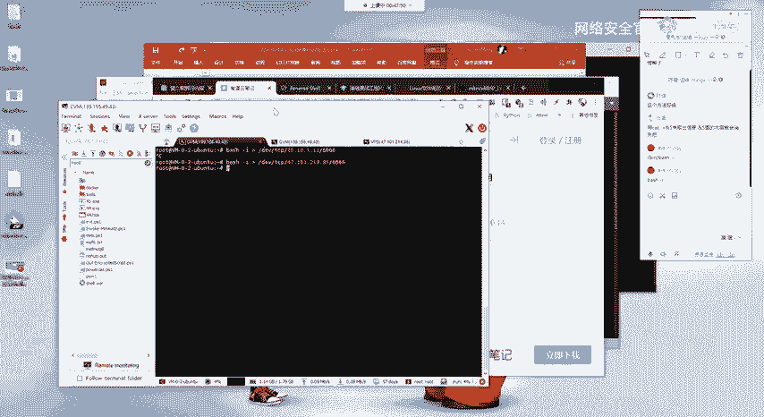

我在目标机上面执行这一个命令。然后的话我在这个机上面执行。比如说我执行这个L的一个命令。那么它其实就是说我这边ba刚的话进入了这一个ba血，其实就是这一个ba血。我当前所在的这一个ba。

然后我这边在这一个belash下面所执行的一个命令的话，它会输出，对吧？然后它的这一个输出的话，它就输出到了这边的这一个呃s的一个连接通道，对吧？然后其实这个的话其实就是我们的。

跟我们在。这边对吧。呃，I然后的话输出到一个文件当中。是一样的对。

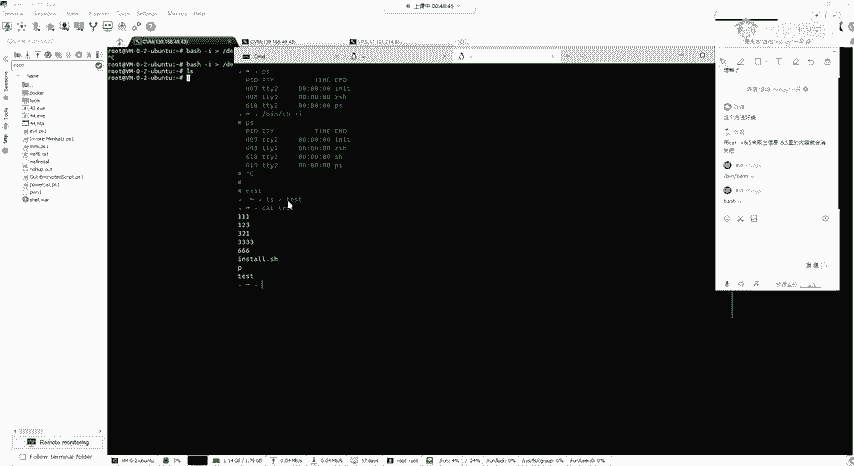

呃，只示的话，这一个文件的话，它是这样子的一个s的一个通道。我们向它这个通道当中去写去输入内容的话，那么它就会在这边显示出来。就传递给了我们这边的这个控制端。对吧以及我在这边我再去执行这一个。

就是说PWD对吧？外卖。在这边我们都能够去接受到他的这样子的一个结果。

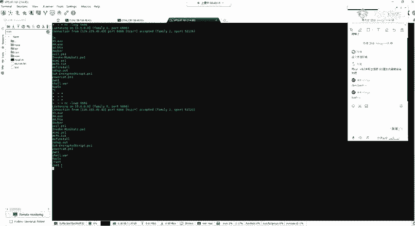

但是的话呃这这里的话是解决了。一部分。对吧因为我们在这边的话，我们想要实现的话是我在我控制端上面，我去输入指令。然后的话。

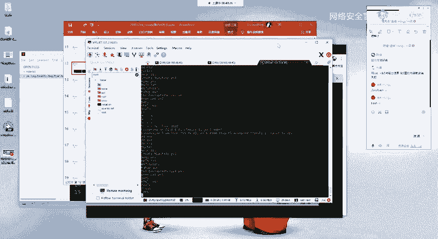

来在这边执行之后返回结果。我现在的话只是实现了，就是说我在这边。在他的这边，我输入的这样子的一个结果，能够去重建向到我这边的一个控制端，对吧？这是第一部分。

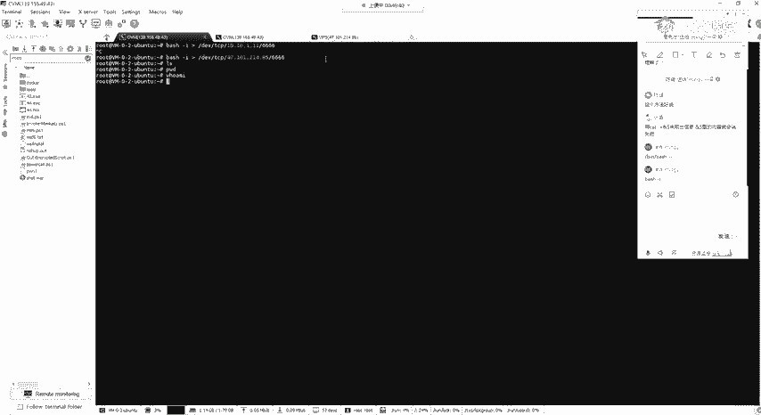

然后的话我们还需要去实现。第二部分就是把控制端的一个输入。从定向到被控端的一个交互式的一个需要。也就是说我们把我们在控制端上面的一个输入，就是执行的一个命令嘛，对吧？然后通过这边的这一个通道。

这边的这个s连接来重电向到我这边的一个bech杠I。也就是这一个办喜环境嘛，然后的话在在这一个办喜环境上面去执行。

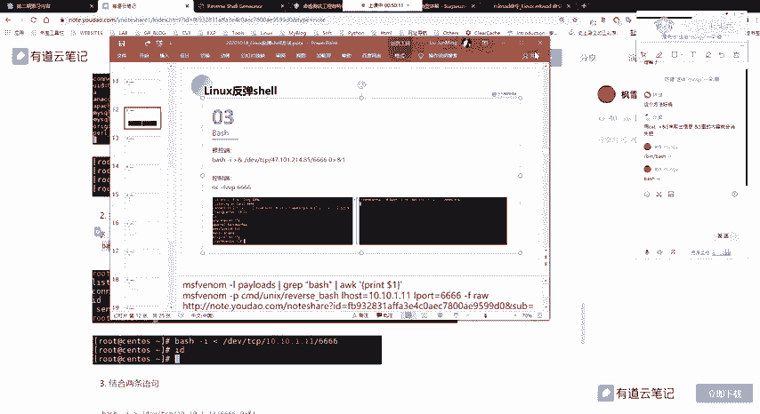

哦。同样的，我们执行一下这个。看一下效果。随先的话，我这边呃建立一个监听，对吧？然后的话我这边执行。执行之后的话，其实在这边呃这边IP又写错了。我在这边执行之后对吧？执行之后的话，建立了一个连接。

也就是建历了这个s的一个连接，对吧？建历这一个连接之后的话，我们在这边去执行一个命令。比如说我这边执行L。对吧之前这个LOS之后的话。我在控制端执行L之后的话。

它会把它的1个L的一个值通过这边的这个通道，对吧？然后的话重定向到了我这边的这个被控这个被控端上面的这个bech杠I。然后的话在这一个拜喜杠A下面就是在这边执行，对吧？执行之后的话。

返回了这样子的一个结果是吧？然后这这里的话这一个命令的话就实现了我通过我在控制端的一个输入，把它重定向到了我的一个被控端上面去进行一个执行的一个功能，对吧？

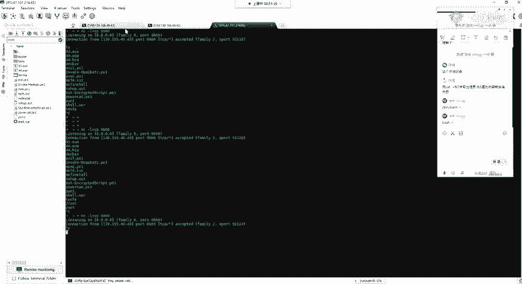

那么。这是第二步。第三步的话，其实我们这边这两步的话，其实就是把我们的一个功能就已经实现了，对吧？我。实现了这样子的一个交互式的一个需有的一个功能。那么我们只需要把这两条命令做一个整合。

就是把它整合成我们的一个语句。就是因为我们知道我们有说了，就是说这边的这一个s的一个连接，其实是我们可以通过啊通过对这个连接去进行一个输入以及输出的对吧？我们可以从这个连接当中去。传输我们的一个命令。

传输到这边，然后的话给到控制端的这个ba杠A。呃，给到被控端的一个伴去执行之后的话，把结果通过这个连接，通过这个缩索的连接再呃传递给我们的一个控制端，对吧？然，我们结合这两条语句的话，就是像这样子。

这样子的这一条鱼的话呃跟前面的话有什么区别呢？就是这一条语句的话就是。呃，把从这边的这一个s连接的一个数据作为我们这边的一个ba guy的一个输入。就是。呃，这边应该是先从这边来。

就是我这边的这一个连接。从这个连接当中的话，我能够去得到它的这样子的一个书。呃，从我的一个控制端。

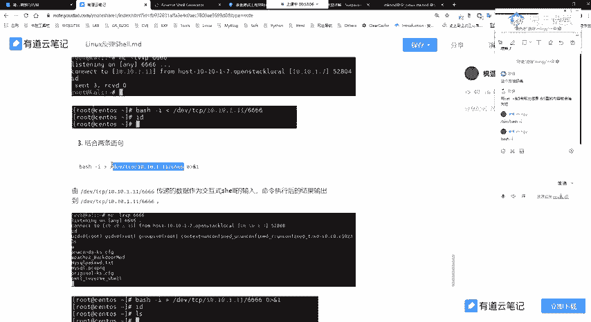

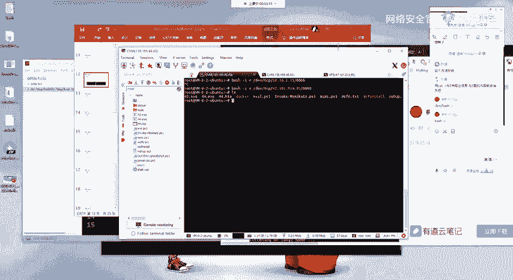

呃，就是这边。

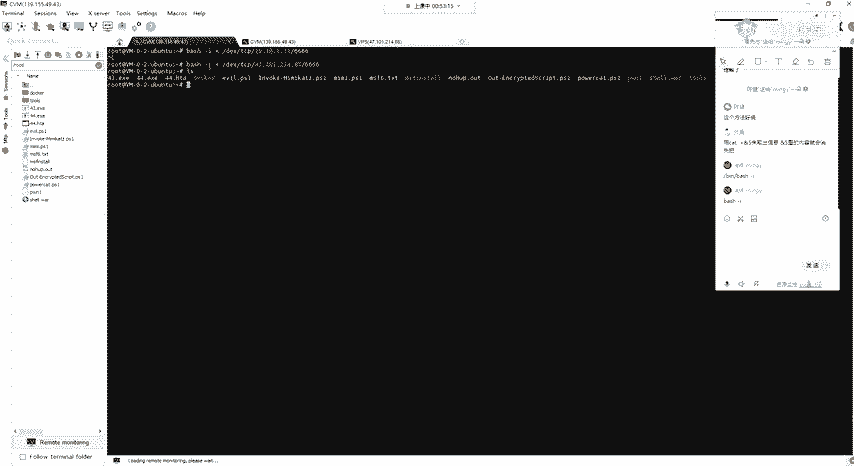

就我这边我输入的这个L的话，L的话，它会到这边来，对吧？到这边来的话，它其实是会在我们的一个被控端上面的话，就是作为一个标准的一个输入，对吧？就是表这边的一个零的话，就是表示我们的一个标准的一个输入嘛。

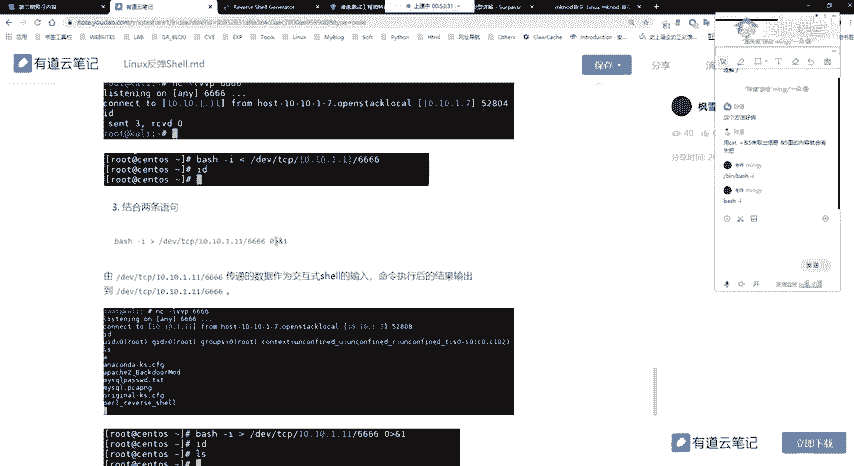

我们可以在这边看到对吧？他在这边的话作为了一个标准的一个输入，就是L嘛。

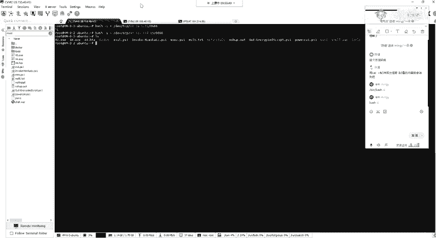

那然后的话在这边的一个标准的一个输入的话，它重定向到了我们这边的一个呃标准的一个输出。也就是说把这边的。呃，L这个命令它执行之后。执行之后的一个结果的话，它会呃。输出到我们这边的这样子的一个。呃，连接。

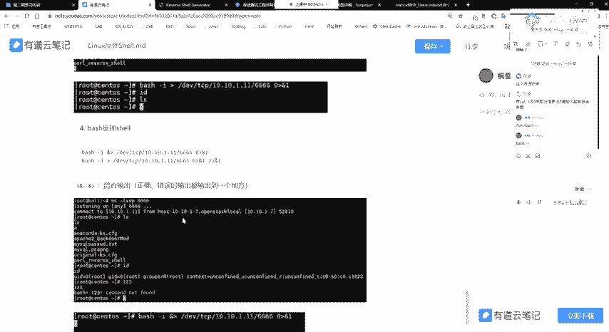

我们来实际看一下吧。

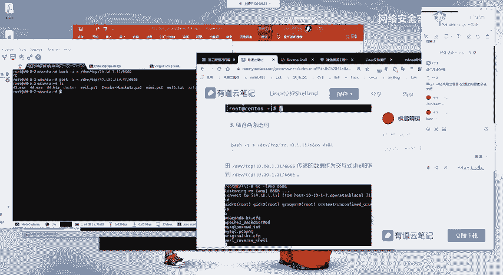

变行。你看那我在这边执行之后，对吧？执行之后的话，我在这边执行L对吧？执行L之后的话，它在这边的一个结果就返回给了。啊他到了我这边对吧？就其实等于就是把我这边上面的这两个。上面的这两条命令做了一个整合。

我在这边输入输入之后的话，它在这边的这个b杠I执行，对吧？在这个bs杠I执行之后的话，他把执行之后的一个结果再通过这个锁索的连接来进行一个输出。嗯。对吧，其实在这边的话就是把这边的这一个标准的一个输入。

呃。其实它在这边有两层啊，就是相当于就是你在这边你把我的一个命令传给了他，对吧？然后在这边执行执行之后的一个结果的话，其实就是在这边这个连接，它同样的会通过这个连接嘛，然后的话输出来。输出来的话。

其实就是这边的一个标准的一个输入嘛。然后的话标准的一个输入的话。把它从定向到标准的一个输出。那么其其实就是在这边的话，就是这边的这一个输出。然后呃我们在这边的话就实现了这样子的一个。

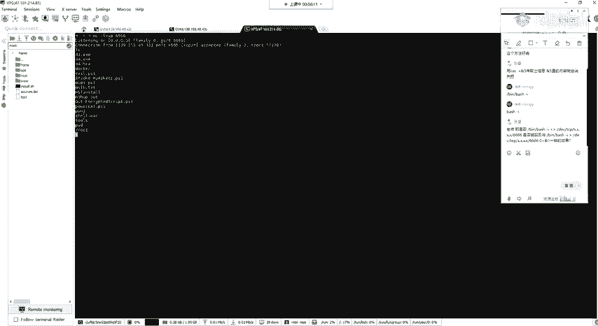

效果但是在这边的话，这边的话不是还不是一个完整的一个命令。就是他还是他会有这样子的一个。小问题。

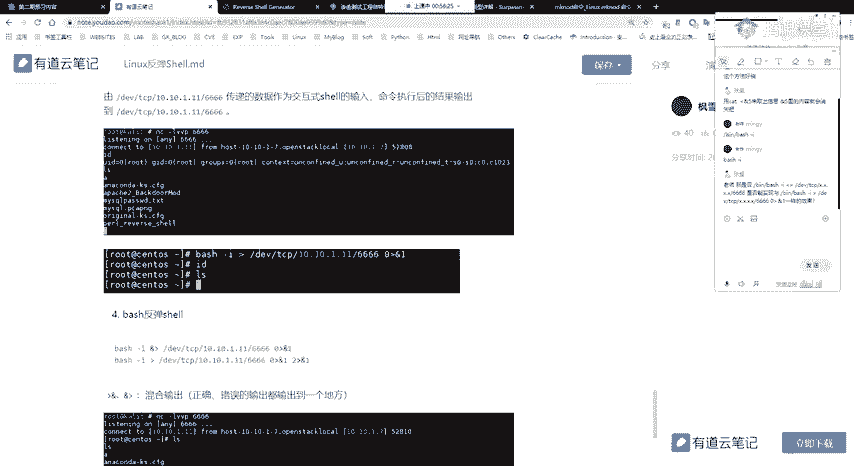

就是我在这边对吧？我在这边我执行的，比如说我执行换卖。我咨询换卖之后的话，他在这边他。的一个被控端上面，它同样的会有这样子的一个换卖的一个输出。对吧就是因为我们这边的话是通过这一个连接。

把我这边的这个连接当中的这一个命令作为了它的这边的一个标准的一个输入，对吧？就输入之后的话，它在这边执行之后的一个结果的话，再作为一个标准的一个输出。通过这一个连接传递给了我们这边的这里。

传到了这里对吧？

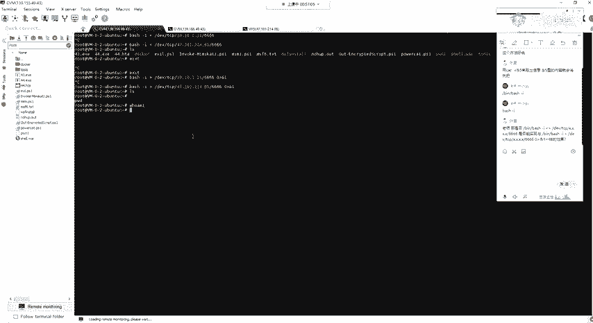

然后在这边的话，我们可以通过这样子的一个方法，就是最后的一个最后的一个那个完成完全的一个完整的一个命令。就是在这边的话，我们需要去了解到这这边的这两个呃。符号的一个表示就是大于N的一N的大于。

这个符号的表示的话，它的一个意思都是这一个都是混合输出，也就是正确，还有错误的一个输出，它都输出到一个地方。就我们在这边的话可以通过就是。就把这边伴洗杠I之后的这样子的一个混正确的以及错误的一个输出。

它都输出到了这边。输出到这个链接当中。

然后这一个的话其实就是我们。最终的这样子的一个。访他需尔的一个秘令。Yeah。

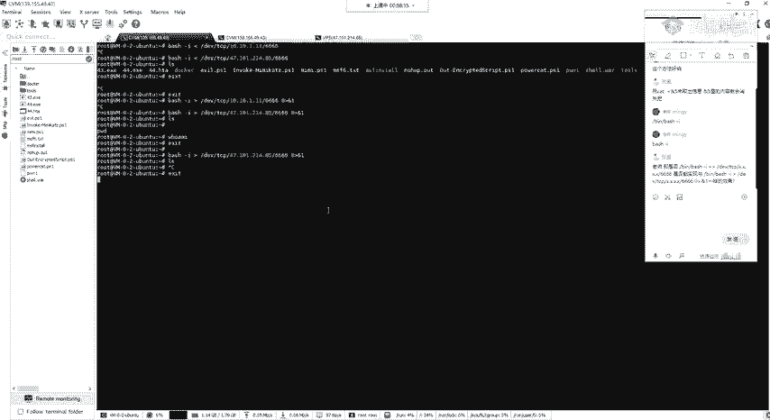

这边命令没没复制成功。

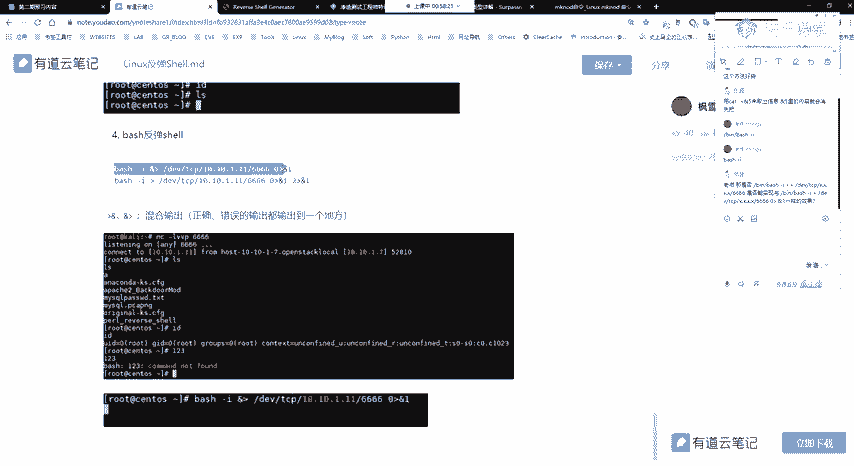

没问题。执行执行之后的话，就得到了这样子的一个be喜的一个线，对吧？然后其实就相当于就是我在比如说我这边的话是一个。这边是一个正确的一个标准的一个输出啊，不输入对吧？然后的话标准的输出。

以及在这边我的一个就是随便输入的一个错误的一个命令，对吧？在以这边的话，它就返回了它的一个标准的一个错误输出，也就是错误的一个结果。它同样的呃也返回给了我们，就是一个呃完整的这样子的一个交互式的一个选。

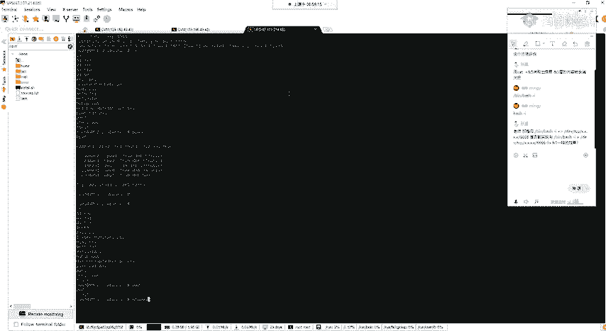

以及还有的话还有一种写法的话就是像这样子，就这样子的这种的话就可能会更加好理解一点。就在这边的话呃，我们就是把其实就是要去做一个混合的一个输出嘛。

就是把正确的错误的一个输出都输出到我们的一个标准的一个呃输出嘛，对吧？所有的话在这边我们的一个就是错误的一个输出也同样的输出到了一个标准的一个输出。就是加了这个嘛。

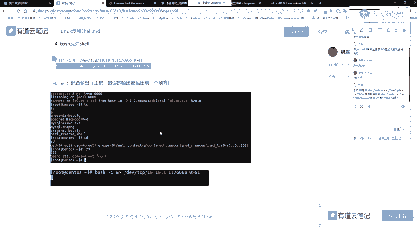

然后就是实现了我们最最终的这样子的一个bss下面的一个访纳需尔的一个命令。

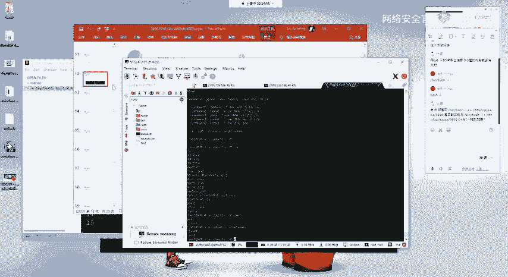

就是这一个我们常用的这样子一个仿程渲的一个命。嗯。😊，呃，这个的话你试一下吧，好吧，你自己去试一下吧。我这边号。我这个的话我就不试了，你因为像这种的话，你自己拿两台机器，你自己这样子尝试就可以了嘛。

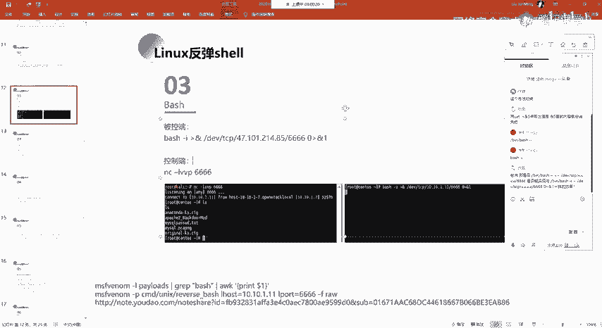

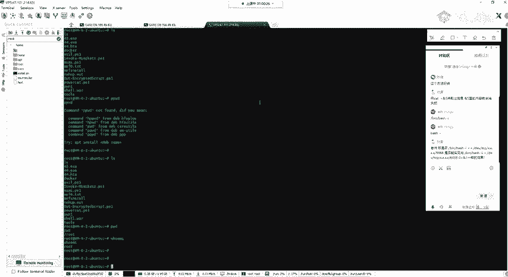

但是你要去。我这边给大家讲这个的话，其实就是要让你去理解。我们首先第一点。首先第一点就是。首先第一点的话就是呃。一个就是一个交互式的一个器。交互。Yeah。一个江互色的需要是怎样的？嗯，我这边发群里吧。

对，一个交互式的shall，它是怎样的？就是我们一个交付式的一个shaar，它是。呃，我们要把我们自己的一个输入，对吧？把我们自己的一个输入在我们的一个被控端上面执行，然后的话返回结果输入。

然后返回结果。是吧。然后第二个的话就是我们如何去实现这样子的一个交互式的一个需就是。如何去把我们的一个输入？就实现。江不士。需要。就是把首先第二个话就是把我们的。收入。就是从面向到。

标准的从面向到我们的一个呃。呃，被控端。The flash。下。对吧。然后第三个的话就是。就把就是。被控端。把被控端下执行的。结果。我定向到。我们的一个控制端。其实就是这样子的一个流程。

然后具体的一个实现的话，我在这边的话应该给大家讲的很清楚了吧。就是其实今天的一个主要的一个内容也是这边啊，就就是大家把我这边的这个笔记自己好好的去看一下，理解一下。就是呃在这边的话，我花了挺多的时间。

就是力求给大家讲戏，然后让大家能够理解。呃，然后其实主要的话就是lin令下面的话，就常用的其实就这一些命令嘛，对吧？这一些命令。然后的话像在这边的话，这边有一个这样子的一个网站。

这个网站下面的话有比如是NC啊，不是。像半喜对吧？半喜的这种，像第一个第一个的话，这一个话就是其实就是我们这边讲的嘛。然后第二个的话，这种这种的话其实就是一个病体嘛，就是它并了一下。

然后的话它同样的就是有用到我们这边的一个文件描述符，对吧？也就是我们你理解了我们这边的我本节课所讲的这个文件描述符的话，那么你就能够去理解到它这一个语句，它的一个它是怎么去写的，以及它的一个作用。呃。

还有看一下。啊，他这边的话就就就这个。就这一些。呃，其实啊还有我PPT里面的对吧？PPT里面的这一个这个也给大家详细讲了，其实也是就是重定向。然后的话文件描述符对吧？

以及这边的一个reader的一个就是输入的一个重电下。嗯。然后呃后面的话还有一部分的一个内容，其实后面的这一部分内容的话，其实。啊。大家看一下应该就会了。就是都是比较怎么说呢？

都是就是一些脚本脚本脚本方面的这样子的一些东西啊。就。就是不比我们在这边讲的半喜拜喜这边的话，你需要就是了解，就是了解你linux下面的这样子的一个就这种。呃，输入输出重定向的这样子的一个概念。

以及它的一个操作，对吧？然然后后面的这一些的话，像peerPthon，还有呃PHPI这一些reby这样子的一个脚本语言的这样子的一个呃方法的话，就是你需要去了解，就是说它的这个脚本语言的一个一个。

一些就是写法吧。然，其实这一些的话，你也不也不需要说你要去使记硬背什么的。你直接就是你知道这个东西，然后你直接用就OK了，对吧？然后其实像这种像这种脚本的这种写法的话，其实我们也能够从从中找到。

就是说跟我们前面讲的一些共性。呃，我这边的话大概的说一下吧，就是就比如说以这个P尔是吧？这个P尔这边杠一的话，杠一的话应该其实前面有讲，对吧？杠一后面的话我们可以执行P尔的一个代码。就是其实就是这一串。

就执前我们的一个pere这个脚本的代码。然后U的说ken的话就是使用这样子的一个sstruct的一个这样子的一个呃模块，或者说库。啊，就其实跟python也是比较像的嘛。

因为其实都是这样子的一个脚本语言。然后这边的话就是一个变量。负得一个值的话，就是这边的1个IP。以及一个端口对吧？然后的话调用这样子那个sctor的这样子的一个方法。当然的话。

关于具体的这样子的一个实现的话，这边的话我就不多说呀。就是这个的话，因为你每个语言的话，它的这样子的s的一个实现的话，呃，就写法的话有相应的一个区别啊。

但是它的一个原理的话都是建立这样子的一个st的一个连接。对吧建立了这样子的个s连接之后的话，就是在这边连接到了我们这边的1个IP及端口，对吧？

然后的话它在这边它会有我们可以看到在这边有standing in，然后standing out，还有standing error，对吧？这个这个的话我们就我前面讲了的话，大家看到这个应该就比较眼熟了吧。

对吧？然后像在这边的话，就是呃。这个S。andS这个是呃在这边。就这边我们这边建立的一个s连接的话，其实是这个S，对吧？我们呃。这里这里我们连尽力就connect，连接了这边的1个IP及端口，对吧？

连接之后的话，它会有给给你这样子的一个S。这个S的话，其实我们可以看到andS，就其实也类似于我们linux下面的这样子的一个文件描述服务，对吧？我们可以通过这样子的一个方法去调用它，然后的话重定向嘛。

对吧？就把我们的一个标准的一个输入以及标准的输出以及标准的错误输出都重定向到了这样子的一个连接当中，对吧？然后的话我们的就是说我们的这样子的一个输入输出以及执行的一个结果。

都是在这个连接当中去进行一个传递，对吧？然后以及最后的这边的EXEC并SH的话，就是进入到这样子的一个BSH的一个需尔的一个环境嘛，对吧？因为我们要去把我们的一个输入，把我们的一个输入。

我们输入的一个命令，通过这个连接，对吧？传递过来之后的话，它需要在这样子一个需尔环境下面执行。执行之后，它的一个标准的一个输出。然后让然后的话再传递，再通过这一个连s连接，传递给我们的一个呃控制端。

对吧？以及标准的一个错误输出。然后呃还有的话python的话，python的话也其实也是类似的对吧？它同样的是调用的这样说酷。这个s库，然后的话呃尽量这样子s的一个连接。是吧。然后在这边的话。

我们可以看到有这样子的012，对吧？我们的一个文件描述符嘛。以及在这边的话，用subber process就创经历了这样子的一个需要嘛。BSH的一个需要是吧？呃，还有的话就是。呃。

python这边的话就是我这边PP的话也给了一个这个就是这个we deliverver，就其实。呃，前面讲问的下面的访弹西尔的时候也有就使用这一个嘛，对吧？web delivery去访他西尔。

然后在这边的话，我们可以也可以通过它的这个来去生成一个这样子的一个python的一个代码。其实就是也是一个访谈西尔的一个代码嘛，对吧？然后他这边的话不一样的一个地方，就是他这边用。啊。

用UURop嘛来去请求这边它的就我们的1个VPS上面，我这边MSF服务器上面它会有这样子的一个workb服务的这一个文件，它会去请求这个文件。然后的话请求他这个文件里面的一个内容他要去执行嘛，对吧？

就是阿点read的话，就是就是这边获取到的它的一个内容，他把它读取出来，然后的话执行执行它对吧？然后呃PHP的话，PHP的话也是啊也是一样的对吧？PHP的话就更加简单一点就是。

就是呃用了它的一个也是用的ser的一个。open嘛，对吧？就今天说的很连接。以及通过web deliverver。来去生成这样子的1个PHP的一个代码呀。这个的话也是一个反弹需要的一个代码。呃。

还有reby这个的话，reby这个的话呃，其实我这边的话都有给这样子的一个命令，这边的话应该是太长了。所以的话我没没我没有贴在这边，所以的话我就只贴了这样子的一个命令。就是我们可以通过。

就是在这边我都有给这样这样子的一个命令，对吧？我们都可以通过这样子的一个方法，就是首先这一个这一个命令话MSFV norm。呃。实际来看一下吧。我以这边。

MFVno杠L的话就是显示我们的就是比如说我们想要去查看我们的一个payload是吧？嗯。我们可以通过呃我这边过滤一下吧，还是。嗯是排load的啊排load写错了。我这边的话就是过滤呃。

过滤了是N net cat，也就是我们的NC的这样子的一个payload。然后的话这边AWK的话就是用它做了这样子的，就是只取只输出第一行嘛。啊不是呃啊对，就第一行嘛。因为我们如果你直接。呃。

直接显示配load的话，它会还会去显示这一个就是这个payload的，它相关的。像比如说它的一个使用的一个频率，对吧？以及它的一个描述等等这种多余的一个信息。我这边的话我不需要。

有的话可以通过这样子AWK只输出它的第一行，也就是它的一个payload的一个名字。然后我这边的话以这一个呃revis的netcast的。这个配load的文艺。

我们可以通过MSFVno去生成相应的这样子的一个把它需要的一个代码。嗯。嗯。这边只定这一个配load的，然后的话呃。然后呃在这边的话杠FIW话就是就是输出它的一个就是。呃。输出它的一个配load的呀。

然后在这边的话就是输出的是使用的NC的这样子的一个配load的。其实我们看到这一个的话，应该就大家听了我今天讲的一个内容的话，看到这种东西的话应该就了然于胸了吧。

啊就像这种配漏的。

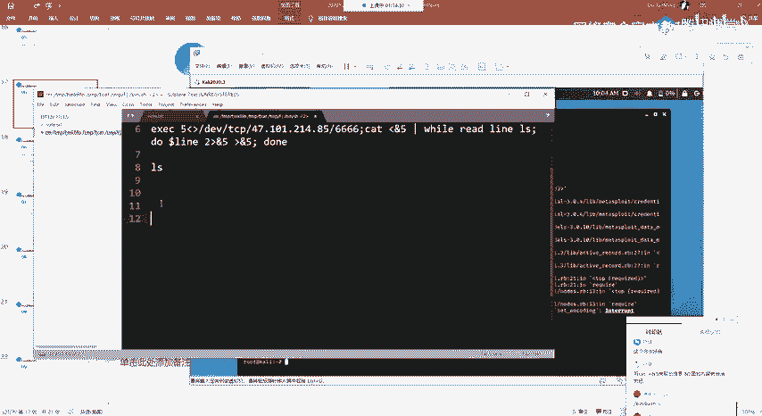

就像这种配肉的是吧？哦，复制出来复制出来的话，你看到这里的话，其实跟我们前面讲的都都一样了，对吧？没有什么太大区别。它同样的是用这一个make FFO创建了这样子的一个呃命名管道，对吧？

然后的话经历了一个连接。进行连接之后的话，它从这一个命名管道当中。他从这一个命名管道当中去读取，去作为一个输入，对吧？输入作为它的一个输出。然后其实就是它会输出到这边嘛，这边建立的这一个连接。

然后的话把它里面的一个内容的话做一个执行。呃 of。然后执行之后的话，它又呃从电向到这一个命名管道这个文件，对吧？以及把错误的一个输出也做一个啊就是标准的一个输出。

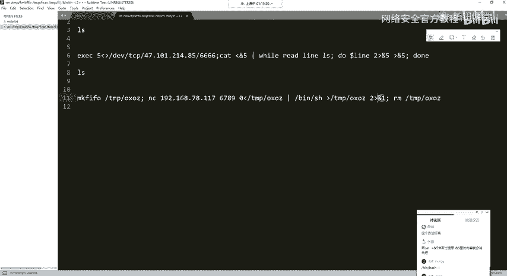

然后其实跟前面的话稍微就是写法稍微有点不一样，但是原理都是一样的。同理的话还有其他的这些像PR这种，你都可以通过这个查找到相应的一个payload。然后的话你再通过这样子的一个方法。

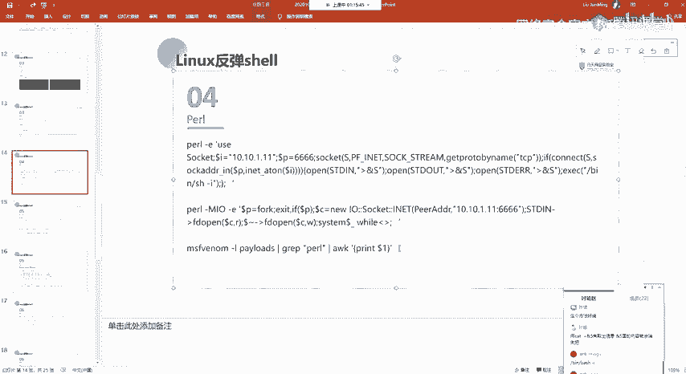

来去进行一个生层。这边生成的话就是杠F的话，指定的话，IW的话就是肉就是原始的这样子一个代码嘛。对吧就是你这边呃，因为这边的话就是1个NC的一个反特需尔的一个代码嘛，对吧？如果说就是说我们。

指定这一个法拉西尔的1个NC的代码。如果说我们指定生成EX1这种对吧？那么它就会把这样子的就是说它会是以这样子的1个NC的1个反拉西尔的一个方式，它会去生成这样子的一个可执行文件。

其实这种生这种的话都是。呃，原理都是类似的，然后这边的话直接输出IW的话，就是输出它的一个呃法兰西尔的一个源码。就原始的这样子的一个。那个嘛，然后还有就是还有其他的这一些，我就不一不一一的展示了。

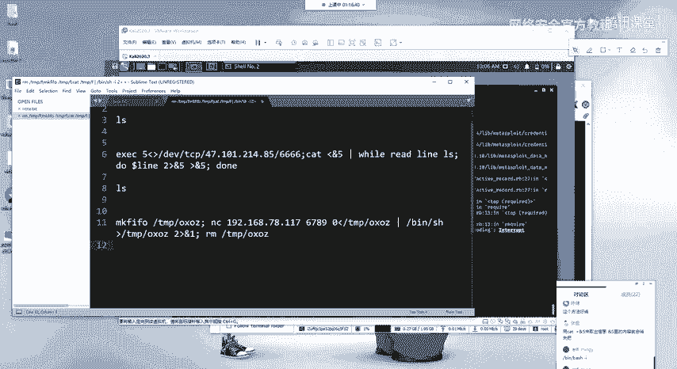

好吧，大家呃自己课后去尝试吧。就是主要的话重点还是去理解它的一个原理是吧？就然后的话你看到这种东西，你知你就知道他知道他大概是什么什么意思嘛，是吧？这至少这一点。啊，还有第八个的话，就是这个tnet。

呃，tllnet这个的话呃。其实也是比较类似的呀。就通过这样子的一个方法，就呃这边的话在攻击上面去监听这样子的两个端口。然后的话呃在目标机器上面执行这一个。执行的这一个的话。

其实就是他首先去连接我们这边的55的一个端口。然后的话从这个端口当中，其实呃。大家只需要就是记住，就是说你的这样子的一个交互式的一个需要的话，你需要去处理我们的一个就是处理我们的一个输入。

以及啊输入之后的话，在目标机上面去执行的一个结果的话，它需要能够返回给我们的一个控控制端。嗯。然呃。还有的话。另外的这样子的一一一些形式啊，就通过make note。这样子的一个方式。

当然的话在这边它同样的也有也有使用这样子的，就make note的这这个的话其实就跟前面是一样的。就他同他这边make note的话创建了这样子的两个呃快设备的一个文件嘛，就这一个A。

然后的话同样的有去使用这样子的一个重定下，对吧？就零1的这种标准的一个输入标准的一个输出这种文件描述符。所以在这边话我就不多说了呀。呃。第九个的话就是这个open SSSL。

open SSL的话就是我们可以用它。因为我们的这种open SSL的话，在令子里面的话，你有这种SSH的话，呃，一般的都会有这样子的一个。这样子的一个min令。

然后的话这个我们可以通过这个op佩SSO来去生成这样子的一个密钥。然后的话再去做这样子的一个反弹线。用oppoSSO呃，得了这个需要的话，因为我们知道SSO的话，它是一个就是呃加密的。

它的一个它的这种流量的话，它都是一个加密的一个形式，对吧？然后的话。它的这种加密的一个形式的话，那么就我们的数据的一个传递以及命令的一个交互，对吧？它都是它的这种流量，它都是一个加密的一个形式。

所以的话。能够达到一个隐蔽的一个效果。然后具体的一个方法，那就是像这样子。呃，这边的话我就不一一的操作，应该应该不用我。多做操作吧。不用我再操作了吧，这个的话呃把PPT发给大家，大家自己课后的话。

就照着我这边呃敲就可以了。啊后。关于这一命令的话，其实就是这oppo SSL这一个命令的一个使用啊。这个的话也没什么好说的吧。呃。

以及最后的话就是呃这个实验这同呃这个实验的话还是就是上节课的那个课后作业啊。然后的话呃我们这节课的一个课后作用的话，就是把大家自己。呃，好好的去理解一下我这边的我本节课所讲的一个内容。

其实重点的话我花了挺大大半的一个时间给大家介绍。就是说呃这边的。呃，linux下面的一个文件描述符，对吧？一切接文件以及我们的一个重定向管道，以及我们的一个输入输出的这样子的一个重定向。

因为呃这一些就是他的这样子的一个法兰 share尔的，它的一个其实原理以及本质的话，你需要去了解到我上面刚刚所讲的那些东西，是吧？其实你了解的那些东西的话，你再去看这些的话，你会你就会能够去。呃。

就是一目了然吧，或者说了然于胸，对吧？我知道我知道他的这个命令，他有他的这样子的一个数据，他是怎么去进行一个传递的，对吧？以及我的一个交互式的一个需要，它是怎么去实现的对吧？好了。

以上的话就是我们本节课的一个内容啊。呃，大家有没有什么问题？有问题的话，大家呃直接提。或者说呃我哪里没有讲明白呀，以及嗯讲的哪里有有问题什么的，大家都可以直接指出吧。M。呃，有问题的呃。

没问题的给我送朵花，有问题的直接提。有问题的扣一，没问题的送花吧。嗯。你这发个表情是什么意思呢？这是没问题吗？就就就三位同学吗？四位。这现在还有20位呃，怎么怎么现在听课的，是因为讲的时间太长了吗？

因为有事还是怎么的？不是有20多位同学吗？怎么现在听课的越来越少了呀？是因为我讲的。讲的不太好还是怎么的？就是如果大家觉得我讲的哪里不好什么的，你可以提呀，你可以你可以给我提意见嘛，是吧？

或者你直接说你直接说也行。你私聊我也行吗？原理有点湖吗？那我建议你呃。你在。你就是你看我的回放，你看我的回放，然后的话你再实际的去进行一个操作，好吧。然后如果你还是。还是不太理解的话。

以及其实我这边的这一个文章其实应该写的很详细了呀。然后你自己你再去做相应的一个操作。应该应该会能够去理解的呀。应该是说当然的话你就是你因为你刚开始。刚开始了解这一个的话，其实。呃。怎么说呢？

就是印象不是很清楚的话，其实正常。因为这一个东西的话，其实。因为你要去理解你要去理解。比如说我这边讲的这种。文件描述符对吧？这种东西的话，你自己你不去你自己不去在linux系统上面你去操作的话。

你你只看这一个命令，你你是完全感受不到的它的这种效果的对吧？也其实也包括我前面前面PPT里面的一个内容，这些内容其实都是就是应该也算是干货吧，对吧？就是但是这种东西的话，你自己你不去。

实际的去操作去敲的话，你永远感受不到它的这样子的一个效果，以及你不会对它有一个呃直观的一个印象。就是你看我讲完之后的话，你你过过一会儿你又忘了真的。嗯。原理的话。看一下我看我这个吧，看我这个。

然后的话自己操作一下。好吧，以及我回放的话，好不好，我的那个就直播回放的话，你认真去看一下，听一下吧。好吧，就跟着我的那个思路。走一走一下。然后呃有问题的话，私呃私聊或者群里群里问嘛。好。

我应该应该都没有什么问题吧。但是这2121个人，只有这几个人那个吗？其他的没没表态的，是不是？有问题啊。反正还是那还是那句话吧，你有问题的话，你还是就直接说出来，你直接问对吧？你直接问出来的话。

你多问点问题，其实对你自己学这种东西会很好啊。当然的话你问的问题就是可可能有时候因为怎么说呢？这东西的话，每个人都有就是怎么说呢有这种知识的一个盲区吧。就是你可能没有说去会关注到这一点。

就像呃就是上节课上节课的那个。那个东西其实呃那个我还没去看啊，就是那个确实是呃我没有去关注那个东西。所以的话你可能问我这个问题，我一时半会可能没有给你解答。这个的话呃。我只能说我就是在课后对吧。

我课后的话，我建力去就是说。去把这个东西是一个什么东西，然后的话。把它呃搞懂之后的话，我再跟你说，好吧。因为呃不可能说什么人就不可能说所有的东西都懂吧，是吧？总有。没有去关注的，或者是说不知道的一个点。

好吧。呃，没有其他的话，呃，也不跟大家多说了，就不跟不有点就是。后面的话又跟大家闲聊了一下是吧？

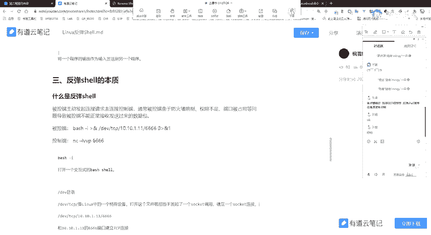

没其他的问题的话，那我们下课吧，大家早点休息。